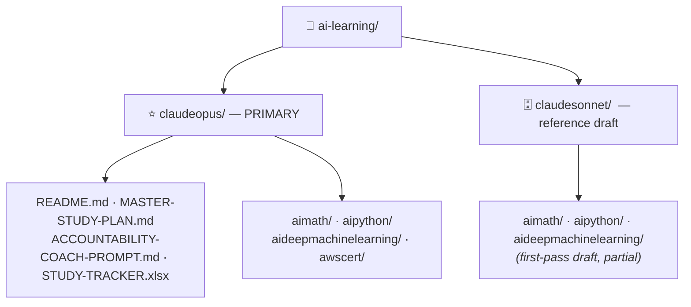

# 🧠 AI Engineering & ML Mastery — Knowledge Base

*A 5-month, self-paced curriculum covering AI/ML/Deep Learning, the foundational math, Python for AI, and the AWS Developer + Architect certifications.*

This root folder contains **two parallel copies** of the curriculum. Start with **`claudeopus/`** — it is the primary, polished deliverable.

---

## ⭐ `claudeopus/` — use this one

The complete, premium curriculum, authored with **Claude Opus 4.8 at high effort**. Every document uses LaTeX math, Mermaid diagrams, collapsible self-quizzes, worked exercises, cheat sheets, and curated free/paid resources.

| Start here | What it is |
|---|---|
| **[claudeopus/README.md](claudeopus/README.md)** | The full curriculum index + learning roadmap |
| **[claudeopus/MASTER-STUDY-PLAN.md](claudeopus/MASTER-STUDY-PLAN.md)** | The 20-week, 6-day/week day-by-day plan |
| **[claudeopus/ACCOUNTABILITY-COACH-PROMPT.md](claudeopus/ACCOUNTABILITY-COACH-PROMPT.md)** | Paste-into-Claude prompts to make Claude your strict study coach |
| **claudeopus/STUDY-TRACKER.xlsx** | Daily tracker with live progress dashboard, milestones, exam-score logs |

**Contents:** 23 tutorials across `aimath/` (4), `aipython/` (6), `aideepmachinelearning/` (9), `awscert/` (4), plus the 3 docs and the tracker above — **~1.4 MB of material.**

---

## 🗄️ `claudesonnet/` — reference draft (kept for comparison)

The earlier first pass, authored with **Claude Sonnet**. Kept so you can compare styles. It is intentionally **not the version to study from**, and it is **partial**:

- Contains **15 tutorials** (`aimath/` 01–03, `aipython/` 01, 04, 06, `aideepmachinelearning/` 01–09).
- Has **no `awscert/`** (that pass was stopped before the AWS section).
- The 4 topics `aimath/04`, `aipython/02`, `aipython/03`, `aipython/05` exist **only in `claudeopus/`** (their drafts were superseded before this split).

> 💡 **Tip:** If you ever want a second explanation of a topic that exists in both folders, the Sonnet version is a useful alternate phrasing — but treat `claudeopus/` as the source of truth.

---

## 🚀 How to begin

1. Open **[claudeopus/README.md](claudeopus/README.md)** and skim the roadmap.
2. Open **claudeopus/STUDY-TRACKER.xlsx** and read the Dashboard tab.
3. Open **[claudeopus/MASTER-STUDY-PLAN.md](claudeopus/MASTER-STUDY-PLAN.md)** and start **Week 1, Day 1**.
4. In your personal Claude account, paste the coach prompt from **[claudeopus/ACCOUNTABILITY-COACH-PROMPT.md](claudeopus/ACCOUNTABILITY-COACH-PROMPT.md)** and do your first weekly check-in.

> 🎯 **Goal:** In 5 months — proficient in AI/ML/DL, solid on the math, expert-level Python for AI, and both the AWS **Developer (DVA-C02)** and **Solutions Architect (SAA-C03)** certifications.
