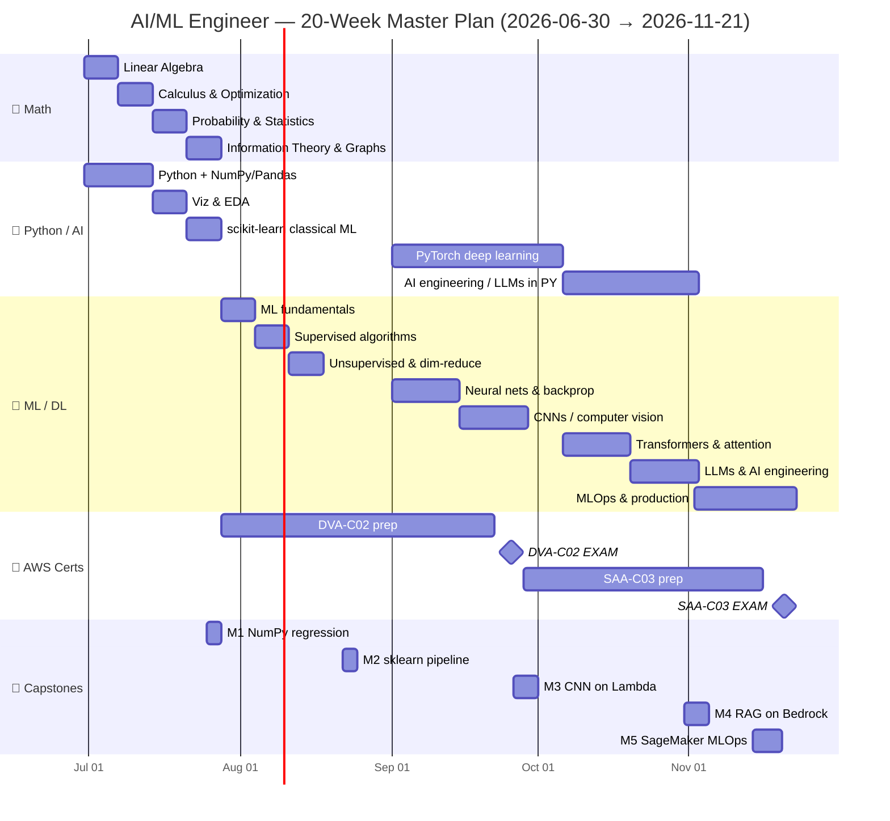

# 🎯 MASTER STUDY PLAN — From Senior Engineer to AI/ML Engineer

> **The single source of truth for the next 5 months.**
> 20 weeks · 6 study days/week (Mon–Sat) · ~3.5 hrs/day · Sunday = rest + light review.
> **Start:** Tuesday, 2026-06-30 · **Finish:** ~mid-to-late November 2026.
> Two certifications earned, five capstone projects shipped, real ML/DL depth built.

> [!IMPORTANT]
> You are already a strong software engineer with real AWS exposure. This plan does **not** baby you on AWS basics — it pushes you faster there and spends the saved time on the parts that are genuinely hard for working engineers: **the math, the deep-learning intuition, and the from-scratch implementations.** Respect the math weeks. They are where the leverage is.

---

## 📊 Progress Dashboard

Check a month off only when its **key deliverable** is shipped and its capstone passes acceptance criteria.

| ✅ | Month | Weeks | Theme | Key Deliverable |
|----|-------|-------|-------|-----------------|
| [ ] | **M1** | 1–4 | 🧮 Math foundations + 🐍 Python-for-AI (parallel) | Linear regression **from scratch** in NumPy + gradient descent that converges |
| [ ] | **M2** | 5–8 | 🤖 ML fundamentals + supervised/unsupervised + begin **DVA-C02** | End-to-end scikit-learn classification pipeline (≥0.85 F1, cross-validated) |
| [ ] | **M3** | 9–13 | 🧠 Deep learning + CNNs · 🏅 **Sit AWS DVA-C02 (~Wk 13)** | CNN transfer-learning classifier **deployed to AWS Lambda** behind an API |
| [ ] | **M4** | 14–17 | 🔮 Transformers + LLMs + AI engineering · begin **SAA-C03** | RAG chatbot on **AWS Bedrock** + vector store, with eval harness |
| [ ] | **M5** | 18–20 | 🚀 Advanced AI engineering + MLOps · 🏅 **Sit AWS SAA-C03 (~Wk 20)** | Full **SageMaker MLOps pipeline** with monitoring + capstone demo |

### Overall progress checklist

- [ ] **Foundations locked** — I can do matrix calculus and explain gradient descent without notes (end Wk 4)
- [ ] **Classical ML fluent** — I can frame any tabular problem, pick a model, and validate it honestly (end Wk 8)
- [ ] **🏅 AWS Developer Associate (DVA-C02) PASSED** (~Wk 13)
- [ ] **Deep learning real** — I built and trained a CNN, understand backprop end-to-end (end Wk 13)
- [ ] **Transformers + LLMs** — I can explain attention and ship a RAG system (end Wk 17)
- [ ] **🏅 AWS Solutions Architect Associate (SAA-C03) PASSED** (~Wk 20)
- [ ] **MLOps competent** — I deployed a monitored pipeline on SageMaker (end Wk 20)
- [ ] **5 capstones shipped** to a public GitHub portfolio
- [ ] **Spaced-repetition deck** maintained the whole way (≥600 cards)

---

## 🗓️ The 5-Month Roadmap (Gantt)



> [!NOTE]
> **How to read this:** Math and Python run **in parallel** from day one — Python is how you *make the math real*. ML/DL begins once foundations are solid (Wk 5). AWS prep is woven in across mornings on certain days so it never collides with the hard math. The two ⬥ milestones are your exam dates: **DVA-C02 ≈ Wk 13** and **SAA-C03 ≈ Wk 20**.

---

## 🧱 The 5-Month Structure

### 🧮 Month 1 — Weeks 1–4 · Math Foundations + Python-for-AI (parallel)
Build the bedrock. Every morning is math; every evening is Python that *implements* that morning's math. You finish able to do matrix calculus, derive gradient descent, and reason about probability — and you've shipped a linear regression from scratch.

- **Math:** `aimath/01-linear-algebra.md` → `02-calculus-optimization.md` → `03-probability-statistics.md` → `04-information-theory-graphs.md`
- **Python:** `aipython/01-python-foundations-for-ai.md` → `02-numpy-pandas-data.md` → `03-visualization-eda.md`
- **Capstone M1:** Linear regression from scratch (NumPy).

### 🤖 Month 2 — Weeks 5–8 · ML Fundamentals + Supervised/Unsupervised + begin DVA-C02
Turn math into modeling judgment. Learn the ML workflow, the bias/variance tradeoff, the major supervised and unsupervised algorithms, and *honest* validation. AWS Developer prep starts here in light morning slices.

- **ML/DL:** `aideepmachinelearning/01-ml-fundamentals.md` → `02-supervised-learning-algorithms.md` → `03-unsupervised-dimensionality-reduction.md`
- **Python:** `aipython/04-scikit-learn-classical-ml.md`
- **AWS:** `awscert/` DVA-C02 modules (compute, storage, IAM, Lambda, DynamoDB, API GW).
- **Capstone M2:** End-to-end scikit-learn classification pipeline.

### 🧠 Month 3 — Weeks 9–13 · Deep Learning + CNNs · 🏅 sit DVA-C02 (~Wk 13)
Go deep. Build neural networks, understand backprop by deriving it, train CNNs, and learn transfer learning. Finish DVA-C02 prep and **take the exam around Week 13**.

- **ML/DL:** `aideepmachinelearning/04-deep-learning-neural-networks.md` → `05-cnns-computer-vision.md`
- **Python:** `aipython/05-pytorch-deep-learning.md`
- **AWS:** finish `awscert/` DVA-C02, then practice exams to 85%+.
- **Capstone M3:** CNN transfer-learning classifier deployed to **AWS Lambda**.

### 🔮 Month 4 — Weeks 14–17 · Transformers + LLMs + AI Engineering · begin SAA-C03
The modern stack. Attention from scratch, transformer architecture, LLM behavior, RAG, prompting, and production AI engineering. Start Solutions Architect prep.

- **ML/DL:** `aideepmachinelearning/06-transformers-attention-llms.md` → `07-ai-engineering-production.md`
- **Python:** `aipython/06-ai-engineering-llms-python.md`
- **AWS:** `awscert/` SAA-C03 modules (VPC, well-architected, HA, decoupling, data).
- **Capstone M4:** RAG chatbot on **AWS Bedrock** + a vector store.

### 🚀 Month 5 — Weeks 18–20 · Advanced AI Engineering + MLOps · 🏅 sit SAA-C03 (~Wk 20)
Make it production-grade. MLOps, SageMaker, monitoring, drift, CI/CD for models. Finish SAA-C03 prep, **take the exam ~Week 20**, and demo your capstone.

- **ML/DL:** `aideepmachinelearning/07-ai-engineering-production.md` (deep dive) + optional `08-rnns-lstms-sequence-models.md` / `09-reinforcement-learning.md`
- **AWS:** SAA-C03 practice exams to 85%+, then exam.
- **Capstone M5:** Full **SageMaker MLOps** pipeline with monitoring.

---

## 📅 Week-by-Week — All 20 Weeks

> [!TIP]
> **Morning block = 2h** (theory + new topic). **Evening block = 1.5h** (coding/exercise + quiz). If you can only do one block on a given day, do the **evening coding** — implementation cements more than reading. The **Saturday milestone** is a hard gate: if you can't do it, you spend Sunday's light slot closing the gap, not moving on.

---

### 🧮 MONTH 1 — Math Foundations + Python-for-AI

#### Week 1 · Linear Algebra + Python setup (2026-06-30 → 2026-07-04)

| Day | 🌅 Morning (2h) — topic + resource | 🌙 Evening (1.5h) — code + quiz |
|-----|-----------------------------------|---------------------------------|
| Mon | Vectors, spaces, dot products — `aimath/01-linear-algebra.md` §1–2 + [3Blue1Brown EOLA Ch.1–2](https://www.youtube.com/playlist?list=PLZHQObOWTQDPD3MizzM2xVFitgF8hE_ab) | `aipython/01-python-foundations-for-ai.md` §1; set up venv + Jupyter; vector ops by hand in NumPy. Quiz: 5 dot-product Qs |
| Tue | Matrices, matmul, linear maps — `01-linear-algebra.md` §3 + 3B1B Ch.3–4 | `aipython/01-...md` §2 (functions, comprehensions); implement matmul without `@`. Quiz: shape-matching |
| Wed | Determinants, inverse, rank — `01-linear-algebra.md` §4 + 3B1B Ch.5–7 | `aipython/02-numpy-pandas-data.md` §1; `np.linalg` solve a 3×3 system. Quiz |
| Thu | Eigenvalues/eigenvectors — `01-linear-algebra.md` §5 + 3B1B Ch.13–14 | `02-numpy-pandas-data.md` §2; compute eigvecs, verify Av=λv. Quiz: 5 Qs |
| Fri | Norms, projections, orthogonality — `01-linear-algebra.md` §6 | `02-numpy-pandas-data.md` §3 (broadcasting); project a vector onto a subspace. Quiz |
| Sat | **Review + active recall:** blank-page redraw of all Wk1 concepts; [MML book](https://mml-book.github.io/) Ch.2 problems | Make 25 Anki cards from Wk1; redo 2 hardest quizzes |

> ✅ **Week 1 Milestone:** By Saturday I can, on a blank page, define a vector space, multiply matrices by hand, explain what an eigenvector *is* geometrically, and solve `Ax=b` in NumPy.

#### Week 2 · Calculus & Optimization (2026-07-06 → 2026-07-11)

| Day | 🌅 Morning (2h) — topic + resource | 🌙 Evening (1.5h) — code + quiz |
|-----|-----------------------------------|---------------------------------|
| Mon | Limits, derivatives, chain rule — `aimath/02-calculus-optimization.md` §1–2 + [3B1B Essence of Calculus](https://www.youtube.com/playlist?list=PLZHQObOWTQDMsr9K-rj53DwVRMYO3t5Yr) | `aipython/02-numpy-pandas-data.md` §4; numeric derivative `(f(x+h)-f(x))/h`. Quiz |
| Tue | Partial derivatives, gradients — `02-calculus-optimization.md` §3 | Implement gradient of `f(x,y)=x²+y²`; plot field. Quiz: 5 gradient Qs |
| Wed | Chain rule for vectors, Jacobians — `02-calculus-optimization.md` §4 | Hand-derive a 2-layer chain rule; verify numerically. Quiz |
| Thu | Gradient descent, learning rate — `02-calculus-optimization.md` §5 | Code GD on a quadratic; sweep learning rates, plot loss. Quiz |
| Fri | Convexity, local vs global, momentum — `02-calculus-optimization.md` §6 | Add momentum to your GD; compare convergence. Quiz: 5 Qs |
| Sat | **Review:** Khan Academy [Multivariable Calculus](https://www.khanacademy.org/math/multivariable-calculus) gradient problems | +25 Anki cards; re-derive backprop chain rule from memory |

> ✅ **Week 2 Milestone:** I can derive a gradient by hand, explain why GD moves opposite the gradient, and show on a plot how learning rate controls convergence/divergence.

#### Week 3 · Probability & Statistics (2026-07-13 → 2026-07-18)

| Day | 🌅 Morning (2h) — topic + resource | 🌙 Evening (1.5h) — code + quiz |
|-----|-----------------------------------|---------------------------------|
| Mon | Probability axioms, conditional, Bayes — `aimath/03-probability-statistics.md` §1–2 + [StatQuest Bayes](https://www.youtube.com/watch?v=9wCnvr7Xw4E) | `aipython/03-visualization-eda.md` §1; simulate Bayes with sampling. Quiz |
| Tue | Random variables, PMF/PDF, expectation — `03-probability-statistics.md` §3 | Sample distributions in NumPy; histogram them. Quiz: 5 Qs |
| Wed | Common distributions (Gaussian, Bernoulli, Binomial) — `03-...md` §4 | `03-visualization-eda.md` §2 (matplotlib); plot 4 distributions. Quiz |
| Thu | Variance, covariance, correlation — `03-...md` §5 | Compute a covariance matrix by hand + NumPy; verify. Quiz |
| Fri | MLE, sampling, CLT — `03-...md` §6 + [Seeing Theory](https://seeing-theory.brown.edu/) | Demonstrate CLT by averaging samples; plot convergence. Quiz: 5 Qs |
| Sat | **Review:** [StatQuest playlist](https://www.youtube.com/c/joshstarmer) — fundamentals; MML Ch.6 problems | +25 Anki cards; Feynman-explain MLE out loud, recorded |

> ✅ **Week 3 Milestone:** I can apply Bayes' rule to a real problem, explain MLE in plain English, and read/build a covariance matrix.

#### Week 4 · Information Theory + Graphs + 🚩 Capstone M1 (2026-07-20 → 2026-07-25)

| Day | 🌅 Morning (2h) — topic + resource | 🌙 Evening (1.5h) — code + quiz |
|-----|-----------------------------------|---------------------------------|
| Mon | Entropy, cross-entropy, KL divergence — `aimath/04-information-theory-graphs.md` §1–2 | `aipython/03-visualization-eda.md` §3; compute entropy of a dataset. Quiz |
| Tue | Cross-entropy as a loss — `04-...md` §3 | Implement cross-entropy loss in NumPy; compare to log-loss. Quiz |
| Wed | Graphs, adjacency, basics for GNNs — `04-...md` §4 | Build an adjacency matrix; BFS/DFS refresher. Quiz |
| Thu | **Capstone M1 build day 1:** derive normal equations + GD for linear regression | Code data loader + cost function (MSE) in pure NumPy |
| Fri | **Capstone M1 build day 2:** vectorize gradient descent | Train on a real dataset; plot loss curve; compare to `sklearn.LinearRegression` |
| Sat | **Capstone M1 polish + README + push to GitHub** | +25 Anki cards; write a 1-paragraph reflection on Month 1 |

> ✅ **Week 4 Milestone:** 🏆 **Capstone M1 done** — a from-scratch NumPy linear regression whose weights match scikit-learn within tolerance, with a converging loss curve, on GitHub.

---

### 🤖 MONTH 2 — ML Fundamentals + begin DVA-C02

#### Week 5 · ML Fundamentals + DVA-C02 kickoff (2026-07-27 → 2026-08-01)

| Day | 🌅 Morning (2h) — topic + resource | 🌙 Evening (1.5h) — code + quiz |
|-----|-----------------------------------|---------------------------------|
| Mon | What is ML, the workflow, train/val/test — `aideepmachinelearning/01-ml-fundamentals.md` §1–2 | `aipython/04-scikit-learn-classical-ml.md` §1; load + split a dataset properly. Quiz |
| Tue | Bias/variance, over/underfitting — `01-ml-fundamentals.md` §3 + [CS229 Notes](https://cs229.stanford.edu/main_notes.pdf) | Plot learning curves; reproduce overfitting on purpose. Quiz |
| Wed | Loss functions, metrics (accuracy, precision, recall, F1, ROC) — `01-ml-fundamentals.md` §4 | Compute all metrics from a confusion matrix by hand + sklearn. Quiz: 5 Qs |
| Thu | **AWS DVA-C02:** IAM, regions/AZs, EC2 basics — [Stephane Maarek DVA course](https://www.udemy.com/course/aws-certified-developer-associate-dva-c01/) §IAM/EC2 (skim — you know this) | [TutorialsDojo DVA cheat sheets](https://tutorialsdojo.com/aws-certified-developer-associate/) IAM/EC2; 10 practice Qs |
| Fri | **AWS DVA-C02:** S3 deep dive (versioning, encryption, lifecycle) — Maarek §S3 | TutorialsDojo S3 quiz, 15 Qs; note every gotcha |
| Sat | **Review:** [StatQuest ML](https://www.youtube.com/c/joshstarmer) bias/variance; redo metric quizzes | +25 Anki cards (ML + AWS S3); reflect on weak metrics |

> ✅ **Week 5 Milestone:** I can split data without leakage, explain bias/variance with a learning-curve plot, compute F1/ROC, and pass an S3 cheat-sheet quiz at 80%+.

#### Week 6 · Supervised Learning Algorithms (2026-08-03 → 2026-08-08)

| Day | 🌅 Morning (2h) — topic + resource | 🌙 Evening (1.5h) — code + quiz |
|-----|-----------------------------------|---------------------------------|
| Mon | Linear & logistic regression — `aideepmachinelearning/02-supervised-learning-algorithms.md` §1–2 | `aipython/04-scikit-learn-classical-ml.md` §2; fit logistic regression; interpret coefficients. Quiz |
| Tue | Regularization (L1/L2), feature scaling — `02-...md` §3 | Compare Ridge vs Lasso on noisy data; plot coefficients. Quiz |
| Wed | Decision trees + entropy/Gini — `02-...md` §4 | Train + visualize a tree; vary depth, watch overfitting. Quiz |
| Thu | Ensembles: random forests, gradient boosting — `02-...md` §5 | Compare RF vs XGBoost; feature importance. Quiz: 5 Qs |
| Fri | **AWS DVA-C02:** Lambda + API Gateway — Maarek §Lambda/API GW | [TutorialsDojo](https://tutorialsdojo.com/) Lambda quiz, 15 Qs; build a hello-world Lambda |
| Sat | **Review:** SVM intuition ([StatQuest SVM](https://www.youtube.com/watch?v=efR1C6CvhmE)); redo tree/ensemble quiz | +25 Anki cards; Feynman-explain boosting |

> ✅ **Week 6 Milestone:** I can choose between linear/tree/ensemble models for a problem and justify it, tune regularization, and deploy a trivial Lambda from the console + CLI.

#### Week 7 · Unsupervised + Dimensionality Reduction (2026-08-10 → 2026-08-15)

| Day | 🌅 Morning (2h) — topic + resource | 🌙 Evening (1.5h) — code + quiz |
|-----|-----------------------------------|---------------------------------|
| Mon | k-means, clustering metrics — `aideepmachinelearning/03-unsupervised-dimensionality-reduction.md` §1–2 | `aipython/04-scikit-learn-classical-ml.md` §3; cluster a dataset; elbow + silhouette. Quiz |
| Tue | Hierarchical + DBSCAN — `03-...md` §3 | Compare clustering algos on non-spherical data. Quiz |
| Wed | PCA (ties back to eigenvectors!) — `03-...md` §4 | Implement PCA from covariance eigvecs; verify vs sklearn. Quiz: 5 Qs |
| Thu | t-SNE / UMAP for visualization — `03-...md` §5 | Visualize MNIST in 2D with t-SNE. Quiz |
| Fri | **AWS DVA-C02:** DynamoDB (keys, indexes, capacity) — Maarek §DynamoDB | TutorialsDojo DynamoDB quiz, 15 Qs; create a table + query via CLI |
| Sat | **Review:** connect PCA to Wk1 eigenvectors; redo PCA from memory | +25 Anki cards; reflect on Month 2 so far |

> ✅ **Week 7 Milestone:** I can cluster data and pick k honestly, and I can implement PCA from eigen-decomposition and explain *why* it works.

#### Week 8 · 🚩 Capstone M2 + DVA-C02 consolidation (2026-08-17 → 2026-08-22)

| Day | 🌅 Morning (2h) — topic + resource | 🌙 Evening (1.5h) — code + quiz |
|-----|-----------------------------------|---------------------------------|
| Mon | Cross-validation, pipelines, leakage — `aipython/04-scikit-learn-classical-ml.md` §4 | Build a `Pipeline` + `ColumnTransformer`. Quiz |
| Tue | Hyperparameter search (grid/random) — `04-...md` §5 | `GridSearchCV` on your pipeline; log results. Quiz |
| Wed | **Capstone M2 day 1:** pick dataset, EDA, define metric | Full EDA notebook (missing data, distributions, correlations) |
| Thu | **Capstone M2 day 2:** preprocessing + model selection | Cross-validated pipeline; compare ≥3 models |
| Fri | **Capstone M2 day 3:** tune, evaluate, write up | Final model card + README; push to GitHub |
| Sat | **AWS DVA-C02 mock exam #1** ([TutorialsDojo practice exams](https://portal.tutorialsdojo.com/courses/aws-certified-developer-associate-practice-exams/)) | Review every wrong answer; +25 Anki cards |

> ✅ **Week 8 Milestone:** 🏆 **Capstone M2 done** — a leak-free, cross-validated scikit-learn classification pipeline scoring ≥0.85 F1 with a written model card; and I scored ≥70% on my first DVA-C02 mock.

---

### 🧠 MONTH 3 — Deep Learning + CNNs · 🏅 DVA-C02

#### Week 9 · Neural Networks + Backprop (2026-08-24 → 2026-08-29)

| Day | 🌅 Morning (2h) — topic + resource | 🌙 Evening (1.5h) — code + quiz |
|-----|-----------------------------------|---------------------------------|
| Mon | Perceptron, activation functions — `aideepmachinelearning/04-deep-learning-neural-networks.md` §1–2 | `aipython/05-pytorch-deep-learning.md` §1 (tensors, autograd). Quiz |
| Tue | Forward pass, loss, the network as a function — `04-...md` §3 | Build a 2-layer net forward pass in raw NumPy. Quiz |
| Wed | **Backpropagation derived** — `04-...md` §4 + [Karpathy micrograd](https://www.youtube.com/watch?v=VMj-3S1tku0) | Follow Karpathy: build micrograd autograd engine. Quiz: 5 Qs |
| Thu | Optimizers (SGD, Adam), batching — `04-...md` §5 | Train your NumPy net with mini-batch SGD on toy data. Quiz |
| Fri | **AWS DVA-C02:** SQS/SNS, decoupling, CI/CD (CodePipeline) — Maarek §Integration | TutorialsDojo quiz 15 Qs |
| Sat | **Review:** re-derive backprop on a blank page; rewatch hard parts of micrograd | +25 Anki cards; Feynman-explain backprop |

> ✅ **Week 9 Milestone:** I can derive backprop for a 2-layer net by hand, I built a working autograd engine, and I trained a net with mini-batch SGD.

#### Week 10 · Deep Learning in PyTorch (2026-08-31 → 2026-09-05)

| Day | 🌅 Morning (2h) — topic + resource | 🌙 Evening (1.5h) — code + quiz |
|-----|-----------------------------------|---------------------------------|
| Mon | `nn.Module`, training loops — `aipython/05-pytorch-deep-learning.md` §2 + [Karpathy makemore pt1](https://www.youtube.com/watch?v=PaCmpygFfXo) | Build an MLP in PyTorch on MNIST. Quiz |
| Tue | Regularization in DL (dropout, batchnorm, weight decay) — `aideepmachinelearning/04-...md` §6 | Add dropout + batchnorm; measure effect. Quiz |
| Wed | Initialization, vanishing/exploding gradients — `04-...md` §7 | Demonstrate vanishing gradients; fix with init. Quiz: 5 Qs |
| Thu | Hyperparameters, schedulers, early stopping — `aipython/05-...md` §3 | LR scheduler + early stopping on MNIST. Quiz |
| Fri | **AWS DVA-C02:** CloudFormation, X-Ray, CloudWatch — Maarek §Deployment/Monitoring | TutorialsDojo quiz 15 Qs |
| Sat | **AWS DVA-C02 mock exam #2**; review wrong answers | +25 Anki cards; tune any sub-70% domain |

> ✅ **Week 10 Milestone:** I trained a PyTorch MLP to >97% on MNIST with proper regularization and a training/val loss plot, and I scored ≥75% on DVA-C02 mock #2.

#### Week 11 · CNNs + Computer Vision (2026-09-07 → 2026-09-12)

| Day | 🌅 Morning (2h) — topic + resource | 🌙 Evening (1.5h) — code + quiz |
|-----|-----------------------------------|---------------------------------|
| Mon | Convolution, filters, feature maps — `aideepmachinelearning/05-cnns-computer-vision.md` §1–2 + [CS231n](https://cs231n.github.io/convolutional-networks/) | Implement 2D convolution in NumPy. Quiz |
| Tue | Pooling, stride, padding, architectures — `05-...md` §3 | Build a small CNN in PyTorch on CIFAR-10. Quiz |
| Wed | Classic nets: LeNet→ResNet, skip connections — `05-...md` §4 | Train ResNet-style block; compare to plain net. Quiz: 5 Qs |
| Thu | **Transfer learning** + fine-tuning — `05-...md` §5 | Fine-tune a pretrained ResNet on a small dataset. Quiz |
| Fri | **AWS DVA-C02:** ElastiCache, Cognito, KMS, Secrets — Maarek §Security/Caching | TutorialsDojo quiz 15 Qs |
| Sat | **AWS DVA-C02 mock exam #3** — target 80%+; review wrong answers | +25 Anki cards |

> ✅ **Week 11 Milestone:** I understand convolution end-to-end (built it in NumPy), trained a CNN on CIFAR-10, and fine-tuned a pretrained model via transfer learning. DVA-C02 mock at 80%+.

#### Week 12 · DVA-C02 final prep + Capstone M3 build (2026-09-14 → 2026-09-19)

| Day | 🌅 Morning (2h) — topic + resource | 🌙 Evening (1.5h) — code + quiz |
|-----|-----------------------------------|---------------------------------|
| Mon | **Capstone M3 day 1:** dataset + transfer-learning training | Train + checkpoint a transfer-learning classifier (≥90% val) |
| Tue | **Capstone M3 day 2:** export model, package for Lambda (container image) | Containerize inference; test locally |
| Wed | **Capstone M3 day 3:** deploy to AWS Lambda + API Gateway | Deploy; hit the endpoint with a real image |
| Thu | **AWS DVA-C02 mock exam #4** — target 85%+ | Review every miss; tighten weak domains |
| Fri | **AWS DVA-C02 mock exam #5** + cheat-sheet sweep ([TutorialsDojo cheat sheets](https://tutorialsdojo.com/aws-cheat-sheets/)) | Light review only — protect the brain before exam |
| Sat | **Light day** — flashcards, no new material; logistics for exam (ID, location/online check) | Rest. Sleep early. |

> ✅ **Week 12 Milestone:** Capstone M3 is deployed and answering real requests on Lambda, and I'm consistently ≥85% on DVA-C02 mocks — exam-ready.

#### Week 13 · 🏅 SIT DVA-C02 + finish Capstone M3 (2026-09-21 → 2026-09-26)

| Day | 🌅 Morning (2h) — topic + resource | 🌙 Evening (1.5h) — code + quiz |
|-----|-----------------------------------|---------------------------------|
| Mon | Final flashcard sweep; weakest-domain drill | Light review; relax |
| Tue | Light review; logistics confirmed | Early night |
| Wed | **Buffer / mock #6 if needed** | Confidence pass over cheat sheets |
| Thu | **🏅 EXAM DAY — sit AWS DVA-C02** ([schedule at aws.training](https://www.aws.training/certification)) | Decompress. Log the result. |
| Fri | **Capstone M3 polish:** README, architecture diagram, cost notes | Push final version to GitHub |
| Sat | **Review + Month 3 retro;** plan Month 4 | +25 Anki cards; write reflection |

> ✅ **Week 13 Milestone:** 🏆 **DVA-C02 PASSED** and 🏆 **Capstone M3 shipped** — a CNN transfer-learning image classifier live on AWS Lambda with an API and a documented architecture diagram.

---

### 🔮 MONTH 4 — Transformers + LLMs + AI Engineering · begin SAA-C03

#### Week 14 · Sequence models → Attention (2026-09-28 → 2026-10-03)

| Day | 🌅 Morning (2h) — topic + resource | 🌙 Evening (1.5h) — code + quiz |
|-----|-----------------------------------|---------------------------------|
| Mon | RNN/LSTM intuition (why they struggle) — `aideepmachinelearning/08-rnns-lstms-sequence-models.md` §1–3 | Train a tiny char-RNN. Quiz |
| Tue | The attention mechanism — `aideepmachinelearning/06-transformers-attention-llms.md` §1–2 + [Karpathy "Let's build GPT"](https://www.youtube.com/watch?v=kCc8FmEb1nY) | Implement scaled dot-product attention in PyTorch. Quiz: 5 Qs |
| Wed | Self-attention, multi-head — `06-...md` §3 | Build multi-head attention; verify shapes. Quiz |
| Thu | Positional encoding, transformer block — `06-...md` §4 | Assemble one transformer block. Quiz |
| Fri | **AWS SAA-C03:** VPC, subnets, routing, security groups — [Adrian Cantrill SAA-C03](https://learn.cantrill.io/p/aws-certified-solutions-architect-associate-saa-c03) §Networking | [TutorialsDojo SAA](https://tutorialsdojo.com/aws-certified-solutions-architect-associate-saa-c03/) VPC quiz 15 Qs |
| Sat | **Review:** rewatch hardest part of Karpathy GPT; redraw attention from memory | +25 Anki cards |

> ✅ **Week 14 Milestone:** I can explain self-attention and multi-head attention from scratch and I implemented scaled dot-product attention in PyTorch.

#### Week 15 · Transformers → LLMs (2026-10-05 → 2026-10-10)

| Day | 🌅 Morning (2h) — topic + resource | 🌙 Evening (1.5h) — code + quiz |
|-----|-----------------------------------|---------------------------------|
| Mon | Full GPT architecture — `aideepmachinelearning/06-...md` §5 + finish Karpathy GPT video | Finish building nanoGPT; train on tiny corpus. Quiz |
| Tue | Tokenization (BPE), embeddings — `aipython/06-ai-engineering-llms-python.md` §1 + [HF Course Ch.1–2](https://huggingface.co/learn/nlp-course/chapter1/1) | Tokenize text with `tiktoken`/HF tokenizer. Quiz |
| Wed | Pretraining vs fine-tuning vs instruction tuning — `06-...md` §6 | Run inference with a HF pretrained model. Quiz: 5 Qs |
| Thu | Prompting, sampling (temperature, top-p), context windows — `aipython/06-...md` §2 | Compare sampling settings on one prompt. Quiz |
| Fri | **AWS SAA-C03:** EC2 deep, ELB, ASG, high availability — Cantrill §Compute/HA | TutorialsDojo quiz 15 Qs |
| Sat | **Review:** HF Course quiz; re-explain BPE | +25 Anki cards |

> ✅ **Week 15 Milestone:** I trained a tiny GPT, I can explain tokenization/embeddings, and I can reason about sampling parameters and context windows.

#### Week 16 · AI Engineering + RAG (2026-10-12 → 2026-10-17)

| Day | 🌅 Morning (2h) — topic + resource | 🌙 Evening (1.5h) — code + quiz |
|-----|-----------------------------------|---------------------------------|
| Mon | Embeddings + vector search — `aipython/06-ai-engineering-llms-python.md` §3 | Embed docs; cosine similarity search by hand. Quiz |
| Tue | Vector databases (FAISS / pgvector / OpenSearch) — `06-...md` §4 | Build a FAISS index; query top-k. Quiz |
| Wed | RAG architecture + chunking strategies — `aideepmachinelearning/07-ai-engineering-production.md` §1–2 | Build a minimal RAG loop locally. Quiz: 5 Qs |
| Thu | **AWS Bedrock** — models, knowledge bases, guardrails — [Bedrock docs](https://docs.aws.amazon.com/bedrock/latest/userguide/what-is-bedrock.html) | Call a Bedrock model via boto3. Quiz |
| Fri | **AWS SAA-C03:** S3 advanced, EBS/EFS, storage patterns — Cantrill §Storage | TutorialsDojo quiz 15 Qs |
| Sat | **Review:** evaluation of RAG (faithfulness, relevance) — `07-...md` §3 | +25 Anki cards |

> ✅ **Week 16 Milestone:** I built a working local RAG pipeline (embed → store → retrieve → generate) and I can call AWS Bedrock from code.

#### Week 17 · 🚩 Capstone M4 + LLM eval (2026-10-19 → 2026-10-24)

| Day | 🌅 Morning (2h) — topic + resource | 🌙 Evening (1.5h) — code + quiz |
|-----|-----------------------------------|---------------------------------|
| Mon | Prompt engineering + guardrails — `aideepmachinelearning/07-...md` §4 | Design + version prompts for the chatbot. Quiz |
| Tue | **Capstone M4 day 1:** ingest + chunk + embed corpus into vector store | Pipeline that indexes a real document set |
| Wed | **Capstone M4 day 2:** RAG query path on Bedrock + citations | End-to-end chatbot answering with sources |
| Thu | **Capstone M4 day 3:** eval harness (faithfulness, relevance, latency) | Automated eval over a test-question set |
| Fri | **AWS SAA-C03:** RDS, Aurora, DynamoDB, caching — Cantrill §Databases | TutorialsDojo quiz 15 Qs |
| Sat | **Capstone M4 polish + README + diagram + push** | +25 Anki cards; Month 4 retro |

> ✅ **Week 17 Milestone:** 🏆 **Capstone M4 shipped** — a RAG chatbot on AWS Bedrock with a vector store, citations, and an automated eval harness, on GitHub.

---

### 🚀 MONTH 5 — Advanced AI Engineering + MLOps · 🏅 SAA-C03

#### Week 18 · MLOps foundations + SageMaker (2026-10-26 → 2026-10-31)

| Day | 🌅 Morning (2h) — topic + resource | 🌙 Evening (1.5h) — code + quiz |
|-----|-----------------------------------|---------------------------------|
| Mon | ML lifecycle, reproducibility, experiment tracking — `aideepmachinelearning/07-ai-engineering-production.md` §5 | Set up MLflow tracking on an old model. Quiz |
| Tue | SageMaker overview: training jobs, endpoints — [SageMaker docs](https://docs.aws.amazon.com/sagemaker/latest/dg/whatis.html) | Launch a SageMaker training job. Quiz |
| Wed | Model registry, deployment patterns, A/B — `07-...md` §6 | Register a model; deploy to a SageMaker endpoint. Quiz: 5 Qs |
| Thu | Monitoring: data drift, model drift, alerts — `07-...md` §7 | Configure SageMaker Model Monitor. Quiz |
| Fri | **AWS SAA-C03:** decoupling (SQS/SNS/EventBridge), serverless patterns — Cantrill §Integration | TutorialsDojo quiz 15 Qs |
| Sat | **AWS SAA-C03 mock exam #1**; review wrong answers | +25 Anki cards |

> ✅ **Week 18 Milestone:** I trained and deployed a model on SageMaker with tracking and a monitoring config, and scored ≥70% on SAA-C03 mock #1.

#### Week 19 · Capstone M5 + SAA-C03 ramp (2026-11-02 → 2026-11-07)

| Day | 🌅 Morning (2h) — topic + resource | 🌙 Evening (1.5h) — code + quiz |
|-----|-----------------------------------|---------------------------------|
| Mon | CI/CD for ML (SageMaker Pipelines) — `07-...md` §8 | **Capstone M5 day 1:** build a SageMaker Pipeline skeleton |
| Tue | Automated retraining + data versioning | **Capstone M5 day 2:** add processing + training + eval steps |
| Wed | Deployment gate + model registry approval | **Capstone M5 day 3:** conditional deploy on metric threshold |
| Thu | Monitoring + alarms wired to CloudWatch | **Capstone M5 day 4:** drift monitor + alarm |
| Fri | **AWS SAA-C03:** Well-Architected, security, cost — Cantrill §WAF | TutorialsDojo quiz 15 Qs |
| Sat | **AWS SAA-C03 mock exam #2** — target 78%+; review | +25 Anki cards |

> ✅ **Week 19 Milestone:** Capstone M5's pipeline runs end-to-end (process → train → eval → conditional deploy → monitor), and SAA-C03 mock at 78%+.

#### Week 20 · 🏅 SIT SAA-C03 + Capstone demo + 🎓 finish (2026-11-09 → 2026-11-14, exam ~2026-11-20)

| Day | 🌅 Morning (2h) — topic + resource | 🌙 Evening (1.5h) — code + quiz |
|-----|-----------------------------------|---------------------------------|
| Mon | **AWS SAA-C03 mock exam #3** — target 82%+ | Review misses; drill weakest domain |
| Tue | **AWS SAA-C03 mock exam #4** — target 85%+ | Cheat-sheet sweep |
| Wed | **Capstone M5 polish:** README, architecture diagram, cost + monitoring writeup | Push final version; record a demo video |
| Thu | Light review; exam logistics; weakest-domain flashcards | Rest, sleep early |
| Fri | **Capstone demo day:** present all 5 projects (record a portfolio walkthrough) | Update GitHub profile + portfolio README |
| Sat | **Buffer / final review before exam** (exam scheduled ~Wed 2026-11-20) | Relax. You're ready. |

> ✅ **Week 20 Milestone:** 🏆 **SAA-C03 PASSED (~Wk 20)**, 🏆 **Capstone M5 shipped** (monitored SageMaker MLOps pipeline), and a recorded portfolio walkthrough of all 5 capstones. **🎓 You are an AI/ML engineer.**

---

## ⏱️ Daily Schedule Template

> [!TIP]
> Total ≈ 3.5h. Protect the **15-min review** — it is your spaced-repetition engine and the single highest-ROI block.

```text
┌─────────────────────────────────────────────────────────────┐
│  DAILY STUDY BLOCK  (~3h30m, Mon–Sat)                        │
├─────────────────────────────────────────────────────────────┤
│  00:00–00:15  🔁 REVIEW   Yesterday's Anki cards + skim       │
│                           yesterday's notes (active recall)   │
│                                                               │
│  00:15–02:00  📖 NEW      Morning topic. Read → take notes    │
│   (pomodoro)              in your OWN words. 25m focus /      │
│                           5m break × 3, then 10m long break.  │
│                                                               │
│  02:00–02:10  ☕ BREAK    Walk. No screens.                   │
│                                                               │
│  02:10–03:25  💻 CODE     Evening exercise: implement what    │
│   (pomodoro)              you read. Run it. Break it. Fix it. │
│                                                               │
│  03:25–03:30  📝 QUIZ     5-Q self-quiz (or Claude quiz).     │
│                           Make 2–5 NEW Anki cards from        │
│                           today. Log the day in the tracker.  │
└─────────────────────────────────────────────────────────────┘

RULES
• If a day gets cut short → do CODE, skip NEW reading (you can read on the bus).
• Never end a session without making Anki cards. Future-you depends on it.
• Sunday = OFF or ≤45m: just Anki + one Feynman explanation out loud.
```

---

## 🏗️ Capstone Projects (one per month)

> Each capstone goes in its **own public GitHub repo** with a README, an architecture diagram, and a short demo. These *are* your portfolio.

### 🥇 M1 — Linear Regression from Scratch (NumPy) · Week 4
**Spec:** Implement linear regression with **no ML libraries** — only NumPy. Support both the closed-form normal equation and batch gradient descent. Train on a real dataset (e.g., California housing).

**Acceptance criteria:**
- [ ] Cost (MSE) and gradient implemented and vectorized (no Python loops over samples)
- [ ] GD loss curve **monotonically decreases** and plateaus
- [ ] Learned weights match `sklearn.LinearRegression` within **1e-3** on the same data
- [ ] README explains the math (normal equation derivation + GD update rule)
- [ ] Reproducible: fixed seed, `requirements.txt`, one-command run

### 🥈 M2 — End-to-End scikit-learn Classification Pipeline · Week 8
**Spec:** A complete supervised pipeline on a real tabular dataset: EDA → preprocessing (`ColumnTransformer`) → model selection (≥3 models) → `GridSearchCV` → honest evaluation.

**Acceptance criteria:**
- [ ] **Zero data leakage** — all preprocessing inside the `Pipeline`, fit on train only
- [ ] Stratified k-fold cross-validation; report mean ± std
- [ ] **F1 ≥ 0.85** on a held-out test set (or justify a different metric)
- [ ] Confusion matrix + ROC curve + a written **model card**
- [ ] Hyperparameters tuned and logged

### 🥉 M3 — CNN Transfer-Learning Image Classifier on AWS Lambda · Week 13
**Spec:** Fine-tune a pretrained CNN on a custom image dataset, package it for inference, and deploy behind **AWS Lambda + API Gateway** (container image).

**Acceptance criteria:**
- [ ] Transfer learning from a pretrained backbone (e.g., ResNet); **val accuracy ≥ 90%**
- [ ] Inference packaged as a Lambda container image; cold start documented
- [ ] **Live HTTPS endpoint** classifies an uploaded image and returns JSON
- [ ] Architecture diagram + cost estimate in README
- [ ] Basic input validation + error handling

### 🏅 M4 — RAG Chatbot on AWS Bedrock + Vector Store · Week 17
**Spec:** Retrieval-augmented chatbot over a real document corpus. Ingest → chunk → embed → store (FAISS/pgvector/OpenSearch) → retrieve → generate via **Bedrock**, with citations and an eval harness.

**Acceptance criteria:**
- [ ] Document ingestion + chunking pipeline (configurable chunk size/overlap)
- [ ] Vector store with top-k retrieval; answers **cite their sources**
- [ ] Generation via AWS Bedrock (boto3); prompts are versioned
- [ ] **Automated eval harness:** faithfulness, answer relevance, retrieval hit-rate, latency
- [ ] Guardrail/refusal behavior for out-of-corpus questions

### 🏆 M5 — Full SageMaker MLOps Pipeline with Monitoring · Week 20
**Spec:** Production-grade pipeline: **SageMaker Pipelines** for process → train → evaluate → conditional register/deploy, plus **Model Monitor** + CloudWatch alarms.

**Acceptance criteria:**
- [ ] Pipeline runs end-to-end and is **re-runnable** with one command
- [ ] **Conditional deployment** gated on an evaluation metric threshold
- [ ] Model registered in the SageMaker Model Registry with approval status
- [ ] **Data/model drift monitoring** configured with a CloudWatch alarm
- [ ] CI trigger (commit → pipeline) and a teardown script for cost control
- [ ] Architecture diagram + cost + monitoring writeup in README

---

## 🎯 Accountability System

> [!WARNING]
> Self-study alongside a full-time job fails for one reason: **drift.** A missed day becomes a missed week becomes a quit. This system makes drift visible *early* and gives you a concrete way back. Use [`ACCOUNTABILITY-COACH-PROMPT.md`](./ACCOUNTABILITY-COACH-PROMPT.md) with your personal Claude every Sunday, and log every single day in [`STUDY-TRACKER.xlsx`](./STUDY-TRACKER.xlsx).

### 🔁 Weekly check-in ritual (Sunday, 20 minutes)
1. **Score the week:** count study days completed (target 6/6) and Anki cards made (target ~25).
2. **Milestone gate:** Did you hit this week's "✅ Milestone"? Yes → advance. No → it rolls into next week's Sunday slot.
3. **Run the coach:** paste the week's table + your tracker numbers into Claude using `ACCOUNTABILITY-COACH-PROMPT.md`. Ask it to grade you and flag risks.
4. **Plan next week:** confirm the upcoming week's resources exist and are open in tabs.
5. **One sentence:** write what was hardest and what you'll do differently.

### 📋 Daily tracking table (copy into STUDY-TRACKER.xlsx, one row/day)

| Date | Day | Planned topic | ✅ Morning done | ✅ Evening done | Anki cards made | Minutes | Energy 1–5 | Notes / blockers |
|------|-----|---------------|-----------------|-----------------|-----------------|---------|------------|------------------|
| 2026-06-30 | Mon | LA §1–2 | [ ] | [ ] | | | | |
| … | | | | | | | | |

### 🚩 Red-flag indicators you're falling behind
- 🟥 **2+ missed days in one week** — you're on the path to quitting. Trigger recovery plan.
- 🟥 **Skipping Anki** for 3+ days — your retention is silently rotting.
- 🟥 **A milestone missed two weeks running** — you're going too fast; slow the syllabus, don't skip it.
- 🟥 **Mock exam stuck below 70%** within 2 weeks of an exam date — push the exam, don't gamble the fee.
- 🟥 **Coding blocks routinely skipped** for "just reading" — you're building the illusion of progress. Code wins.
- 🟥 **Energy ≤2 for 4+ days** — this is burnout, not laziness. See recovery.

### 🛟 Recovery plan (when a week is missed)
> [!IMPORTANT]
> **Do NOT try to "catch up" by doubling hours.** That guarantees burnout. Recover like this:

1. **Triage, don't cram.** Identify the *one* milestone you missed. Everything else can compress.
2. **Use the Sunday slot + the next 2 evenings** to hit only the missed milestone's core deliverable (skip the nice-to-haves).
3. **Absorb the slip in buffer weeks.** Weeks 12, 13, 19, 20 contain slack and mock-exam days — pull from those.
4. **If you're 2+ weeks behind:** push the affected exam date by 1–2 weeks. The cert is worth more than the calendar. Re-baseline the Gantt dates and move on guilt-free.
5. **If burnout (energy ≤2):** take **3 full days off**, no Anki, no guilt. Then restart at **half load** (1 block/day) for 3 days before resuming full.
6. **Re-engage the coach:** paste your last 7 tracker rows into Claude and ask for a *realistic* re-plan, not a heroic one.

---

## 🤖 Use With Your Personal Claude — 12 Copy-Paste Prompts

> Keep these in a note. The plan only works if you **interrogate** the material — passive reading fails. Replace `{...}` placeholders.

**1. Quiz me (active recall)**
```
You are my ML tutor. Quiz me on {topic, e.g. backpropagation} with 8 questions
of increasing difficulty. Ask ONE at a time, wait for my answer, then grade it
0–5, correct me, and only then move on. End with my weakest sub-area.
```

**2. Review my code like a senior ML engineer**
```
Act as a senior ML engineer doing code review. Here is my {capstone Mx} code:
{paste}. Review for correctness, data leakage, numerical stability, vectorization,
reproducibility, and idiomatic style. Be blunt. Give a prioritized fix list.
```

**3. Generate AWS practice questions**
```
Generate 15 AWS {DVA-C02 | SAA-C03} practice questions in the real exam style
(scenario-based, 4 options, one best answer). Don't show answers until I reply.
Then grade me and explain every wrong answer with the underlying service concept.
```

**4. Explain X to a senior dev (calibrated)**
```
Explain {concept, e.g. attention} to an experienced software engineer who knows
systems but not ML. Use analogies to {distributed systems / data structures},
skip the hand-holding, and include the actual math with intuition for each term.
```

**5. Simulate a full exam (timed)**
```
Run a timed mock for AWS {DVA-C02 | SAA-C03}: 20 scenario questions, exam
difficulty. I'll answer all, THEN you grade, give a % score, a domain breakdown,
and tell me if I'm ready or what to drill.
```

**6. Grade my weekly progress (the coach)**
```
Here is my plan for Week {N}: {paste week table}. Here is what I actually did:
{paste tracker rows}. Grade my week A–F, identify red flags from my MASTER plan's
red-flag list, and give me a concrete plan for next week. Be strict but fair.
```

**7. Feynman check**
```
I'll explain {concept} in my own words. Listen, then point out every place I was
vague, hand-wavy, or wrong, and ask me 3 questions that expose gaps I glossed over.
Here's my explanation: {paste}.
```

**8. Derive it with me**
```
Walk me through deriving {e.g. the backprop gradients for a 2-layer MLP} step by
step. At each step, pause and ask me to predict the next line before you reveal it.
```

**9. Debug my model**
```
My {model} is {symptom: not converging / overfitting / NaN loss}. Here's the code
and the loss curve description: {paste}. Ask me diagnostic questions one at a time
like a senior MLE debugging, then give the most likely root cause and fix.
```

**10. Design review my architecture**
```
Here's my {Mx} AWS architecture: {describe}. Review it against the Well-Architected
Framework (security, reliability, cost, performance, operational excellence).
Flag risks and suggest a better-decoupled / cheaper design.
```

**11. Make me Anki cards**
```
From these notes, generate 15 Anki cards as "Front | Back" lines. Prefer atomic
recall questions and "why/how" over definitions. Topic: {topic}. Notes: {paste}.
```

**12. Interview me (mock screen)**
```
Run a 30-minute mock ML-engineer interview for someone with my background
(senior SWE, 5 months of focused ML study). Mix ML fundamentals, a system-design
question (e.g. design a RAG service), and one coding question. Then score me.
```

---

## 📚 Master Resource List (by pillar)

> Real, current resources. ★ ratings reflect value for a *working engineer self-studying*. Free first; paid only where it clearly pays off.

### 🧮 Mathematics
**Free**
- 3Blue1Brown — *Essence of Linear Algebra*: https://www.youtube.com/playlist?list=PLZHQObOWTQDPD3MizzM2xVFitgF8hE_ab
- 3Blue1Brown — *Essence of Calculus*: https://www.youtube.com/playlist?list=PLZHQObOWTQDMsr9K-rj53DwVRMYO3t5Yr
- *Mathematics for Machine Learning* (free book): https://mml-book.github.io/
- Khan Academy — Multivariable Calculus: https://www.khanacademy.org/math/multivariable-calculus
- StatQuest with Josh Starmer: https://www.youtube.com/c/joshstarmer
- Seeing Theory (visual probability): https://seeing-theory.brown.edu/

**Paid — worth it**
- *Mathematics for Machine Learning & Data Science* (DeepLearning.AI, Coursera) — ★★★★☆ — guided structure if you want graded problems: https://www.coursera.org/specializations/mathematics-for-machine-learning-and-data-science

### 🐍 Python / AI
**Free**
- Official Python tutorial: https://docs.python.org/3/tutorial/
- NumPy: https://numpy.org/doc/stable/ · pandas: https://pandas.pydata.org/docs/
- scikit-learn user guide: https://scikit-learn.org/stable/user_guide.html
- PyTorch tutorials: https://pytorch.org/tutorials/
- Your own tutorials: `aipython/01..06`

**Paid — worth it**
- *Python for Data Analysis*, Wes McKinney (the pandas creator) — ★★★★☆: https://wesmckinney.com/book/

### 🤖 ML / 🧠 Deep Learning
**Free**
- Stanford **CS229** (Machine Learning) notes: https://cs229.stanford.edu/ — main notes PDF: https://cs229.stanford.edu/main_notes.pdf
- Stanford **CS231n** (CNNs / Vision): https://cs231n.github.io/
- **fast.ai** — Practical Deep Learning for Coders: https://course.fast.ai/
- **Andrej Karpathy — Neural Networks: Zero to Hero**: https://karpathy.ai/zero-to-hero.html
- **Hugging Face NLP Course**: https://huggingface.co/learn/nlp-course
- *Dive into Deep Learning* (free book): https://d2l.ai/
- Your own tutorials: `aideepmachinelearning/01..09`

**Paid — worth it**
- **DeepLearning.AI — Deep Learning Specialization** (Andrew Ng, Coursera) — ★★★★★: https://www.coursera.org/specializations/deep-learning
- *Hands-On Machine Learning* (Géron, 3rd ed.) — ★★★★★, the single best practical book: https://www.oreilly.com/library/view/hands-on-machine-learning/9781098125967/

### 🏅 AWS Certifications
**Free**
- AWS Skill Builder (official): https://skillbuilder.aws/
- DVA-C02 exam guide: https://d1.awsstatic.com/training-and-certification/docs-dev-associate/AWS-Certified-Developer-Associate_Exam-Guide.pdf
- SAA-C03 exam guide: https://d1.awsstatic.com/training-and-certification/docs-sa-assoc/AWS-Certified-Solutions-Architect-Associate_Exam-Guide.pdf
- Your own tutorials: `awscert/`

**Paid — worth it**
- **Stephane Maarek — AWS Certified Developer Associate (DVA-C02)** (Udemy) — ★★★★★: https://www.udemy.com/course/aws-certified-developer-associate-dva-c01/
- **Stephane Maarek — AWS Certified Solutions Architect Associate (SAA-C03)** (Udemy) — ★★★★★: https://www.udemy.com/course/aws-certified-solutions-architect-associate-saa-c03/
- **TutorialsDojo (Jon Bonso) practice exams** — ★★★★★, the gold standard for question banks + cheat sheets: https://tutorialsdojo.com/
- **Adrian Cantrill — SAA-C03** (deepest course if you want to truly understand, not just pass) — ★★★★★: https://learn.cantrill.io/p/aws-certified-solutions-architect-associate-saa-c03

> [!NOTE]
> **AWS strategy for an experienced engineer:** skim Maarek's videos at 1.5–2× for services you already use, then live in **TutorialsDojo question banks** — for you, practice questions are the highest-ROI prep. Use Cantrill only for the topics that feel genuinely new (e.g., advanced VPC).

---

## 🧪 Study Techniques That Work (applied to this plan)

> [!TIP]
> You don't have time to study inefficiently. These five techniques are evidence-based and already **baked into the daily template** — here's how to use each.

### 🔁 Spaced Repetition — *Anki, every single day*
Make 2–5 cards at the end of each session (≈25/week, ≈500+ over the plan). Review the queue in your 15-min morning slot. This is *the* reason you'll still remember Week 3's Bayes math in Week 17. **Tool:** [Anki](https://apps.ankiweb.net/). Cards must be **atomic** (one fact) and prefer "why/how" over definitions.

### 🎯 Active Recall — *quiz before you re-read*
Never re-read passively. Close the notes and try to reproduce the idea first; *then* check. Every evening ends with a 5-question self-quiz (use Claude prompt #1). The struggle to retrieve is what builds memory — comfort is the enemy.

### 🧒 Feynman Technique — *explain it to a beginner*
Once per week (Saturday), explain that week's hardest concept **out loud, in plain English**, as if to a junior dev — record it or use Claude prompt #7. Wherever you go vague or hand-wavy, you've found a gap. Go back and close it.

### 🍅 Pomodoro — *protect deep focus*
Both blocks run as 25/5 pomodoros (3 cycles + a long break). Phone in another room. This is non-negotiable for the math weeks — they demand unbroken attention you won't have if you're context-switching to Slack.

### 🔀 Interleaving — *mix problem types*
The plan deliberately runs **parallel tracks** (math + Python; ML + AWS) instead of finishing one before the next. Interleaving feels harder day-to-day but produces dramatically better transfer and retention than blocking. On Saturdays, mix old and new quiz questions rather than only the latest topic.

---

> [!IMPORTANT]
> **The deal you're making with yourself:** 6 days a week, 3.5 hours a day, for 20 weeks. ~420 hours. On the other side is a working AI/ML engineer with two AWS certs and five shipped projects. Miss a day — fine, recover. Don't miss the *system*. Open the tracker. Open today's week. Start the 15-minute review. **Go.**

*Last updated: 2026-06-29 · Plan owner: arijit.kundu@wisetechglobal.com*
