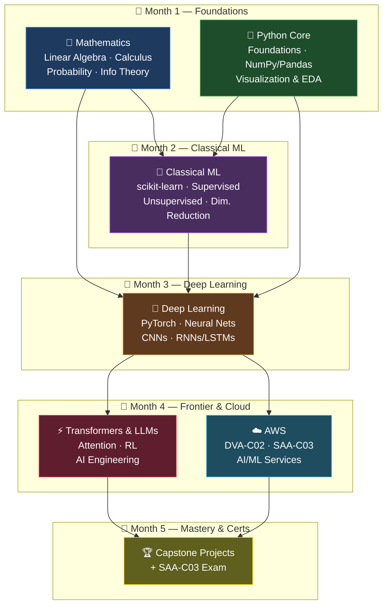
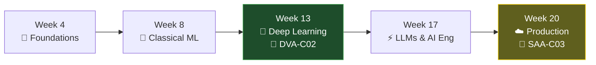

# 🧠 AI Engineering & Machine Learning Mastery Path

> _"The best way to predict the future is to build it — and the best way to build the future is to understand the math, the code, and the systems underneath it."_

Welcome to your **5-month, end-to-end curriculum** for becoming a job-ready, production-capable **AI Engineer**. This knowledge base takes you from raw mathematical foundations all the way to deploying large language models on AWS — with quizzes, hands-on exercises, cheat sheets, and a built-in accountability coach to keep you honest.

This is not a passive reading list. It is a **structured, deliberate-practice program**. Every document is engineered so that by the end you can: reason about ML systems mathematically, implement them in clean Python, train and fine-tune deep networks (including transformers and LLMs), and ship them on cloud infrastructure — with **two AWS certifications** (DVA-C02 and SAA-C03) as proof points along the way.

---

## 🎯 How to Use This Knowledge Base

This kbase is built around four reinforcing pillars and a disciplined cadence. Read it in this order, and pair every study session with the plan and the coach.

### 📖 Read order

1. **Start here** — finish this `README.md` so you understand the map.
2. **Open [`MASTER-STUDY-PLAN.md`](MASTER-STUDY-PLAN.md)** — your week-by-week schedule. This is your single source of truth for *what to do when*.
3. **Set up your coach** — load [`ACCOUNTABILITY-COACH-PROMPT.md`](ACCOUNTABILITY-COACH-PROMPT.md) into Claude at the start of each week. It checks your progress, quizzes you, and adjusts pacing.
4. **Track everything** in [`STUDY-TRACKER.xlsx`](STUDY-TRACKER.xlsx) — log hours, quiz scores, and milestone dates.
5. **Then follow the pillars** in dependency order: **Math → Python → ML/DL → AWS**, working the folders below.

> 💡 **Tip:** Math and Python run *in parallel* for the first few weeks. You do not need to finish all of `aimath/` before touching Python — the study plan interleaves them so concepts land while they're fresh.

### 🧩 How each file is structured

Every content document follows the same predictable rhythm, so you always know where you are:

| Section | Purpose |
| --- | --- |
| 🎯 **Objectives** | What you'll be able to *do* after this file — measurable outcomes. |
| 📚 **Concepts** | The core theory, with intuition first, then formalism. |
| ❓ **Quiz** | Self-check questions to surface gaps before they compound. |
| 🛠️ **Exercises** | Hands-on coding / derivation tasks. This is where learning actually happens. |
| 📋 **Cheat Sheet** | A condensed reference you'll return to for years. |
| 🔗 **Resources** | Curated external links (courses, papers, docs) for going deeper. |

> 📝 **How to study a file:** Read Objectives → skim Concepts → attempt the Quiz *cold* (before you feel ready — failure reveals gaps) → do every Exercise by hand/keyboard → save the Cheat Sheet → mark complete in the tracker.

### 🤝 Pairing with the plan and the coach

```
MASTER-STUDY-PLAN.md   →  tells you WHICH files this week
   the file itself     →  teaches the material
ACCOUNTABILITY-COACH   →  verifies you actually learned it
STUDY-TRACKER.xlsx     →  records the evidence
```

Run the coach **at least twice a week**: once mid-week (formative check, adjust if behind) and once at week's end (summative quiz + plan next week). The coach is designed to be slightly demanding — that's the point.

---

## 🗺️ The Learning Roadmap

Four pillars feed forward into capstone projects across five months. Math underpins everything; Python is the lab; ML/DL is the core craft; AWS is how you ship.



> 🎯 **The mental model:** *Math is the language. Python is the laboratory. ML/DL is the science. AWS is the factory.* You need all four to call yourself an AI Engineer rather than a notebook tinkerer.

---

## 📚 Master Document Index

Every file in this knowledge base, grouped by folder. Estimated study hours include reading, quizzes, and exercises — adjust to your own pace.

### 🏠 Root — Orientation & Operations

| File | What it covers | Est. hrs |
| --- | --- | --- |
| [`README.md`](README.md) | This page — the map, read order, and roadmap. | 0.5 |
| [`MASTER-STUDY-PLAN.md`](MASTER-STUDY-PLAN.md) | Week-by-week 5-month schedule with daily targets and checkpoints. | 1.5 |
| [`ACCOUNTABILITY-COACH-PROMPT.md`](ACCOUNTABILITY-COACH-PROMPT.md) | The Claude system prompt that quizzes you, tracks progress, and adjusts pacing. | 0.5 |
| [`STUDY-TRACKER.xlsx`](STUDY-TRACKER.xlsx) | Spreadsheet to log hours, quiz scores, milestones, and certification dates. | 0.5 |

### 🔢 `aimath/` — Mathematical Foundations

> The vocabulary of machine learning. Skip this and you'll forever be copy-pasting code you can't debug.

| File | What it covers | Est. hrs |
| --- | --- | --- |
| [`aimath/01-linear-algebra.md`](aimath/01-linear-algebra.md) | Vectors, matrices, eigen-decomposition, SVD, the geometry behind every model. | 14 |
| [`aimath/02-calculus-optimization.md`](aimath/02-calculus-optimization.md) | Derivatives, gradients, the chain rule, gradient descent & convex optimization. | 14 |
| [`aimath/03-probability-statistics.md`](aimath/03-probability-statistics.md) | Distributions, Bayes, MLE/MAP, expectation, variance, hypothesis testing. | 14 |
| [`aimath/04-information-theory-graphs.md`](aimath/04-information-theory-graphs.md) | Entropy, KL divergence, cross-entropy, mutual information, graph fundamentals. | 10 |

### 🐍 `aipython/` — Python for AI

> The laboratory. From clean code to PyTorch to calling LLMs in production.

| File | What it covers | Est. hrs |
| --- | --- | --- |
| [`aipython/01-python-foundations-for-ai.md`](aipython/01-python-foundations-for-ai.md) | Pythonic idioms, typing, virtual envs, packaging, and tooling for AI work. | 12 |
| [`aipython/02-numpy-pandas-data.md`](aipython/02-numpy-pandas-data.md) | Vectorized NumPy, Pandas data wrangling, broadcasting, and performance. | 14 |
| [`aipython/03-visualization-eda.md`](aipython/03-visualization-eda.md) | Matplotlib, Seaborn, Plotly; exploratory data analysis and storytelling. | 10 |
| [`aipython/04-scikit-learn-classical-ml.md`](aipython/04-scikit-learn-classical-ml.md) | The scikit-learn API, pipelines, cross-validation, model selection. | 14 |
| [`aipython/05-pytorch-deep-learning.md`](aipython/05-pytorch-deep-learning.md) | Tensors, autograd, `nn.Module`, training loops, GPU workflows. | 16 |
| [`aipython/06-ai-engineering-llms-python.md`](aipython/06-ai-engineering-llms-python.md) | Calling LLM APIs, RAG, embeddings, agents, and prompt engineering in Python. | 16 |

### 🤖 `aideepmachinelearning/` — ML, Deep Learning & Frontier

> The science and the craft — from linear regression to transformers and reinforcement learning.

| File | What it covers | Est. hrs |
| --- | --- | --- |
| [`aideepmachinelearning/01-ml-fundamentals.md`](aideepmachinelearning/01-ml-fundamentals.md) | Bias-variance, train/val/test, overfitting, metrics, the ML workflow. | 12 |
| [`aideepmachinelearning/02-supervised-learning-algorithms.md`](aideepmachinelearning/02-supervised-learning-algorithms.md) | Linear/logistic regression, SVMs, trees, ensembles, gradient boosting. | 16 |
| [`aideepmachinelearning/03-unsupervised-dimensionality-reduction.md`](aideepmachinelearning/03-unsupervised-dimensionality-reduction.md) | K-means, hierarchical clustering, PCA, t-SNE, UMAP. | 12 |
| [`aideepmachinelearning/04-deep-learning-neural-networks.md`](aideepmachinelearning/04-deep-learning-neural-networks.md) | Perceptrons, backprop, activations, regularization, optimizers. | 16 |
| [`aideepmachinelearning/05-cnns-computer-vision.md`](aideepmachinelearning/05-cnns-computer-vision.md) | Convolutions, pooling, classic architectures, transfer learning, vision tasks. | 14 |
| [`aideepmachinelearning/06-transformers-attention-llms.md`](aideepmachinelearning/06-transformers-attention-llms.md) | Self-attention, the transformer block, tokenization, pretraining & fine-tuning. | 18 |
| [`aideepmachinelearning/07-ai-engineering-production.md`](aideepmachinelearning/07-ai-engineering-production.md) | MLOps, serving, monitoring, evaluation, guardrails, and cost control. | 14 |
| [`aideepmachinelearning/08-rnns-lstms-sequence-models.md`](aideepmachinelearning/08-rnns-lstms-sequence-models.md) | RNNs, LSTMs, GRUs, sequence modeling, and why attention superseded them. | 12 |
| [`aideepmachinelearning/09-reinforcement-learning.md`](aideepmachinelearning/09-reinforcement-learning.md) | MDPs, Q-learning, policy gradients, and RLHF for aligning LLMs. | 14 |

### ☁️ `awscert/` — AWS Certifications & AI/ML Services

> The factory floor — how to architect, deploy, and certify your cloud skills.

| File | What it covers | Est. hrs |
| --- | --- | --- |
| [`awscert/01-aws-developer-associate-dva-c02.md`](awscert/01-aws-developer-associate-dva-c02.md) | Full DVA-C02 prep: Lambda, DynamoDB, API Gateway, IAM, deployment. | 20 |
| [`awscert/02-aws-architect-associate-saa-c03.md`](awscert/02-aws-architect-associate-saa-c03.md) | Full SAA-C03 prep: VPC, resilient/secure/cost-optimized architectures. | 22 |
| [`awscert/03-aws-ai-ml-services.md`](awscert/03-aws-ai-ml-services.md) | SageMaker, Bedrock, Comprehend, Rekognition, and managed AI services. | 12 |
| [`awscert/04-aws-exam-strategy-practice.md`](awscert/04-aws-exam-strategy-practice.md) | Exam tactics, question patterns, practice tests, and scheduling. | 10 |

> ⚠️ **Heads-up:** The hour estimates total roughly **380+ hours** of focused work. Over ~22 weeks at the recommended cadence, that's exactly the pace below. Don't try to compress it — depth compounds, cramming evaporates.

---

## 📅 Recommended Weekly Rhythm

A sustainable, repeatable cadence beats heroic weekend binges. The full breakdown lives in [`MASTER-STUDY-PLAN.md`](MASTER-STUDY-PLAN.md), but the shape is:

> 🎯 **6 days per week · 3–4 hours per day · ~20–24 focused hours weekly**

| Day | Focus | Suggested split |
| --- | --- | --- |
| **Mon** | New concepts (read + quiz) | 60% theory / 40% notes |
| **Tue** | Hands-on exercises | 80% coding |
| **Wed** | New concepts + mid-week coach check | 50% theory / 50% review |
| **Thu** | Hands-on exercises + integration | 80% coding |
| **Fri** | Project work / spaced review | 70% build / 30% recall |
| **Sat** | Deep work block + end-of-week coach quiz | flexible |
| **Sun** | 🌿 Rest / light review | recharge |

> 💡 **Rule of thumb:** If a session ever feels purely passive (just reading, no friction), you're not learning fast enough. Switch to a quiz or an exercise immediately. Productive struggle is the signal.

---

## 🏁 Milestones & Certifications

Concrete checkpoints to measure progress. Hitting these on time means you're on track; missing them is your cue to invoke the coach and recalibrate.

| Checkpoint | ⏱️ Target | 🎯 Goal | ✅ Proof of mastery |
| --- | --- | --- | --- |
| **M1** | **Week 4** | Math foundations + Python/NumPy/Pandas solid | Build an EDA notebook + pass all `aimath/` quizzes |
| **M2** | **Week 8** | Classical ML mastered | Train, tune & evaluate an end-to-end scikit-learn pipeline |
| **M3** | **Week 13** | Deep learning + 🏅 **AWS DVA-C02 certified** | Train a CNN from scratch **and** pass DVA-C02 |
| **M4** | **Week 17** | Transformers, LLMs & AI engineering | Fine-tune / prompt-engineer an LLM app with RAG |
| **M5** | **Week 20** | Production AI + 🏅 **AWS SAA-C03 certified** | Ship a deployed capstone **and** pass SAA-C03 |



> 📝 **Certification booking:** Schedule your **DVA-C02 around Week 12** (sit it Week 13) and **SAA-C03 around Week 19** (sit it Week 20). Booking the exam *before* you feel fully ready creates healthy deadline pressure — register early. Official exam pages:
> - DVA-C02: https://aws.amazon.com/certification/certified-developer-associate/
> - SAA-C03: https://aws.amazon.com/certification/certified-solutions-architect-associate/

---

## 🏆 Capstone Projects

One portfolio-grade project per month. These are what you'll show in interviews — not your quiz scores. Each builds on the last and lives in your GitHub.

1. **🔢 Month 1 — Data Storyteller.** Take a real-world dataset, perform rigorous EDA, and produce a polished, statistically-grounded report with visualizations. *Proves: math intuition + NumPy/Pandas + viz.*
2. **🤖 Month 2 — Predictive ML Pipeline.** Build a complete scikit-learn pipeline (cleaning → feature engineering → model selection → tuning → evaluation) on a tabular problem, with cross-validated metrics. *Proves: classical ML craft.*
3. **🧬 Month 3 — Deep Vision / Sequence Model.** Train a CNN for image classification (or an RNN/LSTM for sequences) in PyTorch, with transfer learning and proper experiment tracking. *Proves: deep learning fundamentals.*
4. **⚡ Month 4 — LLM-Powered Application.** Build a RAG or agentic application: embeddings, retrieval, prompt engineering, and evaluation. Optionally fine-tune a small model. *Proves: AI engineering.*
5. **☁️ Month 5 — Deployed AI System on AWS.** Take your best model/app and ship it: containerize, deploy (Lambda/SageMaker/Bedrock), add monitoring, and document the architecture. *Proves: production readiness + cloud.*

> 🎯 **Portfolio standard:** Each capstone needs a clean README, reproducible code, and a short write-up of *what you learned and what you'd do differently*. Recruiters read the reflection more than the code.

---

## 🚀 Let's Begin

You're holding a complete, deliberate path from first principles to deployed, production AI systems. The material is here. The plan is written. The coach is ready. The only variable left is **consistency**.

> 💡 _Twenty focused hours a week for twenty weeks turns "I'm interested in AI" into "I build and ship AI." That's not talent — it's arithmetic plus showing up._

Most people who start a curriculum like this quit in week 3, when the math gets hard and the novelty fades. The ones who finish aren't smarter — they just kept opening the next file. Use the tracker. Trust the rhythm. Let the coach hold you accountable on the days motivation doesn't show up.

**Your next step is simple:** open [`MASTER-STUDY-PLAN.md`](MASTER-STUDY-PLAN.md), load the [`ACCOUNTABILITY-COACH-PROMPT.md`](ACCOUNTABILITY-COACH-PROMPT.md) into Claude, and complete Day 1.

Five months from now, you'll have two AWS certifications, five portfolio projects, and the rarest thing in this field — a genuine, end-to-end understanding of how AI systems actually work.

**Now go build the future. 🧠⚡**

---

> _"An expert is someone who has made all the mistakes that can be made in a narrow field." — Niels Bohr. Start making them today._
