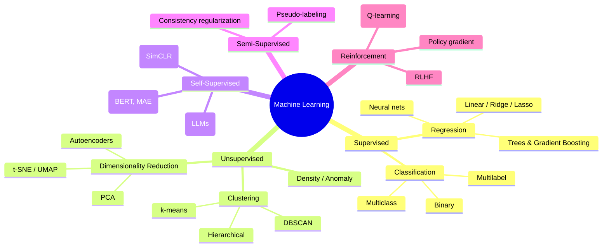
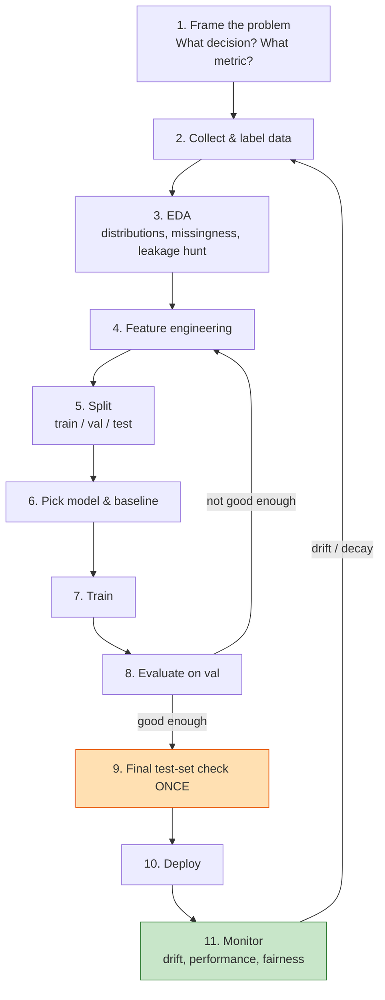
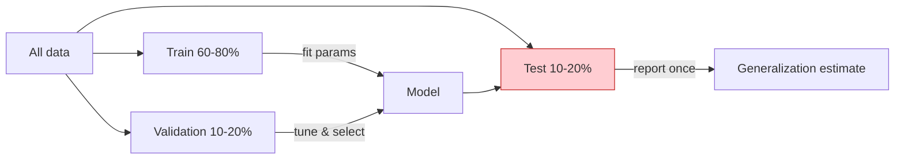
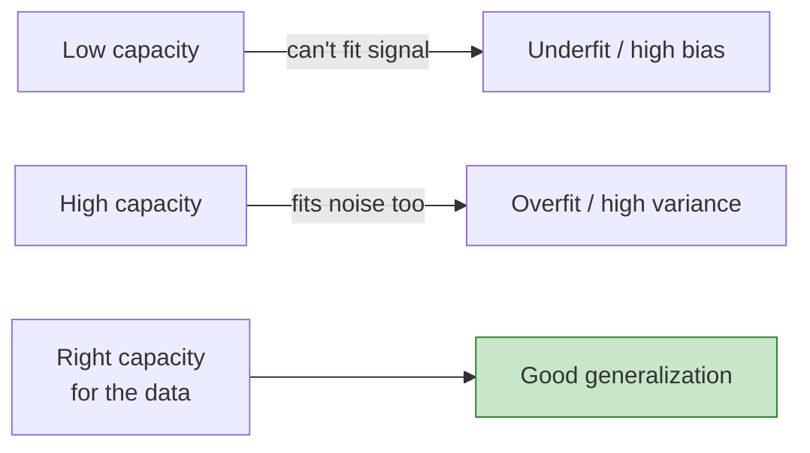
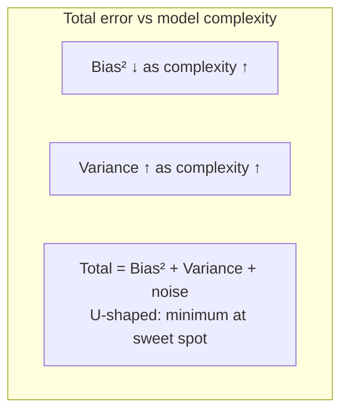
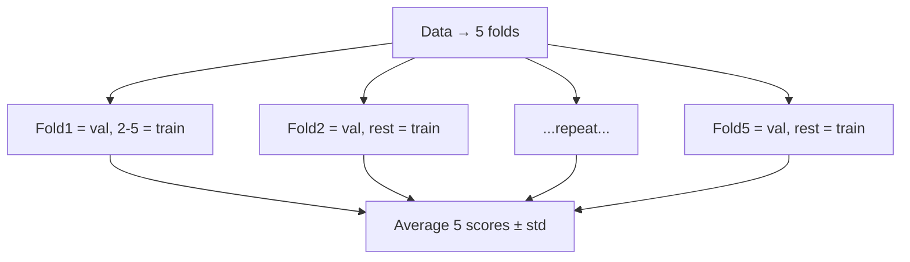
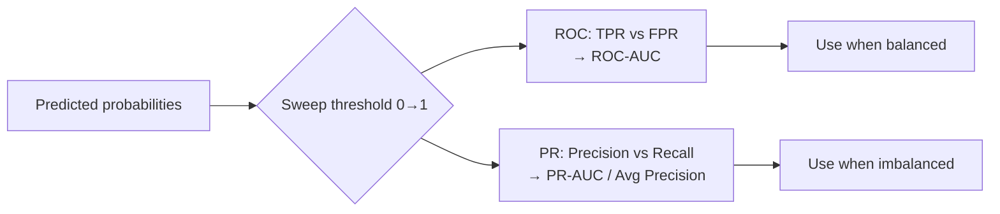
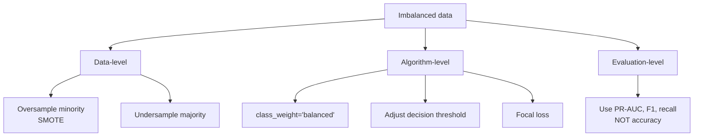

# Machine Learning Fundamentals
*The mental models, math, and discipline that everything else in ML rests on.*

*Part of the AI Engineering & ML Mastery Path — see the [index](../README.md) and [study plan](../MASTER-STUDY-PLAN.md).*

Machine learning is the practice of building programs that **improve at a task by learning patterns from data** instead of being explicitly coded with rules. This file is the foundation of the entire path: before you reach for a neural network or a gradient-boosted tree, you must understand *what kind of problem you have*, *how to set up data honestly*, *how to tell whether your model actually works*, and *the silent ways a project goes wrong*. Master this, and every later algorithm becomes a swap-in detail rather than a mystery.

> 💡 **Intuition:** Classical programming is `rules + data → answers`. Machine learning flips it: `data + answers → rules`. You give the machine examples of inputs and the correct outputs, and it infers the rule (the model) that maps one to the other — then applies that rule to inputs it has never seen.

---

## 🎯 Learning Objectives

By the end of this file you can:

- **Classify** any ML problem into the correct paradigm (supervised, unsupervised, self-supervised, semi-supervised, reinforcement) and sub-type.
- **Walk through** the full ML lifecycle from problem framing to production monitoring, naming the failure modes at each stage.
- **Design** a leak-free train/validation/test split and **recognize** the subtle forms of data leakage that inflate offline metrics.
- **Decompose** prediction error into bias, variance, and irreducible noise — and **diagnose** under/overfitting from learning curves.
- **Apply** the right remedy (regularization, early stopping, dropout, augmentation, more data) to a diagnosed problem.
- **Choose and compute** the correct evaluation metric (precision, recall, F1, ROC-AUC, PR-AUC, RMSE, MAE, R²) and explain when accuracy lies.
- **Select** an appropriate cross-validation strategy for i.i.d., grouped, and time-series data.
- **Engineer** baseline features, **handle** class imbalance, and **run** a disciplined error analysis.
- **Reproduce** an experiment from scratch and track it.

---

## 📋 Prerequisites

- **Python 3.11+** with `numpy`, `pandas`, `scikit-learn`, `matplotlib`. See [00-environment-setup.md](./00-environment-setup.md).
- Comfort with basic **linear algebra** (vectors, matrices) and **probability** (mean, variance, conditional probability) — refresher in [00b-math-primer.md](./00b-math-primer.md).
- Ability to read a function signature and run a script.

---

## 📑 Table of Contents

1. [The ML Taxonomy](#1-the-ml-taxonomy)
2. [The End-to-End ML Lifecycle](#2-the-end-to-end-ml-lifecycle)
3. [Train / Validation / Test Discipline & Data Leakage](#3-train--validation--test-discipline--data-leakage)
4. [Generalization, Capacity & No Free Lunch](#4-generalization-capacity--no-free-lunch)
5. [The Bias–Variance Tradeoff](#5-the-biasvariance-tradeoff)
6. [Underfitting & Overfitting: Diagnosis and Remedies](#6-underfitting--overfitting-diagnosis-and-remedies)
7. [Cross-Validation Strategies](#7-cross-validation-strategies)
8. [Evaluation Deep Dive](#8-evaluation-deep-dive)
9. [Feature Engineering Fundamentals](#9-feature-engineering-fundamentals)
10. [Class Imbalance](#10-class-imbalance)
11. [Baselines & Error Analysis](#11-baselines--error-analysis)
12. [Reproducibility & Experiment Tracking](#12-reproducibility--experiment-tracking)
13. [From-Scratch Implementation](#-from-scratch-implementation)
14. [Worked Mini Case Study](#-worked-mini-case-study-end-to-end)
15. [Knowledge Check](#-knowledge-check)
16. [Exercises](#️-exercises)
17. [Cheat Sheet](#-cheat-sheet)
18. [Further Resources](#-further-resources)
19. [What's Next](#️-whats-next)

---

## 1. The ML Taxonomy

> 💡 **Intuition:** The first question on any ML project is not "which algorithm?" but "what does my data look like, and what am I trying to predict?". The answer places you in one *paradigm*, which drastically narrows the algorithm choices.

The defining axis is **what supervision signal you have**:

| Paradigm | You have... | Goal | Canonical examples |
|---|---|---|---|
| **Supervised** | Inputs $X$ **and** labels $y$ | Learn $f: X \to y$ | Spam detection, house-price prediction |
| **Unsupervised** | Inputs $X$ only | Find structure | Customer segmentation, anomaly detection |
| **Self-supervised** | Inputs $X$ only, but **derive** labels from the data itself | Learn representations | GPT next-token prediction, masked image modeling |
| **Semi-supervised** | A little labeled + lots unlabeled | Use unlabeled to boost a labeled task | Medical imaging with few annotations |
| **Reinforcement** | An environment giving **rewards** | Learn a policy that maximizes long-run reward | Game-playing, robotics, RLHF |

### Supervised learning splits by label type

$$
\text{Supervised} = \begin{cases} \textbf{Regression} & y \in \mathbb{R} \quad (\text{continuous}) \\ \textbf{Classification} & y \in \{c_1, \dots, c_k\} \quad (\text{discrete categories}) \end{cases}
$$

- **Regression** predicts a number: temperature tomorrow, expected revenue, a patient's blood pressure.
- **Classification** predicts a category: cat/dog, fraud/not-fraud, which of 1,000 ImageNet classes. *Binary* = 2 classes; *multiclass* = one of $k$; *multilabel* = any subset of $k$ can be true simultaneously (an image tagged both "beach" and "sunset").

### Unsupervised learning splits by goal

- **Clustering** groups similar points (k-means, DBSCAN, hierarchical).
- **Dimensionality reduction** compresses many features into few while preserving structure (PCA, t-SNE, UMAP, autoencoders).
- **Density estimation / anomaly detection** models $p(x)$ and flags low-probability points.

> 🎯 **Key Insight:** **Self-supervised learning is the engine behind modern foundation models.** It is technically unsupervised (no human labels) but *trained like* supervised learning — the "labels" are pieces of the input hidden and then predicted (the next word, a masked patch). This is why LLMs can train on the entire internet: the supervision is free.



> ⚠️ **Common Pitfall:** Forcing a problem into the wrong paradigm. "Predict which customers will churn" *sounds* like clustering, but if you have historical churn labels it is **supervised classification** — and treating it as clustering throws away your most valuable signal.

**Why it matters for AI/ML:** The paradigm determines your data requirements, loss function, evaluation metric, and even your team's labeling budget. Misframing here wastes months downstream.

---

## 2. The End-to-End ML Lifecycle

> 💡 **Intuition:** A model is maybe 10% of a real ML project. The other 90% is framing the problem, wrangling data, and operating the system after launch. Beginners obsess over model choice; professionals obsess over data and monitoring.



| Stage | Key question | Top failure mode |
|---|---|---|
| **Frame** | What business decision does this drive? What's the success metric? | Optimizing a proxy that doesn't move the real goal |
| **Data** | Is it representative, sufficient, and labeled correctly? | Sampling bias; mislabeled ground truth |
| **EDA** | What do distributions, correlations, and missingness look like? | Skipping it and missing leakage / outliers |
| **Features** | What signal can I extract and encode? | Engineering features *before* the split (leakage) |
| **Split** | Are train/val/test independent and representative? | Random split on time-series or grouped data |
| **Model** | What's the simplest baseline that could work? | Jumping to a deep net before a baseline |
| **Train** | Is optimization converging? | Not setting seeds; no logging |
| **Evaluate** | Does the chosen metric reflect the goal? | Reporting accuracy on imbalanced data |
| **Deploy** | Train/serve skew? Latency? | Different preprocessing in prod vs training |
| **Monitor** | Is the live distribution still like training? | Silent model decay from data drift |

> 🎯 **Key Insight:** The lifecycle is a **loop, not a line.** Evaluation feeds back to feature engineering; monitoring feeds back to data collection. The test set is touched *once*, at the very end — see §3.

**Why it matters for AI/ML:** MLOps maturity is largely about automating and hardening this loop. Knowing where failures hide tells you where to invest engineering effort.

---

## 3. Train / Validation / Test Discipline & Data Leakage

### The three splits and their jobs

| Split | Used for | Touched how often |
|---|---|---|
| **Training** | Fitting model parameters | Every epoch |
| **Validation** (dev) | Tuning hyperparameters, model selection, early stopping | Many times |
| **Test** | Final, unbiased estimate of generalization | **Exactly once**, at the end |

> 🎯 **Key Insight:** Every time you make a decision based on a dataset, you "leak" information into your model and that set stops being an honest estimate of generalization. The validation set decays through repeated use (you implicitly overfit to it); the test set stays pristine *only* because you never tune on it.



### Data leakage — the silent killer

**Data leakage** is when information that would *not* be available at prediction time sneaks into training, producing optimistic offline metrics that **collapse in production**.

> ⚠️ **Common Pitfall:** Leakage is the #1 reason a model scores 0.99 in the notebook and 0.62 in production. It is *subtle* — here are its many forms:

| Leakage type | What happens | Fix |
|---|---|---|
| **Target leakage** | A feature is a proxy for the label, only known *after* the outcome (e.g. `payment_received` when predicting `will_pay`) | Drop features unavailable at prediction time |
| **Train-test contamination** | Same/duplicate rows in train and test | Deduplicate before splitting |
| **Preprocessing leakage** | Fitting a scaler/imputer/PCA on the *full* dataset before splitting | Fit transforms on **train only**, apply to val/test |
| **Temporal leakage** | Using future data to predict the past (random split on time-series) | Split chronologically |
| **Group leakage** | Same patient/user in both train and test | Group-aware split (`GroupKFold`) |
| **Feature-selection leakage** | Selecting features using the whole dataset's correlation with target | Select inside CV folds |
| **Label leakage from IDs** | Row order or ID encodes the target | Shuffle; don't feed raw IDs |

```python
# WRONG — scaler sees test data, leaking its statistics into training
from sklearn.preprocessing import StandardScaler
from sklearn.model_selection import train_test_split
import numpy as np

X = np.array([[1.], [2.], [3.], [4.], [100.]])  # the 100 is a test outlier
scaler = StandardScaler().fit(X)                 # ❌ fit on ALL data
Xs = scaler.transform(X)
X_train, X_test = Xs[:4], Xs[4:]                 # test stats leaked into mean/std

# RIGHT — split first, fit scaler on train only
X_train, X_test = train_test_split(X, test_size=0.2, random_state=42, shuffle=False)
scaler = StandardScaler().fit(X_train)           # ✅ train only
X_train_s = scaler.transform(X_train)
X_test_s  = scaler.transform(X_test)             # apply, never re-fit
```

> 📝 **Tip:** Use `sklearn.pipeline.Pipeline`. A pipeline that includes preprocessing is re-fit *inside each CV fold automatically*, which makes preprocessing leakage nearly impossible. This is the single most effective habit against leakage.

**Why it matters for AI/ML:** A leaked model passes every offline check and fails silently in front of users. Interviewers probe leakage precisely because it separates people who have shipped from people who have only done Kaggle.

---

## 4. Generalization, Capacity & No Free Lunch

**Generalization** is the goal of ML: low error on *unseen* data, not on the training data. We formalize it with two error terms:

$$
R(f) = \mathbb{E}_{(x,y)\sim \mathcal{D}}[\ell(f(x), y)] \quad\text{(true / generalization risk)}
$$
$$
\hat{R}(f) = \frac{1}{n}\sum_{i=1}^{n} \ell(f(x_i), y_i) \quad\text{(empirical / training risk)}
$$

Here $\ell$ is a loss function, $\mathcal{D}$ is the (unknown) true data distribution, and we only ever observe a finite sample of size $n$. The **generalization gap** is $R(f) - \hat{R}(f)$. Training minimizes $\hat{R}$; we *hope* this also lowers $R$.

> 💡 **Intuition:** Memorizing the training set drives $\hat{R}$ to zero but does nothing for $R$ — like a student who memorizes past exam answers and fails the new exam.

**Capacity** (a.k.a. model complexity, expressiveness) is how rich a set of functions a model can represent. High capacity = can fit complex patterns *and* can fit noise. The **VC dimension** is one classical formalization: the largest set of points a model can shatter (label in all possible ways).

### No Free Lunch Theorem

> 🎯 **Key Insight:** The **No Free Lunch (NFL) theorem** (Wolpert & Macready) states that, *averaged over all possible problems*, every learning algorithm has the same expected performance. There is **no universally best model.**

The practical consequence is *not* "all models are equal in practice" — they aren't, because real-world problems are not uniformly distributed; they have structure (smoothness, locality, hierarchy). The lesson is: **a model is good only relative to assumptions that match your problem.** This is why you try several models and validate, rather than trusting that "XGBoost always wins."



**Why it matters for AI/ML:** NFL is the theoretical justification for empirical model selection and cross-validation. It tells you to *match inductive bias to problem structure* — e.g. CNNs encode locality for images, transformers encode long-range dependencies for sequences.

---

## 5. The Bias–Variance Tradeoff

> 💡 **Intuition:** **Bias** = error from wrong assumptions (model too simple, systematically off). **Variance** = error from sensitivity to the particular training sample (model too wiggly, changes wildly with new data). You usually can't reduce both at once — that's the tradeoff.

For squared-error regression, the expected test error at a point $x$ decomposes **exactly**:

$$
\underbrace{\mathbb{E}\big[(y - \hat{f}(x))^2\big]}_{\text{Expected error}} = \underbrace{\big(\text{Bias}[\hat{f}(x)]\big)^2}_{\text{(systematic)}} + \underbrace{\text{Var}[\hat{f}(x)]}_{\text{(sensitivity)}} + \underbrace{\sigma^2}_{\text{irreducible noise}}
$$

where
$$
\text{Bias}[\hat f(x)] = \mathbb{E}[\hat f(x)] - f(x), \qquad \text{Var}[\hat f(x)] = \mathbb{E}\big[(\hat f(x) - \mathbb{E}[\hat f(x)])^2\big].
$$

- $f(x)$ is the true function, $\hat f(x)$ is our estimate (a random variable over training sets), $\sigma^2$ is noise we can never remove.

### Worked example by hand

Suppose the truth is $f(x)=0$ at some point, and across many training sets our model produces predictions with **average** $\mathbb{E}[\hat f(x)] = 0.5$ and **spread** $\text{Var}[\hat f(x)] = 0.04$, with noise $\sigma^2 = 0.01$.

- $\text{Bias}^2 = (0.5 - 0)^2 = 0.25$
- $\text{Variance} = 0.04$
- Irreducible $= 0.01$
- **Expected error** $= 0.25 + 0.04 + 0.01 = \mathbf{0.30}$

The model is **bias-dominated** (0.25 ≫ 0.04): it is systematically off by 0.5. A more flexible model would help far more than collecting a bigger sample.



```
error
  │\                                   /  ← Variance (rises)
  │ \                                /
  │  \          Total (U-shape)    /
  │   \___                    ___/
  │       \___            ___/   ← sweet spot
  │  Bias²    \__________/
  │ (falls)        ▲
  └──────────────────────────────────► model complexity
                sweet spot
```

> 📝 **Tip (interview):** Be ready to map this to specifics — increasing tree depth, polynomial degree, or NN width moves you *right* (↓bias, ↑variance); adding regularization moves you *left* (↑bias, ↓variance).

> ⚠️ **Common Pitfall:** Assuming the tradeoff is iron law everywhere. In the **over-parameterized** regime (huge neural nets), test error can *fall again* after the interpolation threshold — the **"double descent"** phenomenon. The classical U-curve still governs most tabular/classical models.

**Why it matters for AI/ML:** Every regularization technique, ensemble method, and architecture choice is fundamentally a bias–variance lever. Naming which one you're pulling is the mark of someone who understands *why* a fix works.

---

## 6. Underfitting & Overfitting: Diagnosis and Remedies

| | **Underfitting** | **Overfitting** |
|---|---|---|
| Cause | Model too simple / too little training | Model too complex / too little data |
| Train error | **High** | **Low** |
| Val error | **High** (≈ train) | **High** (≫ train) |
| Gap | Small | **Large** |
| Dominated by | Bias | Variance |

### Diagnosing from learning curves

A **learning curve** plots error vs **training-set size**; a **validation curve** plots error vs **model complexity**. Reading them:

```
HIGH BIAS (underfit)            HIGH VARIANCE (overfit)
error                           error
 │                               │
 │── val ──────────              │        val ────────
 │── train ─────────  both high  │ ────────────  big gap
 │   (curves meet, both bad)     │ train (low)
 └──────────────► train size     └──────────────► train size
 More data won't help.           More data WILL help (gap closes).
```

> 🎯 **Key Insight:** If train and val error are **both high and close**, you're underfitting — *more data will not help*, you need more capacity or better features. If train error is **low** but val error is **much higher**, you're overfitting — *more data, simpler model, or regularization* will help.

### Remedies (matched to diagnosis)

**For underfitting (↑ capacity / ↓ bias):**
- Add features / better feature engineering
- Increase model complexity (deeper tree, more layers, higher polynomial degree)
- Train longer; reduce regularization
- Use a more expressive model class

**For overfitting (↓ variance):**

| Remedy | Mechanism |
|---|---|
| **More training data** | Variance shrinks as $\sim 1/n$ |
| **L2 regularization (ridge)** | Penalizes large weights, shrinks toward 0 |
| **L1 regularization (lasso)** | Drives some weights to *exactly* 0 → feature selection |
| **Early stopping** | Stop when val error starts rising |
| **Dropout** (NNs) | Randomly zero units → ensemble effect |
| **Data augmentation** | Synthesize plausible variations → more effective data |
| **Reduce model complexity** | Prune trees, fewer layers/units |
| **Ensembling / bagging** | Average many models → variance averages down |

### The regularization math

L2 and L1 add a penalty to the loss $\mathcal{L}$:

$$
\textbf{L2 (Ridge):}\quad \mathcal{L}_{\text{ridge}} = \mathcal{L}(\mathbf{w}) + \lambda \sum_{j} w_j^2
$$
$$
\textbf{L1 (Lasso):}\quad \mathcal{L}_{\text{lasso}} = \mathcal{L}(\mathbf{w}) + \lambda \sum_{j} |w_j|
$$

$\lambda \ge 0$ controls strength: $\lambda=0$ → no regularization (risk overfit); large $\lambda$ → weights forced small (risk underfit). $\lambda$ is itself a **hyperparameter tuned on the validation set.**

> 💡 **Intuition:** The L1 penalty has corners on the axes, so its constraint region touches the loss contours *at* an axis — pushing coefficients to exactly zero. L2's circular region rarely touches exactly on an axis, so it only *shrinks*. That geometric difference is why **L1 selects features and L2 just dampens them.**

```python
import numpy as np
from sklearn.linear_model import Ridge, Lasso
from sklearn.datasets import make_regression

X, y = make_regression(n_samples=200, n_features=20, n_informative=5,
                       noise=10.0, random_state=0)

ridge = Ridge(alpha=10.0).fit(X, y)
lasso = Lasso(alpha=1.0).fit(X, y)

print("Ridge zero coefs:", int(np.sum(np.isclose(ridge.coef_, 0))))  # ~0
print("Lasso zero coefs:", int(np.sum(np.isclose(lasso.coef_, 0))))  # several
# Expected: Ridge zero coefs: 0   Lasso zero coefs: 13  (≈, lasso zeroes the irrelevant ~15)
```

**Why it matters for AI/ML:** "My model overfits" is meaningless without a remedy plan. Being able to *name the diagnosis from the curves* and *pick the matched fix* is exactly what separates productive iteration from random flailing.

---

## 7. Cross-Validation Strategies

> 💡 **Intuition:** A single validation split is noisy — your estimate depends on which rows happened to land in val. **Cross-validation** rotates the validation role across the data so every point is validated once, giving a more stable estimate (and using all data for training across folds).

### k-Fold

Split data into $k$ equal folds; train on $k-1$, validate on the held-out fold; rotate. Report the **mean ± std** of the metric.

$$
\text{CV score} = \frac{1}{k}\sum_{i=1}^{k} \text{metric}(\text{fold}_i)
$$



### Choosing the right strategy

| Strategy | When to use |
|---|---|
| **k-Fold** (k=5 or 10) | Standard i.i.d. data |
| **Stratified k-Fold** | Classification, esp. imbalanced — preserves class ratios per fold |
| **GroupKFold** | Grouped data (patients, users) — keep a group entirely in one fold |
| **TimeSeriesSplit** | Temporal data — train on past, validate on future only |
| **Leave-One-Out (LOOCV)** | Tiny datasets; $k=n$, expensive, high-variance estimate |
| **Repeated k-Fold** | Want tighter estimate; repeat with different shuffles |
| **Nested CV** | Hyperparameter tuning *and* unbiased performance estimate simultaneously |

> ⚠️ **Common Pitfall:** Using plain `KFold` on time-series leaks the future into the past. Always use `TimeSeriesSplit` so each validation fold is strictly *after* its training data.

```python
from sklearn.model_selection import cross_val_score, StratifiedKFold
from sklearn.linear_model import LogisticRegression
from sklearn.datasets import make_classification

X, y = make_classification(n_samples=500, weights=[0.9, 0.1], random_state=0)
cv = StratifiedKFold(n_splits=5, shuffle=True, random_state=0)
scores = cross_val_score(LogisticRegression(max_iter=1000), X, y,
                         cv=cv, scoring="f1")
print(f"F1: {scores.mean():.3f} ± {scores.std():.3f}")
# Expected (approx): F1: 0.62 ± 0.10   (exact value varies slightly)
```

> 📝 **Tip:** For hyperparameter search **and** an honest final number, use **nested CV**: an inner loop tunes hyperparameters, an outer loop estimates performance. Reporting the *best inner score* as your final number is optimistic-biased.

**Why it matters for AI/ML:** CV is how you make model-selection decisions you can trust on limited data. The wrong scheme silently leaks and gives confident-but-wrong conclusions.

---

## 8. Evaluation Deep Dive

> 🎯 **Key Insight:** The metric *is* the objective. If you optimize the wrong metric, a "better" model can be worse for your actual goal. Pick the metric **before** you model, from the cost of each error type.

### 8.1 The confusion matrix (binary)

```
                 Predicted
                 Pos        Neg
Actual  Pos   │  TP    │   FN   │   ← FN = "miss"
        Neg   │  FP    │   TN   │   ← FP = "false alarm"
```

From these four counts everything follows:

$$
\text{Accuracy} = \frac{TP+TN}{TP+TN+FP+FN}, \qquad
\text{Precision} = \frac{TP}{TP+FP}
$$
$$
\text{Recall (TPR, Sensitivity)} = \frac{TP}{TP+FN}, \qquad
\text{Specificity (TNR)} = \frac{TN}{TN+FP}
$$
$$
F_1 = 2\cdot\frac{\text{Precision}\cdot\text{Recall}}{\text{Precision}+\text{Recall}} = \frac{2TP}{2TP + FP + FN}
$$

The $F_1$ score is the **harmonic mean** of precision and recall — it punishes imbalance between them (you can't game it by maxing one). The general $F_\beta$ weights recall $\beta$ times as much as precision:
$$
F_\beta = (1+\beta^2)\cdot\frac{\text{Precision}\cdot\text{Recall}}{\beta^2\cdot\text{Precision}+\text{Recall}}.
$$

> 💡 **Intuition:** **Precision** = "of the alarms I raised, how many were real?" (cost of false alarms). **Recall** = "of the real cases, how many did I catch?" (cost of misses). Cancer screening wants high *recall* (don't miss a tumor); spam filtering wants high *precision* (don't junk a real email).

### Worked example by hand

A fraud model on 1,000 transactions (50 truly fraud) outputs: $TP=40$, $FP=20$, $FN=10$, $TN=930$.

- Accuracy $= (40+930)/1000 = 0.97$ ← *looks great*
- Precision $= 40/(40+20) = 0.667$
- Recall $= 40/(40+10) = 0.80$
- $F_1 = 2\cdot\frac{0.667\cdot0.80}{0.667+0.80} = 2\cdot\frac{0.533}{1.467} = 0.727$

The 0.97 accuracy hides that 1 in 3 fraud alerts is wrong and 1 in 5 frauds is missed.

### 8.2 When accuracy lies

> ⚠️ **Common Pitfall:** On a dataset that is **99% negative**, a model that predicts "negative" for everything scores **99% accuracy** while catching **zero** positives. Accuracy is meaningless under class imbalance. Use precision/recall/F1, or AUC.

### 8.3 ROC-AUC vs PR-AUC

Both summarize performance across **all decision thresholds**:

- **ROC curve**: TPR (recall) vs FPR $=FP/(FP+TN)$. **ROC-AUC** = probability the model ranks a random positive above a random negative. $0.5$ = random, $1.0$ = perfect.
- **PR curve**: Precision vs Recall. **PR-AUC** (average precision) focuses on the positive class.

| Use | Prefer |
|---|---|
| Balanced classes, care about both errors | **ROC-AUC** |
| **Imbalanced**, care about the rare positive | **PR-AUC** |

> 🎯 **Key Insight:** ROC-AUC can look deceptively high on imbalanced data because the huge TN count keeps FPR low. **PR-AUC** does not include TN, so it exposes weak positive-class performance. For rare-event problems (fraud, disease, click), trust PR-AUC.



### 8.4 Regression metrics

$$
\text{MAE} = \frac{1}{n}\sum_i |y_i - \hat y_i|, \qquad
\text{MSE} = \frac{1}{n}\sum_i (y_i - \hat y_i)^2, \qquad
\text{RMSE} = \sqrt{\text{MSE}}
$$
$$
R^2 = 1 - \frac{\sum_i (y_i - \hat y_i)^2}{\sum_i (y_i - \bar y)^2}
$$

| Metric | Property |
|---|---|
| **MAE** | Robust to outliers; same unit as target; interpretable |
| **MSE / RMSE** | Penalizes large errors quadratically; sensitive to outliers; RMSE in target units |
| **$R^2$** | Fraction of variance explained; 1 = perfect, 0 = no better than predicting the mean, can be negative |
| **MAPE** | Percentage error; undefined/exploding when $y\approx0$ |

```python
from sklearn.metrics import (precision_score, recall_score, f1_score,
                             roc_auc_score, average_precision_score)
import numpy as np

y_true  = np.array([0,0,0,0,1,0,1,0,1,1])
y_prob  = np.array([.1,.2,.05,.4,.8,.3,.9,.35,.6,.85])
y_pred  = (y_prob >= 0.5).astype(int)

print("Precision:", round(precision_score(y_true, y_pred), 3))  # 1.0
print("Recall   :", round(recall_score(y_true, y_pred), 3))     # 1.0
print("F1       :", round(f1_score(y_true, y_pred), 3))         # 1.0
print("ROC-AUC  :", round(roc_auc_score(y_true, y_prob), 3))    # 1.0
print("PR-AUC   :", round(average_precision_score(y_true, y_prob), 3))  # 1.0
# (This toy threshold cleanly separates classes; real data won't.)
```

**Why it matters for AI/ML:** Choosing and defending a metric is the most common ML design-interview question and the most common real-world mistake. The metric encodes your values about which errors hurt.

---

## 9. Feature Engineering Fundamentals

> 💡 **Intuition:** Models learn the relationship you *expose* to them. Good features make the signal linearly/locally obvious; bad features bury it. "Garbage in, garbage out" — and for classical ML, features matter more than the algorithm.

| Technique | Purpose | Example |
|---|---|---|
| **Scaling/standardization** | Put features on comparable ranges (vital for distance- & gradient-based models) | StandardScaler, MinMaxScaler |
| **Encoding categoricals** | Turn categories into numbers | One-hot, ordinal, target/mean encoding |
| **Binning/discretization** | Capture non-linearity, reduce noise | Age → age brackets |
| **Interaction features** | Capture joint effects | `price × distance` |
| **Polynomial features** | Add curvature to linear models | $x, x^2, x^3$ |
| **Date/time decomposition** | Expose cyclical structure | hour, day-of-week, is_weekend |
| **Log/Box-Cox transform** | Tame skew, stabilize variance | `log(income)` |
| **Missing-value handling** | Impute or flag | median impute + `was_missing` flag |
| **Text** | Vectorize | TF-IDF, embeddings |

> ⚠️ **Common Pitfall:** **Target/mean encoding** of categoricals computed over the whole dataset is a notorious leakage source — the encoded value for a row contains that row's own target. Always compute it inside CV folds (or use out-of-fold encoding).

> 📝 **Tip:** Tree-based models (random forests, gradient boosting) do **not** need feature scaling and handle monotonic transforms gracefully; linear models, SVMs, kNN, and neural nets **do** need scaling. Match preprocessing to the model family.

**Why it matters for AI/ML:** Deep learning automates feature learning for perception (images, text, audio), but on **tabular** data — most business problems — hand-engineered features plus gradient boosting still win. Feature engineering is far from obsolete.

---

## 10. Class Imbalance

When one class is rare (fraud 0.1%, disease 1%), naive training optimizes for the majority and ignores the rare class you actually care about.



| Lever | Method | Note |
|---|---|---|
| **Resampling** | SMOTE (synthesize minority), random under/oversample | Resample **train only**, never val/test |
| **Cost-sensitive** | `class_weight="balanced"` in sklearn | Weights loss inversely to class frequency |
| **Threshold tuning** | Move the 0.5 cutoff to favor recall | Pick threshold on validation set |
| **Right metric** | PR-AUC, F1, recall@k | Accuracy is useless here |

> ⚠️ **Common Pitfall:** Applying SMOTE/oversampling **before** the train/test split duplicates or synthesizes points that end up in both — guaranteed leakage and absurdly optimistic scores. Resample *inside* the pipeline, after the split.

```python
from sklearn.linear_model import LogisticRegression
# class_weight rebalances the loss without touching the data
clf = LogisticRegression(class_weight="balanced", max_iter=1000)
# Now minority misclassifications cost proportionally more.
```

**Why it matters for AI/ML:** The highest-value ML problems (fraud, churn, disease, defaults) are almost always imbalanced. Knowing the playbook is essential and frequently tested.

---

## 11. Baselines & Error Analysis

> 🎯 **Key Insight:** Always build a **baseline first.** It tells you whether a complex model is *worth it* and catches pipeline bugs (a fancy model below baseline means something is broken).

| Problem | Trivial baseline |
|---|---|
| Classification | Predict the majority class (`DummyClassifier(strategy="most_frequent")`) |
| Regression | Predict the mean/median (`DummyRegressor(strategy="mean")`) |
| Time-series | Predict last value (persistence / naïve forecast) |
| Any | A simple, interpretable model (logistic regression / shallow tree) |

### Error analysis

After a model runs, **look at what it gets wrong** — don't just stare at the aggregate score:

1. Collect misclassified / high-error examples.
2. Group them: which classes, which feature ranges, which segments?
3. Quantify each error category's frequency × cost.
4. Fix the biggest bucket first (more data for that slice, a new feature, a relabel).

> 💡 **Intuition:** A 92% model with all 8% of errors concentrated in one critical segment is worse than an 88% model with errors spread harmlessly. The aggregate metric hides *where* you fail. Error analysis is the highest-ROI activity in applied ML.

**Why it matters for AI/ML:** Andrew Ng's central message to practitioners: systematic error analysis tells you *what to do next* far more reliably than trying random model tweaks.

---

## 12. Reproducibility & Experiment Tracking

> ⚠️ **Common Pitfall:** "It worked yesterday." Without fixed seeds, pinned dependencies, and logged configs, results are not reproducible and not trustworthy.

**Reproducibility checklist:**

- [ ] **Set all seeds**: `random`, `numpy`, framework (`torch.manual_seed`, `tf.random.set_seed`), and `PYTHONHASHSEED`.
- [ ] **Pin dependencies** (`requirements.txt` with versions, or a lockfile / container).
- [ ] **Version data** (hash or DVC) and code (git commit).
- [ ] **Log every run's** hyperparameters, metrics, and artifacts.
- [ ] **Separate config from code** (YAML/CLI args), don't hard-code magic numbers.

```python
import os, random, numpy as np

def set_seed(seed: int = 42) -> None:
    random.seed(seed)
    np.random.seed(seed)
    os.environ["PYTHONHASHSEED"] = str(seed)
    # torch.manual_seed(seed); torch.cuda.manual_seed_all(seed)  # if using PyTorch

set_seed(42)  # call once at program start
```

**Tooling:** MLflow, Weights & Biases (wandb), DVC, or even a disciplined CSV. The point is that *every* run is recoverable and comparable.

> 🎯 **Key Insight:** True GPU determinism is hard (some cuDNN ops are non-deterministic) and can cost speed. Aim for **reproducible enough** — same seeds, pinned env, logged configs — so conclusions are stable even if the 9th decimal isn't.

**Why it matters for AI/ML:** Science requires reproducibility; production requires it doubly (you must rebuild the exact model that's serving). Untracked experiments waste enormous time re-deriving lost results.

---

## 🧮 From-Scratch Implementation

To cement the loop, here is a leak-free pipeline implementing **train/test split, standardization fit on train only, a logistic-regression-from-scratch trained with gradient descent, and evaluation** — using only NumPy.

```python
import numpy as np

rng = np.random.default_rng(42)

# --- 1. Synthetic linearly-separable-ish data -------------------------------
n = 400
X = rng.normal(size=(n, 2))
true_w = np.array([2.0, -3.0]); true_b = 0.5
logits = X @ true_w + true_b + rng.normal(scale=0.5, size=n)
y = (logits > 0).astype(float)

# --- 2. Split FIRST (no leakage) --------------------------------------------
idx = rng.permutation(n)
cut = int(0.8 * n)
tr, te = idx[:cut], idx[cut:]
X_tr, X_te, y_tr, y_te = X[tr], X[te], y[tr], y[te]

# --- 3. Standardize using TRAIN statistics only -----------------------------
mu, sigma = X_tr.mean(0), X_tr.std(0)
X_tr = (X_tr - mu) / sigma
X_te = (X_te - mu) / sigma          # apply train stats to test

# --- 4. Logistic regression via gradient descent with L2 --------------------
def sigmoid(z): return 1.0 / (1.0 + np.exp(-z))

w = np.zeros(X_tr.shape[1]); b = 0.0
lr, lam, epochs = 0.1, 0.01, 500
m = X_tr.shape[0]
for _ in range(epochs):
    p = sigmoid(X_tr @ w + b)
    err = p - y_tr
    grad_w = X_tr.T @ err / m + lam * w     # L2 penalty in gradient
    grad_b = err.mean()
    w -= lr * grad_w
    b -= lr * grad_b

# --- 5. Evaluate ------------------------------------------------------------
def evaluate(X, y, w, b):
    pred = (sigmoid(X @ w + b) >= 0.5).astype(float)
    tp = np.sum((pred == 1) & (y == 1)); tn = np.sum((pred == 0) & (y == 0))
    fp = np.sum((pred == 1) & (y == 0)); fn = np.sum((pred == 0) & (y == 1))
    acc  = (tp + tn) / len(y)
    prec = tp / (tp + fp) if (tp + fp) else 0.0
    rec  = tp / (tp + fn) if (tp + fn) else 0.0
    f1   = 2 * prec * rec / (prec + rec) if (prec + rec) else 0.0
    return acc, prec, rec, f1

print("Train:", tuple(round(v, 3) for v in evaluate(X_tr, y_tr, w, b)))
print("Test :", tuple(round(v, 3) for v in evaluate(X_te, y_te, w, b)))
# Expected (approx):
# Train: (0.9, 0.9, 0.9, 0.9)
# Test : (0.9, 0.9, 0.9, 0.9)
# Train≈Test ⇒ good generalization, no overfitting and no leakage.
```

> 🎯 **Key Insight:** The single most important line above is `X_te = (X_te - mu) / sigma` using **train** `mu`/`sigma`. Re-fitting the scaler on test data would leak — exactly the trap from §3.

---

## 📊 Worked Mini Case Study (End-to-End)

**Problem: predict telecom customer churn.** We walk every lifecycle stage on a realistic synthetic dataset.

```python
import numpy as np, pandas as pd
from sklearn.model_selection import train_test_split, StratifiedKFold, cross_val_score
from sklearn.pipeline import Pipeline
from sklearn.compose import ColumnTransformer
from sklearn.preprocessing import StandardScaler, OneHotEncoder
from sklearn.linear_model import LogisticRegression
from sklearn.dummy import DummyClassifier
from sklearn.metrics import (classification_report, roc_auc_score,
                             average_precision_score, confusion_matrix)

# ---- 1. FRAME: predict churn (binary). Metric: PR-AUC (rare positive) + recall.
rng = np.random.default_rng(7)
N = 3000

# ---- 2. DATA (synthetic but realistic) -------------------------------------
tenure   = rng.integers(0, 72, N)
monthly  = rng.normal(70, 30, N).clip(10, 150)
contract = rng.choice(["month", "1yr", "2yr"], N, p=[0.55, 0.25, 0.20])
support  = rng.integers(0, 10, N)
# churn more likely: short tenure, high bill, month-to-month, many support calls
score = (-0.05*tenure + 0.02*monthly + 0.30*support
         + np.where(contract=="month", 1.5, np.where(contract=="1yr", 0.2, -0.8))
         + rng.normal(0, 1.0, N) - 1.0)
churn = (1/(1+np.exp(-score)) > rng.uniform(size=N)).astype(int)
df = pd.DataFrame({"tenure":tenure,"monthly":monthly,
                   "contract":contract,"support":support,"churn":churn})

# ---- 3. EDA ----------------------------------------------------------------
print("Churn rate:", round(df.churn.mean(), 3))     # ~ imbalanced (e.g. 0.32)
print(df.groupby("contract").churn.mean().round(3)) # month >> 2yr  → signal!

# ---- 4/5. FEATURES + SPLIT (split first; preprocessing lives in pipeline) ---
X = df.drop(columns="churn"); y = df.churn
X_tr, X_te, y_tr, y_te = train_test_split(
    X, y, test_size=0.2, stratify=y, random_state=7)   # stratify keeps ratio

pre = ColumnTransformer([
    ("num", StandardScaler(), ["tenure","monthly","support"]),
    ("cat", OneHotEncoder(handle_unknown="ignore"), ["contract"]),
])
# Pipeline re-fits preprocessing INSIDE each CV fold → no leakage.
model = Pipeline([("pre", pre),
                  ("clf", LogisticRegression(class_weight="balanced",
                                             max_iter=1000))])

# ---- 6. BASELINE -----------------------------------------------------------
base = DummyClassifier(strategy="most_frequent").fit(X_tr, y_tr)
print("Baseline acc:", round(base.score(X_te, y_te), 3))  # = majority rate

# ---- 7/8. TRAIN + cross-validated EVALUATION -------------------------------
cv = StratifiedKFold(5, shuffle=True, random_state=7)
cv_ap = cross_val_score(model, X_tr, y_tr, cv=cv, scoring="average_precision")
print(f"CV PR-AUC: {cv_ap.mean():.3f} ± {cv_ap.std():.3f}")

# ---- 9. FINAL TEST CHECK (once) --------------------------------------------
model.fit(X_tr, y_tr)
proba = model.predict_proba(X_te)[:, 1]
pred  = (proba >= 0.5).astype(int)
print("Test ROC-AUC:", round(roc_auc_score(y_te, proba), 3))
print("Test PR-AUC :", round(average_precision_score(y_te, proba), 3))
print(confusion_matrix(y_te, pred))
print(classification_report(y_te, pred, digits=3))

# ---- 11. MONITOR (sketch): in prod, recompute churn rate + PR-AUC weekly,
#          alert if input distributions drift (e.g. tenure mean shifts).
```

**What each stage taught us, end to end:**

1. **Frame** → chose PR-AUC + recall because churn is the rare, costly class.
2. **Data/EDA** → confirmed `contract` and `support` carry real signal; churn is imbalanced.
3. **Split** → `stratify=y` keeps the churn ratio identical in train and test.
4. **Pipeline** → preprocessing fit inside folds ⇒ **no leakage** (the §3 lesson, operationalized).
5. **Baseline** → `DummyClassifier` sets the floor; our model must beat it meaningfully.
6. **Imbalance** → `class_weight="balanced"` (the §10 lever).
7. **Evaluate** → CV gives mean ± std; the test set is touched exactly once.
8. **Monitor** → a plan to detect drift after deployment.

> 🎯 **Key Insight:** Notice we never wrote a "fancy" model — yet every fundamental from this file appears: paradigm choice, lifecycle, leak-free splitting, baseline, imbalance handling, the right metric, CV, and a monitoring plan. **The discipline, not the algorithm, is what makes this trustworthy.**

---

## ❓ Knowledge Check

**1.** You have 100,000 product images and want to find natural groupings without any labels. Which paradigm and sub-type?
<details><summary>Show answer</summary>
**Unsupervised learning → clustering** (e.g., k-means or DBSCAN). There are no labels, and the goal is to discover structure (groups). If you later wanted to *compress* the images into a low-dimensional space for visualization, that would be **dimensionality reduction** — still unsupervised.
</details>

**2.** Why is self-supervised learning able to use vastly more data than supervised learning?
<details><summary>Show answer</summary>
Because the **labels are derived from the data itself** (predict the next word, fill a masked patch), no human annotation is needed. This makes essentially unlimited unlabeled data (the whole internet) usable, which is why it powers foundation models / LLMs.
</details>

**3.** You fit a `StandardScaler` on the entire dataset, then split into train/test. What's wrong and what's the fix?
<details><summary>Show answer</summary>
**Preprocessing leakage**: the scaler's mean and std were computed using test rows, so test information (its distribution) leaked into the training preprocessing. Offline metrics will be optimistic. **Fix:** split first, fit the scaler on **train only**, then `transform` both train and test — ideally via a `Pipeline` so it re-fits inside each CV fold automatically.
</details>

**4.** A model scores 99% accuracy on a dataset where 99% of samples are negative. Is it good?
<details><summary>Show answer</summary>
**Probably useless.** A constant "predict negative" classifier also scores 99% while catching **zero** positives. Accuracy is meaningless under severe imbalance. Look at **precision, recall, F1, and especially PR-AUC** for the positive class.
</details>

**5.** Decompose expected test error into its three components and name what each represents.
<details><summary>Show answer</summary>
$$\mathbb{E}[(y-\hat f(x))^2] = \text{Bias}^2 + \text{Variance} + \sigma^2$$
**Bias²** = systematic error from wrong/oversimple assumptions; **Variance** = error from sensitivity to the particular training sample; **$\sigma^2$** = irreducible noise inherent in the data that no model can remove.
</details>

**6.** Train error = 0.05, validation error = 0.40. Diagnose and give two remedies.
<details><summary>Show answer</summary>
**Overfitting / high variance** (low train, much higher val → large gap). Remedies: regularization (L1/L2), more training data, simpler model, early stopping, dropout (NN), data augmentation, or ensembling/bagging.
</details>

**7.** Train error = 0.38, validation error = 0.40, both flat as you add data. Diagnose and remedy.
<details><summary>Show answer</summary>
**Underfitting / high bias** (both high and close; more data won't help — curves already met). Remedies: increase capacity (deeper/wider model, higher polynomial degree), add/engineer better features, reduce regularization, train longer.
</details>

**8.** When do you prefer PR-AUC over ROC-AUC?
<details><summary>Show answer</summary>
On **imbalanced** data where you care about the **rare positive class** (fraud, disease, click). ROC-AUC can look deceptively high because the large true-negative count keeps FPR low; PR-AUC excludes TN and so honestly reflects positive-class performance.
</details>

**9.** Why must you cross-validate time-series data with `TimeSeriesSplit` rather than `KFold`?
<details><summary>Show answer</summary>
Plain `KFold` shuffles, so validation folds can contain points **earlier** than training points — using the **future to predict the past** (temporal leakage). `TimeSeriesSplit` guarantees each validation fold is strictly *after* its training window, matching how the model is used in production.
</details>

**10.** What does the No Free Lunch theorem imply for choosing models?
<details><summary>Show answer</summary>
Averaged over *all possible* problems, no algorithm beats any other — there is **no universally best model.** Practically: a model is good only when its **inductive bias matches your problem's structure**, so you must try several models and validate empirically rather than assume one always wins.
</details>

**11.** Distinguish L1 and L2 regularization geometrically and in effect.
<details><summary>Show answer</summary>
**L2 (ridge)** adds $\lambda\sum w_j^2$; its circular constraint region rarely touches a coordinate axis, so it **shrinks** weights toward zero but seldom to exactly zero. **L1 (lasso)** adds $\lambda\sum|w_j|$; its diamond has corners on the axes, so the solution often lands *on* an axis, driving weights to **exactly zero** → automatic feature selection.
</details>

**12.** You apply SMOTE to balance classes, then split into train/test. What's the bug?
<details><summary>Show answer</summary>
**Leakage**: synthetic minority points (interpolated from real ones) end up in both train and test, so the test set is no longer independent — scores become wildly optimistic. **Fix:** split first, then apply SMOTE to the **training fold only** (e.g., inside an imbalanced-learn pipeline).
</details>

**13.** Why build a trivial baseline before a sophisticated model?
<details><summary>Show answer</summary>
It (a) establishes the floor performance any model must beat to justify its complexity, and (b) acts as a **sanity check** — if a complex model scores *below* a majority-class/mean baseline, your pipeline has a bug (leakage in reverse, label mix-up, broken preprocessing).
</details>

**14.** When should you report MAE vs RMSE for a regression task?
<details><summary>Show answer</summary>
Use **MAE** when all errors should count linearly and you want robustness to outliers and an interpretable average error in target units. Use **RMSE** when **large errors are disproportionately costly** (it squares them), accepting greater outlier sensitivity. Report both if unsure; they answer different questions.
</details>

**15.** The validation set was used for hundreds of hyperparameter trials and the chosen config scored 0.95 on it. Why might the test set score lower, and what guards against it?
<details><summary>Show answer</summary>
Repeated tuning causes **implicit overfitting to the validation set** — you selected the config that happened to fit val noise. The fresh test set reveals true generalization, often lower. Guards: keep the test set untouched until the very end, use **nested CV** for an unbiased estimate, and limit the number of comparisons / use a holdout you only check once.
</details>

---

## 🏋️ Exercises

**Exercise 1 (warm-up): Classify the paradigm.** For each, name paradigm + sub-type: (a) predict tomorrow's temperature; (b) group news articles by topic with no labels; (c) train a model on millions of unlabeled sentences to predict masked words; (d) teach a robot to walk via trial-and-error rewards; (e) tag a photo with any of {beach, sunset, people}.
<details><summary>Show solution</summary>

(a) Supervised → **regression** (continuous target).
(b) Unsupervised → **clustering**.
(c) **Self-supervised** (masked language modeling).
(d) **Reinforcement learning** (policy from rewards).
(e) Supervised → **multilabel classification** (multiple labels can be simultaneously true).
</details>

**Exercise 2: Construct a leakage example and fix it.** Build a dataset where a feature leaks the target, show the inflated score, then fix it.
<details><summary>Show solution</summary>

```python
import numpy as np, pandas as pd
from sklearn.model_selection import cross_val_score
from sklearn.linear_model import LogisticRegression

rng = np.random.default_rng(0)
n = 500
age   = rng.integers(18, 80, n)
income= rng.normal(50, 15, n)
default = (rng.uniform(size=n) < 0.3).astype(int)          # target

# LEAKY feature: only known AFTER the outcome (collections started)
sent_to_collections = default * 1 + (1 - default) * 0       # = the label!

df = pd.DataFrame({"age":age, "income":income,
                   "sent_to_collections":sent_to_collections, "default":default})

X_leak = df[["age","income","sent_to_collections"]]; y = df["default"]
X_ok   = df[["age","income"]]

leak = cross_val_score(LogisticRegression(max_iter=500), X_leak, y, cv=5).mean()
ok   = cross_val_score(LogisticRegression(max_iter=500), X_ok,   y, cv=5).mean()
print("With leaky feature :", round(leak, 3))   # ~1.000  (too good!)
print("Without leaky feat :", round(ok, 3))     # ~0.70   (honest)
```
**Diagnosis:** `sent_to_collections` is determined by the outcome and would **not be known at prediction time**, so it leaks the label → near-perfect, unrealistic CV score. **Fix:** drop any feature unavailable at the moment of prediction. The honest model uses only `age` and `income`. Rule of thumb: for every feature ask *"would I genuinely have this value before the event I'm predicting?"*
</details>

**Exercise 3: Diagnose bias vs variance from learning curves.** Given the two scenarios below (train/val error as data grows), diagnose each and prescribe a fix.

```
Scenario A: train=[.40,.39,.38,.38], val=[.42,.41,.40,.40]   (sizes 100..1000)
Scenario B: train=[.02,.03,.04,.05], val=[.45,.40,.34,.30]   (sizes 100..1000)
```
<details><summary>Show solution</summary>

**Scenario A — High bias / underfitting.** Train and val errors are both **high and nearly equal**, and flat as data grows. More data won't help (curves already converged high). **Fix:** increase capacity (more features, more complex model, less regularization, train longer).

**Scenario B — High variance / overfitting.** Train error is **very low**, val error **much higher**, but the **gap is shrinking** as data grows. **Fix:** the trend says *more data will help*; also add regularization (L1/L2), simplify the model, early stopping, or augmentation. Verify by extrapolating the val curve — it's still descending.
</details>

**Exercise 4: Compute metrics by hand and in code.** A classifier on 200 emails (40 spam) gives TP=32, FP=18, FN=8, TN=142. Compute accuracy, precision, recall, F1 by hand, then verify in Python.
<details><summary>Show solution</summary>

By hand:
- Accuracy $=(32+142)/200 = 174/200 = \mathbf{0.87}$
- Precision $=32/(32+18)=32/50=\mathbf{0.64}$
- Recall $=32/(32+8)=32/40=\mathbf{0.80}$
- $F_1 = 2\cdot\frac{0.64\cdot0.80}{0.64+0.80}=2\cdot\frac{0.512}{1.44}=\mathbf{0.711}$

```python
TP,FP,FN,TN = 32,18,8,142
acc  = (TP+TN)/(TP+FP+FN+TN)
prec = TP/(TP+FP)
rec  = TP/(TP+FN)
f1   = 2*prec*rec/(prec+rec)
print(round(acc,3), round(prec,3), round(rec,3), round(f1,3))
# 0.87 0.64 0.8 0.711  ✓
```
**Reading it:** decent recall (catches 80% of spam) but precision 0.64 means ~1 in 3 spam flags is a real email — for spam filtering you'd want **higher precision**, so raise the threshold.
</details>

**Exercise 5: Pick the cross-validation strategy.** For each dataset, name the correct CV scheme and why: (a) 10k i.i.d. tabular rows, balanced classes; (b) daily sales for 5 years, forecast next month; (c) 500 MRI scans from 50 patients (10 scans each); (d) fraud data, 0.5% positive.
<details><summary>Show solution</summary>

(a) **k-Fold** (k=5/10) — standard i.i.d.
(b) **TimeSeriesSplit** — must train on past, validate on future; random folds would leak the future.
(c) **GroupKFold** with patient as the group — keep all of one patient's scans in a single fold to avoid **group leakage** (the model could memorize patient anatomy).
(d) **Stratified k-Fold** — preserves the tiny positive ratio in every fold so each fold actually contains positives; pair with PR-AUC/F1 scoring.
</details>

**Exercise 6 (capstone): Full leak-free mini-pipeline.** Take any imbalanced binary dataset (or synthesize one), and build a `Pipeline` that scales numerics, one-hot encodes categoricals, handles imbalance, cross-validates with the right metric, beats a baseline, and reports the test score once. Then write one sentence per lifecycle stage.
<details><summary>Show solution</summary>

Adapt the **Worked Mini Case Study** above — it is a complete reference solution. A correct submission must demonstrate: (1) **split before any fitting**; (2) preprocessing **inside** the `Pipeline`/`ColumnTransformer` so it re-fits per fold (no leakage); (3) `stratify=y` on the split; (4) `class_weight="balanced"` or SMOTE-in-pipeline for imbalance; (5) `StratifiedKFold` CV scored with `average_precision` (PR-AUC); (6) a `DummyClassifier` baseline that the model beats; (7) the **test set used exactly once** at the end with a confusion matrix + classification report; (8) a one-line monitoring plan. If train and CV scores are close and both beat baseline, you've generalized without leaking.
</details>

---

## 📊 Cheat Sheet

**Paradigms**

| Paradigm | Signal | Output |
|---|---|---|
| Supervised | $X, y$ | Regression (number) / Classification (category) |
| Unsupervised | $X$ | Clusters / reduced dims / density |
| Self-supervised | $X$, labels from data | Representations (LLMs) |
| Semi-supervised | few $y$ + many $X$ | Boosted labeled task |
| Reinforcement | rewards | Policy |

**Diagnosis from errors**

| Train | Val | Verdict | Fix |
|---|---|---|---|
| High | High (≈train) | Underfit / bias | ↑capacity, features, train longer, ↓reg |
| Low | High (≫train) | Overfit / variance | ↑data, reg, simpler, early stop, dropout, augment |
| Low | Low | 🎉 generalizes | ship + monitor |

**Bias–variance:** $\mathbb{E}[(y-\hat f)^2] = \text{Bias}^2 + \text{Var} + \sigma^2$

**Classification metrics**

| Metric | Formula | Use |
|---|---|---|
| Precision | $TP/(TP+FP)$ | Cost of false alarms |
| Recall | $TP/(TP+FN)$ | Cost of misses |
| F1 | $2PR/(P+R)$ | Balance P & R |
| ROC-AUC | area TPR–FPR | Balanced data |
| PR-AUC | area P–R | **Imbalanced** data |

**Regression metrics**

| Metric | Note |
|---|---|
| MAE | robust, interpretable |
| RMSE | penalizes big errors |
| $R^2$ | variance explained, ≤1 |

**Leakage forms:** target · preprocessing-before-split · temporal · group · feature-selection · duplicate rows · ID. **Antidote:** `Pipeline` + split-first.

**CV picker:** i.i.d.→KFold · classification→Stratified · groups→GroupKFold · time→TimeSeriesSplit · tune+estimate→Nested.

**Imbalance:** PR-AUC/F1 metric · `class_weight="balanced"` · SMOTE in-pipeline · threshold tuning.

**Regularization:** L2 shrinks weights; L1 zeroes them (selection); $\lambda$ tuned on val.

**Golden rules:** split before fitting · test set touched once · baseline first · pick the metric before modeling · set seeds · the discipline matters more than the algorithm.

---

## 🔗 Further Resources

### Free

- **Stanford CS229 — Machine Learning** — the canonical rigorous course; lecture notes + Andrew Ng's lectures on YouTube. Best for the math foundations. https://cs229.stanford.edu/ (videos: https://www.youtube.com/playlist?list=PLoROMvodv4rMiGQp3WXShtMGgzqpfVfbU)
- **Google Machine Learning Crash Course** — fast, practical, great on the lifecycle, fairness, and data leakage with interactive exercises. https://developers.google.com/machine-learning/crash-course
- **fast.ai — Practical Deep Learning for Coders** — top-down, code-first; excellent intuition and a culture of avoiding leakage / good validation. https://course.fast.ai/
- **"The Hundred-Page Machine Learning Book" — Andriy Burkov** — concise, well-written overview of the whole field; free to read online ("read first, buy later" policy). http://themlbook.com/
- **Andrew Ng — Machine Learning Specialization (audit for free)** — gentlest rigorous on-ramp; the bias/variance and error-analysis lessons are gold. https://www.coursera.org/specializations/machine-learning-introduction

### Paid (worth it)

- **Coursera — Machine Learning Specialization (Andrew Ng / DeepLearning.AI)** — ★★★★★ — full certificate, graded labs, and the best applied treatment of the exact fundamentals in this file (bias/variance, regularization, error analysis). Worth it for the structured practice and credential. https://www.coursera.org/specializations/machine-learning-introduction

---

## ➡️ What's Next

Continue to **[02-supervised-learning-algorithms.md](./02-supervised-learning-algorithms.md)** — where we turn the supervised paradigm into concrete algorithms (linear/logistic regression, trees, SVMs, kNN, ensembles) and see exactly how each one trades off bias and variance.
