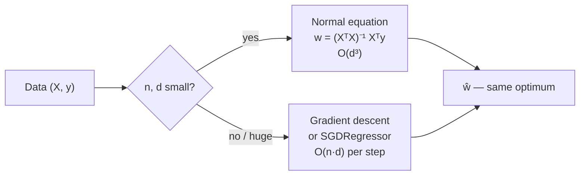
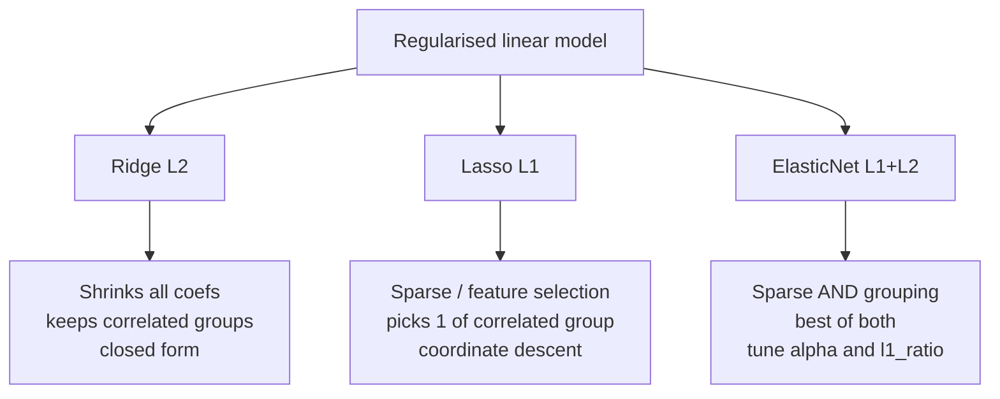
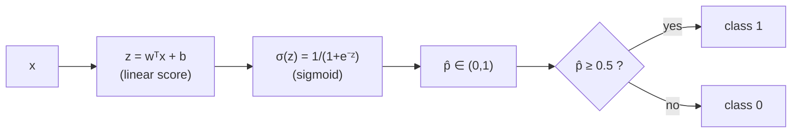
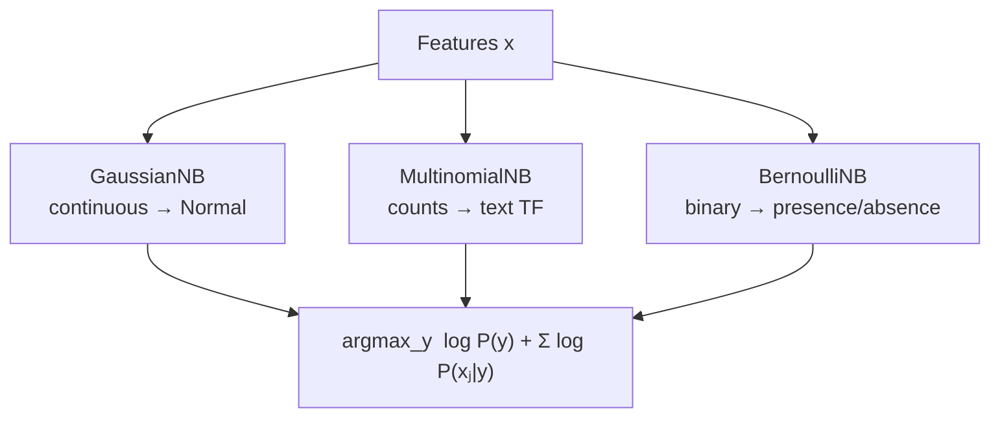
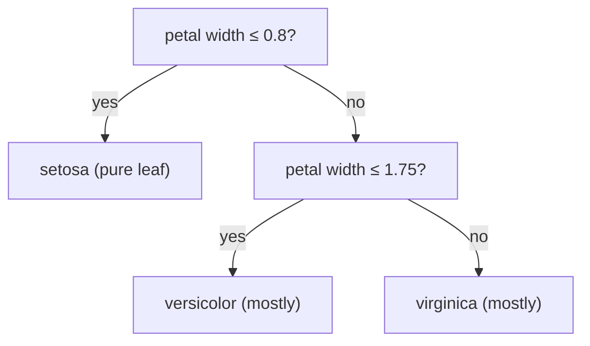
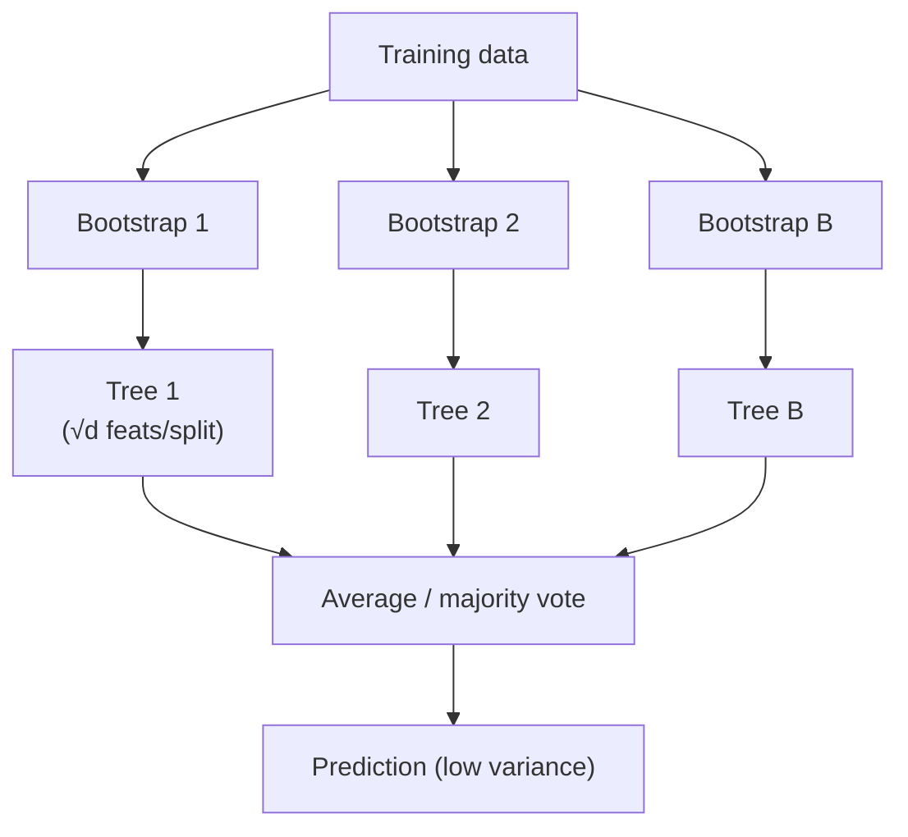
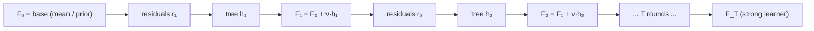
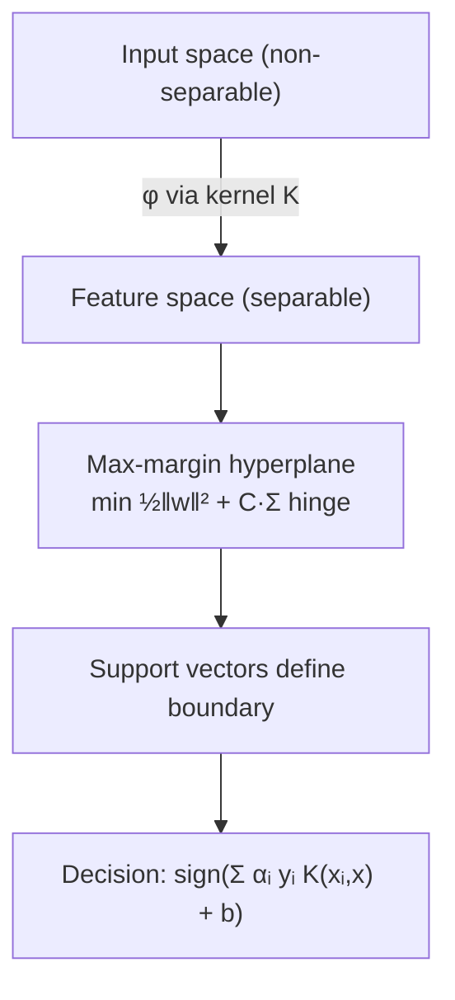
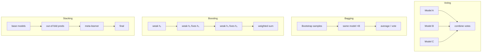
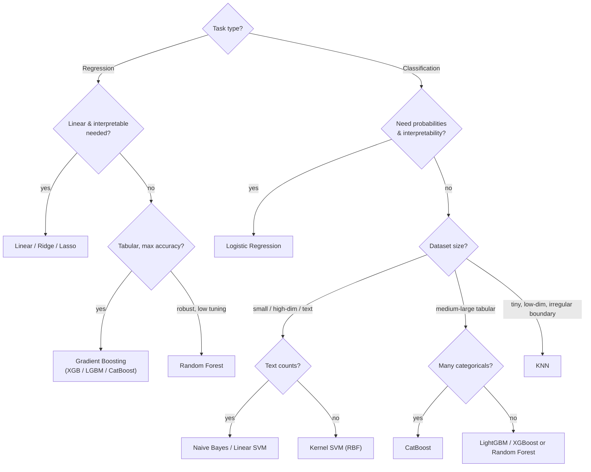

# Supervised Learning Algorithms In Depth
*From ordinary least squares to gradient-boosted trees — the full classical-ML toolbox, derived, drawn, and coded.*

*Part of the AI Engineering & ML Mastery Path — see the [index](../README.md) and [study plan](../MASTER-STUDY-PLAN.md).*

Supervised learning is the workhorse of applied machine learning: you have labelled examples $(\mathbf{x}_i, y_i)$ and you want a function $f$ that predicts $y$ from $\mathbf{x}$ on data you have never seen. This file is the deep, teach-from reference for the classical supervised algorithms — the ones that still win Kaggle tabular competitions, power credit-scoring and fraud systems, and form the conceptual bedrock for everything in deep learning. We go algorithm by algorithm: the **intuition** first, then the **math** (derived, not asserted), then **when to use it**, **pros/cons**, **key hyperparameters**, and **runnable scikit-learn code**. We finish with ensembles, an algorithm-selection decision tree, a from-scratch decision tree, a big comparison table, and a graded quiz + exercises.

> 💡 **Intuition:** Almost every algorithm here is "pick a hypothesis class $\mathcal{H}$, pick a loss $L$, then find the $f \in \mathcal{H}$ that minimises average loss while not overfitting." The differences are *which* $\mathcal{H}$ (lines? trees? margins?), *which* $L$ (squared? log? hinge?), and *how* you regularise.

---

## 🎯 Learning Objectives

By the end of this file you can:

- **Derive** the OLS normal equation and explain the bias–variance role of Ridge ($L_2$), Lasso ($L_1$), and ElasticNet, including *why* Lasso produces sparsity geometrically.
- **Explain** logistic regression as a linear model + sigmoid trained by log-loss, and draw its decision boundary.
- **Choose** between KNN, Naive Bayes, trees, forests, boosting, and SVMs given dataset size, dimensionality, and interpretability needs.
- **Compute** a decision-tree split by Gini and by information gain by hand.
- **Distinguish** bagging, boosting, stacking, and voting, and say what XGBoost, LightGBM, and CatBoost each add over vanilla gradient boosting.
- **Tune** the key hyperparameters of each algorithm and recognise their failure modes.
- **Implement** a decision-tree split and a tiny random forest from scratch in NumPy.

---

## 📋 Prerequisites

- [01 — ML foundations & the learning problem](./01-ml-foundations.md) (bias–variance, train/val/test, overfitting).
- Linear algebra: matrix–vector products, transpose, inverse — see [../math/linear-algebra.md](../math/linear-algebra.md).
- Calculus: gradients and partial derivatives — see [../math/calculus.md](../math/calculus.md).
- Probability basics: conditional probability, Bayes' theorem, Gaussian density — see [../math/probability.md](../math/probability.md).
- Python 3.11+, NumPy, scikit-learn ≥ 1.3 installed.

---

## 📑 Table of Contents

1. [Setup & notation](#1--setup--notation)
2. [Linear Regression (OLS)](#2--linear-regression-ols)
3. [Ridge, Lasso, ElasticNet — regularised linear models](#3--ridge-lasso-elasticnet--regularised-linear-models)
4. [Logistic Regression](#4--logistic-regression)
5. [k-Nearest Neighbours (KNN)](#5--k-nearest-neighbours-knn)
6. [Naive Bayes](#6--naive-bayes)
7. [Decision Trees (CART)](#7--decision-trees-cart)
8. [Random Forests](#8--random-forests)
9. [Boosting: AdaBoost, Gradient Boosting, XGBoost, LightGBM, CatBoost](#9--boosting)
10. [Support Vector Machines (SVM)](#10--support-vector-machines-svm)
11. [Ensembles: bagging vs boosting vs stacking vs voting](#11--ensembles-bagging-vs-boosting-vs-stacking-vs-voting)
12. [Algorithm-selection decision tree](#12--algorithm-selection-decision-tree)
13. [From-scratch implementation](#-from-scratch-implementation)
14. [Big comparison table](#-cheat-sheet)
15. [Knowledge check](#-knowledge-check)
16. [Exercises](#️-exercises)
17. [Further resources](#-further-resources)
18. [What's next](#️-whats-next)

---

## 1 · Setup & notation

| Symbol | Meaning |
|---|---|
| $n$ | number of training examples |
| $d$ | number of features |
| $\mathbf{x}_i \in \mathbb{R}^d$ | feature vector of example $i$ |
| $y_i$ | label (real for regression, class for classification) |
| $X \in \mathbb{R}^{n\times d}$ | design matrix (rows are examples) |
| $\mathbf{w} \in \mathbb{R}^d$, $b$ | weight vector and bias/intercept |
| $\hat{y}$ | model prediction |
| $L(\cdot)$ | loss function |

We append a column of ones to $X$ to absorb the bias into $\mathbf{w}$ when convenient, writing $\hat{y} = X\mathbf{w}$.

> 📝 **Tip:** Every code block below is self-contained and runnable on Python 3.11+ with `numpy`, `scikit-learn`, and (for sections 9) `xgboost`/`lightgbm` if installed. Expected outputs are shown as comments — they are deterministic given the `random_state` seeds.

---

## 2 · Linear Regression (OLS)

> 💡 **Intuition:** Fit the straight line (hyperplane in $d$ dimensions) that makes the *sum of squared vertical gaps* between the line and the points as small as possible. Squaring punishes big misses hard and gives a smooth bowl-shaped objective with a single global minimum.

### Formal definition

Model: $\hat{y} = \mathbf{w}^\top \mathbf{x} + b$. The **ordinary least squares (OLS)** objective is the residual sum of squares:

$$ J(\mathbf{w}) = \frac{1}{2}\,\lVert X\mathbf{w} - \mathbf{y}\rVert_2^2 = \frac{1}{2}\sum_{i=1}^{n}(\mathbf{w}^\top \mathbf{x}_i - y_i)^2 $$

**Normal equation (closed form).** Set the gradient to zero:

$$ \nabla_{\mathbf{w}} J = X^\top(X\mathbf{w} - \mathbf{y}) = 0 \;\Longrightarrow\; X^\top X\,\mathbf{w} = X^\top \mathbf{y} \;\Longrightarrow\; \boxed{\mathbf{w}^\star = (X^\top X)^{-1} X^\top \mathbf{y}} $$

This requires $X^\top X$ to be invertible (full column rank — no perfectly collinear features). When it is singular or ill-conditioned, use the pseudo-inverse $X^+ = (X^\top X)^{-1}X^\top$ (NumPy's `lstsq`) or add regularisation (Section 3).

**Gradient view.** When $n$ or $d$ is large, inverting $X^\top X$ (cost $O(d^3)$) is wasteful; use gradient descent with the same gradient:

$$ \mathbf{w} \leftarrow \mathbf{w} - \eta\, X^\top(X\mathbf{w} - \mathbf{y}) $$

where $\eta$ is the learning rate. The objective is convex (a paraboloid), so GD converges to the same $\mathbf{w}^\star$.

### Worked example by hand

Fit $\hat{y} = w x + b$ to the three points $(1,2),(2,2),(3,4)$. Using the simple-regression formulas with $\bar{x}=2,\ \bar{y}=\tfrac{8}{3}$:

$$ w = \frac{\sum (x_i-\bar{x})(y_i-\bar{y})}{\sum(x_i-\bar{x})^2} = \frac{(-1)(-\tfrac{2}{3}) + 0 + (1)(\tfrac{4}{3})}{1+0+1} = \frac{2}{2} = 1,\qquad b = \bar{y} - w\bar{x} = \tfrac{8}{3} - 2 = \tfrac{2}{3} $$

So $\hat{y} = x + \tfrac{2}{3}$. Predictions: $\{1.667, 2.667, 3.667\}$, residuals $\{0.333, -0.667, 0.333\}$, $\text{RSS}=0.667$.

### Python (normal equation vs sklearn)

```python
import numpy as np
from sklearn.linear_model import LinearRegression

X = np.array([[1.], [2.], [3.]])
y = np.array([2., 2., 4.])

# Normal equation by hand (add bias column)
Xb = np.c_[np.ones(len(X)), X]              # [[1,1],[1,2],[1,3]]
w = np.linalg.inv(Xb.T @ Xb) @ Xb.T @ y
print(np.round(w, 4))                        # [0.6667 1.    ]  -> b=2/3, w=1

# sklearn
lr = LinearRegression().fit(X, y)
print(round(lr.intercept_, 4), round(lr.coef_[0], 4))  # 0.6667 1.0
print(np.round(lr.predict(X), 4))            # [1.6667 2.6667 3.6667]
```



### When to use
- A fast, interpretable **baseline** for any regression problem.
- When the relationship is approximately linear and you want each coefficient to mean "effect of feature $j$ holding others fixed."

### Pros / cons

| Pros | Cons |
|---|---|
| Closed-form, fast, fully interpretable | Assumes linearity & homoscedastic errors |
| No hyperparameters to tune | Sensitive to outliers (squared loss) |
| Coefficients are directly meaningful | Breaks under multicollinearity (unstable $\mathbf{w}$) |

### Key hyperparameters
Essentially none for plain OLS (`fit_intercept`, `positive`). Feature engineering (polynomial terms, interactions) is where the modelling happens.

> ⚠️ **Common Pitfall:** Reporting a low *training* $R^2$ as success. Always evaluate on held-out data, and check residual plots for non-linearity and heteroscedasticity.

**Why it matters for AI/ML:** OLS is the prototypical convex ERM problem; the linear layer + squared loss reappears as the final regression head of deep nets, and its closed form underlies ridge regression and Gaussian processes.

---

## 3 · Ridge, Lasso, ElasticNet — regularised linear models

> 💡 **Intuition:** Unconstrained OLS can blow coefficients up (especially with correlated features), overfitting. Regularisation adds a penalty on coefficient *size*, shrinking them toward zero. $L_2$ (Ridge) shrinks smoothly; $L_1$ (Lasso) can zero coefficients out entirely, doing feature selection for free.

### Formal definitions

$$ \text{Ridge:}\quad J = \tfrac{1}{2}\lVert X\mathbf{w}-\mathbf{y}\rVert_2^2 + \alpha\lVert\mathbf{w}\rVert_2^2,\qquad \mathbf{w}^\star=(X^\top X + 2\alpha I)^{-1}X^\top\mathbf{y} $$

$$ \text{Lasso:}\quad J = \tfrac{1}{2}\lVert X\mathbf{w}-\mathbf{y}\rVert_2^2 + \alpha\lVert\mathbf{w}\rVert_1 \quad(\text{no closed form; coordinate descent}) $$

$$ \text{ElasticNet:}\quad J = \tfrac{1}{2}\lVert X\mathbf{w}-\mathbf{y}\rVert_2^2 + \alpha\!\left(\rho\lVert\mathbf{w}\rVert_1 + \tfrac{1-\rho}{2}\lVert\mathbf{w}\rVert_2^2\right) $$

Here $\alpha \ge 0$ controls penalty strength; $\rho\in[0,1]$ (`l1_ratio`) mixes $L_1$ and $L_2$.

### The geometry of $L_1$ vs $L_2$ (why Lasso zeros things out)

Regularisation is equivalent to constrained optimisation: minimise RSS subject to $\lVert\mathbf{w}\rVert_p \le t$. The RSS contours are ellipses centred at the OLS solution; the solution is where the smallest ellipse first touches the constraint region.

```
        L2 (Ridge): round ball          L1 (Lasso): diamond
            w2                               w2
            |   .--.                         |    /\
            |  /    \   <- ellipse           |   /  \  <- ellipse touches
       -----+--( () )----- w1          -----+--<    >---- w1
            |  \    /      touches           |   \  /   a CORNER  => w1=0
            |   '--'       on a curve        |    \/    (sparse!)
```

> 🎯 **Key Insight:** The $L_1$ ball has **corners on the axes**. An ellipse is far more likely to first touch a corner than a flat face, and a corner means some coordinates are exactly zero. The $L_2$ ball is round with no corners, so coefficients shrink but rarely hit exactly zero.

### Worked example by hand (Ridge on a scalar)

One feature, RSS minimum at $w_{\text{OLS}}=4$, with $X^\top X = 1$. Ridge solves $w(1+2\alpha)=4$, so $w_{\text{ridge}} = 4/(1+2\alpha)$. With $\alpha=0.5$: $w=4/2=2$ — halved. As $\alpha\to\infty$, $w\to0$.

### Python

```python
import numpy as np
from sklearn.linear_model import Ridge, Lasso, ElasticNet
from sklearn.preprocessing import StandardScaler
from sklearn.pipeline import make_pipeline

rng = np.random.RandomState(0)
X = rng.randn(100, 10)
true_w = np.array([3., 0., 0., -2., 0., 0., 0., 1.5, 0., 0.])  # sparse truth
y = X @ true_w + 0.5 * rng.randn(100)

for name, model in [("Ridge", Ridge(alpha=1.0)),
                    ("Lasso", Lasso(alpha=0.1)),
                    ("ElasticNet", ElasticNet(alpha=0.1, l1_ratio=0.5))]:
    m = make_pipeline(StandardScaler(), model).fit(X, y)
    coef = m[-1].coef_
    print(name, "nonzero:", int(np.sum(np.abs(coef) > 1e-4)))
# Ridge nonzero: 10      (all kept, just shrunk)
# Lasso nonzero: 3       (recovers the 3 true features)
# ElasticNet nonzero: 4  (sparse, but groups correlated features)
```



### When to use
- **Ridge:** many features, multicollinearity, you want stability and keep all features.
- **Lasso:** you suspect only a few features matter and want automatic selection.
- **ElasticNet:** high-dimensional with groups of correlated features ($d \gg n$, genomics, text).

### Pros / cons

| Model | Pros | Cons |
|---|---|---|
| Ridge | Stable, closed form, handles collinearity | No sparsity; less interpretable |
| Lasso | Sparse, selects features | Arbitrary pick among correlated; unstable selection |
| ElasticNet | Sparse + grouping, robust | Two hyperparameters to tune |

### Key hyperparameters
`alpha` (penalty strength — the big one, tune on a log grid), `l1_ratio` (ElasticNet mix). **Always standardise features first** — penalties are scale-sensitive.

> ⚠️ **Common Pitfall:** Forgetting to scale. A feature measured in millimetres gets a tiny coefficient and is barely penalised relative to one in metres, corrupting selection.

**Why it matters for AI/ML:** Weight decay in neural networks *is* $L_2$ regularisation; $L_1$ sparsity underlies model compression and the lasso path informs feature importance.

---

## 4 · Logistic Regression

> 💡 **Intuition:** Take linear regression's score $z=\mathbf{w}^\top\mathbf{x}+b$, then squash it through an S-curve so it lands in $(0,1)$ and reads as a probability. Train it to make the predicted probabilities match the 0/1 labels.

### Formal definition

The **sigmoid** (logistic) function:

$$ \sigma(z)=\frac{1}{1+e^{-z}},\qquad \hat{p}=P(y=1\mid\mathbf{x})=\sigma(\mathbf{w}^\top\mathbf{x}+b) $$

It is trained by minimising the **log-loss (binary cross-entropy)**, the negative log-likelihood of a Bernoulli model:

$$ J(\mathbf{w}) = -\frac{1}{n}\sum_{i=1}^{n}\Big[y_i\log\hat{p}_i + (1-y_i)\log(1-\hat{p}_i)\Big] $$

A beautiful fact: the gradient has the *same form* as linear regression:

$$ \nabla_{\mathbf{w}} J = \frac{1}{n}\sum_{i=1}^{n}(\hat{p}_i - y_i)\,\mathbf{x}_i = \frac{1}{n}X^\top(\hat{\mathbf{p}}-\mathbf{y}) $$

There is **no closed form** (the sigmoid is nonlinear in $\mathbf{w}$); solve by gradient descent / Newton's method (IRLS). The loss is convex, so the optimum is global.

**Decision boundary.** Predict class 1 when $\hat{p}\ge 0.5$, i.e. when $z=\mathbf{w}^\top\mathbf{x}+b\ge 0$. That boundary $\mathbf{w}^\top\mathbf{x}+b=0$ is a **hyperplane** — logistic regression is a *linear* classifier; the nonlinearity only maps scores to probabilities.

### Worked example by hand

One feature, $w=2,\ b=-4$. For $x=3$: $z=2(3)-4=2$, $\hat{p}=\sigma(2)=\frac{1}{1+e^{-2}}=\frac{1}{1+0.1353}=0.881$ → class 1. For $x=1$: $z=-2$, $\hat{p}=0.119$ → class 0. Boundary at $z=0\Rightarrow x=2$.

### Python

```python
import numpy as np
from sklearn.linear_model import LogisticRegression
from sklearn.datasets import make_classification
from sklearn.model_selection import train_test_split
from sklearn.metrics import accuracy_score, log_loss

X, y = make_classification(n_samples=400, n_features=4, n_informative=3,
                           random_state=42)
Xtr, Xte, ytr, yte = train_test_split(X, y, test_size=0.25, random_state=42)

clf = LogisticRegression(C=1.0, max_iter=1000).fit(Xtr, ytr)
proba = clf.predict_proba(Xte)[:, 1]
print("acc :", round(accuracy_score(yte, clf.predict(Xte)), 3))  # acc : 0.88
print("loss:", round(log_loss(yte, proba), 3))                   # loss: 0.318
```



### When to use
- Binary (or, via softmax/`multinomial`, multiclass) classification where you want **calibrated probabilities** and **interpretable** coefficients (log-odds).
- Strong, fast baseline; great when classes are roughly linearly separable.

### Pros / cons

| Pros | Cons |
|---|---|
| Probabilistic, interpretable (odds ratios) | Only linear boundaries (unless you add features/kernels) |
| Convex → global optimum, fast | Can be over-confident if separable (needs regularisation) |
| Regularisation built in (`penalty`) | Sensitive to outliers/feature scaling for convergence speed |

### Key hyperparameters
`C` (inverse of regularisation strength — *smaller = stronger* penalty), `penalty` (`l2`/`l1`/`elasticnet`), `solver` (`lbfgs`, `liblinear`, `saga`), `class_weight` for imbalance.

> ⚠️ **Common Pitfall:** With perfectly separable data and no penalty, weights diverge to infinity (the likelihood has no finite maximiser). Keep `C` finite.

**Why it matters for AI/ML:** Logistic regression *is* a single-neuron network with a sigmoid activation and cross-entropy loss — the atom from which deep classifiers are built.

---

## 5 · k-Nearest Neighbours (KNN)

> 💡 **Intuition:** "You are the average of your $k$ nearest friends." To classify a new point, look at the $k$ closest training points and vote; to regress, average their targets. There is no training — it just memorises the data.

### Formal definition

Given a distance $d(\cdot,\cdot)$ (usually Euclidean $\lVert\mathbf{x}-\mathbf{x}'\rVert_2$), let $N_k(\mathbf{x})$ be the indices of the $k$ nearest training points. Then

$$ \text{classification: } \hat{y}=\operatorname*{mode}_{i\in N_k(\mathbf{x})} y_i,\qquad \text{regression: } \hat{y}=\frac{1}{k}\sum_{i\in N_k(\mathbf{x})}y_i. $$

It is a **non-parametric, instance-based** (lazy) learner: all computation happens at query time, cost $O(nd)$ per query (brute force) or $O(\log n)$ with KD-/Ball-trees in low dimensions.

> 🎯 **Key Insight:** Small $k$ → low bias, high variance (jagged, noise-sensitive boundary). Large $k$ → high bias, low variance (smooth, eventually predicting the global majority). $k$ is your bias–variance dial.

### Python

```python
import numpy as np
from sklearn.neighbors import KNeighborsClassifier
from sklearn.preprocessing import StandardScaler
from sklearn.pipeline import make_pipeline
from sklearn.datasets import load_iris
from sklearn.model_selection import cross_val_score

X, y = load_iris(return_X_y=True)
for k in (1, 5, 15):
    pipe = make_pipeline(StandardScaler(), KNeighborsClassifier(n_neighbors=k))
    print(k, round(cross_val_score(pipe, X, y, cv=5).mean(), 3))
# 1 0.96
# 5 0.967
# 15 0.973
```

### When to use
- Small/medium datasets, low dimensionality, irregular decision boundaries, and when a non-parametric baseline is wanted. Also recommender-style similarity lookups.

### Pros / cons

| Pros | Cons |
|---|---|
| Zero training, simple, no assumptions | Slow at prediction; stores all data |
| Naturally multiclass; adapts to complex boundaries | **Curse of dimensionality** — distances meaningless in high $d$ |
| Few hyperparameters | Must scale features; sensitive to irrelevant features |

### Key hyperparameters
`n_neighbors` (k), `weights` (`uniform`/`distance`), `metric` (`euclidean`, `manhattan`, `minkowski`), `algorithm` (`auto`/`kd_tree`/`ball_tree`).

> ⚠️ **Common Pitfall:** Not standardising. A feature with a large range dominates the Euclidean distance and silently determines every neighbour.

**Why it matters for AI/ML:** KNN in a *learned embedding space* (e.g., face recognition, vector databases for RAG) is exactly how modern similarity search works.

---

## 6 · Naive Bayes

> 💡 **Intuition:** Use Bayes' theorem to turn "how likely is this class to generate these features?" into "given these features, how likely is each class?" The "naive" trick: pretend all features are independent given the class, so the joint likelihood is a simple product. Crude assumption, often shockingly effective.

### Formal definition

By Bayes' theorem and the conditional-independence assumption:

$$ P(y\mid\mathbf{x}) \propto P(y)\prod_{j=1}^{d}P(x_j\mid y),\qquad \hat{y}=\arg\max_{y}\;\log P(y)+\sum_{j=1}^{d}\log P(x_j\mid y). $$

The three variants differ only in the per-feature likelihood $P(x_j\mid y)$:

| Variant | $P(x_j\mid y)$ model | Use for |
|---|---|---|
| **GaussianNB** | Gaussian $\mathcal{N}(\mu_{jy},\sigma_{jy}^2)$ | continuous features |
| **MultinomialNB** | multinomial counts | word counts / TF (text) |
| **BernoulliNB** | Bernoulli (0/1 presence) | binary features (word present?) |

**Laplace/Lidstone smoothing** (`alpha`) adds a pseudo-count so an unseen feature value doesn't force a zero probability:

$$ P(x_j=v\mid y)=\frac{\text{count}(x_j=v,y)+\alpha}{\text{count}(y)+\alpha\,V}. $$

### Worked example by hand (MultinomialNB, spam)

Priors $P(\text{spam})=P(\text{ham})=0.5$. Word "free": $P(\text{free}\mid\text{spam})=0.6,\ P(\text{free}\mid\text{ham})=0.1$. For a one-word document "free":

$$ P(\text{spam}\mid\text{free})\propto 0.5\times0.6=0.30,\quad P(\text{ham}\mid\text{free})\propto 0.5\times0.1=0.05. $$

Normalise: $P(\text{spam}\mid\text{free})=\frac{0.30}{0.35}=0.857$ → classify **spam**.

### Python

```python
import numpy as np
from sklearn.naive_bayes import GaussianNB, MultinomialNB
from sklearn.datasets import fetch_20newsgroups
from sklearn.feature_extraction.text import CountVectorizer
from sklearn.pipeline import make_pipeline
from sklearn.metrics import accuracy_score

cats = ['rec.sport.hockey', 'sci.space']
tr = fetch_20newsgroups(subset='train', categories=cats, remove=('headers','footers','quotes'))
te = fetch_20newsgroups(subset='test',  categories=cats, remove=('headers','footers','quotes'))

model = make_pipeline(CountVectorizer(), MultinomialNB(alpha=0.1)).fit(tr.data, tr.target)
print(round(accuracy_score(te.target, model.predict(te.data)), 3))  # ~0.96
```



### When to use
- Text classification (spam, sentiment, topic), very high-dimensional sparse data, tiny training sets, or when you need a blazing-fast probabilistic baseline.

### Pros / cons

| Pros | Cons |
|---|---|
| Extremely fast, scales to millions of features | Independence assumption usually false |
| Works with little data | Probabilities poorly calibrated (over-confident) |
| Naturally online/incremental (`partial_fit`) | Can't learn feature interactions |

### Key hyperparameters
`alpha` (smoothing), `fit_prior`/`class_prior`, `var_smoothing` (GaussianNB), `binarize` (BernoulliNB).

> ⚠️ **Common Pitfall:** Using GaussianNB on word counts (or MultinomialNB on standardised, negative-valued data — it requires non-negative features). Match the variant to the feature type.

**Why it matters for AI/ML:** A canonical *generative* classifier and the historical baseline for NLP; understanding it clarifies the generative-vs-discriminative distinction (NB vs logistic regression).

---

## 7 · Decision Trees (CART)

> 💡 **Intuition:** Play "20 questions." Repeatedly split the data on the single yes/no feature threshold that best separates the classes (or reduces variance), forming a tree of `if/else` rules. Follow the branches to a leaf and read off the prediction.

### Formal definition

**CART** (Classification And Regression Trees) does binary recursive splitting. At each node it picks the feature $j$ and threshold $t$ that maximise the *impurity decrease*.

**Impurity measures (classification),** with $p_c$ = fraction of class $c$ in the node:

$$ \text{Gini}(S)=1-\sum_{c}p_c^2,\qquad \text{Entropy}(S)=-\sum_{c}p_c\log_2 p_c. $$

**Information gain** of a split into children $L,R$:

$$ \Delta = \text{Imp}(S) - \left(\frac{|L|}{|S|}\text{Imp}(L)+\frac{|R|}{|S|}\text{Imp}(R)\right). $$

For **regression**, impurity is variance (MSE) and the leaf predicts the mean target.

> 🎯 **Key Insight:** Gini and entropy almost always pick the same splits; Gini is slightly faster (no log) and is sklearn's default. Entropy/information gain comes from information theory and is marginally more sensitive to changes in node probabilities.

### Worked example by hand (information gain)

Node with 10 samples: 5 positive, 5 negative ⇒ $\text{Entropy}=-\tfrac12\log_2\tfrac12-\tfrac12\log_2\tfrac12=1.0$ bit. A split yields:
- Left (4): 4 pos, 0 neg ⇒ entropy 0.
- Right (6): 1 pos, 5 neg ⇒ $-\tfrac16\log_2\tfrac16-\tfrac56\log_2\tfrac56 = 0.650$.

Weighted child entropy $=\tfrac{4}{10}(0)+\tfrac{6}{10}(0.650)=0.390$. **Information gain $=1.0-0.390=0.610$ bits.** (Gini check: parent $=0.5$; children $0$ and $1-(1/6)^2-(5/6)^2=0.278$; weighted $=0.167$; Gini gain $=0.333$.)

### Pruning
A fully grown tree memorises the training set (variance explosion). Control complexity by **pre-pruning** (`max_depth`, `min_samples_leaf`, `min_samples_split`) or **post-pruning** via **cost-complexity pruning** (`ccp_alpha`): minimise $R_\alpha(T)=R(T)+\alpha|T|$ where $|T|$ is the number of leaves — larger $\alpha$ prunes more.

### Python

```python
import numpy as np
from sklearn.tree import DecisionTreeClassifier, export_text
from sklearn.datasets import load_iris
from sklearn.model_selection import cross_val_score

X, y = load_iris(return_X_y=True)
tree = DecisionTreeClassifier(criterion='gini', max_depth=3, random_state=0).fit(X, y)
print(round(cross_val_score(tree, X, y, cv=5).mean(), 3))   # ~0.96
print(export_text(tree, feature_names=load_iris().feature_names).split('\n')[0])
# |--- petal width (cm) <= 0.80
```



### When to use
- Need an **interpretable**, rule-based model; mixed numeric/categorical features; non-linear interactions; minimal preprocessing (no scaling required).

### Pros / cons

| Pros | Cons |
|---|---|
| Highly interpretable; no scaling needed | High variance — unstable; overfit easily |
| Handles non-linearity & interactions | Greedy splits → not globally optimal |
| Fast prediction; handles mixed types | Axis-aligned boundaries; poor extrapolation |

### Key hyperparameters
`max_depth`, `min_samples_split`, `min_samples_leaf`, `max_features`, `criterion`, `ccp_alpha`.

> ⚠️ **Common Pitfall:** Letting a single tree grow unbounded and trusting its accuracy. A lone unpruned tree is the textbook high-variance model — the reason forests and boosting exist.

**Why it matters for AI/ML:** Trees are the base learner for the most powerful tabular models on earth (RF, XGBoost, LightGBM); understanding splitting is prerequisite for understanding them.

---

## 8 · Random Forests

> 💡 **Intuition:** One deep tree is a smart but moody expert that overfits. Train *hundreds* of them, each on a different random bootstrap sample of the data and each split considering only a random subset of features, then average their votes. The errors are decorrelated and cancel out — wisdom of a diverse crowd.

### Formal definition

A random forest is **bagging** (Bootstrap AGGregatING) of decision trees plus **feature subsampling**:

1. Draw $B$ bootstrap samples (sample $n$ rows with replacement).
2. Grow a deep tree on each, but at every split consider only a random subset of $m$ features (typically $m=\sqrt{d}$ for classification, $m=d/3$ for regression).
3. Aggregate: majority vote (classification) or mean (regression).

Averaging $B$ i.d. trees each with variance $\sigma^2$ and pairwise correlation $\rho$ gives ensemble variance

$$ \text{Var} = \rho\sigma^2 + \frac{1-\rho}{B}\sigma^2. $$

> 🎯 **Key Insight:** Feature subsampling exists to *lower $\rho$*. As $B\to\infty$ the second term vanishes, so the only way to keep reducing variance is to **decorrelate** the trees — that's what random feature selection buys you.

**Out-of-bag (OOB) estimate.** Each bootstrap omits ~$1/e \approx 37\%$ of rows. Predicting each row using only the trees that did *not* see it gives a free, almost-unbiased validation score (`oob_score=True`) — no separate hold-out needed.

### Python

```python
import numpy as np
from sklearn.ensemble import RandomForestClassifier
from sklearn.datasets import make_classification

X, y = make_classification(n_samples=2000, n_features=20, n_informative=8,
                           random_state=0)
rf = RandomForestClassifier(n_estimators=300, max_features='sqrt',
                            oob_score=True, n_jobs=-1, random_state=0).fit(X, y)
print("OOB acc:", round(rf.oob_score_, 3))                 # ~0.93
print("top feat importance:", round(rf.feature_importances_.max(), 3))
```



### When to use
- Strong, low-tuning default for tabular data; robust to outliers and irrelevant features; gives feature importances and OOB validation for free.

### Pros / cons

| Pros | Cons |
|---|---|
| Excellent accuracy with little tuning | Larger memory; slower prediction than one tree |
| Resists overfitting; OOB built-in | Less interpretable than a single tree |
| Parallelisable; handles mixed types | Usually edged out by tuned boosting on tabular |

### Key hyperparameters
`n_estimators` (more is safer, diminishing returns), `max_features` (the key decorrelator), `max_depth`/`min_samples_leaf`, `bootstrap`, `class_weight`.

> ⚠️ **Common Pitfall:** Treating impurity-based `feature_importances_` as ground truth — they are biased toward high-cardinality features. Prefer **permutation importance** for honest rankings.

**Why it matters for AI/ML:** The canonical bagging ensemble and a default tabular baseline; the variance-reduction-by-decorrelation idea recurs across ML (e.g., dropout as implicit ensembling).

---

## 9 · Boosting

> 💡 **Intuition:** Where bagging trains many strong learners *in parallel and averages*, boosting trains many *weak* learners **sequentially**, each one focusing on the mistakes the previous ones made. The crowd is built deliberately, not independently.

### 9.1 AdaBoost (Adaptive Boosting)

Re-weights *examples*: misclassified points get heavier so the next stump attends to them. Final model is a weighted vote of weak learners $h_t$:

$$ H(\mathbf{x})=\operatorname{sign}\!\Big(\sum_{t=1}^{T}\alpha_t h_t(\mathbf{x})\Big),\qquad \alpha_t=\tfrac12\ln\frac{1-\varepsilon_t}{\varepsilon_t} $$

where $\varepsilon_t$ is learner $t$'s weighted error. Sample weights update as $w_i \leftarrow w_i\,e^{-\alpha_t y_i h_t(\mathbf{x}_i)}$, then renormalise. AdaBoost is equivalent to forward stagewise additive modelling under the **exponential loss** $e^{-y H(\mathbf{x})}$.

### 9.2 Gradient Boosting (the general framework)

Fit each new tree to the **negative gradient (pseudo-residuals)** of the loss w.r.t. the current model's predictions — gradient descent *in function space*. With model $F_{m-1}$ and differentiable loss $L$:

$$ r_{im}=-\left[\frac{\partial L(y_i,F(\mathbf{x}_i))}{\partial F(\mathbf{x}_i)}\right]_{F=F_{m-1}},\qquad F_m(\mathbf{x})=F_{m-1}(\mathbf{x})+\nu\, h_m(\mathbf{x}) $$

where $h_m$ is a regression tree fit to the residuals $r_{im}$ and $\nu\in(0,1]$ is the **learning rate (shrinkage)**. For squared loss, $r_{im}=y_i-F_{m-1}(\mathbf{x}_i)$ — literally the residuals, hence "fit the leftover error."

> 🎯 **Key Insight:** There is a fundamental trade-off: a small learning rate $\nu$ needs more trees $T$ but generalises better. Tune them together; never max out one alone.

### 9.3 What each modern library adds

| Library | What it adds over vanilla GBM |
|---|---|
| **XGBoost** | Second-order (Newton) boosting using gradient **and Hessian**; explicit $L_1/L_2$ leaf regularisation; sparsity-aware split finding (native missing-value handling); weighted quantile sketch; parallel/cache-aware. |
| **LightGBM** | **Histogram** binning of features (fast, low memory); **leaf-wise** growth (splits the leaf with max loss reduction, not level-wise → deeper, more accurate but overfit-prone); **GOSS** (gradient-based one-side sampling) and **EFB** (exclusive feature bundling). Fastest on large data. |
| **CatBoost** | **Ordered boosting** (cures prediction-shift/target-leakage bias); native, principled **categorical** encoding via ordered target statistics; **symmetric (oblivious) trees** → fast, regularised inference. Best out-of-the-box on categorical-heavy data. |

### Worked example by hand (one GBM step, squared loss)

Targets $y=[10,12,14]$; initial model = mean $F_0=12$. Residuals $r=[-2,0,2]$. A regression stump splits to predict roughly $[-2,0,2]$. With $\nu=0.5$, update $F_1 = 12 + 0.5\cdot[-2,0,2] = [11,12,13]$ — predictions move halfway toward the truth; repeat.

### Python

```python
import numpy as np
from sklearn.ensemble import (AdaBoostClassifier, GradientBoostingClassifier,
                              HistGradientBoostingClassifier)
from sklearn.datasets import make_classification
from sklearn.model_selection import cross_val_score

X, y = make_classification(n_samples=3000, n_features=20, n_informative=10,
                           random_state=0)
models = {
    "AdaBoost":   AdaBoostClassifier(n_estimators=200, random_state=0),
    "GBM":        GradientBoostingClassifier(n_estimators=200, learning_rate=0.1,
                                             max_depth=3, random_state=0),
    "HistGBM":    HistGradientBoostingClassifier(max_iter=300, learning_rate=0.1,
                                                 random_state=0),
}
for name, m in models.items():
    print(name, round(cross_val_score(m, X, y, cv=5, n_jobs=-1).mean(), 3))
# AdaBoost 0.905
# GBM      0.929
# HistGBM  0.934

# XGBoost / LightGBM (if installed) — same sklearn-style API:
# from xgboost import XGBClassifier
# XGBClassifier(n_estimators=300, learning_rate=0.05, max_depth=6,
#               subsample=0.8, colsample_bytree=0.8, eval_metric='logloss')
# from lightgbm import LGBMClassifier
# LGBMClassifier(n_estimators=500, learning_rate=0.05, num_leaves=31)
```



### When to use
- The **go-to for tabular data** when you want maximum predictive accuracy and can afford tuning. LightGBM/XGBoost for large numeric data; CatBoost for many categorical columns.

### Pros / cons

| Pros | Cons |
|---|---|
| State-of-the-art accuracy on tabular | Sequential → harder to parallelise than RF |
| Handles mixed types; native missing/categorical (modern libs) | Sensitive to hyperparameters; can overfit |
| Built-in regularisation, early stopping | Less interpretable; longer to tune than RF |

### Key hyperparameters
`learning_rate` (ν) + `n_estimators`/`max_iter` (tune jointly, use **early stopping**), `max_depth`/`num_leaves`, `subsample` & `colsample_bytree` (stochastic boosting), `reg_lambda`/`reg_alpha`, `min_child_weight`.

> ⚠️ **Common Pitfall:** Cranking `n_estimators` with a high learning rate and no early stopping — you blow past the optimum and overfit. Use a validation set with `early_stopping_rounds`.

**Why it matters for AI/ML:** Gradient boosting *is* functional gradient descent — the same optimise-a-loss-by-following-its-gradient principle that trains neural nets, just in function space over trees.

---

## 10 · Support Vector Machines (SVM)

> 💡 **Intuition:** Of all the lines that separate two classes, pick the one with the widest "no-man's-land" (margin) between them. Only the borderline points (support vectors) matter. For non-linear data, secretly map points to a higher-dimensional space where a flat separator exists — using kernels so you never compute the mapping explicitly.

### Formal definition

**Hard-margin SVM** maximises the margin $2/\lVert\mathbf{w}\rVert$, i.e.

$$ \min_{\mathbf{w},b}\tfrac12\lVert\mathbf{w}\rVert^2 \quad\text{s.t.}\quad y_i(\mathbf{w}^\top\mathbf{x}_i+b)\ge 1\ \ \forall i. $$

Real data isn't separable, so **soft-margin** adds slack $\xi_i$ and a penalty $C$:

$$ \min_{\mathbf{w},b,\xi}\ \tfrac12\lVert\mathbf{w}\rVert^2 + C\sum_i\xi_i\quad\text{s.t.}\quad y_i(\mathbf{w}^\top\mathbf{x}_i+b)\ge 1-\xi_i,\ \xi_i\ge0. $$

This is equivalent to minimising the **hinge loss** plus $L_2$ regularisation:

$$ \min_{\mathbf{w},b}\ \tfrac{1}{2}\lVert\mathbf{w}\rVert^2 + C\sum_i \max\big(0,\ 1-y_i(\mathbf{w}^\top\mathbf{x}_i+b)\big). $$

**The kernel trick.** The dual depends on data only through inner products $\mathbf{x}_i^\top\mathbf{x}_j$. Replace them with a kernel $K(\mathbf{x}_i,\mathbf{x}_j)=\phi(\mathbf{x}_i)^\top\phi(\mathbf{x}_j)$ to learn a non-linear boundary without ever computing $\phi$:

$$ \text{RBF: } K(\mathbf{x},\mathbf{x}')=\exp\!\big(-\gamma\lVert\mathbf{x}-\mathbf{x}'\rVert^2\big),\qquad \text{poly: } (\gamma\,\mathbf{x}^\top\mathbf{x}'+r)^p. $$

> 🎯 **Key Insight:** $C$ trades margin width vs. violations (small $C$ = wide soft margin, more bias; large $C$ = fits training data hard, more variance). $\gamma$ sets the RBF "reach": large $\gamma$ = each point's influence is local → wiggly, overfit boundary.

### Worked example (hinge loss)

Point with $y=+1$ and score $z=\mathbf{w}^\top\mathbf{x}+b=0.3$: hinge $=\max(0,1-0.3)=0.7$ (inside margin → penalised). If $z=1.5$: hinge $=\max(0,1-1.5)=0$ (correct & beyond margin → no loss). If $z=-0.5$: hinge $=1.5$ (misclassified → large loss).

### Python

```python
import numpy as np
from sklearn.svm import SVC
from sklearn.preprocessing import StandardScaler
from sklearn.pipeline import make_pipeline
from sklearn.datasets import make_moons
from sklearn.model_selection import cross_val_score

X, y = make_moons(n_samples=400, noise=0.25, random_state=0)
for kernel in ("linear", "rbf"):
    pipe = make_pipeline(StandardScaler(), SVC(kernel=kernel, C=1.0, gamma="scale"))
    print(kernel, round(cross_val_score(pipe, X, y, cv=5).mean(), 3))
# linear 0.85
# rbf    0.95   (kernel captures the non-linear moons)
```



### When to use
- Small-to-medium datasets, high-dimensional spaces (text, bioinformatics), clear margin, when you want strong accuracy and don't need probabilities or huge $n$.

### Pros / cons

| Pros | Cons |
|---|---|
| Effective in high dimensions; max-margin = good generalisation | Scales poorly: $O(n^2)$–$O(n^3)$, bad for large $n$ |
| Kernel trick → flexible non-linearity | Needs careful $C,\gamma$ tuning + feature scaling |
| Memory-efficient (only support vectors) | No native probabilities (Platt scaling needed) |

### Key hyperparameters
`C` (regularisation), `kernel` (`linear`/`rbf`/`poly`/`sigmoid`), `gamma` (RBF/poly reach), `degree` (poly), `class_weight`. Use `LinearSVC`/`SGDClassifier(loss='hinge')` for large $n$.

> ⚠️ **Common Pitfall:** Running `SVC(kernel='rbf')` on hundreds of thousands of rows and waiting forever — kernel SVM is super-linear in $n$. Use linear SVM or switch to boosting.

**Why it matters for AI/ML:** Margins and hinge loss formalise "confident separation"; kernels are the classical route to non-linearity, the conceptual ancestor of the feature maps deep nets learn.

---

## 11 · Ensembles: bagging vs boosting vs stacking vs voting

> 💡 **Intuition:** Many mediocre models, combined cleverly, beat one good model. *How* you combine them is the distinction.

| Method | How models relate | Reduces mainly | Examples |
|---|---|---|---|
| **Voting** | Independent, *different* algorithms; combine by (weighted) majority / averaged probabilities | variance | `VotingClassifier(LR, RF, SVC)` |
| **Bagging** | Parallel, *same* algorithm on bootstrap samples | **variance** | Random Forest, BaggingClassifier |
| **Boosting** | Sequential, each fixes prior errors | **bias** (and variance) | AdaBoost, GBM, XGBoost |
| **Stacking** | Base models' predictions become features for a **meta-learner** | bias & variance | `StackingClassifier(..., final_estimator=LR)` |



> 🎯 **Key Insight:** Bagging → take a *low-bias, high-variance* learner (deep trees) and average away the variance. Boosting → take a *high-bias, low-variance* learner (stumps) and add bias-reducing corrections. Match the ensemble to the weakness of the base learner.

```python
from sklearn.ensemble import StackingClassifier, VotingClassifier, RandomForestClassifier
from sklearn.linear_model import LogisticRegression
from sklearn.svm import SVC

estimators = [('rf', RandomForestClassifier(n_estimators=200, random_state=0)),
              ('svc', SVC(probability=True, random_state=0))]
stack = StackingClassifier(estimators=estimators,
                           final_estimator=LogisticRegression())
vote  = VotingClassifier(estimators + [('lr', LogisticRegression(max_iter=1000))],
                         voting='soft')
```

> ⚠️ **Common Pitfall:** Stacking with in-sample predictions leaks the target — base models that memorised training rows feed the meta-learner cheating features. Always use **out-of-fold** predictions (sklearn's `StackingClassifier` does this for you).

---

## 12 · Algorithm-selection decision tree



> 📝 **Tip:** In practice: start with a **linear/logistic baseline**, then a **Random Forest** (low tuning), then **gradient boosting** (tuned) — that ladder solves most tabular problems. Reach for SVM/KNN/NB for specific regimes (high-dim, similarity, sparse text).

---

## 🧮 From-Scratch Implementation

Two NumPy-only builds: (1) the best information-gain split, and (2) a tiny random forest by bagging decision stumps.

```python
import numpy as np

# ---------- (1) Best split by information gain (entropy) ----------
def entropy(y):
    if len(y) == 0:
        return 0.0
    p = np.bincount(y) / len(y)
    p = p[p > 0]
    return float(-np.sum(p * np.log2(p)))

def best_split(X, y):
    """Return (feature, threshold, gain) maximising information gain."""
    n, d = X.shape
    parent = entropy(y)
    best = (None, None, 0.0)
    for j in range(d):
        for t in np.unique(X[:, j]):
            left = X[:, j] <= t
            if left.sum() == 0 or left.sum() == n:
                continue
            child = (left.mean() * entropy(y[left]) +
                     (~left).mean() * entropy(y[~left]))
            gain = parent - child
            if gain > best[2]:
                best = (j, float(t), float(gain))
    return best

# ---------- (2) Decision stump + bagged "random forest" ----------
class Stump:
    def fit(self, X, y):
        self.j, self.t, _ = best_split(X, y)
        if self.j is None:                       # no useful split → constant
            self.left = self.right = np.bincount(y).argmax()
        else:
            mask = X[:, self.j] <= self.t
            self.left  = np.bincount(y[mask]).argmax()
            self.right = np.bincount(y[~mask]).argmax()
        return self
    def predict(self, X):
        if self.j is None:
            return np.full(len(X), self.left)
        mask = X[:, self.j] <= self.t
        return np.where(mask, self.left, self.right)

class TinyForest:
    def __init__(self, n_trees=25, seed=0):
        self.n_trees, self.rng = n_trees, np.random.RandomState(seed)
    def fit(self, X, y):
        n = len(X)
        self.trees = []
        for _ in range(self.n_trees):
            idx = self.rng.randint(0, n, n)       # bootstrap sample
            self.trees.append(Stump().fit(X[idx], y[idx]))
        return self
    def predict(self, X):
        votes = np.stack([t.predict(X) for t in self.trees])  # (T, n)
        return np.array([np.bincount(col).argmax() for col in votes.T])

# ---------- Demo ----------
from sklearn.datasets import make_classification
from sklearn.model_selection import train_test_split
from sklearn.metrics import accuracy_score

X, y = make_classification(n_samples=600, n_features=6, n_informative=4,
                           n_classes=2, random_state=1)
Xtr, Xte, ytr, yte = train_test_split(X, y, test_size=0.3, random_state=1)

print("single stump:", round(accuracy_score(yte, Stump().fit(Xtr, ytr).predict(Xte)), 3))
print("tiny forest :", round(accuracy_score(yte, TinyForest(50).fit(Xtr, ytr).predict(Xte)), 3))
# single stump: ~0.70
# tiny forest : ~0.80   (bagging stumps beats one stump)
```

> 💡 **Intuition:** A single stump is weak (~0.70). Bagging 50 of them on different bootstrap samples decorrelates their errors and lifts accuracy — the random-forest idea in miniature.

---

## 📊 Cheat Sheet

### Big comparison table

| Algorithm | Interpretability | Train speed | Predict speed | Scales to big $n$? | Nonlinearity | Handles missing | Handles categorical | Needs scaling | Typical use |
|---|---|---|---|---|---|---|---|---|---|
| Linear Reg (OLS) | ★★★★★ | ★★★★★ | ★★★★★ | ✅ (SGD) | ❌ | ❌ | ❌ | helps | regression baseline |
| Ridge/Lasso/ENet | ★★★★☆ | ★★★★★ | ★★★★★ | ✅ | ❌ | ❌ | ❌ | **yes** | high-dim regression, selection |
| Logistic Reg | ★★★★★ | ★★★★★ | ★★★★★ | ✅ | ❌ | ❌ | ❌ | helps | prob. classification baseline |
| KNN | ★★★☆☆ | ★★★★★ (lazy) | ★☆☆☆☆ | ❌ | ✅ | ❌ | ❌ | **yes** | small data, similarity |
| Naive Bayes | ★★★★☆ | ★★★★★ | ★★★★★ | ✅ | (✅ via indep.) | ❌ | ✅ (counts) | no | text, sparse, tiny data |
| Decision Tree | ★★★★★ | ★★★★☆ | ★★★★★ | ✅ | ✅ | partial | ✅ | no | interpretable rules |
| Random Forest | ★★★☆☆ | ★★★☆☆ | ★★★☆☆ | ✅ | ✅ | partial | ✅ | no | robust tabular default |
| Gradient Boosting | ★★☆☆☆ | ★★☆☆☆ | ★★★★☆ | ✅ | ✅ | ✅ (XGB/LGBM) | ✅ (CatBoost) | no | top tabular accuracy |
| SVM (RBF) | ★★☆☆☆ | ★☆☆☆☆ | ★★☆☆☆ | ❌ ($O(n^2)$) | ✅ | ❌ | ❌ | **yes** | small high-dim, clear margin |

### Loss / split function quick reference

| Algorithm | Objective / criterion |
|---|---|
| Linear Regression | $\tfrac12\lVert X\mathbf{w}-\mathbf{y}\rVert^2$ |
| Ridge / Lasso | RSS $+\ \alpha\lVert\mathbf{w}\rVert_2^2$ / $+\ \alpha\lVert\mathbf{w}\rVert_1$ |
| Logistic Regression | binary cross-entropy (log-loss) |
| Decision Tree | Gini / entropy (clf), MSE (reg) |
| Gradient Boosting | any differentiable $L$ via pseudo-residuals |
| SVM | hinge $+\ \tfrac12\lVert\mathbf{w}\rVert^2$ |

### Hyperparameter cheat sheet

| Algorithm | Tune first | Then |
|---|---|---|
| Ridge/Lasso/ENet | `alpha` | `l1_ratio` |
| Logistic Reg | `C` | `penalty`, `class_weight` |
| KNN | `n_neighbors` | `weights`, `metric` |
| Decision Tree | `max_depth` | `min_samples_leaf`, `ccp_alpha` |
| Random Forest | `n_estimators`, `max_features` | `max_depth`, `min_samples_leaf` |
| Gradient Boosting | `learning_rate`+`n_estimators` | `max_depth`/`num_leaves`, `subsample`, `reg_lambda` |
| SVM | `C`, `gamma` | `kernel` |

---

## ❓ Knowledge Check

<details><summary>1. Why does the OLS normal equation fail when features are perfectly collinear?</summary>

Perfect collinearity makes the columns of $X$ linearly dependent, so $X^\top X$ is **singular (non-invertible)** — $(X^\top X)^{-1}$ doesn't exist and the solution is not unique. Fixes: drop a column, use the pseudo-inverse (`np.linalg.lstsq`), or add Ridge ($X^\top X + 2\alpha I$ is always invertible for $\alpha>0$).
</details>

<details><summary>2. Geometrically, why does Lasso produce exactly-zero coefficients but Ridge does not?</summary>

The $L_1$ constraint region is a **diamond with corners on the coordinate axes**; the elliptical RSS contours tend to first touch a corner, where one or more coefficients are exactly zero. The $L_2$ region is a smooth **ball with no corners**, so the contact point almost never lands exactly on an axis — coefficients shrink but stay non-zero.
</details>

<details><summary>3. Logistic regression outputs probabilities — is its decision boundary linear or nonlinear?</summary>

**Linear** (a hyperplane $\mathbf{w}^\top\mathbf{x}+b=0$). The sigmoid is monotonic, so thresholding $\hat p$ at 0.5 is equivalent to thresholding the linear score $z$ at 0. Nonlinearity only enters if you add nonlinear features (polynomials, interactions) or kernels.
</details>

<details><summary>4. What happens to KNN as k → 1 and as k → n?</summary>

$k=1$: zero training error, very **high variance**, jagged boundary that chases noise. $k=n$: every query gets the **global majority class** (or global mean) — maximally **biased**, ignores the input. $k$ is the bias–variance knob; tune by cross-validation.
</details>

<details><summary>5. Why is Naive Bayes called "naive," and why does it still work?</summary>

"Naive" = the assumption that features are **conditionally independent given the class**, which is usually false. It still classifies well because for the *argmax* decision you only need the correct *ranking* of class posteriors, not accurate probabilities — and errors from the bad independence assumption often cancel. (Its probabilities are poorly calibrated, though.)
</details>

<details><summary>6. Compute the information gain of a split that takes a node of 8 samples (4 pos / 4 neg) into Left=(3 pos, 0 neg) and Right=(1 pos, 4 neg).</summary>

Parent entropy $=1.0$. Left entropy $=0$. Right (1/5, 4/5): $-\tfrac15\log_2\tfrac15-\tfrac45\log_2\tfrac45 = 0.722$. Weighted child $=\tfrac38(0)+\tfrac58(0.722)=0.451$. **Gain $=1.0-0.451=0.549$ bits.**
</details>

<details><summary>7. Gini vs entropy — do they usually pick different splits?</summary>

**No** — they agree on the chosen split the vast majority of the time. Gini avoids the logarithm so it's marginally faster (sklearn default). Entropy comes from information theory; it can be slightly more sensitive when class probabilities are near the extremes. The practical difference in final tree quality is negligible.
</details>

<details><summary>8. What is the out-of-bag (OOB) error and why is it nearly free?</summary>

Each bootstrap sample omits ~37% ($1/e$) of rows. For each row, predict it using only the trees that did *not* train on it, then score. This reuses the existing forest as a built-in validation set — **no separate hold-out or extra training** is needed, giving an almost-unbiased generalisation estimate.
</details>

<details><summary>9. Bagging vs boosting: which reduces bias and which reduces variance, and how?</summary>

**Bagging** reduces **variance** by averaging many de-correlated high-variance learners (deep trees). **Boosting** reduces **bias** (and some variance) by sequentially adding learners that correct prior errors, building a strong model from weak (high-bias) ones. Match: bag low-bias/high-variance learners; boost high-bias/low-variance ones.
</details>

<details><summary>10. In gradient boosting, what exactly does each new tree fit?</summary>

The **negative gradient of the loss with respect to the current predictions** (the "pseudo-residuals"), evaluated at the current model. For squared loss this equals the ordinary residuals $y_i-F_{m-1}(\mathbf{x}_i)$. It's gradient descent performed in function space, one tree per step, scaled by the learning rate $\nu$.
</details>

<details><summary>11. What does XGBoost add over a textbook gradient-boosting machine?</summary>

Second-order optimisation using both **gradient and Hessian** (Newton boosting), explicit $L_1/L_2$ **leaf regularisation**, **sparsity-aware** split finding with native missing-value handling, a weighted quantile sketch for approximate splits, and engineered parallel/cache-aware computation.
</details>

<details><summary>12. LightGBM grows trees leaf-wise, not level-wise — what's the trade-off?</summary>

**Leaf-wise** splits the leaf with the maximum loss reduction, producing deeper, often more accurate trees for the same number of leaves — but they **overfit more easily**, so you must cap `num_leaves`/`max_depth` and `min_child_samples`. Level-wise (XGBoost default) grows balanced trees that are more conservative.
</details>

<details><summary>13. Why does CatBoost use "ordered boosting"?</summary>

Standard target-statistic encoding and standard boosting leak the target into a row's own features (**prediction shift / target leakage**), biasing the model. Ordered boosting computes each example's statistics and residuals using **only examples seen earlier in a random permutation**, eliminating that leakage — especially valuable for high-cardinality categorical features.
</details>

<details><summary>14. In SVM, what do C and γ (RBF) control, and what are the overfitting directions?</summary>

`C` is the regularisation strength: **large $C$** penalises margin violations heavily → narrow margin, fits training data hard → **overfit**; small $C$ → wide soft margin → more bias. `gamma` is the RBF reach: **large $\gamma$** makes each point's influence very local → wiggly boundary → **overfit**; small $\gamma$ → smoother, more bias. Tune jointly by grid/random search.
</details>

<details><summary>15. You have 2 million rows of mixed numeric/categorical tabular data and need top accuracy. Which algorithm and why not RBF-SVM or KNN?</summary>

Use **gradient boosting** (LightGBM for speed, or CatBoost for the categoricals). RBF-**SVM** is $O(n^2)$–$O(n^3)$ and effectively intractable at 2M rows; **KNN** is lazy with $O(n)$ per-query cost and degrades under the curse of dimensionality and mixed types. Boosting handles scale, mixed types, missing values, and gives the best tabular accuracy.
</details>

---

## 🏋️ Exercises

<details><summary>Exercise 1 (easy) — Implement a decision-tree split by information gain and verify by hand.</summary>

**Task:** Using the `best_split`/`entropy` functions from the from-scratch section, find the best split for the data below and confirm the gain matches a hand computation.

```python
import numpy as np
X = np.array([[1.0],[2.0],[3.0],[4.0]])
y = np.array([0,0,1,1])
j, t, gain = best_split(X, y)
print(j, t, round(gain, 3))   # 0 2.0 1.0
```
**Solution / explanation:** Parent entropy of (2 pos, 2 neg) = 1.0. Splitting at threshold 2.0 gives Left={0,0} (entropy 0) and Right={1,1} (entropy 0), so weighted child entropy = 0 and **gain = 1.0** — a perfect split. Any other threshold leaves a mixed child and lower gain.
</details>

<details><summary>Exercise 2 (easy) — Build a small Random Forest by bagging stumps and beat a single stump.</summary>

**Task:** Using `Stump` and `TinyForest` from the from-scratch section, show on `make_classification(n_samples=600, n_features=6, n_informative=4, random_state=1)` that a 50-stump forest beats one stump on held-out data.

**Solution:** Run the demo block in the from-scratch section. Expected: single stump ≈ 0.70, 50-stump forest ≈ 0.80. Each bootstrap sample produces a slightly different stump; majority voting averages away their individual variance, lifting accuracy even though each base learner is weak. Try `n_trees ∈ {1,5,25,100}` and watch accuracy rise then plateau.
</details>

<details><summary>Exercise 3 (medium) — Compare GBM vs Random Forest on the same data with proper CV.</summary>

**Task:** On a synthetic dataset, cross-validate a tuned-ish `GradientBoostingClassifier` against a `RandomForestClassifier` and report mean accuracy and fit time.

```python
import time, numpy as np
from sklearn.datasets import make_classification
from sklearn.ensemble import RandomForestClassifier, GradientBoostingClassifier
from sklearn.model_selection import cross_val_score

X, y = make_classification(n_samples=4000, n_features=25, n_informative=12,
                           class_sep=0.8, random_state=7)
for name, m in [("RF",  RandomForestClassifier(n_estimators=300, n_jobs=-1, random_state=0)),
                ("GBM", GradientBoostingClassifier(n_estimators=300, learning_rate=0.05,
                                                   max_depth=3, random_state=0))]:
    t = time.time(); s = cross_val_score(m, X, y, cv=5).mean()
    print(f"{name}: acc={s:.3f}  time={time.time()-t:.1f}s")
# RF:  acc≈0.905  time fast (parallel)
# GBM: acc≈0.915  time slower (sequential) — usually edges out RF on accuracy
```
**Discussion:** GBM typically wins on accuracy after tuning `learning_rate`/`n_estimators`, at the cost of sequential (slower, harder-to-parallelise) training. RF is faster, near-tuning-free, and gives OOB + importances. Add `subsample=0.8` to GBM (stochastic gradient boosting) and observe regularisation.
</details>

<details><summary>Exercise 4 (medium) — Visualise the L1 vs L2 regularisation path.</summary>

**Task:** Fit Lasso over a grid of `alpha` and plot how each coefficient shrinks; identify the alpha where the first coefficient hits zero.

```python
import numpy as np
from sklearn.linear_model import lasso_path
from sklearn.preprocessing import StandardScaler

rng = np.random.RandomState(0)
X = StandardScaler().fit_transform(rng.randn(100, 8))
y = X @ np.array([4,0,0,-3,0,0,2,0]) + 0.3*rng.randn(100)
alphas, coefs, _ = lasso_path(X, y, n_alphas=30)
# coefs has shape (n_features, n_alphas); as alpha decreases, coefs grow from 0.
print("largest alpha with any nonzero coef:", round(alphas[(np.abs(coefs)>1e-6).any(0)][0], 3))
```
**Solution:** As `alpha` decreases from large to small, coefficients "turn on" one by one — the noise features (indices 1,2,4,5,7) stay at zero longest, while the true features (0,3,6) activate first. Plot `coefs.T` vs `np.log10(alphas)` to see the classic Lasso path; Ridge's path (use `Ridge` over the same grid) shows smooth shrinkage with nothing hitting exactly zero.
</details>

<details><summary>Exercise 5 (hard) — Show the SVM C/γ overfitting surface.</summary>

**Task:** Grid-search `C ∈ {0.1,1,10,100}` and `gamma ∈ {0.01,0.1,1,10}` for an RBF SVM on `make_moons(noise=0.3)`, comparing train vs CV accuracy to spot overfitting.

```python
import numpy as np
from sklearn.svm import SVC
from sklearn.preprocessing import StandardScaler
from sklearn.pipeline import make_pipeline
from sklearn.datasets import make_moons
from sklearn.model_selection import GridSearchCV

X, y = make_moons(n_samples=500, noise=0.3, random_state=0)
pipe = make_pipeline(StandardScaler(), SVC(kernel='rbf'))
grid = GridSearchCV(pipe, {'svc__C':[0.1,1,10,100], 'svc__gamma':[0.01,0.1,1,10]},
                    cv=5, return_train_score=True).fit(X, y)
print("best:", grid.best_params_, round(grid.best_score_, 3))
```
**Solution / discussion:** Inspect `grid.cv_results_`: at large `C` *and* large `gamma` train accuracy → ~1.0 while CV accuracy drops — classic overfitting (the boundary wraps every noisy point). The best CV cell is a moderate `C` with moderate `gamma` (often `C≈1, gamma≈1` here, CV ≈ 0.87). The gap between `mean_train_score` and `mean_test_score` is your overfitting diagnostic.
</details>

<details><summary>Exercise 6 (hard) — Build a stacking ensemble and beat its best base model.</summary>

**Task:** Stack Logistic Regression, Random Forest, and SVC with a logistic meta-learner; show the stack matches or beats every base model in CV.

```python
import numpy as np
from sklearn.datasets import make_classification
from sklearn.linear_model import LogisticRegression
from sklearn.ensemble import RandomForestClassifier, StackingClassifier
from sklearn.svm import SVC
from sklearn.preprocessing import StandardScaler
from sklearn.pipeline import make_pipeline
from sklearn.model_selection import cross_val_score

X, y = make_classification(n_samples=2000, n_features=20, n_informative=10, random_state=3)
base = [('lr', make_pipeline(StandardScaler(), LogisticRegression(max_iter=1000))),
        ('rf', RandomForestClassifier(n_estimators=200, random_state=0)),
        ('svc', make_pipeline(StandardScaler(), SVC(probability=True, random_state=0)))]
stack = StackingClassifier(estimators=base,
                           final_estimator=LogisticRegression(max_iter=1000), cv=5)
for name, m in base + [('STACK', stack)]:
    print(name, round(cross_val_score(m, X, y, cv=5, n_jobs=-1).mean(), 3))
# lr ~0.85  rf ~0.90  svc ~0.91  STACK ~0.92  (meta-learner combines strengths)
```
**Solution / discussion:** `StackingClassifier` generates **out-of-fold** base predictions (no leakage) and the meta-learner learns how much to trust each. The stack should equal or exceed the best single base model because it exploits *complementary* errors — diversity among base learners (linear + trees + kernel) is what makes stacking pay off. If all bases were identical, stacking would add nothing.
</details>

---

## 🔗 Further Resources

### Free

- **An Introduction to Statistical Learning (ISLR)** — the gentlest rigorous intro; full free PDF + labs — https://www.statlearning.com/ — best first read for every algorithm here.
- **The Elements of Statistical Learning (ESL)** — the deep reference (boosting, trees, SVM theory); free PDF — https://hastie.su.domains/ElemStatLearn/ — best for the math behind the methods.
- **Stanford CS229 lecture notes (Andrew Ng)** — clean derivations of OLS, logistic regression, SVM, GLMs — https://cs229.stanford.edu/ — best for from-scratch math.
- **scikit-learn User Guide** — authoritative, example-rich API + practical guidance — https://scikit-learn.org/stable/user_guide.html — best for "how do I actually use this."
- **StatQuest with Josh Starmer (YouTube)** — wonderfully clear visual explanations (trees, boosting, SVM, bias–variance) — https://www.youtube.com/c/joshstarmer — best for building intuition fast.
- **XGBoost / LightGBM / CatBoost docs** — https://xgboost.readthedocs.io/ , https://lightgbm.readthedocs.io/ , https://catboost.ai/docs/ — best for tuning the boosting libraries.

### Paid (worth it)

- **"Hands-On Machine Learning with Scikit-Learn, Keras & TensorFlow" — Aurélien Géron (O'Reilly)** ★★★★★ — the best practical bridge from theory to working sklearn code; every algorithm here has a clear, runnable chapter — https://www.oreilly.com/library/view/hands-on-machine-learning/9781098125967/
- **"Applied Predictive Modeling" — Kuhn & Johnson (Springer)** ★★★★☆ — superb on preprocessing, resampling, and model comparison workflows — https://link.springer.com/book/10.1007/978-1-4614-6849-3
- **Coursera — "Machine Learning Specialization" (DeepLearning.AI / Andrew Ng)** ★★★★☆ — polished, guided path through regression, classification, and trees with labs — https://www.coursera.org/specializations/machine-learning-introduction

---

## ➡️ What's Next

Continue to [03 — Unsupervised Learning & Dimensionality Reduction](./03-unsupervised-dimensionality-reduction.md) — clustering (k-means, hierarchical, DBSCAN), PCA/SVD, t-SNE/UMAP, and when to drop the labels entirely.
