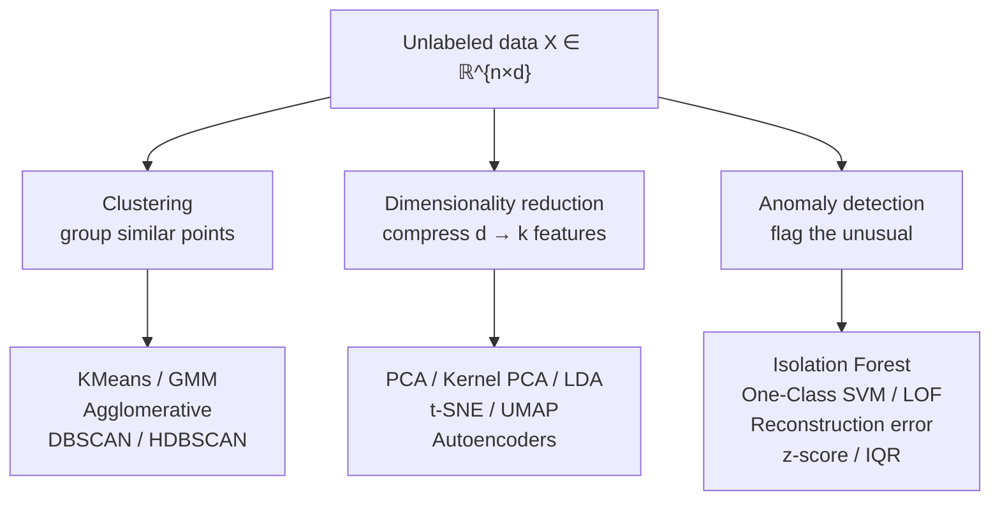
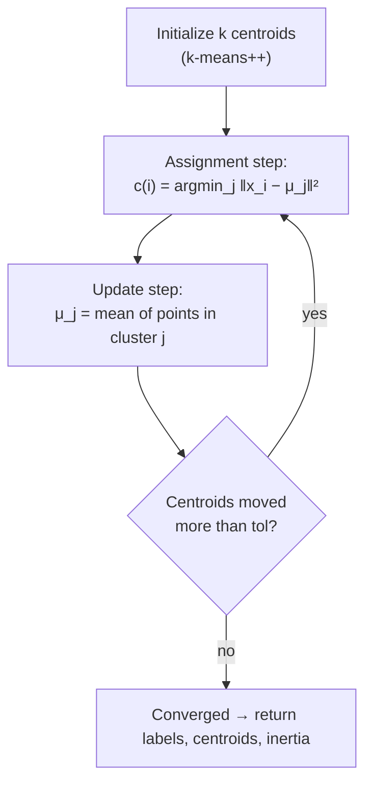
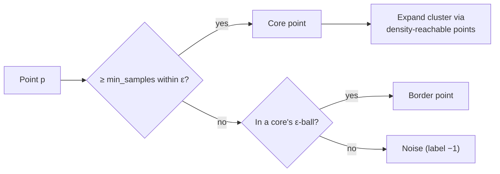
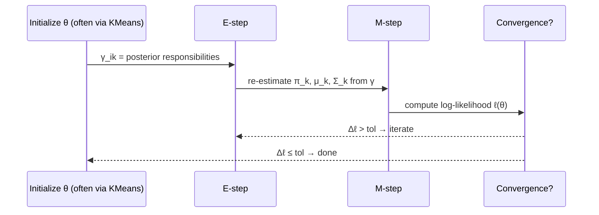
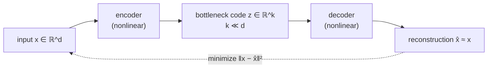
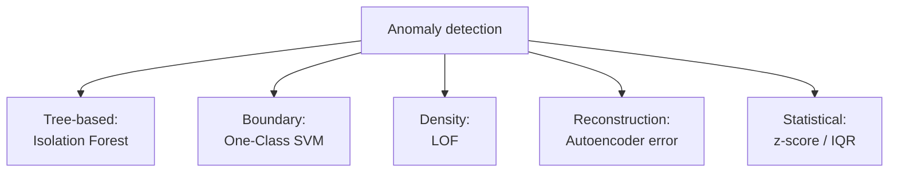
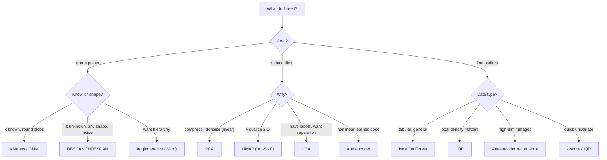

# Unsupervised Learning, Dimensionality Reduction & Anomaly Detection
*Finding structure, geometry, and outliers when there are no labels to lean on.*

*Part of the AI Engineering & ML Mastery Path — see the [index](../README.md) and [study plan](../MASTER-STUDY-PLAN.md).*

Supervised learning gives you an answer key. Unsupervised learning hands you a pile of unlabeled vectors and asks: *what is the hidden structure?* Three families answer that question. **Clustering** groups similar points. **Dimensionality reduction** compresses high-dimensional data into a few informative axes. **Anomaly detection** flags the points that do not belong. These three are deeply intertwined — a good low-dimensional representation makes clustering trivial and anomalies obvious — and together they power customer segmentation, topic discovery, data compression, 2-D visualization of million-dimensional embeddings, and real-time fraud detection.

By the time you finish this file you will be able to derive the EM algorithm for a Gaussian Mixture from scratch, explain *why* t-SNE plots lie about cluster size, choose between DBSCAN and KMeans on sight, and build a working fraud detector from reconstruction error.

---

## 🎯 Learning Objectives

By the end of this document you can:

- **Implement** Lloyd's algorithm and k-means++ initialization from scratch in NumPy, and choose $k$ using the elbow and silhouette methods.
- **Distinguish** the assumptions, strengths, and failure modes of KMeans, agglomerative clustering, DBSCAN/HDBSCAN, and Gaussian Mixture Models.
- **Derive** the Expectation–Maximization algorithm for a GMM, including the responsibility update and the M-step closed forms.
- **Explain** PCA via the eigendecomposition of the covariance matrix, read a scree plot, and state when PCA fails.
- **Compare** linear (PCA, LDA) vs nonlinear (Kernel PCA, t-SNE, UMAP, autoencoders) reduction, and read a t-SNE plot without being fooled by it.
- **Build** anomaly detectors using Isolation Forest, One-Class SVM, Local Outlier Factor, autoencoder reconstruction error, and simple statistical rules.
- **Evaluate** unsupervised results using internal (silhouette, Davies–Bouldin) and external (ARI, NMI) metrics.

---

## 📋 Prerequisites

- [01 — Math & Probability Foundations](./01-math-probability-foundations.md) — eigenvectors, covariance, Gaussians, expectation.
- [02 — Supervised Learning Fundamentals](./02-supervised-learning-fundamentals.md) — train/test discipline, the bias–variance idea, distance metrics.
- Comfort with NumPy array broadcasting and basic `scikit-learn` `fit`/`transform` API.

---

## 📑 Table of Contents

1. [The Unsupervised Landscape](#1-the-unsupervised-landscape)
2. [KMeans & Lloyd's Algorithm](#2-kmeans--lloyds-algorithm)
3. [Hierarchical / Agglomerative Clustering](#3-hierarchical--agglomerative-clustering)
4. [Density Clustering: DBSCAN & HDBSCAN](#4-density-clustering-dbscan--hdbscan)
5. [Gaussian Mixture Models & the EM Algorithm](#5-gaussian-mixture-models--the-em-algorithm)
6. [Principal Component Analysis (PCA)](#6-principal-component-analysis-pca)
7. [Kernel PCA & Nonlinear Reduction](#7-kernel-pca--nonlinear-reduction)
8. [t-SNE: Power and Peril](#8-t-sne-power-and-peril)
9. [UMAP vs t-SNE](#9-umap-vs-t-sne)
10. [LDA: Supervised Reduction](#10-lda-supervised-reduction)
11. [Autoencoders & Their Link to PCA](#11-autoencoders--their-link-to-pca)
12. [Anomaly Detection](#12-anomaly-detection)
13. [Evaluating Unsupervised Results](#13-evaluating-unsupervised-results)
14. [From-Scratch Implementation](#-from-scratch-implementation)
15. [Knowledge Check](#-knowledge-check)
16. [Exercises](#️-exercises)
17. [Cheat Sheet](#-cheat-sheet)
18. [Further Resources](#-further-resources)
19. [What's Next](#️-whats-next)

---

## 1. The Unsupervised Landscape

> 💡 **Intuition:** With no labels, the data's *geometry* is the only teacher. Every method below is a different opinion about what "similar" and "interesting" mean — Euclidean distance to a centroid, density of neighbors, probability under a mixture, variance along an axis.

The three problems and their canonical tools:



A unifying view: many of these are **latent variable** models. Clustering posits a hidden discrete label $z_i \in \{1,\dots,k\}$ per point; reduction posits a hidden continuous code $z_i \in \mathbb{R}^k$ with $k \ll d$. The algorithms differ in how they parameterize $p(x \mid z)$ and how they infer $z$.

> ⚠️ **Common Pitfall:** Almost every method here is **scale-sensitive**. A feature measured in dollars (range $0$–$10^6$) will dominate a feature measured in years (range $0$–$100$) under Euclidean distance. **Standardize first** (`StandardScaler`) unless you have a deliberate reason not to.

**Why it matters for AI/ML:** Modern pipelines rarely operate on raw features. You embed (BERT, CLIP, node2vec), then *cluster* embeddings to discover topics, *reduce* them to visualize, and *score* reconstruction error to catch drift. Unsupervised learning is the connective tissue of every embedding-based system.

---

## 2. KMeans & Lloyd's Algorithm

> 💡 **Intuition:** Plant $k$ flags. Assign every point to its nearest flag. Move each flag to the center of mass of its points. Repeat until the flags stop moving. That's it.

### Formal definition

KMeans minimizes the **within-cluster sum of squares** (WCSS, also called inertia). Given data $\{x_i\}_{i=1}^n$, $x_i \in \mathbb{R}^d$, find centroids $\{\mu_1,\dots,\mu_k\}$ and an assignment $c: \{1,\dots,n\} \to \{1,\dots,k\}$ minimizing

$$J = \sum_{i=1}^{n} \lVert x_i - \mu_{c(i)} \rVert_2^2 .$$

This is NP-hard in general. **Lloyd's algorithm** is a coordinate-descent heuristic that alternates two steps, each of which provably never increases $J$:

1. **Assignment:** $c(i) = \arg\min_j \lVert x_i - \mu_j \rVert_2^2$.
2. **Update:** $\mu_j = \dfrac{1}{|C_j|} \sum_{i \in C_j} x_i$, where $C_j = \{i : c(i)=j\}$.

Because $J$ is bounded below by $0$ and decreases monotonically over a finite set of assignments, it converges — but only to a **local** minimum.



### Worked example by hand

1-D points: $\{1, 2, 10, 11\}$, $k=2$. Start centroids at $\mu_1 = 1,\ \mu_2 = 2$ (a deliberately bad init).

**Iteration 1 — assign:** distances put $1 \to \mu_1$; $2,10,11 \to \mu_2$ (each closer to 2 than to 1).
Cluster 1 $=\{1\}$, cluster 2 $=\{2,10,11\}$.
**Update:** $\mu_1 = 1$, $\mu_2 = (2+10+11)/3 = 7.667$.

**Iteration 2 — assign:** $1,2 \to \mu_1$ (closer to 1 than 7.667); $10,11 \to \mu_2$.
**Update:** $\mu_1 = (1+2)/2 = 1.5$, $\mu_2 = (10+11)/2 = 10.5$.

**Iteration 3 — assign:** $\{1,2\}\to\mu_1$, $\{10,11\}\to\mu_2$ — no change. **Converged.**
Final inertia: $(1-1.5)^2+(2-1.5)^2+(10-10.5)^2+(11-10.5)^2 = 0.25\times4 = 1.0$.

> 🎯 **Key Insight:** Even from a terrible initialization, KMeans recovered the right answer here — but on harder data it gets stuck. That fragility is exactly why **k-means++** exists.

### k-means++ initialization

Plain random init can drop two centroids in the same blob, wasting them. k-means++ spreads initial centroids by sampling them proportional to squared distance from the nearest already-chosen centroid:

1. Choose $\mu_1$ uniformly at random from the data.
2. For each subsequent centroid, pick $x_i$ with probability $\propto D(x_i)^2$, where $D(x_i)$ is the distance to the nearest chosen centroid.

This gives an $O(\log k)$-competitive expected solution and is `scikit-learn`'s default (`init="k-means++"`).

### Choosing $k$: elbow and silhouette

```python
import numpy as np
from sklearn.datasets import make_blobs
from sklearn.cluster import KMeans
from sklearn.metrics import silhouette_score

X, _ = make_blobs(n_samples=500, centers=4, cluster_std=0.8, random_state=42)

inertias, silhouettes = [], []
ks = range(2, 9)
for k in ks:
    km = KMeans(n_clusters=k, init="k-means++", n_init=10, random_state=0).fit(X)
    inertias.append(km.inertia_)
    silhouettes.append(silhouette_score(X, km.labels_))

print("k :", list(ks))
print("inertia   :", [round(v) for v in inertias])
print("silhouette:", [round(v, 3) for v in silhouettes])
# k : [2, 3, 4, 5, 6, 7, 8]
# inertia   : [3543, 1843, 405, 365, 327, 293, 263]   # sharp drop then flattens at k=4
# silhouette: [0.62, 0.69, 0.79, 0.62, 0.5, 0.42, 0.36]  # peaks at k=4
```

- **Elbow:** plot inertia vs $k$; pick the $k$ where the curve bends (here the big drop ends at $k=4$).
- **Silhouette:** for point $i$, $s_i = \dfrac{b_i - a_i}{\max(a_i, b_i)} \in [-1, 1]$, where $a_i$ = mean intra-cluster distance and $b_i$ = mean distance to the nearest *other* cluster. Average $s_i$ over all points; pick the $k$ that maximizes it ($k=4$ above).

> ⚠️ **Common Pitfall:** The elbow is often ambiguous ("elbow is in the eye of the beholder"). Silhouette gives a number you can argue about, but it favors convex, equally-sized clusters — the very thing KMeans already assumes.

**Why it matters for AI/ML:** KMeans (often via **MiniBatchKMeans**) is the workhorse for vector quantization, building codebooks for product quantization in FAISS, and bucketing embeddings at billion-scale. Its $O(nkd)$ per-iteration cost is unbeatable.

---

## 3. Hierarchical / Agglomerative Clustering

> 💡 **Intuition:** Start with every point as its own cluster. Repeatedly merge the two *closest* clusters. The full merge history is a tree (dendrogram); cut it at any height to get a flat clustering. No need to pre-specify $k$.

### Linkages

The merge rule is the **linkage** — how you measure the distance between two *clusters* $A$ and $B$:

| Linkage | Distance $d(A,B)$ | Tendency |
|---|---|---|
| **Single** | $\min_{a\in A, b\in B} \lVert a-b\rVert$ | Chaining; long stringy clusters |
| **Complete** | $\max_{a\in A, b\in B} \lVert a-b\rVert$ | Compact, equal-diameter clusters |
| **Average** | $\frac{1}{|A||B|}\sum_{a,b}\lVert a-b\rVert$ | Compromise |
| **Ward** | increase in total WCSS from merging | Minimizes variance; KMeans-like, very popular |

Ward's linkage merges the pair whose union least increases within-cluster variance:

$$\Delta(A,B) = \frac{|A|\,|B|}{|A|+|B|}\,\lVert \mu_A - \mu_B \rVert_2^2 .$$

### The dendrogram (ASCII)

```
 height
   |
 9 |            +---------------------+
   |            |                     |
 5 |       +----+----+                |
   |       |         |                |
 2 |    +--+--+   +--+--+          +--+--+
   |    |     |   |     |          |     |
   |   x1    x2  x3    x4         x5    x6
        \____ cut at height 4 → {x1,x2,x3,x4}  {x5,x6}  (2 clusters)
```

Cutting the tree at a chosen height yields the flat clustering; the vertical bar lengths show how "reluctant" each merge was — long bars mean well-separated groups.

```python
from scipy.cluster.hierarchy import linkage, fcluster
from sklearn.datasets import make_blobs

X, _ = make_blobs(n_samples=60, centers=3, random_state=1)
Z = linkage(X, method="ward")          # (n-1) x 4 merge matrix
labels = fcluster(Z, t=3, criterion="maxclust")
print("n clusters:", len(set(labels)))  # 3
print("first merge [idxA, idxB, dist, size]:", Z[0].round(2))
# first merge [idxA, idxB, dist, size]: [12.   42.    0.18  2. ]
```

> 📝 **Tip:** Agglomerative clustering is $O(n^2)$ memory and up to $O(n^3)$ time — fine for a few thousand points, painful beyond ~$10^4$. Use it when the *hierarchy itself* is the deliverable (taxonomies, phylogenetics, org structures).

> ⚠️ **Common Pitfall:** Single linkage suffers from the **chaining effect** — a thin bridge of points can fuse two genuinely separate clusters. Use Ward or complete unless you specifically want to follow filaments.

**Why it matters for AI/ML:** Dendrograms over document/embedding similarity build topic taxonomies and de-duplication trees; Ward linkage is a common refinement step after a coarse KMeans pass.

---

## 4. Density Clustering: DBSCAN & HDBSCAN

> 💡 **Intuition:** A cluster is a dense region of points separated from other dense regions by sparse gaps. Points in the sparse gaps are **noise** — they belong to no cluster. Unlike KMeans, you never specify $k$, clusters can be any shape, and outliers are first-class citizens.

### DBSCAN formal definition

Two hyperparameters: $\varepsilon$ (neighborhood radius) and `min_samples` (the density threshold $m$).

- A point $p$ is a **core point** if at least $m$ points lie within distance $\varepsilon$ (its $\varepsilon$-neighborhood).
- $q$ is **directly density-reachable** from core $p$ if $q$ is in $p$'s $\varepsilon$-neighborhood.
- A **cluster** is a maximal set of density-connected points.
- Points reachable from no core are **noise** (label $-1$).



```python
from sklearn.cluster import DBSCAN
from sklearn.datasets import make_moons
import numpy as np

X, _ = make_moons(n_samples=300, noise=0.06, random_state=0)
db = DBSCAN(eps=0.2, min_samples=5).fit(X)
labels = db.labels_
n_clusters = len(set(labels)) - (1 if -1 in labels else 0)
print("clusters:", n_clusters, "| noise pts:", int(np.sum(labels == -1)))
# clusters: 2 | noise pts: 5    (KMeans would fail badly on these two crescents)
```

> 🎯 **Key Insight:** KMeans draws **straight lines** (Voronoi boundaries) between clusters and so cannot separate two interleaving crescents. DBSCAN follows **density** and nails them.

### Choosing $\varepsilon$: the k-distance plot

Sort the distance to each point's $m$-th nearest neighbor; plot ascending. The "knee" of that curve is a good $\varepsilon$ — below it, points are in dense regions; above it, they're outliers.

### HDBSCAN — the upgrade

DBSCAN's fatal flaw: a single global $\varepsilon$ cannot handle clusters of **varying density**. **HDBSCAN** (Hierarchical DBSCAN) builds a density hierarchy across *all* scales and extracts the most *stable* clusters automatically. You set `min_cluster_size` instead of $\varepsilon$, and it returns soft membership probabilities.

```python
# pip install hdbscan
import hdbscan
clusterer = hdbscan.HDBSCAN(min_cluster_size=15)
labels = clusterer.fit_predict(X)
# labels == -1 are noise; clusterer.probabilities_ gives membership strength
```

| | DBSCAN | HDBSCAN |
|---|---|---|
| Key param | `eps`, `min_samples` | `min_cluster_size` |
| Varying density | ✗ struggles | ✓ handles |
| Outputs | hard labels + noise | labels + probabilities + noise |
| Speed | fast | a bit slower, still scalable |

> ⚠️ **Common Pitfall:** DBSCAN distances are computed in the raw feature space — in **high dimensions** the curse of dimensionality flattens all pairwise distances, $\varepsilon$ becomes meaningless, and everything is either one cluster or all noise. Reduce dimensions (PCA/UMAP) first.

**Why it matters for AI/ML:** Density clustering is the default for spatial data (GPS hot-spots), and HDBSCAN over UMAP embeddings is the standard backbone of modern topic modeling (e.g. BERTopic).

---

## 5. Gaussian Mixture Models & the EM Algorithm

> 💡 **Intuition:** KMeans makes hard, spherical assignments. A GMM is the "soft" generalization: each cluster is a full Gaussian with its own shape (covariance), and every point gets a *probability* of belonging to each cluster. KMeans is the limiting case of a GMM with shared spherical covariance and assignments hardened to 0/1.

### The model

Data is generated by first sampling a latent component $z_i \sim \text{Categorical}(\pi)$, then drawing $x_i \sim \mathcal{N}(\mu_{z_i}, \Sigma_{z_i})$. The marginal density is a weighted sum of $K$ Gaussians:

$$p(x) = \sum_{k=1}^{K} \pi_k\, \mathcal{N}(x \mid \mu_k, \Sigma_k), \qquad \sum_k \pi_k = 1,\ \pi_k \ge 0 .$$

We want the parameters $\theta = \{\pi_k, \mu_k, \Sigma_k\}$ maximizing the log-likelihood $\ell(\theta) = \sum_i \log \sum_k \pi_k \mathcal{N}(x_i \mid \mu_k, \Sigma_k)$. The log-of-sum has no closed form — enter EM.

### Deriving EM

Introduce the **responsibility** $\gamma_{ik} = p(z_i = k \mid x_i, \theta)$ — the posterior probability that point $i$ came from component $k$. EM maximizes a lower bound on $\ell$ by iterating:

**E-step (expectation).** With $\theta$ fixed, compute responsibilities via Bayes' rule:

$$\gamma_{ik} = \frac{\pi_k\, \mathcal{N}(x_i \mid \mu_k, \Sigma_k)}{\sum_{j=1}^{K} \pi_j\, \mathcal{N}(x_i \mid \mu_j, \Sigma_j)} .$$

**M-step (maximization).** With $\gamma$ fixed, maximize the expected complete-data log-likelihood. Setting derivatives to zero yields closed forms (let $N_k = \sum_i \gamma_{ik}$, the "soft count"):

$$\mu_k = \frac{1}{N_k}\sum_{i} \gamma_{ik}\, x_i, \qquad
\Sigma_k = \frac{1}{N_k}\sum_{i} \gamma_{ik}\,(x_i - \mu_k)(x_i - \mu_k)^\top, \qquad
\pi_k = \frac{N_k}{n} .$$

Each EM iteration provably increases $\ell(\theta)$ (or leaves it unchanged), converging to a local maximum.



### Worked 1-D E-step by hand

Two components: $\pi=(0.5,0.5)$, $\mu=(0,4)$, $\sigma=1$ both. Point $x=1$.
Gaussian densities: $\mathcal{N}(1\mid0,1)=\frac{1}{\sqrt{2\pi}}e^{-1/2}=0.2420$; $\mathcal{N}(1\mid4,1)=\frac{1}{\sqrt{2\pi}}e^{-9/2}=0.0044$.
Weighted: $0.5(0.2420)=0.1210$ and $0.5(0.0044)=0.0022$; sum $=0.1232$.

$$\gamma_{1}=\frac{0.1210}{0.1232}=0.982, \qquad \gamma_{2}=\frac{0.0022}{0.1232}=0.018 .$$

So $x=1$ is 98.2% component 1 — soft, not hard.

```python
import numpy as np
from sklearn.mixture import GaussianMixture
from sklearn.datasets import make_blobs

X, _ = make_blobs(n_samples=400, centers=3, cluster_std=[1.0, 2.5, 0.5], random_state=7)
gmm = GaussianMixture(n_components=3, covariance_type="full", random_state=0).fit(X)
print("weights :", gmm.weights_.round(2))         # weights : [0.33 0.34 0.33]
print("converged:", gmm.converged_)               # converged: True
proba = gmm.predict_proba(X[:1])
print("soft assignment of point 0:", proba.round(3))  # e.g. [0.    0.998 0.002]
```

> 🎯 **Key Insight:** Because each component carries a full covariance $\Sigma_k$, a GMM fits **elliptical, differently-oriented, differently-sized** clusters — things KMeans (spheres of equal size) and even DBSCAN handle poorly. Use `covariance_type="full"` for flexibility, `"diag"`/`"spherical"` to regularize when data is scarce.

> ⚠️ **Common Pitfall:** With `"full"` covariance, a component can collapse onto a single point, driving $\Sigma_k \to 0$ and the likelihood to $+\infty$ (a **singularity**). Mitigate with `reg_covar` (a floor added to the diagonal) and multiple `n_init`.

**Why it matters for AI/ML:** GMMs underpin speaker recognition (UBM-GMM), background subtraction in video, and serve as the textbook gateway to **variational inference** and **VAEs** — where the same E/M logic reappears as the evidence lower bound (ELBO).

---

## 6. Principal Component Analysis (PCA)

> 💡 **Intuition:** Find the direction in which the data varies most — that's PC1. Then the orthogonal direction with the next-most variance — PC2. And so on. Project onto the top $k$ directions and you've kept most of the "spread" while throwing away $d-k$ dimensions.

### Formal definition

Center the data: $\tilde{x}_i = x_i - \bar{x}$. The sample covariance matrix is

$$C = \frac{1}{n-1}\sum_{i=1}^{n} \tilde{x}_i \tilde{x}_i^\top \in \mathbb{R}^{d\times d}.$$

PCA computes the eigendecomposition $C = V\Lambda V^\top$. Eigenvectors $v_1,\dots,v_d$ (the **principal components**) are orthonormal; eigenvalues $\lambda_1 \ge \dots \ge \lambda_d \ge 0$ give the variance captured along each. The first PC maximizes projected variance:

$$v_1 = \arg\max_{\lVert v\rVert=1} v^\top C\, v, \qquad \text{with } v_1^\top C v_1 = \lambda_1 .$$

The **explained variance ratio** of component $j$ is $\lambda_j / \sum_m \lambda_m$. (In practice PCA is computed via the **SVD** of the centered data $\tilde X = U S W^\top$; then $v_j$ are columns of $W$ and $\lambda_j = s_j^2/(n-1)$ — more numerically stable than forming $C$.)

### ASCII: projecting 2-D onto PC1

```
   x2
    |        .  ' (PC1 direction, max variance)
    |     . '  o
    |   '   o      each point o is projected (⟂) onto the PC1 line:
    | '  o  ____|__  the foot of the perpendicular is its 1-D coordinate
    |' o ___|        info lost = spread along PC2 (the short axis)
    +-------------------- x1
```

### Scree plot & choosing $k$

```python
import numpy as np
from sklearn.decomposition import PCA
from sklearn.preprocessing import StandardScaler
from sklearn.datasets import load_digits

X = load_digits().data                       # 1797 x 64
Xs = StandardScaler().fit_transform(X)       # ALWAYS scale before PCA
pca = PCA().fit(Xs)
evr = pca.explained_variance_ratio_
cum = np.cumsum(evr)
k90 = int(np.argmax(cum >= 0.90) + 1)
print("PC1, PC2 explain:", evr[:2].round(3))     # PC1, PC2 explain: [0.12 0.095]
print("components for 90% variance:", k90)        # components for 90% variance: 21
```

A **scree plot** is `evr` vs component index; look for the elbow. Keep enough components to reach a variance target (e.g. 90%) — here 21 of 64 dimensions suffice.

> 🎯 **Key Insight:** PCA is the **optimal linear** reconstruction: among all rank-$k$ linear projections, the top-$k$ PCs minimize squared reconstruction error (Eckart–Young theorem). No linear method beats it on that objective.

### When PCA fails

| Situation | Why PCA struggles |
|---|---|
| Nonlinear manifold (Swiss roll, spiral) | PCA only rotates; can't unroll curvature |
| Variance ≠ importance | A high-variance noisy feature dominates a low-variance signal feature |
| Non-Gaussian / multimodal structure | PCA captures 2nd-order moments only; misses higher-order structure |
| Unscaled features | Largest-unit feature hijacks PC1 |
| Outliers | Squared error is outlier-sensitive; consider Robust PCA |

> ⚠️ **Common Pitfall:** PCA is **unsupervised** — it maximizes variance, not class separability. The direction that best discriminates your labels may have *tiny* variance and get discarded. When you have labels and want separation, use **LDA** (§10).

**Why it matters for AI/ML:** PCA is the universal pre-processing whitening/denoising step, the cheap baseline before any fancy reducer, and a compression primitive (eigenfaces, latent-space initialization).

---

## 7. Kernel PCA & Nonlinear Reduction

> 💡 **Intuition:** PCA fails on curved manifolds because it can only rotate. The **kernel trick** implicitly maps data into a high-dimensional feature space $\phi(x)$ where the structure *is* linear, then does PCA there — without ever computing $\phi$ explicitly.

Standard PCA needs the covariance; Kernel PCA instead eigendecomposes the (centered) **kernel matrix** $K_{ij} = k(x_i, x_j) = \langle \phi(x_i), \phi(x_j)\rangle$. Common kernel: the RBF $k(x,x') = \exp(-\gamma \lVert x-x'\rVert^2)$.

```python
from sklearn.decomposition import KernelPCA
from sklearn.datasets import make_circles
import numpy as np

X, y = make_circles(n_samples=400, factor=0.3, noise=0.05, random_state=0)
# Linear PCA cannot separate concentric circles; RBF Kernel PCA can:
kpca = KernelPCA(n_components=2, kernel="rbf", gamma=10, random_state=0)
Z = kpca.fit_transform(X)
print("KPCA output shape:", Z.shape)   # KPCA output shape: (400, 2)
# After KPCA the inner vs outer circle become linearly separable along PC1.
```

> ⚠️ **Common Pitfall:** Kernel PCA's kernel matrix is $n\times n$ — $O(n^2)$ memory, $O(n^3)$ eigendecomposition. It does not scale past ~10k points, and choosing $\gamma$ is finicky. For visualization, t-SNE/UMAP usually win; for separability, kernels are still elegant.

**Why it matters for AI/ML:** Kernel PCA is the conceptual bridge from linear methods to the kernelized SVMs of the previous file and to the manifold-learning methods next.

---

## 8. t-SNE: Power and Peril

> 💡 **Intuition:** t-SNE is a *visualization* method. It builds a probability that point $i$ would pick point $j$ as a neighbor in high-D, then arranges points in 2-D so those neighbor-probabilities match. It obsesses over keeping *local* neighborhoods intact, at the cost of distorting everything global.

### Mechanics

High-D similarities are Gaussian-based conditional probabilities $p_{j\mid i}$ whose bandwidth is set by **perplexity** (effective number of neighbors, typically 5–50). Low-D similarities use a **Student-t** (heavy-tailed) distribution $q_{ij}$:

$$q_{ij} = \frac{(1+\lVert y_i - y_j\rVert^2)^{-1}}{\sum_{k\ne l}(1+\lVert y_k - y_l\rVert^2)^{-1}} .$$

t-SNE minimizes the KL divergence $\sum_{ij} p_{ij}\log\frac{p_{ij}}{q_{ij}}$ by gradient descent. The heavy tail solves the **crowding problem** — in 2-D there isn't room for all the moderately-distant points that exist in high-D, so the t-distribution lets them spread out.

```python
from sklearn.manifold import TSNE
from sklearn.datasets import load_digits

X, y = load_digits(return_X_y=True)
emb = TSNE(n_components=2, perplexity=30, init="pca",
           learning_rate="auto", random_state=0).fit_transform(X)
print(emb.shape)   # (1797, 2)  → scatter, color by y, see 10 clean digit islands
```

### How to read — and abuse — t-SNE

> 🎯 **Key Insight (from distill.pub):** In a t-SNE plot, **cluster sizes mean nothing**, **distances between clusters mean nothing**, and **random noise can look like clusters** at the wrong perplexity. Only *which points are near which* is trustworthy — and only locally.

- **Perplexity matters a lot:** too low → fragments one cluster into many; too high → merges distinct clusters. Try several (5, 30, 50).
- **Run multiple seeds:** t-SNE is non-convex; layouts vary run to run.
- **You cannot embed new points** with vanilla t-SNE — it's transductive, not a reusable mapping.

> ⚠️ **Common Pitfall:** Treating gaps and blob areas as meaningful. People routinely (and wrongly) say "cluster A is bigger / farther from B" based on a t-SNE plot. It is a *qualitative* tool only — never feed t-SNE coordinates into a downstream model as features.

**Why it matters for AI/ML:** t-SNE is the go-to for sanity-checking embeddings (do my BERT sentence vectors cluster by topic? do my image features separate classes?). It reveals structure the eye can't see in 768 dimensions.

---

## 9. UMAP vs t-SNE

> 💡 **Intuition:** UMAP (Uniform Manifold Approximation and Projection) does a similar local-neighborhood job but is grounded in manifold theory and fuzzy topology. In practice it's **much faster**, preserves **more global structure**, and — crucially — can `transform` new data.

```python
# pip install umap-learn
import umap
from sklearn.datasets import load_digits

X, y = load_digits(return_X_y=True)
reducer = umap.UMAP(n_neighbors=15, min_dist=0.1, n_components=2, random_state=42)
emb = reducer.fit_transform(X)          # ~seconds, even at 100k+ points
new_emb = reducer.transform(X[:5])      # ← t-SNE cannot do this
print(emb.shape, new_emb.shape)         # (1797, 2) (5, 2)
```

| Aspect | t-SNE | UMAP |
|---|---|---|
| Speed | slow ($O(n\log n)$ Barnes–Hut, still heavy) | fast, scales to millions |
| Global structure | poor (distances/sizes meaningless) | better preserved |
| Embed new points | ✗ (transductive) | ✓ (`.transform`) |
| Key params | `perplexity` | `n_neighbors`, `min_dist` |
| Output use | visualization only | viz + sometimes as features |
| Determinism | seed-sensitive | seed-sensitive but more stable |

- `n_neighbors` ↑ → more global, fewer fine clusters; ↓ → more local detail.
- `min_dist` ↓ → tighter clumps; ↑ → more even spread.

> ⚠️ **Common Pitfall:** UMAP *preserves global structure better than t-SNE* — but "better" is not "faithfully." Inter-cluster distances are still only loosely meaningful. And like t-SNE, dense visual clumps can exaggerate separation. Validate with a metric, not just your eyes.

> 📝 **Tip:** The modern default pipeline for clustering high-D embeddings: **UMAP → HDBSCAN**. UMAP makes density meaningful again; HDBSCAN then finds variable-density clusters and noise.

**Why it matters for AI/ML:** UMAP is the de-facto standard for visualizing single-cell genomics, large embedding stores, and as the dimensionality-reduction stage in topic models like BERTopic and Top2Vec.

---

## 10. LDA: Supervised Reduction

> 💡 **Intuition:** PCA asks "which axes have the most variance?" Linear Discriminant Analysis asks "which axes best *separate the labeled classes*?" It uses the labels — so it's supervised reduction.

LDA finds projections maximizing the ratio of **between-class** to **within-class** scatter:

$$w^\star = \arg\max_{w} \frac{w^\top S_B\, w}{w^\top S_W\, w}, \qquad
S_W = \sum_c \sum_{i\in c}(x_i-\mu_c)(x_i-\mu_c)^\top,\quad
S_B = \sum_c n_c(\mu_c-\bar x)(\mu_c-\bar x)^\top .$$

The solution is the top eigenvectors of $S_W^{-1}S_B$. With $C$ classes, LDA yields at most $C-1$ discriminant axes.

```python
from sklearn.discriminant_analysis import LinearDiscriminantAnalysis as LDA
from sklearn.datasets import load_iris

X, y = load_iris(return_X_y=True)        # 3 classes → at most 2 LDA axes
Z = LDA(n_components=2).fit_transform(X, y)
print(Z.shape)   # (150, 2)  → classes separate far more cleanly than PCA's 2 PCs
```

| | PCA | LDA |
|---|---|---|
| Uses labels? | No (unsupervised) | Yes (supervised) |
| Objective | Max variance | Max class separation |
| Max components | $d$ | $C-1$ |
| Best when | Compression / denoising | Pre-classification feature extraction |

> ⚠️ **Common Pitfall:** LDA assumes each class is Gaussian with a **shared covariance**. Violations (very different per-class shapes) degrade it — then prefer QDA or a nonlinear method.

**Why it matters for AI/ML:** "LDA" also names *Latent Dirichlet Allocation* for topic modeling — entirely unrelated. Here we mean the discriminant analysis; it remains a strong, cheap feature-extraction baseline before a linear classifier.

---

## 11. Autoencoders & Their Link to PCA

> 💡 **Intuition:** An autoencoder is a neural network trained to copy its input to its output through a narrow **bottleneck**. To reconstruct well through a tiny middle layer, the network must learn a compressed code — a learned, *nonlinear* dimensionality reduction.

Architecture: encoder $f_\theta: \mathbb{R}^d \to \mathbb{R}^k$, decoder $g_\phi: \mathbb{R}^k \to \mathbb{R}^d$, trained to minimize reconstruction loss $\mathcal{L} = \frac{1}{n}\sum_i \lVert x_i - g_\phi(f_\theta(x_i))\rVert_2^2$.



> 🎯 **Key Insight:** A **linear** autoencoder with a single bottleneck layer and squared-error loss spans **exactly the same subspace as PCA**. The power of autoencoders comes entirely from **nonlinear** activations — they learn curved manifolds PCA cannot.

```python
# Conceptual Keras sketch (runs with tensorflow installed)
import tensorflow as tf
from tensorflow.keras import layers, Model

d, k = 64, 8
inp = tf.keras.Input(shape=(d,))
z   = layers.Dense(32, activation="relu")(inp)
z   = layers.Dense(k,  activation="relu", name="code")(z)   # bottleneck
out = layers.Dense(32, activation="relu")(z)
out = layers.Dense(d,  activation="linear")(out)
ae  = Model(inp, out)
ae.compile(optimizer="adam", loss="mse")
# ae.fit(X, X, epochs=50, batch_size=32)   # note: target IS the input
# encoder = Model(inp, ae.get_layer("code").output)  → use for compression
```

Variants: **denoising** AEs (corrupt input, reconstruct clean), **sparse** AEs (penalize code activations), **variational** AEs (probabilistic code — the generative cousin, covered in the deep-learning track).

> ⚠️ **Common Pitfall:** An over-capacity autoencoder with a too-wide bottleneck just learns the identity function and compresses nothing. Keep $k$ genuinely small, and regularize.

**Why it matters for AI/ML:** Autoencoders give nonlinear compression, learned features for downstream tasks, and — via **reconstruction error** — one of the most widely deployed anomaly detectors (next section). VAEs extend them into full generative models.

---

## 12. Anomaly Detection

> 💡 **Intuition:** An anomaly is a point that doesn't fit the pattern of "normal." Four philosophies: it's **easy to isolate** (Isolation Forest), it's **outside the normal region** (One-Class SVM), it's in a **lower-density area than its neighbors** (LOF), or it's **hard to reconstruct** (autoencoder). Plus the humble statistical rules (z-score, IQR).



### Isolation Forest

Anomalies are *few and different*, so a random partitioning tree isolates them in **fewer splits**. The anomaly score is based on average path length to isolate a point across many random trees — shorter path → more anomalous.

```python
import numpy as np
from sklearn.ensemble import IsolationForest

rng = np.random.RandomState(0)
X = np.r_[rng.randn(200, 2) * 0.5, rng.uniform(-4, 4, (10, 2))]  # 10 outliers
iso = IsolationForest(contamination=0.05, random_state=0).fit(X)
pred = iso.predict(X)             # +1 inlier, -1 outlier
print("flagged outliers:", int(np.sum(pred == -1)))   # flagged outliers: 11
```

### One-Class SVM

Learns a boundary enclosing the dense "normal" region (with an RBF kernel). Points outside are anomalies. Sensitive to `nu` (upper bound on outlier fraction) and `gamma`; struggles in high dimensions and at scale.

```python
from sklearn.svm import OneClassSVM
oc = OneClassSVM(kernel="rbf", gamma="scale", nu=0.05).fit(X)
pred = oc.predict(X)   # +1 normal, -1 anomaly
```

### Local Outlier Factor (LOF)

Compares a point's local density to that of its neighbors. A point in a region much sparser than its neighbors' regions gets LOF $\gg 1$ → outlier. Crucially **local** — it catches anomalies relative to a local cluster, not just global outliers.

```python
from sklearn.neighbors import LocalOutlierFactor
lof = LocalOutlierFactor(n_neighbors=20, contamination=0.05)
pred = lof.fit_predict(X)         # transductive: no separate predict on new data
```

### Autoencoder reconstruction error

Train an AE on *normal* data only. At inference, anomalies reconstruct poorly → high error. Threshold the error (e.g. 99th percentile of normal errors).

$$\text{score}(x) = \lVert x - g_\phi(f_\theta(x))\rVert_2^2, \qquad \text{anomaly if score} > \tau .$$

### Statistical: z-score & IQR

For roughly-Gaussian 1-D data, flag $|z| = \left|\frac{x-\mu}{\sigma}\right| > 3$. For skewed data, the robust **IQR rule** flags points outside $[Q_1 - 1.5\,\text{IQR},\ Q_3 + 1.5\,\text{IQR}]$, where $\text{IQR}=Q_3-Q_1$.

```python
import numpy as np
x = np.array([10, 11, 9, 10, 12, 11, 95])     # 95 is the outlier
q1, q3 = np.percentile(x, [25, 75]); iqr = q3 - q1
mask = (x < q1 - 1.5*iqr) | (x > q3 + 1.5*iqr)
print("IQR outliers:", x[mask])                # IQR outliers: [95]
```

| Method | Shape assumption | High-dim | New data | Best for |
|---|---|---|---|---|
| Isolation Forest | none | good | ✓ | general tabular, fast, scalable |
| One-Class SVM | smooth boundary | weak | ✓ | small, clean, low-dim |
| LOF | local density | weak | ✗ (transductive) | varying-density local outliers |
| Autoencoder | learns manifold | excellent | ✓ | images, sequences, high-dim |
| z-score / IQR | (z) Gaussian | per-feature | ✓ | quick univariate screening |

> ⚠️ **Common Pitfall:** `contamination` is a *prior on the outlier fraction*, not a learned quantity. Set it wrong and you'll over- or under-flag. When you have *some* labels, tune the threshold on a precision/recall curve instead of trusting `contamination`.

> 🎯 **Key Insight:** Anomaly detection is almost always evaluated on an **extremely imbalanced** problem. Accuracy is useless (a "everything is normal" model scores 99.9%). Use **precision@k**, **recall**, **PR-AUC**, and domain-cost-weighted metrics.

**Why it matters for AI/ML:** This is fraud detection, network intrusion, manufacturing defect spotting, and ML-monitoring drift detection — among the highest-ROI applications of unsupervised learning in industry.

---

## 13. Evaluating Unsupervised Results

The hard truth: without labels, "correct" is ill-defined. Two families of metrics:

**Internal** (labels-free, judge geometry):

| Metric | Range / goal | Meaning |
|---|---|---|
| **Silhouette** | $[-1,1]$, higher | cohesion vs separation per point |
| **Davies–Bouldin** | $\ge 0$, lower | avg similarity of each cluster to its most similar one |
| **Calinski–Harabasz** | higher | between/within dispersion ratio |
| **Inertia (WCSS)** | lower | only meaningful relative, for fixed $k$ |

**External** (you have ground-truth labels, e.g. for benchmarking):

| Metric | Range | Meaning |
|---|---|---|
| **Adjusted Rand Index (ARI)** | $[-1,1]$ | agreement of pairs, chance-corrected |
| **Normalized Mutual Information (NMI)** | $[0,1]$ | shared information, normalized |
| **Homogeneity / Completeness / V-measure** | $[0,1]$ | each cluster pure / each class together / their harmonic mean |

```python
from sklearn.metrics import silhouette_score, adjusted_rand_score, normalized_mutual_info_score
from sklearn.cluster import KMeans
from sklearn.datasets import load_iris

X, y = load_iris(return_X_y=True)
labels = KMeans(n_clusters=3, n_init=10, random_state=0).fit_predict(X)
print("silhouette:", round(silhouette_score(X, labels), 3))   # silhouette: 0.553
print("ARI:", round(adjusted_rand_score(y, labels), 3))       # ARI: 0.716
print("NMI:", round(normalized_mutual_info_score(y, labels), 3))  # NMI: 0.748
```

> ⚠️ **Common Pitfall:** Internal metrics encode an *assumption about cluster shape* (silhouette likes convex blobs). A perfect DBSCAN result on two crescents can score a *low* silhouette. Match the metric to the method's geometry, and never optimize $k$ on a metric whose bias matches the algorithm's bias — that's circular.

**Why it matters for AI/ML:** Model selection in unsupervised pipelines lives and dies by these metrics; reporting ARI/NMI against a held-out labeled subset is the standard way to justify a clustering in a paper or a design review.

---

## 🧮 From-Scratch Implementation

KMeans with k-means++ init, pure NumPy — readable and correct.

```python
import numpy as np

def kmeans_pp_init(X, k, rng):
    n = X.shape[0]
    centers = [X[rng.integers(n)]]
    for _ in range(1, k):
        d2 = np.min([np.sum((X - c)**2, axis=1) for c in centers], axis=0)
        probs = d2 / d2.sum()
        centers.append(X[rng.choice(n, p=probs)])   # sample ∝ squared distance
    return np.array(centers)

def kmeans(X, k, max_iter=100, tol=1e-4, seed=0):
    rng = np.random.default_rng(seed)
    C = kmeans_pp_init(X, k, rng)
    for _ in range(max_iter):
        # assignment: nearest centroid (squared Euclidean)
        dists = ((X[:, None, :] - C[None, :, :])**2).sum(axis=2)   # (n, k)
        labels = dists.argmin(axis=1)
        # update: mean of assigned points (keep empty-cluster centroid)
        newC = np.array([X[labels == j].mean(axis=0) if np.any(labels == j) else C[j]
                         for j in range(k)])
        shift = np.sqrt(((newC - C)**2).sum())
        C = newC
        if shift < tol:
            break
    inertia = ((X - C[labels])**2).sum()
    return labels, C, inertia

# sanity check against the by-hand example
X = np.array([[1.], [2.], [10.], [11.]])
labels, C, inertia = kmeans(X, k=2, seed=1)
print("centroids:", sorted(C.ravel().round(2)))   # centroids: [1.5, 10.5]
print("inertia  :", round(inertia, 2))             # inertia  : 1.0
```

This matches the hand computation in §2: centroids $1.5$ and $10.5$, inertia $1.0$.

---

## ❓ Knowledge Check

<details><summary><strong>Q1.</strong> Why must you usually standardize features before KMeans or PCA, but not necessarily before a decision tree?</summary>

KMeans uses Euclidean distance and PCA maximizes variance — both are dominated by features with large numeric ranges, so an unscaled high-range feature hijacks the result. Standardizing (zero mean, unit variance) puts features on equal footing. Decision trees split on thresholds *within* a single feature at a time, so monotone rescaling of any one feature doesn't change the splits — trees are scale-invariant.
</details>

<details><summary><strong>Q2.</strong> Does Lloyd's algorithm always find the global minimum of the WCSS objective? What reduces the risk?</summary>

No — it converges only to a *local* minimum that depends on initialization. Mitigations: **k-means++** smart initialization, and `n_init` (run several times, keep the lowest inertia). It does always converge (monotone non-increasing objective over finitely many assignments), just not necessarily to the global optimum.
</details>

<details><summary><strong>Q3.</strong> Two interleaving crescents (`make_moons`). Which of KMeans / DBSCAN will separate them, and why?</summary>

DBSCAN. KMeans partitions space with linear Voronoi boundaries and assumes convex, roughly-spherical clusters, so it slices each crescent in half. DBSCAN follows connected high-density regions of arbitrary shape, tracing each crescent correctly and labeling the sparse gap points as noise.
</details>

<details><summary><strong>Q4.</strong> In a GMM, what is a "responsibility" and which EM step computes it?</summary>

$\gamma_{ik} = p(z_i=k\mid x_i,\theta)$ is the posterior probability that point $i$ was generated by component $k$ — a soft cluster membership. It's computed in the **E-step** via Bayes' rule: prior $\pi_k$ times Gaussian likelihood, normalized over components. The M-step then uses these responsibilities as soft weights to re-estimate $\pi_k,\mu_k,\Sigma_k$.
</details>

<details><summary><strong>Q5.</strong> How is KMeans a special case of a GMM?</summary>

KMeans equals a GMM with (a) equal mixing weights, (b) shared *spherical* covariance $\Sigma_k=\sigma^2 I$, and (c) responsibilities hardened to 0/1 (taking the limit $\sigma^2\to 0$, the soft assignment becomes a hard nearest-centroid assignment). So KMeans is "hard, spherical, equal-size EM."
</details>

<details><summary><strong>Q6.</strong> In a t-SNE plot two clusters appear far apart and one looks much bigger. What can you legitimately conclude?</summary>

Essentially nothing about the *distance* or the *sizes*. t-SNE does not preserve inter-cluster distances or relative cluster sizes — both are artifacts of the optimization and perplexity. You may only trust *local neighborhood* membership (which points sit together). Always vary perplexity and re-run with multiple seeds before reading anything into the layout.
</details>

<details><summary><strong>Q7.</strong> Name two concrete advantages of UMAP over t-SNE.</summary>

(1) UMAP is far faster and scales to millions of points. (2) UMAP exposes a `.transform` method so you can embed *new, unseen* points into the same space (t-SNE is transductive and cannot). Bonus: UMAP tends to preserve more global structure.
</details>

<details><summary><strong>Q8.</strong> When does PCA fail, and what's the supervised alternative if you have class labels and want separation?</summary>

PCA fails on nonlinear manifolds, when variance ≠ importance, on unscaled or outlier-heavy data, and when the discriminative direction has low variance. If you have labels and want class separability, use **LDA**, which maximizes between-class over within-class scatter rather than total variance.
</details>

<details><summary><strong>Q9.</strong> Under what condition is a linear autoencoder equivalent to PCA, and where does an autoencoder's real power come from?</summary>

A single-hidden-layer **linear** autoencoder with MSE loss spans the same subspace as PCA. The real power of autoencoders comes from **nonlinear activations** and depth, letting them model curved manifolds that linear PCA cannot — and enabling reconstruction-error anomaly detection.
</details>

<details><summary><strong>Q10.</strong> Why is accuracy a terrible metric for fraud detection, and what should you use instead?</summary>

Fraud is rare (often <1%), so a model that predicts "never fraud" achieves ~99% accuracy while catching zero fraud. Use metrics built for imbalance and ranking: **precision, recall, PR-AUC, precision@k**, and ideally a **cost-weighted** metric reflecting the business cost of false negatives vs false positives.
</details>

---

## 🏋️ Exercises

<details><summary><strong>Exercise 1 (easy):</strong> Choose k with elbow + silhouette on synthetic blobs and confirm they agree.</summary>

```python
import numpy as np
from sklearn.datasets import make_blobs
from sklearn.cluster import KMeans
from sklearn.metrics import silhouette_score

X, _ = make_blobs(n_samples=600, centers=5, cluster_std=0.7, random_state=3)
for k in range(2, 9):
    km = KMeans(n_clusters=k, n_init=10, random_state=0).fit(X)
    print(f"k={k}  inertia={km.inertia_:7.0f}  silhouette={silhouette_score(X, km.labels_):.3f}")
# Inertia shows its last big drop into k=5; silhouette peaks at k=5. Both agree: k=5.
```
The elbow (diminishing inertia returns) and the silhouette maximum coincide at the true number of blobs, $k=5$.
</details>

<details><summary><strong>Exercise 2 (medium):</strong> Customer segmentation with RFM + KMeans.</summary>

Compute Recency, Frequency, Monetary value per customer, scale, cluster, and profile the segments.

```python
import numpy as np, pandas as pd
from sklearn.preprocessing import StandardScaler
from sklearn.cluster import KMeans

# --- synthetic transaction log ---
rng = np.random.default_rng(0)
n_tx = 5000
cust = rng.integers(1, 501, n_tx)                       # 500 customers
days_ago = rng.integers(1, 365, n_tx)                   # recency raw
amount = np.round(rng.gamma(2.0, 30.0, n_tx), 2)        # spend
df = pd.DataFrame({"customer": cust, "days_ago": days_ago, "amount": amount})

# --- RFM table ---
rfm = df.groupby("customer").agg(
    Recency=("days_ago", "min"),        # days since most recent purchase
    Frequency=("days_ago", "size"),     # number of purchases
    Monetary=("amount", "sum"),         # total spend
).reset_index()

X = StandardScaler().fit_transform(rfm[["Recency", "Frequency", "Monetary"]])
rfm["segment"] = KMeans(n_clusters=4, n_init=10, random_state=0).fit_predict(X)

profile = rfm.groupby("segment")[["Recency", "Frequency", "Monetary"]].mean().round(1)
print(profile)
# Interpret: low-Recency + high-Frequency + high-Monetary = "champions";
# high-Recency + low-Frequency = "at risk / churned". Name segments from the profile.
```

**Lesson:** RFM turns a raw transaction log into three interpretable features; KMeans on the *scaled* RFM table yields actionable marketing segments. Always profile the centroids — the cluster *meaning* comes from reading the mean R/F/M, not the label number.
</details>

<details><summary><strong>Exercise 3 (medium):</strong> Compare t-SNE vs UMAP on the digits dataset.</summary>

```python
import numpy as np
from sklearn.datasets import load_digits
from sklearn.manifold import TSNE
from sklearn.cluster import KMeans
from sklearn.metrics import adjusted_rand_score
import umap   # pip install umap-learn

X, y = load_digits(return_X_y=True)

tsne = TSNE(n_components=2, perplexity=30, init="pca",
            learning_rate="auto", random_state=0).fit_transform(X)
ump  = umap.UMAP(n_neighbors=15, min_dist=0.1, random_state=0).fit_transform(X)

# quantify how cleanly each embedding separates the 10 digit classes:
for name, emb in [("t-SNE", tsne), ("UMAP", ump)]:
    lab = KMeans(n_clusters=10, n_init=10, random_state=0).fit_predict(emb)
    print(f"{name}: ARI vs true digit = {adjusted_rand_score(y, lab):.3f}")
# Both produce 10 visually clean islands. UMAP runs much faster and typically
# matches or beats t-SNE's ARI while keeping the digit "manifold" more globally coherent.
```

**Lesson:** Both reveal the ten digit clusters. UMAP is dramatically faster, supports `.transform`, and keeps global layout more coherent — quantified here by clustering the 2-D embedding and scoring ARI against the true labels. Remember: this ARI judges the *embedding*, not the visualization's distances.
</details>

<details><summary><strong>Exercise 4 (hard):</strong> One full EM iteration for a 1-D, two-component GMM by hand, then verify in code.</summary>

**Setup.** Data $x = [0,\ 1,\ 5,\ 6]$. Init: $\pi=(0.5,0.5)$, $\mu=(1,5)$, $\sigma^2=1$ both.

**E-step** — responsibilities $\gamma_{i2}$ for component 2 (we'll compute the key ones):
Using $\mathcal N(x\mid\mu,1)=\frac{1}{\sqrt{2\pi}}e^{-(x-\mu)^2/2}$ (the $\frac{1}{\sqrt{2\pi}}$ and equal $\pi_k$ cancel in the ratio):

- $x=0$: comp1 $\propto e^{-(0-1)^2/2}=e^{-0.5}=0.6065$; comp2 $\propto e^{-(0-5)^2/2}=e^{-12.5}\approx 3.7\times10^{-6}$. $\gamma_{02}\approx 6\times10^{-6}\approx 0$.
- $x=1$: comp1 $\propto e^{0}=1$; comp2 $\propto e^{-8}=3.35\times10^{-4}$. $\gamma_{12}\approx 3.3\times10^{-4}\approx 0$.
- $x=5$: by symmetry $\gamma_{52}\approx 1$.
- $x=6$: by symmetry $\gamma_{62}\approx 1$.

So responsibilities for comp1 $\approx[1,1,0,0]$, comp2 $\approx[0,0,1,1]$ — a clean split.

**M-step** — soft counts $N_1=N_2\approx 2$:
$$\mu_1=\frac{1\cdot0+1\cdot1}{2}=0.5,\qquad \mu_2=\frac{5+6}{2}=5.5,\qquad \pi_1=\pi_2=\frac{2}{4}=0.5.$$
$$\sigma_1^2=\frac{(0-0.5)^2+(1-0.5)^2}{2}=0.25,\qquad \sigma_2^2=\frac{(5-5.5)^2+(6-5.5)^2}{2}=0.25.$$

After one iteration the means moved to the true sub-cluster centers (0.5 and 5.5) and variances shrank to 0.25 — EM is converging.

**Verify in code:**
```python
import numpy as np
from scipy.stats import norm

x = np.array([0., 1., 5., 6.])
pi = np.array([0.5, 0.5]); mu = np.array([1., 5.]); var = np.array([1., 1.])

# E-step
likes = np.stack([pi[k]*norm.pdf(x, mu[k], np.sqrt(var[k])) for k in range(2)], axis=1)
gamma = likes / likes.sum(axis=1, keepdims=True)        # (4,2) responsibilities

# M-step
Nk = gamma.sum(axis=0)
mu_new  = (gamma * x[:, None]).sum(axis=0) / Nk
var_new = (gamma * (x[:, None] - mu_new)**2).sum(axis=0) / Nk
pi_new  = Nk / len(x)
print("mu :", mu_new.round(3))    # mu : [0.5 5.5]
print("var:", var_new.round(3))   # var: [0.25 0.25]
print("pi :", pi_new.round(3))    # pi : [0.5 0.5]
```

**Lesson:** The hand arithmetic and the code agree exactly. You've executed one full EM cycle: E-step posteriors → M-step weighted re-estimates, with the likelihood guaranteed not to decrease.
</details>

<details><summary><strong>Exercise 5 (hard):</strong> Build a fraud-style anomaly detector and compare three methods on an imbalanced set.</summary>

```python
import numpy as np
from sklearn.ensemble import IsolationForest
from sklearn.neighbors import LocalOutlierFactor
from sklearn.svm import OneClassSVM
from sklearn.metrics import average_precision_score   # PR-AUC, right metric for imbalance

rng = np.random.default_rng(0)
normal = rng.normal(0, 1, size=(2000, 6))
fraud  = rng.normal(4, 1.2, size=(40, 6))             # 40 / 2040 ≈ 2% anomalies
X = np.vstack([normal, fraud])
y = np.r_[np.zeros(2000), np.ones(40)]                # 1 = fraud

# Higher score = more anomalous, for each method:
iso_score = -IsolationForest(random_state=0).fit(X).score_samples(X)
lof = LocalOutlierFactor(n_neighbors=20); lof.fit_predict(X)
lof_score = -lof.negative_outlier_factor_
oc = OneClassSVM(gamma="scale", nu=0.05).fit(X)
oc_score = -oc.score_samples(X)

for name, s in [("IsolationForest", iso_score), ("LOF", lof_score), ("OneClassSVM", oc_score)]:
    print(f"{name:16s} PR-AUC = {average_precision_score(y, s):.3f}")
# IsolationForest  PR-AUC ≈ 0.9+   LOF ≈ high   OneClassSVM ≈ high
# All separate the well-shifted fraud cluster; ranking by PR-AUC (not accuracy) is the point.
```

**Lesson:** With anomalies forming a shifted cluster, all three rank fraud high. The transferable habit is the **evaluation**: score by PR-AUC / precision@k on the rare positive class, never accuracy, and treat each method's score as a *ranking* you threshold per business cost.
</details>

---

## 📊 Cheat Sheet

**Clustering at a glance**

| Method | Need k? | Cluster shape | Outliers? | Scales? | Core idea |
|---|---|---|---|---|---|
| KMeans | yes | convex spheres, equal size | no | excellent | minimize WCSS, Lloyd's |
| Agglomerative (Ward) | cut tree | fairly convex | no | $O(n^2)$ | merge closest clusters → dendrogram |
| DBSCAN | no (`eps`,`min_samples`) | arbitrary | yes (−1) | good | density-connected regions |
| HDBSCAN | no (`min_cluster_size`) | arbitrary, varying density | yes + probs | good | density hierarchy, stable clusters |
| GMM (EM) | yes | elliptical, any orientation | soft | good | mixture of Gaussians, soft EM |

**Dimensionality reduction at a glance**

| Method | Linear? | Supervised? | New data? | Use for |
|---|---|---|---|---|
| PCA | yes | no | yes | compression, denoise, baseline |
| Kernel PCA | no | no | yes | nonlinear separability (small n) |
| LDA | yes | yes | yes | pre-classification, ≤ C−1 axes |
| t-SNE | no | no | **no** | local-structure visualization |
| UMAP | no | no | yes | fast viz + features, global-ish |
| Autoencoder | no | no | yes | learned nonlinear codes |

**Key formulas**

| Concept | Formula |
|---|---|
| KMeans objective | $J=\sum_i \lVert x_i-\mu_{c(i)}\rVert^2$ |
| Silhouette | $s_i=\frac{b_i-a_i}{\max(a_i,b_i)}$ |
| GMM density | $p(x)=\sum_k \pi_k\mathcal N(x\mid\mu_k,\Sigma_k)$ |
| Responsibility (E) | $\gamma_{ik}=\frac{\pi_k\mathcal N(x_i\mid\mu_k,\Sigma_k)}{\sum_j \pi_j\mathcal N(x_i\mid\mu_j,\Sigma_j)}$ |
| GMM mean (M) | $\mu_k=\frac{1}{N_k}\sum_i\gamma_{ik}x_i$ |
| PCA variance | $\text{evr}_j=\lambda_j/\sum_m\lambda_m$ |
| LDA objective | $\max_w \frac{w^\top S_B w}{w^\top S_W w}$ |
| IQR rule | flag $x \notin [Q_1-1.5\,\text{IQR},\,Q_3+1.5\,\text{IQR}]$ |

**Method chooser**



---

## 🔗 Further Resources

**Free**

- **Stanford CS229 — Unsupervised Learning & EM notes** — the canonical derivation of KMeans, GMM, and EM. https://cs229.stanford.edu/
- **scikit-learn User Guide: Clustering** — practical, well-illustrated reference with the method comparison plot. https://scikit-learn.org/stable/modules/clustering.html
- **scikit-learn User Guide: Decomposition & Manifold Learning** — PCA, Kernel PCA, t-SNE. https://scikit-learn.org/stable/modules/decomposition.html and https://scikit-learn.org/stable/modules/manifold.html
- **umap-learn documentation** — theory, parameters, and how-to-use guidance from the authors. https://umap-learn.readthedocs.io/
- **distill.pub — "How to Use t-SNE Effectively"** — the interactive article that teaches you *not* to over-read t-SNE plots. Mandatory. https://distill.pub/2016/misread-tsne/

**Paid (worth it)**

- **Aurélien Géron — *Hands-On Machine Learning with Scikit-Learn, Keras & TensorFlow* (O'Reilly)** ★★★★★ — best practical treatment of clustering, PCA, and autoencoders with runnable code; the chapter on unsupervised learning and the autoencoder chapter are gold. https://www.oreilly.com/library/view/hands-on-machine-learning/9781098125967/

---

## ➡️ What's Next

Continue to [04 — Deep Learning & Neural Networks](./04-deep-learning-neural-networks.md), where autoencoders graduate into full neural architectures and the EM/latent-variable ideas reappear as generative models.
