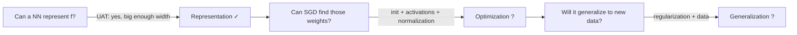
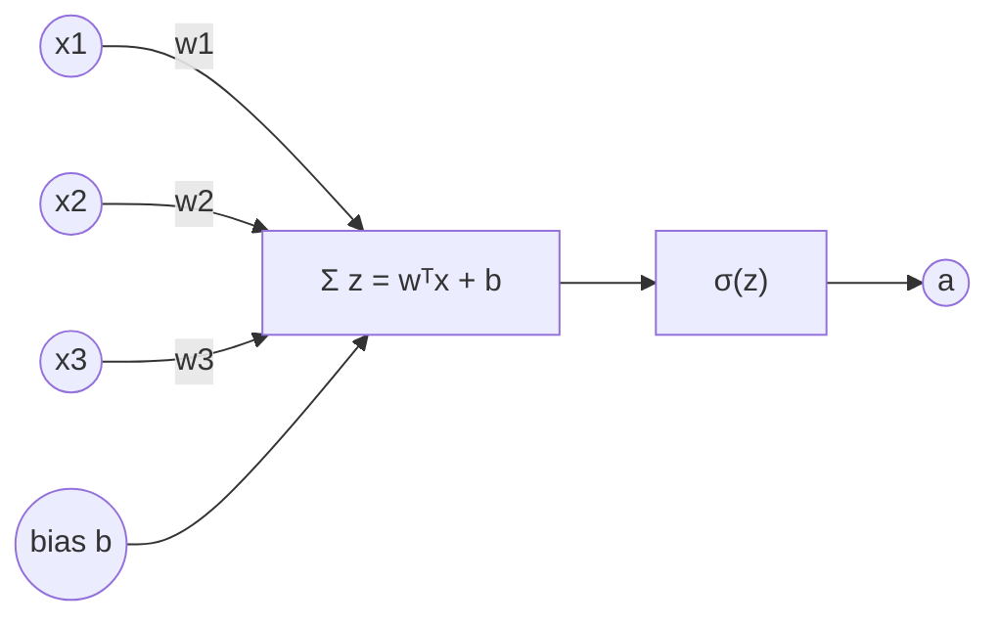
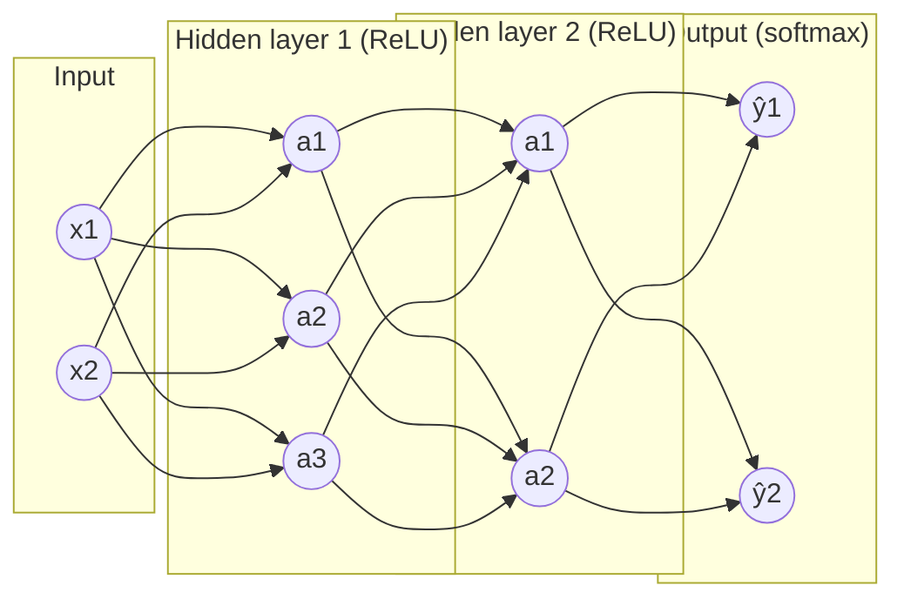
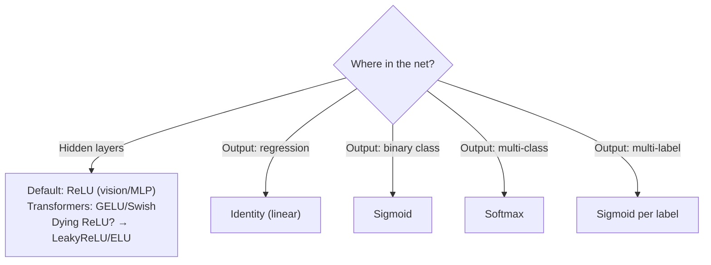
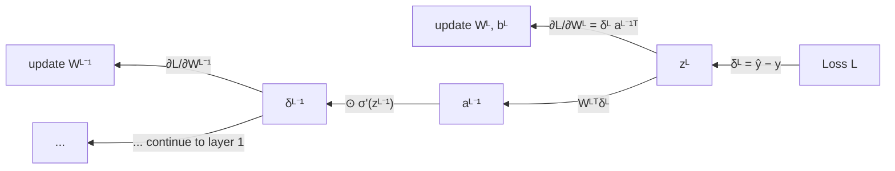
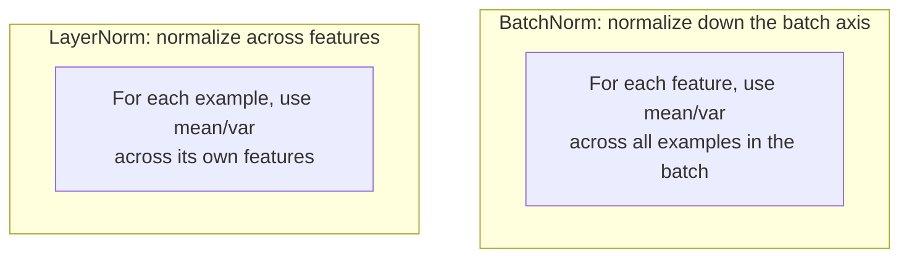
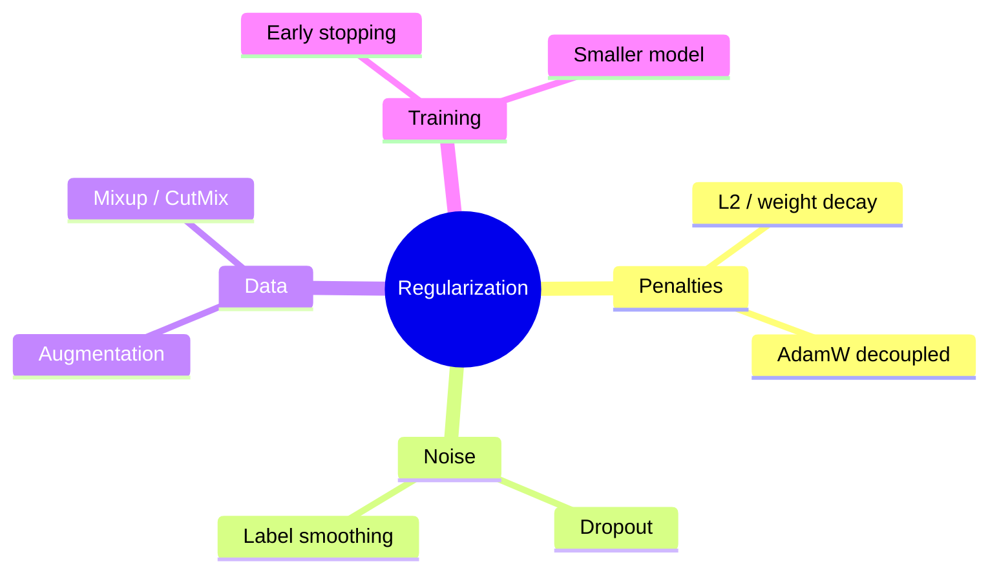
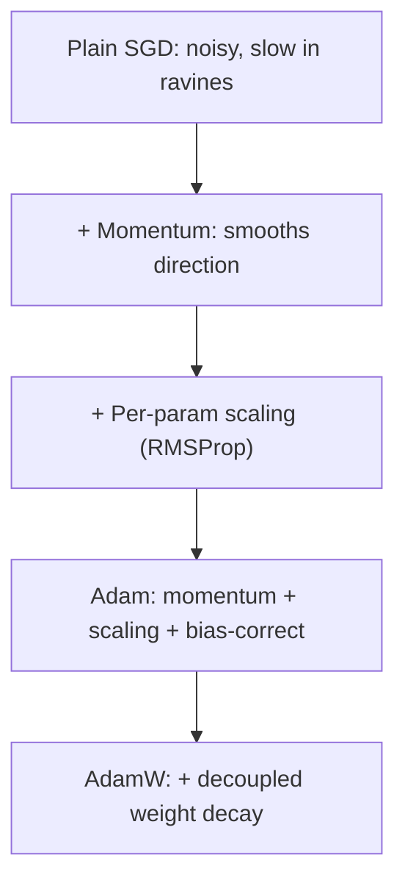
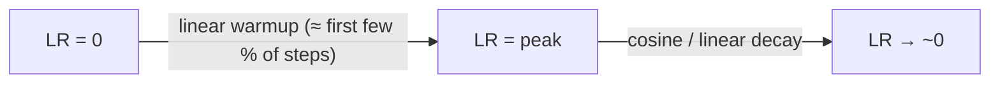
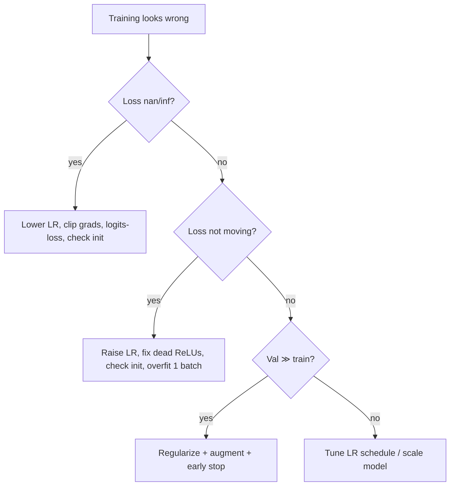

# Deep Learning Fundamentals & Neural Networks
*From a single perceptron to the engines behind modern AI — every gear, every gradient.*

*Part of the AI Engineering & ML Mastery Path — see the [index](../README.md) and [study plan](../MASTER-STUDY-PLAN.md).*

Neural networks are the substrate of almost every modern AI system: vision models, speech recognizers, recommenders, and the transformers behind large language models. This chapter takes you from the biological-ish metaphor of a single neuron all the way to training deep networks reliably — including the *exact* backpropagation arithmetic, the activation/initialization/normalization tricks that make training stable, and the optimizer and regularization knobs you'll turn in practice. By the end you won't just *use* a framework; you'll know precisely what `loss.backward()` computes and why your loss sometimes explodes, stalls, or overfits.

---

## 🎯 Learning Objectives

By the end of this chapter you can:

- **Explain** the historical arc from the perceptron to deep learning and why 2012 was an inflection point.
- **State** the Universal Approximation Theorem precisely and recite its caveats.
- **Describe** the anatomy of a feed-forward network (layers, weights, biases, pre-activations, activations).
- **Choose** an activation function for a given layer and justify it (vanishing gradients, dying ReLU, smoothness).
- **Express** a forward pass as matrix operations and implement it.
- **Derive** backpropagation layer-by-layer and **execute** it by hand on a tiny example.
- **Apply** Xavier/Glorot, He, and orthogonal initialization and explain why scale matters.
- **Implement** Batch Normalization and explain why LayerNorm dominates in transformers.
- **Regularize** with L2/weight decay, dropout, label smoothing, early stopping, and augmentation.
- **Configure** SGD+momentum, RMSProp, Adam, AdamW with appropriate LR schedules and warmup.
- **Match** loss functions (MSE/BCE/CE) to the correct output activation.
- **Diagnose and fix** common training pathologies.
- **Build a 2–3 layer NN from scratch in NumPy** and verify gradients numerically.

---

## 📋 Prerequisites

- [01 — Linear Algebra for ML](./01-linear-algebra.md) — vectors, matrices, matrix multiplication, the chain of dimensions.
- [02 — Calculus & Gradients](./02-calculus-gradients.md) — partial derivatives, the chain rule, gradient descent.
- [03 — Probability & Statistics](./03-probability-statistics.md) — distributions, expectation, cross-entropy, MLE.
- Comfortable reading and writing **NumPy** (Python 3.11+).

---

## 📑 Table of Contents

1. [A Brief History: Perceptron → Deep Learning](#1-a-brief-history-perceptron--deep-learning)
2. [The Universal Approximation Theorem](#2-the-universal-approximation-theorem)
3. [Anatomy of a Neural Network](#3-anatomy-of-a-neural-network)
4. [Activation Functions](#4-activation-functions)
5. [The Forward Pass as Matrix Operations](#5-the-forward-pass-as-matrix-operations)
6. [Backpropagation, Derived in Full](#6-backpropagation-derived-in-full)
7. [Weight Initialization](#7-weight-initialization)
8. [Normalization: BatchNorm & LayerNorm](#8-normalization-batchnorm--layernorm)
9. [Regularization](#9-regularization)
10. [Optimizers in the NN Context](#10-optimizers-in-the-nn-context)
11. [Learning-Rate Schedules & Warmup](#11-learning-rate-schedules--warmup)
12. [Loss Functions & Matching Output Activations](#12-loss-functions--matching-output-activations)
13. [Common Training Pathologies & Fixes](#13-common-training-pathologies--fixes)
14. [From-Scratch Implementation](#-from-scratch-implementation)
15. [Knowledge Check](#-knowledge-check)
16. [Exercises](#️-exercises)
17. [Cheat Sheet](#-cheat-sheet)
18. [Further Resources](#-further-resources)
19. [What's Next](#️-whats-next)

---

## 1. A Brief History: Perceptron → Deep Learning

> 💡 **Intuition:** A neural network is a stack of simple "weighted sum then squash" units. The story of deep learning is the story of learning to stack *many* such layers and train them without the gradients dying, exploding, or overfitting.

**Timeline (the load-bearing milestones):**

| Year | Milestone | Why it mattered |
|------|-----------|-----------------|
| 1943 | McCulloch & Pitts neuron | First mathematical model of a neuron (threshold logic). |
| 1958 | Rosenblatt's **Perceptron** | A trainable linear classifier with a learning rule. |
| 1969 | Minsky & Papert, *Perceptrons* | Proved a single perceptron cannot solve XOR → "AI winter" for connectionism. |
| 1986 | Rumelhart, Hinton, Williams | Popularized **backpropagation** for multi-layer perceptrons (MLPs), solving XOR and beyond. |
| 1989–98 | LeCun et al., **LeNet** | Convolutional nets read handwritten digits (used on real checks). |
| 2006 | Hinton et al., deep belief nets | "Deep learning" rebranding; layer-wise pretraining. |
| 2012 | **AlexNet** (Krizhevsky, Sutskever, Hinton) | Won ImageNet by a huge margin on **GPUs** + **ReLU** + **dropout**. The Big Bang. |
| 2014–15 | BatchNorm, ResNets, Adam | Made very deep nets trainable and reliable. |
| 2017 | **Transformer** ("Attention Is All You Need") | Replaced recurrence with attention; foundation of modern LLMs. |
| 2018→ | BERT, GPT series, scaling laws | Pretrain-then-finetune; emergence of large-scale foundation models. |

> 🎯 **Key Insight:** The *math* of backprop existed in the 1980s. What changed in 2012 was **compute (GPUs)**, **data (ImageNet)**, and a few **stabilizing tricks (ReLU, dropout, better init)**. Deep learning is as much an engineering story as a mathematical one.

The XOR problem is the canonical reason we need hidden layers. A single linear unit draws one hyperplane; XOR is not linearly separable, so no single line separates the classes:

```
   x2
   1 | (0,1)=1     (1,1)=0
     |
   0 | (0,0)=0     (1,0)=1
     +-----------------  x1
          0          1
```

No single straight line puts both `1`s on one side and both `0`s on the other. A two-layer MLP can carve the plane with two lines and combine them — that's the whole point of "depth".

---

## 2. The Universal Approximation Theorem

> 💡 **Intuition:** Even a network with a *single* hidden layer can approximate essentially any reasonable function — if you allow it enough hidden units. Depth isn't strictly *necessary* for representation; it's necessary for *efficiency*.

**Statement (Cybenko 1989 / Hornik 1991, informal but faithful).** Let $\sigma$ be a non-constant, bounded, continuous activation function (the classic version uses sigmoidal $\sigma$; Hornik generalized to any non-polynomial continuous $\sigma$). Then finite sums of the form

$$
F(\mathbf{x}) = \sum_{i=1}^{N} v_i \, \sigma\!\left(\mathbf{w}_i^\top \mathbf{x} + b_i\right)
$$

are **dense** in the space of continuous functions on any compact set $K \subset \mathbb{R}^n$. Concretely: for any continuous target $f$ and any tolerance $\varepsilon > 0$, there exists a hidden width $N$ and parameters $\{v_i, \mathbf{w}_i, b_i\}$ such that

$$
\sup_{\mathbf{x} \in K} \, \lvert F(\mathbf{x}) - f(\mathbf{x}) \rvert < \varepsilon .
$$

Here $\mathbf{x}\in\mathbb{R}^n$ is the input, $\mathbf{w}_i$ the weight vector of hidden unit $i$, $b_i$ its bias, $v_i$ the output weight, and $N$ the number of hidden units.

> ⚠️ **Common Pitfall — what the theorem does NOT promise:**
> - It is an **existence** result. It says such weights *exist*; it says **nothing** about whether **gradient descent will find them**.
> - $N$ may be **astronomically large**. One hidden layer may need exponentially more units than a deep network for the same accuracy (depth-efficiency / depth-separation results).
> - It assumes a **compact domain** $K$ — no guarantees on extrapolation outside the training region.
> - It's about **approximation**, not **generalization**. Fitting the sample $\neq$ predicting new data.

> 🎯 **Key Insight:** "Networks can represent anything" is true and almost useless on its own. The hard parts are **optimization** (can we *find* the weights?) and **generalization** (will they *transfer*?). Depth helps with both in practice.



---

## 3. Anatomy of a Neural Network

> 💡 **Intuition:** A neuron computes a weighted vote of its inputs, adds a bias (a learnable threshold), and squashes the result through a non-linearity. A layer is many neurons in parallel; a network is layers in series.

**A single neuron** with input $\mathbf{x}\in\mathbb{R}^{n}$, weights $\mathbf{w}\in\mathbb{R}^{n}$, bias $b\in\mathbb{R}$, and activation $\sigma$:

$$
z = \mathbf{w}^\top \mathbf{x} + b, \qquad a = \sigma(z).
$$

We call $z$ the **pre-activation** (or "logit" at the output) and $a$ the **activation**.



**A layered MLP.** Stack layers $\ell = 1,\dots,L$. Layer $\ell$ has weight matrix $W^{[\ell]}\in\mathbb{R}^{d_\ell \times d_{\ell-1}}$ and bias $\mathbf{b}^{[\ell]}\in\mathbb{R}^{d_\ell}$:

$$
\mathbf{z}^{[\ell]} = W^{[\ell]} \mathbf{a}^{[\ell-1]} + \mathbf{b}^{[\ell]}, \qquad
\mathbf{a}^{[\ell]} = \sigma^{[\ell]}\!\left(\mathbf{z}^{[\ell]}\right),
\qquad \mathbf{a}^{[0]} \equiv \mathbf{x}.
$$



**Parameter count.** A layer mapping $d_{\ell-1}\to d_\ell$ has $d_\ell \cdot d_{\ell-1}$ weights plus $d_\ell$ biases. A `[2 → 3 → 2 → 2]` net has $(2\cdot3+3)+(3\cdot2+2)+(2\cdot2+2)=9+8+6=23$ parameters.

> 📝 **Tip:** Always sanity-check **shapes** before training. The single most common beginner bug is a transposed weight matrix. If $\mathbf{a}^{[\ell-1]}\in\mathbb{R}^{d_{\ell-1}}$ then $W^{[\ell]}$ must be $d_\ell \times d_{\ell-1}$.

> ⚠️ **Common Pitfall:** Forgetting that **without a non-linearity**, stacking layers collapses: $W_2(W_1\mathbf{x}) = (W_2 W_1)\mathbf{x}$ is just *one* linear map. The activation is what makes depth meaningful.

**Why it matters for AI/ML:** Every architecture you'll meet — CNNs, RNNs, transformers — is this same affine-then-nonlinearity pattern with structured weight matrices (shared/convolutional weights, attention-derived weights, etc.).

---

## 4. Activation Functions

> 💡 **Intuition:** The activation decides how a neuron "fires." Its **derivative** decides how well gradients flow backward. Most activation drama is really gradient-flow drama.

Below, $z$ is the pre-activation. Derivatives are given because backprop needs them.

### 4.1 Sigmoid (logistic)

$$
\sigma(z) = \frac{1}{1 + e^{-z}}, \qquad \sigma'(z) = \sigma(z)\,(1-\sigma(z)).
$$

Output in $(0,1)$. **Worked example:** $\sigma(0)=0.5$, $\sigma'(0)=0.25$ (its maximum slope). At $z=6$, $\sigma\approx0.9975$ and $\sigma'\approx0.0025$ — nearly flat.

> ⚠️ **Vanishing gradient:** $\sigma'(z)\le 0.25$ *everywhere*, and $\to 0$ in the tails. Multiply many such factors through deep layers and the gradient shrinks geometrically — early layers barely learn. Sigmoid is also **not zero-centered** (outputs always positive), which biases gradient directions. Use it today only for the **output** of binary classification, not hidden layers.

### 4.2 Tanh

$$
\tanh(z) = \frac{e^{z}-e^{-z}}{e^{z}+e^{-z}}, \qquad \tanh'(z) = 1 - \tanh^2(z).
$$

Output in $(-1,1)$, **zero-centered** (better than sigmoid), max slope $1$ at $z=0$. Still saturates in the tails → still vanishes. Common in older RNNs.

### 4.3 ReLU (Rectified Linear Unit)

$$
\mathrm{ReLU}(z) = \max(0, z), \qquad
\mathrm{ReLU}'(z) = \begin{cases} 1 & z > 0 \\ 0 & z < 0 \end{cases}
$$

(The derivative at exactly $z=0$ is undefined; frameworks pick $0$ or $1$.)

> 🎯 **Key Insight:** ReLU's gradient is **exactly 1** for active units — no shrinkage. That single property is a huge reason deep nets became trainable (AlexNet, 2012). It's also cheap (a comparison) and induces sparsity.

> ⚠️ **Dying ReLU:** If a neuron's pre-activation is always negative (often from too-large a learning rate or bad init), its gradient is always $0$ and it **never recovers** — a "dead" unit. Mitigate with smaller LR, He init, or a leaky variant.

### 4.4 LeakyReLU / Parametric ReLU

$$
\mathrm{LeakyReLU}(z) = \begin{cases} z & z>0 \\ \alpha z & z\le 0\end{cases}, \quad \alpha \approx 0.01 \text{ (PReLU learns } \alpha).
$$

The small negative slope keeps gradients alive, curing dying ReLU.

### 4.5 ELU (Exponential Linear Unit)

$$
\mathrm{ELU}(z) = \begin{cases} z & z>0 \\ \alpha\,(e^{z}-1) & z\le 0\end{cases}, \quad \alpha>0.
$$

Smooth, negative saturation pushes mean activations toward zero (self-normalizing flavor). Slightly costlier (an exp).

### 4.6 GELU (Gaussian Error Linear Unit)

$$
\mathrm{GELU}(z) = z\,\Phi(z) = z\cdot\tfrac12\!\left[1+\operatorname{erf}\!\left(\tfrac{z}{\sqrt2}\right)\right],
$$

where $\Phi$ is the standard-normal CDF. A common fast approximation:

$$
\mathrm{GELU}(z)\approx 0.5\,z\left(1+\tanh\!\left[\sqrt{\tfrac{2}{\pi}}\,(z+0.044715\,z^{3})\right]\right).
$$

Smooth, gates the input by *how likely it is to be positive*. **The default in transformers (BERT, GPT).**

### 4.7 Swish / SiLU

$$
\mathrm{Swish}(z) = z\cdot\sigma(\beta z), \qquad \text{SiLU} = z\cdot\sigma(z)\ (\beta{=}1).
$$

Smooth, non-monotonic, often slightly better than ReLU in deep nets.

### 4.8 Softmax (output layer for multi-class)

$$
\mathrm{softmax}(\mathbf{z})_i = \frac{e^{z_i}}{\sum_{j} e^{z_j}}.
$$

Maps a logit vector to a probability distribution ($\ge0$, sums to $1$).

> ⚠️ **Numerical pitfall:** Compute $\mathrm{softmax}$ on $z_i - \max_j z_j$ to avoid `exp` overflow. Identical result, no `inf`.



| Activation | Range | Zero-centered | Saturates? | Main use | Risk |
|---|---|---|---|---|---|
| Sigmoid | (0,1) | No | Yes | Binary output | Vanishing grad |
| Tanh | (−1,1) | Yes | Yes | Old RNNs | Vanishing grad |
| ReLU | [0,∞) | No | No (left dead) | CNN/MLP default | Dying ReLU |
| LeakyReLU | (−∞,∞) | ~Yes | No | ReLU fix | Extra hyperparam |
| ELU | (−α,∞) | ~Yes | Left soft | Deep nets | exp cost |
| GELU | ~(−0.17,∞) | ~Yes | Soft | Transformers | exp/erf cost |
| Swish/SiLU | ~(−0.28,∞) | ~Yes | Soft | Deep nets | exp cost |
| Softmax | (0,1), Σ=1 | — | — | Multi-class output | overflow (fix with max-subtract) |

**Why it matters for AI/ML:** Picking ReLU-family activations for hidden layers and the *correct* output activation for your loss is the difference between a network that trains in minutes and one that never moves.

---

## 5. The Forward Pass as Matrix Operations

> 💡 **Intuition:** Don't loop over neurons — multiply matrices. A whole layer for a whole **batch** is one matrix multiply plus a bias broadcast plus an element-wise activation.

For a **batch** of $m$ examples stacked as rows, let $A^{[0]} = X \in \mathbb{R}^{m\times d_0}$. Using a **row-vector convention** (each row is one example):

$$
Z^{[\ell]} = A^{[\ell-1]} W^{[\ell]\top} + \mathbf{1}_m\,\mathbf{b}^{[\ell]\top}, \qquad
A^{[\ell]} = \sigma^{[\ell]}\!\left(Z^{[\ell]}\right),
$$

where $W^{[\ell]}\in\mathbb{R}^{d_\ell\times d_{\ell-1}}$, $\mathbf{b}^{[\ell]}\in\mathbb{R}^{d_\ell}$, and the bias is broadcast across the $m$ rows.

> 📝 **Tip:** The "shape contract" you must hold in your head: `(m, d_in) @ (d_in, d_out) -> (m, d_out)`. If a multiply fails, print shapes; the fix is almost always a transpose.

```python
import numpy as np

def forward(X, params):
    """X: (m, d0). params: list of (W, b) with W shape (d_out, d_in)."""
    A = X
    cache = [X]
    for (W, b) in params[:-1]:
        Z = A @ W.T + b           # (m, d_out)
        A = np.maximum(0, Z)      # ReLU hidden layers
        cache.append(A)
    Wo, bo = params[-1]
    Z = A @ Wo.T + bo             # logits (m, C)
    Z = Z - Z.max(axis=1, keepdims=True)        # numerically stable
    expZ = np.exp(Z)
    probs = expZ / expZ.sum(axis=1, keepdims=True)  # softmax
    return probs

np.random.seed(0)
X = np.random.randn(4, 3)                 # 4 examples, 3 features
params = [(np.random.randn(5, 3)*0.1, np.zeros(5)),   # 3 -> 5
          (np.random.randn(2, 5)*0.1, np.zeros(2))]   # 5 -> 2
p = forward(X, params)
print(p.shape)                 # (4, 2)
print(np.round(p.sum(axis=1), 6))  # [1. 1. 1. 1.]  rows are valid distributions
```

**Why it matters for AI/ML:** This vectorized form is exactly what runs on GPUs — large dense matmuls are what GPUs accelerate, which is why batching is essential for throughput.

---

## 6. Backpropagation, Derived in Full

> 💡 **Intuition:** Backprop is just the **chain rule** applied repeatedly, reused efficiently. Each layer receives "how much the loss cares about my output" and turns it into "how much it cares about my weights" and "how much it cares about my input" (to pass further back).

### 6.1 Notation

For layer $\ell$: pre-activation $\mathbf{z}^{[\ell]}$, activation $\mathbf{a}^{[\ell]} = \sigma(\mathbf{z}^{[\ell]})$, loss $\mathcal{L}$. Define the key quantity, the **error signal**:

$$
\boldsymbol{\delta}^{[\ell]} \;\equiv\; \frac{\partial \mathcal{L}}{\partial \mathbf{z}^{[\ell]}}.
$$

### 6.2 The chain of derivatives (ASCII)

```
            forward  ─────────────────────────────────────────►
   x = a0 → [W1,b1] → z1 → σ → a1 → [W2,b2] → z2 → σ → a2 ... → ŷ → L

   backward ◄─────────────────────────────────────────────────
        ∂L/∂z2 = δ2                       (output error)
        ∂L/∂W2 = δ2 · a1ᵀ                 (weights here)
        ∂L/∂b2 = δ2
        ∂L/∂a1 = W2ᵀ · δ2                 (push error back)
        ∂L/∂z1 = δ1 = (W2ᵀ δ2) ⊙ σ'(z1)   (Hadamard with local slope)
        ∂L/∂W1 = δ1 · a0ᵀ
        ∂L/∂b1 = δ1
```

The symbol $\odot$ is the **element-wise (Hadamard) product**.

### 6.3 The four backprop equations

**(1) Output-layer error.** For loss $\mathcal{L}$ and output activation $\sigma^{[L]}$:

$$
\boldsymbol{\delta}^{[L]} = \nabla_{\mathbf{a}^{[L]}}\mathcal{L} \;\odot\; \sigma^{[L]\prime}\!\left(\mathbf{z}^{[L]}\right).
$$

**(2) Backpropagate the error.**

$$
\boldsymbol{\delta}^{[\ell]} = \left(W^{[\ell+1]\top}\,\boldsymbol{\delta}^{[\ell+1]}\right)\;\odot\; \sigma^{[\ell]\prime}\!\left(\mathbf{z}^{[\ell]}\right).
$$

**(3) Weight gradients.**

$$
\frac{\partial \mathcal{L}}{\partial W^{[\ell]}} = \boldsymbol{\delta}^{[\ell]}\,\mathbf{a}^{[\ell-1]\top}.
$$

**(4) Bias gradients.**

$$
\frac{\partial \mathcal{L}}{\partial \mathbf{b}^{[\ell]}} = \boldsymbol{\delta}^{[\ell]}.
$$

> 🎯 **Key Insight — the softmax + cross-entropy gift:** When the output is softmax and the loss is cross-entropy, the messy Jacobian cancels and you get the famously clean result
> $$\boldsymbol{\delta}^{[L]} = \hat{\mathbf{y}} - \mathbf{y},$$
> i.e. **predicted probabilities minus one-hot labels**. Same clean form for sigmoid + binary cross-entropy. This is why those pairings are standard.

For a **mini-batch** of $m$ examples (row convention, gradients averaged):

$$
\frac{\partial \mathcal{L}}{\partial W^{[\ell]}} = \frac{1}{m}\,\Delta^{[\ell]\top} A^{[\ell-1]}, \qquad
\frac{\partial \mathcal{L}}{\partial \mathbf{b}^{[\ell]}} = \frac{1}{m}\sum_{\text{rows}} \Delta^{[\ell]},
$$

where $\Delta^{[\ell]}\in\mathbb{R}^{m\times d_\ell}$ stacks the per-example errors.

### 6.4 Tiny numeric example (do it by hand)

A 1-hidden-unit regression net, single example. Sigmoid hidden, identity output, MSE loss $\mathcal{L}=\tfrac12(\hat y - y)^2$.

**Setup:** input $x=1$, target $y=0$. Parameters: $w_1=0.5,\,b_1=0,\,w_2=1.0,\,b_2=0$.

**Forward:**
$$z_1 = w_1 x + b_1 = 0.5,\quad a_1=\sigma(0.5)=\frac{1}{1+e^{-0.5}}\approx 0.6225.$$
$$z_2 = w_2 a_1 + b_2 = 0.6225,\quad \hat y = z_2 = 0.6225.$$
$$\mathcal{L}=\tfrac12(0.6225-0)^2 \approx 0.1937.$$

**Backward:**
$$\delta_2 = \frac{\partial\mathcal{L}}{\partial z_2} = (\hat y - y)\cdot 1 = 0.6225.$$
$$\frac{\partial\mathcal{L}}{\partial w_2} = \delta_2\, a_1 = 0.6225\times 0.6225 \approx 0.3875,\qquad \frac{\partial\mathcal{L}}{\partial b_2}=\delta_2=0.6225.$$
$$\delta_1 = (w_2\,\delta_2)\cdot \sigma'(z_1) = (1.0\times0.6225)\times\big(0.6225\times(1-0.6225)\big) \approx 0.6225\times 0.2350 \approx 0.1463.$$
$$\frac{\partial\mathcal{L}}{\partial w_1} = \delta_1\, x = 0.1463\times 1 = 0.1463,\qquad \frac{\partial\mathcal{L}}{\partial b_1}=\delta_1=0.1463.$$

**One SGD step** with LR $\eta=0.1$: $w_2 \leftarrow 1.0 - 0.1(0.3875)=0.9613$, $w_1 \leftarrow 0.5 - 0.1(0.1463)=0.4854$, etc. A new forward pass would give a smaller loss — confirming the gradients point downhill.

> ⚠️ **Common Pitfall:** Mixing up which activation derivative goes with which layer's $\mathbf{z}$. $\sigma'$ in $\boldsymbol{\delta}^{[\ell]}$ is **always evaluated at $\mathbf{z}^{[\ell]}$** (the pre-activation you cached on the forward pass). Cache it!



**Why it matters for AI/ML:** Autograd frameworks (PyTorch, JAX) automate exactly these four equations on a computation graph. Knowing them lets you debug `nan` gradients, write custom layers, and reason about gradient flow in very deep nets.

---

## 7. Weight Initialization

> 💡 **Intuition:** If weights are too big, activations (and gradients) blow up; too small, they vanish. Good init keeps the **variance of signals roughly constant across layers** so gradients neither explode nor die at step 0.

**Why not zeros?** If all weights are equal (e.g. zero), every neuron in a layer computes the same thing and receives the same gradient — they stay identical forever. This is the **symmetry-breaking** problem. Random init breaks symmetry.

**Xavier / Glorot (for tanh / sigmoid).** Keeps variance constant in both directions. With $n_{\text{in}}, n_{\text{out}}$ the fan-in/out:

$$
\text{Var}(W) = \frac{2}{n_{\text{in}}+n_{\text{out}}}, \quad\text{or uniform } W\sim \mathcal{U}\!\left[-\sqrt{\tfrac{6}{n_{\text{in}}+n_{\text{out}}}},\ \sqrt{\tfrac{6}{n_{\text{in}}+n_{\text{out}}}}\right].
$$

**He / Kaiming (for ReLU family).** ReLU zeros half the inputs, halving variance — so double it:

$$
\text{Var}(W) = \frac{2}{n_{\text{in}}}, \qquad W \sim \mathcal{N}\!\left(0,\ \tfrac{2}{n_{\text{in}}}\right).
$$

**Orthogonal.** Initialize $W$ as a (semi-)orthogonal matrix ($W^\top W = I$ on the appropriate factor). Preserves vector norms exactly through the linear map — excellent for deep/recurrent nets where signal preservation across many steps matters.

```python
import numpy as np
def he_normal(n_out, n_in, rng):
    return rng.standard_normal((n_out, n_in)) * np.sqrt(2.0 / n_in)
def xavier_uniform(n_out, n_in, rng):
    lim = np.sqrt(6.0 / (n_in + n_out))
    return rng.uniform(-lim, lim, size=(n_out, n_in))
rng = np.random.default_rng(0)
W = he_normal(256, 256, rng)
print(round(W.std(), 4), "≈", round(np.sqrt(2/256), 4))  # 0.0883 ≈ 0.0884
```

> ⚠️ **Common Pitfall:** Using the default `randn` (variance 1) for a wide layer. With fan-in 1024, activations grow by $\sqrt{1024}=32\times$ per layer → instant overflow. Always scale by init.

| Init | Variance | Pair with |
|---|---|---|
| Xavier/Glorot | $2/(n_{in}+n_{out})$ | tanh, sigmoid |
| He/Kaiming | $2/n_{in}$ | ReLU, LeakyReLU |
| Orthogonal | norm-preserving | deep/recurrent nets |

**Why it matters for AI/ML:** Correct init is often the difference between a 50-layer net that trains and one whose loss is `nan` at iteration 1. BatchNorm/residuals reduce sensitivity but don't eliminate it.

---

## 8. Normalization: BatchNorm & LayerNorm

> 💡 **Intuition:** As parameters update, the distribution of each layer's inputs shifts ("internal covariate shift"), forcing later layers to constantly re-adapt. Normalization standardizes activations so each layer sees a stable, well-scaled input — letting you use higher learning rates and train deeper.

### 8.1 Batch Normalization (Ioffe & Szegedy, 2015)

For a mini-batch $\{z^{(1)},\dots,z^{(m)}\}$ of a single feature/channel:

$$
\mu_B = \frac1m\sum_{i=1}^m z^{(i)}, \qquad
\sigma_B^2 = \frac1m\sum_{i=1}^m (z^{(i)}-\mu_B)^2,
$$
$$
\hat z^{(i)} = \frac{z^{(i)}-\mu_B}{\sqrt{\sigma_B^2 + \epsilon}}, \qquad
y^{(i)} = \gamma\,\hat z^{(i)} + \beta.
$$

$\gamma,\beta$ are **learnable** scale/shift (so the network can undo normalization if it helps); $\epsilon$ (e.g. $10^{-5}$) prevents division by zero. The mean/variance are computed **over the batch** (and spatial positions for conv).

> ⚠️ **Common Pitfall (train vs eval):** At **inference** there may be no batch. BatchNorm uses **running (moving-average) statistics** collected during training, not batch statistics. Forgetting `model.eval()` in PyTorch yields garbage at test time. BatchNorm also behaves poorly with **tiny batches** (noisy statistics) and is awkward for variable-length sequences.

### 8.2 Layer Normalization (Ba, Kiros, Hinton, 2016)

Normalize **across the features of a single example** (not across the batch):

$$
\mu = \frac1d\sum_{j=1}^d z_j,\quad \sigma^2=\frac1d\sum_{j=1}^d (z_j-\mu)^2,\quad
\hat z_j = \frac{z_j-\mu}{\sqrt{\sigma^2+\epsilon}},\quad y_j=\gamma_j\hat z_j+\beta_j.
$$

> 🎯 **Key Insight — why transformers use LayerNorm:** It is **independent of batch size** and **independent of sequence length** — each token is normalized using only its own feature vector. That makes it perfect for variable-length text, batch size 1 inference, and autoregressive decoding, where BatchNorm's cross-batch statistics are unstable or unavailable.



```
            features →
          f1   f2   f3   f4
   ex1  [  .    .    .    .  ]  ┐ LayerNorm averages along a ROW (one example)
   ex2  [  .    .    .    .  ]  │
   ex3  [  .    .    .    .  ]  ┘
          └────────────────┘
          BatchNorm averages down a COLUMN (one feature across the batch)
```

| | BatchNorm | LayerNorm |
|---|---|---|
| Normalizes over | batch (+ spatial) | features of one example |
| Depends on batch size | Yes (bad for small batches) | No |
| Train ≠ eval | Yes (running stats) | No |
| Typical home | CNNs / vision | Transformers / RNNs |

**Why it matters for AI/ML:** RMSNorm and LayerNorm are everywhere in LLMs. Knowing *which axis* is normalized explains a whole class of "works in training, broken at inference" bugs.

---

## 9. Regularization

> 💡 **Intuition:** A network with millions of parameters can memorize the training set. Regularization biases it toward simpler solutions that generalize.

### 9.1 L2 / weight decay

Add $\frac{\lambda}{2}\sum_\ell \lVert W^{[\ell]}\rVert_F^2$ to the loss. Gradient adds $\lambda W$, so each step also does $W \leftarrow (1-\eta\lambda)W$ — shrinking weights toward zero ("decay").

> ⚠️ **Pitfall:** With **adaptive** optimizers (Adam), L2-in-the-loss is *not* the same as true weight decay because the penalty gets scaled by the adaptive denominator. Use **AdamW**, which decouples weight decay from the gradient update (see §10).

### 9.2 Dropout (Srivastava et al., 2014)

During training, zero each activation independently with probability $p$, then scale survivors by $1/(1-p)$ (inverted dropout) so the expected activation is unchanged:

$$
\tilde a_j = \frac{m_j}{1-p}\,a_j, \quad m_j\sim\text{Bernoulli}(1-p).
$$

At test time, dropout is **off**. Interpreted as training an **implicit ensemble** of exponentially many sub-networks that share weights.

### 9.3 Label smoothing

Replace hard one-hot targets with soft ones: for $K$ classes and smoothing $\varepsilon$,

$$
y_k^{\text{LS}} = (1-\varepsilon)\,y_k + \frac{\varepsilon}{K}.
$$

Discourages over-confident logits, improves calibration and generalization (typical $\varepsilon=0.1$).

### 9.4 Early stopping

Monitor validation loss; stop (and keep the best checkpoint) when it stops improving. Free, effective; cheaply approximates limiting model complexity.

### 9.5 Data augmentation

Expand the effective dataset with label-preserving transforms (flips, crops, color jitter for images; synonym swaps, back-translation for text; mixup/cutmix as blends). Often the **highest-ROI** regularizer because it adds real signal, not just a penalty.



| Technique | What it does | Knob | When |
|---|---|---|---|
| L2 / AdamW | Shrinks weights | $\lambda$ (1e-2…1e-4) | Almost always |
| Dropout | Random unit masking | $p$ (0.1…0.5) | Big MLPs, less in CNN/transformer hidden |
| Label smoothing | Softens targets | $\varepsilon$ (0.1) | Classification |
| Early stopping | Stops at best val | patience | Always cheap |
| Augmentation | More effective data | task-specific | When data is limited |

**Why it matters for AI/ML:** Train/val gap is the headline diagnostic. Underfitting → reduce regularization / grow model; overfitting → add it. This is the core of practical model tuning.

---

## 10. Optimizers in the NN Context

> 💡 **Intuition:** Gradient descent walks downhill. The improvements add **memory** (momentum) and **per-parameter step sizes** (adaptive methods) to navigate ravines and varying curvature.

Let $g_t = \nabla_\theta \mathcal{L}$ be the gradient at step $t$, $\eta$ the learning rate.

**SGD + momentum.** Velocity accumulates past gradients (an exponential moving average), damping oscillations across ravines:

$$
v_t = \mu\, v_{t-1} + g_t, \qquad \theta_{t} = \theta_{t-1} - \eta\, v_t, \quad \mu\approx 0.9.
$$

**RMSProp.** Per-parameter step scaled by recent gradient magnitude:

$$
s_t = \rho\, s_{t-1} + (1-\rho) g_t^2, \qquad \theta_t = \theta_{t-1} - \frac{\eta}{\sqrt{s_t}+\epsilon}\,g_t.
$$

**Adam (Kingma & Ba, 2015).** Momentum + RMSProp + bias correction:

$$
m_t = \beta_1 m_{t-1} + (1-\beta_1)g_t, \qquad v_t = \beta_2 v_{t-1} + (1-\beta_2) g_t^2,
$$
$$
\hat m_t = \frac{m_t}{1-\beta_1^t}, \qquad \hat v_t = \frac{v_t}{1-\beta_2^t}, \qquad
\theta_t = \theta_{t-1} - \eta\,\frac{\hat m_t}{\sqrt{\hat v_t}+\epsilon}.
$$

Defaults: $\beta_1{=}0.9,\ \beta_2{=}0.999,\ \epsilon{=}10^{-8}$. Bias correction matters because $m_0=v_0=0$ biases early estimates toward zero.

**AdamW (Loshchilov & Hutter, 2019).** Decouples weight decay from the adaptive update — apply decay directly to weights:

$$
\theta_t = \theta_{t-1} - \eta\left(\frac{\hat m_t}{\sqrt{\hat v_t}+\epsilon} + \lambda\,\theta_{t-1}\right).
$$

> 🎯 **Key Insight:** **AdamW is the default for transformers/LLMs.** Plain Adam with L2-in-loss regularizes weights *less* than you think because the penalty is divided by $\sqrt{\hat v}$. AdamW fixes this and reliably generalizes better.

| Optimizer | Momentum | Adaptive LR | Notes |
|---|---|---|---|
| SGD | – | – | Simple; needs LR tuning |
| SGD+momentum | ✓ | – | Strong baseline, great final accuracy in vision |
| RMSProp | – | ✓ | Good for RNNs |
| Adam | ✓ | ✓ | Fast convergence, robust default |
| AdamW | ✓ | ✓ | **Decoupled decay — modern default** |



> ⚠️ **Common Pitfall:** Reusing a **vision** learning rate (`SGD lr=0.1`) with Adam. Adam typically wants `1e-3`–`3e-4`. Wrong LR is the #1 cause of "my loss won't move" or "my loss is nan."

**Why it matters for AI/ML:** Optimizer + LR + schedule is where most real training time is won or lost. AdamW + cosine decay + warmup is the workhorse recipe for transformers.

---

## 11. Learning-Rate Schedules & Warmup

> 💡 **Intuition:** Big steps early (explore fast), small steps late (settle into a minimum). And in adaptive optimizers, **don't take huge steps before the variance estimates have warmed up.**

**Step decay:** multiply LR by $\gamma$ every $k$ epochs.

**Cosine annealing:** smooth decay from $\eta_{\max}$ to $\eta_{\min}$ over $T$ steps:

$$
\eta_t = \eta_{\min} + \tfrac12(\eta_{\max}-\eta_{\min})\left(1+\cos\!\frac{\pi t}{T}\right).
$$

**Linear warmup** for the first $T_w$ steps, then decay:

$$
\eta_t = \eta_{\max}\cdot \frac{t}{T_w}\quad (t\le T_w).
$$

> 🎯 **Key Insight — why warmup:** Early in training, Adam's second-moment estimate $\hat v_t$ is noisy and small, so step sizes can be huge and destabilizing. A short warmup lets these statistics stabilize before full-size steps. Warmup is near-mandatory for training transformers.



```python
import numpy as np
def lr_schedule(step, peak=3e-4, warmup=1000, total=10000, min_lr=0.0):
    if step < warmup:
        return peak * step / warmup
    t = (step - warmup) / max(1, (total - warmup))
    return min_lr + 0.5*(peak - min_lr)*(1 + np.cos(np.pi * t))
print(round(lr_schedule(0),6), round(lr_schedule(1000),6), round(lr_schedule(10000),8))
# 0.0  0.0003  0.0   (zero at start, peak after warmup, ~zero at end)
```

**Why it matters for AI/ML:** "AdamW + linear warmup + cosine decay" is the recipe in nearly every modern training run. Getting warmup wrong is a frequent cause of early divergence.

---

## 12. Loss Functions & Matching Output Activations

> 🎯 **Key Insight:** The output activation and loss must be **paired correctly** — and the right pairing produces the clean $\hat{\mathbf{y}}-\mathbf{y}$ gradient. Mismatching them (e.g. softmax + MSE) causes slow, unstable training.

**Mean Squared Error (regression):**

$$
\mathcal{L}_{\text{MSE}} = \frac1m\sum_{i=1}^m (\hat y_i - y_i)^2, \quad \text{output activation: identity}.
$$

**Binary Cross-Entropy (binary / multi-label):**

$$
\mathcal{L}_{\text{BCE}} = -\frac1m\sum_{i=1}^m \big[y_i\log \hat y_i + (1-y_i)\log(1-\hat y_i)\big], \quad \text{activation: sigmoid}.
$$

**Categorical Cross-Entropy (multi-class, single label):**

$$
\mathcal{L}_{\text{CE}} = -\frac1m\sum_{i=1}^m \sum_{k=1}^{K} y_{ik}\log \hat y_{ik}, \quad \text{activation: softmax}.
$$

| Task | Output units | Activation | Loss | Output gradient |
|---|---|---|---|---|
| Regression | 1+ (linear) | Identity | MSE | $\hat y - y$ |
| Binary class | 1 | Sigmoid | BCE | $\hat y - y$ |
| Multi-label | $K$ | Sigmoid (per) | BCE (sum) | $\hat y - y$ |
| Multi-class | $K$ | Softmax | Cross-entropy | $\hat y - y$ |

> ⚠️ **Numerical pitfall:** Don't compute softmax then `log` separately — use a fused **log-softmax + NLL** ("cross-entropy with logits") for stability. Same for `BCEWithLogits`. Doing the two steps naively produces `log(0) = -inf` when a probability underflows.

**Worked example (CE gradient).** Two classes, logits give $\hat{\mathbf{y}}=(0.7, 0.3)$, true label class 0 so $\mathbf{y}=(1,0)$. Then $\boldsymbol{\delta}^{[L]}=\hat{\mathbf{y}}-\mathbf{y}=(-0.3, 0.3)$: push logit 0 up, logit 1 down. Intuitive and clean.

**Why it matters for AI/ML:** Choosing the right loss/activation pair is a one-line decision that determines whether training is stable and fast. It's also a classic interview question.

---

## 13. Common Training Pathologies & Fixes

| Symptom | Likely cause | Fix |
|---|---|---|
| Loss = `nan` / `inf` | LR too high; bad init; `log(0)`; exploding grads | Lower LR; He/Xavier init; use logits-based loss; **gradient clipping** |
| Loss flat from step 0 | LR too low; dead ReLUs; vanishing grad; zero init | Raise LR; LeakyReLU; normalization/residuals; random init |
| Train ↓ but val ↑ | Overfitting | Add regularization (dropout, weight decay, augmentation), early stop |
| Train loss high too | Underfitting / too small | Bigger model, train longer, higher LR, less regularization |
| Loss oscillates wildly | LR too high; batch too small | Lower LR; LR warmup; larger batch; momentum |
| Great train, broken at test | BatchNorm `train` mode at eval; dropout left on | `model.eval()`; verify running stats |
| Slow then diverges late | No LR decay | Cosine/step decay |

> 📝 **Tip — gradient clipping** caps the global gradient norm: if $\lVert g\rVert > \tau$, rescale $g \leftarrow \tau\, g / \lVert g\rVert$. Standard for RNNs/transformers to tame exploding gradients.

> ⚠️ **Common Pitfall:** Debugging the model architecture when the real bug is the **data pipeline** (unnormalized inputs, wrong label encoding, leaked test data). Always first **overfit a tiny batch** (e.g. 4 examples) to ~0 loss — if you can't, the bug is in your code, not your hyperparameters.



---

## 🧮 From-Scratch Implementation

A complete 2-hidden-layer classifier in **NumPy only**: forward, backprop, training loop, and **numerical gradient check**. Runs as-is on Python 3.11+ with NumPy.

```python
import numpy as np

# ---------- activations ----------
def relu(z):       return np.maximum(0, z)
def relu_grad(z):  return (z > 0).astype(z.dtype)

def softmax(z):
    z = z - z.max(axis=1, keepdims=True)      # numerical stability
    e = np.exp(z)
    return e / e.sum(axis=1, keepdims=True)

# ---------- model ----------
class MLP:
    """Architecture: d_in -> h1 -> h2 -> C, ReLU hidden, softmax output."""
    def __init__(self, d_in, h1, h2, C, seed=0):
        rng = np.random.default_rng(seed)
        he = lambda nout, nin: rng.standard_normal((nout, nin)) * np.sqrt(2.0/nin)
        self.W1, self.b1 = he(h1, d_in), np.zeros(h1)
        self.W2, self.b2 = he(h2, h1),   np.zeros(h2)
        self.W3, self.b3 = he(C,  h2),   np.zeros(C)

    def forward(self, X):
        self.X  = X
        self.Z1 = X @ self.W1.T + self.b1;  self.A1 = relu(self.Z1)
        self.Z2 = self.A1 @ self.W2.T + self.b2;  self.A2 = relu(self.Z2)
        self.Z3 = self.A2 @ self.W3.T + self.b3
        self.P  = softmax(self.Z3)
        return self.P

    def loss(self, X, Y):                      # Y: one-hot (m, C)
        P = self.forward(X)
        m = X.shape[0]
        return -np.sum(Y * np.log(P + 1e-12)) / m

    def backward(self, Y):
        m = self.X.shape[0]
        dZ3 = (self.P - Y) / m                  # softmax+CE gift: ŷ - y
        dW3 = dZ3.T @ self.A2;  db3 = dZ3.sum(0)
        dA2 = dZ3 @ self.W3
        dZ2 = dA2 * relu_grad(self.Z2)
        dW2 = dZ2.T @ self.A1;  db2 = dZ2.sum(0)
        dA1 = dZ2 @ self.W2
        dZ1 = dA1 * relu_grad(self.Z1)
        dW1 = dZ1.T @ self.X;   db1 = dZ1.sum(0)
        return dict(W1=dW1, b1=db1, W2=dW2, b2=db2, W3=dW3, b3=db3)

    def step(self, grads, lr):
        for k in ("W1","b1","W2","b2","W3","b3"):
            setattr(self, k, getattr(self, k) - lr * grads[k])

# ---------- numerical gradient check ----------
def grad_check(model, X, Y, name="W2", eps=1e-5, n=5):
    model.loss(X, Y)
    analytic = model.backward(Y)[name]
    P = getattr(model, name).copy()
    flat = P.reshape(-1)
    rng = np.random.default_rng(1)
    idxs = rng.choice(flat.size, size=min(n, flat.size), replace=False)
    max_rel = 0.0
    for i in idxs:
        orig = flat[i]
        flat[i] = orig + eps; setattr(model, name, P.reshape(getattr(model,name).shape)); lp = model.loss(X, Y)
        flat[i] = orig - eps; setattr(model, name, P.reshape(getattr(model,name).shape)); lm = model.loss(X, Y)
        flat[i] = orig;       setattr(model, name, P.reshape(getattr(model,name).shape))
        num = (lp - lm) / (2*eps)
        ana = analytic.reshape(-1)[i]
        rel = abs(num - ana) / max(1e-8, abs(num) + abs(ana))
        max_rel = max(max_rel, rel)
    return max_rel

# ---------- demo: learn a 2-spiral-ish toy problem ----------
rng = np.random.default_rng(42)
m, d_in, C = 300, 2, 3
X = rng.standard_normal((m, d_in))
# class = which angular sector the point falls in (a non-linear boundary)
theta = np.arctan2(X[:,1], X[:,0])
y = ((theta + np.pi) / (2*np.pi) * C).astype(int) % C
Y = np.eye(C)[y]

net = MLP(d_in, 64, 32, C, seed=0)

print("grad check (rel err, should be < 1e-6):", f"{grad_check(net, X, Y):.2e}")

for epoch in range(2001):
    net.loss(X, Y)
    grads = net.backward(Y)
    net.step(grads, lr=0.5)
    if epoch % 500 == 0:
        acc = (net.forward(X).argmax(1) == y).mean()
        print(f"epoch {epoch:4d}  loss {net.loss(X,Y):.4f}  acc {acc:.3f}")

# Expected (approx; exact numbers may vary slightly by platform):
# grad check (rel err, should be < 1e-6): 1.xxe-09   <- analytic == numerical
# epoch    0  loss ~1.10  acc ~0.34
# epoch  500  loss decreasing, acc rising
# epoch 2000  loss ~0.1-0.3  acc ~0.90+   <- it learned the non-linear boundary
```

> 🎯 **Key Insight — gradient checking is your safety net.** If the relative error between the analytic gradient and the centered finite-difference $\frac{\mathcal{L}(\theta+\epsilon)-\mathcal{L}(\theta-\epsilon)}{2\epsilon}$ is below ~$10^{-6}$, your backprop is almost certainly correct. Always grad-check a hand-written layer *before* trusting training curves.

> ⚠️ **Common Pitfall:** Use the **centered** difference ($\pm\epsilon$), not the forward difference. Centered is $O(\epsilon^2)$ accurate vs $O(\epsilon)$. And don't grad-check through ReLU exactly at a kink — pick generic inputs.

---

## ❓ Knowledge Check

<details><summary><b>Q1.</b> Why can't a single perceptron solve XOR?</summary>

XOR is **not linearly separable** — no single hyperplane separates the two classes. A single perceptron draws exactly one linear boundary. You need at least one hidden layer (two lines combined) to carve the required non-convex region.
</details>

<details><summary><b>Q2.</b> State the Universal Approximation Theorem and one caveat.</summary>

A feed-forward net with a single hidden layer and a non-polynomial (e.g. sigmoidal) activation can approximate any continuous function on a compact set to arbitrary accuracy given enough hidden units. **Caveat:** it's an existence result — it doesn't say gradient descent will *find* those weights, the width may be exponentially large, and it says nothing about generalization or extrapolation.
</details>

<details><summary><b>Q3.</b> Why does stacking linear layers without activations gain nothing?</summary>

$W_2(W_1 x + b_1) + b_2 = (W_2 W_1)x + (W_2 b_1 + b_2)$ — a single affine map. Composition of linear maps is linear; the non-linearity is what gives depth expressive power.
</details>

<details><summary><b>Q4.</b> Explain the vanishing gradient problem with sigmoid.</summary>

$\sigma'(z)\le 0.25$ everywhere and $\to 0$ in the tails. Backprop multiplies these factors across layers, so gradients shrink geometrically with depth and early layers barely update. ReLU (gradient 1 when active) largely fixes this.
</details>

<details><summary><b>Q5.</b> What is dying ReLU and how do you fix it?</summary>

A neuron whose pre-activation is always negative outputs 0 with gradient 0 forever — it can't recover. Fixes: lower the learning rate, use He init, or switch to LeakyReLU/ELU/GELU which have non-zero negative-side gradient.
</details>

<details><summary><b>Q6.</b> Write the four backpropagation equations.</summary>

(1) $\delta^{[L]} = \nabla_a\mathcal{L}\odot\sigma'(z^{[L]})$; (2) $\delta^{[\ell]} = (W^{[\ell+1]\top}\delta^{[\ell+1]})\odot\sigma'(z^{[\ell]})$; (3) $\partial\mathcal{L}/\partial W^{[\ell]} = \delta^{[\ell]} a^{[\ell-1]\top}$; (4) $\partial\mathcal{L}/\partial b^{[\ell]} = \delta^{[\ell]}$.
</details>

<details><summary><b>Q7.</b> Why is the softmax + cross-entropy output gradient simply $\hat y - y$?</summary>

The softmax Jacobian and the cross-entropy derivative combine so that all the off-diagonal terms cancel, leaving $\partial\mathcal{L}/\partial z_k = \hat y_k - y_k$. The same cancellation holds for sigmoid + BCE. This clean form is why these pairings are standard.
</details>

<details><summary><b>Q8.</b> Why can't we initialize all weights to zero?</summary>

Every neuron in a layer would compute the same output and receive the same gradient, so they'd stay identical forever — symmetry is never broken. Random init breaks symmetry; the scale (Xavier/He) keeps signal variance stable.
</details>

<details><summary><b>Q9.</b> When do you use He vs Xavier initialization?</summary>

He ($\text{Var}=2/n_{in}$) for ReLU-family activations (ReLU zeros half the signal, so variance must be doubled). Xavier/Glorot ($2/(n_{in}+n_{out})$) for tanh/sigmoid.
</details>

<details><summary><b>Q10.</b> Why do transformers use LayerNorm instead of BatchNorm?</summary>

LayerNorm normalizes across a single example's features, so it's independent of batch size and sequence length and behaves identically at train and inference. BatchNorm's cross-batch statistics are noisy for small batches and unavailable/unstable for variable-length sequences and autoregressive decoding.
</details>

<details><summary><b>Q11.</b> How does dropout act as an ensemble?</summary>

Each forward pass randomly masks units, sampling a different sub-network that shares weights with all others. Training optimizes an average over exponentially many sub-networks; at test time, using all units (scaled) approximates averaging that ensemble.
</details>

<details><summary><b>Q12.</b> Why prefer AdamW over Adam + L2 penalty?</summary>

In Adam the L2 penalty gradient gets divided by the adaptive denominator $\sqrt{\hat v}$, so weights are decayed inconsistently and less than intended. AdamW **decouples** weight decay, applying it directly to weights — giving correct, consistent regularization and better generalization.
</details>

<details><summary><b>Q13.</b> Why is learning-rate warmup important for Adam/transformers?</summary>

Early on, the second-moment estimate $\hat v_t$ is small and noisy, so steps can be huge and destabilizing. A short linear warmup lets these statistics stabilize before full-size steps, preventing early divergence.
</details>

<details><summary><b>Q14.</b> Match output activation to loss for (a) regression, (b) binary, (c) multi-class.</summary>

(a) identity + MSE; (b) sigmoid + binary cross-entropy; (c) softmax + categorical cross-entropy. All three give the clean $\hat y - y$ output gradient.
</details>

<details><summary><b>Q15.</b> Your training loss is `nan` after a few steps. List three likely causes and fixes.</summary>

(1) Learning rate too high → lower it / add warmup. (2) Numerical `log(0)` in a hand-rolled softmax+log → use a logits-based (log-softmax/NLL) loss and clip probabilities. (3) Exploding gradients / bad init → He/Xavier init and gradient clipping. Also: unnormalized inputs.
</details>

---

## 🏋️ Exercises

<details><summary><b>Exercise 1 (warm-up).</b> Compute one forward + backward pass by hand for a 1-2-1 net with tanh hidden, identity output, MSE, given specific weights. Verify with NumPy.</summary>

Take $x=1$, $y=0$, $W_1=[0.3, -0.2]^\top$, $b_1=[0,0]^\top$, $W_2=[0.5, 0.5]$, $b_2=0$.

Forward: $z_1=[0.3, -0.2]$, $a_1=[\tanh 0.3, \tanh(-0.2)]\approx[0.2913, -0.1974]$. $z_2 = 0.5(0.2913) + 0.5(-0.1974) \approx 0.0470 = \hat y$. $\mathcal{L}=\tfrac12(0.0470)^2\approx 0.00110$.

Backward: $\delta_2 = \hat y - y = 0.0470$. $\partial\mathcal{L}/\partial W_2 = \delta_2 a_1 \approx [0.0137, -0.00928]$. $\delta_1 = (W_2^\top\delta_2)\odot(1-a_1^2) = [0.5(0.0470)(1-0.2913^2), 0.5(0.0470)(1-0.1974^2)] \approx [0.02152, 0.02258]$. $\partial\mathcal{L}/\partial W_1 = \delta_1 x \approx [0.02152, 0.02258]$.

```python
import numpy as np
x=np.array([1.0]); y=0.0
W1=np.array([[0.3],[-0.2]]); b1=np.zeros(2)
W2=np.array([[0.5,0.5]]); b2=np.zeros(1)
z1=W1@x+b1; a1=np.tanh(z1); z2=W2@a1+b2; yhat=z2[0]
d2=yhat-y; dW2=d2*a1; d1=(W2.T*d2).ravel()*(1-a1**2); dW1=d1*x
print(round(yhat,4), round(0.5*d2**2,6))   # 0.047 0.001105
print(np.round(dW2,5), np.round(dW1,5))
```
</details>

<details><summary><b>Exercise 2.</b> Implement sigmoid, tanh, ReLU, LeakyReLU, GELU (tanh approx) and their derivatives; plot or print values at z = -2,-1,0,1,2.</summary>

```python
import numpy as np
def sigmoid(z): return 1/(1+np.exp(-z))
def dsigmoid(z): s=sigmoid(z); return s*(1-s)
def dtanh(z): return 1-np.tanh(z)**2
def relu(z): return np.maximum(0,z)
def drelu(z): return (z>0).astype(float)
def lrelu(z,a=0.01): return np.where(z>0,z,a*z)
def gelu(z): return 0.5*z*(1+np.tanh(np.sqrt(2/np.pi)*(z+0.044715*z**3)))
z=np.array([-2,-1,0,1,2.0])
for f in (sigmoid,np.tanh,relu,lrelu,gelu):
    print(f.__name__ if hasattr(f,'__name__') else 'fn', np.round(f(z),4))
# sigmoid [0.1192 0.2689 0.5 0.7311 0.8808]
# tanh    [-0.964 -0.7616 0. 0.7616 0.964]
# relu    [0. 0. 0. 1. 2.]
# gelu    [-0.0454 -0.1588 0. 0.8412 1.9546]
```
Note GELU lets a small amount of negative signal through and is smooth — unlike ReLU's hard kink.
</details>

<details><summary><b>Exercise 3.</b> Show empirically why initialization scale matters: forward-propagate random inputs through 50 linear+ReLU layers with (a) N(0,1) weights and (b) He init; print activation std per layer.</summary>

```python
import numpy as np
rng=np.random.default_rng(0); x=rng.standard_normal((128,512))
for scale_name, scale in [("randn(1)", 1.0), ("He", None)]:
    a=x.copy()
    for L in range(50):
        n_in=a.shape[1]
        s = scale if scale is not None else np.sqrt(2/n_in)
        W=rng.standard_normal((512,n_in))*s
        a=np.maximum(0, a@W.T)
    print(scale_name, "final activation std:", round(float(a.std()),3))
# randn(1) final activation std: huge (overflow/inf) -> signal explodes
# He       final activation std: ~ stable, O(1)      -> signal preserved
```
With unit-variance weights the activation std grows ~$\sqrt{n_{in}/2}$ per layer and overflows; He init keeps it roughly constant.
</details>

<details><summary><b>Exercise 4.</b> Implement Batch Normalization forward for a 2D input (m, d) with learnable γ, β and verify each normalized feature has ~0 mean, ~1 std.</summary>

```python
import numpy as np
def batchnorm_forward(Z, gamma, beta, eps=1e-5):
    mu=Z.mean(0); var=Z.var(0)
    Zhat=(Z-mu)/np.sqrt(var+eps)
    return gamma*Zhat+beta, Zhat
rng=np.random.default_rng(0)
Z=rng.standard_normal((256,4))*5+3      # shifted, scaled
g=np.ones(4); b=np.zeros(4)
Y,Zhat=batchnorm_forward(Z,g,b)
print(np.round(Zhat.mean(0),4))  # ~[0 0 0 0]
print(np.round(Zhat.std(0),4))   # ~[1 1 1 1]
```
With γ=1, β=0 BN standardizes each feature; γ,β let the network rescale if needed.
</details>

<details><summary><b>Exercise 5.</b> Implement SGD+momentum, Adam, and AdamW updates as pure functions and compare convergence on minimizing $f(\theta)=\sum \theta^2$ (min at 0).</summary>

```python
import numpy as np
def grad(t): return 2*t                       # ∇ of sum(theta^2)
def run(opt, steps=200, lr=0.1):
    t=np.array([5.0,-3.0]); state={}
    for k in range(1,steps+1):
        g=grad(t); t=opt(t,g,lr,state,k)
    return np.round(t,4)
def sgd_mom(t,g,lr,s,k,mu=0.9):
    s['v']=mu*s.get('v',0)+g; return t-lr*s['v']
def adam(t,g,lr,s,k,b1=0.9,b2=0.999,e=1e-8):
    s['m']=b1*s.get('m',0)+(1-b1)*g; s['v']=b2*s.get('v',0)+(1-b2)*g*g
    mh=s['m']/(1-b1**k); vh=s['v']/(1-b2**k); return t-lr*mh/(np.sqrt(vh)+e)
def adamw(t,g,lr,s,k,b1=0.9,b2=0.999,e=1e-8,wd=0.01):
    s['m']=b1*s.get('m',0)+(1-b1)*g; s['v']=b2*s.get('v',0)+(1-b2)*g*g
    mh=s['m']/(1-b1**k); vh=s['v']/(1-b2**k); return t-lr*(mh/(np.sqrt(vh)+e)+wd*t)
print("SGD+mom", run(sgd_mom))   # ~[0 0]
print("Adam   ", run(adam))      # ~[0 0]
print("AdamW  ", run(adamw))     # ~[0 0], weight-decay pulls slightly faster
```
All converge to ~0; AdamW's extra decay term shrinks θ more aggressively.
</details>

<details><summary><b>Exercise 6 (headline).</b> Extend the from-scratch MLP: add (a) L2 weight decay, (b) a cosine LR schedule, and (c) a held-out validation split; report train vs val accuracy and show the gap shrinking when you increase weight decay.</summary>

```python
import numpy as np
# (reuse MLP, relu, softmax from the From-Scratch section)
rng=np.random.default_rng(7); m=600; d_in=2; C=3
X=rng.standard_normal((m,d_in)); theta=np.arctan2(X[:,1],X[:,0])
y=((theta+np.pi)/(2*np.pi)*C).astype(int)%C; Y=np.eye(C)[y]
idx=rng.permutation(m); tr,va=idx[:480],idx[480:]

def cosine(step,total,peak=0.5): return 0.5*peak*(1+np.cos(np.pi*step/total))

def train(wd):
    net=MLP(d_in,64,32,C,seed=1); total=3000
    for s in range(total):
        net.loss(X[tr],Y[tr]); g=net.backward(Y[tr])
        for k in ("W1","W2","W3"): g[k]=g[k]+wd*getattr(net,k)   # L2
        net.step(g, cosine(s,total))
    acc=lambda I:(net.forward(X[I]).argmax(1)==y[I]).mean()
    return acc(tr),acc(va)

for wd in (0.0, 1e-3, 1e-2):
    a_tr,a_va=train(wd)
    print(f"wd={wd:<6} train {a_tr:.3f}  val {a_va:.3f}  gap {a_tr-a_va:+.3f}")
# Expect: higher weight decay -> smaller train/val gap (less overfitting),
# possibly slightly lower train accuracy. Tune wd for best val accuracy.
```
This is the full practical loop: forward, backprop with regularization, scheduled LR, and an honest validation metric — exactly the workflow you'll repeat in real projects.
</details>

---

## 📊 Cheat Sheet

**Forward (row convention):** $Z^{[\ell]} = A^{[\ell-1]}W^{[\ell]\top}+\mathbf{b}^{[\ell]}$, $A^{[\ell]}=\sigma(Z^{[\ell]})$.

**Backprop:** $\delta^{[L]}=\nabla_a\mathcal{L}\odot\sigma'(z^{[L]})$ · $\delta^{[\ell]}=(W^{[\ell+1]\top}\delta^{[\ell+1]})\odot\sigma'(z^{[\ell]})$ · $\partial_W=\delta\,a^{\top}$ · $\partial_b=\delta$.

| Topic | Recommended default |
|---|---|
| Hidden activation | ReLU (CNN/MLP), GELU (transformer) |
| Output: regression / binary / multi-class | identity+MSE / sigmoid+BCE / softmax+CE |
| Init | He (ReLU), Xavier (tanh) |
| Normalization | BatchNorm (CNN), LayerNorm (transformer/RNN) |
| Optimizer | AdamW (lr ≈ 3e-4), or SGD+momentum 0.9 (lr ≈ 0.1) for vision |
| LR schedule | linear warmup → cosine decay |
| Regularization | weight decay + (dropout / augmentation) + early stopping |
| First debugging move | overfit a tiny batch to ~0 loss |

| Activation | Derivative | Use |
|---|---|---|
| sigmoid $\frac{1}{1+e^{-z}}$ | $\sigma(1-\sigma)$ | binary output |
| tanh | $1-\tanh^2$ | old RNN |
| ReLU $\max(0,z)$ | $\mathbb{1}[z>0]$ | hidden default |
| LeakyReLU | $1$ or $\alpha$ | dying-ReLU fix |
| GELU/Swish | smooth | transformers |
| softmax | $\hat y - y$ (with CE) | multi-class output |

**Optimizer one-liners:** SGD+mom $v\!=\!\mu v+g,\ \theta\!-\!=\!\eta v$ · Adam $\hat m/(\sqrt{\hat v}+\epsilon)$ with bias correction · AdamW adds $+\lambda\theta$ decoupled.

**Init variances:** Xavier $2/(n_{in}+n_{out})$ · He $2/n_{in}$.

---

## 🔗 Further Resources

**Free**
- **Stanford CS231n — Convolutional Neural Networks for Visual Recognition** — the gold-standard course notes on backprop, init, BatchNorm, optimizers. Best for rigorous intuition + math. https://cs231n.github.io/
- **"Deep Learning," Goodfellow, Bengio & Courville** — the comprehensive free textbook; chapters 6–8 cover MLPs, regularization, and optimization. Best as a reference. https://www.deeplearningbook.org/
- **3Blue1Brown — Neural Networks series** — the most intuitive visual explanation of what networks and backprop actually do. Best for first-time intuition. https://www.3blue1brown.com/topics/neural-networks
- **Andrej Karpathy — "Neural Networks: Zero to Hero"** — builds micrograd and backprop from scratch on video; unbeatable for *truly* understanding autograd. https://karpathy.ai/zero-to-hero.html

**Paid (worth it)**
- **DeepLearning.AI — "Deep Learning Specialization" (Coursera, Andrew Ng)** ★★★★★ — five courses from NN basics through CNNs/sequence models, with hands-on assignments. Best structured path from zero to competent practitioner. https://www.coursera.org/specializations/deep-learning

---

## ➡️ What's Next

Continue to **[05 — CNNs & Computer Vision](./05-cnns-computer-vision.md)** — where the dense weight matrices of this chapter become *convolutional* filters, and we tackle images at scale.
