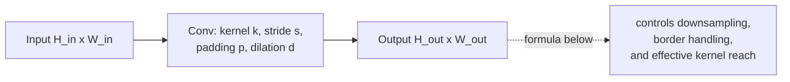
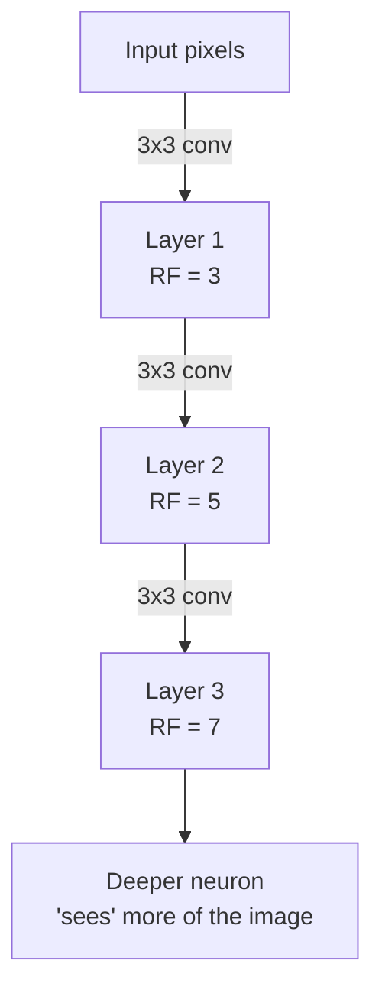
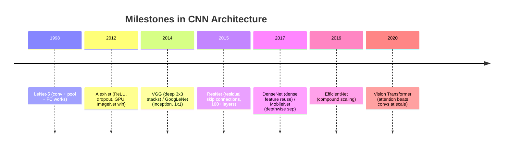
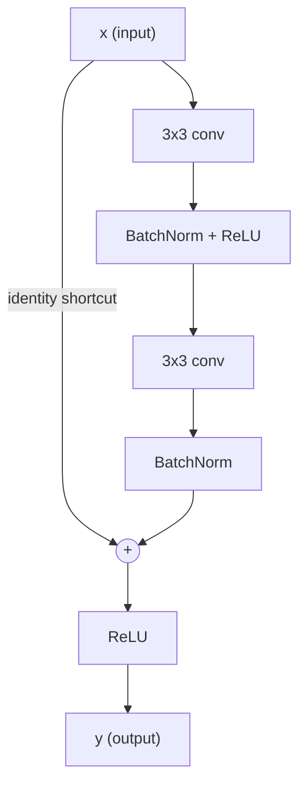
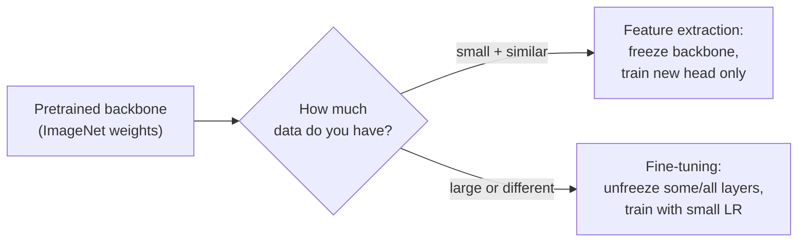
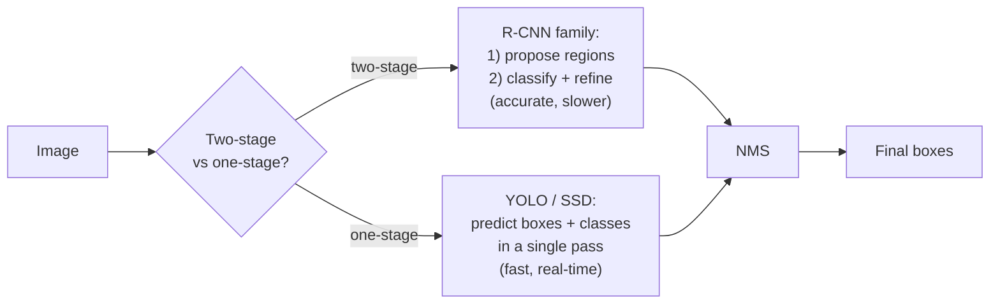
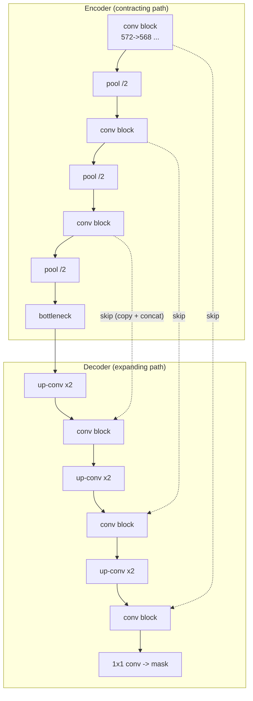

# Convolutional Neural Networks & Computer Vision
*From the convolution operation to ResNets, detection, segmentation, Vision Transformers, and a full PyTorch fine-tuning project.*

*Part of the AI Engineering & ML Mastery Path — see the [index](../README.md) and [study plan](../MASTER-STUDY-PLAN.md).*

Computer vision is where deep learning first shattered the prior state of the art (AlexNet, 2012) and it remains the cleanest place to *build intuition* for the whole field: weight sharing, hierarchical features, residual learning, and attention all show up here in their most visual form. By the end of this document you will understand exactly what a convolution computes (down to the arithmetic), how to size and count the parameters of any conv layer, why ResNet's skip connections fixed a problem that more layers alone could not, and how to ship a real fine-tuned image classifier in PyTorch.

> 💡 **Intuition:** A fully connected layer asks "how does *every* input pixel relate to this output?" A convolution asks the smarter question "what does this *small local patch* look like, applied everywhere?" That single change — **local connectivity + weight sharing** — is the entire reason CNNs work for images.

---

## 🎯 Learning Objectives

By the end of this document you can:

- **Compute** a 2-D convolution by hand, including the effect of stride, padding, and dilation, and derive the output spatial size and parameter count of any conv layer.
- **Explain** the receptive field and how it grows with depth, stride, and dilation.
- **Distinguish** max / average / global pooling and state when each is used.
- **Describe** what each classic architecture contributed — LeNet, AlexNet, VGG, GoogLeNet/Inception, ResNet, DenseNet, MobileNet, EfficientNet — and reproduce a ResNet residual block and a U-Net from memory.
- **Apply** transfer learning, choosing between feature extraction and fine-tuning, and pick appropriate data augmentation (flips, crops, color jitter, Cutout, Mixup, CutMix, RandAugment).
- **Reason** conceptually about object detection (R-CNN family vs YOLO/SSD; anchors, IoU, NMS, mAP) and segmentation (FCN, U-Net, Mask R-CNN).
- **Compare** CNNs and Vision Transformers and explain Grad-CAM for interpretability.
- **Implement** a `conv2d` forward pass in NumPy and **fine-tune** a pretrained ResNet end-to-end in PyTorch.

---

## 📋 Prerequisites

- [01 — Neural Network Foundations](./01-neural-network-foundations.md) — neurons, layers, forward pass.
- [02 — Backpropagation & Optimization](./02-backpropagation-optimization.md) — gradients, SGD/Adam, learning-rate schedules.
- [03 — Regularization & Training Dynamics](./03-regularization-training.md) — dropout, batch norm, weight decay, overfitting.
- [Linear algebra refresher](../aimath/01-linear-algebra.md) — matrices, dot products, tensor shapes.
- Comfort with Python and NumPy; PyTorch helpful but introduced gently here.

---

## 📑 Table of Contents

1. [The Convolution Operation](#1-the-convolution-operation)
2. [Stride, Padding, Dilation & Output Size](#2-stride-padding-dilation--output-size)
3. [The Receptive Field](#3-the-receptive-field)
4. [Pooling](#4-pooling)
5. [Anatomy of a Conv Layer: Parameters & Shapes](#5-anatomy-of-a-conv-layer-parameters--shapes)
6. [Classic Architectures & What Each Contributed](#6-classic-architectures--what-each-contributed)
7. [Transfer Learning](#7-transfer-learning)
8. [Data Augmentation](#8-data-augmentation)
9. [Beyond Classification: Detection](#9-beyond-classification-object-detection)
10. [Beyond Classification: Segmentation](#10-beyond-classification-segmentation)
11. [Vision Transformers & CNN-vs-ViT Tradeoffs](#11-vision-transformers--cnn-vs-vit-tradeoffs)
12. [Interpretability: Grad-CAM](#12-interpretability-grad-cam)
13. [🧮 From-Scratch Implementation (NumPy conv2d)](#-from-scratch-implementation-numpy-conv2d)
14. [🛠️ Complete PyTorch Transfer-Learning Project](#️-complete-pytorch-transfer-learning-project)
15. [❓ Knowledge Check](#-knowledge-check)
16. [🏋️ Exercises](#️-exercises)
17. [📊 Cheat Sheet](#-cheat-sheet)
18. [🔗 Further Resources](#-further-resources)
19. [➡️ What's Next](#️-whats-next)

---

## 1. The Convolution Operation

> 💡 **Intuition:** A **kernel** (a small grid of learnable weights, e.g. $3\times3$) slides across the image. At each position it computes a weighted sum of the pixels it covers. A kernel that has large positive weights on one side and negative on the other becomes an **edge detector**; the network *learns* which detectors are useful. The grid of responses you get from sliding one kernel everywhere is a **feature map**.

### Formal definition

For a single-channel input $I$ and kernel $K$ of size $k_h \times k_w$, the (cross-correlation, which is what deep-learning libraries actually compute and call "convolution") output at position $(i, j)$ is:

$$
S(i, j) = (I * K)(i, j) = \sum_{m=0}^{k_h-1} \sum_{n=0}^{k_w-1} I(i + m,\; j + n)\, K(m, n) \;+\; b
$$

where $b$ is a scalar **bias** shared across the whole feature map. For a multi-channel input with $C_{in}$ channels, the kernel is a tensor of shape $(C_{in}, k_h, k_w)$ and we **sum over input channels too**:

$$
S(i, j) = \sum_{c=0}^{C_{in}-1}\sum_{m=0}^{k_h-1} \sum_{n=0}^{k_w-1} I(c,\, i + m,\; j + n)\, K(c, m, n) \;+\; b
$$

To produce $C_{out}$ output feature maps we simply learn $C_{out}$ independent kernels.

> 🎯 **Key Insight:** **One output channel = one filter applied everywhere.** "Weight sharing" means the *same* $C_{in}\times k_h \times k_w$ weights are reused at every spatial location. This is why a conv layer has so few parameters compared to a fully connected layer, and why it is **translation-equivariant**: shift the input, the feature map shifts the same way.

### Worked numeric example (by hand)

Input $5\times5$ (single channel), kernel $3\times3$ (a vertical Sobel-like edge detector), `stride=1`, `padding=0`, `bias=0`:

```
Input I                    Kernel K
 3  0  1  2  7            -1  0  1
 4  1  0  1  5            -1  0  1
 1  2  3  4  3            -1  0  1
 2  1  0  1  2
 0  1  3  1  0
```

Place the kernel at the **top-left** corner. It covers the upper-left $3\times3$ block:

```
 3  0  1
 4  1  0
 1  2  3
```

Element-wise multiply and sum:

$$
\begin{aligned}
S(0,0) =\;& (3)(-1) + (0)(0) + (1)(1) \\
       +\;& (4)(-1) + (1)(0) + (0)(1) \\
       +\;& (1)(-1) + (2)(0) + (3)(1) \\
=\;& (-3 + 0 + 1) + (-4 + 0 + 0) + (-1 + 0 + 3) \\
=\;& -2 \;-\; 4 \;+\; 2 \;=\; \boxed{-4}
\end{aligned}
$$

Slide one column right to position $(0,1)$, covering:

```
 0  1  2
 1  0  1
 2  3  4
```

$$
S(0,1) = (0\!-\!0\!+\!2) + (1\!-\!0\!+\!1) + (2\!-\!0\!+\!4) = 2 + 2 + 6 = \boxed{10}
$$

Continuing across all valid positions gives a $3\times3$ output feature map (a $5\times5$ input with a $3\times3$ kernel and no padding yields $5-3+1 = 3$ per side):

```
 -4  10   8
 -3   1   2
  0  -1  -2     (illustrative — recompute as an exercise!)
```

### The sliding window (ASCII)

```
Step over a 5x5 input with a 3x3 kernel, stride 1, no padding:

  position (0,0)        position (0,1)        position (0,2)
 [a b c] d e          a [b c d] e           a b [c d e]
 [f g h] i j          f [g h i] j           f g [h i j]
 [k l m] n o          k [l m n] o           k l [m n o]
  p q r s t            p q r s t             p q r s t
  u v w x y            u v w x y             u v w x y

 ... then drop down one row and sweep again ...
 -> output is 3 x 3   (rows: 5-3+1=3, cols: 5-3+1=3)
```

### Python check

```python
import numpy as np
from scipy.signal import correlate2d  # cross-correlation == DL "convolution"

I = np.array([
    [3, 0, 1, 2, 7],
    [4, 1, 0, 1, 5],
    [1, 2, 3, 4, 3],
    [2, 1, 0, 1, 2],
    [0, 1, 3, 1, 0],
], dtype=float)

K = np.array([
    [-1, 0, 1],
    [-1, 0, 1],
    [-1, 0, 1],
], dtype=float)

out = correlate2d(I, K, mode="valid")
print(out.shape)   # (3, 3)
print(out[0, 0])   # -4.0   <- matches our hand calculation
print(out[0, 1])   # 10.0   <- matches
```

> ⚠️ **Common Pitfall:** Mathematical convolution *flips* the kernel before sliding; deep-learning frameworks (PyTorch `Conv2d`, TF `conv2d`) skip the flip and compute **cross-correlation**. Because the kernel is learned, the flip is irrelevant to the result — but it confuses people who expect signal-processing semantics. We use the DL convention throughout.

**Why it matters for AI/ML:** Stacking convolutions builds a *hierarchy* — early layers learn edges/colors, middle layers learn textures/parts, deep layers learn object-level concepts. This compositionality is the engine behind every vision model.

---

## 2. Stride, Padding, Dilation & Output Size



### The master output-size formula

For one spatial dimension, with input size $N$, kernel $k$, padding $p$ (each side), stride $s$, dilation $d$:

$$
N_{out} = \left\lfloor \frac{N + 2p - d\,(k - 1) - 1}{s} \right\rfloor + 1
$$

The term $d(k-1)+1$ is the **effective kernel size** after dilation. Setting $d=1$ (the default) recovers the familiar form:

$$
N_{out} = \left\lfloor \frac{N + 2p - k}{s} \right\rfloor + 1
$$

| Knob | What it does | Typical use |
|------|--------------|-------------|
| **Stride $s$** | How many pixels the kernel jumps each step. $s>1$ downsamples. | $s=2$ to halve resolution instead of pooling. |
| **Padding $p$** | Adds border (usually zeros). $p = (k-1)/2$ with $s=1$ keeps size ("same" padding). | Preserve spatial size; protect border info. |
| **Dilation $d$** | Inserts $d-1$ gaps between kernel taps, enlarging the field of view without more params. | Segmentation (atrous/dilated convs) for large context. |

### Worked examples (do these by hand)

**(a) "Same" padding.** Input $32\times32$, $k=3$, $s=1$, $p=1$, $d=1$:
$$
N_{out} = \left\lfloor \frac{32 + 2 - 3}{1}\right\rfloor + 1 = 31 + 1 = 32 \quad\checkmark
$$

**(b) Strided downsample.** Input $224\times224$, $k=7$, $s=2$, $p=3$ (the ResNet stem):
$$
N_{out} = \left\lfloor \frac{224 + 6 - 7}{2}\right\rfloor + 1 = \left\lfloor \frac{223}{2}\right\rfloor + 1 = 111 + 1 = 112
$$

**(c) Dilation.** Input $32$, $k=3$, $s=1$, $p=2$, $d=2$. Effective kernel $= 2(3-1)+1 = 5$:
$$
N_{out} = \left\lfloor \frac{32 + 4 - 5 - 1}{1}\right\rfloor + 1 = 30 + 1 = 31
$$

```
Dilation d=2 with a 3-tap kernel (X = active tap, . = gap):

 normal (d=1):  X X X            covers 3 pixels
 dilated (d=2): X . X . X        covers 5 pixels, still only 3 weights
```

```python
import torch, torch.nn as nn

def out_size(n, k, s=1, p=0, d=1):
    return (n + 2*p - d*(k - 1) - 1)//s + 1

print(out_size(32, 3, s=1, p=1))            # 32  (same)
print(out_size(224, 7, s=2, p=3))           # 112 (resnet stem)
print(out_size(32, 3, s=1, p=2, d=2))       # 31  (dilated)

# verify against the real layer
x = torch.randn(1, 3, 224, 224)
print(nn.Conv2d(3, 64, 7, stride=2, padding=3)(x).shape)  # [1, 64, 112, 112]
```

> 📝 **Tip (interview):** Memorize the simplified form $N_{out} = \lfloor (N + 2p - k)/s\rfloor + 1$. Most whiteboard questions only need $d=1$, and "same padding for odd $k$ is $p=(k-1)/2$" lets you answer instantly.

---

## 3. The Receptive Field

> 💡 **Intuition:** The **receptive field** of a neuron is the region of the *original input* that can influence its value. A single $3\times3$ conv sees $3\times3$ pixels. Stack a second $3\times3$ conv and each new neuron sees a $5\times5$ patch of the input, because each of its $3\times3$ inputs already summarized a $3\times3$ region. Depth buys context.

For a stack of layers indexed $\ell$ with kernel $k_\ell$ and stride $s_\ell$, the receptive field grows as:

$$
RF_\ell = RF_{\ell-1} + (k_\ell - 1)\prod_{i=1}^{\ell-1} s_i, \qquad RF_0 = 1
$$

**Worked example** — three $3\times3$ convs, all stride 1:

$$
RF_1 = 1 + (3-1)\cdot 1 = 3,\quad RF_2 = 3 + 2\cdot 1 = 5,\quad RF_3 = 5 + 2\cdot 1 = 7
$$

> 🎯 **Key Insight:** Two stacked $3\times3$ convs have the **same $5\times5$ receptive field** as one $5\times5$ conv, but use $2\cdot(3^2)=18$ weights per channel-pair instead of $25$, *and* insert an extra nonlinearity. This is exactly why **VGG replaced large kernels with stacks of $3\times3$** — more expressive, fewer parameters.



---

## 4. Pooling

Pooling **downsamples** feature maps, providing a small amount of translation invariance and shrinking compute. It has **no learnable parameters**.

| Type | Operation | Behavior |
|------|-----------|----------|
| **Max pooling** | take the max in each window | keeps the strongest activation; sharp, common in classic CNNs |
| **Average pooling** | take the mean in each window | smooths; gentler downsampling |
| **Global average pooling (GAP)** | average each entire feature map → one number per channel | replaces flatten+FC head; huge parameter savings; used by ResNet/Inception |

### Worked example — $2\times2$ max pool, stride 2

```
 input 4x4              max-pool 2x2, stride 2 -> output 2x2
 1  3 | 2  4
 5  6 | 7  8                  6   8
 ----- -----                  4   2
 1  2 | 0  1
 4  0 | 2  1

 top-left window {1,3,5,6} -> 6 ; top-right {2,4,7,8} -> 8
 bottom-left {1,2,4,0} -> 4 ; bottom-right {0,1,2,1} -> 2
```

Output size uses the same formula with $p=0$: $\lfloor(4-2)/2\rfloor + 1 = 2$.

```python
import torch, torch.nn as nn
x = torch.tensor([[[[1,3,2,4],[5,6,7,8],[1,2,0,1],[4,0,2,1]]]], dtype=torch.float)
print(nn.MaxPool2d(2, stride=2)(x).squeeze())     # tensor([[6., 8.],[4., 2.]])
print(nn.AdaptiveAvgPool2d(1)(x).squeeze())       # 2.9375  (global avg over all 16)
```

> 🎯 **Key Insight:** Modern nets often **drop pooling** in favor of strided convolutions (learnable downsampling) and end with **Global Average Pooling** instead of a giant flattened FC layer. GAP makes the network accept variable input sizes and dramatically reduces overfitting.

> ⚠️ **Common Pitfall:** Max pooling discards *where* the max came from, hurting tasks that need precise localization (segmentation, detection). That is why U-Net keeps **skip connections** to recover spatial detail lost to pooling.

---

## 5. Anatomy of a Conv Layer: Parameters & Shapes

A `Conv2d` layer with $C_{in}$ input channels, $C_{out}$ output channels, kernel $k_h\times k_w$, and bias has:

$$
\#\text{params} = \underbrace{(C_{in}\cdot k_h \cdot k_w + 1)}_{\text{one filter (+bias)}} \times C_{out}
$$

Its FLOPs (multiply-adds) for an $H_{out}\times W_{out}$ output:

$$
\text{FLOPs} \approx C_{out}\cdot H_{out}\cdot W_{out}\cdot (C_{in}\cdot k_h\cdot k_w)
$$

### Worked example (by hand)

A layer mapping $C_{in}=3$ RGB channels to $C_{out}=64$ feature maps with a $3\times3$ kernel:

$$
\#\text{params} = (3\cdot 3\cdot 3 + 1)\times 64 = (27 + 1)\cdot 64 = 28\cdot 64 = \boxed{1792}
$$

Compare to a **fully connected** layer mapping a $224\times224\times3 = 150{,}528$-vector to even just $64$ units: $150{,}528\cdot 64 + 64 \approx 9.6$ **million** parameters — over **5000×** more, with no weight sharing and no translation equivariance.

```python
import torch.nn as nn
conv = nn.Conv2d(3, 64, kernel_size=3)
print(sum(p.numel() for p in conv.parameters()))   # 1792
```

### A typical block's shape journey

```
input            : [N,   3, 224, 224]
Conv 3->64 k3 p1 : [N,  64, 224, 224]   params (3*3*3+1)*64   = 1,792
BatchNorm(64)    : [N,  64, 224, 224]   params 2*64           =   128
ReLU             : [N,  64, 224, 224]   params 0
MaxPool 2x2 s2   : [N,  64, 112, 112]   params 0
```

> 📝 **Tip:** The bias is usually **omitted** (`bias=False`) when a BatchNorm immediately follows, because BN's $\beta$ shift absorbs the bias — saving $C_{out}$ redundant params.

---

## 6. Classic Architectures & What Each Contributed



| Architecture | Year | Headline contribution | Why it mattered |
|--------------|------|----------------------|-----------------|
| **LeNet-5** | 1998 | First practical CNN (conv→pool→FC) for digit recognition | Proved the conv+pool template |
| **AlexNet** | 2012 | ReLU, dropout, GPU training, data augmentation; won ImageNet by a huge margin | Launched the deep-learning era |
| **VGG-16/19** | 2014 | Uniform stacks of $3\times3$ convs; depth via small kernels | Simplicity + the "stack small kernels" lesson |
| **GoogLeNet / Inception** | 2014 | Multi-branch Inception module; **$1\times1$ convs** for cheap channel reduction; GAP head | Accuracy at a fraction of the params |
| **ResNet** | 2015 | **Residual / skip connections** to train 50–152+ layers | Solved the degradation problem; backbone of modern vision |
| **DenseNet** | 2017 | Each layer receives **all** preceding feature maps (concatenation) | Max feature reuse, strong gradient flow, fewer params |
| **MobileNet** | 2017 | **Depthwise separable convolutions** | Mobile/edge efficiency (8–9× cheaper convs) |
| **EfficientNet** | 2019 | **Compound scaling** of depth/width/resolution | Best accuracy-per-FLOP for years |

### 6.1 The $1\times1$ convolution (Inception's trick)

A $1\times1$ conv does **no spatial mixing**; it is a per-pixel fully connected layer across channels. Use it to cheaply change channel count (e.g. $256\to 64$) before an expensive $3\times3$ — slashing FLOPs. Inception runs $1\times1$, $3\times3$, $5\times5$, and pooling **in parallel** and concatenates.

### 6.2 ResNet: the degradation problem & residual learning

> 💡 **Intuition:** Empirically, naively stacking more plain layers made *training* error go **up**, not just test error — a 56-layer plain net did worse than a 20-layer one. This is the **degradation problem**: deep stacks struggle to even learn the *identity* mapping. ResNet's fix: don't ask a block to learn the full mapping $H(x)$; ask it to learn the **residual** $F(x) = H(x) - x$, then add $x$ back. If identity is optimal, the block just drives $F(x)\to 0$ — easy.

$$
y = F(x, \{W_i\}) + x
$$

The **skip (shortcut) connection** also gives gradients a direct highway backward, mitigating vanishing gradients.



> 🎯 **Key Insight:** When input and output channels/resolution differ, the shortcut uses a **$1\times1$ conv with stride** (a "projection shortcut") so the dimensions match before the add. Deeper ResNets (50/101/152) use a **bottleneck** block: $1\times1$ reduce → $3\times3$ → $1\times1$ expand.

### 6.3 Depthwise separable convolution (MobileNet)

A standard conv mixes **space and channels together**. MobileNet splits it into two cheap steps:

1. **Depthwise:** one $k\times k$ filter **per input channel** (spatial filtering, no channel mixing).
2. **Pointwise:** a $1\times1$ conv to mix channels.

Cost ratio vs a standard $k\times k$ conv:

$$
\frac{C_{in}\cdot k^2 + C_{in}\cdot C_{out}}{C_{in}\cdot C_{out}\cdot k^2} = \frac{1}{C_{out}} + \frac{1}{k^2}
$$

For $k=3$ that is roughly $\tfrac{1}{9}$ — an **~8–9× reduction** in compute for a small accuracy cost.

---

## 7. Transfer Learning

> 💡 **Intuition:** A network pretrained on ImageNet has already learned edges, textures, and object parts — features that transfer to almost any natural-image task. Reusing those weights lets you train a strong model on **hundreds** of images instead of **millions**.



| Strategy | What you train | When to use | LR guidance |
|----------|---------------|-------------|-------------|
| **Feature extraction** | only the new classifier head; backbone frozen | small dataset, similar domain | normal LR on head |
| **Fine-tuning** | head + (some or all) backbone layers | larger dataset and/or domain shift | small LR (e.g. $10\times$ smaller) so you don't destroy pretrained features |

> ⚠️ **Common Pitfall:** Fine-tuning the whole network with a *large* learning rate from step 1 wrecks the pretrained weights before the randomly initialized head has stabilized. **Best practice:** train the head first (backbone frozen) for a few epochs, *then* unfreeze and continue with a small LR. Also: always normalize your inputs with the **same mean/std the backbone was pretrained on** (ImageNet: mean `[0.485, 0.456, 0.406]`, std `[0.229, 0.224, 0.225]`).

---

## 8. Data Augmentation

Augmentation synthesizes new training views to fight overfitting and improve robustness — essentially free regularization.

| Technique | What it does | Notes |
|-----------|--------------|-------|
| **Horizontal flip** | mirror left↔right | almost always safe for natural images; **not** for text/digits |
| **Random crop / resize** | crop a random region, resize back | scale & translation invariance |
| **Color jitter** | perturb brightness/contrast/saturation/hue | lighting robustness |
| **Cutout** | zero out a random square patch | forces use of distributed cues |
| **Mixup** | blend two images **and** their labels: $\tilde x = \lambda x_i + (1-\lambda)x_j$ | label smoothing effect, better calibration |
| **CutMix** | paste a patch of image B into image A; mix labels by **area** | localizable + Mixup's benefits |
| **RandAugment** | randomly pick $N$ ops at magnitude $M$ from a fixed pool | strong, almost no tuning |

For **Mixup**, labels mix with the same $\lambda \sim \text{Beta}(\alpha,\alpha)$:
$$
\tilde y = \lambda y_i + (1-\lambda) y_j
$$

> 📝 **Tip:** Apply augmentation to **training only** — never to validation/test, or your metrics become meaningless. Flips/crops/jitter are CPU transforms; Mixup/CutMix happen on the batch (often on-GPU) inside the training loop.

---

## 9. Beyond Classification: Object Detection

Detection answers *what* **and** *where* — output a class **and** a bounding box for every object.

### Core building blocks

- **IoU (Intersection over Union):** overlap metric between predicted box $P$ and ground-truth box $G$:
$$
\text{IoU} = \frac{\text{area}(P \cap G)}{\text{area}(P \cup G)}
$$
A prediction usually counts as correct if $\text{IoU} \ge 0.5$.
- **Anchors:** a grid of predefined boxes of various scales/aspect ratios; the model predicts **offsets** from these rather than raw coordinates.
- **NMS (Non-Max Suppression):** keep the highest-confidence box, discard others overlapping it above an IoU threshold — removes duplicate detections.
- **mAP (mean Average Precision):** primary detection metric — area under the precision–recall curve, averaged over classes (and often IoU thresholds, e.g. COCO's mAP@[.5:.95]).



| Family | Idea | Tradeoff |
|--------|------|----------|
| **R-CNN → Fast → Faster** | propose regions, then classify; Faster R-CNN adds a learned Region Proposal Network | high accuracy, slower (two stages) |
| **YOLO** | divide image into a grid, predict boxes + classes in **one** forward pass | very fast / real-time; historically weaker on tiny objects |
| **SSD** | single-shot detection across multiple feature-map scales | fast, multi-scale |

> 🎯 **Key Insight:** The eternal detection tradeoff is **two-stage (accurate) vs one-stage (fast)**. NMS and IoU are common to nearly all of them; the differences are about how box candidates are generated and scored.

---

## 10. Beyond Classification: Segmentation

Segmentation classifies **every pixel**. Two flavors: **semantic** (label each pixel by class, no instance distinction) and **instance** (separate each object, e.g. two dogs get different masks).

- **FCN (Fully Convolutional Network):** replace the FC head with convs + upsampling so the output is a per-pixel class map at full resolution.
- **U-Net:** an **encoder–decoder** with **skip connections** copying high-resolution encoder features into the decoder, recovering spatial detail lost to downsampling. Dominant in biomedical imaging.
- **Mask R-CNN:** extends Faster R-CNN with a parallel branch that predicts a binary **mask per detected box** → instance segmentation.



> 🎯 **Key Insight:** Both ResNet and U-Net win with **skip connections**, but for different reasons. ResNet's skips ease *optimization* (gradient flow / identity). U-Net's skips restore *spatial precision* the encoder discarded — the decoder gets back the fine boundaries needed for crisp masks.

---

## 11. Vision Transformers & CNN-vs-ViT Tradeoffs

> 💡 **Intuition:** A **Vision Transformer (ViT)** chops an image into fixed patches (e.g. $16\times16$), flattens each into a vector, linearly projects it to a **patch embedding**, adds a **positional embedding**, and feeds the sequence to a standard Transformer encoder. Self-attention lets *every* patch directly attend to *every other* patch — global context from layer one, no sliding window.

For a $224\times224$ image with $16\times16$ patches you get $(224/16)^2 = 196$ patches (tokens), plus a learnable `[CLS]` token whose final embedding feeds the classifier. (Self-attention itself is covered in depth in the next module.)

| Aspect | **CNN** | **Vision Transformer** |
|--------|---------|------------------------|
| Inductive bias | strong (locality, translation equivariance) | weak — must *learn* spatial structure |
| Data efficiency | good on small/medium data | data-hungry; shines with large pretraining (JFT/ImageNet-21k) |
| Receptive field | local, grows with depth | global from the first layer |
| Compute scaling | linear in pixels | attention is **$O(n^2)$** in number of tokens |
| Best when | limited data, edge deployment | abundant data/compute, large-scale pretraining |

> 🎯 **Key Insight:** CNNs *bake in* the assumption that nearby pixels matter and features are translation-equivariant — a great prior when data is scarce. ViTs throw that away and **learn** it, which needs more data but can surpass CNNs at scale. Hybrids (ConvNeXt, Swin Transformer) blend both worlds.

---

## 12. Interpretability: Grad-CAM

**Grad-CAM (Gradient-weighted Class Activation Mapping)** produces a heatmap showing *which regions* drove a prediction — vital for debugging and trust.

**Recipe:** pick a target class $c$ and a conv layer with feature maps $A^k$. Compute the gradient of the class score $y^c$ w.r.t. each feature map and **global-average-pool** it to get importance weights $\alpha_k^c$, then combine and ReLU:

$$
\alpha_k^c = \frac{1}{Z}\sum_{i}\sum_{j}\frac{\partial y^c}{\partial A_{ij}^k},
\qquad
L^c_{\text{Grad-CAM}} = \text{ReLU}\!\left(\sum_k \alpha_k^c A^k\right)
$$

Upsample $L^c$ to the input size and overlay. The ReLU keeps only features with a **positive** influence on class $c$.

> 📝 **Tip:** Apply Grad-CAM to the **last conv layer** — it has the richest high-level semantics while retaining spatial layout. If the heatmap lands on the background instead of the object, your model is likely exploiting a dataset shortcut (a classic bug-finder).

---

## 🧮 From-Scratch Implementation (NumPy conv2d)

A multi-channel `conv2d` forward pass with padding and stride — the heart of every CNN, in pure NumPy.

```python
import numpy as np

def conv2d_forward(x, W, b, stride=1, padding=0):
    """
    x : (N, C_in, H, W)        input batch
    W : (C_out, C_in, kH, kW)  filters
    b : (C_out,)               bias
    returns y : (N, C_out, H_out, W_out)
    """
    N, C_in, H, Wd = x.shape
    C_out, _, kH, kW = W.shape

    # zero-pad height & width only
    xp = np.pad(x, ((0, 0), (0, 0), (padding, padding), (padding, padding)),
                mode="constant")

    H_out = (H + 2*padding - kH)//stride + 1
    W_out = (Wd + 2*padding - kW)//stride + 1
    y = np.zeros((N, C_out, H_out, W_out), dtype=x.dtype)

    for n in range(N):                       # each image
        for co in range(C_out):              # each output channel (filter)
            for i in range(H_out):
                for j in range(W_out):
                    hs, ws = i*stride, j*stride
                    region = xp[n, :, hs:hs+kH, ws:ws+kW]   # (C_in, kH, kW)
                    y[n, co, i, j] = np.sum(region * W[co]) + b[co]
    return y

# ---- sanity check against PyTorch ----
if __name__ == "__main__":
    rng = np.random.default_rng(0)
    x = rng.standard_normal((2, 3, 8, 8)).astype(np.float32)
    W = rng.standard_normal((4, 3, 3, 3)).astype(np.float32)
    b = rng.standard_normal((4,)).astype(np.float32)

    y = conv2d_forward(x, W, b, stride=1, padding=1)
    print(y.shape)   # (2, 4, 8, 8)   <- 'same' padding preserves 8x8

    try:
        import torch, torch.nn.functional as F
        xt, Wt, bt = map(lambda a: torch.from_numpy(a), (x, W, b))
        yt = F.conv2d(xt, Wt, bt, stride=1, padding=1).numpy()
        print("max abs diff vs torch:", np.abs(y - yt).max())  # ~1e-5 (float)
    except ImportError:
        print("torch not installed; skipping cross-check")
```

> 💡 **Intuition:** This naive quadruple loop is correct but slow. Real libraries use **im2col** (unfold each receptive field into a column, turn convolution into one big matrix multiply) or Winograd/FFT methods — but the math computed is exactly the loop above.

---

## 🛠️ Complete PyTorch Transfer-Learning Project

Fine-tune a pretrained **ResNet-18** on a small custom image dataset organized as `data/train/<class>/*.jpg` and `data/val/<class>/*.jpg` (the `ImageFolder` layout). This runs as-is on PyTorch 2.x (CPU or GPU).

```python
import torch, torch.nn as nn, torch.optim as optim
from torch.utils.data import DataLoader
from torchvision import datasets, transforms, models

device = "cuda" if torch.cuda.is_available() else "cpu"

# --- 1. Data + augmentation (train) / clean transforms (val) -----------------
IMAGENET_MEAN = [0.485, 0.456, 0.406]
IMAGENET_STD  = [0.229, 0.224, 0.225]

train_tf = transforms.Compose([
    transforms.RandomResizedCrop(224),
    transforms.RandomHorizontalFlip(),
    transforms.ColorJitter(0.2, 0.2, 0.2),
    transforms.ToTensor(),
    transforms.Normalize(IMAGENET_MEAN, IMAGENET_STD),   # match pretraining!
])
val_tf = transforms.Compose([
    transforms.Resize(256),
    transforms.CenterCrop(224),
    transforms.ToTensor(),
    transforms.Normalize(IMAGENET_MEAN, IMAGENET_STD),
])

train_ds = datasets.ImageFolder("data/train", transform=train_tf)
val_ds   = datasets.ImageFolder("data/val",   transform=val_tf)
train_dl = DataLoader(train_ds, batch_size=32, shuffle=True,  num_workers=4)
val_dl   = DataLoader(val_ds,   batch_size=32, shuffle=False, num_workers=4)
num_classes = len(train_ds.classes)

# --- 2. Pretrained backbone, swap the head ----------------------------------
model = models.resnet18(weights=models.ResNet18_Weights.IMAGENET1K_V1)

# Phase A: feature extraction — freeze everything, train new head only
for p in model.parameters():
    p.requires_grad = False
model.fc = nn.Linear(model.fc.in_features, num_classes)   # new head (trainable)
model = model.to(device)

criterion = nn.CrossEntropyLoss()

def run_epoch(loader, train: bool, optimizer=None):
    model.train(train)
    total, correct, loss_sum = 0, 0, 0.0
    torch.set_grad_enabled(train)
    for x, y in loader:
        x, y = x.to(device), y.to(device)
        out = model(x)
        loss = criterion(out, y)
        if train:
            optimizer.zero_grad(); loss.backward(); optimizer.step()
        loss_sum += loss.item() * x.size(0)
        correct  += (out.argmax(1) == y).sum().item()
        total    += x.size(0)
    return loss_sum/total, correct/total

# Phase A: only the head's params are trainable
optA = optim.Adam(model.fc.parameters(), lr=1e-3)
for epoch in range(3):
    tl, ta = run_epoch(train_dl, True, optA)
    vl, va = run_epoch(val_dl, False)
    print(f"[head] epoch {epoch}: train_acc={ta:.3f} val_acc={va:.3f}")

# --- 3. Phase B: fine-tune — unfreeze all, SMALL learning rate --------------
for p in model.parameters():
    p.requires_grad = True
optB = optim.Adam(model.parameters(), lr=1e-5)   # 100x smaller than head LR
scheduler = optim.lr_scheduler.CosineAnnealingLR(optB, T_max=5)

best_va = 0.0
for epoch in range(5):
    tl, ta = run_epoch(train_dl, True, optB)
    vl, va = run_epoch(val_dl, False)
    scheduler.step()
    if va > best_va:
        best_va = va
        torch.save(model.state_dict(), "best_model.pt")
    print(f"[finetune] epoch {epoch}: train_acc={ta:.3f} val_acc={va:.3f}")

print(f"best val acc: {best_va:.3f}")
```

### Reading the training curves (what you should see)

- **Phase A (frozen backbone):** validation accuracy jumps quickly (often to 70–90% on an easy small dataset) within a couple of epochs — the pretrained features are already good; you're just learning a linear map.
- **Phase B (fine-tuning):** a second, smaller accuracy bump as the backbone adapts to your domain. Train and val accuracy rise together.
- **Overfitting signal:** if **train accuracy keeps climbing while val accuracy plateaus or falls**, add augmentation/weight decay, lower the LR, or unfreeze fewer layers.
- **Destroyed-features signal:** if val accuracy *drops sharply* the instant you unfreeze, your fine-tuning LR is too high — lower it.

```
val accuracy
1.0 |              ____________  <- phase B nudges higher
    |        _____/      (fine-tune)
0.8 |    ___/
    |   /  (phase A: head only, fast rise)
0.5 |  /
    | /
0.0 +--------------------------------> epoch
      A0 A1 A2 | B0 B1 B2 B3 B4
```

> ⚠️ **Common Pitfall:** Forgetting `model.eval()` (here via `model.train(False)`) during validation leaves **BatchNorm** updating running stats and **dropout** active, corrupting your metrics. The `run_epoch` helper handles this with `model.train(train)`.

---

## ❓ Knowledge Check

**1.** A $7\times7$ input is convolved with a $3\times3$ kernel, stride 2, padding 0. What is the output size?
<details><summary>Show answer</summary>

$\lfloor(7 + 0 - 3)/2\rfloor + 1 = \lfloor 4/2\rfloor + 1 = 2 + 1 = 3$. Output is $3\times3$.
</details>

**2.** Why does deep-learning "convolution" not flip the kernel?
<details><summary>Show answer</summary>

Because frameworks compute **cross-correlation**. Since the kernel weights are *learned*, the network can learn whatever orientation it needs; the flip would just relabel weights and is therefore redundant.
</details>

**3.** How many learnable parameters in a `Conv2d(16, 32, kernel_size=5)` with bias?
<details><summary>Show answer</summary>

$(C_{in}\cdot k\cdot k + 1)\cdot C_{out} = (16\cdot 5\cdot 5 + 1)\cdot 32 = (400+1)\cdot 32 = 401\cdot 32 = \mathbf{12{,}832}$.
</details>

**4.** What problem do ResNet's skip connections solve, and how?
<details><summary>Show answer</summary>

The **degradation problem** — adding more plain layers *increased training error*. Skip connections let a block learn the **residual** $F(x)=H(x)-x$; if identity is optimal it can drive $F\to 0$ easily. They also create a gradient highway, mitigating vanishing gradients.
</details>

**5.** Two stacked $3\times3$ convs vs one $5\times5$ conv — compare receptive field and parameters.
<details><summary>Show answer</summary>

Same $5\times5$ receptive field. Per channel-pair: $2\times 3^2 = 18$ weights vs $5^2 = 25$ — fewer params, plus an extra nonlinearity makes the stack more expressive. This is VGG's core lesson.
</details>

**6.** What does a $1\times1$ convolution accomplish?
<details><summary>Show answer</summary>

No spatial mixing — it's a per-pixel linear combination **across channels**. Used to change channel depth cheaply (dimensionality reduction/expansion), as in Inception modules and ResNet bottlenecks.
</details>

**7.** When would you use feature extraction vs full fine-tuning?
<details><summary>Show answer</summary>

**Feature extraction** (freeze backbone, train head) for *small* datasets in a *similar* domain. **Fine-tuning** (unfreeze layers, small LR) for *larger* datasets or a *domain shift*. Common best practice: do feature extraction first, then fine-tune with a small LR.
</details>

**8.** Define IoU and NMS in one sentence each.
<details><summary>Show answer</summary>

**IoU** = area of intersection ÷ area of union of two boxes (overlap measure). **NMS** = keep the top-confidence box and discard others overlapping it above an IoU threshold, removing duplicate detections.
</details>

**9.** Why does U-Net use skip connections, and how does that differ from ResNet's?
<details><summary>Show answer</summary>

U-Net **concatenates** high-resolution encoder features into the decoder to restore *spatial precision* lost during downsampling (crisp boundaries). ResNet **adds** identity shortcuts mainly to ease *optimization*/gradient flow. Different mechanism (concat vs add), different goal (localization vs trainability).
</details>

**10.** How does Mixup differ from Cutout?
<details><summary>Show answer</summary>

**Cutout** masks a random square of one image (label unchanged). **Mixup** linearly blends *two* images **and** their labels with weight $\lambda$, acting as a strong regularizer/label-smoother. CutMix combines both ideas (paste a patch from B into A, mix labels by area).
</details>

**11.** Why are Vision Transformers more data-hungry than CNNs?
<details><summary>Show answer</summary>

CNNs have strong **inductive biases** (locality, translation equivariance) baked in, so they generalize from less data. ViTs have weak priors and must *learn* spatial structure from data, requiring large-scale pretraining to match or beat CNNs.
</details>

**12.** What does Grad-CAM compute, and which layer should you target?
<details><summary>Show answer</summary>

A class-specific heatmap: gradient of the class score w.r.t. a conv layer's feature maps, global-average-pooled into weights, combined and ReLU'd. Target the **last conv layer** — richest semantics while still spatially resolved.
</details>

---

## 🏋️ Exercises

**Exercise 1 — Output sizes (by hand).** Compute the output spatial size for: (a) $N=28,k=5,s=1,p=0$; (b) $N=224,k=3,s=2,p=1$; (c) $N=64,k=3,s=1,p=2,d=2$.
<details><summary>Show solution</summary>

(a) $\lfloor(28-5)/1\rfloor+1 = 23+1 = \mathbf{24}$.
(b) $\lfloor(224+2-3)/2\rfloor+1 = \lfloor 223/2\rfloor+1 = 111+1 = \mathbf{112}$.
(c) effective kernel $=2(3-1)+1=5$; $\lfloor(64+4-5-1)/1\rfloor+1 = 62+1 = \mathbf{63}$.
</details>

**Exercise 2 — Parameter counting (by hand).** A small net: `Conv(3→16,k=3,p=1)` → `Conv(16→32,k=3,p=1)` → GAP → `Linear(32→10)`, all with bias. Total parameters?
<details><summary>Show solution</summary>

Conv1: $(3\cdot 3\cdot 3+1)\cdot 16 = 28\cdot 16 = 448$.
Conv2: $(16\cdot 3\cdot 3+1)\cdot 32 = 145\cdot 32 = 4{,}640$.
GAP: $0$.
Linear: $32\cdot 10 + 10 = 330$.
**Total $= 448 + 4{,}640 + 330 = 5{,}418$.**
</details>

**Exercise 3 — Implement conv2d in NumPy.** Without looking, write `conv2d_forward(x, W, b, stride, padding)` for batched, multi-channel input and verify against `torch.nn.functional.conv2d`.
<details><summary>Show solution</summary>

See the [From-Scratch Implementation](#-from-scratch-implementation-numpy-conv2d) section. Key points: zero-pad height/width only; output size via the master formula; quadruple loop over (image, out-channel, out-row, out-col) summing `region * W[co]`; cross-check `np.abs(y - yt).max()` is ~$10^{-5}$ (float rounding).
</details>

**Exercise 4 — Receptive field.** A net has layers with (k,s): (3,1),(3,1),(3,2),(3,1). Compute the final receptive field.
<details><summary>Show solution</summary>

Using $RF_\ell = RF_{\ell-1} + (k_\ell-1)\prod_{i<\ell} s_i$, $RF_0=1$:
L1: $1+2\cdot 1 = 3$ ($\prod s=1$).
L2: $3+2\cdot 1 = 5$ ($\prod s=1$).
L3: $5+2\cdot 1 = 7$ ($\prod s=1\cdot1=1$).
L4: $7+2\cdot(1\cdot1\cdot2) = 7+4 = \mathbf{11}$ ($\prod s$ now includes L3's stride 2).
</details>

**Exercise 5 — Depthwise separable savings.** For $C_{in}=128, C_{out}=256, k=3$, compute the multiply-add cost ratio of depthwise-separable vs standard conv (per output pixel).
<details><summary>Show solution</summary>

Standard: $C_{in}\cdot C_{out}\cdot k^2 = 128\cdot 256\cdot 9 = 294{,}912$.
Separable: depthwise $C_{in}\cdot k^2 = 128\cdot 9 = 1{,}152$; pointwise $C_{in}\cdot C_{out} = 128\cdot 256 = 32{,}768$; total $33{,}920$.
Ratio $= 33{,}920/294{,}912 \approx \mathbf{0.115}$ — about an **8.7× reduction**, matching $\tfrac{1}{C_{out}}+\tfrac{1}{k^2}=\tfrac{1}{256}+\tfrac{1}{9}\approx 0.115$.
</details>

**Exercise 6 — Fine-tune a pretrained model.** Take the [PyTorch project](#️-complete-pytorch-transfer-learning-project), point it at any `ImageFolder` dataset (e.g. a 2–5 class subset), run Phase A then Phase B, and report both validation curves. Then deliberately set the Phase B LR to `1e-2` and observe.
<details><summary>Show solution</summary>

Expected: Phase A val accuracy rises fast and plateaus (good pretrained features + linear head). Phase B at `1e-5` nudges it higher as the backbone adapts. With `1e-2` in Phase B you should see val accuracy **collapse** right after unfreezing — the large LR destroys pretrained weights before the head can compensate, demonstrating why fine-tuning needs a small LR. Remedy: revert to `1e-5`, optionally add `weight_decay=1e-4` and warm up with a few frozen-backbone epochs.
</details>

---

## 📊 Cheat Sheet

| Concept | Formula / Fact |
|---------|----------------|
| **Output size** | $\left\lfloor\frac{N+2p-d(k-1)-1}{s}\right\rfloor+1$ |
| **Same padding (odd $k$, $s=1$)** | $p=(k-1)/2$ |
| **Conv params** | $(C_{in}\,k_h k_w + 1)\,C_{out}$ |
| **Conv FLOPs** | $\approx C_{out} H_{out} W_{out}(C_{in} k_h k_w)$ |
| **Receptive field** | $RF_\ell = RF_{\ell-1}+(k_\ell-1)\prod_{i<\ell}s_i$ |
| **Depthwise-sep cost ratio** | $\frac{1}{C_{out}}+\frac{1}{k^2}$ ($\approx 1/9$ for $k{=}3$) |
| **IoU** | $\frac{\text{area}(P\cap G)}{\text{area}(P\cup G)}$ |
| **ResNet block** | $y=F(x)+x$ (skip = add; projection $1\times1$ if shapes differ) |
| **ImageNet norm** | mean `[.485,.456,.406]`, std `[.229,.224,.225]` |

| Architecture | One-line contribution |
|--------------|----------------------|
| LeNet | first conv+pool+FC CNN |
| AlexNet | ReLU + dropout + GPU; started the era |
| VGG | deep stacks of $3\times3$ |
| Inception | multi-branch + $1\times1$ reduction + GAP |
| ResNet | residual skip connections (degradation fix) |
| DenseNet | dense concatenated feature reuse |
| MobileNet | depthwise separable convs (efficiency) |
| EfficientNet | compound depth/width/resolution scaling |

| Task | Go-to models |
|------|--------------|
| Classification | ResNet, EfficientNet, ViT |
| Detection | Faster R-CNN (accurate), YOLO/SSD (fast) |
| Semantic seg | FCN, U-Net |
| Instance seg | Mask R-CNN |

---

## 🔗 Further Resources

### Free

- **Stanford CS231n — Convolutional Neural Networks for Visual Recognition** — the canonical course; notes alone are worth a full read. https://cs231n.github.io/
- **fast.ai — Practical Deep Learning for Coders (Part 1)** — top-down, code-first; transfer learning from lesson 1. https://course.fast.ai/
- **PyTorch Vision Tutorials** — official transfer-learning and TorchVision object-detection/finetuning tutorials, runnable end-to-end. https://pytorch.org/tutorials/beginner/transfer_learning_tutorial.html

### Paid (worth it)

- **DeepLearning.AI — "Convolutional Neural Networks" (Deep Learning Specialization, Course 4, Coursera)** — Andrew Ng's gold-standard treatment of convolutions, classic architectures, detection (YOLO), and face recognition/neural style. Best structured on-ramp to everything above. ★★★★★ — https://www.coursera.org/learn/convolutional-neural-networks

---

## ➡️ What's Next

Continue to **[06 — Transformers, Attention & LLMs](./06-transformers-attention-llms.md)**, where the self-attention mechanism sketched for Vision Transformers is unpacked in full.
