# Transformers, Attention & Large Language Models
*From recurrence to attention: how a single architecture swallowed NLP, vision, and beyond.*

*Part of the AI Engineering & ML Mastery Path — see the [index](../README.md) and [study plan](../MASTER-STUDY-PLAN.md).*

Recurrent networks read text one token at a time, like a person dragging a finger across a page who can only remember the last few words. The **Transformer** threw that away: it lets every token look at every other token *simultaneously*, and that one idea — **attention** — is the engine behind GPT, BERT, T5, Claude, Llama, and essentially every frontier model today. This document builds attention from first principles, assembles the full Transformer layer by layer, then walks the modern LLM stack: tokenization, the encoder-only / decoder-only / encoder-decoder families, efficiency tricks (KV cache, FlashAttention, GQA, MoE), the training pipeline (pretrain → SFT → RLHF/DPO), parameter-efficient fine-tuning, decoding strategies, evaluation, and hallucination.

By the end you will be able to derive scaled dot-product attention on paper, implement multi-head attention in PyTorch from scratch, explain *why* a causal mask makes GPT autoregressive, and reason about the engineering knobs (context window, KV cache, temperature) that govern real deployments.

---

## 🎯 Learning Objectives

By the end of this document you can:

- **Explain** the concrete limits of RNNs/LSTMs (sequential compute, vanishing gradients, long-range dependency loss) and why attention dissolves them.
- **Derive** scaled dot-product attention $\text{softmax}(QK^\top/\sqrt{d_k})V$ from first principles, including *why* we divide by $\sqrt{d_k}$.
- **Distinguish** self-attention from cross-attention, and single-head from multi-head attention, with correct tensor shapes.
- **Describe** four positional-encoding schemes (sinusoidal, learned, RoPE, ALiBi) and when each is used.
- **Assemble** the full Vaswani-2017 encoder-decoder: residuals, LayerNorm, position-wise FFN, and the three attention sublayers.
- **Compare** encoder-only (BERT), decoder-only (GPT), and encoder-decoder (T5) families and their pretraining objectives.
- **Implement** scaled dot-product + multi-head attention in PyTorch and sanity-check shapes and softmax normalization.
- **Reason** about KV cache, FlashAttention, Multi-Query / Grouped-Query attention, and Mixture-of-Experts.
- **Configure** decoding (greedy, beam, temperature, top-k, top-p) and **evaluate** with perplexity, BLEU/ROUGE, BERTScore, and LLM-as-judge.
- **Diagnose** hallucination causes and apply mitigations (RAG, grounding, decoding constraints).

---

## 📋 Prerequisites

- [01 — Math foundations: linear algebra & SVD](./01-math-foundations.md) — matrix multiply, dot products, low-rank decomposition (needed for LoRA).
- [02 — Probability & information theory](./02-probability-information.md) — softmax, cross-entropy, perplexity.
- [04 — Neural network fundamentals](./04-neural-networks.md) — backprop, residual connections, normalization, embeddings.
- [05 — Sequence models: RNNs & LSTMs](./05-sequence-models-rnn-lstm.md) — the architecture this document supersedes.

> 📝 **Tip:** If $\text{softmax}$, cross-entropy, and matrix multiplication are not reflexes yet, pause and review files 01–02. Attention is *just* those operations composed cleverly.

---

## 📑 Table of Contents

1. [Why RNNs/LSTMs Hit a Wall](#1-why-rnnslstms-hit-a-wall)
2. [Attention From First Principles](#2-attention-from-first-principles)
3. [Scaled Dot-Product Attention](#3-scaled-dot-product-attention)
4. [Self-Attention vs Cross-Attention](#4-self-attention-vs-cross-attention)
5. [Multi-Head Attention](#5-multi-head-attention)
6. [Positional Encodings](#6-positional-encodings)
7. [The Full Transformer (Vaswani 2017)](#7-the-full-transformer-vaswani-2017)
8. [The Three Families: BERT, GPT, T5](#8-the-three-families-bert-gpt-t5)
9. [Tokenization](#9-tokenization)
10. [Modern Efficiency Tricks](#10-modern-efficiency-tricks)
11. [The Training Pipeline: Pretrain → SFT → RLHF/DPO](#11-the-training-pipeline-pretrain--sft--rlhfdpo)
12. [Parameter-Efficient Fine-Tuning: LoRA & QLoRA](#12-parameter-efficient-fine-tuning-lora--qlora)
13. [Decoding Strategies](#13-decoding-strategies)
14. [Evaluation](#14-evaluation)
15. [Hallucination & Context Windows](#15-hallucination--context-windows)
16. [From-Scratch Implementation](#-from-scratch-implementation)
17. [Knowledge Check](#-knowledge-check)
18. [Exercises](#️-exercises)
19. [Cheat Sheet](#-cheat-sheet)
20. [Further Resources](#-further-resources)
21. [What's Next](#️-whats-next)

---

## 1. Why RNNs/LSTMs Hit a Wall

> 💡 **Intuition:** An RNN processes a sentence like reading through a paper towel tube — one word at a time, carrying a single fixed-size "memory" forward. To connect word #1 to word #500, the signal must survive 499 sequential hops. It usually doesn't.

A recurrent network computes hidden state $h_t$ from the previous state and current input:

$$h_t = f(W_h h_{t-1} + W_x x_t + b)$$

Three hard limits follow directly from that recurrence:

| Limit | Cause | Consequence |
|---|---|---|
| **Sequential compute** | $h_t$ needs $h_{t-1}$ | Cannot parallelize across the time axis; training on long sequences is slow. |
| **Long-range dependencies** | Gradient $\partial h_t / \partial h_1$ is a product of $t-1$ Jacobians | **Vanishing/exploding gradients**; information from far-back tokens decays. |
| **Information bottleneck** | All context squeezed into one fixed vector $h_t$ | The "compress the whole sentence into one vector" problem, brutal for long inputs. |

LSTMs and GRUs added gating to *slow* the decay, and earlier attention (Bahdanau 2014) bolted a soft-lookup onto seq2seq RNNs. But the recurrence — and therefore the sequential bottleneck — remained.

> 🎯 **Key Insight:** The Transformer's radical move (Vaswani et al., *"Attention Is All You Need"*, 2017) was to delete recurrence entirely. Every token attends to every other token in **one parallel matrix operation**. Path length between any two tokens drops from $O(n)$ to $O(1)$, and the whole sequence is processed at once on a GPU.

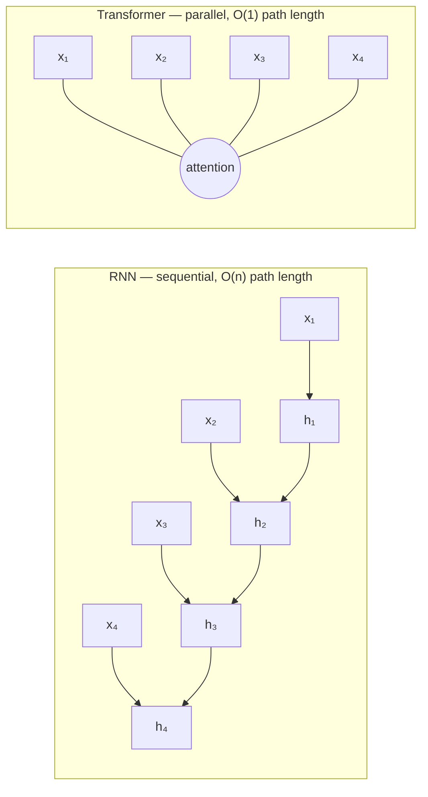

| Property | RNN/LSTM | Transformer (self-attention) |
|---|---|---|
| Compute per layer | $O(n \cdot d^2)$ | $O(n^2 \cdot d)$ |
| Sequential operations | $O(n)$ | $O(1)$ |
| Max path length between tokens | $O(n)$ | $O(1)$ |
| Parallelizable over sequence? | No | Yes |

> ⚠️ **Common Pitfall:** Self-attention is *not* free — it costs $O(n^2)$ in sequence length, which is exactly why long-context efficiency (Section 10) is a whole research area. RNNs were $O(n)$ in length. We traded a length penalty for parallelism and short path length, and modern hardware made that trade overwhelmingly worth it.

---

## 2. Attention From First Principles

> 💡 **Intuition:** Attention is **soft dictionary lookup**. A *query* asks "what am I looking for?"; each item in memory has a *key* ("what do I offer?") and a *value* ("here's my content"). We match the query against all keys, turn the match scores into probabilities, and return a weighted blend of the values. Unlike a Python dict (exact key match → one value), attention returns a *soft* average over all values, weighted by relevance.

Concretely, for one query vector $q$, a set of keys $\{k_1, \dots, k_n\}$, and values $\{v_1, \dots, v_n\}$:

1. **Score** each key by similarity to the query: $s_i = q \cdot k_i$ (dot product — larger when aligned).
2. **Normalize** scores into weights with softmax: $\alpha_i = \dfrac{e^{s_i}}{\sum_j e^{s_j}}$, so $\sum_i \alpha_i = 1$.
3. **Aggregate** the values: $\text{out} = \sum_i \alpha_i v_i$.

Where do $Q$, $K$, $V$ come from? Each input embedding $x_i \in \mathbb{R}^{d_{\text{model}}}$ is **linearly projected** by three learned weight matrices:

$$q_i = x_i W^Q, \quad k_i = x_i W^K, \quad v_i = x_i W^V$$

with $W^Q, W^K \in \mathbb{R}^{d_{\text{model}} \times d_k}$ and $W^V \in \mathbb{R}^{d_{\text{model}} \times d_v}$. These projections are *the* learned parameters of attention — they let the model decide what to search for, what to advertise, and what to return.

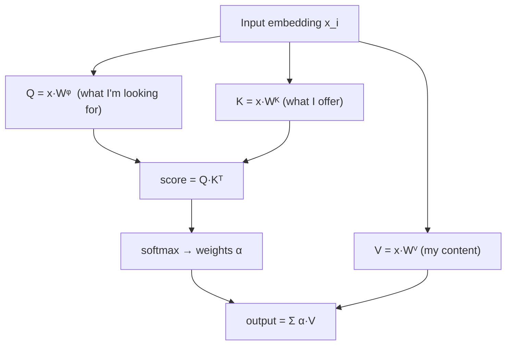

> 🎯 **Key Insight:** The three roles (query/key/value) are *different linear views of the same token*. That separation is what gives attention its expressiveness: a token can advertise one thing (key), search for another (query), and deliver a third (value).

---

## 3. Scaled Dot-Product Attention

This is the central equation of the whole field. Stacking the per-token queries into a matrix $Q \in \mathbb{R}^{n \times d_k}$ (and likewise $K \in \mathbb{R}^{n \times d_k}$, $V \in \mathbb{R}^{n \times d_v}$):

$$\boxed{\;\text{Attention}(Q, K, V) = \text{softmax}\!\left(\frac{QK^\top}{\sqrt{d_k}}\right) V\;}$$

Symbol definitions:

- $n$ — sequence length (number of tokens).
- $d_k$ — dimension of query/key vectors.
- $d_v$ — dimension of value vectors (often $d_v = d_k$).
- $QK^\top \in \mathbb{R}^{n \times n}$ — the **attention score matrix**; entry $(i,j)$ is how much token $i$ attends to token $j$.
- softmax is applied **row-wise**, so each row sums to 1.

### Why divide by $\sqrt{d_k}$?

> ⚠️ **Common Pitfall:** Forgetting the scaling factor. It is not cosmetic — it stabilizes training.

Assume the components of $q$ and $k$ are independent with mean 0 and variance 1. Their dot product is $q \cdot k = \sum_{m=1}^{d_k} q_m k_m$. Each term has mean 0 and variance 1, and summing $d_k$ independent terms gives:

$$\mathbb{E}[q\cdot k] = 0, \qquad \text{Var}(q \cdot k) = d_k$$

So the raw scores have **standard deviation $\sqrt{d_k}$**, which grows with dimension. Large logits push softmax into a near one-hot regime where its gradient $\approx 0$ (saturation). Dividing by $\sqrt{d_k}$ rescales the variance back to $\approx 1$, keeping softmax in its responsive range.

$$\text{Var}\!\left(\frac{q \cdot k}{\sqrt{d_k}}\right) = \frac{d_k}{d_k} = 1$$

### Worked example by hand

Take $n=2$ tokens, $d_k = d_v = 2$. Suppose:

$$Q = \begin{bmatrix} 1 & 0 \\ 0 & 1 \end{bmatrix}, \quad K = \begin{bmatrix} 1 & 0 \\ 0 & 1 \end{bmatrix}, \quad V = \begin{bmatrix} 10 & 0 \\ 0 & 10 \end{bmatrix}$$

**Step 1 — scores** $QK^\top$:

$$QK^\top = \begin{bmatrix} 1\cdot1+0\cdot0 & 1\cdot0+0\cdot1 \\ 0\cdot1+1\cdot0 & 0\cdot0+1\cdot1 \end{bmatrix} = \begin{bmatrix} 1 & 0 \\ 0 & 1 \end{bmatrix}$$

**Step 2 — scale** by $\sqrt{d_k} = \sqrt{2} \approx 1.414$:

$$\frac{QK^\top}{\sqrt 2} = \begin{bmatrix} 0.707 & 0 \\ 0 & 0.707 \end{bmatrix}$$

**Step 3 — softmax** each row. Row 1: $\text{softmax}(0.707, 0)$. Compute $e^{0.707}\approx 2.028$, $e^{0}=1$, sum $=3.028$:

$$\alpha_1 = (2.028/3.028,\; 1/3.028) = (0.670,\; 0.330)$$

By symmetry row 2 is $(0.330, 0.670)$.

**Step 4 — weighted values** $\alpha V$. Row 1:

$$0.670 \cdot (10,0) + 0.330 \cdot (0,10) = (6.70,\; 3.30)$$

So output row 1 $= (6.70, 3.30)$, row 2 $= (3.30, 6.70)$. Token 1 pulls mostly its own value (10,0) but blends in token 2's. That is attention doing a soft average. (The Python in [§16](#-from-scratch-implementation) reproduces these exact numbers.)

### The attention matrix shapes (ASCII)

```
            d_k                       n  (keys)              d_v
       ┌─────────┐               ┌──────────────┐       ┌─────────┐
   n   │    Q    │   ·    Kᵀ  =   │    QKᵀ        │  · V  │    V    │
(query)│ (n×d_k) │  (d_k×n)   n  │   scores      │ (n×n) │ (n×d_v) │
       └─────────┘               │  (n×n)        │       └─────────┘
                                 └──────────────┘
   softmax over each ROW (axis = keys) →  weights sum to 1 per query
   final output:  (n×n) · (n×d_v)  =  (n×d_v)
```

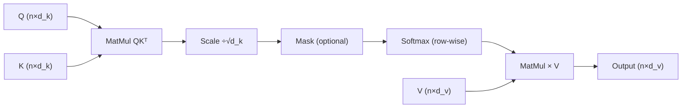

---

## 4. Self-Attention vs Cross-Attention

The equation is identical; **where $Q$, $K$, $V$ come from** differs.

| Type | Q from | K, V from | Used in |
|---|---|---|---|
| **Self-attention** | sequence X | same sequence X | encoder layers, decoder masked self-attn |
| **Cross-attention** | decoder sequence | encoder output | encoder-decoder bridge (translation, T5) |

> 💡 **Intuition:** Self-attention is a sentence talking to *itself* — each word gathers context from its neighbors. Cross-attention is the decoder (generating, say, French) *consulting* the encoder's representation of the source (English).

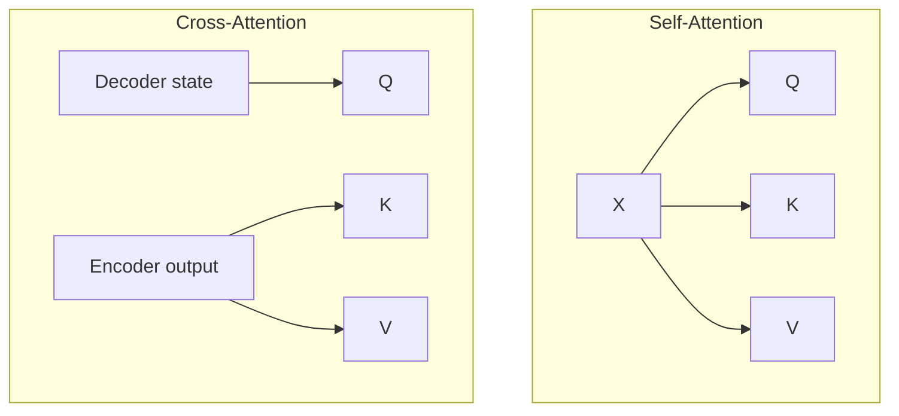

---

## 5. Multi-Head Attention

> 💡 **Intuition:** One attention head is one "perspective" — maybe it tracks subject-verb agreement. Multi-head attention runs $h$ heads in parallel, each with its *own* $W^Q, W^K, W^V$, so different heads can specialize (syntax, coreference, position). It's an ensemble of soft-lookups computed in one shot.

For $h$ heads, split the model dimension: each head works in dimension $d_k = d_v = d_{\text{model}}/h$.

$$\text{head}_i = \text{Attention}(X W_i^Q,\; X W_i^K,\; X W_i^V)$$
$$\text{MultiHead}(X) = \text{Concat}(\text{head}_1, \dots, \text{head}_h)\, W^O$$

where $W^O \in \mathbb{R}^{(h \cdot d_v) \times d_{\text{model}}}$ projects the concatenated heads back to model dimension. Original paper: $d_{\text{model}}=512$, $h=8$, so $d_k = 64$.

> 🎯 **Key Insight:** Multi-head costs roughly the same FLOPs as single-head with full dimension, because each head is *narrower* ($d_{\text{model}}/h$). You get diversity of attention patterns essentially for free.

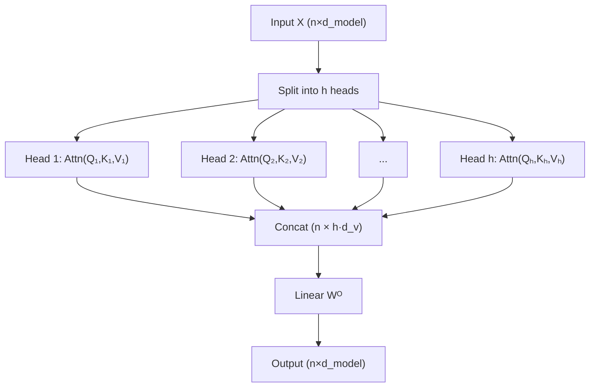

> ⚠️ **Common Pitfall:** In code, you don't loop over heads. You reshape the projected tensor from `(batch, n, d_model)` to `(batch, h, n, d_k)` and do one batched matmul. Looping works but wastes the GPU.

---

## 6. Positional Encodings

Attention is **permutation-equivariant**: shuffle the input tokens and the output shuffles identically — it has no inherent notion of order. We must *inject* position.

> ⚠️ **Common Pitfall:** Without positional information, "dog bites man" and "man bites dog" produce identical attention outputs. Order is not free in a Transformer.

| Scheme | How | Pros | Cons / used by |
|---|---|---|---|
| **Sinusoidal** (Vaswani 2017) | Fixed sin/cos of varying frequency added to embeddings | No parameters; extrapolates somewhat | Original Transformer |
| **Learned absolute** | A trainable vector per position | Simple, flexible | Caps at max trained length; BERT, GPT-2 |
| **RoPE** (Rotary) | Rotate Q,K by an angle proportional to position | Relative positions; good extrapolation | Llama, GPT-NeoX, most modern LLMs |
| **ALiBi** | Add a distance-proportional bias to attention scores | No learned params; strong length extrapolation | BLOOM, MPT |

### Sinusoidal encoding (the original)

For position $\text{pos}$ and dimension index $i$:

$$PE_{(\text{pos}, 2i)} = \sin\!\left(\frac{\text{pos}}{10000^{2i/d_{\text{model}}}}\right), \qquad PE_{(\text{pos}, 2i+1)} = \cos\!\left(\frac{\text{pos}}{10000^{2i/d_{\text{model}}}}\right)$$

Each dimension is a sinusoid of a different wavelength (geometric progression from $2\pi$ to $\sim 10000\cdot 2\pi$). A useful property: $PE_{\text{pos}+k}$ is a linear function of $PE_{\text{pos}}$, so the model can learn to attend by *relative* offsets.

> 💡 **Intuition (RoPE):** Instead of *adding* a position vector, RoPE *rotates* each query and key in 2-D subspaces by an angle proportional to position. The dot product $q_i \cdot k_j$ then depends only on the **relative** offset $i - j$ — which is exactly what attention should care about, and it extrapolates to longer sequences better than learned absolute encodings.

---

## 7. The Full Transformer (Vaswani 2017)

Now we assemble everything. The original Transformer is an **encoder-decoder** with $N=6$ stacked layers each side.

### The sublayer building blocks

Each sublayer is wrapped in a **residual connection** followed by **layer normalization**:

$$\text{output} = \text{LayerNorm}\big(x + \text{Sublayer}(x)\big)$$

- **Residual** ($x + \cdot$): preserves gradient flow through deep stacks (same idea as ResNet — see [§04](./04-neural-networks.md)).
- **LayerNorm**: normalizes across the feature dimension per token, stabilizing activations.
- **Position-wise FFN**: a 2-layer MLP applied identically to each position:

$$\text{FFN}(x) = \max(0,\, x W_1 + b_1)\, W_2 + b_2, \qquad W_1 \in \mathbb{R}^{d_{\text{model}} \times d_{ff}},\ d_{ff} = 4 d_{\text{model}}$$

> 📝 **Tip — Pre-LN vs Post-LN:** Vaswani's original is *Post-LN* (norm after the residual add). Modern LLMs almost universally use *Pre-LN* ($x + \text{Sublayer}(\text{LayerNorm}(x))$) because it trains far more stably at depth without learning-rate warmup gymnastics.

### Masking

- **Encoder self-attention:** no mask — every token sees every token (bidirectional).
- **Decoder self-attention:** **causal mask** — token $i$ may only attend to tokens $\le i$. Implemented by setting future scores to $-\infty$ before softmax (so their weight → 0).
- **Padding mask:** ignore `<pad>` tokens in batched variable-length inputs.

```
Causal mask added to QKᵀ scores (n=4), 0 = keep, -∞ = block:
        k1   k2   k3   k4
  q1 [  0   -∞   -∞   -∞ ]   token 1 sees only itself
  q2 [  0    0   -∞   -∞ ]
  q3 [  0    0    0   -∞ ]
  q4 [  0    0    0    0 ]   token 4 sees all previous
```

### Layer-by-layer architecture

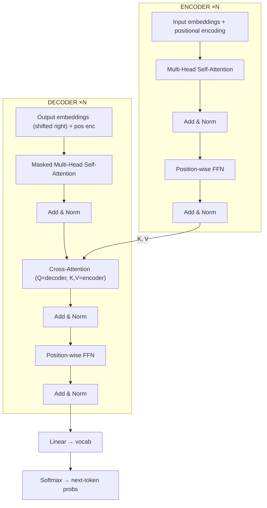

> 🎯 **Key Insight:** Three distinct attention sublayers, three distinct jobs: (1) encoder self-attention reads the source; (2) decoder masked self-attention reads what's been generated so far without peeking ahead; (3) cross-attention lets the decoder consult the encoded source.

---

## 8. The Three Families: BERT, GPT, T5

Once the layer exists, you can use *only the encoder*, *only the decoder*, or *both*. Three families result.

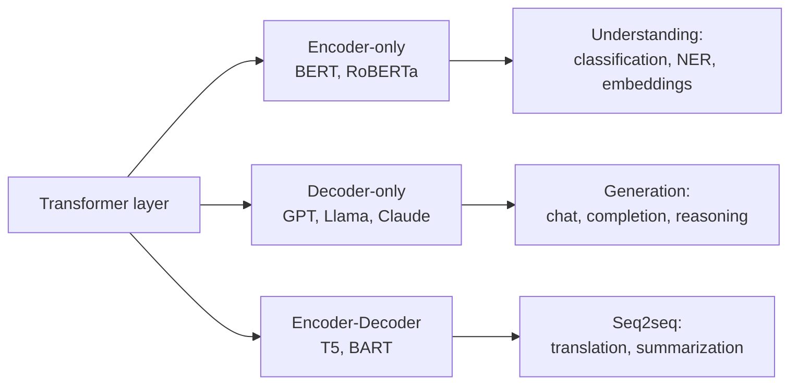

### Encoder-only — BERT

- **Bidirectional**: every token sees the full context (left and right). Great for *understanding*, not generation.
- **Pretraining — Masked Language Modeling (MLM):** randomly mask ~15% of tokens, train to predict them from both directions.
- **`[CLS]` token:** a special prepended token whose final hidden state is used as a sentence-level representation for classification.
- **Fine-tuning:** add a small task head on top of `[CLS]` (or per-token outputs) and train end-to-end on labeled data.

### Decoder-only — GPT family

- **Autoregressive**: predicts the next token given all previous tokens, using a **causal mask**. Generation is left-to-right.
- **Objective:** maximize $\sum_t \log P(x_t \mid x_{<t})$ — plain next-token prediction over massive text corpora.
- **Scaling laws** (Kaplan 2020; Chinchilla, Hoffmann 2022): loss falls as a power law in parameters $N$, data $D$, and compute $C$. Chinchilla's correction: for a fixed compute budget, models were *undertrained* — tokens should scale roughly **proportionally** with parameters (~20 tokens per parameter), not lag behind.

$$L(N) \approx L_\infty + \left(\frac{N_c}{N}\right)^{\alpha_N}$$

where $L_\infty$ is irreducible loss and $\alpha_N$ is the scaling exponent.

### Encoder-decoder — T5

- **"Text-to-Text Transfer Transformer":** *every* task is cast as text→text ("translate English to German: …", "summarize: …").
- **Objective:** span-corruption (mask contiguous spans, generate them) — a denoising objective bridging MLM and autoregressive generation.

| Family | Attention | Pretraining | Best at | Examples |
|---|---|---|---|---|
| Encoder-only | Bidirectional | MLM | Understanding, embeddings | BERT, RoBERTa, DeBERTa |
| Decoder-only | Causal | Next-token | Generation, chat, reasoning | GPT-4, Llama, Claude, Mistral |
| Encoder-decoder | Both | Span corruption | Translation, summarization | T5, BART, FLAN-T5 |

> 🎯 **Key Insight:** Frontier chat/reasoning models converged on **decoder-only**. It's the simplest objective (just predict the next token), scales cleanly, and a decoder with in-context learning subsumes most seq2seq tasks without a separate encoder.

---

## 9. Tokenization

Models don't read characters or words — they read **tokens**, integer IDs from a fixed vocabulary. Subword tokenization balances vocabulary size against sequence length and handles rare/unseen words gracefully.

| Algorithm | Idea | Used by |
|---|---|---|
| **BPE** (Byte-Pair Encoding) | Start from characters; iteratively merge the most frequent adjacent pair | GPT-2/3/4, Llama (byte-level BPE) |
| **WordPiece** | Like BPE but merges to maximize training-data likelihood; marks continuations with `##` | BERT |
| **SentencePiece / Unigram** | Language-agnostic; treats input as raw bytes incl. spaces (`▁`); unigram prob model prunes a large vocab | T5, Llama, many multilingual models |

> 💡 **Intuition (BPE):** Start with "l o w e r". The pair "e r" appears a lot across the corpus → merge into "er". Repeat thousands of times. Common words become single tokens; rare words split into reusable subword pieces. No `<unk>` needed — byte-level BPE can encode *any* string.

> ⚠️ **Common Pitfall:** Token count ≠ word count. English averages ~1.3 tokens/word; code, numbers, and non-Latin scripts can be far more expensive. A "4096-token context" is *not* 4096 words. Always count tokens with the model's actual tokenizer.

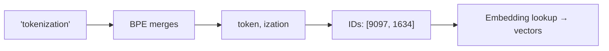

---

## 10. Modern Efficiency Tricks

Self-attention's $O(n^2)$ cost and the memory of generation drive a large engineering toolkit.

### KV Cache

During autoregressive generation, at each step you only add **one** new token — but naively you'd recompute keys/values for the entire prefix every step. The **KV cache** stores past $K$ and $V$ so each new step is $O(n)$ instead of $O(n^2)$.

```
Generating token t=4, prompt already processed:

  KV cache (grows by one row per step):
        K_cache                 V_cache
   ┌──────────────┐        ┌──────────────┐
   │ k₁  (token1) │        │ v₁           │   ← cached, reused
   │ k₂  (token2) │        │ v₂           │
   │ k₃  (token3) │        │ v₃           │
   ├──────────────┤        ├──────────────┤
   │ k₄  (NEW)    │        │ v₄  (NEW)    │   ← only this is computed now
   └──────────────┘        └──────────────┘

  Only q₄ is computed; it attends over the full cached K,V.
  Cost per step: O(n) not O(n²).  Memory: O(n · d · layers · 2).
```

> ⚠️ **Common Pitfall:** The KV cache is the *dominant memory consumer* at long context and large batch — it scales with `batch × layers × heads × seq_len × head_dim × 2`. This is precisely why MQA/GQA (below) exist.

### FlashAttention

An **IO-aware** exact attention algorithm. It never materializes the full $n \times n$ score matrix in slow GPU HBM; instead it *tiles* the computation and fuses softmax in fast on-chip SRAM. Same math, dramatically less memory traffic → big speedups and the ability to fit longer sequences. It's exact, not an approximation.

### Multi-Query (MQA) & Grouped-Query Attention (GQA)

Shrink the KV cache by sharing keys/values across query heads.

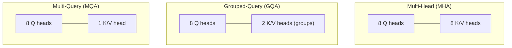

| Scheme | K/V heads | KV cache | Quality |
|---|---|---|---|
| MHA | = query heads | Large | Baseline |
| GQA | a few groups | Medium | ~MHA (Llama 2/3 use this) |
| MQA | 1 | Smallest | Slight drop |

### Mixture-of-Experts (MoE)

Replace the dense FFN with $E$ expert FFNs and a **router** that sends each token to only the top-$k$ experts (e.g., 2 of 8). You get a model with huge *total* parameters but small *active* parameters per token — more capacity at roughly fixed inference FLOPs. Used by Mixtral, and (per public reporting) frontier models.

### Long context / sliding-window attention

Restrict each token to a local window of size $w$ (Mistral's sliding-window attention), drop attention to $O(n \cdot w)$, and stack layers so information still propagates globally. Other directions: sparse/block attention, attention sinks, and RoPE scaling for context extension.

---

## 11. The Training Pipeline: Pretrain → SFT → RLHF/DPO

A chat model like GPT-4 or Claude is built in stages:

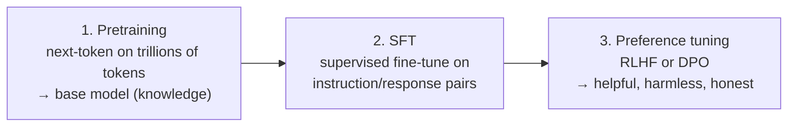

1. **Pretraining** — self-supervised next-token prediction on web-scale text. Builds raw knowledge and language ability. Most expensive stage (the "base model").
2. **Supervised Fine-Tuning (SFT)** — train on curated *(instruction, ideal response)* pairs so the model follows instructions instead of merely continuing text.
3. **Preference optimization:**
   - **RLHF (Reinforcement Learning from Human Feedback):** humans rank outputs → train a **reward model** → optimize the policy against it (usually PPO). Powerful but a complex, unstable RL loop.
   - **DPO (Direct Preference Optimization):** skips the explicit reward model and RL loop, directly optimizing a classification-style loss on preferred-vs-rejected pairs. Much simpler and more stable; widely adopted.

> 🎯 **Key Insight:** Pretraining gives a model *what it knows*; SFT + preference tuning give it *how to behave*. A base model is a brilliant autocomplete; alignment turns it into an assistant.

---

## 12. Parameter-Efficient Fine-Tuning: LoRA & QLoRA

Full fine-tuning of a 70B model updates all 70B parameters — infeasible for most. **PEFT** updates a tiny fraction.

**LoRA (Low-Rank Adaptation):** freeze the pretrained weight $W_0 \in \mathbb{R}^{d \times k}$ and learn a *low-rank* update:

$$W = W_0 + \Delta W = W_0 + \frac{\alpha}{r} B A, \qquad B \in \mathbb{R}^{d \times r},\ A \in \mathbb{R}^{r \times k},\ r \ll \min(d,k)$$

Only $A$ and $B$ are trained. With rank $r=8$ on a $4096\times4096$ matrix, you train $2 \cdot 4096 \cdot 8 \approx 65{,}536$ params instead of $16.7$M — a ~250× reduction for that layer.

> 💡 **Intuition:** The *change* needed to adapt a model to a new task lives in a low-dimensional subspace. This is the same low-rank idea as the SVD in [§01](./01-math-foundations.md): approximate a big matrix with a product of skinny ones.

**QLoRA:** quantize the frozen base model to 4-bit (NF4) and train LoRA adapters on top. Enables fine-tuning a 65B model on a single consumer GPU with negligible quality loss.

> 📝 **Tip:** LoRA adapters are tiny (megabytes). You can keep one frozen base model and hot-swap many task-specific adapters — a major deployment win.

---

## 13. Decoding Strategies

Given next-token probabilities, *how* do we pick? This is decoding, and it controls the determinism/creativity trade-off.

| Strategy | Rule | Effect |
|---|---|---|
| **Greedy** | Always take argmax | Deterministic; can be repetitive/bland |
| **Beam search** | Keep top-$b$ partial sequences | Higher-likelihood sequences; good for translation, dull for open text |
| **Temperature** | Scale logits by $1/T$ before softmax | $T<1$ sharper/safer, $T>1$ flatter/wilder, $T=1$ unchanged |
| **Top-k** | Sample only from $k$ most likely tokens | Cuts the long tail of garbage |
| **Top-p (nucleus)** | Sample from smallest set with cumulative prob $\ge p$ | Adaptive cutoff; the modern default |

**Temperature** rescales logits $z_i$:

$$P_i = \frac{e^{z_i / T}}{\sum_j e^{z_j / T}}$$

As $T \to 0$ this approaches greedy (argmax); as $T \to \infty$ it approaches a uniform distribution.

> ⚠️ **Common Pitfall:** Stacking high temperature *and* large top-k/top-p invites incoherence. Typical chat defaults: $T \approx 0.7$, top-p $\approx 0.9$. For deterministic/extraction tasks, set $T=0$ (greedy).

> 📝 **Tip:** Beam search maximizes sequence likelihood but is known to produce generic, repetitive text for open-ended generation — high-likelihood ≠ high-quality. Sampling (top-p) usually reads better for creative tasks.

---

## 14. Evaluation

| Metric | Measures | Notes |
|---|---|---|
| **Perplexity** | Language-model fit | $\text{PPL} = \exp(\text{cross-entropy})$; lower is better. Intrinsic, not task quality. |
| **BLEU** | n-gram precision vs references | Translation; precision-oriented, brevity-penalized. |
| **ROUGE** | n-gram recall vs references | Summarization (ROUGE-1/2/L). |
| **BERTScore** | Embedding cosine similarity | Captures semantic match, not just surface overlap. |
| **LLM-as-judge** | A strong model scores outputs | Flexible, scalable; watch for bias (position, verbosity, self-preference). |

**Perplexity** is the exponentiated average negative log-likelihood:

$$\text{PPL} = \exp\!\left(-\frac{1}{N} \sum_{t=1}^{N} \log P(x_t \mid x_{<t})\right)$$

> 💡 **Intuition:** Perplexity is "how many equally-likely choices the model is effectively confused among at each step." PPL = 1 is perfect; PPL = vocab-size is random guessing.

> ⚠️ **Common Pitfall:** BLEU/ROUGE reward surface n-gram overlap and miss valid paraphrases. A perfect-meaning rewrite with different words scores poorly. For modern LLM eval, pair automatic metrics with LLM-as-judge and human spot-checks.

---

## 15. Hallucination & Context Windows

A **hallucination** is fluent, confident output that is factually wrong or unsupported.

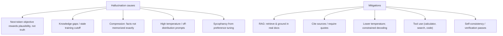

> 🎯 **Key Insight:** The next-token objective optimizes *plausibility*, not *truth*. The model has no built-in mechanism to know it doesn't know. Grounding (RAG, tools, citations) supplies the truth signal the objective lacks.

### Context windows

The **context window** is the max number of tokens (prompt + generation) a model can attend to at once — 4K early GPT-3, 128K+ and 1M+ in frontier models. Limits come from the $O(n^2)$ attention cost, KV-cache memory, and how far positional encodings were trained/extended (RoPE scaling, ALiBi).

> ⚠️ **Common Pitfall — "lost in the middle":** Even within a long window, models often attend best to the *start* and *end* of the context and neglect the middle. Don't assume "it's in the context" means "it will be used." Put critical instructions at the edges.

---

## 🧮 From-Scratch Implementation

Pure NumPy scaled dot-product attention — reproduces the §3 hand calculation exactly.

```python
import numpy as np

def softmax(x, axis=-1):
    # subtract max for numerical stability (no change to the result)
    x = x - np.max(x, axis=axis, keepdims=True)
    e = np.exp(x)
    return e / np.sum(e, axis=axis, keepdims=True)

def scaled_dot_product_attention(Q, K, V, mask=None):
    d_k = Q.shape[-1]
    scores = Q @ K.T / np.sqrt(d_k)          # (n, n)
    if mask is not None:
        scores = np.where(mask == 0, -1e9, scores)
    weights = softmax(scores, axis=-1)       # rows sum to 1
    return weights @ V, weights

Q = np.array([[1., 0.], [0., 1.]])
K = np.array([[1., 0.], [0., 1.]])
V = np.array([[10., 0.], [0., 10.]])

out, w = scaled_dot_product_attention(Q, K, V)
print(np.round(w, 3))
# [[0.67 0.33]
#  [0.33 0.67]]
print(np.round(out, 2))
# [[6.7  3.3 ]
#  [3.3  6.7 ]]
print("rows sum to 1:", np.allclose(w.sum(axis=1), 1.0))
# rows sum to 1: True
```

The numbers match the by-hand derivation in §3. Now the causal-mask version:

```python
import numpy as np
n = 4
mask = np.tril(np.ones((n, n)))   # lower-triangular: 1 = keep, 0 = block
print(mask)
# [[1. 0. 0. 0.]
#  [1. 1. 0. 0.]
#  [1. 1. 1. 0.]
#  [1. 1. 1. 1.]]
# Row i has i+1 ones: token i attends only to tokens 0..i (no future leakage).
```

---

## ❓ Knowledge Check

<details><summary>1. Why can't a vanilla Transformer tell "dog bites man" from "man bites dog"?</summary>

Self-attention is **permutation-equivariant** — it has no inherent notion of token order. Both sentences would yield the same set of attention outputs (just permuted). **Positional encodings** (sinusoidal, learned, RoPE, ALiBi) are added to inject order information.
</details>

<details><summary>2. Why divide attention scores by $\sqrt{d_k}$?</summary>

For unit-variance, mean-zero $q,k$, the dot product $q\cdot k$ has variance $d_k$, so std $\sqrt{d_k}$ grows with dimension. Large logits saturate softmax (near one-hot), killing its gradient. Dividing by $\sqrt{d_k}$ restores variance to $\approx 1$ and keeps softmax in its responsive range.
</details>

<details><summary>3. What are the shapes of $Q$, $K$, $V$, $QK^\top$, and the output?</summary>

$Q,K \in \mathbb{R}^{n\times d_k}$, $V \in \mathbb{R}^{n\times d_v}$. $QK^\top \in \mathbb{R}^{n\times n}$ (scores). Output $= \text{softmax}(QK^\top/\sqrt{d_k})\,V \in \mathbb{R}^{n\times d_v}$.
</details>

<details><summary>4. Difference between self-attention and cross-attention?</summary>

Same equation, different sources. **Self-attention:** $Q,K,V$ all from one sequence. **Cross-attention:** $Q$ from the decoder, $K,V$ from the encoder output — the bridge in encoder-decoder models.
</details>

<details><summary>5. Why use multiple heads instead of one big head?</summary>

Different heads learn different relationship types (syntax, coreference, position) — an ensemble of attention patterns. Splitting $d_{\text{model}}$ across $h$ narrower heads keeps total FLOPs about the same while adding representational diversity.
</details>

<details><summary>6. What does the causal mask do and how is it implemented?</summary>

It prevents a decoder token from attending to **future** tokens, making generation autoregressive. Implemented by setting future positions in $QK^\top$ to $-\infty$ (or a large negative) before softmax, so their weights become 0.
</details>

<details><summary>7. BERT vs GPT in one sentence each.</summary>

**BERT:** encoder-only, bidirectional, pretrained with masked language modeling — built for *understanding*. **GPT:** decoder-only, causal/autoregressive, pretrained on next-token prediction — built for *generation*.
</details>

<details><summary>8. What is the KV cache and what problem does it solve?</summary>

It stores past keys and values during autoregressive generation so each new token only computes its own $q$ and attends over cached $K,V$ — turning per-step cost from $O(n^2)$ into $O(n)$. Its memory footprint is the main reason MQA/GQA exist.
</details>

<details><summary>9. Is FlashAttention an approximation?</summary>

No — it computes **exact** attention. It's an IO-aware algorithm that tiles the computation and fuses softmax in on-chip SRAM, avoiding materializing the full $n\times n$ matrix in HBM. Same result, far less memory traffic, much faster.
</details>

<details><summary>10. How do MQA and GQA reduce cost?</summary>

They share key/value heads across query heads. MQA uses a single K/V head; GQA uses a few groups. This shrinks the KV cache (and its memory bandwidth) while keeping quality close to full multi-head attention.
</details>

<details><summary>11. Outline the pretrain → SFT → RLHF/DPO pipeline.</summary>

**Pretrain:** next-token prediction on web-scale text (knowledge). **SFT:** supervised fine-tune on instruction/response pairs (follows instructions). **RLHF/DPO:** optimize toward human preferences (helpful/harmless/honest). DPO skips the reward model and RL loop, optimizing preference pairs directly.
</details>

<details><summary>12. How does LoRA cut trainable parameters, and what's the link to SVD?</summary>

It freezes $W_0$ and learns a low-rank update $\Delta W = \frac{\alpha}{r}BA$ with $r \ll \min(d,k)$, training only $A,B$. Same low-rank-approximation principle as SVD: a big matrix's *task-adaptation delta* lives in a low-dimensional subspace.
</details>

<details><summary>13. Temperature 0 vs 1 vs 2 — what changes?</summary>

Temperature scales logits by $1/T$ before softmax. $T\to 0$ → argmax (deterministic, greedy). $T=1$ → unchanged distribution. $T>1$ → flatter distribution, more random/creative (and more error-prone).
</details>

<details><summary>14. Why do BLEU/ROUGE miss good paraphrases?</summary>

They score surface **n-gram overlap** against references. A correct rewrite using different words has low overlap and scores poorly. BERTScore (embedding similarity) and LLM-as-judge capture semantic equivalence better.
</details>

<details><summary>15. Name three causes of hallucination and a mitigation for each.</summary>

Causes: (1) next-token objective rewards plausibility not truth → mitigate with **RAG/grounding**; (2) stale/missing knowledge → **tool use / retrieval**; (3) high temperature / off-distribution prompts → **lower temperature, constrained decoding**. Also: require **citations** and run **verification passes**.
</details>

---

## 🏋️ Exercises

<details><summary><b>Exercise 1 (headline):</b> Implement scaled dot-product attention in PyTorch and sanity-check softmax + shapes.</summary>

```python
import torch, torch.nn.functional as F, math

def sdpa(Q, K, V, mask=None):
    d_k = Q.size(-1)
    scores = Q @ K.transpose(-2, -1) / math.sqrt(d_k)   # (..., n, n)
    if mask is not None:
        scores = scores.masked_fill(mask == 0, float('-inf'))
    weights = F.softmax(scores, dim=-1)
    return weights @ V, weights

torch.manual_seed(0)
n, d_k, d_v = 5, 8, 8
Q, K, V = torch.randn(n, d_k), torch.randn(n, d_k), torch.randn(n, d_v)
out, w = sdpa(Q, K, V)
assert out.shape == (n, d_v)
assert torch.allclose(w.sum(-1), torch.ones(n), atol=1e-6)  # softmax rows sum to 1
print("shapes OK, softmax normalized:", out.shape, w.shape)
# shapes OK, softmax normalized: torch.Size([5, 8]) torch.Size([5, 5])
```
The two assertions are the sanity checks: output is `(n, d_v)` and every attention row is a probability distribution.
</details>

<details><summary><b>Exercise 2 (headline):</b> Implement multi-head attention from scratch and verify the output shape.</summary>

```python
import torch, torch.nn as nn, torch.nn.functional as F, math

class MultiHeadAttention(nn.Module):
    def __init__(self, d_model, num_heads):
        super().__init__()
        assert d_model % num_heads == 0
        self.h, self.d_k = num_heads, d_model // num_heads
        self.Wq = nn.Linear(d_model, d_model)
        self.Wk = nn.Linear(d_model, d_model)
        self.Wv = nn.Linear(d_model, d_model)
        self.Wo = nn.Linear(d_model, d_model)

    def forward(self, x, mask=None):
        B, n, _ = x.shape
        # project then reshape to (B, h, n, d_k)
        def split(t): return t.view(B, n, self.h, self.d_k).transpose(1, 2)
        Q, K, V = split(self.Wq(x)), split(self.Wk(x)), split(self.Wv(x))
        scores = Q @ K.transpose(-2, -1) / math.sqrt(self.d_k)   # (B,h,n,n)
        if mask is not None:
            scores = scores.masked_fill(mask == 0, float('-inf'))
        w = F.softmax(scores, dim=-1)
        ctx = w @ V                                              # (B,h,n,d_k)
        ctx = ctx.transpose(1, 2).contiguous().view(B, n, self.h * self.d_k)
        return self.Wo(ctx)

x = torch.randn(2, 6, 32)              # batch=2, seq=6, d_model=32
mha = MultiHeadAttention(32, num_heads=4)
out = mha(x)
print(out.shape)   # torch.Size([2, 6, 32])  -> same shape in, same shape out
```
Key trick: reshape to `(B, h, n, d_k)` so all heads compute in one batched matmul — no Python loop over heads.
</details>

<details><summary><b>Exercise 3:</b> Add a causal mask to Exercise 2 and confirm position 0 never attends to the future.</summary>

```python
import torch
n = 6
causal = torch.tril(torch.ones(n, n)).view(1, 1, n, n)  # broadcast over (B,h)
out = mha(x, mask=causal)
print(out.shape)  # torch.Size([2, 6, 32])

# Inspect weights for the first head/batch:
import torch.nn.functional as F, math
B = x.size(0)
def split(t): return t.view(B, n, mha.h, mha.d_k).transpose(1,2)
Q,K = split(mha.Wq(x)), split(mha.Wk(x))
scores = (Q @ K.transpose(-2,-1) / math.sqrt(mha.d_k)).masked_fill(causal==0, float('-inf'))
w = F.softmax(scores, dim=-1)
print(torch.round(w[0,0], decimals=2))
# Row 0 has weight only in column 0; upper triangle is exactly 0 → no future leakage.
```
</details>

<details><summary><b>Exercise 4:</b> Compute perplexity from a sequence of token log-probabilities.</summary>

```python
import numpy as np
# model's log P(x_t | x_<t) for each token (natural log)
logps = np.array([-0.5, -1.2, -0.3, -2.0, -0.8])
ppl = np.exp(-logps.mean())
print(round(ppl, 3))   # 2.456
# Interpretation: the model is effectively choosing among ~2.46 options per token.
```
Lower perplexity = better fit. PPL=1 is perfect prediction; PPL near vocab size is random.
</details>

<details><summary><b>Exercise 5:</b> Implement temperature + top-p (nucleus) sampling.</summary>

```python
import torch, torch.nn.functional as F

def sample(logits, temperature=1.0, top_p=0.9):
    logits = logits / temperature
    probs = F.softmax(logits, dim=-1)
    sorted_p, idx = torch.sort(probs, descending=True)
    cum = torch.cumsum(sorted_p, dim=-1)
    # keep the smallest set whose cumulative prob >= top_p
    keep = cum - sorted_p < top_p
    sorted_p = sorted_p * keep
    sorted_p = sorted_p / sorted_p.sum()
    choice = idx[torch.multinomial(sorted_p, 1)]
    return choice.item()

torch.manual_seed(0)
logits = torch.tensor([2.0, 1.0, 0.1, -1.0, -3.0])
print(sample(logits, temperature=0.7, top_p=0.9))   # samples from the nucleus
```
Lower `temperature` sharpens; lower `top_p` truncates the tail more aggressively.
</details>

<details><summary><b>Exercise 6 (hardest):</b> Implement a LoRA-wrapped linear layer and count trainable parameters.</summary>

```python
import torch, torch.nn as nn

class LoRALinear(nn.Module):
    def __init__(self, in_f, out_f, r=8, alpha=16):
        super().__init__()
        self.base = nn.Linear(in_f, out_f)
        self.base.weight.requires_grad_(False)   # freeze pretrained weight
        self.base.bias.requires_grad_(False)
        self.A = nn.Parameter(torch.randn(r, in_f) * 0.01)  # down-project
        self.B = nn.Parameter(torch.zeros(out_f, r))        # up-project (init 0)
        self.scale = alpha / r

    def forward(self, x):
        return self.base(x) + self.scale * (x @ self.A.t() @ self.B.t())

layer = LoRALinear(4096, 4096, r=8)
trainable = sum(p.numel() for p in layer.parameters() if p.requires_grad)
frozen    = sum(p.numel() for p in layer.parameters() if not p.requires_grad)
print(f"trainable={trainable:,}  frozen={frozen:,}")
# trainable=65,536  frozen=16,781,312   -> ~256x fewer trainable params
```
$B$ is initialized to zero so the adapted layer starts identical to the base model — training only nudges it. Note $2 \cdot 4096 \cdot 8 = 65{,}536$ matches §12.
</details>

---

## 📊 Cheat Sheet

| Concept | One-liner |
|---|---|
| Attention | $\text{softmax}(QK^\top/\sqrt{d_k})V$ — soft dictionary lookup |
| Why $\sqrt{d_k}$ | Dot-product variance is $d_k$; rescale to 1 to avoid softmax saturation |
| Self vs cross | Self: Q,K,V one sequence. Cross: Q decoder, K,V encoder |
| Multi-head | $h$ narrow heads ($d_{\text{model}}/h$) concatenated then $W^O$ |
| Positional | sinusoidal / learned / RoPE (rotate) / ALiBi (bias) |
| Residual+Norm | $\text{LayerNorm}(x + \text{Sublayer}(x))$; modern = Pre-LN |
| FFN | 2-layer MLP, $d_{ff}=4d_{\text{model}}$, per position |
| Causal mask | future scores → $-\infty$ ⇒ autoregressive |
| BERT / GPT / T5 | encoder (MLM) / decoder (next-token) / enc-dec (span corruption) |
| Tokenization | BPE (GPT/Llama), WordPiece (BERT), SentencePiece (T5) |
| KV cache | store past K,V ⇒ O(n) per step; dominant long-context memory |
| FlashAttention | exact, IO-aware tiling — faster, less HBM traffic |
| MQA / GQA | share K/V heads ⇒ smaller KV cache |
| MoE | top-k of E experts ⇒ big capacity, small active FLOPs |
| Pipeline | Pretrain → SFT → RLHF/DPO |
| LoRA | $W_0 + \frac{\alpha}{r}BA$, train only A,B (low-rank) |
| Decoding | greedy / beam / temperature / top-k / top-p |
| Perplexity | $\exp(\text{cross-entropy})$; lower = better |
| Eval | BLEU (MT), ROUGE (summ), BERTScore (semantic), LLM-judge |
| Hallucination | plausibility ≠ truth ⇒ RAG / tools / citations / low T |

**Reference config (Vaswani 2017 base):** $d_{\text{model}}=512$, $h=8$, $d_k=d_v=64$, $d_{ff}=2048$, $N=6$ layers, dropout 0.1.

---

## 🔗 Further Resources

### Free

- **"Attention Is All You Need"** (Vaswani et al., 2017) — the original Transformer paper. https://arxiv.org/abs/1706.03762
- **Jay Alammar, "The Illustrated Transformer"** — the best visual walkthrough of attention and the architecture. https://jalammar.github.io/illustrated-transformer/
- **Andrej Karpathy, "Let's build GPT" + nanoGPT** — build a decoder-only Transformer from scratch on video; minimal, readable code. https://www.youtube.com/watch?v=kCc8FmEb1nY and https://github.com/karpathy/nanoGPT
- **Hugging Face LLM / NLP Course** — hands-on tokenization, fine-tuning, and the Transformers library. https://huggingface.co/learn/llm-course
- **Stanford CS224n: NLP with Deep Learning** — rigorous lectures and notes covering attention through LLMs. https://web.stanford.edu/class/cs224n/

### Paid (worth it)

- **DeepLearning.AI — NLP & LLM short courses** (e.g., "Generative AI with LLMs," "Finetuning LLMs," "Building Systems with the ChatGPT API") — practical, well-paced, taught with industry partners. Best for going from concept to a working pipeline quickly. https://www.deeplearning.ai/courses/ — ★★★★☆

---

## ➡️ What's Next

Continue to [07 — AI Engineering in Production](./07-ai-engineering-production.md): serving, RAG systems, evaluation harnesses, latency/cost optimization, and shipping LLM features reliably.
