# Modern AI Engineering — RAG, Agents & Production ML/MLOps
*Building, shipping, and operating LLM systems that survive contact with real users.*

*Part of the AI Engineering & ML Mastery Path — see the [index](../README.md) and [study plan](../MASTER-STUDY-PLAN.md).*

The hard part of AI in production was never the model — it's everything around it. This module is the bridge between "I can call an LLM API" and "I own a system that retrieves the right context, reasons over tools, gets evaluated automatically, is versioned, monitored for drift, costs what I budgeted, and doesn't leak PII." We cover **Retrieval-Augmented Generation (RAG)** end to end, **agents** (ReAct, planning, memory, multi-agent orchestration), **prompt engineering** as a real discipline, the **MLOps** spine (tracking, versioning, registries, serving, CI/CD), **monitoring** (data/concept drift, decay), the **LLMOps** specifics (eval pipelines, prompt versioning, cost/latency, caching, tracing, safety), and **responsible AI**. We end with a production-grade RAG service blueprint with an eval harness, tracing, and a drift monitor.

> 🎯 **Key Insight:** A model is a *function*. A production AI system is a *control loop*: retrieve → reason → act → evaluate → observe → correct. Everything in this module is part of that loop.

---

## 🎯 Learning Objectives

By the end of this module you can:

- **Distinguish** the AI-Engineer role from the ML-Researcher role and pick the right surface (single call → workflow → agent) for a task.
- **Design and tune** a full RAG pipeline: choose chunking strategy, embedding model, vector store, retrieval mode (dense/sparse/hybrid), reranking, and query rewriting.
- **Evaluate** RAG quality numerically using RAGAS-style metrics — faithfulness, answer relevance, context precision/recall — and reason about their formulas.
- **Build** agents using ReAct, add planning/reflection, wire up short- and long-term memory, and decide when multi-agent orchestration (LangGraph / CrewAI / AutoGen) is worth it.
- **Apply** prompt-engineering techniques (zero/few-shot, chain-of-thought, self-consistency, structured outputs, templating, guardrails) deliberately rather than by superstition.
- **Operate** ML systems: experiment tracking, model/data versioning, feature stores, model registries, serving patterns (online/batch/streaming), and safe rollout (canary/shadow/A-B).
- **Monitor** for data drift, concept drift, and performance decay; set up alerting that fires on the right signal.
- **Implement** LLMOps practices: eval pipelines, prompt versioning, cost/latency optimization, caching, observability/tracing, safety and PII handling.
- **Reason** about responsible AI: bias measurement, evaluation, and red-teaming.
- **Ship** a reference production RAG service with an eval harness, tracing, and a drift monitor.

---

## 📋 Prerequisites

- [Transformers & attention](./05-transformers-attention.md) — you should understand what an embedding and a token are.
- [Fine-tuning & embeddings](./06-finetuning-embeddings.md) — embedding models, similarity, and the basics of evaluation.
- Comfort with Python 3.11+, `numpy`, and async I/O. Code here runs with `pip install numpy` plus the standard library unless noted.
- A working mental model of HTTP services and basic distributed-systems vocabulary (latency, throughput, p95).

---

## 📑 Table of Contents

1. [The AI Engineer vs the ML Researcher](#1-the-ai-engineer-vs-the-ml-researcher)
2. [RAG End to End](#2-rag-end-to-end)
3. [RAG Evaluation: RAGAS-Style Metrics](#3-rag-evaluation-ragas-style-metrics)
4. [Agents: ReAct, Planning, Reflection, Memory](#4-agents-react-planning-reflection-memory)
5. [Multi-Agent Orchestration](#5-multi-agent-orchestration)
6. [Prompt Engineering Mastery](#6-prompt-engineering-mastery)
7. [MLOps Fundamentals](#7-mlops-fundamentals)
8. [Serving Patterns & Safe Rollout](#8-serving-patterns--safe-rollout)
9. [Monitoring: Drift & Decay](#9-monitoring-drift--decay)
10. [LLMOps Specifics](#10-llmops-specifics)
11. [Responsible AI](#11-responsible-ai)
12. [From-Scratch Implementation](#-from-scratch-implementation)
13. [Project Blueprint: A Production RAG Service](#-project-blueprint-a-production-rag-service)
14. [Knowledge Check](#-knowledge-check)
15. [Exercises](#-exercises)
16. [Cheat Sheet](#-cheat-sheet)
17. [Further Resources](#-further-resources)
18. [What's Next](#-whats-next)

---

## 1. The AI Engineer vs the ML Researcher

> 💡 **Intuition:** The researcher asks *"can a model learn to do X?"* The AI engineer asks *"given a model that already does X, how do I make a reliable product out of it?"* Both are real jobs; they optimize different objectives.

**Formal framing.** Let a deployed AI capability be a pipeline $P = f_K \circ \dots \circ f_1$ where each $f_i$ is a stage (retrieval, prompt assembly, model call, parsing, guardrail). The ML researcher mostly improves a single $f_i$ (typically the model) measured on a static benchmark. The AI engineer improves the *composition* $P$ measured on a moving production distribution, subject to constraints on latency $L$, cost $C$, and a risk budget $R$:

$$
\max_{P} \; \mathbb{E}_{x \sim \mathcal{D}_{\text{prod}}}\big[\,\text{quality}(P(x))\,\big] \quad \text{s.t.} \quad L_{p95}(P) \le L^\star,\; C(P) \le C^\star,\; R(P) \le R^\star
$$

where $\mathcal{D}_{\text{prod}}$ is the **production input distribution** (which drifts), $L_{p95}$ is the 95th-percentile latency, $C$ is dollar cost per request, and $R$ aggregates safety/PII/hallucination risk.

| Dimension | ML Researcher | AI Engineer |
|---|---|---|
| Primary artifact | A trained model / a paper | A running service |
| Success metric | Benchmark score (static) | Product KPI on live, drifting data |
| Time horizon | Train once, evaluate once | Operate continuously |
| Failure mode they fear | Underfitting / weak baseline | Silent degradation, outage, cost blowout |
| Core tools | PyTorch, datasets, GPUs | APIs, vector stores, tracing, CI/CD, dashboards |
| Treats the model as | The object of study | A *component* — often a black box |

> 🎯 **Key Insight:** As foundation models commoditize, the engineering moat moves to **context** (retrieval), **control** (agents/tools), and **operations** (eval, monitoring, cost). That is exactly this module.

**Choosing the right surface.** Don't reach for an agent when a single call will do. The ladder, cheapest and most reliable first:

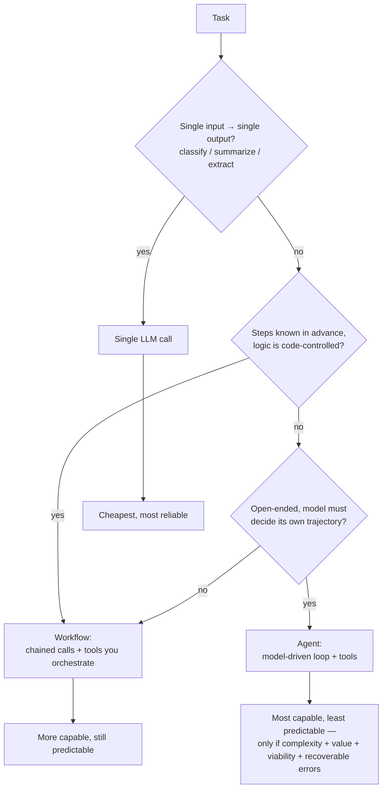

> ⚠️ **Common Pitfall:** Building an autonomous agent for a task that is really a fixed 3-step workflow. You inherit all the agent's failure modes (loops, runaway cost, non-determinism) for none of the benefit. Use the four-question gate — **complexity, value, viability, cost-of-error** — before choosing the agent tier.

**Why it matters for AI/ML:** Recognizing which job you're doing keeps you from over-engineering. Most "AI features" in products are single calls or thin workflows with good retrieval, not agents.

---

## 2. RAG End to End

> 💡 **Intuition:** An LLM is a brilliant intern with no access to your files and a fuzzy memory of the internet up to its training cutoff. **RAG** hands it the right page from your filing cabinet *just before* it answers, so it reasons over facts instead of recalling them.

**Formal definition.** Given a user query $q$ and a corpus of documents $\mathcal{C}$, RAG produces an answer
$$
a = \text{LLM}\big(\text{prompt}(q,\; \text{Retrieve}_k(q, \mathcal{C}))\big)
$$
where $\text{Retrieve}_k$ returns the top-$k$ most relevant chunks. The whole game is making $\text{Retrieve}_k$ return chunks that are **relevant** (high precision) and **sufficient** (high recall), then making the prompt force the model to *ground* its answer in them.

### 2.1 The full pipeline

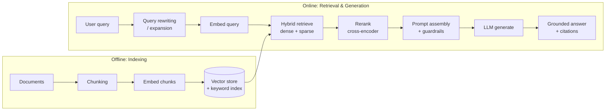

### 2.2 Chunking strategies & trade-offs

> 💡 **Intuition:** A chunk is the unit of retrieval. Too big and you dilute the relevant sentence with noise (and waste context tokens); too small and you lose the surrounding meaning a sentence needs to be useful.

| Strategy | How | Pros | Cons | Use when |
|---|---|---|---|---|
| **Fixed-size** (e.g. 512 tokens) | Cut every $N$ tokens | Simple, predictable | Splits sentences/ideas mid-thought | Quick baseline |
| **Fixed-size + overlap** | $N$ tokens, stride $N-o$ | Recovers boundary context | Duplicated tokens → storage/cost | Default starting point |
| **Recursive / structural** | Split on `\n\n` → `\n` → sentence → token | Respects document structure | Variable chunk sizes | Markdown, code, articles |
| **Semantic** | Split where embedding similarity between adjacent sentences drops | Chunks = coherent ideas | Compute-heavy to build | High-value corpora |
| **Document-/section-aware** | Use headings, page boundaries | Preserves logical units | Needs structured source | Manuals, contracts, wikis |
| **Late chunking** | Embed the whole doc, then pool per-chunk vectors | Each chunk vector "knows" full-doc context | Needs long-context embedder | Long docs, high recall |

**Worked example — overlap arithmetic.** A 2,300-token document, chunk size $N=512$, overlap $o=64$. Stride $s = N - o = 448$. Number of chunks:

$$
\#\text{chunks} = \left\lceil \frac{\text{len} - o}{s} \right\rceil = \left\lceil \frac{2300 - 64}{448} \right\rceil = \left\lceil 4.99 \right\rceil = 5
$$

Token positions covered: chunk 0 = [0, 512), chunk 1 = [448, 960), chunk 2 = [896, 1408), … each overlapping its neighbor by 64 tokens so a fact straddling a boundary appears whole in at least one chunk.

```python
# Recursive-ish chunker with overlap. Pure stdlib; runnable on Python 3.11+.
def chunk_text(text: str, chunk_size: int = 512, overlap: int = 64) -> list[str]:
    """Split on the largest structural unit that fits, falling back to a sliding
    window. `chunk_size`/`overlap` are in *words* here for a dependency-free demo;
    in production use a real tokenizer (e.g. messages.count_tokens) for token counts."""
    words = text.split()
    if len(words) <= chunk_size:
        return [text]
    stride = chunk_size - overlap
    chunks = []
    for start in range(0, len(words), stride):
        window = words[start:start + chunk_size]
        if not window:
            break
        chunks.append(" ".join(window))
        if start + chunk_size >= len(words):
            break
    return chunks

doc = " ".join(f"word{i}" for i in range(2300))
out = chunk_text(doc, chunk_size=512, overlap=64)
print(len(out))                    # 5
print(out[0].split()[:3])          # ['word0', 'word1', 'word2']
print(out[1].split()[0])           # 'word448'  (stride = 512 - 64)
```

> ⚠️ **Common Pitfall:** Picking chunk size by feel and never measuring. Chunk size is a *hyperparameter* — sweep it (e.g. 256 / 512 / 1024) against your retrieval eval (Section 3) and pick the value that maximizes context recall at acceptable cost. There is no universal best.

### 2.3 Embedding model choice

The embedder maps text → a vector $\mathbf{v} \in \mathbb{R}^d$ such that semantically similar texts have high cosine similarity:

$$
\text{cos}(\mathbf{u}, \mathbf{v}) = \frac{\mathbf{u} \cdot \mathbf{v}}{\lVert \mathbf{u}\rVert\, \lVert \mathbf{v}\rVert}
$$

Selection criteria, in priority order:

1. **Retrieval quality on *your* data** — run a benchmark on your own queries; public leaderboards (MTEB) are a starting filter, not the answer.
2. **Dimensionality $d$** — bigger isn't always better; it costs storage and search time. Many modern embedders support **Matryoshka** truncation (use the first $d' < d$ dims with graceful quality loss).
3. **Max sequence length** — must comfortably exceed your chunk size.
4. **Domain match** — code, legal, biomedical, multilingual all benefit from domain-tuned embedders.
5. **Self-hosted vs API** — latency, cost, data residency, and the ability to fine-tune.
6. **Asymmetric vs symmetric** — some models want a query-vs-document prefix (e.g. `"query: ..."` / `"passage: ..."`); using them wrong silently tanks recall.

> 📝 **Tip:** Whatever you choose, **embed queries and documents with the same model and the same normalization**. A mismatch is one of the most common silent RAG bugs.

### 2.4 Vector stores

| Store | Shape | Best for |
|---|---|---|
| In-memory (numpy, FAISS flat) | Brute-force exact | < ~100k vectors, prototyping |
| FAISS / ScaNN (IVF, HNSW) | ANN index | Millions of vectors, self-hosted |
| pgvector | Postgres extension | You already run Postgres; want SQL + vectors |
| Managed (Pinecone, Weaviate, Qdrant, Milvus) | Hosted ANN | Scale, filtering, hybrid built in |

The key algorithmic trade-off is **exact** vs **approximate nearest neighbor (ANN)**. Exact search is $O(N d)$ per query; ANN (e.g. **HNSW** — Hierarchical Navigable Small World graphs) is roughly $O(d \log N)$ at the cost of occasionally missing a true neighbor (controlled by `ef_search`/`nprobe`).

### 2.5 Dense vs sparse vs hybrid retrieval

> 💡 **Intuition:** Dense (embedding) retrieval understands *meaning* ("car" ≈ "automobile") but can miss exact tokens. Sparse (keyword/BM25) retrieval nails exact tokens (product codes, names, acronyms) but doesn't understand synonyms. **Hybrid** takes both.

**Sparse — BM25.** For query terms $t \in q$ and document $D$:

$$
\text{BM25}(q, D) = \sum_{t \in q} \text{IDF}(t)\cdot \frac{f(t, D)\,(k_1 + 1)}{f(t, D) + k_1\big(1 - b + b\,\frac{|D|}{\text{avgdl}}\big)}
$$

where $f(t,D)$ is term frequency, $|D|$ is document length, $\text{avgdl}$ is average document length, and $k_1 \approx 1.2$, $b \approx 0.75$ are tuning constants. $\text{IDF}(t)$ rewards rare terms.

**Dense.** Score = $\text{cos}(\text{embed}(q), \text{embed}(D))$.

**Hybrid fusion — Reciprocal Rank Fusion (RRF).** Combine two ranked lists by rank, not raw score (which avoids the score-scale mismatch problem):

$$
\text{RRF}(d) = \sum_{r \in \text{rankers}} \frac{1}{k + \text{rank}_r(d)}, \qquad k \approx 60
$$

**Worked example.** Document $d$ is ranked **2nd** by BM25 and **5th** by the dense retriever, $k=60$:

$$
\text{RRF}(d) = \frac{1}{60 + 2} + \frac{1}{60 + 5} = \frac{1}{62} + \frac{1}{65} \approx 0.01613 + 0.01538 = 0.03151
$$

A document ranked 1st by both would score $\tfrac{1}{61} + \tfrac{1}{61} \approx 0.0328$ — slightly higher, so consensus near the top wins.

```python
# Reciprocal Rank Fusion. Runnable, stdlib only.
def rrf(rankings: list[list[str]], k: int = 60) -> list[tuple[str, float]]:
    """rankings: list of ranked doc-id lists, best-first. Returns fused order."""
    scores: dict[str, float] = {}
    for ranking in rankings:
        for rank, doc_id in enumerate(ranking, start=1):  # 1-indexed
            scores[doc_id] = scores.get(doc_id, 0.0) + 1.0 / (k + rank)
    return sorted(scores.items(), key=lambda kv: kv[1], reverse=True)

bm25_order  = ["A", "d", "C"]          # d is 2nd
dense_order = ["B", "C", "E", "F", "d"] # d is 5th
fused = rrf([bm25_order, dense_order])
print(fused[0])                         # ('C', ...) — C is 3rd & 2nd, strong consensus
print(round(dict(fused)["d"], 5))       # 0.03151  (matches the hand calculation)
```

### 2.6 Reranking

The first-stage retriever favors *recall* (cast a wide net, e.g. top-50). A **reranker** — typically a **cross-encoder** that reads `(query, chunk)` *together* — favors *precision*, re-scoring those 50 and keeping the top-5 for the prompt.

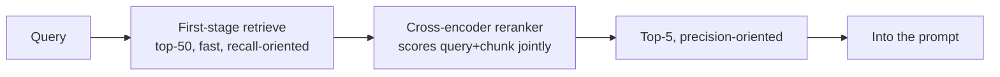

> 🎯 **Key Insight:** Bi-encoders (embedders) encode query and doc *separately* (fast, cacheable, scales to millions). Cross-encoders encode them *jointly* (accurate, but $O(\text{candidates})$ model calls). Use bi-encoder to *retrieve*, cross-encoder to *rerank*. Never cross-encode the whole corpus.

### 2.7 Query rewriting & expansion

The raw user query is often a poor search query. Techniques:

- **Rewriting:** turn a conversational follow-up ("and what about its pricing?") into a standalone query ("Acme Pro plan pricing") using the chat history.
- **Decomposition:** split a multi-hop question into sub-queries, retrieve for each.
- **HyDE (Hypothetical Document Embeddings):** ask the LLM to *write a fake ideal answer*, embed that, and retrieve with it — often closer in embedding space to real answer-bearing chunks than the question is.
- **Multi-query expansion:** generate $n$ paraphrases, retrieve for each, fuse with RRF.

> ⚠️ **Common Pitfall:** Query rewriting adds an LLM call to the critical path (latency + cost + a new failure mode). Measure whether it actually improves your retrieval eval before shipping it; for simple lookups it's often net-negative.

**Why RAG matters for AI/ML:** RAG is the dominant pattern for grounding LLMs in private, current, or domain-specific knowledge without retraining. Most enterprise "chat with your docs" and "AI search" products are RAG systems, and their quality is dominated by retrieval, not by the model.

---

## 3. RAG Evaluation: RAGAS-Style Metrics

> 💡 **Intuition:** "It looks good" doesn't scale. You need numbers that separate two failure modes: **bad retrieval** (the right context wasn't fetched) and **bad generation** (the right context was fetched but the model ignored or contradicted it).

We decompose RAG quality into four reference-light metrics. Let $q$ = question, $C$ = retrieved contexts, $a$ = generated answer, and (where available) $g$ = ground-truth answer.

### 3.1 Faithfulness (groundedness)

Does the answer stay within what the context supports? Break the answer into atomic claims $\{c_1, \dots, c_n\}$; a claim is *supported* if it can be inferred from $C$.

$$
\text{Faithfulness} = \frac{\big|\{\,c_i : c_i \text{ is supported by } C\,\}\big|}{n}
$$

A value of $1.0$ means every claim is grounded; low faithfulness ⇒ **hallucination**.

### 3.2 Answer relevance

Does the answer actually address the question (no padding, no dodging)? Generate $m$ synthetic questions $\{q_1', \dots, q_m'\}$ that the answer *would* be a good response to, embed them, and compare to the original $q$:

$$
\text{AnswerRelevance} = \frac{1}{m}\sum_{j=1}^{m} \text{cos}\big(\text{embed}(q),\ \text{embed}(q_j')\big)
$$

### 3.3 Context precision & recall

**Context precision** — of the retrieved chunks, how many are actually relevant (and are the relevant ones ranked high)? With relevance labels $\text{rel}_k \in \{0,1\}$ over the top-$K$ chunks:

$$
\text{ContextPrecision@K} = \frac{\sum_{k=1}^{K}\big(\text{Precision@}k \cdot \text{rel}_k\big)}{\sum_{k=1}^{K}\text{rel}_k}, \qquad \text{Precision@}k = \frac{\sum_{i=1}^{k}\text{rel}_i}{k}
$$

**Context recall** — of the facts needed to answer (from ground truth $g$), how many are covered by $C$?

$$
\text{ContextRecall} = \frac{\big|\{\text{ground-truth claims present in } C\}\big|}{\big|\{\text{ground-truth claims}\}\big|}
$$

**Worked example — Context Precision@4.** Retrieved relevance over 4 chunks: $[\,1, 0, 1, 1\,]$.

- $\text{Precision@1} = 1/1 = 1.0$, $\text{rel}_1 = 1$ → contributes $1.0$
- $\text{Precision@2} = 1/2 = 0.5$, $\text{rel}_2 = 0$ → contributes $0$
- $\text{Precision@3} = 2/3 \approx 0.667$, $\text{rel}_3 = 1$ → contributes $0.667$
- $\text{Precision@4} = 3/4 = 0.75$, $\text{rel}_4 = 1$ → contributes $0.75$

$$
\text{ContextPrecision@4} = \frac{1.0 + 0 + 0.667 + 0.75}{1 + 0 + 1 + 1} = \frac{2.417}{3} \approx 0.806
$$

```python
# Context Precision@K from a relevance list. Runnable, stdlib only.
def context_precision(rel: list[int]) -> float:
    num = 0.0
    hits = 0
    for k, r in enumerate(rel, start=1):
        if r:
            hits += 1
            precision_at_k = sum(rel[:k]) / k
            num += precision_at_k * r
    total_rel = sum(rel)
    return num / total_rel if total_rel else 0.0

print(round(context_precision([1, 0, 1, 1]), 3))  # 0.806
print(round(context_precision([1, 1, 0, 0]), 3))  # 1.0  (all relevant ranked first)
print(round(context_precision([0, 0, 1, 1]), 3))  # 0.583 (relevant ranked low → penalized)
```

### 3.4 Putting it together

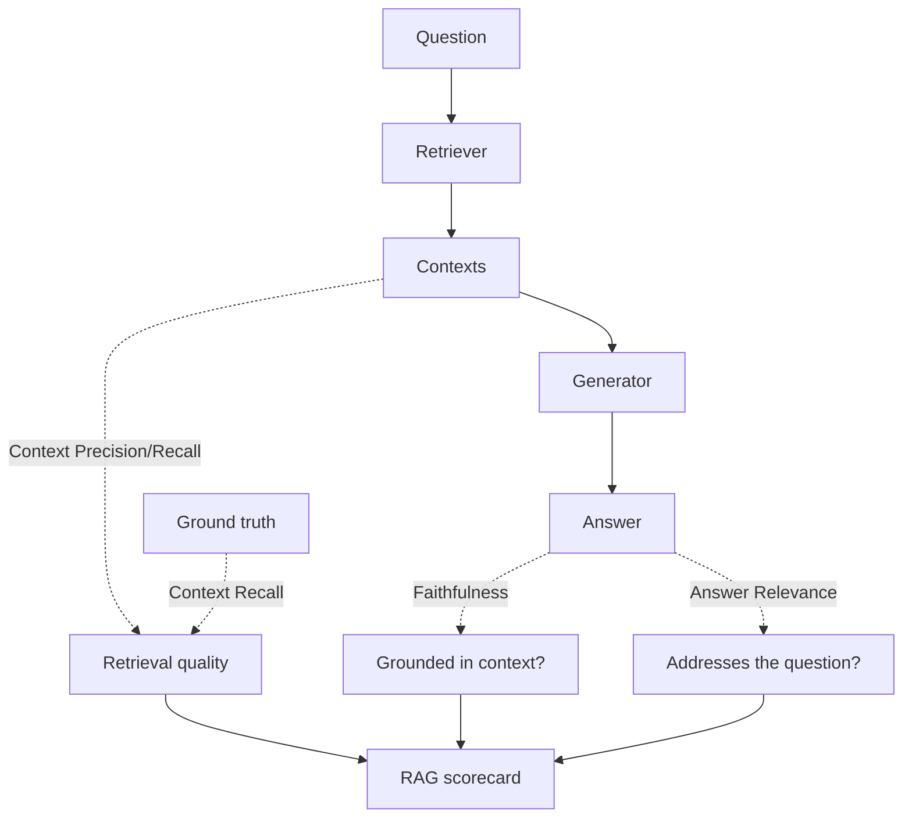

> 🎯 **Key Insight:** Read the metrics as a *diagnosis*, not a single grade. Low **context recall** → fix retrieval (chunking, embedder, $k$, hybrid). High recall but low **faithfulness** → fix generation (prompt grounding, model, reranking to cut noise). High faithfulness but low **answer relevance** → the model is grounded but evasive — tighten the prompt.

> ⚠️ **Common Pitfall:** Using an LLM as the judge for these metrics (the standard RAGAS approach) and forgetting that the **judge is itself a noisy, biased model**. Calibrate it against a small human-labeled set, pin the judge model and prompt version, and watch for the LLM-judge's known biases (length, position, self-preference).

**Why eval matters for AI/ML:** Without these metrics you cannot safely change *anything* — swapping a chunker or model becomes a vibes-based gamble. An automated eval harness is the regression test suite of an AI system.

---

## 4. Agents: ReAct, Planning, Reflection, Memory

> 💡 **Intuition:** An agent is an LLM put in a loop with tools and a goal. Each turn it *thinks*, optionally *acts* (calls a tool), *observes* the result, and repeats until it decides it's done. The model — not your code — chooses the next step.

### 4.1 The ReAct loop

**ReAct** = **Rea**soning + **Act**ing. The model interleaves a `Thought` (free-form reasoning), an `Action` (tool call), and reads back an `Observation`:

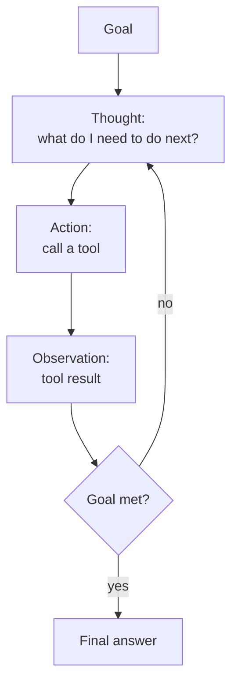

```python
# A minimal ReAct loop against the Anthropic SDK. Requires: pip install anthropic
# Default model is Opus 4.8; adaptive thinking is on; the SDK runs the tool loop.
import anthropic
from anthropic import beta_tool

client = anthropic.Anthropic()

@beta_tool
def get_order_status(order_id: str) -> str:
    """Look up the shipping status of an order.

    Args:
        order_id: The order identifier, e.g. "A-1001".
    """
    fake_db = {"A-1001": "shipped", "A-1002": "processing"}
    return fake_db.get(order_id, "not found")

# The tool runner drives the Thought→Action→Observation loop for you.
runner = client.beta.messages.tool_runner(
    model="claude-opus-4-8",
    max_tokens=1024,
    tools=[get_order_status],
    messages=[{"role": "user", "content": "Where is order A-1001?"}],
)
for message in runner:
    for block in message.content:
        if block.type == "text":
            print(block.text)
# Expected (abridged): the model calls get_order_status("A-1001"),
# observes "shipped", then answers: "Order A-1001 has shipped."
```

> 📝 **Tip:** In the Anthropic SDK you rarely hand-write the loop — `tool_runner` does it. Reach for the **manual agentic loop** only when you need human-in-the-loop approval, custom logging, or conditional execution between steps.

### 4.2 Planning

For long-horizon tasks, a flat ReAct loop wanders. **Planning** has the model first produce an explicit plan (a list of sub-goals), then execute it, optionally re-planning when reality diverges.

- **Plan-and-execute:** generate the full plan up front, then run steps. Cheaper, less adaptive.
- **ReWOO (Reasoning WithOut Observation):** plan all tool calls, run them, then synthesize — decouples planning from tool latency.
- **Tree-of-Thoughts / search:** explore multiple branches and prune. Powerful, expensive.

> 📝 **Tip:** On modern long-horizon models the most effective "planning" lever is often just giving the **full task spec up front in one well-specified turn** and running at high effort, rather than building elaborate planner scaffolding. Test the simple version first.

### 4.3 Reflection

**Reflection** adds a self-critique step: the agent (or a separate critic agent) evaluates its own output against the goal and revises. This is the iterate → grade → revise loop and it materially improves quality on tasks with checkable success criteria.

$$
\text{output}_{t+1} = \text{Agent}\big(\text{output}_t,\ \text{Critique}(\text{output}_t,\ \text{goal})\big)
$$

> ⚠️ **Common Pitfall:** Unbounded reflection loops. Always cap iterations (`max_iterations`) and define a terminal condition — "satisfied", "max iterations reached", or "no further improvement" — or the agent will polish forever and burn your budget.

### 4.4 Memory: short-term vs long-term

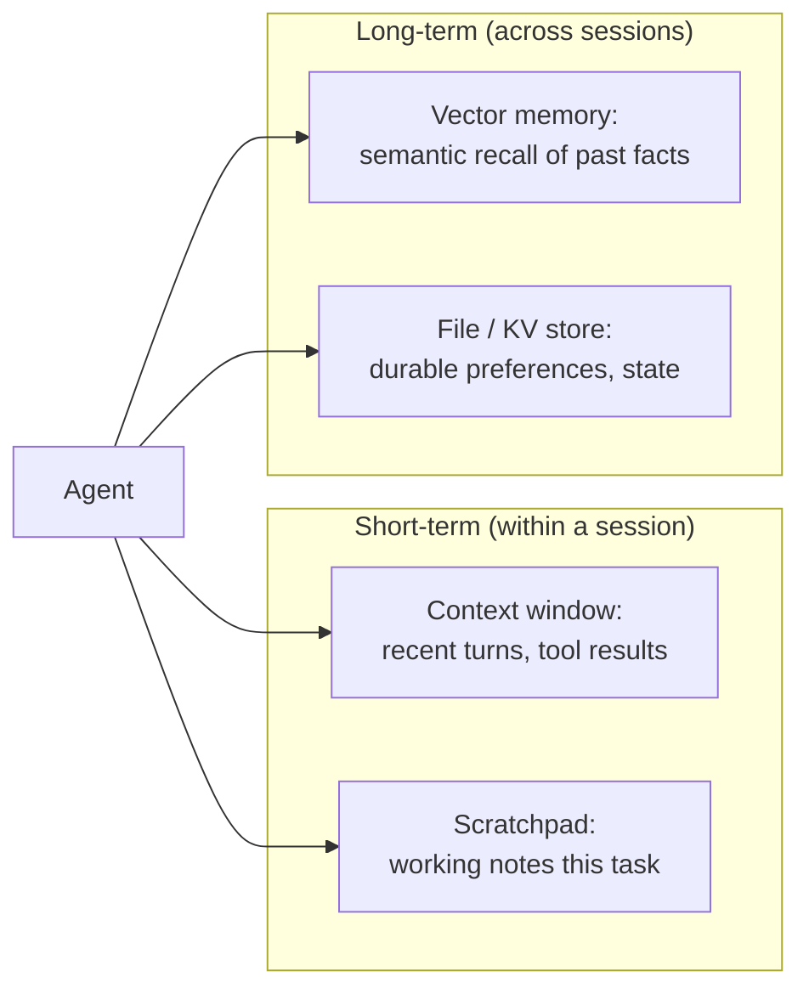

| Memory | Lifetime | Mechanism | Failure mode |
|---|---|---|---|
| **Short-term** | One session | The context window itself; compaction when it fills | Context overflow → must compact/clear |
| **Working / scratchpad** | One task | A notes file the agent reads/writes | Stale notes if not pruned |
| **Long-term episodic** | Forever | Vector store of past interactions, retrieved like RAG | Retrieving irrelevant old memories |
| **Long-term semantic** | Forever | Curated facts / KV store | Drift between memory and source of truth |

> 🎯 **Key Insight:** Long-term agent memory *is* a RAG system pointed at the agent's own history. Everything from Section 2 (chunking, embedding, retrieval quality) applies to it.

**Context management for long runs.** Three distinct tools, often used together:
- **Context editing** — *prune* stale tool results / thinking blocks within a session.
- **Compaction** — *summarize* earlier history when nearing the context limit.
- **Memory** — *persist* state across sessions (files / stores).

**Why agents matter for AI/ML:** Agents unlock tasks that can't be fully specified in advance (open-ended research, multi-step coding, complex workflows). They are also the riskiest tier — non-deterministic, harder to evaluate, and capable of runaway cost — so the operational discipline in the rest of this module matters most here.

---

## 5. Multi-Agent Orchestration

> 💡 **Intuition:** When one agent's context and toolset get unwieldy, split the work across specialists — a coordinator that delegates, and sub-agents that each own a narrow job (researcher, coder, reviewer). It's microservices for cognition.

### 5.1 Topologies

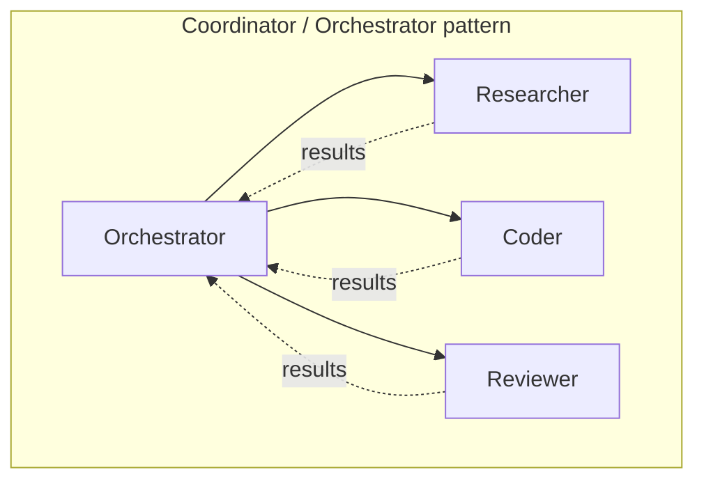

Common shapes: **orchestrator-worker** (a coordinator fans work out and merges results), **sequential pipeline** (agent A's output is agent B's input), **debate/critic** (agents argue or review each other), and **hierarchical** (coordinators of coordinators — usually one level deep in practice).

### 5.2 Frameworks (concepts, not endorsements)

| Framework | Mental model | Strength | When |
|---|---|---|---|
| **LangGraph** | Agents as a **state graph** (nodes = steps, edges = transitions) | Explicit control flow, cycles, checkpoints, human-in-the-loop | You want deterministic, inspectable orchestration |
| **CrewAI** | A **crew** of role-playing agents with tasks | Fast to express "team of personas" | Role-based collaboration, quick prototypes |
| **AutoGen** | **Conversable agents** that message each other | Flexible multi-agent chat, code execution | Research, dynamic agent conversations |

> 🎯 **Key Insight:** All three are *orchestration layers* over the same primitive: an LLM that calls tools in a loop. The framework's value is the control flow, state management, and observability it gives you — not new model capability.

### 5.3 When is multi-agent worth it?

Multi-agent adds latency (round trips), cost (more tokens, often duplicated context), and a whole class of new failure modes (agents talking past each other, infinite delegation). It pays off when:

- The task genuinely **fans out** into independent parallel sub-tasks.
- Sub-tasks need **different tools, prompts, or models** (e.g. a cheap model for triage, an expensive one for synthesis).
- You need **context isolation** — keeping a noisy sub-task's transcript out of the main reasoning thread.

> ⚠️ **Common Pitfall:** Reaching for multi-agent because it's exciting. A single well-prompted agent with good tools beats a sprawling agent swarm on most tasks, with far less latency and cost. Start single; split only when you can name the specific fan-out or isolation benefit.

**Why it matters for AI/ML:** Multi-agent systems are how teams scale agents to large, decomposable problems — but the discipline is knowing when *not* to, because the operational and cost overhead is real.

---

## 6. Prompt Engineering Mastery

> 💡 **Intuition:** The prompt is the program. Prompt engineering is writing that program precisely, with the same rigor (versioning, testing, review) you'd apply to code.

### 6.1 Core techniques

| Technique | What | When |
|---|---|---|
| **Zero-shot** | Just instructions, no examples | Capable models, clear tasks |
| **Few-shot** | A handful of input→output examples | Format-sensitive tasks, edge cases |
| **Chain-of-Thought (CoT)** | "Think step by step" before answering | Multi-step reasoning, math, logic |
| **Self-consistency** | Sample $n$ CoT paths, take the majority answer | High-stakes reasoning; trades cost for accuracy |
| **Structured output** | Constrain to a JSON schema | Anything a downstream system parses |
| **Role / system prompt** | Set persona, constraints, tone | Every production prompt |

**Self-consistency, formally.** Draw $n$ independent reasoning chains, extract each final answer $a_i$, and take the mode:

$$
\hat{a} = \arg\max_{a} \sum_{i=1}^{n} \mathbb{1}[a_i = a]
$$

```python
# Self-consistency over n samples, majority vote. Requires: pip install anthropic
import anthropic
from collections import Counter

client = anthropic.Anthropic()
QUESTION = "A bat and ball cost $1.10. The bat costs $1.00 more than the ball. How much is the ball? Answer with just a number in dollars."

def one_sample() -> str:
    # Adaptive thinking encourages a fresh reasoning path each call.
    resp = client.messages.create(
        model="claude-opus-4-8",
        max_tokens=1024,
        thinking={"type": "adaptive"},
        messages=[{"role": "user", "content": QUESTION}],
    )
    return next(b.text for b in resp.content if b.type == "text").strip()

answers = [one_sample() for _ in range(5)]
majority, count = Counter(answers).most_common(1)[0]
print(f"Majority answer: {majority}  ({count}/5 agree)")
# Expected: majority converges on "$0.05" (the classic trap answer is $0.10).
```

> 📝 **Tip:** On models with built-in adaptive thinking you often get CoT-quality reasoning *for free* without a "think step by step" instruction — the model decides when to reason. Self-consistency still helps on genuinely ambiguous problems where one sample can land wrong.

### 6.2 Structured outputs

For anything a program will parse, **constrain the format** rather than parsing prose. Use the API's structured-output support (a JSON schema) or strict tool use — it guarantees valid, parseable output.

```python
# Guaranteed-valid JSON via structured outputs (Pydantic). Requires: pip install anthropic pydantic
import anthropic
from pydantic import BaseModel

class Ticket(BaseModel):
    category: str
    priority: str          # "low" | "medium" | "high"
    summary: str

client = anthropic.Anthropic()
resp = client.messages.parse(
    model="claude-opus-4-8",
    max_tokens=1024,
    messages=[{"role": "user", "content":
        "Classify this support ticket: 'Production is down, customers can't log in!'"}],
    output_format=Ticket,
)
t = resp.parsed_output            # a validated Ticket instance
print(t.category, t.priority)     # e.g. "outage high"
```

### 6.3 Prompt templates & guardrails

- **Templates:** parameterize the stable parts; inject variables at the *end* so the prefix stays cacheable (see Section 10.3).
- **Guardrails:** input validation (block prompt injection, PII), output validation (schema check, profanity/PII filter, faithfulness check), and a refusal path for out-of-scope requests.
- **Delimiters & structure:** wrap untrusted content (retrieved docs, user input) in clear delimiters and tell the model that everything inside is *data, not instructions*.

> ⚠️ **Common Pitfall:** "CRITICAL: YOU MUST ALWAYS..." prompts. Modern models follow instructions closely; aggressive all-caps imperatives cause *over-triggering* (the model uses a tool or behavior when it shouldn't). State the condition plainly: "Use the search tool when the answer depends on current information."

**Why it matters for AI/ML:** Prompt quality is frequently the single biggest lever on output quality — cheaper and faster to iterate than fine-tuning. Treating prompts as versioned, tested artifacts (Section 10.2) is what separates a demo from a product.

---

## 7. MLOps Fundamentals

> 💡 **Intuition:** MLOps is DevOps with two extra moving parts that code doesn't have: **data** and **models**, both of which drift and both of which need versioning, testing, and rollback just like code.

### 7.1 The lifecycle

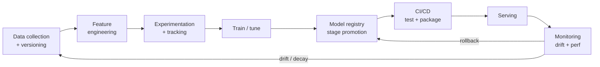

### 7.2 Experiment tracking

Every training/eval run is an experiment with inputs (data version, hyperparameters, code commit) and outputs (metrics, artifacts). **Track them** so runs are reproducible and comparable.

- **MLflow** — open-source, self-hostable; tracking + registry + projects + serving.
- **Weights & Biases (W&B)** — hosted, strong dashboards, sweeps, artifact lineage.

```python
# Experiment tracking with MLflow. Requires: pip install mlflow
import mlflow

mlflow.set_experiment("rag-chunking-sweep")
for chunk_size in (256, 512, 1024):
    with mlflow.start_run(run_name=f"chunk_{chunk_size}"):
        mlflow.log_param("chunk_size", chunk_size)
        mlflow.log_param("embedder", "text-embedding-v3")
        # ... run your retrieval eval (Section 3) ...
        context_recall = {256: 0.71, 512: 0.83, 1024: 0.79}[chunk_size]  # demo values
        mlflow.log_metric("context_recall", context_recall)
# In the MLflow UI you can now sort runs by context_recall and pick chunk_size=512.
```

### 7.3 Model & data versioning

> 🎯 **Key Insight:** A model is a *function of its training data + code + config*. To reproduce or roll back a model you must version **all three**. Versioning only the weights is like committing a binary with no source.

- **Data versioning:** DVC, lakeFS, Delta Lake, or dataset snapshots with content hashes. Pin the exact data a model saw.
- **Model versioning:** the registry stores each model version with its lineage (which run, which data, which metrics).

### 7.4 Feature stores

A **feature store** is a central, versioned repository of computed features, solving two problems:

1. **Reuse** — compute "customer 30-day spend" once, serve it to many models.
2. **Train/serve skew** — guarantee the feature is computed *the same way* offline (training) and online (inference). Skew here is a top cause of "great in eval, broken in prod".

### 7.5 The model registry

The registry is the **source of truth** for which model is where. Each version moves through stages — `None` → `Staging` → `Production` → `Archived` — with promotion gated by tests/eval. Serving reads from the registry, so promoting a new `Production` version (or rolling back) is a metadata change, not a redeploy.

### 7.6 CI/CD for ML

CI/CD for ML extends code CI/CD with **data tests** and **model tests**:

- **CI:** lint/test code **+** validate data schema/quality **+** run a small eval (the harness from Section 3) as a gate.
- **CD:** package the model + dependencies, deploy behind a safe rollout pattern (Section 8), register the new version.

> ⚠️ **Common Pitfall:** Treating the eval set as immutable forever. As the production distribution drifts, a frozen eval set silently stops representing reality. Refresh it from production samples on a cadence (with labels), and version each refresh.

**Why MLOps matters for AI/ML:** It's the difference between a notebook that worked once and a system you can change confidently for years. Reproducibility, versioning, and gated rollout are what make iteration *safe*.

---

## 8. Serving Patterns & Safe Rollout

> 💡 **Intuition:** *How* you serve predictions and *how* you roll out a new model are separate decisions. Get the serving shape right for your latency needs; get the rollout right so a bad model can't take down production.

### 8.1 Serving patterns

| Pattern | Shape | Latency | Use when |
|---|---|---|---|
| **Online (real-time)** | Synchronous request → prediction | ms–s, latency-critical | Chat, fraud checks, ranking |
| **Batch** | Score a large dataset on a schedule | minutes–hours | Nightly scoring, embeddings backfill, reports |
| **Streaming** | React to an event stream | near-real-time | Clickstream features, anomaly detection |

For LLMs specifically, the **Batch API** processes large request sets asynchronously at ~50% cost — ideal for offline eval, bulk classification, or embedding generation where latency doesn't matter.

### 8.2 Safe rollout strategies

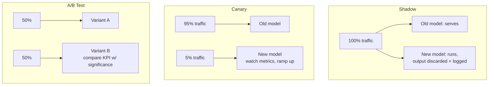

| Strategy | Risk to users | Question it answers | Cost |
|---|---|---|---|
| **Shadow** | None (output discarded) | "Does the new model behave/scale OK on real traffic?" | Runs both models (2× inference) |
| **Canary** | Limited (small %) | "Is it safe to ramp to 100%?" | Low; gradual |
| **A/B test** | Both variants live | "Which variant moves the KPI?" (causal) | Needs traffic + stats |
| **Blue/green** | Instant cutover, instant rollback | "Can I switch all traffic and revert fast?" | Two full environments |

### 8.3 Autoscaling

Scale replicas on the right signal: requests/sec or queue depth for throughput-bound services; GPU utilization or token throughput for LLM serving. Account for **cold starts** (loading a multi-GB model takes time) — keep a warm floor of replicas, or you'll trade cost for ugly p99 latency spikes.

> 🎯 **Key Insight:** Shadow tests *safety and scale*, canary tests *operational risk*, A/B tests *business impact*. They answer different questions — a mature pipeline often uses all three in sequence: shadow → canary → A/B.

**Why it matters for AI/ML:** Models fail in ways tests can't fully predict (the production distribution is unseen). Safe rollout turns "deploy and pray" into "deploy, observe a tiny blast radius, and ramp or revert on evidence."

---

## 9. Monitoring: Drift & Decay

> 💡 **Intuition:** A model trained on the past is a snapshot. The world keeps moving. Monitoring is how you notice the snapshot has gone stale *before* your users do.

### 9.1 Three things that drift

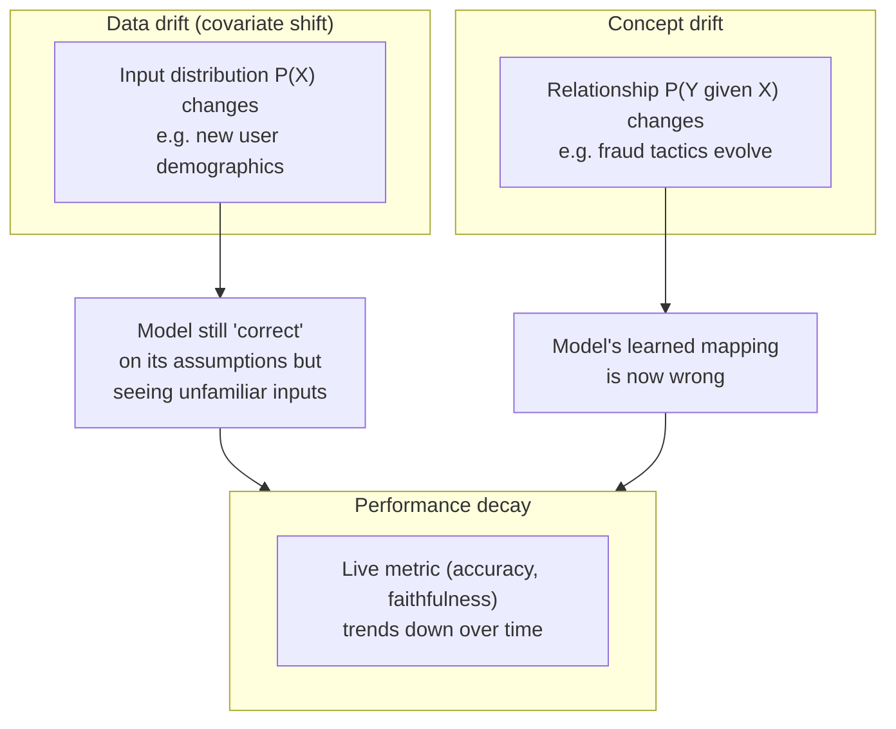

- **Data drift (covariate shift):** $P(X)$ changes, $P(Y\mid X)$ stable. The inputs look different (new slang, new product categories). The model isn't *wrong* yet but is operating off-distribution.
- **Concept drift:** $P(Y\mid X)$ changes. The true input→output relationship shifted (fraud patterns, user intent, market conditions). The model's mapping is now stale even if inputs look the same.
- **Performance decay:** the observable consequence — a downward trend in your live quality metric.

### 9.2 Detecting drift

For a feature distribution, compare a reference window to a recent window.

**Population Stability Index (PSI)** over $B$ bins, with reference proportions $a_i$ and actual proportions $b_i$:

$$
\text{PSI} = \sum_{i=1}^{B} (b_i - a_i)\,\ln\!\frac{b_i}{a_i}
$$

Rule of thumb: $\text{PSI} < 0.1$ = stable; $0.1$–$0.25$ = moderate shift (investigate); $> 0.25$ = significant shift (act).

**Worked example.** Reference $a = [0.5, 0.3, 0.2]$, recent $b = [0.4, 0.35, 0.25]$:

$$
\text{PSI} = (0.4-0.5)\ln\tfrac{0.4}{0.5} + (0.35-0.3)\ln\tfrac{0.35}{0.3} + (0.25-0.2)\ln\tfrac{0.25}{0.2}
$$
$$
= (-0.1)(-0.2231) + (0.05)(0.1542) + (0.05)(0.2231) = 0.02231 + 0.00771 + 0.01116 \approx 0.0412
$$

PSI ≈ 0.041 < 0.1 → stable, no action.

```python
# PSI drift detector. Requires: pip install numpy
import numpy as np

def psi(reference: np.ndarray, recent: np.ndarray, bins: int = 10, eps: float = 1e-6) -> float:
    """Population Stability Index between two 1-D samples."""
    edges = np.histogram_bin_edges(reference, bins=bins)
    a, _ = np.histogram(reference, bins=edges)
    b, _ = np.histogram(recent, bins=edges)
    a = a / a.sum() + eps          # avoid log(0) / div-by-zero
    b = b / b.sum() + eps
    return float(np.sum((b - a) * np.log(b / a)))

rng = np.random.default_rng(0)
ref = rng.normal(0, 1, 10_000)
same = rng.normal(0, 1, 10_000)
shifted = rng.normal(0.6, 1.2, 10_000)
print(round(psi(ref, same), 3))     # ~0.00x  → stable
print(round(psi(ref, shifted), 3))  # > 0.25  → significant drift, alert
```

Other detectors: **KL divergence** / **Jensen-Shannon** for distributions, **Kolmogorov-Smirnov** test for continuous features, embedding-space distance for unstructured text/images.

### 9.3 Alerting that fires on the right signal

- Alert on **trends and thresholds**, not single noisy points (use windows + smoothing).
- Distinguish **drift detected** (leading indicator) from **performance dropped** (lagging, needs labels).
- For LLM systems where ground-truth labels are delayed or absent, monitor **proxy signals**: faithfulness score on a sampled eval, refusal rate, output length distribution, tool-error rate, user thumbs-down rate.

> ⚠️ **Common Pitfall:** Alert fatigue. An alert that fires daily and is ignored is worse than no alert. Tune thresholds against historical data, route by severity, and attach a runbook to every alert.

**Why monitoring matters for AI/ML:** It closes the loop. Drift detection triggers retraining or eval-set refresh (Section 7); a performance-decay alert triggers rollback (Section 8). Without monitoring, the lifecycle has no feedback.

---

## 10. LLMOps Specifics

> 💡 **Intuition:** LLMOps is MLOps for systems where the "model" is an API you don't train, the "code" is partly natural-language prompts, the cost is per-token, and the failure modes include hallucination, prompt injection, and PII leakage.

### 10.1 Eval pipelines

Run your RAGAS-style eval (Section 3) plus task-specific checks as an automated suite on every change — prompt edit, model swap, retrieval tweak. Components:

- A **golden dataset** of representative inputs (+ labels where possible).
- A set of **scorers**: exact match, embedding similarity, LLM-as-judge (calibrated), and the RAG metrics.
- A **gate** in CI: block the change if a key metric regresses beyond tolerance.

### 10.2 Prompt versioning

Treat prompts like code: store them in version control (or a prompt registry), assign each a version, and tie eval results to a prompt version. When output quality changes, you can answer "which prompt version is live, and what did its eval scores look like?"

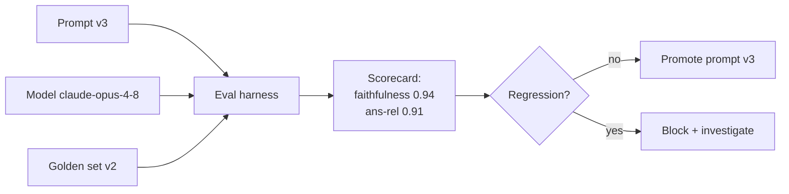

### 10.3 Cost / latency optimization & caching

**Cost model.** For a request: $C = n_{\text{in}} \cdot p_{\text{in}} + n_{\text{out}} \cdot p_{\text{out}}$, where $n$ are token counts and $p$ are per-token prices (output is typically several× input). Levers:

- **Right-size the model** — use a small/fast model for triage/classification, a large one only where intelligence is needed.
- **Prompt caching** — cache the large stable prefix (system prompt, retrieved docs, few-shot examples); cached reads cost ~0.1× and writes ~1.25×. **Caching is a prefix match — any byte change in the prefix invalidates everything after it**, so put volatile content (the user's question, timestamps) *last*.
- **Batch API** — ~50% off for latency-tolerant work.
- **Cap `max_tokens`** sensibly and stream for long outputs.
- **Semantic caching** — for FAQ-style traffic, cache answers keyed by query embedding (return a cached answer when a new query is near-duplicate of a past one).

> ⚠️ **Common Pitfall:** A silent cache invalidator — `datetime.now()` or a request UUID interpolated into the *system prompt*. It sits at the front of the prefix and busts the cache on every request. Verify with `usage.cache_read_input_tokens`; if it's zero across identical-prefix requests, hunt the invalidator.

### 10.4 Observability & tracing

A single LLM "answer" is often a *chain*: rewrite → embed → retrieve → rerank → generate → parse → guardrail. **Tracing** records each step's inputs, outputs, latency, token counts, and cost as **spans** in a **trace**, so you can answer "why was this answer wrong/slow/expensive?" by inspecting the actual steps.

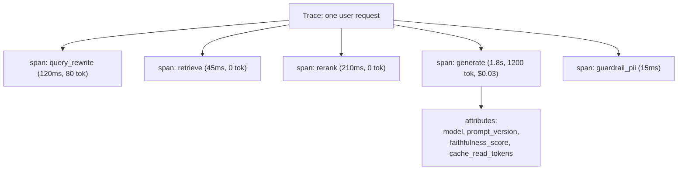

Tools: **OpenTelemetry**-based tracing, plus LLM-specific observability platforms (LangSmith, Langfuse, Phoenix, W&B Weave). The key is one **trace ID** threaded through the whole chain.

### 10.5 Safety & PII

- **Input side:** detect and redact PII before it hits the model or your logs; detect prompt-injection attempts in retrieved/user content.
- **Output side:** scan generations for PII, toxicity, and policy violations; run a faithfulness check for RAG answers.
- **Logging:** never log secrets or raw PII. Hash or redact before persistence — your traces are a data-exposure surface.

> 🎯 **Key Insight:** In LLMOps, your **traces and logs are themselves a sensitive dataset**. Treat redaction and retention as first-class, not an afterthought.

**Why LLMOps matters for AI/ML:** LLM systems are non-deterministic, token-priced, and safety-sensitive. Without eval pipelines, prompt versioning, tracing, and cost discipline, you can't change them safely or explain their behavior — and the bill (and the risk) compounds quietly.

---

## 11. Responsible AI

> 💡 **Intuition:** A system can be accurate *on average* and still be unfair, unsafe, or untrustworthy for specific people or inputs. Responsible AI is measuring and managing those harms deliberately.

### 11.1 Bias & fairness

Bias enters through data (unrepresentative samples), labels (annotator bias), and objectives (optimizing a proxy that correlates with a protected attribute). Measure it with group metrics, e.g. **demographic parity** (selection rates equal across groups $A$):

$$
\Big|\,P(\hat{Y}=1 \mid A=a) - P(\hat{Y}=1 \mid A=b)\,\Big| \le \epsilon
$$

and **equalized odds** (equal true-positive and false-positive rates across groups). These criteria can conflict — you generally cannot satisfy all fairness definitions at once, so choose the one that matches the harm you're preventing.

### 11.2 Evaluation beyond accuracy

Evaluate on **slices**, not just the aggregate: per-group, per-language, per-difficulty, and on adversarial/edge cases. An aggregate score of 95% can hide a 60% slice that matters.

### 11.3 Red-teaming

Proactively probe the system for failures *before* attackers/users do: prompt injection, jailbreaks, PII extraction, harmful-content generation, and tool-misuse. Treat findings like security bugs — track, reproduce, fix, and add a regression test (an entry in the eval suite).

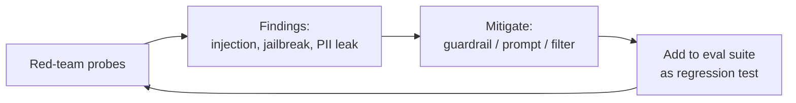

> ⚠️ **Common Pitfall:** Treating responsible AI as a one-time launch checklist. Bias and safety regress as data drifts and prompts change — bake the checks into the continuous eval pipeline (Section 10.1), not a pre-launch sign-off.

**Why it matters for AI/ML:** Beyond ethics and regulation, unfair or unsafe behavior is a *product and legal risk*. Slice evaluation and red-teaming are the engineering practices that turn "we tried to be responsible" into "we can show what we measured."

---

## 🧮 From-Scratch Implementation

A tiny but complete RAG core — chunk, embed (hashing trick, no external model), hybrid retrieve, and a RAGAS-style faithfulness check — in NumPy + stdlib. It runs as-is and shows every moving part without hiding behind a framework.

```python
# Minimal RAG core. Requires: pip install numpy
import numpy as np
import re
from collections import Counter

# --- 1. Chunking (sentence-grouped) ---
def chunk(text: str, max_words: int = 12) -> list[str]:
    sentences = re.split(r'(?<=[.!?])\s+', text.strip())
    chunks, cur = [], []
    for s in sentences:
        cur.append(s)
        if sum(len(c.split()) for c in cur) >= max_words:
            chunks.append(" ".join(cur)); cur = []
    if cur:
        chunks.append(" ".join(cur))
    return chunks

# --- 2. Embedding via the hashing trick (deterministic, dependency-free) ---
DIM = 256
def embed(text: str) -> np.ndarray:
    v = np.zeros(DIM)
    for tok in re.findall(r'\w+', text.lower()):
        v[hash(tok) % DIM] += 1.0
    norm = np.linalg.norm(v)
    return v / norm if norm else v

def cosine(a: np.ndarray, b: np.ndarray) -> float:
    return float(a @ b)  # already unit-normalized

# --- 3. Sparse score (term overlap, a BM25 stand-in) ---
def sparse_score(query: str, doc: str) -> float:
    q = Counter(re.findall(r'\w+', query.lower()))
    d = Counter(re.findall(r'\w+', doc.lower()))
    return sum(min(q[t], d[t]) for t in q)

# --- 4. Hybrid retrieve with RRF fusion ---
def retrieve(query: str, chunks: list[str], k: int = 2) -> list[str]:
    qv = embed(query)
    dense = sorted(range(len(chunks)), key=lambda i: cosine(qv, embed(chunks[i])), reverse=True)
    sparse = sorted(range(len(chunks)), key=lambda i: sparse_score(query, chunks[i]), reverse=True)
    rrf: dict[int, float] = {}
    for ranking in (dense, sparse):
        for rank, idx in enumerate(ranking, start=1):
            rrf[idx] = rrf.get(idx, 0.0) + 1.0 / (60 + rank)
    best = sorted(rrf, key=rrf.get, reverse=True)[:k]
    return [chunks[i] for i in best]

# --- 5. Faithfulness check: are answer tokens supported by context? ---
def faithfulness(answer: str, context: list[str]) -> float:
    ctx_tokens = set(re.findall(r'\w+', " ".join(context).lower()))
    ans_tokens = [t for t in re.findall(r'\w+', answer.lower()) if len(t) > 3]
    if not ans_tokens:
        return 1.0
    supported = sum(1 for t in ans_tokens if t in ctx_tokens)
    return supported / len(ans_tokens)

# --- Run it ---
KB = ("The Acme Pro plan costs 49 dollars per month. "
      "It includes priority support and unlimited projects. "
      "The free plan allows three projects and community support only. "
      "Enterprise pricing is custom and requires contacting sales.")
chunks = chunk(KB)
print(f"chunks: {len(chunks)}")

q = "How much is the Acme Pro plan and what support does it include?"
ctx = retrieve(q, chunks, k=2)
print("retrieved:", ctx)

grounded = "The Acme Pro plan costs 49 dollars and includes priority support."
hallucinated = "The Acme Pro plan costs 99 dollars and includes a free laptop."
print("faithful (grounded):    ", round(faithfulness(grounded, ctx), 2))     # ~1.0
print("faithful (hallucinated):", round(faithfulness(hallucinated, ctx), 2)) # lower
```

> 📝 **Tip:** The hashing trick replaces a learned embedder so the demo has zero model dependencies. In production, swap `embed()` for a real embedding model — the rest of the structure (chunk → embed → hybrid retrieve → faithfulness) is exactly what a production system does.

---

## 🏗️ Project Blueprint: A Production RAG Service

A reference architecture for a RAG service with an **eval harness**, **tracing**, and a **drift monitor** — the three things that turn a RAG demo into an operable product.

### Architecture

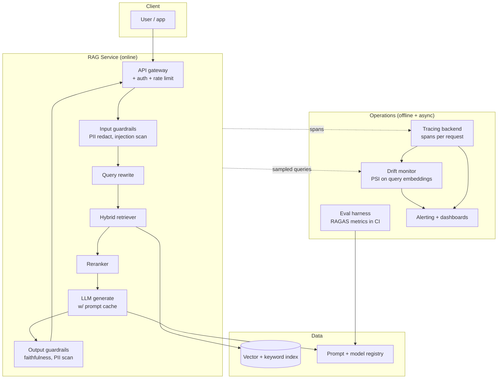

### Build order (and what each piece reuses)

1. **Indexing pipeline** — chunk (§2.2) → embed (§2.3) → store in a vector + keyword index (§2.4). Version the index and the embedder.
2. **Online path** — input guardrails (§6.3, §10.5) → optional query rewrite (§2.7) → hybrid retrieve (§2.5) → rerank (§2.6) → generate with prompt caching (§10.3) → output guardrails.
3. **Tracing** — wrap every stage in a span with a shared trace ID; record latency, tokens, cost, prompt version, and the per-answer faithfulness score (§10.4).
4. **Eval harness** — golden set + RAGAS scorers (§3) wired as a CI gate on every prompt/model/retrieval change (§10.1, §7.6). Log runs to MLflow/W&B (§7.2).
5. **Drift monitor** — compute PSI on the embedding distribution of sampled production queries vs a reference window (§9.2); alert on PSI > 0.25 and on a downward trend in sampled faithfulness.
6. **Safe rollout** — ship model/prompt changes via shadow → canary → A/B (§8.2), reading the live version from the registry (§7.5).

### Minimal eval-gate skeleton

```python
# CI eval gate: block a change if faithfulness regresses. Requires: pip install numpy
import numpy as np

GOLDEN = [  # (question, contexts, answer, expected_min_faithfulness)
    ("Pro plan price?", ["Acme Pro costs 49 dollars per month."],
     "The Acme Pro plan is 49 dollars per month.", 0.7),
    ("Free plan projects?", ["The free plan allows three projects."],
     "The free plan allows three projects.", 0.7),
]

def faithfulness(answer, context):
    import re
    ctx = set(re.findall(r'\w+', " ".join(context).lower()))
    toks = [t for t in re.findall(r'\w+', answer.lower()) if len(t) > 3]
    return sum(t in ctx for t in toks) / len(toks) if toks else 1.0

def run_eval_gate(threshold_avg=0.75) -> bool:
    scores = [faithfulness(a, c) for (_q, c, a, _m) in GOLDEN]
    avg = float(np.mean(scores))
    passed = avg >= threshold_avg and all(
        s >= m for s, (_q, _c, _a, m) in zip(scores, GOLDEN))
    print(f"avg faithfulness={avg:.2f} -> {'PASS' if passed else 'FAIL (block deploy)'}")
    return passed

run_eval_gate()   # avg faithfulness=1.00 -> PASS
```

> 🎯 **Key Insight:** The blueprint is just the module's sections wired into one loop: retrieve (§2) → evaluate (§3) → reason/act (§4–5) with good prompts (§6), versioned and rolled out safely (§7–8), monitored for drift (§9), traced and cost-controlled (§10), and checked for safety (§11). Build it once and every section becomes a component you can swap and re-evaluate.

---

## ❓ Knowledge Check

<details><summary>Show answer</summary> (Answers are inline under each question.)</details>

**1. You add 64-token overlap to 512-token chunks over a 4,000-token doc. Roughly how many chunks, and why use overlap at all?**
<details><summary>Show answer</summary>
Stride $s = 512 - 64 = 448$. $\#\text{chunks} = \lceil (4000 - 64)/448 \rceil = \lceil 8.79 \rceil = 9$. Overlap ensures a fact that straddles a chunk boundary appears *whole* in at least one chunk, so retrieval doesn't miss it because it was split across two chunks. The cost is duplicated tokens (more storage and embedding cost).
</details>

**2. Why combine dense and sparse retrieval, and why fuse with RRF rather than adding raw scores?**
<details><summary>Show answer</summary>
Dense captures semantic similarity (synonyms, paraphrase) but can miss exact tokens; sparse (BM25) nails exact terms (codes, names, acronyms) but misses synonyms. Hybrid covers both. RRF fuses by **rank** ($\frac{1}{k+\text{rank}}$), which sidesteps the fact that cosine scores and BM25 scores live on completely different, non-comparable scales — adding raw scores would let whichever scale is larger dominate.
</details>

**3. Your RAG system has high context recall but low faithfulness. What's broken and what do you fix?**
<details><summary>Show answer</summary>
Retrieval is fine (the right context is being fetched) but **generation is the problem** — the model is hallucinating or contradicting the context. Fixes target generation: strengthen prompt grounding ("answer only from the context; if it's not there, say so"), add a reranker to cut noisy chunks that distract the model, try a stronger model, or add an output-side faithfulness guardrail.
</details>

**4. When should you use an agent instead of a workflow?**
<details><summary>Show answer</summary>
Use an **agent** only when the task is genuinely open-ended — the steps can't be specified in advance and the model must decide its own trajectory — *and* it passes the four-question gate: sufficient **complexity**, enough **value** to justify the cost/latency, the model is **viable** at the task, and errors are **recoverable** (tests, review, rollback). Otherwise a **workflow** (code-orchestrated chained calls) is more reliable, cheaper, and predictable.
</details>

**5. What does the reflection step add to an agent, and what must you always pair it with?**
<details><summary>Show answer</summary>
Reflection adds a self-critique/revise loop — the agent (or a critic) evaluates its output against the goal and improves it, which materially helps on tasks with checkable success criteria. You must always pair it with a **bounded iteration cap and a terminal condition** (satisfied / max-iterations / no-improvement), or it loops indefinitely and burns budget.
</details>

**6. Distinguish data drift, concept drift, and performance decay.**
<details><summary>Show answer</summary>
**Data drift (covariate shift):** $P(X)$ changes, $P(Y\mid X)$ stable — inputs look unfamiliar but the learned mapping is still valid. **Concept drift:** $P(Y\mid X)$ changes — the true input→output relationship shifted, so the model is now wrong even on familiar-looking inputs. **Performance decay:** the observable downward trend in a live quality metric, which *either* type of drift can cause. Drift is the cause (often a leading indicator); decay is the measured effect (lagging, needs labels).
</details>

**7. Compute PSI for reference $[0.6, 0.4]$ vs recent $[0.45, 0.55]$ and interpret it.**
<details><summary>Show answer</summary>
$\text{PSI} = (0.45-0.6)\ln\frac{0.45}{0.6} + (0.55-0.4)\ln\frac{0.55}{0.4} = (-0.15)(-0.2877) + (0.15)(0.3185) = 0.04315 + 0.04777 \approx 0.091$. PSI ≈ 0.09 < 0.1 → **stable** (just barely); keep watching, no action required yet.
</details>

**8. Your prompt cache hit rate is 0% across identical-looking requests. What's the likely cause and how do you confirm?**
<details><summary>Show answer</summary>
A **silent invalidator in the prefix** — most commonly a `datetime.now()`, request UUID, or unsorted-JSON serialization interpolated near the *front* of the prompt (system prompt or tools). Caching is a prefix match, so any byte change before a breakpoint busts everything after it. Confirm by inspecting `usage.cache_read_input_tokens` (it's 0) and diffing the rendered prompt bytes between two requests. Fix by moving volatile content to the *end* and making serialization deterministic.
</details>

**9. What is train/serve skew and which MLOps component prevents it?**
<details><summary>Show answer</summary>
Train/serve skew is when a feature is computed *differently* during training (offline, batch) than during inference (online), so a model that looked great in eval behaves wrongly in production. A **feature store** prevents it by computing/serving features through one shared, versioned definition for both offline and online paths.
</details>

**10. Shadow vs canary vs A/B — what question does each answer?**
<details><summary>Show answer</summary>
**Shadow:** runs the new model on real traffic with output discarded → "does it behave and scale correctly?" (zero user risk). **Canary:** routes a small % of real traffic to the new model → "is it safe to ramp to 100%?" (limited risk). **A/B:** splits traffic between variants and compares a KPI with statistical significance → "which variant actually moves the business metric?" (causal). They answer safety/scale, operational-risk, and business-impact respectively.
</details>

**11. Why is LLM-as-judge for RAG metrics both useful and dangerous?**
<details><summary>Show answer</summary>
Useful because it scales reference-light evaluation (faithfulness, answer relevance) without expensive human labeling on every run. Dangerous because the judge is itself a noisy, biased model with known biases (favoring longer answers, position bias, self-preference for outputs from the same model family). Mitigate by calibrating the judge against a small human-labeled set, pinning the judge model and prompt version, and tracking judge agreement over time.
</details>

**12. List three concrete cost-reduction levers for an LLM RAG service and one risk of each.**
<details><summary>Show answer</summary>
(1) **Right-size the model** (cheap model for triage, big model only where needed) — risk: quality drop if you under-size the hard path. (2) **Prompt caching** of the stable prefix — risk: a silent invalidator gives 0% hit rate (verify with `cache_read_input_tokens`). (3) **Batch API** for latency-tolerant work (~50% off) — risk: not usable on the real-time path (results take minutes–hours). Bonus: **semantic caching** of FAQ answers — risk: returning a stale/near-but-wrong cached answer if the similarity threshold is too loose.
</details>

---

## 🏋️ Exercises

**Exercise 1 (easy): Compute RRF fusion by hand and in code.**
Two retrievers return `["X","Y","Z"]` (dense) and `["Y","W","X"]` (sparse). Compute the RRF score of `X` and `Y` ($k=60$) and decide the fused order of the top two.

<details><summary>Show solution</summary>

$X$: dense rank 1, sparse rank 3 → $\frac{1}{61} + \frac{1}{63} = 0.01639 + 0.01587 = 0.03226$.
$Y$: dense rank 2, sparse rank 1 → $\frac{1}{62} + \frac{1}{61} = 0.01613 + 0.01639 = 0.03252$.
$Y$ (0.03252) slightly outranks $X$ (0.03226), so the top two fused order is **Y, X**.

```python
def rrf(rankings, k=60):
    s = {}
    for r in rankings:
        for rank, d in enumerate(r, 1):
            s[d] = s.get(d, 0) + 1/(k+rank)
    return sorted(s.items(), key=lambda kv: kv[1], reverse=True)

print(rrf([["X","Y","Z"], ["Y","W","X"]])[:2])
# [('Y', 0.03252...), ('X', 0.03226...)]
```
</details>

**Exercise 2 (easy): Faithfulness fraction.**
An answer has 5 atomic claims; 4 are supported by the retrieved context, 1 is not. What is the faithfulness score, and what failure mode does the unsupported claim represent?

<details><summary>Show solution</summary>
Faithfulness $= 4/5 = 0.8$. The single unsupported claim is a **hallucination** — content the model produced that the context does not support. In production you'd flag answers below a faithfulness threshold (e.g. 0.9) for review or regeneration, and investigate whether the missing support is a *retrieval* gap (the supporting chunk wasn't fetched → context recall problem) or a *generation* problem (the chunk was present but the model invented detail anyway).
</details>

**Exercise 3 (medium): Design a chunking + retrieval eval.**
You're choosing between chunk sizes {256, 512, 1024} and retrieval modes {dense, hybrid}. Design an experiment that picks the best combination, naming the metrics, the dataset, and the decision rule.

<details><summary>Show solution</summary>

**Dataset:** Build a golden set of ~50–200 real queries, each labeled with the ground-truth answer and the specific source passages that contain the needed facts (so you can compute recall/precision against known-relevant chunks).

**Grid:** 3 chunk sizes × 2 retrieval modes = **6 configurations**. Re-index per chunk size (chunking is offline), keep the embedder and reranker fixed so the only variables are chunk size and retrieval mode.

**Metrics per config:**
- **Context recall** — did retrieval fetch the chunks containing the ground-truth facts? (the primary signal — you can't generate a good answer from context you didn't retrieve)
- **Context precision@k** — are relevant chunks ranked high / is the context low-noise?
- **End-to-end faithfulness + answer relevance** — run generation and score the final answer.
- **Cost/latency** — tokens per query (smaller chunks → more chunks → more embedding/storage; bigger chunks → fewer but noisier).

**Procedure:** Track each run in MLflow (log `chunk_size`, `retrieval_mode`, and all metrics). Use a fixed random seed and the same query set across all 6 runs.

**Decision rule:** Pick the configuration that **maximizes context recall subject to context precision and faithfulness staying above their thresholds and cost within budget.** If two configs tie on recall, prefer the cheaper (smaller chunks / dense over hybrid). Expected typical result: a mid chunk size (512) + hybrid wins recall; verify rather than assume.
</details>

**Exercise 4 (medium): Add caching & exponential backoff to an LLM client.**
Implement (a) a simple in-memory **semantic cache** keyed by query embedding with a similarity threshold, and (b) **exponential backoff with jitter** for retrying rate-limit errors.

<details><summary>Show solution</summary>

```python
# Requires: pip install numpy. (LLM/embed calls stubbed for a runnable demo.)
import numpy as np, time, random

class SemanticCache:
    def __init__(self, threshold=0.95):
        self.threshold = threshold
        self.keys: list[np.ndarray] = []
        self.vals: list[str] = []

    def _embed(self, q: str) -> np.ndarray:           # swap for a real embedder
        v = np.zeros(64)
        for t in q.lower().split():
            v[hash(t) % 64] += 1
        n = np.linalg.norm(v)
        return v / n if n else v

    def get(self, q: str):
        if not self.keys:
            return None
        qv = self._embed(q)
        sims = [float(qv @ k) for k in self.keys]
        i = int(np.argmax(sims))
        return self.vals[i] if sims[i] >= self.threshold else None

    def put(self, q: str, answer: str):
        self.keys.append(self._embed(q)); self.vals.append(answer)

def with_backoff(fn, max_retries=5, base=1.0, cap=30.0):
    """Retry on a simulated rate-limit; exponential backoff with full jitter."""
    for attempt in range(max_retries):
        try:
            return fn()
        except RuntimeError as e:               # stand-in for RateLimitError
            if attempt == max_retries - 1:
                raise
            delay = min(cap, base * (2 ** attempt)) * random.random()  # full jitter
            print(f"retry {attempt+1} after {delay:.2f}s ({e})")
            time.sleep(min(delay, 0.01))        # shortened for the demo

# Demo
cache = SemanticCache(threshold=0.9)
cache.put("what is the pro plan price", "49 dollars/month")
print(cache.get("price of the pro plan"))   # likely a hit (near-duplicate) -> "49 dollars/month"
print(cache.get("what is the weather"))     # miss -> None

calls = {"n": 0}
def flaky():
    calls["n"] += 1
    if calls["n"] < 3:
        raise RuntimeError("rate_limit")
    return "ok"
print(with_backoff(flaky))                   # retries twice, then "ok"
```

Notes: the SDK already retries 429/5xx with backoff (`max_retries`), so in real code lean on that first; hand-rolled backoff is for custom policies. Semantic caching needs careful threshold tuning — too loose returns near-but-wrong answers; validate on held-out near-duplicate pairs.
</details>

**Exercise 5 (medium): Sketch a drift-monitoring plan.**
For a RAG customer-support assistant, write a monitoring plan covering *what* you measure, *how*, *thresholds*, and *what action* each alert triggers.

<details><summary>Show solution</summary>

**Signals & how:**
1. **Query distribution drift** — embed sampled production queries; compute **PSI** (or JS divergence) on the embedding distribution vs a rolling 30-day reference window, daily. *Threshold:* PSI > 0.25 → significant.
2. **Retrieval health** — track mean context-recall on a small daily auto-eval slice (queries with known answers) and the retrieval score distribution. *Threshold:* recall drops > 10% relative to baseline.
3. **Generation quality** — sampled **faithfulness** and **answer-relevance** (LLM-judge, calibrated) on ~1% of traffic. *Threshold:* faithfulness 7-day moving average < 0.90.
4. **Proxy/business signals** — refusal rate, escalation-to-human rate, thumbs-down rate, output-length distribution. *Threshold:* any > 2σ above its 30-day mean.
5. **Ops** — p95 latency, cost/request, cache-hit rate, tool/guardrail error rate.

**Alerting discipline:** alert on **windows and trends**, not single points; route by severity; attach a runbook to each.

**Actions:**
- PSI spike + recall drop → investigate corpus freshness; **refresh/re-index** the knowledge base and **refresh the eval set** from recent queries.
- Faithfulness decline (inputs stable) → likely a prompt or model regression → check what changed; **roll back** the prompt/model version via the registry.
- Refusal/escalation spike → new topics or a guardrail misfire → triage, then update prompts/guardrails and **add red-team regression tests**.

The monitor closes the loop: drift detection → retrain/refresh (§7) or rollback (§8), with every fix becoming a new eval-suite entry (§10).
</details>

**Exercise 6 (hard): Reflection agent with a bounded loop.**
Implement a reflection loop that generates an answer, has a critic score it 0–1 against a rubric, and revises until the score clears a bar or a max-iteration cap is hit. Use the Anthropic SDK.

<details><summary>Show solution</summary>

```python
# Requires: pip install anthropic. Default model Opus 4.8; adaptive thinking on.
import anthropic, re

client = anthropic.Anthropic()
MODEL = "claude-opus-4-8"

def generate(task: str, prior: str | None, critique: str | None) -> str:
    msg = f"Task: {task}\n"
    if prior:
        msg += f"\nYour previous attempt:\n{prior}\n\nCritique to address:\n{critique}\n\nProduce an improved answer."
    resp = client.messages.create(
        model=MODEL, max_tokens=1024,
        thinking={"type": "adaptive"},
        messages=[{"role": "user", "content": msg}],
    )
    return next(b.text for b in resp.content if b.type == "text").strip()

def critique(task: str, answer: str) -> tuple[float, str]:
    rubric = ("Score the answer 0.0-1.0 on correctness, completeness, and clarity. "
              "Reply EXACTLY as: SCORE: <float>\\nFEEDBACK: <one sentence>")
    resp = client.messages.create(
        model=MODEL, max_tokens=512,
        messages=[{"role": "user", "content":
                   f"{rubric}\n\nTask: {task}\n\nAnswer:\n{answer}"}],
    )
    text = next(b.text for b in resp.content if b.type == "text")
    score = float(re.search(r"SCORE:\s*([0-9.]+)", text).group(1))
    fb = re.search(r"FEEDBACK:\s*(.+)", text, re.S).group(1).strip()
    return score, fb

def reflect(task: str, bar: float = 0.9, max_iter: int = 3) -> str:
    answer, fb = generate(task, None, None), None
    for i in range(max_iter):                       # BOUNDED — never infinite
        score, fb = critique(task, answer)
        print(f"iter {i}: score={score:.2f}")
        if score >= bar:                            # terminal condition: satisfied
            print("  -> satisfied, stopping")
            return answer
        answer = generate(task, answer, fb)         # revise using critique
    print("  -> max iterations reached, returning best effort")
    return answer

# print(reflect("Explain why the sky is blue in 2 sentences for a 10-year-old."))
```

Key design points: the loop is **bounded** (`max_iter`) with two terminal conditions (score clears `bar`, or cap hit) — never unbounded. The critic uses a **separate call** with an explicit rubric and a parseable format, mirroring the real-world pattern where a fresh-context critic outperforms self-critique. In production you'd also bound *total cost/tokens*, log each iteration's score as a span (§10.4), and consider a "no-improvement" early stop if the score stops rising.
</details>

---

## 📊 Cheat Sheet

**Surface ladder:** single call → workflow → agent. Climb only when the task forces you to.

| RAG stage | Lever | Tune against |
|---|---|---|
| Chunking | size, overlap, strategy | context recall |
| Embedding | model, dim, asymmetric prefixes | retrieval quality on *your* data |
| Retrieval | dense / sparse / hybrid (RRF), $k$ | recall + precision |
| Rerank | cross-encoder, top-N→top-k | context precision |
| Query | rewrite, decompose, HyDE | net retrieval gain vs latency |

| RAG metric | Diagnoses | Formula gist |
|---|---|---|
| Faithfulness | Hallucination (generation) | supported claims / total claims |
| Answer relevance | Evasiveness | cos(q, synthetic-qs from answer) |
| Context precision | Noise / ranking (retrieval) | $\frac{\sum P@k\cdot\text{rel}_k}{\sum\text{rel}_k}$ |
| Context recall | Missing context (retrieval) | gt-facts in context / gt-facts |

**RRF:** $\text{RRF}(d)=\sum_r \frac{1}{60+\text{rank}_r(d)}$ — fuse by rank, not raw score.

**Agent loop:** Thought → Action → Observation → repeat. Add planning for long-horizon, reflection (bounded!) for quality, memory (short = context, long = RAG over history).

**Multi-agent worth it when:** real fan-out, different tools/models per sub-task, or context isolation needed. Otherwise start single.

| Drift | What changed | Detect |
|---|---|---|
| Data drift | $P(X)$ | PSI / KS / JS on inputs |
| Concept drift | $P(Y\mid X)$ | needs labels / proxy metrics |
| Perf decay | live metric ↓ | trend on quality signal |

**PSI:** $\sum (b_i-a_i)\ln(b_i/a_i)$ — <0.1 stable, 0.1–0.25 watch, >0.25 act.

**Rollout:** shadow (safety/scale) → canary (op risk) → A/B (business impact).

**LLM cost levers:** right-size model · prompt cache the stable prefix (volatile content LAST) · Batch API (~50% off) · cap `max_tokens` · semantic cache. Verify caching via `usage.cache_read_input_tokens`.

**Trace everything:** one trace ID across rewrite→retrieve→rerank→generate→guardrail; spans carry latency, tokens, cost, prompt version, faithfulness.

**Responsible AI:** measure on slices (not just aggregate), red-team continuously, bake checks into the eval pipeline.

---

## 🔗 Further Resources

**Free**

- **DeepLearning.AI short courses** — `https://www.deeplearning.ai/short-courses/` — best for hands-on, hour-long intros to RAG, agents, evaluation, and LLMOps, often co-built with the tool vendors.
- **LangChain docs** — `https://python.langchain.com/docs/` — best for concrete RAG/agent building blocks, retrievers, and the LangGraph orchestration model.
- **LlamaIndex docs** — `https://docs.llamaindex.ai/` — best for the data/indexing side of RAG: ingestion, chunking, advanced retrieval, and query engines.
- **MLflow docs** — `https://mlflow.org/docs/latest/index.html` — best for experiment tracking, the model registry, and packaging/serving in an open-source stack.
- **Weights & Biases docs** — `https://docs.wandb.ai/` — best for experiment dashboards, hyperparameter sweeps, artifact lineage, and LLM tracing (Weave).
- **Chip Huyen's blog** — `https://huyenchip.com/blog/` — best for clear, systems-level essays on RAG vs fine-tuning, ML production failures, and the AI-engineering role.
- **RAGAS docs** — `https://docs.ragas.io/` — best for the precise definitions and implementations of the faithfulness / relevance / context metrics in Section 3.
- **Anthropic docs** — `https://platform.claude.com/docs/` — best for the model-side specifics: tool use, structured outputs, prompt caching, and the Batch API used throughout this module.

**Paid (worth it)**

- **"Designing Machine Learning Systems" — Chip Huyen** ★★★★★ — `https://www.oreilly.com/library/view/designing-machine-learning/9781098107956/` — the definitive systems-level treatment of feature stores, serving patterns, monitoring, and the full ML lifecycle (Sections 7–9 in book form).
- **"AI Engineering" — Chip Huyen** ★★★★★ — `https://www.oreilly.com/library/view/ai-engineering/9781098166298/` — the direct companion to this module: RAG, agents, prompt engineering, evaluation, and LLMOps for foundation-model applications.

---

## ➡️ What's Next

Next: [08-rnns-lstms-sequence-models.md](./08-rnns-lstms-sequence-models.md) — stepping back from production systems to the sequence-modeling foundations (RNNs, LSTMs) that preceded and inform the transformers powering everything above.
