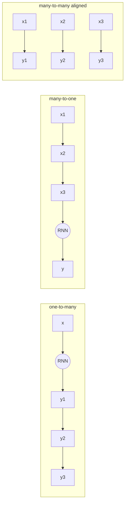
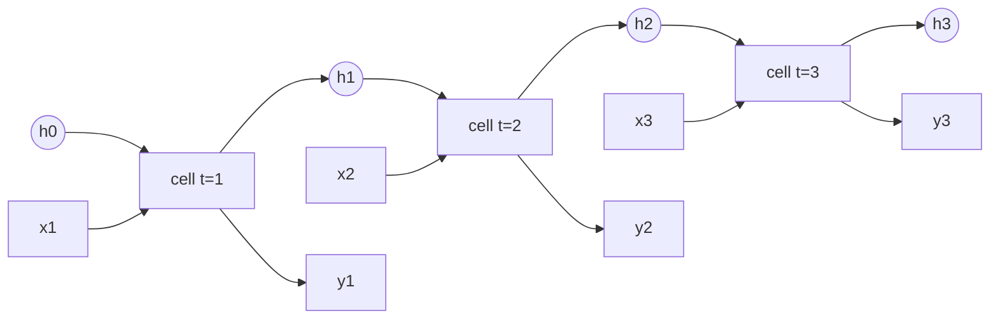
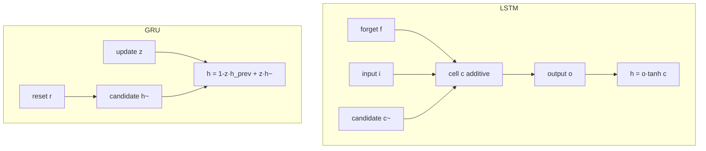
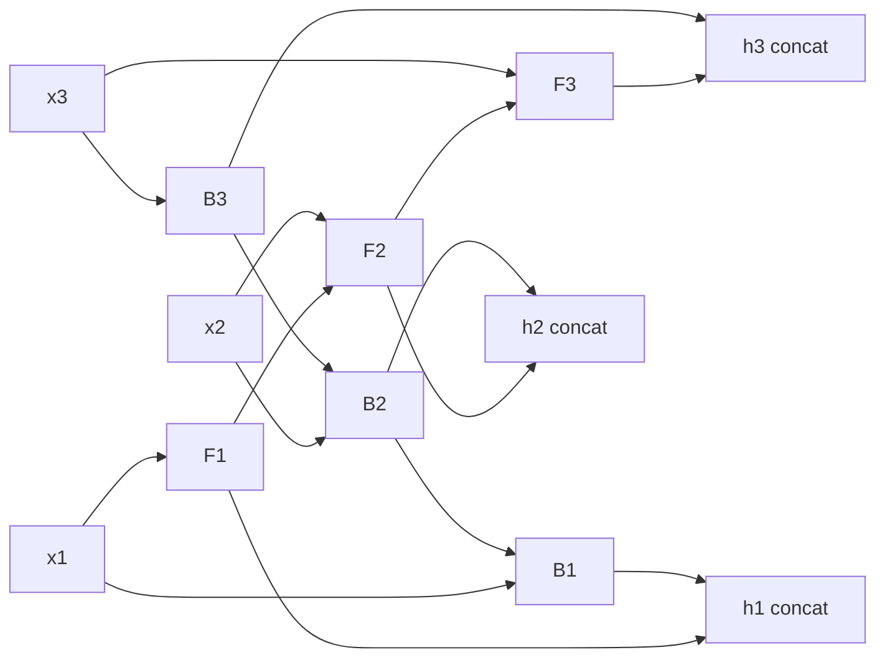
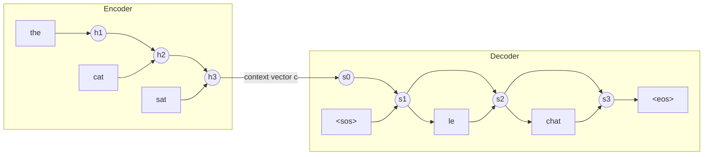

# RNNs, LSTMs, GRUs & Sequence Models
*Memory in a loop: how networks learned to read time one step at a time — and why gates saved them.*

*Part of the AI Engineering & ML Mastery Path — see the [index](../README.md) and [study plan](../MASTER-STUDY-PLAN.md).*

Before attention swallowed the field, the dominant way to model a *sequence* — text, audio, sensor readings, stock prices — was a **recurrent neural network**: a network with a loop, a hidden state that carries information from one timestep to the next, like a reader whose only memory is a single sticky note they keep rewriting. This document builds that idea from the recurrence equation up: vanilla RNNs and parameter sharing, the *unrolling* trick, Backprop Through Time, the vanishing/exploding-gradient catastrophe that nearly killed the whole approach, and the two gated cells — **LSTM** and **GRU** — that fixed it. We then cover bidirectional and stacked stacks, sequence-to-sequence with the encoder–decoder bottleneck, the attention add-on that grew into the Transformer, and where RNNs still genuinely win in 2026 (streaming, tiny data, very long low-dimensional series). The document closes with a complete, runnable **PyTorch LSTM time-series forecasting project**.

By the end you will be able to write the LSTM gate equations from memory, *derive on paper* why its cell state preserves gradients while a vanilla RNN's vanish, window a raw series into a supervised dataset without leaking the future, and build a forecaster that respects horizon and temporal ordering.

---

## 🎯 Learning Objectives

By the end of this document you can:

- **Classify** sequence problems (one-to-many, many-to-one, many-to-many aligned/unaligned) and pick the right architecture.
- **Write** the vanilla RNN recurrence $h_t = \tanh(W_{hh}h_{t-1} + W_{xh}x_t + b)$ and explain **parameter sharing** across time.
- **Unroll** an RNN through time and run **Backprop Through Time (BPTT)** by hand for a short sequence.
- **Derive** the product-of-Jacobians that causes **vanishing/exploding gradients** and explain the $\|W_{hh}\|$ spectral-radius intuition.
- **Reproduce** the full **LSTM** equations (forget/input/output gates, candidate, cell state, hidden state) and explain *why* the additive cell-state path creates a gradient "highway".
- **Reproduce** the **GRU** equations (reset/update gates) and state the LSTM-vs-GRU trade-offs.
- **Assemble** bidirectional and stacked RNNs and reason about their information flow.
- **Diagram** a **seq2seq** encoder–decoder, explain the context-vector bottleneck, **teacher forcing**, and how **attention** removed the bottleneck.
- **Frame** a time series for ML: stationarity, windowing, and *temporal* train/test splits; compare **ARIMA vs ML vs DL**.
- **Build, train, and evaluate** a PyTorch LSTM forecaster with correct windowing and horizon handling.

---

## 📋 Prerequisites

- [03 — Neural Network Foundations](./03-neural-network-foundations.md) — forward pass, backprop, activations, gradient descent.
- [04 — Training Deep Networks](./04-training-deep-networks.md) — optimizers, normalization, regularization, gradient clipping.
- [06 — Transformers, Attention & LLMs](./06-transformers-attention-llms.md) — the architecture that *replaced* most RNN use; this doc is the prequel.
- Comfort with matrix calculus (Jacobians, chain rule) and basic NumPy/PyTorch tensors.

---

## 📑 Table of Contents

1. [The Sequence Modeling Problem](#1-the-sequence-modeling-problem)
2. [The Vanilla RNN](#2-the-vanilla-rnn)
3. [Unrolling & Backprop Through Time](#3-unrolling--backprop-through-time)
4. [Vanishing & Exploding Gradients](#4-vanishing--exploding-gradients)
5. [The LSTM](#5-the-lstm)
6. [The GRU](#6-the-gru)
7. [Bidirectional & Stacked RNNs](#7-bidirectional--stacked-rnns)
8. [Sequence-to-Sequence & Attention](#8-sequence-to-sequence--attention)
9. [Where RNNs Still Win in 2026](#9-where-rnns-still-win-in-2026)
10. [Time-Series Specifics](#10-time-series-specifics)
11. [From-Scratch Implementation (NumPy RNN)](#-from-scratch-implementation-numpy-rnn)
12. [PyTorch LSTM Forecasting Project](#-pytorch-lstm-forecasting-project)
13. [Knowledge Check](#-knowledge-check)
14. [Exercises](#-exercises)
15. [Cheat Sheet](#-cheat-sheet)
16. [Further Resources](#-further-resources)
17. [What's Next](#-whats-next)

---

## 1. The Sequence Modeling Problem

> 💡 **Intuition:** A feed-forward net or CNN sees a *fixed-size* input all at once. But a sentence, a song, or a heart-rate trace has **variable length** and **order matters** — "dog bites man" ≠ "man bites dog". We need a model whose computation can *unfold* to whatever length the input is, and which *remembers* what it has seen.

A sequence is an ordered list $x_1, x_2, \dots, x_T$ where $x_t \in \mathbb{R}^{d}$ is the input at timestep $t$ and $T$ may vary per example. Two properties define the problem:

1. **Variable length** — we cannot hard-wire the input dimension.
2. **Temporal dependence** — the meaning of $x_t$ depends on the context $x_{1:t-1}$ (and sometimes $x_{t+1:T}$).

We classify tasks by the shapes of input and output:

| Pattern | Input → Output | Example |
|---|---|---|
| **One-to-one** | 1 → 1 | Ordinary classification (no recurrence needed) |
| **One-to-many** | 1 → seq | Image captioning (image → words) |
| **Many-to-one** | seq → 1 | Sentiment analysis, sequence classification |
| **Many-to-many (aligned)** | seq → seq, same length | Named-Entity Recognition, per-frame labeling |
| **Many-to-many (unaligned)** | seq → seq, different length | Machine translation, summarization (seq2seq) |



> 🎯 **Key Insight:** The reason RNNs exist is **shared parameters over time**. One small set of weights is applied at *every* timestep, so the model handles any length and learns a single, reusable "update rule" instead of a separate rule per position.

> **Why it matters for AI/ML:** Every modern sequence model — Transformers, state-space models (Mamba), even diffusion-over-tokens — inherits this framing. Knowing the taxonomy tells you which loss, which output head, and which decoding loop you need.

---

## 2. The Vanilla RNN

> 💡 **Intuition:** Picture reading a book with the world's worst memory: you keep a single index card. At each word you (1) glance at the card, (2) read the new word, (3) scribble an updated card, (4) optionally say something out loud. The card is the **hidden state** $h_t$; the scribble rule is the *same* every word.

### Formal definition

At each timestep the **Elman RNN** computes a new hidden state from the previous hidden state and current input, then (optionally) an output:

$$
h_t = \tanh\!\big(W_{hh}\,h_{t-1} + W_{xh}\,x_t + b_h\big)
$$

$$
\hat{y}_t = W_{hy}\,h_t + b_y
$$

Symbols, defined once:

- $x_t \in \mathbb{R}^{d_x}$ — input vector at time $t$.
- $h_t \in \mathbb{R}^{d_h}$ — hidden state ("memory") at time $t$; $h_0$ is usually zeros.
- $W_{xh} \in \mathbb{R}^{d_h \times d_x}$ — input-to-hidden weights.
- $W_{hh} \in \mathbb{R}^{d_h \times d_h}$ — **recurrent** hidden-to-hidden weights (the source of all the trouble in §4).
- $W_{hy} \in \mathbb{R}^{d_y \times d_h}$ — hidden-to-output weights.
- $b_h, b_y$ — biases. $\tanh$ — elementwise hyperbolic tangent, range $(-1, 1)$.

**Parameter sharing:** the *same* $W_{xh}, W_{hh}, W_{hy}$ are used at every $t$. This is the temporal analogue of weight sharing in a CNN (where the kernel is shared across space).

### Worked example by hand

Let $d_x = d_h = 1$ for arithmetic we can do on paper. Take $W_{xh}=0.5$, $W_{hh}=0.8$, $b_h=0$, $h_0=0$, and inputs $x_1=1.0,\ x_2=2.0$.

$$
h_1 = \tanh(0.8\cdot 0 + 0.5\cdot 1.0) = \tanh(0.5) \approx 0.4621
$$

$$
h_2 = \tanh(0.8\cdot 0.4621 + 0.5\cdot 2.0) = \tanh(0.3697 + 1.0) = \tanh(1.3697) \approx 0.8788
$$

Notice $h_2$ depends on $x_1$ *through* $h_1$ — that is the memory.

### Python (runnable)

```python
import numpy as np

def rnn_step(h_prev, x, W_hh, W_xh, b_h):
    return np.tanh(W_hh @ h_prev + W_xh @ x + b_h)

# scalar example matching the by-hand math (1-D state)
W_hh = np.array([[0.8]]); W_xh = np.array([[0.5]]); b_h = np.array([0.0])
h = np.array([0.0])
for x in [np.array([1.0]), np.array([2.0])]:
    h = rnn_step(h, x, W_hh, W_xh, b_h)
    print(round(float(h), 4))
# 0.4621
# 0.8788
```

```
        h0=0      h1         h2         h3
         │         │          │          │
   x1 ─►(tanh)─►  x2 ─►(tanh)─►  x3 ─►(tanh)─► ...
         ▲ shared  ▲ shared    ▲ shared
        W_xh,W_hh same weights every step
```

> ⚠️ **Common Pitfall:** People conflate the **hidden state** (the running memory, changes every step, *not* a parameter) with the **weights** (fixed during a forward pass, learned by gradient descent). The hidden state is data; the weights are the model.

> **Why it matters for AI/ML:** The vanilla RNN is the minimal recurrent primitive. LSTM and GRU are just smarter versions of this exact loop, and understanding it makes their gates obvious rather than magical.

---

## 3. Unrolling & Backprop Through Time

> 💡 **Intuition:** A loop is hard to differentiate. So we **unroll** it: copy the same cell once per timestep into a deep feed-forward graph that shares weights. Now it's just ordinary backprop — on a network as deep as the sequence is long.

### Unrolling

An RNN run on a length-$T$ sequence is mathematically identical to a $T$-layer feed-forward network where every layer shares the same weights:



### Backprop Through Time (BPTT)

The total loss is the sum over timesteps, $\mathcal{L} = \sum_{t=1}^{T} \mathcal{L}_t$. Because $W_{hh}$ is shared, its gradient accumulates contributions from **every** timestep:

$$
\frac{\partial \mathcal{L}}{\partial W_{hh}} = \sum_{t=1}^{T} \frac{\partial \mathcal{L}_t}{\partial W_{hh}}
= \sum_{t=1}^{T} \sum_{k=1}^{t} \frac{\partial \mathcal{L}_t}{\partial h_t}\,\frac{\partial h_t}{\partial h_k}\,\frac{\partial h_k}{\partial W_{hh}}
$$

The dangerous factor is the chain of hidden-state Jacobians spanning $k \to t$:

$$
\frac{\partial h_t}{\partial h_k} = \prod_{i=k+1}^{t} \frac{\partial h_i}{\partial h_{i-1}}
= \prod_{i=k+1}^{t} \operatorname{diag}\!\big(\tanh'(a_i)\big)\,W_{hh}^{\top}
$$

where $a_i = W_{hh}h_{i-1} + W_{xh}x_i + b_h$ is the pre-activation. This **product of $(t-k)$ matrices** is the heart of §4.

> 📝 **Tip:** In practice we use **Truncated BPTT (TBPTT)**: process the sequence in chunks of length $k$ (say 35 for language models), backprop only within each chunk, and carry the hidden state forward *detached* from the graph. This bounds memory and compute, at the cost of forgetting dependencies longer than $k$.

> ⚠️ **Common Pitfall:** Forgetting to `detach()` the hidden state between TBPTT chunks. In PyTorch this silently keeps the entire history in the autograd graph, blowing up memory and eventually erroring with "Trying to backward through the graph a second time."

> **Why it matters for AI/ML:** BPTT is *why* recurrence is expensive and *why* Transformers win on hardware — RNN backprop is inherently sequential (step $t$ needs step $t-1$), so it cannot parallelize across time the way attention can.

---

## 4. Vanishing & Exploding Gradients

> 💡 **Intuition:** That product of $(t-k)$ Jacobian matrices behaves like raising a number to the power $(t-k)$. If the "number" is below 1, the product shrinks toward 0 (**vanishing** — the network can't learn long-range links). If above 1, it explodes toward $\infty$ (**exploding** — training diverges, NaNs).

### The math

Take the gradient magnitude through the chain. Using the operator norm and the bound $\|\tanh'(\cdot)\| \le 1$:

$$
\left\|\frac{\partial h_t}{\partial h_k}\right\|
\le \prod_{i=k+1}^{t} \big\|\operatorname{diag}(\tanh'(a_i))\big\|\,\big\|W_{hh}^{\top}\big\|
\le \big\|W_{hh}\big\|^{\,t-k}
$$

Let $\gamma$ be the largest singular value (spectral norm) of $W_{hh}$, and recall $|\tanh'| \le 1$:

- If $\gamma < 1$: gradients **vanish** geometrically — $\gamma^{t-k} \to 0$.
- If $\gamma > 1$: gradients can **explode** — $\gamma^{t-k} \to \infty$ (though $\tanh'$ damping can partially offset this).

A sharper statement uses the largest eigenvalue $\lambda_1$ of $W_{hh}$: a *necessary* condition for vanishing is $\lambda_1 < 1/\sup|\sigma'|$; with $\tanh$, $\sup|\tanh'|=1$, so $\lambda_1 < 1$ guarantees vanishing.

### Numerical demonstration

```python
import numpy as np
rng = np.random.default_rng(0)

def jacobian_product_norm(gamma, T, dh=20):
    # build W_hh with controlled spectral norm = gamma
    W = rng.standard_normal((dh, dh))
    U, s, Vt = np.linalg.svd(W)
    W = U @ np.diag(np.full(dh, gamma)) @ Vt   # all singular values = gamma
    J = np.eye(dh)
    for _ in range(T):
        D = np.diag(rng.uniform(0.0, 1.0, dh))  # |tanh'| in (0,1]
        J = D @ W.T @ J
    return np.linalg.norm(J, 2)

for g in (0.5, 1.0, 1.5):
    print(f"gamma={g}:  ||dh_T/dh_0|| after T=50  ->  {jacobian_product_norm(g, 50):.3e}")
# gamma=0.5:  ||dh_T/dh_0|| after T=50  ->  ~1e-15   (vanished)
# gamma=1.0:  ||dh_T/dh_0|| after T=50  ->  ~1e-04   (still shrinks via tanh')
# gamma=1.5:  ||dh_T/dh_0|| after T=50  ->  ~1e+05   (exploded)
```

(Exact figures vary with the random seed; the *orders of magnitude* are the point.)

### Mitigations

| Problem | Fix | How it helps |
|---|---|---|
| Exploding | **Gradient clipping** ($\|g\| \leftarrow g\cdot \min(1, \tau/\|g\|)$) | Caps step size; cheap and very effective |
| Vanishing | **Gated cells (LSTM/GRU)** | Additive memory path (§5) keeps Jacobian ≈ 1 |
| Vanishing | **ReLU + identity/orthogonal init** | Keeps $\gamma \approx 1$ early (e.g. IRNN) |
| Vanishing | **Skip/residual connections, attention** | Short gradient paths bypass the long product |

> ⚠️ **Common Pitfall:** Clipping fixes *exploding* gradients but does **nothing** for *vanishing* ones — the gradient is small, not large. People often clip and wonder why long-range learning still fails. Use LSTM/GRU for vanishing.

> **Why it matters for AI/ML:** This single product-of-Jacobians argument explains the entire 1997–2017 arc of sequence modeling: LSTM (1997) attacked vanishing gradients; residual connections (2015) and attention (2017) attacked it again with shorter paths. It is one of the most consequential gradients in ML history.

---

## 5. The LSTM

> 💡 **Intuition:** The vanilla RNN *overwrites* its memory every step (multiplicative), which is exactly what makes gradients vanish. The **Long Short-Term Memory** cell keeps a separate **cell state** $c_t$ that it *edits additively* — it decides what to **forget**, what to **add**, and what to **expose**. Think of $c_t$ as a conveyor belt running straight through time, with gates that gently add or remove items.

### Formal definition (full equations)

At each step, with $[h_{t-1}, x_t]$ the concatenation of previous hidden state and current input, $\sigma$ the logistic sigmoid (output in $(0,1)$, acting as a soft gate), and $\odot$ elementwise product:

$$
\begin{aligned}
f_t &= \sigma\big(W_f[h_{t-1}, x_t] + b_f\big) &&\text{forget gate} \\
i_t &= \sigma\big(W_i[h_{t-1}, x_t] + b_i\big) &&\text{input gate} \\
\tilde{c}_t &= \tanh\big(W_c[h_{t-1}, x_t] + b_c\big) &&\text{candidate cell} \\
c_t &= f_t \odot c_{t-1} + i_t \odot \tilde{c}_t &&\text{cell-state update (additive!)} \\
o_t &= \sigma\big(W_o[h_{t-1}, x_t] + b_o\big) &&\text{output gate} \\
h_t &= o_t \odot \tanh(c_t) &&\text{hidden / exposed state}
\end{aligned}
$$

- $f_t \approx 1$ → keep old memory; $f_t \approx 0$ → erase it.
- $i_t$ decides how much of the new candidate $\tilde{c}_t$ to write.
- $o_t$ decides how much of the cell to reveal as the output $h_t$.

```
        c_{t-1} ─────────────►(×)──────────►(+)──────────────────► c_t
                               ▲             ▲                │
                            f_t│          i_t│⊙ c̃_t           │
                          [forget]       [input + candidate]  │ tanh
                                                              ▼
   h_{t-1} ─┐                                              (×)◄── o_t [output]
            ├─[concat]─► σ f_t                                │
   x_t  ────┘            σ i_t                                ▼
                         tanh c̃_t                            h_t ─────► (and to next step)
                         σ o_t
```

### Why gating preserves gradients (the key derivation)

Look at the gradient of the cell state across one step. Ignoring the (smaller) dependence of $f_t$ on $c_{t-1}$, the dominant term is:

$$
\frac{\partial c_t}{\partial c_{t-1}} \approx f_t
$$

So the long-range cell-state Jacobian is a **product of forget gates**, not a product of weight matrices:

$$
\frac{\partial c_t}{\partial c_k} \approx \prod_{i=k+1}^{t} f_i
$$

When the cell *should* remember, the network learns $f_i \approx 1$, and the product stays near $1$ — gradients flow undiminished across hundreds of steps. This is the **constant error carousel (CEC)**: the additive update $c_t = f_t \odot c_{t-1} + \dots$ has a derivative of (roughly) $f_t$ rather than $\operatorname{diag}(\tanh')W^\top$, removing the geometric decay.

> 🎯 **Key Insight:** Vanilla RNN memory is **multiplicative** ($h_t = \tanh(W h_{t-1} + \dots)$) → Jacobian is a product of *matrices* → vanishes. LSTM memory is **additive** ($c_t = f_t c_{t-1} + i_t \tilde c_t$) → Jacobian is a product of *gate values near 1* → survives.

> 📝 **Tip:** Initialize the **forget-gate bias $b_f$ to a positive value (1.0–2.0)**. Then $f_t = \sigma(\text{large}) \approx 1$ at the start, so the cell *defaults to remembering* and gradients flow from epoch one. This is one of the highest-ROI tricks in RNN training (Jozefowicz et al., 2015).

### Python (one LSTM step, NumPy)

```python
import numpy as np
def sigmoid(z): return 1.0 / (1.0 + np.exp(-z))

def lstm_step(h_prev, c_prev, x, Wf, Wi, Wc, Wo, bf, bi, bc, bo):
    z = np.concatenate([h_prev, x])
    f = sigmoid(Wf @ z + bf)
    i = sigmoid(Wi @ z + bi)
    g = np.tanh (Wc @ z + bc)   # candidate
    o = sigmoid(Wo @ z + bo)
    c = f * c_prev + i * g       # additive update
    h = o * np.tanh(c)
    return h, c

dh, dx = 4, 3
rng = np.random.default_rng(1)
W = lambda: rng.standard_normal((dh, dh + dx)) * 0.1
b = lambda v=0.0: np.full(dh, v)
h, c = np.zeros(dh), np.zeros(dh)
h, c = lstm_step(h, c, rng.standard_normal(dx), W(), W(), W(), W(),
                 b(1.0), b(), b(), b())   # forget bias = 1.0
print("h:", np.round(h, 4))   # e.g. h: [ 0.01 -0.00  0.02 -0.01 ]  (small, sane)
```

> ⚠️ **Common Pitfall:** Mixing up $c_t$ (internal cell state, the long-term memory, *never* directly output) and $h_t$ (the exposed hidden state used for predictions and passed to the next layer). The decoder reads $h_t$; the gradient highway lives in $c_t$.

> **Why it matters for AI/ML:** LSTMs powered Google Translate (2016), speech recognition, and Seq2Seq for years, and remain the default for streaming and small-data sequence tasks. The additive-memory idea reappears as residual connections in ResNets/Transformers.

---

## 6. The GRU

> 💡 **Intuition:** The **Gated Recurrent Unit** is a slimmed-down LSTM: it merges the cell and hidden state into one, and merges forget+input into a single **update gate**. Fewer gates, fewer parameters, often equal accuracy.

### Formal definition

$$
\begin{aligned}
z_t &= \sigma\big(W_z[h_{t-1}, x_t] + b_z\big) &&\text{update gate} \\
r_t &= \sigma\big(W_r[h_{t-1}, x_t] + b_r\big) &&\text{reset gate} \\
\tilde{h}_t &= \tanh\big(W_h[\,r_t \odot h_{t-1},\ x_t\,] + b_h\big) &&\text{candidate} \\
h_t &= (1 - z_t)\odot h_{t-1} + z_t \odot \tilde{h}_t &&\text{interpolation update}
\end{aligned}
$$

- $r_t$ controls how much **past** state feeds the candidate ($r_t\approx 0$ → ignore history, good for "reset" boundaries).
- $z_t$ **interpolates** between keeping the old state and adopting the new candidate. $z_t \approx 0$ → copy $h_{t-1}$ forward (the additive memory path, just like LSTM's $f_t \approx 1$).

The additive path $(1-z_t)\odot h_{t-1}$ gives GRUs the same anti-vanishing property as the LSTM cell state.

### LSTM vs GRU

| Aspect | LSTM | GRU |
|---|---|---|
| Gates | 3 (forget, input, output) | 2 (update, reset) |
| States | 2 ($c_t$ and $h_t$) | 1 ($h_t$) |
| Parameters (per unit) | $4(d_h^2 + d_h d_x)$ | $3(d_h^2 + d_h d_x)$ — ~25% fewer |
| Output control | Explicit output gate | None (whole state exposed) |
| Long sequences / counting | Slight edge (separate memory) | Competitive |
| Small data / speed | Good | Often better (fewer params) |
| Default choice | Safe, well-studied | Try when you want speed/fewer params |



> 🎯 **Key Insight:** Empirically (Chung et al., 2014; Greff et al., 2017) LSTM and GRU are **roughly tied**; no consistent winner across tasks. Pick GRU for fewer params/faster training, LSTM when you want the extra control or have lots of data. Don't agonize.

> **Why it matters for AI/ML:** GRUs are common in on-device and streaming settings (smaller, faster) and in RL policies over short histories. Knowing both lets you read almost any pre-Transformer NLP/audio paper.

---

## 7. Bidirectional & Stacked RNNs

> 💡 **Intuition:** A plain RNN only sees the *past*. But to tag the word "bank" you often need the *future* ("river bank" vs "bank account"). A **bidirectional RNN** runs one RNN left-to-right and another right-to-left, then concatenates. **Stacking** (deep RNNs) feeds one layer's outputs as the next layer's inputs to build hierarchical features.

### Bidirectional

$$
\overrightarrow{h_t} = \text{RNN}_\text{fwd}(x_t, \overrightarrow{h_{t-1}}), \quad
\overleftarrow{h_t} = \text{RNN}_\text{bwd}(x_t, \overleftarrow{h_{t+1}}), \quad
h_t = [\overrightarrow{h_t};\, \overleftarrow{h_t}]
$$

The output at $t$ now encodes the *entire* sequence around $t$.



### Stacked (deep) RNNs

Layer $\ell$'s hidden state becomes layer $\ell{+}1$'s input: $h_t^{(\ell)} = \text{RNN}^{(\ell)}\!\big(h_t^{(\ell-1)}, h_{t-1}^{(\ell)}\big)$, with $h_t^{(0)} = x_t$. Two to four layers is typical; more rarely helps without residual connections.

> ⚠️ **Common Pitfall:** **Bidirectional RNNs are illegal for autoregressive generation and for streaming/real-time tasks** — they require the whole sequence up front (you can't see the future token while generating it). Use them only for *encoding* fixed sequences (classification, tagging, the encoder of a seq2seq), never the decoder.

> **Why it matters for AI/ML:** BiLSTM-CRF was the state of the art for NER and sequence tagging before BERT. The bidirectional idea is exactly what BERT's masked-language-model objective generalizes with attention.

---

## 8. Sequence-to-Sequence & Attention

> 💡 **Intuition:** For translation, input and output lengths differ and don't align word-for-word. **Seq2seq** uses two RNNs: an **encoder** compresses the whole input into a fixed **context vector**, and a **decoder** unrolls that into the output sequence. The flaw: cramming a 50-word sentence into one vector is a bottleneck. **Attention** fixes it by letting the decoder *look back* at all encoder states.

### Encoder–decoder with context vector

The encoder produces hidden states $h_1^{enc}, \dots, h_T^{enc}$; the **context vector** is typically the last one, $c = h_T^{enc}$. The decoder is initialized with $c$ and generates tokens one at a time, each conditioned on the previous output:

$$
s_t = \text{RNN}_{dec}(s_{t-1}, [y_{t-1}; c]), \qquad
\hat y_t = \text{softmax}(W_o s_t)
$$



### Teacher forcing

During training, the decoder is fed the **ground-truth** previous token $y_{t-1}$ rather than its own (possibly wrong) prediction. This stabilizes and speeds up training.

> ⚠️ **Common Pitfall: exposure bias.** With pure teacher forcing the model only ever sees *correct* history at train time, but at inference it must consume its *own* outputs — small early errors compound. Mitigate with **scheduled sampling** (probabilistically feed the model's own predictions during training).

### Attention — the add-on that became the Transformer

Instead of a single fixed $c$, compute a **different** context $c_t$ at each decoder step as a weighted sum of *all* encoder states. With decoder state $s_{t-1}$ and encoder states $h_j^{enc}$:

$$
e_{tj} = \text{score}(s_{t-1}, h_j^{enc}), \quad
\alpha_{tj} = \frac{\exp(e_{tj})}{\sum_{k} \exp(e_{tk})}, \quad
c_t = \sum_{j} \alpha_{tj}\, h_j^{enc}
$$

The **alignment weights** $\alpha_{tj}$ say "how much should output $t$ attend to input $j$." Two classic scores:

- **Bahdanau (additive, 2014):** $\text{score}(s, h) = v^\top \tanh(W_1 s + W_2 h)$.
- **Luong (multiplicative, 2015):** $\text{score}(s, h) = s^\top W h$ (or just $s^\top h$).

> 🎯 **Key Insight:** Attention removed the *single-vector bottleneck* — the decoder can directly reference any input position. The Transformer (06) took the next step: drop recurrence entirely and use attention for *everything*, gaining full parallelism across time. RNN-with-attention is the missing link between LSTMs and GPT.

> **Why it matters for AI/ML:** Every frontier LLM is the grandchild of attention-augmented seq2seq. Understanding the context-vector bottleneck is the cleanest way to motivate *why* attention exists at all.

---

## 9. Where RNNs Still Win in 2026

Transformers dominate, but RNNs/LSTMs are not obsolete. They genuinely win when:

| Scenario | Why RNN/LSTM wins |
|---|---|
| **Streaming / online inference** | $O(1)$ state update per token; no growing KV cache, constant memory. Ideal for real-time audio, keyboard prediction, edge devices. |
| **Very long, low-dimensional series** | Attention is $O(T^2)$ in sequence length; an RNN is $O(T)$. For million-step sensor streams, recurrence is far cheaper. |
| **Tiny data** | Fewer parameters than a Transformer → less overfitting; an LSTM often beats a Transformer on small datasets. |
| **Strict latency / memory budgets** | Tiny LSTMs run on microcontrollers; no quadratic attention, no large context buffer. |
| **Simple, well-behaved forecasting** | For univariate/low-dim time series, an LSTM (or even ARIMA) frequently matches heavyweight models. |

> 📝 **Tip:** The modern "RNN renaissance" — **state-space models** like S4 and **Mamba** — revives linear recurrence with $O(T)$ inference *and* parallelizable training, directly targeting the streaming/long-sequence niche where attention is expensive. The recurrence idea never died; it got better hardware-aware math.

> **Why it matters for AI/ML:** Architecture choice is an engineering decision, not a fashion statement. Reaching for a Transformer on 500 training rows of a univariate series is how you overfit; an LSTM or classical model is the right tool.

---

## 10. Time-Series Specifics

Time series add constraints that generic sequence modeling ignores: you must never use the future to predict the past, and the data's statistics may drift.

### Stationarity

A series is **stationary** if its statistical properties (mean, variance, autocovariance) don't change over time. Many classical models assume it. Make a series (more) stationary by **differencing** ($y'_t = y_t - y_{t-1}$), log/Box-Cox transforms, or deseasonalizing. Test with the **Augmented Dickey-Fuller (ADF)** test: $p < 0.05$ → reject the unit-root null → treat as stationary.

> 💡 **Intuition:** A stationary series "looks the same" no matter which window you view. A stock price (trending, wandering) is non-stationary; its *daily returns* are closer to stationary. Neural nets are more forgiving of non-stationarity than ARIMA, but normalizing/detrending still helps a lot.

### Windowing — framing forecasting as supervised learning

Convert a 1-D series into $(X, y)$ pairs with a **sliding window** of look-back length $L$ (and forecast horizon $H$):

$$
X^{(i)} = [\,y_{i},\, y_{i+1},\, \dots,\, y_{i+L-1}\,], \qquad
y^{(i)} = y_{i+L} \ \ (\text{or } y_{i+L:i+L+H} \text{ for multi-step})
$$

```
series:   y0 y1 y2 y3 y4 y5 y6 ...
L=3, H=1
window1:  [y0 y1 y2] -> y3
window2:     [y1 y2 y3] -> y4
window3:        [y2 y3 y4] -> y5
```

```python
import numpy as np
def make_windows(series, L, H=1):
    X, y = [], []
    for i in range(len(series) - L - H + 1):
        X.append(series[i:i+L])
        y.append(series[i+L:i+L+H])
    return np.array(X), np.array(y)

s = np.arange(10.0)
X, y = make_windows(s, L=3, H=1)
print(X[0], "->", y[0])   # [0. 1. 2.] -> [3.]
print(X[-1], "->", y[-1]) # [6. 7. 8.] -> [9.]
```

### Train/test for time — never shuffle

> ⚠️ **Common Pitfall (the #1 time-series bug):** Using a *random* train/test split. That leaks future information into training and produces beautiful, completely fake validation scores. **Always split by time**: train on the past, test on the future. For cross-validation use **forward-chaining** (expanding/rolling window), never k-fold.

```
[==== train ====][== val ==][== test ==]
 t0 ............................. T   (time flows →, no shuffling)
```

Also: fit scalers/normalizers on **train only**, then apply to val/test (fitting on the whole series leaks future statistics).

### ARIMA vs ML vs DL

| Approach | Best when | Pros | Cons |
|---|---|---|---|
| **ARIMA / SARIMA / ETS** | Univariate, clear trend/seasonality, small data | Interpretable, strong baseline, fast, well-understood CIs | Linear, manual order selection, weak on many exogenous features |
| **ML (Gradient Boosting on lag features)** | Tabular features, many exogenous vars, medium data | Handles nonlinearity & many features; often *wins* competitions (M5) | Needs feature engineering (lags, rolling stats, calendar) |
| **DL (LSTM/Temporal CNN/Transformer)** | Many related series, long history, complex patterns | Learns features, multivariate, multi-horizon | Data-hungry, harder to tune, easy to overfit small data |

> 🎯 **Key Insight:** On a *single* short univariate series, a good ARIMA or gradient-boosted lag model usually beats an LSTM. DL pays off with **many related series** and **lots of history** (e.g., demand across thousands of products). Always benchmark against a naive baseline ($\hat y_t = y_{t-1}$) — surprisingly many "models" don't beat it.

### Applications recap

- **Forecasting** — demand, energy load, finance (many-to-one or many-to-many).
- **Text generation** — char/word-level language modeling (many-to-many, autoregressive).
- **NER / sequence tagging** — BiLSTM(-CRF), aligned many-to-many.
- **Sentiment / classification** — many-to-one over the final (or pooled) hidden state.

---

## 🧮 From-Scratch Implementation (NumPy RNN)

A minimal forward + BPTT for a many-to-one RNN, NumPy only, with a finite-difference gradient check — so you can *see* BPTT is correct.

```python
import numpy as np
rng = np.random.default_rng(0)

class TinyRNN:
    """Many-to-one RNN: read a sequence, predict one scalar at the end (MSE loss)."""
    def __init__(self, dx, dh):
        s = 0.1
        self.Wxh = rng.standard_normal((dh, dx)) * s
        self.Whh = rng.standard_normal((dh, dh)) * s
        self.Why = rng.standard_normal((1,  dh)) * s
        self.bh  = np.zeros(dh); self.by = np.zeros(1)
        self.dh = dh

    def forward(self, X):                 # X: (T, dx)
        self.X = X; self.H = [np.zeros(self.dh)]
        for t in range(len(X)):
            a = self.Whh @ self.H[-1] + self.Wxh @ X[t] + self.bh
            self.H.append(np.tanh(a))
        self.yhat = self.Why @ self.H[-1] + self.by
        return self.yhat

    def loss(self, X, target):
        return 0.5 * float((self.forward(X) - target) ** 2)

    def backward(self, target):
        T = len(self.X)
        dy = (self.yhat - target)                 # dL/dyhat  (1,)
        dWhy = np.outer(dy, self.H[-1]); dby = dy
        dWxh = np.zeros_like(self.Wxh); dWhh = np.zeros_like(self.Whh); dbh = np.zeros_like(self.bh)
        dh_next = self.Why.T @ dy                 # (dh,)
        for t in reversed(range(T)):
            dtanh = (1 - self.H[t+1] ** 2) * dh_next   # through tanh
            dbh  += dtanh
            dWxh += np.outer(dtanh, self.X[t])
            dWhh += np.outer(dtanh, self.H[t])
            dh_next = self.Whh.T @ dtanh               # propagate to earlier step
        return dWxh, dWhh, dWhy, dbh, dby

# --- finite-difference gradient check on Whh ---
net = TinyRNN(dx=3, dh=4)
X = rng.standard_normal((5, 3)); target = np.array([0.7])
net.loss(X, target)
dWxh, dWhh, dWhy, dbh, dby = net.backward(target)

eps = 1e-5; i, j = 1, 2
orig = net.Whh[i, j]
net.Whh[i, j] = orig + eps; Lp = net.loss(X, target)
net.Whh[i, j] = orig - eps; Lm = net.loss(X, target)
net.Whh[i, j] = orig
num = (Lp - Lm) / (2 * eps)
print(f"analytic dWhh[{i},{j}] = {dWhh[i,j]: .6f}")
print(f"numeric  dWhh[{i},{j}] = {num: .6f}")
# analytic and numeric agree to ~1e-7  -> BPTT is correct
```

> 📝 **Tip:** A finite-difference gradient check ($\frac{L(\theta+\epsilon)-L(\theta-\epsilon)}{2\epsilon}$) is the single best way to debug a hand-written backward pass. If analytic and numeric disagree beyond ~$10^{-5}$, your backprop has a bug.

---

## 🏭 PyTorch LSTM Forecasting Project

A complete, runnable univariate forecasting pipeline: synthetic seasonal series → windowing → time-respecting split → scaling (train-only) → LSTM → training → evaluation against a naive baseline → multi-step horizon discussion. Requires `torch`, `numpy` (Python 3.11+).

```python
import numpy as np, torch
import torch.nn as nn
from torch.utils.data import TensorDataset, DataLoader
torch.manual_seed(0); np.random.seed(0)

# ----- 1. Synthetic series: trend + seasonality + noise -----
T = 1500
t = np.arange(T)
series = (0.02 * t                              # trend
          + 10 * np.sin(2 * np.pi * t / 50)     # seasonality (period 50)
          + np.random.normal(0, 1.0, T)).astype(np.float32)

# ----- 2. Time-respecting split BEFORE scaling (no leakage) -----
n_test = 300
train_raw, test_raw = series[:-n_test], series[-n_test:]

# ----- 3. Scale on TRAIN ONLY, apply to test -----
mu, sd = train_raw.mean(), train_raw.std()
train_s = (train_raw - mu) / sd
test_s  = (test_raw  - mu) / sd

# ----- 4. Windowing (look-back L, horizon H=1) -----
L, H = 50, 1
def make_windows(x, L, H):
    X, y = [], []
    for i in range(len(x) - L - H + 1):
        X.append(x[i:i+L]); y.append(x[i+L:i+L+H])
    X = np.array(X, dtype=np.float32)[..., None]   # (N, L, 1) features=1
    y = np.array(y, dtype=np.float32)              # (N, H)
    return X, y

Xtr, ytr = make_windows(train_s, L, H)
# build test windows using the tail of train as warm-up context (no leakage: context is past)
ctx = np.concatenate([train_s[-L:], test_s])
Xte, yte = make_windows(ctx, L, H)

train_loader = DataLoader(TensorDataset(torch.tensor(Xtr), torch.tensor(ytr)),
                          batch_size=64, shuffle=True)   # shuffling WINDOWS is fine; order is inside each window

# ----- 5. Model -----
class LSTMForecaster(nn.Module):
    def __init__(self, n_features=1, hidden=64, layers=2, horizon=1):
        super().__init__()
        self.lstm = nn.LSTM(n_features, hidden, num_layers=layers,
                            batch_first=True, dropout=0.1)
        self.head = nn.Linear(hidden, horizon)
    def forward(self, x):                 # x: (B, L, n_features)
        out, (h_n, c_n) = self.lstm(x)
        return self.head(out[:, -1, :])   # use last timestep's hidden state -> (B, horizon)

model = LSTMForecaster(horizon=H)
opt = torch.optim.Adam(model.parameters(), lr=1e-3)
lossf = nn.MSELoss()

# ----- 6. Train (with gradient clipping vs exploding gradients) -----
for epoch in range(15):
    model.train(); total = 0.0
    for xb, yb in train_loader:
        opt.zero_grad()
        loss = lossf(model(xb), yb)
        loss.backward()
        torch.nn.utils.clip_grad_norm_(model.parameters(), max_norm=1.0)
        opt.step()
        total += loss.item() * len(xb)
    if epoch % 5 == 0:
        print(f"epoch {epoch:2d}  train MSE(scaled) = {total/len(Xtr):.4f}")

# ----- 7. Evaluate on the held-out future, un-scaled -----
model.eval()
with torch.no_grad():
    pred_s = model(torch.tensor(Xte)).numpy()
pred = pred_s * sd + mu                 # inverse transform
true = yte * sd + mu
rmse = float(np.sqrt(np.mean((pred - true) ** 2)))
mae  = float(np.mean(np.abs(pred - true)))

# Naive baseline: predict y_t = y_{t-1} (last observed value)
naive = ctx[L-1 : L-1 + len(true)] * sd + mu   # the value right before each target
naive = naive.reshape(true.shape)
rmse_naive = float(np.sqrt(np.mean((naive - true) ** 2)))
print(f"LSTM  RMSE = {rmse:.3f}   MAE = {mae:.3f}")
print(f"Naive RMSE = {rmse_naive:.3f}   (model should beat this)")
# Expected: LSTM RMSE clearly below Naive RMSE on this seasonal series.
```

### Horizon discussion: multi-step forecasting

There are three standard ways to forecast $H>1$ steps:

| Strategy | How | Pros / Cons |
|---|---|---|
| **Recursive (rolling)** | Predict 1 step, append prediction to input, repeat | Simple, reuses 1-step model; **errors compound** over the horizon |
| **Direct multi-output** | Output all $H$ values at once (set `horizon=H`) | No compounding; needs a wider head; ignores inter-step dependencies |
| **Seq2seq decoder** | Encoder–decoder LSTM emits the horizon step-by-step | Models output dependencies; more complex, can use teacher forcing |

> ⚠️ **Common Pitfall:** Evaluating a multi-step forecaster only on the **1-step** error. Always report error **per horizon step** ($h=1,\dots,H$) — accuracy degrades with distance, and a single averaged number hides where the model breaks down.

> 📝 **Tip:** To switch this project to **direct multi-step**, set `H = 12` (say) and `horizon=12`; `make_windows` and the linear head already generalize. For **recursive**, keep `H=1` and write an inference loop that feeds each prediction back as the newest timestep.

---

## ❓ Knowledge Check

<details><summary><b>Q1.</b> Why can a single set of weights handle sequences of any length?</summary>

Because of **parameter sharing across time**: the *same* $W_{xh}, W_{hh}, W_{hy}$ are applied at every timestep. The loop simply runs as many times as there are inputs, so the parameter count is independent of $T$. This mirrors a CNN sharing one kernel across spatial positions.
</details>

<details><summary><b>Q2.</b> In the vanilla RNN, which weight matrix is responsible for vanishing/exploding gradients, and why?</summary>

The **recurrent matrix $W_{hh}$**. BPTT multiplies its (transposed) Jacobian once per timestep, giving a factor $\approx \prod \operatorname{diag}(\tanh')W_{hh}^\top$. If $W_{hh}$'s spectral norm $\gamma<1$ the product shrinks geometrically (vanish); if $\gamma>1$ it can grow (explode). $W_{xh}$ and $W_{hy}$ are not raised to the power of $T$, so they're not the culprit.
</details>

<details><summary><b>Q3.</b> Gradient clipping fixes which gradient problem, and which does it NOT fix?</summary>

It fixes **exploding** gradients (rescales the norm to a cap $\tau$). It does **not** fix **vanishing** gradients — those are small, not large; clipping leaves them untouched. Vanishing needs architecture changes (LSTM/GRU, residuals, attention).
</details>

<details><summary><b>Q4.</b> Write the LSTM cell-state update and explain why it preserves gradients.</summary>

$c_t = f_t \odot c_{t-1} + i_t \odot \tilde c_t$. The update is **additive**, so $\partial c_t / \partial c_{t-1} \approx f_t$. The long-range Jacobian becomes $\prod_i f_i$ — a product of gate values that the network can drive toward $1$ ("constant error carousel"), avoiding the geometric decay of the matrix-product Jacobian in a vanilla RNN.
</details>

<details><summary><b>Q5.</b> What does each LSTM gate control?</summary>

- **Forget $f_t$:** how much of the old cell state $c_{t-1}$ to keep.
- **Input $i_t$:** how much of the new candidate $\tilde c_t$ to write into the cell.
- **Output $o_t$:** how much of $\tanh(c_t)$ to expose as the hidden state $h_t$.
</details>

<details><summary><b>Q6.</b> How does a GRU differ structurally from an LSTM?</summary>

GRU has **2 gates** (update $z_t$, reset $r_t$) vs LSTM's 3, and **one state** $h_t$ vs LSTM's two ($c_t,h_t$). The update gate merges forget+input into an interpolation $h_t=(1-z_t)h_{t-1}+z_t\tilde h_t$. ~25% fewer parameters, comparable accuracy, no separate output gate.
</details>

<details><summary><b>Q7.</b> Why must you not use a bidirectional RNN in the decoder of a text generator?</summary>

Generation is **autoregressive**: at step $t$ you only know tokens $1..t-1$. A bidirectional RNN requires the *entire* sequence (including future tokens) to compute the backward pass, which don't exist yet during generation. BiRNNs are only valid for **encoding** complete sequences.
</details>

<details><summary><b>Q8.</b> What is the seq2seq "bottleneck" and how does attention remove it?</summary>

The encoder compresses the whole input into a single fixed-size **context vector** $c=h_T^{enc}$; long inputs lose information. **Attention** computes a *different* context $c_t=\sum_j \alpha_{tj}h_j^{enc}$ at each decoder step, letting the decoder directly reference any input position — no single-vector bottleneck.
</details>

<details><summary><b>Q9.</b> What is teacher forcing and what failure mode does it cause?</summary>

Feeding the **ground-truth** previous token (not the model's own prediction) to the decoder during training. It speeds/stabilizes training but causes **exposure bias**: at inference the model consumes its own outputs, which it never practiced on, so early errors compound. Mitigation: **scheduled sampling**.
</details>

<details><summary><b>Q10.</b> Why is a random train/test split wrong for time series, and what to use instead?</summary>

A random split puts *future* points in the training set, leaking information and yielding inflated, fake scores. Use a **temporal split** (train on past, test on future) and **forward-chaining** cross-validation (expanding/rolling windows). Also fit scalers on train only.
</details>

---

## 🏋️ Exercises

<details><summary><b>Exercise 1 (★☆☆) — Forward pass by hand.</b> With $W_{hh}=0.6, W_{xh}=1.0, b=0, h_0=0$, inputs $x=[1, -1, 1]$, compute $h_1,h_2,h_3$.</summary>

$h_1=\tanh(0.6\cdot0+1\cdot1)=\tanh(1)\approx 0.7616$.
$h_2=\tanh(0.6\cdot0.7616+1\cdot(-1))=\tanh(0.4570-1)=\tanh(-0.5430)\approx -0.4951$.
$h_3=\tanh(0.6\cdot(-0.4951)+1\cdot1)=\tanh(-0.2971+1)=\tanh(0.7029)\approx 0.6064$.

```python
import numpy as np
h=0.0
for x in [1,-1,1]:
    h=np.tanh(0.6*h+1.0*x); print(round(h,4))
# 0.7616, -0.4951, 0.6064
```
</details>

<details><summary><b>Exercise 2 (★★☆) — Derive why LSTM gradients don't vanish like a vanilla RNN's.</b></summary>

**Vanilla RNN:** $h_t=\tanh(W_{hh}h_{t-1}+\dots)$, so
$\frac{\partial h_t}{\partial h_{t-1}}=\operatorname{diag}(\tanh'(a_t))\,W_{hh}^\top$, and over $t-k$ steps
$\frac{\partial h_t}{\partial h_k}=\prod_{i=k+1}^t \operatorname{diag}(\tanh'(a_i))W_{hh}^\top$.
Since $|\tanh'|\le1$ and the matrices multiply, $\big\|\frac{\partial h_t}{\partial h_k}\big\|\le \gamma^{\,t-k}$ with $\gamma=\|W_{hh}\|$. For $\gamma<1$ this decays geometrically → **vanishes**.

**LSTM:** the memory lives in $c_t=f_t\odot c_{t-1}+i_t\odot\tilde c_t$ (additive). Treating $f_t,i_t,\tilde c_t$ as the gating signals, the dominant term is
$\frac{\partial c_t}{\partial c_{t-1}}\approx \operatorname{diag}(f_t)$,
so $\frac{\partial c_t}{\partial c_k}\approx \prod_{i=k+1}^t \operatorname{diag}(f_i)$.
This is a product of **gate values in $(0,1)$** that the network can learn to set $\approx 1$ when it needs to remember, keeping the product near $1$ — **no geometric matrix decay**. There is no repeated multiplication by $W_{hh}^\top$ on the memory path; that is the constant error carousel. (Setting $b_f$ large biases $f_t\to1$ initially, helping gradients flow from the start.)
</details>

<details><summary><b>Exercise 3 (★★☆) — Window a series for supervised learning, multi-step.</b> Given `s=[10,12,14,13,15,17,16,18]`, produce all `(X,y)` pairs for look-back `L=3`, horizon `H=2`.</summary>

Each window: 3 inputs → next 2 targets; valid start indices $i$ satisfy $i+L+H\le \text{len}=8$, i.e. $i\le 3$.

```python
import numpy as np
def make_windows(s,L,H):
    X,y=[],[]
    for i in range(len(s)-L-H+1):
        X.append(s[i:i+L]); y.append(s[i+L:i+L+H])
    return np.array(X), np.array(y)
s=[10,12,14,13,15,17,16,18]
X,y=make_windows(s,3,2)
for a,b in zip(X,y): print(list(a),"->",list(b))
# [10, 12, 14] -> [13, 15]
# [12, 14, 13] -> [15, 17]
# [14, 13, 15] -> [17, 16]
# [13, 15, 17] -> [16, 18]
```
</details>

<details><summary><b>Exercise 4 (★★★) — Build a char-level RNN (text generation).</b> Train a tiny char-RNN and sample from it.</summary>

```python
import numpy as np, torch, torch.nn as nn
torch.manual_seed(0)
text = "hello world. " * 50          # toy corpus
chars = sorted(set(text)); stoi={c:i for i,c in enumerate(chars)}; itos={i:c for c,i in stoi.items()}
V = len(chars)
data = torch.tensor([stoi[c] for c in text])

class CharRNN(nn.Module):
    def __init__(self, V, hidden=64):
        super().__init__()
        self.emb = nn.Embedding(V, hidden)
        self.rnn = nn.LSTM(hidden, hidden, batch_first=True)
        self.fc  = nn.Linear(hidden, V)
    def forward(self, x, state=None):
        e = self.emb(x)
        out, state = self.rnn(e, state)
        return self.fc(out), state

model = CharRNN(V); opt = torch.optim.Adam(model.parameters(), 3e-3)
lossf = nn.CrossEntropyLoss(); seq_len = 20
for step in range(400):
    i = np.random.randint(0, len(data)-seq_len-1)
    x = data[i:i+seq_len].unsqueeze(0); y = data[i+1:i+seq_len+1].unsqueeze(0)
    logits, _ = model(x)
    loss = lossf(logits.view(-1, V), y.view(-1))
    opt.zero_grad(); loss.backward()
    torch.nn.utils.clip_grad_norm_(model.parameters(), 5.0); opt.step()

# --- sample ---
model.eval(); idx = torch.tensor([[stoi['h']]]); state=None; out="h"
for _ in range(40):
    logits, state = model(idx, state)
    p = torch.softmax(logits[0,-1], -1)
    idx = torch.multinomial(p, 1).view(1,1)
    out += itos[int(idx)]
print(out)   # after training, reproduces the "hello world." pattern reasonably
```

Key ideas demonstrated: **embedding** chars, predicting the *next* char (autoregressive many-to-many), **gradient clipping**, and **sampling** (multinomial) for generation. Note we carry `state` across sampling steps so the RNN remembers context.
</details>

<details><summary><b>Exercise 5 (★★★) — Spot the leakage.</b> A colleague reports 99% validation accuracy on stock-direction prediction using `train_test_split(X, y, shuffle=True)` and `StandardScaler().fit(X_all)`. List every leak and the fix.</summary>

**Leaks:**
1. **`shuffle=True`** → future rows land in the training set. The model "predicts" days it effectively already saw the neighborhood of. **Fix:** split by time (train = earliest, val = latest), no shuffle.
2. **`fit` scaler on `X_all`** → the scaler's mean/std encode future statistics. **Fix:** `fit` on train only, `transform` val/test.
3. **Overlapping windows across the split boundary** can place a window whose target is in val but inputs in train (or vice versa). **Fix:** insert a gap of at least `L+H` between splits (purging/embargo).
4. **Engineered features using future info** (e.g., centered rolling means, target-derived features). **Fix:** ensure every feature at time $t$ uses only data $\le t$.

A near-99% accuracy on stock direction is itself a red flag — compare against the naive "predict yesterday's direction" baseline; the gap usually evaporates once leaks are removed.
</details>

---

## 📊 Cheat Sheet

**Core equations**

| Model | Update |
|---|---|
| Vanilla RNN | $h_t=\tanh(W_{hh}h_{t-1}+W_{xh}x_t+b)$ |
| LSTM | $f,i,o=\sigma(W_\cdot[h_{t-1},x_t])$; $\tilde c=\tanh(\cdot)$; $c_t=f\odot c_{t-1}+i\odot\tilde c$; $h_t=o\odot\tanh(c_t)$ |
| GRU | $z,r=\sigma(\cdot)$; $\tilde h=\tanh(W[r\odot h_{t-1},x_t])$; $h_t=(1-z)\odot h_{t-1}+z\odot\tilde h$ |
| Attention | $\alpha_{tj}=\text{softmax}_j\,\text{score}(s_{t-1},h_j)$; $c_t=\sum_j\alpha_{tj}h_j$ |

**Gradient problem**

| | Cause | Symptom | Fix |
|---|---|---|---|
| Vanishing | $\gamma=\|W_{hh}\|<1$, $\gamma^{t-k}\to0$ | No long-range learning, flat early-layer grads | LSTM/GRU, residuals, attention, orthogonal init |
| Exploding | $\gamma>1$ | NaNs, loss spikes | **Gradient clipping**, smaller LR |

**Decision guide**

| Need | Use |
|---|---|
| Generation / streaming / online | Unidirectional RNN/LSTM/GRU (never BiRNN decoder) |
| Encoding (tagging, classification) | BiLSTM / BiGRU |
| Variable-length seq→seq | Encoder–decoder + attention (or Transformer) |
| Tiny data / univariate forecast | LSTM or **ARIMA/ETS**; always beat the naive baseline |
| Long low-dim series | RNN ($O(T)$) over Transformer ($O(T^2)$); or Mamba/S4 |

**Hyperparameter defaults:** hidden 64–512, 1–3 layers, dropout 0.1–0.3 (between layers), Adam lr $10^{-3}$, grad-clip norm 1–5, forget-bias init $\approx 1$, TBPTT length 35–100.

---

## 🔗 Further Resources

### Free

- **Christopher Olah — "Understanding LSTM Networks"** — the single clearest visual explanation of LSTM gates; read this first. https://colah.github.io/posts/2015-08-Understanding-LSTMs/
- **Andrej Karpathy — "The Unreasonable Effectiveness of Recurrent Neural Networks"** — char-RNN intuition, generated Shakespeare/code, and why recurrence is powerful. https://karpathy.github.io/2015/05/21/rnn-effectiveness/
- **CS231n — RNN/LSTM lecture (Stanford)** — rigorous treatment of BPTT and the vanishing-gradient math. https://cs231n.github.io/ (see the RNN notes and lecture videos)
- **Dive into Deep Learning (d2l.ai)** — runnable RNN/LSTM/GRU/seq2seq chapters with code. https://d2l.ai/chapter_recurrent-neural-networks/
- **PyTorch `nn.LSTM` docs** — exact tensor shapes and API. https://pytorch.org/docs/stable/generated/torch.nn.LSTM.html

### Paid (worth it)

- **Deep Learning (Goodfellow, Bengio, Courville)** — Ch. 10 "Sequence Modeling" is the canonical theory reference. ★★★★☆ (also free to read online at https://www.deeplearningbook.org/) https://mitpress.mit.edu/9780262035613/deep-learning/
- **Coursera — Deep Learning Specialization, Course 5 "Sequence Models" (Andrew Ng)** — best structured video course on RNN/LSTM/GRU/attention. ★★★★★ https://www.coursera.org/learn/nlp-sequence-models
- **Forecasting: Principles and Practice (Hyndman & Athanasopoulos)** — the time-series bible (ARIMA/ETS/cross-validation); free online, print worth buying. ★★★★★ https://otexts.com/fpp3/

---

## ➡️ What's Next

Continue to **[09 — Reinforcement Learning](./09-reinforcement-learning.md)** — from predicting sequences to *acting* in them: agents, rewards, policies, and learning by trial and error.
