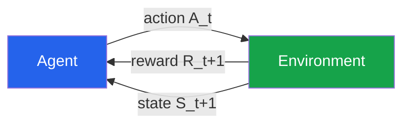
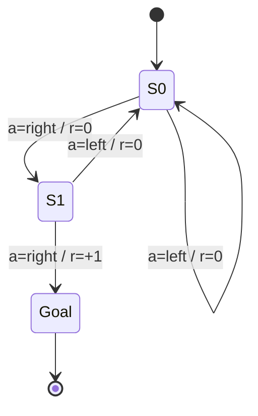
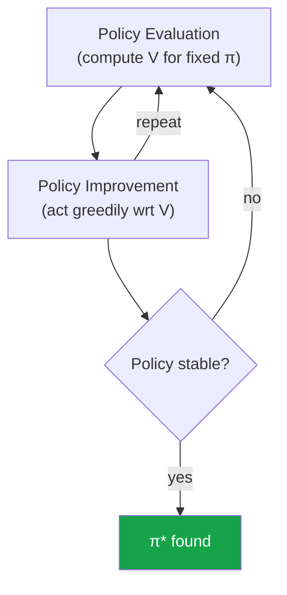
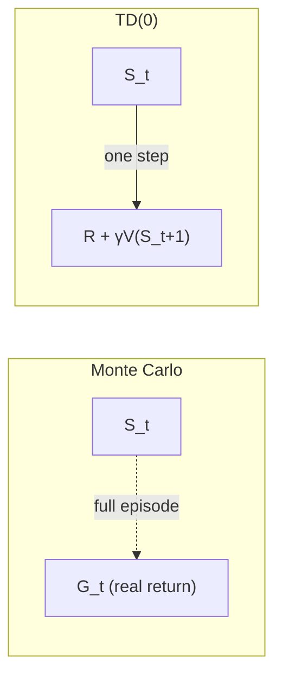
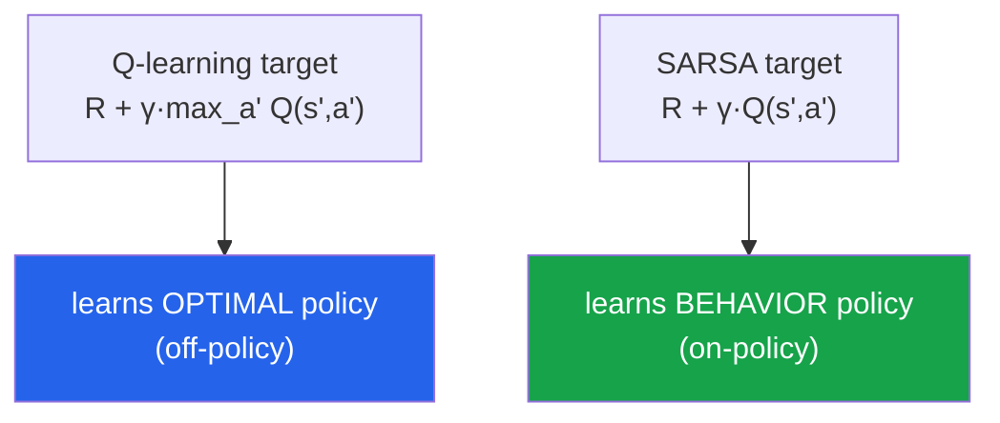
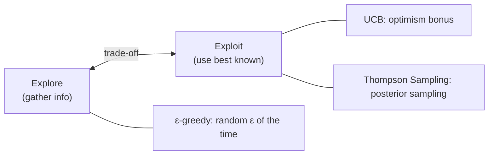
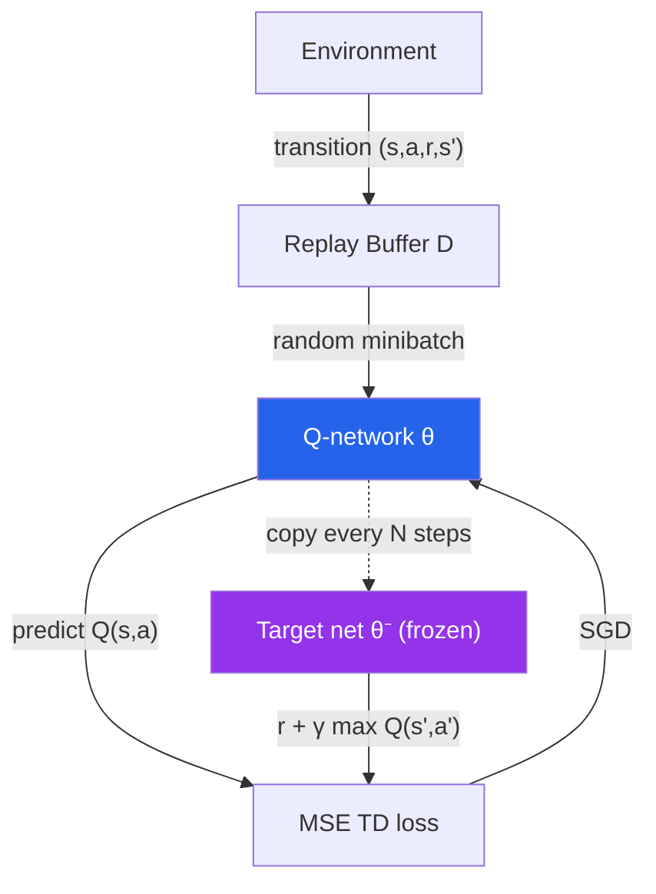
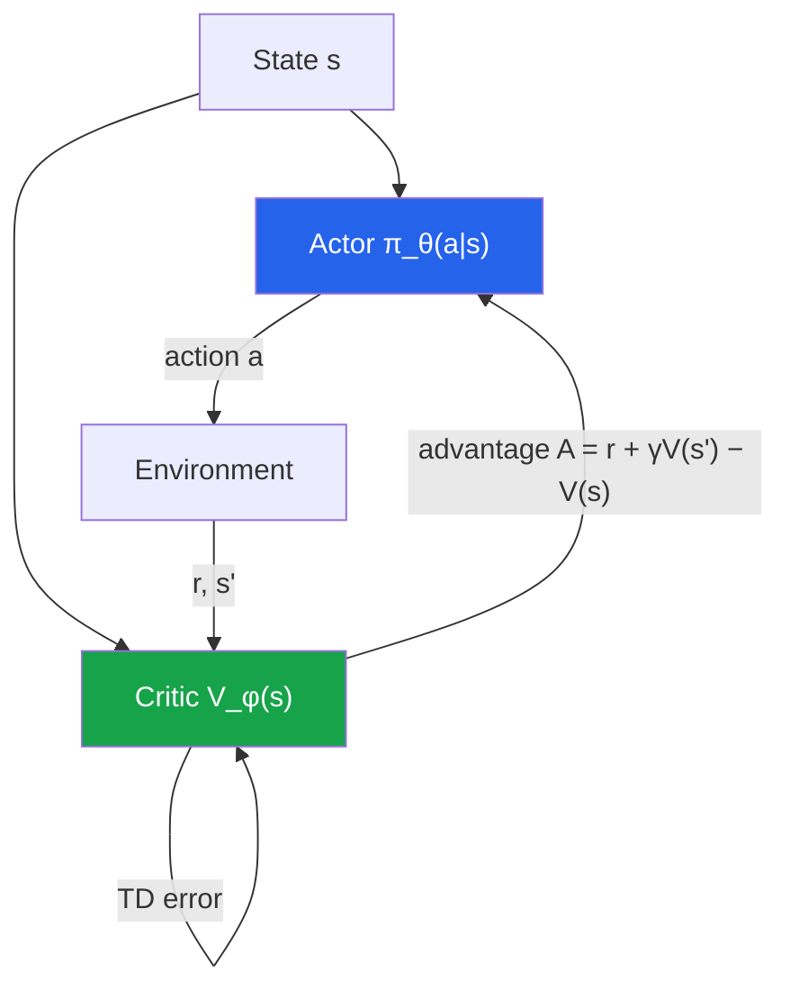
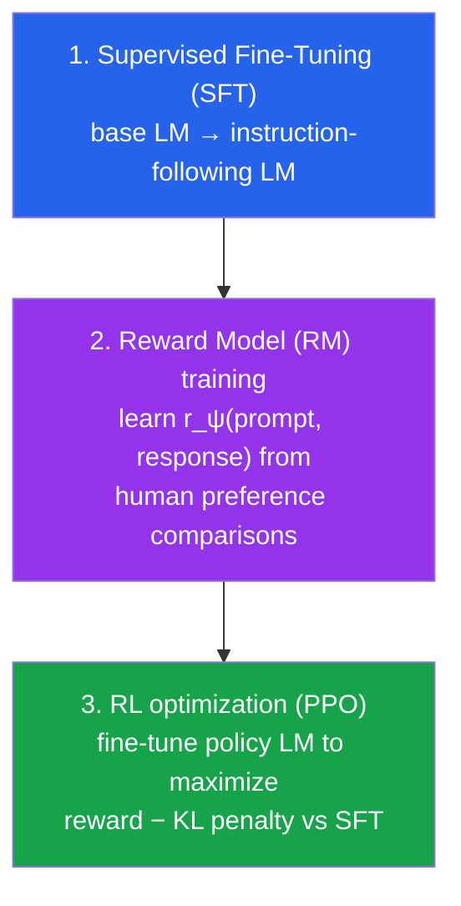

# Reinforcement Learning Fundamentals
*Learning to act by trial, error, and reward — from gridworlds to RLHF-aligned LLMs.*

*Part of the AI Engineering & ML Mastery Path — see the [index](../README.md) and [study plan](../MASTER-STUDY-PLAN.md).*

Supervised learning learns from a fixed dataset of labeled examples; reinforcement learning (RL) learns from **consequences**. An agent takes actions, the world reacts, and a scalar reward signal tells the agent how well it is doing — but never directly what the *right* action was. This single shift (evaluative feedback instead of instructive feedback) is what powers game-playing superhuman agents, robotic control, and — crucially for modern AI engineering — the alignment of large language models via **RLHF** (Reinforcement Learning from Human Feedback). By the end of this file you will understand the full chain from the Bellman equations to why **PPO** is the workhorse algorithm inside ChatGPT-style training, and why **DPO** is increasingly replacing the RL loop entirely.

---

## 🎯 Learning Objectives

By the end of this document you can:

- Describe the **agent–environment loop** and define state, action, reward, return, policy, and value precisely.
- Formalize a problem as a **Markov Decision Process (MDP)** and write down the **Bellman expectation and optimality equations**.
- Derive and implement the three **dynamic programming** algorithms: policy evaluation, policy iteration, value iteration.
- Distinguish **Monte Carlo** vs **Temporal-Difference** learning, and **SARSA** (on-policy) vs **Q-learning** (off-policy).
- Reason about **exploration vs exploitation** with ε-greedy and UCB, and connect **multi-armed bandits** to A/B testing.
- Explain **Deep Q-Networks** (experience replay, target networks) and the **policy-gradient** family (REINFORCE → Actor-Critic → A2C → **PPO**).
- Give a correct, end-to-end account of **RLHF / RLAIF** and **DPO** for LLM alignment, and place RL within the AI-engineering picture.
- Implement **tabular Q-learning** and a **bandit simulation** from scratch.

---

## 📋 Prerequisites

- [Probability & statistics](../math/02-probability.md) — expectations, conditional probability, distributions.
- [Linear algebra](../math/01-linear-algebra.md) — vectors and matrices (for value-iteration sweeps and function approximation).
- [Gradient descent & backprop](./03-neural-networks.md) — needed for DQN and policy gradients.
- [Python & NumPy](../tools/01-python-numpy.md) — all code here is NumPy / standard library.

---

## 📑 Table of Contents

1. [The RL Setting](#1-the-rl-setting)
2. [Markov Decision Processes & the Bellman Equations](#2-markov-decision-processes--the-bellman-equations)
3. [Dynamic Programming](#3-dynamic-programming)
4. [Model-Free Prediction: Monte Carlo & TD](#4-model-free-prediction-monte-carlo--td)
5. [Model-Free Control: SARSA & Q-learning](#5-model-free-control-sarsa--q-learning)
6. [Exploration vs Exploitation, Bandits & A/B Testing](#6-exploration-vs-exploitation-bandits--ab-testing)
7. [Function Approximation & Deep Q-Networks](#7-function-approximation--deep-q-networks)
8. [Policy-Gradient Methods: REINFORCE → PPO](#8-policy-gradient-methods-reinforce--ppo)
9. [RLHF, RLAIF & DPO for LLM Alignment](#9-rlhf-rlaif--dpo-for-llm-alignment)
10. [AlphaGo & MuZero](#10-alphago--muzero)
11. [From-Scratch Implementation](#-from-scratch-implementation)
12. [Knowledge Check](#-knowledge-check)
13. [Exercises](#️-exercises)
14. [Cheat Sheet](#-cheat-sheet)
15. [Further Resources](#-further-resources)
16. [What's Next](#️-whats-next)

---

## 1. The RL Setting

> 💡 **Intuition:** Imagine training a dog. You can't explain the rules of "sit"; you can only reward good behavior with treats. The dog explores actions, notices which ones precede treats, and gradually shifts its behavior. RL formalizes exactly this — an **agent** interacting with an **environment**, guided only by a scalar **reward**.

At each discrete time step $t$ the agent observes a **state** $S_t$, chooses an **action** $A_t$, and the environment responds with a **reward** $R_{t+1}$ and the next state $S_{t+1}$.



The core objects:

| Symbol | Name | Meaning |
|---|---|---|
| $S_t \in \mathcal{S}$ | **State** | Sufficient summary of the situation at time $t$. |
| $A_t \in \mathcal{A}$ | **Action** | What the agent does. |
| $R_{t+1} \in \mathbb{R}$ | **Reward** | Scalar feedback for the transition. |
| $\pi(a\mid s)$ | **Policy** | Agent's behavior: probability of action $a$ in state $s$. |
| $G_t$ | **Return** | Cumulative future reward from time $t$. |
| $\gamma \in [0,1]$ | **Discount factor** | How much future reward is worth now. |

**The return** is the quantity the agent maximizes — total discounted future reward:

$$G_t \;=\; R_{t+1} + \gamma R_{t+2} + \gamma^2 R_{t+3} + \cdots \;=\; \sum_{k=0}^{\infty} \gamma^k R_{t+k+1}.$$

Here $\gamma$ (the **discount factor**) trades off immediate vs delayed reward. With $\gamma = 0$ the agent is myopic (cares only about $R_{t+1}$); as $\gamma \to 1$ it becomes far-sighted. Discounting also keeps $G_t$ finite in **continuing** tasks (no natural end) and models the fact that a reward sooner is generally preferable to the same reward later.

> 🎯 **Key Insight:** The reward hypothesis — *all goals can be described as the maximization of expected cumulative reward.* Everything in RL flows from this one assumption.

**Episodic vs continuing tasks.** An **episodic** task has a terminal state and resets (a game of chess, one maze run); the return sums over the finite episode. A **continuing** task runs forever (a thermostat, a trading bot); here $\gamma < 1$ is what makes the infinite sum converge — assuming bounded rewards $|R| \le R_{\max}$:

$$|G_t| \le \sum_{k=0}^\infty \gamma^k R_{\max} = \frac{R_{\max}}{1-\gamma} < \infty.$$

> ⚠️ **Common Pitfall:** Confusing **reward** ($R_{t+1}$, an immediate signal) with **return** ($G_t$, the long-run sum) and with **value** (the *expected* return, defined next). A high immediate reward can lead to a low return; RL is precisely about not being fooled by that.

**Why it matters for AI/ML:** In RLHF the "environment" is a text generation episode, the "reward" is a learned reward model's score of the full response, and $\gamma$ is typically close to 1 because the meaningful signal arrives only at the end of the sequence.

---

## 2. Markov Decision Processes & the Bellman Equations

> 💡 **Intuition:** An MDP is the mathematical board game RL is played on. The key rule — the **Markov property** — is that the present state captures everything relevant: where you go next depends only on *where you are now* and *what you do*, not on the whole path that got you here.

### 2.1 The MDP tuple

A (finite) **Markov Decision Process** is a tuple $\langle \mathcal{S}, \mathcal{A}, P, R, \gamma \rangle$:

- $\mathcal{S}$ — set of states; $\mathcal{A}$ — set of actions.
- $P(s' \mid s, a) = \Pr(S_{t+1}=s' \mid S_t=s, A_t=a)$ — **transition dynamics**.
- $R(s,a) = \mathbb{E}[R_{t+1}\mid S_t=s, A_t=a]$ — expected reward.
- $\gamma$ — discount factor.

The **Markov property** states:

$$\Pr(S_{t+1}\mid S_t, A_t) = \Pr(S_{t+1}\mid S_1, A_1, \dots, S_t, A_t).$$



### 2.2 Value functions

The **state-value function** under policy $\pi$ is the expected return starting from $s$ and following $\pi$:

$$V^\pi(s) = \mathbb{E}_\pi\!\left[ G_t \mid S_t = s \right].$$

The **action-value function** (the **Q-function**) is the expected return starting from $s$, taking action $a$, then following $\pi$:

$$Q^\pi(s,a) = \mathbb{E}_\pi\!\left[ G_t \mid S_t = s, A_t = a \right].$$

> 🎯 **Key Insight:** $V$ tells you how good a *state* is; $Q$ tells you how good an *action in a state* is. $Q$ is more directly useful for control because you can pick the best action by comparing $Q$-values — no model of the environment needed.

### 2.3 The Bellman expectation equations

By splitting the return into "first reward + discounted rest," value functions satisfy a **recursive consistency** condition — the **Bellman equation**:

$$V^\pi(s) = \sum_a \pi(a\mid s) \sum_{s'} P(s'\mid s,a)\Big[ R(s,a) + \gamma V^\pi(s') \Big].$$

$$Q^\pi(s,a) = \sum_{s'} P(s'\mid s,a)\Big[ R(s,a) + \gamma \sum_{a'} \pi(a'\mid s') Q^\pi(s',a') \Big].$$

### 2.4 The Bellman optimality equations

The **optimal value functions** $V^*(s) = \max_\pi V^\pi(s)$ and $Q^*(s,a) = \max_\pi Q^\pi(s,a)$ satisfy:

$$V^*(s) = \max_a \sum_{s'} P(s'\mid s,a)\big[ R(s,a) + \gamma V^*(s') \big],$$

$$Q^*(s,a) = \sum_{s'} P(s'\mid s,a)\Big[ R(s,a) + \gamma \max_{a'} Q^*(s',a') \Big].$$

The optimal **policy** is then greedy with respect to $Q^*$:

$$\pi^*(s) = \arg\max_a Q^*(s,a).$$

> ⚠️ **Common Pitfall:** The Bellman *expectation* equation is **linear** (you can solve it directly as $V = (I - \gamma P_\pi)^{-1} r_\pi$). The Bellman *optimality* equation contains a $\max$ and is **non-linear** — that's why we need iterative methods like value iteration rather than a one-shot matrix inverse.

**Worked example by hand.** Consider a tiny 2-state chain $s_0, s_1$ with one action that always moves right, $\gamma = 0.9$. Rewards: $s_0 \to s_1$ gives $0$; $s_1 \to s_1$ (absorbing) gives $+1$ forever. Then:

$$V(s_1) = 1 + 0.9\,V(s_1) \implies V(s_1)(1-0.9)=1 \implies V(s_1) = 10.$$
$$V(s_0) = 0 + 0.9\,V(s_1) = 0.9 \times 10 = 9.$$

So being one step from the reward stream is worth $9$, and being in it is worth $10$ — exactly what discounting predicts.

**Why it matters for AI/ML:** Every value-based RL algorithm (Q-learning, DQN) is ultimately *solving the Bellman optimality equation by iterative approximation*. Recognizing that equation in the loss function is the key to reading any RL paper.

---

## 3. Dynamic Programming

Dynamic programming (DP) solves an MDP **when the dynamics $P$ and $R$ are fully known**. It's the "perfect-information" baseline; everything model-free comes later.



### 3.1 Policy evaluation

Given a fixed policy $\pi$, repeatedly apply the Bellman expectation equation as an update until convergence:

$$V_{k+1}(s) \leftarrow \sum_a \pi(a\mid s)\sum_{s'} P(s'\mid s,a)\big[R(s,a)+\gamma V_k(s')\big].$$

This is a **contraction mapping** with modulus $\gamma$, so $V_k \to V^\pi$ geometrically.

### 3.2 Policy iteration

Alternate **evaluation** (compute $V^\pi$) and **improvement** (set $\pi'(s) = \arg\max_a Q^\pi(s,a)$). The **policy improvement theorem** guarantees each step is at least as good, and for finite MDPs this converges to $\pi^*$ in a finite number of iterations.

### 3.3 Value iteration

Skip waiting for full evaluation — fold improvement directly into the update by using the Bellman *optimality* operator:

$$V_{k+1}(s) \leftarrow \max_a \sum_{s'} P(s'\mid s,a)\big[R(s,a)+\gamma V_k(s')\big].$$

```python
import numpy as np

# Value iteration on a 4-state chain: states 0..3, action moves right,
# reward +1 only on reaching terminal state 3. gamma = 0.9.
n_states = 4
gamma = 0.9
R = np.array([0.0, 0.0, 0.0, 1.0])   # reward for *being* in next state
V = np.zeros(n_states)

for _ in range(100):
    V_new = V.copy()
    for s in range(n_states - 1):          # state 3 is terminal
        nxt = s + 1
        V_new[s] = R[nxt] + gamma * V[nxt]  # deterministic transition
    if np.max(np.abs(V_new - V)) < 1e-9:
        break
    V = V_new

print(np.round(V, 4))
# Expected output: [0.729 0.81  0.9   0.   ]
#   V(2)=1, discounted: V(2)=0.9, V(1)=0.81, V(0)=0.729
```

> 📝 **Tip:** Policy iteration takes few *outer* iterations but each is expensive (full evaluation). Value iteration takes many cheap sweeps. **Generalized Policy Iteration (GPI)** — the idea that *any* interleaving of partial evaluation and partial improvement converges — is the unifying theme behind nearly all RL algorithms.

> ⚠️ **Common Pitfall:** DP requires a **known model**. The whole point of model-free RL (next sections) is to drop that assumption and learn directly from sampled experience.

---

## 4. Model-Free Prediction: Monte Carlo & TD

Now we **don't know $P$ or $R$** — we only get to *sample* episodes. The prediction problem: estimate $V^\pi$ from experience.

### 4.1 Monte Carlo (MC)

> 💡 **Intuition:** To estimate the value of a state, just play many full episodes from it and average the returns you actually observed. No model, no bootstrapping — only real, complete returns.

$$V(S_t) \leftarrow V(S_t) + \alpha\big[G_t - V(S_t)\big],$$

where $G_t$ is the **actual return** observed for the rest of the episode and $\alpha$ is a step size. MC is **unbiased** but **high variance** and requires episodes to *terminate*.

### 4.2 Temporal-Difference TD(0)

> 💡 **Intuition:** Don't wait for the episode to end. After one step, you already have a better guess of the return — the reward you just got plus your current estimate of the next state. Update toward *that*. This is **bootstrapping**: learning a guess from a guess.

$$V(S_t) \leftarrow V(S_t) + \alpha\big[\underbrace{R_{t+1} + \gamma V(S_{t+1})}_{\text{TD target}} - V(S_t)\big].$$

The bracketed quantity $\delta_t = R_{t+1} + \gamma V(S_{t+1}) - V(S_t)$ is the **TD error** — arguably the single most important quantity in RL (it even has a neuroscience analogue: dopamine signals track something remarkably like $\delta_t$).

| Property | Monte Carlo | TD(0) |
|---|---|---|
| Needs episode to end? | Yes | No (online) |
| Bias | Unbiased | Biased (bootstraps) |
| Variance | High | Low |
| Works for continuing tasks? | No | Yes |
| Uses Markov property? | No | Yes (more efficient when it holds) |



> 🎯 **Key Insight:** TD blends the sampling of MC with the bootstrapping of DP. **TD(λ)** with eligibility traces interpolates smoothly between TD(0) ($\lambda=0$) and MC ($\lambda=1$).

**Why it matters for AI/ML:** The TD error is the learning signal inside DQN and the *critic* of every actor-critic method, including the value head used in PPO during RLHF.

---

## 5. Model-Free Control: SARSA & Q-learning

Control = finding a *good policy*, not just evaluating a fixed one. Both methods learn the **action-value $Q(s,a)$** and act greedily (with exploration) toward it.

### 5.1 SARSA — on-policy

The name comes from the tuple it uses: $(S_t, A_t, R_{t+1}, S_{t+1}, A_{t+1})$.

$$Q(S_t,A_t) \leftarrow Q(S_t,A_t) + \alpha\big[R_{t+1} + \gamma\, Q(S_{t+1}, A_{t+1}) - Q(S_t,A_t)\big].$$

SARSA is **on-policy**: it evaluates and improves the *same* policy it uses to act (including its exploration). It learns the value of the policy it actually follows.

### 5.2 Q-learning — off-policy

$$Q(S_t,A_t) \leftarrow Q(S_t,A_t) + \alpha\big[R_{t+1} + \gamma\, \max_{a'} Q(S_{t+1}, a') - Q(S_t,A_t)\big].$$

The only change is $\max_{a'}$ instead of $Q(S_{t+1},A_{t+1})$. Q-learning is **off-policy**: it learns the value of the *greedy* (optimal) policy while *behaving* with an exploratory one. It's directly approximating the Bellman **optimality** equation.



> 🎯 **Key Insight — Cliff Walking:** On a gridworld with a cliff, **Q-learning** learns the optimal path right along the cliff edge (the shortest route) but, because it still *explores* with ε-greedy, occasionally falls off during training. **SARSA** learns a safer path away from the edge because it accounts for the exploratory falls in its value estimates. Off-policy chases optimality; on-policy respects the behavior it actually executes.

> ⚠️ **Common Pitfall:** Q-learning's $\max$ operator introduces **maximization bias** (it systematically overestimates Q because $\mathbb{E}[\max] \ge \max \mathbb{E}$). **Double Q-learning** fixes this by decoupling action *selection* from action *evaluation* — the same idea later used in Double DQN.

### 5.3 ASCII gridworld and Q-table

A 3×4 gridworld. `S` = start, `G` = goal (+1), `#` = wall, `X` = pit (−1):

```
+----+----+----+----+
| S  |    |    | G  |   row 0   (G = +1 terminal)
+----+----+----+----+
|    | #  |    | X  |   row 1   (# wall, X = -1 terminal)
+----+----+----+----+
|    |    |    |    |   row 2
+----+----+----+----+
```

After Q-learning converges, the Q-table (one row per state, four action columns) looks like:

```
state(r,c)  |  UP    DOWN   LEFT   RIGHT  | greedy
------------+----------------------------+--------
 (0,0)  S   | 0.59  0.59   0.59   0.66   |  RIGHT  -->
 (0,1)      | 0.66  0.66   0.59   0.73   |  RIGHT  -->
 (0,2)      | 0.73  0.66   0.66   0.81   |  RIGHT  -->
 (0,3)  G   |  ----  terminal (+1) ----  |   ---
 (2,0)      | 0.53  0.48   0.48   0.59   |  UP/RT
 ...        |                            |
```

The **greedy column** is the learned policy: from start `S`, head RIGHT along the top row straight to the goal.

**Why it matters for AI/ML:** Q-learning is the conceptual ancestor of DQN, which first achieved human-level play on Atari from raw pixels — and that result kicked off the modern deep-RL era.

---

## 6. Exploration vs Exploitation, Bandits & A/B Testing

> 💡 **Intuition:** A restaurant dilemma — do you return to your reliable favorite (**exploit**) or try the new place that might be better (**explore**)? Always exploiting means you may never discover the best option; always exploring means you never cash in. Balancing the two optimally is the core tension of RL.

### 6.1 Multi-armed bandits

A **$k$-armed bandit** is the simplest RL problem: one state, $k$ actions ("arms"), each with an unknown reward distribution. Pull arms to maximize total reward. There's no sequential dynamics — just the explore/exploit tradeoff in pure form.

We measure performance by **regret** — how much worse we did than always pulling the best arm $a^*$:

$$\text{Regret}(T) = \sum_{t=1}^{T}\big(\mu_{a^*} - \mu_{A_t}\big), \qquad \mu_a = \mathbb{E}[\text{reward of arm } a].$$

### 6.2 ε-greedy

With probability $1-\varepsilon$ pick the current-best arm (exploit); with probability $\varepsilon$ pick a random arm (explore). Simple and effective; usually paired with **ε-decay** (start exploratory, become greedy).

### 6.3 Upper Confidence Bound (UCB)

Be **optimistic under uncertainty**: pick the arm with the highest upper confidence bound.

$$A_t = \arg\max_a \left[ \hat\mu_a + c\sqrt{\frac{\ln t}{N_a}} \right],$$

where $\hat\mu_a$ is the estimated mean of arm $a$, $N_a$ is the number of times it's been pulled, and $c>0$ controls exploration. Rarely-pulled arms get a large bonus, so UCB explores *systematically* rather than randomly and achieves $O(\log T)$ regret.



### 6.4 The A/B-testing link

> 🎯 **Key Insight:** A classic **A/B test** is a *pure-exploration* bandit — split traffic 50/50, then commit. A **bandit algorithm** (e.g. Thompson Sampling) is *adaptive*: it shifts traffic toward the winning variant *during* the experiment, reducing the regret (lost conversions) you pay while learning. That's why "multi-armed bandit testing" is offered by optimization platforms — it minimizes the cost of experimentation when you mostly care about cumulative outcome, not a clean statistical readout.

| | A/B test | Bandit |
|---|---|---|
| Allocation | Fixed (e.g. 50/50) | Adaptive |
| Goal | Statistical significance | Maximize cumulative reward |
| Regret during test | High | Low |
| Best when | You need a clean causal estimate | You care about earnings while learning |

> ⚠️ **Common Pitfall:** Bandits optimize *cumulative* reward, which can under-explore inferior arms and give you a noisier estimate of each arm's true effect. If the *decision* (a clean, defensible significance result) matters more than the in-test earnings, a fixed A/B test is still the right tool.

**Why it matters for AI/ML:** Exploration strategies are how recommender systems, ad auctions, and online learning systems avoid getting stuck on locally-good-but-globally-suboptimal choices.

---

## 7. Function Approximation & Deep Q-Networks

Tabular methods store one value per state — impossible when states are images or text (the **curse of dimensionality**). The fix: approximate $Q(s,a;\theta)$ with a parameterized function (a neural network) and learn $\theta$.

### 7.1 The deadly triad

Combining **function approximation + bootstrapping + off-policy** learning can diverge — Sutton & Barto call this the **deadly triad**. DQN's tricks exist largely to tame it.

### 7.2 Deep Q-Networks (DQN)

DQN (Mnih et al., 2015, *Nature*) learned to play Atari from raw pixels. It minimizes the TD error as a regression loss:

$$L(\theta) = \mathbb{E}_{(s,a,r,s')\sim \mathcal{D}}\!\left[\Big(\underbrace{r + \gamma \max_{a'} Q(s',a';\theta^-)}_{\text{target, uses }\theta^-} - Q(s,a;\theta)\Big)^2\right].$$

Two innovations make it stable:

1. **Experience replay** — store transitions $(s,a,r,s')$ in a buffer $\mathcal{D}$ and train on random minibatches. This **breaks temporal correlation** between consecutive samples and reuses data efficiently.
2. **Target network** — keep a *frozen* copy $\theta^-$ of the weights for computing the TD target, syncing it to $\theta$ only every $N$ steps. This stops the target from chasing a moving prediction (you're not "regressing toward yourself"), which would cause oscillation/divergence.



> 📝 **Tip:** Notable DQN descendants: **Double DQN** (reduces maximization bias), **Dueling DQN** (separates state-value and advantage streams), **Prioritized Experience Replay** (samples high-TD-error transitions more often), and **Rainbow** (combines them all).

> ⚠️ **Common Pitfall:** Without the target network, training the same network that produces both the prediction *and* the target creates a feedback loop that often diverges. The frozen target is not optional polish — it's load-bearing.

**Why it matters for AI/ML:** DQN proved deep nets could serve as value functions over high-dimensional perceptual input. But DQN is limited to **discrete** action spaces — for continuous control and for LLMs (huge discrete action spaces = the vocabulary), we turn to policy gradients.

---

## 8. Policy-Gradient Methods: REINFORCE → PPO

> 💡 **Intuition:** Instead of learning values and *deriving* a policy, **directly** parameterize the policy $\pi_\theta(a\mid s)$ and nudge $\theta$ to make good actions more likely. Think of it as "turning up the probability of trajectories that earned high return."

### 8.1 The policy-gradient theorem

We maximize expected return $J(\theta) = \mathbb{E}_{\tau\sim\pi_\theta}[G(\tau)]$. The **policy-gradient theorem** gives a gradient we can estimate from samples — without differentiating through the environment:

$$\nabla_\theta J(\theta) = \mathbb{E}_{\pi_\theta}\!\left[ \sum_t \nabla_\theta \log \pi_\theta(A_t\mid S_t)\, G_t \right].$$

> 🎯 **Key Insight:** The term $\nabla_\theta \log \pi_\theta(a\mid s)$ is the **score function** — it points in the direction that increases the probability of action $a$. Weighting it by the return $G_t$ means "increase probability in proportion to how good the outcome was." That's the whole idea.

### 8.2 REINFORCE and baselines

**REINFORCE** (Williams, 1992) is the Monte-Carlo policy gradient: run an episode, then update with the formula above using the actual return $G_t$. It's unbiased but **high variance**.

Subtracting a state-dependent **baseline** $b(S_t)$ reduces variance without adding bias:

$$\nabla_\theta J(\theta) = \mathbb{E}_{\pi_\theta}\!\left[ \sum_t \nabla_\theta \log \pi_\theta(A_t\mid S_t)\,\big(G_t - b(S_t)\big) \right].$$

The natural baseline is the value function $V(S_t)$, which turns the weight into the **advantage**:

$$A(s,a) = Q(s,a) - V(s) \quad\text{(``how much better than average is this action?'')}.$$

### 8.3 Actor-Critic and A2C

Use *two* networks: an **actor** $\pi_\theta$ that picks actions and a **critic** $V_\phi$ that estimates value and supplies the baseline/advantage. The critic is trained with TD; the actor is trained with the policy gradient using the critic's advantage estimate. **A2C** (Advantage Actor-Critic) is the clean synchronous version; **A3C** is its asynchronous predecessor.



### 8.4 PPO — the workhorse

Vanilla policy gradients are fragile: one big step can destroy the policy, and you can't reuse data (on-policy). **Proximal Policy Optimization** (Schulman et al., 2017) fixes both by (a) allowing several minibatch epochs per batch of data and (b) **clipping** the update so the new policy can't move too far from the old one.

Let $r_t(\theta) = \dfrac{\pi_\theta(a_t\mid s_t)}{\pi_{\theta_{\text{old}}}(a_t\mid s_t)}$ be the probability ratio. PPO maximizes the **clipped surrogate objective**:

$$L^{\text{CLIP}}(\theta) = \mathbb{E}_t\!\left[ \min\Big( r_t(\theta)\hat{A}_t,\; \text{clip}\big(r_t(\theta),\, 1-\epsilon,\, 1+\epsilon\big)\hat{A}_t \Big) \right].$$

The $\min$ + clip means: if an action was good ($\hat A_t>0$), increase its probability — but stop benefiting once the ratio exceeds $1+\epsilon$ (typically $\epsilon=0.2$). This caps how far each update moves the policy, giving stability *without* the expensive second-order computation of its predecessor TRPO.

> 🎯 **Key Insight:** PPO is the workhorse because it is **simple to implement, sample-efficient enough, stable, and robust to hyperparameters**. That combination — not peak performance on any one benchmark — is exactly what you want when the "environment" is a 100B-parameter language model you can only afford to train once. This is why PPO became the default in RLHF.

> ⚠️ **Common Pitfall:** The clip does **not** bound the KL divergence directly; it bounds the *per-sample probability ratio*. Many implementations *also* add a KL penalty or early-stop on KL to keep the policy from drifting — especially important in RLHF, where drifting away from the base LM degrades fluency.

**Why it matters for AI/ML:** PPO is the bridge from "RL for games" to "RL for aligning LLMs" — the exact algorithm in the next section.

---

## 9. RLHF, RLAIF & DPO for LLM Alignment

This is where RL becomes a pillar of modern **AI engineering**. A pretrained LLM predicts likely next tokens; it is not inherently *helpful, harmless, or honest*. **Alignment** steers it toward human preferences — and the canonical recipe is **RLHF**.

### 9.1 The three stages of RLHF



**Stage 1 — SFT.** Fine-tune the base model on high-quality demonstration data (prompt → ideal response) so it follows instructions at all.

**Stage 2 — Reward model.** Humans are shown two responses $(y_w, y_l)$ to the same prompt $x$ and label which they prefer ($y_w$ = winner, $y_l$ = loser). Train a reward model $r_\psi(x,y)$ to score responses, using the **Bradley–Terry** preference model:

$$\Pr(y_w \succ y_l \mid x) = \sigma\big(r_\psi(x,y_w) - r_\psi(x,y_l)\big), \quad \sigma(z)=\frac{1}{1+e^{-z}}.$$

The RM is trained to minimize $-\log \sigma\big(r_\psi(x,y_w) - r_\psi(x,y_l)\big)$ over the preference dataset.

**Stage 3 — PPO.** Treat the LLM as a **policy** $\pi_\theta$. The "state" is the prompt + tokens generated so far; the "action" is the next token; the "reward" is the RM score of the completed response. Optimize with PPO, but add a **per-token KL penalty** against the frozen SFT model $\pi_{\text{ref}}$ to prevent the policy from drifting into gibberish that games the reward:

$$\text{reward}(x,y) = r_\psi(x,y) - \beta\, \mathrm{KL}\big(\pi_\theta(\cdot\mid x)\,\|\,\pi_{\text{ref}}(\cdot\mid x)\big).$$

> 🎯 **Key Insight:** The KL term is the safety leash. Without it, PPO discovers **reward-model hacks** — degenerate text the imperfect RM scores highly but humans hate. RLHF is a delicate balance between climbing the reward and not straying too far from a fluent base model.

### 9.2 RLAIF — AI feedback instead of human

**RLAIF** (Reinforcement Learning from *AI* Feedback) replaces the expensive human labelers in Stage 2 with an LLM that judges responses according to a written set of principles (a "constitution," as in Anthropic's **Constitutional AI**). It scales preference data collection cheaply; studies have found RLAIF can match or approach RLHF quality on several tasks. The RL machinery (Stage 3) is otherwise identical.

### 9.3 DPO — skipping the RL loop

The full RLHF pipeline is operationally heavy: train an RM, then run an unstable on-policy PPO loop with four models in memory (policy, reference, reward, value). **Direct Preference Optimization** (Rafailov et al., 2023) asks: *can we optimize the preference objective directly on the policy, with no separate reward model and no RL?*

The DPO insight is a clean piece of math: the optimal RLHF policy has a closed-form relationship to the reward, so the reward can be **expressed in terms of the policy itself**. Substituting that into the Bradley–Terry loss yields a simple **supervised classification loss** on preference pairs:

$$L_{\text{DPO}} = -\,\mathbb{E}_{(x,y_w,y_l)}\!\left[ \log \sigma\!\left( \beta \log\frac{\pi_\theta(y_w\mid x)}{\pi_{\text{ref}}(y_w\mid x)} - \beta \log\frac{\pi_\theta(y_l\mid x)}{\pi_{\text{ref}}(y_l\mid x)} \right) \right].$$

In words: increase the policy's relative log-probability of the preferred response and decrease it for the rejected one, all measured against the frozen reference model. No reward model, no sampling, no PPO.

| | RLHF (PPO) | DPO |
|---|---|---|
| Separate reward model? | Yes | **No** |
| Online sampling / RL loop? | Yes (PPO) | **No** (supervised on a fixed preference set) |
| Models in memory | up to 4 | 2 (policy + frozen ref) |
| Stability / tuning burden | High | Lower |
| Flexibility (e.g. online exploration) | Higher | Lower (offline by default) |

> 📝 **Tip:** DPO has become the default for many open-weight alignment efforts because it's far easier to get working. PPO-style RLHF still tends to win at the frontier when teams can afford its complexity and want online exploration; variants like **GRPO** (used for reasoning models, dropping the value network) and **KTO** continue the lineage.

> ⚠️ **Common Pitfall:** DPO is **not reward-model-free in spirit** — it implicitly defines a reward through the policy/reference log-ratio. It also assumes your preference data covers the response distribution well; because it's offline, it can't explore new responses the way PPO can. "DPO is strictly better" is an over-simplification.

**Why it matters for AI/ML:** Understanding this section is what lets an AI engineer reason about *why* a fine-tuned model behaves as it does, choose between SFT / DPO / full RLHF for a given budget, and debug reward-hacking and over-optimization. RL is no longer a niche — it is the alignment layer of every major chat model.

---

## 10. AlphaGo & MuZero

A brief tour of the landmark systems that combined RL with **search**:

- **AlphaGo (2016)** — defeated Lee Sedol at Go. Combined a **policy network** and **value network** (trained by supervised learning on human games, then self-play RL) with **Monte Carlo Tree Search (MCTS)** to look ahead. Search + learned evaluation was the winning formula.
- **AlphaGo Zero (2017)** — removed human data entirely; learned Go *tabula rasa* from self-play alone with a single network, surpassing the original.
- **AlphaZero (2018)** — generalized the same algorithm to chess, shogi, and Go with no game-specific knowledge beyond the rules.
- **MuZero (2020)** — the big leap: it learns a **model of the environment in a latent space** (predicting reward, value, and policy) and plans with MCTS *without being told the rules*. It matched AlphaZero on board games and reached state-of-the-art on Atari — unifying model-based planning with model-free learning.


> 🎯 **Key Insight:** The recurring lesson is **"learning + search."** A learned value/policy guides a search that, in turn, generates better training targets — a virtuous cycle. This same learning-plus-search idea now reappears in LLM **test-time reasoning** (e.g. tree-of-thought, verifier-guided sampling).

---

## 🧮 From-Scratch Implementation

Tabular Q-learning on a gridworld, NumPy + standard library only. Mentally executable; expected output shown.

```python
import numpy as np

np.random.seed(0)

# ---- Environment: 4x4 gridworld -------------------------------------------
# State = (row, col) flattened to row*4 + col. Start = 0 (top-left).
# Goal = 15 (bottom-right), reward +1 and terminal. Step reward = 0.
# Actions: 0=up, 1=down, 2=left, 3=right.
N_ROWS, N_COLS = 4, 4
N_STATES = N_ROWS * N_COLS
N_ACTIONS = 4
GOAL = 15

def step(state, action):
    r, c = divmod(state, N_COLS)
    if action == 0: r = max(r - 1, 0)
    elif action == 1: r = min(r + 1, N_ROWS - 1)
    elif action == 2: c = max(c - 1, 0)
    elif action == 3: c = min(c + 1, N_COLS - 1)
    nxt = r * N_COLS + c
    reward = 1.0 if nxt == GOAL else 0.0
    done = (nxt == GOAL)
    return nxt, reward, done

# ---- Q-learning with epsilon decay ----------------------------------------
Q = np.zeros((N_STATES, N_ACTIONS))
alpha, gamma = 0.1, 0.95
eps, eps_min, eps_decay = 1.0, 0.05, 0.995
episodes = 2000

for ep in range(episodes):
    s = 0
    for _ in range(100):                      # max steps per episode
        if np.random.rand() < eps:
            a = np.random.randint(N_ACTIONS)  # explore
        else:
            a = int(np.argmax(Q[s]))          # exploit
        s2, r, done = step(s, a)
        # Q-learning update (off-policy: uses max over next actions)
        Q[s, a] += alpha * (r + gamma * np.max(Q[s2]) - Q[s, a])
        s = s2
        if done:
            break
    eps = max(eps_min, eps * eps_decay)

# ---- Show the greedy policy ------------------------------------------------
arrows = {0: 'U', 1: 'D', 2: 'L', 3: 'R'}
policy = [arrows[int(np.argmax(Q[s]))] for s in range(N_STATES)]
policy[GOAL] = 'G'
for r in range(N_ROWS):
    print(' '.join(policy[r * N_COLS:(r + 1) * N_COLS]))

# Expected output (an optimal path bends down-and-right toward the goal):
# R R R D
# R R R D
# R R R D
# R R R G
```

The learned policy steers every state toward the goal (state 15) along a shortest path. Try lowering `episodes` or raising `eps_min` to watch the policy degrade — a hands-on feel for exploration's role.

---

## ❓ Knowledge Check

<details><summary>Q1. What is the difference between reward, return, and value?</summary>

**Reward** $R_{t+1}$ is the immediate scalar signal from a single transition. **Return** $G_t = \sum_k \gamma^k R_{t+k+1}$ is the (discounted) sum of all future rewards from time $t$ in one trajectory. **Value** $V^\pi(s) = \mathbb{E}_\pi[G_t \mid S_t=s]$ is the *expected* return under a policy — an average over trajectories. Reward is instantaneous; return is per-trajectory; value is the expectation.
</details>

<details><summary>Q2. Why do we need a discount factor γ, and what does γ = 0 vs γ → 1 mean?</summary>

$\gamma$ makes the infinite return finite in continuing tasks (the geometric series $\sum \gamma^k R_{\max} = R_{\max}/(1-\gamma)$ converges for $\gamma<1$), and it encodes a preference for sooner rewards. $\gamma=0$ → a myopic agent that maximizes only the next reward; $\gamma\to 1$ → a far-sighted agent weighting distant rewards almost as much as immediate ones.
</details>

<details><summary>Q3. State the Markov property in one sentence and why it matters.</summary>

The next state depends only on the current state and action, not on the full history: $\Pr(S_{t+1}\mid S_t,A_t) = \Pr(S_{t+1}\mid \text{history})$. It matters because it lets value functions satisfy a *recursive* (Bellman) equation, which is the foundation of all DP and TD methods.
</details>

<details><summary>Q4. Why is the Bellman optimality equation harder to solve than the Bellman expectation equation?</summary>

The expectation equation is **linear** in $V$ (no $\max$), so it can be solved directly via matrix inversion $V=(I-\gamma P_\pi)^{-1}r_\pi$. The optimality equation contains a $\max_a$, making it **non-linear**; there is no closed-form inverse, so we use iterative contraction methods (value iteration) instead.
</details>

<details><summary>Q5. Compare Monte Carlo and TD(0) on bias, variance, and online-ness.</summary>

MC uses the *actual* return, so it's **unbiased** but **high variance** and needs episodes to terminate. TD(0) bootstraps off its own estimate $R+\gamma V(S')$, so it's **biased** but **low variance**, and learns **online** after every step (works for continuing tasks). TD typically learns faster in practice when the Markov property holds.
</details>

<details><summary>Q6. SARSA vs Q-learning: which is on-policy, which is off-policy, and what changes in the update?</summary>

**SARSA** is **on-policy**: target $R + \gamma Q(S',A')$ uses the *actually taken* next action $A'$, so it evaluates the behavior policy (including exploration). **Q-learning** is **off-policy**: target $R + \gamma \max_{a'} Q(S',a')$ uses the greedy next action regardless of what's executed, so it learns the optimal policy. The only formula change is $Q(S',A') \to \max_{a'}Q(S',a')$.
</details>

<details><summary>Q7. How does an adaptive bandit differ from a fixed A/B test, and when prefer each?</summary>

A fixed A/B test keeps allocation constant (e.g. 50/50) and aims for a clean significance estimate; a bandit shifts traffic toward the winner *during* the test to minimize regret (lost conversions). Use a bandit when you mainly care about cumulative earnings while learning; use a fixed A/B test when you need a defensible, low-variance causal estimate of each variant's effect.
</details>

<details><summary>Q8. What problems do experience replay and the target network each solve in DQN?</summary>

**Experience replay** breaks the temporal correlation between consecutive samples (which violates the i.i.d. assumption of SGD) and improves data efficiency by reusing transitions. The **target network** (frozen weights $\theta^-$) stops the TD target from chasing the constantly-updating prediction, removing a feedback loop that otherwise causes oscillation or divergence.
</details>

<details><summary>Q9. Why is PPO the workhorse for RLHF rather than vanilla policy gradient or DQN?</summary>

DQN needs a small **discrete** action space and a $\max$ over actions — infeasible for the huge token vocabulary and not designed for sequence generation. Vanilla policy gradient is **unstable** (one bad step can wreck the policy) and on-policy-only (no data reuse). PPO's **clipped surrogate** caps each update's size for stability while allowing several epochs per batch — simple, robust, and sample-efficient enough to fine-tune a giant LM you can only train once.
</details>

<details><summary>Q10. What does DPO eliminate from the RLHF pipeline, and what's the trade-off?</summary>

DPO eliminates the **separate reward model** and the **online PPO/RL loop**, turning alignment into a single supervised classification loss on preference pairs (against a frozen reference model). Trade-off: it's **offline** — it can't explore new responses the way PPO can, and it assumes the preference data covers the response distribution well. PPO retains an edge when online exploration and frontier quality matter and the team can absorb its complexity.
</details>

---

## 🏋️ Exercises

<details><summary>Exercise 1 (easy): Tweak γ in value iteration and predict the values.</summary>

**Task:** In the §3 chain example, change $\gamma$ from $0.9$ to $0.5$. Predict $V(s_0), V(s_1), V(s_2)$ before running.

**Solution:** With reward only on reaching the terminal state and deterministic right-moves: $V(\text{one before goal}) = \gamma^0\cdot 1$ path... working backward from the goal, $V(2)=0.5,\;V(1)=0.25,\;V(0)=0.125$ (each step multiplies by $\gamma=0.5$). A smaller $\gamma$ shrinks the influence of the distant reward, so states far from the goal are valued much less. Running the §3 code with `gamma = 0.5` confirms `[0.125 0.25 0.5 0.]`.
</details>

<details><summary>Exercise 2 (easy): Bandit simulation — ε-greedy vs greedy.</summary>

**Task:** Simulate a 3-armed Bernoulli bandit (true means 0.2, 0.5, 0.8). Compare a pure-greedy agent (ε=0) to ε-greedy (ε=0.1) over 1000 pulls.

**Solution:**
```python
import numpy as np
np.random.seed(1)

true_p = np.array([0.2, 0.5, 0.8])
def run(eps, steps=1000):
    Q = np.zeros(3); N = np.zeros(3); total = 0.0
    for t in range(steps):
        a = np.random.randint(3) if np.random.rand() < eps else int(np.argmax(Q))
        r = float(np.random.rand() < true_p[a])
        N[a] += 1
        Q[a] += (r - Q[a]) / N[a]      # incremental sample-average
        total += r
    return total, Q

for eps in (0.0, 0.1):
    total, Q = run(eps)
    print(f"eps={eps}: reward={total:.0f}, Q={np.round(Q,2)}")
# Typical output:
# eps=0.0: reward~520, Q may lock onto a suboptimal arm if it got unlucky early
# eps=0.1: reward~760, Q close to [0.2 0.5 0.8] -> finds the best arm (0.8)
```
**Takeaway:** the pure-greedy agent can get *stuck* on whichever arm happened to win its first samples; ε-greedy keeps exploring and reliably converges to the 0.8 arm. Try adding UCB and compare regret.
</details>

<details><summary>Exercise 3 (medium): Add epsilon decay and a wall/pit to the gridworld.</summary>

**Task:** Extend the §From-Scratch Q-learning code: add a wall at state 5 (agent can't enter; movement into it is a no-op) and a pit at state 10 (reward −1, terminal). Verify the learned policy routes *around* the pit.

**Solution sketch:** In `step`, after computing `nxt`, add `if nxt == 5: nxt = state` (bounce off wall). Add `PIT = 10`; set `reward = -1.0; done = True` when `nxt == PIT`. Keep the same Q-learning loop. After training, print the greedy arrows: the policy should avoid steering into state 10 and instead detour, because Q-values around the pit become negative. The ε-decay (already present) ensures enough early exploration to *discover* the pit before committing to a route.
</details>

<details><summary>Exercise 4 (medium): Tabular Q-learning on CartPole via Gymnasium (with discretization).</summary>

**Task:** CartPole-v1 has a **continuous** 4-D state, so tabular Q needs **discretization**. Bucket each observation dimension into bins, then run Q-learning with ε-decay.

**Gymnasium API essentials:**
```python
import gymnasium as gym
env = gym.make("CartPole-v1")
obs, info = env.reset(seed=0)           # obs is a 4-vector
# action space: Discrete(2)  -> 0=push left, 1=push right
obs, reward, terminated, truncated, info = env.step(action)
done = terminated or truncated
env.close()
```
**Solution sketch:**
```python
import numpy as np, gymnasium as gym
env = gym.make("CartPole-v1")
# Discretize: clip each dim and map to a bin index.
bins = [np.linspace(-2.4, 2.4, 6), np.linspace(-3, 3, 6),
        np.linspace(-0.21, 0.21, 12), np.linspace(-3, 3, 12)]
def discretize(obs):
    return tuple(int(np.digitize(obs[i], bins[i])) for i in range(4))

Q = {}
def getQ(s): return Q.setdefault(s, np.zeros(2))
alpha, gamma = 0.1, 0.99
eps, eps_min, decay = 1.0, 0.05, 0.999
for ep in range(5000):
    s = discretize(env.reset()[0]); done = False
    while not done:
        a = env.action_space.sample() if np.random.rand() < eps else int(np.argmax(getQ(s)))
        o2, r, term, trunc, _ = env.step(a); done = term or trunc
        s2 = discretize(o2)
        getQ(s)[a] += alpha * (r + gamma * np.max(getQ(s2)) - getQ(s)[a])
        s = s2
    eps = max(eps_min, eps * decay)
env.close()
```
A well-tuned tabular agent reaches average episode lengths of a few hundred steps. **Lesson:** discretization is brittle and scales badly with dimensions — this is precisely the motivation for **function approximation / DQN** (§7), which handles the raw continuous state directly.
</details>

<details><summary>Exercise 5 (hard): Sketch the RLHF reward + KL objective and reason about reward hacking.</summary>

**Task:** Write the per-step objective a PPO-based RLHF loop optimizes, then explain (a) what happens if $\beta=0$ and (b) what happens if $\beta$ is very large.

**Solution:** The effective reward for a completed response $y$ to prompt $x$ is
$$\tilde r(x,y) = r_\psi(x,y) - \beta\,\mathrm{KL}\!\big(\pi_\theta(\cdot\mid x)\,\|\,\pi_{\text{ref}}(\cdot\mid x)\big),$$
and PPO maximizes $\mathbb{E}[\tilde r]$ via the clipped surrogate $L^{\text{CLIP}}$.

**(a) $\beta = 0$:** no leash. The policy is free to drift arbitrarily far from $\pi_{\text{ref}}$ to exploit imperfections in the imperfect reward model — classic **reward hacking** (e.g. producing flattering, repetitive, or oddly-formatted text the RM over-scores but humans dislike). Output quality and fluency collapse even as RM score climbs.

**(b) $\beta$ very large:** the KL penalty dominates; the policy is pinned to $\pi_{\text{ref}}$ and barely changes, so almost no alignment improvement occurs. The art of RLHF is choosing $\beta$ (and/or KL early-stopping) to climb the reward *while staying in distribution*. This same tension is why **DPO** bakes the reference-model constraint directly into its loss via the $\beta$-scaled log-ratio.
</details>

---

## 📊 Cheat Sheet

**Core quantities**

| Concept | Formula |
|---|---|
| Return | $G_t = \sum_{k\ge0}\gamma^k R_{t+k+1}$ |
| State value | $V^\pi(s)=\mathbb{E}_\pi[G_t\mid S_t=s]$ |
| Action value | $Q^\pi(s,a)=\mathbb{E}_\pi[G_t\mid S_t=s,A_t=a]$ |
| Advantage | $A(s,a)=Q(s,a)-V(s)$ |
| Bellman optimality | $Q^*(s,a)=\mathbb{E}[R+\gamma\max_{a'}Q^*(s',a')]$ |

**Algorithm map**

| Method | Model? | Bootstrap? | On/Off-policy | Update target |
|---|---|---|---|---|
| Value iteration (DP) | needs model | yes | — | $\max_a \mathbb{E}[R+\gamma V(s')]$ |
| Monte Carlo | no | no | either | actual return $G_t$ |
| TD(0) prediction | no | yes | on | $R+\gamma V(s')$ |
| SARSA | no | yes | **on** | $R+\gamma Q(s',a')$ |
| Q-learning | no | yes | **off** | $R+\gamma\max_{a'}Q(s',a')$ |
| DQN | no | yes | off | $R+\gamma\max_{a'}Q(s',a';\theta^-)$ |
| REINFORCE | no | no | on | $\nabla\log\pi\cdot G_t$ |
| Actor-Critic / A2C | no | yes | on | $\nabla\log\pi\cdot \hat A$ |
| PPO | no | yes | on (with clip) | clipped surrogate $L^{\text{CLIP}}$ |

**Exploration**

| Strategy | Rule | Regret |
|---|---|---|
| ε-greedy | random w.p. ε, else greedy | linear (unless ε decays) |
| UCB | $\arg\max_a \hat\mu_a + c\sqrt{\ln t / N_a}$ | $O(\log T)$ |
| Thompson | sample from posterior, act greedily | $O(\log T)$ |

**LLM alignment**

| Method | RM? | RL loop? | Memory | Best for |
|---|---|---|---|---|
| SFT | no | no | 1 model | bootstrapping instruction following |
| RLHF (PPO) | yes | yes | up to 4 | frontier quality, online exploration |
| RLAIF | AI judge | yes | up to 4 | cheap scalable preference data |
| DPO | implicit | no | 2 | simplicity, stable offline alignment |

---

## 🔗 Further Resources

### Free

- **Sutton & Barto — *Reinforcement Learning: An Introduction* (2nd ed.)** — *the* canonical textbook; rigorous and readable. Free official PDF: http://incompleteideas.net/book/the-book-2nd.html ★ essential.
- **David Silver — UCL RL Course (DeepMind)** — best video lecture series for the fundamentals (MDPs through policy gradients). https://www.youtube.com/playlist?list=PLqYmG7hTraZDM-OYHWgPebj2MfCFzFObQ
- **OpenAI Spinning Up in Deep RL** — practical, code-first intro to policy gradients, DDPG, PPO with clean implementations. https://spinningup.openai.com/
- **Hugging Face Deep RL Course** — hands-on, modern, uses Gymnasium and Stable-Baselines3; great for getting code running fast. https://huggingface.co/learn/deep-rl-course/unit0/introduction
- **UC Berkeley CS285 — Deep Reinforcement Learning (Sergey Levine)** — graduate-level depth on modern deep RL. https://rail.eecs.berkeley.edu/deeprlcourse/

### Paid (worth it)

- **Grokking Deep Reinforcement Learning — Miguel Morales (Manning)** — exceptionally clear, visual, code-driven; the friendliest path to deep RL. ★★★★★
- **Maxim Lapan — *Deep Reinforcement Learning Hands-On* (Packt)** — broad, project-heavy PyTorch coverage including DQN and PPO. ★★★★☆
- **DeepLearning.AI / Hugging Face — RLHF and LLM fine-tuning short courses** — focused, practical treatment of the alignment pipeline (RM, PPO, DPO). ★★★★☆

---

## ➡️ What's Next

Continue to the AWS pillar: [AWS Certified Developer – Associate (DVA-C02)](../awscert/01-aws-developer-associate-dva-c02.md).
