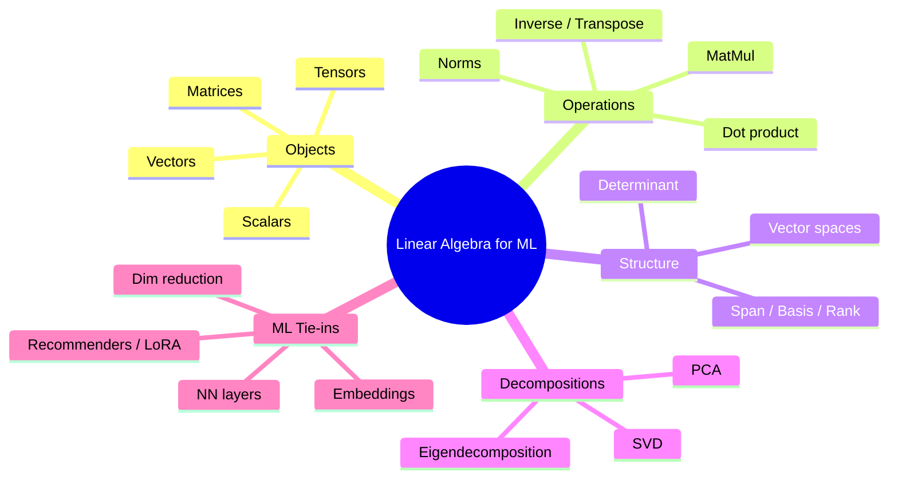
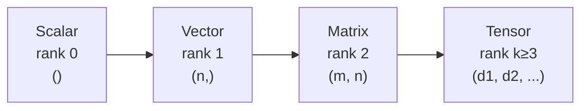
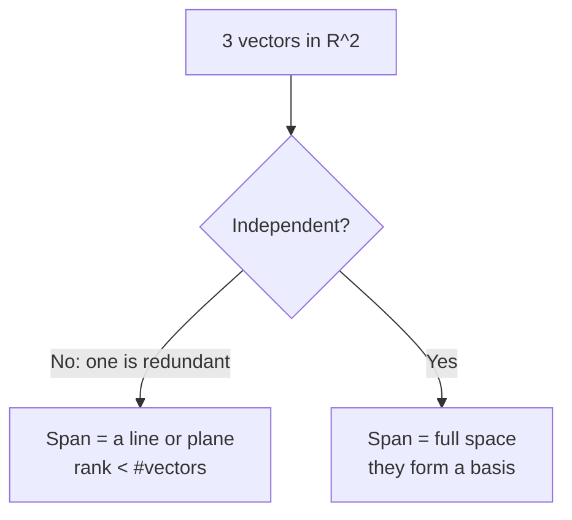
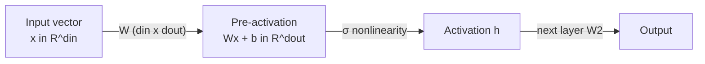
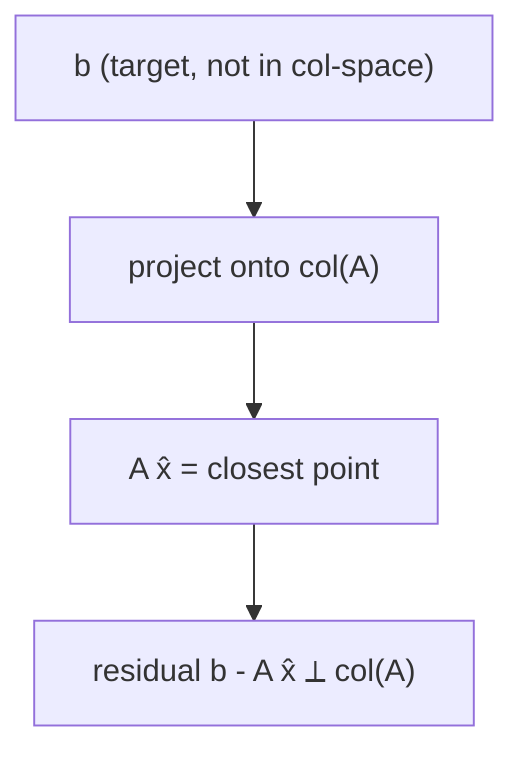
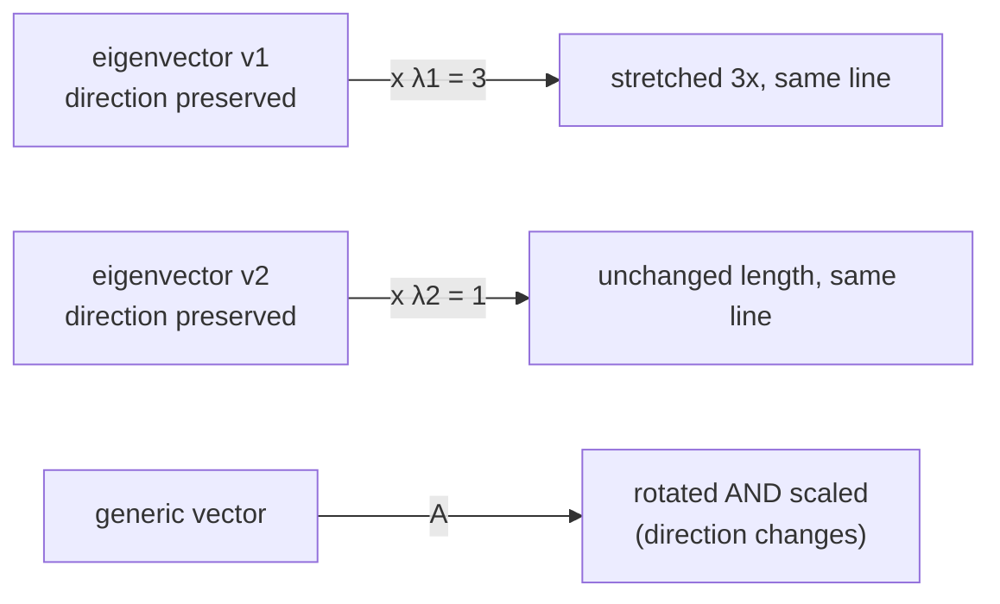
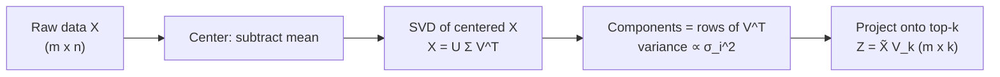
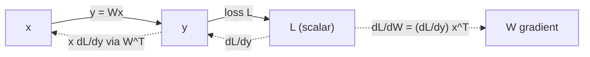
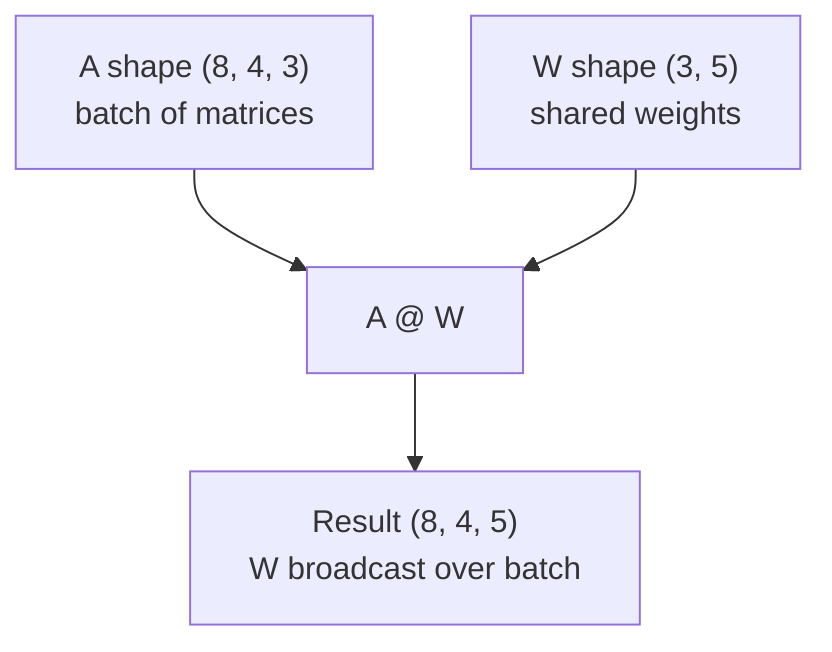

# Linear Algebra for AI / ML / Deep Learning
*The language in which neural networks, embeddings, and dimensionality reduction are written.*

*Part of the AI Engineering & ML Mastery Path — see the [index](../README.md) and [study plan](../MASTER-STUDY-PLAN.md).*

Linear algebra is the operating system of machine learning. A word embedding is a **vector**. A neural-network layer is a **matrix multiply** followed by a nonlinearity. Training nudges the **weight matrices**. PCA, SVD-based recommenders, and LoRA fine-tuning are all the *same* decomposition wearing different hats. If you can read $y = Wx + b$ and *see* a geometric transformation — a rotation, a stretch, a projection — then deep learning stops being magic and becomes engineering. This document takes you from scalars to SVD/PCA with every step worked by hand and verified in NumPy.

---

## 🎯 Learning Objectives

By the end of this document you can:

- **Classify** any numerical object as a scalar, vector, matrix, or tensor and state its shape.
- **Compute** dot products, norms (L1/L2/L∞/Frobenius), projections, matrix products, inverses, determinants, and ranks by hand and in NumPy.
- **Interpret** matrix multiplication two ways: as a linear map between vector spaces, and as the forward pass of a neural-network layer.
- **Diagonalize** a matrix via eigendecomposition and explain what eigenvalues/eigenvectors mean geometrically.
- **Derive** the Singular Value Decomposition (SVD), draw its shape decomposition, and connect it to recommender systems and LoRA.
- **Implement PCA from scratch** via SVD and verify it numerically against scikit-learn.
- **Read** common matrix-calculus gradients used in backpropagation.
- **Apply** broadcasting rules the way PyTorch/NumPy do in real deep-learning code.

---

## 📋 Prerequisites

- High-school algebra and basic trigonometry (sine/cosine, Pythagoras).
- Comfort reading Python and a working NumPy install (`pip install numpy scikit-learn`).
- Optional but helpful: the path [README](../README.md) for notation conventions.

---

## 📑 Table of Contents

1. [Scalars, Vectors, Matrices, Tensors](#1-scalars-vectors-matrices-tensors)
2. [Vector Spaces, Span, Basis, Rank](#2-vector-spaces-span-basis-rank)
3. [Dot / Inner Product and Projections](#3-dot--inner-product-and-projections)
4. [Norms: L1, L2, L∞, Frobenius](#4-norms-l1-l2-l-frobenius)
5. [Matrix Multiplication: Linear Maps and NN Layers](#5-matrix-multiplication-linear-maps-and-nn-layers)
6. [Identity, Inverse, Transpose](#6-identity-inverse-transpose)
7. [Special Matrices](#7-special-matrices)
8. [Linear Systems and Least Squares](#8-linear-systems-and-least-squares)
9. [Determinant and Geometric Meaning](#9-determinant-and-geometric-meaning)
10. [Eigenvalues and Eigenvectors](#10-eigenvalues-and-eigenvectors)
11. [Eigendecomposition](#11-eigendecomposition)
12. [Singular Value Decomposition (SVD)](#12-singular-value-decomposition-svd)
13. [PCA Built on SVD / Eigendecomposition](#13-pca-built-on-svd--eigendecomposition)
14. [Matrix Calculus Preview](#14-matrix-calculus-preview)
15. [Tensors and Broadcasting in Deep Learning](#15-tensors-and-broadcasting-in-deep-learning)
16. [From-Scratch Implementation](#-from-scratch-implementation)
17. [Knowledge Check](#-knowledge-check)
18. [Exercises](#️-exercises)
19. [Cheat Sheet](#-cheat-sheet)
20. [Further Resources](#-further-resources)
21. [What's Next](#️-whats-next)

Here is the conceptual map of where we are heading:



---

## 1. Scalars, Vectors, Matrices, Tensors

> 💡 **Intuition:** These are just containers of numbers indexed by 0, 1, 2, or more axes. A scalar has no axes, a vector has one, a matrix has two, a tensor has any number.

**Formal definitions.**

- A **scalar** is a single number $x \in \mathbb{R}$ (rank-0 tensor, shape `()`).
- A **vector** is an ordered list $\mathbf{x} \in \mathbb{R}^{n}$ (rank-1, shape `(n,)`). By convention a vector is a *column*:
$$
\mathbf{x} = \begin{bmatrix} x_1 \\ x_2 \\ \vdots \\ x_n \end{bmatrix}.
$$
- A **matrix** is a 2-D array $A \in \mathbb{R}^{m \times n}$ with $m$ rows and $n$ columns (rank-2, shape `(m, n)`). Element $A_{ij}$ sits in row $i$, column $j$.
- A **tensor** is any array with $k \ge 3$ axes; e.g. an RGB image batch has shape `(batch, height, width, channels)`.

**Worked example by hand.** Let
$$
A = \begin{bmatrix} 1 & 2 & 3 \\ 4 & 5 & 6 \end{bmatrix} \in \mathbb{R}^{2\times 3}.
$$
Then $A_{1,2} = 2$ (row 1, col 2, using 1-based math indexing), $m=2$, $n=3$. Its **transpose** flips axes: $A^\top \in \mathbb{R}^{3\times 2}$ with $A^\top_{ij}=A_{ji}$.

**Python.**

```python
import numpy as np

scalar = np.array(3.0)
vector = np.array([1.0, 2.0, 3.0])
matrix = np.array([[1, 2, 3],
                   [4, 5, 6]], dtype=float)
tensor = np.zeros((2, 3, 4))   # rank-3: 2 matrices of shape 3x4

print(scalar.ndim, scalar.shape)  # 0 ()
print(vector.ndim, vector.shape)  # 1 (3,)
print(matrix.ndim, matrix.shape)  # 2 (2, 3)
print(tensor.ndim, tensor.shape)  # 3 (2, 3, 4)
print(matrix[0, 1])               # 2.0   (NumPy is 0-based!)
print(matrix.T.shape)             # (3, 2)
```



> ⚠️ **Common Pitfall:** Math uses 1-based indexing ($A_{11}$ is the top-left); NumPy uses 0-based (`A[0,0]`). Keep them straight when translating formulas to code.

**Why it matters for AI/ML.** Everything a model touches is one of these objects. A token embedding is a vector in $\mathbb{R}^{d}$ (e.g. $d=768$). A weight layer is a matrix. A mini-batch of images is a rank-4 tensor. Shape bugs are the single most common error in deep-learning code — knowing the rank and shape of every object is half the battle.

---

## 2. Vector Spaces, Span, Basis, Rank

> 💡 **Intuition:** A vector space is "all the places you can reach" by scaling and adding a set of vectors. The **span** is that reachable set; a **basis** is a minimal set of directions that reaches everything without redundancy; **rank** counts how many genuinely independent directions a matrix carries.

**Formal definitions.** A real **vector space** $V$ is a set closed under vector addition and scalar multiplication, satisfying associativity, commutativity, a zero vector, additive inverses, and distributivity. The canonical example is $\mathbb{R}^n$.

The **span** of vectors $\{\mathbf{v}_1,\dots,\mathbf{v}_k\}$ is the set of all linear combinations:
$$
\operatorname{span}(\mathbf{v}_1,\dots,\mathbf{v}_k) = \left\{ \sum_{i=1}^{k} c_i \mathbf{v}_i \;\middle|\; c_i \in \mathbb{R} \right\}.
$$

Vectors are **linearly independent** if $\sum_i c_i \mathbf{v}_i = \mathbf{0}$ forces all $c_i = 0$. A **basis** of $V$ is a linearly independent set that spans $V$; the number of basis vectors is the **dimension** $\dim V$.

The **rank** of a matrix $A$ is the dimension of its column space (equivalently its row space) — the number of linearly independent columns.

**Worked example by hand.** Consider
$$
A = \begin{bmatrix} 1 & 2 & 1 \\ 2 & 4 & 0 \end{bmatrix}.
$$
Column 2 is exactly $2\times$ column 1, so it adds no new direction. Columns 1 and 3 are independent (neither is a scalar multiple of the other). Therefore the column space is 2-dimensional and $\operatorname{rank}(A)=2$. Since $A$ has 2 rows, this is **full row rank**.

**Python.**

```python
import numpy as np

A = np.array([[1, 2, 1],
              [2, 4, 0]], dtype=float)
print(np.linalg.matrix_rank(A))   # 2

# Demonstrate dependence: col2 - 2*col1 == 0
print(A[:, 1] - 2 * A[:, 0])      # [0. 0.]
```



> 🎯 **Key Insight:** Rank tells you the *true* number of degrees of freedom. A `(1000, 1000)` matrix with rank 5 secretly only carries 5 dimensions of information — this is the entire premise of low-rank methods like **LoRA** and PCA.

> ⚠️ **Common Pitfall:** A matrix can have many columns yet low rank. More columns ≠ more information.

**Why it matters for AI/ML.** Embedding spaces are vector spaces; the model learns a basis of "concept directions." Rank deficiency is exploited deliberately: **LoRA** freezes a giant weight matrix $W$ and learns a low-rank update $\Delta W = BA$ where $B \in \mathbb{R}^{d\times r}$, $A \in \mathbb{R}^{r\times d}$, $r \ll d$ — training a fraction of the parameters because the *useful* update lives in a low-dimensional subspace.

---

## 3. Dot / Inner Product and Projections

> 💡 **Intuition:** The dot product measures *how much two vectors point the same way*. Big positive = aligned, zero = perpendicular, negative = opposing. It is the atomic operation of similarity search and of every neuron.

**Formal definition.** For $\mathbf{a}, \mathbf{b} \in \mathbb{R}^n$:
$$
\mathbf{a} \cdot \mathbf{b} = \mathbf{a}^\top \mathbf{b} = \sum_{i=1}^{n} a_i b_i = \|\mathbf{a}\|\,\|\mathbf{b}\|\cos\theta,
$$
where $\theta$ is the angle between them. **Cosine similarity** isolates the angle:
$$
\cos\theta = \frac{\mathbf{a}^\top \mathbf{b}}{\|\mathbf{a}\|\,\|\mathbf{b}\|}.
$$

The **projection** of $\mathbf{a}$ onto $\mathbf{b}$ (the shadow $\mathbf{a}$ casts on $\mathbf{b}$'s line) is:
$$
\operatorname{proj}_{\mathbf{b}}(\mathbf{a}) = \frac{\mathbf{a}^\top \mathbf{b}}{\mathbf{b}^\top \mathbf{b}}\, \mathbf{b}.
$$

**Worked example by hand.** Let $\mathbf{a} = (3, 4)$, $\mathbf{b} = (1, 0)$.

- Dot product: $3\cdot1 + 4\cdot0 = 3$.
- $\|\mathbf{a}\| = \sqrt{9+16}=5$, $\|\mathbf{b}\| = 1$.
- $\cos\theta = 3 / (5 \cdot 1) = 0.6$, so $\theta = \arccos(0.6) \approx 53.13^\circ$.
- Projection onto $\mathbf{b}$: $\frac{3}{1}(1,0) = (3, 0)$ — the horizontal shadow of $\mathbf{a}$.

**Python.**

```python
import numpy as np

a = np.array([3.0, 4.0])
b = np.array([1.0, 0.0])

dot = a @ b                                   # 3.0
cos = dot / (np.linalg.norm(a) * np.linalg.norm(b))
angle_deg = np.degrees(np.arccos(cos))        # 53.13...
proj = (a @ b) / (b @ b) * b                  # [3. 0.]

print(dot)        # 3.0
print(cos)        # 0.6
print(angle_deg)  # 53.13010235415598
print(proj)       # [3. 0.]
```

```
        a = (3,4)
          ^
        4 |      * a
          |     /:
          |    / :
          |   /  :
          |  /   :
          | /    :  <- vertical part removed by projection
          |/     :
   -------+------*-----> b direction
          0      proj_b(a) = (3,0)
```

> 🎯 **Key Insight:** A single neuron computes $\mathbf{w}^\top \mathbf{x} + b$ — a dot product. The weight vector $\mathbf{w}$ is a "direction detector"; the dot product asks "how much does this input align with what I'm looking for?"

**Why it matters for AI/ML.** Vector databases (RAG, semantic search) rank documents by cosine similarity between query and document embeddings. **Self-attention** scores are scaled dot products: $\text{score}(q,k) = q^\top k / \sqrt{d_k}$. Projections underpin least squares (Section 8) and PCA (Section 13).

---

## 4. Norms: L1, L2, L∞, Frobenius

> 💡 **Intuition:** A norm answers "how big is this vector?" Different norms measure size differently — straight-line distance, total absolute travel, or the single largest component.

**Formal definitions.** For $\mathbf{x}\in\mathbb{R}^n$, the **$p$-norm** is
$$
\|\mathbf{x}\|_p = \left(\sum_{i=1}^{n} |x_i|^p\right)^{1/p}.
$$
Special cases:

| Norm | Formula | Nickname |
|------|---------|----------|
| $\|\mathbf{x}\|_1$ | $\sum_i \lvert x_i\rvert$ | Manhattan / taxicab |
| $\|\mathbf{x}\|_2$ | $\sqrt{\sum_i x_i^2}$ | Euclidean |
| $\|\mathbf{x}\|_\infty$ | $\max_i \lvert x_i\rvert$ | max / Chebyshev |

For a matrix $A$, the **Frobenius norm** treats it as a flattened vector:
$$
\|A\|_F = \sqrt{\sum_{i,j} A_{ij}^2} = \sqrt{\operatorname{trace}(A^\top A)}.
$$

**Worked example by hand.** Let $\mathbf{x} = (3, -4)$.

- $\|\mathbf{x}\|_1 = |3| + |-4| = 7$.
- $\|\mathbf{x}\|_2 = \sqrt{9+16} = 5$.
- $\|\mathbf{x}\|_\infty = \max(3,4) = 4$.

For $A = \begin{bmatrix}1&2\\3&4\end{bmatrix}$: $\|A\|_F = \sqrt{1+4+9+16} = \sqrt{30}\approx 5.477$.

**Python.**

```python
import numpy as np

x = np.array([3.0, -4.0])
print(np.linalg.norm(x, 1))         # 7.0
print(np.linalg.norm(x, 2))         # 5.0
print(np.linalg.norm(x, np.inf))    # 4.0

A = np.array([[1, 2], [3, 4]], dtype=float)
print(np.linalg.norm(A, 'fro'))     # 5.477225575051661
```

```
L1 ball (diamond)      L2 ball (circle)     Linf ball (square)
        ^                     ^                    ^
       /|\                  .-+-.               +--+--+
      / | \                /  |  \              |  |  |
   ---+--+--+--   vs   ----+--+--+----  vs   ---+--+--+---
      \ | /                \  |  /              |  |  |
       \|/                  '-+-'               +--+--+
```

> 🎯 **Key Insight:** The *shape* of the unit ball explains regularization. **L1** (diamond with sharp corners on the axes) pushes weights to *exactly zero* → sparsity (Lasso). **L2** (smooth circle) shrinks weights *smoothly* but rarely to zero (Ridge / weight decay).

> ⚠️ **Common Pitfall:** `np.linalg.norm(A)` on a 2-D array defaults to the Frobenius norm, not the spectral (operator) 2-norm. Pass `ord=2` explicitly for the spectral norm.

**Why it matters for AI/ML.** **Weight decay** ($L_2$) is the most common regularizer in deep learning. **Gradient clipping** bounds $\|\nabla\|_2$ to stabilize training. **Batch/Layer normalization** rescale activations. Loss functions are norms of error: MSE is squared $L_2$, MAE is $L_1$.

---

## 5. Matrix Multiplication: Linear Maps and NN Layers

> 💡 **Intuition:** A matrix is a *function* that takes a vector in and spits a (possibly differently-shaped) vector out, while preserving lines through the origin. Multiplying matrices = composing those functions.

**Formal definition.** For $A\in\mathbb{R}^{m\times k}$ and $B\in\mathbb{R}^{k\times n}$, the product $C=AB \in \mathbb{R}^{m\times n}$ has entries
$$
C_{ij} = \sum_{l=1}^{k} A_{il}\,B_{lj}.
$$
The **inner dimensions must match** ($k=k$); the result inherits the outer dimensions.

```
  A (m x k)      B (k x n)        C (m x n)
 +---------+    +---------+      +---------+
 | row i ->|    | |       |      |   C_ij  |
 |         | x  | col j   |  =   |    *    |
 |         |    | v       |      |         |
 +---------+    +---------+      +---------+
        \___ shared k ___/

 C_ij = (row i of A) dot (col j of B)
```

**Worked example by hand.**
$$
A=\begin{bmatrix}1&2\\3&4\end{bmatrix},\quad B=\begin{bmatrix}5&6\\7&8\end{bmatrix}.
$$
$$
C_{11}=1\cdot5+2\cdot7=19,\;\; C_{12}=1\cdot6+2\cdot8=22,
$$
$$
C_{21}=3\cdot5+4\cdot7=43,\;\; C_{22}=3\cdot6+4\cdot8=50,
$$
$$
AB=\begin{bmatrix}19&22\\43&50\end{bmatrix}.
$$

**Two readings of $A\mathbf{x}$:**

1. **As a linear map.** $A$ sends each input vector $\mathbf{x}$ to an output $A\mathbf{x}$, rotating/stretching/shearing space. The columns of $A$ are the images of the basis vectors.
2. **As a NN layer.** A dense layer computes $\mathbf{h} = \sigma(W\mathbf{x} + \mathbf{b})$. With a batch $X\in\mathbb{R}^{B\times d_{\text{in}}}$ and weights $W\in\mathbb{R}^{d_{\text{in}}\times d_{\text{out}}}$, the forward pass is $H = XW + \mathbf{b}$, a single matrix multiply transforming every example at once.

**Python.**

```python
import numpy as np

A = np.array([[1, 2], [3, 4]], dtype=float)
B = np.array([[5, 6], [7, 8]], dtype=float)
print(A @ B)        # [[19. 22.] [43. 50.]]

# NN layer: batch of 4 examples, 3 features -> 2 outputs
X = np.random.randn(4, 3)
W = np.random.randn(3, 2)
b = np.random.randn(2)
H = X @ W + b       # broadcasting adds b to each row
print(H.shape)      # (4, 2)
```



> ⚠️ **Common Pitfall:** Matrix multiplication is **not commutative**: $AB \neq BA$ in general. Order encodes the order of transformations. Also: `A * B` in NumPy is *element-wise*, not matrix product — use `A @ B` or `np.matmul`.

**Why it matters for AI/ML.** A deep network is a *composition of linear maps interleaved with nonlinearities*: $f(\mathbf{x}) = \sigma_L(W_L \cdots \sigma_1(W_1\mathbf{x}))$. Without the nonlinearities $\sigma$, stacking matrices would collapse to a single matrix ($W_L\cdots W_1$) — which is exactly why nonlinearities are essential. GPUs exist largely to make these matmuls fast.

---

## 6. Identity, Inverse, Transpose

> 💡 **Intuition:** The identity matrix is "do nothing." The inverse is the "undo" transformation. The transpose flips a matrix across its diagonal and shows up everywhere gradients do.

**Formal definitions.**

- **Identity** $I_n$: ones on the diagonal, zeros elsewhere; $A I = I A = A$.
- **Inverse** $A^{-1}$ (square $A$ only): $A A^{-1} = A^{-1}A = I$. Exists iff $\det(A)\neq 0$.
- **Transpose** $A^\top$: $A^\top_{ij} = A_{ji}$. Key identity: $(AB)^\top = B^\top A^\top$.

For a $2\times2$ matrix $A=\begin{bmatrix}a&b\\c&d\end{bmatrix}$,
$$
A^{-1} = \frac{1}{ad-bc}\begin{bmatrix}d&-b\\-c&a\end{bmatrix}.
$$

**Worked example by hand.** $A=\begin{bmatrix}4&7\\2&6\end{bmatrix}$, $\det = 4\cdot6 - 7\cdot2 = 10$.
$$
A^{-1}=\frac{1}{10}\begin{bmatrix}6&-7\\-2&4\end{bmatrix}=\begin{bmatrix}0.6&-0.7\\-0.2&0.4\end{bmatrix}.
$$
Check: $A A^{-1} = \begin{bmatrix}4\cdot0.6+7\cdot(-0.2)&\cdots\\\cdots&\cdots\end{bmatrix}=\begin{bmatrix}1&0\\0&1\end{bmatrix}.$ ✓

**Python.**

```python
import numpy as np

A = np.array([[4, 7], [2, 6]], dtype=float)
Ainv = np.linalg.inv(A)
print(Ainv)              # [[ 0.6 -0.7] [-0.2  0.4]]
print(A @ Ainv)          # [[1. 0.] [0. 1.]] (up to float error)
print(A.T)               # [[4. 2.] [7. 6.]]
```

> ⚠️ **Common Pitfall:** Never solve $\mathbf{x}=A^{-1}\mathbf{b}$ by explicitly inverting in production code — it is slower and numerically worse. Use `np.linalg.solve(A, b)`, which factorizes instead.

**Why it matters for AI/ML.** Transposes are everywhere in backprop: the gradient of $\mathbf{y}=W\mathbf{x}$ w.r.t. $\mathbf{x}$ involves $W^\top$ (Section 14). Inverses appear in the **normal equations** for least squares, in Gaussian/Newton optimization, and in whitening transforms.

---

## 7. Special Matrices

> 💡 **Intuition:** Certain matrix shapes carry special structure that makes them faster to compute with and rich in meaning — diagonal (independent scaling), symmetric (real eigenvalues), orthogonal (pure rotation/reflection), positive-definite (a "bowl-shaped" curvature).

| Type | Definition | Key property |
|------|-----------|--------------|
| **Diagonal** $D$ | nonzero only on diagonal | $D\mathbf{x}$ scales each axis independently |
| **Symmetric** $S$ | $S = S^\top$ | real eigenvalues, orthogonal eigenvectors |
| **Orthogonal** $Q$ | $Q^\top Q = I$ | preserves lengths & angles; $Q^{-1}=Q^\top$ |
| **Positive-definite** $P$ | $\mathbf{x}^\top P \mathbf{x} > 0\ \forall \mathbf{x}\neq\mathbf 0$ | all eigenvalues $> 0$; convex quadratic |

**Worked example by hand (orthogonality).** The rotation matrix
$$
Q=\begin{bmatrix}\cos\theta&-\sin\theta\\\sin\theta&\cos\theta\end{bmatrix}
$$
satisfies $Q^\top Q = \begin{bmatrix}\cos^2\theta+\sin^2\theta & 0\\0&\cos^2\theta+\sin^2\theta\end{bmatrix}=I$ using $\cos^2+\sin^2=1$. So rotations are orthogonal — they preserve every length.

**Python.**

```python
import numpy as np

theta = np.pi / 4
Q = np.array([[np.cos(theta), -np.sin(theta)],
              [np.sin(theta),  np.cos(theta)]])
print(np.allclose(Q.T @ Q, np.eye(2)))   # True (orthogonal)

S = np.array([[2.0, 1.0], [1.0, 3.0]])    # symmetric
print(np.allclose(S, S.T))                # True
w = np.linalg.eigvalsh(S)                 # eigvalsh: for symmetric
print(w)                                  # [1.382 3.618] all real & >0 -> PD
```

> 🎯 **Key Insight:** A **covariance matrix is symmetric and positive-semidefinite** — guaranteeing real, non-negative eigenvalues. This is *why* PCA (Section 13) always works and produces real principal components.

**Why it matters for AI/ML.** Orthogonal matrices give numerically stable transforms (used in weight initialization and in the $U,V$ of SVD). Positive-definiteness characterizes convex losses and valid covariance/kernel (Gram) matrices in Gaussian processes and SVMs. Diagonal matrices appear as the singular-value matrix $\Sigma$ and in efficient parameterizations.

---

## 8. Linear Systems and Least Squares

> 💡 **Intuition:** Solving $A\mathbf{x}=\mathbf{b}$ asks "what combination of $A$'s columns produces $\mathbf{b}$?" When there's no exact answer (more equations than unknowns), **least squares** finds the $\mathbf{x}$ that gets *closest*.

**Formal definitions.** A square system $A\mathbf{x}=\mathbf{b}$ with $\det(A)\neq0$ has the unique solution $\mathbf{x}=A^{-1}\mathbf{b}$. An **overdetermined** system ($A\in\mathbb{R}^{m\times n}$, $m>n$) usually has no exact solution; we minimize the squared residual:
$$
\hat{\mathbf{x}} = \arg\min_{\mathbf{x}} \|A\mathbf{x}-\mathbf{b}\|_2^2.
$$
Setting the gradient to zero gives the **normal equations**:
$$
A^\top A\, \hat{\mathbf{x}} = A^\top \mathbf{b} \quad\Longrightarrow\quad \hat{\mathbf{x}} = (A^\top A)^{-1}A^\top \mathbf{b}.
$$
Geometrically, $A\hat{\mathbf{x}}$ is the **orthogonal projection** of $\mathbf{b}$ onto the column space of $A$.

**Worked example by hand (fit a line $y = m t + c$ to 3 points).** Points $(0,1),(1,2),(2,2)$. Model matrix and target:
$$
A=\begin{bmatrix}0&1\\1&1\\2&1\end{bmatrix},\quad \mathbf{b}=\begin{bmatrix}1\\2\\2\end{bmatrix},\quad \mathbf{x}=\begin{bmatrix}m\\c\end{bmatrix}.
$$
Compute $A^\top A=\begin{bmatrix}5&3\\3&3\end{bmatrix}$, $A^\top\mathbf{b}=\begin{bmatrix}6\\5\end{bmatrix}$. Solve:
$$
\begin{cases}5m+3c=6\\3m+3c=5\end{cases}\Rightarrow 2m=1\Rightarrow m=0.5,\; c=\tfrac{5-1.5}{3}=\tfrac{3.5}{3}\approx1.1667.
$$

**Python.**

```python
import numpy as np

A = np.array([[0, 1], [1, 1], [2, 1]], dtype=float)
b = np.array([1, 2, 2], dtype=float)

# Preferred: lstsq (uses SVD, numerically robust)
x, *_ = np.linalg.lstsq(A, b, rcond=None)
print(x)                # [0.5        1.16666667]  -> m=0.5, c=1.167

# Same via normal equations
x2 = np.linalg.solve(A.T @ A, A.T @ b)
print(x2)               # [0.5        1.16666667]
```



> ⚠️ **Common Pitfall:** Forming $A^\top A$ squares the **condition number**, amplifying numerical error. Prefer `np.linalg.lstsq` (SVD-based) or a QR factorization for real fitting problems.

**Why it matters for AI/ML.** **Linear regression** *is* least squares. The closed-form solution is the baseline every ML course starts from, and it is the analytic check against which gradient descent is validated. The projection view directly motivates PCA's "minimize reconstruction error" framing.

---

## 9. Determinant and Geometric Meaning

> 💡 **Intuition:** The determinant is the *signed volume scaling factor* of the transformation a matrix performs. $\det=2$ means areas double; $\det=0$ means the transform squashes space into a lower dimension (information is lost); negative $\det$ means orientation flips.

**Formal definition.** For $2\times2$: $\det\begin{bmatrix}a&b\\c&d\end{bmatrix}=ad-bc$. For $3\times3$, cofactor expansion along row 1:
$$
\det A = a_{11}(a_{22}a_{33}-a_{23}a_{32}) - a_{12}(a_{21}a_{33}-a_{23}a_{31}) + a_{13}(a_{21}a_{32}-a_{22}a_{31}).
$$
General properties: $\det(AB)=\det(A)\det(B)$, $\det(A^\top)=\det(A)$, and $A$ is invertible $\iff \det(A)\neq 0$.

**Worked example by hand.** $A=\begin{bmatrix}2&0\\0&3\end{bmatrix}$ scales $x$ by 2 and $y$ by 3, so the unit square (area 1) maps to a $2\times3$ rectangle (area 6). Indeed $\det A = 2\cdot3-0=6$.

A singular example: $B=\begin{bmatrix}1&2\\2&4\end{bmatrix}$ has $\det = 1\cdot4-2\cdot2=0$ — it collapses the plane onto a line (rank 1), so it cannot be inverted.

**Python.**

```python
import numpy as np

A = np.array([[2, 0], [0, 3]], dtype=float)
print(np.linalg.det(A))     # 6.0

B = np.array([[1, 2], [2, 4]], dtype=float)
print(np.linalg.det(B))     # 0.0 (singular)
```

```
det > 0 (area scaled)     det = 0 (collapsed)      det < 0 (flipped)
  +-----+                    *                       +-----+
  |     |  -> bigger box     |  -> a line            |     |  -> mirror
  +-----+                    *                       +-----+
```

> 🎯 **Key Insight:** $\det(A)=0 \iff$ columns are linearly dependent $\iff$ rank-deficient $\iff$ non-invertible. The determinant is the single number that detects "this transformation destroyed a dimension."

**Why it matters for AI/ML.** The **log-determinant** of a covariance matrix appears in the Gaussian likelihood and in normalizing-flow models (the change-of-variables Jacobian determinant tracks how probability density stretches). A near-zero determinant flags numerical instability and multicollinearity in features.

---

## 10. Eigenvalues and Eigenvectors

> 💡 **Intuition:** Most vectors get knocked off their direction when a matrix acts on them. **Eigenvectors** are the special directions that survive — the matrix only *stretches* them by a factor called the **eigenvalue**. They are the "natural axes" of the transformation.

**Formal definition.** A nonzero vector $\mathbf{v}$ is an **eigenvector** of square $A$ with **eigenvalue** $\lambda$ if
$$
A\mathbf{v} = \lambda \mathbf{v}.
$$
The eigenvalues are the roots of the **characteristic polynomial** $\det(A-\lambda I)=0$.

**Worked example by hand.** $A=\begin{bmatrix}2&1\\1&2\end{bmatrix}$.
$$
\det(A-\lambda I)=\det\begin{bmatrix}2-\lambda&1\\1&2-\lambda\end{bmatrix}=(2-\lambda)^2-1=\lambda^2-4\lambda+3=(\lambda-1)(\lambda-3).
$$
So $\lambda_1=3,\ \lambda_2=1$.

- For $\lambda_1=3$: $(A-3I)\mathbf{v}=\begin{bmatrix}-1&1\\1&-1\end{bmatrix}\mathbf{v}=\mathbf 0 \Rightarrow v_1=v_2$, eigenvector $\propto(1,1)$.
- For $\lambda_2=1$: $\begin{bmatrix}1&1\\1&1\end{bmatrix}\mathbf{v}=\mathbf 0 \Rightarrow v_1=-v_2$, eigenvector $\propto(1,-1)$.

**Python.**

```python
import numpy as np

A = np.array([[2, 1], [1, 2]], dtype=float)
vals, vecs = np.linalg.eig(A)
print(vals)              # [3. 1.]
print(vecs)              # columns are eigenvectors (normalized)
# vecs[:,0] ∝ (0.707, 0.707) -> direction (1,1) for λ=3
# vecs[:,1] ∝ (-0.707, 0.707) -> direction (1,-1) for λ=1

# Verify A v = λ v for the first pair
print(np.allclose(A @ vecs[:, 0], vals[0] * vecs[:, 0]))  # True
```



> ⚠️ **Common Pitfall:** Real matrices can have *complex* eigenvalues (e.g. pure rotations). **Symmetric** matrices are guaranteed real eigenvalues and orthogonal eigenvectors — use `np.linalg.eigh` for them (faster and more stable than `eig`).

**Why it matters for AI/ML.** Eigenvalues of the **Hessian** describe loss-surface curvature (large spread → ill-conditioned, slow training). The dominant eigenvector of a connectivity matrix is **PageRank**. PCA's principal components are the eigenvectors of the covariance matrix (Section 13). Spectral norm = largest singular value, used to bound Lipschitz constants for stable GANs/diffusion.

---

## 11. Eigendecomposition

> 💡 **Intuition:** If a matrix has enough independent eigenvectors, you can rewrite it as "rotate into the eigenbasis → scale along each axis → rotate back." That factorization makes powers, inverses, and analysis trivial.

**Formal definition.** A diagonalizable matrix $A\in\mathbb{R}^{n\times n}$ factorizes as
$$
A = Q \Lambda Q^{-1},
$$
where columns of $Q$ are eigenvectors and $\Lambda=\operatorname{diag}(\lambda_1,\dots,\lambda_n)$. For **symmetric** $A$ the eigenvectors are orthonormal, so $Q$ is orthogonal and
$$
A = Q\Lambda Q^\top \quad(\text{spectral theorem}).
$$

A beautiful consequence — matrix powers become scalar powers:
$$
A^k = Q\Lambda^k Q^{-1}, \qquad \Lambda^k=\operatorname{diag}(\lambda_1^k,\dots,\lambda_n^k).
$$

**Worked example by hand.** Reusing $A=\begin{bmatrix}2&1\\1&2\end{bmatrix}$ with $\lambda=3,1$ and orthonormal eigenvectors $\mathbf{q}_1=\tfrac1{\sqrt2}(1,1)$, $\mathbf{q}_2=\tfrac1{\sqrt2}(1,-1)$:
$$
Q=\frac1{\sqrt2}\begin{bmatrix}1&1\\1&-1\end{bmatrix},\quad \Lambda=\begin{bmatrix}3&0\\0&1\end{bmatrix},\quad A=Q\Lambda Q^\top.
$$

**Python.**

```python
import numpy as np

A = np.array([[2, 1], [1, 2]], dtype=float)
vals, Q = np.linalg.eigh(A)          # symmetric -> eigh
Lambda = np.diag(vals)
print(np.allclose(Q @ Lambda @ Q.T, A))   # True

# Matrix power via eigendecomposition
A_cubed = Q @ np.diag(vals**3) @ Q.T
print(np.allclose(A_cubed, np.linalg.matrix_power(A, 3)))  # True
```

> 🎯 **Key Insight:** Eigendecomposition only works for square (ideally symmetric) matrices. Real data matrices are rectangular — which is exactly why we need the more general **SVD** next.

**Why it matters for AI/ML.** Eigendecomposition of the covariance matrix *is* the original formulation of PCA. It also underlies spectral clustering (eigenvectors of the graph Laplacian) and the analysis of Markov chains / diffusion processes.

---

## 12. Singular Value Decomposition (SVD)

> 💡 **Intuition:** SVD says *any* matrix — square or not, full-rank or not — is a sequence of three simple geometric steps: **rotate, stretch along axes, rotate again**. It is the most important factorization in applied linear algebra.

**Formal definition.** For any $A\in\mathbb{R}^{m\times n}$,
$$
A = U\Sigma V^\top,
$$
where:

- $U\in\mathbb{R}^{m\times m}$ is orthogonal — columns are **left singular vectors**.
- $V\in\mathbb{R}^{n\times n}$ is orthogonal — columns are **right singular vectors**.
- $\Sigma\in\mathbb{R}^{m\times n}$ is "diagonal," with non-negative **singular values** $\sigma_1\ge\sigma_2\ge\cdots\ge0$ on the diagonal.

```
   A          =        U        Σ            V^T
 (m x n)            (m x m)  (m x n)        (n x n)
+-------+         +------+ +-------+      +---------+
|       |         |      | |σ1     |      |         |
|       |    =    |  U   | |  σ2   |  x   |   V^T   |
|       |         |      | |    .. |      |         |
+-------+         +------+ +-------+      +---------+
  rotate2  <----   stretch (Σ)   <----    rotate1 (V^T)
  reading right-to-left: V^T rotates, Σ scales, U rotates
```

**Derivation (connection to eigendecomposition).** Form the symmetric, PSD matrix $A^\top A\in\mathbb{R}^{n\times n}$. Its eigendecomposition $A^\top A = V\Lambda V^\top$ gives:

- the **right singular vectors** $V$ (eigenvectors of $A^\top A$),
- the **singular values** $\sigma_i = \sqrt{\lambda_i}$ (square roots of its eigenvalues, which are $\ge 0$ since $A^\top A$ is PSD).

The **left singular vectors** are then $\mathbf{u}_i = \tfrac1{\sigma_i}A\mathbf{v}_i$. Equivalently, $U$ are the eigenvectors of $AA^\top$. This is why SVD "always exists" — $A^\top A$ is always symmetric PSD, so it always has a real orthonormal eigenbasis.

**Worked example by hand.** Let $A=\begin{bmatrix}3&0\\0&-2\end{bmatrix}$. Then $A^\top A=\begin{bmatrix}9&0\\0&4\end{bmatrix}$, eigenvalues $9,4$, so $\sigma_1=3,\sigma_2=2$. With $V=I$, $\mathbf{u}_1=\tfrac13 A(1,0)=(1,0)$, $\mathbf{u}_2=\tfrac12 A(0,1)=(0,-1)$, giving $U=\begin{bmatrix}1&0\\0&-1\end{bmatrix}$, $\Sigma=\begin{bmatrix}3&0\\0&2\end{bmatrix}$. Check $U\Sigma V^\top=A$. ✓

**Truncated / low-rank SVD.** Keeping the top $r$ singular values gives the best rank-$r$ approximation (Eckart–Young theorem):
$$
A_r = \sum_{i=1}^{r}\sigma_i \mathbf{u}_i \mathbf{v}_i^\top, \qquad \|A - A_r\|_F^2 = \sum_{i>r}\sigma_i^2.
$$

**Python.**

```python
import numpy as np

A = np.array([[3, 0], [0, -2]], dtype=float)
U, s, Vt = np.linalg.svd(A)
print(s)                       # [3. 2.]  singular values (sorted desc)
Sigma = np.diag(s)
print(np.allclose(U @ Sigma @ Vt, A))   # True

# Low-rank approximation of a random matrix
M = np.random.randn(50, 30)
U, s, Vt = np.linalg.svd(M, full_matrices=False)
r = 5
M_r = (U[:, :r] * s[:r]) @ Vt[:r, :]    # rank-5 reconstruction
err = np.linalg.norm(M - M_r, 'fro')**2
print(np.isclose(err, np.sum(s[r:]**2)))  # True (Eckart–Young)
```

> 🎯 **Key Insight:** Singular values are *energy*. Their squares sum to the total Frobenius energy of the matrix; keeping the largest few captures most of the information in far fewer numbers. This single fact powers compression, denoising, PCA, and LoRA.

> ⚠️ **Common Pitfall:** `np.linalg.svd` returns `Vt` ($=V^\top$), **not** $V$. To reconstruct use `U @ diag(s) @ Vt`. Also pass `full_matrices=False` for the economy SVD when $m\neq n$ to avoid huge padded $U/V$.

**Why it matters for AI/ML.**
- **Recommender systems:** factor the user×item rating matrix $R\approx U\Sigma V^\top$; truncating to $r$ latent factors predicts missing ratings (the core of latent-factor collaborative filtering).
- **LoRA:** a weight update is forced to be low-rank, $\Delta W = BA$ with rank $r$ — the SVD intuition that "useful updates live in a small subspace" justifies training $<1\%$ of parameters.
- **Embeddings / LSA:** truncated SVD of a term–document matrix yields dense semantic vectors.
- **Numerical stability:** `lstsq`, pseudo-inverse, and rank estimation are all SVD under the hood.

---

## 13. PCA Built on SVD / Eigendecomposition

> 💡 **Intuition:** PCA finds the directions of greatest variance in your data and re-expresses each point using only those few directions — rotating the cloud of points so its longest axis lies along the first coordinate, then keeping the top axes.

**Formal definition.** Given data $X\in\mathbb{R}^{m\times n}$ ($m$ samples, $n$ features):

1. **Center**: $\tilde X = X - \boldsymbol{\mu}$, where $\boldsymbol{\mu}$ is the column mean.
2. **Covariance**: $C = \tfrac{1}{m-1}\tilde X^\top \tilde X \in\mathbb{R}^{n\times n}$ (symmetric PSD).
3. **Eigendecomposition** $C = V\Lambda V^\top$: columns of $V$ are **principal components**; eigenvalue $\lambda_i$ is the variance along component $i$.
4. **Project**: $Z = \tilde X V_k$ keeps the top $k$ components.

**Equivalence to SVD.** If $\tilde X = U\Sigma V^\top$, then
$$
C = \frac{1}{m-1}\tilde X^\top\tilde X = \frac{1}{m-1}V\Sigma^\top U^\top U\Sigma V^\top = V\,\frac{\Sigma^2}{m-1}\,V^\top.
$$
So PCA's principal components are the **right singular vectors** $V$ of the centered data, and the variances are $\lambda_i = \sigma_i^2/(m-1)$. Computing PCA via SVD of $\tilde X$ is numerically preferable to forming $C$ explicitly.

**Worked example by hand (3 points in 2-D).** $X=\begin{bmatrix}1&1\\2&2\\3&3\end{bmatrix}$. Column mean $\boldsymbol{\mu}=(2,2)$, so
$$
\tilde X=\begin{bmatrix}-1&-1\\0&0\\1&1\end{bmatrix}.
$$
Covariance $C=\tfrac1{2}\tilde X^\top\tilde X=\tfrac12\begin{bmatrix}2&2\\2&2\end{bmatrix}=\begin{bmatrix}1&1\\1&1\end{bmatrix}$. Eigenvalues: $\lambda_1=2$ (eigenvector $\propto(1,1)$), $\lambda_2=0$ (eigenvector $\propto(1,-1)$). All variance lies along the $(1,1)$ diagonal — PCA discovers the data is intrinsically 1-D.

**Python.**

```python
import numpy as np

X = np.array([[1, 1], [2, 2], [3, 3]], dtype=float)
Xc = X - X.mean(axis=0)
U, s, Vt = np.linalg.svd(Xc, full_matrices=False)

components = Vt                      # principal directions (rows)
explained_var = s**2 / (X.shape[0] - 1)
print(np.round(explained_var, 6))   # [2. 0.]
print(np.round(Vt[0], 3))           # [0.707 0.707] -> the (1,1) direction

Z = Xc @ Vt[:1].T                    # project onto top-1 component
print(np.round(Z.ravel(), 3))       # [-1.414 0. 1.414]
```



> 🎯 **Key Insight:** PCA = eigendecomposition of the covariance matrix = SVD of the centered data. Same answer, three lenses. SVD is the numerically safest route and the one scikit-learn uses.

> ⚠️ **Common Pitfall:** Forgetting to **center** the data first. PCA on uncentered data finds directions of largest *raw magnitude*, not variance — a classic silent bug. Also, standardize (divide by std) when features have different units.

**Why it matters for AI/ML.** PCA is the workhorse of **dimensionality reduction**: compress 1000-dim features to 50 while keeping ~95% of variance, speeding up training and fighting the curse of dimensionality. It is used for visualization (project to 2-D/3-D), denoising, and as a preprocessing/whitening step. The variance-explained curve tells you the *intrinsic dimensionality* of your data — the same low-rank story as LoRA and recommenders.

---

## 14. Matrix Calculus Preview

> 💡 **Intuition:** Backpropagation is just the chain rule applied to vector/matrix expressions. You don't need to derive every gradient from scratch — a handful of patterns cover most of deep learning.

**Conventions.** Using **denominator layout**, the gradient of a scalar $f$ w.r.t. a vector $\mathbf{x}\in\mathbb{R}^n$ is a column vector $\nabla_{\mathbf{x}} f \in\mathbb{R}^n$ with $(\nabla f)_i = \partial f/\partial x_i$.

**Essential gradients.**

| Expression | Gradient | Note |
|------------|----------|------|
| $f = \mathbf{a}^\top\mathbf{x}$ | $\nabla_{\mathbf{x}} f = \mathbf{a}$ | linear |
| $f = \mathbf{x}^\top A \mathbf{x}$ | $\nabla_{\mathbf{x}} f = (A+A^\top)\mathbf{x}$ | $=2A\mathbf{x}$ if $A$ symmetric |
| $f = \|\mathbf{x}\|_2^2 = \mathbf{x}^\top\mathbf{x}$ | $\nabla_{\mathbf{x}} f = 2\mathbf{x}$ | special case above |
| $\mathbf{y}=A\mathbf{x}$ | $\dfrac{\partial \mathbf{y}}{\partial \mathbf{x}}=A$ | Jacobian |
| $L=\|A\mathbf{x}-\mathbf{b}\|_2^2$ | $\nabla_{\mathbf{x}} L = 2A^\top(A\mathbf{x}-\mathbf{b})$ | least-squares gradient |

**Worked example by hand (least-squares gradient).** Let $L(\mathbf{x})=\|A\mathbf{x}-\mathbf{b}\|_2^2=(A\mathbf{x}-\mathbf{b})^\top(A\mathbf{x}-\mathbf{b})$. Expand:
$$
L=\mathbf{x}^\top A^\top A\mathbf{x} - 2\mathbf{b}^\top A\mathbf{x} + \mathbf{b}^\top\mathbf{b}.
$$
Differentiate term by term using the table ($A^\top A$ symmetric):
$$
\nabla_{\mathbf{x}} L = 2A^\top A\mathbf{x} - 2A^\top\mathbf{b} = 2A^\top(A\mathbf{x}-\mathbf{b}).
$$
Setting $\nabla L = \mathbf 0$ recovers the normal equations from Section 8 — the calculus and the geometry agree.

**Python (numerical gradient check).**

```python
import numpy as np

rng = np.random.default_rng(0)
A = rng.standard_normal((5, 3))
b = rng.standard_normal(5)

def L(x):  return np.sum((A @ x - b)**2)
def grad(x): return 2 * A.T @ (A @ x - b)

x0 = rng.standard_normal(3)
eps = 1e-6
num_grad = np.array([(L(x0 + eps*e) - L(x0 - eps*e)) / (2*eps)
                     for e in np.eye(3)])
print(np.allclose(grad(x0), num_grad, atol=1e-4))   # True
```



> 🎯 **Key Insight:** The recurring appearance of $A^\top$ (or $W^\top$) in gradients is *why* transposes matter in backprop. The forward map uses $W$; the backward map (gradient flow) uses $W^\top$.

**Why it matters for AI/ML.** Every optimizer step is $\theta \leftarrow \theta - \eta\nabla_\theta L$. Autodiff frameworks compute these gradients for you, but understanding the patterns lets you debug exploding/vanishing gradients, derive custom layers, and reason about Jacobians in attention and normalization layers. Full treatment is in [02-calculus-optimization.md](02-calculus-optimization.md).

---

## 15. Tensors and Broadcasting in Deep Learning

> 💡 **Intuition:** Real models work on *batches* of multi-axis data. Broadcasting is NumPy/PyTorch's rule for stretching smaller arrays to match larger ones without copying memory — it's how a length-$d$ bias gets added to a `(batch, d)` activation.

**Broadcasting rules.** Compare shapes **from the trailing (rightmost) axis** leftward. Two dimensions are compatible when they are **equal** or **one of them is 1**. A size-1 (or missing) dimension is virtually stretched to match.

```
  Activations  (32, 10)      Bias    (10,)  -> treated as (1, 10)
  -----------  --------              -----
  axis -1 :       10     vs           10     equal  -> ok
  axis -2 :       32     vs            1      stretch -> ok
  Result   :   (32, 10)
```

**Worked example by hand.** Adding bias $\mathbf{b}=(b_1,b_2)$ to a $3\times2$ activation matrix copies $\mathbf{b}$ across all 3 rows:
$$
\begin{bmatrix}h_{11}&h_{12}\\h_{21}&h_{22}\\h_{31}&h_{32}\end{bmatrix} + \begin{bmatrix}b_1&b_2\end{bmatrix} = \begin{bmatrix}h_{11}+b_1&h_{12}+b_2\\h_{21}+b_1&h_{22}+b_2\\h_{31}+b_1&h_{32}+b_2\end{bmatrix}.
$$

**Python.**

```python
import numpy as np

H = np.arange(6).reshape(3, 2).astype(float)   # (3, 2)
b = np.array([10.0, 20.0])                      # (2,)
print(H + b)        # bias added to every row via broadcasting
# [[10. 21.] [12. 23.] [14. 25.]]

# Batched matmul: 8 sequences, each (4 x 3) times shared (3 x 5)
X = np.random.randn(8, 4, 3)
W = np.random.randn(3, 5)
Y = X @ W           # broadcasts W across the batch axis
print(Y.shape)      # (8, 4, 5)

# Incompatible shapes raise an error:
try:
    _ = np.ones((3, 2)) + np.ones((3,))   # 2 vs 3 -> mismatch
except ValueError as e:
    print("broadcast error")              # broadcast error
```



> ⚠️ **Common Pitfall:** Silent broadcasting bugs. Adding a `(n,)` to a `(n, 1)` yields an `(n, n)` matrix — not an error, just wrong. Always print shapes; use `keepdims=True` on reductions to keep alignment predictable.

**Why it matters for AI/ML.** Every framework (NumPy, PyTorch, JAX, TensorFlow) relies on broadcasting for biases, normalization statistics, attention masks, and per-channel scaling. Mastering shape rules eliminates the most common class of deep-learning bugs and lets you write vectorized code that runs orders of magnitude faster than Python loops.

---

## 🧮 From-Scratch Implementation

A complete PCA implemented with only NumPy's `svd`, plus power iteration for the dominant eigenpair. Runnable as-is on Python 3.11+.

```python
import numpy as np

def pca_fit_transform(X, n_components):
    """PCA via SVD of the centered data.
    Returns (Z, components, explained_variance, mean).
    X: (m_samples, n_features)
    """
    X = np.asarray(X, dtype=float)
    mean = X.mean(axis=0)
    Xc = X - mean                              # center
    # Economy SVD: Xc = U @ diag(s) @ Vt
    U, s, Vt = np.linalg.svd(Xc, full_matrices=False)
    components = Vt[:n_components]             # (k, n_features)
    explained_variance = (s**2 / (X.shape[0] - 1))[:n_components]
    Z = Xc @ components.T                      # (m, k) projection
    return Z, components, explained_variance, mean

def power_iteration(A, num_iter=1000, tol=1e-10):
    """Dominant eigenvalue/eigenvector of a symmetric matrix A."""
    n = A.shape[0]
    v = np.random.default_rng(0).standard_normal(n)
    v /= np.linalg.norm(v)
    lam_old = 0.0
    for _ in range(num_iter):
        w = A @ v
        v = w / np.linalg.norm(w)
        lam = v @ A @ v                        # Rayleigh quotient
        if abs(lam - lam_old) < tol:
            break
        lam_old = lam
    return lam, v

if __name__ == "__main__":
    rng = np.random.default_rng(42)
    # Synthetic data with strong correlation -> intrinsic low rank
    base = rng.standard_normal((200, 2))
    mix = np.array([[3.0, 1.0], [1.0, 0.5], [2.0, -1.0], [0.5, 2.0]]).T  # (2,4)
    X = base @ mix + rng.standard_normal((200, 4)) * 0.05

    Z, comps, var, mean = pca_fit_transform(X, n_components=2)
    ratio = var / (np.var(X - mean, axis=0, ddof=1).sum())
    print("explained variance ratio:", np.round(ratio, 4))
    # ~[0.9x 0.0x] -> two components capture nearly all variance

    # Power iteration recovers the top eigenvalue of the covariance
    C = np.cov(X, rowvar=False)
    lam, vec = power_iteration(C)
    print("power-iteration top eigenvalue:", round(lam, 4))
    print("matches numpy:", np.isclose(lam, np.linalg.eigvalsh(C)[-1]))
    # True
```

> 📝 **Tip:** Always validate from-scratch implementations against a trusted library (next exercise). Sign flips in eigenvectors/singular vectors are expected — directions are unique only up to $\pm 1$.

---

## ❓ Knowledge Check

<details><summary><b>Q1.</b> What is the shape of the result of multiplying a $(4\times3)$ matrix by a $(3\times2)$ matrix, and why?</summary>

$(4\times2)$. The inner dimensions ($3$ and $3$) must match and are "consumed"; the result keeps the outer dimensions ($4$ rows from the left, $2$ columns from the right). Each output entry is a dot product of a length-3 row with a length-3 column.
</details>

<details><summary><b>Q2.</b> Why does L1 regularization produce sparse weights while L2 does not?</summary>

The L1 unit ball is a diamond with corners *on the axes*; the loss contour is most likely to first touch a corner, where some coordinates are exactly zero. The L2 ball is a smooth sphere with no corners, so the optimum lands at small-but-nonzero values. Geometrically: sharp corners → sparsity; round surface → shrinkage.
</details>

<details><summary><b>Q3.</b> A $3\times3$ matrix has $\det = 0$. What does this tell you about its rank, invertibility, and the transformation it performs?</summary>

Rank $< 3$ (the columns are linearly dependent), it is **not invertible** (singular), and the transformation **collapses** 3-D space onto a plane, line, or point — destroying at least one dimension of information (zero volume scaling).
</details>

<details><summary><b>Q4.</b> Compute $\mathbf{a}^\top\mathbf{b}$ and the angle for $\mathbf{a}=(1,0,1)$, $\mathbf{b}=(0,1,1)$.</summary>

Dot product $=1\cdot0+0\cdot1+1\cdot1=1$. Norms $\|\mathbf{a}\|=\|\mathbf{b}\|=\sqrt2$. So $\cos\theta = 1/(\sqrt2\cdot\sqrt2)=1/2$, giving $\theta=60^\circ$.
</details>

<details><summary><b>Q5.</b> Why are the eigenvalues of a covariance matrix always real and non-negative?</summary>

A covariance matrix is **symmetric** (real eigenvalues by the spectral theorem) and **positive-semidefinite** ($\mathbf{x}^\top C\mathbf{x}=\operatorname{Var}(\mathbf{x}^\top \text{data})\ge0$), which forces all eigenvalues $\ge0$. This guarantees PCA yields real principal components with non-negative variances.
</details>

<details><summary><b>Q6.</b> What does the largest singular value $\sigma_1$ of a matrix $A$ represent geometrically?</summary>

It is the maximum stretch factor: $\sigma_1 = \max_{\|\mathbf{x}\|=1}\|A\mathbf{x}\|_2$, the **spectral (operator 2-) norm** of $A$. It is the length of the longest semi-axis of the ellipse that $A$ maps the unit sphere to.
</details>

<details><summary><b>Q7.</b> In `np.linalg.svd`, what is returned third, and what mistake do people make reconstructing $A$?</summary>

It returns `Vt` $=V^\top$, not $V$. The mistake is writing `U @ diag(s) @ V`; the correct reconstruction is `U @ diag(s) @ Vt`. Also forgetting `full_matrices=False` for rectangular matrices wastes memory.
</details>

<details><summary><b>Q8.</b> Why is PCA via SVD of the centered data preferred over eigendecomposition of the covariance matrix?</summary>

Forming $C=\tilde X^\top\tilde X$ squares the condition number, amplifying round-off error. SVD operates directly on $\tilde X$, is more numerically stable, and avoids materializing a potentially large $n\times n$ covariance matrix. Both give mathematically identical results ($\lambda_i=\sigma_i^2/(m-1)$).
</details>

<details><summary><b>Q9.</b> A bias vector of shape $(10,)$ is added to activations of shape $(32, 10)$. Explain the broadcast.</summary>

Aligning from the right: axis $-1$ is $10$ vs $10$ (equal, ok). The bias has no axis $-2$, so it is treated as $(1,10)$ and stretched to $32$ rows. Result shape $(32,10)$ — the same bias is added to every example in the batch.
</details>

<details><summary><b>Q10.</b> Give the gradient of $L=\|A\mathbf{x}-\mathbf{b}\|_2^2$ and explain why $A^\top$ appears.</summary>

$\nabla_{\mathbf{x}} L = 2A^\top(A\mathbf{x}-\mathbf{b})$. $A^\top$ appears because the chain rule maps the residual back through the linear layer: the forward map applies $A$, so the gradient (adjoint) applies $A^\top$. Setting it to zero gives the normal equations.
</details>

<details><summary><b>Q11.</b> What is the rank of $\mathbf{u}\mathbf{v}^\top$ for nonzero vectors $\mathbf{u}\in\mathbb{R}^m,\mathbf{v}\in\mathbb{R}^n$, and why does this matter for LoRA?</summary>

Rank **1** — every column is a scalar multiple of $\mathbf{u}$. Summing $r$ such outer products gives a rank-$r$ matrix. LoRA writes $\Delta W = BA$ (a sum of $r$ rank-1 terms), so it can represent any rank-$r$ update while storing only $r(d_{\text{in}}+d_{\text{out}})$ parameters instead of $d_{\text{in}}d_{\text{out}}$.
</details>

<details><summary><b>Q12.</b> Why must nonlinearities be inserted between linear layers in a neural network?</summary>

A composition of linear maps is itself a single linear map: $W_2(W_1\mathbf{x}) = (W_2W_1)\mathbf{x}$. Without nonlinearities, an arbitrarily deep network collapses to one matrix and can only represent linear functions. Nonlinearities ($\sigma$) break this collapse, enabling the network to approximate arbitrary functions.
</details>

---

## 🏋️ Exercises

<details><summary><b>Exercise 1 (warm-up):</b> By hand, compute $AB$ and $BA$ for $A=\begin{bmatrix}1&2\\0&1\end{bmatrix}$, $B=\begin{bmatrix}1&0\\3&1\end{bmatrix}$. Confirm they differ.</summary>

$AB=\begin{bmatrix}1\cdot1+2\cdot3 & 1\cdot0+2\cdot1\\0\cdot1+1\cdot3 & 0\cdot0+1\cdot1\end{bmatrix}=\begin{bmatrix}7&2\\3&1\end{bmatrix}$.

$BA=\begin{bmatrix}1\cdot1+0\cdot0 & 1\cdot2+0\cdot1\\3\cdot1+1\cdot0 & 3\cdot2+1\cdot1\end{bmatrix}=\begin{bmatrix}1&2\\3&7\end{bmatrix}$.

They differ, confirming matrix multiplication is non-commutative.

```python
import numpy as np
A = np.array([[1,2],[0,1]]); B = np.array([[1,0],[3,1]])
print(A@B)   # [[7 2] [3 1]]
print(B@A)   # [[1 2] [3 7]]
```
</details>

<details><summary><b>Exercise 2:</b> Compute the L1, L2, and L∞ norms of $\mathbf{x}=(2,-3,6)$ by hand and verify in NumPy.</summary>

$\|\mathbf{x}\|_1=2+3+6=11$. $\|\mathbf{x}\|_2=\sqrt{4+9+36}=\sqrt{49}=7$. $\|\mathbf{x}\|_\infty=\max(2,3,6)=6$.

```python
import numpy as np
x = np.array([2.,-3.,6.])
print(np.linalg.norm(x,1), np.linalg.norm(x,2), np.linalg.norm(x,np.inf))
# 11.0 7.0 6.0
```
</details>

<details><summary><b>Exercise 3:</b> Find eigenvalues and eigenvectors of $A=\begin{bmatrix}4&1\\2&3\end{bmatrix}$ by hand, then verify.</summary>

Characteristic: $\det(A-\lambda I)=(4-\lambda)(3-\lambda)-2=\lambda^2-7\lambda+10=(\lambda-5)(\lambda-2)$. So $\lambda=5,2$.

- $\lambda=5$: $(A-5I)=\begin{bmatrix}-1&1\\2&-2\end{bmatrix}\Rightarrow v_1=v_2$, eigenvector $\propto(1,1)$.
- $\lambda=2$: $(A-2I)=\begin{bmatrix}2&1\\2&1\end{bmatrix}\Rightarrow 2v_1+v_2=0$, eigenvector $\propto(1,-2)$.

```python
import numpy as np
A = np.array([[4.,1.],[2.,3.]])
vals, vecs = np.linalg.eig(A)
print(np.sort(vals))   # [2. 5.]
```
</details>

<details><summary><b>Exercise 4:</b> Fit a least-squares line to points $(1,1),(2,3),(3,2),(4,5)$ using the normal equations, then with <code>np.linalg.lstsq</code>.</summary>

$A=\begin{bmatrix}1&1\\2&1\\3&1\\4&1\end{bmatrix}$, $\mathbf b=(1,3,2,5)$. $A^\top A=\begin{bmatrix}30&10\\10&4\end{bmatrix}$, $A^\top\mathbf b=\begin{bmatrix}33\\11\end{bmatrix}$. Solving: $\det=30\cdot4-100=20$; $m=(4\cdot33-10\cdot11)/20=(132-110)/20=1.1$; $c=(30\cdot11-10\cdot33)/20=(330-330)/20=0$. Line: $y=1.1t+0$.

```python
import numpy as np
A = np.array([[1,1],[2,1],[3,1],[4,1]], float)
b = np.array([1,3,2,5], float)
print(np.linalg.lstsq(A, b, rcond=None)[0])   # [1.1 0. ]
```
</details>

<details><summary><b>Exercise 5:</b> Take a $40\times40$ random matrix, compute its SVD, and find the smallest rank $r$ whose truncation keeps ≥90% of the Frobenius energy. Plot-free, just report $r$.</summary>

Energy is $\sum\sigma_i^2$; cumulative energy ratio crosses 0.90 at some $r$.

```python
import numpy as np
rng = np.random.default_rng(1)
M = rng.standard_normal((40, 40))
s = np.linalg.svd(M, compute_uv=False)
energy = np.cumsum(s**2) / np.sum(s**2)
r = int(np.searchsorted(energy, 0.90) + 1)
print("rank for 90% energy:", r)   # ~33 for a full-rank random matrix
```

A random full-rank matrix has roughly uniform singular values, so $r$ is large (≈33). Real/structured data concentrates energy in far fewer components — that gap is what PCA and compression exploit.
</details>

<details><summary><b>Exercise 6 (capstone):</b> Implement PCA from scratch via SVD and verify it matches <code>sklearn.decomposition.PCA</code> (components up to sign, and explained-variance ratios).</summary>

```python
import numpy as np
from sklearn.decomposition import PCA

rng = np.random.default_rng(7)
X = rng.standard_normal((300, 5)) @ rng.standard_normal((5, 5))  # correlated

def my_pca(X, k):
    Xc = X - X.mean(axis=0)
    U, s, Vt = np.linalg.svd(Xc, full_matrices=False)
    comps = Vt[:k]
    evr = (s**2 / (X.shape[0]-1))[:k]
    return comps, evr / (s**2/(X.shape[0]-1)).sum(), Xc @ comps.T

k = 3
my_comps, my_ratio, my_Z = my_pca(X, k)

skl = PCA(n_components=k, svd_solver="full").fit(X)
skl_comps = skl.components_
skl_ratio = skl.explained_variance_ratio_

# Components match up to a sign flip per component
signs = np.sign(np.sum(my_comps * skl_comps, axis=1))
aligned = my_comps * signs[:, None]
print("components match:", np.allclose(aligned, skl_comps, atol=1e-8))   # True
print("variance ratios match:", np.allclose(my_ratio, skl_ratio, atol=1e-8))  # True
```

**Why the sign handling?** Singular/eigen-vectors are defined only up to $\pm1$; flipping a component and its scores leaves the decomposition valid. We align signs by the dot product before comparing. Explained-variance *ratios* are sign-invariant and match directly.
</details>

---

## 📊 Cheat Sheet

**Objects & shapes**

| Object | Rank | Shape | NumPy |
|--------|------|-------|-------|
| Scalar | 0 | `()` | `np.array(3.)` |
| Vector | 1 | `(n,)` | `np.array([...])` |
| Matrix | 2 | `(m,n)` | `np.array([[...]])` |
| Tensor | k≥3 | `(d1,…,dk)` | `np.zeros((2,3,4))` |

**Core operations**

| Operation | Math | NumPy |
|-----------|------|-------|
| Dot product | $\mathbf a^\top\mathbf b$ | `a @ b` |
| Matrix product | $AB$ | `A @ B` |
| Transpose | $A^\top$ | `A.T` |
| Inverse | $A^{-1}$ | `np.linalg.inv(A)` |
| Solve $A\mathbf x=\mathbf b$ | — | `np.linalg.solve(A,b)` |
| Determinant | $\det A$ | `np.linalg.det(A)` |
| Rank | — | `np.linalg.matrix_rank(A)` |
| Eigen (symmetric) | $A=Q\Lambda Q^\top$ | `np.linalg.eigh(A)` |
| SVD | $A=U\Sigma V^\top$ | `np.linalg.svd(A)` |
| Least squares | $\min\|A\mathbf x-\mathbf b\|^2$ | `np.linalg.lstsq(A,b)` |

**Norms**

| Norm | Formula | Use |
|------|---------|-----|
| $L_1$ | $\sum\lvert x_i\rvert$ | sparsity (Lasso) |
| $L_2$ | $\sqrt{\sum x_i^2}$ | weight decay, distance |
| $L_\infty$ | $\max\lvert x_i\rvert$ | worst-case bound |
| Frobenius | $\sqrt{\sum A_{ij}^2}$ | matrix size, low-rank error |

**Key facts**

| Fact | Statement |
|------|-----------|
| Invertibility | $A^{-1}$ exists $\iff \det A\neq0 \iff$ full rank |
| Spectral theorem | symmetric $A$ → real eigenvalues, orthogonal eigenvectors |
| SVD existence | every matrix has an SVD ($A^\top A$ is symmetric PSD) |
| Eckart–Young | top-$r$ SVD = best rank-$r$ approximation in $\|\cdot\|_F$ |
| PCA ≡ SVD | components $=V$ of centered $X$; variance $=\sigma_i^2/(m-1)$ |
| Backprop transpose | forward uses $W$, gradient uses $W^\top$ |

**ML tie-ins**

| Concept | Linear algebra |
|---------|----------------|
| Embeddings | vectors; cosine similarity |
| NN layer | $W\mathbf x+\mathbf b$ (linear map) |
| Regularization | norms ($L_1/L_2$) |
| PCA / dim. reduction | eigendecomp / SVD |
| Recommenders | low-rank SVD factorization |
| LoRA | low-rank update $\Delta W=BA$ |
| Attention | scaled dot products |

---

## 🔗 Further Resources

**Free**

- **3Blue1Brown — "Essence of Linear Algebra"** — the best visual intuition for vectors, transformations, determinants, and eigenvectors. — https://www.youtube.com/playlist?list=PLZHQObOWTQDPD3MizzM2xVFitgF8hE_ab
- **Gilbert Strang — MIT 18.06 Linear Algebra (OCW)** — the canonical full university course with lectures, notes, and exams. — https://ocw.mit.edu/courses/18-06-linear-algebra-spring-2010/
- **"Mathematics for Machine Learning" (free PDF)** — Deisenroth, Faisal, Ong; Part I covers exactly this material with ML framing. — https://mml-book.github.io/
- **Khan Academy — Linear Algebra** — gentle, exercise-driven coverage of vectors, matrices, and transformations. — https://www.khanacademy.org/math/linear-algebra

**Paid (worth it)**

- **"Mathematics for Machine Learning" Specialization (Coursera, Imperial College London)** — guided videos + graded notebooks tying linear algebra and PCA directly to ML; great if you want structure and a certificate. — https://www.coursera.org/specializations/mathematics-machine-learning — ★★★★☆ (excellent ML framing; lighter on proofs than Strang)

---

## ➡️ What's Next

Continue to [02-calculus-optimization.md](02-calculus-optimization.md) — gradients, the chain rule, and gradient descent, building directly on the matrix-calculus preview above.
