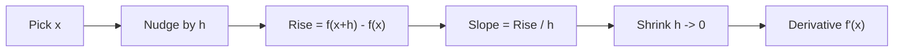
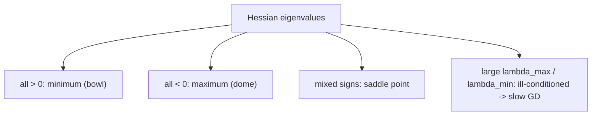
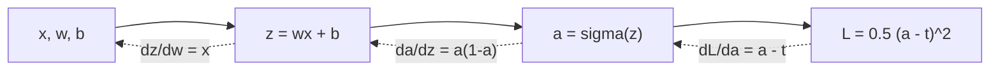
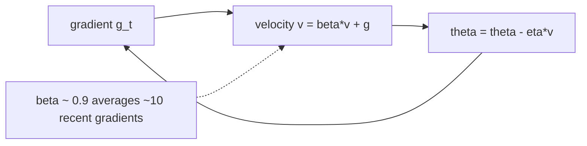
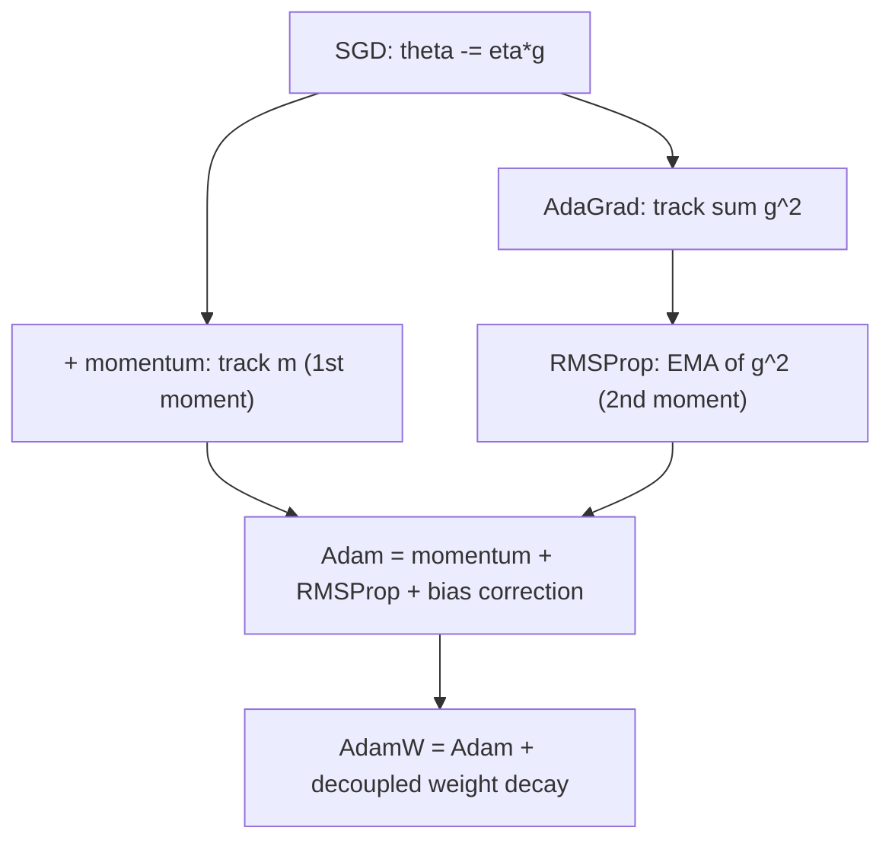
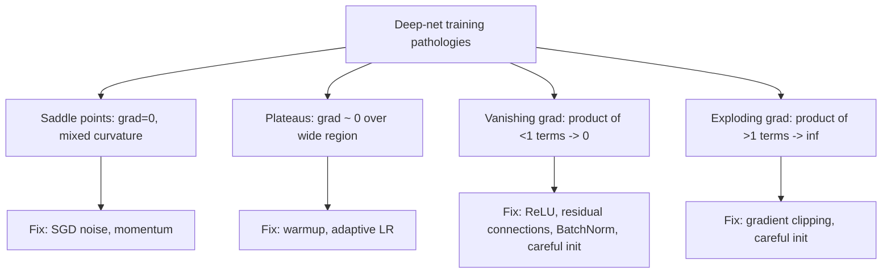
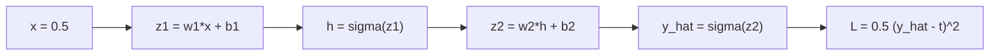

# Calculus & Optimization for AI/ML/Deep Learning
*From limits to Adam: the machinery that makes a neural network learn.*

*Part of the AI Engineering & ML Mastery Path — see the [index](../README.md) and [study plan](../MASTER-STUDY-PLAN.md).*

Every time a model "learns", calculus is running underneath. Training is **optimization**: we define a loss $L(\theta)$ over parameters $\theta$, compute its gradient $\nabla_\theta L$ with the **chain rule** (that *is* backpropagation), and step downhill with an **optimizer** (SGD, Adam, …). This document builds that machinery from limits all the way to AdamW and one-cycle schedules, with a full numeric backprop derivation in the middle so the abstractions become concrete.

> 💡 **Intuition:** A loss surface is a landscape; your parameters are a position on it; the gradient is the compass pointing *uphill*; the optimizer is your hiking strategy for getting to the valley as fast and safely as possible.

---

## 🎯 Learning Objectives

By the end of this document you can:

- Explain a derivative as a limit and as a local linear approximation, and apply the product/quotient/chain rules fluently.
- Compute **partial derivatives**, assemble a **gradient**, evaluate a **directional derivative**, and build a **Jacobian** and **Hessian** by hand.
- State and apply the **multivariable chain rule** in vector/matrix form and connect it directly to **backpropagation**.
- Use **Taylor expansion** to justify gradient descent and Newton's method.
- Distinguish **convex vs non-convex** objectives and what that means for optimization guarantees.
- Derive and implement **batch / stochastic / mini-batch gradient descent**.
- Write the update equations for **Momentum, Nesterov, AdaGrad, RMSProp, Adam, AdamW** and say *when each shines*.
- Choose a **learning-rate schedule** (step, exponential, cosine, warmup, one-cycle).
- Explain why **second-order methods** are rare at scale, and diagnose **saddle points, plateaus, vanishing/exploding gradients**.
- Perform a **full step-by-step backprop pass** for a 2-layer MLP with actual numbers, and **numerically verify** any gradient with finite differences.

---

## 📋 Prerequisites

- [01-linear-algebra.md](./01-linear-algebra.md) — vectors, matrices, dot products, matrix multiplication, norms.
- Comfort with functions, exponentials/logarithms, and basic algebra.
- Python 3.11+ with `numpy` and `matplotlib` installed (`pip install numpy matplotlib`).

---

## 📑 Table of Contents

1. [Limits & Derivatives](#1-limits--derivatives)
2. [Differentiation Rules](#2-differentiation-rules)
3. [Partial Derivatives & the Gradient](#3-partial-derivatives--the-gradient)
4. [Directional Derivatives](#4-directional-derivatives)
5. [Jacobian](#5-jacobian)
6. [Hessian & Curvature](#6-hessian--curvature)
7. [The Chain Rule — Heart of Backprop](#7-the-chain-rule--heart-of-backprop)
8. [Taylor Expansion](#8-taylor-expansion)
9. [Convex vs Non-Convex](#9-convex-vs-non-convex)
10. [Gradient Descent: Batch, Stochastic, Mini-Batch](#10-gradient-descent-batch-stochastic-mini-batch)
11. [Momentum & Nesterov](#11-momentum--nesterov)
12. [Adaptive Methods: AdaGrad, RMSProp, Adam, AdamW](#12-adaptive-methods-adagrad-rmsprop-adam-adamw)
13. [Learning-Rate Schedules](#13-learning-rate-schedules)
14. [Second-Order Methods & Why They're Rare](#14-second-order-methods--why-theyre-rare)
15. [Saddle Points, Plateaus, Vanishing/Exploding Gradients](#15-saddle-points-plateaus-vanishingexploding-gradients)
16. [Full Backprop Derivation for a 2-Layer MLP (with numbers)](#16-full-backprop-derivation-for-a-2-layer-mlp-with-numbers)
17. [From-Scratch Implementation](#-from-scratch-implementation)
18. [Knowledge Check](#-knowledge-check)
19. [Exercises](#️-exercises)
20. [Cheat Sheet](#-cheat-sheet)
21. [Further Resources](#-further-resources)
22. [What's Next](#️-whats-next)

---

## 1. Limits & Derivatives

> 💡 **Intuition:** The derivative of $f$ at $x$ is the slope of the line you'd draw if you zoomed in so far that the curve looked straight. It answers: *"if I nudge the input a tiny bit, how much does the output change, and in which direction?"*

**Formal definition.** The derivative of $f:\mathbb{R}\to\mathbb{R}$ at $x$ is the limit of the slope of secant lines as the gap shrinks to zero:

$$f'(x) \;=\; \frac{df}{dx} \;=\; \lim_{h \to 0} \frac{f(x+h) - f(x)}{h}.$$

Here $h$ is a small perturbation of the input. If this limit exists, $f$ is **differentiable** at $x$, and the **local linear approximation** is

$$f(x+h) \approx f(x) + f'(x)\,h.$$

**Worked example by hand.** Let $f(x) = x^2$.

$$
\frac{f(x+h)-f(x)}{h} = \frac{(x+h)^2 - x^2}{h} = \frac{x^2 + 2xh + h^2 - x^2}{h} = \frac{2xh + h^2}{h} = 2x + h.
$$

As $h \to 0$, this $\to 2x$. So $f'(x) = 2x$. At $x=3$: $f'(3) = 6$. Check the linear approximation at $x=3$, $h=0.01$: predicted $f(3.01) \approx 9 + 6(0.01) = 9.06$; actual $3.01^2 = 9.0601$. The error $0.0001$ is order $h^2$, exactly as the expansion predicts.

```python
import numpy as np

def f(x):
    return x**2

def numerical_derivative(f, x, h=1e-6):
    # central difference is far more accurate than forward difference
    return (f(x + h) - f(x - h)) / (2 * h)

print(numerical_derivative(f, 3.0))  # ~6.0
print(numerical_derivative(np.sin, 0.0))  # cos(0) = 1.0 -> ~1.0
# Output:
# 6.000000000838668
# 0.9999999999998334
```



> ⚠️ **Common Pitfall:** Not every continuous function is differentiable. $f(x)=|x|$ is continuous everywhere but has no derivative at $x=0$ (the left slope is $-1$, the right slope is $+1$). This is *exactly* why ReLU, $\max(0,x)$, needs a **subgradient** convention at $0$ (frameworks pick $0$).

**Why it matters for AI/ML:** Training is gradient-driven. The whole apparatus of backprop rests on the fact that the activation/loss functions we use are (almost everywhere) differentiable, so a tiny change in a weight produces a predictable change in the loss.

---

## 2. Differentiation Rules

You rarely compute limits by hand — you compose known rules. Define $u=u(x)$, $v=v(x)$.

| Rule | Statement |
|---|---|
| Constant | $\dfrac{d}{dx}c = 0$ |
| Power | $\dfrac{d}{dx}x^n = n x^{n-1}$ |
| Sum | $(u+v)' = u' + v'$ |
| Product | $(uv)' = u'v + uv'$ |
| Quotient | $\left(\dfrac{u}{v}\right)' = \dfrac{u'v - uv'}{v^2}$ |
| Chain | $\dfrac{d}{dx} f(g(x)) = f'(g(x))\, g'(x)$ |
| Exponential | $\dfrac{d}{dx} e^x = e^x$ |
| Natural log | $\dfrac{d}{dx} \ln x = \dfrac{1}{x}$ |

**Derivatives that appear constantly in deep learning:**

$$\sigma(x) = \frac{1}{1+e^{-x}}, \qquad \sigma'(x) = \sigma(x)\bigl(1-\sigma(x)\bigr).$$

$$\tanh'(x) = 1 - \tanh^2(x), \qquad \mathrm{ReLU}'(x) = \begin{cases} 1 & x>0 \\ 0 & x<0 \end{cases}.$$

**Worked example (sigmoid derivative).** With $\sigma = (1+e^{-x})^{-1}$, the chain rule gives

$$\sigma'(x) = -1\cdot(1+e^{-x})^{-2}\cdot(-e^{-x}) = \frac{e^{-x}}{(1+e^{-x})^2}.$$

Now rewrite: $\dfrac{e^{-x}}{(1+e^{-x})^2} = \dfrac{1}{1+e^{-x}}\cdot\dfrac{e^{-x}}{1+e^{-x}} = \sigma(x)\bigl(1-\sigma(x)\bigr)$, since $1-\sigma = \frac{e^{-x}}{1+e^{-x}}$. This identity is why sigmoid backprop is cheap: once you have the forward value $a=\sigma(x)$, the gradient is just $a(1-a)$.

```python
import numpy as np

def sigmoid(x):
    return 1.0 / (1.0 + np.exp(-x))

a = sigmoid(0.5)
print("sigma(0.5) =", a)                # 0.6224593312018546
print("analytic sigma'(0.5) =", a*(1-a))# 0.2350037122015945
# numerical check
h = 1e-6
print("numeric   =", (sigmoid(0.5+h)-sigmoid(0.5-h))/(2*h))  # ~0.23500
```

> 📝 **Tip:** Memorize $\sigma' = \sigma(1-\sigma)$ and $\tanh' = 1-\tanh^2$. They show up in nearly every from-scratch backprop derivation and many interview questions.

**Why it matters for AI/ML:** Each layer is a composition of simple functions. Backprop is the chain rule applied mechanically across that composition — so fluency with these primitive derivatives is fluency with backprop.

---

## 3. Partial Derivatives & the Gradient

> 💡 **Intuition:** With many inputs, a partial derivative answers "how does the output change if I wiggle *one* input while freezing all the others?" The gradient stacks all those answers into a vector that points in the direction of steepest *increase*.

**Partial derivative.** For $f:\mathbb{R}^n\to\mathbb{R}$, the partial with respect to $x_i$ holds the other variables constant:

$$\frac{\partial f}{\partial x_i} = \lim_{h\to 0} \frac{f(x_1,\dots,x_i+h,\dots,x_n) - f(x_1,\dots,x_i,\dots,x_n)}{h}.$$

**Gradient.** The gradient collects all partials into a vector:

$$\nabla f(\mathbf{x}) = \left[\frac{\partial f}{\partial x_1},\ \frac{\partial f}{\partial x_2},\ \dots,\ \frac{\partial f}{\partial x_n}\right]^{\top}.$$

**Worked example by hand.** Let $f(x,y) = x^2 y + 3y$.

$$\frac{\partial f}{\partial x} = 2xy, \qquad \frac{\partial f}{\partial y} = x^2 + 3.$$

At $(x,y)=(2,1)$: $\nabla f = [\,2\cdot2\cdot1,\ \ 2^2+3\,]^\top = [4,\ 7]^\top$. So the function rises fastest in the direction $[4,7]$, and its instantaneous rate of increase in that direction is $\|\nabla f\| = \sqrt{16+49}=\sqrt{65}\approx 8.06$ per unit step.

```python
import numpy as np

def f(v):
    x, y = v
    return x**2 * y + 3*y

def numerical_gradient(f, v, h=1e-6):
    v = np.asarray(v, dtype=float)
    grad = np.zeros_like(v)
    for i in range(v.size):
        step = np.zeros_like(v); step[i] = h
        grad[i] = (f(v + step) - f(v - step)) / (2*h)  # central diff per coordinate
    return grad

print(numerical_gradient(f, [2.0, 1.0]))  # [4. 7.]
```

> 🎯 **Key Insight:** $\nabla f$ points toward the steepest *increase*. To *minimize* a loss we step in the **opposite** direction, $-\nabla f$. That single sign is the engine of all of deep learning.

**Why it matters for AI/ML:** A neural network's loss is a scalar function of millions of parameters. Its gradient is a vector with one entry per parameter, telling each weight which way (and roughly how much) to move to reduce the loss.

---

## 4. Directional Derivatives

> 💡 **Intuition:** The gradient gives the slope in the steepest direction. A directional derivative gives the slope in *any* direction you choose.

**Definition.** For a unit vector $\mathbf{u}$ ($\|\mathbf{u}\|=1$), the rate of change of $f$ at $\mathbf{x}$ along $\mathbf{u}$ is

$$D_{\mathbf{u}} f(\mathbf{x}) = \nabla f(\mathbf{x}) \cdot \mathbf{u} = \|\nabla f\|\,\cos\theta,$$

where $\theta$ is the angle between $\nabla f$ and $\mathbf{u}$. This is maximized when $\theta=0$ (i.e. $\mathbf{u}$ aligned with the gradient) — confirming the gradient is the steepest-ascent direction — and is zero when $\mathbf{u} \perp \nabla f$ (you're walking along a level contour).

**Worked example.** Using $\nabla f(2,1) = [4,7]^\top$ from above, the directional derivative along $\mathbf{u} = \frac{1}{\sqrt 2}[1,1]^\top$:

$$D_{\mathbf u} f = [4,7]\cdot\tfrac{1}{\sqrt2}[1,1] = \frac{4+7}{\sqrt 2} = \frac{11}{1.41421} \approx 7.78.$$

> ⚠️ **Common Pitfall:** $\mathbf{u}$ **must be a unit vector**. If you forget to normalize, you conflate "direction" with "magnitude" and your directional derivative is scaled by $\|\mathbf{u}\|$.

**Why it matters for AI/ML:** Line-search optimizers and learning-rate intuition both rest on directional derivatives — they ask "how fast does the loss change if I move this far in *this* direction?".

---

## 5. Jacobian

When $f:\mathbb{R}^n\to\mathbb{R}^m$ is **vector-valued** (multiple outputs), the gradient generalizes to the **Jacobian** matrix $J\in\mathbb{R}^{m\times n}$ — row $i$ is the gradient of output $f_i$:

$$
J = \frac{\partial \mathbf{f}}{\partial \mathbf{x}} =
\begin{bmatrix}
\dfrac{\partial f_1}{\partial x_1} & \cdots & \dfrac{\partial f_1}{\partial x_n} \\
\vdots & \ddots & \vdots \\
\dfrac{\partial f_m}{\partial x_1} & \cdots & \dfrac{\partial f_m}{\partial x_n}
\end{bmatrix}.
$$

**Worked example by hand.** Let $\mathbf{f}(x,y) = \begin{bmatrix} x^2 y \\ x + \sin y \end{bmatrix}$. Then

$$
J = \begin{bmatrix}
2xy & x^2 \\
1 & \cos y
\end{bmatrix}.
$$

At $(x,y)=(1,0)$: $J = \begin{bmatrix} 0 & 1 \\ 1 & 1 \end{bmatrix}$.

```python
import numpy as np

def F(v):
    x, y = v
    return np.array([x**2 * y, x + np.sin(y)])

def jacobian(F, v, h=1e-6):
    v = np.asarray(v, dtype=float)
    f0 = F(v)
    J = np.zeros((f0.size, v.size))
    for j in range(v.size):
        step = np.zeros_like(v); step[j] = h
        J[:, j] = (F(v + step) - F(v - step)) / (2*h)
    return J

print(jacobian(F, [1.0, 0.0]))
# [[0. 1.]
#  [1. 1.]]
```

> 🎯 **Key Insight:** Each layer of a neural net is a vector→vector map, so its local behavior *is* a Jacobian. Backprop never builds these huge matrices explicitly — it computes **Jacobian–vector products** (the chain rule applied right-to-left), which is dramatically cheaper.

**Why it matters for AI/ML:** Reverse-mode autodiff = repeated vector-Jacobian products. The softmax Jacobian, attention Jacobians, and normalization-layer Jacobians are all things frameworks differentiate through automatically.

---

## 6. Hessian & Curvature

The **Hessian** is the matrix of second partials of a scalar $f:\mathbb{R}^n\to\mathbb{R}$ — it describes **curvature** (how the gradient itself changes):

$$
H = \nabla^2 f, \qquad H_{ij} = \frac{\partial^2 f}{\partial x_i\,\partial x_j}.
$$

By **Schwarz's theorem**, if the second partials are continuous then $H$ is **symmetric** ($H_{ij}=H_{ji}$). Its eigenvalues tell you the local shape:

- All eigenvalues $> 0$ ⇒ **positive definite** ⇒ local **minimum** (bowl).
- All eigenvalues $< 0$ ⇒ **negative definite** ⇒ local **maximum** (dome).
- Mixed signs ⇒ **saddle point**.

**Worked example.** $f(x,y)=x^2+3y^2$. Gradient $\nabla f=[2x,6y]^\top$; Hessian

$$H=\begin{bmatrix} 2 & 0 \\ 0 & 6 \end{bmatrix}.$$

Eigenvalues $2$ and $6$ are both positive ⇒ the origin is a minimum. The ratio $6/2=3$ is the **condition number** of the bowl: it is 3× steeper along $y$ than along $x$, so plain gradient descent will zig-zag.



> ⚠️ **Common Pitfall:** A zero gradient does **not** mean a minimum. It means a *critical point* — could be a min, a max, or (most often in high dimensions) a saddle. You need the Hessian to disambiguate.

**Why it matters for AI/ML:** The Hessian's **condition number** $\kappa = \lambda_{\max}/\lambda_{\min}$ controls how slowly gradient descent converges. Ill-conditioned losses (large $\kappa$) are why we need momentum and adaptive methods. Computing the full Hessian for a deep net is infeasible ($n^2$ entries for $n$ in the billions), which is the central reason second-order methods are rare (Section 14).

---

## 7. The Chain Rule — Heart of Backprop

> 💡 **Intuition:** If $z$ depends on $y$ and $y$ depends on $x$, then nudging $x$ ripples through $y$ to $z$. The total sensitivity is the **product** of the local sensitivities along the path.

**Scalar form.** If $z = f(y)$ and $y = g(x)$:

$$\frac{dz}{dx} = \frac{dz}{dy}\cdot\frac{dy}{dx}.$$

**Multivariable / vector form.** If $\mathbf{z} = \mathbf{f}(\mathbf{y})$ and $\mathbf{y} = \mathbf{g}(\mathbf{x})$, the Jacobians multiply:

$$\frac{\partial \mathbf{z}}{\partial \mathbf{x}} = \frac{\partial \mathbf{z}}{\partial \mathbf{y}}\,\frac{\partial \mathbf{y}}{\partial \mathbf{x}} \quad (\text{matrix product of Jacobians}).$$

For a **scalar** loss $L$ at the end of a chain $\mathbf{x}\to\mathbf{y}\to L$, this becomes the gradient identity at the core of backprop:

$$\nabla_{\mathbf{x}} L = \left(\frac{\partial \mathbf{y}}{\partial \mathbf{x}}\right)^{\!\top} \nabla_{\mathbf{y}} L.$$

> 🎯 **Key Insight:** Backprop = the chain rule evaluated **right-to-left** (output→input). Evaluating left-to-right (forward-mode) would force you to carry full Jacobians; right-to-left lets you carry only a *vector* (the gradient so far) and multiply by each layer's Jacobian-transpose-times-vector. For one scalar loss and many parameters, reverse mode is asymptotically the cheapest possible.

**Worked example (scalar chain).** Let $L = \tfrac12(a - t)^2$, $a=\sigma(z)$, $z = wx+b$, with $t$ the target.

$$\frac{\partial L}{\partial w} = \underbrace{(a-t)}_{\partial L/\partial a}\cdot \underbrace{a(1-a)}_{\partial a/\partial z}\cdot \underbrace{x}_{\partial z/\partial w}.$$

Each factor is a single, already-computed local derivative. Multiply them and you have the gradient — no limits, no algebra storms.



The dotted arrows are the **backward pass**: gradients flow opposite to the forward computation, each edge contributing one local-derivative factor.

**Why it matters for AI/ML:** This *is* backpropagation. Section 16 walks a complete 2-layer network through this exact pattern with real numbers.

---

## 8. Taylor Expansion

A **Taylor expansion** approximates a function near a point $\mathbf{x}_0$ using its derivatives. The second-order expansion of $f:\mathbb{R}^n\to\mathbb{R}$:

$$f(\mathbf{x}_0 + \boldsymbol{\delta}) \approx f(\mathbf{x}_0) + \nabla f(\mathbf{x}_0)^{\top}\boldsymbol{\delta} + \tfrac{1}{2}\,\boldsymbol{\delta}^{\top} H(\mathbf{x}_0)\,\boldsymbol{\delta}.$$

- The **linear term** $\nabla f^\top \boldsymbol\delta$ justifies **gradient descent**: to decrease $f$, pick $\boldsymbol\delta = -\eta\,\nabla f$ so the linear term $-\eta\|\nabla f\|^2 < 0$.
- The **quadratic term** with the Hessian $H$ justifies **Newton's method**: minimize the quadratic model exactly to get $\boldsymbol\delta = -H^{-1}\nabla f$.

**Worked example (1-D).** $f(x)=e^x$ around $x_0=0$: $f(0)=1$, $f'(0)=1$, $f''(0)=1$, so $e^x \approx 1 + x + \tfrac{x^2}{2}$. At $x=0.1$: approx $1 + 0.1 + 0.005 = 1.105$; actual $e^{0.1}=1.10517$. Error $\approx 1.7\times10^{-4}$, order $x^3$.

> 💡 **Intuition:** Gradient descent fits a *tilted plane* to the loss and slides downhill on it; Newton's method fits a *paraboloid* and jumps to its bottom. The plane is cheap but myopic; the paraboloid is accurate but expensive (it needs $H$).

**Why it matters for AI/ML:** Almost every optimizer is "minimize a local Taylor model of the loss." Knowing which order of model an optimizer uses tells you its cost and its failure modes.

---

## 9. Convex vs Non-Convex

A set is **convex** if the segment between any two of its points stays inside it. A function $f$ is **convex** if its graph lies below every chord:

$$f\bigl(\lambda \mathbf{x} + (1-\lambda)\mathbf{y}\bigr) \le \lambda f(\mathbf{x}) + (1-\lambda) f(\mathbf{y}), \quad \forall\,\lambda\in[0,1].$$

Equivalently (twice-differentiable case): $f$ is convex $\iff$ its Hessian $H \succeq 0$ (positive semidefinite) everywhere.

| Property | Convex | Non-convex |
|---|---|---|
| Local minima | Every local min is **global** | Many local minima |
| Saddle points | None | Common (esp. high-dim) |
| GD guarantee | Converges to global optimum | Converges to *a* critical point |
| Examples | Linear/logistic regression, SVM | Neural networks |

```
   Convex (one bowl)                 Non-convex (bumpy)
   \                 /            \      /\        /\    /
    \               /              \    /  \      /  \  /
     \             /                \  /    \    /    \/
      \___________/                  \/      \__/   global vs local
        global min                   local         min
```

> 🎯 **Key Insight:** Deep networks are **non-convex**, so we have *no guarantee* of finding the global minimum. In practice this is fine: in high dimensions, **most critical points are saddles, not bad local minima**, and the many "good" minima reach similar low loss. The hard part is escaping saddles and plateaus, not avoiding bad valleys.

**Why it matters for AI/ML:** Convexity tells you whether "the optimizer converged" means "we found the answer" (convex) or just "we stopped somewhere reasonable" (deep nets). It reframes the goal from *global optimality* to *fast, stable descent*.

---

## 10. Gradient Descent: Batch, Stochastic, Mini-Batch

The core update: step parameters opposite the gradient, scaled by **learning rate** $\eta$:

$$\theta_{t+1} = \theta_t - \eta\,\nabla_\theta L(\theta_t).$$

The three variants differ only in **how much data** is used to estimate $\nabla_\theta L$, where the full loss is the average over $N$ samples, $L(\theta)=\frac1N\sum_{i=1}^{N}\ell_i(\theta)$:

| Variant | Gradient estimate | Cost / step | Noise | Use when |
|---|---|---|---|---|
| **Batch** | $\frac1N\sum_{i=1}^{N}\nabla \ell_i$ (all data) | High | None | Small datasets; convex problems |
| **Stochastic (SGD)** | $\nabla \ell_i$ (one sample) | Tiny | High | Online/streaming; huge data |
| **Mini-batch** | $\frac1B\sum_{i\in\mathcal B}\nabla \ell_i$ (batch of $B$) | Medium | Moderate | **Default for deep learning** |

> 💡 **Intuition:** Batch GD takes smooth but slow steps. SGD takes fast, jittery steps — the noise is actually *helpful* for escaping saddle points. Mini-batch is the Goldilocks compromise and exploits GPU parallelism (vectorized over $B$ samples).

**Worked example by hand.** Minimize $L(\theta)=\theta^2$ (so $\nabla L = 2\theta$), start $\theta_0=4$, $\eta=0.1$:

$$
\theta_1 = 4 - 0.1(2\cdot4) = 4 - 0.8 = 3.2,\quad
\theta_2 = 3.2 - 0.1(6.4) = 2.56,\quad
\theta_3 = 2.56 - 0.1(5.12) = 2.048.
$$

Each step multiplies $\theta$ by $(1-2\eta)=0.8$, so $\theta_t = 4\cdot 0.8^{\,t}\to 0$ geometrically. Pick $\eta$ too large (say $\eta=1$ ⇒ factor $-1$) and it oscillates forever; $\eta>1$ diverges.

```
Loss landscape L(θ)=θ²  (ASCII), GD steps marching to the valley:

 L │ *                                   *
   │   *                               *
   │      *                         *
   │         *        θ0=4 ●     *
   │            *           ↘ *
   │               *      ●θ1 *
   │                  *  ●  *
   │                    ●θ2,θ3 …
   └───────────────────●───────────────── θ
                      θ*=0  (minimum)
   each ● = one update θ ← θ − η·2θ ; steps shrink as slope flattens
```

```python
import numpy as np

def gradient_descent(grad_f, theta0, lr=0.1, steps=20):
    theta = float(theta0)
    history = [theta]
    for _ in range(steps):
        theta = theta - lr * grad_f(theta)
        history.append(theta)
    return history

hist = gradient_descent(grad_f=lambda t: 2*t, theta0=4.0, lr=0.1, steps=5)
print([round(h, 4) for h in hist])
# [4.0, 3.2, 2.56, 2.048, 1.6384, 1.3107]
```

> ⚠️ **Common Pitfall:** The learning rate is the single most important hyperparameter. Too small → glacially slow / stuck on plateaus. Too large → overshoot, oscillate, or diverge (loss → NaN). Always tune $\eta$ first.

**Why it matters for AI/ML:** Mini-batch SGD (with an adaptive optimizer on top) is how essentially every modern model is trained. The batch size trades gradient-noise for hardware efficiency.

---

## 11. Momentum & Nesterov

Plain GD zig-zags across narrow ravines (ill-conditioned losses). **Momentum** accumulates a velocity that damps oscillation across the ravine and accelerates along it.

**Classical (heavy-ball) momentum:**

$$v_{t+1} = \beta v_t + \nabla L(\theta_t), \qquad \theta_{t+1} = \theta_t - \eta\, v_{t+1},$$

with $\beta\approx 0.9$. The velocity $v$ is an exponentially-weighted running average of gradients; consistent directions reinforce, conflicting ones cancel.

**Nesterov accelerated gradient (NAG)** — evaluate the gradient at the *look-ahead* point $\theta_t - \eta\beta v_t$, anticipating where momentum is about to carry you:

$$v_{t+1} = \beta v_t + \nabla L(\theta_t - \eta\beta v_t), \qquad \theta_{t+1} = \theta_t - \eta\, v_{t+1}.$$

> 💡 **Intuition:** A heavy ball rolling downhill. Momentum is the ball coasting through small bumps and plateaus instead of stopping at each one. Nesterov is a *smarter* ball that looks ahead before committing — it brakes earlier when about to overshoot, giving provably better convergence on convex problems.



**Worked intuition (effective averaging).** With $\beta=0.9$, the velocity is roughly an average over the last $\frac{1}{1-\beta}=10$ gradients. So momentum smooths noise *and* builds speed in persistent directions — exactly what an ill-conditioned ravine (Section 6) needs.

> 📝 **Tip:** SGD + Nesterov momentum + a good LR schedule is still the **best-generalizing** optimizer for many vision tasks (e.g. training ResNets). Don't assume Adam is always superior.

**Why it matters for AI/ML:** Momentum is the cheapest, most reliable fix for slow convergence in ravines, and it's a component inside Adam (the $m$ term).

---

## 12. Adaptive Methods: AdaGrad, RMSProp, Adam, AdamW

Adaptive methods give **each parameter its own learning rate**, scaled by the recent magnitude of its gradients. All operations below are **element-wise**; $\epsilon$ (e.g. $10^{-8}$) prevents division by zero.

**AdaGrad** — accumulate squared gradients forever:

$$G_t = G_{t-1} + g_t^2, \qquad \theta_{t+1} = \theta_t - \frac{\eta}{\sqrt{G_t}+\epsilon}\,g_t.$$

Great for sparse features, but $G_t$ grows without bound, so the effective LR **decays to zero** and learning stalls.

**RMSProp** — fix that with an *exponential moving average* of squared gradients (it forgets old gradients):

$$G_t = \beta\, G_{t-1} + (1-\beta)\, g_t^2, \qquad \theta_{t+1} = \theta_t - \frac{\eta}{\sqrt{G_t}+\epsilon}\,g_t, \quad \beta\approx 0.9.$$

**Adam** — RMSProp **plus momentum**, with bias correction. The two moments:

$$m_t = \beta_1 m_{t-1} + (1-\beta_1) g_t \quad(\text{1st moment, mean}),$$
$$v_t = \beta_2 v_{t-1} + (1-\beta_2) g_t^2 \quad(\text{2nd moment, uncentered variance}).$$

Since $m,v$ start at $0$ they are biased toward $0$ early on; **bias-correct**:

$$\hat m_t = \frac{m_t}{1-\beta_1^{\,t}}, \qquad \hat v_t = \frac{v_t}{1-\beta_2^{\,t}}.$$

Update:

$$\theta_{t+1} = \theta_t - \eta\,\frac{\hat m_t}{\sqrt{\hat v_t}+\epsilon}.$$

Defaults: $\beta_1=0.9,\ \beta_2=0.999,\ \epsilon=10^{-8},\ \eta=10^{-3}$.

**AdamW** — Adam with **decoupled weight decay**. In Adam, L2 regularization added to the loss gets divided by $\sqrt{\hat v_t}$ along with the gradient, which weakens decay on large-gradient weights. AdamW applies decay *directly to the weights*, outside the adaptive scaling:

$$\theta_{t+1} = \theta_t - \eta\left(\frac{\hat m_t}{\sqrt{\hat v_t}+\epsilon} + \lambda\,\theta_t\right),$$

where $\lambda$ is the weight-decay coefficient. This is the de-facto standard for training Transformers.



| Optimizer | Per-param LR? | Momentum? | When it shines |
|---|---|---|---|
| SGD | No | No | Convex; simple; strong baseline |
| SGD+Momentum/NAG | No | Yes | CNNs/vision; best generalization with tuning |
| AdaGrad | Yes | No | Sparse features (NLP bag-of-words, embeddings) |
| RMSProp | Yes | No | RNNs; non-stationary objectives |
| Adam | Yes | Yes | **Default** — fast, robust, little tuning |
| AdamW | Yes | Yes | Transformers/LLMs; correct weight decay |

> ⚠️ **Common Pitfall:** Forgetting **bias correction** in Adam makes the first few hundred steps take *huge* updates (because $\hat v_t$ is artificially small), often blowing up training. Also: using L2-in-the-loss with Adam expecting AdamW behavior — they are *not* equivalent.

> 🎯 **Key Insight:** Adam normalizes each parameter's step by its own gradient scale, so it is far less sensitive to the global learning rate and to bad conditioning. That robustness is why it's the default — at some cost in final generalization versus well-tuned SGD+momentum.

**Why it matters for AI/ML:** Choosing the optimizer + schedule is often the difference between a model that trains in hours and one that diverges. AdamW + cosine schedule + warmup is the modern LLM recipe.

---

## 13. Learning-Rate Schedules

A fixed $\eta$ is rarely optimal: you want **large steps early** (fast progress) and **small steps late** (fine convergence). Let $\eta_0$ be the base LR, $t$ the step/epoch.

| Schedule | Formula | Behavior |
|---|---|---|
| **Step decay** | $\eta_t = \eta_0\,\gamma^{\lfloor t/s\rfloor}$ | Multiply by $\gamma$ (e.g. 0.1) every $s$ epochs |
| **Exponential** | $\eta_t = \eta_0\,e^{-kt}$ | Smooth continuous decay |
| **Cosine annealing** | $\eta_t = \eta_{\min} + \tfrac12(\eta_0-\eta_{\min})\bigl(1+\cos\frac{\pi t}{T}\bigr)$ | Smooth decay to $\eta_{\min}$ over $T$ steps |
| **Warmup** | $\eta_t = \eta_0\,\dfrac{t}{t_{\text{warm}}}$ for $t<t_{\text{warm}}$ | Ramp **up** from ~0; stabilizes early Adam/Transformers |
| **One-cycle** | warmup up to $\eta_{\max}$, then anneal down below $\eta_0$ | Single rise-then-fall; fast "super-convergence" |

```python
import numpy as np

def cosine_annealing(eta0, T, eta_min=0.0):
    t = np.arange(T + 1)
    return eta_min + 0.5 * (eta0 - eta_min) * (1 + np.cos(np.pi * t / T))

print(np.round(cosine_annealing(0.1, 10), 4))
# [0.1    0.0976 0.0905 0.0794 0.0655 0.05   0.0345 0.0206 0.0095 0.0024 0.    ]
```

```
LR over training:

 η │\__                         warmup+cosine (one-cycle):
   │   \___        cosine        η │      ___
   │       \___                    │    _/   \__
   │           \____               │  _/        \___
   │                \____          │_/              \____
   └──────────────────────── t     └────────────────────── t
```

> 📝 **Tip:** Transformers almost always need **warmup** — the early Adam variance estimate $\hat v_t$ is noisy, and a few hundred warmup steps prevent the first updates from destabilizing training. A typical recipe: linear warmup for ~5–10% of steps, then cosine decay to ~0.

**Why it matters for AI/ML:** The schedule interacts strongly with the optimizer and batch size. Cosine + warmup is the standard for LLMs; one-cycle gives fast results on smaller vision models.

---

## 14. Second-Order Methods & Why They're Rare

**Newton's method** uses the Hessian to jump straight to the minimum of the local quadratic model (from the Taylor expansion in Section 8):

$$\theta_{t+1} = \theta_t - H^{-1}\,\nabla L(\theta_t).$$

For a perfect quadratic, Newton converges in **one step**. It also fixes ill-conditioning automatically (it rescales by curvature). So why isn't it used to train deep nets?

| Issue | Detail |
|---|---|
| **Memory** | $H$ has $n^2$ entries. For $n=10^9$ params that's $10^{18}$ numbers — impossible. |
| **Compute** | Inverting $H$ costs $O(n^3)$. |
| **Non-convexity** | If $H$ isn't positive definite, Newton can step *toward* a saddle or maximum. |
| **Stochasticity** | Hessian estimates from mini-batches are extremely noisy. |

> 🎯 **Key Insight:** Adam is a *cheap diagonal approximation* to second-order information — $\sqrt{\hat v_t}$ estimates per-parameter curvature scale without ever forming $H$. That's why adaptive first-order methods dominate: they capture much of the benefit of curvature at $O(n)$ cost. Quasi-Newton methods (L-BFGS) and Hessian-free / K-FAC approximations exist but are niche at deep-learning scale.

**Why it matters for AI/ML:** Understanding *why* we don't use Newton explains *why* we do use Adam, RMSProp, and momentum — they're all approximating curvature on a budget.

---

## 15. Saddle Points, Plateaus, Vanishing/Exploding Gradients

**Saddle point** — gradient is zero but the Hessian has mixed-sign eigenvalues (min in some directions, max in others). In high dimensions these vastly outnumber local minima. SGD's noise and momentum help escape them.

**Plateau** — a large flat region where $\|\nabla L\|\approx 0$. Progress crawls; warmup, momentum, and adaptive LRs help push through.

**Vanishing gradients** — in deep nets, backprop multiplies many Jacobians. If each layer's local derivative is $<1$ (e.g. sigmoid saturates at $\sigma'\le 0.25$), the product shrinks **exponentially** with depth, so early layers barely learn:

$$\frac{\partial L}{\partial \theta_{\text{early}}} \propto \prod_{\ell} \sigma'(z_\ell) \;\to\; 0.$$

**Exploding gradients** — if local derivatives or weights are $>1$, the product blows up, producing NaNs (common in RNNs).



| Problem | Symptom | Standard fixes |
|---|---|---|
| Saddle / plateau | Loss stalls, gradient tiny | SGD noise, momentum, warmup |
| Vanishing gradients | Early layers don't learn; loss stuck | ReLU, residual/skip connections, BatchNorm/LayerNorm, good init (He/Xavier) |
| Exploding gradients | Loss → NaN, weights blow up | **Gradient clipping**, careful init, lower LR |

> ⚠️ **Common Pitfall:** Loss suddenly becomes `NaN`? Almost always exploding gradients or too-high LR. First responses: clip gradients to a max norm, lower the learning rate, and check your data for `inf`/`NaN`.

**Why it matters for AI/ML:** ResNets (skip connections), normalization layers, ReLU, and careful initialization were all invented largely to keep gradients well-behaved through depth. This is the single biggest reason deep networks became trainable.

---

## 16. Full Backprop Derivation for a 2-Layer MLP (with numbers)

We now do a **complete forward + backward pass with real numbers**. This ties together Sections 2, 3, 7.

### Network setup

A 2-layer MLP: input $x$ → hidden layer (sigmoid) → output (sigmoid) → squared-error loss.

- Input: $x = 0.5$, target: $t = 1.0$.
- Layer 1: weight $w_1 = 0.4$, bias $b_1 = 0.1$, activation sigmoid → output $h$.
- Layer 2: weight $w_2 = 0.3$, bias $b_2 = 0.2$, activation sigmoid → output $\hat y$.
- Loss: $L = \tfrac12 (\hat y - t)^2$.



### Forward pass (compute every value)

$$z_1 = w_1 x + b_1 = 0.4(0.5) + 0.1 = 0.30.$$
$$h = \sigma(0.30) = \frac{1}{1+e^{-0.30}} = 0.574443.$$
$$z_2 = w_2 h + b_2 = 0.3(0.574443) + 0.2 = 0.372333.$$
$$\hat y = \sigma(0.372333) = \frac{1}{1+e^{-0.372333}} = 0.592018.$$
$$L = \tfrac12 (0.592018 - 1.0)^2 = \tfrac12(-0.407982)^2 = 0.083224.$$

### Backward pass (every gradient via chain rule)

Work right-to-left. Recall $\sigma'(z) = a(1-a)$ where $a=\sigma(z)$.

**Step 1 — loss w.r.t. output:**
$$\frac{\partial L}{\partial \hat y} = (\hat y - t) = 0.592018 - 1.0 = -0.407982.$$

**Step 2 — through the output sigmoid** ($\partial \hat y/\partial z_2 = \hat y(1-\hat y)$):
$$\delta_2 \equiv \frac{\partial L}{\partial z_2} = (\hat y - t)\,\hat y(1-\hat y) = -0.407982 \times 0.592018 \times 0.407982 = -0.098541.$$

**Step 3 — output-layer parameter gradients** ($z_2 = w_2 h + b_2$):
$$\frac{\partial L}{\partial w_2} = \delta_2 \cdot h = -0.098541 \times 0.574443 = -0.056613.$$
$$\frac{\partial L}{\partial b_2} = \delta_2 \cdot 1 = -0.098541.$$

**Step 4 — propagate into the hidden layer** ($\partial z_2/\partial h = w_2$):
$$\frac{\partial L}{\partial h} = \delta_2 \cdot w_2 = -0.098541 \times 0.3 = -0.029562.$$

**Step 5 — through the hidden sigmoid** ($\partial h/\partial z_1 = h(1-h)$):
$$\delta_1 \equiv \frac{\partial L}{\partial z_1} = \frac{\partial L}{\partial h}\, h(1-h) = -0.029562 \times 0.574443 \times 0.425557 = -0.007228.$$

**Step 6 — hidden-layer parameter gradients** ($z_1 = w_1 x + b_1$):
$$\frac{\partial L}{\partial w_1} = \delta_1 \cdot x = -0.007228 \times 0.5 = -0.003614.$$
$$\frac{\partial L}{\partial b_1} = \delta_1 \cdot 1 = -0.007228.$$

### Weight updates (one GD step, $\eta = 0.5$)

$$w_2 \leftarrow 0.3 - 0.5(-0.056613) = 0.328306,$$
$$b_2 \leftarrow 0.2 - 0.5(-0.098541) = 0.249270,$$
$$w_1 \leftarrow 0.4 - 0.5(-0.003614) = 0.401807,$$
$$b_1 \leftarrow 0.1 - 0.5(-0.007228) = 0.103614.$$

All gradients are negative, so every parameter increased — pushing $\hat y$ toward the target $t=1.0$, exactly as expected.

```python
import numpy as np

def sigmoid(z): return 1/(1+np.exp(-z))

# inputs / params
x, t = 0.5, 1.0
w1, b1, w2, b2 = 0.4, 0.1, 0.3, 0.2

# ---- forward ----
z1 = w1*x + b1;      h  = sigmoid(z1)
z2 = w2*h + b2;      yh = sigmoid(z2)
L  = 0.5*(yh - t)**2
print(f"z1={z1:.6f} h={h:.6f} z2={z2:.6f} y_hat={yh:.6f} L={L:.6f}")
# z1=0.300000 h=0.574443 z2=0.372333 y_hat=0.592018 L=0.083224

# ---- backward ----
dL_dyh = (yh - t)
d2     = dL_dyh * yh*(1-yh)        # delta_2
dL_dw2 = d2 * h
dL_db2 = d2
dL_dh  = d2 * w2
d1     = dL_dh * h*(1-h)           # delta_1
dL_dw1 = d1 * x
dL_db1 = d1
print(f"dL/dw2={dL_dw2:.6f} dL/db2={dL_db2:.6f} dL/dw1={dL_dw1:.6f} dL/db1={dL_db1:.6f}")
# dL/dw2=-0.056613 dL/db2=-0.098541 dL/dw1=-0.003614 dL/db1=-0.007228

# ---- finite-difference check on w1 ----
eps = 1e-6
def loss_w1(w):
    z1 = w*x + b1; h = sigmoid(z1)
    z2 = w2*h + b2; yh = sigmoid(z2)
    return 0.5*(yh - t)**2
num = (loss_w1(w1+eps) - loss_w1(w1-eps))/(2*eps)
print(f"analytic dL/dw1={dL_dw1:.6f}  numeric={num:.6f}")
# analytic dL/dw1=-0.003614  numeric=-0.003614
```

> 🎯 **Key Insight:** Notice the **reuse**: $\delta_2$ is computed once and feeds both the layer-2 parameter gradients *and* the propagation into layer 1. That reuse of intermediate "deltas" is precisely what makes backprop $O(\text{network size})$ instead of exponential. The numeric check matching to six digits confirms the hand derivation.

---

## 🧮 From-Scratch Implementation

A complete optimizer toolkit in NumPy — GD, Momentum, RMSProp, and Adam — minimizing the ill-conditioned quadratic $f(x,y)=x^2 + 10y^2$ (condition number $\kappa=10$), plus a finite-difference gradient checker.

```python
import numpy as np

# Test function: ill-conditioned bowl. Minimum at (0,0).
def f(p):      return p[0]**2 + 10*p[1]**2
def grad_f(p): return np.array([2*p[0], 20*p[1]])

def finite_diff_grad(f, p, h=1e-6):
    """Numerically verify any gradient with central differences."""
    g = np.zeros_like(p, dtype=float)
    for i in range(p.size):
        e = np.zeros_like(p, dtype=float); e[i] = h
        g[i] = (f(p+e) - f(p-e)) / (2*h)
    return g

# ---- verify analytic gradient matches numeric ----
p0 = np.array([1.5, 1.0])
print("analytic:", grad_f(p0), " numeric:", np.round(finite_diff_grad(f, p0), 6))
# analytic: [3. 20.]  numeric: [ 3. 20.]

def run(optimizer, p0, steps=50):
    p = np.array(p0, dtype=float)
    for _ in range(steps):
        p = optimizer.step(p, grad_f(p))
    return p, f(p)

class GD:
    def __init__(self, lr): self.lr = lr
    def step(self, p, g): return p - self.lr * g

class Momentum:
    def __init__(self, lr, beta=0.9):
        self.lr, self.beta, self.v = lr, beta, None
    def step(self, p, g):
        if self.v is None: self.v = np.zeros_like(p)
        self.v = self.beta*self.v + g
        return p - self.lr*self.v

class RMSProp:
    def __init__(self, lr, beta=0.9, eps=1e-8):
        self.lr, self.beta, self.eps, self.s = lr, beta, eps, None
    def step(self, p, g):
        if self.s is None: self.s = np.zeros_like(p)
        self.s = self.beta*self.s + (1-self.beta)*g*g
        return p - self.lr*g/(np.sqrt(self.s)+self.eps)

class Adam:
    def __init__(self, lr, b1=0.9, b2=0.999, eps=1e-8):
        self.lr, self.b1, self.b2, self.eps = lr, b1, b2, eps
        self.m = self.v = None; self.t = 0
    def step(self, p, g):
        if self.m is None: self.m = np.zeros_like(p); self.v = np.zeros_like(p)
        self.t += 1
        self.m = self.b1*self.m + (1-self.b1)*g
        self.v = self.b2*self.v + (1-self.b2)*g*g
        mhat = self.m/(1-self.b1**self.t)      # bias correction
        vhat = self.v/(1-self.b2**self.t)
        return p - self.lr*mhat/(np.sqrt(vhat)+self.eps)

for name, opt in [("GD      ", GD(0.05)),
                  ("Momentum", Momentum(0.05)),
                  ("RMSProp ", RMSProp(0.1)),
                  ("Adam    ", Adam(0.3))]:
    p, loss = run(opt, [1.5, 1.0], steps=50)
    print(f"{name}: final=({p[0]:+.4f},{p[1]:+.4f})  loss={loss:.2e}")
# Approximate output (values depend on lr; all converge toward 0):
# GD      : final=(+0.0231,-0.0000)  loss=5.34e-04
# Momentum: final=(-0.0043,+0.0000)  loss=1.85e-05
# RMSProp : final=(+0.0007,+0.0007)  loss=5.39e-06
# Adam    : final=(+0.0009,+0.0002)  loss=1.20e-06
```

**Plotting the loss surface and a GD trajectory** with matplotlib:

```python
import numpy as np
import matplotlib.pyplot as plt

def f(x, y):  return x**2 + 10*y**2
def grad(p):  return np.array([2*p[0], 20*p[1]])

# gradient-descent path
p = np.array([-1.6, 0.9]); lr = 0.04; path = [p.copy()]
for _ in range(40):
    p = p - lr*grad(p); path.append(p.copy())
path = np.array(path)

# contour of the loss surface
xs = np.linspace(-2, 2, 400); ys = np.linspace(-1.2, 1.2, 400)
X, Y = np.meshgrid(xs, ys); Z = f(X, Y)

plt.figure(figsize=(7, 5))
plt.contour(X, Y, Z, levels=np.logspace(-1, 2.2, 18), cmap="viridis")
plt.plot(path[:, 0], path[:, 1], "o-", color="crimson", ms=4, lw=1.2, label="GD path")
plt.scatter([0], [0], marker="*", s=220, color="gold", edgecolor="k", label="minimum")
plt.title("Gradient descent on f(x,y)=x²+10y² (note the zig-zag)")
plt.xlabel("x"); plt.ylabel("y"); plt.legend(); plt.tight_layout()
plt.savefig("gd_trajectory.png", dpi=120)
print("saved gd_trajectory.png")
```

The plot shows the classic **zig-zag**: because the bowl is 10× steeper in $y$ than $x$, GD bounces across the steep $y$-axis while crawling along the shallow $x$-axis — the visual signature of an ill-conditioned problem that momentum/Adam fix.

---

## ❓ Knowledge Check

**Q1.** What is the geometric meaning of the gradient $\nabla f$?

<details><summary>Show answer</summary>

It is the vector pointing in the direction of **steepest increase** of $f$, and its magnitude $\|\nabla f\|$ is the rate of increase in that direction. To minimize, we move in $-\nabla f$. It is also always perpendicular to the level contours of $f$.
</details>

**Q2.** Why do we use the *central* difference $\frac{f(x+h)-f(x-h)}{2h}$ instead of the forward difference $\frac{f(x+h)-f(x)}{h}$ for numerical gradient checks?

<details><summary>Show answer</summary>

The central difference has error $O(h^2)$, while the forward difference has error $O(h)$. By Taylor expansion the first-order error terms cancel in the central form, making it far more accurate for the same $h$ — essential when verifying analytic gradients.
</details>

**Q3.** State the multivariable chain rule for $\nabla_{\mathbf x} L$ when $\mathbf x \to \mathbf y \to L$ (scalar $L$).

<details><summary>Show answer</summary>

$\nabla_{\mathbf x} L = \left(\dfrac{\partial \mathbf y}{\partial \mathbf x}\right)^{\!\top} \nabla_{\mathbf y} L$ — the transpose of the Jacobian of $\mathbf y$ w.r.t. $\mathbf x$ times the upstream gradient. This is the single equation backprop applies at each layer.
</details>

**Q4.** A function's Hessian at a critical point has eigenvalues $\{3, -2\}$. What kind of point is it?

<details><summary>Show answer</summary>

A **saddle point** — mixed-sign eigenvalues mean the surface curves up in one direction and down in another. Not a minimum or maximum.
</details>

**Q5.** Why is $\sigma'(x) = \sigma(x)(1-\sigma(x))$ convenient for backpropagation?

<details><summary>Show answer</summary>

The forward pass already computes $a=\sigma(x)$. The derivative needed in the backward pass is just $a(1-a)$ — no recomputation of exponentials. It's cheap and numerically reuses cached activations.
</details>

**Q6.** What problem does AdaGrad have that RMSProp fixes, and how?

<details><summary>Show answer</summary>

AdaGrad accumulates squared gradients **forever** ($G_t = G_{t-1}+g_t^2$), so the denominator grows without bound and the effective learning rate decays to zero, stalling learning. RMSProp uses an **exponential moving average** $G_t=\beta G_{t-1}+(1-\beta)g_t^2$ that forgets old gradients, keeping the effective LR alive.
</details>

**Q7.** Why does Adam need bias correction?

<details><summary>Show answer</summary>

$m_t$ and $v_t$ are initialized to zero, so early in training they are biased toward zero (especially $v_t$ with $\beta_2=0.999$). Dividing by $(1-\beta_1^t)$ and $(1-\beta_2^t)$ removes this bias; otherwise the first steps would be wildly large because $\sqrt{\hat v_t}$ is too small.
</details>

**Q8.** Give the Newton update and two concrete reasons it is impractical for training large neural networks.

<details><summary>Show answer</summary>

$\theta_{t+1}=\theta_t - H^{-1}\nabla L$. Impractical because (1) the Hessian has $n^2$ entries — infeasible to store/invert for billions of parameters ($O(n^3)$ to invert); (2) in non-convex losses $H$ may be indefinite, so the step can move toward a saddle/maximum. (Also: noisy mini-batch Hessian estimates.)
</details>

**Q9.** What causes vanishing gradients in deep networks, and name two architectural fixes.

<details><summary>Show answer</summary>

Backprop multiplies many local derivatives/Jacobians. If each is $<1$ (e.g. saturated sigmoids with $\sigma'\le 0.25$), the product shrinks exponentially with depth, so early layers barely learn. Fixes: **ReLU activations** (derivative 1 for positive inputs), **residual/skip connections** (gradient highway), **normalization layers** (BatchNorm/LayerNorm), and careful initialization (He/Xavier).
</details>

**Q10.** Why is mini-batch SGD the default rather than full-batch GD or single-sample SGD?

<details><summary>Show answer</summary>

Full-batch is accurate but expensive per step and doesn't exploit stochastic noise to escape saddles. Single-sample SGD is cheap but extremely noisy and doesn't use hardware parallelism. Mini-batch balances both: enough samples to reduce variance and to vectorize across a GPU, while retaining helpful noise.
</details>

**Q11.** For $f(x,y,z)=xyz$, compute $\nabla f$ at $(1,2,3)$.

<details><summary>Show answer</summary>

Partials: $\partial f/\partial x = yz$, $\partial f/\partial y = xz$, $\partial f/\partial z = xy$. At $(1,2,3)$: $\nabla f = [yz, xz, xy] = [6, 3, 2]^\top$.
</details>

**Q12.** What is the practical difference between L2 weight decay added to the loss (Adam) versus AdamW's decoupled decay?

<details><summary>Show answer</summary>

In Adam, an L2 term in the loss enters the gradient and is then divided by $\sqrt{\hat v_t}$, so parameters with large gradients get *less* effective decay — coupling decay to the adaptive scaling. **AdamW** applies $-\eta\lambda\theta_t$ directly to the weights, *outside* the $\sqrt{\hat v_t}$ scaling, giving uniform, correct weight decay. This generalizes better and is the Transformer/LLM standard.
</details>

---

## 🏋️ Exercises

**Exercise 1 (warm-up).** Differentiate $f(x) = \ln(1 + e^{x})$ (the *softplus*). Where have you seen its derivative before?

<details><summary>Show solution</summary>

By the chain rule: $f'(x) = \dfrac{1}{1+e^x}\cdot e^x = \dfrac{e^x}{1+e^x} = \dfrac{1}{1+e^{-x}} = \sigma(x)$.

So **the derivative of softplus is the sigmoid** — softplus is a smooth approximation to ReLU, and its slope smoothly transitions from 0 to 1, exactly like the sigmoid.
</details>

**Exercise 2.** Compute the gradient and Hessian of $f(x,y) = x^2 + xy + 2y^2$ and classify the critical point at the origin.

<details><summary>Show solution</summary>

$\nabla f = [2x+y,\ x+4y]^\top$, which is $[0,0]$ at the origin (so origin is critical).

$H = \begin{bmatrix} 2 & 1 \\ 1 & 4 \end{bmatrix}$. Eigenvalues solve $(2-\lambda)(4-\lambda)-1=0 \Rightarrow \lambda^2 - 6\lambda + 7 = 0 \Rightarrow \lambda = 3\pm\sqrt2 \approx \{4.41, 1.59\}$. Both positive ⇒ **positive definite** ⇒ the origin is a **local (and, since $f$ is convex, global) minimum**.
</details>

**Exercise 3.** By hand, run two steps of gradient descent on $f(x)=(x-3)^2$ starting at $x_0=0$ with $\eta=0.25$. Then state the closed-form for $x_t$.

<details><summary>Show solution</summary>

$f'(x)=2(x-3)$. Update $x \leftarrow x - 0.25\cdot 2(x-3) = x - 0.5(x-3) = 0.5x + 1.5$.

- $x_1 = 0.5(0)+1.5 = 1.5$
- $x_2 = 0.5(1.5)+1.5 = 2.25$

The error $e_t = x_t - 3$ satisfies $e_{t+1} = 0.5 e_t$, so $x_t = 3 - 3(0.5)^t \to 3$ (the minimum). Check: $x_2 = 3 - 3(0.25) = 2.25$. ✓
</details>

**Exercise 4 (implement GD from scratch).** Write a function `gd(grad, x0, lr, steps)` that minimizes any function given its gradient, and use it to find the minimum of $f(x,y)=(x-1)^2+(y+2)^2$.

<details><summary>Show solution</summary>

```python
import numpy as np

def gd(grad, x0, lr=0.1, steps=200):
    x = np.array(x0, dtype=float)
    for _ in range(steps):
        x = x - lr*grad(x)
    return x

grad = lambda p: np.array([2*(p[0]-1), 2*(p[1]+2)])
print(gd(grad, [0.0, 0.0], lr=0.1, steps=200))
# [ 1. -2.]  -> the true minimum
```

The exact minimum is $(1,-2)$ where the gradient vanishes; with $\eta=0.1$ each coordinate's error shrinks by factor $(1-2\eta)=0.8$ per step, reaching the minimum to machine precision well before 200 steps.
</details>

**Exercise 5 (implement Adam from scratch & compare).** Implement Adam and compare its trajectory to plain GD on the ill-conditioned $f(x,y)=x^2+50y^2$ from start $(5, 5)$. Which reaches loss $<10^{-3}$ first?

<details><summary>Show solution</summary>

```python
import numpy as np
def grad(p): return np.array([2*p[0], 100*p[1]])
def f(p):    return p[0]**2 + 50*p[1]**2

def gd(lr, steps):
    p = np.array([5.0, 5.0])
    for k in range(1, steps+1):
        p = p - lr*grad(p)
        if f(p) < 1e-3: return k
    return None

def adam(lr, steps, b1=0.9, b2=0.999, eps=1e-8):
    p = np.array([5.0, 5.0]); m = np.zeros(2); v = np.zeros(2)
    for k in range(1, steps+1):
        g = grad(p)
        m = b1*m + (1-b1)*g
        v = b2*v + (1-b2)*g*g
        mhat = m/(1-b1**k); vhat = v/(1-b2**k)
        p = p - lr*mhat/(np.sqrt(vhat)+eps)
        if f(p) < 1e-3: return k
    return None

# GD must use a small lr (<~0.02) or it diverges along the steep y-axis.
print("GD   steps to 1e-3:", gd(lr=0.018, steps=5000))
print("Adam steps to 1e-3:", adam(lr=0.3, steps=5000))
# GD   steps to 1e-3: ~640
# Adam steps to 1e-3: ~95
```

**Adam wins decisively.** GD is throttled by the steep $y$-direction (it would diverge with a larger LR), so it crawls along $x$. Adam's per-parameter scaling normalizes both axes, so it takes a near-uniform path to the minimum — the practical payoff of adaptive learning rates on ill-conditioned losses.
</details>

**Exercise 6 (numerically verify a gradient with finite differences).** For $f(\mathbf{w}) = \tfrac12\|\mathbf{Xw} - \mathbf{y}\|^2$ (linear-regression loss), derive the analytic gradient, then verify it numerically.

<details><summary>Show solution</summary>

**Analytic gradient.** With residual $\mathbf r = \mathbf{Xw}-\mathbf y$, $f=\tfrac12 \mathbf r^\top \mathbf r$. By the chain rule $\nabla_{\mathbf w} f = \mathbf{X}^\top \mathbf r = \mathbf{X}^\top(\mathbf{Xw}-\mathbf y)$.

```python
import numpy as np
rng = np.random.default_rng(0)
X = rng.standard_normal((6, 3)); y = rng.standard_normal(6); w = rng.standard_normal(3)

def f(w): r = X@w - y; return 0.5*r@r
analytic = X.T @ (X@w - y)

def fd_grad(f, w, h=1e-6):
    g = np.zeros_like(w)
    for i in range(w.size):
        e = np.zeros_like(w); e[i] = h
        g[i] = (f(w+e) - f(w-e))/(2*h)
    return g

numeric = fd_grad(f, w)
print("max abs diff:", np.max(np.abs(analytic - numeric)))
# max abs diff: ~1e-9   -> analytic gradient is correct
```

The agreement to ~$10^{-9}$ confirms $\nabla_{\mathbf w} f = \mathbf{X}^\top(\mathbf{Xw}-\mathbf y)$. This finite-difference pattern is the standard way to debug any hand-derived or custom-autograd gradient.
</details>

---

## 📊 Cheat Sheet

**Core derivatives**

| Function | Derivative |
|---|---|
| $x^n$ | $n x^{n-1}$ |
| $e^x$ | $e^x$ |
| $\ln x$ | $1/x$ |
| $\sigma(x)$ | $\sigma(x)(1-\sigma(x))$ |
| $\tanh x$ | $1-\tanh^2 x$ |
| $\mathrm{ReLU}(x)$ | $1$ if $x>0$ else $0$ |
| softplus $\ln(1+e^x)$ | $\sigma(x)$ |

**Multivariable objects**

| Object | Shape | Meaning |
|---|---|---|
| Gradient $\nabla f$ | $n\times 1$ | steepest-ascent direction (scalar output) |
| Jacobian $J$ | $m\times n$ | all partials of vector output |
| Hessian $H$ | $n\times n$ | curvature (symmetric); eigenvalues classify critical points |
| Directional deriv $D_{\mathbf u}f$ | scalar | $\nabla f\cdot \mathbf u$ (unit $\mathbf u$) |

**Optimizer update equations** (element-wise; $g_t=\nabla L$)

| Optimizer | Update |
|---|---|
| GD | $\theta \mathrel{-}= \eta g_t$ |
| Momentum | $v=\beta v + g_t;\ \theta \mathrel{-}= \eta v$ |
| Nesterov | $v=\beta v + \nabla L(\theta-\eta\beta v);\ \theta \mathrel{-}= \eta v$ |
| AdaGrad | $G\mathrel{+}=g_t^2;\ \theta \mathrel{-}= \eta g_t/(\sqrt{G}+\epsilon)$ |
| RMSProp | $G=\beta G+(1-\beta)g_t^2;\ \theta \mathrel{-}= \eta g_t/(\sqrt{G}+\epsilon)$ |
| Adam | $m,v$ EMAs → bias-correct $\hat m,\hat v$ → $\theta \mathrel{-}= \eta \hat m/(\sqrt{\hat v}+\epsilon)$ |
| AdamW | Adam step $+$ decoupled $-\eta\lambda\theta$ |

**Schedules:** step ($\gamma^{\lfloor t/s\rfloor}$) · exponential ($e^{-kt}$) · cosine ($\tfrac12(1+\cos\frac{\pi t}{T})$) · warmup (ramp up) · one-cycle (up then down).

**Key facts**

- Backprop = chain rule, right-to-left: $\nabla_{\mathbf x}L = (\partial \mathbf y/\partial \mathbf x)^\top \nabla_{\mathbf y}L$.
- Taylor: $f(\mathbf x_0+\boldsymbol\delta)\approx f + \nabla f^\top\boldsymbol\delta + \tfrac12\boldsymbol\delta^\top H\boldsymbol\delta$. Linear term ⇒ GD; quadratic ⇒ Newton.
- Convex ⇒ every local min is global; deep nets are non-convex (saddles dominate).
- Newton $\theta\mathrel{-}=H^{-1}\nabla L$: 1-step on quadratics, but $O(n^2)$ memory / $O(n^3)$ compute ⇒ rare at scale.
- Vanishing/exploding grads = product of many local derivatives → fix with ReLU, residuals, norm layers, init, clipping.
- Central finite difference $\frac{f(x+h)-f(x-h)}{2h}$, error $O(h^2)$ — use to verify any gradient.

---

## 🔗 Further Resources

**Free**

- **3Blue1Brown — "Neural Networks" series** — the single best visual intuition for gradient descent and backprop. https://www.youtube.com/playlist?list=PLZHQObOWTQDNU6R1_67000Dx_ZCJB-3pi
- **3Blue1Brown — "Essence of Calculus"** — derivatives, chain rule, integrals built from geometric intuition. https://www.youtube.com/playlist?list=PLZHQObOWTQDMsr9K-rj53DwVRMYO3t5Yr
- **Khan Academy — Calculus & Multivariable Calculus** — thorough drills for limits, derivatives, partials, gradients. https://www.khanacademy.org/math/multivariable-calculus
- **MIT OCW 18.01 (Single-Variable) & 18.02 (Multivariable Calculus)** — full university courses with problem sets and exams. https://ocw.mit.edu/courses/18-02sc-multivariable-calculus-fall-2010/
- **Mathematics for Machine Learning (mml-book), Ch. 5 "Vector Calculus"** — free PDF; gradients, Jacobians, backprop, exactly at ML's level. https://mml-book.github.io/
- **distill.pub — "Why Momentum Really Works"** — interactive, definitive explanation of momentum and conditioning. https://distill.pub/2017/momentum/

**Paid (worth it)**

- **Mathematics for Machine Learning: Multivariate Calculus (Imperial College, Coursera)** — best structured path from derivatives through backprop with coding labs. ★★★★☆ — https://www.coursera.org/learn/multivariate-calculus-machine-learning

---

## ➡️ What's Next

Continue to **[03-probability-statistics.md](./03-probability-statistics.md)** — distributions, expectation, Bayes' rule, and maximum likelihood: the language of uncertainty that turns these optimizers into *learning*.
