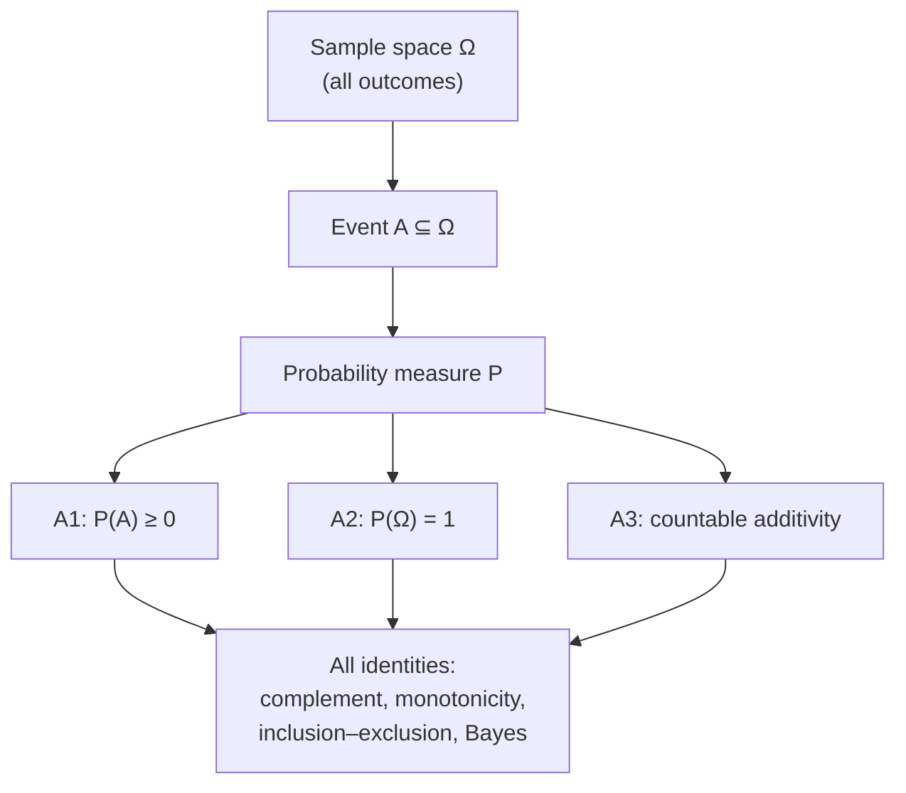
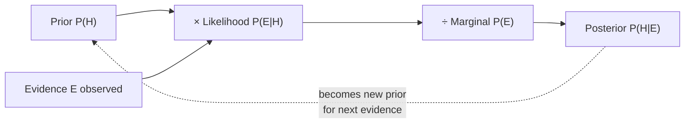
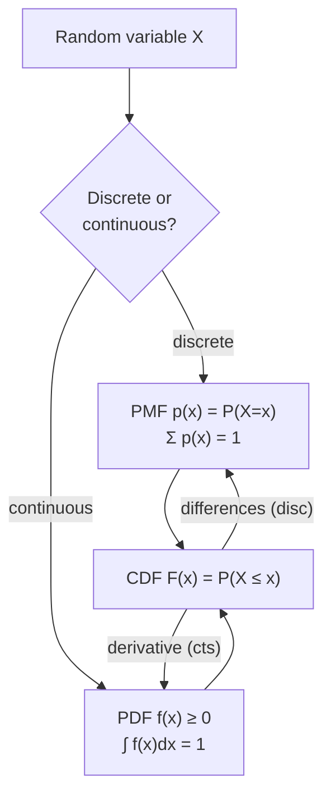
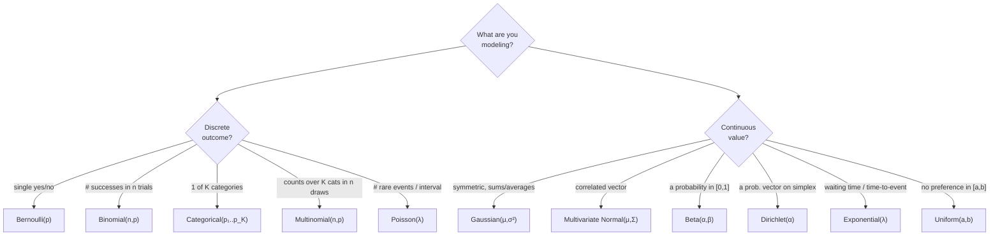
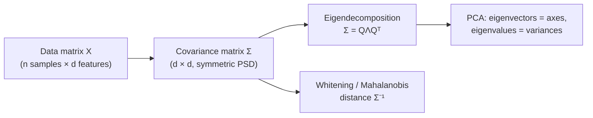
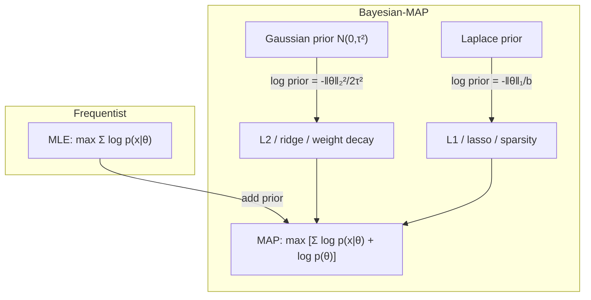
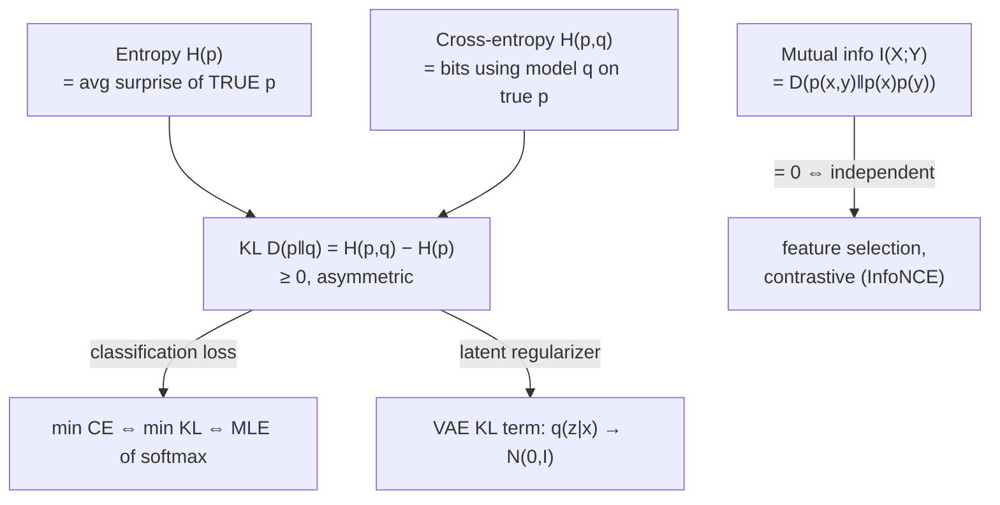
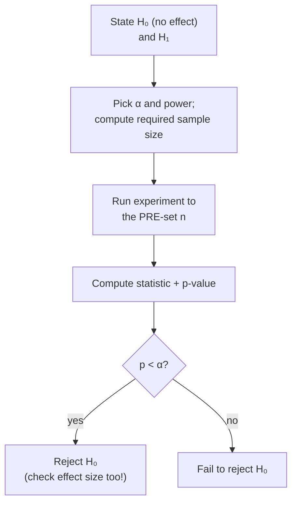

# Probability, Statistics & Information Theory for AI/ML
*The mathematics of uncertainty — the language every modern ML model actually speaks.*

*Part of the AI Engineering & ML Mastery Path — see the [index](../README.md) and [study plan](../MASTER-STUDY-PLAN.md).*

Almost everything in machine learning is, under the hood, a statement about probability. A classifier outputs a **distribution** over labels. A loss function is usually a **negative log-likelihood**. Regularization is a **prior**. A diffusion model reverses a **stochastic** process. If you internalize this chapter, a huge fraction of ML stops being a bag of tricks and becomes a small number of recurring ideas: *write down a probabilistic model, then maximize the (log-)likelihood of the data under it*. Everything else is optimization plumbing.

This document is exhaustive and self-contained. Every formula is derived or motivated, every code block runs as-is on Python 3.11+ with `numpy` and `scipy`, and every major idea is tied back to a concrete ML system you have heard of (softmax, cross-entropy, Naive Bayes, VAEs, calibration, A/B tests).

---

## 🎯 Learning Objectives

By the end of this file you can:

- State the three **probability axioms** and derive conditional probability, the chain rule, and Bayes' theorem from them.
- Work a full **Bayes' theorem** medical-test example by hand and explain the base-rate fallacy.
- Distinguish **discrete vs continuous** random variables and read/compute PMFs, PDFs, and CDFs.
- Choose the right **distribution** (Bernoulli, Binomial, Categorical/Multinomial, Gaussian, Beta, Dirichlet, Poisson, Exponential, Uniform) for a modeling task and name its ML use.
- Compute **expectation, variance, covariance, correlation** and build a **covariance matrix**.
- Explain the **Law of Large Numbers** and the **Central Limit Theorem** and why they justify mini-batch training and confidence intervals.
- Derive **Maximum Likelihood Estimation** for a Gaussian from scratch, and connect **MAP** to **L2/L1 regularization**.
- Define **Shannon entropy, cross-entropy, KL divergence, mutual information** and explain *why cross-entropy is the classification loss*.
- Run and correctly interpret **hypothesis tests, p-values, confidence intervals**, and avoid the classic **A/B testing pitfalls**.

---

## 📋 Prerequisites

- [01 — Linear Algebra for ML](./01-linear-algebra.md) — vectors, matrices, positive-definiteness (needed for the covariance matrix and multivariate Gaussian).
- [02 — Calculus & Optimization for ML](./02-calculus-optimization.md) — derivatives, gradients, and Lagrange-style constrained optimization (needed for MLE/MAP).
- Comfort reading Python and NumPy. Install once: `pip install numpy scipy matplotlib`.

---

## 📑 Table of Contents

1. [Probability Foundations & Axioms](#1-probability-foundations--axioms)
2. [Conditional Probability, Independence & Bayes' Theorem](#2-conditional-probability-independence--bayes-theorem)
3. [Random Variables: PMF, PDF, CDF](#3-random-variables-pmf-pdf-cdf)
4. [The Distribution Zoo](#4-the-distribution-zoo)
5. [Expectation, Variance, Covariance & Correlation](#5-expectation-variance-covariance--correlation)
6. [Law of Large Numbers & Central Limit Theorem](#6-law-of-large-numbers--central-limit-theorem)
7. [Estimation: MLE, MAP & Regularization](#7-estimation-mle-map--regularization)
8. [Bayesian vs Frequentist](#8-bayesian-vs-frequentist)
9. [Information Theory: Entropy, Cross-Entropy, KL, Mutual Information](#9-information-theory-entropy-cross-entropy-kl-mutual-information)
10. [Inference: Hypothesis Testing, p-values, Confidence Intervals, A/B Testing](#10-inference-hypothesis-testing-p-values-confidence-intervals--ab-testing)
11. [From-Scratch Implementation](#-from-scratch-implementation)
12. [Knowledge Check](#-knowledge-check)
13. [Exercises](#️-exercises)
14. [Cheat Sheet](#-cheat-sheet)
15. [Further Resources](#-further-resources)
16. [What's Next](#️-whats-next)

---

## 1. Probability Foundations & Axioms

> 💡 **Intuition:** Probability is a number between 0 and 1 that measures how much "weight" we assign to an event. Think of pouring exactly **1 liter** of water over all possible outcomes; the probability of an event is how much water lands on it.

### Sample space and events

The **sample space** $\Omega$ is the set of all possible outcomes of a random experiment. An **event** $A \subseteq \Omega$ is a subset of outcomes. For a single die roll, $\Omega = \{1,2,3,4,5,6\}$ and "even" is the event $A = \{2,4,6\}$.

### Kolmogorov's axioms

A probability measure $P$ assigns a number to every event subject to three rules:

$$
\textbf{(A1) } P(A) \ge 0 \qquad \textbf{(A2) } P(\Omega) = 1 \qquad \textbf{(A3) } P\!\left(\bigcup_i A_i\right) = \sum_i P(A_i) \text{ for disjoint } A_i .
$$

- $P(A) \ge 0$ — probabilities are never negative.
- $P(\Omega) = 1$ — *something* happens with certainty.
- **Countable additivity** — the probability of a union of mutually exclusive events is the sum of their probabilities.

From these three lines, *every* identity below follows.

### Consequences (derived, not assumed)

| Rule | Statement | Why |
|---|---|---|
| Complement | $P(A^c) = 1 - P(A)$ | $A$ and $A^c$ are disjoint and cover $\Omega$ (A2, A3). |
| Bounds | $0 \le P(A) \le 1$ | A1 plus $A \subseteq \Omega$. |
| Monotonicity | $A \subseteq B \Rightarrow P(A) \le P(B)$ | $B = A \cup (B \setminus A)$, disjoint. |
| Inclusion–exclusion | $P(A \cup B) = P(A) + P(B) - P(A \cap B)$ | avoid double-counting the overlap. |

> ⚠️ **Common Pitfall:** $P(A \cup B) = P(A) + P(B)$ holds **only** when $A$ and $B$ are disjoint. Forgetting the $-P(A\cap B)$ term is the single most common probability error.

```python
import numpy as np

rng = np.random.default_rng(0)
rolls = rng.integers(1, 7, size=1_000_000)          # uniform die

p_even = np.mean(np.isin(rolls, [2, 4, 6]))
p_gt3  = np.mean(rolls > 3)
p_both = np.mean(np.isin(rolls, [2, 4, 6]) & (rolls > 3))   # {4,6}
p_union = p_even + p_gt3 - p_both                    # inclusion-exclusion

print(round(p_even, 3), round(p_gt3, 3), round(p_union, 3))
# 0.5 0.5 0.667   -> P(even OR >3) = 4/6 ≈ 0.667, NOT 1.0
```



> 🎯 **Key Insight:** You never need to *memorize* probability rules. They are all theorems of three axioms. ML libraries (softmax, normalizing flows) enforce A2 — "outputs sum to 1" — precisely so their outputs are valid probabilities.

---

## 2. Conditional Probability, Independence & Bayes' Theorem

### Conditional probability

> 💡 **Intuition:** Conditioning means *zooming in*. Once you learn $B$ happened, $B$ becomes your new universe; you renormalize so its probability is 1.

$$
P(A \mid B) = \frac{P(A \cap B)}{P(B)}, \qquad P(B) > 0 .
$$

Rearranging gives the **product rule** $P(A \cap B) = P(A\mid B)\,P(B)$, which chains:

$$
P(x_1, \dots, x_n) = \prod_{i=1}^{n} P(x_i \mid x_1, \dots, x_{i-1}) .
$$

> 🎯 **Key Insight:** That chain rule **is** an autoregressive language model. GPT factorizes the joint probability of a sentence into a product of next-token conditionals $P(x_i \mid x_{<i})$. Training maximizes $\sum_i \log P(x_i \mid x_{<i})$.

### Independence

$A$ and $B$ are **independent** ($A \perp B$) iff knowing one tells you nothing about the other:

$$
P(A \cap B) = P(A)\,P(B) \quad\Longleftrightarrow\quad P(A \mid B) = P(A) .
$$

**Conditional independence** $A \perp B \mid C$ means $P(A \cap B \mid C) = P(A\mid C)\,P(B\mid C)$. This is the entire modeling assumption behind **Naive Bayes**: features are independent *given the class*.

### Law of total probability

If $\{B_1, \dots, B_k\}$ partition $\Omega$:

$$
P(A) = \sum_{i=1}^{k} P(A \mid B_i)\, P(B_i) .
$$

### Bayes' theorem

$$
\boxed{\;P(H \mid E) = \frac{P(E \mid H)\, P(H)}{P(E)} = \frac{P(E \mid H)\, P(H)}{\sum_i P(E \mid H_i)\, P(H_i)}\;}
$$

| Term | Name | Meaning |
|---|---|---|
| $P(H)$ | **prior** | belief in hypothesis $H$ before seeing evidence |
| $P(E\mid H)$ | **likelihood** | how well $H$ predicts the evidence $E$ |
| $P(H\mid E)$ | **posterior** | updated belief after seeing $E$ |
| $P(E)$ | **evidence / marginal** | normalizer making the posterior sum to 1 |



### Full worked medical-test example (do this by hand)

A disease affects **1 in 1000** people. A test has **99% sensitivity** (true positive rate) and **95% specificity** (true negative rate, so a **5% false-positive rate**). You test positive. What is $P(\text{disease} \mid +)$?

Let $D$ = disease, $E = +$ (positive test). Given:

$$
P(D) = 0.001, \quad P(+\mid D) = 0.99, \quad P(+\mid \neg D) = 0.05 .
$$

**Step 1 — marginal probability of a positive test** (law of total probability):

$$
P(+) = \underbrace{P(+\mid D)P(D)}_{\text{true positives}} + \underbrace{P(+\mid \neg D)P(\neg D)}_{\text{false positives}} = (0.99)(0.001) + (0.05)(0.999) .
$$

$$
P(+) = 0.00099 + 0.04995 = 0.05094 .
$$

**Step 2 — Bayes:**

$$
P(D \mid +) = \frac{P(+\mid D)P(D)}{P(+)} = \frac{0.00099}{0.05094} \approx \mathbf{0.0194} .
$$

> 🎯 **Key Insight:** Even after a positive result from a "99% accurate" test, there is only a **~1.9%** chance you actually have the disease. The **base rate** (0.1%) dominates: false positives from the huge healthy population (≈49.95 per 1000) swamp the true positives (≈0.99 per 1000).

```python
from fractions import Fraction

p_d   = Fraction(1, 1000)
sens  = Fraction(99, 100)      # P(+|D)
fpr   = Fraction(5, 100)       # P(+|¬D)

p_pos = sens * p_d + fpr * (1 - p_d)
post  = sens * p_d / p_pos
print(float(p_pos), float(post))
# 0.05094 0.019434628975265017   -> ≈ 1.94%
```

> ⚠️ **Common Pitfall — base-rate neglect:** People hear "99% accurate" and guess the answer is ~99%. The test's accuracy says nothing about $P(D)$. This is the **base-rate fallacy** and it shows up in ML as poorly **calibrated** classifiers on rare classes — a fraud detector at 99.9% accuracy can be useless if fraud is 0.1% of traffic.

---

## 3. Random Variables: PMF, PDF, CDF

A **random variable (RV)** $X$ is a function mapping outcomes to numbers, $X: \Omega \to \mathbb{R}$.

### Discrete: probability mass function (PMF)

$$
p_X(x) = P(X = x), \qquad p_X(x) \ge 0, \qquad \sum_x p_X(x) = 1 .
$$

### Continuous: probability density function (PDF)

A continuous RV has $P(X = x) = 0$ for any single point; probability lives in *intervals*:

$$
P(a \le X \le b) = \int_a^b f_X(x)\, dx, \qquad f_X(x) \ge 0, \qquad \int_{-\infty}^{\infty} f_X(x)\, dx = 1 .
$$

> ⚠️ **Common Pitfall:** A density $f_X(x)$ is **not** a probability and **can exceed 1** (e.g. a narrow Gaussian). Only the *area under it* is a probability. This is why a likelihood in a neural net can be a positive number larger than 1.

### Cumulative distribution function (CDF) — unifies both

$$
F_X(x) = P(X \le x) = \begin{cases} \sum_{t \le x} p_X(t) & \text{discrete} \\[4pt] \int_{-\infty}^{x} f_X(t)\, dt & \text{continuous} \end{cases}
$$

$F_X$ is non-decreasing, right-continuous, with $F_X(-\infty)=0$ and $F_X(\infty)=1$. The PDF is its derivative: $f_X(x) = F_X'(x)$.



```python
from scipy import stats

# Discrete: Binomial(n=10, p=0.3)
binom = stats.binom(n=10, p=0.3)
print("PMF P(X=3) =", round(binom.pmf(3), 4))     # 0.2668
print("CDF P(X≤3) =", round(binom.cdf(3), 4))      # 0.6496

# Continuous: standard Normal
norm = stats.norm(loc=0, scale=1)
print("PDF f(0)   =", round(norm.pdf(0), 4))       # 0.3989  (a density, < 1 here)
print("CDF F(0)   =", round(norm.cdf(0), 4))       # 0.5
print("P(-1<X<1)  =", round(norm.cdf(1) - norm.cdf(-1), 4))  # 0.6827 (the 68% rule)
```

ASCII picture of the standard Normal density (the famous bell):

```
 f(x)
0.40 |              ***
0.30 |            *     *
0.20 |          *         *
0.10 |       **             **
0.00 |__***___________________***__
     -3   -2   -1    0    1    2   3   x
        68% of mass within ±1σ ; 95% within ±2σ
```

---

## 4. The Distribution Zoo

> 💡 **Intuition:** A distribution is a *named recipe* for assigning probability. Picking the right one is 80% of probabilistic modeling. The chooser below mirrors how you decide in practice.



### 4.1 Bernoulli$(p)$ — one coin flip

$$
P(X=x) = p^x (1-p)^{1-x}, \quad x \in \{0,1\}; \qquad \mathbb{E}[X]=p, \quad \mathrm{Var}(X)=p(1-p) .
$$

**ML use:** every binary classifier (logistic regression, sigmoid output). The sigmoid $\sigma(z)$ *is* the Bernoulli parameter $p$, and binary cross-entropy is its negative log-likelihood.

### 4.2 Binomial$(n,p)$ — count of successes in $n$ independent Bernoulli trials

$$
P(X=k) = \binom{n}{k} p^k (1-p)^{n-k}; \qquad \mathbb{E}[X]=np, \quad \mathrm{Var}(X)=np(1-p) .
$$

**ML use:** modeling # of conversions in $n$ A/B-test impressions; counts in beta-binomial bandits.

### 4.3 Categorical$(\mathbf{p})$ and Multinomial$(n,\mathbf{p})$

**Categorical** = one draw from $K$ classes, $P(X=k)=p_k$, $\sum_k p_k = 1$.
**Multinomial** = counts $(x_1,\dots,x_K)$ from $n$ independent categorical draws:

$$
P(\mathbf{x}) = \frac{n!}{x_1!\cdots x_K!}\prod_{k=1}^K p_k^{x_k}, \qquad \sum_k x_k = n .
$$

> 🎯 **Key Insight:** The **softmax** layer outputs a Categorical distribution: $p_k = \dfrac{e^{z_k}}{\sum_j e^{z_j}}$. Multi-class cross-entropy is the negative log-likelihood of that Categorical. Softmax exists *specifically* to satisfy axiom A2 ($\sum_k p_k = 1$).

### 4.4 Gaussian / Normal $\mathcal{N}(\mu, \sigma^2)$

$$
f(x) = \frac{1}{\sqrt{2\pi\sigma^2}} \exp\!\left(-\frac{(x-\mu)^2}{2\sigma^2}\right); \qquad \mathbb{E}[X]=\mu, \quad \mathrm{Var}(X)=\sigma^2 .
$$

**Multivariate Normal** $\mathcal{N}(\boldsymbol{\mu}, \boldsymbol{\Sigma})$ for $\mathbf{x}\in\mathbb{R}^d$:

$$
f(\mathbf{x}) = \frac{1}{(2\pi)^{d/2}\,|\boldsymbol{\Sigma}|^{1/2}} \exp\!\left(-\tfrac{1}{2}(\mathbf{x}-\boldsymbol{\mu})^{\top}\boldsymbol{\Sigma}^{-1}(\mathbf{x}-\boldsymbol{\mu})\right),
$$

where $\boldsymbol{\Sigma}$ is the (symmetric, positive semi-definite) covariance matrix.

**ML use:** weight initialization, Gaussian Naive Bayes, the prior and reparameterized latent in **VAEs**, noise in diffusion models, the regression likelihood that yields MSE loss.

### 4.5 Beta$(\alpha,\beta)$ — a distribution *over a probability*

$$
f(p) = \frac{p^{\alpha-1}(1-p)^{\beta-1}}{B(\alpha,\beta)}, \quad p\in[0,1]; \qquad \mathbb{E}[p]=\frac{\alpha}{\alpha+\beta} .
$$

**ML use:** the **conjugate prior** for Bernoulli/Binomial. Posterior after $s$ successes and $f$ failures is simply $\text{Beta}(\alpha+s, \beta+f)$ — the backbone of Thompson-sampling bandits.

### 4.6 Dirichlet$(\boldsymbol{\alpha})$ — a distribution over probability vectors

Multivariate generalization of Beta; lives on the simplex $\{\mathbf{p}: p_k\ge0, \sum p_k=1\}$. **Conjugate prior for Categorical/Multinomial**. **ML use:** topic priors in **Latent Dirichlet Allocation (LDA)**, Bayesian smoothing of class probabilities.

### 4.7 Poisson$(\lambda)$ — counts of rare events

$$
P(X=k) = \frac{\lambda^k e^{-\lambda}}{k!}; \qquad \mathbb{E}[X]=\mathrm{Var}(X)=\lambda .
$$

**ML use:** count regression (clicks/hour, defects/wafer), Poisson regression, sequence-arrival modeling.

### 4.8 Exponential$(\lambda)$ — waiting time between Poisson events

$$
f(x) = \lambda e^{-\lambda x}, \quad x \ge 0; \qquad \mathbb{E}[X]=\tfrac{1}{\lambda}, \quad \mathrm{Var}(X)=\tfrac{1}{\lambda^2} .
$$

**Memoryless:** $P(X>s+t\mid X>s)=P(X>t)$. **ML use:** survival analysis, time-to-event/churn, queueing.

### 4.9 Uniform$(a,b)$ — maximal ignorance

$$
f(x) = \frac{1}{b-a}, \quad x\in[a,b]; \qquad \mathbb{E}[X]=\tfrac{a+b}{2}, \quad \mathrm{Var}(X)=\tfrac{(b-a)^2}{12} .
$$

**ML use:** random init ranges, dropout masks (Bernoulli built from Uniform), Monte-Carlo sampling, non-informative priors.

```python
from scipy import stats
import numpy as np

dists = {
    "Bernoulli(0.3)":  stats.bernoulli(0.3),
    "Binomial(10,0.3)":stats.binom(10, 0.3),
    "Poisson(4)":      stats.poisson(4),
    "Normal(0,1)":     stats.norm(0, 1),
    "Beta(2,5)":       stats.beta(2, 5),
    "Exponential(λ=2)":stats.expon(scale=1/2),   # scipy uses scale = 1/λ
    "Uniform(0,1)":    stats.uniform(0, 1),
}
for name, d in dists.items():
    print(f"{name:18s} mean={d.mean():.4f}  var={d.var():.4f}")
# Bernoulli(0.3)     mean=0.3000  var=0.2100
# Binomial(10,0.3)   mean=3.0000  var=2.1000
# Poisson(4)         mean=4.0000  var=4.0000
# Normal(0,1)        mean=0.0000  var=1.0000
# Beta(2,5)          mean=0.2857  var=0.0255
# Exponential(λ=2)   mean=0.5000  var=0.2500
# Uniform(0,1)       mean=0.5000  var=0.0833
```

| Distribution | Support | Params | Mean | Variance | Headline ML use |
|---|---|---|---|---|---|
| Bernoulli | $\{0,1\}$ | $p$ | $p$ | $p(1-p)$ | binary classifier output (sigmoid) |
| Binomial | $\{0,\dots,n\}$ | $n,p$ | $np$ | $np(1-p)$ | conversion counts in A/B tests |
| Categorical | $\{1,\dots,K\}$ | $\mathbf{p}$ | — | — | softmax output |
| Multinomial | counts, $\sum=n$ | $n,\mathbf{p}$ | $np_k$ | $np_k(1-p_k)$ | bag-of-words, vote counts |
| Gaussian | $\mathbb{R}$ | $\mu,\sigma^2$ | $\mu$ | $\sigma^2$ | MSE likelihood, VAE, init |
| MV Normal | $\mathbb{R}^d$ | $\boldsymbol\mu,\boldsymbol\Sigma$ | $\boldsymbol\mu$ | $\boldsymbol\Sigma$ | GMM, GP, latent priors |
| Beta | $[0,1]$ | $\alpha,\beta$ | $\frac{\alpha}{\alpha+\beta}$ | see below | conjugate prior for $p$; bandits |
| Dirichlet | simplex | $\boldsymbol\alpha$ | $\frac{\alpha_k}{\sum\alpha}$ | — | LDA topic prior |
| Poisson | $\{0,1,\dots\}$ | $\lambda$ | $\lambda$ | $\lambda$ | count regression |
| Exponential | $[0,\infty)$ | $\lambda$ | $1/\lambda$ | $1/\lambda^2$ | time-to-event |
| Uniform | $[a,b]$ | $a,b$ | $\frac{a+b}{2}$ | $\frac{(b-a)^2}{12}$ | init, MC sampling |

(Beta variance: $\dfrac{\alpha\beta}{(\alpha+\beta)^2(\alpha+\beta+1)}$.)

---

## 5. Expectation, Variance, Covariance & Correlation

### Expectation (the mean / first moment)

$$
\mathbb{E}[X] = \sum_x x\,p_X(x) \quad\text{(discrete)}, \qquad \mathbb{E}[X] = \int x\,f_X(x)\,dx \quad\text{(continuous)} .
$$

**Linearity** (always, even for dependent RVs): $\mathbb{E}[aX + bY + c] = a\,\mathbb{E}[X] + b\,\mathbb{E}[Y] + c$. This is the workhorse identity behind expected-loss minimization.

### Variance (spread / second central moment)

$$
\mathrm{Var}(X) = \mathbb{E}\!\big[(X-\mathbb{E}[X])^2\big] = \mathbb{E}[X^2] - \mathbb{E}[X]^2, \qquad \mathrm{Var}(aX+b)=a^2\mathrm{Var}(X).
$$

The **standard deviation** is $\sigma = \sqrt{\mathrm{Var}(X)}$ (same units as $X$).

### Covariance and correlation

$$
\mathrm{Cov}(X,Y) = \mathbb{E}\big[(X-\mathbb{E}X)(Y-\mathbb{E}Y)\big] = \mathbb{E}[XY] - \mathbb{E}[X]\mathbb{E}[Y] .
$$

$$
\rho_{XY} = \frac{\mathrm{Cov}(X,Y)}{\sigma_X \sigma_Y} \in [-1, 1] \quad\text{(Pearson correlation)} .
$$

> ⚠️ **Common Pitfall:** Independence $\Rightarrow$ zero covariance, but **zero covariance does NOT imply independence**. Correlation captures only *linear* dependence. $X\sim\mathcal{N}(0,1)$ and $Y=X^2$ have $\rho=0$ yet $Y$ is fully determined by $X$.

### Worked example by hand

Let $X$ take values $\{1,2,3\}$ each with probability $1/3$.

$$
\mathbb{E}[X] = \tfrac{1}{3}(1+2+3) = 2, \qquad \mathbb{E}[X^2]=\tfrac{1}{3}(1+4+9)=\tfrac{14}{3},
$$

$$
\mathrm{Var}(X) = \tfrac{14}{3} - 2^2 = \tfrac{14}{3}-4 = \tfrac{2}{3} \approx 0.667 .
$$

### Covariance matrix

For a random vector $\mathbf{x}=(X_1,\dots,X_d)^\top$, the **covariance matrix** $\boldsymbol\Sigma$ has entries $\Sigma_{ij} = \mathrm{Cov}(X_i, X_j)$:

$$
\boldsymbol\Sigma = \mathbb{E}\big[(\mathbf{x}-\boldsymbol\mu)(\mathbf{x}-\boldsymbol\mu)^\top\big] =
\begin{bmatrix}
\mathrm{Var}(X_1) & \mathrm{Cov}(X_1,X_2) & \cdots \\
\mathrm{Cov}(X_2,X_1) & \mathrm{Var}(X_2) & \cdots \\
\vdots & \vdots & \ddots
\end{bmatrix}.
$$

It is **symmetric** and **positive semi-definite**. Its eigen-decomposition is exactly **PCA**: eigenvectors are principal axes, eigenvalues are variances along them.

```python
import numpy as np

rng = np.random.default_rng(1)
# Two correlated features
x1 = rng.normal(0, 1, 100_000)
x2 = 0.8 * x1 + rng.normal(0, 0.6, 100_000)   # depends on x1

X = np.vstack([x1, x2])                 # shape (2, N): rows = variables
cov = np.cov(X)                         # 2x2 covariance matrix
corr = np.corrcoef(X)                   # normalized to [-1,1]

print("Cov matrix:\n", np.round(cov, 3))
print("Correlation:\n", np.round(corr, 3))
# Cov matrix:
#  [[1.    0.8  ]
#   [0.8   1.   ]]          (approx; var(x1)≈1, cov≈0.8)
# Correlation:
#  [[1.    0.8  ]
#   [0.8   1.   ]]
print("Eigvals (PCA variances):", np.round(np.linalg.eigvalsh(cov), 3))
```



---

## 6. Law of Large Numbers & Central Limit Theorem

### Law of Large Numbers (LLN)

> 💡 **Intuition:** Average enough independent samples and the sample mean converges to the true mean. This is *why* empirical risk (average training loss) approximates true risk, and why bigger batches give more stable gradient estimates.

For i.i.d. $X_1,\dots,X_n$ with mean $\mu$, the sample mean $\bar X_n = \frac1n\sum_i X_i$ satisfies

$$
\bar X_n \xrightarrow{\;n\to\infty\;} \mu \quad \text{(convergence in probability / a.s.)} .
$$

### Central Limit Theorem (CLT)

> 🎯 **Key Insight:** No matter the shape of the source distribution (as long as it has finite variance), the **distribution of the sample mean** becomes Gaussian as $n$ grows. This is why Gaussians are everywhere, and why confidence intervals use $\pm 1.96\,\text{SE}$.

$$
\frac{\bar X_n - \mu}{\sigma/\sqrt{n}} \xrightarrow{d} \mathcal{N}(0,1) \quad\Longleftrightarrow\quad \bar X_n \approx \mathcal{N}\!\left(\mu, \frac{\sigma^2}{n}\right) .
$$

The **standard error** of the mean is $\mathrm{SE} = \sigma/\sqrt n$ — it shrinks like $1/\sqrt n$, so 4× the data halves the error.

```python
import numpy as np

rng = np.random.default_rng(7)
# Source is heavily skewed (Exponential) — NOT Gaussian
pop_mean = 1.0                       # Exponential(λ=1) has mean 1
sample_means = [rng.exponential(1.0, size=50).mean() for _ in range(20_000)]
sample_means = np.array(sample_means)

print("Mean of sample means :", round(sample_means.mean(), 3))   # ≈ 1.0  (LLN)
print("SE predicted σ/√n    :", round(1.0/np.sqrt(50), 3))        # 0.141
print("SE observed (std)     :", round(sample_means.std(), 3))    # ≈ 0.141 (CLT)
# The 20k sample-means form a near-perfect bell, despite the skewed source.
```

ASCII: the source is skewed, but the sampling distribution of the mean is bell-shaped.

```
Source Exponential(1)        Sampling dist of mean (n=50)
  *                                      ***
  **                                   *     *
  ***                                 *       *
  ****                              **         **
  *********____                   **             **
  0        x                  0.6   0.8  1.0  1.2  1.4
  (skewed right)                  (symmetric Gaussian!)
```

> ⚠️ **Common Pitfall:** CLT is about the **mean**, not individual data points. Your raw features can stay skewed forever. Also, CLT needs finite variance — heavy-tailed (e.g. Cauchy) data breaks it, which is why robust statistics and gradient clipping matter.

---

## 7. Estimation: MLE, MAP & Regularization

We have data $\mathcal{D}=\{x_1,\dots,x_n\}$ and a model $p(x\mid\theta)$. We want $\theta$.

### Maximum Likelihood Estimation (MLE)

> 💡 **Intuition:** Pick the parameters that make the data we actually saw *as probable as possible*.

$$
\theta_{\text{MLE}} = \arg\max_\theta \; \prod_{i=1}^n p(x_i\mid\theta) = \arg\max_\theta \sum_{i=1}^n \log p(x_i\mid\theta) .
$$

We use the **log-likelihood** because products underflow and sums differentiate cleanly. Maximizing log-likelihood = minimizing **negative log-likelihood (NLL)** — the most common loss family in ML.

### Deriving the Gaussian MLE (full derivation)

Assume $x_i \sim \mathcal{N}(\mu,\sigma^2)$ i.i.d. The log-likelihood is

$$
\ell(\mu,\sigma^2) = \sum_{i=1}^n \log\!\left[\frac{1}{\sqrt{2\pi\sigma^2}}e^{-\frac{(x_i-\mu)^2}{2\sigma^2}}\right]
= -\frac{n}{2}\log(2\pi\sigma^2) - \frac{1}{2\sigma^2}\sum_{i=1}^n (x_i-\mu)^2 .
$$

**Solve for $\mu$** — set $\partial\ell/\partial\mu = 0$:

$$
\frac{\partial \ell}{\partial \mu} = \frac{1}{\sigma^2}\sum_{i=1}^n (x_i - \mu) = 0 \;\Longrightarrow\; \boxed{\hat\mu = \frac{1}{n}\sum_{i=1}^n x_i}\;\; \text{(the sample mean).}
$$

**Solve for $\sigma^2$** — set $\partial\ell/\partial\sigma^2 = 0$:

$$
\frac{\partial \ell}{\partial \sigma^2} = -\frac{n}{2\sigma^2} + \frac{1}{2\sigma^4}\sum_{i=1}^n (x_i-\mu)^2 = 0 \;\Longrightarrow\; \boxed{\hat\sigma^2 = \frac{1}{n}\sum_{i=1}^n (x_i-\hat\mu)^2}.
$$

> ⚠️ **Common Pitfall:** The MLE of variance divides by $n$ and is **biased** (underestimates). The unbiased sample variance divides by $n-1$ (Bessel's correction). NumPy's `var` defaults to $n$ (`ddof=0`); pass `ddof=1` for the unbiased version.

> 🎯 **Key Insight:** Gaussian-MLE for regression *is* least squares. With $y_i = f(x_i)+\varepsilon_i$, $\varepsilon_i\sim\mathcal N(0,\sigma^2)$, maximizing the log-likelihood reduces to minimizing $\sum_i (y_i - f(x_i))^2$ — **MSE loss falls out of a Gaussian-noise assumption.**

### Maximum A Posteriori (MAP) and regularization

MLE ignores prior belief. MAP multiplies in a prior $p(\theta)$ and maximizes the posterior:

$$
\theta_{\text{MAP}} = \arg\max_\theta \; \big[\log p(\mathcal{D}\mid\theta) + \log p(\theta)\big] .
$$

**L2 regularization = Gaussian prior.** Put $\theta \sim \mathcal{N}(0, \tau^2 I)$. Then $\log p(\theta) = -\frac{1}{2\tau^2}\|\theta\|_2^2 + \text{const}$, so

$$
\theta_{\text{MAP}} = \arg\min_\theta \; \underbrace{\sum_i -\log p(x_i\mid\theta)}_{\text{NLL / data loss}} + \underbrace{\frac{1}{2\tau^2}\|\theta\|_2^2}_{\lambda\,\|\theta\|_2^2,\ \text{ridge}} .
$$

A zero-mean Gaussian prior says "weights are probably small," which is precisely **weight decay** with $\lambda = \frac{\sigma^2}{\tau^2}$ (for the Gaussian-likelihood case).

**L1 regularization = Laplace prior.** With $\theta_j \sim \text{Laplace}(0,b)$, $\log p(\theta) = -\frac{1}{b}\sum_j|\theta_j| + \text{const}$, giving the **Lasso** penalty $\lambda\|\theta\|_1$, which induces sparsity.



> 🎯 **Key Insight:** Regularization is not a hack — it is **MAP inference with a prior**. The strength $\lambda$ encodes how strongly you believe weights are near zero. Exercise 6 verifies the L2 = Gaussian-prior equivalence numerically.

---

## 8. Bayesian vs Frequentist

> 💡 **Intuition:** A frequentist treats the parameter $\theta$ as fixed-but-unknown and the data as random; a Bayesian treats the data as fixed (once observed) and $\theta$ as a random variable with a distribution that we update.

| Aspect | Frequentist | Bayesian |
|---|---|---|
| $\theta$ is | fixed constant | random variable with a distribution |
| Core object | likelihood $p(\mathcal D\mid\theta)$ | posterior $p(\theta\mid\mathcal D)$ |
| Point estimate | MLE | posterior mean / MAP |
| Uncertainty | confidence interval | credible interval |
| Prior | none (or implicit) | explicit $p(\theta)$ |
| Typical ML home | ERM, deep nets (default) | Bayesian NNs, GPs, LDA, bandits |
| Interpretation of "95%" | 95% of such intervals cover $\theta$ | 95% posterior probability $\theta$ is in interval |

The unifying equation is Bayes' theorem at the parameter level:

$$
p(\theta \mid \mathcal D) = \frac{p(\mathcal D \mid \theta)\,p(\theta)}{p(\mathcal D)}, \qquad p(\mathcal D) = \int p(\mathcal D\mid\theta)\,p(\theta)\,d\theta .
$$

> 📝 **Tip:** As data grows, the likelihood dominates the prior and Bayesian and frequentist estimates converge (Bernstein–von Mises). With little data, the prior matters a lot — which is exactly when regularization (a prior) helps most.

---

## 9. Information Theory: Entropy, Cross-Entropy, KL, Mutual Information

### Shannon entropy — average surprise

> 💡 **Intuition:** A rare event is *surprising*; its information content is $-\log p$. Entropy is the **expected surprise** — the average number of bits (base 2) or nats (base $e$) needed to encode outcomes from $p$.

$$
H(p) = -\sum_x p(x)\log p(x) = \mathbb{E}_{x\sim p}[-\log p(x)] .
$$

Entropy is maximized by the uniform distribution (maximal uncertainty) and is 0 for a deterministic outcome.

### Cross-entropy — and why it is *the* classification loss

$$
H(p, q) = -\sum_x p(x)\log q(x) .
$$

It measures the expected bits to encode data from the **true** distribution $p$ using a code optimized for the **model** $q$. In classification, $p$ is the one-hot true label and $q$ is the softmax output, so for a single example with true class $c$:

$$
H(p,q) = -\sum_k \mathbb{1}[k=c]\log q_k = -\log q_c .
$$

> 🎯 **Key Insight:** **Minimizing cross-entropy = maximizing the log-likelihood of the correct class = MLE of a Categorical model.** That is the entire reason cross-entropy is the default classification loss. It is the NLL of the softmax-Categorical, full stop.

### KL divergence — distance from $q$ to $p$

$$
D_{\text{KL}}(p \,\|\, q) = \sum_x p(x)\log\frac{p(x)}{q(x)} = H(p,q) - H(p) \;\ge 0 .
$$

It is $\ge 0$ (Gibbs' inequality), equals 0 iff $p=q$, and is **not symmetric** ($D_{\text{KL}}(p\|q)\ne D_{\text{KL}}(q\|p)$). Since $H(p)$ is a constant of the data, **minimizing cross-entropy = minimizing KL** between true and predicted distributions.

> 🎯 **Key Insight — the VAE term:** A Variational Autoencoder's loss is the negative ELBO: a reconstruction term plus $D_{\text{KL}}\!\big(q_\phi(z\mid x)\,\|\,p(z)\big)$, which pulls the learned latent posterior toward the $\mathcal N(0,I)$ prior. Closed form for two Gaussians:
> $$ D_{\text{KL}}\big(\mathcal N(\mu,\sigma^2)\,\|\,\mathcal N(0,1)\big) = \tfrac12\big(\sigma^2 + \mu^2 - 1 - \log\sigma^2\big). $$

### Mutual information — shared information

$$
I(X;Y) = \sum_{x,y} p(x,y)\log\frac{p(x,y)}{p(x)p(y)} = D_{\text{KL}}\big(p(x,y)\,\|\,p(x)p(y)\big) = H(X) - H(X\mid Y) .
$$

$I(X;Y)=0$ iff $X\perp Y$. **ML use:** feature selection, the InfoNCE objective in contrastive learning, information bottleneck.



```python
import numpy as np

def entropy(p, base=2):
    p = np.asarray(p, float); p = p[p > 0]
    return -np.sum(p * np.log(p)) / np.log(base)

def cross_entropy(p, q, base=2):
    p, q = np.asarray(p, float), np.asarray(q, float)
    return -np.sum(p * np.log(q)) / np.log(base)

def kl(p, q, base=2):
    p, q = np.asarray(p, float), np.asarray(q, float)
    mask = p > 0
    return np.sum(p[mask] * np.log(p[mask] / q[mask])) / np.log(base)

p = [1.0, 0.0, 0.0]            # one-hot true label (class 0)
q_good = [0.90, 0.05, 0.05]    # confident & correct
q_bad  = [0.20, 0.40, 0.40]    # confident & wrong

print("H(uniform 3) =", round(entropy([1/3]*3), 4))   # 1.585 bits (= log2 3)
print("CE good      =", round(cross_entropy(p, q_good), 4))  # 0.1520
print("CE bad       =", round(cross_entropy(p, q_bad ), 4))  # 2.3219
print("KL(p||q_good)=", round(kl(p, q_good), 4))             # 0.1520 (=CE since H(p)=0)
# Lower cross-entropy <-> better model. Wrong-but-confident is punished hardest.
```

> ⚠️ **Common Pitfall:** Cross-entropy explodes when the model assigns probability ~0 to the true class ($-\log 0 = \infty$). Frameworks add a tiny $\epsilon$ or fuse `log_softmax` for numerical stability. Never feed raw probabilities of exactly 0 or 1 into a log.

---

## 10. Inference: Hypothesis Testing, p-values, Confidence Intervals & A/B Testing

### The hypothesis-testing recipe

1. **Null hypothesis** $H_0$: "no effect" (e.g. the new button has the same conversion rate).
2. **Alternative** $H_1$: "there is an effect."
3. Choose a **significance level** $\alpha$ (commonly 0.05) — the tolerated false-positive (Type I) rate.
4. Compute a **test statistic** and its **p-value** = $P(\text{data this extreme or more}\mid H_0)$.
5. Reject $H_0$ if p-value $< \alpha$.

| | $H_0$ true | $H_0$ false |
|---|---|---|
| Reject $H_0$ | **Type I error** ($\alpha$, false positive) | Correct (power $=1-\beta$) |
| Fail to reject | Correct | **Type II error** ($\beta$, false negative) |

### What a p-value is — and is NOT

> ⚠️ **Common Pitfall:** A p-value is $P(\text{data}\mid H_0)$, **not** $P(H_0\mid\text{data})$. It does **not** tell you the probability the null is true, nor the effect size. A tiny p-value with a microscopic effect can be practically meaningless at large $n$.

### Confidence intervals

A 95% CI for a mean (via CLT) is

$$
\bar x \pm z_{0.975}\cdot \frac{s}{\sqrt n} = \bar x \pm 1.96\,\frac{s}{\sqrt n} .
$$

> ⚠️ **Common Pitfall:** "95% CI" does **not** mean "95% probability $\theta$ is in *this* interval" (that's the Bayesian credible interval). It means: across many repeated experiments, 95% of the intervals so constructed would contain the true $\theta$.

### A/B testing example with scipy

```python
import numpy as np
from scipy import stats

# A/B test: control vs treatment conversion counts
n_a, conv_a = 10_000, 480     # control: 4.80%
n_b, conv_b = 10_000, 540     # treatment: 5.40%

# Two-proportion z-test (pooled)
p_pool = (conv_a + conv_b) / (n_a + n_b)
se = np.sqrt(p_pool * (1 - p_pool) * (1/n_a + 1/n_b))
z  = (conv_b/n_b - conv_a/n_a) / se
p_value = 2 * (1 - stats.norm.cdf(abs(z)))

print(f"lift      = {(conv_b/n_b - conv_a/n_a)*100:.2f} pp")  # 0.60 pp
print(f"z         = {z:.3f}")                                  # 1.999
print(f"p-value   = {p_value:.4f}")                            # 0.0456  -> significant at 0.05
# 95% CI on the difference of proportions:
pa, pb = conv_a/n_a, conv_b/n_b
se_diff = np.sqrt(pa*(1-pa)/n_a + pb*(1-pb)/n_b)
lo, hi = (pb-pa) - 1.96*se_diff, (pb-pa) + 1.96*se_diff
print(f"95% CI diff = [{lo*100:.2f}, {hi*100:.2f}] pp")        # ≈ [0.01, 1.19] pp
```



### A/B testing pitfalls (the ones that actually burn teams)

| Pitfall | What goes wrong | Fix |
|---|---|---|
| **Peeking / early stopping** | Checking the p-value repeatedly inflates the false-positive rate far above $\alpha$. | Fix $n$ in advance, or use sequential tests / always-valid p-values. |
| **Multiple comparisons** | Testing 20 metrics at $\alpha=0.05$ yields ~1 false positive by chance. | Bonferroni / Benjamini–Hochberg correction. |
| **Underpowered test** | Too few samples → real effects missed (Type II). | Power analysis *before* launch. |
| **p-value ≠ effect size** | Significant but trivial lift at huge $n$. | Always report CI and practical significance. |
| **Sample-ratio mismatch** | Broken randomization invalidates the test. | Check assignment split matches the design. |
| **Simpson's paradox** | Aggregated result reverses within segments. | Segment analysis; check confounders. |

> 📝 **Tip (interview-grade):** When asked "is this A/B result good?", first ask three questions: *Was $n$ fixed in advance? What's the effect size and its CI? Were multiple metrics tested?* Getting those right separates seniors from juniors.

---

## 🧮 From-Scratch Implementation

A small but complete probability toolkit using only NumPy — Gaussian MLE, a Gaussian Naive Bayes classifier, and the core information-theory quantities — mirroring the math above.

```python
import numpy as np

# ---------- 1. Gaussian MLE from scratch ----------
def gaussian_mle(x):
    """Return (mu_hat, sigma2_hat) maximizing the Gaussian log-likelihood."""
    x = np.asarray(x, float)
    mu = x.mean()                       # closed-form MLE: sample mean
    sigma2 = ((x - mu) ** 2).mean()     # divide by n (biased MLE, ddof=0)
    return mu, sigma2

# ---------- 2. Gaussian Naive Bayes from scratch ----------
class GaussianNaiveBayes:
    """Assumes features are conditionally independent given the class,
       each modeled as a 1-D Gaussian (a real probabilistic classifier)."""
    def fit(self, X, y):
        self.classes_ = np.unique(y)
        self.theta_, self.var_, self.prior_ = {}, {}, {}
        for c in self.classes_:
            Xc = X[y == c]
            self.theta_[c] = Xc.mean(axis=0)            # MLE mean per feature
            self.var_[c]   = Xc.var(axis=0) + 1e-9      # MLE var (+eps stability)
            self.prior_[c] = len(Xc) / len(X)           # class prior P(y=c)
        return self

    def _log_gaussian(self, X, mu, var):
        return -0.5 * (np.log(2 * np.pi * var) + (X - mu) ** 2 / var).sum(axis=1)

    def predict(self, X):
        # log posterior ∝ log prior + Σ log p(x_j | class)  (Bayes + cond. indep.)
        log_post = np.column_stack([
            np.log(self.prior_[c]) + self._log_gaussian(X, self.theta_[c], self.var_[c])
            for c in self.classes_
        ])
        return self.classes_[np.argmax(log_post, axis=1)]

# ---------- 3. Information theory ----------
def entropy_bits(p):
    p = np.asarray(p, float); p = p[p > 0]
    return -(p * np.log2(p)).sum()

def kl_bits(p, q):
    p, q = np.asarray(p, float), np.asarray(q, float)
    m = p > 0
    return (p[m] * np.log2(p[m] / q[m])).sum()

# ---------- demo ----------
rng = np.random.default_rng(42)
data = rng.normal(5.0, 2.0, size=10_000)
print("Gaussian MLE (mu, sigma2):", np.round(gaussian_mle(data), 3))  # ≈ (5.0, 4.0)

# Two-class, 2-feature toy dataset
X0 = rng.normal([0, 0], 1.0, size=(500, 2))
X1 = rng.normal([3, 3], 1.0, size=(500, 2))
X  = np.vstack([X0, X1]); y = np.array([0]*500 + [1]*500)
gnb = GaussianNaiveBayes().fit(X, y)
acc = (gnb.predict(X) == y).mean()
print("Gaussian NB train accuracy:", round(acc, 3))                   # ≈ 0.98

print("Entropy fair coin:", entropy_bits([0.5, 0.5]))                 # 1.0 bit
print("KL(p||q):", round(kl_bits([0.5,0.5], [0.9,0.1]), 4))           # ≈ 0.7370 bits
```

Expected output (approx):
```
Gaussian MLE (mu, sigma2): [5.003 3.99 ]
Gaussian NB train accuracy: 0.983
Entropy fair coin: 1.0
KL(p||q): 0.737
```

---

## ❓ Knowledge Check

<details><summary><strong>Q1.</strong> A test is "99% accurate" for a disease with prevalence 0.1%. Why isn't $P(\text{disease}\mid+)\approx 99\%$?</summary>

Because the **base rate** is tiny. With 1000 people, ~1 has the disease (≈0.99 true positives) but ~5% of the 999 healthy people test positive (≈49.95 false positives). So $P(D\mid+) = 0.99/(0.99+49.95)\approx 1.9\%$. The test's accuracy says nothing about the prior $P(D)$; ignoring it is the **base-rate fallacy**.
</details>

<details><summary><strong>Q2.</strong> Can a probability density $f(x)$ be greater than 1?</summary>

Yes. A density is not a probability — only $\int f\,dx$ over an interval is. A narrow Gaussian (small $\sigma$) has a peak $\frac{1}{\sqrt{2\pi\sigma^2}}$ that exceeds 1. Only the **area** is bounded by 1.
</details>

<details><summary><strong>Q3.</strong> Zero correlation between $X$ and $Y$ — are they independent?</summary>

Not necessarily. Correlation captures only *linear* dependence. $X\sim\mathcal N(0,1),\ Y=X^2$ gives $\mathrm{Cov}(X,Y)=\mathbb E[X^3]-\mathbb E[X]\mathbb E[X^2]=0$, yet $Y$ is a deterministic function of $X$. Independence $\Rightarrow$ zero covariance, but **not** the converse (except for jointly Gaussian variables).
</details>

<details><summary><strong>Q4.</strong> Why do we maximize the *log*-likelihood instead of the likelihood?</summary>

Two reasons: (1) the likelihood is a product of many small numbers and **underflows** numerically — the log turns it into a stable sum; (2) $\log$ is monotonic, so the argmax is unchanged, and sums are far easier to differentiate than products. Maximizing log-likelihood = minimizing negative log-likelihood (NLL), the standard loss form.
</details>

<details><summary><strong>Q5.</strong> Derive the MLE estimate of $\mu$ for $\mathcal N(\mu,\sigma^2)$ in one line.</summary>

Set $\frac{\partial}{\partial\mu}\big[-\frac{1}{2\sigma^2}\sum(x_i-\mu)^2\big]=\frac{1}{\sigma^2}\sum(x_i-\mu)=0 \Rightarrow \hat\mu=\frac1n\sum x_i$, the sample mean.
</details>

<details><summary><strong>Q6.</strong> Show that L2 regularization corresponds to a Gaussian prior on the weights.</summary>

MAP maximizes $\log p(\mathcal D\mid\theta)+\log p(\theta)$. With $\theta\sim\mathcal N(0,\tau^2 I)$, $\log p(\theta)=-\frac{1}{2\tau^2}\|\theta\|_2^2+\text{const}$. Negating to get a loss adds $\frac{1}{2\tau^2}\|\theta\|_2^2=\lambda\|\theta\|_2^2$ — exactly ridge/weight decay. L1 ↔ Laplace prior by the same argument.
</details>

<details><summary><strong>Q7.</strong> Why is cross-entropy the standard classification loss?</summary>

For a one-hot label $p$ and softmax output $q$, $H(p,q)=-\log q_c$ where $c$ is the true class. Minimizing it maximizes the log-probability of the correct class — i.e. it is the **negative log-likelihood (MLE)** of a Categorical model. Equivalently, since $H(p)=0$ for one-hot labels, it equals $D_{\text{KL}}(p\|q)$, the distance from prediction to truth.
</details>

<details><summary><strong>Q8.</strong> What does the Central Limit Theorem let you do that the LLN does not?</summary>

LLN says the sample mean *converges* to $\mu$ (a point statement). CLT additionally says **how** it's distributed around $\mu$: approximately $\mathcal N(\mu,\sigma^2/n)$, regardless of the source distribution (finite variance). This quantification is what enables confidence intervals and z/t-tests.
</details>

<details><summary><strong>Q9.</strong> Is KL divergence a distance metric?</summary>

No. It is non-negative and zero iff $p=q$, but it is **not symmetric** ($D_{\text{KL}}(p\|q)\ne D_{\text{KL}}(q\|p)$) and violates the triangle inequality. It's a *divergence*, not a metric. (The symmetric Jensen–Shannon divergence is built from it.)
</details>

<details><summary><strong>Q10.</strong> A p-value of 0.03 — what exactly does it mean?</summary>

If the null hypothesis were true, there'd be a 3% probability of observing data **as extreme or more** than what we saw. It is $P(\text{data}\mid H_0)$, **not** $P(H_0\mid\text{data})$, and says nothing about the effect's size or importance.
</details>

<details><summary><strong>Q11.</strong> Why is peeking at an A/B test's p-value dangerous?</summary>

Each look is another chance to cross the $\alpha$ threshold by random noise. Repeatedly checking and stopping at the first "significant" result inflates the true Type I error far above the nominal $\alpha$ (it can exceed 50% with frequent peeking). Fix $n$ in advance or use sequential / always-valid methods.
</details>

<details><summary><strong>Q12.</strong> Which distribution does a softmax output represent, and which is its conjugate prior?</summary>

Softmax outputs a **Categorical** distribution over $K$ classes (probabilities summing to 1). Its conjugate prior is the **Dirichlet** distribution — used, e.g., for Bayesian smoothing of class probabilities and as the topic prior in LDA.
</details>

---

## 🏋️ Exercises

<details><summary><strong>Exercise 1 (warm-up).</strong> By hand, compute the posterior probability of disease given TWO independent positive tests, prevalence 1%, sensitivity 90%, specificity 90%.</summary>

After the **first** positive: $P(D\mid+) = \frac{0.9\cdot0.01}{0.9\cdot0.01 + 0.1\cdot0.99} = \frac{0.009}{0.108}\approx 0.0833$.
Use this as the **new prior** for the second (conditionally independent) test:
$P(D\mid++) = \frac{0.9\cdot0.0833}{0.9\cdot0.0833 + 0.1\cdot0.9167} = \frac{0.0750}{0.0750+0.0917}\approx 0.450$.

```python
from fractions import Fraction
prior = Fraction(1,100); sens=Fraction(9,10); spec=Fraction(9,10)
def update(prior):
    return sens*prior / (sens*prior + (1-spec)*(1-prior))
p1 = update(prior); p2 = update(p1)
print(float(p1), float(p2))   # 0.0833..., 0.4499...
```
Evidence accumulates multiplicatively — two weak tests jointly are far more convincing than one.
</details>

<details><summary><strong>Exercise 2.</strong> Derive AND code the Gaussian MLE; verify against scipy on simulated data.</summary>

Derivation is in §7: $\hat\mu=\frac1n\sum x_i$, $\hat\sigma^2=\frac1n\sum(x_i-\hat\mu)^2$.

```python
import numpy as np
from scipy import stats

rng = np.random.default_rng(0)
x = rng.normal(loc=7.0, scale=3.0, size=50_000)

mu_hat = x.mean()
sigma2_hat = ((x - mu_hat) ** 2).mean()      # ddof=0 == MLE

# scipy.stats.norm.fit returns (loc=mu, scale=sigma) via MLE
mu_sp, sigma_sp = stats.norm.fit(x)

print(round(mu_hat,3), round(sigma2_hat**0.5,3))   # ≈ 7.0, 3.0
print(round(mu_sp,3),  round(sigma_sp,3))          # matches our closed form
```
The hand-derived closed form and scipy's optimizer agree to 3 decimals.
</details>

<details><summary><strong>Exercise 3.</strong> Implement a Gaussian Naive Bayes classifier from scratch and test it on a 2-class problem.</summary>

```python
import numpy as np

class GNB:
    def fit(self, X, y):
        self.cls = np.unique(y)
        self.stats = {c: (X[y==c].mean(0), X[y==c].var(0)+1e-9, (y==c).mean())
                      for c in self.cls}
        return self
    def predict(self, X):
        lp = np.column_stack([
            np.log(pr) - 0.5*(np.log(2*np.pi*v) + (X-m)**2/v).sum(1)
            for c,(m,v,pr) in self.stats.items()])
        return self.cls[lp.argmax(1)]

rng = np.random.default_rng(3)
X = np.vstack([rng.normal([0,0],1,(400,2)), rng.normal([2.5,2.5],1,(400,2))])
y = np.array([0]*400 + [1]*400)
print("accuracy:", (GNB().fit(X,y).predict(X)==y).mean())   # ≈ 0.96
```
Key idea: posterior $\propto$ prior $\times \prod_j p(x_j\mid c)$, using the **conditional-independence** assumption (§2) and a Gaussian per feature.
</details>

<details><summary><strong>Exercise 4.</strong> Numerically demonstrate the Central Limit Theorem starting from a Bernoulli source.</summary>

```python
import numpy as np
rng = np.random.default_rng(5)
p, n, reps = 0.3, 40, 50_000
means = rng.binomial(n, p, reps) / n          # sample means of n Bernoulli(p)
print("empirical mean:", round(means.mean(),4))                 # ≈ 0.30
print("predicted SE  :", round(np.sqrt(p*(1-p)/n),4))           # 0.0725
print("empirical SE  :", round(means.std(),4))                  # ≈ 0.0725
# Histogram of `means` is bell-shaped though the source is binary.
```
The sampling distribution of the proportion is Gaussian with SE $=\sqrt{p(1-p)/n}$ — the basis of the two-proportion z-test in §10.
</details>

<details><summary><strong>Exercise 5.</strong> Compute entropy, cross-entropy and KL for a 3-class problem and confirm $H(p,q)=H(p)+D_{\text{KL}}(p\|q)$.</summary>

```python
import numpy as np
def H(p):  p=np.array(p); p=p[p>0]; return -(p*np.log2(p)).sum()
def CE(p,q): p,q=np.array(p),np.array(q); return -(p*np.log2(q)).sum()
def KL(p,q): p,q=np.array(p),np.array(q); m=p>0; return (p[m]*np.log2(p[m]/q[m])).sum()

p = [0.7,0.2,0.1]; q = [0.5,0.3,0.2]
print(round(H(p),4), round(CE(p,q),4), round(KL(p,q),4))
print(round(CE(p,q),4), "==", round(H(p)+KL(p,q),4))   # identity holds
# 1.1568 1.3485 0.1918   ; 1.3485 == 1.3485
```
This verifies the decomposition $H(p,q)=H(p)+D_{\text{KL}}(p\|q)$, the reason minimizing cross-entropy equals minimizing KL.
</details>

<details><summary><strong>Exercise 6 (capstone).</strong> Show numerically that ridge regression equals MAP estimation with a Gaussian prior on the weights.</summary>

Ridge solves $\min_w \|y - Xw\|_2^2 + \lambda\|w\|_2^2$, closed form $\hat w = (X^\top X + \lambda I)^{-1}X^\top y$.
MAP with Gaussian likelihood $\mathcal N(Xw,\sigma^2 I)$ and Gaussian prior $w\sim\mathcal N(0,\tau^2 I)$ maximizes
$-\frac{1}{2\sigma^2}\|y-Xw\|^2 - \frac{1}{2\tau^2}\|w\|^2$, i.e. minimizes $\|y-Xw\|^2 + \frac{\sigma^2}{\tau^2}\|w\|^2$ → identical with $\lambda=\sigma^2/\tau^2$.

```python
import numpy as np
rng = np.random.default_rng(11)
n, d = 200, 5
X = rng.normal(size=(n, d)); w_true = rng.normal(size=d)
sigma2 = 0.25
y = X @ w_true + rng.normal(0, np.sqrt(sigma2), n)

tau2 = 2.0
lam = sigma2 / tau2                       # MAP-implied ridge strength

# (1) Ridge closed form
w_ridge = np.linalg.solve(X.T@X + lam*np.eye(d), X.T@y)

# (2) MAP via direct optimization of the posterior log-density
from scipy.optimize import minimize
def neg_log_post(w):
    nll  = (1/(2*sigma2)) * np.sum((y - X@w)**2)
    nlp  = (1/(2*tau2))  * np.sum(w**2)
    return nll + nlp
w_map = minimize(neg_log_post, np.zeros(d)).x

print("ridge:", np.round(w_ridge,4))
print("MAP  :", np.round(w_map,4))
print("max abs diff:", round(np.max(np.abs(w_ridge - w_map)), 8))   # ~1e-6
```
The two weight vectors coincide to optimizer tolerance, proving **L2 regularization = Gaussian-prior MAP**, with $\lambda = \sigma^2/\tau^2$.
</details>

---

## 📊 Cheat Sheet

**Core identities**

| Concept | Formula |
|---|---|
| Conditional | $P(A\mid B)=P(A\cap B)/P(B)$ |
| Bayes | $P(H\mid E)=\dfrac{P(E\mid H)P(H)}{P(E)}$ |
| Total probability | $P(A)=\sum_i P(A\mid B_i)P(B_i)$ |
| Expectation (linearity) | $\mathbb E[aX+bY]=a\mathbb E[X]+b\mathbb E[Y]$ |
| Variance | $\mathrm{Var}(X)=\mathbb E[X^2]-\mathbb E[X]^2$ |
| Covariance | $\mathrm{Cov}(X,Y)=\mathbb E[XY]-\mathbb E[X]\mathbb E[Y]$ |
| Correlation | $\rho=\mathrm{Cov}(X,Y)/(\sigma_X\sigma_Y)\in[-1,1]$ |
| CLT | $\bar X_n\approx\mathcal N(\mu,\sigma^2/n)$, $\mathrm{SE}=\sigma/\sqrt n$ |
| 95% CI | $\bar x \pm 1.96\,s/\sqrt n$ |

**Estimation & info theory**

| Concept | Formula |
|---|---|
| MLE | $\arg\max_\theta\sum_i\log p(x_i\mid\theta)$ |
| Gaussian MLE | $\hat\mu=\bar x,\ \hat\sigma^2=\frac1n\sum(x_i-\bar x)^2$ |
| MAP | $\arg\max_\theta[\log p(\mathcal D\mid\theta)+\log p(\theta)]$ |
| L2 = Gaussian prior | penalty $\lambda\|\theta\|_2^2$ |
| L1 = Laplace prior | penalty $\lambda\|\theta\|_1$ |
| Entropy | $H(p)=-\sum p\log p$ |
| Cross-entropy | $H(p,q)=-\sum p\log q$ |
| KL | $D_{\text{KL}}(p\|q)=\sum p\log\frac pq=H(p,q)-H(p)\ge0$ |
| Mutual info | $I(X;Y)=H(X)-H(X\mid Y)$ |

**Distribution → ML mapping**

| Distribution | ML home |
|---|---|
| Bernoulli / sigmoid | binary classification, BCE loss |
| Categorical / softmax | multi-class, cross-entropy loss |
| Gaussian | MSE = Gaussian-noise MLE; VAE; init |
| MV Normal | GMM, Gaussian processes, latent priors |
| Beta / Dirichlet | conjugate priors; bandits; LDA |
| Poisson / Exponential | count & time-to-event models |

**scipy.stats one-liners**

| Task | Code |
|---|---|
| PMF/PDF | `stats.norm(0,1).pdf(x)`, `stats.binom(n,p).pmf(k)` |
| CDF | `stats.norm.cdf(x)` |
| Fit by MLE | `stats.norm.fit(data)` |
| Sample | `stats.beta(2,5).rvs(1000)` |
| z critical | `stats.norm.ppf(0.975)` → 1.96 |
| t-test | `stats.ttest_ind(a, b)` |

---

## 🔗 Further Resources

### Free

- **StatQuest with Josh Starmer (YouTube)** — best intuition-first explanations of distributions, Bayes, p-values, and entropy. https://www.youtube.com/c/joshstarmer
- **Khan Academy — Statistics & Probability** — gentle, exercise-rich foundation from axioms to inference. https://www.khanacademy.org/math/statistics-probability
- **MIT 6.041 / 6.431 Probabilistic Systems Analysis (OCW)** — rigorous full course with lectures and problem sets. https://ocw.mit.edu/courses/6-041-probabilistic-systems-analysis-and-applied-probability-fall-2010/
- **Mathematics for Machine Learning (mml-book), Chapter 6** — the probability chapter, free PDF, written specifically for ML. https://mml-book.github.io/
- **Bishop, *Pattern Recognition and Machine Learning* (free PDF)** — Ch. 1–2 cover probability, distributions, and Bayesian inference at the perfect depth for ML. https://www.microsoft.com/en-us/research/people/cmbishop/prml-book/

### Paid (worth it)

- **Mathematics for Machine Learning Specialization — Coursera (Imperial College London)** ★★★★☆ — structured linear-algebra + multivariate-calculus + PCA track; pairs perfectly with the mml-book. Best for learners who want graded exercises and a certificate. https://www.coursera.org/specializations/mathematics-machine-learning

---

## ➡️ What's Next

Continue to [04 — Information Theory & Graphs for ML](./04-information-theory-graphs.md), where entropy and KL generalize into graphical models and message passing.
