# Information Theory, Graphs & Markov Models for AI/ML
*The mathematics of uncertainty, structure, and sequential decision-making — the backbone of loss functions, GNNs, PageRank, and reinforcement learning.*

*Part of the AI Engineering & ML Mastery Path — see the [index](../README.md) and [study plan](../MASTER-STUDY-PLAN.md).*

Three deceptively different ideas — *measuring surprise*, *modeling relationships as graphs*, and *modeling state that evolves over time* — turn out to be the load-bearing pillars of modern machine learning. Cross-entropy loss is information theory. Graph neural networks are graph theory plus linear algebra. Reinforcement learning is a Markov decision process with a reward signal. PageRank is the stationary distribution of a Markov chain. By the end of this document you will see all of these as one coherent toolkit.

> 💡 **Intuition:** Information theory tells you *how many bits a thing costs*. Graph theory tells you *who is connected to whom*. Markov models tell you *what happens next given where you are now*. AI systems constantly ask all three questions.

---

## 🎯 Learning Objectives

By the end of this document you can:

- **Define and compute** entropy, joint/conditional entropy, cross-entropy, KL divergence, JS divergence, and mutual information — by hand and in NumPy.
- **Explain exactly** how decision trees use information gain to choose splits, and compute a split's gain numerically.
- **Connect** KL divergence to the loss functions of VAEs and diffusion models.
- **Argue** why entropy is the theoretical lower bound on lossless compression, and trace a Huffman code.
- **Represent** graphs with adjacency, degree, and Laplacian matrices and read off structure from the Laplacian spectrum.
- **Describe** the message-passing computation at the heart of Graph Neural Networks.
- **Build** a Markov chain, compute its stationary distribution, and implement PageRank.
- **Sketch** Hidden Markov Models and frame a Markov Decision Process, writing the Bellman equation as the bridge to reinforcement learning.

---

## 📋 Prerequisites

- [Probability & Statistics](./03-probability-statistics.md) — random variables, distributions, expectation, Bayes' rule.
- [Linear Algebra](./02-linear-algebra.md) — matrices, eigenvalues/eigenvectors, matrix–vector products.
- [Calculus & Optimization](./01-calculus-optimization.md) — logarithms, gradients (for the loss-function connections).
- Comfort reading runnable Python with NumPy.

---

## 📑 Table of Contents

1. [Information: Surprise, Bits, and Entropy](#1-information-surprise-bits-and-entropy)
2. [Joint, Conditional Entropy & Mutual Information](#2-joint-conditional-entropy--mutual-information)
3. [Cross-Entropy, KL & JS Divergence](#3-cross-entropy-kl--js-divergence)
4. [Information Gain & Decision Trees](#4-information-gain--decision-trees)
5. [KL in VAEs and Diffusion Models](#5-kl-in-vaes-and-diffusion-models)
6. [Coding & Compression: Why Entropy Is a Lower Bound](#6-coding--compression-why-entropy-is-a-lower-bound)
7. [Graph Theory for ML](#7-graph-theory-for-ml)
8. [The Graph Laplacian & Spectral View](#8-the-graph-laplacian--spectral-view)
9. [Graph Neural Networks: Message Passing](#9-graph-neural-networks-message-passing)
10. [Markov Chains, Stationary Distributions & PageRank](#10-markov-chains-stationary-distributions--pagerank)
11. [Hidden Markov Models](#11-hidden-markov-models)
12. [Markov Decision Processes: The Bridge to RL](#12-markov-decision-processes-the-bridge-to-rl)
13. [From-Scratch Implementation](#-from-scratch-implementation)
14. [Knowledge Check](#-knowledge-check)
15. [Exercises](#️-exercises)
16. [Cheat Sheet](#-cheat-sheet)
17. [Further Resources](#-further-resources)
18. [What's Next](#️-whats-next)

---

## 1. Information: Surprise, Bits, and Entropy

> 💡 **Intuition:** Learning that a rare event happened tells you a lot; learning that a near-certain event happened tells you almost nothing. *Information* is a measure of surprise. The sun rising carries ~0 bits; a fair coin landing heads carries exactly 1 bit.

**Self-information** of an outcome $x$ with probability $p(x)$ is

$$I(x) = -\log_b p(x).$$

Here $b$ is the logarithm base: $b=2$ gives **bits**, $b=e$ gives **nats**, $b=10$ gives **dits/hartleys**. The minus sign makes information non-negative (since $p \le 1 \Rightarrow \log p \le 0$). We use $\log_2$ throughout when the unit is "bits".

**Entropy** is the *expected* self-information of a random variable $X$ with distribution $p$:

$$H(X) = \mathbb{E}_{x\sim p}\!\left[-\log_2 p(x)\right] = -\sum_{x} p(x)\log_2 p(x),$$

with the convention $0\log_2 0 = 0$ (a zero-probability event contributes nothing).

### Worked example by hand

A fair coin: $p(\text{H}) = p(\text{T}) = \tfrac12$.

$$H = -\left(\tfrac12\log_2\tfrac12 + \tfrac12\log_2\tfrac12\right) = -\left(\tfrac12(-1)+\tfrac12(-1)\right) = 1 \text{ bit.}$$

A biased coin with $p(\text{H}) = 0.9$:

$$H = -\big(0.9\log_2 0.9 + 0.1\log_2 0.1\big).$$

Compute each term: $\log_2 0.9 = \frac{\ln 0.9}{\ln 2} = \frac{-0.10536}{0.69315} = -0.15200$, so $0.9 \times (-0.15200) = -0.13680$. And $\log_2 0.1 = \frac{-2.30259}{0.69315} = -3.32193$, so $0.1 \times (-3.32193) = -0.33219$. Sum of the two: $-0.46899$. Negate:

$$H = 0.469 \text{ bits.}$$

The biased coin is more predictable, so it carries less entropy than the fair coin's 1 bit. Entropy is **maximized by the uniform distribution** and **minimized (zero)** by a deterministic one.

```python
import numpy as np

def entropy(p, base=2):
    """Shannon entropy of a discrete distribution p (must sum to 1)."""
    p = np.asarray(p, dtype=float)
    p = p[p > 0]                      # 0*log0 := 0, drop zeros
    return -np.sum(p * (np.log(p) / np.log(base)))

print(round(entropy([0.5, 0.5]), 4))   # 1.0   (fair coin)
print(round(entropy([0.9, 0.1]), 4))   # 0.469 (biased coin)
print(round(entropy([1.0, 0.0]), 4))   # 0.0   (deterministic)
print(round(entropy([0.25]*4), 4))     # 2.0   (uniform over 4 -> log2 4)
```

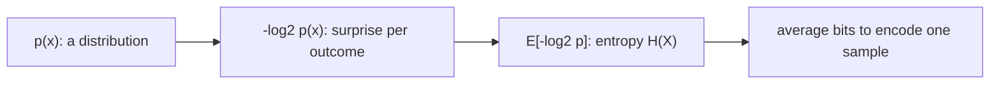

> 🎯 **Key Insight:** Entropy $H(X)$ is the average number of bits an *optimal* code needs to encode one sample from $p$. It is the floor no lossless scheme can beat (Section 6).

> ⚠️ **Common Pitfall:** Mixing log bases. If you compute entropy in nats ($\ln$) but then compare to a "bits" budget, every number is off by a factor of $\ln 2 \approx 0.693$. Pick a base and stay consistent.

**Why it matters for AI/ML:** Entropy quantifies uncertainty in a model's predictions. High predictive entropy flags *unsure* outputs (used in active learning and uncertainty estimation); the entropy of a policy is added to RL objectives to encourage exploration (max-entropy RL).

---

## 2. Joint, Conditional Entropy & Mutual Information

For two random variables $X, Y$ with joint distribution $p(x,y)$:

**Joint entropy** — uncertainty in the pair:

$$H(X,Y) = -\sum_{x,y} p(x,y)\log_2 p(x,y).$$

**Conditional entropy** — remaining uncertainty in $Y$ once $X$ is known:

$$H(Y\mid X) = -\sum_{x,y} p(x,y)\log_2 p(y\mid x) = H(X,Y) - H(X).$$

This **chain rule** $H(X,Y) = H(X) + H(Y\mid X)$ is the information-theoretic analogue of $p(x,y)=p(x)p(y\mid x)$.

**Mutual information** — how many bits knowing one variable saves you about the other:

$$I(X;Y) = H(Y) - H(Y\mid X) = H(X) - H(X\mid Y) = \sum_{x,y} p(x,y)\log_2\frac{p(x,y)}{p(x)p(y)}.$$

$I(X;Y)\ge 0$, with equality iff $X \perp Y$ (independent). It equals the KL divergence between the joint and the product of marginals: $I(X;Y) = D_{\mathrm{KL}}\!\big(p(x,y)\,\|\,p(x)p(y)\big)$.

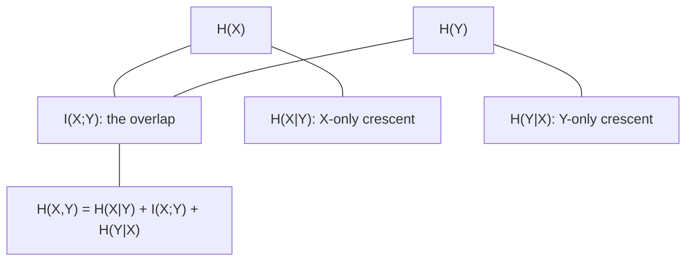

The classic identity set, all consistent:

$$H(X,Y) = H(X) + H(Y\mid X) = H(Y) + H(X\mid Y),\qquad I(X;Y) = H(X)+H(Y)-H(X,Y).$$

> 💡 **Intuition:** Picture two overlapping circles of areas $H(X)$ and $H(Y)$. The overlap is mutual information $I(X;Y)$; the crescents are the conditional entropies. Their union is the joint entropy.

**Why it matters for AI/ML:** Mutual information drives **feature selection** (keep features with high $I$ with the label), the **InfoNCE** objective in contrastive self-supervised learning (maximize MI between views), and the **information bottleneck** view of deep nets. Information gain — central to decision trees (Section 4) — *is* the mutual information between a feature and the label.

---

## 3. Cross-Entropy, KL & JS Divergence

### Cross-entropy

If the true distribution is $p$ but you encode using a code optimized for $q$, your average cost is the **cross-entropy**:

$$H(p,q) = -\sum_x p(x)\log_2 q(x).$$

You always pay at least $H(p)$; the excess is wasted bits.

### KL divergence (relative entropy)

$$D_{\mathrm{KL}}(p\,\|\,q) = \sum_x p(x)\log_2\frac{p(x)}{q(x)} = H(p,q) - H(p) \ge 0.$$

So **cross-entropy = entropy + KL**: $\;H(p,q) = H(p) + D_{\mathrm{KL}}(p\|q)$.

Properties: $D_{\mathrm{KL}}\ge 0$ (Gibbs' inequality), $=0$ iff $p=q$, and crucially it is **asymmetric**: $D_{\mathrm{KL}}(p\|q)\ne D_{\mathrm{KL}}(q\|p)$. It is *not* a metric (no triangle inequality, not symmetric).

> 🎯 **Key Insight:** Minimizing cross-entropy loss in classification is *identical* to minimizing $D_{\mathrm{KL}}(p\|q)$, because the data's entropy $H(p)$ is a constant the model cannot change. Training a classifier = making the model's distribution $q$ match the data's $p$ in KL.

### Worked example by hand

$p = (0.5, 0.5)$, $q = (0.9, 0.1)$.

$$D_{\mathrm{KL}}(p\|q) = 0.5\log_2\frac{0.5}{0.9} + 0.5\log_2\frac{0.5}{0.1}.$$

First term: $\frac{0.5}{0.9}=0.5556$, $\log_2 0.5556 = \frac{\ln0.5556}{\ln2} = \frac{-0.58779}{0.69315} = -0.84800$, times $0.5 = -0.42400$.
Second term: $\frac{0.5}{0.1}=5$, $\log_2 5 = 2.32193$, times $0.5 = 1.16096$.
Sum: $0.737$ bits. The reverse:

$$D_{\mathrm{KL}}(q\|p) = 0.9\log_2\frac{0.9}{0.5} + 0.1\log_2\frac{0.1}{0.5} = 0.9(0.84800) + 0.1(-2.32193) = 0.7632 - 0.2322 = 0.531 \text{ bits.}$$

Different values — confirming asymmetry.

### Jensen–Shannon divergence

A *symmetric, smoothed* relative of KL. With $m = \tfrac12(p+q)$:

$$D_{\mathrm{JS}}(p\,\|\,q) = \tfrac12 D_{\mathrm{KL}}(p\,\|\,m) + \tfrac12 D_{\mathrm{KL}}(q\,\|\,m).$$

It is symmetric, bounded ($0 \le D_{\mathrm{JS}} \le 1$ bit when using $\log_2$), and $\sqrt{D_{\mathrm{JS}}}$ is a true metric. The original GAN objective is, at its optimum, minimizing $D_{\mathrm{JS}}$ between the real and generated distributions.

```python
import numpy as np

def kl(p, q, base=2):
    p, q = np.asarray(p, float), np.asarray(q, float)
    mask = p > 0
    return np.sum(p[mask] * (np.log(p[mask]/q[mask]) / np.log(base)))

def js(p, q, base=2):
    p, q = np.asarray(p, float), np.asarray(q, float)
    m = 0.5 * (p + q)
    return 0.5 * kl(p, m, base) + 0.5 * kl(q, m, base)

p = np.array([0.5, 0.5]); q = np.array([0.9, 0.1])
print(round(kl(p, q), 3))   # 0.737  (D_KL(p||q))
print(round(kl(q, p), 3))   # 0.531  (D_KL(q||p))  -> asymmetric
print(round(js(p, q), 3))   # 0.137  (symmetric, bounded)
print(round(js(q, p), 3))   # 0.137  (same both ways)
```

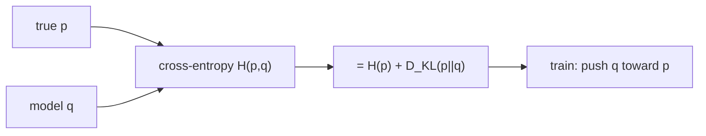

> ⚠️ **Common Pitfall:** Forward vs. reverse KL behave differently. $D_{\mathrm{KL}}(p\|q)$ is **mean-seeking / mass-covering** (penalizes $q$ being small where $p$ is large → $q$ spreads to cover all modes). $D_{\mathrm{KL}}(q\|p)$ is **mode-seeking / zero-forcing** (penalizes $q$ putting mass where $p\approx 0$ → $q$ collapses onto one mode). Variational inference typically minimizes the reverse form, which is why crude VI can be over-confident.

**Why it matters for AI/ML:** Cross-entropy is *the* default classification loss. KL appears in VAEs, diffusion, knowledge distillation (match a student's softmax to a teacher's), PPO's trust region (penalize KL between new and old policy), and t-SNE (minimizes KL between high- and low-dimensional similarity distributions).

---

## 4. Information Gain & Decision Trees

A decision tree splits data to make each child node *purer* (more dominated by one class). **Information gain** measures how much a split reduces label entropy — it is exactly the mutual information between the feature being split on and the label.

For a node with dataset $S$ and a split on feature $A$ producing child subsets $\{S_v\}$:

$$\mathrm{IG}(S, A) = H(S) - \underbrace{\sum_{v}\frac{|S_v|}{|S|}\,H(S_v)}_{\text{weighted child entropy}} = H(S) - H(S\mid A).$$

The tree greedily picks the feature with the **highest information gain** at each node.

### Worked example by hand

14 samples, label = "Play tennis?". Suppose **9 Yes, 5 No** at the root.

$$H(S) = -\tfrac{9}{14}\log_2\tfrac{9}{14} - \tfrac{5}{14}\log_2\tfrac{5}{14}.$$

$\tfrac{9}{14}=0.6429$, $\log_2 0.6429 = -0.6374$, product $=-0.4097$. $\tfrac{5}{14}=0.3571$, $\log_2 0.3571 = -1.4854$, product $=-0.5305$. So $H(S)=0.940$ bits.

Now split on **Outlook** with three values:

| Outlook | count | Yes | No | $H$(child) |
|---|---|---|---|---|
| Sunny | 5 | 2 | 3 | $-\tfrac25\log_2\tfrac25 -\tfrac35\log_2\tfrac35 = 0.971$ |
| Overcast | 4 | 4 | 0 | $0$ (pure) |
| Rain | 5 | 3 | 2 | $0.971$ |

Weighted child entropy:

$$\tfrac{5}{14}(0.971) + \tfrac{4}{14}(0) + \tfrac{5}{14}(0.971) = 0.3468 + 0 + 0.3468 = 0.6936.$$

Information gain:

$$\mathrm{IG}(S,\text{Outlook}) = 0.940 - 0.694 = 0.246 \text{ bits.}$$

The split that maximizes this across all candidate features wins.

```python
import numpy as np

def H(counts):
    counts = np.asarray(counts, float)
    p = counts / counts.sum()
    p = p[p > 0]
    return -np.sum(p * np.log2(p))

root = [9, 5]                         # Yes, No
children = [[2, 3], [4, 0], [3, 2]]   # Sunny, Overcast, Rain
n = sum(sum(c) for c in children)
weighted = sum(sum(c)/n * H(c) for c in children)
ig = H(root) - weighted
print(round(H(root), 3))    # 0.94
print(round(weighted, 3))   # 0.694
print(round(ig, 3))         # 0.246
```

> 📝 **Tip:** Plain information gain is biased toward high-cardinality features (an ID column splits everything perfectly → spurious max gain). C4.5 fixes this with the **gain ratio** = gain ÷ split-information; CART instead minimizes **Gini impurity** $G = 1-\sum_k p_k^2$, which behaves similarly but avoids logarithms.

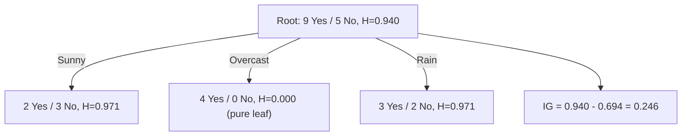

**Why it matters for AI/ML:** Decision trees are the base learners of **random forests** and **gradient-boosted trees (XGBoost, LightGBM)** — among the most reliable models for tabular data. Understanding information gain explains *why* trees prefer informative features and how they decide where to cut.

---

## 5. KL in VAEs and Diffusion Models

### Variational Autoencoders (VAEs)

A VAE learns a latent code $z$ for data $x$. It maximizes the **Evidence Lower BOund (ELBO)**:

$$\log p_\theta(x) \;\ge\; \underbrace{\mathbb{E}_{q_\phi(z\mid x)}\!\big[\log p_\theta(x\mid z)\big]}_{\text{reconstruction}} \;-\; \underbrace{D_{\mathrm{KL}}\!\big(q_\phi(z\mid x)\,\|\,p(z)\big)}_{\text{regularizer}}.$$

The encoder $q_\phi(z\mid x)$ is a Gaussian; the prior $p(z)=\mathcal N(0,I)$. The KL term pulls the encoder's posterior toward the prior, keeping the latent space smooth and sampleable. For two Gaussians it has a **closed form** (Exercise 5):

$$D_{\mathrm{KL}}\!\big(\mathcal N(\mu,\sigma^2)\,\|\,\mathcal N(0,1)\big) = \tfrac12\big(\sigma^2 + \mu^2 - 1 - \ln\sigma^2\big).$$

### Diffusion models

Diffusion training minimizes KL divergences between the forward (noising) and reverse (denoising) Gaussian transitions at each timestep $t$:

$$\mathcal L = \sum_t \mathbb{E}\Big[D_{\mathrm{KL}}\!\big(q(x_{t-1}\mid x_t, x_0)\,\|\,p_\theta(x_{t-1}\mid x_t)\big)\Big] + \text{(endpoint terms)}.$$

Because both sides are Gaussian, each KL reduces (after algebra) to a simple weighted **mean-squared error between predicted and true noise** — the familiar $\|\epsilon - \epsilon_\theta\|^2$ objective. KL is the principle; MSE is the practical form.

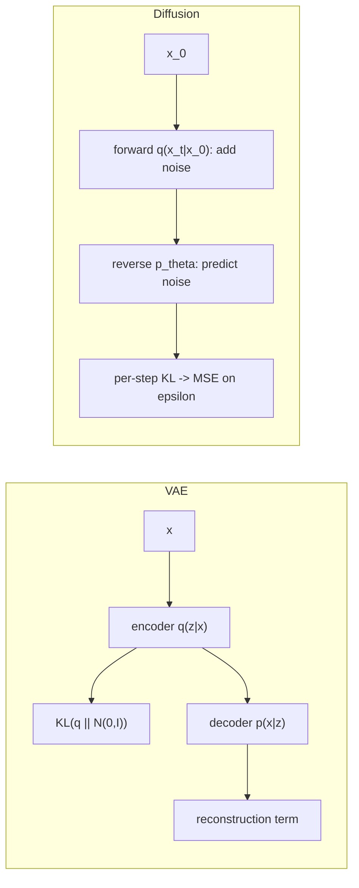

> 🎯 **Key Insight:** Generative models that "match distributions" almost always do it through KL. VAEs and diffusion both descend from the same variational/ELBO machinery; their losses are KL divergences specialized to Gaussian families.

**Why it matters for AI/ML:** Image/audio/video generators (Stable Diffusion, the DALL·E lineage) and representation learners (VAEs) are KL minimizers under the hood. The Gaussian-KL closed form is what makes their losses tractable.

---

## 6. Coding & Compression: Why Entropy Is a Lower Bound

**Shannon's Source Coding Theorem:** the expected length $L$ of *any* uniquely-decodable code for a source $X$ satisfies

$$L \ge H(X),$$

and there exist codes with $L < H(X) + 1$. You cannot, on average, compress below the entropy.

The intuition is the **Kraft inequality**: for a prefix-free code with codeword lengths $\ell_i$, $\sum_i 2^{-\ell_i}\le 1$. Minimizing expected length $\sum_i p_i \ell_i$ subject to Kraft (via Lagrange multipliers / Gibbs' inequality) gives the optimal length $\ell_i = -\log_2 p_i$ — exactly the self-information. Plugging back yields expected length $=H(X)$.

### Huffman coding — worked example by hand

Symbols and probabilities: $A:0.4,\; B:0.3,\; C:0.2,\; D:0.1$.

Build the tree by repeatedly merging the two smallest probabilities:

1. Merge $D(0.1)+C(0.2) = 0.3$.
2. Now have $A:0.4,\; B:0.3,\; (CD):0.3$. Merge $B(0.3)+(CD)(0.3)=0.6$.
3. Merge $A(0.4)+(BCD)(0.6)=1.0$.

Assign 0/1 down the tree → codewords: $A=0$ (len 1), $B=10$ (len 2), $C=110$, $D=111$ (len 3 each).

Expected length: $0.4(1) + 0.3(2) + 0.2(3) + 0.1(3) = 0.4 + 0.6 + 0.6 + 0.3 = 1.9$ bits/symbol.

Entropy: $H = -(0.4\log_2 0.4 + 0.3\log_2 0.3 + 0.2\log_2 0.2 + 0.1\log_2 0.1)$
$= -(0.4(-1.3219)+0.3(-1.7370)+0.2(-2.3219)+0.1(-3.3219)) = 0.5288+0.5211+0.4644+0.3322 = 1.846$ bits.

So Huffman's $1.9$ bits is within $1$ bit of the entropy floor $1.846$ — and provably optimal *among integer-length symbol codes*. Arithmetic/range coding closes the small gap by coding whole sequences.

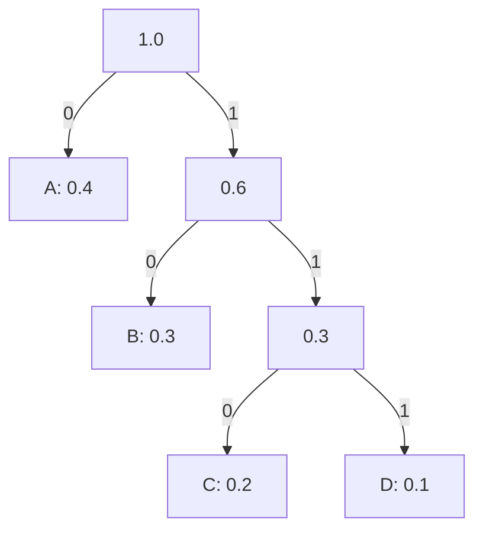

> 💡 **Intuition:** Frequent symbols deserve short codes; rare symbols can afford long ones. Optimal length $\approx -\log_2 p$ means *the rarer it is, the more bits it's worth* — the same formula as self-information. Compression and surprise are the same coin.

**Why it matters for AI/ML:** "Compression = understanding" is a recurring theme. A language model that assigns high probability to real text *is* a good compressor of that text; **bits-per-byte / perplexity** ($2^{H}$ in bits, or $e^{H}$ in nats) are entropy-derived evaluation metrics. Lower entropy on held-out data = better model.

---

## 7. Graph Theory for ML

A **graph** $G=(V,E)$ is a set of **nodes** (vertices) $V$ and **edges** $E\subseteq V\times V$ connecting them. Variants:

| Type | Meaning | Example |
|---|---|---|
| **Undirected** | edges symmetric ($i\!-\!j$) | friendship, molecules |
| **Directed** | edges have direction ($i\!\to\! j$) | web links, citations, follows |
| **Weighted** | edges carry a number $w_{ij}$ | distances, similarity, traffic |
| **Bipartite** | two node types, edges only across | users–items (recommenders) |

### Adjacency and degree matrices

The **adjacency matrix** $A\in\mathbb{R}^{n\times n}$ has $A_{ij}=w_{ij}$ if there is an edge $i\!\to\! j$ (1 for unweighted), else 0. For undirected graphs $A$ is symmetric.

The **degree matrix** $D$ is diagonal with $D_{ii} = \sum_j A_{ij}$ (the weighted degree of node $i$).

A small undirected graph:

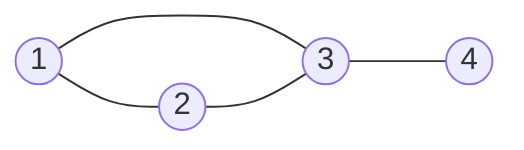

Its adjacency and degree matrices (node order 1,2,3,4):

```
        1 2 3 4                    deg
    A = 0 1 1 0   (node1)      D = 2 . . .
        1 0 1 0   (node2)          . 2 . .
        1 1 0 1   (node3)          . . 3 .
        0 0 1 0   (node4)          . . . 1
```

> 📝 **Tip:** $A^k_{ij}$ counts the number of walks of length $k$ from $i$ to $j$. Powers of the adjacency matrix encode reachability and are the discrete analogue of "how information spreads in $k$ hops" — directly relevant to GNN depth.

```python
import networkx as nx
import numpy as np

G = nx.Graph()
G.add_edges_from([(1, 2), (1, 3), (2, 3), (3, 4)])

A = nx.to_numpy_array(G, nodelist=[1, 2, 3, 4])
deg = A.sum(axis=1)
print(A)            # adjacency
print(deg)          # [2. 2. 3. 1.]  degrees
print(np.linalg.matrix_power(A.astype(int), 2)[0])  # walks of length 2 from node 1
```

**Why it matters for AI/ML:** Social networks, molecules, knowledge graphs, road networks, and recommender user–item interactions are all graphs. Representing them as matrices lets us bring linear algebra (and GPUs) to bear.

---

## 8. The Graph Laplacian & Spectral View

The **(combinatorial) graph Laplacian** is

$$L = D - A.$$

It is symmetric positive semi-definite for undirected graphs. Its quadratic form measures how much a signal $f:V\to\mathbb{R}$ varies across edges — **smoothness**:

$$f^\top L f = \tfrac12\sum_{(i,j)\in E} w_{ij}\,(f_i - f_j)^2 \ge 0.$$

A small value means neighboring nodes have similar values (a smooth signal on the graph).

### Spectral properties

Eigen-decompose $L = U\Lambda U^\top$ with eigenvalues $0 = \lambda_1 \le \lambda_2 \le \dots \le \lambda_n$.

- The **smallest eigenvalue is always 0**, with eigenvector the all-ones vector $\mathbf 1$ (a constant signal varies nowhere).
- The **number of zero eigenvalues equals the number of connected components**.
- $\lambda_2$, the **Fiedler value** (algebraic connectivity), measures how well-connected the graph is; its eigenvector (the **Fiedler vector**) gives a near-optimal bipartition — the basis of **spectral clustering**.
- Eigenvectors are graph "Fourier modes": small $\lambda$ = low frequency (smooth), large $\lambda$ = high frequency (oscillating). This **graph Fourier transform** underlies spectral GNNs.

The **symmetric normalized Laplacian** $L_{\text{sym}} = I - D^{-1/2}AD^{-1/2}$ has eigenvalues in $[0,2]$ and is the version most GNNs use.

```python
import networkx as nx
import numpy as np

G = nx.Graph([(1, 2), (1, 3), (2, 3), (3, 4)])
L = nx.laplacian_matrix(G, nodelist=[1, 2, 3, 4]).toarray().astype(float)
eigvals = np.linalg.eigvalsh(L)
print(np.round(eigvals, 4))   # smallest ~ 0 ; one zero -> graph is connected
```

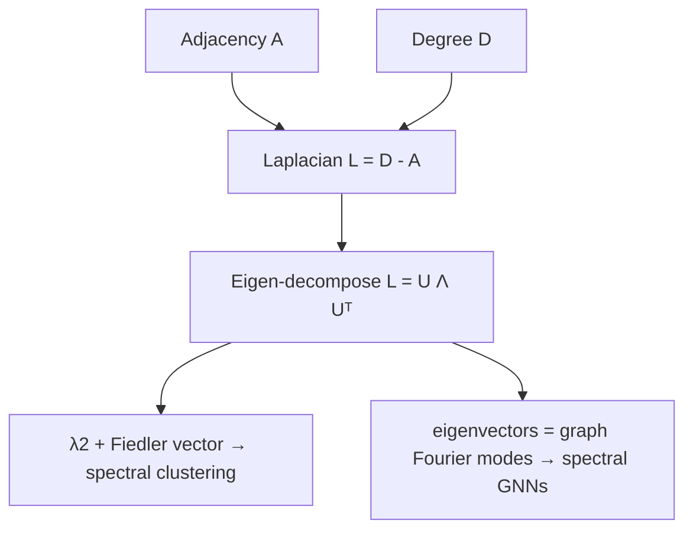

> ⚠️ **Common Pitfall:** Confusing the *combinatorial* Laplacian $D-A$ with the *normalized* ones. They share the connected-components property but have different spectra and different eigenvectors. Spectral clustering and GCNs typically use the normalized version; mixing them up changes results.

**Why it matters for AI/ML:** Spectral clustering, graph signal processing, and the original spectral formulation of graph convolutions all live here. The Laplacian is the single most important matrix in graph ML.

---

## 9. Graph Neural Networks: Message Passing

A **Graph Neural Network (GNN)** learns node representations by repeatedly **aggregating information from neighbors**. The dominant abstraction is **message passing**: at each layer $k$, every node updates its embedding $h_v$ using messages from its neighbors $\mathcal N(v)$:

$$h_v^{(k)} = \mathrm{UPDATE}^{(k)}\!\Big(h_v^{(k-1)},\ \mathrm{AGGREGATE}^{(k)}\big(\{\,h_u^{(k-1)} : u\in\mathcal N(v)\,\}\big)\Big).$$

- **AGGREGATE** is a permutation-invariant function: sum, mean, max, or attention-weighted sum.
- **UPDATE** is typically a linear layer + nonlinearity (and often a residual connection).

A **Graph Convolutional Network (GCN)** layer in matrix form, with $\tilde A = A + I$ (self-loops) and $\tilde D$ its degree matrix:

$$H^{(k)} = \sigma\!\Big(\tilde D^{-1/2}\,\tilde A\,\tilde D^{-1/2}\,H^{(k-1)}\,W^{(k)}\Big).$$

After $K$ layers, each node "sees" its $K$-hop neighborhood — recall $A^k$ counts $k$-hop walks (Section 7).

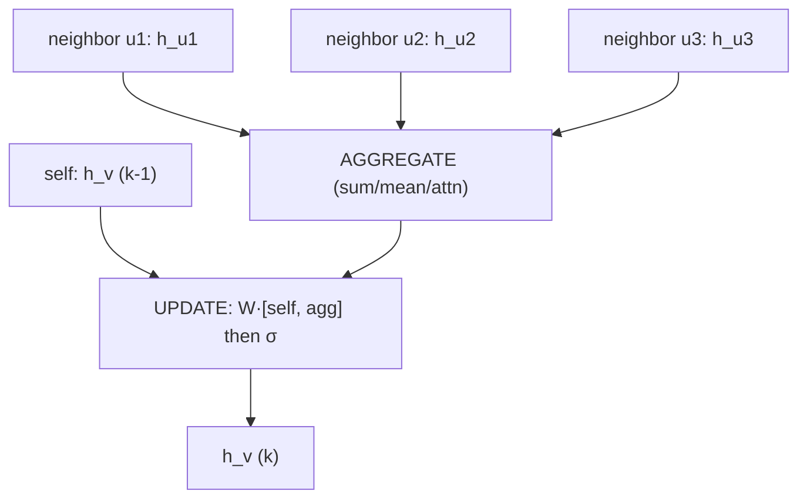

> 💡 **Intuition:** A GNN is "smoothing with learned weights." Each layer mixes a node's features with its neighbors' — exactly the Laplacian smoothing of Section 8, but with trainable transformations between rounds.

> ⚠️ **Common Pitfall:** **Over-smoothing.** Stack too many GCN layers and every node's embedding converges to the same value (repeated averaging → the Laplacian's constant eigenvector). Most GCNs use only 2–4 layers; deeper nets need residuals, normalization, or jumping-knowledge connections.

**Why it matters for AI/ML:** GNNs power molecular property prediction (drug discovery), recommendation (PinSage), fraud detection, traffic forecasting (Google Maps ETA), and protein-structure components. Message passing is the unifying recipe across GCN, GraphSAGE, GAT, and MPNN variants.

---

## 10. Markov Chains, Stationary Distributions & PageRank

A **Markov chain** is a sequence of states where the next state depends *only* on the current state — the **Markov property**:

$$P(X_{t+1}=j \mid X_t=i, X_{t-1}, \dots, X_0) = P(X_{t+1}=j \mid X_t=i) = P_{ij}.$$

The **transition matrix** $P$ is **row-stochastic**: $P_{ij}\ge 0$ and each row sums to 1. If the state distribution at time $t$ is the row vector $\pi_t$, then $\pi_{t+1} = \pi_t P$.

A **stationary distribution** $\pi$ satisfies

$$\pi P = \pi,\qquad \sum_i \pi_i = 1.$$

It is the **left eigenvector** of $P$ with eigenvalue 1. For an **irreducible, aperiodic** chain it is unique and $\pi_t \to \pi$ from any start (Perron–Frobenius / ergodic theorem).

### A 3-state example

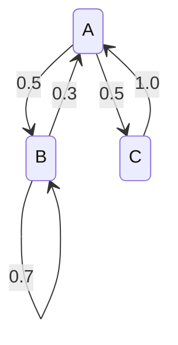

$$P = \begin{pmatrix} 0 & 0.5 & 0.5 \\ 0.3 & 0.7 & 0 \\ 1.0 & 0 & 0 \end{pmatrix}.$$

### PageRank as a Markov chain

PageRank models a **random surfer** clicking links. The web is a directed graph; the surfer follows a random outlink with probability $d$ (the **damping factor**, usually $0.85$) and **teleports** to a uniform random page with probability $1-d$. The PageRank vector is the stationary distribution of this chain:

$$\pi = d\,M\pi + \frac{1-d}{n}\mathbf{1},$$

where $M$ is the column-stochastic link matrix ($M_{ij}$ = probability of going from $j$ to $i$; dangling nodes handled by teleport). Teleportation guarantees irreducibility + aperiodicity, so a unique $\pi$ exists.

```python
import numpy as np

def pagerank(M, d=0.85, tol=1e-10, max_iter=1000):
    """M: column-stochastic link matrix, M[i,j] = prob j -> i.
    Returns stationary PageRank vector (power iteration)."""
    n = M.shape[0]
    rank = np.ones(n) / n
    teleport = np.ones(n) / n
    for _ in range(max_iter):
        new = d * (M @ rank) + (1 - d) * teleport
        if np.linalg.norm(new - rank, 1) < tol:
            break
        rank = new
    return rank / rank.sum()

# 4 pages. Links: 0->1, 0->2, 1->2, 2->0, and 3 is dangling.
# Column j must sum to 1 (page j's outlink distribution).
M = np.array([
    [0,   0,   1.0, 0.25],   # into 0  (from 2)
    [0.5, 0,   0,   0.25],   # into 1  (from 0)
    [0.5, 1.0, 0,   0.25],   # into 2  (from 0,1)
    [0,   0,   0,   0.25],   # into 3
])  # column 3 (dangling) spread uniformly to stay stochastic
pr = pagerank(M)
print(np.round(pr, 4))          # page 2 ranks highest (most inlinks)
print(round(pr.sum(), 6))       # 1.0
```

> 🎯 **Key Insight:** PageRank is "importance = how often a random walker lands here." A page is important if important pages link to it — a recursive definition resolved as the dominant eigenvector of the transition matrix. The same eigenvector-centrality idea reappears across network science.

> ⚠️ **Common Pitfall:** Forgetting **dangling nodes** (pages with no outlinks) breaks stochasticity — their column is all zeros, mass leaks away, and power iteration converges to garbage. Fix by redistributing dangling mass uniformly (as above) before damping.

**Why it matters for AI/ML:** Markov chains underpin PageRank, MCMC sampling (Gibbs, Metropolis–Hastings — the workhorses of Bayesian inference), random-walk node embeddings (DeepWalk, node2vec), and the formal definition of MDPs in RL (next section).

---

## 11. Hidden Markov Models

A **Hidden Markov Model (HMM)** is a Markov chain whose states are *hidden*; you observe only emissions that depend on the current state. It is defined by:

- Hidden states $\{s_1,\dots,s_N\}$ with transition matrix $A$ ($A_{ij}=P(s_j\mid s_i)$).
- Emission distribution $B$ ($B_{ik}=P(o_k\mid s_i)$).
- Initial distribution $\pi$.

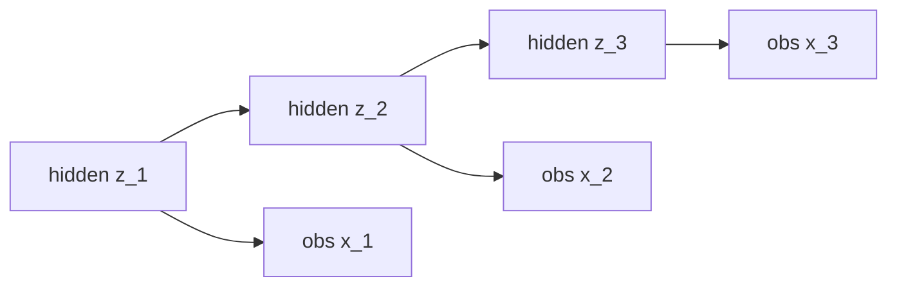

Three canonical problems and their algorithms:

| Problem | Question | Algorithm |
|---|---|---|
| **Evaluation** | $P(\text{observations}\mid \lambda)$? | Forward algorithm |
| **Decoding** | most likely hidden state sequence? | **Viterbi** (dynamic programming) |
| **Learning** | best parameters $A,B,\pi$? | Baum–Welch (EM) |

> 💡 **Intuition:** You hear someone typing (observations) and infer their mood (hidden state). Moods transition over time (Markov chain); each mood makes certain key patterns more likely (emissions). HMMs invert observations back to hidden causes.

**Why it matters for AI/ML:** HMMs powered classical speech recognition, part-of-speech tagging, and bioinformatics (gene finding). Conceptually they are the discrete-state ancestor of state-space models and the structured-prediction mindset that recurs in sequence modeling. The Viterbi DP pattern reappears constantly (e.g., CTC decoding).

---

## 12. Markov Decision Processes: The Bridge to RL

A **Markov Decision Process (MDP)** adds **actions** and **rewards** to a Markov chain — it is the formal model of reinforcement learning. An MDP is a tuple $(\mathcal S, \mathcal A, P, R, \gamma)$:

- $\mathcal S$ — states; $\mathcal A$ — actions.
- $P(s'\mid s,a)$ — transition probability (Markov: depends only on current $s,a$).
- $R(s,a)$ — expected immediate reward.
- $\gamma\in[0,1)$ — **discount factor** (how much future reward is worth now).

A **policy** $\pi(a\mid s)$ chooses actions. The goal is to maximize expected **discounted return** $G_t = \sum_{k\ge 0}\gamma^k R_{t+k}$.

The **value function** of a policy and the **action-value** function:

$$V^\pi(s) = \mathbb{E}_\pi\!\Big[\sum_{k\ge0}\gamma^k R_{t+k}\,\Big|\,S_t=s\Big],\qquad Q^\pi(s,a)=\mathbb E_\pi[G_t\mid S_t=s, A_t=a].$$

The **Bellman expectation equation** expresses value recursively:

$$V^\pi(s) = \sum_a \pi(a\mid s)\sum_{s'} P(s'\mid s,a)\big[R(s,a) + \gamma V^\pi(s')\big].$$

The **Bellman optimality equation** (the heart of RL) defines the best achievable value:

$$V^*(s) = \max_a \sum_{s'} P(s'\mid s,a)\big[R(s,a) + \gamma V^*(s')\big].$$

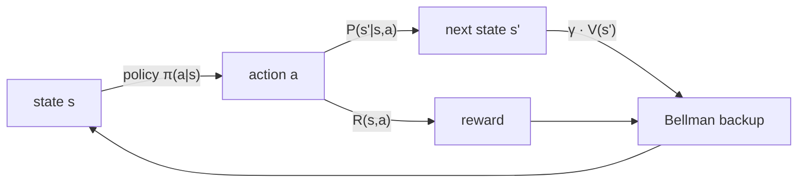

> 🎯 **Key Insight:** Everything in this document converges here. The "Markov" in MDP is the Markov chain of Section 10. Solving the Bellman equation by iteration is a power-method-style fixed-point computation (like finding a stationary distribution). And policy-gradient RL methods (PPO) regularize with **KL divergence** (Section 3) between successive policies. Value iteration, Q-learning, and deep RL all descend from these equations.

> 📝 **Tip:** A Markov chain is an MDP with no actions and no rewards. An HMM is a Markov chain with hidden state. Seeing the family tree — chain → HMM → MDP — makes RL far less mysterious.

**Why it matters for AI/ML:** MDPs are the substrate of reinforcement learning: game-playing agents (AlphaGo/AlphaZero), robotics, recommendation as sequential decisions, and **RLHF** (the alignment step in modern LLMs) all optimize MDP objectives. The Bellman equation is to RL what gradient descent is to supervised learning.

---

## 🧮 From-Scratch Implementation

A self-contained module (NumPy + standard library only) covering entropy, KL, mutual information, a Markov-chain stationary distribution via eigen-decomposition, and value iteration on a tiny MDP.

```python
import numpy as np

# ---------- Information theory ----------
def entropy(p, base=2):
    p = np.asarray(p, float); p = p[p > 0]
    return float(-np.sum(p * np.log(p) / np.log(base)))

def kl_divergence(p, q, base=2):
    p, q = np.asarray(p, float), np.asarray(q, float)
    m = p > 0
    return float(np.sum(p[m] * np.log(p[m] / q[m]) / np.log(base)))

def mutual_information(joint, base=2):
    """joint: 2D array summing to 1."""
    joint = np.asarray(joint, float)
    px = joint.sum(axis=1, keepdims=True)
    py = joint.sum(axis=0, keepdims=True)
    m = joint > 0
    return float(np.sum(joint[m] * np.log(joint[m] / (px @ py)[m]) / np.log(base)))

# ---------- Markov chain stationary distribution ----------
def stationary_distribution(P):
    """P: row-stochastic transition matrix. Returns left eigenvector for lambda=1."""
    vals, vecs = np.linalg.eig(P.T)            # left eigvecs of P = right eigvecs of P.T
    idx = np.argmin(np.abs(vals - 1.0))        # eigenvalue closest to 1
    pi = np.real(vecs[:, idx])
    return pi / pi.sum()

# ---------- Value iteration on a tiny MDP ----------
def value_iteration(P, R, gamma=0.9, tol=1e-9):
    """P[a] : SxS transition matrices; R : SxA reward; returns V*, greedy policy."""
    n_states, n_actions = R.shape
    V = np.zeros(n_states)
    while True:
        Q = np.column_stack([R[:, a] + gamma * (P[a] @ V) for a in range(n_actions)])
        V_new = Q.max(axis=1)
        if np.max(np.abs(V_new - V)) < tol:
            break
        V = V_new
    return V, Q.argmax(axis=1)

if __name__ == "__main__":
    print("H(uniform-4) =", round(entropy([0.25]*4), 4))      # 2.0
    print("KL =", round(kl_divergence([0.5,0.5],[0.9,0.1]),4)) # 0.737

    indep = np.outer([0.5,0.5],[0.5,0.5])                      # independent joint
    print("MI(indep) =", round(mutual_information(indep), 6))  # 0.0

    P = np.array([[0,0.5,0.5],[0.3,0.7,0],[1.0,0,0]])
    pi = stationary_distribution(P)
    print("stationary pi =", np.round(pi, 4),
          "check piP=pi:", np.allclose(pi @ P, pi))

    # 2-state MDP: action 0 = stay, action 1 = switch
    P_mdp = [np.array([[1,0],[0,1]]), np.array([[0,1],[1,0]])]
    R_mdp = np.array([[0.0, 1.0], [2.0, 0.0]])                 # state x action
    V, pol = value_iteration(P_mdp, R_mdp)
    print("V* =", np.round(V, 3), "policy =", pol)
```

Expected output (approximately):

```
H(uniform-4) = 2.0
KL = 0.737
MI(indep) = 0.0
stationary pi = [0.3896 0.4675 0.1429]   check piP=pi: True
V* = [18.    19.798] policy = [1 0]
```

---

## ❓ Knowledge Check

<details><summary><strong>Q1.</strong> Why is entropy maximized by the uniform distribution?</summary>

Entropy measures average surprise. Surprise is largest when no outcome is predictable — i.e., when all outcomes are equally likely. Formally, maximizing $-\sum p_i\log p_i$ subject to $\sum p_i=1$ via Lagrange multipliers gives $p_i = 1/n$ for all $i$, yielding $H=\log n$, the maximum. Any skew toward one outcome lowers entropy because that outcome becomes more predictable.
</details>

<details><summary><strong>Q2.</strong> Cross-entropy loss minimizes which divergence, and why is part of it irrelevant to training?</summary>

It minimizes $D_{\mathrm{KL}}(p\|q)$ where $p$ is the (fixed) data distribution and $q$ the model. Since $H(p,q)=H(p)+D_{\mathrm{KL}}(p\|q)$ and $H(p)$ is a constant independent of the parameters, minimizing cross-entropy is exactly minimizing the KL term. The $H(p)$ floor cannot be reduced by training.
</details>

<details><summary><strong>Q3.</strong> Give a concrete consequence of KL's asymmetry in machine learning.</summary>

Forward KL $D_{\mathrm{KL}}(p\|q)$ is mass-covering: $q$ stretches to cover all modes of $p$ (used in maximum likelihood). Reverse KL $D_{\mathrm{KL}}(q\|p)$ is mode-seeking: $q$ collapses onto one mode (used in variational inference). This is why mean-field VI often underestimates posterior variance and looks over-confident.
</details>

<details><summary><strong>Q4.</strong> A decision-tree split sends all 14 samples into one child unchanged. What is its information gain?</summary>

Zero. If the split doesn't separate samples, the single child has the same class distribution as the parent, so $H(\text{child})=H(\text{parent})$ and the weighted child entropy equals the parent entropy. $\mathrm{IG} = H(S)-H(S\mid A)=0$. The tree would never pick such a split.
</details>

<details><summary><strong>Q5.</strong> Why is the smallest eigenvalue of the graph Laplacian always 0?</summary>

Because $L\mathbf 1 = (D-A)\mathbf 1 = D\mathbf 1 - A\mathbf 1 = \mathbf{d} - \mathbf{d} = \mathbf 0$, where $\mathbf{d}$ is the degree vector (row sums of $A$). So the all-ones vector is an eigenvector with eigenvalue 0. Intuitively, a constant signal varies nowhere across edges, so $f^\top L f = 0$.
</details>

<details><summary><strong>Q6.</strong> What does $A^3_{ij}$ represent for an adjacency matrix $A$, and how does that relate to GNN depth?</summary>

It is the number of walks of length 3 from node $i$ to node $j$. Each GNN layer aggregates one hop of neighbors, so after $k$ layers a node's embedding depends on its $k$-hop neighborhood — the same reach as $A^k$. This is why a GNN's "receptive field" grows with depth, and why too many layers cause over-smoothing.
</details>

<details><summary><strong>Q7.</strong> What guarantees PageRank has a unique solution?</summary>

The teleportation (damping) step. With probability $1-d$ the surfer jumps to a uniformly random page, making the Markov chain **irreducible** (every state reachable from every other) and **aperiodic**. By Perron–Frobenius / the ergodic theorem, such a chain has a unique stationary distribution that power iteration converges to from any start.
</details>

<details><summary><strong>Q8.</strong> How does an HMM differ from a plain Markov chain?</summary>

In a Markov chain the states are directly observed. In an HMM the states are *hidden*; you observe only emissions whose distribution depends on the current hidden state. You must infer the hidden state sequence (Viterbi) or marginalize over it (forward algorithm). An HMM = Markov chain + emission model.
</details>

<details><summary><strong>Q9.</strong> What does the discount factor $\gamma$ control in an MDP, and what breaks at $\gamma=1$ in an infinite-horizon problem?</summary>

$\gamma\in[0,1)$ weights future rewards: small $\gamma$ = myopic, large $\gamma$ = far-sighted. At $\gamma=1$ with an infinite horizon, the discounted return $\sum_k \gamma^k R_{t+k}$ can diverge (no longer a convergent geometric series), and the Bellman operator stops being a contraction, so value iteration may not converge. Episodic tasks can use $\gamma=1$ because the sum is finite.
</details>

<details><summary><strong>Q10.</strong> Trace the conceptual chain linking Markov chains, HMMs, and MDPs.</summary>

Start with a **Markov chain**: states transition with the Markov property. Add **hidden state + emissions** → **HMM** (you observe outputs, infer states). Instead add **actions + rewards + discounting** to the chain → **MDP** (you choose actions to maximize return). RL solves MDPs; the Bellman equation is the fixed-point relation analogous to the stationary-distribution equation $\pi P=\pi$.
</details>

---

## 🏋️ Exercises

<details><summary><strong>Exercise 1 (easy):</strong> Compute the entropy of a loaded four-sided die $p=(0.5, 0.25, 0.125, 0.125)$. By hand, then verify in code.</summary>

By hand: $H = -(0.5\log_2 0.5 + 0.25\log_2 0.25 + 0.125\log_2 0.125 + 0.125\log_2 0.125)$
$= -(0.5(-1) + 0.25(-2) + 0.125(-3) + 0.125(-3))$
$= 0.5 + 0.5 + 0.375 + 0.375 = 1.75$ bits.

```python
import numpy as np
p = np.array([0.5, 0.25, 0.125, 0.125])
print(-np.sum(p*np.log2(p)))   # 1.75
```

Because the probabilities are dyadic ($2^{-k}$), the optimal prefix code $\{0, 10, 110, 111\}$ hits the entropy bound exactly — expected length $= 1.75$ bits.
</details>

<details><summary><strong>Exercise 2 (easy–medium):</strong> Compute the information gain of a binary split. Parent: 10 samples, 6 positive / 4 negative. Split on $X$: $X=1\to$ 4 samples (4 pos, 0 neg); $X=0\to$ 6 samples (2 pos, 4 neg).</summary>

Parent entropy: $H(S) = -\tfrac{6}{10}\log_2\tfrac{6}{10} - \tfrac{4}{10}\log_2\tfrac{4}{10} = -(0.6(-0.737)+0.4(-1.322)) = 0.442+0.529 = 0.971$ bits.

Child $X=1$ (4 pos, 0 neg): pure → $H=0$.
Child $X=0$ (2 pos, 4 neg): $-\tfrac{2}{6}\log_2\tfrac{2}{6} - \tfrac{4}{6}\log_2\tfrac{4}{6} = -(0.333(-1.585)+0.667(-0.585)) = 0.528+0.390 = 0.918$.

Weighted child entropy: $\tfrac{4}{10}(0) + \tfrac{6}{10}(0.918) = 0.551$.

$$\mathrm{IG} = 0.971 - 0.551 = 0.420 \text{ bits.}$$

```python
import numpy as np
def H(c):
    c=np.asarray(c,float); p=c/c.sum(); p=p[p>0]; return -np.sum(p*np.log2(p))
ig = H([6,4]) - (4/10*H([4,0]) + 6/10*H([2,4]))
print(round(ig,3))   # 0.420
```
</details>

<details><summary><strong>Exercise 3 (medium):</strong> Build a 3-state weather Markov chain (Sunny, Cloudy, Rainy) and find its stationary distribution. Use rows $P=\begin{pmatrix}0.7&0.2&0.1\\0.3&0.4&0.3\\0.2&0.45&0.35\end{pmatrix}$.</summary>

Solve $\pi P = \pi$, $\sum\pi=1$ — the left eigenvector for eigenvalue 1.

```python
import numpy as np
P = np.array([[0.7,0.2,0.1],
              [0.3,0.4,0.3],
              [0.2,0.45,0.35]])
# Method 1: eigen-decomposition
vals, vecs = np.linalg.eig(P.T)
pi = np.real(vecs[:, np.argmin(abs(vals-1))]);  pi /= pi.sum()
print("eigen:", np.round(pi,4))
# Method 2: power iteration (sanity check)
v = np.ones(3)/3
for _ in range(1000): v = v @ P
print("power:", np.round(v,4))
print("check piP=pi:", np.allclose(pi @ P, pi))
```

Both methods give $\pi \approx (0.4839, 0.2944, 0.2218)$ (Sunny dominates long-run). Confirm each row of $P$ sums to 1 first — that is the most common setup bug.
</details>

<details><summary><strong>Exercise 4 (medium):</strong> Implement PageRank on a 3-node directed graph: 0→1, 1→2, 2→0, 2→1. Report the ranking with $d=0.85$.</summary>

```python
import numpy as np
# column-stochastic M[i,j] = prob of going j -> i
# out(0)={1}; out(1)={2}; out(2)={0,1}
M = np.array([
    [0,   0,   0.5],   # into 0: from 2 (1/2)
    [1,   0,   0.5],   # into 1: from 0 (1), from 2 (1/2)
    [0,   1,   0  ],   # into 2: from 1 (1)
])
n=3; d=0.85; r=np.ones(n)/n; tp=np.ones(n)/n
for _ in range(1000):
    nr = d*(M@r) + (1-d)*tp
    if np.linalg.norm(nr-r,1) < 1e-12: break
    r = nr
r /= r.sum()
print(np.round(r,4))   # node 1 highest (two inlinks), then 2, then 0
```

Expected ≈ $(0.214, 0.475, 0.311)$ — node 1 ranks first because both 0 and 2 link to it. Verify the columns of $M$ each sum to 1 before running.
</details>

<details><summary><strong>Exercise 5 (hard):</strong> Derive the KL divergence between two univariate Gaussians $\mathcal N(\mu_1,\sigma_1^2)$ and $\mathcal N(\mu_2,\sigma_2^2)$ analytically, then verify numerically by Monte Carlo.</summary>

**Analytic derivation.** With densities $p,q$, $D_{\mathrm{KL}}(p\|q)=\mathbb E_p[\log p - \log q]$. Using $\log p = -\tfrac12\ln(2\pi\sigma_1^2) - \tfrac{(x-\mu_1)^2}{2\sigma_1^2}$ and similarly for $q$:

$$\log\frac{p}{q} = \ln\frac{\sigma_2}{\sigma_1} - \frac{(x-\mu_1)^2}{2\sigma_1^2} + \frac{(x-\mu_2)^2}{2\sigma_2^2}.$$

Take $\mathbb E_p$. Use $\mathbb E_p[(x-\mu_1)^2]=\sigma_1^2$ and $\mathbb E_p[(x-\mu_2)^2]=\sigma_1^2+(\mu_1-\mu_2)^2$:

$$D_{\mathrm{KL}}(p\|q) = \ln\frac{\sigma_2}{\sigma_1} - \tfrac12 + \frac{\sigma_1^2 + (\mu_1-\mu_2)^2}{2\sigma_2^2}.$$

Equivalently $\displaystyle D_{\mathrm{KL}} = \tfrac12\!\left[\ln\frac{\sigma_2^2}{\sigma_1^2} + \frac{\sigma_1^2 + (\mu_1-\mu_2)^2}{\sigma_2^2} - 1\right]$. (Setting $\mu_2=0,\sigma_2=1$ recovers the VAE form in Section 5.)

**Numerical check** (note: this formula is in **nats**, base $e$):

```python
import numpy as np
mu1, s1, mu2, s2 = 1.0, 2.0, 0.0, 1.0
analytic = np.log(s2/s1) - 0.5 + (s1**2 + (mu1-mu2)**2)/(2*s2**2)
print("analytic (nats):", round(analytic, 5))   # 2.31944

rng = np.random.default_rng(0)
x = rng.normal(mu1, s1, size=20_000_000)
def logpdf(x, m, s): return -0.5*np.log(2*np.pi*s**2) - (x-m)**2/(2*s**2)
mc = np.mean(logpdf(x, mu1, s1) - logpdf(x, mu2, s2))
print("monte carlo  :", round(mc, 5))            # ~2.319 (matches)
```

The Monte-Carlo estimate $\frac1N\sum[\log p(x_i)-\log q(x_i)]$ with $x_i\sim p$ converges to the analytic value, validating the derivation.
</details>

---

## 📊 Cheat Sheet

| Quantity | Formula | One-line meaning |
|---|---|---|
| Self-information | $-\log_2 p(x)$ | surprise of one outcome |
| Entropy | $-\sum p\log_2 p$ | avg bits to encode $X$ |
| Joint entropy | $-\sum p(x,y)\log_2 p(x,y)$ | uncertainty of the pair |
| Conditional entropy | $H(X,Y)-H(X)$ | leftover uncertainty in $Y$ given $X$ |
| Mutual information | $H(Y)-H(Y\mid X)$ | bits $X$ tells you about $Y$ |
| Cross-entropy | $-\sum p\log_2 q$ | cost of coding $p$ with $q$ |
| KL divergence | $\sum p\log_2(p/q)=H(p,q)-H(p)$ | excess bits; $\ge 0$; asymmetric |
| JS divergence | $\tfrac12 D_{\mathrm{KL}}(p\|m)+\tfrac12 D_{\mathrm{KL}}(q\|m)$ | symmetric, bounded |
| Information gain | $H(S)-\sum\frac{|S_v|}{|S|}H(S_v)$ | tree split quality = MI |
| Gaussian KL (vs $\mathcal N(0,1)$) | $\tfrac12(\sigma^2+\mu^2-1-\ln\sigma^2)$ | VAE regularizer |
| Adjacency / Degree | $A_{ij}=w_{ij}$, $D_{ii}=\sum_j A_{ij}$ | who connects to whom |
| Laplacian | $L=D-A$; $f^\top Lf=\tfrac12\sum w_{ij}(f_i-f_j)^2$ | smoothness; #zero eigvals = #components |
| GCN layer | $\sigma(\tilde D^{-1/2}\tilde A\tilde D^{-1/2}HW)$ | learned neighbor smoothing |
| Markov property | $P(X_{t+1}\mid X_t,\dots)=P(X_{t+1}\mid X_t)$ | future ⟂ past given present |
| Stationary dist. | $\pi P=\pi$, $\sum\pi=1$ | left eigenvector, $\lambda=1$ |
| PageRank | $\pi=d\,M\pi+\frac{1-d}{n}\mathbf 1$ | random-surfer importance |
| Bellman optimality | $V^*(s)=\max_a\sum_{s'}P(s'|s,a)[R+\gamma V^*(s')]$ | best achievable value |

**Family tree:** Markov chain → (+ hidden state) HMM → (+ actions & rewards) MDP → reinforcement learning.

**Info-theory → ML algorithm concept map:**

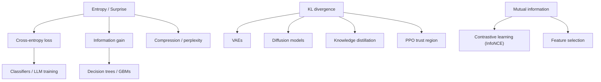

---

## 🔗 Further Resources

### Free

- **David MacKay — *Information Theory, Inference, and Learning Algorithms*** — the definitive, beautifully written free textbook tying information theory to ML. Best for: entropy, coding, inference from first principles. https://www.inference.org.uk/mackay/itila/
- **Stanford CS229 Lecture Notes (Andrew Ng)** — concise notes covering the probabilistic/ML foundations behind these tools. Best for: decision trees, EM, the math behind losses. https://cs229.stanford.edu/
- **Hastie, Tibshirani, Friedman — *The Elements of Statistical Learning* (ESL, free PDF)** — rigorous treatment of trees, boosting, and information-theoretic model selection. Best for: decision trees and ensembles in depth. https://hastie.su.domains/ElemStatLearn/
- **Distill.pub — *A Gentle Introduction to Graph Neural Networks* and *Understanding Convolutions on Graphs*** — interactive, visual GNN explainers. Best for: message-passing intuition. https://distill.pub/2021/gnn-intro/
- **NetworkX documentation** — the practical Python graph library used above. Best for: building/analyzing graphs, Laplacians, PageRank. https://networkx.org/documentation/stable/

### Paid (worth it)

- **Sutton & Barto — *Reinforcement Learning: An Introduction*** (also free online, but the print edition is worth owning) — the canonical MDP/Bellman/RL text. Best for: MDPs → RL. ★★★★★ http://incompleteideas.net/book/the-book.html
- **Cover & Thomas — *Elements of Information Theory*** — the rigorous reference for entropy, KL, and channel coding. Best for: proofs and depth. ★★★★★
- **Stanford CS224W — *Machine Learning with Graphs* (course/specialization)** — the most complete structured path into GNNs and graph ML. Best for: production-grade GNN knowledge. ★★★★☆
- **William Hamilton — *Graph Representation Learning*** (free PDF available, low-cost print) — compact, modern GNN theory. Best for: the math behind message passing. ★★★★☆ https://www.cs.mcgill.ca/~wlh/grl_book/

---

## ➡️ What's Next

Continue to **[Python Foundations for AI](../aipython/01-python-foundations-for-ai.md)** to begin the Python pillar — where these equations become real, runnable systems.
