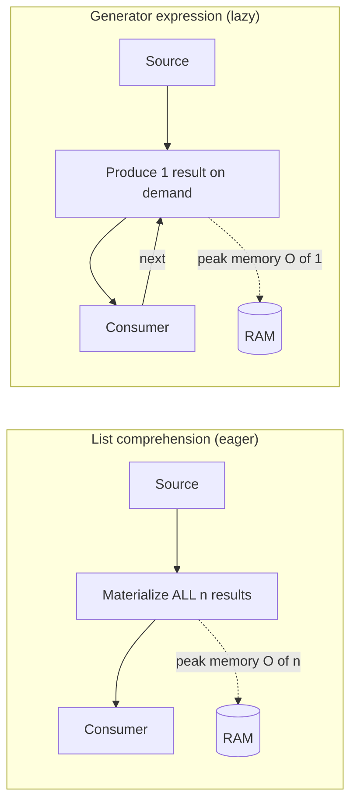
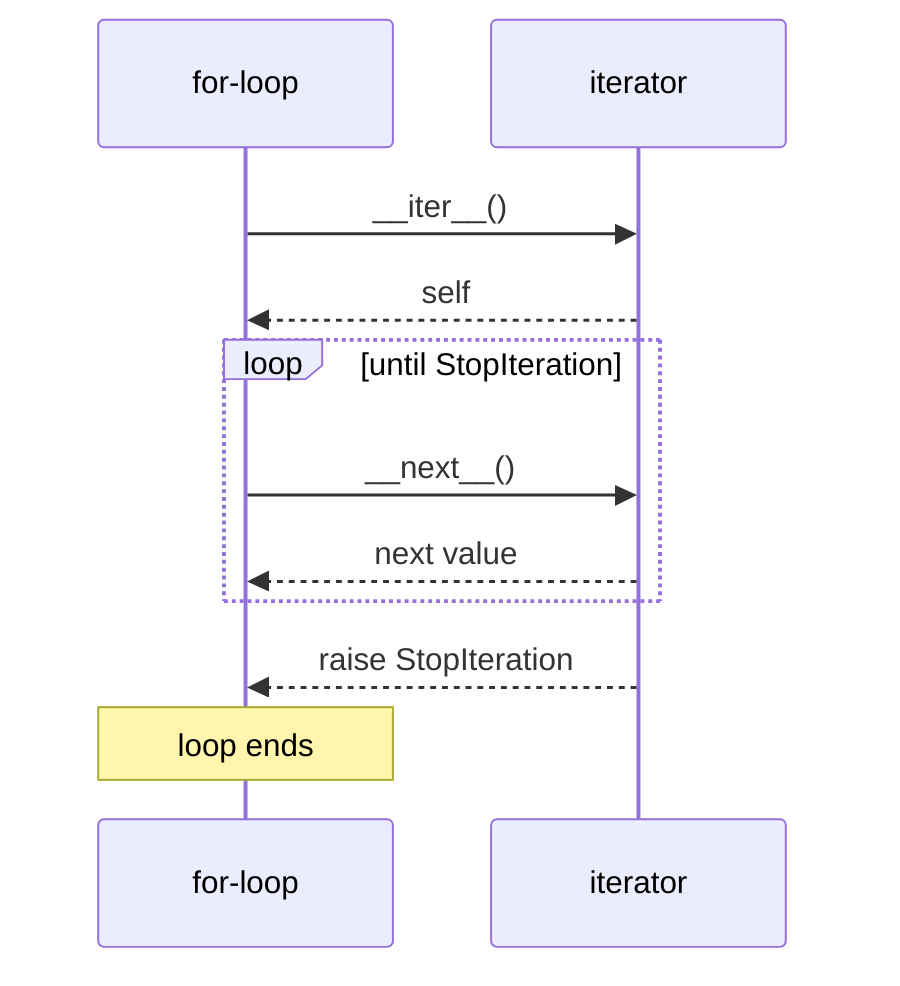
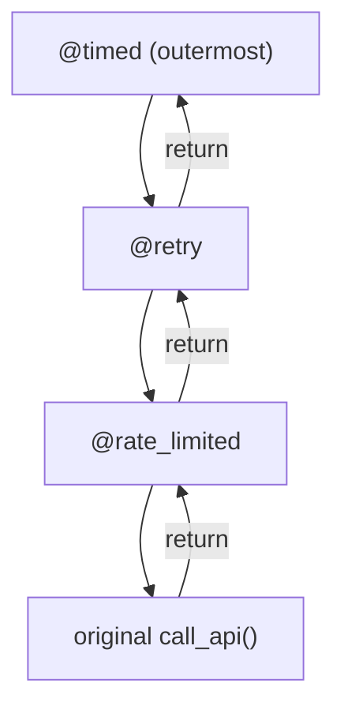
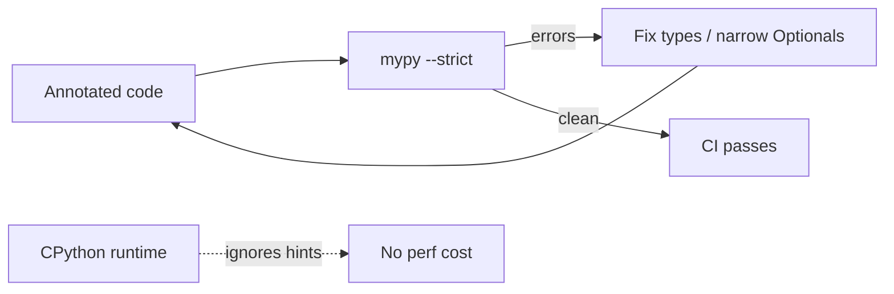
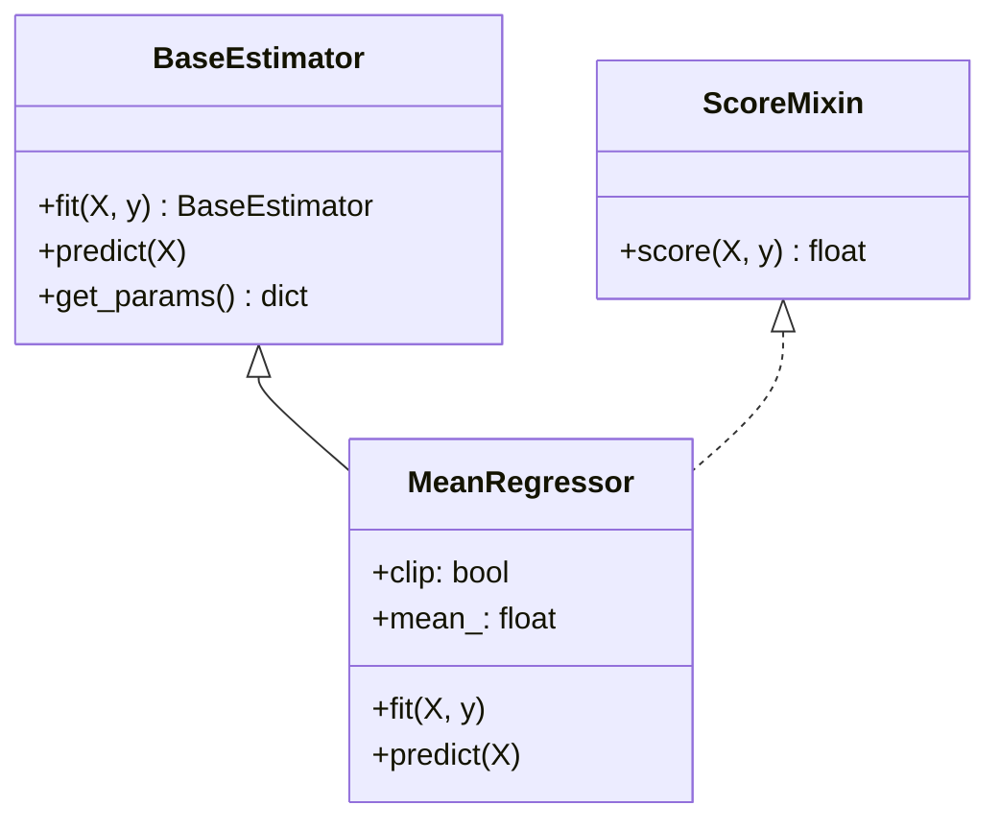
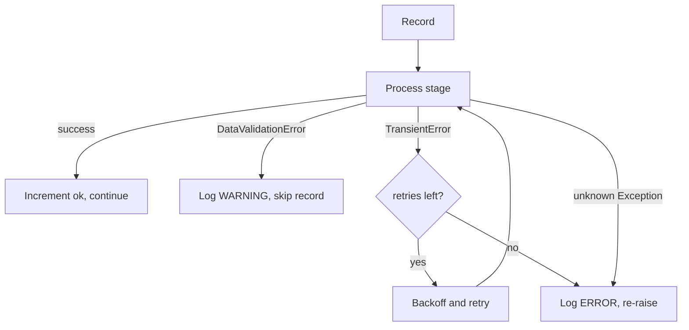
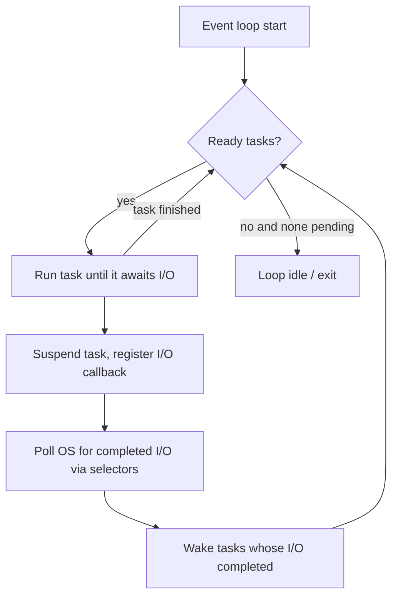
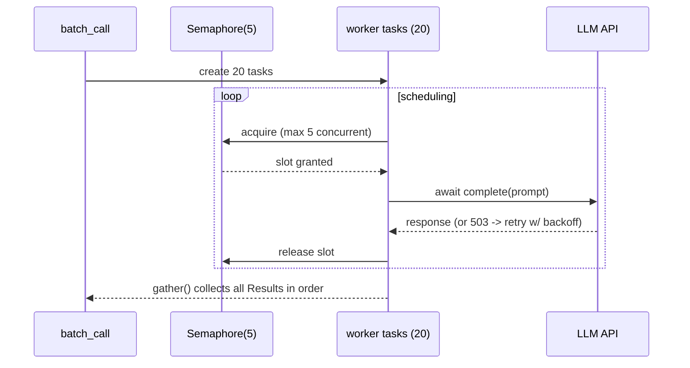
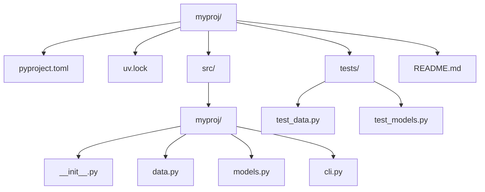
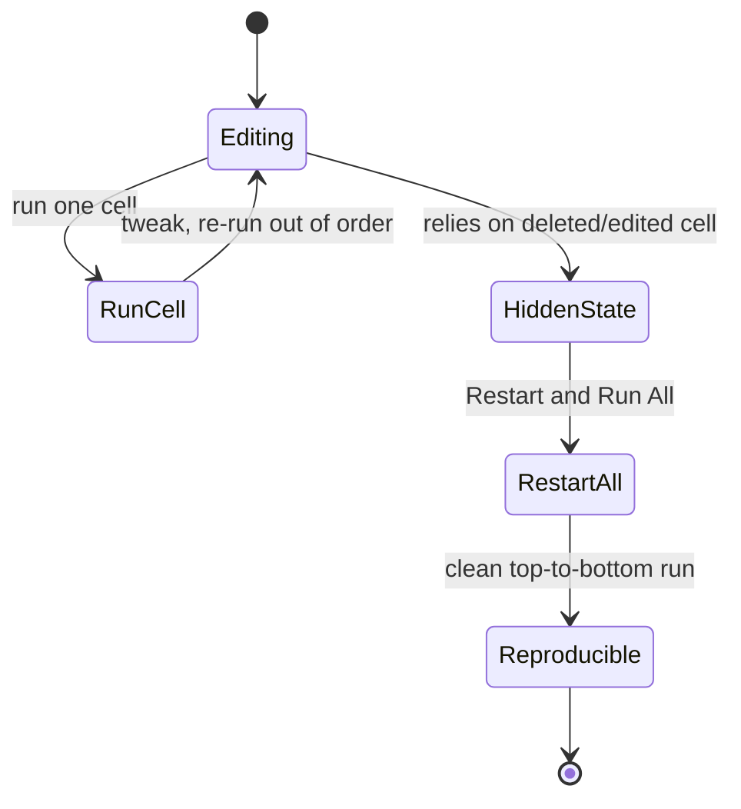

# Python Foundations for AI Engineering
*Idiomatic, production-grade Python for the engineer building AI/ML systems — not a beginner's tour.*

*Part of the AI Engineering & ML Mastery Path — see the [index](../README.md) and [study plan](../MASTER-STUDY-PLAN.md).*

You already know how to write Python. This document is about writing the *right* Python for AI work: code that streams terabytes lazily instead of OOM-ing, that fans out hundreds of LLM calls concurrently without melting your rate limits, that profiles cleanly, packages reproducibly, and tests like the rest of your engineering does. We focus on the idioms that separate "a script that ran once on my laptop" from "a pipeline a team trusts in production."

> 🎯 **Key Insight:** In AI engineering, your Python is rarely the bottleneck for *throughput* (NumPy/CUDA/the model server is) — but it is almost always the bottleneck for *correctness, concurrency, and maintainability*. Master the glue and the rest follows.

---

## 🎯 Learning Objectives

By the end of this document you can:

- **Choose** the right lazy construct (comprehension vs. generator vs. `itertools`) for a given data-size and memory budget, and explain the tradeoff quantitatively.
- **Write** production decorators for cross-cutting concerns — timing, caching, retry-with-backoff, and rate limiting — and reason about decorator ordering.
- **Design** estimator-style OOP (`fit`/`transform`/`predict`) using ABCs and mixins the way scikit-learn does.
- **Implement** robust error handling and structured logging suitable for multi-stage data/ML pipelines.
- **Build** an `async`/`await` batch caller for an LLM API (Claude/OpenAI-style) with bounded concurrency, and explain when `asyncio` beats threads beats processes via the GIL.
- **Profile** a slow function with `cProfile` and `line_profiler`, then refactor a hot loop into vectorized form.
- **Package** a reproducible project with `uv`/`poetry`/`venv`, pin dependencies, seed every RNG, and write `pytest` tests for stochastic ML code.
- **Recognize and refactor** the common anti-patterns that plague AI codebases.

---

## 📋 Prerequisites

- Comfortable writing Python functions, classes, and modules (this is not an intro to syntax).
- Basic command-line fluency (you can run `python`, `pip`, and a shell).
- Conceptual familiarity with an ML workflow (train/validate/predict) helps but is not required.
- Next files build on this: [02-numpy-pandas-data.md](02-numpy-pandas-data.md).

---

## 📑 Table of Contents

1. [Iteration, Comprehensions & Lazy Evaluation](#1-iteration-comprehensions--lazy-evaluation)
2. [Generators, Iterators & the Iterator Protocol](#2-generators-iterators--the-iterator-protocol)
3. [Decorators for AI Plumbing](#3-decorators-for-ai-plumbing)
4. [Context Managers](#4-context-managers)
5. [Dataclasses, NamedTuples & Structured Records](#5-dataclasses-namedtuples--structured-records)
6. [Type Hints, `typing` & the mypy Mindset](#6-type-hints-typing--the-mypy-mindset)
7. [Functional Tools: `functools` & `itertools`](#7-functional-tools-functools--itertools)
8. [OOP for ML: Estimators, ABCs & Mixins](#8-oop-for-ml-estimators-abcs--mixins)
9. [Error Handling & Logging for Pipelines](#9-error-handling--logging-for-pipelines)
10. [Concurrency: async/await, Threads, Processes & the GIL](#10-concurrency-asyncawait-threads-processes--the-gil)
11. [Async LLM Batch Caller (Claude/OpenAI-style)](#11-async-llm-batch-caller-claudeopenai-style)
12. [Performance: Profiling, Vectorization & Memory Views](#12-performance-profiling-vectorization--memory-views)
13. [Packaging, Environments & Reproducibility](#13-packaging-environments--reproducibility)
14. [Jupyter Best Practices](#14-jupyter-best-practices)
15. [Testing ML Code with pytest](#15-testing-ml-code-with-pytest)
16. [Anti-patterns in AI Code (Before/After)](#16-anti-patterns-in-ai-code-beforeafter)
17. [From-Scratch Implementation](#-from-scratch-implementation)
18. [Knowledge Check](#-knowledge-check)
19. [Exercises](#-exercises)
20. [Cheat Sheet](#-cheat-sheet)
21. [Further Resources](#-further-resources)
22. [What's Next](#-whats-next)

---

## 1. Iteration, Comprehensions & Lazy Evaluation

> 💡 **Intuition:** A list comprehension *materializes* every element in memory at once. A generator expression *promises* to produce each element when asked. For a 10-row dataset the difference is noise; for a 10-billion-token corpus it is the difference between running and crashing.

### Formal framing

Let a transformation be a function $f$ applied to each element of a sequence $X = (x_1, x_2, \dots, x_n)$. The eager (list) form computes

$$L = [\,f(x_i) \mid x_i \in X\,], \qquad \text{space} = \mathcal{O}(n)$$

The lazy (generator) form yields one $f(x_i)$ at a time:

$$G = (\,f(x_i) \mid x_i \in X\,), \qquad \text{space} = \mathcal{O}(1)\ \text{(per step)}$$

Both are $\mathcal{O}(n)$ in *time*, but the generator's peak memory is constant in $n$ (assuming each $f(x_i)$ is independent and consumed before the next is produced).

### Worked example by hand

Suppose `X = [1, 2, 3]` and `f(x) = x*x`.

- List comprehension `[x*x for x in X]` builds, step by step: `[1]` -> `[1, 4]` -> `[1, 4, 9]`. All three live in memory simultaneously: total stored = 3 ints.
- Generator `(x*x for x in X)` stores nothing until iterated; each `next()` computes one value (`1`, then `4`, then `9`), discarding the previous. Peak stored = 1 int.

### Python (runnable)

```python
import sys

X = range(1_000_000)

# Eager: builds a full list of 1,000,000 squares.
squares_list = [x * x for x in X]
print(sys.getsizeof(squares_list))   # ~8000056 bytes (~8 MB) on CPython 3.11

# Lazy: a generator object, fixed tiny footprint regardless of n.
squares_gen = (x * x for x in X)
print(sys.getsizeof(squares_gen))    # ~200 bytes (constant)

# Both produce the same sum; only the generator avoids the 8 MB allocation.
print(sum(x * x for x in X))         # 333332833333500000
```

The exact byte counts vary slightly by platform/version, but the order-of-magnitude gap (megabytes vs. ~200 bytes) is the point.

### Comprehension forms you should reach for

```python
# Dict comprehension: build a vocab index.
tokens = ["the", "cat", "sat", "the"]
vocab = {tok: i for i, tok in enumerate(dict.fromkeys(tokens))}
# {'the': 0, 'cat': 1, 'sat': 2}

# Set comprehension: unique labels.
labels = {row["label"] for row in [{"label": "spam"}, {"label": "ham"}, {"label": "spam"}]}
# {'spam', 'ham'}

# Nested / flattening (read left-to-right like nested for-loops).
matrix = [[1, 2], [3, 4]]
flat = [v for row in matrix for v in row]   # [1, 2, 3, 4]

# Conditional filter vs. conditional expression — DIFFERENT positions.
evens   = [x for x in range(10) if x % 2 == 0]          # filter (trailing if)
signs   = [("+" if x >= 0 else "-") for x in (-1, 2)]   # ternary (leading)
```

### Diagram — eager vs. lazy memory profile



> ⚠️ **Common Pitfall:** You can only iterate a generator **once**. After `sum(g)`, the generator `g` is exhausted and `len(list(g))` is `0`. If you need two passes, either re-create the generator or materialize a list deliberately.

> 📝 **Tip:** When a function only needs to *consume* a sequence, pass a **generator expression** as the argument — `sum(x*x for x in data)` — there's no need for the inner brackets. This is a free memory win and reads cleaner.

**Why it matters for AI/ML:** Data loaders, token streams, log replay, and feature pipelines routinely exceed RAM. Lazy evaluation lets you express the transformation declaratively while streaming, which is exactly how `torch.utils.data.IterableDataset`, Hugging Face `datasets` streaming mode, and most ETL stages work under the hood.

---

## 2. Generators, Iterators & the Iterator Protocol

> 💡 **Intuition:** A generator is a function that *pauses*. Every `yield` is a bookmark; calling `next()` resumes from the bookmark with all local state intact. This turns a function into a resumable state machine — perfect for streaming pipelines.

### The protocol

An **iterable** implements `__iter__()` returning an **iterator**; an iterator implements `__next__()` and raises `StopIteration` when exhausted. `for` loops, `sum`, `list`, unpacking, and `in` all speak this protocol.



### Generator functions and pipelines

```python
from typing import Iterator

def read_lines(path: str) -> Iterator[str]:
    """Stream a file line by line — never loads the whole file."""
    with open(path, encoding="utf-8") as fh:
        for line in fh:
            yield line.rstrip("\n")

def non_empty(lines: Iterator[str]) -> Iterator[str]:
    for line in lines:
        if line.strip():
            yield line

def tokenize(lines: Iterator[str]) -> Iterator[list[str]]:
    for line in lines:
        yield line.lower().split()

# Compose into a lazy pipeline. Nothing runs until consumed.
def pipeline(path: str) -> Iterator[list[str]]:
    return tokenize(non_empty(read_lines(path)))

# Demo without touching disk:
def fake_source() -> Iterator[str]:
    yield from ["Hello World", "", "  ", "AI Engineering"]

print(list(tokenize(non_empty(fake_source()))))
# [['hello', 'world'], ['ai', 'engineering']]
```

Each stage holds at most one line in memory. This is the canonical streaming-ETL pattern.

### `yield from`, generator delegation, and `itertools` interplay

```python
def chain_sources(*sources):
    for s in sources:
        yield from s   # delegate iteration; cleaner than a nested for-yield

print(list(chain_sources([1, 2], (3, 4), range(5, 7))))  # [1, 2, 3, 4, 5, 6]
```

### A custom iterator class (for stateful resources)

```python
class SlidingWindow:
    """Yields overlapping windows of size k over a sequence — useful for n-grams."""
    def __init__(self, seq, k: int):
        self.seq, self.k, self.i = list(seq), k, 0
    def __iter__(self):
        return self
    def __next__(self):
        if self.i + self.k > len(self.seq):
            raise StopIteration
        window = tuple(self.seq[self.i : self.i + self.k])
        self.i += 1
        return window

print(list(SlidingWindow("abcd", 2)))  # [('a','b'), ('b','c'), ('c','d')]
```

> ⚠️ **Common Pitfall:** Returning `self` from `__iter__` makes the object a *single-use* iterator. If you want a *reusable* iterable (re-iterable in two loops), implement `__iter__` to return a **fresh** iterator each time instead.

> 🎯 **Key Insight:** Generators give you *backpressure for free*: a slow consumer naturally throttles a fast producer because production only happens on `next()`. This is why streaming data loaders rarely overwhelm GPU feeders.

**Why it matters for AI/ML:** Token streaming from an LLM, sharded dataset reading, and infinite training-batch samplers are all generators. Understanding exhaustion and statefulness prevents the classic "my second epoch saw zero data" bug.

---

## 3. Decorators for AI Plumbing

> 💡 **Intuition:** A decorator is just a function that takes a function and returns a (usually wrapped) function. It is the cleanest way to bolt cross-cutting concerns — timing, caching, retries, rate limits, auth — onto code without editing the code.

### Formal shape

A decorator $d$ maps a callable to a callable: $d : (A \to B) \to (A \to B)$. Stacking decorators composes them; `@a` over `@b` over `f` is $a(b(f))$ — applied **bottom-up**, executed **top-down**.

### The boilerplate you must not skip: `functools.wraps`

```python
import functools, time

def timed(func):
    @functools.wraps(func)            # preserves __name__, __doc__, signature
    def wrapper(*args, **kwargs):
        start = time.perf_counter()
        try:
            return func(*args, **kwargs)
        finally:
            elapsed = time.perf_counter() - start
            print(f"{func.__name__} took {elapsed:.4f}s")
    return wrapper

@timed
def embed(texts):
    """Pretend to embed some texts."""
    time.sleep(0.05)
    return [len(t) for t in texts]

print(embed(["a", "bb"]))
# embed took 0.05xxs
# [1, 2]
print(embed.__name__)   # 'embed'  (without @wraps this would be 'wrapper')
```

### Caching: `functools.lru_cache` / `cache`

```python
import functools

@functools.lru_cache(maxsize=1024)
def expensive_feature(token: str) -> int:
    # Imagine an expensive lookup or model call here.
    return sum(ord(c) for c in token)

expensive_feature("transformer")   # computed
expensive_feature("transformer")   # served from cache, O(1)
print(expensive_feature.cache_info())
# CacheInfo(hits=1, misses=1, maxsize=1024, currsize=1)
```

> ⚠️ **Common Pitfall:** `lru_cache` only works with **hashable** arguments and caches **forever** (up to `maxsize`) within the process. Never cache on a mutable arg (a list), and never use it for results that change over time (live API data) without an eviction strategy. Also: caches are per-process, so they don't help across `multiprocessing` workers.

### Retry with exponential backoff + jitter (the AI-API workhorse)

```python
import functools, random, time
from typing import Callable, Type

def retry(
    exceptions: tuple[Type[BaseException], ...] = (Exception,),
    tries: int = 5,
    base_delay: float = 0.5,
    max_delay: float = 30.0,
    jitter: float = 0.1,
):
    """Retry with exponential backoff: delay_k = min(max_delay, base * 2**k) + jitter."""
    def decorator(func: Callable):
        @functools.wraps(func)
        def wrapper(*args, **kwargs):
            attempt = 0
            while True:
                try:
                    return func(*args, **kwargs)
                except exceptions as exc:
                    attempt += 1
                    if attempt >= tries:
                        raise
                    delay = min(max_delay, base_delay * (2 ** (attempt - 1)))
                    delay += random.uniform(0, jitter)   # decorrelate retries
                    print(f"[retry] {func.__name__} failed ({exc!r}); "
                          f"attempt {attempt}/{tries}, sleeping {delay:.2f}s")
                    time.sleep(delay)
        return wrapper
    return decorator

_calls = {"n": 0}

@retry(exceptions=(ConnectionError,), tries=4, base_delay=0.01)
def flaky_call():
    _calls["n"] += 1
    if _calls["n"] < 3:
        raise ConnectionError("429 rate limited")
    return "ok"

print(flaky_call())   # retries twice, then prints 'ok'
```

The backoff sequence with `base_delay=0.5` is approximately $0.5, 1.0, 2.0, 4.0, \dots$ capped at `max_delay`. The **jitter** term breaks the "thundering herd" where many clients retry in lockstep.

### Diagram — decorator stacking order



> 🎯 **Key Insight:** Order matters. Put `@retry` *inside* `@timed` if you want the timer to measure total time including retries; put it *outside* if you want to time only the final successful attempt. Decide deliberately.

**Why it matters for AI/ML:** Every external model/API call is flaky and rate-limited. A clean, tested `@retry` + `@rate_limited` pair (we build the rate limiter in the Exercises) is the single most reused piece of plumbing in an AI codebase.

---

## 4. Context Managers

> 💡 **Intuition:** A context manager guarantees setup and teardown happen as a pair, even when exceptions fly. `with` is "try/finally with a name."

### Two ways to write one

```python
# 1) Class-based: implement __enter__ / __exit__.
import time

class Timer:
    def __enter__(self):
        self._t = time.perf_counter()
        return self                      # bound to the 'as' variable
    def __exit__(self, exc_type, exc, tb):
        self.elapsed = time.perf_counter() - self._t
        # return False (or None) to PROPAGATE exceptions; True swallows them.
        return False

with Timer() as t:
    sum(range(10_000))
print(f"{t.elapsed:.6f}s")
```

```python
# 2) Generator-based with contextlib — usually preferred for simple cases.
from contextlib import contextmanager
import random

@contextmanager
def temp_seed(seed: int):
    state = random.getstate()            # SETUP: save RNG state
    random.seed(seed)
    try:
        yield                            # body runs here
    finally:
        random.setstate(state)           # TEARDOWN: restore — runs even on error

with temp_seed(123):
    a = random.random()                  # deterministic inside the block
# After the block, the global RNG stream is exactly as it was before.
```

### `ExitStack` — dynamic number of resources

```python
from contextlib import ExitStack

def open_all(paths):
    with ExitStack() as stack:
        files = [stack.enter_context(open(p, "w")) for p in paths]
        # all files guaranteed closed on exit, in reverse order
        for f in files:
            f.write("data\n")
```

> ⚠️ **Common Pitfall:** Returning a truthy value from `__exit__` **silently swallows the exception**. Unless you explicitly intend to suppress, return `False`/`None`. Silent suppression hides pipeline failures — a debugging nightmare.

> 📝 **Tip:** Use `with` for GPU memory scopes, DB connections, file handles, distributed-training process groups, `torch.no_grad()`, and mixed-precision `autocast` — anything that must be torn down deterministically.

**Why it matters for AI/ML:** `torch.no_grad()`, `model.eval()` scopes, opening sharded datasets, and managing inference sessions all rely on deterministic teardown. Leaked file handles and unreleased GPU memory are top causes of long-running-job failures.

---

## 5. Dataclasses, NamedTuples & Structured Records

> 💡 **Intuition:** Stop passing dicts of mystery keys between functions. A `@dataclass` gives you a typed, self-documenting record with `__init__`, `__repr__`, and `__eq__` for free.

### `@dataclass`

```python
from dataclasses import dataclass, field

@dataclass(frozen=True, slots=True)
class GenerationConfig:
    model: str
    max_tokens: int = 1024
    temperature: float = 0.7
    stop: list[str] = field(default_factory=list)   # NEVER a mutable default literal

cfg = GenerationConfig(model="claude-opus-4-8", temperature=0.2)
print(cfg)
# GenerationConfig(model='claude-opus-4-8', max_tokens=1024, temperature=0.2, stop=[])
```

- `frozen=True` -> immutable & hashable (safe as dict keys / cache keys).
- `slots=True` -> no per-instance `__dict__`; lower memory, faster attribute access (meaningful when you hold millions of records).
- `field(default_factory=list)` -> the **only** correct way to default a mutable; a bare `stop: list = []` would share one list across all instances (the classic mutable-default bug).

### `NamedTuple` — when you want a lightweight, immutable, **indexable** record

```python
from typing import NamedTuple

class Span(NamedTuple):
    start: int
    end: int
    label: str

s = Span(0, 5, "PER")
print(s.label, s[2])     # PER PER  (attribute AND positional access)
start, end, label = s    # tuple unpacking works
```

### Comparison

| Feature | `dict` | `NamedTuple` | `@dataclass` | `@dataclass(frozen, slots)` |
|---|---|---|---|---|
| Typed fields | no | yes | yes | yes |
| Mutable | yes | no | yes | no |
| Indexable / unpackable | no | yes | no | no |
| Hashable | no | yes | only if frozen | yes |
| Memory (millions of rows) | high | **low** | medium | **low** |
| Methods / validation | no | limited | yes | yes |

> 🎯 **Key Insight:** For **config objects and domain records**, use `@dataclass`. For **tiny immutable tuples you index a lot** (spans, coordinates, batch elements), use `NamedTuple`. For **runtime validation / serialization** (API boundaries), reach for **Pydantic** (covered in the data file). Reserve raw `dict` for genuinely dynamic key sets.

**Why it matters for AI/ML:** Configs, hyperparameters, dataset rows, and API request/response shapes proliferate. Typed records catch `cfg["temprature"]` (typo) at definition time and make refactors safe.

---

## 6. Type Hints, `typing` & the mypy Mindset

> 💡 **Intuition:** Type hints are *executable documentation* checked by a static analyzer. They don't slow runtime (CPython ignores them), but they catch a huge class of bugs and make IDEs and reviewers far more effective.

### Modern syntax (Python 3.10+)

```python
from typing import TypeVar
from collections.abc import Sequence

# Built-in generics (no need for typing.List/Dict on 3.9+):
def mean(xs: list[float]) -> float:
    return sum(xs) / len(xs)

# Union with | (3.10+):
def parse(x: str) -> int | None:
    return int(x) if x.isdigit() else None

# TypeVar for generic, type-preserving functions:
T = TypeVar("T")
def first(xs: Sequence[T]) -> T:
    return xs[0]
val = first([1, 2, 3])   # mypy infers: int
```

### Structural typing with `Protocol` (duck typing, statically checked)

```python
from typing import Protocol, runtime_checkable

@runtime_checkable
class Estimator(Protocol):
    def fit(self, X, y) -> "Estimator": ...
    def predict(self, X) -> list: ...

def train_and_score(model: Estimator, X, y) -> list:
    return model.fit(X, y).predict(X)
# ANY object with fit/predict satisfies Estimator — no inheritance required.
```

> 🎯 **Key Insight:** `Protocol` is how you type the scikit-learn / Hugging Face "anything with `.fit`/`.predict`" pattern *without* forcing inheritance. This is the Pythonic answer to interfaces.

### The mypy mindset

Run `mypy --strict your_package/` in CI. Strict mode forbids implicit `Any`, untyped defs, and silent `Optional`. The discipline you adopt:

```python
# A common Optional bug mypy catches:
def get_logits(resp: dict | None) -> float:
    return resp["logit"]      # mypy error: resp may be None -> not subscriptable

# Force the caller's reality into the type system:
def get_logits_safe(resp: dict | None) -> float:
    if resp is None:
        raise ValueError("no response")
    return float(resp["logit"])
```



> ⚠️ **Common Pitfall:** Type hints are **not enforced at runtime**. `def f(x: int)` happily accepts `f("not an int")`. If you need runtime validation at trust boundaries (API inputs, config files), use Pydantic or explicit checks — not bare hints.

> 📝 **Tip:** Annotate **public function signatures** and **dataclass fields** first; interior locals usually infer fine. Pareto: 20% of annotations catch 80% of the bugs.

**Why it matters for AI/ML:** Tensor-shape confusion, `None` from a failed parse, and "is this a list of strings or a string?" are endemic. Types + mypy turn 2 a.m. runtime crashes into red squiggles in your editor.

---

## 7. Functional Tools: `functools` & `itertools`

> 💡 **Intuition:** `itertools` is a toolbox of *lazy* combinators; `functools` is a toolbox for *transforming functions*. Together they let you express data wrangling and partial application without writing loops or wrapper classes.

### `map` / `filter` / `reduce`

```python
from functools import reduce

nums = [1, 2, 3, 4]
# map/filter are lazy in Py3 (return iterators):
doubled = list(map(lambda x: x * 2, nums))          # [2, 4, 6, 8]
evens   = list(filter(lambda x: x % 2 == 0, nums))  # [2, 4]
product = reduce(lambda a, b: a * b, nums, 1)        # 24  (1*1*2*3*4)
```

$$\texttt{reduce}(f, [x_1,\dots,x_n], \text{init}) = f(\dots f(f(\text{init}, x_1), x_2)\dots, x_n)$$

> 📝 **Tip:** Prefer a comprehension over `map`/`filter` with a `lambda` (`[x*2 for x in nums]` is clearer than `map(lambda x: x*2, nums)`). Use `map` when you already have a named function: `map(str.strip, lines)`.

### `functools` essentials

```python
from functools import partial, cached_property

# partial: pre-bind arguments — great for configuring callbacks.
def call_model(prompt, *, model, temperature):
    return f"{model}@{temperature}: {prompt}"
opus = partial(call_model, model="claude-opus-4-8", temperature=0.0)
print(opus("hello"))   # claude-opus-4-8@0.0: hello

# cached_property: compute once per instance, memoize on the instance.
class Dataset:
    def __init__(self, rows): self.rows = rows
    @cached_property
    def vocab(self) -> set:
        print("building vocab...")          # runs only once
        return {tok for row in self.rows for tok in row.split()}

d = Dataset(["a b", "b c"])
print(d.vocab); print(d.vocab)   # 'building vocab...' prints once
```

### `itertools` — the lazy power tools

```python
import itertools as it

# Batch an iterable into chunks (the canonical "batch my data" recipe).
def batched(iterable, n):
    """Backport of itertools.batched (added in Python 3.12)."""
    it_ = iter(iterable)
    while (chunk := tuple(it.islice(it_, n))):
        yield chunk

print(list(batched(range(7), 3)))   # [(0,1,2), (3,4,5), (6,)]

# chain: concatenate iterables lazily
print(list(it.chain([1, 2], [3, 4])))          # [1, 2, 3, 4]
# product: cartesian product = hyperparameter grid
grid = list(it.product([0.1, 0.5], [16, 32]))  # [(0.1,16),(0.1,32),(0.5,16),(0.5,32)]
# groupby: group CONSECUTIVE keys (sort first if you want global groups!)
data = sorted([("a",1),("b",2),("a",3)], key=lambda t: t[0])
groups = {k: [v for _, v in g] for k, g in it.groupby(data, key=lambda t: t[0])}
# {'a': [1, 3], 'b': [2]}
# accumulate: running totals / cumulative metrics
print(list(it.accumulate([1, 2, 3, 4])))       # [1, 3, 6, 10]
# islice: take first k from an infinite generator without materializing
print(list(it.islice(it.count(0, 2), 5)))      # [0, 2, 4, 6, 8]
```

> ⚠️ **Common Pitfall:** `itertools.groupby` groups only **consecutive** equal keys — it does NOT sort. Forgetting to `sorted()` first is the #1 `groupby` bug, producing fragmented groups.

> 🎯 **Key Insight:** `itertools` operations are lazy and composable, so you can build a hyperparameter sweep over `product(...)`, `islice` the first N for a smoke test, and never materialize the full grid until you actually run it.

**Why it matters for AI/ML:** Batching, grid search, sliding windows, and stream concatenation are everyday operations; the `itertools` recipes do them in $\mathcal{O}(1)$ extra memory.

---

## 8. OOP for ML: Estimators, ABCs & Mixins

> 💡 **Intuition:** scikit-learn's genius is a *uniform interface*: every model is `fit(X, y)` then `predict(X)` (or `transform(X)`). Adopt the same contract and your models become interchangeable lego bricks usable in pipelines, grid search, and ensembles.

### Abstract Base Class defining the contract

```python
from abc import ABC, abstractmethod
import numpy as np

class BaseEstimator(ABC):
    @abstractmethod
    def fit(self, X, y=None) -> "BaseEstimator": ...
    @abstractmethod
    def predict(self, X): ...

    def get_params(self) -> dict:
        # Convention: hyperparameters are non-underscore attributes.
        return {k: v for k, v in vars(self).items() if not k.endswith("_")}
```

The trailing-underscore convention (`self.weights_`) marks **learned** attributes, distinguishing them from hyperparameters.

### A mixin adds shared behavior without deep hierarchies

```python
class ScoreMixin:
    """Provides .score() to any estimator with .predict()."""
    def score(self, X, y) -> float:
        preds = self.predict(X)
        return float(np.mean(np.asarray(preds) == np.asarray(y)))
```

### Concrete estimator (mean-baseline regressor)

```python
class MeanRegressor(BaseEstimator, ScoreMixin):
    def __init__(self, clip: bool = False):
        self.clip = clip                 # hyperparameter
    def fit(self, X, y=None):
        self.mean_ = float(np.mean(y))   # learned state -> trailing underscore
        return self                      # enable chaining: est.fit(X, y).predict(X)
    def predict(self, X):
        n = len(X)
        return np.full(n, self.mean_)

X = [[0], [1], [2]]; y = [10.0, 20.0, 30.0]
est = MeanRegressor().fit(X, y)
print(est.mean_)                 # 20.0
print(est.predict([[5], [6]]))   # [20. 20.]
print(est.get_params())          # {'clip': False}
```

### Diagram — estimator class hierarchy



> ⚠️ **Common Pitfall:** Putting heavy computation in `__init__`. The convention is: `__init__` only **stores hyperparameters**; all learning happens in `fit`. This makes objects cloneable (for cross-validation), serializable before training, and predictable.

> 📝 **Tip:** Always `return self` from `fit`. It enables fluent chaining and is required by scikit-learn's API contract so your estimator drops into `Pipeline` and `GridSearchCV`.

**Why it matters for AI/ML:** This single convention (`fit`/`transform`/`predict` + ABCs + mixins) is the backbone of scikit-learn, many feature pipelines, and countless internal ML frameworks. Matching it makes your code composable with the entire ecosystem.

---

## 9. Error Handling & Logging for Pipelines

> 💡 **Intuition:** In a multi-stage pipeline, "it crashed" is useless. You need to know *which record*, in *which stage*, with *what cause*, and whether the right move is **retry, skip, or abort**. Structured exceptions + structured logs answer that.

### Custom exception hierarchy

```python
class PipelineError(Exception):
    """Base for all pipeline errors — catch this to handle any pipeline failure."""

class TransientError(PipelineError):
    """Retryable (timeout, 429, 503)."""

class DataValidationError(PipelineError):
    """Permanent for this record — skip it, don't retry."""
    def __init__(self, record_id, reason):
        super().__init__(f"record {record_id}: {reason}")
        self.record_id, self.reason = record_id, reason
```

Now callers can be precise: `except TransientError: retry()` vs. `except DataValidationError: skip_and_log()` vs. let `PipelineError` bubble to abort.

### Logging done right (never `print` in a pipeline)

```python
import logging, sys

logging.basicConfig(
    level=logging.INFO,
    format="%(asctime)s %(levelname)s %(name)s %(message)s",
    stream=sys.stdout,
)
log = logging.getLogger("ingest")     # named per-module logger

def process(records):
    ok = skipped = 0
    for rec in records:
        try:
            if "text" not in rec:
                raise DataValidationError(rec.get("id", "?"), "missing 'text'")
            # ... real work ...
            ok += 1
        except DataValidationError as e:
            skipped += 1
            log.warning("skipping bad record: %s", e)    # %s lazy-formats
    log.info("done: ok=%d skipped=%d", ok, skipped)
    return ok, skipped

process([{"id": 1, "text": "hi"}, {"id": 2}])
# ... WARNING ingest skipping bad record: record 2: missing 'text'
# ... INFO ingest done: ok=1 skipped=1
```

### Diagram — error routing in a pipeline



> ⚠️ **Common Pitfall:** Bare `except:` (or `except Exception:` that swallows and continues) hides `KeyboardInterrupt`, `SystemExit`, and real bugs. Catch the **narrowest** exception you can handle; let the rest propagate. Use `log.exception(...)` inside an `except` block to capture the full traceback automatically.

> 📝 **Tip:** Use **lazy `%s` logging** (`log.info("x=%s", x)`), not f-strings, in hot logging paths — the string is only formatted if the level is enabled. For real production, emit **structured/JSON logs** (e.g., `structlog`) so you can query `record_id` and `stage` in your log platform.

**Why it matters for AI/ML:** Training runs and batch inference jobs run for hours. One poisoned record should be skipped-and-logged, not crash a 6-hour job. Distinguishing transient from permanent errors is what makes a pipeline *resilient* instead of *fragile*.

---

## 10. Concurrency: async/await, Threads, Processes & the GIL

> 💡 **Intuition:** Pick your concurrency model by *what you're waiting on*. Waiting on the **network** (API calls)? -> `asyncio` or threads. Burning **CPU** (pure-Python compute)? -> processes. Doing **NumPy/BLAS/Torch**? -> often already parallel; sometimes threads suffice because the GIL is released in C.

### The GIL, precisely

CPython's **Global Interpreter Lock** allows only **one thread to execute Python bytecode at a time**. Therefore:

- **CPU-bound pure-Python** code gets **no speedup** from threads (they time-slice one core). Use `multiprocessing` (separate interpreters, separate GILs, real parallelism).
- **I/O-bound** code (network, disk) benefits from threads/async because the GIL is **released during blocking I/O** — other threads run while one waits.
- **C extensions** (NumPy, PyTorch, pandas, many crypto/compression libs) **release the GIL** around heavy work, so threads *can* parallelize those.

> Note: Python 3.13 ships an experimental **free-threaded** (no-GIL) build, but as of 2026 the GIL remains the default mental model you should design around.

### Decision table

| Workload | GIL impact | Best tool | Parallelism |
|---|---|---|---|
| Many HTTP/LLM API calls | released on I/O wait | **`asyncio`** (or threads) | concurrent I/O, 1 thread |
| Read 10k files | released on I/O wait | `ThreadPoolExecutor` / `asyncio` | concurrent I/O |
| Pure-Python number crunching | **blocks** — no gain from threads | **`ProcessPoolExecutor`** | true multi-core |
| NumPy / Torch matmul | released in C | threads OK; or built-in BLAS threads | multi-core in C |
| Mix of API + light CPU | mostly I/O | `asyncio` + `run_in_executor` for CPU bits | hybrid |

### Async event loop — how it actually works



> 🎯 **Key Insight:** `async` is **cooperative single-threaded concurrency**. There is no parallelism — one task runs at a time — but while a task `await`s I/O, the loop runs *other* tasks. This is perfect for fanning out 500 LLM calls: you spend nearly all wall-clock time waiting on the network, so one thread can juggle hundreds of in-flight requests.

### Three tiny equivalent-shaped examples

```python
import asyncio, time
from concurrent.futures import ThreadPoolExecutor, ProcessPoolExecutor

def cpu_bound(n):                       # pure Python -> use processes
    return sum(i * i for i in range(n))

def io_bound():                          # blocking I/O -> use threads
    time.sleep(0.1); return "io done"

async def async_io():                    # awaitable I/O -> use asyncio
    await asyncio.sleep(0.1); return "async done"

# Processes for CPU-bound true parallelism:
with ProcessPoolExecutor() as ex:
    cpu_results = list(ex.map(cpu_bound, [100_000] * 4))   # runs on multiple cores

# Threads for blocking I/O:
with ThreadPoolExecutor(max_workers=8) as ex:
    io_results = list(ex.map(lambda _: io_bound(), range(8)))  # ~0.1s total, not 0.8s

# Asyncio for awaitable I/O:
async def main():
    return await asyncio.gather(*(async_io() for _ in range(8)))  # ~0.1s total
print(asyncio.run(main())[:1])   # ['async done']
```

> ⚠️ **Common Pitfall:** Calling a **blocking** function (e.g. `requests.get`, `time.sleep`, heavy CPU) directly inside an `async def` **blocks the entire event loop** — every other task stalls. Use an async library (`httpx.AsyncClient`, `asyncio.sleep`) or offload blocking calls via `await loop.run_in_executor(...)`.

**Why it matters for AI/ML:** Inference orchestration, RAG retrieval, multi-agent systems, and dataset preprocessing all mix network I/O (LLM/vector-DB calls) with CPU work. Choosing wrong (threads for CPU, or blocking calls in an event loop) silently serializes work and 10x's your latency.

---

## 11. Async LLM Batch Caller (Claude/OpenAI-style)

This is the pattern you'll reuse constantly: fan out many prompts, but cap concurrency with a semaphore so you respect rate limits, and combine it with retry+backoff.

```python
import asyncio
import random
from dataclasses import dataclass

# ---- A fake async "LLM client" standing in for anthropic.AsyncAnthropic /
#      openai.AsyncOpenAI. In real code you'd call:
#          resp = await client.messages.create(model=..., max_tokens=...,
#                                               messages=[{"role":"user","content":p}])
#      and read resp.content[0].text. The CONCURRENCY pattern is identical. ----
class FakeAsyncLLM:
    async def complete(self, prompt: str) -> str:
        await asyncio.sleep(random.uniform(0.02, 0.05))   # network latency
        if random.random() < 0.15:                        # 15% transient failure
            raise ConnectionError("503 overloaded")
        return f"echo: {prompt}"

@dataclass
class Result:
    prompt: str
    text: str | None
    error: str | None = None

async def call_with_retry(client, prompt, *, tries=4, base=0.1):
    for attempt in range(1, tries + 1):
        try:
            return Result(prompt, await client.complete(prompt))
        except ConnectionError as exc:
            if attempt == tries:
                return Result(prompt, None, error=repr(exc))
            delay = base * 2 ** (attempt - 1) + random.uniform(0, 0.05)
            await asyncio.sleep(delay)        # async sleep — frees the loop

async def batch_call(prompts, *, concurrency: int = 8):
    """Fan out prompts with bounded concurrency + per-call retry."""
    client = FakeAsyncLLM()
    sem = asyncio.Semaphore(concurrency)      # cap in-flight requests

    async def worker(p):
        async with sem:                       # acquire a slot; release on exit
            return await call_with_retry(client, p)

    tasks = [asyncio.create_task(worker(p)) for p in prompts]
    return await asyncio.gather(*tasks)       # preserves input order

# Run it:
prompts = [f"summarize doc {i}" for i in range(20)]
results = asyncio.run(batch_call(prompts, concurrency=5))
ok = sum(r.error is None for r in results)
print(f"{ok}/{len(results)} succeeded")       # e.g. '20/20 succeeded' (retries absorb failures)
```

### Why each piece exists



> 🎯 **Key Insight:** Three ingredients make a production batch caller: (1) **`gather`** to fan out and preserve order, (2) a **`Semaphore`** to bound concurrency to your rate limit, (3) **per-call retry with async backoff** so transient 429/503s don't poison the batch. `return_exceptions=True` on `gather` (or catching inside the worker, as above) ensures one failure doesn't cancel siblings.

> ⚠️ **Common Pitfall:** Unbounded `gather` over 10,000 prompts opens 10,000 simultaneous connections -> you blow your rate limit and exhaust sockets. **Always** gate with a semaphore (or use chunking, or a library like `anyio`'s capacity limiter).

> 📝 **Tip:** For real Anthropic/OpenAI SDKs, prefer the official **async clients** (`AsyncAnthropic`, `AsyncOpenAI`) — they're built on `httpx`, support streaming via `async for`, and have built-in retry config you can tune rather than reinvent.

**Why it matters for AI/ML:** This single function shape — semaphore-bounded `gather` + retry — is how you efficiently embed a corpus, run an LLM-as-judge evaluation over thousands of samples, or power a high-throughput RAG service.

---

## 12. Performance: Profiling, Vectorization & Memory Views

> 💡 **Intuition:** Don't guess where time goes — *measure*. Then attack the hottest line, usually by replacing a Python loop with a vectorized array operation that runs in optimized C.

### Step 1 — profile with `cProfile`

```python
import cProfile, pstats, io

def slow():
    total = 0
    for i in range(1_000_000):
        total += i * i
    return total

pr = cProfile.Profile()
pr.enable(); slow(); pr.disable()
s = io.StringIO()
pstats.Stats(pr, stream=s).sort_stats("cumulative").print_stats(5)
print(s.getvalue().splitlines()[0:6])   # ncalls, tottime, cumtime per function
```

`cProfile` gives **function-level** attribution. For **line-level**, install `line_profiler` and decorate:

```python
# pip install line_profiler ; run: kernprof -l -v script.py
@profile                       # injected by kernprof; do NOT import it
def hot(xs):
    out = []
    for x in xs:               # line_profiler shows % time PER LINE here
        out.append(x * x)
    return out
```

### Step 2 — the vectorization mindset

A Python-level loop pays interpreter overhead per element: dispatch, boxing, bounds checks. NumPy pushes the loop into C/SIMD. Empirically, vectorized array ops are commonly **10x–100x** faster than the equivalent Python loop for numeric work.

**Before (slow, idiomatic-looking but wrong for numerics):**

```python
def normalize_loop(values):
    n = len(values)
    mean = sum(values) / n
    var = sum((v - mean) ** 2 for v in values) / n
    std = var ** 0.5
    return [(v - mean) / std for v in values]   # Python loop, per-element overhead
```

**After (vectorized):**

```python
import numpy as np

def normalize_vec(values):
    a = np.asarray(values, dtype=np.float64)
    return (a - a.mean()) / a.std()             # entire op runs in C
```

$$z_i = \frac{x_i - \mu}{\sigma}, \qquad \mu = \frac{1}{n}\sum_i x_i,\quad \sigma = \sqrt{\tfrac{1}{n}\sum_i (x_i-\mu)^2}$$

Quick timing sketch:

```python
import numpy as np, timeit
data = list(range(100_000))
t_loop = timeit.timeit(lambda: normalize_loop(data), number=20)
t_vec  = timeit.timeit(lambda: normalize_vec(data),  number=20)
print(f"loop {t_loop:.3f}s  vec {t_vec:.3f}s  speedup ~{t_loop/t_vec:.0f}x")
# Typically prints a speedup in the tens-of-x range.
```

### Step 3 — `memoryview` to avoid copies

```python
buf = bytearray(b"abcdef" * 1000)
mv = memoryview(buf)          # zero-copy view
chunk = mv[6:12]             # slicing a memoryview does NOT copy the bytes
chunk_bytes = bytes(chunk)   # copy only when you actually need a separate object
print(bytes(mv[:6]))         # b'abcdef'
```

> 🎯 **Key Insight:** The performance ladder for numeric Python: **(1) profile -> (2) vectorize with NumPy -> (3) avoid copies (views/`out=` params) -> (4) use the right dtype (float32 vs float64) -> (5) only then reach for Cython/Numba/C**. Most wins come from steps 1–2.

> ⚠️ **Common Pitfall:** "Premature vectorization" of non-numeric or I/O-bound code wastes effort — profile first. Conversely, leaving a tight numeric loop in pure Python (when 90% of time is there) is the most common perf bug in AI code.

**Why it matters for AI/ML:** Preprocessing, feature engineering, and metric computation over millions of rows live and die by vectorization. A vectorized pipeline can turn a 40-minute job into 30 seconds — and it's the same skill that underlies efficient tensor code.

---

## 13. Packaging, Environments & Reproducibility

> 💡 **Intuition:** "Works on my machine" is a reproducibility failure. Pin everything (dependencies *and* RNG seeds), isolate per-project environments, and capture the exact versions so a teammate — or future-you — gets bit-identical behavior.

### Environment tools compared

| Tool | Scope | Lockfile | Speed | Best for |
|---|---|---|---|---|
| `venv` + `pip` | pure-Python deps | `requirements.txt` (manual `pip freeze`) | baseline | minimal, stdlib-only setups |
| `conda` | Python **and** non-Python (CUDA, MKL, C libs) | `environment.yml` | slower solver | GPU/scientific stacks, system libs |
| `poetry` | Python deps + build + publish | `poetry.lock` | medium | libraries you publish to PyPI |
| `uv` | Python deps + envs (pip/venv replacement) | `uv.lock` | **very fast** (Rust) | modern app projects; CI speed |

```bash
# venv + pip (always available)
python -m venv .venv && source .venv/bin/activate    # Windows: .venv\Scripts\activate
pip install numpy==2.1.0 && pip freeze > requirements.txt

# uv — fast, modern (recommended for new projects)
uv init myproj && cd myproj
uv add "numpy==2.1.0" "httpx>=0.27"      # writes pyproject.toml + uv.lock
uv run python train.py                    # runs in the managed env

# poetry — for publishable libraries
poetry new mylib && cd mylib
poetry add numpy@^2.1 && poetry lock && poetry install

# conda — when you need CUDA / system libs
conda create -n ml python=3.11 numpy pytorch -c conda-forge && conda activate ml
```

> 📝 **Tip:** Pin **transitively** via a lockfile (`uv.lock`, `poetry.lock`, `conda env export`), not just top-level `requirements.txt`. A loose `numpy>=2` lets a silent upgrade change your results months later.

### Project structure (the `src/` layout)



```
myproj/
├── pyproject.toml          # single source of truth: deps, build system, tool config
├── uv.lock                 # pinned, hashed, transitive dependency graph
├── README.md
├── src/
│   └── myproj/
│       ├── __init__.py
│       ├── data.py
│       ├── models.py
│       └── cli.py
└── tests/
    ├── test_data.py
    └── test_models.py
```

> 🎯 **Key Insight:** The **`src/` layout** prevents the "it imported the local folder instead of the installed package" class of bugs — tests are forced to import the *installed* package, catching packaging mistakes early.

### Reproducibility: seed *everything*

```python
import os, random
import numpy as np

def seed_everything(seed: int = 42) -> None:
    os.environ["PYTHONHASHSEED"] = str(seed)   # stabilizes set/dict hash ordering
    random.seed(seed)
    np.random.seed(seed)
    try:
        import torch
        torch.manual_seed(seed)
        torch.cuda.manual_seed_all(seed)
        torch.backends.cudnn.deterministic = True   # trade speed for determinism
        torch.backends.cudnn.benchmark = False
    except ImportError:
        pass

seed_everything(42)
print(np.random.rand(3))   # same three numbers on every run after seeding
```

> ⚠️ **Common Pitfall:** Seeding `random` but forgetting `numpy`/`torch` (or the dataloader's worker seeds) gives *partial* reproducibility — your splits match but your weight init doesn't. Also, full GPU determinism (`cudnn.deterministic=True`) can slow training; document the tradeoff.

**Why it matters for AI/ML:** Irreproducible results destroy trust in experiments. Pinned deps + seeded RNGs are the difference between "I improved accuracy 2%" and "I got lucky once and can't repeat it."

---

## 14. Jupyter Best Practices

> 💡 **Intuition:** Notebooks are fantastic for exploration and terrible for hidden state. The cardinal sin is **out-of-order execution** that produces results no fresh run can reproduce.

**Do:**

- **Restart & Run All** before trusting any result — it's the only proof your notebook is reproducible top-to-bottom.
- Keep notebooks **thin**: import real logic from your `src/` package; notebooks orchestrate and visualize, they don't house the codebase.
- Seed RNGs in the first cell; print library versions for the record.
- Use `%load_ext autoreload` + `%autoreload 2` so edits to imported modules take effect without restart.
- Clear outputs (or use `jupytext` / `nbstripout`) **before committing** so diffs stay reviewable and you don't commit megabytes of base64 images.

**Don't:**

- Don't define core functions/classes in cells and copy them into production later — define once in the package and import.
- Don't rely on a variable defined in a cell you've since deleted (hidden state).
- Don't commit raw `.ipynb` with embedded outputs to a shared repo without stripping.



> ⚠️ **Common Pitfall:** A notebook that "works" only because cell 7 was run before cell 3. After **Restart & Run All** it breaks — meaning the result was never real. Make this restart a habit before sharing or reporting numbers.

> 📝 **Tip:** Use `nbstripout --install` as a git filter to auto-strip outputs on commit, and `papermill` to parameterize and run notebooks as reproducible jobs.

**Why it matters for AI/ML:** Most ML work starts in a notebook. The teams that ship reliably treat notebooks as a thin exploratory shell over a tested package — not as the system of record.

---

## 15. Testing ML Code with pytest

> 💡 **Intuition:** ML code is hard to test because it's stochastic and data-dependent. The fix: **seed for determinism**, **assert properties/invariants** instead of exact floats, and **use fixtures** for shared setup.

### Core pytest patterns

```python
# tests/test_models.py
import math
import numpy as np
import pytest

def normalize(a):
    a = np.asarray(a, dtype=float)
    return (a - a.mean()) / a.std()

@pytest.fixture
def sample():
    """Shared, seeded test data."""
    rng = np.random.default_rng(0)
    return rng.normal(size=1000)

def test_normalize_zero_mean_unit_std(sample):
    z = normalize(sample)
    # Float comparisons: assert APPROXIMATELY, never ==.
    assert math.isclose(z.mean(), 0.0, abs_tol=1e-9)
    assert z.std() == pytest.approx(1.0, rel=1e-9)

@pytest.mark.parametrize("bad", [[5.0, 5.0, 5.0]])   # zero-variance input
def test_normalize_degenerate_inputs(bad):
    result = normalize(bad)
    # std()==0 -> divide by zero yields nan/inf; assert we DON'T silently return finite garbage
    assert not np.isfinite(result).all()
```

Run with `pytest -q`. Expected: the property test passes; the degenerate test documents that zero-variance input produces non-finite output (a real edge case you must guard in production code with an `eps`).

### Testing strategies specific to ML

| What to test | How | Example assertion |
|---|---|---|
| Numeric output | `pytest.approx` / `np.allclose` | `assert np.allclose(out, expected, atol=1e-6)` |
| Shape contracts | direct shape check | `assert preds.shape == (n,)` |
| Invariants / properties | property-based (`hypothesis`) | "normalize is idempotent up to tol" |
| Stochastic functions | seed the RNG first | `rng = np.random.default_rng(0)` |
| Determinism | run twice, compare | `assert (f() == f()).all()` after seeding |
| External APIs | **mock**, don't call | `monkeypatch`/`unittest.mock` the client |

```python
# Mock an LLM client so tests are fast, free, and deterministic.
from unittest.mock import MagicMock

def summarize(client, text):
    return client.complete(f"summarize: {text}")

def test_summarize_mocked():
    client = MagicMock()
    client.complete.return_value = "MOCK SUMMARY"
    assert summarize(client, "long doc") == "MOCK SUMMARY"
    client.complete.assert_called_once_with("summarize: long doc")
```

> ⚠️ **Common Pitfall:** Asserting exact float equality (`assert loss == 0.5`). Floating-point and nondeterministic kernels make this flaky. Always use `pytest.approx`/`np.allclose` with an explicit tolerance, and **seed** anything stochastic.

> 📝 **Tip:** Mark slow/integration tests with `@pytest.mark.slow` and skip them in the fast CI lane (`pytest -m "not slow"`). Use `hypothesis` for property-based tests — it auto-generates adversarial inputs and shrinks failing cases to a minimal example.

**Why it matters for AI/ML:** Untested data-prep code silently corrupts training sets; untested metric code reports wrong numbers you then optimize toward. Property + invariant testing catches the bugs that exact-value testing can't express for stochastic systems.

---

## 16. Anti-patterns in AI Code (Before/After)

A field guide to the mistakes that show up in real AI codebases, with the idiomatic fix.

### 16.1 Mutable default argument

```python
# BEFORE — the default list is created ONCE and shared across all calls.
def add_token(tok, cache=[]):
    cache.append(tok)
    return cache
add_token("a"); print(add_token("b"))   # ['a', 'b']  <- leaked state!

# AFTER
def add_token(tok, cache=None):
    cache = [] if cache is None else cache
    cache.append(tok); return cache
```

### 16.2 Loading the whole file/dataset into memory

```python
# BEFORE — reads a 50 GB file entirely; OOM.
lines = open("huge.jsonl").read().splitlines()
for line in lines: process(line)

# AFTER — stream lazily, constant memory.
with open("huge.jsonl", encoding="utf-8") as fh:
    for line in fh:           # the file object IS a line iterator
        process(line)
```

### 16.3 Python loop where vectorization belongs

```python
# BEFORE
result = []
for i in range(len(a)):
    result.append(a[i] * b[i] + c)

# AFTER
import numpy as np
result = np.asarray(a) * np.asarray(b) + c   # 10-100x faster, clearer
```

### 16.4 Blocking calls inside an event loop

```python
# BEFORE — requests.get blocks the WHOLE loop; concurrency is fake.
import requests
async def fetch(url):
    return requests.get(url).text          # blocks every other task

# AFTER — use an async HTTP client.
import httpx
async def fetch(url):
    async with httpx.AsyncClient() as c:
        return (await c.get(url)).text
```

### 16.5 Catch-all `except` that hides bugs

```python
# BEFORE — swallows everything, including real bugs & Ctrl-C.
try:
    score = model.predict(X)
except:
    score = None

# AFTER — catch what you can handle; log the rest with traceback.
import logging
try:
    score = model.predict(X)
except (ValueError, RuntimeError):
    logging.getLogger(__name__).exception("predict failed for batch")
    raise
```

### 16.6 Unbounded fan-out of API calls

```python
# BEFORE — 10k simultaneous requests; blows rate limit & sockets.
results = await asyncio.gather(*(call_api(p) for p in prompts))

# AFTER — bound concurrency with a semaphore (see Section 11).
sem = asyncio.Semaphore(8)
async def guarded(p):
    async with sem:
        return await call_api(p)
results = await asyncio.gather(*(guarded(p) for p in prompts))
```

### 16.7 Hardcoded config & magic numbers

```python
# BEFORE — scattered magic strings/numbers, impossible to sweep.
resp = client.messages.create(model="claude-opus-4-8", max_tokens=1024, temperature=0.7)

# AFTER — a typed config object (see Section 5) you can serialize, log, and sweep.
from dataclasses import dataclass
@dataclass(frozen=True)
class GenCfg:
    model: str
    max_tokens: int = 1024
    temperature: float = 0.7
cfg = GenCfg(model="claude-opus-4-8")
resp = client.messages.create(**vars(cfg))
```

> 🎯 **Key Insight:** Almost every AI-code anti-pattern reduces to one of four sins: **shared mutable state**, **eager memory use where lazy would do**, **blocking where concurrent would do**, or **untyped/hardcoded config**. Train your eye for these four and code review gets dramatically faster.

---

## 🧮 From-Scratch Implementation

A self-contained **mini data pipeline** that ties the chapter together — lazy streaming, a timing+retry decorator, a context manager, a dataclass record, structured logging, and a vectorized aggregation — using only the standard library plus NumPy.

```python
from __future__ import annotations
import functools, logging, random, time
from contextlib import contextmanager
from dataclasses import dataclass
from typing import Iterator
import numpy as np

logging.basicConfig(level=logging.INFO, format="%(levelname)s %(message)s")
log = logging.getLogger("minipipe")

# --- 5. structured record ---
@dataclass(frozen=True, slots=True)
class Record:
    id: int
    score: float

# --- 3. decorator: retry transient failures ---
def retrying(tries: int = 4, base: float = 0.01):
    def deco(fn):
        @functools.wraps(fn)
        def wrap(*a, **k):
            for attempt in range(1, tries + 1):
                try:
                    return fn(*a, **k)
                except ConnectionError:
                    if attempt == tries:
                        raise
                    time.sleep(base * 2 ** (attempt - 1))
        return wrap
    return deco

# --- 4. context manager: deterministic RNG scope ---
@contextmanager
def seeded(seed: int):
    state = random.getstate()
    random.seed(seed)
    try:
        yield
    finally:
        random.setstate(state)

# --- 2. lazy source: generator that "fetches" flaky records ---
@retrying(tries=6)
def fetch_record(i: int) -> Record:
    if random.random() < 0.2:           # 20% transient failure -> retried
        raise ConnectionError("transient")
    return Record(id=i, score=random.random())

def stream_records(n: int) -> Iterator[Record]:
    for i in range(n):
        yield fetch_record(i)           # produced lazily, one at a time

# --- 9. + 12. driver: error-safe consumption + vectorized aggregation ---
def run(n: int) -> float:
    scores: list[float] = []
    for rec in stream_records(n):       # lazy consumption
        scores.append(rec.score)
    arr = np.asarray(scores, dtype=np.float64)   # vectorized in C
    mean = float(arr.mean())
    log.info("processed %d records, mean score=%.4f", n, mean)
    return mean

with seeded(42):                        # reproducible end-to-end
    result = run(50)
print(f"final mean: {result:.4f}")
# INFO processed 50 records, mean score=0.xxxx
# final mean: 0.xxxx   (identical on every run thanks to the seeded scope)
```

This single script exercises: lazy generators (Sections 1–2), decorators (Section 3), context managers (Section 4), dataclasses (Section 5), logging (Section 9), and vectorization (Section 12) — the spine of any real AI data path.

---

## ❓ Knowledge Check

<details><summary><b>Q1.</b> Why does a generator expression use O(1) peak memory while the equivalent list comprehension uses O(n)? — Show answer</summary>

A list comprehension **materializes** all $n$ results and holds them simultaneously, so peak memory grows with $n$. A generator expression produces each element **on demand** via `__next__`, holding only the current element (and the iterator's small state), so peak memory is constant in $n$. Both are $\mathcal{O}(n)$ in *time*. The catch: a generator is single-use and supports no random access.
</details>

<details><summary><b>Q2.</b> What does `functools.wraps` do, and what breaks without it? — Show answer</summary>

`functools.wraps(func)` copies `__name__`, `__doc__`, `__qualname__`, `__module__`, and `__wrapped__` from the decorated function onto the wrapper. Without it, the wrapped function reports the wrapper's identity (`__name__ == "wrapper"`), losing docstrings, confusing tracebacks/introspection, and breaking tools (Sphinx, pytest, frameworks) that rely on accurate metadata.
</details>

<details><summary><b>Q3.</b> Explain the GIL's effect on (a) CPU-bound pure-Python code with threads, and (b) NumPy matmul with threads. — Show answer</summary>

(a) The GIL allows only one thread to run Python bytecode at a time, so CPU-bound pure-Python work gets **no speedup** from threads — they time-slice one core. Use `multiprocessing`/`ProcessPoolExecutor`. (b) NumPy's matmul executes in C/BLAS, which **releases the GIL** during heavy computation, so threads *can* run in parallel there (and BLAS may itself be multi-threaded). The GIL is a Python-bytecode lock, not a "no parallelism ever" lock.
</details>

<details><summary><b>Q4.</b> Why is `def f(x, cache=[])` dangerous, and what's the fix? — Show answer</summary>

Default arguments are evaluated **once** at function-definition time, so the same list object is shared across all calls that don't pass `cache` — mutations leak between calls. Fix: use a sentinel, `def f(x, cache=None): cache = [] if cache is None else cache`. The same applies to `{}`, `set()`, and any mutable default.
</details>

<details><summary><b>Q5.</b> What is the bug in calling `requests.get()` inside an `async def` coroutine? — Show answer</summary>

`requests.get` is **synchronous and blocking**. Inside a coroutine it blocks the entire event loop — no other task can run until it returns — so your "concurrency" serializes. Fix: use an async client (`httpx.AsyncClient`, `aiohttp`) with `await`, or offload the blocking call via `await loop.run_in_executor(None, requests.get, url)`.
</details>

<details><summary><b>Q6.</b> Why does `itertools.groupby` sometimes return fragmented groups? — Show answer</summary>

`groupby` groups only **consecutive** items with equal keys; it does not sort. If equal keys are non-adjacent, you get multiple groups for the same key. Fix: `sorted(data, key=keyfunc)` **before** `groupby(data, key=keyfunc)` using the same key function.
</details>

<details><summary><b>Q7.</b> When should you choose `asyncio` over `ThreadPoolExecutor` over `ProcessPoolExecutor`? — Show answer</summary>

`asyncio`: many I/O-bound operations expressible as awaitables (LLM/API/DB calls) — highest concurrency per thread, lowest overhead, but requires async-native libraries. `ThreadPoolExecutor`: I/O-bound work using blocking libraries you can't make async (legacy SDKs, file I/O). `ProcessPoolExecutor`: CPU-bound pure-Python work needing true multi-core parallelism (the GIL otherwise serializes threads).
</details>

<details><summary><b>Q8.</b> What's the difference between `@dataclass(frozen=True)` and a `NamedTuple`, and when pick each? — Show answer</summary>

Both are immutable. `NamedTuple` is a tuple subclass: **indexable** (`obj[0]`), unpackable, and very memory-light — ideal for tiny positional records (spans, coordinates). `@dataclass(frozen=True)` is not indexable but supports methods, inheritance, `field` defaults/factories, and reads better for named-only configs. Add `slots=True` to a dataclass to approach NamedTuple memory efficiency. Use NamedTuple for tuple-like data you index; dataclass for config/domain objects with behavior.
</details>

<details><summary><b>Q9.</b> Why prefer lazy `log.info("x=%s", x)` over `log.info(f"x={x}")`? — Show answer</summary>

With `%s` placeholders, the logging framework only performs string formatting **if the log level is enabled**. An f-string is evaluated eagerly regardless of level — so on a disabled DEBUG line you still pay the formatting (and any expensive `__str__`/`repr`) cost. In hot paths over millions of records that overhead adds up.
</details>

<details><summary><b>Q10.</b> What must you seed for reproducible PyTorch training, and what's the tradeoff of full determinism? — Show answer</summary>

Seed `random`, `numpy`, and `torch` (`torch.manual_seed`, `torch.cuda.manual_seed_all`), set `PYTHONHASHSEED`, and seed DataLoader workers. For full determinism also set `torch.backends.cudnn.deterministic=True` and `benchmark=False`. Tradeoff: deterministic cuDNN algorithms can be **slower** and disable autotuning; you trade throughput for exact reproducibility. Some ops also need `torch.use_deterministic_algorithms(True)`.
</details>

<details><summary><b>Q11.</b> Why assert `pytest.approx`/`np.allclose` instead of `==` for ML outputs? — Show answer</summary>

Floating-point arithmetic is not associative and varies with reduction order, hardware, BLAS/cuDNN algorithm choice, and threading. Exact `==` is therefore flaky. Asserting closeness within an explicit tolerance (`abs_tol`/`rel`) tests the property you actually care about (correct up to numerical error) without false failures. Pair with seeding to control stochasticity.
</details>

<details><summary><b>Q12.</b> In the async batch caller, what two roles does `asyncio.Semaphore` play, and what happens without it? — Show answer</summary>

It (1) **bounds in-flight concurrency** to a fixed number so you respect API rate limits, and (2) **prevents socket/file-descriptor exhaustion** from thousands of simultaneous connections. Without it, an unbounded `gather` over N prompts opens N connections at once — triggering 429s, connection errors, and possibly crashing the client — and ironically *reduces* throughput as the server throttles you.
</details>

---

## 🏋️ Exercises

<details><summary><b>Exercise 1 (easy):</b> Lazy unique-token counter using O(vocab) memory. — Show solution</summary>

```python
from typing import Iterator

def unique_token_count(path: str) -> int:
    seen: set[str] = set()
    with open(path, encoding="utf-8") as fh:
        for line in fh:                 # stream line by line (lazy)
            for tok in line.split():    # never holds the whole file
                seen.add(tok)
    return len(seen)

# Test with an in-memory fake instead of a file:
def _count_from_lines(lines: Iterator[str]) -> int:
    seen = set()
    for line in lines:
        seen.update(line.split())
    return len(seen)

assert _count_from_lines(["a b a", "c b"]) == 3   # {a, b, c}
```
Memory is bounded by the vocabulary size (the `set`), not the file size — the file is never fully materialized.
</details>

<details><summary><b>Exercise 2 (easy-medium):</b> `@memoized_timed` — cache by args; print time only on a cache MISS. — Show solution</summary>

```python
import functools, time

def memoized_timed(fn):
    cache: dict = {}
    @functools.wraps(fn)
    def wrap(*args):
        if args in cache:
            return cache[args]          # hit: no timing print
        t0 = time.perf_counter()
        result = fn(*args)
        print(f"{fn.__name__}{args} computed in {time.perf_counter()-t0:.4f}s")
        cache[args] = result
        return result
    wrap.cache = cache                  # expose for inspection/tests
    return wrap

@memoized_timed
def fib(n):
    return n if n < 2 else fib(n-1) + fib(n-2)

print(fib(10))          # prints timing for each NEW n once
print(fib(10))          # second call: served from cache, no print
assert fib.cache[(10,)] == 55
```
Only hashable positional args are supported (like `lru_cache`); extending to `**kwargs` requires a frozen-key strategy.
</details>

<details><summary><b>Exercise 3 (medium):</b> Retry + token-bucket rate-limit decorators for API calls. — Show solution</summary>

```python
import functools, threading, time, random

def rate_limited(rate: float):
    """Token-bucket: allow at most `rate` calls/sec (smooth, not bursty)."""
    min_interval = 1.0 / rate
    lock = threading.Lock()
    state = {"last": 0.0}
    def deco(fn):
        @functools.wraps(fn)
        def wrap(*a, **k):
            with lock:
                now = time.perf_counter()
                wait = state["last"] + min_interval - now
                if wait > 0:
                    time.sleep(wait)
                state["last"] = time.perf_counter()
            return fn(*a, **k)
        return wrap
    return deco

def retry(exceptions=(Exception,), tries=5, base=0.1, cap=10.0):
    def deco(fn):
        @functools.wraps(fn)
        def wrap(*a, **k):
            for attempt in range(1, tries + 1):
                try:
                    return fn(*a, **k)
                except exceptions:
                    if attempt == tries:
                        raise
                    time.sleep(min(cap, base * 2**(attempt-1)) + random.uniform(0, base))
        return wrap
    return deco

# Compose: retry OUTSIDE rate-limit so each attempt is itself throttled.
_n = {"c": 0}
@retry(exceptions=(ConnectionError,), tries=4, base=0.01)
@rate_limited(rate=50)            # <= 50 calls/sec
def call_api(x):
    _n["c"] += 1
    if _n["c"] % 3 == 0:
        raise ConnectionError("429")
    return x * 2

t0 = time.perf_counter()
out = [call_api(i) for i in range(5)]
print(out, f"{time.perf_counter()-t0:.3f}s")
```
**Ordering rationale:** with `@retry` outside `@rate_limited`, every *attempt* (including retries) passes through the limiter, so retries can't burst past your quota. Swap the order if you'd rather throttle only original calls.
</details>

<details><summary><b>Exercise 4 (medium):</b> Async batch caller with bounded concurrency, retry, and input-order results. — Show solution</summary>

```python
import asyncio, random
from dataclasses import dataclass

@dataclass
class Out:
    idx: int
    value: str | None
    error: str | None = None

async def fake_call(p: str) -> str:
    await asyncio.sleep(random.uniform(0.01, 0.03))
    if random.random() < 0.2:
        raise ConnectionError("503")
    return f"R[{p}]"

async def batch(prompts, concurrency=5, tries=4):
    sem = asyncio.Semaphore(concurrency)
    done = {"ok": 0}

    async def worker(idx, p):
        async with sem:
            for attempt in range(1, tries + 1):
                try:
                    v = await fake_call(p)
                    done["ok"] += 1
                    return Out(idx, v)
                except ConnectionError as e:
                    if attempt == tries:
                        return Out(idx, None, repr(e))
                    await asyncio.sleep(0.01 * 2**(attempt-1))

    tasks = [asyncio.create_task(worker(i, p)) for i, p in enumerate(prompts)]
    results = await asyncio.gather(*tasks)
    results.sort(key=lambda o: o.idx)               # guarantee input order
    print(f"success {done['ok']}/{len(prompts)}")
    return results

res = asyncio.run(batch([f"p{i}" for i in range(12)], concurrency=4))
assert all(r.value is not None for r in res)        # retries absorb the 20% failures
```
Key properties: at most `concurrency` calls in flight (semaphore), transient errors retried with backoff, and results returned in input order regardless of completion order.
</details>

<details><summary><b>Exercise 5 (medium-hard):</b> Refactor a slow triple-nested loop (pairwise squared distances) to vectorized NumPy; prove equality + measure speedup. — Show solution</summary>

```python
import numpy as np, timeit

# Slow: explicit Python loops, O(n*m*d) interpreted.
def dists_loop(A, B):
    n, m, d = len(A), len(B), len(A[0])
    out = [[0.0]*m for _ in range(n)]
    for i in range(n):
        for j in range(m):
            s = 0.0
            for k in range(d):
                diff = A[i][k] - B[j][k]
                s += diff * diff
            out[i][j] = s
    return out

# Vectorized: use the identity ||a-b||^2 = ||a||^2 + ||b||^2 - 2 a.b
def dists_vec(A, B):
    A = np.asarray(A, dtype=np.float64); B = np.asarray(B, dtype=np.float64)
    a2 = (A**2).sum(axis=1)[:, None]    # (n,1)
    b2 = (B**2).sum(axis=1)[None, :]    # (1,m)
    return a2 + b2 - 2.0 * A @ B.T      # (n,m), broadcast

rng = np.random.default_rng(0)
A = rng.normal(size=(80, 16)).tolist()
B = rng.normal(size=(60, 16)).tolist()

assert np.allclose(np.array(dists_loop(A, B)), dists_vec(A, B), atol=1e-9)  # correctness

t_loop = timeit.timeit(lambda: dists_loop(A, B), number=20)
t_vec  = timeit.timeit(lambda: dists_vec(A, B),  number=20)
print(f"loop {t_loop:.3f}s  vec {t_vec:.3f}s  speedup ~{t_loop/t_vec:.0f}x")
```
The identity $\lVert a-b\rVert^2 = \lVert a\rVert^2 + \lVert b\rVert^2 - 2\,a\cdot b$ turns the triple loop into two reductions plus one matrix multiply — all in optimized BLAS.
</details>

<details><summary><b>Exercise 6 (hard):</b> Build a scikit-style `StandardScaler` (ABC + fit/transform/inverse) and write pytest tests for invariants. — Show solution</summary>

```python
# scaler.py
from abc import ABC, abstractmethod
import numpy as np

class Transformer(ABC):
    @abstractmethod
    def fit(self, X) -> "Transformer": ...
    @abstractmethod
    def transform(self, X): ...
    def fit_transform(self, X):
        return self.fit(X).transform(X)

class StandardScaler(Transformer):
    def __init__(self, eps: float = 1e-12):
        self.eps = eps                      # hyperparameter only
    def fit(self, X):
        X = np.asarray(X, dtype=np.float64)
        self.mean_ = X.mean(axis=0)         # learned state
        self.std_ = X.std(axis=0)
        return self
    def transform(self, X):
        X = np.asarray(X, dtype=np.float64)
        return (X - self.mean_) / (self.std_ + self.eps)
    def inverse_transform(self, Z):
        Z = np.asarray(Z, dtype=np.float64)
        return Z * (self.std_ + self.eps) + self.mean_

# test_scaler.py
import numpy as np, pytest
# from scaler import StandardScaler

@pytest.fixture
def data():
    return np.random.default_rng(0).normal(loc=5, scale=3, size=(500, 4))

def test_fit_transform_standardizes(data):
    Z = StandardScaler().fit_transform(data)
    assert np.allclose(Z.mean(axis=0), 0.0, atol=1e-9)
    assert np.allclose(Z.std(axis=0), 1.0, atol=1e-6)

def test_inverse_round_trip(data):
    sc = StandardScaler().fit(data)
    assert np.allclose(sc.inverse_transform(sc.transform(data)), data, atol=1e-6)

def test_fit_returns_self(data):
    sc = StandardScaler()
    assert sc.fit(data) is sc               # API contract enables chaining

def test_constant_column_no_nan():
    X = np.ones((10, 1))                    # zero variance column
    Z = StandardScaler().fit_transform(X)
    assert not np.isnan(Z).any()            # eps guard prevents divide-by-zero
```
Note the deliberate `eps` guard: real StandardScalers must not emit NaN on constant (zero-variance) columns — a property worth its own test.
</details>

---

## 📊 Cheat Sheet

**Lazy vs. eager**

| Construct | Memory | Reusable? | Use when |
|---|---|---|---|
| `[f(x) for x in xs]` | O(n) | yes | need full list / random access |
| `(f(x) for x in xs)` | O(1) | **no** (single pass) | streaming, large data, one pass |
| generator function | O(1) | depends | stateful streaming pipelines |
| `itertools.islice(g, n)` | O(1) | — | take first n from infinite stream |

**Concurrency picker**

| Bottleneck | Tool | Why |
|---|---|---|
| Network / API I/O | `asyncio` (+ semaphore) | thousands of awaits, one thread |
| Blocking I/O libs | `ThreadPoolExecutor` | GIL released on I/O |
| CPU pure-Python | `ProcessPoolExecutor` | bypass GIL, multi-core |
| NumPy/Torch math | threads or BLAS | GIL released in C |

**`functools` / `itertools` quick ref**

| Call | Does |
|---|---|
| `lru_cache(maxsize)` / `cache` | memoize on hashable args |
| `partial(f, x=1)` | pre-bind arguments |
| `reduce(f, xs, init)` | left-fold to a scalar |
| `cached_property` | compute-once per instance |
| `chain(a, b)` | concat iterables lazily |
| `islice(it, n)` | slice an iterator |
| `product(a, b)` | cartesian product (grids) |
| `groupby(sorted(xs), key)` | group consecutive keys |
| `accumulate(xs)` | running aggregate |
| `batched(xs, n)` (3.12+) | fixed-size chunks |

**Decorator template**

```python
import functools
def deco(fn):
    @functools.wraps(fn)
    def wrap(*a, **k):
        # before
        r = fn(*a, **k)
        # after
        return r
    return wrap
```

**Reproducibility checklist:** pin deps via lockfile; `seed_everything()` (random+numpy+torch+PYTHONHASHSEED); `Restart & Run All` notebooks; `pytest.approx` for floats; log library versions.

**Anti-pattern radar:** mutable default args; eager full-file reads; Python loops over numerics; blocking calls in `async`; bare `except:`; unbounded `gather`; hardcoded config.

---

## 🔗 Further Resources

### Free

- **Real Python** — practical, deep tutorials on decorators, async, generators, packaging. Best for: filling specific gaps with worked examples. https://realpython.com/
- **Official Python documentation** — the `itertools`, `functools`, `asyncio`, `typing`, and `dataclasses` pages are reference-grade and include recipes. Best for: authoritative behavior and edge cases. https://docs.python.org/3/library/
- **Python Data Science Handbook (Jake VanderPlas)** — free online; the NumPy/vectorization and Jupyter chapters are excellent. Best for: the vectorization mindset and notebook workflow. https://jakevdp.github.io/PythonDataScienceHandbook/
- **mypy documentation** — the cheat sheet and "common issues" pages teach the static-typing mindset fast. Best for: adopting `--strict`. https://mypy.readthedocs.io/
- **uv documentation (Astral)** — modern, fast environment/dependency management. Best for: reproducible project setup. https://docs.astral.sh/uv/

### Paid (worth it)

- **"Fluent Python" (2nd ed.), Luciano Ramalho** ★★★★★ — the definitive deep dive on idiomatic Python: data model, iterators/generators, decorators, concurrency, type hints. The single best book for an experienced engineer leveling up to expert. https://www.oreilly.com/library/view/fluent-python-2nd/9781492056348/
- **"Complete Python Bootcamp" (Jose Portilla), Udemy** ★★★★☆ — broad, well-paced video course. Best for: a structured refresher or onboarding teammates who need breadth; lighter on advanced concurrency than Fluent Python. https://www.udemy.com/course/complete-python-bootcamp/

---

## ➡️ What's Next

Continue to **[02-numpy-pandas-data.md](02-numpy-pandas-data.md)** — vectorized numerical computing and data wrangling, where the lazy-vs-eager and vectorization mindsets from this chapter pay off directly.
