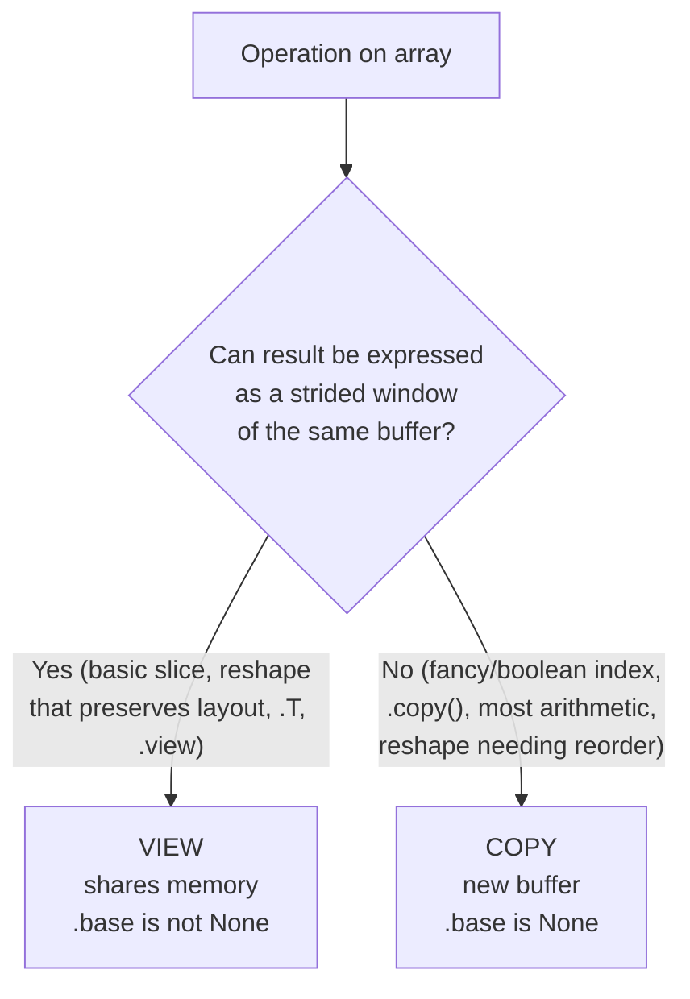
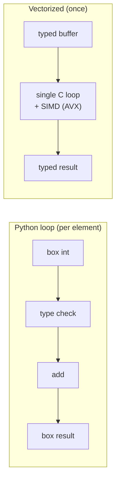
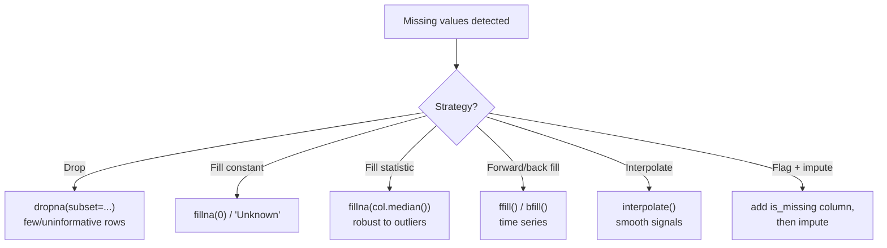
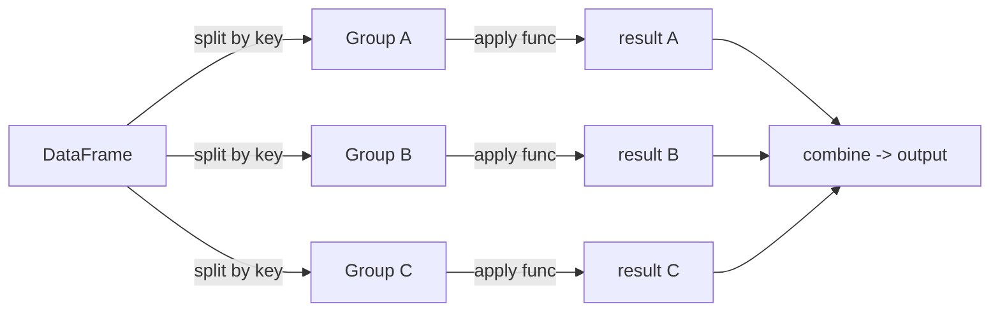
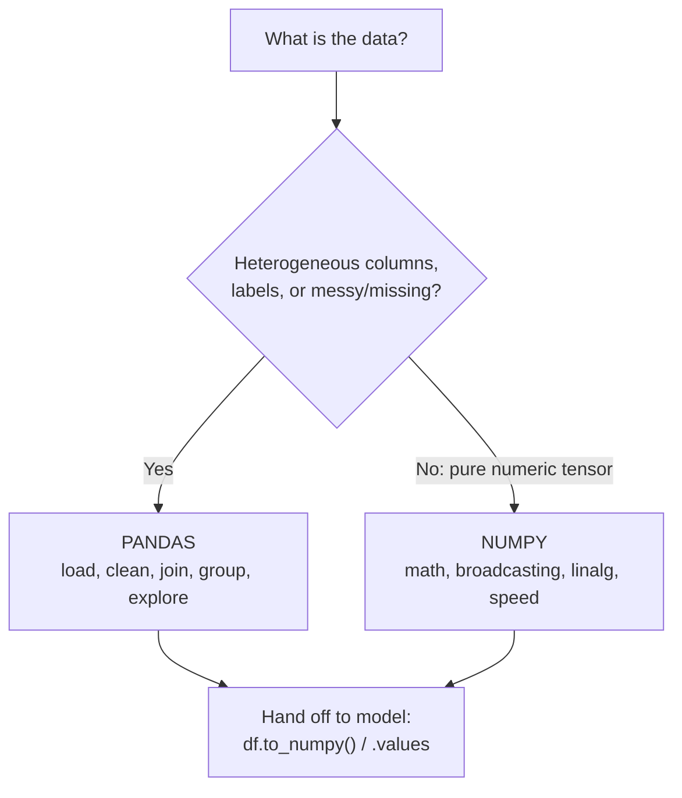

# NumPy, Pandas & Data Manipulation for AI
*The two libraries every AI/ML workflow rests on — vectorized arrays and labeled tables, from internals to idioms.*

*Part of the AI Engineering & ML Mastery Path — see the [index](../README.md) and [study plan](../MASTER-STUDY-PLAN.md).*

Before a single model trains, the data must be **loaded, cleaned, reshaped, joined, aggregated and fed as dense numeric tensors**. NumPy is the engine that makes Python numerics fast; Pandas is the labeled-data layer that makes real-world (messy, missing, heterogeneous) data tractable. Roughly 70–80% of practical ML work is data wrangling — this document makes you fluent and fast at it, and gives you the mental model of *why* the fast paths are fast.

> 💡 **Intuition:** NumPy is a contiguous block of bytes with a tiny header describing how to walk it. Pandas is NumPy arrays plus *labels* (an index and column names) plus alignment logic. Once you see both as "metadata over a buffer," the performance and the surprises both make sense.

---

## 🎯 Learning Objectives

By the end of this document you can:

- Explain the **ndarray memory model** — `dtype`, `shape`, `strides`, C- vs F-contiguity — and predict when an operation returns a **view** vs a **copy**.
- Index NumPy arrays with **basic slicing, fancy (integer) indexing and boolean masks**, and state which produce views.
- Apply the **broadcasting rules** by hand and read a shape-mismatch error.
- Replace Python loops with **vectorized ufuncs** and *measure* the speedup.
- Reason about **axis semantics** in aggregations and reshaping/stacking/splitting.
- Use `np.linalg` and the modern **`np.random.Generator`** API correctly.
- Build and manipulate **Series / DataFrame**, exploit **index alignment**, and select with `loc`/`iloc`/boolean masks.
- Shrink memory with **dtypes and `category`**; handle **missing data** deliberately.
- Master **`groupby` (agg / transform / apply)**, **merge/join** (every `how=`), **concat**, **pivot/melt/stack** and **MultiIndex**.
- Do **time-series** work (`resample`, `rolling`, timezones) and **read large files** efficiently (`chunksize`, `dtype`, `usecols`, Parquet).
- Write clean **method-chained** pipelines with `.pipe()`, and decide **"to NumPy or to Pandas?"**.

## 📋 Prerequisites

- [01-python-foundations.md](01-python-foundations.md) — functions, comprehensions, iterables, basic typing.
- Comfort with the terminal and `pip install numpy pandas pyarrow`.
- High-school linear algebra helps for `np.linalg` (vectors, matrices, dot product).

## 📑 Table of Contents

- [1. The NumPy ndarray: Internals](#1-the-numpy-ndarray-internals)
- [2. Creating Arrays](#2-creating-arrays)
- [3. Indexing, Slicing, Fancy & Boolean](#3-indexing-slicing-fancy--boolean)
- [4. Broadcasting](#4-broadcasting)
- [5. Vectorization vs Loops (Timed)](#5-vectorization-vs-loops-timed)
- [6. ufuncs, Aggregation & Axis Semantics](#6-ufuncs-aggregation--axis-semantics)
- [7. Reshaping, Stacking & Splitting](#7-reshaping-stacking--splitting)
- [8. Linear Algebra & the Random Generator API](#8-linear-algebra--the-random-generator-api)
- [9. Structured Arrays & Memory Tips](#9-structured-arrays--memory-tips)
- [10. The Pandas Data Model: Series & DataFrame](#10-the-pandas-data-model-series--dataframe)
- [11. Selection: loc / iloc / boolean](#11-selection-loc--iloc--boolean)
- [12. dtypes, Categoricals & Missing Data](#12-dtypes-categoricals--missing-data)
- [13. groupby: agg / transform / apply](#13-groupby-agg--transform--apply)
- [14. Combining Data: merge, join, concat](#14-combining-data-merge-join-concat)
- [15. Reshaping Tables: pivot / melt / stack & MultiIndex](#15-reshaping-tables-pivot--melt--stack--multiindex)
- [16. Time Series](#16-time-series)
- [17. Reading Big Files Efficiently](#17-reading-big-files-efficiently)
- [18. Method Chaining & .pipe()](#18-method-chaining--pipe)
- [19. To NumPy or to Pandas?](#19-to-numpy-or-to-pandas)
- [🧮 From-Scratch Implementation](#-from-scratch-implementation)
- [❓ Knowledge Check](#-knowledge-check)
- [🏋️ Exercises](#️-exercises)
- [📊 Cheat Sheet](#-cheat-sheet)
- [🔗 Further Resources](#-further-resources)
- [➡️ What's Next](#️-whats-next)

---

## 1. The NumPy ndarray: Internals

> 💡 **Intuition:** An ndarray is **one flat buffer of bytes** plus a small header. The header says: what type each element is (`dtype`), the logical grid shape (`shape`), and how many **bytes to step** to move one index along each axis (`strides`). Different "views" of the same buffer are just different headers.

**Formal model.** For an array $A$ with shape $(d_0, d_1, \dots, d_{n-1})$ and strides $(s_0, s_1, \dots, s_{n-1})$ in bytes, the byte offset of element $A[i_0, i_1, \dots, i_{n-1}]$ from the buffer start is

$$\text{offset}(i_0,\dots,i_{n-1}) = \sum_{k=0}^{n-1} i_k \, s_k.$$

For a **C-contiguous** (row-major) array, the stride of axis $k$ is the product of the sizes of all axes after it times the item size $b$:

$$s_k = b \prod_{j=k+1}^{n-1} d_j.$$

**Worked example by hand.** Take a `float64` (`itemsize` $b = 8$ bytes) array of shape $(2, 3)$, C-contiguous:

```
buffer (bytes):  [ a00 | a01 | a02 | a10 | a11 | a12 ]
element index :    0     1     2     3     4     5

shape   = (2, 3)
strides = (3*8, 1*8) = (24, 8)   # bytes to step one row, one column

offset(1, 2) = 1*24 + 2*8 = 40 bytes  ->  element #5  (a12)  ✓
```

```python
import numpy as np

a = np.arange(6, dtype=np.float64).reshape(2, 3)
print(a.dtype, a.shape, a.strides)   # float64 (2, 3) (24, 8)
print(a.flags['C_CONTIGUOUS'])       # True

t = a.T                              # transpose = new header, SAME buffer
print(t.shape, t.strides)            # (3, 2) (8, 24)   <- strides swapped
print(t.flags['C_CONTIGUOUS'],
      t.flags['F_CONTIGUOUS'])       # False True
print(t.base is a)                   # True  -> t is a VIEW of a
```

> 🎯 **Key Insight:** A **transpose costs nothing** — NumPy just swaps the strides. No data moves. Many "reshaping" operations are pure metadata changes; that is why they are instant even on huge arrays.

### View vs Copy

A **view** shares the buffer (mutating one mutates the other). A **copy** owns new memory.



```python
base = np.arange(10)
sl = base[2:6]          # basic slice -> VIEW
sl[0] = 999
print(base[2])          # 999  <- writing through the view changed base

fancy = base[[2, 3, 4]] # fancy index -> COPY
fancy[0] = -1
print(base[2])          # 999  <- base unchanged

print(np.shares_memory(base, sl))     # True
print(np.shares_memory(base, fancy))  # False
```

> ⚠️ **Common Pitfall:** Assuming a slice is a copy. `col = arr[:, 0]; col *= 2` will silently scale the original column. When you need independence, call `.copy()` explicitly. Conversely, gratuitous `.copy()` wastes memory and time on large arrays.

**Why it matters for AI/ML:** Mini-batch slicing, sliding-window features, and image patch extraction all rely on views to avoid copying gigabytes. Knowing the contiguity rules lets you keep tensors in the cache-friendly layout that frameworks (and BLAS) want — a misaligned stride fed to a BLAS routine forces a silent copy.

---

## 2. Creating Arrays

| Constructor | Produces |
|---|---|
| `np.array([[1,2],[3,4]])` | array from a (nested) Python sequence |
| `np.zeros((2,3))` / `np.ones(...)` / `np.full(shape, v)` | constant-filled |
| `np.empty((2,3))` | **uninitialized** (garbage values — fast) |
| `np.arange(start, stop, step)` | range-like (float step is fragile) |
| `np.linspace(0, 1, 5)` | 5 evenly spaced points **inclusive** of endpoints |
| `np.eye(3)` / `np.identity(3)` | identity matrix |
| `np.zeros_like(a)` / `np.ones_like(a)` | same shape & dtype as `a` |
| `rng.random((2,3))` | random (see §8) |

```python
import numpy as np
print(np.linspace(0, 1, 5))   # [0.   0.25 0.5  0.75 1.  ]  -> 5 points, both ends
print(np.arange(0, 1, 0.25))  # [0.   0.25 0.5  0.75]       -> stop EXCLUDED
print(np.full((2, 2), 7))     # [[7 7]
                              #  [7 7]]
```

> 📝 **Tip:** Prefer `np.linspace` over `np.arange` for fractional steps — floating-point accumulation in `arange` can drop or add a final element unpredictably. Set `dtype` at creation (`np.zeros(n, dtype=np.float32)`) to avoid a later copy.

---

## 3. Indexing, Slicing, Fancy & Boolean

There are three indexing flavors. Knowing which returns a view is half the battle.

| Flavor | Example | Returns |
|---|---|---|
| **Basic slicing** | `a[1:3, ::2]` | **view** |
| **Fancy (integer array)** | `a[[0,2,2], [1,0,3]]` | **copy** |
| **Boolean mask** | `a[a > 0]` | **copy** (1-D, flattened by row order) |

```python
import numpy as np
a = np.arange(1, 13).reshape(3, 4)
# [[ 1  2  3  4]
#  [ 5  6  7  8]
#  [ 9 10 11 12]]

print(a[1, 2])          # 7            single element
print(a[:, 1])          # [ 2  6 10]   column 1 (view)
print(a[a % 2 == 0])    # [ 2  4  6  8 10 12]  boolean mask -> 1-D copy

# Fancy indexing picks elements (0,0), (1,2), (2,3):
rows = [0, 1, 2]; cols = [0, 2, 3]
print(a[rows, cols])    # [ 1  7 12]

# np.where -- vectorized conditional (no copy of the loop into Python):
print(np.where(a > 6, a, 0))
# [[0 0 0 0]
#  [0 0 7 8]
#  [9 10 11 12]]

# Assign through a boolean mask (in place):
a[a > 6] = 0
print(a)
# [[1 2 3 4]
#  [5 6 0 0]
#  [0 0 0 0]]
```

> ⚠️ **Common Pitfall:** `a[1:3][0:1]` (chained basic slices) is fine and stays a view, but `a[mask][0] = 5` does **not** write back — `a[mask]` is a copy, so you mutate a throwaway. Use a single indexing expression: `a[mask] = 5`.

> 💡 **Intuition:** Fancy/boolean indexing can pull arbitrary, non-contiguous elements, which cannot be described by uniform strides — so NumPy must materialize a fresh contiguous copy.

**Why it matters for AI/ML:** Boolean masks implement filtering (`X[y == 1]` = all positive-class rows). Fancy indexing implements **gather** ops (embedding lookups, shuffling, `X[shuffle_idx]`).

---

## 4. Broadcasting

**Broadcasting** lets NumPy operate on arrays of different shapes *without copying* by virtually stretching size-1 axes.

> 🎯 **Key Insight — the rules.** Align shapes on the **right**. Working from the trailing axis inward, for each axis the two dimensions must be **equal**, or one of them must be **1** (the 1 stretches to match). A missing leading axis is treated as 1. If neither dimension is 1 and they differ, NumPy raises a `ValueError`.

ASCII shape diagrams:

```
Case A: (3, 4) + (4,)            Case B: (3, 1) + (1, 4)
  (3, 4)                            (3, 1)
     (4,)  -> pad to (1, 4)         (1, 4)
  -------                           -------
  (3, 4)   OK (1 stretches -> 3)    (3, 4)   OK (both 1-axes stretch)

Case C (FAILS): (3, 4) + (3,)
  (3, 4)
     (3,)  -> pad to (1, 3)
  -------
   4 vs 3  -> ValueError: not broadcastable
```

```python
import numpy as np
A = np.arange(12).reshape(3, 4)
row = np.array([10, 20, 30, 40])          # shape (4,)
print(A + row)        # row added to every row of A
# [[10 21 32 43]
#  [14 25 36 47]
#  [18 29 40 51]]

col = np.array([[100], [200], [300]])     # shape (3, 1)
print(A + col)        # col added to every column
# [[100 101 102 103]
#  [204 205 206 207]
#  [308 309 310 311]]

# Outer product via broadcasting:
x = np.arange(3).reshape(3, 1)   # (3,1)
y = np.arange(4).reshape(1, 4)   # (1,4)
print((x * y).shape)             # (3, 4)
```

A classic AI use — **standardizing features** (subtract per-column mean, divide by per-column std):

$$z_{ij} = \frac{x_{ij} - \mu_j}{\sigma_j}, \qquad \mu_j = \frac{1}{n}\sum_{i=1}^{n} x_{ij}.$$

```python
X = np.array([[1., 2.], [3., 4.], [5., 6.]])   # (3, 2)
mu = X.mean(axis=0)        # (2,)  per-column mean -> broadcasts
sigma = X.std(axis=0)      # (2,)
Z = (X - mu) / sigma
print(Z.mean(axis=0).round(6))   # [ 0. -0.]  ~zero mean
print(Z.std(axis=0).round(6))    # [1. 1.]    unit variance
```

> ⚠️ **Common Pitfall:** To subtract a *row* mean from a 2-D array, `X - X.mean(axis=1)` fails (shapes `(3,2)` vs `(3,)`). Use `keepdims`: `X - X.mean(axis=1, keepdims=True)` keeps shape `(3,1)` which broadcasts correctly.

**Why it matters for AI/ML:** Broadcasting *is* how bias vectors add to activations, how normalization works, and how attention scores get scaled — all without allocating the stretched array.

---

## 5. Vectorization vs Loops (Timed)

> 💡 **Intuition:** A Python `for` loop pays interpreter overhead **per element** (type checks, object boxing). A vectorized NumPy call dispatches **once** into a compiled C loop over a typed buffer. The difference is typically **10×–100×**.

```python
import numpy as np, timeit

n = 1_000_000
a = np.random.rand(n)
b = np.random.rand(n)

def py_loop():
    return [a[i] + b[i] for i in range(n)]

def vectorized():
    return a + b

t_loop = timeit.timeit(py_loop, number=3) / 3
t_vec  = timeit.timeit(vectorized, number=3) / 3
print(f"loop:       {t_loop*1e3:8.2f} ms")    # e.g. loop:       ~250.00 ms
print(f"vectorized: {t_vec*1e3:8.2f} ms")     # e.g. vectorized:   ~1.50 ms
print(f"speedup:    {t_loop/t_vec:8.1f}x")    # e.g. speedup:    ~160.0x
```

(Exact numbers vary by machine; the **order of magnitude** is the point.)



> 🎯 **Key Insight:** "Vectorize" means *push the loop into C*. If you find yourself writing `for i in range(len(arr))`, ask: can this be a ufunc, a broadcast, a boolean mask, or a `np.where`?

> ⚠️ **Common Pitfall:** `np.vectorize` is **not** a speed tool — it's a convenience wrapper that still loops in Python. It does not give the C-loop speedup.

**Why it matters for AI/ML:** Training loops touch millions of values per step; CPUs run SIMD instructions (e.g. AVX) that process 8 floats at once inside the C loop. Vectorization is the difference between a model that trains in minutes and one that takes hours.

---

## 6. ufuncs, Aggregation & Axis Semantics

**ufuncs** (universal functions) are element-wise compiled operations: `np.exp`, `np.sqrt`, `np.maximum`, `+`, `*`, etc. They support broadcasting, an optional `out=` to write in place, and methods like `.reduce`, `.accumulate`, `.outer`.

```python
import numpy as np
x = np.array([-1., 0., 2.])
print(np.exp(x).round(3))       # [0.368 1.    7.389]
relu = np.maximum(x, 0)         # element-wise max with 0 -> ReLU!
print(relu)                     # [0. 0. 2.]

print(np.add.reduce([1, 2, 3, 4]))      # 10        (= sum)
print(np.add.accumulate([1, 2, 3, 4]))  # [1 3 6 10] (= cumsum)
print(np.multiply.outer([1, 2, 3], [10, 20]))
# [[10 20]
#  [20 40]
#  [30 60]]
```

### Axis semantics — the rule that trips everyone

> 🎯 **Key Insight:** `axis=k` means **"collapse axis k"** — the result loses that dimension. `axis=0` collapses *down rows* (per-column result); `axis=1` collapses *across columns* (per-row result).

```
A = [[1, 2, 3],          axis=0  (collapse rows, go DOWN columns):
     [4, 5, 6]]              sum -> [1+4, 2+5, 3+6] = [5, 7, 9]   shape (3,)

                          axis=1  (collapse cols, go ACROSS rows):
                              sum -> [1+2+3, 4+5+6] = [6, 15]     shape (2,)
```

```python
A = np.array([[1, 2, 3], [4, 5, 6]])
print(A.sum())                    # 21          all elements
print(A.sum(axis=0))              # [5 7 9]     per column
print(A.sum(axis=1))              # [ 6 15]     per row
print(A.sum(axis=1, keepdims=True))
# [[ 6]
#  [15]]                          # keeps the axis as size 1 (broadcast-friendly)
print(A.argmax(axis=1))           # [2 2]       index of max in each row
```

Common reducers: `sum, mean, std, var, min, max, prod, argmin, argmax, any, all, cumsum, cumprod`. NaN-aware versions exist: `np.nanmean`, `np.nansum`, etc.

> ⚠️ **Common Pitfall:** "Does `axis=0` mean rows or columns?" Don't memorize "rows/columns" — memorize **"the axis that disappears."** `sum(axis=0)` on shape `(2,3)` returns shape `(3,)`: axis 0 vanished.

**Why it matters for AI/ML:** Loss reductions (`loss.mean(axis=0)` over a batch), softmax (`exp / exp.sum(axis=-1, keepdims=True)`), and class predictions (`logits.argmax(axis=1)`) are all axis-aware aggregations.

---

## 7. Reshaping, Stacking & Splitting

```python
import numpy as np
a = np.arange(12)
print(a.reshape(3, 4))          # 3x4 view if layout allows
print(a.reshape(3, -1).shape)   # (3, 4)  -1 = "infer this axis"
print(a.reshape(2, 6).ravel().shape)  # (12,)  ravel -> 1-D (view if possible)

m = a.reshape(3, 4)
print(m[:, None].shape)         # (3, 1, 4)  None/np.newaxis inserts an axis
print(np.expand_dims(m, 0).shape)  # (1, 3, 4)
print(m.flatten().base)         # None  -> flatten ALWAYS copies (ravel may not)
```

**Stacking and splitting:**

```python
x = np.array([1, 2, 3]); y = np.array([4, 5, 6])
print(np.vstack([x, y]))     # stack as rows -> shape (2, 3)
print(np.hstack([x, y]))     # concatenate   -> shape (6,)
print(np.stack([x, y], axis=1))   # new axis -> shape (3, 2)
print(np.concatenate([x, y]))     # along existing axis 0

big = np.arange(12).reshape(3, 4)
left, right = np.hsplit(big, 2)   # split columns into 2 halves -> (3,2),(3,2)
print(left.shape, right.shape)
```

| Function | Action |
|---|---|
| `reshape` | change shape (view if possible) |
| `ravel` / `flatten` | to 1-D (`ravel` view-if-possible; `flatten` always copies) |
| `np.newaxis` / `None` | insert a length-1 axis |
| `concatenate` | join along an **existing** axis |
| `stack` | join along a **new** axis |
| `vstack` / `hstack` / `dstack` | shortcut stacks (axis 0 / 1 / 2) |
| `split` / `hsplit` / `vsplit` | inverse of concatenate/stack |

> ⚠️ **Common Pitfall:** `reshape` can fail to return a view if the requested layout would require reordering bytes (e.g., reshaping a transposed array, or `order='F'` on a C-contiguous array). It then silently copies. Check `result.base` if you depend on a view.

**Why it matters for AI/ML:** Adding the batch axis (`x[None, ...]`), flattening conv feature maps before a dense layer, and assembling batches with `np.stack` are everyday operations.

---

## 8. Linear Algebra & the Random Generator API

Linear algebra is the backbone of neural nets (matrix multiplications), PCA (eigendecomposition / SVD), and least-squares fitting.

```python
import numpy as np
A = np.array([[2., 1.], [1., 3.]])
b = np.array([1., 2.])

print(A @ b)                       # matrix-vector product -> [4. 7.]
print(np.linalg.solve(A, b))       # solve Ax=b (better than inv!) -> [0.2 0.6]
print(np.linalg.inv(A).round(3))   # inverse (avoid for solving systems)
print(np.linalg.det(A))            # determinant -> 5.0
vals, vecs = np.linalg.eig(A)      # eigenvalues / eigenvectors
print(np.linalg.norm(b))           # L2 norm -> 2.2360679...
U, S, Vt = np.linalg.svd(A)        # singular value decomposition (PCA, recsys)
print(np.linalg.matrix_rank(A))    # 2
```

> 📝 **Tip:** To solve $Ax = b$, use `np.linalg.solve(A, b)`, **not** `np.linalg.inv(A) @ b`. Both are $O(n^3)$, but `solve` factorizes directly (smaller constant) and is numerically more stable — explicitly inverting amplifies round-off, and you rarely need the inverse itself.

### The modern random API

> ⚠️ **Common Pitfall:** Legacy `np.random.seed(0)` + `np.random.rand(...)` uses a **global** mutable state — hard to reason about, not thread-safe, and any library call can pollute it. Use the **`Generator`** API.

```python
import numpy as np
rng = np.random.default_rng(seed=42)     # explicit, isolated generator (PCG64)

print(rng.random(3).round(3))             # uniform [0,1)
print(rng.normal(loc=0, scale=1, size=3).round(3))  # Gaussian
print(rng.integers(0, 10, size=5))        # ints in [0, 10)
print(rng.choice([10, 20, 30], size=4, replace=True))
arr = np.arange(5); rng.shuffle(arr)      # in-place shuffle
print(arr)
```

Reproducibility: same seed -> same stream. Pass an explicit `rng` into functions instead of relying on the global state.

**Why it matters for AI/ML:** Weight initialization, dropout masks, train/test splits, data augmentation and bootstrapping all need *controlled* randomness. A per-experiment `Generator` makes results reproducible and parallel-safe.

---

## 9. Structured Arrays & Memory Tips

A **structured array** gives each element named, typed fields — a lightweight record table without Pandas.

```python
import numpy as np
dt = np.dtype([('name', 'U10'), ('age', 'i4'), ('score', 'f8')])
people = np.array([('Ada', 36, 9.5), ('Linus', 54, 8.8)], dtype=dt)
print(people['name'])        # ['Ada' 'Linus']
print(people['age'].mean())  # 45.0
```

**Memory tips:**

- **Downcast dtypes:** `float64 -> float32` halves memory; `int64 -> int8/int16` when the range allows. ML rarely needs `float64` for features.
- **`itemsize` × number of elements = bytes.** Check `arr.nbytes`.
- Use `out=` on ufuncs and in-place operators (`a += b`) to avoid temporaries.
- `np.memmap` reads arrays larger than RAM from disk lazily.

```python
big = np.ones((1000, 1000), dtype=np.float64)
print(big.nbytes / 1e6, "MB")                      # 8.0 MB
print(big.astype(np.float32).nbytes / 1e6, "MB")   # 4.0 MB
```

> 🎯 **Key Insight:** Memory layout and dtype are *performance levers*. Halving the dtype can double cache efficiency and throughput — and lets a dataset that didn't fit in RAM suddenly fit.

---

## 10. The Pandas Data Model: Series & DataFrame

> 💡 **Intuition:** A **Series** = a 1-D NumPy array **+ an index** (labels). A **DataFrame** = a dict of Series sharing one row index, i.e. a table whose columns can each have a different dtype.

ASCII DataFrame anatomy:

```
            columns ------------------>
          ┌─────────┬───────┬──────────┐
   index  │  name   │  age  │  score   │   <- column labels
    │  0  │  Ada    │   36  │   9.5    │
    │  1  │  Linus  │   54  │   8.8    │
    ▼  2  │  Grace  │   85  │   9.9    │
          └─────────┴───────┴──────────┘
            ^ each column is a Series (own dtype)
   the row index (0,1,2) aligns all columns
```

```python
import pandas as pd
s = pd.Series([10, 20, 30], index=['a', 'b', 'c'], name='vals')
print(s['b'])          # 20  -> label lookup
print(s.iloc[1])       # 20  -> positional lookup

df = pd.DataFrame({
    'name':  ['Ada', 'Linus', 'Grace'],
    'age':   [36, 54, 85],
    'score': [9.5, 8.8, 9.9],
})
print(df.dtypes)
# name      object
# age        int64
# score    float64
print(df.shape)        # (3, 3)
print(df['age'].to_numpy())   # [36 54 85]  -> underlying NumPy array
```

### Index alignment — Pandas' superpower (and surprise)

```python
a = pd.Series([1, 2, 3], index=['x', 'y', 'z'])
b = pd.Series([10, 20, 30], index=['y', 'z', 'w'])
print(a + b)
# w     NaN     <- 'w' only in b
# x     NaN     <- 'x' only in a
# y    12.0     <- aligned: 2 + 10
# z    23.0     <- aligned: 3 + 20
# dtype: float64
```

> 🎯 **Key Insight:** Pandas arithmetic aligns on **labels**, not position. Mismatched labels become `NaN`. This is wonderful (you can add tables with different orderings) and dangerous (silent `NaN`s) — always know your indexes.

**Why it matters for AI/ML:** Joining a features table to a labels table by ID, aligning time-indexed signals, and reindexing to a common schema all depend on label alignment.

---

## 11. Selection: loc / iloc / boolean

| Selector | Indexed by | Example |
|---|---|---|
| `.loc` | **labels** (inclusive of end) | `df.loc[2, 'age']`, `df.loc[df.age > 40, ['name']]` |
| `.iloc` | **integer position** (end-exclusive) | `df.iloc[0:2, 1]` |
| `[]` on columns | column label(s) | `df['age']`, `df[['name','age']]` |
| boolean mask | a Series of bools | `df[df.age > 40]` |
| `.at` / `.iat` | single cell (fast) | `df.at[2, 'age']`, `df.iat[2, 1]` |

```python
import pandas as pd
df = pd.DataFrame({'name':['Ada','Linus','Grace'],
                   'age':[36,54,85], 'score':[9.5,8.8,9.9]})

print(df.loc[0, 'name'])               # Ada
print(df.iloc[0, 0])                   # Ada (position)
print(df.loc[df['age'] > 40, ['name', 'age']])
#     name  age
# 1  Linus   54
# 2  Grace   85

# Combine conditions with & | ~  (parentheses REQUIRED):
mask = (df['age'] > 40) & (df['score'] > 9.0)
print(df[mask])
#     name  age  score
# 2  Grace   85    9.9

# .query() -- SQL-like, often more readable for complex filters:
print(df.query('age > 40 and score > 9.0'))
```

> ⚠️ **Common Pitfall:** `.loc` slices are **inclusive** of the end label (`df.loc[0:2]` returns rows 0,1,2) while `.iloc` is exclusive (`df.iloc[0:2]` returns rows 0,1). And you **must** parenthesize boolean conditions: `df[df.a > 1 & df.b < 2]` misparses due to `&` precedence — write `df[(df.a > 1) & (df.b < 2)]`.

> 📝 **Tip:** Avoid chained assignment `df[df.a > 1]['b'] = 0` (the `SettingWithCopyWarning`). Use a single `.loc`: `df.loc[df.a > 1, 'b'] = 0`.

---

## 12. dtypes, Categoricals & Missing Data

### Categoricals for memory

When a string column has few distinct values repeated many times, `category` dtype stores integer codes + a small lookup table.

```python
import pandas as pd, numpy as np
n = 1_000_000
s = pd.Series(np.random.choice(['red', 'green', 'blue'], n))
print(s.memory_usage(deep=True) / 1e6, "MB (object)")     # ~58 MB
c = s.astype('category')
print(c.memory_usage(deep=True) / 1e6, "MB (category)")   # ~1 MB
```

Other memory levers: `pd.to_numeric(col, downcast='integer'/'float')`, and nullable integer dtype `'Int32'` (capital I) which supports NaN without upcasting to float64.

> 🎯 **Key Insight:** `category` can cut memory by **10×–50×** on low-cardinality string columns and speeds up `groupby`. Check cardinality first: `s.nunique() / len(s)` — only categorize when it is small (say < 10%).

### Missing data

Pandas uses `NaN` (float) / `NaT` (datetime) / `<NA>` (nullable dtypes) for missing values.



```python
df = pd.DataFrame({'a': [1.0, np.nan, 3.0], 'b': ['x', None, 'z']})
print(df.isna().sum())                     # count missing per column
print(df['a'].fillna(df['a'].median()))    # impute with median
print(df.dropna())                         # drop rows with any NaN
df['a_missing'] = df['a'].isna()           # keep a flag BEFORE imputing
```

> ⚠️ **Common Pitfall:** Imputing the mean/median *before* splitting train/test leaks information from test into train. Compute the statistic on **train only**, then apply to both. Also: `np.nan == np.nan` is `False` — always test with `.isna()`, never `== np.nan`.

**Why it matters for AI/ML:** Most models reject `NaN`. How you handle missingness (drop, impute, flag) is a modeling decision that affects bias and performance — and missingness itself is often a useful feature.

---

## 13. groupby: agg / transform / apply

> 💡 **Intuition:** `groupby` follows **split → apply → combine**: split rows into groups by a key, apply a function per group, recombine the results.



The three apply modes differ in **output shape**:

| Method | Returns | Use for |
|---|---|---|
| `agg` | one row **per group** (reduced) | summaries: totals, means |
| `transform` | **same shape** as input (broadcast back) | group-relative features (z-score within group) |
| `apply` | anything (flexible, slowest) | arbitrary per-group logic |

```python
import pandas as pd
df = pd.DataFrame({
    'dept':   ['eng','eng','sales','sales','sales'],
    'salary': [100, 120, 60, 80, 70],
})

# agg: one row per group, named aggregations -> clean column names
print(df.groupby('dept').agg(avg_sal=('salary','mean'),
                             max_sal=('salary','max'),
                             headcount=('salary','size')))
#        avg_sal  max_sal  headcount
# dept
# eng      110.0      120          2
# sales     70.0       80          3

# transform: same length -> attach group mean to each row
df['dept_mean'] = df.groupby('dept')['salary'].transform('mean')
df['vs_mean']   = df['salary'] - df['dept_mean']
print(df)
#     dept  salary  dept_mean  vs_mean
# 0    eng     100      110.0    -10.0
# 1    eng     120      110.0     10.0
# 2  sales      60       70.0    -10.0
# ...
```

> 🎯 **Key Insight:** Reach for `transform` whenever you want a **group statistic aligned back to every original row** (a hugely common feature-engineering pattern). Use `agg` for summary tables, and only fall back to `apply` when neither fits.

> ⚠️ **Common Pitfall:** `apply` is flexible but slow and sometimes ambiguous about its return shape. Prefer built-in `agg`/`transform` strings (`'mean'`, `'sum'`) — they run in optimized C.

---

## 14. Combining Data: merge, join, concat

`pd.merge` is Pandas' SQL JOIN. The `how=` parameter chooses which keys survive.

```
left (keys)     right (keys)
   A               A
   B               C
   D               D

inner  -> {A, D}            (keys in BOTH)
left   -> {A, B, D}         (all left; right fills NaN for B)
right  -> {A, C, D}         (all right; left fills NaN for C)
outer  -> {A, B, C, D}      (union; NaN where missing)
```

| `how=` | Keeps | SQL analogy | When |
|---|---|---|---|
| `inner` (default) | keys in **both** | `INNER JOIN` | only matched records |
| `left` | all of **left** + matches | `LEFT OUTER JOIN` | enrich left table |
| `right` | all of **right** + matches | `RIGHT OUTER JOIN` | enrich right table |
| `outer` | **union** of keys | `FULL OUTER JOIN` | keep everything |
| `cross` | Cartesian product | `CROSS JOIN` | all combinations |

```python
import pandas as pd
left  = pd.DataFrame({'id': ['A','B','D'], 'x': [1, 2, 3]})
right = pd.DataFrame({'id': ['A','C','D'], 'y': [10, 20, 30]})

print(pd.merge(left, right, on='id', how='inner'))
#   id  x   y
# 0  A  1  10
# 1  D  3  30

print(pd.merge(left, right, on='id', how='left'))
#   id  x     y
# 0  A  1  10.0
# 1  B  2   NaN     <- no match in right
# 2  D  3  30.0

# Validate the relationship + see where rows came from:
m = pd.merge(left, right, on='id', how='outer',
             indicator=True, validate='one_to_one')
print(m['_merge'].value_counts())
```

**`concat`** stacks frames (rows with `axis=0`, columns with `axis=1`) — alignment is by index, not by a key column:

```python
a = pd.DataFrame({'x': [1, 2]})
b = pd.DataFrame({'x': [3, 4]})
print(pd.concat([a, b], ignore_index=True))   # stack rows -> 0,1,2,3
```

> ⚠️ **Common Pitfall:** A `many-to-many` key produces a row explosion (every left match × every right match). Pass `validate='one_to_one'`/`'one_to_many'` to make Pandas **assert** the cardinality you expect and fail loudly otherwise. Also use `indicator=True` to audit unmatched rows.

> 📝 **Tip:** `df.join()` is a convenience wrapper around `merge` that joins on the **index** by default. `merge` joins on columns. Pick whichever matches where your keys live.

**Why it matters for AI/ML:** Feature tables almost always live across multiple sources (events, users, products). Correct joins build the model-ready matrix; a wrong `how=` silently drops training rows.

---

## 15. Reshaping Tables: pivot / melt / stack & MultiIndex

> 💡 **Intuition:** **Wide** data = one row per entity, many value columns. **Long (tidy)** data = one row per observation, a `variable`/`value` pair. `melt` goes wide→long; `pivot` goes long→wide.

```python
import pandas as pd
wide = pd.DataFrame({'city': ['NY','LA'],
                     'jan': [30, 60], 'feb': [33, 62]})

long = wide.melt(id_vars='city', var_name='month', value_name='temp')
print(long)
#   city month  temp
# 0   NY   jan    30
# 1   LA   jan    60
# 2   NY   feb    33
# 3   LA   feb    62

back = long.pivot(index='city', columns='month', values='temp')
print(back)
# month  feb  jan
# city
# LA      62   60
# NY      33   30

# pivot_table aggregates duplicates (pivot errors on them); supports margins:
print(long.pivot_table(index='city', values='temp', aggfunc='mean'))
```

**MultiIndex** (hierarchical index) — multiple key levels per axis:

```python
mi = long.set_index(['city', 'month'])
print(mi.loc['NY'])             # all months for NY
print(mi.loc[('NY', 'jan')])    # single cell
print(mi.unstack('month'))      # move 'month' level to columns (=pivot)
```

`stack`/`unstack` move levels between rows and columns; `stack` makes it taller, `unstack` makes it wider.

> 📝 **Tip:** "Tidy data" (one observation per row) is the format most plotting and modeling tools expect. When in doubt, `melt` to long, do your work, then `pivot` only for display.

---

## 16. Time Series

```python
import pandas as pd, numpy as np
idx = pd.date_range('2026-01-01', periods=10, freq='D')
ts = pd.Series(np.arange(10), index=idx)

# Resample = groupby over time bins:
print(ts.resample('3D').sum())     # sum every 3 days
# Rolling window (moving average):
print(ts.rolling(window=3).mean())
# Shift / percentage change (lag features, returns):
print(ts.shift(1))
print(ts.pct_change())

# Timezones:
aware = ts.tz_localize('UTC').tz_convert('America/New_York')
print(aware.index[0])              # 2025-12-31 19:00:00-05:00

# Partial-string slicing on a DatetimeIndex:
df = pd.DataFrame({'v': range(10)}, index=idx)
print(df.loc['2026-01-03':'2026-01-05'])   # inclusive date range
```

| Tool | Purpose |
|---|---|
| `pd.to_datetime` | parse strings → timestamps |
| `date_range(freq=...)` | generate regular timestamps |
| `resample('ME').agg(...)` | re-bin to a new frequency (down/up-sample) |
| `rolling(window).mean()` | moving-window statistic (use `'7D'` window on a DatetimeIndex) |
| `ewm(span).mean()` | exponentially weighted window |
| `expanding().max()` | cumulative window |
| `shift(n)` / `pct_change()` | lag features / returns |
| `tz_localize` / `tz_convert` | attach / change timezone |

> ⚠️ **Common Pitfall:** `tz_localize` *attaches* a timezone to naive timestamps (no clock change); `tz_convert` *moves* an already-aware timestamp to another zone (clock changes). Localizing across a DST gap can raise — pass `ambiguous=`/`nonexistent=` to control behavior.

**Why it matters for AI/ML:** Lag features (`shift`), rolling aggregates (`rolling`), and proper resampling are the backbone of forecasting and many fraud/anomaly models. Leaking future information via a wrong shift is a classic, costly bug.

---

## 17. Reading Big Files Efficiently

```python
import pandas as pd

# 1) Read only what you need, with explicit dtypes:
df = pd.read_csv('big.csv',
                 usecols=['id', 'amount', 'category', 'ts'],   # fewer columns
                 dtype={'id': 'int32', 'category': 'category'}, # smaller
                 parse_dates=['ts'])

# 2) Stream in chunks when the file doesn't fit in RAM:
total = 0.0
for chunk in pd.read_csv('big.csv', chunksize=100_000):
    total += chunk['amount'].sum()
print(total)

# 3) Prefer columnar Parquet for repeated reads (typed, compressed, fast):
df.to_parquet('data.parquet', index=False, compression='snappy')   # needs pyarrow
df2 = pd.read_parquet('data.parquet', columns=['id', 'amount'])    # column pruning
```

| Lever | Effect |
|---|---|
| `usecols=` | skip unneeded columns at parse time |
| `dtype=` / `category` | avoid memory-hungry default `int64`/`object` |
| `chunksize=` | iterate in pieces, constant memory |
| `nrows=` | peek at the top while developing |
| **Parquet** | columnar + compressed + dtype-preserving; far faster re-reads than CSV |

> 🎯 **Key Insight:** CSV is a text format with no types — every read re-parses and guesses. **Parquet** stores typed, compressed columns, so re-reads are often 5–50× faster and you can read just the columns you need without scanning the rest.

> 📝 **Tip:** For datasets bigger than memory or many files, look at **Polars** or **Dask** — same ideas, out-of-core/parallel execution. But master Pandas idioms first; they transfer directly.

---

## 18. Method Chaining & .pipe()

> 💡 **Intuition:** Method chaining reads top-to-bottom as a *pipeline*, avoids intermediate variable clutter, and (with `.assign`/`.pipe`) avoids `SettingWithCopyWarning`. `.pipe(fn)` inserts your own function into a chain without breaking the flow.

```python
import pandas as pd, numpy as np

def add_ratio(df, num, den):
    return df.assign(ratio=df[num] / df[den])

result = (
    df
    .dropna(subset=['amount'])
    .query('amount > 0')
    .assign(log_amount=lambda d: np.log1p(d['amount']))
    .pipe(add_ratio, num='amount', den='count')
    .groupby('category', as_index=False)
    .agg(total=('amount', 'sum'), avg_ratio=('ratio', 'mean'))
    .sort_values('total', ascending=False)
)
```

> 📝 **Tip:** Use `lambda d: ...` inside `.assign`/`.query` so each step refers to the **current** (already-transformed) frame, not the original. This keeps chains correct even as earlier steps add/rename columns.

> ⚠️ **Common Pitfall:** Over-chaining hurts debuggability. If a chain breaks, split it and inspect intermediate `.head()`s. Readability > cleverness.

---

## 19. To NumPy or to Pandas?



| Use **NumPy** when… | Use **Pandas** when… |
|---|---|
| Pure numeric, homogeneous arrays | Mixed dtypes / labeled columns |
| Heavy math, linear algebra, broadcasting | Loading, cleaning, joining, grouping |
| Feeding ML frameworks (they want arrays/tensors) | Exploratory analysis, time series, I/O |
| Max speed / minimal overhead | Convenience, alignment, readability |

> 🎯 **Key Insight:** The typical flow is **Pandas in, NumPy out**: wrangle with Pandas, then `df.to_numpy()` (or feed directly to scikit-learn / PyTorch, which accept DataFrames or arrays). Don't do per-element math in Pandas when a NumPy/vectorized op exists.

---

## 🧮 From-Scratch Implementation

A mini "Pandas-like" group-by-mean using only NumPy — to demystify split/apply/combine.

```python
import numpy as np

def groupby_mean(keys, values):
    """Mean of `values` grouped by `keys`, NumPy only.
    Returns (unique_keys, group_means)."""
    keys = np.asarray(keys)
    values = np.asarray(values, dtype=float)

    # 1) unique keys + an integer code per row (the 'split'):
    uniq, codes = np.unique(keys, return_inverse=True)

    # 2) sum values into each group bucket + count rows per group:
    sums   = np.zeros(len(uniq))
    counts = np.zeros(len(uniq))
    np.add.at(sums,   codes, values)   # scatter-add (handles repeats safely)
    np.add.at(counts, codes, 1)

    # 3) combine: per-group mean
    return uniq, sums / counts

k = np.array(['a', 'b', 'a', 'b', 'a'])
v = np.array([1.0, 10.0, 3.0, 20.0, 5.0])
groups, means = groupby_mean(k, v)
print(groups)   # ['a' 'b']
print(means)    # [3. 15.]   a:(1+3+5)/3=3 ; b:(10+20)/2=15
```

> 💡 **Intuition:** `np.unique(..., return_inverse=True)` is the "split" (assign each row a group code); `np.add.at` is a safe **scatter-add** that accumulates even when indices repeat; dividing sums by counts is the "combine." Pandas does the same, with C speed and a friendly API.

A vectorized standardizer (the broadcasting pattern from §4), framework-agnostic:

```python
def standardize(X, eps=1e-8):
    X = np.asarray(X, dtype=float)
    mu = X.mean(axis=0, keepdims=True)
    sd = X.std(axis=0, keepdims=True)
    return (X - mu) / (sd + eps)

print(standardize([[1, 100], [2, 200], [3, 300]]).round(3))
# [[-1.225 -1.225]
#  [ 0.     0.   ]
#  [ 1.225  1.225]]
```

---

## ❓ Knowledge Check

<details><summary>1. What three pieces of metadata fully describe how NumPy walks an ndarray's buffer?</summary>

`dtype` (element type / itemsize), `shape` (logical grid dimensions), and `strides` (bytes to step per axis). Together they map any index tuple to a byte offset: $\text{offset} = \sum_k i_k s_k$. For a `(4,5)` `float64` array (C order) the strides are `(40, 8)`.
</details>

<details><summary>2. Does `a[2:6]` return a view or a copy? What about `a[[2,3,4]]`?</summary>

`a[2:6]` is a **basic slice → view** (shares the buffer; writing through it mutates `a`). `a[[2,3,4]]` is **fancy indexing → copy** (arbitrary elements can't be expressed by uniform strides). Verify with `np.shares_memory(a, result)` or `result.base`.
</details>

<details><summary>3. Are shapes (3, 4) and (3,) broadcastable? How would you fix it to subtract a per-row value?</summary>

No. Right-aligning gives `(3,4)` vs `(_,3)` → 4 vs 3 mismatch → `ValueError`. To subtract a per-row value, reshape the `(3,)` to `(3,1)` (e.g. `v[:, None]` or `X.mean(axis=1, keepdims=True)`), which broadcasts across columns.
</details>

<details><summary>4. Why is `np.vectorize` not a performance optimization?</summary>

It is a convenience wrapper that still executes a **Python-level loop** under the hood. It provides broadcasting/looping ergonomics but not the compiled C-loop speedup of a true ufunc. For speed, use real vectorized ops, ufuncs, broadcasting, or tools like Numba.
</details>

<details><summary>5. On a (2, 3) array, what shape does `.sum(axis=0)` return and why?</summary>

Shape `(3,)`. `axis=0` means "collapse axis 0," so that dimension disappears, leaving the 3 columns. Mnemonic: **the named axis is the one that vanishes.**
</details>

<details><summary>6. Why prefer `np.linalg.solve(A, b)` over `np.linalg.inv(A) @ b`?</summary>

`solve` uses LU factorization directly on the system — faster (smaller constant) and numerically more stable. Explicitly forming the inverse introduces extra round-off and is slower; you almost never actually need the inverse itself.
</details>

<details><summary>7. Two Series have indexes ['x','y'] and ['y','z']. What does adding them produce?</summary>

Label alignment: `x`→NaN (only in first), `z`→NaN (only in second), `y`→sum of the two `y` values. Result dtype becomes float because of the NaNs. Mismatched labels silently become NaN.
</details>

<details><summary>8. Difference between `.loc[0:2]` and `.iloc[0:2]`?</summary>

`.loc` is **label-based and end-inclusive** → rows labeled 0, 1, 2. `.iloc` is **position-based and end-exclusive** → positions 0, 1 only.
</details>

<details><summary>9. When do you use `groupby().transform()` instead of `groupby().agg()`?</summary>

Use `transform` when you need the group statistic **aligned back to every original row** (same length as input) — e.g., subtracting each group's mean, computing within-group z-scores, or filling NaNs with a group mean. `agg` reduces to one row per group.
</details>

<details><summary>10. You merge two tables on `id` with `how='left'`. Some left rows show NaN in the right columns. Why?</summary>

A left join keeps **all** left rows; where no matching `id` exists in the right table, the right columns are filled with NaN. This is expected and is how you detect unmatched records (use `indicator=True` to label each row's origin).
</details>

<details><summary>11. A 1M-row DataFrame has a `country` column with 50 unique values. What dtype change saves the most memory, and why?</summary>

Cast to `category`: `df['country'] = df['country'].astype('category')`. It stores small integer **codes** per row plus one 50-entry lookup table instead of a full Python string per row, cutting memory from tens of MB to ~1 MB and speeding up `groupby`/joins.
</details>

<details><summary>12. What's the difference between `tz_localize` and `tz_convert`?</summary>

`tz_localize` attaches a timezone to **naive** timestamps without shifting the clock (interprets the existing wall-clock time as being in that zone). `tz_convert` takes an already **tz-aware** timestamp and shifts it to a different zone (the displayed clock time changes). Localizing across DST transitions may require `ambiguous`/`nonexistent` arguments.
</details>

---

## 🏋️ Exercises

Realistic messy dataset for all exercises:

```python
import pandas as pd, numpy as np

sales = pd.DataFrame({
    'order_id':  [1, 2, 3, 4, 5, 6, 7, 8],
    'customer':  ['ann','BOB','ann ','carol','bob','Ann','dave','carol'],
    'region':    ['NA','EU','NA','EU','EU','NA','APAC','EU'],
    'amount':    [120.0, np.nan, 80.0, 200.0, 50.0, 300.0, np.nan, 90.0],
    'qty':       [2, 1, 1, 4, 1, 3, 2, 1],
    'order_ts':  ['2026-01-03','2026-01-03','2026-01-10','2026-01-11',
                  '2026-01-18','2026-01-20','2026-01-25','2026-02-01'],
})

customers = pd.DataFrame({
    'customer': ['ann','bob','carol','erin'],
    'tier':     ['gold','silver','gold','bronze'],
})
```

<details><summary>Exercise 1 (easy) — Clean the customer column: trim whitespace and lowercase it. How many distinct customers remain?</summary>

```python
sales['customer'] = sales['customer'].str.strip().str.lower()
print(sales['customer'].nunique())          # 4
print(sorted(sales['customer'].unique()))   # ['ann', 'bob', 'carol', 'dave']
```
`'ann '`, `'BOB'`, `'Ann'` all normalize to `ann`/`bob`. String hygiene before any grouping or joining prevents the same entity from splitting into multiple "customers."
</details>

<details><summary>Exercise 2 (easy) — Impute missing `amount` with the median amount, and add a boolean column flagging which rows were imputed.</summary>

```python
sales['amount_missing'] = sales['amount'].isna()
median_amt = sales['amount'].median()          # 105.0
sales['amount'] = sales['amount'].fillna(median_amt)
print(sales[['order_id','amount','amount_missing']].head())
```
Keeping the `amount_missing` flag preserves the *signal* that the value was originally absent — models can learn from missingness itself. (In a real pipeline, compute the median on the training split only to avoid leakage.)
</details>

<details><summary>Exercise 3 (medium) — Parse order_ts to datetime and compute total amount per ISO week using resample.</summary>

```python
sales['order_ts'] = pd.to_datetime(sales['order_ts'])
weekly = (sales.set_index('order_ts')
               .resample('W')['amount']
               .sum())
print(weekly)
# total amount per calendar week (weeks labelled by their Sunday)
```
`resample` is `groupby` over time bins; `'W'` = weekly. Setting the datetime as the index is required for time-based resampling.
</details>

<details><summary>Exercise 4 (medium) — Group by region: total amount, mean qty, and order count, with clean column names, sorted by total.</summary>

```python
summary = (sales.groupby('region')
                .agg(total_amount=('amount', 'sum'),
                     mean_qty=('qty', 'mean'),
                     n_orders=('order_id', 'size'))
                .sort_values('total_amount', ascending=False))
print(summary)
```
Named aggregation (`new=('col','func')`) yields tidy, self-documenting column names instead of a confusing MultiIndex of `(column, function)` pairs.
</details>

<details><summary>Exercise 5 (medium) — Merge sales with the customers table to attach `tier`. Use a left join and report which orders have no matching customer record.</summary>

```python
merged = pd.merge(sales, customers, on='customer',
                  how='left', indicator=True)
unmatched = merged.loc[merged['_merge'] == 'left_only',
                       ['order_id','customer']]
print(unmatched)
#    order_id customer
#       7       dave     <- 'dave' not in customers table
```
A **left** join keeps all sales rows; `dave` has no customer record so `tier` is NaN. `indicator=True` adds a `_merge` column to audit unmatched rows — far safer than silently dropping them with an inner join. (Run after Exercise 1 so the customer keys are normalized.)
</details>

<details><summary>Exercise 6 (hard) — Feature engineering: for each order add (a) the customer's running cumulative spend up to and including that order, and (b) the order's amount as a fraction of its region's total. Do it as a single chain.</summary>

```python
result = (
    sales
    .sort_values(['customer', 'order_ts'])
    .assign(
        cum_spend=lambda d: d.groupby('customer')['amount'].cumsum(),
        region_total=lambda d: d.groupby('region')['amount'].transform('sum'),
    )
    .assign(amount_share=lambda d: d['amount'] / d['region_total'])
    .loc[:, ['order_id','customer','region','amount',
             'cum_spend','amount_share']]
    .sort_values('order_id')
)
print(result)
```
Key ideas: `groupby(...).cumsum()` produces a per-row running total (a leakage-safe lag-style feature when sorted by time); `groupby(...).transform('sum')` broadcasts the **group total back to every row** so we can compute each order's share. The whole thing is one readable chain with `lambda d:` referring to the in-progress frame.
</details>

---

## 📊 Cheat Sheet

**NumPy essentials**

| Task | Code |
|---|---|
| Create | `np.array`, `zeros`, `ones`, `arange`, `linspace`, `eye` |
| Inspect | `a.shape`, `a.dtype`, `a.strides`, `a.nbytes`, `a.base` |
| Reshape | `reshape(-1)`, `ravel`, `flatten`, `a[:, None]`, `expand_dims` |
| Combine | `concatenate`, `stack`, `vstack`, `hstack`, `split` |
| Index | `a[1:3]` (view), `a[[1,3]]` (copy), `a[a>0]` (copy), `np.where` |
| Aggregate | `sum/mean/std(axis=k, keepdims=True)`, `argmax`, `cumsum` |
| Broadcast | right-align; dims must be **equal or 1** |
| Linalg | `A @ B`, `solve`, `inv`, `det`, `eig`, `svd`, `norm` |
| Random | `rng = np.random.default_rng(seed); rng.normal(...)` |
| Speed | vectorize; use ufuncs + `out=`; avoid Python loops & `np.vectorize` |

**Pandas essentials**

| Task | Code |
|---|---|
| Select | `df.loc[mask, cols]`, `df.iloc[i, j]`, `df[['a','b']]`, `df.at[i,c]` |
| Filter | `df[(df.a>1) & (df.b<2)]` (parentheses!) or `df.query('a>1 and b<2')` |
| Missing | `isna()`, `fillna()`, `dropna()`, `ffill()`, `interpolate()` |
| Memory | `astype('category')`, `to_numeric(downcast=...)`, `usecols`, Parquet |
| Group | `df.groupby(k).agg(new=('c','mean'))` / `.transform('mean')` |
| Merge | `pd.merge(l, r, on, how=...)`, `validate=`, `indicator=True` |
| Concat | `pd.concat([a,b], axis=0, ignore_index=True)` |
| Reshape | `melt` (wide→long), `pivot`/`pivot_table` (long→wide), `stack`/`unstack` |
| Time | `to_datetime`, `resample('W')`, `rolling(n)`, `tz_localize/convert` |
| Big files | `read_csv(usecols, dtype, chunksize)`, `read_parquet(columns)` |
| Chain | `df.dropna().query(...).assign(x=lambda d: ...).pipe(fn)` |

**Merge `how=` quick reference**

| how | keeps | SQL |
|---|---|---|
| inner | keys in both | INNER |
| left | all left | LEFT OUTER |
| right | all right | RIGHT OUTER |
| outer | union | FULL OUTER |
| cross | product | CROSS |

---

## 🔗 Further Resources

**Free**

- **NumPy User Guide** — the canonical reference for arrays, broadcasting, ufuncs — https://numpy.org/doc/stable/user/
- **Pandas User Guide** — authoritative coverage of indexing, groupby, merge, time series — https://pandas.pydata.org/docs/user_guide/index.html
- **Python Data Science Handbook (Jake VanderPlas)** — free online, superb NumPy & Pandas chapters with intuition — https://jakevdp.github.io/PythonDataScienceHandbook/
- **Kaggle "Pandas" course** — hands-on, interactive, fast to finish — https://www.kaggle.com/learn/pandas
- **NumPy "Absolute Beginners" tutorial** — gentle on-ramp to the ndarray — https://numpy.org/doc/stable/user/absolute_beginners.html

**Paid (worth it)**

- **"Python for Data Analysis," 3rd ed. — Wes McKinney** (O'Reilly) ★★★★★ — written by Pandas' creator; the definitive book on NumPy + Pandas for real analysis. Best single investment for mastering this stack — https://wesmckinney.com/book/
- **"Effective Pandas" — Matt Harrison** ★★★★☆ — opinionated, chaining-first style that levels up idiomatic Pandas — https://store.metasnake.com/effective-pandas-book

---

## ➡️ What's Next

Continue to [03-visualization-eda.md](03-visualization-eda.md) — turning these cleaned DataFrames into plots and exploratory insight.
