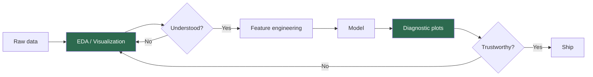
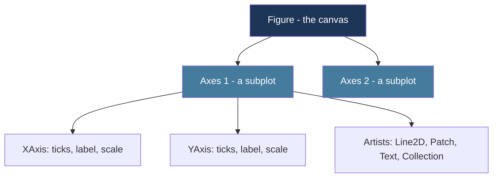
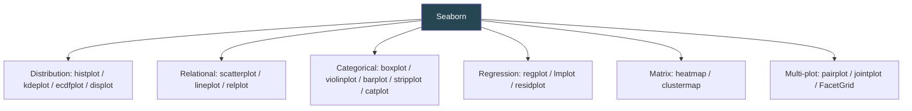
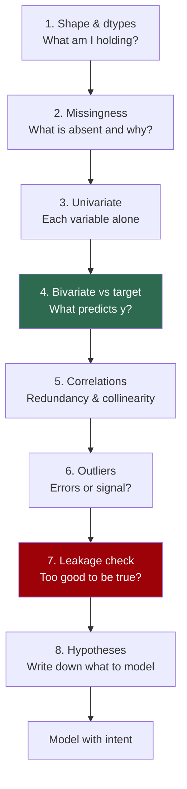
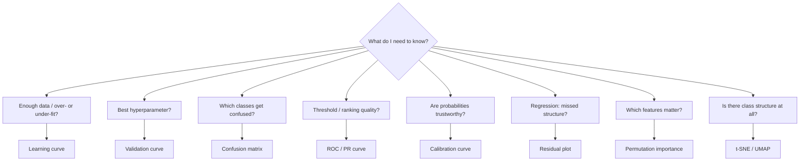

# Data Visualization & Exploratory Data Analysis (EDA) for ML
*Seeing your data before you model it — the discipline that separates lucky models from reliable ones.*

*Part of the AI Engineering & ML Mastery Path — see the [index](../README.md) and [study plan](../MASTER-STUDY-PLAN.md).*

Every catastrophic modeling failure I have ever debugged traced back to something a five-minute plot would have revealed: a leaked feature, a date stored as a string, a target that was 99% one class, a "numeric" column that was secretly categorical. **EDA is not the warm-up act before modeling — it is the part where you earn the right to model at all.** This module teaches you the two libraries that draw nearly every plot in the Python ML world (Matplotlib and Seaborn), enough Plotly for interactive exploration, a *systematic* EDA methodology you can run on any tabular dataset, and the specific diagnostic plots that tell you whether your trained model is trustworthy.

> 💡 **Intuition:** A model is a compression of your data into parameters. If you do not understand the data, you cannot interpret the parameters, diagnose the errors, or trust the predictions. Visualization is the bandwidth-efficient channel between a 100,000-row table and your pattern-matching visual cortex.

---

## 🎯 Learning Objectives

By the end of this module you can:

- **Explain** the Matplotlib Figure/Axes object model and choose the **object-oriented API over `pyplot`** state-machine calls for any non-trivial plot.
- **Build** publication-quality multi-panel figures with subplots, shared axes, annotations, styling, and correct DPI export.
- **Select** the right Seaborn function (distribution / relational / categorical / regression / matrix) for a given question and read its output precisely.
- **Create** interactive Plotly figures for exploration and hover-inspection.
- **Run** a repeatable 8-stage EDA methodology (shape → missingness → univariate → bivariate-vs-target → correlations → outliers → leakage → hypotheses) and write down conclusions.
- **Diagnose** a trained model using learning curves, validation curves, confusion-matrix heatmaps, ROC/PR curves, calibration plots, residual plots, feature importance, and t-SNE/UMAP embeddings — and state what each plot rules in or out.
- **Apply** a reusable EDA checklist and a reusable `quick_eda()` helper to a new dataset in minutes.

---

## 📋 Prerequisites

- [01 — Python Foundations for AI](../aipython/01-python-foundations-for-ai.md) — functions, comprehensions, f-strings.
- [02 — NumPy, Pandas & Data Manipulation](../aipython/02-numpy-pandas-data.md) — `DataFrame`, `groupby`, `dtypes`, missing-data handling. **Hard prerequisite** — every plot here consumes a DataFrame or ndarray.
- Basic descriptive statistics: mean, median, quantile, standard deviation, correlation. We re-define each on first use.

Install once:

```bash
pip install "matplotlib>=3.8" "seaborn>=0.13" "plotly>=5.20" "pandas>=2.1" "scikit-learn>=1.4" "umap-learn>=0.5"
```

---

## 📑 Table of Contents

1. [Why Visualization Matters in ML](#1-why-visualization-matters-in-ml)
2. [Matplotlib — The Foundation](#2-matplotlib--the-foundation)
3. [Seaborn — Statistical Graphics on Top of Matplotlib](#3-seaborn--statistical-graphics-on-top-of-matplotlib)
4. [Plotly — Interactivity for Exploration](#4-plotly--interactivity-for-exploration)
5. [A Systematic EDA Methodology](#5-a-systematic-eda-methodology)
6. [ML-Specific Diagnostic Plots](#6-ml-specific-diagnostic-plots)
7. [From-Scratch Implementation: A Histogram Without Matplotlib's Help](#7--from-scratch-implementation-a-histogram-without-matplotlibs-help)
8. [Knowledge Check](#8--knowledge-check)
9. [Exercises](#9--exercises)
10. [Cheat Sheet](#10--cheat-sheet)
11. [Further Resources](#11--further-resources)
12. [What's Next](#12--whats-next)

---

## 1. Why Visualization Matters in ML

> 💡 **Intuition:** Summary statistics lie by omission. Four datasets can share the *same* mean, variance, correlation, and regression line yet look completely different. Only a plot reveals the difference.

This is **Anscombe's Quartet** — the canonical proof that you must *look* at data, not just summarize it.

```python
import seaborn as sns
import numpy as np

df = sns.load_dataset("anscombe")
print(df.groupby("dataset").agg(
    x_mean=("x", "mean"), y_mean=("y", "mean"),
    x_var=("x", "var"),   y_var=("y", "var"),
    corr=("x", lambda s: np.corrcoef(s, df.loc[s.index, "y"])[0, 1]),
).round(2))
# Expected output — all four datasets are nearly identical numerically:
#          x_mean  y_mean  x_var  y_var  corr
# dataset
# I           9.0    7.50   11.0   4.13  0.82
# II          9.0    7.50   11.0   4.13  0.82
# III         9.0    7.50   11.0   4.12  0.82
# IV          9.0    7.50   11.0   4.12  0.82
```

> 🎯 **Key Insight:** Identical statistics, four totally different shapes — dataset I is a noisy linear trend, II is a clean parabola (a linear model is *wrong* here), III is a perfect line with one outlier dragging the fit, IV is a vertical stack of points at a single $x$ plus one leverage point that defines the entire slope. A linear regression reports `corr = 0.82` for all four and is appropriate for *none* of them except I. **The number told you nothing actionable; the picture told you everything.**

The formal lesson, stated as the workflow every practitioner internalizes:



> ⚠️ **Common Pitfall:** Jumping straight from `pd.read_csv` to `model.fit`. You will eventually ship a model that learned a leaked feature or a data-entry artifact, and you will discover it in production. EDA is cheaper than an incident.

---

## 2. Matplotlib — The Foundation

Matplotlib is the substrate. Seaborn, pandas `.plot()`, and scikit-learn's display utilities all return Matplotlib `Axes` objects, so understanding the object model lets you customize *anything*.

### 2.1 The Figure / Axes Object Model

> 💡 **Intuition:** A **Figure** is the whole canvas (the sheet of paper). An **Axes** is one plot region on it (a single chart with its own x/y axes). One Figure can hold many Axes. Confusingly, an "Axes" is a *plot*, and the lines bordering it are "axis" (`xaxis`, `yaxis`). Never confuse Axes (the plot) with axis (the ruler).



The visual hierarchy, ASCII-style:

```
┌─────────────────────────── Figure ───────────────────────────┐
│  suptitle                                                     │
│  ┌──────── Axes[0] ────────┐   ┌──────── Axes[1] ────────┐    │
│  │ title                   │   │ title                   │    │
│  │  ^ ylabel               │   │  ^ ylabel               │    │
│  │  │   ● ● ●  (Line2D)     │   │  │ ▓▓▓  (Patches/bars)   │    │
│  │  └────────────►  xlabel  │   │  └────────────►  xlabel  │   │
│  └─────────────────────────┘   └─────────────────────────┘    │
└───────────────────────────────────────────────────────────────┘
```

### 2.2 The OO API vs. the `pyplot` State Machine

There are two ways to drive Matplotlib. Know both; **prefer the OO API** for anything you will maintain.

| Aspect | `pyplot` (implicit/state-machine) | Object-Oriented (explicit) |
|---|---|---|
| Entry point | `plt.plot(...)`, `plt.title(...)` | `fig, ax = plt.subplots()`; `ax.plot(...)` |
| "Current" target | Hidden global "current Axes" | Explicit `ax` variable you hold |
| Multiple subplots | Error-prone (`plt.subplot` switching) | Trivial (`axes[0]`, `axes[1]`) |
| Reusable functions | Fragile (depends on global state) | Clean (pass `ax` in) |
| Setter naming | `plt.xlabel`, `plt.title` | `ax.set_xlabel`, `ax.set_title` |
| Recommended for | Quick one-liners in a REPL | **Everything else** |

```python
import matplotlib.pyplot as plt
import numpy as np

x = np.linspace(0, 2 * np.pi, 200)

# --- pyplot style (fine for a throwaway) ---
plt.plot(x, np.sin(x))
plt.title("sin(x)")
plt.show()

# --- OO style (do this in real code) ---
fig, ax = plt.subplots(figsize=(6, 4))     # one Figure, one Axes
ax.plot(x, np.sin(x), label="sin")
ax.plot(x, np.cos(x), label="cos", ls="--")
ax.set_xlabel("x (radians)")
ax.set_ylabel("amplitude")
ax.set_title("Sine and Cosine")
ax.legend()
fig.tight_layout()
fig.savefig("trig.png", dpi=150)           # method on the FIGURE, not ax
```

> 🎯 **Key Insight:** Note the naming asymmetry. `pyplot` uses bare verbs (`plt.xlabel`), the OO API uses `set_`-prefixed setters (`ax.set_xlabel`). When you copy a `plt.title("x")` snippet into a function that takes an `ax`, it becomes `ax.set_title("x")`. Saving is always a **Figure** method: `fig.savefig`.

**Expected appearance of the OO plot:** a single panel ~6×4 inches; a solid blue sine wave and a dashed orange cosine wave both oscillating between −1 and +1 across the x-range 0 to ~6.28; an x-axis labeled "x (radians)", y-axis "amplitude", a title "Sine and Cosine", and a small legend box (default upper-right) distinguishing "sin" from "cos".

### 2.3 Subplots & Layouts

`plt.subplots(nrows, ncols)` returns `(fig, axes)`. With more than one cell, `axes` is a NumPy array.

```python
fig, axes = plt.subplots(2, 2, figsize=(9, 6), sharex=True)
# axes is a 2x2 ndarray of Axes
data = np.random.default_rng(0).standard_normal((4, 1000))
titles = ["A", "B", "C", "D"]
for ax, row, t in zip(axes.flat, data, titles):   # .flat iterates row-major
    ax.hist(row, bins=30, color="#457b9d", edgecolor="white")
    ax.set_title(t)
fig.suptitle("Four standard-normal samples", fontsize=14)
fig.tight_layout()
```

For irregular grids use `fig.subplot_mosaic` — readable ASCII layout:

```python
fig, axd = plt.subplot_mosaic(
    """
    AAB
    CCB
    """,
    figsize=(8, 5),
)
# axd is a dict: axd["A"], axd["B"], axd["C"]
```

**Expected appearance:** Axes "A" spans the top-left two-thirds, "C" spans the bottom-left two-thirds, and "B" is a tall panel occupying the entire right column.

> ⚠️ **Common Pitfall:** `plt.subplots(1, 3)` gives a **1-D** array `axes[i]`, but `plt.subplots(2, 3)` gives a **2-D** array `axes[i, j]`. And `plt.subplots(1, 1)` gives a *single Axes*, not an array. Use `axes.flat` or `np.atleast_1d(axes).ravel()` to iterate uniformly regardless of shape.

### 2.4 Styling, Colors, and Annotations

```python
plt.style.use("seaborn-v0_8-whitegrid")   # named style sheet
fig, ax = plt.subplots(figsize=(7, 4))

x = np.arange(2018, 2026)
revenue = np.array([12, 19, 24, 22, 31, 40, 52, 61])
ax.plot(x, revenue, marker="o", color="#2a9d8f", lw=2)

# Annotate the COVID dip with an arrow
ax.annotate(
    "pandemic dip",
    xy=(2021, 22), xytext=(2021.3, 14),
    arrowprops=dict(arrowstyle="->", color="crimson"),
    color="crimson",
)
ax.set(xlabel="year", ylabel="revenue ($M)", title="Revenue over time")
ax.spines[["top", "right"]].set_visible(False)   # de-clutter
```

Color specification options you will actually use: named (`"crimson"`), hex (`"#2a9d8f"`), RGBA tuple (`(0.1, 0.6, 0.5, 0.8)`), or a colormap sample (`plt.cm.viridis(0.3)`).

> 📝 **Tip:** For categorical color, use a **qualitative** palette (`tab10`). For ordered magnitude, use a **sequential** map (`viridis`, `magma`). For diverging-from-a-midpoint data (e.g. correlations, residuals), use a **diverging** map (`coolwarm`, `RdBu`). Using a rainbow (`jet`) for sequential data is a classic perceptual error — it is not perceptually uniform and invents false boundaries.

### 2.5 Saving Figures Correctly

```python
fig.savefig("figure.png", dpi=300, bbox_inches="tight")  # raster, print quality
fig.savefig("figure.svg")                                # vector, scales infinitely
fig.savefig("figure.pdf", bbox_inches="tight")           # vector, for LaTeX/reports
```

> ⚠️ **Common Pitfall:** Calling `plt.show()` **before** `savefig()` in a script can save a *blank* figure, because `show()` may flush and clear the canvas on some backends. Always `savefig` first, then `show`. Use `bbox_inches="tight"` or annotations/legends placed outside the axes get clipped.

> **Why it matters for AI/ML:** Every diagnostic plot in Section 6 is a Matplotlib `Axes`. scikit-learn's `ConfusionMatrixDisplay`, `RocCurveDisplay`, etc. return objects holding `.ax_` and `.figure_`. Mastery here means you can restyle, annotate, and combine those into a model report.

---

## 3. Seaborn — Statistical Graphics on Top of Matplotlib

> 💡 **Intuition:** Matplotlib draws *shapes*; Seaborn draws *statistics*. You say "show me the distribution of `age` split by `survived`" and Seaborn handles the binning, the colors, the legend, and the aggregation. It speaks DataFrame natively.

Seaborn functions split into **figure-level** (create their own Figure, can build grids: `relplot`, `displot`, `catplot`, `lmplot`, `jointplot`, `pairplot`) and **axes-level** (draw onto an `ax` you pass: `scatterplot`, `histplot`, `boxplot`, `heatmap`, `regplot`). Use axes-level when composing into a custom subplot grid; use figure-level for fast faceting.



We use the Titanic dataset throughout (bundled with Seaborn).

```python
import seaborn as sns
import matplotlib.pyplot as plt
sns.set_theme(style="whitegrid", palette="muted")   # global styling
titanic = sns.load_dataset("titanic")
print(titanic.shape)            # (891, 15)
```

### 3.1 Distribution Plots

```python
fig, axes = plt.subplots(1, 2, figsize=(11, 4))
sns.histplot(data=titanic, x="age", hue="survived", kde=True, bins=30, ax=axes[0])
axes[0].set_title("Age distribution by survival (histogram + KDE)")
sns.ecdfplot(data=titanic, x="age", hue="survived", ax=axes[1])
axes[1].set_title("Empirical CDF of age by survival")
fig.tight_layout()
```

- **Histogram** (`histplot`): bars counting observations per age bin, two overlaid colors for `survived ∈ {0,1}`; the `kde=True` overlays a smooth density curve. **Expected appearance:** a roughly bell-ish but right-skewed mass peaking around age 20–30; the smooth curves trace the bar tops.
- **KDE** (`kdeplot`): a smoothed density estimate, $\hat{f}(x)=\frac{1}{nh}\sum_{i=1}^n K\!\left(\frac{x-x_i}{h}\right)$, where $K$ is a kernel (Gaussian) and $h$ the bandwidth. Smooth but can hallucinate density in gaps — always sanity-check against a histogram.
- **ECDF** (`ecdfplot`): the empirical cumulative distribution $\hat{F}(x)=\frac{1}{n}\sum_i \mathbb{1}[x_i \le x]$, a monotone step curve from 0 to 1. **No binning choice to bias you** — the honest way to compare two distributions.

> 🎯 **Key Insight:** When two histograms are hard to compare because of different group sizes, switch to ECDF or set `stat="density"` / `common_norm=False`. The ECDF makes "where does group A overtake group B?" unambiguous.

### 3.2 Relational Plots

```python
sns.relplot(
    data=titanic, x="age", y="fare",
    hue="class", size="sibsp", col="sex",
    kind="scatter", height=4, aspect=1,
)
```
**Expected appearance:** two side-by-side scatter panels (one per `sex`); points colored by passenger `class` and sized by number of siblings/spouses aboard; you will see a cloud with fare mostly low (<100) and a few high-fare outliers, with first-class points concentrated at higher fares.

### 3.3 Categorical Plots

```python
fig, axes = plt.subplots(1, 3, figsize=(13, 4))
sns.boxplot(data=titanic, x="class", y="age", ax=axes[0])
sns.violinplot(data=titanic, x="class", y="age", hue="sex", split=True, ax=axes[1])
sns.barplot(data=titanic, x="class", y="survived", ax=axes[2])  # mean + 95% CI
for a, t in zip(axes, ["Box: age by class", "Violin: age by class/sex", "Survival rate by class"]):
    a.set_title(t)
fig.tight_layout()
```

- **Boxplot:** the box spans Q1–Q3 (the **IQR**), the line is the median, whiskers reach to $1.5\times \text{IQR}$, points beyond are flagged outliers. **Expected:** first class skews older (higher median), third class younger.
- **Violinplot:** a mirrored KDE showing the full shape, not just quartiles; `split=True` puts male on one half, female on the other.
- **Barplot:** because `survived` is 0/1, the bar height = **mean survival rate**; the black cap is the 95% confidence interval. **Expected:** first class ~0.63, second ~0.47, third ~0.24 — a stark class effect.

> ⚠️ **Common Pitfall:** A Seaborn `barplot` shows an **aggregate (mean by default), not a count**. For counts use `countplot`. People routinely misread a `barplot` height as a frequency.

### 3.4 Regression Plots

```python
sns.lmplot(data=titanic, x="age", y="fare", hue="class",
           height=5, aspect=1.3, scatter_kws={"alpha": 0.4})
```
Fits and overlays an OLS line per `class` with a translucent confidence band. **Expected appearance:** three regression lines; the first-class line sits highest and may slope differently. Use `order=2` for a quadratic fit or `logistic=True` when `y` is binary.

### 3.5 Heatmaps — Correlation Matrices

```python
import numpy as np
num = titanic.select_dtypes("number")
corr = num.corr(numeric_only=True)
mask = np.triu(np.ones_like(corr, dtype=bool))    # hide redundant upper triangle
fig, ax = plt.subplots(figsize=(7, 6))
sns.heatmap(corr, mask=mask, annot=True, fmt=".2f",
            cmap="coolwarm", center=0, vmin=-1, vmax=1, square=True, ax=ax)
ax.set_title("Pearson correlation (numeric features)")
```
**Expected appearance:** a lower-triangular grid of colored cells; deep red = strong positive correlation, deep blue = strong negative, white ≈ 0. Each cell annotated with the coefficient. You will notice `fare`↔`pclass` is negative (higher class = lower pclass number = higher fare) and `survived`↔`pclass` negative.

> 🎯 **Key Insight:** Always pass `center=0` and a **diverging** cmap for correlations so that zero maps to a neutral color. With a sequential cmap, a 0 and a −1 look "similar darkness" and you misread the sign.

### 3.6 Pairplot & Jointplot

```python
sns.pairplot(titanic, vars=["age", "fare", "pclass"], hue="survived",
             diag_kind="kde", corner=True, plot_kws={"alpha": 0.5})
```
A matrix of scatterplots for every variable pair, with KDEs on the diagonal, colored by survival. `corner=True` drops the redundant upper triangle. **Expected appearance:** a 3×3 lower-triangular grid; the diagonal shows each variable's density per survival group, off-diagonals show pairwise scatter — your fastest first look at multivariate structure.

```python
sns.jointplot(data=titanic, x="age", y="fare", kind="hex")
```
Central hexbin density with marginal histograms on the top and right edges — great for spotting where the mass concentrates when points overplot.

### 3.7 FacetGrid — Manual Faceting

When figure-level functions are not flexible enough, build the grid yourself:

```python
g = sns.FacetGrid(titanic, row="sex", col="class", hue="survived", height=2.6)
g.map_dataframe(sns.histplot, x="age", bins=20)
g.add_legend()
```
**Expected appearance:** a 2 (sex) × 3 (class) grid of small age histograms, each split by survival color — a "small multiples" panel for spotting interaction effects (e.g. survival in 1st-class females vs 3rd-class males).

> **Why it matters for AI/ML:** Bivariate-vs-target plots (3.1, 3.3) directly inform **feature selection** and **feature engineering**: if survival rate differs sharply across a category, that feature carries signal. The correlation heatmap (3.5) flags **multicollinearity** that destabilizes linear-model coefficients.

---

## 4. Plotly — Interactivity for Exploration

> 💡 **Intuition:** Matplotlib/Seaborn produce static images — perfect for reports. Plotly produces *interactive* HTML: hover to read exact values, zoom, pan, toggle series. For exploring a dataset where you keep asking "what is *that* point?", interactivity is a superpower.

```python
import plotly.express as px
import seaborn as sns
titanic = sns.load_dataset("titanic")

fig = px.scatter(
    titanic, x="age", y="fare", color="class", size="fare",
    hover_data=["sex", "survived"], symbol="sex",
    title="Titanic: fare vs age (hover for details)",
)
fig.update_layout(template="plotly_white")
fig.show()                       # interactive in notebook/browser
fig.write_html("scatter.html")   # standalone shareable file
```

`plotly.express` is the high-level API (one function per chart, DataFrame-native, mirrors Seaborn's mental model). `plotly.graph_objects` is the low-level API for fine control.

| Library | Output | Best for | Weakness |
|---|---|---|---|
| Matplotlib | Static raster/vector | Reports, papers, full control | Verbose; no interactivity |
| Seaborn | Static (on Matplotlib) | Fast statistical EDA | Less control than raw MPL |
| Plotly | Interactive HTML/JSON | Dashboards, hover-exploration, sharing | Heavy in notebooks; not for print |

> 📝 **Tip:** Use Seaborn to *understand* the data fast, then Plotly when you need a stakeholder to explore it themselves, then Matplotlib to produce the final figure for the write-up. Three tools, three jobs.

> ⚠️ **Common Pitfall:** Embedding dozens of large Plotly figures in one notebook makes it multi-megabyte and sluggish. For big static panels, prefer Matplotlib; reserve Plotly for the few charts that truly benefit from interaction.

---

## 5. A Systematic EDA Methodology

Random plotting wastes time and misses problems. Run this **8-stage pipeline** in order, every time. Each stage answers a specific question and gates the next.



### Stage 1 — Shape & dtypes

```python
df.shape                  # (rows, cols) — is it the size you expected?
df.head()                 # eyeball the actual values
df.info()                 # dtypes + non-null counts (memory too)
df.describe(include="all")# stats per column
df.nunique()              # cardinality — 2 means binary, ~n means an ID
```
> ⚠️ **Pitfall:** A column of `dtype=object` that "looks numeric" usually has stray strings (`"N/A"`, `"1,200"`). A numeric column with `nunique()==2` is really categorical. A column with `nunique()==len(df)` is an **identifier** — drop it before modeling or it will overfit / leak.

### Stage 2 — Missingness

```python
miss = df.isna().mean().sort_values(ascending=False)
print((miss[miss > 0] * 100).round(1))     # % missing per column
import seaborn as sns
sns.heatmap(df.isna(), cbar=False)          # visual missingness map
```
The heatmap shows rows × columns with missing cells highlighted. **Look for structure:** vertical stripes (a whole column mostly empty → maybe drop), or co-missing columns (missing together → a systematic cause). Classify the mechanism:

- **MCAR** (Missing Completely At Random) — safe to drop/impute simply.
- **MAR** (Missing At Random, given other columns) — impute conditionally.
- **MNAR** (Missing Not At Random — missingness depends on the unseen value, e.g. high earners hide income) — the *fact of missingness* is itself a feature; add a `was_missing` indicator.

### Stage 3 — Univariate

One variable at a time. Numeric → histogram + boxplot. Categorical → countplot.

```python
num_cols = df.select_dtypes("number").columns
df[num_cols].hist(figsize=(12, 8), bins=30)   # pandas convenience: grid of histograms
```
Note skew (long tail → consider `log1p`), bimodality (hidden subpopulations), spikes at a single value (a fill-value masquerading as data, e.g. `age = 0`).

### Stage 4 — Bivariate vs. Target

**The most important stage.** For each feature, plot its relationship to the target.

- Numeric feature, classification target → `sns.boxplot(x=target, y=feature)` or KDE per class.
- Categorical feature, classification target → `sns.barplot(x=feature, y=target)` (mean rate).
- Numeric feature, regression target → `sns.scatterplot` + `regplot`.

```python
sns.barplot(data=titanic, x="sex", y="survived")   # female ~0.74, male ~0.19
```
A feature whose target-conditioned distributions **separate** is predictive. A feature that looks identical across target values is (marginally) useless.

### Stage 5 — Correlations

Numeric–numeric via Pearson/Spearman heatmap (Section 3.5). Categorical–categorical via Cramér's V or a crosstab. Flag pairs with $|\rho| > 0.9$ — they are near-duplicates; keep one to stabilize linear models and reduce dimensionality.

### Stage 6 — Outliers

```python
def iqr_outliers(s):
    q1, q3 = s.quantile([0.25, 0.75]); iqr = q3 - q1
    return (s < q1 - 1.5 * iqr) | (s > q3 + 1.5 * iqr)
```
Visualize with boxplots. **Decide per outlier:** data-entry error (fix/drop), legitimate extreme (keep, maybe winsorize/log), or the rare event you actually care about (never drop — it *is* the signal in fraud/anomaly problems).

### Stage 7 — Leakage Check 🚨

> 🎯 **Key Insight:** A feature that correlates *too* well with the target is the single most common cause of "amazing offline, useless in production". Leakage = information available at training time that will **not** be available at prediction time, or that is a proxy/consequence of the target.

Symptoms to hunt: a single feature with near-perfect correlation to `y`; a feature that is a post-outcome value (e.g. `total_charges` when predicting churn — it is computed *after* the customer churned); timestamps/IDs that encode the label ordering. **If a plot shows a feature near-perfectly separating the classes, be suspicious before you celebrate.**

### Stage 8 — Hypotheses

Write 3–5 sentences: which features look predictive, which need engineering (log, binning, interactions), which to drop, what the target balance is, what the biggest data-quality risk is. *This document is the deliverable of EDA* — not the plots.

> ⚠️ **Common Pitfall:** Doing EDA on the **full** dataset including the test set, then making preprocessing decisions from it. You have leaked test information into your modeling choices. Split first; explore the training set; treat the test set as if it does not exist.

---

## 6. ML-Specific Diagnostic Plots

These run *after* you train. Each answers a precise question about model health.

### 6.1 Learning Curve — "Do I need more data or a better model?"

Plots training and cross-validation score as a function of training-set size.

```python
from sklearn.model_selection import learning_curve
from sklearn.ensemble import RandomForestClassifier
import numpy as np, matplotlib.pyplot as plt

sizes, train, val = learning_curve(
    RandomForestClassifier(random_state=0), X, y,
    train_sizes=np.linspace(0.1, 1.0, 8), cv=5, scoring="accuracy")
fig, ax = plt.subplots()
ax.plot(sizes, train.mean(1), "o-", label="train")
ax.plot(sizes, val.mean(1), "s-", label="cv")
ax.fill_between(sizes, val.mean(1)-val.std(1), val.mean(1)+val.std(1), alpha=0.2)
ax.set(xlabel="training examples", ylabel="accuracy", title="Learning curve"); ax.legend()
```

| Pattern | Diagnosis | Action |
|---|---|---|
| Train high, val low, **large gap** | High variance (**overfitting**) | More data, regularize, simpler model |
| Train low, val low, **converged** | High bias (**underfitting**) | More features/capacity, less regularization |
| Curves converging upward, still rising | More data will help | Get more data |

**Expected appearance:** two lines; train (circles) starts near 1.0, val (squares) starts low and rises; a persistent gap = overfitting, curves meeting low = underfitting.

### 6.2 Validation Curve — "What hyperparameter value is best?"

Score vs. a single hyperparameter (e.g. tree `max_depth`). **Expected:** train score rises monotonically with complexity; val score rises then **falls** — the peak of the val curve is your sweet spot; the region past it is overfitting.

### 6.3 Confusion-Matrix Heatmap

```python
from sklearn.metrics import ConfusionMatrixDisplay
ConfusionMatrixDisplay.from_estimator(clf, X_test, y_test, normalize="true", cmap="Blues")
```
A $K\times K$ grid; cell $(i,j)$ = fraction of true class $i$ predicted as $j$. The **diagonal** should be dark (correct). Bright off-diagonal cells name your specific confusions. `normalize="true"` makes rows sum to 1 so class imbalance does not hide errors.

### 6.4 ROC & Precision–Recall Curves

For a binary classifier with scores, sweep the decision threshold:

$$\text{TPR}=\frac{TP}{TP+FN},\quad \text{FPR}=\frac{FP}{FP+TN},\quad \text{Precision}=\frac{TP}{TP+FP},\quad \text{Recall}=\text{TPR}.$$

```python
from sklearn.metrics import RocCurveDisplay, PrecisionRecallDisplay
fig, ax = plt.subplots(1, 2, figsize=(11, 4))
RocCurveDisplay.from_estimator(clf, X_test, y_test, ax=ax[0])
PrecisionRecallDisplay.from_estimator(clf, X_test, y_test, ax=ax[1])
```

- **ROC:** TPR vs FPR; the diagonal is random (AUC 0.5), top-left corner is perfect (AUC 1.0). **Area Under Curve (AUC)** = probability the model ranks a random positive above a random negative.
- **PR:** Precision vs Recall.

> 🎯 **Key Insight:** On **imbalanced** data (e.g. 1% positives) ROC is misleadingly optimistic because the huge negative count keeps FPR tiny. The **PR curve** is the honest one — it ignores true negatives and exposes how precision collapses as you chase recall. Default to PR for rare-event problems.

### 6.5 Calibration Curve — "Are predicted probabilities meaningful?"

```python
from sklearn.calibration import CalibrationDisplay
CalibrationDisplay.from_estimator(clf, X_test, y_test, n_bins=10)
```
Bins predictions by predicted probability and plots mean predicted vs observed frequency. The diagonal = perfectly calibrated. **Expected:** boosted trees often sag below the diagonal (overconfident); logistic regression usually hugs it. If you use `predict_proba` as an actual probability (pricing, ranking, expected value), calibration matters as much as accuracy.

### 6.6 Residual Plot (Regression) — "Did I miss structure?"

Plot residuals $r_i = y_i - \hat{y}_i$ against $\hat{y}_i$.

```python
pred = reg.predict(X_test); resid = y_test - pred
fig, ax = plt.subplots(); ax.scatter(pred, resid, alpha=0.5); ax.axhline(0, color="crimson")
ax.set(xlabel="predicted", ylabel="residual", title="Residuals vs fitted")
```
**Expected (good model):** a structureless horizontal band of points centered on 0, constant spread. **Bad signs:** a **curve** (you missed a nonlinearity), a **funnel** (heteroscedasticity — variance grows with the prediction; try `log(y)`), or points trending away from 0 (bias in a range).

### 6.7 Feature Importance

```python
from sklearn.inspection import permutation_importance
r = permutation_importance(model, X_test, y_test, n_repeats=10, random_state=0)
order = r.importances_mean.argsort()
fig, ax = plt.subplots()
ax.barh(np.array(X.columns)[order], r.importances_mean[order])
ax.set_title("Permutation importance")
```
**Expected:** a horizontal bar chart, longest bars on top = most important. **Prefer permutation importance over tree `feature_importances_`**: the impurity-based default is biased toward high-cardinality and continuous features. A feature whose permutation importance is suspiciously huge → revisit the **leakage** check (Stage 7).

### 6.8 t-SNE / UMAP Embeddings — "Is there visible class structure?"

Project high-dimensional features to 2-D for inspection.

```python
from sklearn.manifold import TSNE
emb = TSNE(n_components=2, perplexity=30, random_state=0).fit_transform(X_scaled)
fig, ax = plt.subplots(); ax.scatter(emb[:,0], emb[:,1], c=y, cmap="coolwarm", s=8, alpha=0.6)
ax.set_title("t-SNE of features, colored by label")
```
**Expected:** a 2-D scatter where, *if your features are informative*, points of the same class cluster together. Well-separated colored blobs predict an easy classification problem; thoroughly mixed colors warn that your features lack signal.

> ⚠️ **Common Pitfall:** **Never read distances or cluster sizes in t-SNE literally.** t-SNE preserves *local* neighborhoods, not global geometry; inter-cluster gaps and cluster densities are artifacts of `perplexity`. Use it as a qualitative "is there structure?" check, not a measurement. UMAP (`umap-learn`) preserves more global structure and is faster, but the same caution applies.



> **Why it matters for AI/ML:** These eight plots are the standard "model card" of a serious project. Reviewers expect them. They turn "the accuracy is 0.91" into "here is *why*, here is *where it fails*, and here is *whether you can trust the probabilities*."

---

## 7. 🧮 From-Scratch Implementation: A Histogram Without Matplotlib's Help

To truly understand a histogram, build the binning yourself (NumPy + standard lib only), then render it as text — proving you grasp the mechanics any library hides.

```python
import numpy as np

def text_histogram(data, bins=10, width=40):
    """ASCII histogram. Returns a printable string. No matplotlib."""
    data = np.asarray(data, dtype=float)
    lo, hi = data.min(), data.max()
    edges = np.linspace(lo, hi, bins + 1)          # bins+1 edges => bins buckets
    counts = np.zeros(bins, dtype=int)
    # right-closed except last bin which is fully closed
    idx = np.clip(np.searchsorted(edges, data, side="right") - 1, 0, bins - 1)
    for i in idx:
        counts[i] += 1
    scale = width / counts.max()
    lines = []
    for k in range(bins):
        bar = "█" * int(round(counts[k] * scale))
        lines.append(f"[{edges[k]:6.2f}, {edges[k+1]:6.2f}) | {bar} {counts[k]}")
    return "\n".join(lines)

rng = np.random.default_rng(42)
sample = rng.normal(loc=50, scale=10, size=1000)
print(text_histogram(sample, bins=8))
# Expected output (bell-shaped — short bars at the tails, long in the middle):
# [ 18.43,  26.49) | █ 11
# [ 26.49,  34.55) | ████ 61
# [ 34.55,  42.61) | ███████████████ 195
# [ 42.61,  50.67) | ██████████████████████████████ 310
# [ 50.67,  58.73) | █████████████████████████ 268
# [ 58.73,  66.79) | █████████████ 124
# [ 66.79,  74.85) | ███ 28
# [ 74.85,  82.91) | █ 3
# (exact counts vary slightly with seed/binning; the shape is the point)
```

> 💡 **Intuition:** A histogram is just `np.searchsorted` to find each point's bin, plus a counter. Everything Matplotlib adds — axes, scaling, color — is presentation on top of this counting core. Bin **width is a hyperparameter**: too few bins hide structure, too many turn signal into noise (the same bias/variance tradeoff as everywhere in ML).

---

## 8. ❓ Knowledge Check

**Q1.** What is the difference between a Matplotlib *Figure* and an *Axes*, and which one does `savefig` belong to?
<details><summary>Show answer</summary>
A **Figure** is the entire canvas; an **Axes** is a single plot region on it (one chart with its own x/y axis). A Figure can hold many Axes. `savefig` is a **Figure** method (`fig.savefig(...)`) because you export the whole canvas, not one panel. Note "Axes" = the plot, "axis" = the ruler lines on it.
</details>

**Q2.** Why prefer the object-oriented API (`fig, ax = plt.subplots()`) over `plt.plot(...)` in production code?
<details><summary>Show answer</summary>
The OO API holds explicit references (`fig`, `ax`) instead of relying on a hidden global "current Axes". This makes multi-subplot figures unambiguous, lets you write reusable functions that accept an `ax` argument, and avoids bugs where a later `plt.title(...)` lands on the wrong (current) Axes. `pyplot` is fine only for throwaway REPL one-liners.
</details>

**Q3.** What does Anscombe's Quartet demonstrate, and what is its practical lesson for ML?
<details><summary>Show answer</summary>
Four datasets share nearly identical mean, variance, correlation, and regression line yet have completely different shapes (linear, parabolic, line-with-outlier, vertical-stack-with-leverage-point). Lesson: **summary statistics can be identical while the data is fundamentally different** — you must visualize before trusting a single number, and before assuming a model form (e.g. linear) is appropriate.
</details>

**Q4.** A Seaborn `barplot` of a 0/1 target against a categorical feature shows bar heights of 0.74 and 0.19. What do those numbers mean, and how is this different from `countplot`?
<details><summary>Show answer</summary>
Because the y-variable is binary, `barplot` plots the **mean of `y` per category**, i.e. the survival/positive rate (74% vs 19%), with a 95% confidence interval cap. `countplot` instead plots the **number of rows** per category (a frequency), not an aggregate. Confusing the two is a very common misread.
</details>

**Q5.** When should you use a Precision–Recall curve instead of an ROC curve?
<details><summary>Show answer</summary>
On **imbalanced** datasets (rare positive class). ROC's FPR has a huge true-negative denominator, so it stays optimistically low and the curve looks great even for a poor model. PR ignores true negatives, so it honestly exposes how precision degrades as recall increases — the metric that matters for fraud, disease, anomaly detection, etc.
</details>

**Q6.** In a learning curve, the training accuracy is ~0.99 and the cross-validation accuracy is ~0.74 with a large persistent gap. Diagnosis and fix?
<details><summary>Show answer</summary>
**High variance / overfitting.** The model memorizes training data but generalizes poorly. Fixes: gather more training data, increase regularization, reduce model complexity, or add/clean features. If instead both curves were low and converged, that would be high bias (underfitting), needing more capacity or features.
</details>

**Q7.** Why must EDA-driven preprocessing decisions be made on the training split only?
<details><summary>Show answer</summary>
Looking at the test set to decide on imputation values, scaling, binning, or feature selection leaks test information into your pipeline, producing optimistic, non-generalizable estimates of performance. Split first, explore the train set, and treat the test set as unseen until final evaluation. Fit all transformers on train, then apply to test.
</details>

**Q8.** You see a residuals-vs-fitted plot where the residuals fan out into a funnel as the prediction grows. What does this indicate and what is a common remedy?
<details><summary>Show answer</summary>
**Heteroscedasticity** — the error variance is not constant; it grows with the magnitude of the prediction. This violates an assumption of ordinary least squares (affecting inference) and signals a scale problem. Common remedy: model `log(y)` (or another variance-stabilizing transform) instead of `y`, or use a model/loss robust to non-constant variance.
</details>

**Q9.** Why should you not interpret the gap between two clusters in a t-SNE plot as a real "distance"?
<details><summary>Show answer</summary>
t-SNE optimizes preservation of **local** neighborhoods, not global geometry. Inter-cluster distances, relative cluster sizes, and gap widths are largely artifacts of the `perplexity` parameter and the optimization, not faithful measurements. Use t-SNE qualitatively ("is there separable structure?") only; UMAP preserves more global structure but warrants the same caution.
</details>

**Q10.** During Stage 7 you find one feature with 0.998 correlation to the target and the model hits 99.9% accuracy. What is your first hypothesis and check?
<details><summary>Show answer</summary>
**Data leakage** — the feature almost certainly encodes the target or is computed *after* the outcome (a post-event value, an ID ordered by label, or a near-duplicate of `y`). First check: inspect what the feature actually is and *when* its value becomes available relative to prediction time. If it would not exist at true prediction time (or is a consequence of the label), drop it and re-evaluate. Real features rarely correlate at 0.998.
</details>

---

## 9. 🏋️ Exercises

These build a complete EDA on the **Titanic** dataset (`sns.load_dataset("titanic")`), increasing in difficulty. Full solutions included.

**Exercise 1 (warm-up).** Load Titanic. Report shape, dtypes, and the percentage missing for every column with any missing values. State which columns you would consider dropping and why.
<details><summary>Show solution</summary>

```python
import seaborn as sns
df = sns.load_dataset("titanic")
print(df.shape)                               # (891, 15)
miss = (df.isna().mean() * 100).round(1)
print(miss[miss > 0].sort_values(ascending=False))
# deck         77.2   -> mostly missing; drop or treat "missing" as a category
# age          19.9   -> impute (median, or conditional on pclass/sex)
# embarked      0.2   -> impute mode (only 2 missing)
# embark_town   0.2   -> duplicate of embarked; drop
```
**Conclusion:** Drop `deck` (77% missing) or convert to a binary "cabin known" flag; impute `age`; fill the 2 missing `embarked` with the mode; drop the redundant `embark_town`/`alive` (the latter is a leak — see Ex.5).
</details>

**Exercise 2.** Produce univariate plots: a grid of histograms for numeric columns and countplots for `sex`, `class`, `embarked`. Identify any skew or suspicious spikes.
<details><summary>Show solution</summary>

```python
import matplotlib.pyplot as plt
num = df.select_dtypes("number")
num.hist(bins=30, figsize=(12, 8)); plt.tight_layout()

fig, ax = plt.subplots(1, 3, figsize=(12, 3.5))
for a, c in zip(ax, ["sex", "class", "embarked"]):
    sns.countplot(data=df, x=c, ax=a)
```
**Conclusions:** `fare` is heavily **right-skewed** (a few very high fares) → apply `np.log1p`. `age` is right-skewed and has the 19.9% missingness from Ex.1. `sibsp`/`parch` spike hard at 0 (most travelled alone). Counts show ~65% male, third class the largest, most embarked at Southampton.
</details>

**Exercise 3.** Bivariate vs target: quantify and visualize survival rate by `sex`, `class`, and an engineered `age_group` (child/adult/senior). Which features look most predictive?
<details><summary>Show solution</summary>

```python
import pandas as pd
df["age_group"] = pd.cut(df["age"], [0, 12, 60, 120],
                         labels=["child", "adult", "senior"])
fig, ax = plt.subplots(1, 3, figsize=(13, 4))
for a, c in zip(ax, ["sex", "class", "age_group"]):
    sns.barplot(data=df, x=c, y="survived", ax=a)

print(df.groupby("sex")["survived"].mean().round(2))
# female 0.74, male 0.19
print(df.groupby("class")["survived"].mean().round(2))
# First 0.63, Second 0.47, Third 0.24
print(df.groupby("age_group", observed=True)["survived"].mean().round(2))
# child 0.58, adult 0.39, senior 0.23
```
**Conclusion:** `sex` is the strongest single predictor (0.74 vs 0.19 — the "women and children first" protocol), followed by `class`. `age_group` adds signal (children survive more). These three should anchor any model.
</details>

**Exercise 4.** Build a correlation heatmap of numeric features (masked upper triangle) and a `pairplot` of `age`, `fare`, `pclass` colored by `survived`. Note any multicollinearity and any visible separation by survival.
<details><summary>Show solution</summary>

```python
import numpy as np
corr = df.select_dtypes("number").corr(numeric_only=True)
mask = np.triu(np.ones_like(corr, dtype=bool))
sns.heatmap(corr, mask=mask, annot=True, fmt=".2f", cmap="coolwarm", center=0)

sns.pairplot(df, vars=["age", "fare", "pclass"], hue="survived",
             diag_kind="kde", corner=True)
```
**Conclusion:** `fare` and `pclass` are moderately negatively correlated (≈ −0.55: higher class = lower pclass number = higher fare) — they encode overlapping wealth information, so a linear model may suffer mild collinearity. The pairplot shows survivors skew toward higher fare / lower pclass; `age` alone separates the classes weakly. No pair exceeds |0.9|, so no hard drop needed.
</details>

**Exercise 5 (challenge).** Run the leakage check (Stage 7). Identify any column that must be removed before modeling, justify it, then train a quick `RandomForestClassifier` and plot a confusion matrix and permutation importance. Write the final EDA conclusions.
<details><summary>Show solution</summary>

```python
# 1. Leakage: 'alive' is literally 'yes'/'no' == survived. 'who'/'adult_male'/'deck' derive from others.
print(pd.crosstab(df["alive"], df["survived"]))   # perfect 1:1 mapping -> LEAK, drop it.

# 2. Build a clean modeling frame
from sklearn.ensemble import RandomForestClassifier
from sklearn.model_selection import train_test_split
from sklearn.metrics import ConfusionMatrixDisplay
from sklearn.inspection import permutation_importance

d = df.copy()
d["age"] = d["age"].fillna(d["age"].median())
d["embarked"] = d["embarked"].fillna(d["embarked"].mode()[0])
feats = ["pclass", "sex", "age", "sibsp", "parch", "fare", "embarked"]
X = pd.get_dummies(d[feats], drop_first=True)
y = d["survived"]
Xtr, Xte, ytr, yte = train_test_split(X, y, test_size=0.25,
                                       stratify=y, random_state=0)
clf = RandomForestClassifier(n_estimators=300, random_state=0).fit(Xtr, ytr)
print("test acc:", round(clf.score(Xte, yte), 3))   # ~0.81 — realistic, NOT 0.99

ConfusionMatrixDisplay.from_estimator(clf, Xte, yte, normalize="true", cmap="Blues")
r = permutation_importance(clf, Xte, yte, n_repeats=10, random_state=0)
order = r.importances_mean.argsort()
plt.figure(); plt.barh(X.columns[order], r.importances_mean[order]); plt.title("Permutation importance")
```
**Final EDA conclusions:**
1. **Leakage:** `alive` is an exact alias of `survived` — drop it; including it gives a fake ~1.0 accuracy. (This is the Ex.10 scenario in the wild.)
2. **Predictive features:** `sex` dominates, then `fare`/`pclass` (wealth), then `age`. Permutation importance confirms `sex_male` and `fare` on top.
3. **Data quality:** impute `age` (20% missing) and the 2 `embarked`; drop `deck` (77% missing).
4. **Engineering:** `np.log1p(fare)` for skew; an `age_group` or `is_child` feature adds signal; a `family_size = sibsp + parch + 1` interaction often helps.
5. **Target balance:** ~38% survived — mildly imbalanced; accuracy is acceptable but also report PR-AUC. A realistic test accuracy ~0.81 (not 0.99) confirms no leakage remains.
</details>

---

## 10. 📊 Cheat Sheet

**Matplotlib core**

| Task | Code |
|---|---|
| New figure + axes | `fig, ax = plt.subplots(figsize=(w,h))` |
| Grid of axes | `fig, axes = plt.subplots(r, c)` → `axes[i, j]` |
| Irregular grid | `fig, axd = plt.subplot_mosaic("AAB\nCCB")` |
| Label / title | `ax.set_xlabel(...)`, `ax.set(title=..., xlabel=...)` |
| Annotate w/ arrow | `ax.annotate(txt, xy=..., xytext=..., arrowprops=...)` |
| Save | `fig.savefig("f.png", dpi=300, bbox_inches="tight")` |
| Style sheet | `plt.style.use("seaborn-v0_8-whitegrid")` |

**Seaborn function picker**

| Question | Function |
|---|---|
| Shape of one numeric var | `histplot` / `kdeplot` / `ecdfplot` |
| Two numeric vars | `scatterplot` / `relplot` |
| Numeric by category | `boxplot` / `violinplot` |
| Mean of y by category | `barplot` (`countplot` for counts!) |
| Linear trend + CI | `regplot` / `lmplot` |
| Correlation matrix | `heatmap(corr, cmap="coolwarm", center=0)` |
| All-pairs overview | `pairplot(..., corner=True)` |
| Faceted small multiples | `FacetGrid` / `relplot(col=, row=)` |

**EDA 8-stage checklist** — `[ ] shape/dtypes · [ ] missingness · [ ] univariate · [ ] bivariate-vs-target · [ ] correlations · [ ] outliers · [ ] LEAKAGE · [ ] write hypotheses`

**ML diagnostic-plot picker**

| Need | Plot |
|---|---|
| Over/underfit, more data? | Learning curve |
| Best hyperparameter | Validation curve |
| Where predictions fail | Confusion matrix (normalize="true") |
| Threshold quality (balanced) | ROC curve |
| Threshold quality (imbalanced) | **PR curve** |
| Probabilities trustworthy? | Calibration curve |
| Regression structure missed? | Residuals vs fitted |
| Which features matter | Permutation importance |
| Any class structure? | t-SNE / UMAP |

**Reusable EDA helper** — drop into any notebook:

```python
import numpy as np, pandas as pd, seaborn as sns, matplotlib.pyplot as plt

def quick_eda(df: pd.DataFrame, target: str | None = None, max_card: int = 20):
    """One-call EDA: shape, dtypes, missingness, univariate, target relationships, correlations."""
    print(f"shape={df.shape}")
    print("\n--- dtypes & non-null ---"); df.info()
    miss = (df.isna().mean() * 100).round(1)
    print("\n--- % missing ---"); print(miss[miss > 0].sort_values(ascending=False) or "none")

    num = df.select_dtypes("number").columns.tolist()
    cat = [c for c in df.columns if df[c].nunique() <= max_card and c not in num]

    if num:
        df[num].hist(bins=30, figsize=(min(16, 4*len(num)), 6)); plt.suptitle("Univariate numeric"); plt.tight_layout()
    if len(num) > 1:
        corr = df[num].corr(numeric_only=True)
        plt.figure(figsize=(min(12, len(num)+2),)*2)
        sns.heatmap(corr, mask=np.triu(np.ones_like(corr, bool)), annot=True, fmt=".2f",
                    cmap="coolwarm", center=0, vmin=-1, vmax=1)
        plt.title("Correlation")
        hi = (corr.where(np.triu(np.ones(corr.shape), 1).astype(bool)).abs() > 0.9)
        if hi.any().any():
            print("\n⚠ high-corr (|r|>0.9) pairs — possible redundancy/leakage:",
                  [(a, b) for a in corr.index for b in corr.columns if hi.loc[a, b]])

    if target and target in df.columns:
        print(f"\n--- target '{target}' balance ---"); print(df[target].value_counts(normalize=True).round(3))
        for c in cat:
            if c != target:
                plt.figure(figsize=(5, 3)); sns.barplot(data=df, x=c, y=target); plt.title(f"{target} by {c}"); plt.xticks(rotation=30)
    plt.show()

# usage:  quick_eda(sns.load_dataset("titanic"), target="survived")
```

---

## 11. 🔗 Further Resources

**Free**

- **Matplotlib official documentation & gallery** — best for finding the exact plot type and copy-paste-able code by visual example. https://matplotlib.org/stable/gallery/index.html
- **Matplotlib "Quick start" + "Anatomy of a figure"** — the clearest explanation of the Figure/Axes model. https://matplotlib.org/stable/users/explain/quick_start.html
- **Seaborn official documentation & example gallery** — best for choosing the right statistical plot; the "Overview of plotting functions" page maps questions to functions. https://seaborn.pydata.org/examples/index.html
- **Plotly Python open-source docs** — best for interactive charts and the `plotly.express` API. https://plotly.com/python/
- **Kaggle EDA notebooks (Titanic & Ames)** — best for seeing end-to-end real EDA workflows others actually use; learn by reading high-voted notebooks. https://www.kaggle.com/c/titanic/notebooks  and  https://www.kaggle.com/c/house-prices-advanced-regression-techniques/notebooks
- **scikit-learn "Visualizations" & model-evaluation user guide** — best for the diagnostic-plot display APIs. https://scikit-learn.org/stable/visualizations.html

**Paid (worth it)**

- **"Storytelling with Data" — Cole Nussbaumer Knaflic** ★★★★☆ — best for the *communication* half of visualization: decluttering, choosing chart types for an audience, directing attention, and turning EDA into a narrative stakeholders act on. Light on code, heavy on judgment — the perfect complement to this technical module. https://www.storytellingwithdata.com/books

---

## 12. ➡️ What's Next

Now that you can see and trust your data, learn to model it: [04 — Scikit-Learn & Classical ML](../aipython/04-scikit-learn-classical-ml.md).
