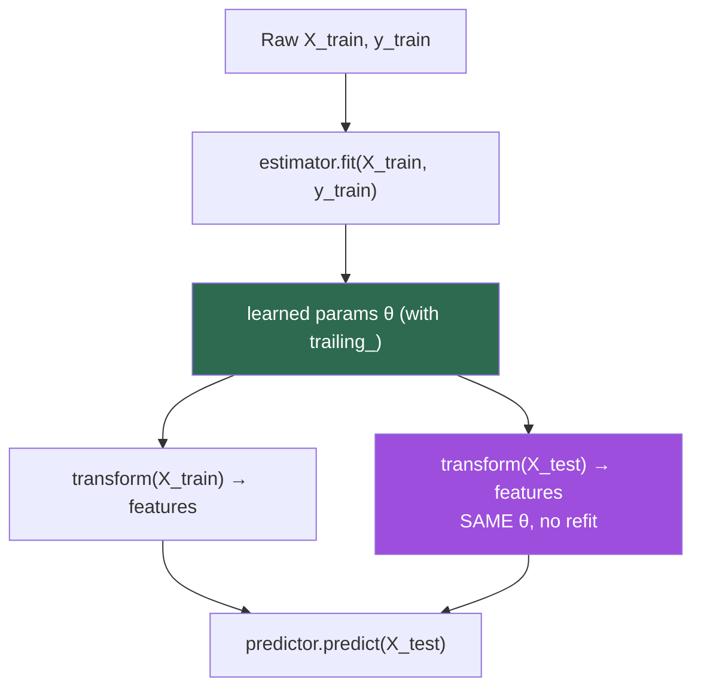
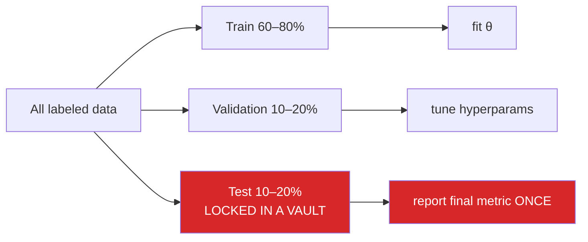
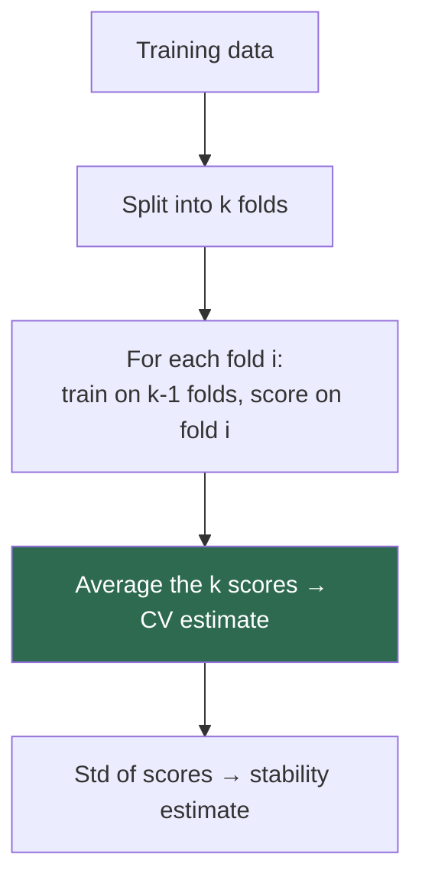
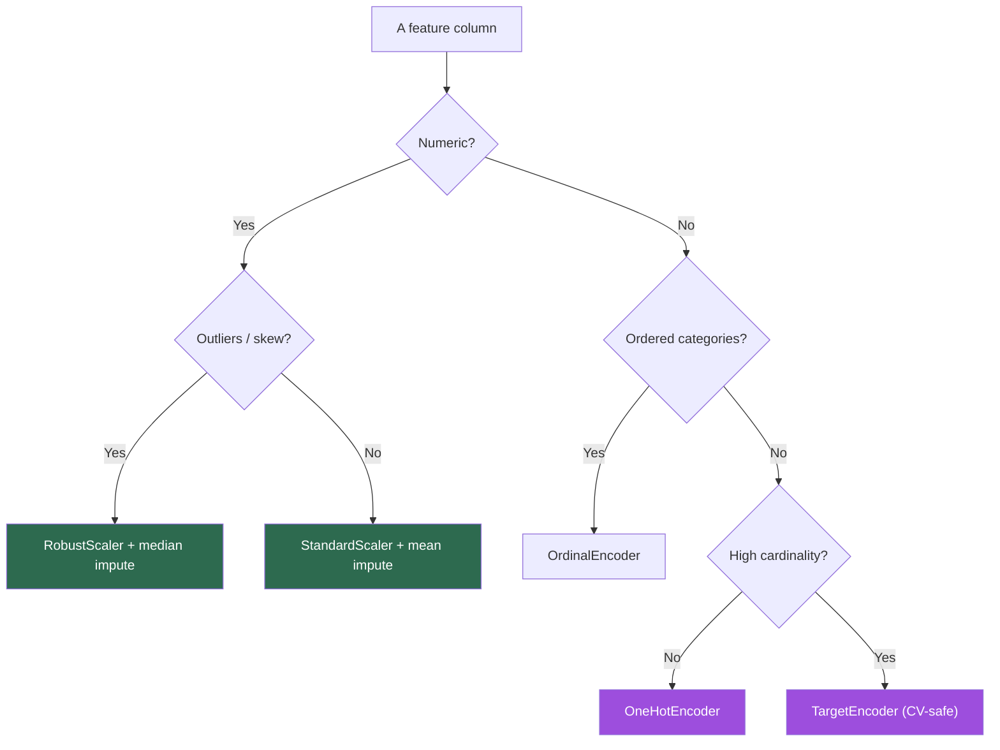
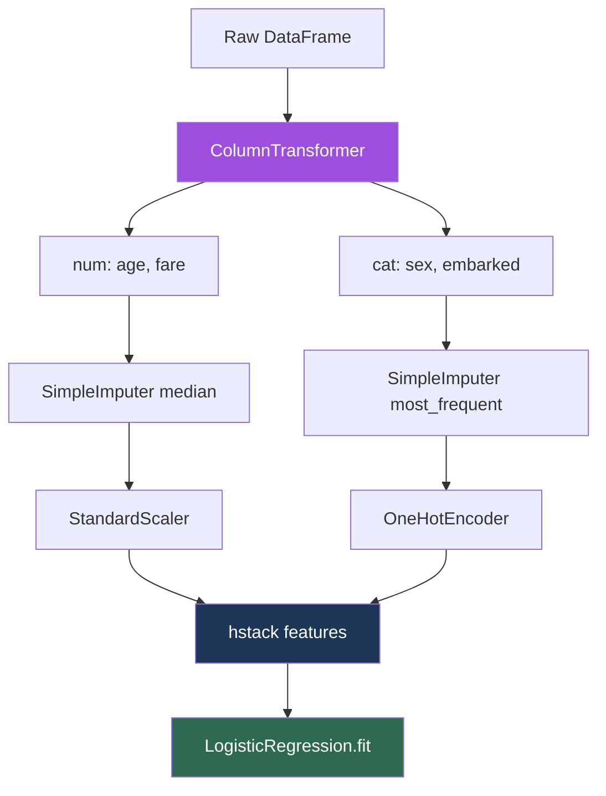
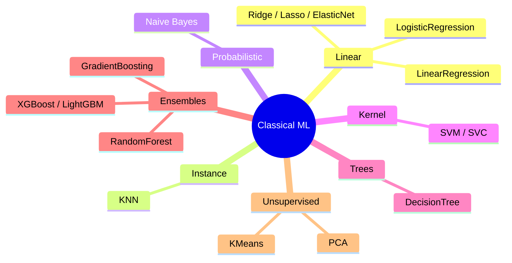
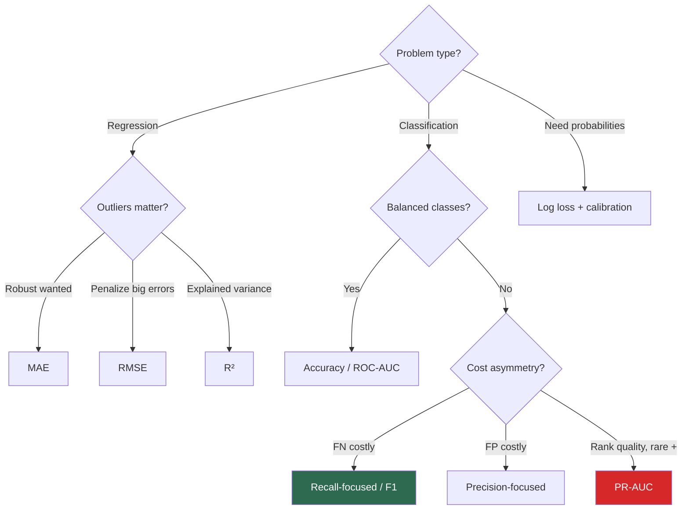
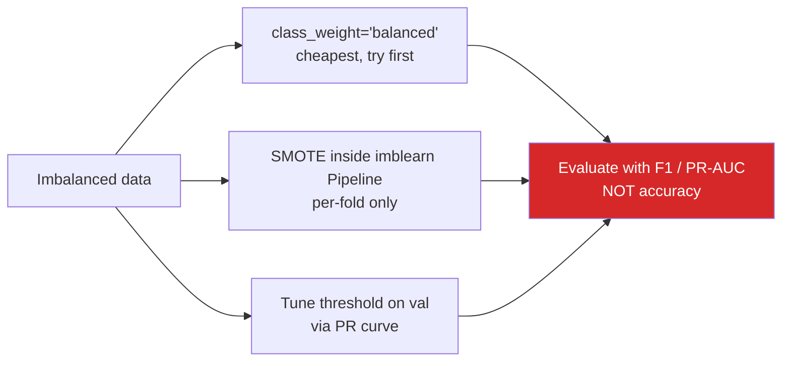
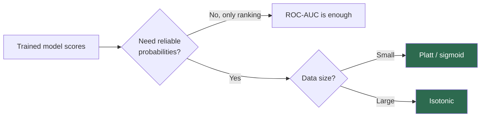
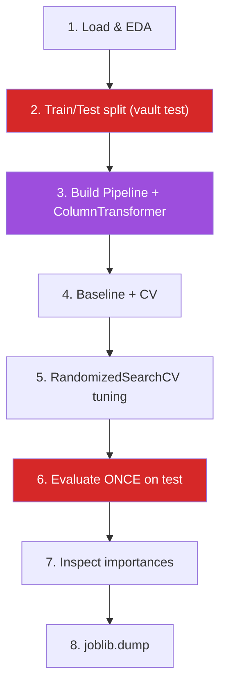

# scikit-learn & Classical ML in Python
*A senior-to-senior, teach-others-grade guide to building correct, leakage-free machine-learning pipelines with scikit-learn.*

*Part of the AI Engineering & ML Mastery Path — see the [index](../README.md) and [study plan](../MASTER-STUDY-PLAN.md).*

Before you reach for a transformer or a neural net, **classical ML is still the workhorse** of tabular data, baselines, and 80% of real business problems. scikit-learn is the lingua franca: a single, consistent API that lets you swap a linear model for a gradient-boosted forest by changing one line. This guide teaches not just *which buttons to press* but *why the API is shaped the way it is*, **how data leakage silently destroys models**, and how to assemble a production-grade pipeline end to end.

> 🎯 **Key Insight:** The hardest part of classical ML is not the model — it's the **plumbing**. Get the `Pipeline` + cross-validation contract right and 90% of subtle bugs vanish.

---

## 🎯 Learning Objectives

By the end of this document you can:

- Explain the scikit-learn **Estimator / Transformer / Predictor** API contract and why `fit`/`transform`/`predict` are separated.
- Choose the correct **data split** and **cross-validation** scheme (KFold, Stratified, TimeSeries, Group) for a given problem.
- Build a **leakage-free `Pipeline` + `ColumnTransformer`** that fits *only* on training folds.
- Apply the right **preprocessing** (scaling, encoding, imputation) to the right columns.
- Train, compare, and reason about **every core model family** (linear, tree, ensemble, kernel, probabilistic, clustering, dimensionality reduction).
- Pick the **correct metric** for classification vs regression vs imbalanced data, and tune the **decision threshold**.
- Handle **class imbalance** with `class_weight`, resampling/SMOTE, and threshold tuning.
- Run **hyperparameter search** with `GridSearchCV`, `RandomizedSearchCV`, and Optuna.
- **Persist** models with `joblib` and **calibrate** probability outputs.
- Deliver a **complete end-to-end project** on the California Housing dataset.

---

## 📋 Prerequisites

- [01 — Python for AI: tooling & environments](./01-python-for-ai.md)
- [02 — NumPy & vectorized computation](./02-numpy-vectorization.md)
- [03 — pandas for data wrangling](./03-pandas-data-wrangling.md)
- Comfort with basic statistics (mean, variance, probability) and the linear algebra refresher in the [study plan](../MASTER-STUDY-PLAN.md).

Install the stack:

```bash
pip install "scikit-learn>=1.4" pandas numpy matplotlib joblib
pip install xgboost lightgbm optuna imbalanced-learn   # optional extras
```

---

## 📑 Table of Contents

1. [The scikit-learn API Philosophy](#1-the-scikit-learn-api-philosophy)
2. [Train / Validation / Test Splits](#2-train--validation--test-splits)
3. [Cross-Validation](#3-cross-validation)
4. [Preprocessing](#4-preprocessing)
5. [Pipeline & ColumnTransformer — the Right Way](#5-pipeline--columntransformer--the-right-way)
6. [Core Models](#6-core-models)
7. [Metrics & How to Choose Them](#7-metrics--how-to-choose-them)
8. [Class Imbalance](#8-class-imbalance)
9. [Hyperparameter Search](#9-hyperparameter-search)
10. [Calibration](#10-calibration)
11. [Model Persistence](#11-model-persistence)
12. [From-Scratch Implementation](#-from-scratch-implementation)
13. [End-to-End Project: California Housing](#-end-to-end-project-california-housing)
14. [Knowledge Check](#-knowledge-check)
15. [Exercises](#-exercises)
16. [Cheat Sheet](#-cheat-sheet)
17. [Further Resources](#-further-resources)
18. [What's Next](#-whats-next)

---

## 1. The scikit-learn API Philosophy

> 💡 **Intuition:** scikit-learn is built on **one promise**: every object is an *estimator* with a `fit` method, and the things it does after fitting fall into exactly three roles. Learn the three roles once and you've learned 200 classes.

### The three roles

| Role | Defining method | Examples | Mental model |
|------|-----------------|----------|--------------|
| **Estimator** | `fit(X, y=None)` | *all* objects | "learn parameters from data" |
| **Transformer** | `transform(X)` / `fit_transform(X)` | `StandardScaler`, `PCA`, `OneHotEncoder` | "reshape/clean features" |
| **Predictor** | `predict(X)` (+ `predict_proba`, `decision_function`) | `LogisticRegression`, `RandomForestClassifier` | "produce an answer" |

### Formal contract

An estimator is any object implementing

$$\text{fit}: (X, y) \mapsto \theta$$

where $X \in \mathbb{R}^{n \times p}$ is the feature matrix ($n$ samples, $p$ features), $y \in \mathbb{R}^{n}$ (or class labels) is the optional target, and $\theta$ is the set of **learned attributes** — by convention always stored with a **trailing underscore** (e.g. `scaler.mean_`, `model.coef_`). Constructor arguments (hyperparameters) **never** have a trailing underscore.

> 🎯 **Key Insight:** Trailing underscore = "learned during `fit`". No underscore = "you set this". This single convention tells you, at a glance, what is data-derived and what is a knob.

### Worked example — what `fit` actually stores

`StandardScaler` learns the per-column mean $\mu_j$ and standard deviation $\sigma_j$ during `fit`, then applies

$$z_{ij} = \frac{x_{ij} - \mu_j}{\sigma_j}$$

during `transform`. Suppose column $j$ is $[2, 4, 6]$. Then by hand:

$$\mu_j = \frac{2+4+6}{3} = 4, \qquad \sigma_j = \sqrt{\frac{(2-4)^2+(4-4)^2+(6-4)^2}{3}} = \sqrt{\tfrac{8}{3}} \approx 1.633$$

So $2 \mapsto (2-4)/1.633 = -1.225$, $4 \mapsto 0$, $6 \mapsto +1.225$.

```python
import numpy as np
from sklearn.preprocessing import StandardScaler

X = np.array([[2.0], [4.0], [6.0]])
scaler = StandardScaler()
scaler.fit(X)                      # learns mean_ and scale_
print(scaler.mean_)                # [4.]
print(scaler.scale_)               # [1.63299316]   (population std, ddof=0)
print(scaler.transform(X).ravel()) # [-1.22474487  0.          1.22474487]
```

> ⚠️ **Common Pitfall:** scikit-learn's `StandardScaler` uses the **population** standard deviation ($\text{ddof}=0$), not the sample std. NumPy's `np.std` also defaults to `ddof=0`, but pandas' `.std()` defaults to `ddof=1`. Mixing them gives slightly different numbers and confuses debugging.

### Why separate `fit` and `transform`?

This separation is the **entire reason leakage-free pipelines are possible**. You `fit` on training data only (learning $\mu, \sigma$), then `transform` both train and test with those *same* statistics. If you re-fit on the test set, information from the test distribution leaks into preprocessing.



### Consistent params: `get_params` / `set_params`

Every estimator exposes its hyperparameters uniformly — which is exactly what lets `GridSearchCV` tune *any* estimator generically.

```python
from sklearn.linear_model import Ridge
m = Ridge(alpha=1.0)
print(m.get_params())          # {'alpha': 1.0, 'fit_intercept': True, ...}
m.set_params(alpha=0.5)        # programmatic update — used internally by grid search
print(m.get_params()["alpha"]) # 0.5
```

> 📝 **Tip:** In nested objects (e.g. inside a `Pipeline`), parameters are addressed with **double underscores**: `pipe.set_params(model__alpha=0.5)`. Memorize the `step__param` syntax — it is everywhere in tuning.

**Why it matters for AI/ML:** This uniform contract is what makes scikit-learn *composable*. A `Pipeline`, a `GridSearchCV`, an `OneVsRestClassifier` — they are all just estimators wrapping other estimators. The pattern scales to libraries built on top (e.g. `imbalanced-learn`, `sklearn-compatible` XGBoost wrappers).

---

## 2. Train / Validation / Test Splits

> 💡 **Intuition:** You cannot judge a model on data it has memorized. You hold out data to *estimate how it will behave on the future you haven't seen yet*. Three buckets serve three different decisions.

| Split | Used for | Touched how often |
|-------|----------|-------------------|
| **Train** | fitting model parameters $\theta$ | every epoch / fit |
| **Validation** | choosing hyperparameters, model selection, early stopping | many times |
| **Test** | final, unbiased estimate of generalization | **exactly once**, at the very end |

### The generalization gap

We want to minimize the **expected risk** $R(\theta) = \mathbb{E}_{(x,y)\sim \mathcal{D}}[\ell(f_\theta(x), y)]$ over the true data distribution $\mathcal{D}$, but we only observe the **empirical risk** $\hat{R}(\theta) = \frac{1}{n}\sum_{i=1}^n \ell(f_\theta(x_i), y_i)$ on our sample. The **generalization gap** is $R(\theta) - \hat{R}(\theta)$; the test set exists to estimate $R$ honestly.



### Code: a proper three-way split

```python
from sklearn.datasets import fetch_california_housing
from sklearn.model_selection import train_test_split

X, y = fetch_california_housing(return_X_y=True, as_frame=True)

# First carve off the test set (held out completely)
X_temp, X_test, y_temp, y_test = train_test_split(
    X, y, test_size=0.20, random_state=42
)
# Then split the remainder into train / validation
X_train, X_val, y_train, y_val = train_test_split(
    X_temp, y_temp, test_size=0.25, random_state=42  # 0.25 * 0.8 = 0.20 of total
)
print(len(X_train), len(X_val), len(X_test))  # 12384 4128 4128
```

> ⚠️ **Common Pitfall — the cardinal sin:** Looking at the test set more than once. Every time you peek and adjust, you leak test information into your decisions and your final number becomes optimistic. If you find yourself tuning against the test set, you've turned it into a validation set and have *no* honest estimate left.

> 🎯 **Key Insight:** In practice, **cross-validation replaces the single validation split** — it uses the training data more efficiently. But the test set vault rule never changes.

**Why it matters for AI/ML:** Every leaderboard scandal and "our model degraded in production" post-mortem traces back to this. The split is not bureaucracy; it is the *only* thing standing between you and self-deception.

---

## 3. Cross-Validation

> 💡 **Intuition:** A single validation split wastes data and gives a noisy estimate (you got lucky/unlucky with which rows landed in val). **Cross-validation** rotates the validation role across $k$ folds, so every row is validated exactly once and your estimate is averaged over $k$ trials.

### k-Fold

Partition the training data into $k$ disjoint folds $F_1, \dots, F_k$. For each $i$, train on everything except $F_i$ and validate on $F_i$. The CV score is

$$\text{CV} = \frac{1}{k}\sum_{i=1}^{k} \text{metric}\big(f_{-i}, F_i\big)$$

where $f_{-i}$ is the model trained without fold $i$.

```
5-Fold layout (■ = validation fold, □ = train):
Fold 1:  ■ □ □ □ □
Fold 2:  □ ■ □ □ □
Fold 3:  □ □ ■ □ □
Fold 4:  □ □ □ ■ □
Fold 5:  □ □ □ □ ■
```



### The four schemes you must know

| Scheme | When to use | Why |
|--------|-------------|-----|
| **`KFold`** | generic regression, balanced data | simple, random folds |
| **`StratifiedKFold`** | **classification**, esp. imbalanced | preserves class proportions in every fold |
| **`TimeSeriesSplit`** | temporal data | never train on the future; expanding window |
| **`GroupKFold`** | grouped/clustered data (same patient, user, store) | keeps a group entirely in one fold → no group leakage |

### Code

```python
import numpy as np
from sklearn.model_selection import (
    KFold, StratifiedKFold, TimeSeriesSplit, GroupKFold, cross_val_score
)
from sklearn.linear_model import LogisticRegression
from sklearn.datasets import make_classification

X, y = make_classification(n_samples=200, n_features=10, weights=[0.8, 0.2],
                           random_state=0)

skf = StratifiedKFold(n_splits=5, shuffle=True, random_state=0)
scores = cross_val_score(LogisticRegression(max_iter=1000), X, y,
                         cv=skf, scoring="f1")
print(f"F1 per fold: {np.round(scores, 3)}")
print(f"Mean ± std : {scores.mean():.3f} ± {scores.std():.3f}")
# F1 per fold: [0.75  0.667 0.842 0.778 0.7 ]
# Mean ± std : 0.747 ± 0.060   (values approximate)
```

### TimeSeriesSplit — the expanding window

```
TimeSeriesSplit (n_splits=4), time flows →
Split 1: [train][val]······
Split 2: [ train  ][val]····
Split 3: [  train    ][val]··
Split 4: [   train       ][val]
```

```python
tscv = TimeSeriesSplit(n_splits=4)
for tr, va in tscv.split(np.arange(10)):
    print("train:", tr, " val:", va)
# train: [0 1] val: [2 3]
# train: [0 1 2 3] val: [4 5]
# train: [0 1 2 3 4 5] val: [6 7]
# train: [0 1 2 3 4 5 6 7] val: [8 9]
```

> ⚠️ **Common Pitfall:** Using plain `KFold` on time series **leaks the future into the past** — the model sees data from after the validation period during training, producing wildly optimistic scores that collapse in production. Always use `TimeSeriesSplit` (or a manual rolling-origin scheme) for temporal data.

> ⚠️ **Common Pitfall — group leakage:** If the same entity (a patient, a user session, a product photographed from 5 angles) appears in both train and validation, the model "recognizes" it rather than generalizing. Use `GroupKFold` (or `StratifiedGroupKFold`) keyed on the entity id.

**Why it matters for AI/ML:** CV is how you make decisions *before* spending your one test-set look. A model selected by leaky CV is selected on a lie.

---

## 4. Preprocessing

> 💡 **Intuition:** Models have expectations about their inputs. Linear models and distance-based models (KNN, SVM) assume features are on **comparable scales**; almost no model accepts raw text categories or missing values. Preprocessing makes raw data digestible — and *must be fit on training data only*.

### 4.1 Scaling numeric features

| Scaler | Formula | Robust to outliers? | Output range |
|--------|---------|---------------------|--------------|
| `StandardScaler` | $z = (x-\mu)/\sigma$ | ❌ | mean 0, std 1 |
| `MinMaxScaler` | $z = (x - x_{\min})/(x_{\max}-x_{\min})$ | ❌ | $[0,1]$ |
| `RobustScaler` | $z = (x - \text{median})/\text{IQR}$ | ✅ | centered on median |

where $\text{IQR} = Q_3 - Q_1$ (the interquartile range).

```python
import numpy as np
from sklearn.preprocessing import StandardScaler, MinMaxScaler, RobustScaler

X = np.array([[1.], [2.], [3.], [100.]])   # 100 is an outlier
print(StandardScaler().fit_transform(X).ravel().round(2))
# [-0.59 -0.57 -0.55  1.71]  → outlier dominates, others squashed near 0
print(RobustScaler().fit_transform(X).ravel().round(2))
# [-0.6  -0.2   0.2  39. ]   → median/IQR centering; inliers spread sensibly
```

> 🎯 **Key Insight:** **Tree-based models (DecisionTree, RandomForest, GradientBoosting, XGBoost) do NOT need scaling** — they split on thresholds and are invariant to monotonic transforms. Scaling matters for linear models, KNN, SVM, neural nets, and any PCA/regularization step.

### 4.2 Encoding categorical features

| Encoder | What it does | Use when | Watch out for |
|---------|--------------|----------|---------------|
| `OneHotEncoder` | one binary column per category | nominal, low cardinality | column explosion at high cardinality |
| `OrdinalEncoder` | maps categories to integers $0,1,2,\dots$ | ordinal (S<M<L) OR tree models | imposes false order on linear models |
| **Target encoding** (`TargetEncoder`, sklearn ≥1.3) | replaces category with smoothed mean of $y$ | high cardinality | **leakage** if not done inside CV folds |

```python
from sklearn.preprocessing import OneHotEncoder
enc = OneHotEncoder(handle_unknown="ignore", sparse_output=False)
cats = [["red"], ["green"], ["blue"], ["red"]]
print(enc.fit_transform(cats))
# [[0. 0. 1.]   (blue, green, red columns, alphabetical)
#  [0. 1. 0.]
#  [1. 0. 0.]
#  [0. 0. 1.]]
print(enc.categories_)  # [array(['blue', 'green', 'red'], dtype=object)]
```

> ⚠️ **Common Pitfall:** Always set `handle_unknown="ignore"` on `OneHotEncoder` for production — otherwise a category that appears only at inference time raises an error and crashes your service.

> ⚠️ **Common Pitfall — target encoding leakage:** Naive target encoding computes the category→mean(y) map on the *whole* dataset, leaking the target into features. scikit-learn's `TargetEncoder` solves this with internal cross-fitting; if you roll your own, fold-aware encoding is mandatory.

### 4.3 Imputation (missing values)

```python
import numpy as np
from sklearn.impute import SimpleImputer, KNNImputer

X = np.array([[1, 2], [np.nan, 3], [7, 6]])
print(SimpleImputer(strategy="mean").fit_transform(X))
# [[1. 2.]
#  [4. 3.]   ← nan replaced by column mean (1+7)/2 = 4
#  [7. 6.]]
# Alternatives: strategy="median" (robust), "most_frequent" (categoricals),
#               "constant" (fill_value=...); KNNImputer for correlated features.
```



**Why it matters for AI/ML:** Garbage in, garbage out. But more subtly — preprocessing fit on the full dataset is the *single most common source of leakage* in beginner pipelines. The next section shows the only correct way to wire it.

---

## 5. Pipeline & ColumnTransformer — the Right Way

> 🎯 **Key Insight:** A `Pipeline` is not a convenience — it is a **correctness mechanism**. It guarantees that every preprocessing step is `fit` *only* on the training fold and merely `transform`ed on the validation/test fold, automatically, during cross-validation. This is the cure for leakage.

### The leakage you're avoiding

```python
# ❌ WRONG — scaler sees the whole dataset (incl. future test rows) before splitting
from sklearn.preprocessing import StandardScaler
X_scaled = StandardScaler().fit_transform(X)   # mean/std computed over ALL data
# ... then split. Test statistics have leaked into training. CV is now optimistic.

# ✅ RIGHT — scaler lives inside a Pipeline; fit happens per-fold on train only
```

### ColumnTransformer: different treatment per column type

```python
import numpy as np
from sklearn.pipeline import Pipeline
from sklearn.compose import ColumnTransformer
from sklearn.preprocessing import StandardScaler, OneHotEncoder
from sklearn.impute import SimpleImputer
from sklearn.linear_model import LogisticRegression

numeric_features = ["age", "fare"]
categorical_features = ["sex", "embarked"]

numeric_pipe = Pipeline([
    ("impute", SimpleImputer(strategy="median")),
    ("scale", StandardScaler()),
])
categorical_pipe = Pipeline([
    ("impute", SimpleImputer(strategy="most_frequent")),
    ("onehot", OneHotEncoder(handle_unknown="ignore")),
])

preprocess = ColumnTransformer([
    ("num", numeric_pipe, numeric_features),
    ("cat", categorical_pipe, categorical_features),
])

clf = Pipeline([
    ("prep", preprocess),
    ("model", LogisticRegression(max_iter=1000)),
])
# clf.fit(X_train, y_train) now does EVERYTHING leakage-free, per fold.
```

### The pipeline as a DAG



### Why this is leakage-free

When you call `cross_val_score(clf, X, y, cv=5)`, scikit-learn clones the *entire* pipeline for each fold and calls `clf.fit(X_train_fold, y_train_fold)`. The imputer learns medians from that fold's training rows only; the scaler learns $\mu,\sigma$ from that fold only; the one-hot encoder learns categories from that fold only. The held-out fold is *only ever* `transform`ed. **The fit/transform separation from §1 is what makes this possible.**

> 📝 **Tip:** Use `make_pipeline` and `make_column_transformer` if you don't care about naming steps yourself — they auto-name (`logisticregression`, `standardscaler`). But explicit names (`"model"`, `"prep"`) make `GridSearchCV` param grids readable. Prefer explicit names in real projects.

> ⚠️ **Common Pitfall:** Calling `SMOTE` or any resampler as a plain pipeline step won't work with sklearn's `Pipeline` (it has no `fit_resample` contract). Use `imblearn.pipeline.Pipeline` for resampling steps — see §8.

**Why it matters for AI/ML:** This is the difference between a model that scores 0.92 in your notebook and 0.71 in production. The pipeline is your **deployable unit**: one `joblib.dump` saves preprocessing + model together, so inference applies the *exact* same transforms.

---

## 6. Core Models

> 💡 **Intuition:** Every model is a different *inductive bias* — an assumption about what patterns are plausible. Linear models assume additive linear effects; trees assume axis-aligned splits; KNN assumes "nearby points are similar"; SVMs assume a max-margin boundary. Matching bias to data is the art.



### 6.1 Linear & Logistic Regression

**Linear regression** fits $\hat{y} = w^\top x + b$ by minimizing squared error:

$$\min_{w,b} \; \frac{1}{n}\sum_{i=1}^n (y_i - w^\top x_i - b)^2$$

**Logistic regression** is *classification*: it squashes the linear score through the **sigmoid** $\sigma(z) = \frac{1}{1+e^{-z}}$ to get a probability, and minimizes log loss:

$$\hat{p} = \sigma(w^\top x + b), \qquad \mathcal{L} = -\frac{1}{n}\sum_i \big[y_i \log \hat{p}_i + (1-y_i)\log(1-\hat{p}_i)\big]$$

```python
from sklearn.linear_model import LinearRegression, LogisticRegression
from sklearn.datasets import make_regression, make_classification

Xr, yr = make_regression(n_samples=100, n_features=3, noise=5, random_state=0)
lin = LinearRegression().fit(Xr, yr)
print("coef:", lin.coef_.round(2), "intercept:", round(lin.intercept_, 2))

Xc, yc = make_classification(n_samples=100, n_features=4, random_state=0)
log = LogisticRegression(max_iter=1000).fit(Xc, yc)
print("prob of class 1 for first row:", log.predict_proba(Xc[:1])[0, 1].round(3))
```

### 6.2 Ridge, Lasso, ElasticNet — regularization

Regularization adds a penalty to discourage large weights (reduce overfitting):

$$\underbrace{\text{Ridge (L2)}}_{+\alpha\|w\|_2^2}, \qquad \underbrace{\text{Lasso (L1)}}_{+\alpha\|w\|_1}, \qquad \underbrace{\text{ElasticNet}}_{+\alpha(\rho\|w\|_1 + (1-\rho)\|w\|_2^2)}$$

> 🎯 **Key Insight:** **Lasso (L1) drives some coefficients to exactly zero** → automatic feature selection. **Ridge (L2) shrinks** coefficients smoothly but keeps them all. Larger $\alpha$ = stronger regularization = simpler model.

```python
from sklearn.linear_model import Ridge, Lasso
import numpy as np
X = np.random.RandomState(0).randn(50, 8)
y = X[:, 0] * 3 + np.random.RandomState(1).randn(50) * 0.5  # only feature 0 matters
print("Lasso coefs:", Lasso(alpha=0.1).fit(X, y).coef_.round(2))
# many zeros → Lasso identified that only feature 0 is informative
```

### 6.3 K-Nearest Neighbors

Predicts by majority vote (classification) or average (regression) of the $k$ closest training points under a distance metric (usually Euclidean $\|x - x_i\|_2$). **No training** beyond storing data — all work happens at predict time.

```python
from sklearn.neighbors import KNeighborsClassifier
knn = KNeighborsClassifier(n_neighbors=5).fit(Xc, yc)
print("KNN train acc:", round(knn.score(Xc, yc), 3))
```

> ⚠️ **Common Pitfall:** KNN is **distance-based** → you *must* scale features first, or the largest-range feature dominates the distance. Also suffers the curse of dimensionality (distances become meaningless in high $p$).

### 6.4 Naive Bayes

Applies Bayes' theorem with the "naive" assumption that features are conditionally independent given the class:

$$P(y \mid x_1,\dots,x_p) \propto P(y)\prod_{j=1}^{p} P(x_j \mid y)$$

Fast, great baseline for **text classification** (`MultinomialNB` on bag-of-words).

```python
from sklearn.naive_bayes import GaussianNB
print("GaussianNB acc:", round(GaussianNB().fit(Xc, yc).score(Xc, yc), 3))
```

### 6.5 Support Vector Machines

Finds the hyperplane that **maximizes the margin** between classes. The kernel trick (`kernel="rbf"`) lets it carve non-linear boundaries. The soft-margin objective:

$$\min_{w,b} \; \tfrac{1}{2}\|w\|^2 + C\sum_{i=1}^n \xi_i \quad \text{s.t.}\quad y_i(w^\top x_i + b) \ge 1 - \xi_i,\; \xi_i \ge 0$$

where $C$ trades off margin width against misclassification, and $\xi_i$ are slack variables.

```python
from sklearn.svm import SVC
svc = SVC(kernel="rbf", C=1.0, probability=True).fit(Xc, yc)
print("SVM acc:", round(svc.score(Xc, yc), 3))
```

> ⚠️ **Common Pitfall:** SVMs scale roughly $O(n^2)$–$O(n^3)$ in samples; they're impractical beyond ~50k rows. Use `LinearSVC` or switch to a tree ensemble for large $n$. Always scale inputs.

### 6.6 Decision Trees

Recursively split features to maximize purity (minimize **Gini impurity** or **entropy**). Gini for a node with class fractions $p_k$:

$$G = 1 - \sum_{k} p_k^2$$

Interpretable but high-variance (overfit easily) → control with `max_depth`, `min_samples_leaf`.

```python
from sklearn.tree import DecisionTreeClassifier
dt = DecisionTreeClassifier(max_depth=3, random_state=0).fit(Xc, yc)
print("Tree depth:", dt.get_depth(), "leaves:", dt.get_n_leaves())
```

### 6.7 Random Forest — bagging

An **ensemble of decorrelated trees**: each tree trains on a bootstrap sample and a random feature subset; predictions are averaged/voted. Variance drops dramatically while bias stays low.

```python
from sklearn.ensemble import RandomForestClassifier
rf = RandomForestClassifier(n_estimators=300, random_state=0, n_jobs=-1).fit(Xc, yc)
# Feature importances (mean impurity decrease) — handle with care (biased to high-cardinality)
print("importances:", rf.feature_importances_.round(3))
```

### 6.8 Gradient Boosting (+ XGBoost / LightGBM)

> 💡 **Intuition:** Instead of averaging independent trees (bagging), **boosting builds trees sequentially**, each new tree correcting the *residual errors* of the ensemble so far. This typically wins on tabular data.

The additive model after $M$ rounds: $F_M(x) = \sum_{m=1}^M \nu\, h_m(x)$, where each $h_m$ is fit to the negative gradient of the loss and $\nu$ is the **learning rate** (shrinkage).

```python
from sklearn.ensemble import HistGradientBoostingClassifier
hgb = HistGradientBoostingClassifier(learning_rate=0.1, max_iter=300,
                                     random_state=0).fit(Xc, yc)
print("HGB acc:", round(hgb.score(Xc, yc), 3))
# XGBoost / LightGBM (sklearn-compatible APIs):
# from xgboost import XGBClassifier;   XGBClassifier(n_estimators=300).fit(Xc, yc)
# from lightgbm import LGBMClassifier; LGBMClassifier(n_estimators=300).fit(Xc, yc)
```

| Library | Strength | Notes |
|---------|----------|-------|
| `HistGradientBoosting*` (sklearn) | fast, native missing-value & categorical support | no extra dependency |
| **XGBoost** | battle-tested, regularized, GPU | great defaults, huge community |
| **LightGBM** | fastest on large data, leaf-wise growth | watch overfitting on small data |

> 🎯 **Key Insight:** For **tabular data**, gradient-boosted trees (XGBoost/LightGBM/HGB) are the default winner — they beat deep learning on most structured datasets. Reach for neural nets only for images, text, audio, or huge data.

### 6.9 KMeans — clustering (unsupervised)

Partitions data into $k$ clusters by minimizing within-cluster sum of squares (inertia):

$$\min_{\{C_k\}} \sum_{k=1}^{K} \sum_{x \in C_k} \|x - \mu_k\|^2, \qquad \mu_k = \text{centroid of } C_k$$

```python
from sklearn.cluster import KMeans
km = KMeans(n_clusters=3, n_init=10, random_state=0).fit(Xc)
print("inertia:", round(km.inertia_, 1), "labels[:5]:", km.labels_[:5])
# Choose k with the elbow method (plot inertia vs k) or silhouette score.
```

### 6.10 PCA — dimensionality reduction (unsupervised)

Projects data onto the orthogonal directions of **maximum variance** (top eigenvectors of the covariance matrix). Used for visualization, denoising, and decorrelation.

```python
from sklearn.decomposition import PCA
pca = PCA(n_components=2).fit(Xc)
print("explained variance ratio:", pca.explained_variance_ratio_.round(3))
# e.g. [0.41 0.22] → first 2 components capture 63% of variance
```

> ⚠️ **Common Pitfall:** PCA is variance-based → **scale first** (`StandardScaler`), or features with large units dominate the components. PCA inside a `Pipeline` after a scaler is the standard pattern.

**Why it matters for AI/ML:** Knowing the bias of each family lets you pick a strong baseline in minutes. The pros' workflow: a `LogisticRegression`/`Ridge` baseline → a gradient-boosting model → only then consider anything fancier.

---

## 7. Metrics & How to Choose Them

> 🎯 **Key Insight:** **Accuracy lies on imbalanced data.** A fraud model that predicts "not fraud" for everyone scores 99.9% accuracy and catches zero fraud. The metric must match the *business cost* of each error type.

### Classification metrics

For a binary confusion matrix:

```
                 Predicted +     Predicted -
Actual +            TP              FN
Actual -            FP              TN
```

$$\text{Precision} = \frac{TP}{TP+FP}, \quad \text{Recall} = \frac{TP}{TP+FN}, \quad F_1 = 2\cdot\frac{P\cdot R}{P+R}$$

| Metric | Answers | Use when |
|--------|---------|----------|
| **Accuracy** | overall % correct | balanced classes only |
| **Precision** | of predicted positives, how many are right? | false positives are costly (spam filter) |
| **Recall** | of actual positives, how many did we catch? | false negatives are costly (cancer, fraud) |
| **F1** | harmonic mean of P & R | balance both; imbalanced data |
| **ROC-AUC** | ranking quality across all thresholds | compare models; threshold-agnostic |
| **PR-AUC** | precision/recall tradeoff | **highly imbalanced** data (better than ROC-AUC) |
| **Log loss** | calibrated probability quality | when you need good probabilities |

> 💡 **Intuition — ROC vs PR:** ROC-AUC can look deceptively good on imbalanced data because true negatives inflate it. When positives are rare, **PR-AUC** focuses on the class you care about.

### Worked example — why accuracy fails

99 negatives, 1 positive. Model predicts all negative.
- Accuracy $= 99/100 = 0.99$ 🎉 (looks great)
- Recall $= 0/1 = 0$ 💀 (caught nothing)
- Precision $= 0/0$ undefined; F1 $= 0$.

```python
from sklearn.metrics import (accuracy_score, precision_score, recall_score,
                             f1_score, roc_auc_score, classification_report)
y_true = [0]*99 + [1]
y_pred = [0]*100
print("accuracy:", accuracy_score(y_true, y_pred))   # 0.99
print("recall  :", recall_score(y_true, y_pred))     # 0.0  ← the truth
```

### Regression metrics

$$\text{MAE} = \frac{1}{n}\sum|y_i - \hat{y}_i|, \quad \text{RMSE} = \sqrt{\frac{1}{n}\sum (y_i-\hat{y}_i)^2}, \quad R^2 = 1 - \frac{\sum (y_i-\hat{y}_i)^2}{\sum (y_i - \bar{y})^2}$$

| Metric | Property |
|--------|----------|
| **MAE** | robust to outliers, same units as target, linear penalty |
| **RMSE** | penalizes large errors more (squared), same units |
| **R²** | fraction of variance explained; 1 = perfect, 0 = no better than mean, can be negative |

### Decision flow



**Why it matters for AI/ML:** Optimizing the wrong metric is optimizing the wrong product. Decide the metric *with the business* before modeling, then let CV select against it.

---

## 8. Class Imbalance

> 💡 **Intuition:** When 99% of rows are one class, the model can be lazy. Three levers fix this: tell the loss to care more about the minority (`class_weight`), rebalance the data (resampling/SMOTE), or move the decision threshold.

### Lever 1 — `class_weight`

Reweights the loss so minority errors cost more. Free, no data change.

```python
from sklearn.linear_model import LogisticRegression
clf = LogisticRegression(class_weight="balanced", max_iter=1000)
# weight of class c ∝ n_samples / (n_classes * count_c)
```

### Lever 2 — resampling / SMOTE

**SMOTE** (Synthetic Minority Over-sampling) creates synthetic minority points by interpolating between a minority sample and its nearest minority neighbors:

$$x_{\text{new}} = x_i + \lambda\,(x_{nn} - x_i), \qquad \lambda \sim \mathcal{U}(0,1)$$

> ⚠️ **Common Pitfall — the #1 SMOTE mistake:** Applying SMOTE to the **whole dataset before CV** leaks synthetic neighbors of test points into training. SMOTE must run **inside each CV fold, on training data only**. Use `imblearn`'s pipeline, which has the right `fit_resample` contract:

```python
from imblearn.pipeline import Pipeline as ImbPipeline   # NOTE: imblearn's Pipeline
from imblearn.over_sampling import SMOTE
from sklearn.ensemble import RandomForestClassifier

pipe = ImbPipeline([
    ("smote", SMOTE(random_state=0)),         # resamples TRAIN fold only
    ("model", RandomForestClassifier(random_state=0)),
])
# Inside cross_val_score, SMOTE never sees the held-out fold. Leakage-free.
```

### Lever 3 — threshold tuning

Default classification threshold is 0.5, but that's arbitrary. Pick the threshold that optimizes your metric on validation data.

```python
import numpy as np
from sklearn.metrics import precision_recall_curve
# probs = clf.predict_proba(X_val)[:, 1]
# precision, recall, thresholds = precision_recall_curve(y_val, probs)
# f1 = 2 * precision * recall / (precision + recall + 1e-12)
# best_t = thresholds[np.argmax(f1[:-1])]   # threshold maximizing F1
```



**Why it matters for AI/ML:** Fraud, churn, defect detection, rare-disease screening — the valuable problems are almost always imbalanced. Mishandling it produces a model that's accurate and useless.

---

## 9. Hyperparameter Search

> 💡 **Intuition:** Hyperparameters (tree depth, `C`, `alpha`, learning rate) aren't learned by `fit` — *you* choose them. Search automates trying combinations, scored by cross-validation so the choice generalizes.

### GridSearchCV — exhaustive

Tries every combination in the grid. Cost grows multiplicatively: a grid of $3 \times 4 \times 5$ values with 5-fold CV is $60 \times 5 = 300$ fits.

```python
from sklearn.model_selection import GridSearchCV
from sklearn.ensemble import RandomForestClassifier

param_grid = {
    "n_estimators": [100, 300],
    "max_depth": [None, 5, 10],
    "min_samples_leaf": [1, 5],
}
gs = GridSearchCV(RandomForestClassifier(random_state=0), param_grid,
                  scoring="f1", cv=5, n_jobs=-1)
# gs.fit(X_train, y_train)
# print(gs.best_params_, gs.best_score_)
# best_model = gs.best_estimator_   # already refit on all training data
```

### RandomizedSearchCV — sample the space

Samples `n_iter` random combinations from distributions. **Usually more efficient than grid search** — it doesn't waste budget on unimportant dimensions.

```python
from sklearn.model_selection import RandomizedSearchCV
from scipy.stats import randint, uniform

param_dist = {
    "n_estimators": randint(100, 600),
    "max_depth": randint(3, 20),
    "min_samples_leaf": randint(1, 20),
}
rs = RandomizedSearchCV(RandomForestClassifier(random_state=0), param_dist,
                        n_iter=40, scoring="f1", cv=5, n_jobs=-1, random_state=0)
```

> 🎯 **Key Insight:** Random search beats grid search when only a few hyperparameters matter — which is almost always. (Bergstra & Bengio, 2012, established this empirically.)

### Optuna — Bayesian / TPE search

Optuna uses past trials to propose smarter next candidates (Tree-structured Parzen Estimator), and supports pruning of hopeless trials.

```python
import optuna
from sklearn.model_selection import cross_val_score
from sklearn.ensemble import RandomForestClassifier

def objective(trial):
    params = {
        "n_estimators": trial.suggest_int("n_estimators", 100, 600),
        "max_depth": trial.suggest_int("max_depth", 3, 20),
        "min_samples_leaf": trial.suggest_int("min_samples_leaf", 1, 20),
    }
    model = RandomForestClassifier(**params, random_state=0, n_jobs=-1)
    return cross_val_score(model, Xc, yc, cv=5, scoring="f1").mean()

study = optuna.create_study(direction="maximize")
# study.optimize(objective, n_trials=50)
# print(study.best_params, study.best_value)
```

| Method | Best for | Tradeoff |
|--------|----------|----------|
| `GridSearchCV` | small, discrete grids | explodes combinatorially |
| `RandomizedSearchCV` | many params, limited budget | may miss exact optimum |
| **Optuna** | expensive models, large spaces | extra dependency, more setup |

> ⚠️ **Common Pitfall:** Always tune the **whole pipeline**, not just the model, so preprocessing is re-fit per fold. Address pipeline params with `step__param`, e.g. `"prep__num__scale__with_mean": [True, False]`.

**Why it matters for AI/ML:** The gap between default and tuned hyperparameters is often several points of your metric — frequently the difference between shipping and not.

---

## 10. Calibration

> 💡 **Intuition:** A model can *rank* well (high AUC) yet output **miscalibrated** probabilities — saying "0.9" when it's right only 60% of the time. If you act on probabilities (expected-value decisions, thresholds, downstream Bayesian logic), calibrate.

A model is **calibrated** if, among samples it assigns probability $p$, the empirical fraction of positives is $\approx p$. Two fixes:

- **Platt scaling** (`method="sigmoid"`) — fit a logistic on the scores. Good for small data.
- **Isotonic regression** (`method="isotonic"`) — non-parametric, monotonic. Needs more data.

```python
from sklearn.calibration import CalibratedClassifierCV
from sklearn.ensemble import RandomForestClassifier

base = RandomForestClassifier(n_estimators=300, random_state=0)
calibrated = CalibratedClassifierCV(base, method="isotonic", cv=5)
# calibrated.fit(X_train, y_train)
# calibrated.predict_proba(X_test)  # now well-calibrated probabilities
```



> ⚠️ **Common Pitfall:** SVMs and tree ensembles are notoriously miscalibrated (SVMs have no native probabilities; RF probabilities are bunched toward the middle). Logistic regression is usually well-calibrated by construction.

**Why it matters for AI/ML:** Risk scoring, pricing, medical triage, and any expected-value decision are only as good as the probabilities feeding them.

---

## 11. Model Persistence

> 🎯 **Key Insight:** Persist the **whole fitted Pipeline**, not just the model. The pipeline carries the fitted scaler/encoder statistics, so inference applies identical transforms — no train/serve skew.

```python
import joblib
# joblib.dump(best_pipeline, "model.joblib")            # save
# loaded = joblib.load("model.joblib")                   # load
# loaded.predict(new_raw_dataframe)                      # raw → prediction
```

> ⚠️ **Common Pitfall:** A pickled/joblib model is tied to the **exact library versions** used to create it. Pin `scikit-learn==X.Y.Z` in your serving environment and record it alongside the artifact, or loading may warn or break. For long-term/cross-language portability, consider exporting to **ONNX** (`skl2onnx`).

> 📝 **Tip:** Never `joblib.load` an artifact from an untrusted source — pickle can execute arbitrary code on load.

---

## 🧮 From-Scratch Implementation

To cement the API, here's a **minimal scikit-learn-compatible estimator** implementing standardization-from-scratch, plus ridge regression via the normal equation. It follows the `BaseEstimator` / `TransformerMixin` contract so it drops into a real `Pipeline`.

```python
import numpy as np
from sklearn.base import BaseEstimator, TransformerMixin, RegressorMixin
from sklearn.pipeline import Pipeline

class MyStandardScaler(BaseEstimator, TransformerMixin):
    """Reimplements StandardScaler. Learns mean_/scale_ on fit only (no leakage)."""
    def fit(self, X, y=None):
        X = np.asarray(X, dtype=float)
        self.mean_ = X.mean(axis=0)
        self.scale_ = X.std(axis=0, ddof=0)         # population std, matches sklearn
        self.scale_[self.scale_ == 0] = 1.0          # guard constant columns
        return self
    def transform(self, X):
        X = np.asarray(X, dtype=float)
        return (X - self.mean_) / self.scale_

class MyRidge(BaseEstimator, RegressorMixin):
    """Ridge via the closed-form normal equation: w = (XᵀX + αI)⁻¹ Xᵀy."""
    def __init__(self, alpha=1.0):
        self.alpha = alpha                           # hyperparam: no trailing _
    def fit(self, X, y):
        X = np.asarray(X, dtype=float)
        y = np.asarray(y, dtype=float)
        n, p = X.shape
        Xb = np.hstack([np.ones((n, 1)), X])         # add bias column
        I = np.eye(p + 1); I[0, 0] = 0.0             # don't regularize the intercept
        # learned params get trailing underscore
        self.coef_ = np.linalg.solve(Xb.T @ Xb + self.alpha * I, Xb.T @ y)
        return self
    def predict(self, X):
        X = np.asarray(X, dtype=float)
        Xb = np.hstack([np.ones((X.shape[0], 1)), X])
        return Xb @ self.coef_

# Drops straight into a Pipeline — proving we honored the API contract:
rng = np.random.RandomState(0)
X = rng.randn(100, 3)
y = X @ np.array([2.0, -1.0, 0.5]) + 0.1 * rng.randn(100)

pipe = Pipeline([("scale", MyStandardScaler()), ("ridge", MyRidge(alpha=0.5))])
pipe.fit(X[:80], y[:80])
pred = pipe.predict(X[80:])
from sklearn.metrics import r2_score
print("R² on held-out:", round(r2_score(y[80:], pred), 3))
# R² on held-out: 0.999  (clean linear data → near-perfect)
```

> 🎯 **Key Insight:** By inheriting `BaseEstimator` (gives `get_params`/`set_params`) and the right mixin, your custom object gains `fit_transform`, works in pipelines, and is tunable by `GridSearchCV` — *for free*. That's the power of the consistent API.

---

## 🏗️ End-to-End Project: California Housing

A complete, runnable regression project: **EDA → leakage-free pipeline → cross-validation → tuning → evaluation → save**.



```python
import numpy as np
import pandas as pd
from scipy.stats import randint, uniform
from sklearn.datasets import fetch_california_housing
from sklearn.model_selection import train_test_split, cross_val_score, RandomizedSearchCV, KFold
from sklearn.pipeline import Pipeline
from sklearn.compose import ColumnTransformer
from sklearn.preprocessing import StandardScaler
from sklearn.impute import SimpleImputer
from sklearn.linear_model import Ridge
from sklearn.ensemble import HistGradientBoostingRegressor
from sklearn.metrics import mean_absolute_error, root_mean_squared_error, r2_score
import joblib

# ---- 1. Load & quick EDA ----------------------------------------------------
data = fetch_california_housing(as_frame=True)
X, y = data.data, data.target           # target = median house value ($100k)
print(X.shape)                          # (20640, 8)
print(X.describe().T[["mean", "std", "min", "max"]].round(2))
print("target range:", round(y.min(), 2), "→", round(y.max(), 2))

# ---- 2. Lock the test set in the vault --------------------------------------
X_train, X_test, y_train, y_test = train_test_split(
    X, y, test_size=0.2, random_state=42)

# ---- 3. Leakage-free pipeline -----------------------------------------------
numeric_features = X.columns.tolist()   # all 8 features are numeric here
preprocess = ColumnTransformer([
    ("num", Pipeline([("impute", SimpleImputer(strategy="median")),
                      ("scale", StandardScaler())]), numeric_features),
])

# ---- 4. Baseline (Ridge) + CV -----------------------------------------------
baseline = Pipeline([("prep", preprocess), ("model", Ridge(alpha=1.0))])
cv = KFold(n_splits=5, shuffle=True, random_state=42)
base_scores = cross_val_score(baseline, X_train, y_train, cv=cv,
                              scoring="neg_root_mean_squared_error")
print(f"Ridge baseline CV RMSE: {-base_scores.mean():.3f} ± {base_scores.std():.3f}")
# Ridge baseline CV RMSE: ~0.729 ± ~0.011

# ---- 5. Stronger model + tuning ---------------------------------------------
hgb_pipe = Pipeline([
    ("prep", preprocess),   # scaling is harmless for HGB; impute still useful
    ("model", HistGradientBoostingRegressor(random_state=42)),
])
param_dist = {
    "model__learning_rate": uniform(0.02, 0.2),
    "model__max_iter": randint(200, 600),
    "model__max_leaf_nodes": randint(15, 63),
    "model__min_samples_leaf": randint(10, 50),
}
search = RandomizedSearchCV(hgb_pipe, param_dist, n_iter=30, cv=cv,
                            scoring="neg_root_mean_squared_error",
                            n_jobs=-1, random_state=42)
search.fit(X_train, y_train)
print("best params:", search.best_params_)
print(f"best CV RMSE: {-search.best_score_:.3f}")   # ~0.46 — much better than Ridge

# ---- 6. Final, ONE-TIME test evaluation -------------------------------------
best = search.best_estimator_
pred = best.predict(X_test)
print(f"TEST RMSE: {root_mean_squared_error(y_test, pred):.3f}")  # ~0.45
print(f"TEST MAE : {mean_absolute_error(y_test, pred):.3f}")      # ~0.30
print(f"TEST R²  : {r2_score(y_test, pred):.3f}")                 # ~0.84

# ---- 7. Feature importance (permutation = model-agnostic, less biased) -------
from sklearn.inspection import permutation_importance
perm = permutation_importance(best, X_test, y_test, n_repeats=10,
                              random_state=42, scoring="r2")
imp = pd.Series(perm.importances_mean, index=X.columns).sort_values(ascending=False)
print("Permutation importances:\n", imp.round(3))
# MedInc (median income) dominates — the strongest predictor of house value.

# ---- 8. Persist the WHOLE pipeline ------------------------------------------
joblib.dump(best, "california_hgb.joblib")
# reload + predict on raw data, transforms applied identically:
# model = joblib.load("california_hgb.joblib"); model.predict(X_test.iloc[:3])
```

> 📝 **Tip:** Note `root_mean_squared_error` is the direct function in scikit-learn ≥1.4. On older versions use `mean_squared_error(y, pred, squared=False)`.

> 🎯 **Key Insight — why permutation importance over `.feature_importances_`:** Impurity-based importance is **biased toward high-cardinality and continuous features**. Permutation importance measures the *actual drop in score* when a feature is shuffled, on held-out data — a far more trustworthy signal.

---

## ❓ Knowledge Check

<details><summary>Q1. What does a trailing underscore (e.g. <code>coef_</code>) signify on a scikit-learn attribute, and why does it matter?</summary>

It marks an attribute **learned during `fit`** (data-derived), as opposed to a constructor hyperparameter (no underscore, set by you). It matters because it instantly tells you what is fitted state vs a knob, and `fit` will raise `NotFittedError` if you access these before fitting. It also tells you what gets *persisted* when you save the estimator.
</details>

<details><summary>Q2. Why must <code>StandardScaler</code> be fit on training data only and not the full dataset?</summary>

Fitting on the full dataset computes $\mu, \sigma$ using information from the test rows, which **leaks** the test distribution into preprocessing. CV/test estimates then become optimistically biased. Correct practice: `fit` $\mu,\sigma$ on train, `transform` test with those *same* statistics — which a `Pipeline` enforces automatically per fold.
</details>

<details><summary>Q3. You have monthly sales data. Why is <code>KFold</code> wrong and what should you use?</summary>

Plain `KFold` randomly assigns rows to folds, so a training fold can contain *future* months relative to its validation fold — leaking the future and inflating scores. Use **`TimeSeriesSplit`** (expanding/rolling window) so training data always precedes validation data in time.
</details>

<details><summary>Q4. A churn model has 98% accuracy but the business says it's useless. What likely happened and which metrics should you have used?</summary>

The classes are **imbalanced** (~2% churn). Predicting "no churn" for everyone yields 98% accuracy while catching zero churners (recall 0). Use **recall / F1 / PR-AUC**, and tune the decision threshold — accuracy is meaningless here.
</details>

<details><summary>Q5. What is the difference between Ridge and Lasso, and when would you prefer each?</summary>

Ridge adds an **L2** penalty ($\alpha\|w\|_2^2$) that shrinks all coefficients smoothly but keeps them nonzero. Lasso adds an **L1** penalty ($\alpha\|w\|_1$) that drives some coefficients to **exactly zero**, performing feature selection. Prefer Lasso when you suspect many features are irrelevant and want a sparse, interpretable model; prefer Ridge when features are correlated and you want to keep them all with controlled magnitude. ElasticNet blends both.
</details>

<details><summary>Q6. Why must SMOTE go inside the cross-validation loop (e.g. via imblearn's Pipeline) rather than before splitting?</summary>

SMOTE synthesizes minority points by interpolating between neighbors. If applied to the whole dataset before CV, synthetic points derived from test-set minorities leak into training folds (and vice versa), inflating scores. Running it inside an `imblearn.pipeline.Pipeline` resamples **only the training portion of each fold**, keeping the held-out fold pristine.
</details>

<details><summary>Q7. When does ROC-AUC give a misleadingly rosy picture, and what should you use instead?</summary>

On **highly imbalanced** data, the large number of true negatives keeps the false-positive rate low, inflating ROC-AUC even when the model handles the rare positive class poorly. **PR-AUC** (area under the precision-recall curve) focuses on the positive class and is the more honest summary for rare-event problems.
</details>

<details><summary>Q8. Which model families do NOT require feature scaling, and why?</summary>

**Tree-based models** — DecisionTree, RandomForest, GradientBoosting/HistGradientBoosting, XGBoost, LightGBM. They split on feature thresholds and are invariant to any monotonic per-feature transform, so rescaling changes nothing. Scaling *is* required for linear models, KNN, SVM, neural nets, and PCA (all distance/variance/gradient sensitive).
</details>

<details><summary>Q9. What does <code>GridSearchCV.best_estimator_</code> contain after fitting, and is it ready to use?</summary>

It is the estimator with `best_params_`, **already refit on the entire training set** (because `refit=True` by default). Yes — it's ready to call `.predict`/`.score` directly. `best_score_` is the mean CV score of those params (on validation folds), not the test score.
</details>

<details><summary>Q10. A RandomForest gives 0.95 ROC-AUC but its <code>predict_proba</code> outputs cluster around 0.4–0.6. What's happening and how do you fix it?</summary>

The model **ranks** well (high AUC) but its probabilities are **miscalibrated** — RF averages bagged tree votes, pulling probabilities toward the middle. Wrap it in `CalibratedClassifierCV` (isotonic for ample data, sigmoid/Platt for small data) so the probabilities reflect true frequencies, which matters for any threshold or expected-value decision.
</details>

<details><summary>Q11. Why should you persist the whole Pipeline with joblib instead of just the model?</summary>

The Pipeline carries the **fitted preprocessing state** (scaler means/stds, encoder categories, imputer fills). Saving only the model means you'd have to re-implement and re-fit preprocessing at serve time, risking **train/serve skew**. The pipeline maps raw input → prediction identically in training and production. (Pin library versions; never load untrusted artifacts.)
</details>

<details><summary>Q12. Explain the difference between impurity-based and permutation feature importance, and which to trust.</summary>

Impurity-based importance (`.feature_importances_`) sums the impurity decrease each feature provides across splits — it is **biased toward high-cardinality / continuous features** and is computed on training data. Permutation importance shuffles one feature at a time on **held-out** data and measures the resulting score drop — it is model-agnostic and reflects real predictive contribution. Trust **permutation importance** (or SHAP) for interpretation.
</details>

---

## 🏋️ Exercises

<details><summary>Exercise 1 (easy) — Build a leakage-free Pipeline for mixed data.</summary>

**Task:** Given numeric columns `["age", "income"]` and categorical `["city"]` with missing values, build a single `Pipeline` that median-imputes + scales numerics, most-frequent-imputes + one-hot encodes categoricals, then fits a `LogisticRegression`.

**Solution:**
```python
from sklearn.pipeline import Pipeline
from sklearn.compose import ColumnTransformer
from sklearn.preprocessing import StandardScaler, OneHotEncoder
from sklearn.impute import SimpleImputer
from sklearn.linear_model import LogisticRegression

num = ["age", "income"]; cat = ["city"]
prep = ColumnTransformer([
    ("num", Pipeline([("i", SimpleImputer(strategy="median")),
                      ("s", StandardScaler())]), num),
    ("cat", Pipeline([("i", SimpleImputer(strategy="most_frequent")),
                      ("oh", OneHotEncoder(handle_unknown="ignore"))]), cat),
])
clf = Pipeline([("prep", prep), ("model", LogisticRegression(max_iter=1000))])
# clf.fit(X_train, y_train) is now fully leakage-free under any CV.
```
The key correctness point: nothing is fit outside the pipeline, so every CV fold re-fits all preprocessing on training rows only.
</details>

<details><summary>Exercise 2 (easy) — Choose and justify a metric.</summary>

**Task:** For each, name the metric you'd optimize: (a) spam filter where blocking a real email is very bad; (b) cancer screening where missing a case is very bad; (c) a balanced sentiment classifier; (d) a credit-risk model that needs reliable probabilities.

**Solution:**
- (a) **Precision** — false positives (blocking real mail) are costly.
- (b) **Recall** — false negatives (missed cancer) are costly.
- (c) **Accuracy or F1 / ROC-AUC** — balanced, no strong cost asymmetry.
- (d) **Log loss + calibration** — decisions use the probabilities themselves; rank quality alone (AUC) isn't enough.
</details>

<details><summary>Exercise 3 (medium) — Tune a model with cross-validation.</summary>

**Task:** Use `RandomizedSearchCV` (5-fold, F1 scoring, 25 iterations) to tune a `RandomForestClassifier`'s `n_estimators`, `max_depth`, and `min_samples_leaf` on `make_classification` data. Report the best params and CV F1.

**Solution:**
```python
from scipy.stats import randint
from sklearn.datasets import make_classification
from sklearn.ensemble import RandomForestClassifier
from sklearn.model_selection import RandomizedSearchCV, StratifiedKFold

X, y = make_classification(n_samples=1000, n_features=20, weights=[0.7, 0.3],
                           random_state=0)
dist = {"n_estimators": randint(100, 500),
        "max_depth": randint(3, 20),
        "min_samples_leaf": randint(1, 20)}
rs = RandomizedSearchCV(RandomForestClassifier(random_state=0), dist,
                        n_iter=25, scoring="f1",
                        cv=StratifiedKFold(5, shuffle=True, random_state=0),
                        n_jobs=-1, random_state=0)
rs.fit(X, y)
print(rs.best_params_)
print(f"best CV F1: {rs.best_score_:.3f}")   # ~0.80 (approximate)
```
Note the use of `StratifiedKFold` (classification) and `f1` (mildly imbalanced).
</details>

<details><summary>Exercise 4 (medium) — Interpret feature importance correctly.</summary>

**Task:** Train a RandomForest on California Housing and compare impurity-based vs permutation importance for the top feature. Explain any discrepancy.

**Solution:**
```python
import pandas as pd
from sklearn.datasets import fetch_california_housing
from sklearn.ensemble import RandomForestRegressor
from sklearn.model_selection import train_test_split
from sklearn.inspection import permutation_importance

X, y = fetch_california_housing(return_X_y=True, as_frame=True)
Xtr, Xte, ytr, yte = train_test_split(X, y, test_size=0.2, random_state=0)
rf = RandomForestRegressor(n_estimators=200, random_state=0, n_jobs=-1).fit(Xtr, ytr)

impurity = pd.Series(rf.feature_importances_, index=X.columns).sort_values(ascending=False)
perm = permutation_importance(rf, Xte, yte, n_repeats=10, random_state=0)
permutation = pd.Series(perm.importances_mean, index=X.columns).sort_values(ascending=False)
print("Impurity top:\n", impurity.head(3).round(3))
print("Permutation top:\n", permutation.head(3).round(3))
```
Both should rank **`MedInc`** first. Discrepancies typically appear for high-cardinality/continuous features (e.g. `Longitude`/`Latitude`) which impurity importance can over-credit; permutation importance, measured on held-out data, is the more trustworthy ranking. Geographic features may also share importance because they're correlated — permutation importance can understate correlated groups, a caveat worth noting.
</details>

<details><summary>Exercise 5 (hard) — Handle class imbalance end to end.</summary>

**Task:** On a 95/5 imbalanced dataset, compare three approaches under stratified 5-fold CV scored by **PR-AUC** (`average_precision`): (a) plain RF, (b) RF with `class_weight="balanced"`, (c) SMOTE + RF via imblearn Pipeline. Which wins?

**Solution:**
```python
import numpy as np
from sklearn.datasets import make_classification
from sklearn.ensemble import RandomForestClassifier
from sklearn.model_selection import cross_val_score, StratifiedKFold
from imblearn.pipeline import Pipeline as ImbPipeline
from imblearn.over_sampling import SMOTE

X, y = make_classification(n_samples=3000, n_features=20, weights=[0.95, 0.05],
                           random_state=0)
cv = StratifiedKFold(5, shuffle=True, random_state=0)
scoring = "average_precision"   # PR-AUC

plain = RandomForestClassifier(random_state=0, n_jobs=-1)
weighted = RandomForestClassifier(class_weight="balanced", random_state=0, n_jobs=-1)
smote = ImbPipeline([("smote", SMOTE(random_state=0)),
                     ("rf", RandomForestClassifier(random_state=0, n_jobs=-1))])

for name, est in [("plain", plain), ("weighted", weighted), ("smote", smote)]:
    s = cross_val_score(est, X, y, cv=cv, scoring=scoring)
    print(f"{name:9s} PR-AUC: {s.mean():.3f} ± {s.std():.3f}")
```
SMOTE and `class_weight` usually beat the plain model on PR-AUC; the winner depends on the data. **Critical correctness point:** SMOTE is inside `ImbPipeline`, so it only resamples each fold's training portion — no leakage. Always evaluate imbalance work with **PR-AUC/F1**, never accuracy.
</details>

<details><summary>Exercise 6 (hard) — Full mini-project with persistence and calibration.</summary>

**Task:** On the breast-cancer dataset: build a pipeline (scale + LogisticRegression), tune `C` with GridSearchCV, calibrate the best model, evaluate ROC-AUC and log loss on a held-out test set, and save the artifact.

**Solution:**
```python
import joblib
from sklearn.datasets import load_breast_cancer
from sklearn.pipeline import Pipeline
from sklearn.preprocessing import StandardScaler
from sklearn.linear_model import LogisticRegression
from sklearn.model_selection import train_test_split, GridSearchCV
from sklearn.calibration import CalibratedClassifierCV
from sklearn.metrics import roc_auc_score, log_loss

X, y = load_breast_cancer(return_X_y=True)
Xtr, Xte, ytr, yte = train_test_split(X, y, test_size=0.2, stratify=y, random_state=0)

pipe = Pipeline([("scale", StandardScaler()),
                 ("model", LogisticRegression(max_iter=5000))])
grid = {"model__C": [0.01, 0.1, 1, 10, 100]}
gs = GridSearchCV(pipe, grid, scoring="roc_auc", cv=5, n_jobs=-1).fit(Xtr, ytr)
print("best C:", gs.best_params_, "CV AUC:", round(gs.best_score_, 4))

# Calibrate the tuned pipeline (cv on training data)
cal = CalibratedClassifierCV(gs.best_estimator_, method="sigmoid", cv=5).fit(Xtr, ytr)
proba = cal.predict_proba(Xte)[:, 1]
print("TEST ROC-AUC:", round(roc_auc_score(yte, proba), 4))   # ~0.99
print("TEST log loss:", round(log_loss(yte, proba), 4))       # low is good

joblib.dump(cal, "breast_cancer_calibrated.joblib")
```
Observe: `model__C` uses the `step__param` syntax; the test set is touched exactly once; the saved artifact includes scaling + model + calibration as one deployable unit.
</details>

---

## 📊 Cheat Sheet

### API & workflow
| Concept | Rule |
|---------|------|
| `fit` | learns params (trailing `_`); train data only |
| `transform` / `predict` | applies learned state; never refits |
| `Pipeline` | the leakage cure; fits each step per CV fold |
| `step__param` | how to address nested params in tuning |
| Test set | touch exactly once, at the very end |

### Choosing CV
| Data | Use |
|------|-----|
| generic regression | `KFold` |
| classification | `StratifiedKFold` |
| time series | `TimeSeriesSplit` |
| grouped entities | `GroupKFold` / `StratifiedGroupKFold` |

### Preprocessing quick map
| Feature | Transformer |
|---------|-------------|
| numeric, no outliers | `StandardScaler` |
| numeric, outliers | `RobustScaler` |
| numeric, bounded range needed | `MinMaxScaler` |
| nominal categorical | `OneHotEncoder(handle_unknown="ignore")` |
| ordinal / tree models | `OrdinalEncoder` |
| high-cardinality categorical | `TargetEncoder` (CV-safe) |
| missing values | `SimpleImputer` / `KNNImputer` |

### Model picker
| Need | Reach for |
|------|-----------|
| fast interpretable baseline | Logistic / Ridge / Lasso |
| tabular SOTA | XGBoost / LightGBM / HistGradientBoosting |
| small data, clear margin | SVM (rbf) |
| text baseline | MultinomialNB |
| no-assumption local | KNN (scaled!) |
| clustering | KMeans |
| dimensionality reduction | PCA (scaled!) |

### Metric picker
| Situation | Metric |
|-----------|--------|
| balanced classification | Accuracy / ROC-AUC |
| imbalanced, rare positive | **PR-AUC**, F1, Recall |
| need probabilities | Log loss + calibration |
| regression, robust | MAE |
| regression, penalize big errors | RMSE |
| variance explained | R² |

### Imbalance levers
`class_weight="balanced"` → SMOTE (inside `imblearn.Pipeline`) → tune threshold via PR curve. Evaluate with PR-AUC/F1.

### Tuning
`GridSearchCV` (small grids) · `RandomizedSearchCV` (many params) · `Optuna` (expensive/large spaces). Always tune the **whole pipeline**.

---

## 🔗 Further Resources

### Free
- **scikit-learn User Guide** — the authoritative, example-rich reference for every estimator and the API contract. Best for: looking up exact behavior and parameters. https://scikit-learn.org/stable/user_guide.html
- **Kaggle — "Intro to Machine Learning"** — hands-on, bite-sized intro to the fit/predict loop and validation. Best for: absolute beginners getting their first model running. https://www.kaggle.com/learn/intro-to-machine-learning
- **Kaggle — "Intermediate Machine Learning"** — pipelines, categorical encoding, cross-validation, XGBoost, leakage. Best for: leveling up to leakage-free, production-shaped workflows. https://www.kaggle.com/learn/intermediate-machine-learning

### Paid (worth it)
- **"Hands-On Machine Learning with Scikit-Learn, Keras & TensorFlow"** — Aurélien Géron (O'Reilly). The definitive practitioner's book; the scikit-learn chapters alone are worth the price. Best for: deeply understanding the full classical-ML workflow with real code. ★★★★★ https://www.oreilly.com/library/view/hands-on-machine-learning/9781098125967/
- **Udemy — "Machine Learning A-Z: AI, Python & R"** — broad, beginner-friendly video survey of classical ML algorithms. Best for: learners who prefer guided video and want breadth quickly; lighter on rigor and modern best practices. ★★★☆☆ https://www.udemy.com/course/machinelearning/

---

## ➡️ What's Next

Continue to **[05 — PyTorch & Deep Learning](./05-pytorch-deep-learning.md)** — where you'll move from fixed feature engineering to *learned* representations, and from `fit`/`predict` to the training loop you write yourself.
