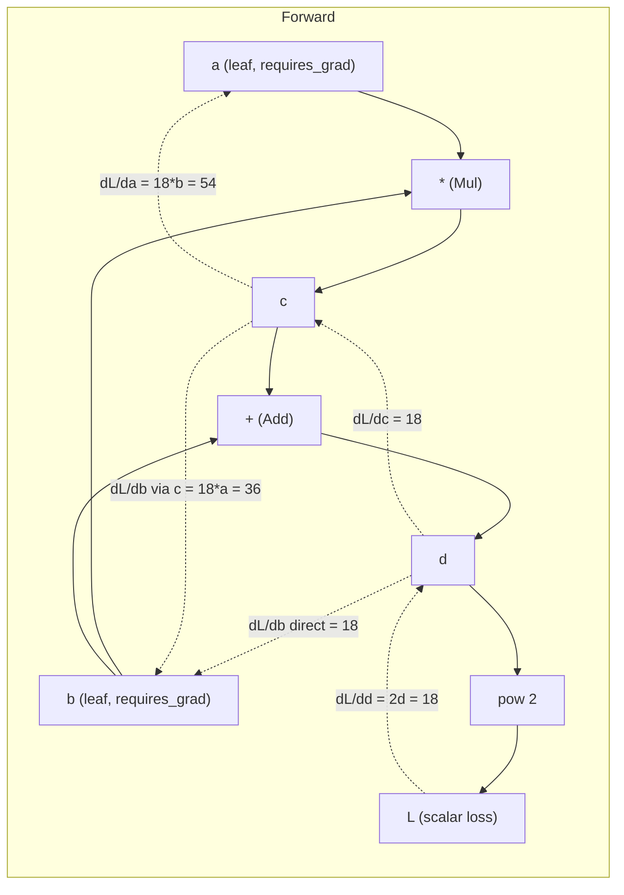
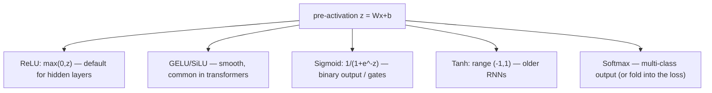
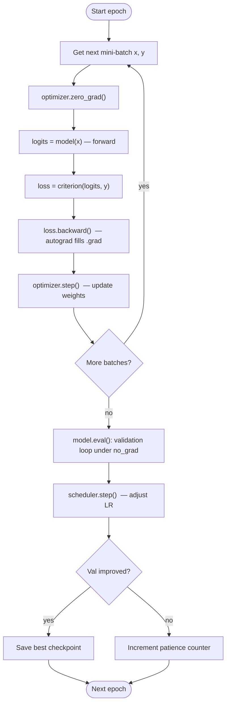
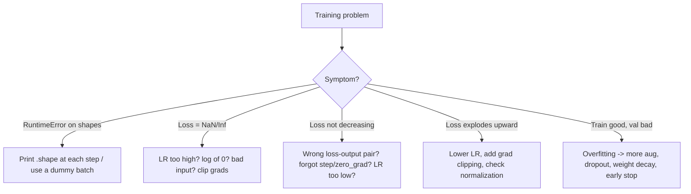
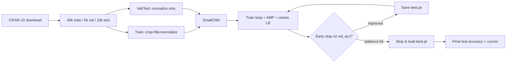

# PyTorch for Deep Learning
*Tensors, autograd, modules, training loops, and a complete CIFAR-10 CNN — the working knowledge of a practitioner who ships models.*

*Part of the AI Engineering & ML Mastery Path — see the [index](../README.md) and [study plan](../MASTER-STUDY-PLAN.md).*

PyTorch is the lingua franca of modern deep learning research and an enormous share of production inference. If you can read and write idiomatic PyTorch, you can read almost any DL paper's reference implementation, fine-tune almost any open model, and debug the training failures that derail beginners. This module takes you from a raw `torch.Tensor` all the way to a fully-trained convolutional network on CIFAR-10 with augmentation, learning-rate scheduling, early stopping, mixed precision, and reproducibility — the exact toolkit you reach for on real work.

> 💡 **Intuition:** PyTorch is "NumPy that runs on the GPU and remembers what you did to it." The "remembers" part is **autograd** — every operation is recorded so gradients can flow backward automatically. Master those two ideas and everything else is library surface area.

---

## 🎯 Learning Objectives

By the end of this module you can:

- **Create, reshape, broadcast, and move tensors** between CPU and GPU, and reason about `dtype` and `device` correctly.
- **Explain autograd** — the dynamic computational graph, `requires_grad`, `.backward()`, gradient accumulation, `torch.no_grad()`, and `.detach()`.
- **Build models** with `nn.Module`, `nn.Linear`, `nn.Conv2d`, `nn.Embedding`, activations, losses, and optimizers.
- **Write the canonical training loop** (`zero_grad → forward → loss → backward → step`) and a matching validation loop.
- **Feed data** efficiently with `Dataset`, `DataLoader`, custom datasets, and `transforms`.
- **Use the GPU well** — `.to(device)`, `autocast`/`GradScaler` mixed precision, and pinned memory.
- **Save and restore** models with `state_dict` and full training checkpoints.
- **Do transfer learning** with `torchvision` pretrained backbones.
- **Debug** shape errors, exploding loss, NaNs, and verify gradients.
- **Reproduce** runs with seeds and deterministic settings.
- **Decide when to reach for PyTorch Lightning** and write a minimal `LightningModule` + `Trainer`.
- **Ship a complete CIFAR-10 CNN project** end to end.

---

## 📋 Prerequisites

- [01 — Python Foundations for AI](01-python-foundations-for-ai.md): functions, classes, context managers, decorators.
- [02 — NumPy & Pandas for Data](02-numpy-pandas-data.md): arrays, dtypes, broadcasting, vectorization (PyTorch tensors mirror NumPy closely).
- [03 — Visualization & EDA](03-visualization-eda.md): you'll plot loss/accuracy curves.
- [04 — Scikit-Learn & Classical ML](04-scikit-learn-classical-ml.md): train/test split, overfitting, metrics, the bias–variance idea.

---

## 📑 Table of Contents

1. [Tensors: The Core Data Structure](#1-tensors-the-core-data-structure)
2. [Autograd & the Dynamic Computational Graph](#2-autograd--the-dynamic-computational-graph)
3. [Building Models with `nn.Module`](#3-building-models-with-nnmodule)
4. [Losses & Optimizers](#4-losses--optimizers)
5. [The Canonical Training & Validation Loop](#5-the-canonical-training--validation-loop)
6. [Datasets, DataLoaders & Transforms](#6-datasets-dataloaders--transforms)
7. [Using the GPU: Device, AMP & Pinned Memory](#7-using-the-gpu-device-amp--pinned-memory)
8. [Saving & Loading Models](#8-saving--loading-models)
9. [Transfer Learning with torchvision](#9-transfer-learning-with-torchvision)
10. [Debugging Deep Learning Code](#10-debugging-deep-learning-code)
11. [Reproducibility](#11-reproducibility)
12. [PyTorch Lightning: When & How](#12-pytorch-lightning-when--how)
13. [🧮 From-Scratch Implementation: Autograd in ~40 Lines](#13--from-scratch-implementation-autograd-in-40-lines)
14. [🚀 Complete Project: A CNN on CIFAR-10](#14--complete-project-a-cnn-on-cifar-10)
15. [❓ Knowledge Check](#-knowledge-check)
16. [🏋️ Exercises](#️-exercises)
17. [📊 Cheat Sheet](#-cheat-sheet)
18. [🔗 Further Resources](#-further-resources)
19. [➡️ What's Next](#️-whats-next)

---

## 1. Tensors: The Core Data Structure

> 💡 **Intuition:** A tensor is just an *n*-dimensional array. A scalar is a 0-D tensor, a vector is 1-D, a matrix is 2-D, an RGB image batch is 4-D `(N, C, H, W)`. PyTorch tensors behave like NumPy arrays but carry two extra superpowers: they can live on a GPU, and they can track gradients.

**Formal note on shape.** A tensor of shape $(d_0, d_1, \dots, d_{k-1})$ has $\prod_{i=0}^{k-1} d_i$ elements stored in a contiguous (by default) block of memory; the **stride** along axis $i$ is the number of elements you skip to advance one step along that axis.

### 1.1 Creation & dtypes

```python
import torch

# From Python data
a = torch.tensor([[1, 2, 3], [4, 5, 6]])          # infers dtype int64
b = torch.tensor([1.0, 2.0, 3.0])                  # float32 (PyTorch default float)

# Factory functions
z = torch.zeros(2, 3)                              # 2x3 of 0.0  (float32)
o = torch.ones(2, 3, dtype=torch.float64)          # explicit dtype
e = torch.empty(2, 3)                              # uninitialized (garbage) memory
r = torch.arange(0, 10, 2)                         # tensor([0, 2, 4, 6, 8])
l = torch.linspace(0, 1, 5)                        # tensor([0.00, 0.25, 0.50, 0.75, 1.00])
g = torch.randn(2, 3)                              # standard normal samples
i = torch.randint(0, 10, (2, 3))                   # ints in [0, 10)

print(a.dtype, a.shape, a.ndim)   # torch.int64 torch.Size([2, 3]) 2
print(b.dtype)                    # torch.float32
print(o.dtype)                    # torch.float64
```

> ⚠️ **Common Pitfall:** The default *float* dtype is `float32`, but `torch.tensor([1, 2, 3])` (integer literals) gives `int64`. Multiplying an `int64` tensor where the model expects `float32` raises a dtype error or silently does integer math. When in doubt, `.float()`.

### 1.2 Reshaping, views, and contiguity

```python
x = torch.arange(12)                  # shape (12,)
x2 = x.view(3, 4)                     # (3, 4) — a VIEW, shares storage with x
x3 = x.reshape(2, 6)                  # reshape: view if possible, else a copy
x4 = x.view(-1, 2)                    # -1 means "infer this dim" -> (6, 2)

xt = x2.t()                           # transpose -> (4, 3) but now NON-contiguous
# xt.view(12)                         # RuntimeError: view needs contiguous memory
flat = xt.contiguous().view(12)       # fix: force a contiguous copy first
flat2 = xt.reshape(12)                # reshape handles it transparently

sq = torch.zeros(1, 3, 1)
print(sq.squeeze().shape)             # torch.Size([3])   — drops size-1 dims
print(sq.unsqueeze(0).shape)          # torch.Size([1, 1, 3, 1]) — adds a dim at 0
print(x2.permute(1, 0).shape)         # torch.Size([4, 3]) — reorder dims
```

> 🎯 **Key Insight:** `view` requires contiguous memory and *shares storage* (cheap, no copy). `reshape` falls back to a copy when needed. After `transpose`/`permute`, call `.contiguous()` before a `view`, or just use `reshape`.

### 1.3 Broadcasting — a shape walkthrough (ASCII)

Broadcasting lets tensors of different shapes combine without explicit copies, following the same rules as NumPy: **align shapes from the right; each dimension must be equal or one of them must be 1.**

```
   A:  (4, 3)        Adding a per-column bias of shape (3,)
   B:     (3,)
        ---------  align from the RIGHT
   A:  (4, 3)
   B:  (1, 3)        B's size-1 (implicit) row is "stretched" to 4 rows
        ---------
 out:  (4, 3)        OK result

   A:  (4, 1)        Outer-product-style broadcast
   B:  (1, 5)
        ---------
 out:  (4, 5)        OK both stretched

   A:  (4, 3)
   B:     (4,)       align right: 3 vs 4 -> mismatch, neither is 1
        ---------
        XX RuntimeError: size mismatch
```

```python
A = torch.arange(12.).reshape(4, 3)
bias = torch.tensor([10., 20., 30.])
print((A + bias).shape)   # torch.Size([4, 3]) — bias added to every row
```

### 1.4 Device & NumPy bridge

```python
device = "cuda" if torch.cuda.is_available() else "cpu"
t = torch.randn(3, 3).to(device)         # move to GPU if available

n = t.cpu().numpy()                       # tensor -> ndarray (must be on CPU)
back = torch.from_numpy(n)                # ndarray -> tensor (SHARES memory!)
```

> ⚠️ **Common Pitfall:** `torch.from_numpy` and `.numpy()` **share** the underlying buffer when on CPU — mutating one mutates the other. Use `.clone()` if you need an independent copy. Also, you cannot call `.numpy()` on a CUDA tensor; move it to CPU first.

**Why it matters for AI/ML:** Every layer input/output, weight, gradient, and dataset batch is a tensor. Fluency with shapes and devices is *the* prerequisite for not fighting your framework.

---

## 2. Autograd & the Dynamic Computational Graph

> 💡 **Intuition:** When `requires_grad=True`, PyTorch secretly records each operation as a node in a graph. Calling `.backward()` walks that graph in reverse, applying the chain rule to compute $\partial(\text{loss}) / \partial(\text{each leaf})$. The graph is **dynamic** — rebuilt every forward pass — so you can use plain Python control flow (`if`, `for`) inside your model.

### 2.1 The chain rule, formally

For a scalar loss $L$ that depends on a parameter $w$ through intermediate values, autograd computes

$$\frac{\partial L}{\partial w} = \sum_{\text{paths } p} \;\prod_{(u \to v) \in p} \frac{\partial v}{\partial u},$$

i.e. it sums the products of local derivatives over all paths from $w$ to $L$. Reverse-mode automatic differentiation does this in **one backward pass** regardless of how many parameters there are — which is why it scales to billions of weights.

### 2.2 A worked example by hand

Let $a = 2.0$, $b = 3.0$, both with `requires_grad=True`, and

$$c = a \cdot b, \qquad d = c + b, \qquad L = d^2.$$

By hand:

- $c = 2 \cdot 3 = 6$, $\;d = 6 + 3 = 9$, $\;L = 81$.
- $\dfrac{\partial L}{\partial d} = 2d = 18$.
- $\dfrac{\partial L}{\partial a} = \dfrac{\partial L}{\partial d}\cdot\dfrac{\partial d}{\partial c}\cdot\dfrac{\partial c}{\partial a} = 18 \cdot 1 \cdot b = 18 \cdot 3 = 54.$
- $\dfrac{\partial L}{\partial b} = \underbrace{18 \cdot 1 \cdot a}_{\text{via } c} + \underbrace{18 \cdot 1}_{\text{direct } d=c+b} = 18\cdot 2 + 18 = 54.$

```python
import torch
a = torch.tensor(2.0, requires_grad=True)
b = torch.tensor(3.0, requires_grad=True)
c = a * b
d = c + b
L = d ** 2
L.backward()
print(L.item())      # 81.0
print(a.grad)        # tensor(54.)   matches hand calc
print(b.grad)        # tensor(54.)   matches hand calc
```

### 2.3 The forward/backward graph



> 🎯 **Key Insight:** Gradients accumulate at leaf tensors by **summing** all incoming paths — which is exactly why `b.grad` ends up `54` (`36 + 18`). It is also why you must call `optimizer.zero_grad()` each step (see §2.4).

### 2.4 Gradient accumulation & `zero_grad`

```python
w = torch.tensor(1.0, requires_grad=True)
for _ in range(3):
    loss = (w * 2) ** 2          # dloss/dw = 8w = 8
    loss.backward()
    print(w.grad.item())         # 8.0, then 16.0, then 24.0  — IT ADDS UP!
```

PyTorch **accumulates** gradients into `.grad` rather than overwriting. In a normal loop this is a footgun (you'd train on stale gradients), so you call `zero_grad()` every step. The same behavior is a *feature* for **gradient accumulation** — simulating a large batch by summing grads over several mini-batches before one `step()`.

### 2.5 `no_grad`, `detach`, and `.item()`

```python
x = torch.randn(3, requires_grad=True)

with torch.no_grad():            # disables graph building -> faster, less memory
    y = x * 2                    # y.requires_grad == False  (use during inference/val)

z = x.detach()                   # same data, severed from the graph (no grad flows back)
val = (x.sum()).item()           # pull a Python float out of a 1-element tensor
```

> ⚠️ **Common Pitfall:** Accumulating a running loss with `total += loss` keeps the *entire graph* alive across iterations and leaks memory. Always detach the scalar: `total += loss.item()` (or `loss.detach()`).

**Why it matters for AI/ML:** Autograd is the engine of all gradient-based learning. Understanding accumulation, `no_grad`, and `detach` is the difference between a training loop that works and one that silently leaks memory or trains on the wrong gradients.

---

## 3. Building Models with `nn.Module`

> 💡 **Intuition:** An `nn.Module` is a container that (a) registers its learnable parameters and child modules automatically, and (b) defines a `forward()` method describing the computation. You never call `forward()` directly — you call the module instance (`model(x)`), which triggers hooks and then `forward`.

### 3.1 Core layers

| Layer | Purpose | Key shapes |
|---|---|---|
| `nn.Linear(in, out)` | Affine map $y = xW^\top + b$ | `(N, in) -> (N, out)` |
| `nn.Conv2d(Cin, Cout, k)` | 2-D convolution | `(N, Cin, H, W) -> (N, Cout, H', W')` |
| `nn.Embedding(V, D)` | Integer id -> dense vector lookup | `(N, T) int -> (N, T, D)` |
| `nn.BatchNorm2d(C)` | Normalize per-channel across batch | shape-preserving |
| `nn.Dropout(p)` | Randomly zero activations (train only) | shape-preserving |

```python
import torch
import torch.nn as nn

class MLP(nn.Module):
    def __init__(self, in_dim=784, hidden=256, out_dim=10):
        super().__init__()                      # ALWAYS call this first
        self.net = nn.Sequential(
            nn.Flatten(),                        # (N,1,28,28) -> (N,784)
            nn.Linear(in_dim, hidden),
            nn.ReLU(),
            nn.Dropout(0.2),
            nn.Linear(hidden, out_dim),          # logits (no softmax here)
        )

    def forward(self, x):
        return self.net(x)

model = MLP()
x = torch.randn(16, 1, 28, 28)
logits = model(x)
print(logits.shape)                              # torch.Size([16, 10])
n_params = sum(p.numel() for p in model.parameters())
print(f"{n_params:,} trainable params")          # 203,530 params
```

> 🎯 **Key Insight:** Output **logits**, not probabilities. PyTorch's `nn.CrossEntropyLoss` expects raw logits and applies log-softmax internally — adding your own softmax causes a numerically worse double-softmax.

### 3.2 Convolution output-size formula

For a `Conv2d` with input spatial size $H$, kernel $k$, padding $p$, stride $s$, dilation $d$:

$$H_{\text{out}} = \left\lfloor \frac{H + 2p - d(k-1) - 1}{s} \right\rfloor + 1.$$

Example: $H=32$, $k=3$, $p=1$, $s=1$, $d=1$ gives $H_\text{out} = \lfloor (32 + 2 - 2 - 1)/1 \rfloor + 1 = 32$ — a "same" convolution. With $s=2$ it halves to $16$.

### 3.3 Activations & their roles



> ⚠️ **Common Pitfall:** `nn.Dropout` and `nn.BatchNorm` behave differently in train vs eval. Forgetting `model.eval()` at validation time (which disables dropout and freezes BN running stats) produces noisy, pessimistic metrics. Pair it with `model.train()` when you go back to training.

**Why it matters for AI/ML:** `nn.Module` is the unit of composition for *every* architecture, from a 2-layer MLP to a 70-billion-parameter LLM. The same `parameters()`, `state_dict()`, and `train()/eval()` API scales the whole way up.

---

## 4. Losses & Optimizers

### 4.1 Common losses

| Loss | Task | Input expectation |
|---|---|---|
| `nn.CrossEntropyLoss` | Multi-class classification | **logits** `(N, C)` + integer targets `(N,)` |
| `nn.BCEWithLogitsLoss` | Binary / multi-label | logits + float targets in `{0,1}` |
| `nn.MSELoss` | Regression | predictions and targets, same shape |
| `nn.NLLLoss` | Classification on log-probs | apply `log_softmax` yourself first |

> 🎯 **Key Insight:** Prefer the `*WithLogits` / `CrossEntropyLoss` variants over manually applying `sigmoid`/`softmax` then `BCELoss`/`NLLLoss`. The fused versions use the **log-sum-exp trick** for numerical stability.

### 4.2 Optimizers and the update rule

Plain SGD updates each parameter $\theta$ with learning rate $\eta$:

$$\theta_{t+1} = \theta_t - \eta \, \nabla_\theta L_t.$$

Adam adapts the step per-parameter using running estimates of the first moment $m_t$ (mean) and second moment $v_t$ (uncentered variance) of the gradient $g_t$:

$$m_t = \beta_1 m_{t-1} + (1-\beta_1) g_t, \quad v_t = \beta_2 v_{t-1} + (1-\beta_2) g_t^2,$$
$$\hat m_t = \frac{m_t}{1-\beta_1^t}, \quad \hat v_t = \frac{v_t}{1-\beta_2^t}, \quad \theta_{t+1} = \theta_t - \eta \frac{\hat m_t}{\sqrt{\hat v_t} + \epsilon}.$$

```python
import torch.optim as optim
opt = optim.SGD(model.parameters(), lr=0.1, momentum=0.9, weight_decay=5e-4)
opt = optim.Adam(model.parameters(), lr=1e-3)        # great default
opt = optim.AdamW(model.parameters(), lr=1e-3, weight_decay=1e-2)  # decoupled WD
```

> 📝 **Tip:** `AdamW` (decoupled weight decay) is the de-facto default for transformers and most modern nets; SGD+momentum with a good LR schedule still wins on many vision benchmarks. Start with `Adam(lr=1e-3)` and only tune once the loop works.

**Why it matters for AI/ML:** The loss defines *what* "good" means; the optimizer defines *how* you get there. A large share of "my model won't learn" issues are a wrong loss/output pairing or a learning rate off by 10x.

---

## 5. The Canonical Training & Validation Loop

This is the single most important pattern in the module. Memorize the core: **`zero_grad → forward → loss → backward → step`**.



```python
import torch

def train_one_epoch(model, loader, criterion, optimizer, device):
    model.train()                                  # enable dropout / BN updates
    running_loss, correct, total = 0.0, 0, 0
    for x, y in loader:
        x, y = x.to(device), y.to(device)
        optimizer.zero_grad()                      # 1. clear old grads
        logits = model(x)                          # 2. forward
        loss = criterion(logits, y)                # 3. loss
        loss.backward()                            # 4. backward (chain rule)
        optimizer.step()                           # 5. update weights

        running_loss += loss.item() * x.size(0)    # .item() -> no graph leak
        correct += (logits.argmax(1) == y).sum().item()
        total += y.size(0)
    return running_loss / total, correct / total

@torch.no_grad()                                   # no graph -> faster, less memory
def evaluate(model, loader, criterion, device):
    model.eval()                                   # disable dropout, freeze BN stats
    running_loss, correct, total = 0.0, 0, 0
    for x, y in loader:
        x, y = x.to(device), y.to(device)
        logits = model(x)
        loss = criterion(logits, y)
        running_loss += loss.item() * x.size(0)
        correct += (logits.argmax(1) == y).sum().item()
        total += y.size(0)
    return running_loss / total, correct / total
```

> ⚠️ **Common Pitfall (the "big four"):** (1) forgetting `zero_grad()` -> gradients accumulate across batches; (2) forgetting `model.train()/eval()` -> dropout/BN misbehave; (3) using `loss` instead of `loss.item()` in your running total -> memory leak; (4) forgetting `optimizer.step()` -> loss never moves. If training does nothing, check these first.

**Why it matters for AI/ML:** Every framework, every model, every paper's reference code is a variation on this loop. Once it is muscle memory, you can focus on the model and data instead of plumbing.

---

## 6. Datasets, DataLoaders & Transforms

> 💡 **Intuition:** A `Dataset` answers two questions — "how many samples?" (`__len__`) and "give me sample *i*" (`__getitem__`). A `DataLoader` wraps it to batch, shuffle, and load in parallel worker processes.

```python
from torch.utils.data import Dataset, DataLoader
import torch

class CSVPointsDataset(Dataset):
    """Minimal custom dataset: features X (N, D) and integer labels y (N,)."""
    def __init__(self, X, y, transform=None):
        self.X = torch.as_tensor(X, dtype=torch.float32)
        self.y = torch.as_tensor(y, dtype=torch.long)
        self.transform = transform

    def __len__(self):
        return len(self.X)

    def __getitem__(self, idx):
        x, label = self.X[idx], self.y[idx]
        if self.transform:
            x = self.transform(x)
        return x, label

import numpy as np
ds = CSVPointsDataset(np.random.randn(100, 4), np.random.randint(0, 3, 100))
loader = DataLoader(ds, batch_size=16, shuffle=True, num_workers=0, drop_last=False)
xb, yb = next(iter(loader))
print(xb.shape, yb.shape)        # torch.Size([16, 4]) torch.Size([16])
```

### 6.1 torchvision transforms (image pipeline)

```python
from torchvision import transforms

train_tf = transforms.Compose([
    transforms.RandomCrop(32, padding=4),         # augmentation
    transforms.RandomHorizontalFlip(),
    transforms.ToTensor(),                         # PIL/np -> (C,H,W) float in [0,1]
    transforms.Normalize(mean=(0.4914, 0.4822, 0.4465),
                          std=(0.2470, 0.2435, 0.2616)),  # CIFAR-10 stats
])
# Validation/test: NO random augmentation, just deterministic normalize
test_tf = transforms.Compose([
    transforms.ToTensor(),
    transforms.Normalize(mean=(0.4914, 0.4822, 0.4465),
                          std=(0.2470, 0.2435, 0.2616)),
])
```

> ⚠️ **Common Pitfall:** Never apply random augmentation to your validation/test set — it makes metrics non-reproducible and biased. Also `shuffle=True` for training only; keep it `False` for val/test so per-sample logging lines up.

> 📝 **Tip:** Set `num_workers > 0` and `pin_memory=True` (when using a GPU) to overlap data loading with compute. On Windows, guard your top-level run code with `if __name__ == "__main__":` because workers re-import the script.

**Why it matters for AI/ML:** Data loading is the most common training bottleneck and the most common source of subtle label/normalization bugs. A clean `Dataset`/`DataLoader` is half of a reliable pipeline.

---

## 7. Using the GPU: Device, AMP & Pinned Memory

### 7.1 Device placement

```python
device = "cuda" if torch.cuda.is_available() else "cpu"
model = model.to(device)                  # move ALL parameters/buffers
# inside the loop:
x, y = x.to(device, non_blocking=True), y.to(device, non_blocking=True)
```

> 🎯 **Key Insight:** Model and data must be on the *same* device. A `RuntimeError: Expected all tensors to be on the same device` almost always means you moved the model but not a batch (or a hand-built tensor).

### 7.2 Mixed precision (AMP) — `autocast` + `GradScaler`

Mixed precision runs most ops in `float16`/`bfloat16` for roughly 2x speed and about half the memory, while keeping a master copy in `float32`. Because `float16` gradients can **underflow to zero**, a `GradScaler` multiplies the loss by a large factor before backward and unscales before the step.

```python
from torch.amp import autocast, GradScaler

scaler = GradScaler("cuda")
for x, y in loader:
    x, y = x.to(device), y.to(device)
    optimizer.zero_grad()
    with autocast("cuda"):                 # ops run in fp16/bf16 where safe
        logits = model(x)
        loss = criterion(logits, y)
    scaler.scale(loss).backward()          # scale up to avoid underflow
    scaler.step(optimizer)                 # unscale + step (skips on inf/nan)
    scaler.update()                        # adjust the scale factor
```

> ⚠️ **Common Pitfall:** Do **not** call `loss.backward()` directly under AMP — go through `scaler.scale(loss).backward()`. And only enable the scaler for `float16`; `bfloat16` (newer GPUs/TPUs) has a wide enough exponent that a scaler is usually unnecessary.

### 7.3 Pinned memory

`pin_memory=True` in the `DataLoader` allocates page-locked host memory, which lets `non_blocking=True` transfers overlap with computation. Worth it on GPU; harmless to omit on CPU-only.

**Why it matters for AI/ML:** AMP often gives a free 1.5–3x throughput boost and lets you fit larger batches/models. It is standard in essentially all modern training scripts.

---

## 8. Saving & Loading Models

> 🎯 **Key Insight:** Save the **`state_dict`** (a plain dict of tensors), not the pickled model object. The state_dict is portable across refactors; pickling the whole module breaks the moment your class definition moves.

```python
# --- Save just the weights ---
torch.save(model.state_dict(), "model.pt")

# --- Load weights into an identically-defined model ---
model = MLP()
model.load_state_dict(torch.load("model.pt", map_location="cpu"))
model.eval()

# --- Full training checkpoint (resume-able) ---
torch.save({
    "epoch": epoch,
    "model_state": model.state_dict(),
    "optim_state": optimizer.state_dict(),
    "scheduler_state": scheduler.state_dict(),
    "scaler_state": scaler.state_dict(),
    "best_val_acc": best_val_acc,
}, "checkpoint.pt")

ckpt = torch.load("checkpoint.pt", map_location=device)
model.load_state_dict(ckpt["model_state"])
optimizer.load_state_dict(ckpt["optim_state"])
scheduler.load_state_dict(ckpt["scheduler_state"])
start_epoch = ckpt["epoch"] + 1
```

> ⚠️ **Common Pitfall:** Loading a checkpoint trained on GPU onto a CPU box fails unless you pass `map_location`. Also, recent PyTorch defaults `torch.load` to `weights_only=True` for security — pass `weights_only=False` only for checkpoints you trust that contain non-tensor objects.

**Why it matters for AI/ML:** Checkpointing lets you resume long runs after crashes/preemption, keep the *best* model (not just the last), and ship inference weights without the training state.

---

## 9. Transfer Learning with torchvision

> 💡 **Intuition:** A network pretrained on ImageNet has already learned reusable visual features (edges -> textures -> object parts). Transfer learning reuses that backbone and only retrains a small head for your task — far less data and compute than training from scratch.

```python
import torch.nn as nn
from torchvision import models

# Load a pretrained ResNet-18 with the modern weights API
weights = models.ResNet18_Weights.DEFAULT
net = models.resnet18(weights=weights)

# 1) Feature-extraction: freeze the backbone
for p in net.parameters():
    p.requires_grad = False

# 2) Replace the classifier head for our 10-class problem
in_features = net.fc.in_features           # 512 for resnet18
net.fc = nn.Linear(in_features, 10)        # new head: requires_grad=True by default

# Only the head's params will be optimized
optimizer = torch.optim.Adam(net.fc.parameters(), lr=1e-3)

# Use the weights' own preprocessing transform for correctness
preprocess = weights.transforms()
```

Two regimes:

| Strategy | When | How |
|---|---|---|
| **Feature extraction** | Small dataset, similar domain | Freeze backbone, train new head only |
| **Fine-tuning** | More data, or domain shift | Unfreeze some/all layers, train with a *small* LR (e.g. `1e-4`) |

> 📝 **Tip:** When fine-tuning, use **discriminative learning rates** — a tiny LR for early layers, a larger one for the head — and always preprocess inputs with the *same* normalization the backbone was trained on (`weights.transforms()` gives you exactly that).

**Why it matters for AI/ML:** Transfer learning is how most applied vision/NLP work gets done — including fine-tuning LLMs. Training from scratch is the exception, not the rule.

---

## 10. Debugging Deep Learning Code



### 10.1 Shape errors

```python
# Sanity-check shapes with a single dummy batch before the real loop:
xb = torch.randn(2, 3, 32, 32)
print(model(xb).shape)        # if this throws, fix the model, not the loop
```

### 10.2 NaNs / exploding loss

- **Lower the learning rate** (the #1 cause of `nan`/explosion).
- **Gradient clipping:** `torch.nn.utils.clip_grad_norm_(model.parameters(), max_norm=1.0)` *after* `backward()` and *before* `step()`.
- **Check inputs:** `assert torch.isfinite(x).all()` — a single `inf`/`nan` in the data poisons everything.
- **Anomaly mode** to find the offending op: `torch.autograd.set_detect_anomaly(True)` (slow; debugging only).

### 10.3 Gradient check (verify autograd / a custom layer)

```python
from torch.autograd import gradcheck
x = torch.randn(5, dtype=torch.double, requires_grad=True)  # double precision needed
test = gradcheck(lambda t: (t ** 2).sum(), (x,), eps=1e-6, atol=1e-4)
print(test)        # True — analytical grads match numerical finite differences
```

> 🎯 **Key Insight:** `gradcheck` compares autograd's gradients against finite-difference numerical gradients. Use `float64` inputs; `float32` is too imprecise and gives false failures.

**Why it matters for AI/ML:** Deep learning fails *silently* far more often than it errors loudly. A disciplined symptom-to-cause checklist saves hours of staring at a flat loss curve.

---

## 11. Reproducibility

```python
import torch, random
import numpy as np

def set_seed(seed=42):
    random.seed(seed)
    np.random.seed(seed)
    torch.manual_seed(seed)
    torch.cuda.manual_seed_all(seed)
    # Deterministic (slower) cuDNN behavior:
    torch.backends.cudnn.deterministic = True
    torch.backends.cudnn.benchmark = False

set_seed(42)
# For full determinism (will error if a non-deterministic op is used):
# torch.use_deterministic_algorithms(True)
```

To make DataLoader workers reproducible, also seed them:

```python
def seed_worker(worker_id):
    worker_seed = torch.initial_seed() % 2**32
    np.random.seed(worker_seed)
    random.seed(worker_seed)

g = torch.Generator(); g.manual_seed(42)
loader = DataLoader(ds, batch_size=16, shuffle=True,
                    worker_init_fn=seed_worker, generator=g)
```

> ⚠️ **Common Pitfall:** `cudnn.benchmark = True` speeds up convolutions by auto-tuning algorithms but introduces nondeterminism. For reproducible research set it `False`; for max speed on fixed input sizes leave it `True`.

**Why it matters for AI/ML:** You can't compare two changes if your runs aren't repeatable. Seeds and determinism turn "it got better, maybe?" into a real experiment.

---

## 12. PyTorch Lightning: When & How

> 💡 **Intuition:** Lightning keeps your *research code* (model, loss, optimizer config) and removes the *engineering boilerplate* (the loop, `.to(device)`, AMP, multi-GPU, checkpointing, logging). You write a `LightningModule`; a `Trainer` runs it.

```python
import lightning as L          # `pip install lightning`
import torch.nn.functional as F

class LitMLP(L.LightningModule):
    def __init__(self, lr=1e-3):
        super().__init__()
        self.save_hyperparameters()
        self.model = MLP()

    def forward(self, x):
        return self.model(x)

    def training_step(self, batch, batch_idx):
        x, y = batch
        loss = F.cross_entropy(self(x), y)
        self.log("train_loss", loss, prog_bar=True)
        return loss                      # Lightning calls backward()/step() for you

    def validation_step(self, batch, batch_idx):
        x, y = batch
        logits = self(x)
        loss = F.cross_entropy(logits, y)
        acc = (logits.argmax(1) == y).float().mean()
        self.log_dict({"val_loss": loss, "val_acc": acc}, prog_bar=True)

    def configure_optimizers(self):
        return torch.optim.Adam(self.parameters(), lr=self.hparams.lr)

# trainer handles device, AMP, loops, checkpoints, early stopping:
trainer = L.Trainer(max_epochs=10, accelerator="auto",
                    precision="16-mixed", log_every_n_steps=10)
# trainer.fit(LitMLP(), train_loader, val_loader)
```

| Use raw PyTorch when… | Use Lightning when… |
|---|---|
| Learning the fundamentals (this module!) | You want multi-GPU/TPU "for free" |
| Highly custom/exotic training loops | Standard supervised loop with logging/checkpointing |
| Minimal dependencies | You value reproducible, structured experiments |

> 📝 **Tip:** Learn the raw loop *first* (so you understand what Lightning is doing), then adopt Lightning for real projects to cut boilerplate and bugs.

**Why it matters for AI/ML:** Lightning (and similar tools — HF `Trainer`, `accelerate`) is what most teams use to scale from a laptop to a multi-GPU cluster without rewriting the loop.

---

## 13. 🧮 From-Scratch Implementation: Autograd in ~40 Lines

To truly understand `.backward()`, build a micro reverse-mode autograd engine (in the spirit of Karpathy's `micrograd`) over scalars, using only the standard library.

```python
import math

class Value:
    """A scalar that records its operation graph for reverse-mode autodiff."""
    def __init__(self, data, _children=(), _op=""):
        self.data = data
        self.grad = 0.0
        self._backward = lambda: None        # local backprop closure
        self._prev = set(_children)
        self._op = _op

    def __add__(self, other):
        other = other if isinstance(other, Value) else Value(other)
        out = Value(self.data + other.data, (self, other), "+")
        def _backward():
            self.grad  += 1.0 * out.grad     # d(a+b)/da = 1
            other.grad += 1.0 * out.grad
        out._backward = _backward
        return out

    def __mul__(self, other):
        other = other if isinstance(other, Value) else Value(other)
        out = Value(self.data * other.data, (self, other), "*")
        def _backward():
            self.grad  += other.data * out.grad   # d(a*b)/da = b
            other.grad += self.data  * out.grad
        out._backward = _backward
        return out

    def tanh(self):
        t = math.tanh(self.data)
        out = Value(t, (self,), "tanh")
        def _backward():
            self.grad += (1 - t ** 2) * out.grad  # d/dx tanh = 1 - tanh^2
        out._backward = _backward
        return out

    def backward(self):
        # topological sort so children are processed after parents
        topo, visited = [], set()
        def build(v):
            if v not in visited:
                visited.add(v)
                for child in v._prev:
                    build(child)
                topo.append(v)
        build(self)
        self.grad = 1.0                       # seed dL/dL = 1
        for v in reversed(topo):
            v._backward()

# --- verify against the §2.2 hand calculation ---
a = Value(2.0); b = Value(3.0)
c = a * b; d = c + b; L = d * d
L.backward()
print(L.data)     # 81.0
print(a.grad)     # 54.0   matches PyTorch
print(b.grad)     # 54.0   matches PyTorch
```

> 🎯 **Key Insight:** Real PyTorch autograd is exactly this idea — a topological sort of the graph plus per-op local backward rules — generalized to tensors, run in C++/CUDA, with memory and dispatch optimizations.

---

## 14. 🚀 Complete Project: A CNN on CIFAR-10

We now assemble everything into one trainable script: a small CNN trained on **CIFAR-10** (60,000 32x32 color images, 10 classes) with a **train/val split**, **data augmentation**, **LR scheduling** (cosine annealing), **early stopping**, **AMP**, **checkpointing**, and **reported metrics/curves**.



### 14.1 The model

```python
import torch, torch.nn as nn

class SmallCNN(nn.Module):
    """3 conv blocks (BN+ReLU+pool) -> global avg pool -> linear head."""
    def __init__(self, num_classes=10):
        super().__init__()
        def block(cin, cout):
            return nn.Sequential(
                nn.Conv2d(cin, cout, 3, padding=1, bias=False),
                nn.BatchNorm2d(cout), nn.ReLU(inplace=True),
                nn.Conv2d(cout, cout, 3, padding=1, bias=False),
                nn.BatchNorm2d(cout), nn.ReLU(inplace=True),
                nn.MaxPool2d(2),            # halves H,W
            )
        self.features = nn.Sequential(
            block(3, 64),                   # 32 -> 16
            block(64, 128),                 # 16 -> 8
            block(128, 256),                # 8  -> 4
        )
        self.head = nn.Sequential(
            nn.AdaptiveAvgPool2d(1),        # (N,256,4,4) -> (N,256,1,1)
            nn.Flatten(),                   # -> (N,256)
            nn.Dropout(0.3),
            nn.Linear(256, num_classes),    # logits
        )

    def forward(self, x):
        return self.head(self.features(x))
```

### 14.2 Data, split, and loaders

```python
import torch
from torch.utils.data import DataLoader, random_split
from torchvision import datasets, transforms

MEAN, STD = (0.4914, 0.4822, 0.4465), (0.2470, 0.2435, 0.2616)
train_tf = transforms.Compose([
    transforms.RandomCrop(32, padding=4),
    transforms.RandomHorizontalFlip(),
    transforms.ToTensor(),
    transforms.Normalize(MEAN, STD),
])
eval_tf = transforms.Compose([transforms.ToTensor(), transforms.Normalize(MEAN, STD)])

full_train = datasets.CIFAR10("./data", train=True, download=True, transform=train_tf)
test_set   = datasets.CIFAR10("./data", train=False, download=True, transform=eval_tf)

# 45k/5k train/val split. NOTE: the val subset still carries train_tf augmentation;
# for a clean val pipeline, build a second dataset with eval_tf and Subset the same indices.
n_val = 5000
train_set, val_set = random_split(full_train, [len(full_train) - n_val, n_val],
                                  generator=torch.Generator().manual_seed(42))

dl_kwargs = dict(batch_size=128, num_workers=2, pin_memory=True)
train_loader = DataLoader(train_set, shuffle=True, **dl_kwargs)
val_loader   = DataLoader(val_set,   shuffle=False, **dl_kwargs)
test_loader  = DataLoader(test_set,  shuffle=False, **dl_kwargs)
```

### 14.3 Training with cosine LR, AMP, early stopping & checkpointing

```python
from torch.amp import autocast, GradScaler

def run(epochs=40, patience=7, lr=0.1):
    device = "cuda" if torch.cuda.is_available() else "cpu"
    model = SmallCNN().to(device)
    criterion = nn.CrossEntropyLoss()
    optimizer = torch.optim.SGD(model.parameters(), lr=lr, momentum=0.9,
                                weight_decay=5e-4, nesterov=True)
    scheduler = torch.optim.lr_scheduler.CosineAnnealingLR(optimizer, T_max=epochs)
    scaler = GradScaler("cuda", enabled=(device == "cuda"))

    history = {"train_loss": [], "val_loss": [], "val_acc": []}
    best_acc, epochs_no_improve = 0.0, 0

    for epoch in range(epochs):
        # ---- train ----
        model.train(); running = 0.0
        for x, y in train_loader:
            x, y = x.to(device, non_blocking=True), y.to(device, non_blocking=True)
            optimizer.zero_grad()
            with autocast("cuda", enabled=(device == "cuda")):
                loss = criterion(model(x), y)
            scaler.scale(loss).backward()
            scaler.step(optimizer); scaler.update()
            running += loss.item() * x.size(0)
        train_loss = running / len(train_set)

        # ---- validate ----
        model.eval(); v_loss, correct = 0.0, 0
        with torch.no_grad():
            for x, y in val_loader:
                x, y = x.to(device), y.to(device)
                logits = model(x)
                v_loss += criterion(logits, y).item() * x.size(0)
                correct += (logits.argmax(1) == y).sum().item()
        val_loss = v_loss / len(val_set); val_acc = correct / len(val_set)

        scheduler.step()
        history["train_loss"].append(train_loss)
        history["val_loss"].append(val_loss)
        history["val_acc"].append(val_acc)
        print(f"epoch {epoch:02d}  train_loss {train_loss:.3f}  "
              f"val_loss {val_loss:.3f}  val_acc {val_acc:.3f}  "
              f"lr {scheduler.get_last_lr()[0]:.4f}")

        # ---- early stopping + checkpoint best ----
        if val_acc > best_acc:
            best_acc, epochs_no_improve = val_acc, 0
            torch.save(model.state_dict(), "best.pt")
        else:
            epochs_no_improve += 1
            if epochs_no_improve >= patience:
                print(f"Early stopping at epoch {epoch} (best val_acc {best_acc:.3f})")
                break

    model.load_state_dict(torch.load("best.pt", map_location=device))
    return model, history

# if __name__ == "__main__":     # required on Windows for num_workers>0
#     model, history = run()
```

### 14.4 Final evaluation & reporting

```python
@torch.no_grad()
def test_accuracy(model, loader, device):
    model.eval(); correct = total = 0
    for x, y in loader:
        x, y = x.to(device), y.to(device)
        correct += (model(x).argmax(1) == y).sum().item()
        total += y.size(0)
    return correct / total

# acc = test_accuracy(model, test_loader, device)
# print(f"Test accuracy: {acc:.3%}")
```

**Expected behavior & curves (described).** With this recipe you should see:

- **Train loss** falling smoothly from about 2.0 (random guess is $-\ln \frac1{10} \approx 2.303$) toward about 0.3.
- **Val accuracy** climbing fast in the first ~10 epochs, then plateauing; cosine LR produces a characteristic late-epoch bump as the LR anneals toward 0.
- **Final test accuracy ~88–91%** for this small CNN with augmentation (a plain MLP tops out near ~50%; a ResNet-18 trained from scratch reaches ~93–95%).
- A **train-vs-val loss gap** that widens slightly late in training — that gap *is* your overfitting signal, and early stopping + augmentation + weight decay keep it in check.

To visualize, plot `history["train_loss"]` and `history["val_loss"]` on one axes and `history["val_acc"]` on another (see [Module 03](03-visualization-eda.md) for Matplotlib patterns):

```python
import matplotlib.pyplot as plt
fig, (ax1, ax2) = plt.subplots(1, 2, figsize=(11, 4))
ax1.plot(history["train_loss"], label="train"); ax1.plot(history["val_loss"], label="val")
ax1.set(title="Loss", xlabel="epoch"); ax1.legend()
ax2.plot(history["val_acc"]); ax2.set(title="Val accuracy", xlabel="epoch")
plt.tight_layout(); plt.show()
```

> 📝 **Tip:** For a rigorously clean validation set (no train-time augmentation leaking in), wrap the *same* val indices around a second `CIFAR10(..., transform=eval_tf)` via `torch.utils.data.Subset`, rather than splitting the augmented dataset directly.

---

## ❓ Knowledge Check

<details>
<summary>1. What is the default float dtype in PyTorch, and what dtype does <code>torch.tensor([1, 2, 3])</code> produce?</summary>

The default float dtype is **`torch.float32`**. But `torch.tensor([1, 2, 3])` uses integer literals, so it infers **`torch.int64`**. To get floats, write `torch.tensor([1., 2., 3.])` or call `.float()`.
</details>

<details>
<summary>2. Why must you call <code>optimizer.zero_grad()</code> every iteration?</summary>

Because PyTorch **accumulates** (sums) gradients into `.grad` instead of overwriting them. Without zeroing, each batch's gradients add to the previous batch's, so you'd update on stale, summed gradients. (This accumulation is deliberately useful for gradient-accumulation across micro-batches.)
</details>

<details>
<summary>3. What is the difference between <code>view</code> and <code>reshape</code>?</summary>

`view` returns a **new view sharing storage** and requires the tensor to be contiguous — it fails on non-contiguous tensors (e.g. after `transpose`). `reshape` returns a view when possible and otherwise makes a **copy**, so it always succeeds. After `transpose`/`permute`, use `.contiguous().view(...)` or just `reshape`.
</details>

<details>
<summary>4. When and why do you use <code>torch.no_grad()</code>?</summary>

During **inference and validation**, where you don't need gradients. It disables graph construction, which **saves memory and speeds up** computation. Note it's different from `model.eval()`: `eval()` switches dropout/BN to inference mode; `no_grad()` stops gradient tracking. You typically use both together during validation.
</details>

<details>
<summary>5. Why output logits instead of probabilities, and how does <code>CrossEntropyLoss</code> use them?</summary>

`nn.CrossEntropyLoss` internally applies **log-softmax then NLL loss** using the numerically stable log-sum-exp trick. If you applied softmax yourself, you'd double-apply it and lose numerical stability. So your model's final layer should emit **raw logits**.
</details>

<details>
<summary>6. What does <code>.detach()</code> do, and how does it differ from <code>.item()</code>?</summary>

`.detach()` returns a tensor **sharing the same data but severed from the autograd graph** (no gradient flows back through it). `.item()` extracts a **Python scalar** from a single-element tensor (also detached, but returns a plain float/int, not a tensor). Use `loss.item()` when summing losses to avoid keeping the graph alive.
</details>

<details>
<summary>7. In mixed-precision training, what problem does <code>GradScaler</code> solve?</summary>

In `float16`, small gradients can **underflow to zero**. `GradScaler` multiplies the loss by a large scale factor before `.backward()` so gradients stay representable, then **unscales** them before `optimizer.step()`, and dynamically adjusts the scale (skipping steps where it detects `inf`/`nan`). It's needed for fp16; bf16 usually doesn't require it.
</details>

<details>
<summary>8. You get <code>RuntimeError: Expected all tensors to be on the same device</code>. What's the likely cause?</summary>

You moved the **model** to GPU (`model.to(device)`) but a batch (or a manually created tensor inside the model/loop) is still on the CPU, or vice versa. Fix by moving every input batch with `x.to(device)` and ensuring any tensors you build in `forward` are created on the right device.
</details>

<details>
<summary>9. Why is it wrong to apply random augmentation to the validation/test set?</summary>

Validation/test metrics must be **deterministic and representative** of real inference, where you don't randomly crop/flip inputs. Random augmentation makes metrics noisy and non-reproducible, and can bias model selection. Use deterministic transforms (resize/normalize) for eval.
</details>

<details>
<summary>10. What should you save to disk — the model object or its <code>state_dict</code>? Why?</summary>

The **`state_dict`** (a dict of tensors). Pickling the whole model object ties the file to your exact class definition and import paths, which break on refactor. A `state_dict` loads into any identically-architected model and is far more portable.
</details>

<details>
<summary>11. Name three things to check first when training loss stays flat.</summary>

(1) Did you call `optimizer.step()`? (2) Did you call `optimizer.zero_grad()` and `loss.backward()` in the right order? (3) Is the **learning rate** reasonable (not too small)? Also verify the loss/output pairing (logits vs probs) and that `model.train()` is set. A flat loss almost always traces to one of these plumbing issues.
</details>

<details>
<summary>12. What does PyTorch Lightning automate, and when should you NOT bother with it?</summary>

Lightning automates the **training/validation loop, device placement, AMP, multi-GPU/TPU distribution, checkpointing, and logging** — you just define `training_step`, `validation_step`, and `configure_optimizers`. Skip it when learning fundamentals (you want to see the raw loop) or when your training loop is highly custom/exotic and the abstraction fights you.
</details>

---

## 🏋️ Exercises

<details>
<summary><b>Exercise 1 (Warm-up):</b> Create a (4, 4) tensor of the integers 0–15, extract its diagonal, and add a row-vector bias <code>[10, 20, 30, 40]</code> to every row using broadcasting.</summary>

```python
import torch
x = torch.arange(16).reshape(4, 4)
print(torch.diagonal(x))               # tensor([ 0,  5, 10, 15])
bias = torch.tensor([10, 20, 30, 40])
print(x + bias)                        # bias broadcast across all 4 rows
# tensor([[10, 21, 32, 43],
#         [14, 25, 36, 47],
#         [18, 29, 40, 51],
#         [22, 33, 44, 55]])
```
The bias of shape `(4,)` aligns to the rightmost dim of `(4, 4)` and is stretched across rows.
</details>

<details>
<summary><b>Exercise 2 (Autograd):</b> For <code>f(x) = x^3 + 2x</code> at x=2, compute f'(x) with autograd and confirm it equals the analytic derivative 3x^2 + 2.</summary>

Analytic: $f'(2) = 3(4) + 2 = 14$.

```python
import torch
x = torch.tensor(2.0, requires_grad=True)
f = x**3 + 2*x
f.backward()
print(x.grad)        # tensor(14.)  matches 3x^2 + 2 = 14
```
</details>

<details>
<summary><b>Exercise 3 (Custom Dataset):</b> Write a <code>Dataset</code> that wraps a NumPy feature matrix and label vector, applies an optional standardization transform, and works with a <code>DataLoader</code>.</summary>

```python
import numpy as np, torch
from torch.utils.data import Dataset, DataLoader

class StandardizeTransform:
    def __init__(self, mean, std):
        self.mean = torch.as_tensor(mean, dtype=torch.float32)
        self.std  = torch.as_tensor(std,  dtype=torch.float32)
    def __call__(self, x):
        return (x - self.mean) / (self.std + 1e-8)

class TabularDataset(Dataset):
    def __init__(self, X, y, transform=None):
        self.X = torch.as_tensor(X, dtype=torch.float32)
        self.y = torch.as_tensor(y, dtype=torch.long)
        self.transform = transform
    def __len__(self):
        return len(self.X)
    def __getitem__(self, i):
        x = self.X[i]
        if self.transform:
            x = self.transform(x)
        return x, self.y[i]

X = np.random.randn(200, 5).astype("float32")
y = np.random.randint(0, 2, 200)
tf = StandardizeTransform(X.mean(0), X.std(0))
ds = TabularDataset(X, y, transform=tf)
loader = DataLoader(ds, batch_size=32, shuffle=True)
xb, yb = next(iter(loader))
print(xb.shape, yb.shape)          # torch.Size([32, 5]) torch.Size([32])
print(xb.mean(0).abs().max() < 1)  # tensor(True) — roughly standardized
```
</details>

<details>
<summary><b>Exercise 4 (MLP for MNIST from scratch):</b> Build, train, and evaluate a 2-hidden-layer MLP on MNIST. Report test accuracy.</summary>

```python
import torch, torch.nn as nn
from torch.utils.data import DataLoader
from torchvision import datasets, transforms

device = "cuda" if torch.cuda.is_available() else "cpu"
tf = transforms.Compose([transforms.ToTensor(),
                         transforms.Normalize((0.1307,), (0.3081,))])
train = datasets.MNIST("./data", train=True,  download=True, transform=tf)
test  = datasets.MNIST("./data", train=False, download=True, transform=tf)
train_loader = DataLoader(train, batch_size=128, shuffle=True)
test_loader  = DataLoader(test,  batch_size=256, shuffle=False)

model = nn.Sequential(
    nn.Flatten(),
    nn.Linear(784, 256), nn.ReLU(), nn.Dropout(0.2),
    nn.Linear(256, 128), nn.ReLU(),
    nn.Linear(128, 10),
).to(device)
criterion = nn.CrossEntropyLoss()
opt = torch.optim.Adam(model.parameters(), lr=1e-3)

for epoch in range(3):                       # ~97-98% test acc after a few epochs
    model.train()
    for x, y in train_loader:
        x, y = x.to(device), y.to(device)
        opt.zero_grad()
        loss = criterion(model(x), y)
        loss.backward(); opt.step()

model.eval(); correct = total = 0
with torch.no_grad():
    for x, y in test_loader:
        x, y = x.to(device), y.to(device)
        correct += (model(x).argmax(1) == y).sum().item(); total += y.size(0)
print(f"MNIST test accuracy: {correct/total:.3%}")   # ~0.975
```
</details>

<details>
<summary><b>Exercise 5 (AMP + scheduler):</b> Take the MNIST MLP from Exercise 4 and add mixed-precision training plus a <code>StepLR</code> scheduler that decays the LR by 10x every 2 epochs.</summary>

```python
import torch, torch.nn as nn
from torch.amp import autocast, GradScaler

device = "cuda" if torch.cuda.is_available() else "cpu"
# ...reuse model, train_loader, criterion from Exercise 4...
opt = torch.optim.Adam(model.parameters(), lr=1e-3)
scheduler = torch.optim.lr_scheduler.StepLR(opt, step_size=2, gamma=0.1)
scaler = GradScaler("cuda", enabled=(device == "cuda"))

for epoch in range(6):
    model.train()
    for x, y in train_loader:
        x, y = x.to(device), y.to(device)
        opt.zero_grad()
        with autocast("cuda", enabled=(device == "cuda")):
            loss = criterion(model(x), y)
        scaler.scale(loss).backward()
        scaler.step(opt); scaler.update()
    scheduler.step()
    print(f"epoch {epoch}  lr={scheduler.get_last_lr()[0]:.5f}")
# lr schedule (gamma=0.1, step=2): 1e-3, 1e-3, 1e-4, 1e-4, 1e-5, 1e-5
```

Key points: `scaler.scale(loss).backward()` replaces `loss.backward()`; `scheduler.step()` is called **once per epoch** (not per batch) for `StepLR`.
</details>

<details>
<summary><b>Exercise 6 (Transfer learning + fine-tuning):</b> Use a pretrained ResNet-18 as a feature extractor for a 10-class problem, then describe how you'd switch to fine-tuning.</summary>

```python
import torch.nn as nn
from torchvision import models

weights = models.ResNet18_Weights.DEFAULT
net = models.resnet18(weights=weights)
for p in net.parameters():            # freeze backbone
    p.requires_grad = False
net.fc = nn.Linear(net.fc.in_features, 10)   # new trainable head

# Feature-extraction phase: optimize only the head
opt = torch.optim.Adam(net.fc.parameters(), lr=1e-3)

# --- To fine-tune afterward ---
# 1) Unfreeze (some or all) backbone layers:
for p in net.parameters():
    p.requires_grad = True
# 2) Use a SMALL learning rate so you don't destroy pretrained features:
opt = torch.optim.AdamW(net.parameters(), lr=1e-4, weight_decay=1e-2)
# 3) Optionally use discriminative LRs (low for early layers, higher for head)
#    via optimizer param groups, and ALWAYS preprocess with weights.transforms().
```

Rule of thumb: feature-extract when data is scarce/similar; fine-tune (small LR) when you have more data or a domain shift.
</details>

---

## 📊 Cheat Sheet

**Tensor essentials**

| Task | Code |
|---|---|
| Create | `torch.tensor`, `zeros`, `ones`, `randn`, `arange`, `linspace` |
| Shape | `.shape`, `.view`, `.reshape`, `.permute`, `.squeeze`, `.unsqueeze` |
| Device | `.to(device)`, `.cuda()`, `.cpu()` |
| NumPy | `.numpy()` / `torch.from_numpy()` (share memory!) |
| Scalar out | `.item()` |

**Autograd**

| Concept | Code / Note |
|---|---|
| Track grads | `x.requires_grad_(True)` |
| Backprop | `loss.backward()` (loss must be scalar) |
| Read grad | `x.grad` (accumulates — zero it!) |
| No graph | `with torch.no_grad():` / `@torch.no_grad()` |
| Sever graph | `x.detach()` |

**The training loop (memorize)**

```text
for epoch:
  model.train()
  for x, y in train_loader:
    x, y = x.to(dev), y.to(dev)
    optimizer.zero_grad()      # 1
    out  = model(x)            # 2 forward
    loss = criterion(out, y)   # 3 loss
    loss.backward()            # 4 backward
    optimizer.step()           # 5 update
  model.eval(); with torch.no_grad(): <validate>
  scheduler.step()
```

**Losses vs tasks**

| Task | Loss | Final layer |
|---|---|---|
| Multi-class | `CrossEntropyLoss` | logits `(N, C)` |
| Binary/multi-label | `BCEWithLogitsLoss` | logits |
| Regression | `MSELoss` / `L1Loss` | raw values |

**GPU / AMP / save**

| Need | Code |
|---|---|
| Device | `device = "cuda" if torch.cuda.is_available() else "cpu"` |
| AMP | `with autocast("cuda"):` + `GradScaler` |
| DataLoader speed | `num_workers>0`, `pin_memory=True`, `non_blocking=True` |
| Save weights | `torch.save(model.state_dict(), "m.pt")` |
| Load weights | `model.load_state_dict(torch.load("m.pt", map_location=dev))` |

**Debug checklist:** flat loss -> check `step`/`zero_grad`/LR · NaN -> lower LR, clip grads, check inputs · shape error -> print `.shape` on a dummy batch · train >> val -> augment/dropout/weight-decay/early-stop.

---

## 🔗 Further Resources

### Free

- **PyTorch Official Tutorials** — the canonical "60-Minute Blitz" plus task-specific guides; best starting point. https://pytorch.org/tutorials/
- **"Deep Learning with PyTorch" (Stevens, Antiga, Viehmann)** — the official book, free PDF; best for a thorough, principled grounding. https://pytorch.org/assets/deep-learning/Deep-Learning-with-PyTorch.pdf
- **fast.ai — "Practical Deep Learning for Coders"** — best top-down, get-results-fast course; great complement to bottom-up PyTorch. https://course.fast.ai/
- **Andrej Karpathy — "Neural Networks: Zero to Hero"** — best for *truly* understanding autograd/backprop (builds micrograd, then GPT) from scratch. https://karpathy.ai/zero-to-hero.html
- **PyTorch Lightning Docs** — best reference for scaling beyond the raw loop. https://lightning.ai/docs/pytorch/stable/

### Paid (worth it)

- **Udemy — "PyTorch for Deep Learning Bootcamp" (Daniel Bourke)** ★★★★☆ — best long, hands-on, project-driven path from tensors to deployment; excellent for learners who want structured, exhaustive coverage. https://www.udemy.com/course/pytorch-for-deep-learning/

---

## ➡️ What's Next

Continue to **[06 — AI Engineering with LLMs in Python](06-ai-engineering-llms-python.md)**, where you'll move from training your own networks to building applications on top of large language models.
