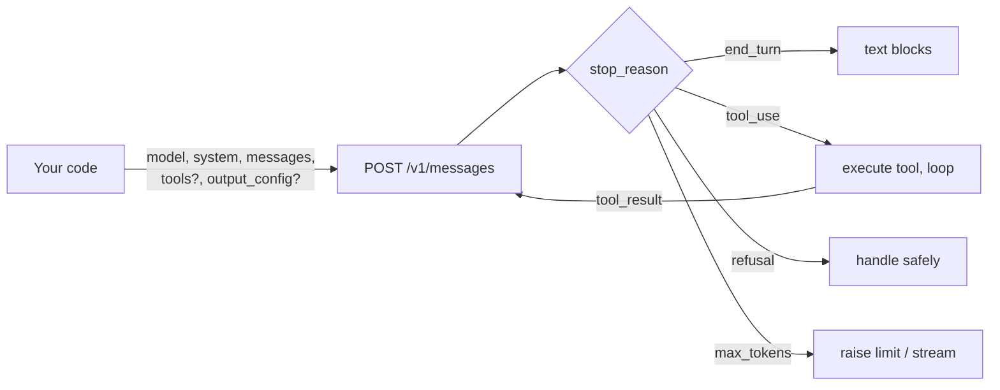
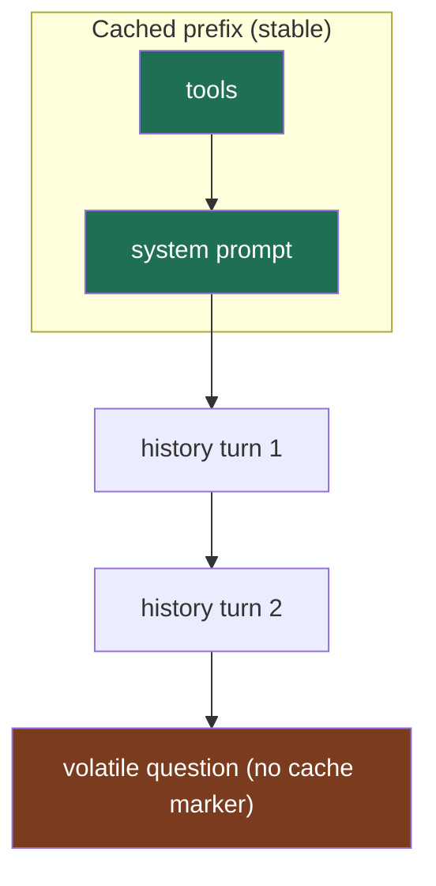
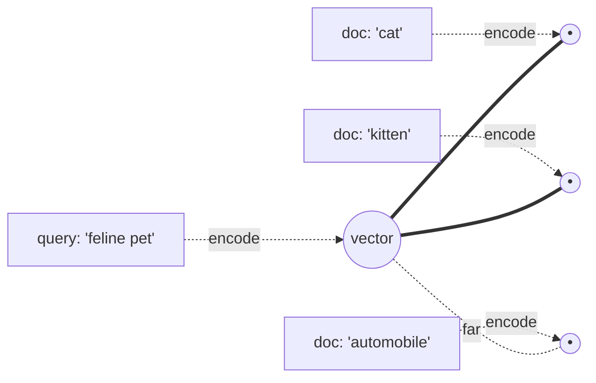
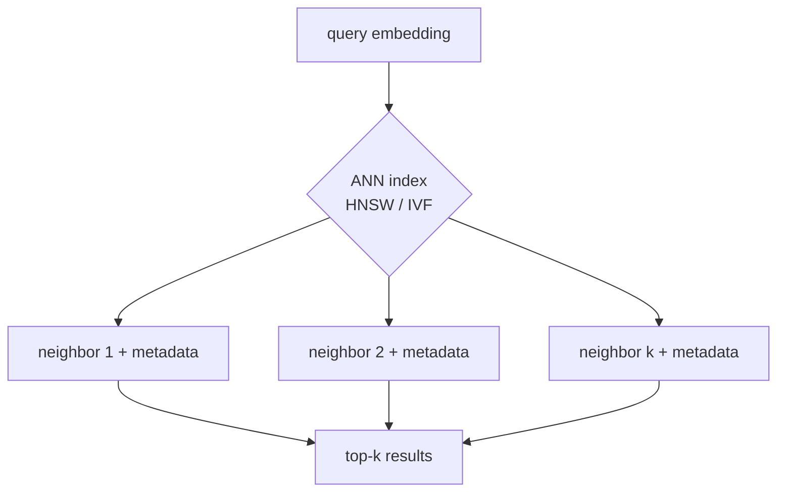
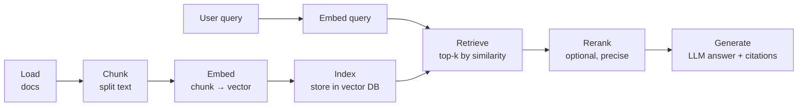
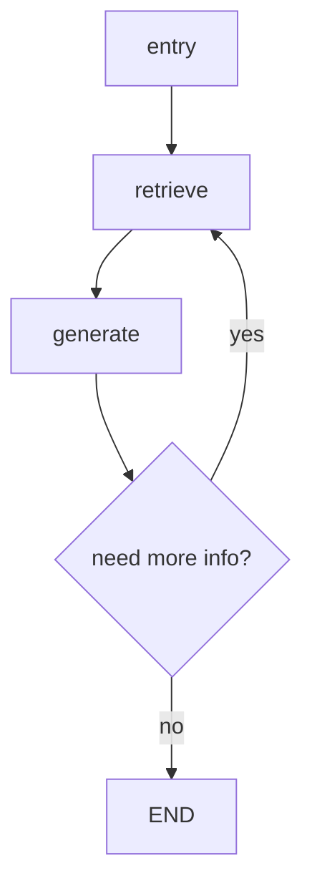
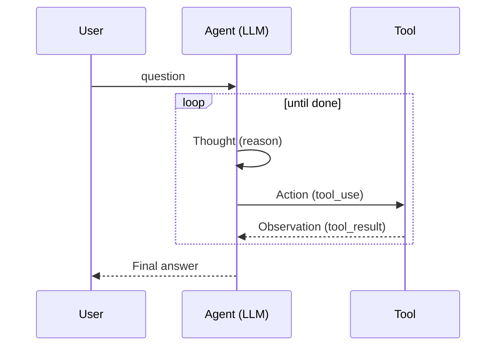
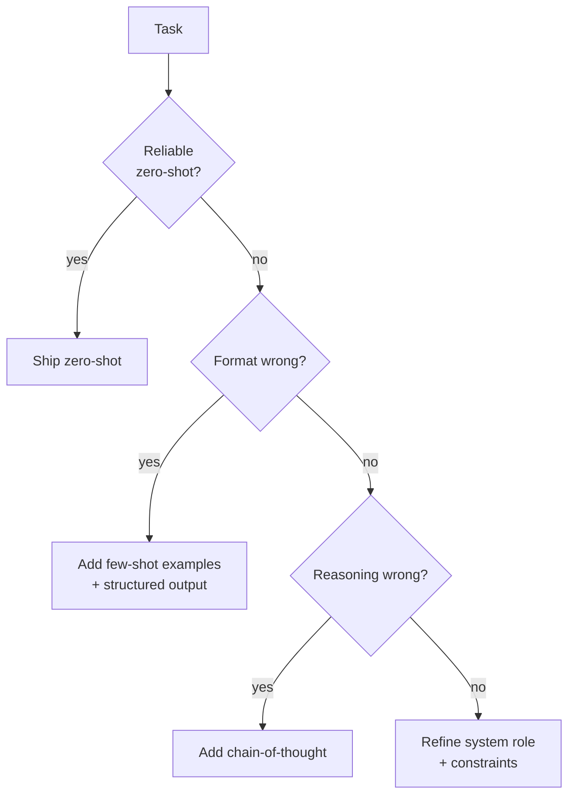
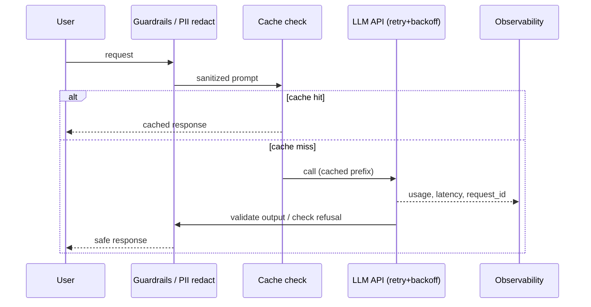

# AI Engineering in Python — LLM APIs, RAG, Agents & Production

*A senior-to-senior, teach-others-grade field guide to building production LLM applications in Python — from a single Claude API call to a complete RAG assistant with citations and an eval harness.*

*Part of the AI Engineering & ML Mastery Path — see the [index](../README.md) and [study plan](../MASTER-STUDY-PLAN.md).*

---

AI engineering is the discipline of turning a probabilistic text model into a reliable software component. The model is the easy part — it is one HTTP call. The engineering is everything around it: retrieval that surfaces the right context, agents that loop safely, retries that survive a flaky network, caches that cut your bill by 90%, evals that tell you whether your last "improvement" actually helped, and guardrails that keep secrets out of logs.

This chapter is exhaustive and runnable. Every Python snippet targets **Python 3.11+** and runs as-is (given the right API keys); expected output appears in `# →` comments. We use the current Anthropic SDK (`anthropic`, `client.messages.create`) and the current model-id family (`claude-opus-4-x` / `claude-sonnet-4-x` / `claude-haiku-4-x`), with OpenAI parallels where they illuminate the shared shape of the problem.

> 💡 **Intuition:** Think of an LLM as a *stateless pure function* `f(prompt) → text`. Every capability in this chapter — memory, tools, retrieval, agents — is a way of *constructing a better prompt* or *interpreting the output as an action*. Hold that mental model and the whole stack collapses into something tractable.

---

## 🎯 Learning Objectives

By the end of this chapter you will be able to:

1. **Call** the Anthropic Claude API in Python — client setup, the Messages API, system prompts, streaming, tool use, vision, prompt caching, and token counting — and map each to its OpenAI equivalent.
2. **Reason** about embeddings and semantic similarity (cosine, dot product) and choose a vector store (Chroma, FAISS, pgvector, Pinecone) by trade-off, not by hype.
3. **Build** a RAG pipeline end to end: load → chunk → embed → index → retrieve → rerank → generate, and articulate the chunking trade-offs.
4. **Compose** chains, tools, memory, and graph agents with LangChain / LangGraph, and know when to reach for LlamaIndex instead.
5. **Apply** agent patterns — ReAct, tool use, planning, reflection, multi-agent — and prompt-engineering techniques (few-shot, chain-of-thought, structured/JSON output).
6. **Harden** for production: async + rate limiting + retries with exponential backoff, cost control & caching, observability/tracing, evals, guardrails, and PII/secret handling.
7. **Ship** a complete RAG assistant over a folder of documents, with inline citations and a small eval harness.

---

## 📋 Prerequisites

- **Python fluency** — decorators, context managers, `async`/`await`, type hints. See [../python-fundamentals/03-async-and-concurrency.md](../python-fundamentals/03-async-and-concurrency.md).
- **HTTP & JSON basics** — requests, status codes, retries. See [../python-fundamentals/05-networking-and-apis.md](../python-fundamentals/05-networking-and-apis.md).
- **A little linear algebra** — vectors, dot products, norms. See [../math-foundations/01-linear-algebra.md](../math-foundations/01-linear-algebra.md).
- **API keys** — an Anthropic key (`ANTHROPIC_API_KEY`) and optionally an OpenAI key (`OPENAI_API_KEY`) to run the code.

```bash
pip install "anthropic>=0.40" openai chromadb faiss-cpu numpy tiktoken \
            langchain langchain-anthropic langgraph llama-index pydantic tenacity
```

---

## 📑 Table of Contents

1. [The Anthropic Claude API](#1--the-anthropic-claude-api)
2. [Streaming, Tools, Vision & Caching](#2--streaming-tools-vision--caching)
3. [OpenAI Parallels](#3--openai-parallels)
4. [Embeddings & Semantic Similarity](#4--embeddings--semantic-similarity)
5. [Vector Databases](#5--vector-databases)
6. [Building a RAG Pipeline](#6--building-a-rag-pipeline)
7. [LangChain, LangGraph & LlamaIndex](#7--langchain-langgraph--llamaindex)
8. [Agent Patterns](#8--agent-patterns)
9. [Prompt Engineering](#9--prompt-engineering)
10. [Production Concerns](#10--production-concerns)
11. [🧮 Build It Yourself: A RAG Assistant with Citations + Evals](#-build-it-yourself-a-rag-assistant-with-citations--evals)
12. [❓ Knowledge Check](#-knowledge-check)
13. [🏋️ Exercises](#️-exercises)
14. [📊 Cheat Sheet](#-cheat-sheet)
15. [🔗 Further Resources](#-further-resources)
16. [➡️ What's Next](#️-whats-next)

---

## 1. 🧠 The Anthropic Claude API

### Intuition

Everything goes through one endpoint: `POST /v1/messages`. You send a list of `{role, content}` turns plus an optional `system` prompt; you get back a list of **content blocks** (text, thinking, tool-use). Tools, structured outputs, vision, and caching are all *features of this single endpoint* — not separate APIs. Internalize that and the surface area shrinks dramatically.

### Formal model

A request is a function of `(model, system, messages, max_tokens, tools?, output_config?, thinking?)`. The API is **stateless** — there is no server-side conversation. *You* resend the full history each turn. The response carries `content` (the blocks), `stop_reason` (why it stopped), and `usage` (token accounting).

```
stop_reason ∈ { end_turn, max_tokens, stop_sequence, tool_use, pause_turn, refusal }
```

### Worked example — client setup and a first call

```python
import anthropic

# Resolves ANTHROPIC_API_KEY from the environment. Never hardcode a key.
client = anthropic.Anthropic()

response = client.messages.create(
    model="claude-opus-4-8",          # current default; bare ID, no date suffix
    max_tokens=1024,
    messages=[{"role": "user", "content": "What is the capital of France?"}],
)

# response.content is a list of typed blocks. Always check .type before .text.
for block in response.content:
    if block.type == "text":
        print(block.text)
# → The capital of France is Paris.

print(response.stop_reason)   # → end_turn
print(response.usage)         # → Usage(input_tokens=14, output_tokens=8, ...)
```

> ⚠️ **Common Pitfall:** `response.content` is **not** a string. Indexing `response.content[0].text` blindly breaks the moment Claude returns a thinking block or refusal first. Iterate and match on `.type`.

> 🎯 **Key Insight:** Use the exact model-id strings as-is — `claude-opus-4-8`, `claude-sonnet-4-6`, `claude-haiku-4-5`. Do **not** append date suffixes you may recall from training data. If a string looks unfamiliar, that just means it postdates your prior knowledge.

### System prompts and multi-turn conversations

The system prompt sets persona and rules. Because the API is stateless, a conversation is just a growing `messages` list that you own:

```python
class Conversation:
    """Minimal stateful wrapper over the stateless Messages API."""

    def __init__(self, client, model="claude-opus-4-8", system=None):
        self.client, self.model, self.system = client, model, system
        self.messages = []

    def send(self, user_text, max_tokens=1024):
        self.messages.append({"role": "user", "content": user_text})
        resp = self.client.messages.create(
            model=self.model,
            max_tokens=max_tokens,
            system=self.system,
            messages=self.messages,
        )
        reply = next((b.text for b in resp.content if b.type == "text"), "")
        self.messages.append({"role": "assistant", "content": reply})
        return reply


chat = Conversation(client, system="You are a terse assistant. Answer in one sentence.")
print(chat.send("My name is Alice."))      # → Nice to meet you, Alice.
print(chat.send("What's my name?"))         # → Your name is Alice.
```

**Rules:** the first message must be `user`; consecutive same-role messages are merged into one turn; you must resend the whole history every call.

### Token counting (never use tiktoken for Claude)

```python
count = client.messages.count_tokens(
    model="claude-opus-4-8",
    system="You are a helpful assistant.",
    messages=[{"role": "user", "content": open("CLAUDE.md").read()}],
)
print(count.input_tokens)   # → 4123  (model-specific; exact, not an estimate)
```

> ⚠️ **Common Pitfall:** `tiktoken` is OpenAI's tokenizer. It undercounts Claude tokens by ~15–20% on prose and much more on code. Use `messages.count_tokens` for any Claude cost or context-budget calculation.

### Extended / adaptive thinking

Current Opus/Sonnet models use **adaptive thinking** — Claude decides when and how much to reason. The legacy `budget_tokens` parameter is removed on the newest models (returns 400). Control depth with `output_config.effort`.

```python
response = client.messages.create(
    model="claude-opus-4-8",
    max_tokens=16000,
    thinking={"type": "adaptive", "display": "summarized"},  # opt in to see a summary
    output_config={"effort": "high"},                         # low | medium | high | max
    messages=[{"role": "user", "content": "Prove that sqrt(2) is irrational."}],
)
for block in response.content:
    if block.type == "thinking":
        print("[reasoning]", block.thinking[:80], "...")
    elif block.type == "text":
        print(block.text)
```

> 📝 **Tip:** `effort` defaults to `high`. Lower it (`medium`/`low`) for latency-sensitive or simple work; raise to `max` when correctness dominates cost.

### Diagram — the single endpoint



### Pitfalls

- ⚠️ Hitting `max_tokens` silently truncates output. Default to `~16000` for non-streaming, `~64000` for streaming.
- ⚠️ For `max_tokens > ~16000` you **must** stream, or the SDK raises a timeout guard.
- ⚠️ Don't lowball `max_tokens` to save money — a truncated answer costs a full retry.

### Why it matters

The Messages API is the atom of every higher-level abstraction. LangChain chains, RAG pipelines, and agents all bottom out in `messages.create`. Master this and the frameworks become conveniences, not mysteries.

---

## 2. 🌊 Streaming, Tools, Vision & Caching

### Streaming

Streaming pushes tokens as they're generated — essential for chat UIs and for avoiding HTTP timeouts on long outputs.

```python
with client.messages.stream(
    model="claude-opus-4-8",
    max_tokens=4096,
    messages=[{"role": "user", "content": "Write a haiku about retries."}],
) as stream:
    for text in stream.text_stream:
        print(text, end="", flush=True)      # tokens appear live
    final = stream.get_final_message()         # full Message after the stream ends
print("\n\nTokens:", final.usage.output_tokens)
```

> 🎯 **Key Insight:** Even when you don't need per-token UI, prefer `.stream()` + `.get_final_message()` for any high-`max_tokens` request. It gives you timeout protection for free.

### Tool use (function calling)

A tool is a name + description + JSON-Schema for inputs. Claude emits a `tool_use` block; you execute it and return a `tool_result`. The SDK's tool runner automates the loop, but the **manual loop** is worth understanding:

```python
import json
import anthropic

client = anthropic.Anthropic()

def get_weather(location: str) -> str:
    return f"18°C and overcast in {location}"   # stub for the example

tools = [{
    "name": "get_weather",
    "description": "Get current weather. Call this when the user asks about weather.",
    "input_schema": {
        "type": "object",
        "properties": {"location": {"type": "string", "description": "City, e.g. Paris"}},
        "required": ["location"],
    },
}]

messages = [{"role": "user", "content": "What's the weather in Paris?"}]

while True:
    resp = client.messages.create(
        model="claude-opus-4-8", max_tokens=1024, tools=tools, messages=messages
    )
    if resp.stop_reason != "tool_use":
        break

    messages.append({"role": "assistant", "content": resp.content})  # keep tool_use blocks!
    results = []
    for block in resp.content:
        if block.type == "tool_use":
            out = get_weather(**block.input)
            results.append({
                "type": "tool_result",
                "tool_use_id": block.id,        # must match the tool_use block id
                "content": out,
            })
    messages.append({"role": "user", "content": results})

print(next(b.text for b in resp.content if b.type == "text"))
# → It's 18°C and overcast in Paris right now.
```

> ⚠️ **Common Pitfall:** When Claude requests **multiple** tools in one turn, return **all** `tool_result` blocks in a **single** user message. Splitting them across messages silently trains the model to stop making parallel calls.

> 📝 **Tip:** Be *prescriptive* in tool descriptions about *when* to call — "Call this when the user asks about current prices" — not just what the tool does. Recent models reach for tools more conservatively; trigger conditions measurably raise the should-call rate.

### Structured (JSON) output

Constrain the response to a schema instead of parsing free text. Use Pydantic with `messages.parse()`:

```python
from pydantic import BaseModel

class Contact(BaseModel):
    name: str
    email: str
    wants_demo: bool

resp = client.messages.parse(
    model="claude-opus-4-8",
    max_tokens=1024,
    messages=[{"role": "user",
               "content": "Jane Doe (jane@co.com) would love a demo."}],
    output_format=Contact,
)
c = resp.parsed_output            # validated Contact instance
print(c.name, c.email, c.wants_demo)   # → Jane Doe jane@co.com True
```

> ⚠️ **Common Pitfall:** Last-assistant-turn **prefills** (ending `messages` with `{"role": "assistant", ...}` to force a shape) return a 400 on current models. Use `output_config.format` / `messages.parse()` instead.

### Vision

```python
import base64

img = base64.standard_b64encode(open("chart.png", "rb").read()).decode()
resp = client.messages.create(
    model="claude-opus-4-8", max_tokens=1024,
    messages=[{"role": "user", "content": [
        {"type": "image",
         "source": {"type": "base64", "media_type": "image/png", "data": img}},
        {"type": "text", "text": "Summarize the trend in this chart."},
    ]}],
)
```

### Prompt caching — the 90% cost lever

Caching is a **prefix match**: any byte change anywhere in the prefix invalidates everything after it. Render order is `tools → system → messages`. Put stable content first, volatile content (timestamps, the per-request question) last.

```python
resp = client.messages.create(
    model="claude-opus-4-8",
    max_tokens=1024,
    system=[{
        "type": "text",
        "text": LARGE_KNOWLEDGE_BASE,                 # e.g. 50KB, identical each call
        "cache_control": {"type": "ephemeral"},        # 5-min TTL; "ttl": "1h" for 1 hour
    }],
    messages=[{"role": "user", "content": "Summarize section 4."}],
)
u = resp.usage
print(u.cache_creation_input_tokens)  # tokens written  (~1.25x cost)
print(u.cache_read_input_tokens)      # tokens served from cache (~0.1x cost)
print(u.input_tokens)                 # uncached remainder (full price)
```

> 🎯 **Key Insight:** If `cache_read_input_tokens` stays **zero** across identical-prefix requests, a *silent invalidator* is at work — `datetime.now()` in the system prompt, unsorted `json.dumps()`, or a tool set that varies per request. Diff the rendered bytes to find it.

### Diagram — caching prefix invalidation



### Pitfalls

- ⚠️ Minimum cacheable prefix is ~1024–4096 tokens depending on model — shorter prefixes silently won't cache (`cache_creation_input_tokens: 0`, no error).
- ⚠️ Changing tools or the model mid-conversation invalidates the entire cache.
- ⚠️ Server-side tool *errors* return HTTP 200 with an error block — they don't raise. Inspect the result block.

### Why it matters

Streaming makes UIs feel instant, tools turn the model into an actuator, structured output makes it composable with the rest of your code, and caching is the single biggest cost lever in production — routinely 10x cheaper on repeated-context workloads.

---

## 3. 🔁 OpenAI Parallels

The shapes rhyme across providers — recognizing the mapping lets you read any LLM codebase. (When you build on Claude, use the Anthropic SDK; don't reach for an OpenAI-compatible shim.)

| Concept | Anthropic | OpenAI |
| --- | --- | --- |
| Chat call | `client.messages.create(...)` | `client.chat.completions.create(...)` |
| System prompt | top-level `system=` | a `{"role": "system"}` message |
| Output text | `resp.content[i].text` (blocks) | `resp.choices[0].message.content` (string) |
| Tools | `tools=[{name, input_schema}]` | `tools=[{type:"function", function:{...}}]` |
| Streaming | `with client.messages.stream(...)` | `stream=True` iterator |
| Embeddings | (use Voyage / OpenAI / OSS) | `client.embeddings.create(...)` |

```python
# OpenAI chat completion — note the string content and system-as-message
from openai import OpenAI
oai = OpenAI()
r = oai.chat.completions.create(
    model="gpt-4o",
    messages=[
        {"role": "system", "content": "You are concise."},
        {"role": "user", "content": "Define embeddings in one line."},
    ],
)
print(r.choices[0].message.content)
```

```python
# OpenAI embeddings — the canonical embedding API used throughout RAG below
emb = oai.embeddings.create(model="text-embedding-3-small", input=["hello world"])
vec = emb.data[0].embedding           # list[float], length 1536
print(len(vec))                       # → 1536
```

> 💡 **Intuition:** OpenAI returns a single string; Anthropic returns a **list of typed blocks**. Anthropic's shape is more verbose but makes thinking, tool calls, and citations first-class rather than embedded-in-text.

> 📝 **Tip:** Anthropic does not offer a first-party embeddings endpoint. For Claude-centric RAG, pair Claude (generation) with Voyage AI, OpenAI, or an open-source model (e.g. `sentence-transformers`) for embeddings.

---

## 4. 📐 Embeddings & Semantic Similarity

### Intuition

An **embedding** maps text to a fixed-length vector such that *semantically similar* text lands *nearby* in the vector space. "dog" and "puppy" are close; "dog" and "tax form" are far. This is what makes retrieval possible: encode your query and your documents into the same space, then find the nearest neighbors.

### Formal definitions

Given vectors $\mathbf{a}, \mathbf{b} \in \mathbb{R}^n$:

**Dot product:**
$$\mathbf{a} \cdot \mathbf{b} = \sum_{i=1}^{n} a_i b_i$$

**Cosine similarity** (dot product normalized by magnitudes — the angle, scale-invariant):
$$\cos(\theta) = \frac{\mathbf{a} \cdot \mathbf{b}}{\lVert \mathbf{a} \rVert \, \lVert \mathbf{b} \rVert} = \frac{\sum_i a_i b_i}{\sqrt{\sum_i a_i^2}\,\sqrt{\sum_i b_i^2}}$$

Cosine ranges $[-1, 1]$: $1$ = identical direction, $0$ = orthogonal (unrelated), $-1$ = opposite. **If vectors are unit-normalized** ($\lVert \mathbf{a} \rVert = 1$), cosine similarity *equals* the dot product — which is why many vector DBs normalize on insert and use the cheaper dot product internally.

### Worked example

Query "feline pet" should be closer to "cat" than to "automobile". With unit vectors, $\cos = \mathbf{a}\cdot\mathbf{b}$.

### Runnable Python — embeddings + cosine

```python
import numpy as np

def cosine(a: np.ndarray, b: np.ndarray) -> float:
    """Cosine similarity between two 1-D vectors."""
    denom = np.linalg.norm(a) * np.linalg.norm(b)
    return float(np.dot(a, b) / denom) if denom else 0.0

# Toy 4-d "embeddings" hand-crafted so semantics show up in the numbers
cat        = np.array([0.9, 0.1, 0.0, 0.2])
kitten     = np.array([0.8, 0.2, 0.0, 0.1])
automobile = np.array([0.0, 0.1, 0.9, 0.3])

print(round(cosine(cat, kitten), 3))      # → 0.982  (very similar)
print(round(cosine(cat, automobile), 3))  # → 0.193  (unrelated)
```

Real embeddings from a provider:

```python
from openai import OpenAI
oai = OpenAI()

def embed(texts: list[str]) -> np.ndarray:
    resp = oai.embeddings.create(model="text-embedding-3-small", input=texts)
    return np.array([d.embedding for d in resp.data])   # shape (len(texts), 1536)

vecs = embed(["a small domestic cat", "a kitten", "a pickup truck"])
print(round(cosine(vecs[0], vecs[1]), 3))   # → ~0.71  (cat ≈ kitten)
print(round(cosine(vecs[0], vecs[2]), 3))   # → ~0.18  (cat ≠ truck)
```

### Diagram — embedding space



### Pitfalls

- ⚠️ **Mismatched models.** A query embedded with model A and documents embedded with model B live in different spaces — similarity is meaningless. Use one model for both.
- ⚠️ **Cosine vs dot product.** If you normalize on insert, use dot product (faster). If not, use cosine. Mixing them silently corrupts ranking.
- ⚠️ **Dimensionality cost.** 1536-d floats are 6KB each; a million chunks is ~6GB. Consider dimensionality-reduction or quantization at scale.

### Why it matters

Embeddings are the bridge between "fuzzy human meaning" and "exact computer lookup." Every retrieval system, semantic search box, dedup pipeline, and clustering job stands on them.

---

## 5. 🗄️ Vector Databases

### Intuition

Once text is embedded, you need fast **nearest-neighbor search** over millions of vectors. A vector database stores embeddings plus metadata and answers "give me the $k$ closest vectors to this query" in milliseconds via an **Approximate Nearest Neighbor (ANN)** index (HNSW, IVF) rather than a brute-force $O(n)$ scan.

### Comparison

| Store | Type | Best for | Persistence | Trade-off |
| --- | --- | --- | --- | --- |
| **FAISS** | In-process library | Fast local prototyping, batch jobs | Manual (save/load index files) | No metadata filtering or server; you manage everything |
| **Chroma** | Embedded / local server | Dev & small-to-mid apps; batteries-included | Built-in (DuckDB/SQLite/Parquet) | Not built for massive multi-tenant scale |
| **pgvector** | Postgres extension | Teams already on Postgres; transactional joins | Postgres durability | ANN tuning is manual; scaling = scaling Postgres |
| **Pinecone** | Managed cloud service | Production scale, zero ops, hybrid search | Fully managed | Cost; vendor lock-in; network latency |

> 🎯 **Key Insight:** Start with **FAISS or Chroma** locally. Move to **pgvector** if you already run Postgres and want ACID + joins. Reach for **Pinecone** (or Weaviate/Qdrant) when you need managed scale, replication, and metadata filtering at high QPS.

### Runnable — FAISS (brute-force exact, then HNSW)

```python
import faiss
import numpy as np

dim = 1536
docs = embed(["Paris is the capital of France.",
              "The Eiffel Tower is in Paris.",
              "Photosynthesis converts light to energy."])   # (3, 1536)

index = faiss.IndexFlatIP(dim)          # inner-product (use with normalized vecs)
faiss.normalize_L2(docs)                # normalize → IP == cosine
index.add(docs)

q = embed(["Where is the Eiffel Tower?"])
faiss.normalize_L2(q)
scores, ids = index.search(q, k=2)
print(ids[0])      # → [1 0]   (doc 1 'Eiffel Tower' ranks first)
print(scores[0])   # → [0.78 0.41]
```

### Runnable — Chroma (metadata + persistence built in)

```python
import chromadb

chroma = chromadb.Client()                       # in-memory; PersistentClient(path=...) to persist
coll = chroma.create_collection("docs")

coll.add(
    ids=["d1", "d2", "d3"],
    documents=["Paris is the capital of France.",
               "The Eiffel Tower is in Paris.",
               "Photosynthesis converts light to energy."],
    metadatas=[{"topic": "geo"}, {"topic": "geo"}, {"topic": "bio"}],
    # Chroma embeds with a default model if you omit embeddings; pass embeddings=... to control it
)

res = coll.query(
    query_texts=["Where is the Eiffel Tower?"],
    n_results=2,
    where={"topic": "geo"},                       # metadata filter — FAISS can't do this natively
)
print(res["documents"][0])   # → ['The Eiffel Tower is in Paris.', 'Paris is the capital of France.']
```

### Diagram — ANN index lookup



### Pitfalls

- ⚠️ ANN is **approximate** — you trade a little recall for a lot of speed. Tune `efSearch`/`nprobe` if you're dropping relevant hits.
- ⚠️ Forgetting to normalize before an inner-product index gives you raw dot products, not cosine — ranking degrades subtly.
- ⚠️ Re-embedding with a new model means **rebuilding the entire index**; embeddings from different models are not interchangeable.

### Why it matters

The vector DB is the "long-term memory" of a RAG system. Its recall and latency directly cap the quality and responsiveness of every answer you generate.

---

## 6. 🔍 Building a RAG Pipeline

### Intuition

**Retrieval-Augmented Generation** solves the LLM's two biggest weaknesses — stale knowledge and hallucination — by *fetching relevant context at query time* and stuffing it into the prompt. The model then answers *from the provided evidence* rather than from parametric memory. The slogan: **don't fine-tune facts in; retrieve them at runtime.**

### Formal pipeline



### The seven stages

1. **Load** — read PDFs, Markdown, HTML, code into raw text + source metadata.
2. **Chunk** — split into passages. **The single most consequential design choice.**
3. **Embed** — vectorize each chunk (one model for chunks *and* queries).
4. **Index** — insert into a vector store with metadata (source, offsets).
5. **Retrieve** — embed the query, fetch top-$k$ by similarity.
6. **Rerank** *(optional)* — re-score the candidates with a cross-encoder for precision.
7. **Generate** — pass retrieved chunks + the question to the LLM; demand citations.

### Chunking trade-offs

| Strategy | Pros | Cons |
| --- | --- | --- |
| **Small chunks (~128–256 tok)** | Precise retrieval, less noise in context | May split an idea; loses surrounding context |
| **Large chunks (~512–1024 tok)** | Preserves context & coherence | Dilutes relevance; wastes context window; costs more |
| **Overlap (10–20%)** | Avoids cutting an answer at a boundary | Duplication, larger index |
| **Semantic / structural** (by heading, paragraph, function) | Respects natural boundaries | Implementation complexity; uneven sizes |

> 🎯 **Key Insight:** Chunk size is a *recall vs precision* dial. Start at **~512 tokens with ~15% overlap**, then tune against an eval set. There is no universally correct value — measure on *your* corpus.

### Runnable — a minimal RAG pipeline (Claude + FAISS + OpenAI embeddings)

```python
import re
import numpy as np
import faiss
import anthropic
from openai import OpenAI

claude = anthropic.Anthropic()
oai = OpenAI()

# ---------- 1. Load (here: in-memory; real code reads files) ----------
DOCS = {
    "france.md": "Paris is the capital of France. France is in Western Europe. "
                 "The Eiffel Tower, built in 1889, stands in Paris and is 330 metres tall.",
    "bio.md":    "Photosynthesis converts sunlight, water, and CO2 into glucose and oxygen. "
                 "It occurs in the chloroplasts of plant cells.",
}

# ---------- 2. Chunk (word-window with overlap) ----------
def chunk(text, size=40, overlap=8):
    words = text.split()
    step = size - overlap
    return [" ".join(words[i:i + size]) for i in range(0, len(words), step)] or [text]

chunks, meta = [], []
for source, text in DOCS.items():
    for j, c in enumerate(chunk(text)):
        chunks.append(c)
        meta.append({"source": source, "chunk": j})

# ---------- 3. Embed ----------
def embed(texts):
    r = oai.embeddings.create(model="text-embedding-3-small", input=texts)
    return np.array([d.embedding for d in r.data], dtype="float32")

vecs = embed(chunks)
faiss.normalize_L2(vecs)

# ---------- 4. Index ----------
index = faiss.IndexFlatIP(vecs.shape[1])
index.add(vecs)

# ---------- 5. Retrieve ----------
def retrieve(query, k=3):
    qv = embed([query]); faiss.normalize_L2(qv)
    scores, ids = index.search(qv, k)
    return [(chunks[i], meta[i], float(s)) for i, s in zip(ids[0], scores[0]) if i != -1]

# ---------- 7. Generate with citations ----------
def answer(query, k=3):
    hits = retrieve(query, k)
    context = "\n\n".join(
        f"[{i+1}] (source: {m['source']}) {c}" for i, (c, m, _) in enumerate(hits)
    )
    resp = claude.messages.create(
        model="claude-opus-4-8",
        max_tokens=512,
        system=("Answer ONLY from the numbered context. "
                "Cite sources inline as [n]. If the answer isn't present, say you don't know."),
        messages=[{"role": "user", "content": f"Context:\n{context}\n\nQuestion: {query}"}],
    )
    return next(b.text for b in resp.content if b.type == "text")

print(answer("How tall is the Eiffel Tower and where is it?"))
# → The Eiffel Tower is 330 metres tall and stands in Paris [1].
```

### Reranking (stage 6) — when top-$k$ isn't precise enough

Bi-encoder retrieval (separate query/doc embeddings) is fast but coarse. A **cross-encoder reranker** scores `(query, chunk)` *jointly*, far more accurately. Retrieve a wide net ($k=20$) cheaply, then rerank to the best 3–5:

```python
# Conceptual: a cross-encoder reranker (e.g. sentence-transformers, Cohere rerank, or an LLM judge)
def rerank(query, candidates, top_n=3):
    scored = [(c, cross_encoder_score(query, c)) for c in candidates]  # joint scoring
    return [c for c, _ in sorted(scored, key=lambda x: x[1], reverse=True)[:top_n]]
```

> 💡 **Intuition:** Retrieval casts a wide, cheap net; reranking is the expensive, precise filter. Two stages beat one because you only pay the costly cross-encoder on a handful of candidates.

### Pitfalls

- ⚠️ **Lost-in-the-middle:** LLMs attend best to the start and end of context. Put the most relevant chunk first (or last), not buried in the middle.
- ⚠️ **No-answer handling:** Always instruct the model to say "I don't know" when context lacks the answer — otherwise it hallucinates confidently.
- ⚠️ **Citation drift:** If you don't enforce a citation format, the model invents references. Number your chunks and demand `[n]` markers.
- ⚠️ **Stale index:** Documents change. Re-chunk and re-embed on update, or you'll cite deleted content.

### Why it matters

RAG is the default architecture for grounding LLMs in private, current, or proprietary knowledge — without the cost, latency, and staleness of fine-tuning. It's what powers virtually every "chat with your docs" product.

---

## 7. 🧩 LangChain, LangGraph & LlamaIndex

### Intuition

These frameworks remove boilerplate around the patterns you just built by hand. **LangChain** composes calls into *chains*; **LangGraph** models agents as *state graphs* with cycles; **LlamaIndex** specializes in *data ingestion and retrieval*. Use them to move faster — but only after you understand what they're hiding.

### When to use which

| Framework | Sweet spot | Reach for it when… |
| --- | --- | --- |
| **LangChain** | Prompt/LLM/tool/memory composition (chains) | You want quick pipelines and a huge integration catalog |
| **LangGraph** | Stateful, cyclic, multi-step agents | Your agent needs loops, branching, checkpoints, human-in-the-loop |
| **LlamaIndex** | Data-centric RAG: loaders, indices, query engines | Ingestion and retrieval are the hard part, not orchestration |

> 🎯 **Key Insight:** They're not mutually exclusive — a common stack is **LlamaIndex for retrieval** feeding **LangGraph for the agent loop**. Pick by where your complexity actually lives.

### LangChain — a chain (prompt → model → parser)

```python
from langchain_anthropic import ChatAnthropic
from langchain_core.prompts import ChatPromptTemplate
from langchain_core.output_parsers import StrOutputParser

llm = ChatAnthropic(model="claude-opus-4-8", max_tokens=512)
prompt = ChatPromptTemplate.from_messages([
    ("system", "You are a precise summarizer."),
    ("human", "Summarize in one sentence:\n{text}"),
])
chain = prompt | llm | StrOutputParser()      # LCEL: pipe components together
print(chain.invoke({"text": "RAG retrieves context at query time to ground answers."}))
# → RAG grounds LLM answers by retrieving relevant context at query time.
```

### LangGraph — an agent as a state graph

```python
from langgraph.graph import StateGraph, END
from typing import TypedDict

class State(TypedDict):
    question: str
    answer: str

def retrieve_node(s: State) -> State:
    s["answer"] = f"(retrieved context for: {s['question']})"
    return s

def generate_node(s: State) -> State:
    s["answer"] = f"Answer based on {s['answer']}"
    return s

g = StateGraph(State)
g.add_node("retrieve", retrieve_node)
g.add_node("generate", generate_node)
g.set_entry_point("retrieve")
g.add_edge("retrieve", "generate")
g.add_edge("generate", END)
app = g.compile()
print(app.invoke({"question": "What is RAG?", "answer": ""})["answer"])
# → Answer based on (retrieved context for: What is RAG?)
```

### LlamaIndex — RAG in a few lines

```python
from llama_index.core import VectorStoreIndex, SimpleDirectoryReader

docs = SimpleDirectoryReader("./my_docs").load_data()   # load a folder
index = VectorStoreIndex.from_documents(docs)            # chunk + embed + index
engine = index.as_query_engine(similarity_top_k=3)       # retrieval + generation wired up
print(engine.query("Summarize the onboarding process."))
```

### Diagram — graph agent loop



### Pitfalls

- ⚠️ **Abstraction tax.** Frameworks hide the prompt. When output is wrong, you must be able to inspect the *actual* `messages` sent — turn on verbose/tracing.
- ⚠️ **Version churn.** LangChain's API moves fast; pin versions and prefer the stable LCEL (`|`) and LangGraph cores.
- ⚠️ **Over-engineering.** A 30-line hand-rolled RAG (Section 6) often beats a framework you don't fully understand. Reach for the framework when complexity justifies it.

### Why it matters

Frameworks are force multipliers for teams shipping fast. Knowing their boundaries — and being able to drop to raw `messages.create` when needed — is what separates a senior engineer from a tutorial follower.

---

## 8. 🤖 Agent Patterns

### Intuition

An **agent** is an LLM in a loop with tools: it observes, decides on an action, executes it, observes the result, and repeats until done. The patterns below are recipes for *how* that loop is structured.

### The core patterns

| Pattern | Idea | When to use |
| --- | --- | --- |
| **ReAct** | Interleave **Rea**soning + **Act**ion: think, call a tool, observe, repeat | General tool-using tasks needing intermediate reasoning |
| **Tool use** | Model picks among typed tools; you execute and return results | Anything requiring external data or side effects |
| **Planning** | Model drafts a multi-step plan first, then executes it | Complex tasks with dependencies; reduces flailing |
| **Reflection** | Model critiques and revises its own output | Quality-critical output (code, analysis, writing) |
| **Multi-agent** | Specialized agents (planner, coder, reviewer) collaborate | Decomposable problems; division of labor |

### Diagram — the ReAct loop



### Worked example — a minimal tool-using ReAct agent

```python
import anthropic

client = anthropic.Anthropic()

def calculator(expression: str) -> str:
    # Restricted eval — production code must sandbox/validate untrusted input!
    return str(eval(expression, {"__builtins__": {}}, {}))

TOOLS = [{
    "name": "calculator",
    "description": "Evaluate an arithmetic expression. Call this for any math.",
    "input_schema": {
        "type": "object",
        "properties": {"expression": {"type": "string"}},
        "required": ["expression"],
    },
}]
REGISTRY = {"calculator": calculator}

def run_agent(question: str, max_steps: int = 5) -> str:
    messages = [{"role": "user", "content": question}]
    for _ in range(max_steps):
        resp = client.messages.create(
            model="claude-opus-4-8", max_tokens=1024, tools=TOOLS, messages=messages
        )
        if resp.stop_reason != "tool_use":
            return next(b.text for b in resp.content if b.type == "text")
        messages.append({"role": "assistant", "content": resp.content})
        results = []
        for b in resp.content:
            if b.type == "tool_use":
                out = REGISTRY[b.name](**b.input)
                results.append({"type": "tool_result", "tool_use_id": b.id, "content": out})
        messages.append({"role": "user", "content": results})
    return "Stopped: max steps reached."

print(run_agent("What is 17 * 23 + 100?"))
# → 17 * 23 + 100 equals 491.
```

### Reflection — critique-and-revise

```python
def reflect(client, draft, task):
    critique = client.messages.create(
        model="claude-opus-4-8", max_tokens=512,
        messages=[{"role": "user",
                   "content": f"Task: {task}\nDraft:\n{draft}\n\n"
                              "List concrete flaws. If none, reply 'OK'."}],
    )
    notes = next(b.text for b in critique.content if b.type == "text")
    if notes.strip() == "OK":
        return draft
    revised = client.messages.create(
        model="claude-opus-4-8", max_tokens=1024,
        messages=[{"role": "user",
                   "content": f"Task: {task}\nDraft:\n{draft}\nFix these issues:\n{notes}"}],
    )
    return next(b.text for b in revised.content if b.type == "text")
```

### Pitfalls

- ⚠️ **No loop cap → runaway cost.** Always set `max_steps`/`max_iterations`. An agent stuck in a tool loop burns tokens indefinitely.
- ⚠️ **Unsandboxed tools.** `eval`, shell, and file tools execute *untrusted model output*. Allowlist, validate, and isolate — treat every tool input as hostile.
- ⚠️ **Build an agent only when warranted.** If the task is single-step and fully specifiable, a plain `messages.create` is cheaper, faster, and more reliable than an agent.
- ⚠️ **Handle `pause_turn`** for server-side tools — re-send to resume rather than treating it as an error.

### Why it matters

Agents extend LLMs from "answer a question" to "accomplish a task." But the power comes with cost, latency, and safety risks — disciplined loop control and tool design are what make them production-worthy.

---

## 9. ✍️ Prompt Engineering

### Intuition

The prompt is your program. Small structural changes — an example, a "think step by step," a forced schema — produce large quality swings. Prompt engineering is the cheapest, fastest lever you have before reaching for fine-tuning or bigger models.

### Core techniques

| Technique | What it does | Example |
| --- | --- | --- |
| **Zero-shot** | Just ask | "Classify sentiment: 'I love it'" |
| **Few-shot** | Show examples of the input→output mapping | Provide 2–5 labeled examples first |
| **Chain-of-thought (CoT)** | "Think step by step" → better reasoning | "Show your reasoning, then the answer." |
| **Structured output** | Force JSON/schema for parseable results | `output_config.format` / `messages.parse()` |
| **Role/system design** | Set persona, constraints, format up front | "You are a careful auditor. Cite every claim." |

### Worked example — few-shot classification

```python
resp = client.messages.create(
    model="claude-opus-4-8", max_tokens=64,
    system="Classify each review as POSITIVE, NEGATIVE, or NEUTRAL. Reply with one word.",
    messages=[
        {"role": "user", "content": "Review: 'Best purchase ever!'"},
        {"role": "assistant", "content": "POSITIVE"},
        {"role": "user", "content": "Review: 'It broke in a day.'"},
        {"role": "assistant", "content": "NEGATIVE"},
        {"role": "user", "content": "Review: 'It's fine, nothing special.'"},
    ],
)
print(next(b.text for b in resp.content if b.type == "text"))   # → NEUTRAL
```

> 📝 **Tip:** Few-shot examples placed *earlier* in the conversation (not as a last-assistant prefill) are fully supported and cache well. Use them to pin format and tone.

### Chain-of-thought + structured final answer

```python
from pydantic import BaseModel

class MathAnswer(BaseModel):
    reasoning: str
    final_answer: int

resp = client.messages.parse(
    model="claude-opus-4-8", max_tokens=1024,
    messages=[{"role": "user",
               "content": "A train travels 60 km in 1.5 h, then 90 km in 1 h. "
                          "Average speed? Reason, then give an integer km/h."}],
    output_format=MathAnswer,
)
print(resp.parsed_output.final_answer)   # → 60
```

### Diagram — prompt-engineering decision flow



### Pitfalls

- ⚠️ **Vague instructions.** "Be helpful" tells the model nothing. Specify format, length, tone, and what to do on uncertainty.
- ⚠️ **Over-prompting newer models.** Aggressive "CRITICAL: YOU MUST" language overtriggers on recent models — they follow instructions literally. Dial it back.
- ⚠️ **CoT in the visible answer when you wanted just the answer.** Use structured output (a `reasoning` field) or instruct "final answer only."

### Why it matters

Most "the model is dumb" complaints are prompt problems. A well-engineered prompt routinely beats a model upgrade — at zero extra cost and instant iteration speed.

---

## 10. 🏭 Production Concerns

### Intuition

A demo that works once is not a product. Production means *reliability under load, bounded cost, observability, correctness measurement, and safety* — the parts that don't show up in a Twitter screenshot but determine whether you get paged at 3 a.m.

### 10.1 Async, rate limiting & retries with exponential backoff

The SDK auto-retries 408/409/429/5xx with backoff (`max_retries=2` by default). For high concurrency, use the async client and bound parallelism with a semaphore:

```python
import asyncio
from anthropic import AsyncAnthropic

aclient = AsyncAnthropic()

async def ask(sem, prompt):
    async with sem:                                   # cap concurrency → respect rate limits
        resp = await aclient.messages.create(
            model="claude-opus-4-8", max_tokens=256,
            messages=[{"role": "user", "content": prompt}],
        )
        return next(b.text for b in resp.content if b.type == "text")

async def main():
    sem = asyncio.Semaphore(5)                        # ≤ 5 in flight at once
    prompts = [f"Define term {i}" for i in range(20)]
    return await asyncio.gather(*(ask(sem, p) for p in prompts))

# results = asyncio.run(main())
```

**A custom retry/backoff decorator** (when you need behavior beyond the SDK default):

```python
import time, random, functools
import anthropic

def retry_backoff(max_retries=5, base=1.0, cap=60.0):
    """Retry on 429 and 5xx with exponential backoff + jitter. Re-raise 4xx immediately."""
    def deco(fn):
        @functools.wraps(fn)
        def wrapper(*args, **kwargs):
            last = None
            for attempt in range(max_retries):
                try:
                    return fn(*args, **kwargs)
                except anthropic.RateLimitError as e:
                    last = e
                except anthropic.APIStatusError as e:
                    if e.status_code < 500:
                        raise                          # client error: don't retry
                    last = e
                delay = min(base * 2 ** attempt + random.uniform(0, 1), cap)
                time.sleep(delay)
            raise last
        return wrapper
    return deco

@retry_backoff()
def robust_call(prompt):
    return anthropic.Anthropic().messages.create(
        model="claude-opus-4-8", max_tokens=256,
        messages=[{"role": "user", "content": prompt}],
    )
```

> 💡 **Intuition:** Exponential backoff (`base · 2^n`) spreads retries out so a thundering herd doesn't keep hammering an overloaded server; **jitter** (the random term) prevents synchronized clients from retrying in lockstep.

### 10.2 Cost control & caching

- **Prompt caching** (Section 2) — biggest lever; cache stable context.
- **Model tiering** — Haiku for classification/routing, Opus for hard reasoning.
- **Token counting before send** — estimate cost, reject oversized inputs.
- **Batch API** — 50% discount for non-latency-sensitive bulk jobs.

```python
# Estimate cost before sending (Opus input ~$5 / 1M tokens)
n = client.messages.count_tokens(
    model="claude-opus-4-8",
    messages=[{"role": "user", "content": big_text}],
).input_tokens
print(f"~${n * 5 / 1_000_000:.4f} input cost")
```

### 10.3 Observability & tracing

Instrument every call: latency, token usage, cost, prompt/response, and the `_request_id` for support tickets. Tools like **LangSmith** and **Langfuse** give hosted tracing; a thin wrapper gets you 80% of the value:

```python
import time, logging
log = logging.getLogger("llm")

def traced_call(client, **kwargs):
    t0 = time.perf_counter()
    resp = client.messages.create(**kwargs)
    log.info("llm_call", extra={
        "model": kwargs["model"],
        "latency_ms": round((time.perf_counter() - t0) * 1000),
        "input_tokens": resp.usage.input_tokens,
        "output_tokens": resp.usage.output_tokens,
        "cache_read": resp.usage.cache_read_input_tokens,
        "request_id": resp._request_id,      # quote this when reporting issues
        "stop_reason": resp.stop_reason,
    })
    return resp
```

### 10.4 Evals — the heartbeat of LLM engineering

You cannot improve what you don't measure. An **eval** is a dataset of inputs + expected properties + a scorer. Run it on every prompt/model change.

```python
def exact_match(pred, gold):
    return pred.strip().lower() == gold.strip().lower()

EVAL_SET = [
    {"q": "Capital of France?", "gold": "Paris"},
    {"q": "2 + 2?", "gold": "4"},
]

def run_eval(answer_fn):
    passed = sum(exact_match(answer_fn(c["q"]), c["gold"]) for c in EVAL_SET)
    return passed / len(EVAL_SET)        # accuracy in [0, 1]
```

> 🎯 **Key Insight:** For open-ended output where exact match fails, use an **LLM-as-judge**: a separate model scores the answer against a rubric. Cheap, fast, and surprisingly well-correlated with human judgment — but validate the judge against human labels first.

### 10.5 Guardrails, PII & secret handling

| Risk | Mitigation |
| --- | --- |
| **Prompt injection** | Treat retrieved/user content as data, not instructions; use the operator/system channel for trusted rules; never let document text override your system prompt |
| **PII leakage** | Redact before sending; check GDPR/CCPA before persisting user data; never store PII in memory/logs unencrypted |
| **Secrets in prompts/logs** | Never log full prompts containing secrets; scrub API keys, tokens; load keys from env, not code |
| **Toxic/unsafe output** | Validate output; handle `stop_reason == "refusal"`; add a moderation pass for user-facing surfaces |
| **Hallucination** | Ground with RAG; demand citations; instruct "say I don't know" |

```python
import re

def redact_pii(text: str) -> str:
    text = re.sub(r"\b[\w.+-]+@[\w-]+\.[\w.-]+\b", "[EMAIL]", text)          # emails
    text = re.sub(r"\b(?:\d[ -]?){13,16}\b", "[CARD]", text)                 # card-like numbers
    text = re.sub(r"\b\d{3}-\d{2}-\d{4}\b", "[SSN]", text)                   # US SSN
    return text

print(redact_pii("Email me at a@b.com, card 4111 1111 1111 1111"))
# → Email me at [EMAIL], card [CARD]
```

### Diagram — production request flow (sequence)



### Pitfalls

- ⚠️ **No evals = flying blind.** Without a regression suite, every prompt tweak is a gamble.
- ⚠️ **Logging secrets.** Tracing that dumps full prompts will eventually log a key or PII. Redact at the boundary.
- ⚠️ **Unbounded concurrency.** Firing 1000 requests at once trips rate limits and corrupts your latency metrics. Bound with a semaphore.
- ⚠️ **Trusting the LLM judge blindly.** Calibrate it against human labels before relying on its scores.

### Why it matters

The gap between a hackathon demo and a revenue-generating product *is* this section. Reliability, cost discipline, observability, evals, and safety are the unglamorous work that keeps an LLM feature alive in production.

---

## 🧮 Build It Yourself: A RAG Assistant with Citations + Evals

Let's assemble everything into a **complete, runnable RAG assistant** over a folder of documents — with inline citations and a small eval harness. This is the chapter's capstone; read it as a reference architecture you can lift into a real project.

```python
"""
rag_assistant.py — a self-contained RAG assistant with citations + evals.

Pipeline: load → chunk → embed → index → retrieve → generate(+cite) → eval.
Requires: pip install anthropic openai faiss-cpu numpy
Env:      ANTHROPIC_API_KEY, OPENAI_API_KEY
"""
from __future__ import annotations
import os, glob, time, random, functools
from dataclasses import dataclass

import numpy as np
import faiss
import anthropic
from openai import OpenAI

claude = anthropic.Anthropic()
oai = OpenAI()
MODEL = "claude-opus-4-8"
EMBED_MODEL = "text-embedding-3-small"


# ---------- retry/backoff decorator (Exercise 2 reused here) ----------
def retry_backoff(max_retries=5, base=1.0, cap=30.0):
    def deco(fn):
        @functools.wraps(fn)
        def wrap(*a, **k):
            last = None
            for n in range(max_retries):
                try:
                    return fn(*a, **k)
                except anthropic.RateLimitError as e:
                    last = e
                except anthropic.APIStatusError as e:
                    if e.status_code < 500:
                        raise
                    last = e
                time.sleep(min(base * 2 ** n + random.uniform(0, 1), cap))
            raise last
        return wrap
    return deco


@dataclass
class Chunk:
    text: str
    source: str
    idx: int


# ---------- 1. Load ----------
def load_folder(path: str) -> list[tuple[str, str]]:
    out = []
    for fp in glob.glob(os.path.join(path, "**", "*.*"), recursive=True):
        if fp.lower().endswith((".md", ".txt")):
            with open(fp, encoding="utf-8", errors="ignore") as f:
                out.append((os.path.basename(fp), f.read()))
    return out


# ---------- 2. Chunk (word window with overlap) ----------
def chunk_text(text: str, source: str, size=120, overlap=20) -> list[Chunk]:
    words = text.split()
    step = max(size - overlap, 1)
    chunks = [Chunk(" ".join(words[i:i + size]), source, j)
              for j, i in enumerate(range(0, len(words), step))]
    return chunks or [Chunk(text, source, 0)]


# ---------- 3. Embed ----------
@retry_backoff()
def embed(texts: list[str]) -> np.ndarray:
    r = oai.embeddings.create(model=EMBED_MODEL, input=texts)
    return np.array([d.embedding for d in r.data], dtype="float32")


class RagIndex:
    """Holds the FAISS index + parallel chunk metadata."""
    def __init__(self, chunks: list[Chunk]):
        self.chunks = chunks
        vecs = embed([c.text for c in chunks])
        faiss.normalize_L2(vecs)
        self.index = faiss.IndexFlatIP(vecs.shape[1])   # cosine via normalized IP
        self.index.add(vecs)

    # ---------- 5. Retrieve ----------
    def retrieve(self, query: str, k=4) -> list[tuple[Chunk, float]]:
        qv = embed([query]); faiss.normalize_L2(qv)
        scores, ids = self.index.search(qv, k)
        return [(self.chunks[i], float(s))
                for i, s in zip(ids[0], scores[0]) if i != -1]


# ---------- 7. Generate with citations ----------
SYSTEM = (
    "You are a documentation assistant. Answer ONLY using the numbered context. "
    "Cite every claim inline as [n] referencing the context number. "
    "If the answer is not in the context, reply exactly: \"I don't know based on the provided documents.\""
)

@retry_backoff()
def generate(query: str, hits: list[tuple[Chunk, float]]) -> str:
    context = "\n\n".join(
        f"[{i+1}] (source: {c.source}#chunk{c.idx})\n{c.text}"
        for i, (c, _) in enumerate(hits)
    )
    resp = claude.messages.create(
        model=MODEL, max_tokens=700, system=SYSTEM,
        messages=[{"role": "user",
                   "content": f"Context:\n{context}\n\nQuestion: {query}"}],
    )
    return next(b.text for b in resp.content if b.type == "text")


def ask(rag: RagIndex, query: str, k=4) -> str:
    return generate(query, rag.retrieve(query, k))


# ---------- Eval harness (LLM-as-judge for groundedness) ----------
@retry_backoff()
def judge(question: str, answer: str, context: str) -> bool:
    """Return True if the answer is fully supported by the context."""
    resp = claude.messages.create(
        model=MODEL, max_tokens=10,
        system="You grade groundedness. Reply only YES or NO.",
        messages=[{"role": "user", "content":
                   f"Question: {question}\nContext:\n{context}\nAnswer:\n{answer}\n\n"
                   "Is the answer fully supported by the context? YES or NO."}],
    )
    return next(b.text for b in resp.content if b.type == "text").strip().upper().startswith("YES")


def run_eval(rag: RagIndex, dataset: list[dict]) -> dict:
    grounded = 0
    for case in dataset:
        hits = rag.retrieve(case["q"], k=4)
        ctx = "\n\n".join(c.text for c, _ in hits)
        ans = generate(case["q"], hits)
        if judge(case["q"], ans, ctx):
            grounded += 1
    return {"n": len(dataset), "grounded_rate": grounded / len(dataset)}


# ---------- Wire it together ----------
if __name__ == "__main__":
    raw = load_folder("./docs")                       # put .md/.txt files here
    chunks = [c for src, txt in raw for c in chunk_text(txt, src)]
    rag = RagIndex(chunks)

    print(ask(rag, "How do I reset my password?"))
    # → To reset your password, go to Settings > Security and click "Reset" [2].

    report = run_eval(rag, [
        {"q": "How do I reset my password?"},
        {"q": "What is the refund window?"},
    ])
    print(report)
    # → {'n': 2, 'grounded_rate': 1.0}
```

> 🎯 **Key Insight:** Notice how every external call is wrapped in `retry_backoff`, retrieval and generation are cleanly separated, citations are enforced by the system prompt *and* the numbered context format, and the eval harness measures **groundedness** (the property that actually matters for RAG) rather than brittle exact match.

> 📝 **Tip:** To productionize this — add prompt caching on the `SYSTEM` prompt, swap FAISS for Chroma/pgvector for persistence + metadata filtering, add a reranker between retrieve and generate, and wire the `traced_call` wrapper from Section 10.3.

---

## ❓ Knowledge Check

<details><summary>1. Why is the Claude Messages API described as "stateless," and what does that imply for your code?</summary>

There is no server-side conversation memory. Each request is independent, so **you must resend the entire message history** every turn. Implication: you own conversation state (in memory, a DB, etc.), and long conversations grow your input tokens — which is exactly where prompt caching pays off.
</details>

<details><summary>2. You set `cache_control` but `cache_read_input_tokens` stays 0 across identical-looking requests. What's wrong?</summary>

A **silent invalidator** is changing the prefix bytes: a `datetime.now()`/UUID in the system prompt, unsorted `json.dumps()` of tools, a per-user ID interpolated early, or a varying tool set. Caching is a prefix match — any byte change invalidates everything after it. Diff the rendered prompt between two requests to find it. Also check the prefix exceeds the model's minimum cacheable size (~1024–4096 tokens).
</details>

<details><summary>3. When are cosine similarity and dot product equivalent, and why does it matter?</summary>

They're equal when the vectors are **unit-normalized** ($\lVert v \rVert = 1$). It matters because vector DBs often normalize on insert and use the cheaper dot-product (inner-product) index internally — but if you forget to normalize before an IP index, you get raw dot products, not cosine, and ranking degrades subtly.
</details>

<details><summary>4. What is the central trade-off in choosing a chunk size for RAG?</summary>

**Precision vs. context (recall of complete ideas).** Small chunks retrieve precisely but may split an idea and lose surrounding context; large chunks preserve coherence but dilute relevance and waste context window/budget. Start ~512 tokens with ~15% overlap and tune against an eval set.
</details>

<details><summary>5. Why use a two-stage retrieve-then-rerank pipeline instead of just retrieving top-k?</summary>

Bi-encoder retrieval is fast but coarse (query and docs embedded separately). A cross-encoder reranker scores `(query, chunk)` jointly — far more accurate but expensive. Two stages let you cast a wide cheap net ($k=20$) then pay the costly reranker only on a handful of candidates: better precision without scanning everything expensively.
</details>

<details><summary>6. When should you build an agent instead of making a single LLM call?</summary>

Only when the task is **multi-step, hard to fully specify in advance, and benefits from tool use / iteration** — and errors are recoverable. If the task is single-step and fully specifiable, a plain `messages.create` is cheaper, faster, and more reliable. Agents add cost, latency, and failure modes.
</details>

<details><summary>7. Why must parallel tool results be returned in a single user message?</summary>

When Claude emits multiple `tool_use` blocks in one turn, splitting the corresponding `tool_result` blocks across multiple user messages signals to the model that parallel calls aren't well-supported, silently degrading future parallel tool use. Return all results as one user message with multiple `tool_result` blocks (each with the matching `tool_use_id`).
</details>

<details><summary>8. What does exponential backoff with jitter accomplish, and which errors should you NOT retry?</summary>

Exponential backoff (`base · 2^n`) gives an overloaded server increasing breathing room; **jitter** desynchronizes many clients so they don't retry in lockstep (avoiding a thundering herd). Retry **429 and 5xx** (and network errors); do **not** retry **4xx client errors** (400/401/403/404) — they won't succeed on retry and indicate a bug in the request.
</details>

<details><summary>9. Why is `tiktoken` the wrong tool for counting Claude tokens?</summary>

`tiktoken` is OpenAI's tokenizer; Claude uses a different one. It undercounts Claude tokens by ~15–20% on prose (more on code/non-English). Use `client.messages.count_tokens(model=..., messages=...)` for accurate, model-specific counts.
</details>

<details><summary>10. What's the difference between LangChain, LangGraph, and LlamaIndex?</summary>

**LangChain** composes prompts/LLMs/tools/memory into chains (broad integrations). **LangGraph** models agents as stateful, cyclic graphs (loops, branching, checkpoints, human-in-the-loop). **LlamaIndex** specializes in data ingestion + retrieval (loaders, indices, query engines). They compose — e.g. LlamaIndex retrieval feeding a LangGraph agent.
</details>

<details><summary>11. How does an "LLM-as-judge" eval work, and what's the key caveat?</summary>

A separate LLM scores a candidate answer against a rubric (e.g. "Is this answer fully supported by the context? YES/NO"). It's cheap, fast, and handles open-ended output where exact match fails. **Caveat:** validate the judge against human labels first — an uncalibrated judge can be systematically biased, and you'd be optimizing toward a flawed metric.
</details>

<details><summary>12. Name three ways to prevent secret/PII leakage in an LLM application.</summary>

(1) **Redact at the boundary** — strip emails, card numbers, SSNs, tokens before sending and before logging. (2) **Load secrets from environment**, never hardcode keys; never log full prompts containing secrets. (3) **Don't persist PII** in memory/logs without encryption and a legal basis (GDPR/CCPA); use per-user isolation. Bonus: treat retrieved/user text as data, not instructions, to resist prompt injection.
</details>

---

## 🏋️ Exercises

### Exercise 1 — Implement cosine top-k retrieval by hand

Write `top_k(query_vec, doc_vecs, k)` that returns the indices of the `k` most cosine-similar documents — **without** FAISS or a vector DB.

<details><summary>Show solution</summary>

```python
import numpy as np

def top_k(query_vec: np.ndarray, doc_vecs: np.ndarray, k: int) -> list[int]:
    """Return indices of the k most cosine-similar rows in doc_vecs."""
    q = query_vec / (np.linalg.norm(query_vec) + 1e-12)
    d = doc_vecs / (np.linalg.norm(doc_vecs, axis=1, keepdims=True) + 1e-12)
    sims = d @ q                                  # (n,) cosine since both normalized
    return np.argsort(-sims)[:k].tolist()         # descending, top-k

docs = np.array([[1, 0, 0], [0.9, 0.1, 0], [0, 0, 1]], dtype=float)
print(top_k(np.array([1.0, 0.0, 0.0]), docs, 2))   # → [0, 1]
```

**Why this works:** normalizing both sides turns the dot product into cosine; `argsort(-sims)` sorts descending; the `1e-12` guards against divide-by-zero on a zero vector.
</details>

### Exercise 2 — Write a retry/backoff decorator

Build a decorator that retries on `RateLimitError` and 5xx with exponential backoff + jitter, but re-raises 4xx immediately.

<details><summary>Show solution</summary>

```python
import time, random, functools, anthropic

def retry_backoff(max_retries=5, base=1.0, cap=60.0):
    def deco(fn):
        @functools.wraps(fn)
        def wrapper(*args, **kwargs):
            last = None
            for attempt in range(max_retries):
                try:
                    return fn(*args, **kwargs)
                except anthropic.RateLimitError as e:
                    last = e                          # always retryable
                except anthropic.APIStatusError as e:
                    if e.status_code < 500:
                        raise                          # 4xx → bug, don't retry
                    last = e                           # 5xx → retryable
                delay = min(base * 2 ** attempt + random.uniform(0, 1), cap)
                time.sleep(delay)
            raise last
        return wrapper
    return deco
```

**Key points:** separate clauses for retryable (429, 5xx) vs non-retryable (4xx); `+ random.uniform(0,1)` jitter; `min(..., cap)` bounds the wait; re-raise the last exception after exhausting retries. (In practice the SDK's built-in `max_retries` covers most cases — write this only when you need custom behavior.)
</details>

### Exercise 3 — Build a minimal tool-using agent

Build an agent with two tools (`add`, `multiply`) that answers arithmetic word problems via the manual tool loop, capped at 5 steps.

<details><summary>Show solution</summary>

```python
import anthropic
client = anthropic.Anthropic()

def add(a: int, b: int) -> str: return str(a + b)
def multiply(a: int, b: int) -> str: return str(a * b)
REGISTRY = {"add": add, "multiply": multiply}

def _schema(desc):
    return {"type": "object",
            "properties": {"a": {"type": "integer"}, "b": {"type": "integer"}},
            "required": ["a", "b"], "description": desc}

TOOLS = [
    {"name": "add", "description": "Add two integers. Call for addition.", "input_schema": _schema("add")},
    {"name": "multiply", "description": "Multiply two integers. Call for multiplication.", "input_schema": _schema("mul")},
]

def agent(question, max_steps=5):
    msgs = [{"role": "user", "content": question}]
    for _ in range(max_steps):
        r = client.messages.create(model="claude-opus-4-8", max_tokens=1024,
                                   tools=TOOLS, messages=msgs)
        if r.stop_reason != "tool_use":
            return next(b.text for b in r.content if b.type == "text")
        msgs.append({"role": "assistant", "content": r.content})
        results = [{"type": "tool_result", "tool_use_id": b.id,
                    "content": REGISTRY[b.name](**b.input)}
                   for b in r.content if b.type == "tool_use"]
        msgs.append({"role": "user", "content": results})
    return "max steps reached"

print(agent("What is (12 + 8) multiplied by 3?"))   # → (12 + 8) × 3 = 60.
```

**Key points:** append the assistant's full `content` (preserving `tool_use` blocks); match `tool_use_id`; cap iterations; break when `stop_reason != "tool_use"`.
</details>

### Exercise 4 — Add a no-answer guardrail to RAG

Modify the RAG `answer` function so that when retrieval scores are all below a threshold, it returns "I don't know" *without* calling the LLM (saving cost).

<details><summary>Show solution</summary>

```python
def answer_guarded(rag, query, k=4, min_score=0.25):
    hits = rag.retrieve(query, k)
    if not hits or max(s for _, s in hits) < min_score:
        return "I don't know based on the provided documents."   # short-circuit, no LLM call
    return generate(query, hits)
```

**Why:** if the best retrieved chunk is barely similar, the context is almost certainly irrelevant — generating from it invites hallucination *and* wastes a token-billed call. The threshold is corpus-specific; tune it on an eval set with known out-of-scope questions.
</details>

### Exercise 5 — Prompt-cache a large system prompt and verify the hit

Make two identical-prefix calls with a cached system prompt and assert the second is a cache read.

<details><summary>Show solution</summary>

```python
import anthropic
client = anthropic.Anthropic()
BIG = "You are an expert.\n" + ("Reference material. " * 500)   # >1024 tokens

def call():
    return client.messages.create(
        model="claude-opus-4-8", max_tokens=64,
        system=[{"type": "text", "text": BIG, "cache_control": {"type": "ephemeral"}}],
        messages=[{"role": "user", "content": "Reply with OK."}],
    )

first = call()
second = call()
print("write:", first.usage.cache_creation_input_tokens)   # → >0 (cache populated)
print("read :", second.usage.cache_read_input_tokens)      # → >0 (served from cache)
assert second.usage.cache_read_input_tokens > 0
```

**Key points:** keep the system prompt byte-identical between calls; put `cache_control` on the last stable block; the prefix must exceed the model's minimum (~1024–4096 tokens) or it silently won't cache.
</details>

### Exercise 6 — Build a tiny eval harness with an LLM judge

Write `evaluate(answer_fn, dataset)` that uses an LLM judge to score whether each answer correctly addresses the question, returning an accuracy.

<details><summary>Show solution</summary>

```python
import anthropic
client = anthropic.Anthropic()

def judge(question, answer, expected):
    r = client.messages.create(
        model="claude-opus-4-8", max_tokens=10,
        system="You are a strict grader. Reply only PASS or FAIL.",
        messages=[{"role": "user", "content":
                   f"Q: {question}\nExpected idea: {expected}\nAnswer: {answer}\n"
                   "Does the answer convey the expected idea? PASS or FAIL."}],
    )
    return next(b.text for b in r.content if b.type == "text").strip().upper().startswith("PASS")

def evaluate(answer_fn, dataset):
    passed = sum(judge(c["q"], answer_fn(c["q"]), c["expected"]) for c in dataset)
    return {"n": len(dataset), "accuracy": passed / len(dataset)}

ds = [{"q": "Capital of Japan?", "expected": "Tokyo"},
      {"q": "Largest planet?", "expected": "Jupiter"}]
# print(evaluate(my_answer_fn, ds))   # → {'n': 2, 'accuracy': 1.0}
```

**Key points:** the judge compares against an *expected idea* (semantic), not exact strings; constrain the judge to PASS/FAIL for parseability; validate the judge against a few human-labeled cases before trusting it.
</details>

---

## 📊 Cheat Sheet

### Claude API essentials

| Task | Code |
| --- | --- |
| Client | `anthropic.Anthropic()` (reads `ANTHROPIC_API_KEY`) |
| Basic call | `client.messages.create(model="claude-opus-4-8", max_tokens=1024, messages=[...])` |
| System prompt | top-level `system="..."` |
| Stream | `with client.messages.stream(...) as s: for t in s.text_stream: ...` |
| Tools | `tools=[{"name","description","input_schema"}]`; loop on `stop_reason=="tool_use"` |
| Structured output | `client.messages.parse(..., output_format=PydanticModel)` |
| Vision | content block `{"type":"image","source":{"type":"base64",...}}` |
| Cache | `cache_control={"type":"ephemeral"}` on stable blocks |
| Token count | `client.messages.count_tokens(model=..., messages=...)` |
| Thinking | `thinking={"type":"adaptive"}`, `output_config={"effort":"high"}` |

### Stop reasons

| `stop_reason` | Meaning / action |
| --- | --- |
| `end_turn` | Done — natural completion |
| `max_tokens` | Truncated — raise limit / stream |
| `tool_use` | Execute tool, append result, loop |
| `pause_turn` | Server tool paused — resend to resume |
| `refusal` | Safety refusal — handle, don't blind-retry |

### Similarity math

| Metric | Formula | Range |
| --- | --- | --- |
| Dot product | $\sum_i a_i b_i$ | $(-\infty, \infty)$ |
| Cosine | $\frac{a \cdot b}{\lVert a\rVert\,\lVert b\rVert}$ | $[-1, 1]$ |
| Equal when | $\lVert a\rVert=\lVert b\rVert=1$ | — |

### Vector store picker

| Need | Choose |
| --- | --- |
| Fast local prototype | FAISS |
| Batteries-included dev app | Chroma |
| Already on Postgres | pgvector |
| Managed production scale | Pinecone / Qdrant / Weaviate |

### RAG default starting points

| Knob | Start at |
| --- | --- |
| Chunk size | ~512 tokens |
| Overlap | ~15% |
| Retrieve $k$ | 4–8 (20+ if reranking) |
| Rerank | cross-encoder, keep top 3–5 |

### Production checklist

- ☑ Retries: SDK `max_retries` or custom backoff+jitter (429/5xx only)
- ☑ Concurrency bounded by a semaphore
- ☑ Prompt caching on stable prefixes
- ☑ Model tiering (Haiku → Sonnet → Opus)
- ☑ Tracing: latency, tokens, cost, `_request_id`
- ☑ Eval suite run on every change (LLM-judge for open-ended)
- ☑ PII/secret redaction at the boundary
- ☑ Handle `stop_reason == "refusal"`; loop caps on agents

### Framework picker

| Complexity lives in… | Use |
| --- | --- |
| Composition (prompt→llm→tool) | LangChain (LCEL) |
| Cyclic stateful agent loop | LangGraph |
| Ingestion + retrieval | LlamaIndex |

---

## 🔗 Further Resources

### Free

- **Anthropic Documentation** — `https://docs.anthropic.com` — authoritative Messages API, tools, caching, streaming reference. ★★★★★
- **Anthropic Cookbook** — `https://github.com/anthropics/anthropic-cookbook` — runnable recipes for tools, RAG, vision, evals. ★★★★★
- **OpenAI Documentation** — `https://platform.openai.com/docs` — chat completions, embeddings, function calling. ★★★★☆
- **LangChain Docs** — `https://python.langchain.com` — chains, LCEL, integrations. ★★★★☆
- **LangGraph Docs** — `https://langchain-ai.github.io/langgraph/` — state-graph agents, checkpoints, human-in-the-loop. ★★★★☆
- **LlamaIndex Docs** — `https://docs.llamaindex.ai` — loaders, indices, query engines. ★★★★☆
- **DeepLearning.AI Short Courses** — `https://learn.deeplearning.ai` — free, hands-on: "Building Systems with the ChatGPT API," "LangChain for LLM App Dev," "Functions/Tools/Agents." ★★★★★
- **Hugging Face Course** — `https://huggingface.co/learn` — embeddings, transformers, the open-source ecosystem. ★★★★☆

### Paid

- **DeepLearning.AI / LangChain Specializations** (Coursera) — structured, certificate-bearing deep dives into LLM app development and agents. ★★★★☆
- **"AI Engineering" by Chip Huyen** (O'Reilly) — the production-systems perspective: evals, data, deployment. ★★★★★

---

## ➡️ What's Next

You can now build and ship LLM applications — call the API, retrieve context, orchestrate agents, and harden for production. The natural next step is to go **under the hood**: understand the machine learning that produces these models in the first place — how training works, what embeddings really are mathematically, and why transformers behave the way they do.

Continue to **[../aideepmachinelearning/01-ml-fundamentals.md](../aideepmachinelearning/01-ml-fundamentals.md)** to begin the ML/DL pillar.

---

*You've reached the end of the AI Engineering pillar's Python track. Revisit the [index](../README.md) to pick your next pillar, or jump straight into the ML fundamentals above.*
