# AWS Certified Developer – Associate (DVA-C02): The Complete Study Guide
*A senior-engineer's exam playbook — deep on the nuances, gotchas, limits, and traps that actually get tested.*

*Part of the AI Engineering & ML Mastery Path — see the [index](../README.md) and [study plan](../MASTER-STUDY-PLAN.md).*

You already build on AWS. This guide is not here to re-teach you what an EC2 instance is — it is here to close the gap between *practitioner knowledge* and *exam-pass knowledge*. The DVA-C02 rewards people who know the **defaults, limits, evaluation orders, and "which-service-when" distinctions** cold. We move fast over basics and slow way down on the things the question writers love: visibility timeouts, policy evaluation logic, deployment-policy trade-offs, concurrency models, and the dozen places where two services overlap and you must pick the *cheaper/faster/more-correct* one.

---

## 🎯 Learning Objectives

By the end of this guide you can:

- **Recall** the exam blueprint (4 domains, weightings, scoring) and pace yourself across 65 questions in 130 minutes.
- **Design** a serverless API (API Gateway + Lambda + DynamoDB) and reason about its concurrency, caching, and IAM wiring.
- **Calculate** DynamoDB RCU/WCU and choose between on-demand vs provisioned, GSI vs LSI, and single- vs multi-table designs.
- **Distinguish** the overlapping pairs the exam weaponizes: SQS vs SNS vs EventBridge, Secrets Manager vs Parameter Store, User Pool vs Identity Pool, REST vs HTTP API, in-place vs blue/green.
- **Configure** the CI/CD chain (CodeCommit → CodeBuild → CodeDeploy → CodePipeline) and read a `buildspec.yml` / `appspec.yml` cold.
- **Author** CloudFormation/SAM templates and predict the effect of intrinsic functions, deletion policies, and change sets.
- **Diagnose** production issues with CloudWatch Logs Insights, X-Ray service maps, and CloudTrail event history.
- **Pass** the exam by recognizing the distractor patterns documented in the per-domain "Common Exam Traps."

---

## 📋 Prerequisites

- Comfortable with the [AWS shared responsibility model](../README.md) and core IAM concepts.
- Working knowledge of HTTP, JSON, and at least one Lambda-supported runtime (Python/Node/Java).
- A terminal with the **AWS CLI v2** and (ideally) the **SAM CLI** installed.
- Prior cert experience helps but is not required; this is an Associate-level exam.

---

## 📑 Table of Contents

1. [Exam Logistics & Strategy](#1-exam-logistics--strategy)
2. [Domain 1 — Development with AWS Services (32%)](#2-domain-1--development-with-aws-services-32)
3. [Domain 2 — Security (26%)](#3-domain-2--security-26)
4. [Domain 3 — Deployment (24%)](#4-domain-3--deployment-24)
5. [Domain 4 — Troubleshooting & Optimization (18%)](#5-domain-4--troubleshooting--optimization-18)
6. [From-Scratch: A Complete Serverless Stack](#6-from-scratch-a-complete-serverless-stack)
7. [Knowledge Check](#7-knowledge-check)
8. [Exercises](#8-exercises)
9. [60 Exam-Style Practice Questions](#9-60-exam-style-practice-questions)
10. [Cheat Sheet](#10-cheat-sheet)
11. [4-Week Study Micro-Plan](#11-4-week-study-micro-plan)
12. [Further Resources](#12-further-resources)
13. [What's Next](#13-whats-next)

---

## 1. Exam Logistics & Strategy

> 💡 **Intuition:** The DVA-C02 is a *scenario-recognition* exam. Almost no question asks "what is X?" — it asks "given this situation, which AWS-native, least-cost, least-effort option is correct?" Your job is to pattern-match the scenario to the right service and configuration.

| Attribute | Value |
|---|---|
| **Questions** | 65 (50 scored + 15 unscored pilot questions — you can't tell which) |
| **Time** | 130 minutes (~2 min/question) |
| **Question types** | Multiple choice (1 of 4) and multiple response (2+ of 5+) |
| **Passing score** | **720 / 1000** (scaled, not a raw percentage) |
| **Cost** | 150 USD |
| **Validity** | 3 years |
| **Delivery** | Pearson VUE test center or online proctored |
| **Languages** | English, Japanese, Korean, Simplified Chinese (and others) |

### Domain weightings

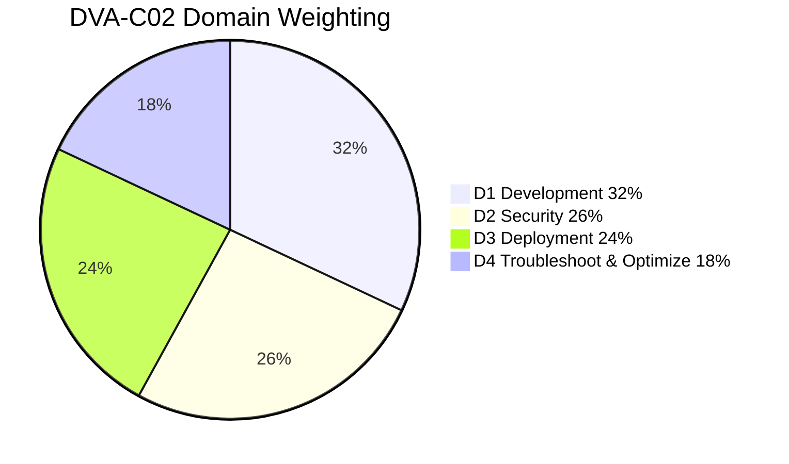

> 🎯 **Key Insight:** Development + Security = **58%** of the exam. If your time is limited, over-invest in Lambda, API Gateway, DynamoDB, IAM, and KMS. Those five services carry the exam.

> 📝 **Tip:** Scaled scoring means you do **not** need 72% raw — the 720 is a normalized cut against question difficulty. Answer *every* question (no penalty for wrong), flag-and-review the hard ones, and never leave a blank.

> ⚠️ **Common Pitfall:** Burning 5 minutes on one DynamoDB capacity-math question. With ~2 min/question budget, mark it for review and move on. Easy questions and hard questions are worth the same.

### How to read a question fast

1. Read the **last sentence first** — it tells you what's being optimized (cost? latency? least operational overhead? most secure?).
2. Eliminate the two obviously-wrong distractors.
3. Between the final two, pick the one that is **more AWS-managed / serverless / least-effort** unless the stem explicitly optimizes for something else.

---

## 2. Domain 1 — Development with AWS Services (32%)

This is the heaviest domain. We go service-by-service, leading with the exam-relevant nuances.

### 2.1 AWS Lambda

> 💡 **Intuition:** Lambda is a function that AWS runs *for you* inside an ephemeral micro-VM (Firecracker). You pay per **GB-second** plus per request. You never manage the host.

#### Execution model & lifecycle

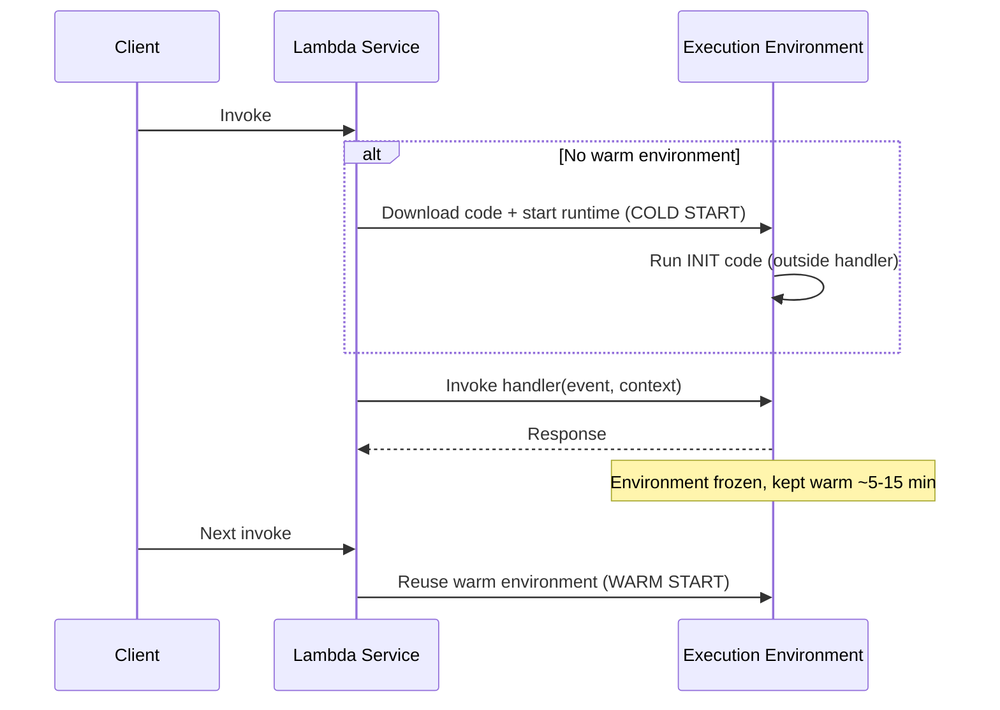

**Cold start anatomy** = environment provisioning + runtime bootstrap + your **INIT code** (everything outside the handler). The handler invocation itself is *not* the cold start.

> 🎯 **Key Insight:** Code placed **outside the handler** (DB connections, SDK clients, large imports) runs once per cold start and is **reused** across warm invokes. This is the single most-tested Lambda optimization: initialize SDK clients and connection pools at module scope, not inside the handler.

**Cold-start mitigation — exam-ranked:**

| Technique | What it does | Cost? |
|---|---|---|
| **Provisioned Concurrency** | Pre-initialized, always-warm environments. Eliminates cold starts entirely. | Yes — you pay for kept-warm environments |
| **SnapStart** (Java/Python/.NET) | Snapshots an initialized environment; restores from snapshot. | No extra charge |
| Move init outside handler | Reuse connections/clients | Free |
| Smaller package / fewer deps | Faster bootstrap | Free |
| Higher memory | More CPU → faster init | Slightly higher per-ms |

**Memory & CPU:** Memory ranges **128 MB → 10,240 MB** in 1-MB increments. **CPU scales linearly with memory** — you do not set CPU directly. At ~1,769 MB you get the equivalent of **1 full vCPU**. More memory can make a CPU-bound function *cheaper* by finishing faster.

**Timeout:** default 3 s, **max 900 s (15 min)**. Long jobs → Step Functions / Fargate / batch, not Lambda.

**`/tmp` ephemeral storage:** 512 MB default, configurable up to **10,240 MB**.

**Deployment package limits:** **50 MB zipped** (direct upload), **250 MB unzipped** (code + layers), **3 MB** for inline console editing. Container images up to **10 GB**.

**Layers:** Up to **5 layers** per function; the 250 MB unzipped limit includes layers. Use them for shared dependencies/runtimes.

**Environment variables:** Up to **4 KB total**. Encrypted at rest with KMS by default; for encryption *in transit* (so even console-viewers can't read them) enable **encryption helpers** with a customer-managed KMS key and decrypt in code.

**Versions & aliases:**

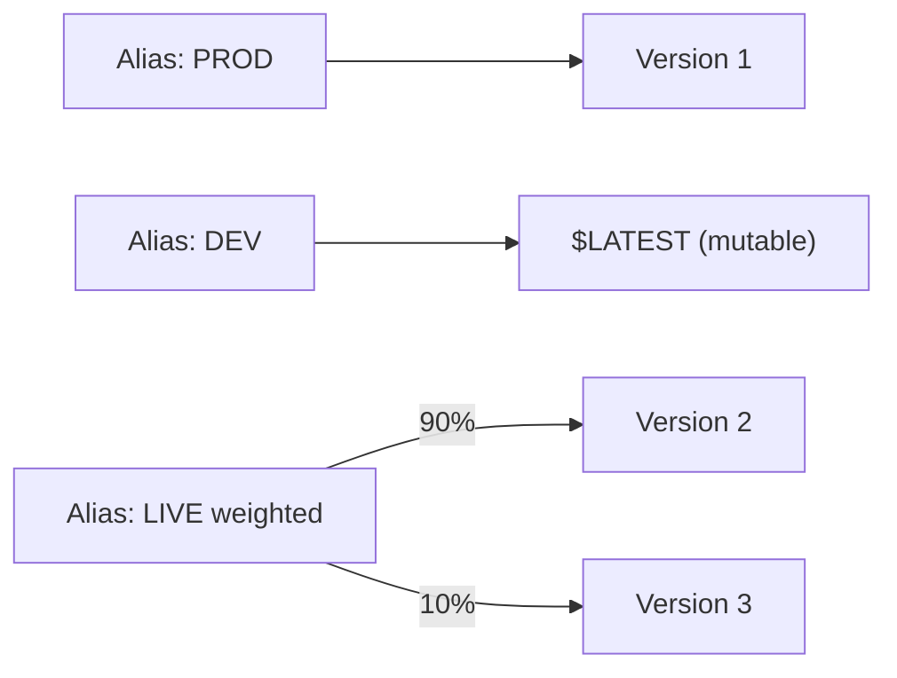

- `$LATEST` is mutable; **published versions are immutable** and get their own ARN.
- **Aliases** are mutable pointers to versions and support **weighted routing** (canary / blue-green at the function level).
- Weighted routing requires both targets to be **published versions** (not `$LATEST`).

**Concurrency models — the classic trap:**

| Type | Meaning |
|---|---|
| **Unreserved / account concurrency** | Default **1,000** concurrent executions per account per Region (soft limit, raise via support). |
| **Reserved concurrency** | Guarantees *and caps* concurrency for a function. Reserving subtracts from the shared pool. Set to **0** to throttle a function off entirely. |
| **Provisioned concurrency** | Pre-warmed environments (subset of reserved). Eliminates cold starts. |

> ⚠️ **Common Pitfall:** Reserved concurrency is both a **floor and a ceiling**. If you reserve 100 for function A in a 1,000 account, only 900 remains for everything else. Over-reserving starves other functions → throttling (HTTP 429 / `TooManyRequestsException`).

**Event source mappings (ESM)** — Lambda *polls* the source (not push):

- Used for **SQS, Kinesis, DynamoDB Streams, Amazon MQ, Kafka**.
- Batch size, batch window, parallelization factor are configured here.
- For **Kinesis/DynamoDB Streams**: ordered per shard; a poison-pill record blocks the shard until it expires or you configure `BisectBatchOnFunctionError` + `MaximumRetryAttempts` + an **on-failure destination**.

**Invocation types & retries:**

| Invocation | Examples | Retry behavior |
|---|---|---|
| **Synchronous** | API Gateway, ALB, `aws lambda invoke` | Caller handles retries; no built-in retry |
| **Asynchronous** | S3, SNS, EventBridge | Lambda retries **2×** (3 total), then → DLQ or **destination** |
| **Poll-based (ESM)** | SQS, Kinesis, DDB Streams | Source/ESM controls retries |

**Lambda Destinations** (async only) route success *and* failure outcomes to SQS / SNS / Lambda / EventBridge — richer than a DLQ (which captures failures only). **Destinations are preferred over DLQs** for new designs.

**Lambda@Edge vs CloudFront Functions:**

| | CloudFront Functions | Lambda@Edge |
|---|---|---|
| Runtime | JS (lightweight) | Node/Python |
| Triggers | Viewer request/response only | All 4 (viewer + origin req/resp) |
| Latency | Sub-ms | ~ms |
| Use | Header manipulation, redirects, simple auth | Heavier logic, network calls |

> 📝 **Tip:** Lambda@Edge functions must be created in **us-east-1** and are replicated to edge locations.

#### Lambda Quick Reference Card

| Property | Value |
|---|---|
| Memory | 128 MB – 10,240 MB (CPU scales with it) |
| Timeout | 3 s default, **900 s max** |
| `/tmp` | 512 MB – 10,240 MB |
| Package | 50 MB zip / 250 MB unzipped / 10 GB image |
| Layers | 5 max |
| Env vars | 4 KB total |
| Default concurrency | 1,000/account/Region |
| Async retries | 2 (then DLQ/destination) |

---

### 2.2 Amazon API Gateway

> 💡 **Intuition:** API Gateway is a managed "front door" that handles auth, throttling, caching, and request/response transformation between clients and your backend (Lambda, HTTP, AWS services).

#### REST vs HTTP vs WebSocket

| Feature | **REST API** | **HTTP API** | **WebSocket** |
|---|---|---|---|
| Cost | Higher | ~70% cheaper | Per-message/connection |
| Latency | Higher | Lower | — |
| Auth | IAM, Cognito, Lambda, API keys | JWT, Lambda, IAM | Lambda |
| Caching | ✅ | ❌ | ❌ |
| Usage plans / API keys | ✅ | ❌ | ❌ |
| Request/response transformation (mapping templates) | ✅ (VTL) | Limited | — |
| WAF, private endpoints, edge-optimized | ✅ | partial | — |
| Use case | Feature-rich/legacy | Cheap, fast proxy to Lambda | Real-time/bidirectional |

> 🎯 **Key Insight:** If a question needs **API keys + usage plans + caching + request validation/VTL**, the answer is **REST API**. If it optimizes **cost and latency for a simple Lambda proxy**, the answer is **HTTP API**. Bidirectional/real-time chat → **WebSocket API**.

#### Integration types (REST)

- **Lambda proxy** (`AWS_PROXY`): passes the raw request to Lambda; Lambda must return a specific `{statusCode, headers, body}` shape. Simplest; no mapping template.
- **Lambda (non-proxy)**: you write **VTL mapping templates** to transform request/response.
- **HTTP / HTTP proxy**: front an HTTP endpoint.
- **AWS service integration**: call AWS APIs directly (e.g., put to SQS/Kinesis) with no Lambda.
- **Mock**: return canned responses (useful for CORS preflight).

#### Authorizers

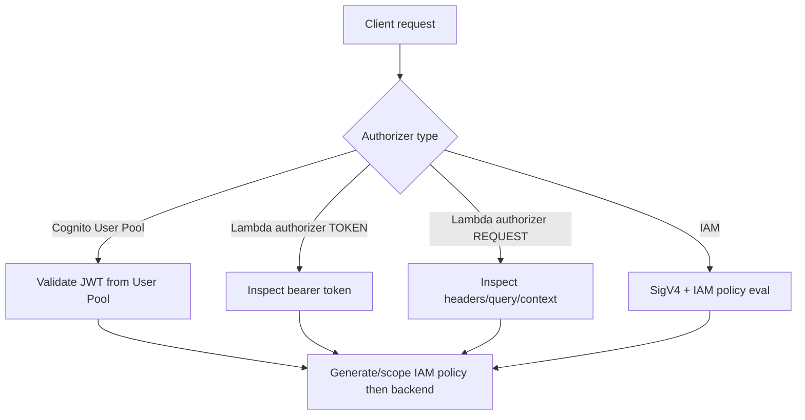

- **Cognito authorizer:** validates the JWT issued by a User Pool automatically.
- **Lambda authorizer (custom):** `TOKEN` type reads a single header (e.g., `Authorization`); `REQUEST` type reads headers/query/stage vars. Returns an **IAM policy** + principal; **cache** the result by key (default TTL 300 s) to cut invocations.
- **IAM authorizer:** caller signs requests with SigV4; good for service-to-service.

**Usage plans + API keys:** associate API keys with usage plans to enforce **per-key throttling and quotas** (e.g., 10,000 requests/day). REST-only.

**Throttling layers (order matters):** Account-level (default **10,000 req/s, 5,000 burst**) → Stage/method → Usage-plan/key. Exceeding → **429 Too Many Requests**.

**Caching:** Enabled per stage, TTL default **300 s** (0–3600). Cache key from method + path + specified params. **Encrypt cache** option available. Clients can bypass with `Cache-Control: max-age=0` *if* you grant `InvalidateCache` permission.

**Stages & canary:** Deploy to named stages (`dev`, `prod`). **Stage variables** act like env vars (e.g., point to a Lambda alias). **Canary release** splits a % of traffic to a new deployment within a stage.

**CORS:** For cross-origin browser calls, configure CORS so API Gateway answers the **OPTIONS preflight** with `Access-Control-Allow-Origin/Methods/Headers`. With proxy integrations you often must return CORS headers from Lambda too.

> ⚠️ **Common Pitfall:** A browser app gets CORS errors. The fix is to enable CORS on the **OPTIONS** method (often via a Mock integration) **and** return `Access-Control-Allow-Origin` on the actual method — not to change the client.

#### API Gateway Quick Reference Card

| Item | Value |
|---|---|
| Default account throttle | 10,000 rps / 5,000 burst |
| Cache TTL | 300 s default (0–3600) |
| Authorizer cache TTL | 300 s default |
| Max integration timeout | 29 s (REST/HTTP) |
| Payload size | 10 MB max |
| Caching/usage plans/API keys | REST only |

---

### 2.3 Amazon DynamoDB

> 💡 **Intuition:** DynamoDB is a key-value/document store where you design *for your access patterns first*, not for normalization. The partition key determines which physical partition stores the item; choose it for **even distribution**.

#### Keys & access-pattern design

- **Partition key (hash)** alone, or **partition + sort key (composite)**.
- The **partition key must spread load** — a low-cardinality key (e.g., `status = ACTIVE`) creates a **hot partition** and throttles even if total capacity is fine.
- The **sort key** enables range queries (`begins_with`, `between`, `>`), the foundation of single-table design.

#### Read consistency

| Mode | Cost | Notes |
|---|---|---|
| **Eventually consistent** (default) | 0.5 RCU per 4 KB | May read slightly stale data |
| **Strongly consistent** | 1 RCU per 4 KB | Reads latest committed; not available on GSIs |
| **Transactional** | 2× | ACID across items |

#### Capacity math — *exam favorite*

> 🎯 **Key Insight:** Memorize these four facts and you can answer any capacity question.
>
> - **1 WCU** = 1 write/sec of **up to 1 KB**.
> - **1 RCU** = **1 strongly-consistent** read/sec of up to 4 KB, **or 2 eventually-consistent** reads/sec of up to 4 KB.
> - Round item size **up** to the next KB (writes) or 4 KB (reads).
> - Transactions double the cost.

**Worked example (by hand):**
Read **80 strongly-consistent** items/sec, each **3 KB**.

$$\text{RCU per item} = \left\lceil \frac{3\text{ KB}}{4\text{ KB}} \right\rceil = 1$$

$$\text{RCU} = 80 \text{ reads/s} \times 1 = \boxed{80 \text{ RCU}}$$

If **eventually consistent** instead:

$$\text{RCU} = \frac{80 \times 1}{2} = \boxed{40 \text{ RCU}}$$

**Write example:** 100 writes/sec of **2.5 KB** items:

$$\text{WCU per item} = \left\lceil \frac{2.5}{1} \right\rceil = 3 \quad\Rightarrow\quad 100 \times 3 = \boxed{300 \text{ WCU}}$$

```python
import math

def rcu(item_kb: float, reads_per_sec: int, strongly_consistent: bool) -> float:
    units = math.ceil(item_kb / 4)            # 4 KB per RCU
    base = reads_per_sec * units
    return base if strongly_consistent else base / 2

def wcu(item_kb: float, writes_per_sec: int) -> int:
    units = math.ceil(item_kb / 1)            # 1 KB per WCU
    return writes_per_sec * units

print(rcu(3, 80, True))    # 80.0
print(rcu(3, 80, False))   # 40.0
print(wcu(2.5, 100))       # 300
```

#### Capacity modes

| Mode | When |
|---|---|
| **On-demand** | Unpredictable/spiky traffic, or you want zero capacity planning. Pay per request. |
| **Provisioned** (+ auto scaling) | Predictable traffic; cheaper at steady state. Set RCU/WCU, optionally auto-scale on utilization. |

#### GSI vs LSI — the classic distinction

| | **LSI** | **GSI** |
|---|---|---|
| Key | Same partition key, **different sort key** | **Any** attributes as PK/SK |
| Created | **Only at table creation** | Anytime |
| Count | 5 per table | 20 per table (default) |
| Consistency | Supports strong | **Eventual only** |
| Capacity | Shares table's RCU/WCU | **Own RCU/WCU** |
| Size limit | 10 GB per partition key value | None |

> ⚠️ **Common Pitfall:** "We need a new index on an existing table" → must be a **GSI** (LSIs can't be added after creation). "We need strongly-consistent reads on the index" → must be an **LSI** (GSIs are eventually consistent).

> ⚠️ **Common Pitfall:** A GSI with insufficient provisioned WCU can **throttle the base table's writes** (writes must propagate to the index). Size GSI capacity to match write throughput.

#### DAX

**DynamoDB Accelerator** = in-memory write-through cache, **microsecond** reads, sits in front of DynamoDB. Good for read-heavy, eventually-consistent workloads. **Not** for strongly-consistent reads (DAX serves cached data). Contrast with ElastiCache: DAX is DynamoDB-specific and requires near-zero code change.

#### Streams + Lambda, TTL, transactions, locking

- **DynamoDB Streams**: ordered change log (24 h retention), 4 view types (`KEYS_ONLY`, `NEW_IMAGE`, `OLD_IMAGE`, `NEW_AND_OLD_IMAGES`). Trigger Lambda for CDC, aggregation, replication. **Global Tables** (multi-Region active-active) are built on Streams.
- **TTL**: a numeric epoch-seconds attribute; items auto-deleted within ~48 h of expiry (not instant — don't rely on it for security). Deletes appear in Streams.
- **Transactions**: `TransactWriteItems` / `TransactGetItems` — all-or-nothing across up to 100 items, ACID.
- **Optimistic locking**: a **version number attribute** + condition expression (`attribute_not_exists` or `version = :expected`). On conflict you get `ConditionalCheckFailedException`.

```python
# Optimistic locking with a conditional write
table.put_item(
    Item={"pk": "user#1", "balance": 90, "version": 6},
    ConditionExpression="version = :v",
    ExpressionAttributeValues={":v": 5},   # fails if someone bumped it past 5
)
# botocore.exceptions.ClientError: ConditionalCheckFailedException if violated
```

- **PartiQL**: SQL-compatible query language over DynamoDB (`SELECT * FROM "Table" WHERE pk = '...'`). Convenient but you still pay normal RCU/WCU and must respect access patterns.

#### Single-table design (intuition)

> 💡 **Intuition:** Instead of one table per entity, store many entity types in one table using **generic PK/SK names** and **prefixed values** (`USER#123`, `ORDER#456`) plus overloaded GSIs. One query then fetches a parent and its children together (an **item collection**), eliminating joins and round-trips.

```
PK            SK                Attributes
USER#123      PROFILE           name, email
USER#123      ORDER#2024-01     total=90
USER#123      ORDER#2024-02     total=42
```
A single `Query` on `PK = USER#123` returns the profile and all orders.

#### DynamoDB Quick Reference Card

| Item | Value |
|---|---|
| Item max size | 400 KB |
| WCU | 1 KB write/s |
| RCU | 4 KB strong read/s (2× eventual) |
| LSI | 5, table-create only, shares capacity, strong OK |
| GSI | 20, anytime, own capacity, eventual only |
| Stream retention | 24 h |
| Transaction items | 100 / 4 MB |
| TTL deletion | within ~48 h |

---

### 2.4 Amazon S3 (developer slice)

- **Consistency:** **Strong read-after-write** for new objects, overwrites, and deletes (since Dec 2020). No more "eventual consistency" caveat — but the exam may still test that you know it's now strong.
- **Presigned URLs:** time-limited URLs granting temporary GET/PUT using the **creator's** permissions. SDK-generated; default/maximum expiry depends on credential type (IAM user creds up to 7 days; **role/STS creds limited by the session duration**).
- **Multipart upload:** recommended for >100 MB, **required** for >5 GB. Parallel parts, resumable; use a **lifecycle rule to abort incomplete multipart uploads** to stop paying for orphaned parts.
- **Lifecycle:** transition (Standard → IA → Glacier → Deep Archive) and expiration rules by prefix/tag.
- **Versioning:** keep all versions; **MFA Delete** for extra protection; delete creates a **delete marker**.
- **Encryption:** **SSE-S3** (AWS keys, default), **SSE-KMS** (audit + rotation, key policy), **SSE-C** (you supply keys), or client-side. Enforce with bucket policy `s3:x-amz-server-side-encryption`.
- **Event notifications:** to **SNS, SQS, Lambda, or EventBridge** on `s3:ObjectCreated:*` etc. EventBridge gives richer filtering and more targets.

> ⚠️ **Common Pitfall:** Presigned URL "Access Denied" after deploying to Lambda — the **role generating the URL** lacks `s3:GetObject`/`PutObject`. The URL inherits the *signer's* permissions, not the user's.

---

### 2.5 SQS, SNS, EventBridge & the Fan-Out Pattern

#### SQS — Simple Queue Service

| | **Standard** | **FIFO** |
|---|---|---|
| Throughput | Nearly unlimited | 300 msg/s (3,000 with batching); high-throughput mode higher |
| Ordering | Best-effort | **Strict** (per `MessageGroupId`) |
| Delivery | **At-least-once** (possible dupes) | **Exactly-once** (dedup) |
| Name suffix | — | must end in `.fifo` |

- **Visibility timeout:** when a consumer receives a message it becomes **invisible** for the timeout (default **30 s**, max **12 h**). If not deleted in time, it reappears → possible duplicate processing. Extend via `ChangeMessageVisibility` for long jobs.
- **Message retention:** default **4 days**, max **14 days**.
- **Long polling:** `ReceiveMessageWaitTimeSeconds` 1–20 s — reduces empty responses and cost vs short polling. **Prefer long polling.**
- **DLQ:** after `maxReceiveCount` failed receives, message moves to a dead-letter queue. (A FIFO source needs a FIFO DLQ.)
- **Delay queues** (delay delivery up to 15 min) vs **message timers** (per-message delay).
- **Max message size:** 256 KB (use the **S3 extended client** for larger payloads via a pointer).

> ⚠️ **Common Pitfall:** Messages processed twice → the **visibility timeout is shorter than processing time**. Increase the timeout or call `ChangeMessageVisibility`. Also: SQS does **not** push to Lambda; Lambda **polls** SQS via an event source mapping.

#### SNS — Simple Notification Service

- **Pub/sub**: publishers → **topic** → many subscribers (Lambda, SQS, HTTP, email, SMS, Kinesis Firehose).
- **Message filtering**: subscription **filter policies** on message attributes route only matching messages.
- **FIFO topics**: ordered, dedup, can only fan out to **SQS FIFO** queues.

#### EventBridge

- **Event bus** (default, custom, partner/SaaS) + **rules** that pattern-match events to **targets** (Lambda, SQS, SNS, Step Functions, ...).
- **Schema registry** + discovery; **scheduled rules** (cron) replace many old CloudWatch Events use cases.
- Richer **content-based filtering** than SNS, **archive & replay**, and 20+ target types.

> 🎯 **Key Insight — which messaging service?**
> - **Decouple + buffer + one consumer group, retries/DLQ** → **SQS**.
> - **Broadcast one message to many subscribers now** → **SNS**.
> - **Route events from many sources/SaaS by rich rules, schedule, replay** → **EventBridge**.

#### The SQS + SNS fan-out pattern

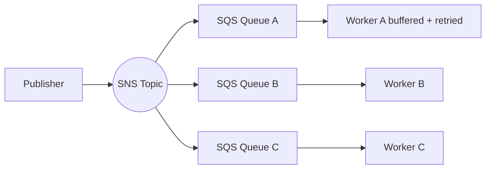

> 💡 **Intuition:** Publish **once** to SNS; each consuming service owns an SQS queue subscribed to the topic. You get broadcast (SNS) **plus** durability, buffering, and independent retry/DLQ per consumer (SQS). This is the canonical exam answer for "decouple and deliver to multiple independent processors without losing messages."

---

### 2.6 Kinesis (basics)

| Service | Use |
|---|---|
| **Kinesis Data Streams** | Real-time, **ordered per shard**, multiple consumers, you manage shards (or on-demand). Retention 24 h → 365 days. Consumers via Lambda ESM or KCL. |
| **Kinesis Data Firehose** | Fully managed **delivery** to S3/Redshift/OpenSearch/Splunk; near-real-time (buffered); transform with Lambda. No shards. |
| **Kinesis Data Analytics** | SQL/Flink over streams. |

- **Shard throughput:** 1 MB/s or 1,000 records/s in; 2 MB/s out (classic). **Enhanced fan-out** gives each consumer a dedicated 2 MB/s.
- **Partition key** routes records to shards (order is per-shard).

> ⚠️ **Common Pitfall:** SQS vs Kinesis — choose **Kinesis** when you need **ordering, replay, or multiple independent consumers reading the same stream**. Choose **SQS** for simple decoupling where a message is consumed once and deleted.

---

### 2.7 AWS Step Functions

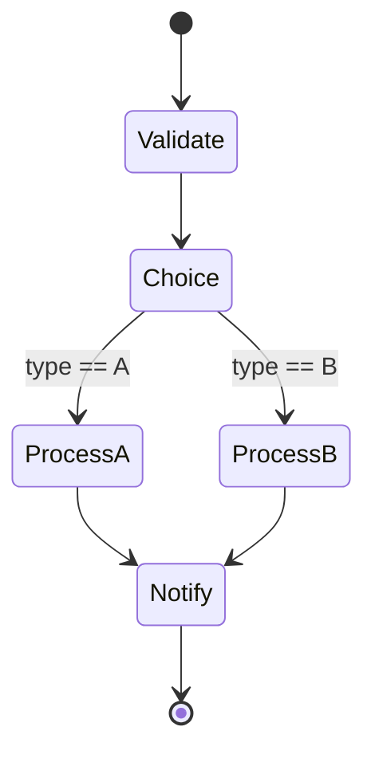

- **State types:** `Task`, `Choice`, `Parallel`, `Map`, `Wait`, `Pass`, `Succeed`, `Fail`.
- **Standard workflows:** up to **1 year**, exactly-once, full execution history — long-running, auditable.
- **Express workflows:** up to **5 min**, at-least-once (sync) / at-most-once (async), high-volume/event-processing, cheaper per run.
- **Error handling:** `Retry` (with backoff) and `Catch` per state.

> 🎯 **Key Insight:** Need orchestration of multiple Lambdas with branching, retries, and visibility instead of chaining Lambdas manually → **Step Functions**. Long human-approval or order workflow → **Standard**; high-frequency short event pipelines → **Express**.

---

### 2.8 ElastiCache caching patterns

| Engine | Note |
|---|---|
| **Redis** | Replication, persistence, pub/sub, sorted sets, Multi-AZ failover. |
| **Memcached** | Simple, multithreaded, sharded, no persistence/replication. |

**Patterns:**

- **Lazy loading (cache-aside):** read cache → miss → read DB → write cache. Only requested data is cached; stale data possible → use TTL.
- **Write-through:** write DB **and** cache together; cache always fresh but write latency higher and cold cache after node loss.

> 📝 **Tip:** Combine lazy loading + TTL for the best general-purpose pattern; add write-through when reads must always be fresh.

---

### 2.9 Amazon Cognito

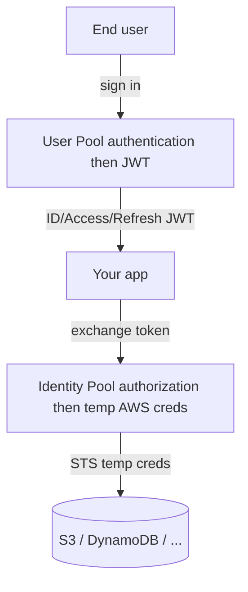

| | **User Pool** | **Identity Pool (Federated Identities)** |
|---|---|---|
| Purpose | **Authentication** — who you are | **Authorization** — temporary **AWS credentials** |
| Output | JWTs (ID, Access, Refresh) | STS temp creds via an IAM role |
| Features | Hosted UI, MFA, sign-up flows, social/SAML/OIDC federation | Maps authenticated/guest users to IAM roles |

> 🎯 **Key Insight:** "Let mobile users call S3/DynamoDB directly with scoped temporary credentials" → **Identity Pool**. "Manage sign-up/sign-in and get JWTs" → **User Pool**. Real apps often use **both**: User Pool authenticates → Identity Pool vends AWS creds.

> 🚩 **Common Exam Traps — Domain 1 (Development)**
> - **Lambda env vars are limited to 4 KB total** and `/tmp` to 10 GB — not unlimited.
> - **Reserved concurrency caps *and* reserves**; setting it to 0 disables the function.
> - **GSI *can* be added anytime; LSI cannot** (the exam flips this).
> - **SQS does not push**; Lambda polls it. SNS/EventBridge/S3 push (async).
> - **HTTP API has no caching, no usage plans, no API keys** — those need REST API.
> - **DAX does not help strongly-consistent reads.**
> - **Visibility timeout too low → duplicate processing**, not message loss.
> - **User Pool ≠ Identity Pool.** Authentication vs AWS credentials.

---

## 3. Domain 2 — Security (26%)

### 3.1 IAM — identity vs resource policies & evaluation

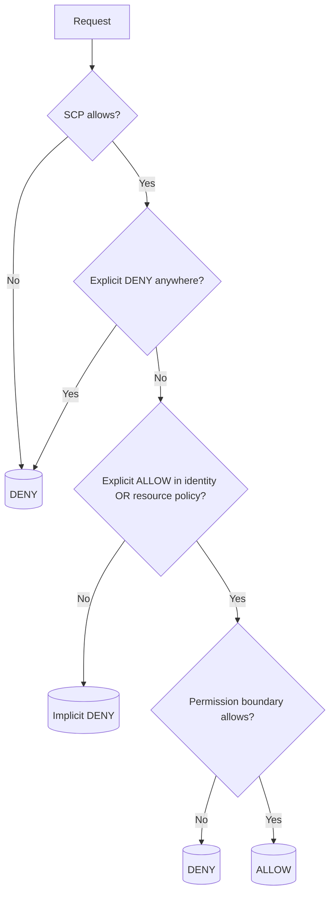

> 🎯 **Key Insight — the evaluation rule that gets tested:** **Default deny → an explicit Allow grants → an explicit Deny always wins** (overrides any Allow). Across accounts you need an Allow in *both* the identity policy *and* the resource policy.

| Concept | Meaning |
|---|---|
| **Identity policy** | Attached to user/group/role — what *this principal* can do. |
| **Resource policy** | Attached to a resource (S3 bucket, SQS, KMS key, Lambda) — who can do what *to it*. Enables cross-account access. |
| **Permission boundary** | A *ceiling* on max permissions a principal can have (the **effective** permission = intersection of boundary ∩ identity policy). Does **not** grant anything by itself. |
| **SCP** (Organizations) | Account-wide guardrail; also a ceiling, never a grant. |
| **Role / STS AssumeRole** | Temporary credentials; preferred over long-lived keys. `sts:AssumeRole` returns temp `AccessKeyId/SecretAccessKey/SessionToken`. |

> ⚠️ **Common Pitfall:** A permission boundary or SCP **never grants** access — it only limits. If a user can't do X, check whether an identity *Allow* exists *and* survives the boundary/SCP intersection, and that no explicit Deny applies.

> 📝 **Tip:** For EC2/Lambda/ECS, attach a **role**, never embed access keys. Lambda gets its **execution role**; EC2 uses an **instance profile**.

### 3.2 KMS & envelope encryption

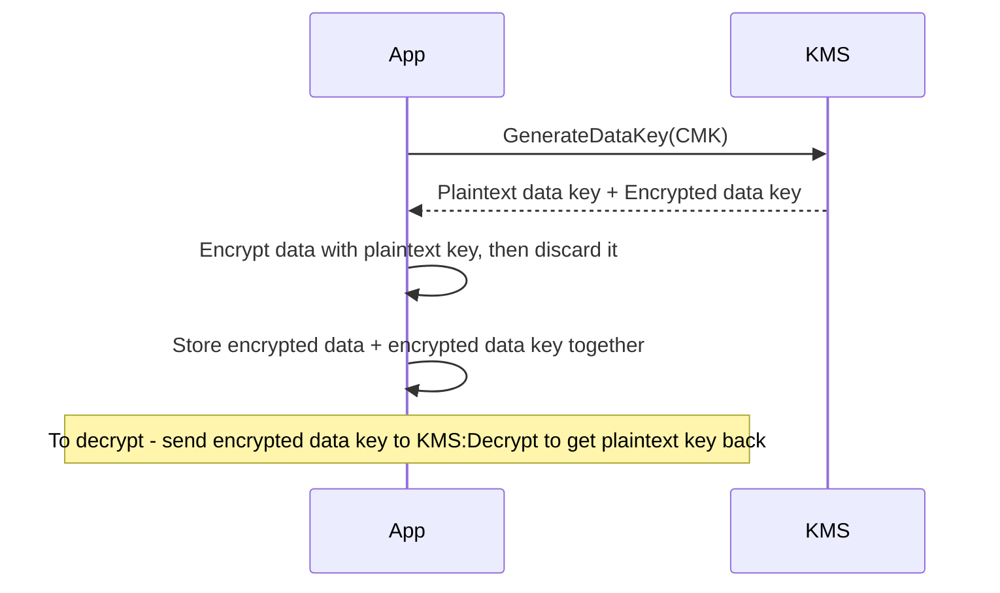

> 💡 **Intuition (envelope encryption):** You don't send big data to KMS. KMS gives you a **data key**; you encrypt locally, store the **encrypted** data key beside the ciphertext, and call `Decrypt` only on the small key when needed. This is what SSE-KMS does under the hood.

| Concept | Note |
|---|---|
| **CMK / KMS key** | AWS-managed, **customer-managed** (you control rotation/policy), or AWS-owned. |
| **Key policy** | The **primary** access control on a key — *required*; without it, even admins can be locked out. |
| **Grants** | Temporary, programmatic delegation of key use (often by AWS services), revocable. |
| **Automatic rotation** | Yearly for customer-managed keys (old material retained to decrypt). |
| **Request limits** | `Decrypt`/`GenerateDataKey` throttled per Region → use **data key caching** for high volume. |
| **Max data size** | KMS `Encrypt` directly handles **≤ 4 KB**; larger → envelope encryption. |

> ⚠️ **Common Pitfall:** Access to a KMS-encrypted resource fails even with full S3/SQS permissions — the principal also needs **`kms:Decrypt`/`kms:GenerateDataKey`** in the **key policy** (and/or identity policy). KMS permissions are separate.

### 3.3 Secrets Manager vs SSM Parameter Store

| | **Secrets Manager** | **SSM Parameter Store** |
|---|---|---|
| Cost | Paid (per secret + API calls) | **Free** for standard params |
| **Automatic rotation** | **Built-in** (Lambda; native for RDS/Aurora/Redshift/DocumentDB) | Not native (DIY) |
| Encryption | KMS | KMS for `SecureString` |
| Size | 64 KB | 4 KB standard / 8 KB advanced |
| Cross-account | Yes (resource policy) | Limited |
| Generate random secret | Yes | No |

> 🎯 **Key Insight:** Need **automatic credential rotation** for a database → **Secrets Manager**. Just need cheap config values / feature flags / non-rotating secrets → **Parameter Store** (`SecureString` for sensitive ones). Parameter Store can even reference a Secrets Manager secret.

### 3.4 ACM & request signing

- **ACM** issues/renews TLS certs **free** for use with ELB, CloudFront, API Gateway. For CloudFront the cert must be in **us-east-1**. ACM **public** certs can't be exported (private CA can).
- **SigV4** signing authenticates AWS API requests; the SDK/CLI do it automatically. Manual signing needed for raw HTTP calls (e.g., to OpenSearch, API Gateway IAM auth). Presigned S3 URLs are a SigV4 application.

> 🚩 **Common Exam Traps — Domain 2 (Security)**
> - **Explicit Deny always beats Allow.** SCP/permission boundary **never grant**.
> - **KMS permissions are separate** from the resource's permissions.
> - **Rotation = Secrets Manager.** Cheap/static = Parameter Store.
> - **CloudFront certs must live in us-east-1.**
> - **Never hardcode keys** — use roles/STS; for code, use Secrets Manager/Parameter Store, not plaintext env vars.
> - **KMS direct encrypt ≤ 4 KB** → use data keys for larger payloads.

---

## 4. Domain 3 — Deployment (24%)

### 4.1 The CI/CD chain

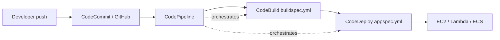

#### CodeCommit
Managed Git. (Largely superseded by GitHub, but appears on the exam.) Auth via IAM/HTTPS-Git-credentials/SSH.

#### CodeBuild — `buildspec.yml`

```yaml
version: 0.2
env:
  variables: { ENV: "prod" }
  parameter-store: { DB_PWD: "/myapp/db/password" }   # pulls from SSM
phases:
  install:
    runtime-versions: { python: 3.12 }
  pre_build:
    commands: ["pip install -r requirements.txt"]
  build:
    commands: ["pytest", "python build.py"]
  post_build:
    commands: ["echo done"]
artifacts:
  files: ["**/*"]
  base-directory: dist
cache:
  paths: ["/root/.cache/pip/**/*"]
```

> 📝 **Tip:** `buildspec.yml` lives at the **repo root** by default. Phases run in fixed order: `install → pre_build → build → post_build`. Secrets come from `parameter-store`/`secrets-manager` blocks, not hardcoded.

#### CodeDeploy — in-place vs blue/green & `appspec`

| Strategy | Where | How |
|---|---|---|
| **In-place** | EC2/on-prem | Updates instances in place (with optional rolling batches). Brief capacity reduction. |
| **Blue/Green** | EC2 (ASG), **Lambda, ECS** | Provision a new (green) fleet/version, shift traffic, then terminate blue. Easy rollback. |

**`appspec.yml`** tells CodeDeploy what to deploy and which **lifecycle hooks** to run:

```yaml
# EC2 example
version: 0.0
os: linux
files:
  - source: /
    destination: /var/www/html
hooks:
  BeforeInstall:   [{ location: scripts/stop.sh,  timeout: 300 }]
  AfterInstall:    [{ location: scripts/config.sh, timeout: 300 }]
  ApplicationStart:[{ location: scripts/start.sh, timeout: 300 }]
  ValidateService: [{ location: scripts/health.sh, timeout: 300 }]
```

EC2 hook order: `ApplicationStop → BeforeInstall → AfterInstall → ApplicationStart → ValidateService`.

For **Lambda/ECS** deployments, hooks are `BeforeAllowTraffic` / `AfterAllowTraffic`, and traffic shifting can be **Canary** (e.g., `Canary10Percent5Minutes`), **Linear**, or **AllAtOnce**.

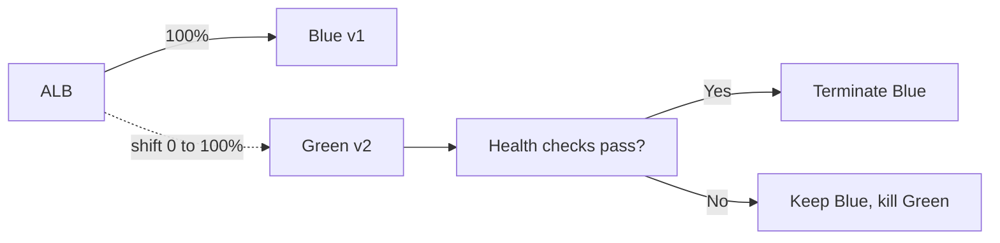

> ⚠️ **Common Pitfall:** Blue/green needs **double capacity** during cutover (cost) but gives **instant rollback**. In-place is cheaper but has **reduced capacity** and slower rollback. Match the answer to whether the stem optimizes cost vs zero-downtime/rollback.

#### CodePipeline
Orchestrates stages (Source → Build → Test → Deploy → Approval). Stages contain **actions**; **artifacts** pass between stages via S3. Supports **manual approval** actions and parallel actions.

### 4.2 AWS SAM

> 💡 **Intuition:** SAM is a **CloudFormation macro/transform** that adds short serverless resource types. A SAM template *is* a CloudFormation template with `Transform: AWS::Serverless-2016-10-31`.

```yaml
Transform: AWS::Serverless-2016-10-31
Resources:
  MyFn:
    Type: AWS::Serverless::Function
    Properties:
      Handler: app.handler
      Runtime: python3.12
      Events:
        Api: { Type: Api, Properties: { Path: /hello, Method: get } }
```

- `sam build` → `sam local invoke` / `sam local start-api` (test locally with Docker) → `sam deploy --guided`.
- `sam deploy` packages code to S3 and runs a CloudFormation change set.
- SAM resources: `Serverless::Function`, `::Api`, `::HttpApi`, `::SimpleTable`, `::StateMachine`.

### 4.3 CloudFormation (IaC)

**Template anatomy:** `AWSTemplateFormatVersion`, `Description`, `Metadata`, **`Parameters`**, **`Mappings`**, **`Conditions`**, `Transform`, **`Resources`** (only required section), **`Outputs`**.

**Intrinsic functions (memorize):**

| Function | Use |
|---|---|
| `!Ref` | Param value or resource's default attribute (often its ID/name) |
| `!GetAtt res.Attr` | A specific attribute (e.g., `!GetAtt MyBucket.Arn`) |
| `!Sub` | String substitution `${Var}` |
| `!Join [delim, list]` | Concatenate |
| `!FindInMap [Map, Key, SubKey]` | Look up in `Mappings` |
| `!If / !Equals / !And / !Or / !Not` | `Conditions` |
| `!ImportValue` | Use another stack's **exported** output |
| `!GetAZs`, `!Select`, `!Base64`, `!Cidr` | misc |

```yaml
Parameters:
  EnvType: { Type: String, AllowedValues: [prod, dev], Default: dev }
Conditions:
  IsProd: !Equals [!Ref EnvType, prod]
Mappings:
  RegionAMI: { us-east-1: { AMI: ami-123 }, eu-west-1: { AMI: ami-456 } }
Resources:
  Web:
    Type: AWS::EC2::Instance
    Properties:
      ImageId: !FindInMap [RegionAMI, !Ref "AWS::Region", AMI]
      InstanceType: !If [IsProd, m5.large, t3.micro]
Outputs:
  WebArn:
    Value: !GetAtt Web.Arn
    Export: { Name: web-arn }     # cross-stack reference
```

- **Outputs/Exports**: `Export` makes a value referencable by other stacks via `!ImportValue`. **You can't delete/modify a stack whose export is in use.**
- **Nested stacks**: `AWS::CloudFormation::Stack` for reusable components; cross-stack exports for loosely-coupled sharing.
- **Change sets**: preview what an update will create/modify/**replace** before executing. Watch for **Replacement: True** (data loss risk).
- **Drift detection**: detects manual out-of-band changes vs the template.
- **DeletionPolicy**: `Delete` (default), **`Retain`**, or **`Snapshot`** (RDS/EBS/etc.). Use `Retain`/`Snapshot` to protect data on stack delete. **`UpdateReplacePolicy`** governs replacement during updates.

> ⚠️ **Common Pitfall:** Changing an immutable property (e.g., an EC2 `AvailabilityZone`, a DynamoDB key schema) triggers a **replacement** — CFN creates new + deletes old, which can **destroy data** unless protected. Always review change sets and set `DeletionPolicy: Retain`/`Snapshot` on stateful resources.

### 4.4 Elastic Beanstalk deployment policies — *high-value table*

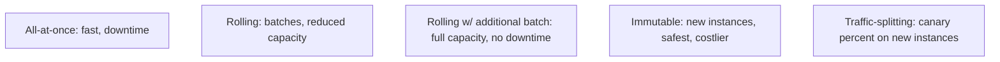

| Policy | Downtime | Capacity during deploy | Rollback | Cost | Notes |
|---|---|---|---|---|---|
| **All-at-once** | **Yes** | Full then full | Redeploy | Lowest | Dev only |
| **Rolling** | No | **Reduced** | Manual redeploy | Low | Mixed old/new during deploy |
| **Rolling + additional batch** | No | **Maintained** | Manual | Medium | Spins extra batch first |
| **Immutable** | No | Full | **Easy** (terminate new ASG) | Higher | New instances in temp ASG; safest |
| **Traffic-splitting** | No | Full | Easy | Higher | **Canary** — % of traffic to new |

> 🎯 **Key Insight:** "Zero downtime + cannot reduce capacity + safest rollback" → **Immutable**. "Cheapest, dev env" → **All-at-once**. "Want a canary %" → **Traffic-splitting**. "Maintain capacity without full new fleet" → **Rolling with additional batch**.

**`.ebextensions/`**: YAML/JSON config files in your source bundle to customize the environment (packages, files, commands, option settings, resources). Processed alphabetically.

### 4.5 ECS / ECR / Fargate (basics)

- **ECR**: private Docker registry; auth via `aws ecr get-login-password`.
- **ECS launch types**: **EC2** (you manage instances) vs **Fargate** (serverless containers, no EC2 to manage).
- **Task definition**: container image, CPU/memory, ports, **task role** (app permissions) vs **execution role** (pull image/secrets, write logs).
- **Service**: maintains desired count, integrates with ALB; supports blue/green via CodeDeploy.

> ⚠️ **Common Pitfall:** Two IAM roles in ECS — **task execution role** (ECS agent pulls image, fetches secrets, ships logs) vs **task role** (your container's app calls to AWS). Mixing them up is a classic distractor.

> 🚩 **Common Exam Traps — Domain 3 (Deployment)**
> - **SAM = CloudFormation transform**; `sam local` needs Docker.
> - **buildspec phases order** is fixed; secrets via parameter-store/secrets-manager, never hardcoded.
> - **CodeDeploy lifecycle hook names differ** for EC2 vs Lambda/ECS.
> - **Immutable vs Rolling-with-additional-batch** — both keep capacity; Immutable is safer/costlier.
> - **CFN export in use → can't delete that stack.**
> - **DeletionPolicy: Retain/Snapshot** protects stateful resources on delete/replace.
> - **Change set "Replacement: True"** signals potential data loss.

---

## 5. Domain 4 — Troubleshooting & Optimization (18%)

### 5.1 CloudWatch

- **Metrics**: namespace + dimensions; default resolution **1 min**, **high-resolution custom metrics** down to **1 s**.
- **Custom metrics**: `PutMetricData`. EC2 **memory/disk** are *not* default metrics — install the **CloudWatch agent**.
- **Alarms**: states `OK / ALARM / INSUFFICIENT_DATA`; actions → SNS, Auto Scaling, EC2 actions. **Composite alarms** combine others.
- **Logs**: log groups → log streams; **retention** is configurable (default *never expire* — costs money). **Metric filters** turn log patterns into metrics/alarms.
- **Logs Insights**: query language over logs.

```
fields @timestamp, @message
| filter @message like /ERROR/
| stats count() by bin(5m)
| sort @timestamp desc
| limit 20
```

- **EMF (Embedded Metric Format)**: write structured JSON logs that CloudWatch auto-extracts into **metrics** — ideal for Lambda (no synchronous `PutMetricData` call, no added latency/cost).

> ⚠️ **Common Pitfall:** "Memory utilization alarm on EC2 doesn't work" — memory is **not** a default EC2 metric; you must publish it via the **CloudWatch agent** as a custom metric.

### 5.2 AWS X-Ray

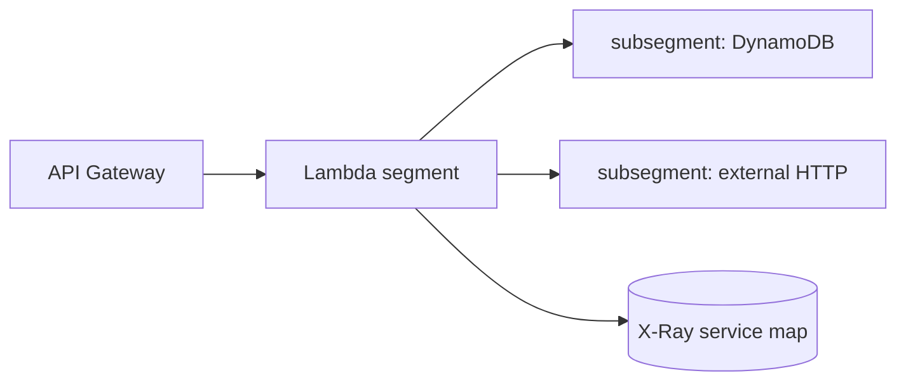

| Concept | Meaning |
|---|---|
| **Segment** | Work done by one service/resource for a request. |
| **Subsegment** | Granular timing within a segment (a DB call, an HTTP call). |
| **Annotations** | Key-value pairs that are **indexed** → **filterable/searchable** in queries. |
| **Metadata** | Extra data **not indexed** (not filterable) — for debugging context. |
| **Sampling** | Reduce volume/cost: default ~1 req/s + 5% of the rest; customizable. |
| **Service map** | Visual graph of nodes + latencies + error rates. |

> 🎯 **Key Insight:** Want to **filter/search traces** by a value (e.g., `customerId`) → use an **annotation**, not metadata. Metadata is for context you don't query on.

**Enabling X-Ray:** Lambda → toggle **Active Tracing** (needs `AWSXRayDaemonWriteAccess`); EC2/ECS → run the **X-Ray daemon**; instrument with the SDK.

### 5.3 CloudTrail

| Event type | Captures | Default? |
|---|---|---|
| **Management events** | Control-plane API calls (CreateBucket, RunInstances, AssumeRole) | **On by default** (90-day history in Event history) |
| **Data events** | Data-plane, high-volume (S3 `GetObject`/`PutObject`, Lambda `Invoke`, DynamoDB item ops) | **Off** (must enable; extra cost) |
| **Insights events** | Detect unusual API activity | Off |

> ⚠️ **Common Pitfall:** "Who deleted this object / who called this API?" → **CloudTrail** (auditing), *not* CloudWatch (metrics/logs of app behavior). And **S3 object-level access** needs **data events** explicitly enabled — they aren't logged by default.

> 🚩 **Common Exam Traps — Domain 4 (Troubleshooting)**
> - **EC2 memory/disk = custom metrics via the agent**, not default.
> - **Log retention defaults to never-expire** (cost trap).
> - **Annotations are indexed/searchable; metadata is not.**
> - **CloudTrail = who did what (audit); CloudWatch = how the system behaves.**
> - **S3/Lambda data events are OFF by default.**
> - **EMF** is the low-overhead way to emit custom metrics from Lambda.

---

## 6. From-Scratch: A Complete Serverless Stack

A canonical exam architecture — wire it once and many questions become obvious.

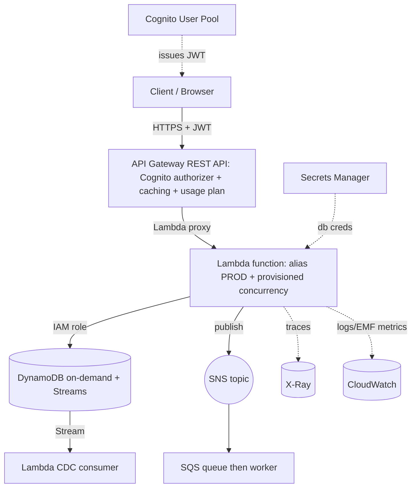

A minimal SAM template realizing the core:

```yaml
Transform: AWS::Serverless-2016-10-31
Globals:
  Function:
    Runtime: python3.12
    Timeout: 10
    Tracing: Active                     # X-Ray
Resources:
  Table:
    Type: AWS::Serverless::SimpleTable  # on-demand DynamoDB
  Api:
    Type: AWS::Serverless::Api
    Properties:
      StageName: prod
      Cors: "'*'"
  GetItemFn:
    Type: AWS::Serverless::Function
    Properties:
      Handler: app.handler
      Policies:
        - DynamoDBReadPolicy: { TableName: !Ref Table }   # least privilege
      Environment:
        Variables: { TABLE: !Ref Table }
      Events:
        Get:
          Type: Api
          Properties: { RestApiId: !Ref Api, Path: /items/{id}, Method: get }
Outputs:
  Endpoint:
    Value: !Sub "https://${Api}.execute-api.${AWS::Region}.amazonaws.com/prod"
```

```python
# app.py - handler reuses the client across warm invokes (cold-start best practice)
import os, json, boto3

ddb = boto3.resource("dynamodb")          # module scope - reused
table = ddb.Table(os.environ["TABLE"])

def handler(event, context):
    item_id = event["pathParameters"]["id"]
    resp = table.get_item(Key={"id": item_id})
    item = resp.get("Item")
    if not item:
        return {"statusCode": 404, "body": json.dumps({"error": "not found"})}
    return {"statusCode": 200, "body": json.dumps(item, default=str)}
# Expected: GET /items/abc -> 200 with the item JSON, or 404 if absent.
```

---

## 7. Knowledge Check

<details><summary>1. Why should you initialize the DynamoDB client outside the Lambda handler?</summary>

The code outside the handler runs during the **INIT phase** (part of a cold start) and the execution environment is **frozen and reused** across subsequent warm invokes. Initializing the SDK client/connection pool at module scope means it is created once per cold start, not on every invocation — reducing latency and connection churn. Putting it inside the handler re-creates it every call.
</details>

<details><summary>2. You must add an index supporting a brand-new query on an existing 200-GB table. GSI or LSI?</summary>

**GSI.** Local Secondary Indexes can only be created **at table creation time**; they cannot be added later. Global Secondary Indexes can be added **anytime** and can use any attributes as the new partition/sort key. The trade-off: GSIs are **eventually consistent** and have their **own** provisioned capacity.
</details>

<details><summary>3. Messages in your SQS queue are processed twice. Most likely cause?</summary>

The **visibility timeout is shorter than the processing time**, so the message becomes visible again and a second consumer picks it up before the first deletes it. Fix: increase the visibility timeout or call `ChangeMessageVisibility` during long processing. (Standard queues are also at-least-once by design — use idempotent processing or FIFO for exactly-once.)
</details>

<details><summary>4. A principal has S3 read permission but gets AccessDenied reading an SSE-KMS-encrypted object. Why?</summary>

S3 permissions alone are insufficient for **SSE-KMS** objects. The principal also needs **`kms:Decrypt`** (and the KMS **key policy** must allow that principal). KMS access control is independent of S3 access control.
</details>

<details><summary>5. Which Beanstalk policy gives zero downtime, full capacity, and the easiest rollback?</summary>

**Immutable.** It launches a brand-new set of instances in a temporary Auto Scaling group, validates them, then swaps. Rollback is simply terminating the new instances — the original fleet is untouched. It costs more (double instances briefly) but is the safest.
</details>

<details><summary>6. You need to filter X-Ray traces by `orderId`. Annotation or metadata?</summary>

**Annotation.** Annotations are **indexed** and can be used in X-Ray filter expressions and group queries. **Metadata is not indexed** and cannot be filtered on — it's only for additional debugging context.
</details>

<details><summary>7. You want to know who deleted an S3 object, but CloudTrail shows nothing. Why?</summary>

S3 **object-level (data) events are not logged by default**. CloudTrail records **management events** by default; to capture `DeleteObject`/`GetObject` you must explicitly enable **data events** on the trail (which incurs extra cost).
</details>

<details><summary>8. Why does a permission boundary not fix a user's missing access?</summary>

A permission boundary (like an SCP) only sets the **maximum** allowed permissions — the effective permission is the **intersection** of the boundary and the identity policy. It **never grants** access. If the identity policy lacks the Allow, no boundary will add it.
</details>

---

## 8. Exercises

<details><summary>Exercise 1 (easy): Compute provisioned capacity. A table serves 50 strongly-consistent reads/sec of 8 KB items and 20 writes/sec of 1.5 KB items. Find RCU and WCU.</summary>

**RCU:** $\lceil 8/4 \rceil = 2$ units per read; $50 \times 2 = \mathbf{100\ RCU}$.
**WCU:** $\lceil 1.5/1 \rceil = 2$ units per write; $20 \times 2 = \mathbf{40\ WCU}$.

If reads were *eventually* consistent: $100 / 2 = 50$ RCU.
</details>

<details><summary>Exercise 2 (medium): Design the messaging for "an order event must reach an inventory service, an email service, and an analytics pipeline, each independently retried, with no lost messages."</summary>

**SNS + SQS fan-out.** Publish the order event once to an **SNS topic**. Create **three SQS queues** (inventory, email, analytics), each subscribed to the topic. Each consumer polls its own queue, giving independent buffering, retry, and a **DLQ** per consumer. SNS handles the broadcast; SQS guarantees durability and per-consumer retry. If strict ordering + dedup is required, use a **FIFO topic + FIFO queues**.
</details>

<details><summary>Exercise 3 (medium): A REST API needs per-customer rate limits of 1,000 req/day and the ability to cache GET responses for 60 s. Outline the configuration.</summary>

1. Use a **REST API** (HTTP API lacks usage plans/API keys/caching).
2. Issue **API keys** to each customer; attach them to a **usage plan** with a **quota** of 1,000/day and a throttle rate/burst.
3. Require the API key on methods (`x-api-key` header).
4. On the **stage**, enable **caching** with **TTL = 60 s**; optionally encrypt the cache and key it on relevant params.
</details>

<details><summary>Exercise 4 (hard): Zero-downtime Lambda release with automatic rollback on errors. Describe the mechanism.</summary>

Use **CodeDeploy for Lambda** with an **alias** (e.g., `PROD`) and **traffic shifting** (`Canary10Percent5Minutes` or `Linear10PercentEvery1Minute`). The `appspec.yml` defines `BeforeAllowTraffic` / `AfterAllowTraffic` hooks (validation Lambdas). Attach a **CloudWatch alarm** (e.g., on errors/latency) to the deployment group; if it triggers during the shift, CodeDeploy **automatically rolls back** to the previous version. SAM exposes this via `AutoPublishAlias` + `DeploymentPreference`. This eliminates downtime and protects against a bad release.
</details>

<details><summary>Exercise 5 (hard): A CloudFormation stack update will replace your production RDS instance. How do you protect the data and verify before applying?</summary>

1. **Create a change set** (don't direct-update) and inspect it for **`Replacement: True`** on the RDS resource.
2. Set **`DeletionPolicy: Snapshot`** (and `UpdateReplacePolicy: Snapshot`) on the DB so a snapshot is taken before any delete/replace.
3. Prefer changing only **non-replacing** properties; if a replacing change is unavoidable, plan a maintenance window and validate the snapshot/restore path.
4. Enable **termination protection** / a **stack policy** to deny updates to the DB resource unless explicitly intended.
</details>

---

## 9. 60 Exam-Style Practice Questions

> Each answer explains why the key is right *and* why the distractors fail. Cover the answer, commit, then reveal.

### Domain 1 — Development (Q1–24)

<details><summary>Q1. A Lambda times out making many small calls to KMS Decrypt under load. Lowest-effort fix?</summary>

**Implement data key caching (envelope encryption).** KMS `Decrypt`/`GenerateDataKey` are throttled per Region; caching the data key avoids repeated KMS calls. *Wrong:* raising the Lambda timeout (masks, doesn't fix throttling); switching to SSE-S3 (changes the security model); more memory (CPU isn't the bottleneck).
</details>

<details><summary>Q2. You need API caching, per-client API keys, and request validation. Which API Gateway type?</summary>

**REST API.** HTTP APIs lack caching, usage plans, API keys, and rich request validation. WebSocket is for bidirectional realtime. Edge-optimized is a REST endpoint type, not a separate API.
</details>

<details><summary>Q3. A DynamoDB table sometimes throttles writes even though table WCU is plentiful. The table has a GSI. Cause?</summary>

**The GSI's provisioned WCU is too low**; writes that update indexed attributes must also write to the GSI, and an under-provisioned GSI throttles the base writes. *Wrong:* hot partition (possible but the GSI clue points here); strong consistency (a read concept); LSI (LSIs share table capacity, not the issue described).
</details>

<details><summary>Q4. You want exactly-once, ordered processing of financial transactions through a queue. Choose and configure.</summary>

**SQS FIFO queue** (`.fifo` suffix) with a `MessageGroupId` for ordering and content-based or explicit **deduplication**. Standard SQS is at-least-once/best-effort order. SNS standard doesn't guarantee order. Kinesis orders per shard but adds complexity for a simple queue use case.
</details>

<details><summary>Q5. A mobile app must upload directly to S3 without proxying bytes through your servers. Most secure approach?</summary>

**Generate a presigned PUT URL** (short expiry) from a backend with a scoped role. The client uploads directly to S3. *Wrong:* embedding IAM keys in the app (leak risk); making the bucket public (insecure); routing through Lambda (defeats the purpose, payload limits).
</details>

<details><summary>Q6. Cold starts are too slow for a latency-sensitive synchronous Java API. Cheapest fix?</summary>

**Enable SnapStart** (Java) — no extra charge, restores from a pre-initialized snapshot. *Wrong:* Provisioned Concurrency works but costs money (use if SnapStart insufficient); more memory helps marginally; rewriting in Go is over-engineering.
</details>

<details><summary>Q7. You must broadcast one event to 4 independent consumers, each needing retries and a DLQ. Pattern?</summary>

**SNS → 4 SQS queues (fan-out)**, each with its own DLQ. SNS alone has no per-subscriber buffering/retry-to-DLQ semantics like SQS. EventBridge could also fan out but the explicit DLQ-per-consumer and "decouple/buffer" wording points to SQS subscriptions.
</details>

<details><summary>Q8. A Step Functions workflow runs millions of short executions per hour for event processing. Which type?</summary>

**Express workflow** — high volume, ≤5 min, cheaper. Standard is for long-running (≤1 year), exactly-once, auditable workflows and is more expensive at high volume.
</details>

<details><summary>Q9. DynamoDB reads must be microsecond-latency, read-heavy, tolerant of slight staleness. Solution?</summary>

**DAX.** It's a DynamoDB-native, write-through, in-memory cache giving microsecond reads. *Wrong:* ElastiCache (more code, not DDB-native); strongly-consistent reads (DAX serves cached/eventual data); increasing RCU (doesn't reach microseconds).
</details>

<details><summary>Q10. An async-invoked Lambda fails after retries; you must capture failed events with full context for replay. Best option?</summary>

**Lambda Destinations (on-failure)** to SQS/EventBridge — captures the event plus invocation context, richer than a DLQ. DLQ captures the payload only. Destinations are the modern recommended approach for async.
</details>

<details><summary>Q11. Run code at CloudFront edge to rewrite request headers with sub-millisecond latency. Service?</summary>

**CloudFront Functions** (lightweight JS, viewer events, sub-ms). Lambda@Edge is heavier (ms, Node/Python, all four triggers) — overkill for header rewrites.
</details>

<details><summary>Q12. To reduce empty SQS receive responses and cost, what do you enable?</summary>

**Long polling** (`ReceiveMessageWaitTimeSeconds` 1–20). It waits for messages before returning, cutting empty responses vs short polling.
</details>

<details><summary>Q13. A function set with reserved concurrency = 0 stops working. Why?</summary>

Reserved concurrency is a **cap**; setting it to **0 throttles the function entirely** (no concurrent executions allowed). This is the documented way to disable a function quickly.
</details>

<details><summary>Q14. You must store 500 KB of data per DynamoDB record. Problem and fix?</summary>

DynamoDB item max is **400 KB**. Store the large blob in **S3** and keep a **pointer (S3 key)** in the DynamoDB item. (For SQS the analogous fix is the S3 extended client.)
</details>

<details><summary>Q15. An API Gateway browser client gets CORS errors on POST. Fix?</summary>

**Enable CORS**: configure the **OPTIONS preflight** to return `Access-Control-Allow-Origin/Methods/Headers`, and (with proxy integration) also return `Access-Control-Allow-Origin` from the backend on the POST. It's a server-side configuration, not a client change.
</details>

<details><summary>Q16. Which Cognito component vends temporary AWS credentials so users can call DynamoDB directly?</summary>

**Identity Pool (federated identities)** — exchanges a token for **STS temporary credentials** mapped to an IAM role. The **User Pool** only authenticates and returns JWTs.
</details>

<details><summary>Q17. You need ordered, replayable streaming with multiple independent consumers reading the same data. SQS or Kinesis?</summary>

**Kinesis Data Streams** — per-shard ordering, retention (replay), and multiple consumers (especially with enhanced fan-out). SQS deletes messages after consumption and isn't designed for multiple independent readers of the same stream.
</details>

<details><summary>Q18. A Lambda needs different config in dev vs prod without code changes, pointing at different Lambda aliases. API Gateway feature?</summary>

**Stage variables** — set per stage (dev/prod) and referenced in the integration (e.g., Lambda alias `${stageVariables.lambdaAlias}`).
</details>

<details><summary>Q19. To deploy a new Lambda version to 10% of traffic for 5 minutes before full rollout, configure what?</summary>

A **weighted alias** (or CodeDeploy **canary** `Canary10Percent5Minutes`) pointing at two **published versions**. You cannot weight toward `$LATEST`.
</details>

<details><summary>Q20. EventBridge vs SNS for routing events from many SaaS partners with complex content-based rules and replay?</summary>

**EventBridge** — partner event sources, rich content-based filtering on the full event, schema registry, and **archive/replay**. SNS filtering is limited to message attributes and lacks replay.
</details>

<details><summary>Q21. Your DynamoDB single-table design must fetch a user and all their orders in one call. Mechanism?</summary>

**Query on the partition key** (`PK = USER#123`) returning the **item collection** (profile + order items differentiated by `SK` prefixes). No join, single request.
</details>

<details><summary>Q22. A Kinesis consumer Lambda blocks on one bad record in a shard. Options to avoid head-of-line blocking?</summary>

Configure **`BisectBatchOnFunctionError`**, set **`MaximumRetryAttempts`** / **`MaximumRecordAgeInSeconds`**, and add an **on-failure destination** so poison records are offloaded and the shard advances. Increasing parallelization factor helps throughput, not poison handling alone.
</details>

<details><summary>Q23. You want to cache database reads with always-fresh data even right after writes. ElastiCache pattern?</summary>

**Write-through** — write to DB and cache simultaneously so the cache is never stale. Trade-off: higher write latency and a cold cache after node replacement (often paired with lazy loading).
</details>

<details><summary>Q24. A Lambda processing SQS gets messages redelivered during long jobs. Without changing batch size, what fixes it?</summary>

**Extend the visibility timeout** (queue setting ≥ function timeout, or call `ChangeMessageVisibility`). Redelivery happens because processing exceeds the visibility timeout.
</details>

### Domain 2 — Security (Q25–40)

<details><summary>Q25. A user has an Allow for s3:* but an SCP denies S3. Result?</summary>

**Access denied.** An **explicit Deny** (here via SCP) **always overrides** any Allow, and SCPs cap account permissions. The identity Allow is irrelevant against an explicit Deny.
</details>

<details><summary>Q26. Cross-account access to an S3 bucket — what must be true?</summary>

There must be an **Allow in the resource policy** (bucket policy) for the external principal **and** an **Allow in the caller's identity policy**. Both sides are required for cross-account access (unless using a role-assumption pattern).
</details>

<details><summary>Q27. You must rotate an RDS password automatically every 30 days with minimal effort. Service?</summary>

**Secrets Manager** — built-in rotation with a managed Lambda for RDS. Parameter Store has no native rotation. ACM is for certs; KMS encrypts but doesn't rotate app secrets.
</details>

<details><summary>Q28. Encrypt a 2 GB file with KMS directly. Problem?</summary>

KMS `Encrypt` handles **≤ 4 KB**. Use **envelope encryption**: `GenerateDataKey`, encrypt the file locally with the plaintext data key, store the encrypted data key alongside, discard the plaintext key.
</details>

<details><summary>Q29. A permission boundary is attached to a developer role; they can't create roles even though their policy allows it. Likely cause?</summary>

The **boundary doesn't include `iam:CreateRole`**. The effective permission is the **intersection** of boundary and identity policy — anything not in both is denied.
</details>

<details><summary>Q30. The cheapest store for 50 non-rotating config strings consumed by Lambda, some sensitive. Choice?</summary>

**SSM Parameter Store** — **free** standard parameters; use **SecureString** (KMS) for sensitive ones. Secrets Manager costs per secret and is justified mainly when you need rotation.
</details>

<details><summary>Q31. An EC2 app needs to call S3. Most secure credential approach?</summary>

Attach an **IAM role via an instance profile**; the SDK uses the role's temporary credentials from the instance metadata service. *Wrong:* baking access keys into the AMI/userdata/env (long-lived, leakable).
</details>

<details><summary>Q32. A CloudFront distribution can't use your ACM certificate. Why?</summary>

The certificate must be in **us-east-1** for CloudFront (it's a global service that reads certs from N. Virginia). Regional services (ALB, API Gateway) use a cert in their own Region.
</details>

<details><summary>Q33. You want short-lived credentials for a third party to assume a role in your account. Mechanism?</summary>

**STS `AssumeRole`** with a trust policy allowing the external principal (often with an `ExternalId` condition to prevent the confused-deputy problem). Returns temporary credentials with a bounded session duration.
</details>

<details><summary>Q34. Lambda reads a KMS-encrypted env var but only sees ciphertext at runtime. Why?</summary>

You enabled **encryption helpers** (encryption in transit) with a customer-managed key; the function must call **`kms:Decrypt`** in code to get the plaintext. Default at-rest encryption is transparent; the in-transit option requires an explicit decrypt.
</details>

<details><summary>Q35. Two AWS accounts must share a KMS key for cross-account decryption. What's required?</summary>

The **key policy** must allow the external account/principal, **and** the external principal's identity policy must allow the KMS actions. Both the key policy (resource side) and IAM (identity side) must permit it.
</details>

<details><summary>Q36. Which is true about SCPs?</summary>

SCPs **filter (cap) the maximum permissions** in member accounts but **never grant** permissions. A principal still needs an IAM Allow; the SCP can only remove from what IAM grants.
</details>

<details><summary>Q37. You need an audit trail of every IAM `AssumeRole` call. Service and event type?</summary>

**CloudTrail management events** (on by default) record `AssumeRole`. No data-event configuration needed for control-plane calls.
</details>

<details><summary>Q38. A presigned URL created by an assumed-role session expires sooner than the 7 days you set. Why?</summary>

Presigned URLs signed with **temporary (STS) credentials** are valid only until the **session/credentials expire**, regardless of the requested expiry. Use longer session durations or sign with a credential type that supports the needed lifetime.
</details>

<details><summary>Q39. How do you enforce that all objects uploaded to a bucket are encrypted with SSE-KMS?</summary>

A **bucket policy** that **denies** `s3:PutObject` when `s3:x-amz-server-side-encryption` is not `aws:kms` (and/or set default encryption on the bucket). The explicit Deny enforces it regardless of client settings.
</details>

<details><summary>Q40. A KMS grant vs a key policy statement — when use a grant?</summary>

Use a **grant** for **temporary, programmatic, revocable** delegation (commonly when an AWS service needs to use the key on your behalf for a specific operation). Key policies are the durable, primary access control. Grants are easier to revoke and scope narrowly.
</details>

### Domain 3 — Deployment (Q41–52)

<details><summary>Q41. You must deploy with zero downtime and zero capacity reduction in Elastic Beanstalk. Policy?</summary>

**Immutable** (or **Rolling with additional batch**). Both maintain full capacity. Immutable is safest (new temp ASG, easy rollback) but costlier. All-at-once causes downtime; Rolling reduces capacity.
</details>

<details><summary>Q42. Where does CodeBuild get its build instructions, and in what phase order?</summary>

From **`buildspec.yml`** at the repo root. Phase order: **install → pre_build → build → post_build**, then `artifacts` are collected. Secrets via `parameter-store`/`secrets-manager` blocks.
</details>

<details><summary>Q43. A CodeDeploy EC2 deployment runs hooks. What's the correct lifecycle order?</summary>

`ApplicationStop → DownloadBundle → BeforeInstall → Install → AfterInstall → ApplicationStart → ValidateService`. (The scriptable hooks you control are `BeforeInstall`, `AfterInstall`, `ApplicationStart`, `ValidateService`, etc.)
</details>

<details><summary>Q44. You can't delete a CloudFormation stack — error mentions an export. Why?</summary>

The stack **exports a value that another stack imports** via `!ImportValue`. You must remove the dependency (delete/modify the importing stack or stop using the export) before deleting the exporting stack.
</details>

<details><summary>Q45. A CFN update will replace a production database. How do you preview and protect?</summary>

Create a **change set** to see **Replacement: True**, and set **`DeletionPolicy: Snapshot`** + **`UpdateReplacePolicy: Snapshot`** so data is snapshotted before replacement. Optionally a stack policy to deny the change.
</details>

<details><summary>Q46. What does `sam local start-api` require, and what does it do?</summary>

Requires **Docker**. It runs your API + Lambda functions **locally** in containers emulating the Lambda runtime, so you can test endpoints before deploying.
</details>

<details><summary>Q47. You want a manual approval gate before production deploy. Where?</summary>

Add a **manual approval action** in a CodePipeline **stage** (often wired to SNS for notification). The pipeline pauses until approved/rejected.
</details>

<details><summary>Q48. ECS task can't pull its image from ECR or read a secret. Which role is misconfigured?</summary>

The **task execution role** (used by the ECS agent to pull images, fetch secrets from Secrets Manager/SSM, and write logs). The **task role** is for the app's own AWS calls and is unrelated to image pulls.
</details>

<details><summary>Q49. A blue/green CodeDeploy on Lambda should shift 10% then the rest after validation. Config keyword?</summary>

A **canary** deployment config such as **`Canary10Percent5Minutes`** (or `Canary10Percent30Minutes`). Linear configs shift in equal increments; AllAtOnce shifts everything immediately.
</details>

<details><summary>Q50. You want to customize the Beanstalk platform (install a package, set an env option). Mechanism?</summary>

**`.ebextensions/*.config`** files in the source bundle (`packages`, `files`, `commands`, `container_commands`, `option_settings`, `Resources`). Processed in alphabetical order.
</details>

<details><summary>Q51. What does a CloudFormation `!GetAtt` return vs `!Ref`?</summary>

`!Ref` returns a resource's **default identifier** (often its name/ID) or a parameter value; `!GetAtt Resource.Attribute` returns a **specific named attribute** (e.g., a bucket's `Arn` or an instance's `PublicIp`).
</details>

<details><summary>Q52. You need reusable, independently-updatable infrastructure components shared across stacks. Approach?</summary>

**Nested stacks** (`AWS::CloudFormation::Stack`) for composition within a parent, or **cross-stack references** via `Export`/`!ImportValue` for loose coupling between independent stacks.
</details>

### Domain 4 — Troubleshooting & Optimization (Q53–60)

<details><summary>Q53. An EC2 memory-utilization CloudWatch alarm never fires. Why?</summary>

**Memory is not a default EC2 metric.** You must install the **CloudWatch agent** to publish memory (and disk) as **custom metrics**, then build the alarm on that metric.
</details>

<details><summary>Q54. You need to count ERROR lines across many Lambda log streams in the last hour. Tool?</summary>

**CloudWatch Logs Insights** — query with `filter @message like /ERROR/ | stats count()`. Faster than scanning streams manually; supports aggregation and time-binning.
</details>

<details><summary>Q55. You want X-Ray traces searchable by `customerId`. Annotation or metadata?</summary>

**Annotation** (indexed, filterable). Metadata is not indexed and cannot be used in filter expressions.
</details>

<details><summary>Q56. Who made a specific `DeleteBucket` API call, and when? Service?</summary>

**CloudTrail** management events (enabled by default; visible in Event history for 90 days, longer if delivered to S3). CloudWatch tracks metrics/logs of behavior, not the auditable API caller identity.
</details>

<details><summary>Q57. Your Lambda's custom-metric publishing adds latency and cost from synchronous PutMetricData. Better approach?</summary>

**Embedded Metric Format (EMF)** — emit structured JSON log lines that CloudWatch automatically converts to metrics. No synchronous API call, so no added invocation latency.
</details>

<details><summary>Q58. CloudWatch Logs costs are climbing for old, unneeded logs. Fix?</summary>

Set a **retention policy** on the log groups (default is **never expire**). Logs older than the retention period are deleted automatically, cutting storage cost.
</details>

<details><summary>Q59. You don't see S3 `GetObject` calls in CloudTrail. Why and fix?</summary>

S3 object-level operations are **data events**, which are **off by default**. Enable **data events** for the bucket on the trail (note the added cost/volume).
</details>

<details><summary>Q60. X-Ray is generating too much data/cost in a high-traffic service. Lever?</summary>

Adjust the **sampling rule** (reduce the reservoir rate and/or fixed percentage). Default samples ~1 request/sec plus 5% of the remainder; lowering it cuts trace volume while keeping representative data.
</details>

---

## 10. Cheat Sheet

### Service decision quick-picks

| If the question says… | Pick |
|---|---|
| API keys + usage plans + caching + VTL | **API Gateway REST** |
| Cheapest/fastest Lambda proxy | **API Gateway HTTP** |
| Real-time bidirectional | **API Gateway WebSocket** |
| Add index to existing table | **GSI** |
| Strongly-consistent index reads | **LSI** (at create time) |
| Microsecond DDB reads, read-heavy | **DAX** |
| Broadcast to many + buffer + retry per consumer | **SNS → SQS fan-out** |
| Route by rich rules / SaaS / replay | **EventBridge** |
| Ordered, replayable, multi-consumer stream | **Kinesis Data Streams** |
| Auto-rotate DB creds | **Secrets Manager** |
| Cheap static config | **SSM Parameter Store** |
| Orchestrate Lambdas with branching/retry | **Step Functions** |
| Zero downtime + full capacity + safe rollback | **Immutable (Beanstalk)** |
| Encrypt >4 KB with KMS | **Envelope encryption / data key** |
| Filter traces by a value | **X-Ray annotation** |
| Who called this API | **CloudTrail** |
| EC2 memory metric | **CloudWatch agent (custom metric)** |
| Low-overhead Lambda custom metric | **EMF** |

### Numbers to memorize

| Limit | Value |
|---|---|
| Lambda timeout / memory | 900 s / 10,240 MB |
| Lambda env vars / `/tmp` | 4 KB / 10,240 MB |
| Lambda package | 50 MB zip / 250 MB unzipped / 10 GB image |
| Default Lambda concurrency | 1,000 |
| Lambda async retries | 2 |
| DynamoDB item | 400 KB |
| RCU / WCU | 4 KB strong read (2× eventual) / 1 KB write |
| LSI / GSI | 5 (create-time) / 20 (anytime) |
| SQS visibility / retention | 30 s default, 12 h max / 4 d default, 14 d max |
| SQS message size | 256 KB |
| SQS long poll | 1–20 s |
| API GW default throttle | 10,000 rps / 5,000 burst |
| API GW timeout / payload | 29 s / 10 MB |
| API GW cache TTL | 300 s (0–3600) |
| KMS direct encrypt | ≤ 4 KB |
| Step Functions Standard / Express | ≤ 1 yr / ≤ 5 min |
| CloudTrail Event history | 90 days |
| Passing score | 720 / 1000 |

---

## 11. 4-Week Study Micro-Plan

```mermaid
gantt
    title DVA-C02 4-Week Plan
    dateFormat  X
    axisFormat %s
    section Wk1 Development
    Lambda + API GW + DynamoDB        :0, 5
    SQS/SNS/EventBridge + Kinesis     :5, 7
    section Wk2 Dev + Security
    Step Fn + ElastiCache + Cognito   :7, 9
    IAM + KMS + Secrets/SSM + ACM     :9, 14
    section Wk3 Deployment
    CFN + SAM                          :14, 17
    CodePipeline/Build/Deploy + EB     :17, 21
    section Wk4 Troubleshoot + Mocks
    CloudWatch + X-Ray + CloudTrail   :21, 24
    Full practice exams + review       :24, 28
```

| Week | Focus | Daily rhythm | Milestone |
|---|---|---|---|
| **1** | Domain 1 (Development) | 1 service/day video + docs FAQ + hands-on (deploy a Lambda+API GW+DynamoDB app via SAM) | Build the §6 stack end-to-end |
| **2** | Finish D1 + Domain 2 (Security) | Read IAM/KMS docs; do an IAM policy-evaluation drill; rotate a secret | Score ≥70% on a D1+D2 quiz |
| **3** | Domain 3 (Deployment) | Author a CFN template with conditions/mappings; run a CodePipeline; try each EB policy | Blue/green Lambda deploy with rollback |
| **4** | Domain 4 + full mocks | 2 timed practice exams; review every wrong answer; re-read "Common Exam Traps" | Consistent ≥80% on Tutorials Dojo exams |

> 📝 **Tip:** The single highest-ROI activity is **timed practice exams with full explanation review** (Tutorials Dojo). Treat every wrong answer as a flashcard until the *distractor logic* is obvious.

---

## 12. Further Resources

### Free

- **AWS Skill Builder** — official self-paced "Exam Prep: DVA-C02" course and labs. Best for the authoritative blueprint walkthrough. — https://skillbuilder.aws/
- **AWS Documentation & Service FAQs** — the FAQs (Lambda, DynamoDB, S3, SQS, API Gateway) are gold for exam-level limits/behavior. — https://docs.aws.amazon.com/
- **AWS Well-Architected Framework** — the Operational Excellence, Security, and Reliability pillars frame the "best practice" answer the exam wants. — https://aws.amazon.com/architecture/well-architected/
- **AWS Workshops** — hands-on labs for serverless, CI/CD, and observability. — https://workshops.aws/
- **DVA-C02 Exam Guide (official PDF)** — the canonical domain/task breakdown. — https://aws.amazon.com/certification/certified-developer-associate/

### Paid (worth it)

- **Stephane Maarek — Ultimate AWS Certified Developer Associate DVA-C02 (Udemy)** ★★★★★ — comprehensive, exam-aligned video course; best primary resource. — https://www.udemy.com/course/aws-certified-developer-associate-dva-c01/
- **Tutorials Dojo — DVA-C02 Practice Exams (Jon Bonso)** ★★★★★ — the best practice questions with deep explanations; closest to real exam difficulty. — https://tutorialsdojo.com/
- **Adrian Cantrill — AWS Certified Developer Associate** ★★★★☆ — deep, demo-heavy course; outstanding for genuinely *understanding* the services (a bit longer). — https://learn.cantrill.io/

---

## 13. What's Next

➡️ Continue to [**02 — AWS Certified Solutions Architect – Associate (SAA-C03)**](./02-aws-architect-associate-saa-c03.md).
