# AWS Certified Solutions Architect – Associate (SAA-C03): The Complete Study Guide
*A senior-engineer's exhaustive playbook for passing SAA-C03 and reasoning like a cloud architect.*

*Part of the AI Engineering & ML Mastery Path — see the [index](../README.md) and [study plan](../MASTER-STUDY-PLAN.md).*

The SAA-C03 exam is not a memory test — it is a **judgment test**. Almost every question hands you a working solution and asks for the *BEST* one along an axis: most resilient, most cost-effective, most secure, most performant, least operational overhead. This guide is built around that reality. It teaches the services, but more importantly it teaches the **trade-off reasoning** and the **keyword triggers** that let you eliminate three plausible-looking distractors in seconds. If you already operate AWS in production, this fills the gaps the exam loves to probe (NAT trade-offs, gateway-vs-interface endpoints, DR tiers, Aurora topologies, KMS key policy nuances) and drills the "choose the BEST" muscle.

---

## 🎯 Learning Objectives

By the end of this guide you can:

- **Recall** the four exam domains and their weightings, and budget your study time accordingly.
- **Design** a VPC from scratch (subnets, route tables, IGW, NAT, endpoints) and explain every routing decision.
- **Choose** the correct DR strategy (Backup-Restore → Pilot Light → Warm Standby → Active-Active) given an RTO/RPO target.
- **Differentiate** every load balancer (ALB/NLB/GWLB), Route 53 routing policy, and decoupling primitive (SQS/SNS/EventBridge).
- **Select** the BEST storage, database, compute, and integration service from a scenario in under 60 seconds.
- **Apply** the security model end-to-end: IAM roles, SCPs, permission boundaries, KMS, and edge protection.
- **Optimize** cost using the right pricing model, lifecycle policies, and the cost-tooling quartet.
- **Map** any scenario onto the six Well-Architected pillars.
- **Pass** the exam: score ≥ 720/1000 across 65 questions in 130 minutes.

---

## 📋 Prerequisites

- [01 — AWS Cloud Practitioner foundations](./01-aws-cloud-practitioner.md) — regions/AZs, the shared responsibility model, core service vocabulary.
- Comfort reading basic networking (CIDR, routing, TCP/UDP) and JSON (IAM policy documents).
- Hands-on access to an AWS account (free tier) — *you cannot pass this exam by reading alone.*

---

## 📑 Table of Contents

- [1. Exam Logistics & Strategy](#1-exam-logistics--strategy)
- [2. Domain 1 — Design Resilient Architectures (26%)](#2-domain-1--design-resilient-architectures-26)
- [3. Domain 2 — Design High-Performing Architectures (24%)](#3-domain-2--design-high-performing-architectures-24)
- [4. Domain 3 — Design Secure Architectures (30%)](#4-domain-3--design-secure-architectures-30)
- [5. Domain 4 — Design Cost-Optimized Architectures (20%)](#5-domain-4--design-cost-optimized-architectures-20)
- [6. The Well-Architected Framework (6 Pillars)](#6-the-well-architected-framework-6-pillars)
- [7. Pattern Library (Reference Architectures)](#7-pattern-library-reference-architectures)
- [8. Service Chooser Decision Tables](#8-service-chooser-decision-tables)
- [9. Common Exam Traps](#9-common-exam-traps)
- [10. The 5-Week SAA Micro-Plan](#10-the-5-week-saa-micro-plan)
- [11. ❓ Knowledge Check](#11--knowledge-check)
- [12. 🏋️ Exercises](#12-️-exercises)
- [13. 🎯 60 Exam-Style Scenario Questions](#13--60-exam-style-scenario-questions)
- [14. 📊 Cheat Sheet](#14--cheat-sheet)
- [15. 🔗 Further Resources](#15--further-resources)
- [16. ➡️ What's Next](#16-️-whats-next)

---

## 1. Exam Logistics & Strategy

> 💡 **Intuition:** Treat the exam like a triage room. Read the **last sentence first** (it tells you the optimization axis), then the constraints, then eliminate. Most questions have two obviously-wrong answers and two plausible ones; the keywords decide between the plausible pair.

| Attribute | Value |
|---|---|
| Exam code | **SAA-C03** |
| Questions | **65** (multiple-choice + multiple-response). ~50 are scored; ~15 are unscored pre-test items you can't tell apart. |
| Time | **130 minutes** (~2 min/question) |
| Passing score | **≈ 720 / 1000** (scaled, not a raw percentage) |
| Cost | **150 USD** |
| Validity | **3 years** |
| Format | Pearson VUE test center or OnVUE online proctored |
| Domains | Resilient **26%** · High-Performing **24%** · Secure **30%** · Cost-Optimized **20%** |

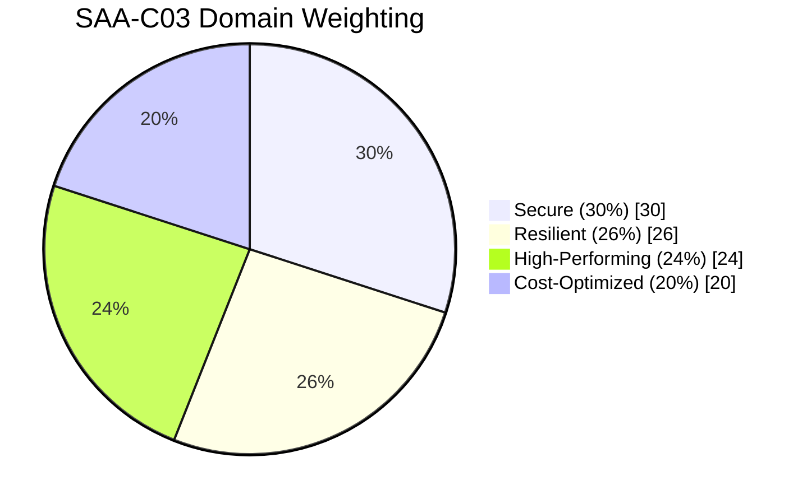

**Scoring math.** With ~50 scored questions and a 1000-point scale, each scored item is worth roughly $1000/50 = 20$ scaled points (AWS weights items, so this is an approximation). To clear 720 you need to answer roughly:

$$\text{target correct} \approx \left\lceil \frac{720}{1000} \times 50 \right\rceil = 36 \text{ of } 50 \text{ scored questions}$$

> 🎯 **Key Insight:** You can miss ~14 scored questions and still pass. **Never leave a blank** — there is no negative marking. Flag-and-return is your friend: do a fast first pass answering everything you know, then revisit flagged items.

> 📝 **Tip:** Build a personal "trigger dictionary": *"static IP + ultra-low latency + millions of req/s"* → NLB; *"path/host-based routing + HTTP"* → ALB; *"decouple + at-least-once + retries"* → SQS; *"fan-out"* → SNS; *"event routing + filtering + 3rd-party SaaS"* → EventBridge. The exam reuses these phrases verbatim.

---

## 2. Domain 1 — Design Resilient Architectures (26%)

Resilience = **survive failure** (of an instance, an AZ, a Region) **and recover within an agreed RTO/RPO**. This domain is dominated by networking (VPC), elasticity (Auto Scaling + ELB), DNS (Route 53), decoupling, and the resilience features of data stores.

### 2.1 VPC Deep Dive

> 💡 **Intuition:** A VPC is your own private slice of the AWS network — a logically isolated virtual data center. Subnets carve it into AZ-pinned blocks; route tables decide where packets go; gateways are the doors to the outside world.

**Core building blocks:**

- **VPC** — a regional construct with a CIDR block (e.g. `10.0.0.0/16`). Spans all AZs in the Region.
- **Subnet** — lives in **exactly one AZ**, carved from the VPC CIDR (e.g. `10.0.1.0/24`). "Public" vs "private" is *not a flag* — a subnet is **public iff its route table has a route to an Internet Gateway**.
- **Route table** — set of rules (destination CIDR → target). Each subnet associates with exactly one route table; the **main** route table is the default.
- **Internet Gateway (IGW)** — horizontally scaled, redundant, highly available VPC component enabling **bidirectional** IPv4/IPv6 internet access. One per VPC.
- **NAT Gateway** — lets **private** subnet instances make **outbound** internet connections (patching, API calls) while blocking **inbound**. AZ-scoped managed service.
- **Egress-only Internet Gateway** — the IPv6 equivalent of NAT (outbound-only) for IPv6 traffic.

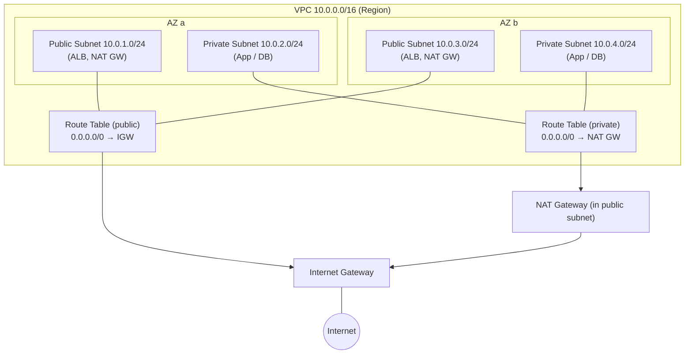

#### NAT Gateway vs NAT Instance

| Dimension | **NAT Gateway** (managed) | **NAT Instance** (self-run EC2) |
|---|---|---|
| Management | Fully managed by AWS | You patch, monitor, secure |
| Availability | HA **within an AZ**; deploy one per AZ for AZ-fault tolerance | Single EC2 = single point of failure (need scripts for failover) |
| Bandwidth | Scales automatically up to 100 Gbps | Limited by instance type |
| Security groups | Cannot attach SG (use NACLs) | Can attach SG |
| Port forwarding / bastion | Not supported | Supported |
| Cost | Per-hour + per-GB processed | EC2 hourly (can be cheaper at tiny scale) |

> ⚠️ **Common Pitfall:** A NAT Gateway is **AZ-scoped**, not Region-scoped. If you place a single NAT GW in AZ-a and AZ-a fails, your AZ-b private instances lose internet egress. For true HA, deploy **one NAT GW per AZ** and point each private subnet's route table at the NAT GW in its *own* AZ (also avoids cross-AZ data-transfer charges).

#### Security Groups vs NACLs

| | **Security Group (SG)** | **Network ACL (NACL)** |
|---|---|---|
| Operates at | **Instance / ENI** level | **Subnet** level |
| State | **Stateful** (return traffic auto-allowed) | **Stateless** (must allow return traffic explicitly) |
| Rules | **Allow only** | **Allow and Deny** |
| Evaluation | All rules evaluated | Rules processed **in numbered order**, first match wins |
| Default | Denies all inbound, allows all outbound | Default NACL allows all; custom NACL denies all |

> 🎯 **Key Insight:** *Stateful vs stateless* is the single most-tested VPC fact. SG = stateful (you only open the inbound port). NACL = stateless (you must open inbound **and** the corresponding **ephemeral outbound** ports `1024–65535` for responses). If a question mentions blocking a **specific malicious IP**, the answer is **NACL Deny** (SGs can't deny).

#### VPC Endpoints — Gateway vs Interface (PrivateLink)

Endpoints let resources reach AWS services **without traversing the public internet**, an IGW, or a NAT GW.

| | **Gateway Endpoint** | **Interface Endpoint (PrivateLink)** |
|---|---|---|
| Mechanism | Route-table entry (prefix list) | ENI with a private IP in your subnet |
| Supported services | **S3 and DynamoDB only** | Most AWS services + your own/partner services |
| Cost | **Free** | Hourly + per-GB |
| DNS | No private DNS needed | Provides private DNS names |
| Cross-Region / on-prem | No | Yes (over VPN/DX) |

> ⚠️ **Common Pitfall:** "Access S3 from a private subnet at **no additional cost** without internet" → **Gateway Endpoint**. If the exam adds "from **on-premises over Direct Connect**" or "any service other than S3/DynamoDB", switch to **Interface Endpoint**.

#### Connectivity: Peering vs Transit Gateway vs VPN vs Direct Connect

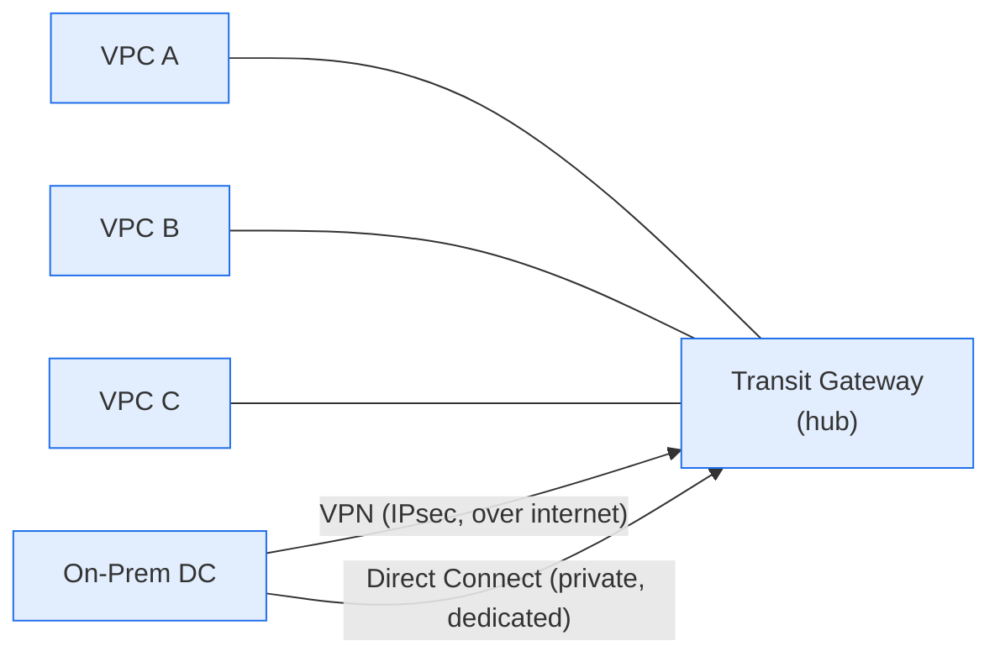

| Need | Use |
|---|---|
| Connect **2 VPCs**, simple, 1:1 | **VPC Peering** (non-transitive — A↔B and B↔C does NOT give A↔C) |
| Connect **many VPCs + on-prem** as a hub-and-spoke | **Transit Gateway** (transitive, scales to thousands) |
| Encrypted on-prem ↔ AWS quickly, over the internet | **Site-to-Site VPN** (fast to set up, ~1.25 Gbps/tunnel, variable latency) |
| **Consistent, low-latency, high-bandwidth, private** on-prem ↔ AWS | **Direct Connect (DX)** — dedicated physical line; weeks to provision |
| DX with encryption + resilience while DX is provisioned | **VPN over DX** / DX + VPN backup |

> 📝 **Tip:** "Consistent throughput / low latency / not over the public internet" = **Direct Connect**. "Encrypted + quick to stand up" = **VPN**. "Both: encrypted *and* private/consistent" = **VPN over Direct Connect**.

### 2.2 Multi-AZ vs Multi-Region

- **Multi-AZ** protects against **AZ failure** (power, network, flood) — the default HA pattern; sub-millisecond inter-AZ latency; same Region. Use for the *vast majority* of "highly available" questions.
- **Multi-Region** protects against **Region failure** and serves **global users with low latency** / meets **data-residency** or strict DR mandates. More complex and costly (data replication, eventual consistency).

> 🎯 **Key Insight:** If the requirement says "**highly available**" with no geographic/DR language, the answer is **Multi-AZ**. Reach for **Multi-Region** only when you see "survive a **Region** outage", "**global** low latency", or "regulatory **data residency**".

### 2.3 Disaster Recovery Strategies

RTO = **Recovery Time Objective** (how long until you're back up). RPO = **Recovery Point Objective** (how much data you can afford to lose, i.e. time since last good backup).

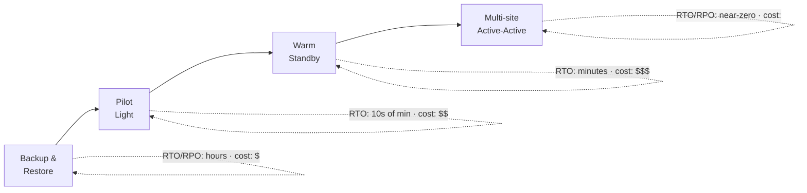

| Strategy | What's running in DR region | RTO | RPO | Cost |
|---|---|---|---|---|
| **Backup & Restore** | Nothing; just backups (S3/Glacier, snapshots) | Hours | Hours | $ |
| **Pilot Light** | **Core (data) only** running; app servers off/minimal | 10s of minutes | Minutes | $$ |
| **Warm Standby** | **Scaled-down but full** stack, always on | Minutes | Seconds–minutes | $$$ |
| **Active-Active (Multi-site)** | **Full** stack serving live traffic | Near-zero | Near-zero | $$$$ |

> ⚠️ **Common Pitfall:** Distinguish **Pilot Light** from **Warm Standby**. Pilot Light = the **database is replicating** but app tier is **switched off** (you start/scale it during failover). Warm Standby = a **scaled-down version of the entire stack is already running** and just needs to scale up. "Always running, just smaller" → Warm Standby. "Only the data layer is live" → Pilot Light.

### 2.4 Auto Scaling

An **Auto Scaling Group (ASG)** keeps a fleet between `min` and `max` at a `desired` count, replacing unhealthy instances and scaling on demand.

- **Launch template** (preferred over the legacy launch configuration — supports versioning, mixed instances, newer features).
- **Scaling policies:**
  - **Target tracking** — keep a metric at a target (e.g. avg CPU = 50%). *Default choice; simplest.*
  - **Step scaling** — add/remove N instances per alarm threshold band.
  - **Simple scaling** — single adjustment + cooldown (legacy).
  - **Scheduled** — scale at known times (e.g. business-hours spike).
  - **Predictive** — ML forecasts load and pre-scales (great for daily/weekly cyclical patterns).
- **Lifecycle hooks** — pause an instance in `Pending:Wait` or `Terminating:Wait` to run bootstrap/drain logic (install software, deregister, copy logs) before it goes InService or terminates.
- **Health checks** — EC2 (status checks) and/or **ELB** (application health). Always enable **ELB health checks** so the ASG replaces instances the LB deems unhealthy.

> 📝 **Tip:** "Predictable recurring spike (every day at 9am)" → **Scheduled** or **Predictive**. "Run a script before an instance is terminated (drain connections, save logs)" → **Lifecycle hook**. "Keep CPU around X%" → **Target tracking**.

### 2.5 Elastic Load Balancing

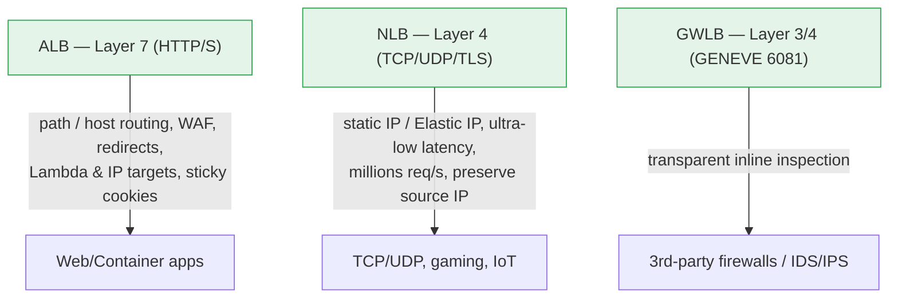

| LB | Layer | Pick when you see... |
|---|---|---|
| **ALB** | 7 (HTTP/HTTPS) | Path-based / host-based routing, microservices, containers, **WAF** integration, redirect HTTP→HTTPS, **Lambda targets**, authenticate via Cognito/OIDC |
| **NLB** | 4 (TCP/UDP/TLS) | **Static IP / Elastic IP**, **extreme performance** (millions of req/s, ultra-low latency), preserve **source IP**, TCP/UDP, PrivateLink front-end |
| **GWLB** | 3/4 (GENEVE) | Deploy/scale **third-party virtual appliances** (firewalls, IDS/IPS, DPI) transparently inline |
| **CLB** | 4/7 (legacy) | Avoid — only legacy migrations |

> ⚠️ **Common Pitfall:** WAF attaches to **ALB, CloudFront, API Gateway, AppSync, Cognito** — **not** to NLB. If a scenario needs both a **static IP** and **WAF**, front the NLB with… no — instead use **CloudFront + WAF** in front, or use an ALB with WAF and put an NLB-style requirement elsewhere. The clean exam answer for "WAF + L7" is **ALB**; for "static IP + L4" it's **NLB**.

### 2.6 Route 53 Routing Policies

| Policy | Use case |
|---|---|
| **Simple** | One resource, no health check logic |
| **Weighted** | Split traffic by % (A/B testing, blue/green, gradual rollout) |
| **Latency-based** | Route user to the Region with **lowest latency** |
| **Failover** | Active/passive — primary, fall back to secondary on health-check failure |
| **Geolocation** | Route by **user's location** (content localization, compliance/geo-blocking) |
| **Geoproximity** | Route by geographic distance with an adjustable **bias** to shift traffic |
| **Multivalue answer** | Return up to 8 healthy records — client-side, **not** a substitute for an LB |

> 🎯 **Key Insight:** "Route to the closest Region for **performance**" = **Latency-based**. "Route based on **where the user is** (compliance/localization)" = **Geolocation**. "Active/passive **DR failover**" = **Failover** + health check. Don't confuse latency (performance) with geolocation (location/compliance).

### 2.7 Decoupling: SQS vs SNS vs EventBridge

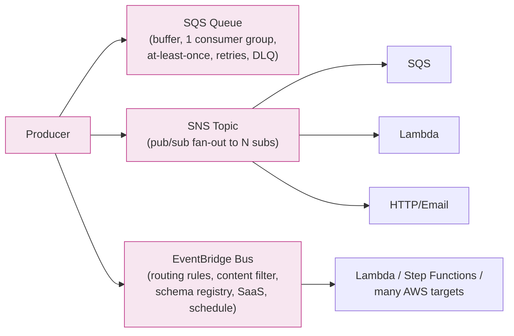

| Service | Model | Pick when... |
|---|---|---|
| **SQS** | Queue (pull) | Decouple producer/consumer, **buffer/level load**, guaranteed processing with retries + **DLQ**. Standard (at-least-once, best-effort order) vs **FIFO** (exactly-once, ordered, lower throughput). |
| **SNS** | Pub/Sub (push) | **Fan-out** one message to many subscribers; combine **SNS → multiple SQS** for durable fan-out. |
| **EventBridge** | Event bus (push) | **Content-based routing/filtering**, **SaaS** integrations, **scheduled** events, schema registry, many AWS-service targets without code. |

> 📝 **Tip:** "**Fan-out** to multiple endpoints + each needs its **own durable copy**" → **SNS topic → multiple SQS queues**. "Order matters + no duplicates" → **SQS FIFO**. "React to AWS service state changes / route by event content" → **EventBridge**.

### 2.8 Database & Storage Resilience

- **RDS Multi-AZ** — synchronous standby in another AZ; **automatic failover**; for **HA/DR**, *not* for read scaling.
- **RDS Read Replicas** — asynchronous; **scale reads**; can be cross-Region; can be promoted (manual DR). *Not* automatic failover.
- **Aurora** — storage **auto-scales** to 128 TiB, 6 copies across 3 AZs; **Global Database** (cross-Region, <1s replication, sub-minute failover); **Serverless v2** (fine-grained auto-scaling for spiky/unpredictable workloads).
- **DynamoDB Global Tables** — multi-Region, multi-active, fully replicated; for global low-latency + multi-Region resilience.
- **S3** — **11 nines** durability (`99.999999999%`), versioning, **Cross-Region Replication (CRR)** / **Same-Region Replication (SRR)**.

> ⚠️ **Common Pitfall:** **Multi-AZ ≠ read scaling.** Multi-AZ is for failover/availability; the standby does **not** serve reads (Aurora is the exception with reader endpoints). To **scale reads**, use **Read Replicas**. Mixing these up is a classic distractor.

---

## 3. Domain 2 — Design High-Performing Architectures (24%)

### 3.1 EC2 Families, Spot & Placement Groups

| Family prefix | Optimized for | Examples |
|---|---|---|
| **T** (burstable) | Spiky, low-baseline workloads (dev, small web) | t3, t4g |
| **M** (general) | Balanced compute/memory | m6i, m7g |
| **C** (compute) | CPU-bound (batch, HPC, gaming servers) | c7g, c6i |
| **R / X** (memory) | In-memory DBs, caches, big data | r6i, x2idn |
| **I / D** (storage) | High local IOPS / dense storage | i4i, d3 |
| **P / G / Inf / Trn** (accelerated) | GPU/ML training & inference | p5, g6, inf2, trn1 |

**Purchasing models** (also see Cost domain): On-Demand, Reserved, Savings Plans, **Spot** (up to 90% off, can be reclaimed with a 2-min warning — perfect for fault-tolerant/stateless/batch).

**Placement groups:**
- **Cluster** — pack instances in one AZ for **lowest latency / highest throughput** (HPC). High blast radius.
- **Spread** — place on distinct hardware (max 7/AZ) for **critical, must-not-co-locate** instances.
- **Partition** — group into partitions on distinct racks (HDFS/Cassandra/Kafka) — large distributed workloads.

> 📝 **Tip:** "Tightly-coupled HPC, lowest network latency" → **Cluster**. "Reduce correlated hardware failure for a few critical nodes" → **Spread**. "Big distributed data store (Hadoop/Kafka)" → **Partition".

### 3.2 Block, File & Object Storage

**EBS volume types:**

| Type | Class | Best for | Notes |
|---|---|---|---|
| **gp3** | SSD | General default | Baseline 3,000 IOPS / 125 MB/s, **provision IOPS independent of size** (cheaper than gp2) |
| **io2 Block Express** | SSD | Mission-critical DBs needing **highest IOPS/durability** | Up to 256k IOPS, 99.999% durability |
| **st1** | HDD | Throughput-intensive, sequential (big data, logs) | Cannot be a boot volume |
| **sc1** | HDD | **Cold**, infrequent, lowest cost | Cannot be a boot volume |

> 🎯 **Key Insight:** EBS is **single-AZ** and (mostly) attaches to **one instance** (io1/io2 Multi-Attach is the exception, within one AZ). Need a file system shared by **many instances/AZs** → **EFS** (Linux/NFS) or **FSx**.

**File systems:**

| Service | Protocol / OS | Use case |
|---|---|---|
| **EFS** | NFS, Linux | Shared, elastic, multi-AZ Linux file storage; lifecycle to IA |
| **FSx for Windows File Server** | SMB, Windows | AD-integrated Windows shares |
| **FSx for Lustre** | Lustre, Linux | **HPC / ML / high-throughput**, S3-linked |
| **FSx for NetApp ONTAP** | NFS/SMB/iSCSI | Multi-protocol, existing ONTAP features (dedupe, snapshots) |
| **FSx for OpenZFS** | NFS | ZFS workloads, low-latency |
| **Instance Store** | Ephemeral | Temporary, **lost on stop/terminate**; highest IOPS (cache, scratch) |

### 3.3 S3 Storage Classes & Intelligent-Tiering

| Class | Use case | Retrieval | Min duration |
|---|---|---|---|
| **S3 Standard** | Hot, frequent | ms | — |
| **S3 Intelligent-Tiering** | **Unknown/changing** access patterns | ms | — (small monitoring fee) |
| **S3 Standard-IA** | Infrequent, rapid when needed | ms | 30 days |
| **S3 One Zone-IA** | Infrequent + **re-creatable** (single AZ) | ms | 30 days |
| **Glacier Instant Retrieval** | Archive, occasional ms access | ms | 90 days |
| **Glacier Flexible Retrieval** | Archive | minutes–hours | 90 days |
| **Glacier Deep Archive** | **Lowest cost**, rarely accessed | 12 hours | 180 days |

> ⚠️ **Common Pitfall:** **Intelligent-Tiering** is the answer when access patterns are **unknown or change over time** and you want zero operational overhead — *not* when you already know the data is cold (then pick the explicit class to avoid the monitoring fee).

### 3.4 Caching & Content Delivery

- **CloudFront** — global CDN (edge locations). Caches via **cache policies**; behaviors route by path pattern; **OAC** (Origin Access Control) locks the S3 origin to CloudFront only.
- **CloudFront Functions** vs **Lambda@Edge:**

| | **CloudFront Functions** | **Lambda@Edge** |
|---|---|---|
| Runtime | Lightweight JS, **sub-ms** | Node/Python, ms |
| Triggers | Viewer request/response only | Viewer + **Origin** request/response |
| Use | Header manipulation, URL rewrites, simple auth at massive scale | Heavier logic, network/3rd-party calls, larger payloads |

- **ElastiCache:**

| | **Redis (OSS) / Valkey** | **Memcached** |
|---|---|---|
| Data structures | Rich (lists, sets, sorted sets, pub/sub, streams) | Simple key/value |
| Persistence / replication / HA | Yes (Multi-AZ, replicas, backup) | No (pure cache, multi-threaded) |
| Use | Leaderboards, sessions, complex caching, durability needed | Simplest, largest, horizontally-scaled object cache |

- **DAX** — DynamoDB Accelerator: in-memory cache **for DynamoDB**, microsecond reads, no app rewrite. (Don't use ElastiCache in front of DynamoDB when DAX exists.)

### 3.5 Data & Analytics

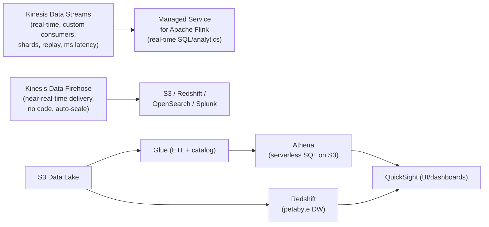

| Service | What it is |
|---|---|
| **Redshift** | Petabyte-scale columnar **data warehouse**; complex joins/analytics; Spectrum queries S3 |
| **Athena** | **Serverless** SQL directly on S3 (pay per TB scanned); ad-hoc; use Parquet + partitions to cut cost |
| **Glue** | Serverless **ETL** + **Data Catalog** (schema metadata) |
| **EMR** | Managed **Hadoop/Spark/Hive** clusters for big-data processing |
| **Kinesis Data Streams** | Real-time ingest, custom consumers, **shards**, replay |
| **Kinesis Data Firehose** | **Zero-admin** near-real-time **delivery** to S3/Redshift/OpenSearch/Splunk (no consumers to manage) |
| **Managed Service for Apache Flink** | Real-time stream **analytics** (SQL/Java) |
| **OpenSearch** | Search + log analytics + dashboards |
| **Lake Formation** | Governance/permissions layer over an S3 data lake |
| **QuickSight** | Serverless **BI** dashboards |

> 📝 **Tip:** "Real-time, need **custom processing/replay/multiple consumers**" → **Kinesis Data Streams**. "Just **deliver/load** streaming data to S3/Redshift with **no servers to manage**" → **Firehose**. "Ad-hoc SQL on data already in S3, no infra" → **Athena**.

### 3.6 Compute Options

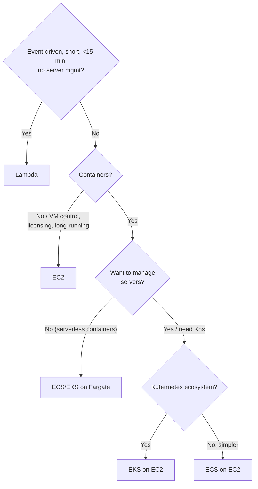

> 🎯 **Key Insight:** "**Least operational overhead**" + event-driven + short tasks → **Lambda**. "Containers, no servers" → **Fargate**. "Need Kubernetes/portability" → **EKS**. "Full OS control / specific licensing / long-running stateful" → **EC2**.

---

## 4. Domain 3 — Design Secure Architectures (30%)

The **largest** domain. Master IAM, encryption (KMS), and the edge/threat service zoo.

### 4.1 IAM Deep Dive

- **Users / Groups / Roles / Policies.** Prefer **roles** (temporary credentials via STS) over long-lived **access keys** — *never* hardcode keys; give EC2/Lambda an **IAM role**.
- **Policy types:** identity-based, resource-based (e.g. S3 bucket policy, KMS key policy), **permission boundaries**, **SCPs**, session policies.
- **Cross-account access** — assume a role in account B from account A (trust policy + permissions policy).
- **AWS Organizations + SCPs** — **Service Control Policies** set the **maximum** permissions (guardrails) for member accounts; they **never grant** — they only **limit**. An action is allowed only if permitted by **both** the SCP and an IAM policy.
- **Permission boundary** — a managed policy that caps the max permissions an IAM principal can have (delegated admin safety).
- **Federation / IAM Identity Center** (successor to AWS SSO) — central workforce SSO across accounts using existing IdP (SAML/OIDC); **identity federation** for external users.

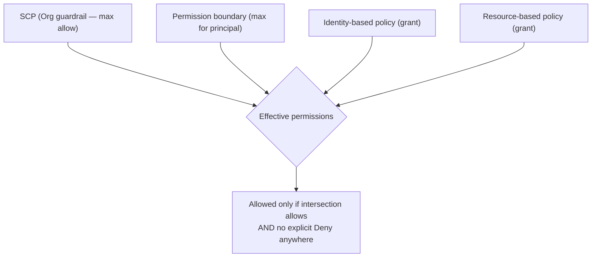

> 🎯 **Key Insight:** **Explicit Deny always wins.** Effective permission = the **intersection** of SCP ∩ permission boundary ∩ identity policy (plus resource policy can grant in the same/cross account), minus any explicit Deny. SCPs **filter**, they don't **grant**.

### 4.2 Encryption Everywhere (KMS & friends)

- **KMS** — managed keys; **AWS-managed** keys (free, auto), **customer-managed keys (CMK)** (you control rotation/policy/grants), envelope encryption. Integrated with S3, EBS, RDS, Secrets Manager, etc.
- **CloudHSM** — dedicated single-tenant **FIPS 140-2 Level 3** hardware; use when you need exclusive control/compliance.

**S3 encryption options:**

| Option | Who manages keys | When |
|---|---|---|
| **SSE-S3** | AWS (AES-256) | Default, simplest at-rest encryption |
| **SSE-KMS** | KMS (CMK) | Need **audit trail (CloudTrail)**, key rotation, access policies |
| **SSE-C** | **You** provide the key per request | You must control keys but want AWS to do the encryption |
| **Client-side** | You (encrypt before upload) | Zero trust in the cloud for plaintext |

> ⚠️ **Common Pitfall:** "Need to **audit who used the key and when** / control key rotation" → **SSE-KMS** (CloudTrail logs every key use). "Encrypt **in transit**" is orthogonal — that's **TLS/HTTPS**, enforced via bucket policy `aws:SecureTransport`.

- **EBS / RDS encryption** — checkbox at creation, KMS-backed; encrypts data at rest, snapshots, and replicas. RDS: enable at creation (can't toggle on later without a snapshot copy).

### 4.3 Edge & Threat Detection

| Service | Purpose |
|---|---|
| **AWS WAF** | L7 firewall — block SQLi/XSS, rate-limit, geo-block (attach to ALB/CloudFront/API GW/AppSync/Cognito) |
| **Shield Standard** | Free, always-on **DDoS** protection (L3/L4) |
| **Shield Advanced** | Paid, enhanced DDoS + cost protection + 24/7 DRT |
| **GuardDuty** | ML **threat detection** from VPC Flow/DNS/CloudTrail logs (no agents) |
| **Inspector** | Automated **vulnerability** scanning (EC2, ECR images, Lambda) |
| **Macie** | ML **discovery of sensitive data (PII)** in S3 |
| **Security Hub** | **Aggregates** findings across security services + compliance posture |
| **Config** | Records resource **configuration history** + **compliance rules** (drift) |
| **Secrets Manager** | Store + **auto-rotate** secrets (DB creds, API keys) |

> 📝 **Tip:** "Detect threats from **logs** with ML, no agents" → **GuardDuty**. "Find **PII in S3**" → **Macie**. "Scan EC2/containers for **CVEs**" → **Inspector**. "Track config changes / is this resource **compliant**" → **Config**. "**Rotate** DB passwords automatically" → **Secrets Manager** (vs **SSM Parameter Store** for free, simple, no auto-rotation).

### 4.4 Secure Access Patterns

- **Presigned URLs** — grant **temporary, scoped** access to a private S3 object without making it public.
- **VPC endpoints** — keep AWS-service traffic off the public internet (see 2.1).
- **SSM Session Manager** — shell access to instances **without SSH, without a bastion, without open port 22**, fully logged to CloudTrail/S3.

> 🎯 **Key Insight:** "Access EC2 securely **without opening port 22 / no bastion / audit the session**" → **SSM Session Manager**. "Let a user download a private S3 file temporarily" → **presigned URL**.

---

## 5. Domain 4 — Design Cost-Optimized Architectures (20%)

### 5.1 EC2/Compute Pricing Models

| Model | Discount | Commitment | Best for |
|---|---|---|---|
| **On-Demand** | 0 | None | Spiky, unpredictable, short-term |
| **Savings Plans** | up to ~72% | 1 or 3 yr $/hr commit | **Flexible** across instance family/Region/compute type (incl. Fargate/Lambda) |
| **Reserved Instances (RI)** | up to ~72% | 1 or 3 yr specific config | Steady-state, known capacity (Standard RI deepest discount; Convertible more flexible) |
| **Spot** | up to ~90% | None (interruptible) | **Fault-tolerant**, stateless, batch, CI, big-data |
| **Dedicated Host** | — | — | Licensing tied to physical sockets/cores (BYOL) |

> 🎯 **Key Insight:** "Steady 24/7 baseline, want flexibility across families/services" → **Compute Savings Plans**. "Fixed, unchanging workload, deepest discount" → **Standard RI**. "Interruptible batch" → **Spot**. "BYOL OS licensing on dedicated hardware" → **Dedicated Hosts**.

### 5.2 Storage & Data-Transfer Cost Levers

- **S3 Lifecycle policies** — transition objects to IA/Glacier/Deep Archive and expire them automatically.
- **S3 Intelligent-Tiering** — for unknown patterns (auto-moves, no retrieval fees between frequent/infrequent).
- **Right-sizing** — Compute Optimizer recommends smaller/cheaper instances.
- **Data-transfer traps:**
  - **Data IN is free**; **data OUT to internet costs**.
  - **Cross-AZ** traffic is **charged** (both directions) — keep chatty tiers in the same AZ where HA allows; use per-AZ NAT GWs.
  - **CloudFront** reduces origin egress cost and improves performance.
  - **VPC Gateway Endpoints (S3/DynamoDB)** are **free** and avoid NAT data-processing charges.

> ⚠️ **Common Pitfall:** A surprise bill often = **NAT Gateway data processing** for traffic that should have used a **free S3/DynamoDB Gateway Endpoint**, or **cross-AZ** chatter. Watch for these in "reduce cost without sacrificing function" questions.

### 5.3 Cost Tooling Quartet

| Tool | Job |
|---|---|
| **Cost Explorer** | Visualize/analyze **past** spend, forecast, find drivers |
| **AWS Budgets** | **Alert/act** when spend or usage crosses a threshold |
| **Trusted Advisor** | Checks across **cost/security/perf/fault-tolerance/limits** (idle resources, etc.) |
| **Compute Optimizer** | ML **right-sizing** recommendations for EC2/ASG/EBS/Lambda |

> 📝 **Tip:** "Get **notified** when spend exceeds $X" → **Budgets**. "Understand **where** money went / forecast" → **Cost Explorer**. "**Right-size** instances" → **Compute Optimizer**. "Find idle/underutilized resources + broad best-practice checks" → **Trusted Advisor**.

### 5.4 Serverless vs Server Cost Reasoning

Serverless (Lambda, Fargate, DynamoDB on-demand, Aurora Serverless) shines for **spiky/low-duty-cycle** workloads — you pay **per request/GB-second**, scale to zero. Servers (EC2 + RI/SP) win for **steady, high-utilization** workloads where a committed instance is cheaper per unit of work.

$$\text{break-even} : \quad \text{Lambda cost} = \text{requests} \times (\text{per-invoke} + \text{GB-sec} \times \text{price})$$

When sustained utilization is high enough that a reserved instance amortizes below the per-request curve, move to EC2/Fargate + Savings Plans.

---

## 6. The Well-Architected Framework (6 Pillars)

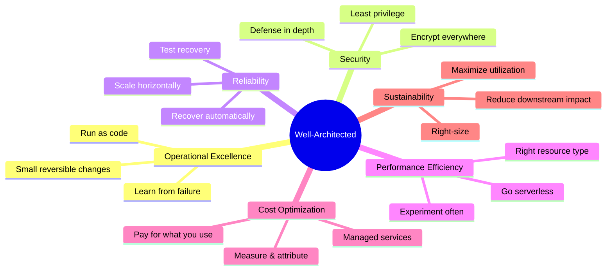

| Pillar | One key question |
|---|---|
| **Operational Excellence** | How do you run and evolve workloads as code, learning from operations? |
| **Security** | How do you protect data, systems, and assets with least privilege & defense in depth? |
| **Reliability** | How do you recover from failure and meet availability/RTO/RPO demands? |
| **Performance Efficiency** | How do you use resources efficiently and adopt new tech as it arrives? |
| **Cost Optimization** | How do you avoid unnecessary cost and attribute spend? |
| **Sustainability** | How do you minimize the environmental impact of your workloads? |

---

## 7. Pattern Library (Reference Architectures)

### 7.1 Three-Tier Web App

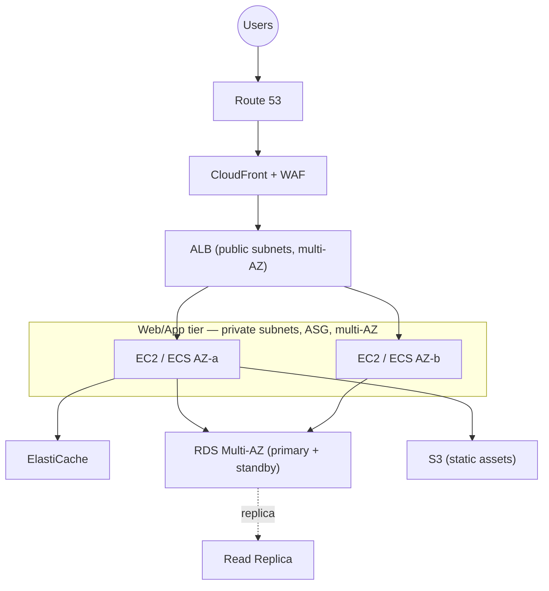

### 7.2 Serverless API

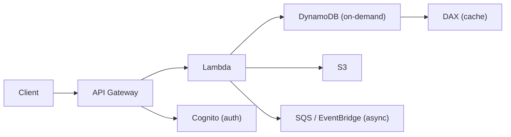

### 7.3 Event-Driven Microservices

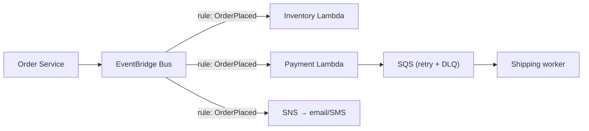

### 7.4 Data Lake

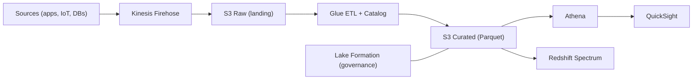

### 7.5 Multi-Region Active-Active

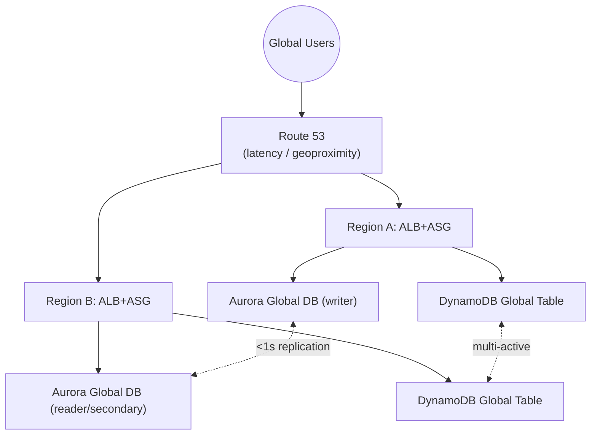

### 7.6 Pilot-Light DR

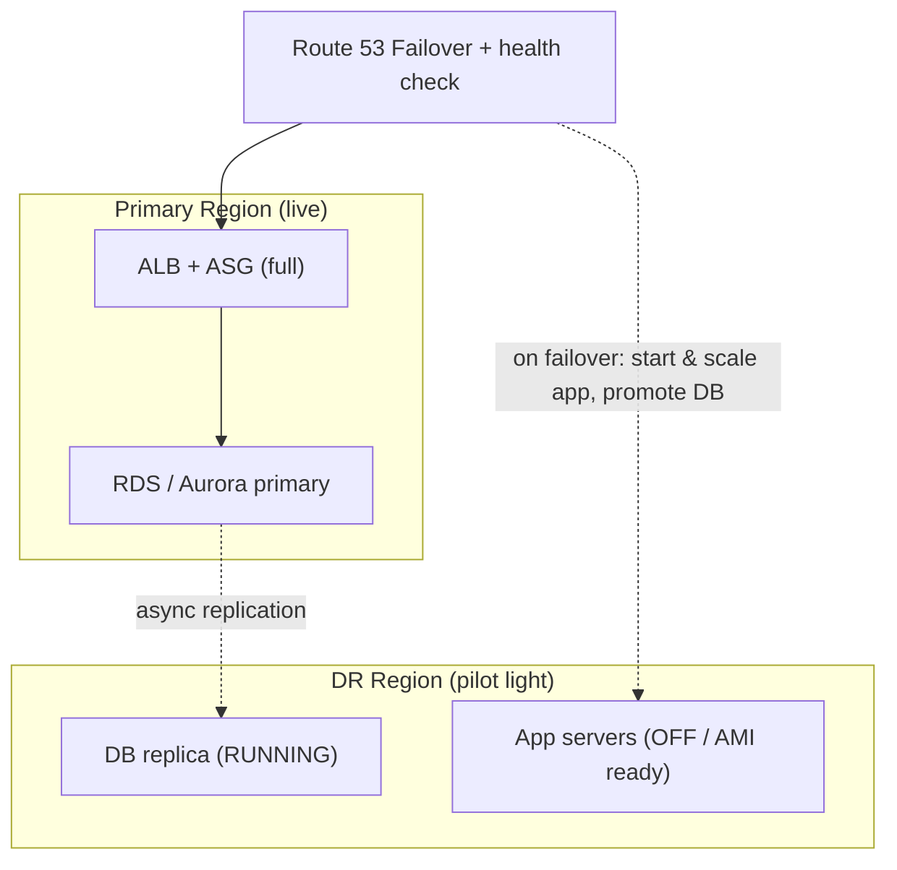

---

## 8. Service Chooser Decision Tables

### 8.1 Compute

| If you need... | Choose |
|---|---|
| Full OS control, licensing, long-running | **EC2** |
| Event-driven, < 15 min, scale-to-zero, least ops | **Lambda** |
| Containers, no server management | **Fargate (ECS/EKS)** |
| Kubernetes ecosystem/portability | **EKS** |
| Simple AWS-native containers | **ECS** |
| Cheap, interruptible batch | **EC2 Spot / Fargate Spot** |

### 8.2 Storage

| If you need... | Choose |
|---|---|
| Object storage, web-scale, 11 nines | **S3** |
| Block storage for one instance | **EBS (gp3 / io2)** |
| Shared Linux file system, multi-AZ | **EFS** |
| Windows/SMB shares | **FSx for Windows** |
| HPC/ML high-throughput file system | **FSx for Lustre** |
| Cheapest archive, 12-h retrieval ok | **Glacier Deep Archive** |
| Unknown access pattern | **S3 Intelligent-Tiering** |

### 8.3 Database

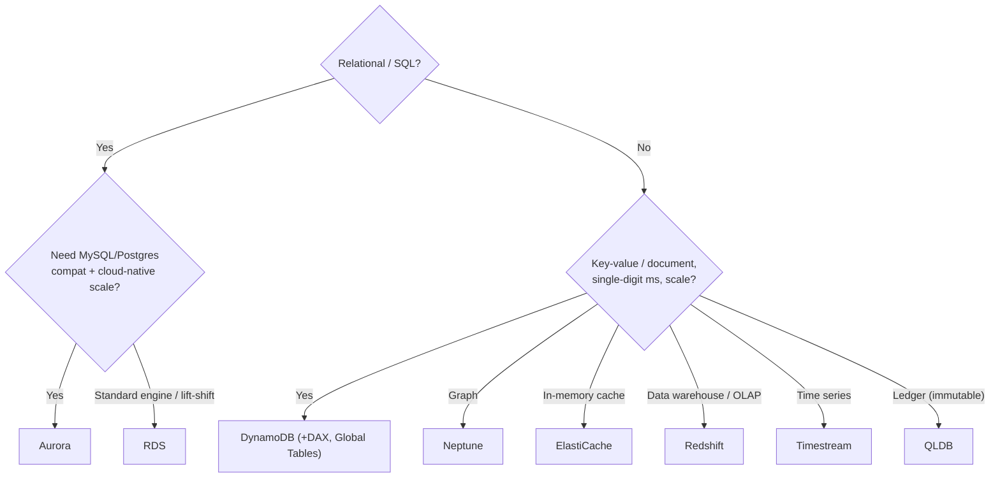

### 8.4 Integration / Messaging

| If you need... | Choose |
|---|---|
| Decouple + buffer + guaranteed processing + retries | **SQS** |
| Strict order + no duplicates | **SQS FIFO** |
| Fan-out to many subscribers | **SNS** |
| Durable fan-out (each gets own copy) | **SNS → multiple SQS** |
| Content routing / SaaS events / scheduled | **EventBridge** |
| Orchestrate multi-step workflow with state | **Step Functions** |

---

## 9. Common Exam Traps

> ⚠️ **Trap 1 — Multi-AZ vs Read Replica.** Multi-AZ = **HA/failover** (standby not readable). Read Replica = **read scaling** (no auto-failover). Don't pick Multi-AZ to "offload reads."

> ⚠️ **Trap 2 — Gateway vs Interface Endpoint.** Free + S3/DynamoDB + route table = **Gateway**. Everything else / on-prem / other services = **Interface (PrivateLink)**.

> ⚠️ **Trap 3 — SG vs NACL for blocking an IP.** SGs **cannot deny**. To block a specific malicious IP, use a **NACL Deny** rule.

> ⚠️ **Trap 4 — NAT Gateway HA.** A single NAT GW is **AZ-scoped**; for AZ-fault tolerance deploy **one per AZ**.

> ⚠️ **Trap 5 — WAF target.** WAF attaches to **CloudFront/ALB/API GW/AppSync/Cognito**, **never NLB**.

> ⚠️ **Trap 6 — Latency vs Geolocation routing.** Latency = performance (closest Region). Geolocation = user's location (compliance/localization).

> ⚠️ **Trap 7 — SSE-KMS vs SSE-S3.** Need **audit/rotation/policy on the key** → SSE-KMS (CloudTrail). Just encrypt at rest, simplest → SSE-S3.

> ⚠️ **Trap 8 — Kinesis Data Streams vs Firehose.** Custom consumers/replay/real-time → Streams. No-admin delivery to S3/Redshift → Firehose.

> ⚠️ **Trap 9 — Spot for stateful.** Spot is for **fault-tolerant/stateless** work. Never put a primary DB or non-checkpointed stateful job on pure Spot.

> ⚠️ **Trap 10 — SCPs don't grant.** SCPs only **limit** the maximum; you still need an IAM policy that allows the action.

> ⚠️ **Trap 11 — "Least operational overhead"** is a steering phrase → prefer **managed/serverless** (Lambda, Fargate, Aurora Serverless, DynamoDB, Firehose) over self-managed.

> ⚠️ **Trap 12 — Cross-AZ / NAT data costs.** "Reduce cost" with private subnets calling S3 → **Gateway Endpoint** (free), not bigger NAT.

---

## 10. The 5-Week SAA Micro-Plan

```mermaid
gantt
    title 5-Week SAA-C03 Plan
    dateFormat  X
    axisFormat %s
    section Foundations
    Week 1 IAM + VPC + Compute        :0, 1
    section Data
    Week 2 Storage + Databases        :1, 1
    section Edge & Resilience
    Week 3 ELB/R53/ASG + DR + Decoupling :2, 1
    section Security & Cost
    Week 4 Security + Cost + WAF/Threat  :3, 1
    section Exam Prep
    Week 5 Practice exams + weak-area review :4, 1
```

| Week | Focus | Daily cadence | Milestone |
|---|---|---|---|
| **1** | IAM, VPC, EC2/compute | 1 video module + hands-on lab + 15 Qs | Build a multi-AZ VPC by hand |
| **2** | S3, EBS/EFS/FSx, RDS/Aurora/DynamoDB | same | Deploy RDS Multi-AZ + read replica; S3 lifecycle |
| **3** | ELB, Route 53, ASG, SQS/SNS/EventBridge, DR | same | Stand up 3-tier app with ASG + ALB |
| **4** | KMS, WAF/Shield/GuardDuty/Macie/Inspector/Config, cost tooling | same | Encrypt + lock down the app; set Budgets |
| **5** | **Full-length practice exams** (Tutorials Dojo), review every wrong answer | 1–2 timed exams/day + deep review | Score **≥ 85%** consistently before booking |

> 📝 **Tip:** The single highest-ROI activity is **timed practice exams with full review of wrong answers**. Don't book the real exam until you hit ~85% on fresh practice sets.

---

## 11. ❓ Knowledge Check

1. What makes a subnet "public"?

Its associated **route table has a route to an Internet Gateway** (`0.0.0.0/0 → igw-…`) **and** instances have public IPs. "Public/private" is not a checkbox — it's defined by routing.

2. You must block a single attacking IP address from reaching your fleet. SG or NACL?

**NACL** with a **Deny** rule. Security Groups support **allow rules only** and cannot explicitly deny a source.

3. Private instances need to download OS patches but must never accept inbound connections. What do you use, and how do you make it AZ-fault-tolerant?

A **NAT Gateway** (outbound-only). For AZ-fault tolerance, deploy **one NAT GW per AZ** and point each private subnet's route table to the NAT GW in its **own** AZ — this also avoids cross-AZ data charges.

4. Which S3 access option lets you audit every use of the encryption key?

**SSE-KMS** — KMS logs every encrypt/decrypt call to **CloudTrail**, and you control key policy and rotation. SSE-S3 is simplest but offers no per-key audit/control.

5. RTO of minutes with a scaled-down full stack always running — which DR strategy?

**Warm Standby.** Pilot Light keeps only the **data layer** running (app off); Backup-Restore keeps nothing running; Active-Active serves live traffic in all regions.

6. You need a static IP and to handle millions of TCP requests/sec at ultra-low latency. Which load balancer?

**Network Load Balancer (NLB)** — Layer 4, static/Elastic IP, extreme throughput, preserves source IP. ALB is L7 (no static IP), GWLB is for appliances.

7. SCP allows S3 but the user's IAM policy doesn't. Can the user use S3?

**No.** Effective permission is the **intersection**: an SCP only sets the **maximum**; you still need an **IAM policy that grants** the action. (And any explicit Deny anywhere wins.)

8. Access an EC2 instance's shell with no SSH key, no open port 22, no bastion, fully audited. What service?

**SSM Session Manager** — browser/CLI shell via the SSM agent and an IAM role, logged to CloudTrail/S3/CloudWatch. No inbound ports required.

9. Stream data must be delivered to S3 and Redshift with zero servers/consumers to manage. Streams or Firehose?

**Kinesis Data Firehose** — fully managed near-real-time **delivery** with auto-scaling and no consumer code. Use **Data Streams** when you need custom consumers, replay, or sub-second multi-reader processing.

10. Steady 24/7 baseline compute, but you want flexibility across instance families and even Fargate/Lambda. Which pricing model?

**Compute Savings Plans** — up to ~72% off for a 1/3-year $/hr commitment, flexible across family/Region/compute service. Standard RIs give the deepest discount but lock to a specific configuration.

---

## 12. 🏋️ Exercises

Exercise 1 (easy): Design a minimal HA VPC layout for a public web app + private DB. List subnets and route tables.

**Solution.** VPC `10.0.0.0/16`. Across **two AZs**:
- 2 **public** subnets (`10.0.0.0/24`, `10.0.1.0/24`) → route table with `0.0.0.0/0 → IGW`; host the **ALB** and **one NAT GW per AZ**.
- 2 **private app** subnets (`10.0.10.0/24`, `10.0.11.0/24`) → route table with `0.0.0.0/0 → NAT GW (same AZ)`; host the ASG instances.
- 2 **private data** subnets (`10.0.20.0/24`, `10.0.21.0/24`) → no internet route; host **RDS Multi-AZ**.
- Add a **Gateway Endpoint** for S3 (free) so app instances reach S3 without NAT.

SGs: ALB SG allows 443 from internet; app SG allows app port **from ALB SG only**; DB SG allows 3306/5432 **from app SG only**.

Exercise 2 (medium): A reporting workload runs heavy read queries that slow the primary DB. Fix it two ways and explain the trade-off.

**Solution.**
1. **Read Replicas** — point analytics/reporting at one or more replicas; offloads reads from the primary. Async → slight replication lag (fine for reports).
2. **ElastiCache (or DAX for DynamoDB)** — cache hot query results, cutting repeated reads entirely.

Trade-off: Read Replicas scale **all** reads and survive promotion to a standalone DB, but cost a full instance and have lag. Caching is cheapest for **repeated** queries but adds cache-invalidation complexity and doesn't help unique/ad-hoc queries. **Do not** add Multi-AZ for this — the standby isn't readable.

Exercise 3 (medium): Choose a DR strategy for a system with RPO ≤ 1 minute and RTO ≤ 10 minutes at moderate cost.

**Solution.** **Warm Standby.** Continuous async (or Aurora Global) replication keeps RPO near seconds; a **scaled-down full stack already running** in the DR Region can be scaled up and cut over via **Route 53 failover** within minutes. Pilot Light might miss the 10-min RTO (app tier cold-starts); Active-Active meets it but is overkill/costly for these targets; Backup-Restore can't hit either.

Exercise 4 (hard): A private-subnet Lambda/EC2 fleet calls S3 and DynamoDB heavily; the NAT Gateway bill is huge. Re-architect for cost without losing function or security.

**Solution.** Add **Gateway VPC Endpoints** for **S3** and **DynamoDB** (free; just route-table prefix-list entries). Traffic to these services now stays on the AWS network and **bypasses the NAT Gateway**, eliminating its per-GB data-processing charges for that traffic. Keep the NAT GW only for genuine internet-bound egress (or drop it if none remains). Tighten with **endpoint policies** and **bucket policies** restricting access to the VPC/endpoint. This is the canonical "reduce cost without sacrificing function/security" answer.

Exercise 5 (hard): Design a global, multi-active write architecture for a low-latency user-profile store across three Regions.

**Solution.** Use **DynamoDB Global Tables** (multi-Region, multi-active replication) for the profile store — each Region reads/writes locally with single-digit-ms latency; last-writer-wins conflict resolution handles concurrent writes. Front the app with **Route 53 latency-based routing** to send users to the nearest Region's **ALB + ASG/Fargate**. Add **DAX** per Region for microsecond reads. For relational needs, **Aurora Global Database** gives one writer + cross-Region readers (<1s lag) with fast managed failover — note it's single-writer, so true multi-active writes belong to DynamoDB Global Tables.

---

## 13. 🎯 60 Exam-Style Scenario Questions

> Each answer is in a collapsible block with full reasoning and why the distractors fail. Treat the *last line* of each stem as the optimization axis.

### Domain 1 — Resilient (Q1–Q18)

Q1. An app in private subnets must call third-party HTTPS APIs but accept no inbound connections, and must survive a single-AZ outage. BEST design?

**One NAT Gateway per AZ**, each private subnet's route table pointing to the NAT GW in its own AZ. NAT = outbound-only; per-AZ deployment survives an AZ loss. *Single NAT GW* fails the AZ requirement; *NAT instance* adds management/SPOF; *IGW directly* would expose instances.

Q2. Two-tier app; the team wants to block a known malicious /32 from the whole subnet. BEST?

**NACL Deny rule** on the subnet for that IP. SGs cannot deny. WAF works at L7 on ALB/CloudFront, not at the subnet network layer for arbitrary IP at the VPC edge.

Q3. Reads are saturating an RDS MySQL primary; writes are fine. MOST cost-effective fix?

**Add Read Replica(s)** and route reads there. Multi-AZ doesn't serve reads. Bigger instance is costlier and doesn't scale reads horizontally. Aurora migration is heavier than needed.

Q4. You need automatic failover for a relational DB if its AZ fails, with no data loss. BEST?

**RDS Multi-AZ** (synchronous standby, automatic failover, RPO≈0). Read replicas are async and don't auto-failover. Manual snapshots miss RPO/RTO.

Q5. Global users; you want each routed to the Region giving them the lowest latency. Which Route 53 policy?

**Latency-based routing.** Geolocation routes by where they are (compliance/localization), not measured latency. Weighted is for traffic splitting.

Q6. Active/passive DR: serve from Region A, fail over to B only when A is unhealthy. Route 53 policy?

**Failover routing** with a health check on the primary. Weighted/latency don't model active/passive failover semantics.

Q7. A spike of orders must be processed reliably even if workers crash; processing can be retried. BEST integration?

**SQS** queue with a **DLQ**. It buffers load, supports retries and at-least-once delivery. SNS alone doesn't persist for pull-based retrying consumers; direct Lambda invoke risks loss on failure spikes.

Q8. One event must notify an email list, an SQS queue, and an HTTP endpoint simultaneously. BEST?

**SNS fan-out** to multiple subscribers. For durable independent copies use **SNS → multiple SQS**. A single SQS queue can't fan out.

Q9. You must guarantee strict ordering and no duplicate processing of financial transactions. BEST?

**SQS FIFO queue** (ordered, exactly-once processing within dedup window). Standard SQS is best-effort order with at-least-once (possible dupes).

Q10. React to specific S3/CloudTrail events and route by event content to different targets, plus ingest SaaS events. BEST?

**EventBridge** (content-based rules, AWS service + SaaS sources, many targets). SNS/SQS lack rich content filtering and SaaS source integrations.

Q11. Connect 12 VPCs and an on-prem DC in a manageable hub-and-spoke. BEST?

**Transit Gateway** (transitive hub). VPC peering is non-transitive and becomes an N² mesh nightmare at this scale.

Q12. On-prem to AWS link needs consistent low latency and high bandwidth, not over the public internet. BEST?

**Direct Connect.** VPN traverses the public internet with variable latency. (If encryption is also mandated, add VPN over DX.)

Q13. Private EC2 must read/write S3 with no internet path and no extra cost. BEST?

**S3 Gateway Endpoint** (free, route-table based). Interface endpoint costs money; NAT GW costs money and uses the internet edge.

Q14. A stateless web tier must scale automatically with daily traffic peaks at 9am. BEST scaling approach?

**Scheduled scaling** (or **Predictive**) for the known 9am peak, combined with **target tracking** for surprises. Manual scaling fails the "automatically" requirement.

Q15. Before an ASG terminates an instance, you must drain connections and ship logs. What feature?

**Lifecycle hook** (`Terminating:Wait`) to run the drain/log script before termination completes.

Q16. You need a relational store that auto-scales storage, replicates across 3 AZs, and offers <1s cross-Region replication. BEST?

**Aurora** (storage auto-scales to 128 TiB across 3 AZs) with **Aurora Global Database** for cross-Region. Plain RDS doesn't auto-scale storage the same way or offer sub-second global replication.

Q17. A workload needs a key-value store with single-digit-ms latency, multi-active writes across Regions. BEST?

**DynamoDB Global Tables.** Aurora Global is single-writer; RDS isn't multi-Region multi-active.

Q18. Disaster recovery on a tight budget; hours of RTO/RPO acceptable. BEST strategy?

**Backup & Restore** (snapshots/S3, cheapest). Pilot Light/Warm Standby/Active-Active cost more than needed for relaxed RTO/RPO.

### Domain 2 — High-Performing (Q19–Q34)

Q19. A tightly-coupled HPC job needs the lowest possible inter-node network latency. BEST placement?

**Cluster placement group** (packs nodes in one AZ on the same high-bandwidth segment). Spread/Partition increase fault isolation but add latency.

Q20. General-purpose EBS volume; you want to tune IOPS independently of size at lowest cost. BEST type?

**gp3** — provision IOPS/throughput separately from capacity; cheaper than gp2. io2 is for mission-critical max IOPS; st1/sc1 are HDD.

Q21. A Linux file system must be shared by hundreds of instances across AZs and grow elastically. BEST?

**EFS** (NFS, multi-AZ, elastic). EBS is single-AZ/single-attach; FSx for Windows is SMB; instance store is ephemeral.

Q22. ML training cluster needs a high-throughput POSIX file system linked to S3. BEST?

**FSx for Lustre** (HPC/ML throughput, S3 integration). EFS throughput is lower for this; EBS isn't shared at that scale.

Q23. Object access patterns are unpredictable and you want automatic cost optimization with no retrieval penalty. BEST S3 class?

**S3 Intelligent-Tiering.** Standard-IA/One Zone-IA assume known infrequency and add retrieval fees; explicit Glacier needs known cold data.

Q24. Archive rarely-accessed compliance data at the lowest possible storage cost; 12-hour retrieval is fine. BEST?

**S3 Glacier Deep Archive** (lowest cost, ~12h retrieval). Glacier Flexible/Instant cost more.

Q25. Globally cache static + dynamic content close to users and reduce origin load. BEST?

**CloudFront.** ElastiCache is in-VPC; S3 alone isn't a CDN.

Q26. Lightweight, sub-millisecond header rewrite at the edge at massive scale. BEST?

**CloudFront Functions** (JS, viewer events, sub-ms). Lambda@Edge is for heavier logic/origin events and is slower/costlier.

Q27. You need rich data structures, persistence, and Multi-AZ failover in an in-memory cache. BEST?

**ElastiCache for Redis** (data structures, replication, persistence, Multi-AZ). Memcached is simple, multi-threaded, no persistence/replication.

Q28. DynamoDB reads need microsecond latency without rewriting the app. BEST?

**DAX** (DynamoDB Accelerator). ElastiCache would require app-side cache logic; DAX is a drop-in DynamoDB cache.

Q29. Ad-hoc SQL over data already in S3, no infrastructure to manage, pay per query. BEST?

**Athena** (serverless SQL on S3). Redshift requires a cluster; EMR is heavier; Glue is ETL not interactive query.

Q30. Petabyte-scale complex analytical joins/aggregations across structured data warehouse. BEST?

**Redshift** (columnar MPP data warehouse). Athena suits ad-hoc/light; DynamoDB isn't analytical.

Q31. Real-time clickstream needs multiple independent consumers and the ability to replay the last 24h. BEST?

**Kinesis Data Streams** (shards, multiple consumers, replay/retention). Firehose has no replay/custom consumers; SQS lacks replay and multi-reader semantics.

Q32. Stream logs into S3 and OpenSearch with zero servers and automatic scaling. BEST?

**Kinesis Data Firehose** (managed delivery, no consumers). Data Streams would need you to build consumers.

Q33. Event-driven image thumbnailing on S3 upload, scale to zero, least ops. BEST compute?

**Lambda** (S3 trigger, short task, no servers). EC2/Fargate add idle cost and ops overhead.

Q34. Containerized microservices needing Kubernetes APIs and portability, but no desire to manage nodes. BEST?

**EKS on Fargate.** ECS lacks K8s APIs; EKS on EC2 means managing nodes.

### Domain 3 — Secure (Q35–Q52)

Q35. EC2 needs to read from S3; you must avoid storing credentials on the instance. BEST?

**Attach an IAM role** to the instance (temporary STS creds, auto-rotated). Storing access keys (even in env vars/files) is the anti-pattern.

Q36. Centrally enforce that no member account can disable CloudTrail, regardless of their admins. BEST?

**SCP** in AWS Organizations denying `cloudtrail:StopLogging` etc. SCPs cap the maximum; even account admins can't exceed them.

Q37. Delegate IAM user creation to a team while ensuring they can never grant more than a fixed set of permissions. BEST?

**Permission boundary** on the principals they create (and on themselves), capping max effective permissions.

Q38. Workforce SSO across many AWS accounts using the company's existing IdP. BEST?

**IAM Identity Center** (federated SSO via SAML/OIDC, permission sets per account). Per-account IAM users don't scale and aren't centralized.

Q39. You must audit exactly who used a data-encryption key and when, and control its rotation. BEST S3 encryption?

**SSE-KMS** — CloudTrail logs each key use; you manage rotation/policy. SSE-S3 lacks per-key audit; SSE-C pushes key mgmt to you with no AWS audit of usage.

Q40. Compliance demands single-tenant, FIPS 140-2 Level 3 hardware key control. BEST?

**AWS CloudHSM.** KMS is multi-tenant managed; CloudHSM gives dedicated HSMs you exclusively control.

Q41. Detect compromised instances/credentials from VPC Flow, DNS, and CloudTrail logs with no agents. BEST?

**GuardDuty** (ML threat detection on logs). Inspector scans for CVEs; Macie finds PII; Config tracks config drift.

Q42. Discover and classify PII sitting in S3 buckets. BEST?

**Macie.** GuardDuty is threat detection, not data classification.

Q43. Continuously scan EC2 and container images for known software vulnerabilities. BEST?

**Amazon Inspector.** GuardDuty doesn't scan packages for CVEs.

Q44. Prove that all S3 buckets remain encrypted and alert on drift over time. BEST?

**AWS Config** (config rules + history + drift). Trusted Advisor gives point checks but not continuous rule-based compliance history.

Q45. Aggregate findings from GuardDuty, Inspector, and Macie into one compliance dashboard. BEST?

**Security Hub** (central aggregation + standards/benchmarks).

Q46. Database credentials must rotate automatically every 30 days without code redeploys. BEST?

**Secrets Manager** (built-in rotation via Lambda). SSM Parameter Store stores secrets but has no native auto-rotation.

Q47. Block SQL injection and rate-limit a public web app behind CloudFront. BEST?

**AWS WAF** attached to CloudFront (managed SQLi rule + rate-based rule). Shield handles DDoS, not app-layer injection.

Q48. Defend a high-profile app against large L3/L4 DDoS with cost protection and a response team. BEST?

**Shield Advanced.** Shield Standard is automatic/free but lacks advanced mitigations, cost protection, and the DRT.

Q49. Admins must get a shell on private instances with no SSH keys, no open ports, full audit. BEST?

**SSM Session Manager** (agent + IAM role, logged). Bastion + SSH opens ports and needs key management.

Q50. Share a private S3 object with a partner for 24 hours only. BEST?

**Presigned URL** with a 24h expiry. Making the bucket public or editing the policy long-term is over-broad.

Q51. Keep traffic between your VPC and SQS off the public internet. BEST?

**Interface VPC Endpoint (PrivateLink)** for SQS. Gateway endpoints only cover S3/DynamoDB.

Q52. Enforce TLS-only access to an S3 bucket. BEST?

**Bucket policy** with a `Deny` when `aws:SecureTransport` is `false`. Encryption-at-rest (SSE) is orthogonal to in-transit enforcement.

### Domain 4 — Cost-Optimized (Q53–Q60)

Q53. Steady 24/7 baseline compute; want max savings but flexibility across families and Fargate/Lambda. BEST?

**Compute Savings Plans** (~72% off, flexible). Standard RIs save similarly but lock to a config; On-Demand is most expensive.

Q54. Fault-tolerant batch image processing that can be interrupted and resumed. MOST cost-effective?

**Spot Instances / Spot in ASG / Fargate Spot** (up to 90% off). The work tolerates the 2-minute interruption notice.

Q55. A fixed, unchanging DB instance running 3 years steady. Deepest discount?

**Standard Reserved Instance (3-year, all upfront).** Savings Plans are slightly less deep for a single fixed config; On-Demand wastes money.

Q56. Logs in S3 are hot for 30 days, rarely touched after, never deleted. MOST cost-effective lifecycle?

**Lifecycle policy:** Standard → Standard-IA at 30 days → Glacier/Deep Archive later. Intelligent-Tiering also works but the access pattern here is **known**, so explicit transitions avoid the monitoring fee.

Q57. Surprising NAT Gateway data-processing charges from private instances hitting DynamoDB. BEST fix?

**Add a DynamoDB Gateway Endpoint** (free) so traffic bypasses the NAT GW. No function/security loss.

Q58. You need email alerts when monthly spend exceeds a threshold. BEST tool?

**AWS Budgets** (threshold alerts/actions). Cost Explorer analyzes spend but doesn't alert.

Q59. Identify over-provisioned EC2 instances and get right-sizing recommendations. BEST tool?

**Compute Optimizer** (ML right-sizing). Trusted Advisor flags idle resources broadly but Compute Optimizer gives specific instance-type recommendations.

Q60. Reduce egress cost and origin load for a globally-consumed video catalog. BEST?

**CloudFront** in front of the S3/EC2 origin — caches at the edge, reduces origin data-transfer-out cost and latency. Cross-Region replication alone doesn't cut egress cost.

---

## 14. 📊 Cheat Sheet

**Networking & resilience**

| Concept | Remember |
|---|---|
| Public subnet | Route to **IGW** |
| NAT GW | Outbound-only; **1 per AZ** for HA |
| SG | **Stateful**, allow-only, instance-level |
| NACL | **Stateless**, allow+**deny**, subnet-level |
| Gateway endpoint | **Free**, S3/DynamoDB only |
| Interface endpoint | PrivateLink, ENI, costs $, most services |
| Peering | Non-transitive, 1:1 |
| Transit Gateway | Transitive hub, many VPCs + on-prem |
| Direct Connect | Private, consistent, low latency |
| VPN | Encrypted, over internet, quick |

**Load balancing & DNS**

| Need | Pick |
|---|---|
| L7 routing + WAF + Lambda targets | **ALB** |
| Static IP + L4 + millions req/s | **NLB** |
| 3rd-party inline appliances | **GWLB** |
| Lowest-latency Region | R53 **Latency** |
| User's location/compliance | R53 **Geolocation** |
| Active/passive DR | R53 **Failover** |

**Data layer**

| Need | Pick |
|---|---|
| HA/auto-failover relational | **RDS Multi-AZ** |
| Scale reads | **Read Replicas** |
| Cloud-native MySQL/PG, auto-scale storage, global | **Aurora** |
| Key-value, ms, multi-active global | **DynamoDB Global Tables** + **DAX** |
| Cheapest archive | **Glacier Deep Archive** |
| Unknown S3 access pattern | **Intelligent-Tiering** |

**Integration**

| Need | Pick |
|---|---|
| Buffer + retries + DLQ | **SQS** |
| Order + no dupes | **SQS FIFO** |
| Fan-out | **SNS** (→ multiple SQS for durable) |
| Content routing / SaaS / scheduled | **EventBridge** |
| Stateful workflow orchestration | **Step Functions** |

**Security**

| Need | Pick |
|---|---|
| EC2 → AWS without creds | **IAM role** |
| Org max-permission guardrail | **SCP** (never grants) |
| Cap delegated principal perms | **Permission boundary** |
| Audit key use / rotate | **SSE-KMS** |
| Threat detection from logs | **GuardDuty** |
| PII in S3 | **Macie** |
| CVE scanning | **Inspector** |
| Config compliance/drift | **AWS Config** |
| Aggregate findings | **Security Hub** |
| Auto-rotate secrets | **Secrets Manager** |
| Shell w/o SSH/bastion | **SSM Session Manager** |
| Temp S3 object access | **Presigned URL** |

**Cost**

| Need | Pick |
|---|---|
| Flexible steady compute | **Compute Savings Plans** |
| Fixed steady config, deepest | **Standard RI** |
| Interruptible batch | **Spot** |
| Spend alerts | **Budgets** |
| Spend analysis/forecast | **Cost Explorer** |
| Right-sizing | **Compute Optimizer** |
| Broad best-practice checks | **Trusted Advisor** |

**DR tiers (cost ↑, RTO/RPO ↓):** Backup-Restore → Pilot Light → Warm Standby → Active-Active.

---

## 15. 🔗 Further Resources

### Free

- **AWS Well-Architected Framework** — the conceptual backbone of every "BEST" question. https://docs.aws.amazon.com/wellarchitected/latest/framework/welcome.html
- **AWS Whitepapers & Guides** (esp. *Disaster Recovery of Workloads on AWS*, *Building Fault-Tolerant Applications*) — https://aws.amazon.com/whitepapers/
- **AWS Skill Builder** — official free digital training incl. the SAA exam-prep course. https://skillbuilder.aws/
- **workshops.aws** — hands-on, self-paced labs across every service domain. https://workshops.aws/
- **SAA-C03 Exam Guide (official PDF)** — domain/task statements straight from AWS. https://aws.amazon.com/certification/certified-solutions-architect-associate/
- **AWS Documentation** — FAQs per service are surprisingly exam-aligned. https://docs.aws.amazon.com/

### Paid (worth it)

- **Stephane Maarek — Ultimate AWS Certified Solutions Architect Associate SAA-C03 (Udemy)** ★★★★★ — the most popular end-to-end video course; clear, current, hands-on demos. Best single source of structured coverage. https://www.udemy.com/course/aws-certified-solutions-architect-associate-saa-c03/
- **Tutorials Dojo — SAA-C03 Practice Exams (Jon Bonso)** ★★★★★ — the gold-standard practice questions with exhaustive explanations; closest in style/difficulty to the real exam. The single highest-ROI purchase. https://tutorialsdojo.com/
- **Adrian Cantrill — AWS Certified Solutions Architect Associate (SAA-C03)** ★★★★★ — the deepest, most thorough course; superb diagrams and mini-projects. Best when you want to truly *understand*, not just pass. https://learn.cantrill.io/

---

## 16. ➡️ What's Next

Continue to **[03 — AWS AI/ML Services](./03-aws-ai-ml-services.md)** to layer SageMaker, Bedrock, and the managed AI service catalog on top of this architectural foundation.
