# AWS AI/ML Services for AI Engineers
*The bridge between the AWS pillar and the AI/ML pillar — Bedrock, SageMaker, the managed AI services, and the infrastructure underneath them.*

*Part of the AI Engineering & ML Mastery Path — see the [index](../README.md) and [study plan](../MASTER-STUDY-PLAN.md).*

Most AI engineers do not train foundation models from scratch — they **assemble** systems out of managed building blocks, then own the cost, latency, security, and reliability of the result. AWS gives you three tiers of those blocks: **call-an-API** AI services, the **SageMaker** ML platform, and **do-it-yourself** frameworks on raw compute. This document teaches the whole stack so you can pick the right tier for a problem, wire a model from idea to production endpoint, and reason about the bill and the blast radius before you ship.

> 💡 **Intuition:** Think of the AWS ML stack like a coffee shop. The **AI services** are a vending machine (insert prompt, get latte). **SageMaker** is a fully-stocked kitchen with a barista trainer (you make the latte, the shop handles plumbing and gas). **DIY on EC2** is buying a warehouse and a roaster (total control, total responsibility). Most of the time you want the vending machine or the kitchen — almost never the warehouse.

---

## 🎯 Learning Objectives

By the end of this document you can:

- **Place** any ML workload onto the correct AWS tier (AI Services → SageMaker → DIY) and justify the choice on cost, control, and time-to-market.
- **Invoke** Anthropic Claude and Amazon Nova/Titan models on **Amazon Bedrock** from Python using both `InvokeModel` and the unified `Converse` API, including streaming and embeddings.
- **Architect** a managed RAG system using Bedrock **Knowledge Bases**, and explain Agents (action groups), Guardrails, and model evaluation.
- **Operate** the SageMaker lifecycle: data prep → training jobs (incl. distributed) → hyperparameter tuning → Model Registry → the four endpoint types → Model Monitor/Clarify.
- **Select** the right managed AI service (Comprehend, Rekognition, Textract, Transcribe, Polly, Translate, Kendra, Personalize, Forecast, Q) for a given perception/NLP/forecasting task.
- **Size** ML infrastructure: P/G GPU families, Trainium/Inferentia, EFA, and the S3→Glue→Athena→Redshift data plumbing.
- **Build** an MLOps pipeline and apply ML-specific cost and security controls (Spot for training, Inferentia for inference, VPC isolation, KMS, IAM).
- **Complete** two blueprints: deploy a custom model to a SageMaker real-time endpoint, and build a RAG app on Bedrock Knowledge Bases + Claude.

---

## 📋 Prerequisites

- [01 — AWS Core Services](./01-aws-core-services.md) — IAM, S3, VPC, EC2, KMS (you must be comfortable with IAM roles and VPC endpoints).
- [02 — AWS Data & Analytics](./02-aws-data-analytics.md) — S3 data lakes, Glue, Athena (the data plumbing under every ML system).
- Basic ML literacy: what training vs. inference is, what an embedding is, what overfitting means. If unsure, skim the [ML Foundations](../ml-foundations/README.md) track.
- Comfort reading Python and JSON.

---

## 📑 Table of Contents

1. [The AWS ML Stack — Three Tiers](#1-the-aws-ml-stack--three-tiers)
2. [Amazon Bedrock — Foundation Models as a Service](#2-amazon-bedrock--foundation-models-as-a-service)
3. [Bedrock Higher-Order Features — Knowledge Bases, Agents, Guardrails, Eval](#3-bedrock-higher-order-features--knowledge-bases-agents-guardrails-eval)
4. [Amazon SageMaker — The ML Platform](#4-amazon-sagemaker--the-ml-platform)
5. [SageMaker Inference — The Four Endpoint Types](#5-sagemaker-inference--the-four-endpoint-types)
6. [SageMaker MLOps — Pipelines, Registry, Monitor, Clarify](#6-sagemaker-mlops--pipelines-registry-monitor-clarify)
7. [Managed AI Services](#7-managed-ai-services)
8. [ML Infrastructure — Compute, Accelerators, Data Plumbing](#8-ml-infrastructure--compute-accelerators-data-plumbing)
9. [Cost & Security for ML](#9-cost--security-for-ml)
10. [From-Scratch: A Minimal Bedrock Client](#-from-scratch-a-minimal-bedrock-client)
11. [Mini-Project Blueprints](#-mini-project-blueprints)
12. [Knowledge Check](#-knowledge-check)
13. [Exercises](#-exercises)
14. [Cheat Sheet](#-cheat-sheet)
15. [Further Resources](#-further-resources)
16. [What's Next](#-whats-next)

---

## 1. The AWS ML Stack — Three Tiers

> 💡 **Intuition:** The higher you go in the stack, the less you build and the more you pay per unit of compute — but the faster you ship and the less you operate. The lower you go, the more control and the cheaper the raw compute, but you own everything: drivers, scaling, patching, failure recovery.

### Formal layering

AWS markets its ML offerings as a three-tier stack. We can express the trade-off as a rough function. Let $T_\text{build}$ be engineering time-to-production and $C_\text{ops}$ the ongoing operational burden. Moving **down** a tier multiplies control $K$ but also multiplies both costs:

$$
K_\text{DIY} > K_\text{SageMaker} > K_\text{AIServices}, \qquad
T_\text{build} \;\propto\; \frac{1}{\text{tier height}}, \qquad
C_\text{ops} \;\propto\; \frac{1}{\text{tier height}}
$$

where "tier height" is 3 for AI Services, 2 for SageMaker, 1 for DIY. The engineering judgment is: **pick the highest tier that still meets your control requirements** (latency SLO, data residency, custom model, novel architecture).

### The three tiers

| Tier | What it is | You provide | AWS provides | Example |
|---|---|---|---|---|
| **AI Services** (top) | Pre-trained, task-specific APIs + foundation models | A prompt / an image / audio | The model, the infra, scaling | Bedrock, Rekognition, Comprehend, Textract |
| **SageMaker** (middle) | Managed ML platform | Data + (optionally) model code | Training infra, deployment, MLOps tooling | Train an XGBoost churn model, deploy to an endpoint |
| **DIY frameworks** (bottom) | Raw compute + your stack | Everything (Docker, CUDA, framework) | EC2/EKS, GPUs, networking | Train a custom transformer on a `p5` cluster with PyTorch + EFA |

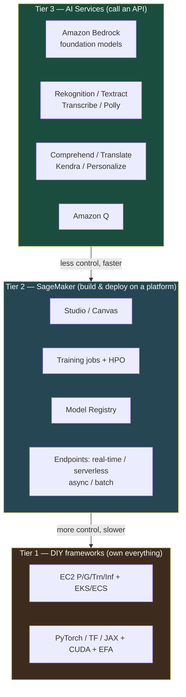

### Worked decision (by hand)

A team needs sentiment classification on customer reviews, English only, 10k requests/day, no custom labels.

1. **Custom architecture needed?** No.
2. **Off-the-shelf API exists?** Yes — Comprehend's `DetectSentiment`.
3. **Decision:** Tier 3, Amazon Comprehend. No training, no endpoint, no GPU. Cost ≈ per-unit API pricing; engineering time ≈ a day.

Contrast: the same team needs to predict *equipment failure* from proprietary sensor telemetry with a custom feature set. No API does that → Tier 2 SageMaker (train XGBoost or a custom model, deploy to an endpoint).

> ⚠️ **Common Pitfall:** Reaching for SageMaker (or worse, raw EC2 + PyTorch) when a Tier-3 API already solves the problem. "We'll fine-tune our own model" is often months of work to slightly beat an API you could call today. Start at the top; descend only when forced.

> 🎯 **Key Insight:** The exam (and real architecture reviews) reward choosing the **highest viable tier**. Whenever a question says "minimize operational overhead" or "fastest time to market," the answer almost always lives in Tier 3.

**Why it matters for AI/ML:** Your value as an AI engineer is in *system design and integration*, not in re-deriving a sentiment model. Knowing the stack lets you spend effort where it differentiates the product.

---

## 2. Amazon Bedrock — Foundation Models as a Service

> 💡 **Intuition:** Bedrock is a **single API gateway in front of many foundation models** from multiple vendors (Anthropic, Amazon, Meta, Mistral, AI21, Cohere, Stability). You don't manage GPUs, weights, or scaling — you send text/images and get completions. It is serverless, regional, and fully inside your AWS account boundary (your prompts are not used to train the base models).

### 2.1 What's on Bedrock

| Provider | Model family | Typical use |
|---|---|---|
| **Anthropic** | Claude (Opus / Sonnet / Haiku) | Reasoning, agents, long-context, tool use, coding |
| **Amazon** | Nova (Micro/Lite/Pro/Premier), Titan | Text, multimodal, embeddings, image gen |
| **Meta** | Llama | Open-weight chat / instruct |
| **Mistral** | Mistral / Mixtral | Efficient open-weight chat |
| **Cohere** | Command, Embed | Chat, embeddings, RAG |
| **AI21** | Jamba | Long-context text |
| **Stability AI** | Stable Diffusion / Stable Image | Image generation |

> 📝 **Tip:** On Bedrock, Anthropic model IDs carry an `anthropic.` (or region-inference `us.anthropic.` / `eu.anthropic.`) prefix — e.g. `anthropic.claude-opus-4-8`. This is **different** from the first-party Claude API where the ID is the bare string `claude-opus-4-8`. A first-party ID sent to a Bedrock client returns a `ValidationException`.

### 2.2 The two invocation surfaces

Bedrock Runtime (`bedrock-runtime`, the data plane) exposes two ways to call a model:

| API | Shape | When to use |
|---|---|---|
| **`InvokeModel`** / `InvokeModelWithResponseStream` | **Per-vendor** request/response JSON (you build Anthropic's body, Titan's body, etc.) | When you need a vendor-specific feature not yet in `Converse`, or you already have vendor-shaped payloads |
| **`Converse`** / `ConverseStream` | **Unified, vendor-agnostic** message schema | **Default for new chat/agent code** — same code works across Claude, Nova, Llama, Mistral with no body rewrite |

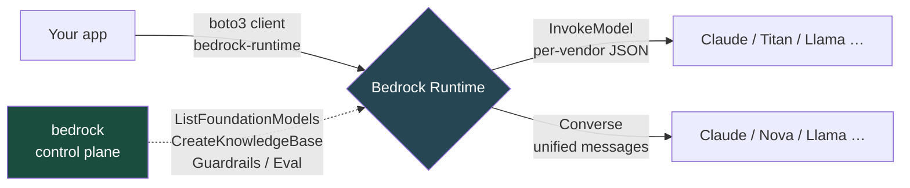

> 🎯 **Key Insight:** There are **two** Bedrock clients in boto3. `bedrock` is the **control plane** (list models, create knowledge bases, guardrails, fine-tuning jobs, provisioned throughput). `bedrock-runtime` is the **data plane** (`InvokeModel`, `Converse`). Mixing them up — calling `invoke_model` on the `bedrock` client — is the single most common boto3 Bedrock error.

### 2.3 `Converse` — the recommended path (worked by hand, then code)

The `Converse` schema is:

```text
messages = [ {role: "user"|"assistant", content: [ {text: "..."} | {image: {...}} ]} , ... ]
system   = [ {text: "..."} ]                      # optional system prompt
inferenceConfig = { maxTokens, temperature, topP, stopSequences }
```

The response carries `output.message.content[0].text`, plus `usage` (`inputTokens`, `outputTokens`, `totalTokens`) and `stopReason`.

```python
# Converse: vendor-agnostic chat with Claude on Bedrock.
# Requires: pip install boto3 ; AWS creds with bedrock:InvokeModel.
import boto3

brt = boto3.client("bedrock-runtime", region_name="us-east-1")

resp = brt.converse(
    modelId="anthropic.claude-opus-4-8",          # NOTE the anthropic. prefix
    messages=[
        {"role": "user", "content": [{"text": "Explain RAG in two sentences."}]}
    ],
    system=[{"text": "You are a concise teaching assistant."}],
    inferenceConfig={"maxTokens": 512, "temperature": 0.2, "topP": 0.9},
)

print(resp["output"]["message"]["content"][0]["text"])
print("tokens:", resp["usage"])  # e.g. {'inputTokens': 23, 'outputTokens': 41, 'totalTokens': 64}
# Expected (illustrative) output:
#   Retrieval-Augmented Generation (RAG) ... pairs a retriever with a generator ...
#   tokens: {'inputTokens': 23, 'outputTokens': 41, 'totalTokens': 64}
```

The exact same code, with `modelId="us.amazon.nova-pro-v1:0"` or `modelId="meta.llama3-70b-instruct-v1:0"`, calls a completely different model — that portability is the whole point of `Converse`.

### 2.4 `InvokeModel` — the per-vendor path

When you need vendor-specific control, you build the vendor's native body. For Anthropic models on Bedrock the body uses the **Anthropic Messages schema** with a required `anthropic_version` field:

```python
# InvokeModel: native Anthropic Messages body on Bedrock.
import boto3, json

brt = boto3.client("bedrock-runtime", region_name="us-east-1")

body = {
    "anthropic_version": "bedrock-2023-05-31",   # REQUIRED on Bedrock InvokeModel
    "max_tokens": 512,
    "system": "You are a concise teaching assistant.",
    "messages": [
        {"role": "user", "content": [{"type": "text", "text": "Explain RAG in two sentences."}]}
    ],
}

resp = brt.invoke_model(
    modelId="anthropic.claude-opus-4-8",
    body=json.dumps(body),
)
payload = json.loads(resp["body"].read())
print(payload["content"][0]["text"])
# payload also includes: stop_reason, usage {input_tokens, output_tokens}
```

> ⚠️ **Common Pitfall:** On Bedrock `InvokeModel` the Anthropic body field is `anthropic_version: "bedrock-2023-05-31"` — this is a **Bedrock-specific date**, not the first-party `anthropic-version: 2023-06-01` HTTP header. Omitting it returns a `ValidationException`. Also note Bedrock `InvokeModel` does **not** accept first-party niceties like `betas` or `output_config` — for those features prefer `Converse` (which exposes `additionalModelRequestFields`) or the first-party API.

> 📝 **Tip — using Claude on Bedrock with the Anthropic SDK instead of boto3:** The Anthropic SDK ships a dedicated Bedrock client (`AnthropicBedrockMantle`, the Messages-API Bedrock endpoint) so you can use the familiar `client.messages.create(...)` surface against Bedrock. Bedrock model IDs still take the `anthropic.` prefix and a region is required. Use boto3 when you want one SDK for all Bedrock vendors; use the Anthropic SDK when your codebase is already Claude-native.

### 2.5 Streaming

For interactive UIs or long outputs, stream tokens as they are generated. `Converse` has `converse_stream`; `InvokeModel` has `invoke_model_with_response_stream`.

```python
# Streaming with ConverseStream — print tokens as they arrive.
import boto3

brt = boto3.client("bedrock-runtime", region_name="us-east-1")

stream = brt.converse_stream(
    modelId="anthropic.claude-opus-4-8",
    messages=[{"role": "user", "content": [{"text": "Write a haiku about latency."}]}],
    inferenceConfig={"maxTokens": 128},
)

for event in stream["stream"]:
    if "contentBlockDelta" in event:
        print(event["contentBlockDelta"]["delta"]["text"], end="", flush=True)
    elif "metadata" in event:
        print("\nusage:", event["metadata"]["usage"])
# Streaming avoids HTTP read timeouts on long generations and improves perceived latency.
```

> 💡 **Intuition:** Streaming doesn't make the model *faster* — total tokens/sec is unchanged — but **time-to-first-token** drops and the user sees progress, which dominates perceived latency. It also sidesteps idle-connection timeouts on multi-minute generations.

### 2.6 Embeddings (Amazon Titan / Cohere)

Embeddings turn text (or images) into fixed-length vectors for semantic search, clustering, and RAG retrieval. Bedrock offers **Amazon Titan Embeddings** and **Cohere Embed**.

Formally, an embedding model is a function $f: \text{text} \to \mathbb{R}^d$ (e.g. $d = 1024$ for Titan Text Embeddings v2). Semantic similarity is the **cosine similarity** between two vectors:

$$
\text{sim}(\mathbf{u}, \mathbf{v}) = \frac{\mathbf{u} \cdot \mathbf{v}}{\lVert \mathbf{u} \rVert \, \lVert \mathbf{v} \rVert}
= \frac{\sum_{i=1}^{d} u_i v_i}{\sqrt{\sum_i u_i^2}\,\sqrt{\sum_i v_i^2}}
$$

where $\mathbf{u}, \mathbf{v} \in \mathbb{R}^d$, $u_i$ is the $i$-th component, and $\text{sim} \in [-1, 1]$ (1 = identical direction).

**Worked example (by hand).** Suppose two tiny 2-D embeddings are $\mathbf{u} = (3, 4)$ and $\mathbf{v} = (4, 3)$.
- Dot product: $3\cdot4 + 4\cdot3 = 12 + 12 = 24$.
- Norms: $\lVert\mathbf{u}\rVert = \sqrt{9+16} = 5$, $\lVert\mathbf{v}\rVert = \sqrt{16+9} = 5$.
- Similarity: $24 / (5 \cdot 5) = 24/25 = 0.96$ → very similar.

```python
# Titan Text Embeddings v2 via InvokeModel (embeddings have no Converse path).
import boto3, json, math

brt = boto3.client("bedrock-runtime", region_name="us-east-1")

def embed(text: str) -> list[float]:
    resp = brt.invoke_model(
        modelId="amazon.titan-embed-text-v2:0",
        body=json.dumps({"inputText": text}),
    )
    return json.loads(resp["body"].read())["embedding"]   # length 1024 by default

def cosine(u, v):
    dot = sum(a * b for a, b in zip(u, v))
    nu = math.sqrt(sum(a * a for a in u))
    nv = math.sqrt(sum(b * b for b in v))
    return dot / (nu * nv)

a = embed("How do I reset my password?")
b = embed("I forgot my login credentials.")
c = embed("What time does the store close?")
print(round(cosine(a, b), 3))   # ~0.7–0.8  (semantically close)
print(round(cosine(a, c), 3))   # ~0.1–0.3  (unrelated)
```

> ⚠️ **Common Pitfall:** Embeddings models are **not** chat models — there is no `Converse` for them; always use `InvokeModel`. And you must use the **same embedding model** for both indexing and querying; mixing Titan-indexed vectors with Cohere-queried vectors yields garbage similarity scores because they live in different vector spaces.

### 2.7 Provisioned Throughput vs. On-Demand

| Mode | Billing | When |
|---|---|---|
| **On-Demand** | Per input/output token | Variable/bursty traffic, dev, most apps |
| **Provisioned Throughput** | Per **model unit** per hour (1- or 6-month commitment) | Steady high-volume production needing guaranteed capacity; **required** for inference on a **custom fine-tuned** model |

> 🎯 **Key Insight:** Two exam triggers. (1) "Guaranteed throughput / no throttling at scale" → **Provisioned Throughput**. (2) "Serve a model we **fine-tuned** on Bedrock" → Provisioned Throughput is **mandatory** (you can't serve a custom model on-demand).

**Why it matters for AI/ML:** Bedrock is the fastest way to put a frontier model into production with zero infra. Understanding `Converse` vs `InvokeModel`, embeddings, streaming, and the throughput model is the core of day-to-day AI engineering on AWS.

---

## 3. Bedrock Higher-Order Features — Knowledge Bases, Agents, Guardrails, Eval

Bedrock isn't just raw model calls — it ships managed building blocks for the patterns AI engineers build over and over.

### 3.1 Knowledge Bases — managed RAG

> 💡 **Intuition:** A **Knowledge Base** is "RAG without the plumbing." You point it at documents in S3; Bedrock chunks them, embeds them with a model you choose, stores the vectors in a vector store, and gives you a single `RetrieveAndGenerate` call that retrieves relevant chunks and feeds them to an LLM with citations. You skip writing chunkers, embedding loops, and vector-DB glue.

**Why RAG at all?** A foundation model only knows what was in its training data. RAG injects *your* private, current documents into the prompt at query time, grounding answers and reducing hallucination — without retraining the model.

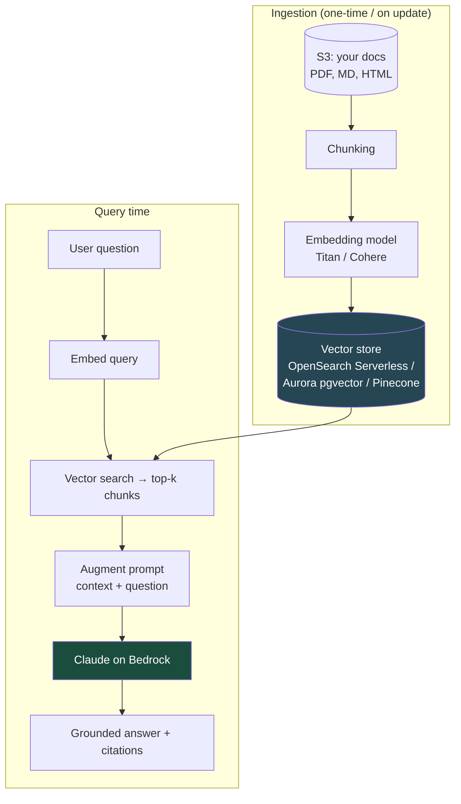

Supported vector stores include **Amazon OpenSearch Serverless** (default), **Aurora PostgreSQL with pgvector**, **Neptune Analytics**, **Pinecone**, **Redis Enterprise Cloud**, and **MongoDB Atlas**.

```python
# RetrieveAndGenerate: one call does retrieval + generation + citations.
import boto3

agent_rt = boto3.client("bedrock-agent-runtime", region_name="us-east-1")

resp = agent_rt.retrieve_and_generate(
    input={"text": "What is our refund window for enterprise plans?"},
    retrieveAndGenerateConfiguration={
        "type": "KNOWLEDGE_BASE",
        "knowledgeBaseConfiguration": {
            "knowledgeBaseId": "KB1234ABCD",
            "modelArn": "arn:aws:bedrock:us-east-1::foundation-model/anthropic.claude-opus-4-8",
        },
    },
)
print(resp["output"]["text"])
for c in resp.get("citations", []):
    for ref in c.get("retrievedReferences", []):
        print("source:", ref["location"])   # which S3 doc grounded the answer
```

> 📝 **Tip:** The control plane client for KB management is `bedrock-agent` (create/sync KBs); the **query** client is `bedrock-agent-runtime` (`retrieve`, `retrieve_and_generate`). The plain `bedrock-runtime` client does **not** have these methods.

### 3.2 Agents — action groups + orchestration

> 💡 **Intuition:** A Bedrock **Agent** lets the model *do things*, not just talk. You define **action groups** — sets of operations described by an OpenAPI schema (or a function schema) — backed by Lambda functions. The model reads the user's goal, decides which actions to call in what order, fills in parameters, invokes your Lambda, and uses the results to continue. An Agent can also be attached to a Knowledge Base for grounded answers.

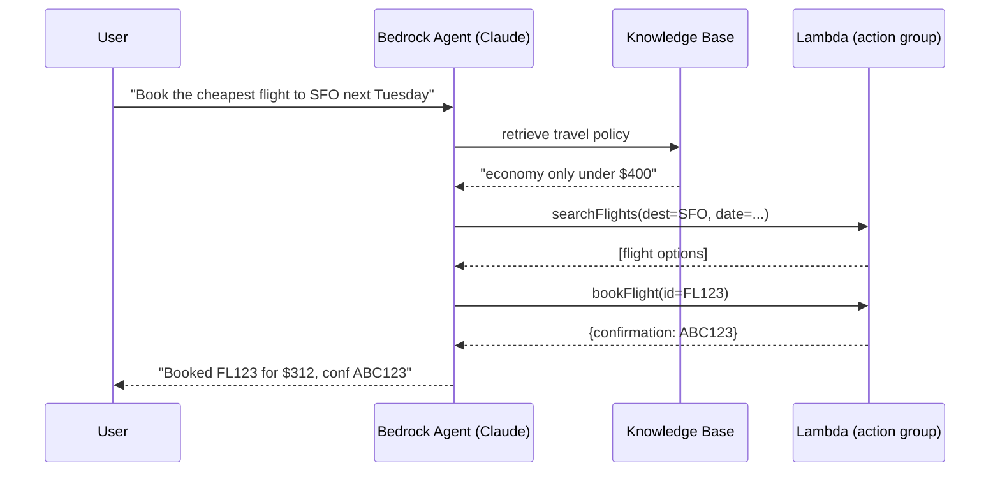

Key pieces: **instruction** (the agent's system prompt), **action groups** (OpenAPI/function schema + Lambda), optional **Knowledge Bases**, and **session memory**. The orchestration loop (decide → call → observe → repeat) is managed by Bedrock — this is the AWS-managed analog of a tool-use agent.

### 3.3 Guardrails

> 💡 **Intuition:** **Guardrails** are a configurable safety/policy layer you attach to model calls (and Agents/KBs). They enforce things the base model won't reliably do on its own.

Guardrail policy types:

| Policy | Blocks / does |
|---|---|
| **Content filters** | Hate, insults, sexual, violence, misconduct, prompt-attack — tunable strength |
| **Denied topics** | Custom topics you forbid (e.g. "investment advice") |
| **Word filters** | Profanity + custom blocklists |
| **Sensitive information (PII)** | Detect & **redact or block** PII (SSNs, emails, etc.) |
| **Contextual grounding** | Score answer **grounding** against source + **relevance** to the query; block ungrounded/hallucinated output |

Guardrails apply to **both** the input (user prompt) and the output (model response), and can be referenced by ID in a `Converse`/`InvokeModel` call or wired into an Agent.

> 🎯 **Key Insight:** Exam trigger — "block PII," "prevent the model from discussing forbidden topics," or "reduce hallucination by checking answers against the source" → **Bedrock Guardrails** (contextual grounding for the hallucination case).

### 3.4 Model evaluation

Bedrock **model evaluation** lets you compare models on your task:
- **Automatic** evaluation — built-in metrics (accuracy, robustness, toxicity) or LLM-as-a-judge over your dataset.
- **Human** evaluation — route outputs to your own team or an AWS-managed workforce for subjective scoring.

Use it to choose between, say, Claude Haiku and Nova Lite for a summarization task on *your* data rather than on generic benchmarks.

### 3.5 Customization — fine-tuning, continued pre-training, distillation

| Technique | What it does | Data needed |
|---|---|---|
| **Fine-tuning** | Adapt a model to your task/style from **labeled** prompt→completion pairs | Labeled examples |
| **Continued pre-training** | Further pre-train on **unlabeled** domain text to absorb domain knowledge | Large unlabeled corpus |
| **Model distillation** | Transfer a large "teacher" model's behavior into a smaller, cheaper "student" | Prompts (teacher generates labels) |

> ⚠️ **Common Pitfall:** A **custom (fine-tuned or distilled) model on Bedrock can only be served via Provisioned Throughput** — there is no on-demand serving for custom models. Budget for the model-unit-hour commitment before you fine-tune.

> 🎯 **Key Insight:** When the question is "the model gives wrong/ungrounded answers about our private data," the *first* answer is usually **RAG (Knowledge Bases)**, not fine-tuning. Fine-tune for *style/format/task behavior*; use RAG for *knowledge/freshness*. Continued pre-training for deep domain *vocabulary*.

**Why it matters for AI/ML:** These four features (KB, Agents, Guardrails, Eval) are the difference between a toy `InvokeModel` demo and a production system that's grounded, safe, capable of taking actions, and chosen on evidence.

---

## 4. Amazon SageMaker — The ML Platform

> 💡 **Intuition:** If Bedrock is "use someone's model," **SageMaker** is "build, train, and run *your* model — but let AWS handle the undifferentiated heavy lifting" (provisioning training clusters, hosting endpoints, tracking experiments, monitoring drift). It's a sprawling product; the trick is to map each capability to a stage of the ML lifecycle.

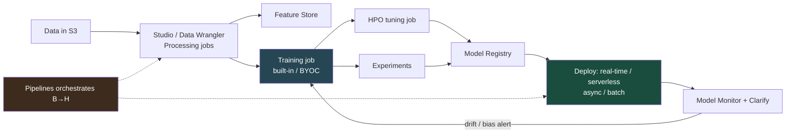

### 4.1 SageMaker Studio — the IDE

**SageMaker Studio** is the web IDE that ties everything together: notebooks, the visual pipeline editor, experiment tracking, the model registry UI, and JumpStart. **SageMaker Canvas** is the *no-code* sibling — a point-and-click UI for analysts to build models (and now to chat with foundation models / build no-code RAG) without writing Python.

### 4.2 Data prep

| Tool | What it is |
|---|---|
| **Data Wrangler** | Visual data prep: import from S3/Athena/Redshift, 300+ built-in transforms, export a repeatable flow |
| **Processing jobs** | Run arbitrary preprocessing/postprocessing/evaluation containers on managed compute (e.g. a `sklearn` or `spark` Processing job) |
| **Feature Store** | Central repository of curated **features** with **online** (low-latency lookup for inference) and **offline** (S3, for training) stores — solves train/serve skew |

> 💡 **Intuition (Feature Store):** The bug it kills is *training/serving skew* — when the feature you computed during training differs subtly from the one computed at inference. Feature Store computes a feature once and serves the identical value to both, with point-in-time correctness for backfills.

### 4.3 Training

**Three ways to train:**

1. **Built-in algorithms** — AWS-optimized implementations (XGBoost, Linear Learner, DeepAR for forecasting, Image Classification, BlazingText, Object2Vec, k-NN, Random Cut Forest for anomaly detection, Semantic Segmentation, etc.). You bring data, AWS brings the algorithm container.
2. **Script mode / framework containers** — your own training script in a managed PyTorch/TensorFlow/HuggingFace/scikit-learn container.
3. **Bring Your Own Container (BYOC)** — a fully custom Docker image when you need an exotic framework or system dependency.

A **training job** provisions ephemeral instances, pulls data from S3, runs your container, writes the model artifact (`model.tar.gz`) back to S3, and tears the cluster down — you pay only for the seconds it ran.

```python
# Minimal SageMaker training job (script mode, PyTorch) — Python SDK.
import sagemaker
from sagemaker.pytorch import PyTorch

role = sagemaker.get_execution_role()  # IAM role with S3 + SageMaker perms

estimator = PyTorch(
    entry_point="train.py",
    role=role,
    framework_version="2.3",
    py_version="py311",
    instance_type="ml.g5.xlarge",   # 1x A10G GPU
    instance_count=1,
    hyperparameters={"epochs": 10, "lr": 1e-3},
    use_spot_instances=True,        # up to ~90% cheaper for training
    max_run=3600, max_wait=7200,    # max_wait must be >= max_run when using Spot
)
estimator.fit({"train": "s3://my-bucket/train/", "val": "s3://my-bucket/val/"})
# Model artifact lands at estimator.model_data (an s3:// path).
```

**Distributed training.** For models/datasets that don't fit on one device, SageMaker provides:
- **Data parallel** (SMDDP) — replicate the model across GPUs, split the *data*; gradients are all-reduced each step. Use when the model fits on one GPU but training is slow.
- **Model parallel** (SMP) — split the *model* across GPUs (tensor/pipeline parallelism). Use when the model is too big for one GPU.

> 💡 **Intuition:** Data parallel = many cooks each make the *whole dish* from a slice of the ingredients, then average notes. Model parallel = the dish is too big for one kitchen, so each kitchen makes *part* of every dish and they're assembled. Big LLM pre-training uses both at once (hybrid).

### 4.4 Hyperparameter tuning (HPO / AMT)

**Automatic Model Tuning** runs many training jobs over a search space to optimize a metric.

Strategies:
- **Grid / Random** — exhaustive or random sampling.
- **Bayesian** — model the metric as a function of hyperparameters and pick the next trial where expected improvement is highest (sample-efficient; the usual default).
- **Hyperband** — early-stop unpromising trials to reallocate budget (great for deep nets).

Formally, HPO solves
$$
\boldsymbol{\theta}^* = \arg\max_{\boldsymbol{\theta} \in \Theta} \; \mathcal{M}\big(\boldsymbol{\theta}\big)
$$
where $\boldsymbol{\theta}$ is a hyperparameter vector (e.g. learning rate, depth), $\Theta$ the search space, and $\mathcal{M}$ the validation metric (e.g. AUC). Bayesian search builds a cheap surrogate $\hat{\mathcal{M}}$ to decide where to evaluate next.

### 4.5 Experiments & Model Registry

- **Experiments** — automatically track runs, parameters, metrics, and artifacts so you can compare and reproduce.
- **Model Registry** — version models into **model groups**, attach approval status (`PendingManualApproval` → `Approved`), and gate deployment on approval — the handoff point between training and CI/CD.

### 4.6 JumpStart

**SageMaker JumpStart** is a hub of pre-trained, deployable models (open LLMs, vision, tabular) and solution templates — one-click deploy to an endpoint or fine-tune on your data. Think "model zoo + recipes," the SageMaker counterpart to Bedrock's hosted foundation models (but *you* host the endpoint).

> 🎯 **Key Insight:** Bedrock = AWS hosts the foundation model, you call an API, you never see a GPU. JumpStart = AWS gives you the weights + a deploy recipe, but **you** run (and pay for) the SageMaker endpoint. Choose Bedrock for zero-ops serverless FM access; choose JumpStart when you need the model inside your VPC on your own instance with full control.

**Why it matters for AI/ML:** SageMaker is where you go the moment a managed API can't express your problem. Knowing which sub-service maps to which lifecycle stage lets you assemble a full pipeline instead of hand-rolling infra.

---

## 5. SageMaker Inference — The Four Endpoint Types

> 🎯 **Key Insight:** This is the single most exam-tested SageMaker topic. Memorize the decision: **payload size, latency need, and traffic pattern** pick the endpoint type.

| Type | Latency | Traffic pattern | Pays when idle? | Best for |
|---|---|---|---|---|
| **Real-time** | Low, sustained (ms) | Steady, always-on | **Yes** (instance always running) | Live predictions behind an API |
| **Serverless** | Low, with cold starts | **Spiky / intermittent**, can go to zero | **No** (scales to zero) | Unpredictable or low-volume traffic |
| **Asynchronous** | Near-real-time, queued | Large payloads / long processing | Scales to zero when queue empty | Big inputs (up to 1 GB), long inference (up to ~1 hr), can tolerate seconds–minutes |
| **Batch Transform** | Offline, not an endpoint | Whole dataset at once, scheduled | No (job runs then stops) | Score a large dataset on a schedule; no live endpoint needed |

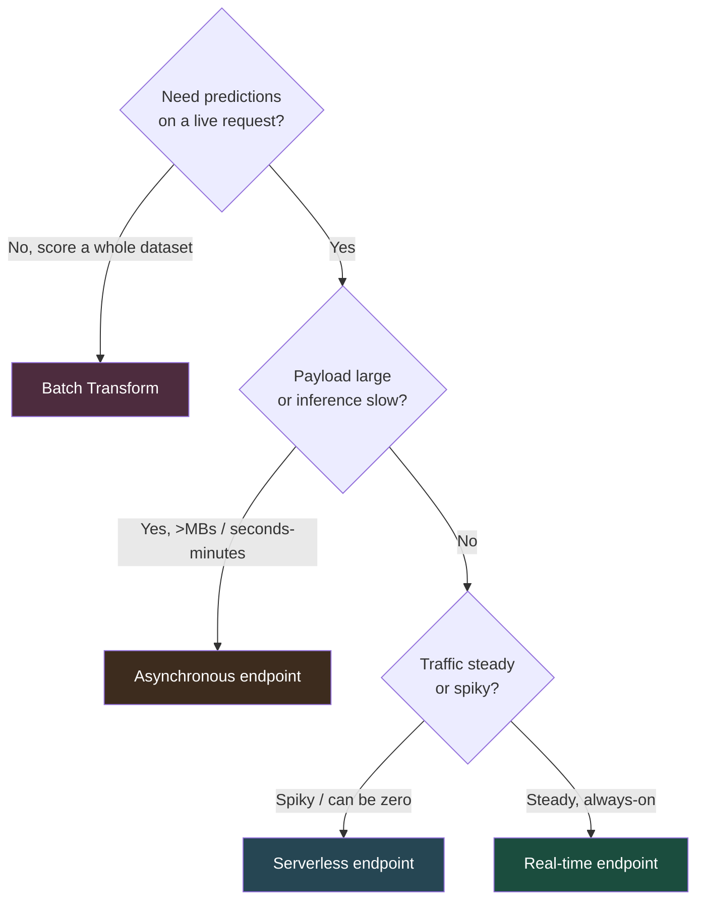

### 5.1 Multi-model & multi-variant (real-time)

- **Multi-Model Endpoints (MME)** — host **many models** behind **one** endpoint, loaded into memory on demand. Slashes cost when you have hundreds of similar small models (e.g. one model per customer) that aren't all hot at once.
- **Multi-variant endpoints** — host **multiple versions** of a model behind one endpoint and split traffic by weight → **A/B testing** and canary rollouts.

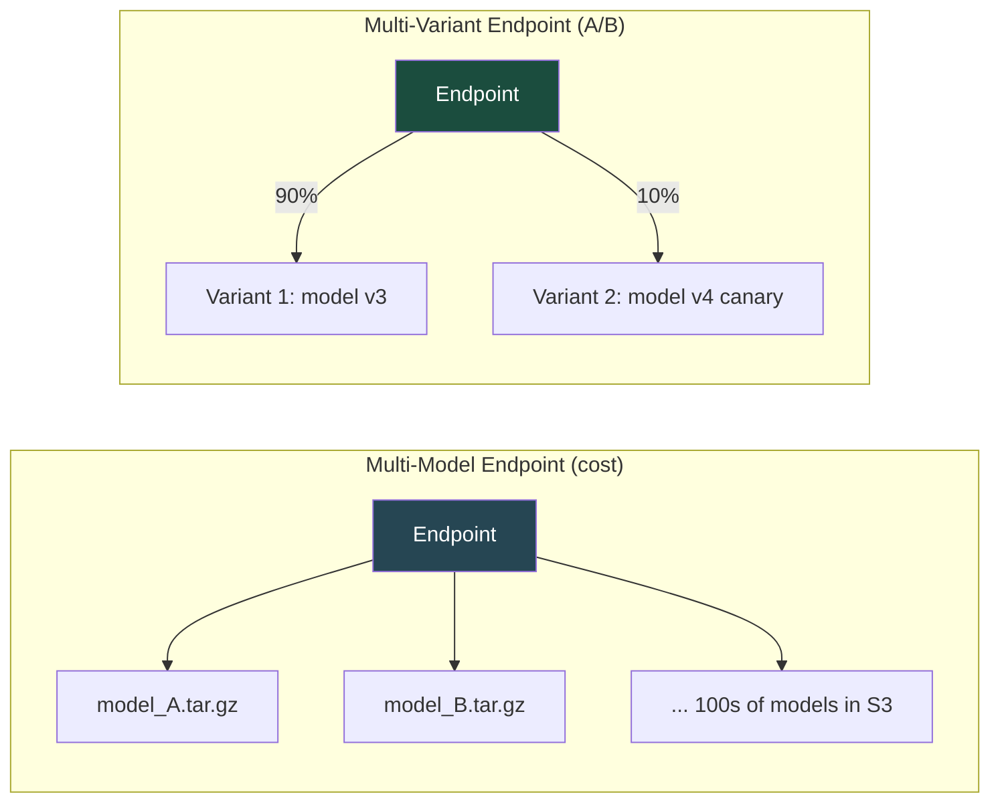

> 💡 **Intuition:** Multi-**model** = many *different* models, one endpoint, to save money. Multi-**variant** = many *versions of the same* model, one endpoint, to compare them safely (shift 10% of traffic to v4, watch metrics, then ramp). Don't conflate them — the exam tests this distinction directly.

> ⚠️ **Common Pitfall:** Choosing a real-time endpoint for a workload that's idle 23 hours a day — you pay for the running instance the whole time. If traffic is spiky or low, **Serverless** is cheaper. And for 500 MB inputs or a model that takes 4 minutes, a real-time endpoint will time out — that's **Asynchronous**.

**Why it matters for AI/ML:** Picking the wrong endpoint type is the most common (and most expensive) production mistake. The four types are a clean decision tree on latency × payload × traffic — internalize it.

---

## 6. SageMaker MLOps — Pipelines, Registry, Monitor, Clarify

> 💡 **Intuition:** MLOps is CI/CD for models. Training a model once is easy; **retraining, validating, deploying, monitoring, and rolling back automatically** is the hard part. SageMaker Pipelines + Model Registry + Model Monitor + Clarify form the loop.

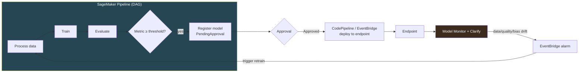

### 6.1 SageMaker Pipelines

A **Pipeline** is a directed acyclic graph (DAG) of steps — `ProcessingStep`, `TrainingStep`, `TuningStep`, `ConditionStep`, `RegisterModel`, `CreateModel`, `TransformStep`. It's purpose-built ML orchestration with lineage tracking, parameterization, and a Studio visual editor. For broader CI/CD around it (build/test/promote across accounts), wrap it with **CodePipeline** + **EventBridge**; **SageMaker Projects** scaffolds the whole MLOps template for you.

### 6.2 Model Monitor

**Model Monitor** runs scheduled jobs that compare live endpoint traffic against a **baseline** captured from training data. Four monitor types:

| Monitor | Detects |
|---|---|
| **Data quality** | Schema/statistics drift in inputs (missing values, range shifts) |
| **Model quality** | Prediction accuracy decay (needs ground-truth labels) |
| **Bias drift** | Fairness metrics shifting over time (uses Clarify) |
| **Feature attribution drift** | The *importance* of features changing (uses Clarify/SHAP) |

> 💡 **Intuition (drift):** A model is a snapshot of the world at training time. The world moves — customer behavior, prices, fraud patterns. **Data drift** is the *inputs* changing distribution; **concept drift** is the *input→output relationship* changing. Both silently rot accuracy. Model Monitor is the smoke detector.

### 6.3 Clarify — bias & explainability

**SageMaker Clarify** addresses two responsible-AI needs:
- **Bias detection** — pre-training (is the *dataset* skewed?) and post-training (are *predictions* skewed across groups?), using metrics like Class Imbalance, DPL (Difference in Positive Proportions in Labels), and DPPL.
- **Explainability** — **SHAP** values attributing each prediction to its input features (global and per-prediction), plus partial dependence.

> 💡 **Intuition (SHAP):** SHAP borrows from cooperative game theory — it asks, "how much did each feature *contribute* to pushing this prediction away from the average?" by averaging over all orderings in which features could be added. The contributions sum exactly to the gap between this prediction and the baseline, which is why it's the go-to for "why did the model decide this?"

> 🎯 **Key Insight:** Exam triggers — "explain individual predictions / feature importance" → **Clarify (SHAP)**. "Detect dataset or prediction bias across demographic groups" → **Clarify (bias)**. "Detect input drift on a live endpoint" → **Model Monitor (data quality)**.

**Why it matters for AI/ML:** A model that isn't monitored is a liability waiting to happen. MLOps turns a one-off model into a maintained, auditable, self-healing production asset — and bias/explainability are increasingly compliance requirements, not nice-to-haves.

---

## 7. Managed AI Services

> 💡 **Intuition:** These are Tier-3 "perception and language as an API" — pre-trained models for specific modalities. Learn them as a **lookup table by task**; the exam loves "which service for X."

| Service | Modality | Core capability | Mnemonic |
|---|---|---|---|
| **Comprehend** | Text → insight | Sentiment, entities, key phrases, language, PII, topic modeling; **Comprehend Medical** for clinical text | "Comprehends meaning" |
| **Rekognition** | Image/video → labels | Object/scene/face detection, face comparison, moderation, text-in-image, celebrity | "Recognizes pictures" |
| **Textract** | Document image → structured | OCR + **forms (key-value)** + **tables**, beyond plain OCR | "Extracts text from docs" |
| **Transcribe** | Speech → text | ASR, speaker diarization, custom vocab; **Transcribe Medical** | "Transcribes audio" |
| **Polly** | Text → speech | Neural TTS, many voices/languages, SSML | "Polly talks" (parrot) |
| **Translate** | Text → text | Neural machine translation, 75+ languages | "Translates languages" |
| **Kendra** | Docs → answers | Intelligent **enterprise search** with natural-language queries over your content | "Kendra knows-where" |
| **Personalize** | User events → recs | Real-time recommendations (the tech behind Amazon.com) | "Personalizes recs" |
| **Forecast** | Time series → future | Managed time-series forecasting (demand, capacity) | "Forecasts the future" |
| **Amazon Q** | NL → answers/actions | GenAI assistant — **Q Business** (your data/apps) and **Q Developer** (coding, AWS console) | "Q answers questions" |

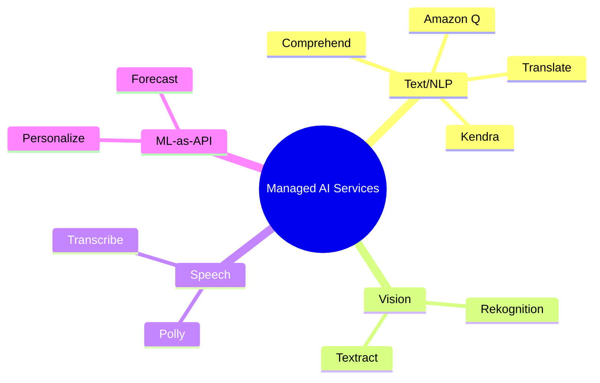

### Worked routing examples (by hand)

- *"Pull the line items and totals off scanned invoices."* → **Textract** (forms + tables), not Rekognition (which finds objects, not document structure).
- *"Redact patient names from doctors' notes."* → **Comprehend (Medical) PII detection**.
- *"Search across 100k internal PDFs and get a direct answer."* → **Kendra** (or a Bedrock Knowledge Base if you want generative answers with your chosen LLM).
- *"Recommend products in real time on our storefront."* → **Personalize**.
- *"Generate a voiceover from a script."* → **Polly**.
- *"Build a chatbot over our Confluence + Jira for employees."* → **Amazon Q Business**.

> ⚠️ **Common Pitfall:** Confusing **Rekognition** (finds objects/faces/scenes in images) with **Textract** (reads structured text/forms/tables from documents). "Read the receipt" = Textract; "is there a cat in this photo" = Rekognition. Also: **Kendra** is *retrieval/search* — when the requirement adds "generate a natural-language answer grounded in our docs with a model we choose," that's a **Bedrock Knowledge Base**.

> 📝 **Tip:** Several services have a **Custom** tier — **Rekognition Custom Labels**, **Comprehend Custom Classification/Entities** — where you bring a small labeled dataset and AWS fine-tunes the managed model. That's the bridge between pure Tier-3 and Tier-2.

**Why it matters for AI/ML:** Half of "AI" feature requests (OCR, sentiment, captions, search, recs) are solved by one API call. Knowing the menu stops you from building a model that already exists as a service.

---

## 8. ML Infrastructure — Compute, Accelerators, Data Plumbing

When you *do* descend to Tier 2/1, you choose the silicon and wire up the data.

### 8.1 GPU & accelerator families

| Family | Silicon | Use |
|---|---|---|
| **P5 / P4d / P3** | NVIDIA H100 / A100 / V100 | Heavy **training** (large models), high-end inference |
| **G6 / G5 / G4dn** | NVIDIA L4 / A10G / T4 | Cost-effective **inference**, graphics, smaller training |
| **Trn1 / Trn2** | AWS **Trainium** | Purpose-built, cost-optimized **training** of large models |
| **Inf2 / Inf1** | AWS **Inferentia** | Purpose-built, cost-optimized, high-throughput **inference** |

> 🎯 **Key Insight:** Easy mnemonic — **P** = "Powerhouse" training, **G** = "Graphics/general" inference, **Tr**ainium = train cheap, **Inf**erentia = infer cheap. Exam trigger: "lowest-cost inference at scale for a deployed model" → **Inferentia (Inf2)**. "Lowest-cost large-model training" → **Trainium (Trn)**.

### 8.2 EFA — the interconnect for distributed training

**Elastic Fabric Adapter (EFA)** is a network interface that gives HPC/ML clusters OS-bypass, low-latency, high-bandwidth node-to-node communication (via the libfabric/NCCL path). For multi-node distributed training, EFA is what keeps the gradient all-reduce from becoming the bottleneck.

> 💡 **Intuition:** In data-parallel training, every step ends with all nodes exchanging gradients. Without a fast interconnect, that synchronization stalls the GPUs (they idle waiting for the network). EFA is the express lane that keeps expensive GPUs busy. SageMaker enables it automatically on supported multi-node instances.

### 8.3 Data plumbing for ML

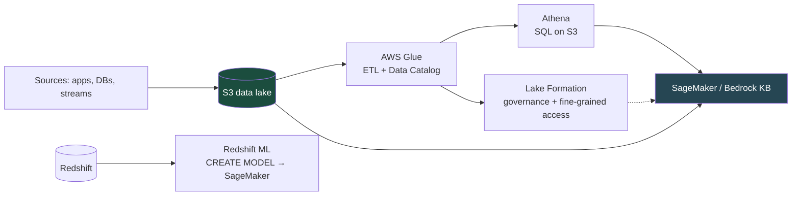

| Service | Role in ML |
|---|---|
| **S3** | The data lake — training data in, model artifacts out; the universal staging ground |
| **Glue** | Serverless ETL + the **Data Catalog** (schema metadata Athena/Redshift read) |
| **Athena** | Serverless SQL over S3 — ad-hoc feature exploration, dataset creation |
| **Lake Formation** | Centralized governance + fine-grained (row/column) access control over the lake |
| **Redshift ML** | `CREATE MODEL` in SQL → trains via SageMaker behind the scenes, predict with SQL functions |

> 📝 **Tip:** **Redshift ML** lets a data analyst train and invoke a SageMaker model entirely from SQL (`CREATE MODEL ... ; SELECT predict_churn(...)`) — a Tier-2 capability dressed up for the SQL crowd. Exam trigger: "let SQL users build ML models on warehouse data" → Redshift ML.

**Why it matters for AI/ML:** Models are only as good as the data pipeline feeding them. The S3→Glue→Athena→(Lake Formation) backbone — plus the right accelerator — is the foundation every training job and RAG ingestion stands on.

---

## 9. Cost & Security for ML

ML workloads are uniquely expensive (GPUs) and uniquely sensitive (your data + your model). Treat both as first-class design concerns.

### 9.1 Cost levers

| Lever | Saves | Where |
|---|---|---|
| **Spot Instances for training** | Up to ~90% | `use_spot_instances=True` on training/tuning jobs — they checkpoint & resume on interruption; training is interruptible, so it's ideal |
| **Inferentia/Trainium** | 30–50%+ vs. equivalent NVIDIA | Inf2 for inference, Trn for training |
| **Serverless / Async endpoints** | Pay-per-use, scale to zero | Spiky or low-volume inference instead of always-on real-time |
| **Multi-Model Endpoints** | One instance for many models | Many small models that aren't all hot |
| **Bedrock On-Demand vs Provisioned** | Match billing to traffic shape | On-demand for variable; provisioned only for steady high-volume |
| **Savings Plans (SageMaker)** | Up to ~64% | Commit to compute usage for steady endpoints |
| **Right-size + auto-scaling** | Avoid over-provisioning | Endpoint auto-scaling on invocations/latency |

> ⚠️ **Common Pitfall:** Using **Spot for a production real-time endpoint** — Spot is for *interruptible* work (training, batch). A user-facing endpoint must not vanish mid-request. Spot ✓ training/batch; Spot ✗ live inference.

### 9.2 Security controls

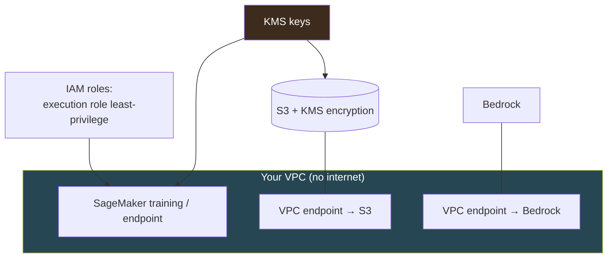

| Concern | Control |
|---|---|
| **Network isolation** | Run training/endpoints in a **VPC**; reach S3/Bedrock via **VPC (PrivateLink) endpoints** so traffic never hits the public internet |
| **Encryption at rest** | **KMS** on S3 buckets, EBS volumes, model artifacts, Feature Store; choose customer-managed keys (CMKs) for control/audit |
| **Encryption in transit** | TLS everywhere (default); inter-node training traffic encryption option |
| **Access control** | **IAM execution roles** scoped to least privilege; the SageMaker/Bedrock principal gets only the buckets/models it needs |
| **Data governance** | **Lake Formation** for fine-grained lake access; Bedrock **Guardrails** for PII redaction at inference |
| **Auditing** | **CloudTrail** logs every Bedrock/SageMaker API call; CloudWatch for metrics/logs |
| **Data privacy (Bedrock)** | Your prompts/completions are **not** used to train base models and stay in your account/Region |

> 🎯 **Key Insight:** The recurring exam pattern: "process sensitive data without exposing it to the internet" → **VPC + VPC endpoints (PrivateLink) + KMS**. "Restrict what the training job can touch" → a **least-privilege IAM execution role**. "Encrypt model artifacts and data with keys we control" → **KMS CMK**.

**Why it matters for AI/ML:** Cost overruns and data leaks are the two ways ML projects die in production. A blueprint that's correct but uneconomical or insecure won't ship — design the bill and the boundary in from day one.

---

## 🧮 From-Scratch: A Minimal Bedrock Client

To cement how the pieces fit, here's a dependency-light (boto3 + stdlib only) wrapper that exposes chat, streaming, embeddings, and a hand-rolled cosine-similarity retriever — i.e., RAG's core without a vector DB. Read it top to bottom; every line is commented and the expected output is shown.

```python
"""
Minimal Bedrock client: chat (Converse), streaming, embeddings, and a tiny
in-memory cosine-similarity retriever. boto3 + stdlib only.

Run with AWS creds that allow bedrock:InvokeModel on the listed models.
"""
import json
import math
import boto3

CHAT_MODEL = "anthropic.claude-opus-4-8"
EMBED_MODEL = "amazon.titan-embed-text-v2:0"

brt = boto3.client("bedrock-runtime", region_name="us-east-1")


def chat(prompt: str, system: str | None = None, max_tokens: int = 512) -> str:
    """One-shot chat via the vendor-agnostic Converse API."""
    kwargs = {
        "modelId": CHAT_MODEL,
        "messages": [{"role": "user", "content": [{"text": prompt}]}],
        "inferenceConfig": {"maxTokens": max_tokens, "temperature": 0.2},
    }
    if system:
        kwargs["system"] = [{"text": system}]
    resp = brt.converse(**kwargs)
    return resp["output"]["message"]["content"][0]["text"]


def stream_chat(prompt: str):
    """Yield text deltas as they arrive (good for UIs / long output)."""
    resp = brt.converse_stream(
        modelId=CHAT_MODEL,
        messages=[{"role": "user", "content": [{"text": prompt}]}],
        inferenceConfig={"maxTokens": 512},
    )
    for event in resp["stream"]:
        if "contentBlockDelta" in event:
            yield event["contentBlockDelta"]["delta"]["text"]


def embed(text: str) -> list[float]:
    """Embed text with Titan (InvokeModel — embeddings have no Converse path)."""
    resp = brt.invoke_model(
        modelId=EMBED_MODEL,
        body=json.dumps({"inputText": text}),
    )
    return json.loads(resp["body"].read())["embedding"]


def cosine(u: list[float], v: list[float]) -> float:
    dot = sum(a * b for a, b in zip(u, v))
    nu = math.sqrt(sum(a * a for a in u))
    nv = math.sqrt(sum(b * b for b in v))
    return dot / (nu * nv) if nu and nv else 0.0


class TinyRetriever:
    """In-memory vector index — the conceptual heart of a Knowledge Base."""
    def __init__(self) -> None:
        self.docs: list[tuple[str, list[float]]] = []

    def add(self, text: str) -> None:
        self.docs.append((text, embed(text)))

    def top_k(self, query: str, k: int = 2) -> list[tuple[float, str]]:
        q = embed(query)
        scored = [(cosine(q, vec), text) for text, vec in self.docs]
        scored.sort(reverse=True)            # highest similarity first
        return scored[:k]


def rag_answer(retriever: TinyRetriever, question: str) -> str:
    """Manual RAG: retrieve → augment → generate (what KBs automate)."""
    hits = retriever.top_k(question, k=2)
    context = "\n".join(f"- {text}" for _, text in hits)
    prompt = (
        f"Answer using ONLY this context:\n{context}\n\nQuestion: {question}"
    )
    return chat(prompt, system="You answer strictly from the provided context.")


if __name__ == "__main__":
    print(chat("Name the four SageMaker endpoint types in one line."))
    # -> Real-time, Serverless, Asynchronous, Batch Transform.

    r = TinyRetriever()
    r.add("Enterprise plans have a 30-day refund window.")
    r.add("Polly converts text to lifelike speech.")
    r.add("Inferentia is AWS's cost-optimized inference chip.")
    print(rag_answer(r, "How long do enterprise customers have to get a refund?"))
    # -> Enterprise customers have 30 days to request a refund.
```

> 🎯 **Key Insight:** `TinyRetriever` + `rag_answer` *is* a Bedrock Knowledge Base in miniature: embed → store vectors → cosine search → stuff context → generate. The managed KB just swaps the Python list for OpenSearch Serverless, handles chunking/sync, and returns citations. Understanding this 60-line core means you understand what every managed RAG product is doing.

---

## 🏋️ Mini-Project Blueprints

### Blueprint 1 — Deploy a custom model to a SageMaker real-time endpoint

**Goal:** Train an XGBoost (or PyTorch) model, register it, and serve low-latency predictions behind an HTTPS endpoint inside your VPC.

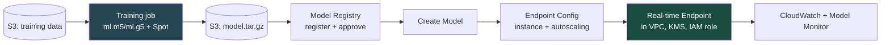

**Steps:**
1. **Prep data** in S3; optionally a SageMaker **Processing job** for feature engineering.
2. **Train** with a built-in algo or script mode; enable `use_spot_instances=True` to cut cost.
3. **Register** the model version in the **Model Registry**; mark `Approved`.
4. **Deploy** to a **real-time endpoint** (instance type sized to latency/throughput; turn on **auto-scaling** on `InvocationsPerInstance`).
5. **Harden:** endpoint in a **VPC** with VPC endpoints, **KMS** on artifacts/volumes, a **least-privilege execution role**.
6. **Observe:** capture data with **Model Monitor** (data-quality baseline) and alarm on drift via CloudWatch/EventBridge.

```python
# Deploy step (Python SDK), assuming `estimator` from §4.3 has trained.
predictor = estimator.deploy(
    initial_instance_count=1,
    instance_type="ml.g5.xlarge",
    endpoint_name="churn-rt",
    # data_capture_config=...  # enable for Model Monitor
)
result = predictor.predict({"features": [0.3, 1.0, 7, 0]})
print(result)
predictor.delete_endpoint()  # ALWAYS tear down to stop the meter
```

> ⚠️ **Common Pitfall:** Forgetting `delete_endpoint()` — a real-time endpoint bills 24/7. Leaving a `ml.g5.xlarge` running for a forgotten demo is a classic surprise invoice. For spiky traffic, use **Serverless** instead so it scales to zero.

**Acceptance criteria:** p99 latency under your SLO; endpoint reachable only inside the VPC; drift alarm fires on a shifted test batch.

---

### Blueprint 2 — RAG app on Bedrock Knowledge Bases + Claude

**Goal:** Grounded Q&A over your private documents with citations, minimal infra.

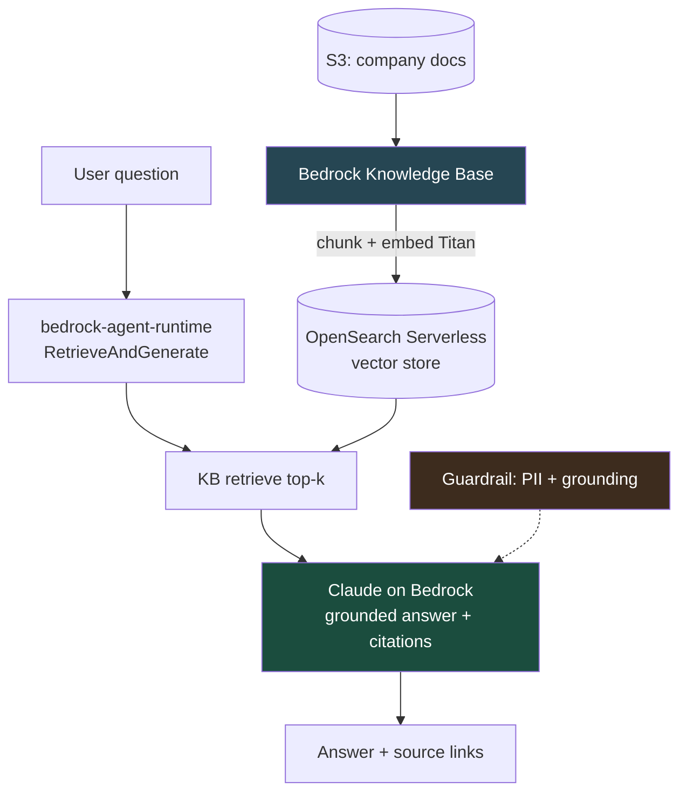

**Steps:**
1. **Stage docs** in S3 (PDF/MD/HTML/DOCX).
2. **Create a Knowledge Base** (console or `bedrock-agent`): pick the **embedding model** (Titan Text Embeddings v2) and **vector store** (OpenSearch Serverless default). Run an **ingestion/sync** job.
3. **Query** with `bedrock-agent-runtime.retrieve_and_generate`, choosing Claude as the generation model (see §3.1 code).
4. **Add a Guardrail** for PII redaction and **contextual grounding** (block answers not supported by retrieved chunks) — reference it in the call.
5. **(Optional) Wrap in an Agent** with an action group if the assistant must *act* (open a ticket, look up an order) in addition to answering.
6. **Evaluate** competing generation models on your eval set via Bedrock **model evaluation**; pick on evidence (e.g. Haiku for cost vs. Opus for hardest queries).

**Acceptance criteria:** every answer carries source citations; questions outside the corpus are declined rather than hallucinated (grounding guardrail); PII is redacted in outputs; re-syncing S3 surfaces new docs.

> 🎯 **Key Insight:** Blueprint 2 has **no servers and no training** — it's pure Tier-3 assembly. That's the modern AI-engineering default: reach for managed RAG first; only build a SageMaker pipeline (Blueprint 1) when the task genuinely needs a custom model.

---

## ❓ Knowledge Check

**1.** You need sentiment analysis on English product reviews with no custom labels and minimal ops. Which service?

<details><summary>Show answer</summary>

**Amazon Comprehend** (`DetectSentiment`). It's a Tier-3 pre-trained API — no training, no endpoint, no GPU. Reaching for SageMaker here would be over-engineering. If you later needed *domain-specific* categories, **Comprehend Custom Classification** is the next step (bring a small labeled set), still without managing infra.
</details>

**2.** What is the difference between the `bedrock` and `bedrock-runtime` boto3 clients?

<details><summary>Show answer</summary>

`bedrock` is the **control plane** — list/describe foundation models, create Knowledge Bases (`bedrock-agent`), Guardrails, fine-tuning jobs, provisioned throughput. `bedrock-runtime` is the **data plane** — `InvokeModel`, `Converse`, and their streaming variants. Knowledge Base *queries* use a third client, `bedrock-agent-runtime` (`retrieve_and_generate`). Calling `invoke_model` on the `bedrock` client fails — a very common mistake.
</details>

**3.** When must you use Bedrock **Provisioned Throughput**?

<details><summary>Show answer</summary>

Two cases: (1) steady high-volume production needing **guaranteed capacity / no throttling**, and (2) **mandatorily** to serve any **custom (fine-tuned or distilled) model** — custom models cannot be served on-demand. It bills per model-unit-hour on a 1- or 6-month commitment.
</details>

**4.** A model serves 500 MB inputs and takes ~3 minutes per inference. Which SageMaker endpoint type?

<details><summary>Show answer</summary>

**Asynchronous endpoint.** It handles large payloads (up to 1 GB) and long processing (up to ~1 hour) via an internal queue, and scales to zero when idle. A real-time endpoint would time out and can't accept payloads that large; Batch Transform is for whole-dataset offline scoring, not per-request near-real-time.
</details>

**5.** Distinguish Multi-Model Endpoints from Multi-Variant Endpoints.

<details><summary>Show answer</summary>

**Multi-Model Endpoint (MME):** many *different* models behind one endpoint, loaded on demand — a **cost** optimization for hundreds of models that aren't all hot. **Multi-Variant Endpoint:** multiple *versions of the same* model behind one endpoint with weighted traffic splitting — for **A/B testing / canary** rollouts. Different problems: MME = save money on many models; variants = safely compare model versions.
</details>

**6.** Which Bedrock feature reduces hallucination by checking answers against source documents?

<details><summary>Show answer</summary>

**Guardrails — contextual grounding** (it scores grounding against the source and relevance to the query, and can block ungrounded output). For the broader "answers about our private data are wrong" problem, **Knowledge Bases (RAG)** is the primary fix — RAG supplies the grounding documents; the grounding guardrail enforces that the answer stays faithful to them.
</details>

**7.** You want SHAP-based explanations for individual predictions and dataset bias checks. Which SageMaker tool?

<details><summary>Show answer</summary>

**SageMaker Clarify.** It provides **SHAP** feature attributions (global and per-prediction explainability) and **bias detection** both pre-training (dataset skew via Class Imbalance, DPL) and post-training (prediction skew, DPPL). Model Monitor *uses* Clarify under the hood for bias-drift and feature-attribution-drift monitors.
</details>

**8.** What's the difference between data drift and concept drift, and which SageMaker feature detects them?

<details><summary>Show answer</summary>

**Data drift** = the input *distribution* changes (e.g., a feature's range shifts). **Concept drift** = the *input→output relationship* changes (the same inputs now map to different correct outputs). **Model Monitor** detects both: the **data-quality** monitor catches input drift against a training baseline; the **model-quality** monitor catches accuracy decay (needs ground-truth labels), which surfaces concept drift.
</details>

**9.** Cheapest way to run **large-model training** vs. **high-throughput inference** on AWS silicon?

<details><summary>Show answer</summary>

Training → **AWS Trainium (Trn1/Trn2)**; inference → **AWS Inferentia (Inf2/Inf1)**. Both are purpose-built AWS chips that undercut equivalent NVIDIA instances (often 30–50%+). For training you can stack **Spot Instances** on top for up to ~90% off, since training is interruptible.
</details>

**10.** Embeddings: why must you use the same model for indexing and querying, and what metric compares them?

<details><summary>Show answer</summary>

Each embedding model maps text into its *own* vector space; vectors from Titan and Cohere aren't comparable. Indexing with one and querying with another produces meaningless distances. Similarity is **cosine similarity**, $\text{sim}(\mathbf{u},\mathbf{v}) = \frac{\mathbf{u}\cdot\mathbf{v}}{\lVert\mathbf{u}\rVert\lVert\mathbf{v}\rVert}$, ranging $[-1, 1]$.
</details>

**11.** You need OCR that also extracts key-value pairs and tables from scanned forms. Service?

<details><summary>Show answer</summary>

**Amazon Textract.** Plain OCR returns raw text; Textract additionally returns **forms (key-value)** and **tables** as structured data. Rekognition can detect text *in images* but isn't built for document structure.
</details>

**12.** When would you choose JumpStart over Bedrock for a foundation model?

<details><summary>Show answer</summary>

When you need the model **inside your own VPC on an instance you control** — full network isolation, custom inference code, or a model not offered on Bedrock. JumpStart gives you weights + a deploy recipe but **you** run (and pay for) the SageMaker endpoint. Bedrock is the choice for zero-ops, serverless, pay-per-token FM access.
</details>

**13.** A team wants SQL analysts to build and call ML models on warehouse data without Python. Service?

<details><summary>Show answer</summary>

**Redshift ML** — `CREATE MODEL ...` trains via SageMaker behind the scenes, and predictions are exposed as SQL functions (`SELECT predict_x(...)`). It lets non-Python users do ML directly in the warehouse.
</details>

**14.** What does EFA do and when do you need it?

<details><summary>Show answer</summary>

**Elastic Fabric Adapter** provides OS-bypass, low-latency, high-bandwidth node-to-node networking for HPC/ML. You need it for **multi-node distributed training**, where every step's gradient all-reduce would otherwise bottleneck on the network and idle the GPUs. SageMaker enables it on supported multi-node instances.
</details>

**15.** Which Bedrock construct lets the model *take actions* (call your APIs) rather than just generate text?

<details><summary>Show answer</summary>

**Bedrock Agents** with **action groups** — operations described by an OpenAPI/function schema and backed by **Lambda**. The agent decides which actions to invoke, fills parameters, calls your Lambda, and uses the results to continue. It can also attach Knowledge Bases for grounded reasoning.
</details>

**16.** How do you let a SageMaker endpoint reach S3 and Bedrock without any internet exposure?

<details><summary>Show answer</summary>

Run the endpoint in a **VPC** and create **VPC endpoints (PrivateLink)** to S3 and Bedrock so traffic stays on the AWS network. Pair with **KMS** encryption on artifacts/volumes and a **least-privilege IAM execution role**. This is the standard "process sensitive data without internet exposure" pattern.
</details>

**17.** Difference between data-parallel and model-parallel distributed training?

<details><summary>Show answer</summary>

**Data parallel:** replicate the whole model on each GPU, split the *data*, all-reduce gradients each step — used when the model fits on one GPU but you want speed. **Model parallel:** split the *model itself* across GPUs (tensor/pipeline) — used when the model is too large for one GPU. Large LLM pre-training combines both (hybrid). SageMaker offers SMDDP (data) and SMP (model).
</details>

**18.** For fixing wrong answers about your private knowledge, when do you fine-tune vs. use RAG?

<details><summary>Show answer</summary>

**RAG (Knowledge Bases)** for *knowledge and freshness* — inject current/private documents at query time; no retraining, easy to update. **Fine-tuning** for *style, format, or task behavior* the model should internalize. **Continued pre-training** for deep domain *vocabulary/jargon*. The common mistake is fine-tuning to teach facts — RAG is cheaper, fresher, and citable for that.
</details>

**19.** What's the role of SageMaker Feature Store and what problem does it solve?

<details><summary>Show answer</summary>

A central repository of curated features with an **online** store (low-latency lookup for inference) and an **offline** store (S3, for training). It solves **train/serve skew** — ensuring the exact same feature value computed once is used in both training and serving, with point-in-time correctness for backfills.
</details>

**20.** On Bedrock `InvokeModel`, what required field do Anthropic model bodies need, and how does it differ from the first-party Claude API?

<details><summary>Show answer</summary>

Bedrock requires `anthropic_version: "bedrock-2023-05-31"` in the request **body** (a Bedrock-specific version string). The first-party Claude API instead uses an `anthropic-version: 2023-06-01` HTTP **header**, and its model IDs are bare (`claude-opus-4-8`) whereas Bedrock IDs carry the `anthropic.` prefix (`anthropic.claude-opus-4-8`). For portability and access to newer features, prefer the `Converse` API on Bedrock.
</details>

---

## 🏋️ Exercises

> Increasing difficulty. Each has a complete worked solution.

**Exercise 1 (easy).** Write a function that calls Claude on Bedrock via `Converse` and returns just the answer text plus the total token count.

<details><summary>Show solution</summary>

```python
import boto3

brt = boto3.client("bedrock-runtime", region_name="us-east-1")

def ask(prompt: str) -> tuple[str, int]:
    resp = brt.converse(
        modelId="anthropic.claude-opus-4-8",
        messages=[{"role": "user", "content": [{"text": prompt}]}],
        inferenceConfig={"maxTokens": 512, "temperature": 0.2},
    )
    text = resp["output"]["message"]["content"][0]["text"]
    total = resp["usage"]["totalTokens"]
    return text, total

answer, tokens = ask("What is Amazon Inferentia in one sentence?")
print(answer, "|", tokens, "tokens")
```

Key points: `Converse` is vendor-agnostic; the answer is at `output.message.content[0].text`; usage gives `inputTokens`/`outputTokens`/`totalTokens`. Swapping `modelId` to `meta.llama3-70b-instruct-v1:0` would need **no other change**.
</details>

**Exercise 2 (easy–medium).** Given two short texts, embed them with Titan and print their cosine similarity. Decide a threshold for "duplicate question detection."

<details><summary>Show solution</summary>

```python
import boto3, json, math

brt = boto3.client("bedrock-runtime", region_name="us-east-1")

def embed(t): 
    r = brt.invoke_model(modelId="amazon.titan-embed-text-v2:0",
                         body=json.dumps({"inputText": t}))
    return json.loads(r["body"].read())["embedding"]

def cosine(u, v):
    return sum(a*b for a,b in zip(u,v)) / (
        math.sqrt(sum(a*a for a in u)) * math.sqrt(sum(b*b for b in v)))

s = cosine(embed("How do I reset my password?"),
           embed("I forgot my login and need to reset it"))
print(round(s, 3))                       # ~0.75
print("duplicate" if s > 0.7 else "different")
```

Reasoning: paraphrases land high (~0.7–0.85), unrelated questions low (~0.1–0.3). A threshold around **0.7** is a reasonable starting point for "same intent"; tune on labeled pairs. Embeddings use `InvokeModel` (no `Converse`), and the *same* model must embed both sides.
</details>

**Exercise 3 (medium).** You're given a workload table. For each row, name the correct SageMaker endpoint type and one-line justification.

| Workload | Traffic | Payload | Latency need |
|---|---|---|---|
| A. Fraud check on each transaction | Steady, high | small | <100 ms |
| B. Internal tool used a few times/hour | Bursty, often idle | small | <1 s |
| C. Summarize 300 MB PDFs, ~2 min each | Sporadic | large | seconds–minutes OK |
| D. Nightly score of 50 M rows | Scheduled batch | dataset | offline |

<details><summary>Show solution</summary>

- **A → Real-time endpoint.** Sustained low-latency live predictions; always-on instance justified by steady high traffic.
- **B → Serverless endpoint.** Spiky/idle traffic → scale to zero so you don't pay 24/7; cold starts acceptable for an internal tool.
- **C → Asynchronous endpoint.** Large payload (up to 1 GB) and long inference (up to ~1 hr) via internal queue; real-time would time out.
- **D → Batch Transform.** Offline scoring of a whole dataset on a schedule; no live endpoint needed, job spins up and tears down.

The decision is always **latency need × payload size × traffic pattern** — see the §5 decision tree.
</details>

**Exercise 4 (medium–hard).** Sketch (in code/config terms) a SageMaker Pipeline that retrains on a schedule, gates deployment on an accuracy threshold, and registers the model for approval.

<details><summary>Show solution</summary>

```python
from sagemaker.workflow.pipeline import Pipeline
from sagemaker.workflow.steps import ProcessingStep, TrainingStep
from sagemaker.workflow.condition_step import ConditionStep
from sagemaker.workflow.conditions import ConditionGreaterThanOrEqualTo
from sagemaker.workflow.step_collections import RegisterModel
# (estimator, processor, model_metrics defined elsewhere)

prep   = ProcessingStep(name="Prep", processor=processor, ... )
train  = TrainingStep(name="Train", estimator=estimator, ... )
evalst = ProcessingStep(name="Eval", processor=processor, ... )  # writes accuracy.json

register = RegisterModel(
    name="Register",
    estimator=estimator,
    model_data=train.properties.ModelArtifacts.S3ModelArtifacts,
    content_types=["text/csv"], response_types=["text/csv"],
    inference_instances=["ml.m5.large"],
    approval_status="PendingManualApproval",     # human gate before deploy
    model_metrics=model_metrics,
)

gate = ConditionStep(
    name="AccuracyGate",
    conditions=[ConditionGreaterThanOrEqualTo(
        left=evalst.properties... ,              # accuracy from eval step
        right=0.85)],
    if_steps=[register],                          # only register if good enough
    else_steps=[],
)

pipeline = Pipeline(name="churn-retrain",
                    steps=[prep, train, evalst, gate])
pipeline.upsert(role_arn=role)
# Schedule via EventBridge rule -> pipeline.start(); on Approved, CodePipeline deploys.
```

The shape that matters: **Prep → Train → Eval → Condition(≥ threshold) → RegisterModel(PendingManualApproval)**. EventBridge schedules the run and/or triggers it on drift from Model Monitor; on approval, CodePipeline promotes the registered model to the endpoint. This is the canonical SageMaker MLOps loop.
</details>

**Exercise 5 (hard).** Design the full architecture for a HIPAA-conscious clinical-notes assistant: ingest doctors' notes, answer questions with citations, redact PII, never touch the public internet, and let analysts compare two generation models before launch. List the services and the why.

<details><summary>Show solution</summary>

**Architecture:**
1. **Storage:** notes in **S3** with **KMS (customer-managed key)** encryption; access governed by **Lake Formation** + least-privilege **IAM**.
2. **RAG core:** **Bedrock Knowledge Base** over the S3 notes, embeddings via **Titan**, vectors in **OpenSearch Serverless**. Query with `bedrock-agent-runtime.retrieve_and_generate` → grounded answers with **citations**.
3. **Generation model:** **Claude on Bedrock** (Haiku for cost-sensitive, Opus for hardest queries — chosen by eval below).
4. **PII + grounding safety:** a **Bedrock Guardrail** with **sensitive-information (PII) redaction**, **denied topics**, and **contextual grounding** (block ungrounded answers).
5. **Domain NLP (optional):** **Comprehend Medical** to pre-extract/redact PHI entities during ingestion.
6. **Network isolation:** everything in a **VPC**; **VPC endpoints (PrivateLink)** to S3 and Bedrock → no public internet path.
7. **Model selection:** **Bedrock model evaluation** (automatic metrics + human review) to compare the two candidate generation models on a labeled clinical eval set *before* launch.
8. **Audit:** **CloudTrail** on every Bedrock/SageMaker call; CloudWatch for metrics; note Bedrock does not train base models on your prompts.

**Why this shape:** RAG (not fine-tuning) for fresh, citable, private knowledge; Guardrails for the regulatory PII + hallucination requirements; VPC endpoints + KMS for the "no internet / encrypt with our keys" mandate; Bedrock eval to choose on evidence. It's almost entirely **Tier-3 managed services** — minimal ops, maximal compliance posture — which is exactly what a HIPAA-conscious launch wants.
</details>

---

## 📊 Cheat Sheet

**The stack & when to descend**

| Need | Tier | Pick |
|---|---|---|
| Off-the-shelf perception/NLP/FM, min ops | 3 | AI Services / Bedrock |
| Custom model, managed platform | 2 | SageMaker |
| Exotic framework / total control | 1 | EC2 (P/G/Trn/Inf) + your stack |

**Bedrock essentials**

| Thing | Answer |
|---|---|
| Control plane client | `bedrock` (list models, KBs, guardrails, fine-tune, provisioned) |
| Data plane client | `bedrock-runtime` (`InvokeModel`, `Converse`, streaming) |
| KB query client | `bedrock-agent-runtime` (`retrieve_and_generate`) |
| Default chat API | **`Converse`** (vendor-agnostic) |
| Per-vendor API | `InvokeModel` (Anthropic body needs `anthropic_version:"bedrock-2023-05-31"`) |
| Anthropic model ID on Bedrock | `anthropic.claude-opus-4-8` (prefix!) |
| Embeddings | Titan / Cohere via `InvokeModel`; cosine similarity; same model both sides |
| Custom model serving | **Provisioned Throughput only** |
| Managed RAG | **Knowledge Bases** |
| Take actions | **Agents** (action groups + Lambda) |
| Safety/PII/grounding | **Guardrails** |
| RAG vs fine-tune | RAG = knowledge/freshness; fine-tune = style/task; CPT = domain vocab |

**SageMaker endpoint decision**

| Endpoint | Use when |
|---|---|
| Real-time | Steady, always-on, low-latency live |
| Serverless | Spiky/idle, scale-to-zero |
| Asynchronous | Big payload (≤1 GB) / long (≤1 hr), queued |
| Batch Transform | Offline scoring of a whole dataset |
| Multi-Model | Many models, one endpoint (**cost**) |
| Multi-Variant | Versions of one model (**A/B**) |

**SageMaker MLOps**

| Tool | Job |
|---|---|
| Pipelines | ML DAG orchestration (Process→Train→Eval→Register) |
| Model Registry | Version + approval gate |
| Model Monitor | Drift: data-quality, model-quality, bias, feature-attribution |
| Clarify | SHAP explainability + bias (pre/post-training) |
| Feature Store | Online+offline features; kills train/serve skew |
| JumpStart | Model zoo + deploy recipes (you host) |

**AI services by task**

| Task | Service |
|---|---|
| Sentiment/entities/PII (text) | Comprehend |
| Objects/faces in images | Rekognition |
| OCR + forms + tables | Textract |
| Speech→text | Transcribe |
| Text→speech | Polly |
| Translate | Translate |
| Enterprise search | Kendra |
| Recommendations | Personalize |
| Time-series forecast | Forecast |
| GenAI assistant | Amazon Q |

**Infra & cost/security**

| Need | Answer |
|---|---|
| Train large, cheap | Trainium (Trn) + Spot |
| Infer cheap, high-throughput | Inferentia (Inf2) |
| Powerful training GPU | P5/P4d (H100/A100) |
| Cost-effective inference GPU | G6/G5 (L4/A10G) |
| Multi-node training network | EFA |
| No internet | VPC + PrivateLink endpoints |
| Encrypt at rest | KMS (CMK) |
| Restrict job/endpoint perms | IAM execution role (least privilege) |
| SQL users do ML | Redshift ML |

---

## 🔗 Further Resources

### Free

- **AWS Machine Learning Blog** — `https://aws.amazon.com/blogs/machine-learning/` — the canonical source for new SageMaker/Bedrock features, reference architectures, and hands-on walkthroughs. Best for staying current.
- **Amazon Bedrock User Guide** — `https://docs.aws.amazon.com/bedrock/latest/userguide/` — authoritative on `Converse`/`InvokeModel`, Knowledge Bases, Agents, Guardrails, and model evaluation. Best for exact API shapes and feature limits.
- **Amazon SageMaker Developer Guide** — `https://docs.aws.amazon.com/sagemaker/latest/dg/` — endpoint types, training, Pipelines, Monitor, Clarify in depth. Best as the SageMaker reference.
- **AWS Skill Builder — Machine Learning learning path** — `https://skillbuilder.aws/` — free structured courses and the *Standard Exam Prep* for the ML/AI certifications. Best for guided, exam-aligned study.
- **AWS Workshops (Bedrock & SageMaker)** — `https://workshops.aws/` — free hands-on labs (e.g., Bedrock RAG/Agents workshops, SageMaker immersion days). Best for muscle-memory practice in a sandbox.
- **boto3 Bedrock Runtime & SageMaker reference** — `https://boto3.amazonaws.com/v1/documentation/api/latest/reference/services/bedrock-runtime.html` — exact Python client signatures. Best when wiring code.

### Paid (worth it)

- **Stephane Maarek — *AWS Certified Machine Learning* / *AI Practitioner* courses (Udemy)** — practical, exam-focused, well-paced video courses with labs. ★★★★☆ — excellent breadth-to-effort ratio; pair with hands-on practice since video alone won't build muscle memory.
- **Tutorials Dojo — AWS ML/AI practice exams (Udemy / TD portal)** — high-fidelity practice questions with detailed explanations that mirror the real exam's scenario style. ★★★★☆ — the single best way to calibrate readiness and find blind spots before sitting the exam.

---

## ➡️ What's Next

Continue to [04 — AWS Exam Strategy & Practice](./04-aws-exam-strategy-practice.md) to turn this knowledge into exam-day technique: question patterns, elimination tactics, and timed practice across all four pillars.
