# AWS Exam Strategy, Test-Taking & Mixed Practice (DVA-C02 + SAA-C03)
*How to read AWS questions like a senior, eliminate distractors with discipline, and walk in on exam day already knowing you'll pass.*

*Part of the AI Engineering & ML Mastery Path — see the [index](../README.md) and [study plan](../MASTER-STUDY-PLAN.md).*

You have learned the services. You can describe what S3, Lambda, DynamoDB, and VPC do. That is necessary but **not sufficient** to pass. AWS certification exams are a distinct skill: they test whether you can map a *fuzzy business scenario* onto the *one AWS-blessed answer* under time pressure, while three plausible distractors actively try to pull you off course. This document is the bridge between *knowing AWS* and *passing the exam*. By the end you will decode AWS's keyword vocabulary on reflex, apply a per-scenario decision framework, recognize the classic per-service traps, and have drilled 50 mixed questions with full reasoning.

---

## 🎯 Learning Objectives

By the end of this document you can:

- **Register** for DVA-C02 and SAA-C03, choose between Pearson VUE and PSI, and pass the online-proctoring environment check without surprises.
- **Budget your time** across the exam (≈ 130 min / 65 questions) and use the flag-and-review workflow deliberately.
- **Decode keywords** — translate "most cost-effective", "least operational overhead", "highly available", "durable", "decouple", "real-time", "fully managed", "minimal changes" into the services AWS expects.
- **Apply a decision framework** to each scenario archetype: migrate, HA/DR, cost-optimize, secure, decouple, performance.
- **Eliminate distractors** systematically, especially on "choose TWO / THREE" items.
- **Recognize per-service traps** (Lambda cold start/concurrency, DynamoDB hot partitions & capacity, RDS Multi-AZ vs read replicas, SQS vs SNS vs EventBridge vs Kinesis, SG vs NACL, gateway vs interface endpoints).
- **Recall service comparisons** from dense cheat-sheet tables under time pressure.
- **Self-assess readiness** with a scoring rubric and follow a two-weeks-out → exam-morning checklist.

---

## 📋 Prerequisites

- [01 — AWS Core Services & Compute](./01-aws-core-compute.md) *(foundation: EC2, Lambda, containers)*
- [02 — AWS Storage, Databases & Networking](./02-aws-storage-db-networking.md) *(S3, RDS, DynamoDB, VPC)*
- [03 — AWS Security, Integration & Observability](./03-aws-security-integration.md) *(IAM, KMS, SQS/SNS, CloudWatch)*
- Comfort with the [MASTER-STUDY-PLAN](../MASTER-STUDY-PLAN.md) timeline (this doc maps to Weeks 13 and 20).

> 📝 **Tip:** If any service named in the cheat sheets below is unfamiliar, go back to files 01–03 *first*. Strategy cannot rescue a knowledge gap; it can only sharpen knowledge you already have.

---

## 📑 Table of Contents

1. [Exam Mechanics: Format, Scoring & Logistics](#1-exam-mechanics-format-scoring--logistics)
2. [Registration & Exam-Day Logistics (Pearson VUE vs PSI)](#2-registration--exam-day-logistics-pearson-vue-vs-psi)
3. [Time Management & Flag-and-Review](#3-time-management--flag-and-review)
4. [How AWS Writes Questions](#4-how-aws-writes-questions)
5. [The Keyword Decoder](#5-the-keyword-decoder)
6. [Decision Frameworks per Scenario Type](#6-decision-frameworks-per-scenario-type)
7. [Elimination Technique & "Choose 2/3"](#7-elimination-technique--choose-23)
8. [Per-Service Classic Traps](#8-per-service-classic-traps)
9. [Service Comparison Cheat Sheets](#9-service-comparison-cheat-sheets)
10. [50 Mixed Practice Questions](#10-50-mixed-practice-questions)
11. [Readiness Self-Assessment Rubric](#11-readiness-self-assessment-rubric)
12. [Countdown Checklist](#12-countdown-checklist)
13. [Recommended Order for Both Certs](#13-recommended-order-for-both-certs)
14. [Cheat Sheet](#-cheat-sheet)
15. [Knowledge Check](#-knowledge-check)
16. [Exercises](#-exercises)
17. [Further Resources](#-further-resources)
18. [What's Next](#-whats-next)

---

## 1. Exam Mechanics: Format, Scoring & Logistics

> 💡 **Intuition:** Both exams are the *same machine* with different content weightings. Learn the machine once; aim it at two targets.

Both **DVA-C02** (AWS Certified Developer – Associate) and **SAA-C03** (AWS Certified Solutions Architect – Associate) share a structure:

| Attribute | DVA-C02 | SAA-C03 |
|---|---|---|
| Questions | 65 (50 scored + 15 unscored) | 65 (50 scored + 15 unscored) |
| Duration | 130 minutes | 130 minutes |
| Question types | Multiple choice (1 of 4), multiple response (2+ of 5+) | Same |
| Score range | 100–1000 | 100–1000 |
| Passing score | **720** | **720** |
| Cost (USD) | 150 | 150 |
| Validity | 3 years | 3 years |

> 🎯 **Key Insight:** **15 of the 65 questions are unscored** ("pilot" items AWS is trialing). You cannot tell which. **Answer every question as if it counts** — never spend disproportionate energy agonizing, because you might be agonizing over an unscored experiment.

**Scaled scoring, not raw percentage.** A 720/1000 is *not* "72% correct". AWS uses a **compensatory, scaled** model: easy questions are worth less, hard ones more, and the scale is normalized across exam forms. Practically, getting roughly **70–75% of scored questions right** lands you near the line. Aim higher in practice (see [§11](#11-readiness-self-assessment-rubric)).

> 📝 **Tip:** **Compensatory** scoring means you do **not** need to pass each domain individually — a weak domain can be offset by a strong one. The per-domain bars on your score report are diagnostic only.

### Domain weightings

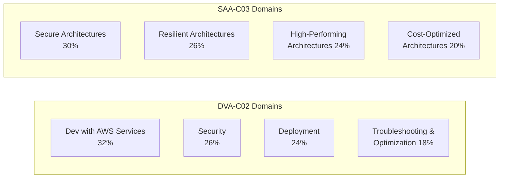

> ⚠️ **Common Pitfall:** People assume SAA is "harder" and DVA is "just coding". In reality DVA leans on **SDK behaviors, deployment (CodeX, Elastic Beanstalk, SAM), and IAM/encryption mechanics**; SAA leans on **multi-service architecture trade-offs**. Each rewards different muscles.

---

## 2. Registration & Exam-Day Logistics (Pearson VUE vs PSI)

> 💡 **Intuition:** Register through your **AWS Certification account** (certification.aws.amazon.com). It hands you off to a delivery vendor. Historically AWS offered both **Pearson VUE** and **PSI**; PSI was retired for AWS exams, and **Pearson VUE is now the delivery provider** for both test-center and online-proctored exams. Know both names because legacy material and other vendors still mention PSI.

### Pearson VUE vs PSI (historical comparison)

| Aspect | Pearson VUE | PSI (legacy) |
|---|---|---|
| Current AWS status | **Active provider** | Retired for AWS |
| Delivery modes | Test center + OnVUE online proctor | Test center + online |
| Online software | **OnVUE** (browser/app) | PSI Secure Browser |
| System test tool | "Run system test" before booking | Compatibility check |
| Reschedule window | Up to 24 h before (no fee) | Up to 48 h typically |

> 🎯 **Key Insight:** Whatever the vendor, the **two delivery modes** are what matter: **test center** (drive in, locked locker, clean desk provided) vs **online proctored** (your room, your webcam, a remote human proctor). Choose based on temperament, not convenience alone.

### Online proctoring (OnVUE) rules — the ones people fail on

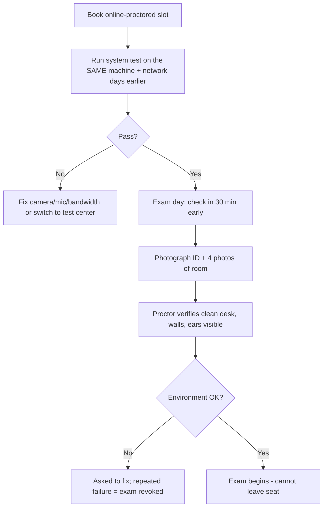

**Hard rules for online proctoring (failing any can void the exam):**

- **No second monitor.** Unplug it physically; "turned off" is often not accepted.
- **No talking, no reading aloud, no humming.** Some proctors flag lip movement.
- **No leaving your seat.** No bathroom breaks. (Associate exams have **no scheduled breaks**.)
- **Clear desk.** No paper, pens, phones, headphones, watches, food, drink in opaque containers.
- **No one else may enter the room.** A person walking in can end the exam.
- **Face/ears visible.** No hoods, hats (religious exceptions arranged in advance), or wired earbuds.
- **Whiteboard:** the OnVUE software provides a **digital scratchpad** — practice with it; you cannot use physical paper.

> ⚠️ **Common Pitfall:** Running the system test on your laptop, then taking the exam on a different network (e.g., office VPN, corporate firewall blocking OnVUE). **Test on the exact machine + network + location you'll use.** Corporate networks frequently block the proctoring stream.

> 📝 **Tip:** **Accommodations** (e.g., +30 min for ESL — "ESL +30" extension) must be requested and approved **before** booking. Many candidates qualify for the ESL extension; it is free and gives 160 minutes.

---

## 3. Time Management & Flag-and-Review

> 💡 **Intuition:** 130 minutes / 65 questions = **2 minutes per question** average. But the distribution is bimodal: half the questions take 45 seconds, the other half take 3+ minutes. Your job is to **bank time on the easy ones** and **spend it on the hard ones** — without ever getting stuck.

$$\text{Pace target} = \frac{130 \text{ min}}{65 \text{ q}} = 2.0 \text{ min/q} \quad\Rightarrow\quad \text{checkpoint: } \ge 33 \text{ q done by the 60-min mark}$$

### The three-pass strategy

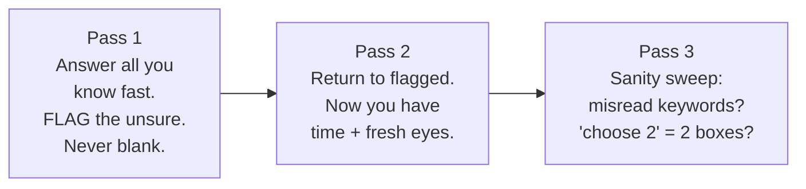

1. **Pass 1 (target ~75 min):** Go front to back. If you know it in < 90 s, answer and move on. If not, pick your best guess, **flag it**, and move on. **Never leave a question blank** — there is no penalty for wrong answers, so an unanswered question is strictly worse than a guess.
2. **Pass 2 (target ~40 min):** Revisit only flagged questions. Often a later question jogs your memory or even *reveals the answer* to an earlier one.
3. **Pass 3 (final ~15 min):** Sweep for mechanical errors — did you select **two** boxes on a "choose TWO"? Did you misread "NOT" or "EXCEPT"?

> 🎯 **Key Insight:** The single biggest score-killer is **time-sinking on one hard question**. If a question has consumed 3 minutes and you're still torn, **commit to your best guess, flag it, and leave**. Two flagged questions you return to with a clear head beat one question you "solved" by burning 5 minutes.

> ⚠️ **Common Pitfall:** Over-flagging. If you flag 40 of 65, the flag is meaningless. Flag only genuine 50/50s — aim for 10–15 flags max.

---

## 4. How AWS Writes Questions

> 💡 **Intuition:** AWS questions are **engineered**, not casual. Each has a *stem* (scenario), a *lead-in* (the actual ask), and four/five *options* where the wrong ones are designed to be **plausible-but-flawed**, not obviously silly.

### Anatomy of an AWS question

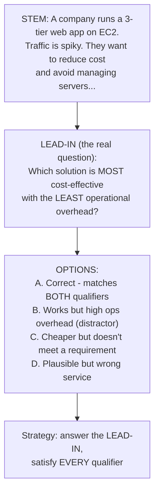

**The four distractor archetypes** — recognizing these is half the battle:

| Distractor type | What it looks like | How to catch it |
|---|---|---|
| **Right service, wrong feature** | "Use RDS read replica for high availability" | Read replica = scaling, *Multi-AZ* = HA |
| **Works but violates a qualifier** | Technically functional but high ops overhead when "least overhead" was asked | Re-check every adjective in the lead-in |
| **Plausible-sounding nonsense** | "Enable S3 Transfer Acceleration on a DynamoDB table" | Service mismatch — does this combination even exist? |
| **Outdated best practice** | "Use EC2-Classic / store secrets in EC2 user data" | AWS tests *current* best practice |

> 🎯 **Key Insight:** **Read the lead-in first, then the stem.** Knowing the question ("MOST cost-effective, LEAST overhead") tells you which facts in the stem matter. AWS buries one irrelevant detail in almost every stem to test whether you can separate signal from noise.

> ⚠️ **Common Pitfall:** Answering the question you *wish* was asked. The stem mentions "real-time analytics" and you pick Kinesis on reflex — but the lead-in asked for the *most durable storage*, which is S3. **Qualifiers in the lead-in override vibes in the stem.**

---

## 5. The Keyword Decoder

> 💡 **Intuition:** AWS uses a **controlled vocabulary**. Each loaded phrase is a near-deterministic pointer to a service or feature. Memorize these mappings and a huge fraction of questions become pattern-matching.

> 🎯 **Key Insight:** When two qualifiers appear together ("most cost-effective" **and** "least operational overhead"), the answer must satisfy **both**. Serverless/managed options usually win the *overhead* axis; spot/lifecycle/right-sizing options win the *cost* axis. The correct answer wins the axis the lead-in emphasizes most.

### Master keyword → service/feature table

| Keyword / phrase | Strongly implies | Why |
|---|---|---|
| **"least operational overhead" / "least management" / "fully managed" / "no servers"** | Lambda, Fargate, S3, DynamoDB, Aurora Serverless, SQS, managed services | AWS's preferred answer is almost always the *more managed* option |
| **"most cost-effective"** | Spot Instances, S3 lifecycle/Intelligent-Tiering, Savings Plans/RIs, right-sizing, serverless for spiky load | Cheapest that still meets requirements |
| **"highly available" / "HA" / "survive AZ failure"** | Multi-AZ, multiple AZs, Auto Scaling across AZs, ELB | HA = redundancy across **AZs** |
| **"durable" / "11 nines" / "do not lose data"** | **S3** (11 9's durability), DynamoDB, EBS snapshots | Durability ≠ availability; S3 is the durability poster child |
| **"decouple" / "loosely coupled" / "buffer" / "smooth out spikes"** | **SQS** (queue, buffering) | Decoupling = a queue between producer/consumer |
| **"fan-out" / "notify multiple" / "pub/sub"** | **SNS** (one-to-many), or SNS→SQS fan-out | One message, many subscribers |
| **"real-time" / "streaming" / "clickstream" / "ordered records" / "replay"** | **Kinesis Data Streams** | Ordered, replayable, real-time streaming |
| **"event-driven" / "route events" / "many AWS service events" / "SaaS events"** | **EventBridge** | Event bus with filtering/routing across many sources |
| **"in-memory cache" / "microsecond" / "reduce DB load" / "session store"** | **ElastiCache** (Redis/Memcached); DAX for DynamoDB | Caching layer |
| **"submillisecond" / "key-value at any scale" / "serverless NoSQL"** | **DynamoDB** | NoSQL, single-digit ms |
| **"relational" / "SQL" / "joins" / "ACID transactions"** | **RDS / Aurora** | Relational engines |
| **"minimal changes" / "lift and shift" / "rehost" / "no refactor"** | **EC2**, RDS, VM Import, MGN, DMS | Keep the app as-is |
| **"global users" / "low latency worldwide" / "cache static content"** | **CloudFront** | CDN at edge |
| **"static IP" / "non-HTTP TCP/UDP" / "instant regional failover"** | **Global Accelerator** | Anycast static IPs, network-layer |
| **"encrypt at rest" / "manage keys" / "rotate keys"** | **KMS** | Managed encryption keys |
| **"FIPS 140-2 Level 3" / "dedicated single-tenant HSM" / "control the HSM"** | **CloudHSM** | Dedicated hardware security module |
| **"store secrets" / "rotate DB credentials automatically"** | **Secrets Manager** | Built-in rotation |
| **"store config / parameters" / "free hierarchical config"** | **Parameter Store** (SSM) | Cheaper, no native rotation |
| **"user sign-up / sign-in / social IdP / JWT"** | **Cognito User Pools** | Authentication / user directory |
| **"temporary AWS credentials for app users"** | **Cognito Identity Pools** | Authorization → AWS creds |
| **"shared file system" / "multiple EC2 / Linux NFS"** | **EFS** | Multi-attach POSIX file system |
| **"single EC2 block storage" / "boot volume" / "low-latency block"** | **EBS** | Block storage, one AZ |
| **"Windows file share / SMB"** | **FSx for Windows** | |
| **"high-performance computing / Lustre"** | **FSx for Lustre** | |
| **"infrastructure as code" / "repeatable provisioning"** | **CloudFormation** (or CDK) | |
| **"distribute traffic / health checks across instances"** | **ELB (ALB/NLB)** | |
| **"DNS / routing policy / failover routing"** | **Route 53** | |

> ⚠️ **Common Pitfall:** Confusing **durable** with **available**. *Durability* = "the data won't be lost" (S3 = 99.999999999%). *Availability* = "you can reach it right now" (Multi-AZ, ELB). A question saying "must not lose customer records, even during an AZ outage" wants **durable storage (S3/DynamoDB)**, not necessarily a Multi-AZ EC2 fleet.

### Keyword decision flow for the two most common qualifiers

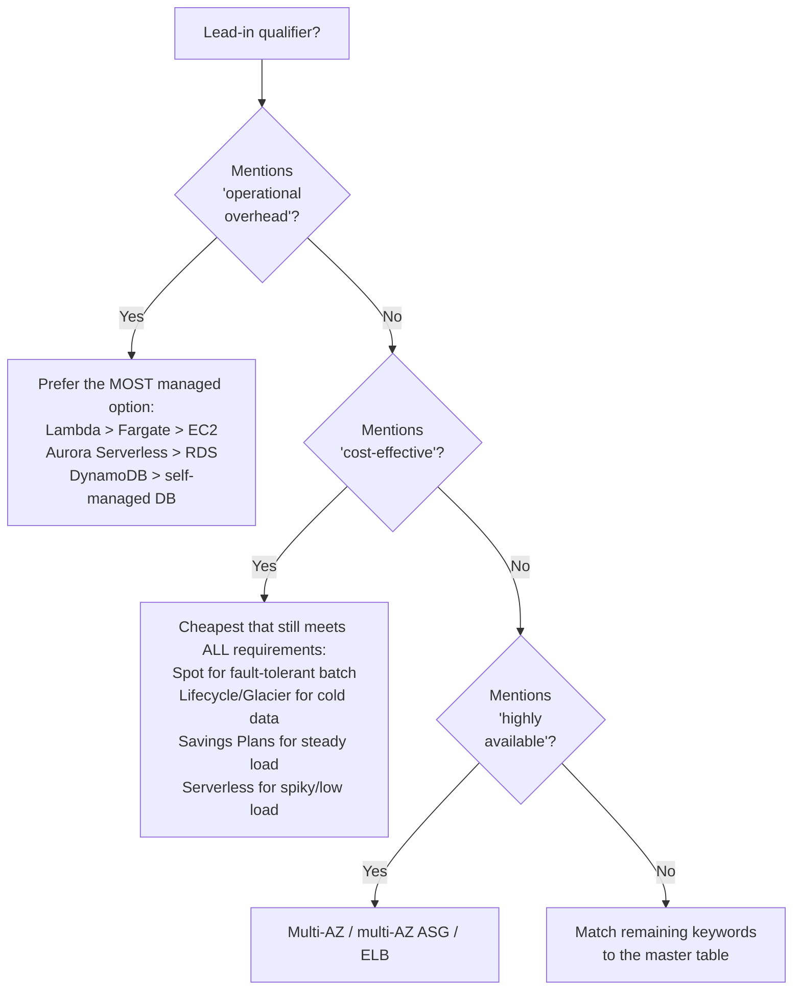

---

## 6. Decision Frameworks per Scenario Type

> 💡 **Intuition:** Most scenarios fall into six archetypes. For each, there is a *default mental flowchart*. Internalize these and you stop reasoning from scratch every time.

### 6.1 Migrate ("move this to AWS with minimal change")

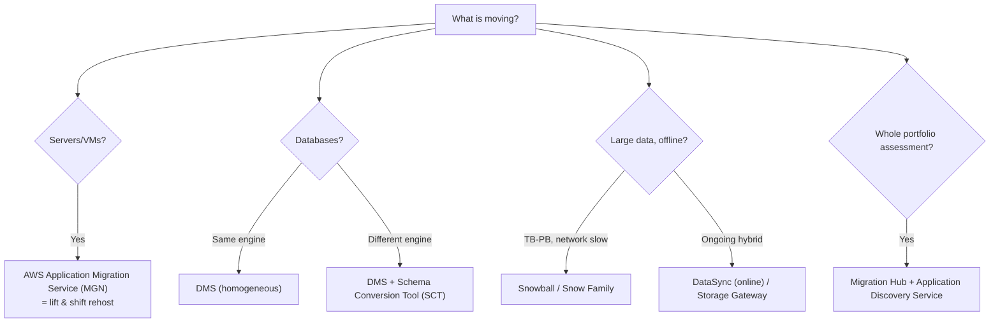

### 6.2 HA / DR ("survive failure")

| Requirement signal | Answer pattern |
|---|---|
| Survive **AZ** failure (compute) | ASG across ≥ 2 AZs + ELB |
| Survive **AZ** failure (RDS) | **Multi-AZ** deployment (synchronous standby) |
| Survive **Region** failure | Cross-Region replication (S3 CRR, Aurora Global, DynamoDB Global Tables), Route 53 failover |
| **RPO ≈ 0, RTO low, cheapest** | **Pilot Light** or **Warm Standby** (not full active-active) |
| **Lowest RTO/RPO, cost no object** | **Multi-site active/active** |
| **Cheapest DR, slow recovery OK** | **Backup & Restore** |

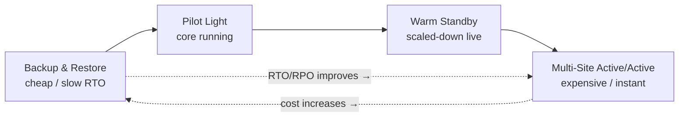

### 6.3 Cost-optimize

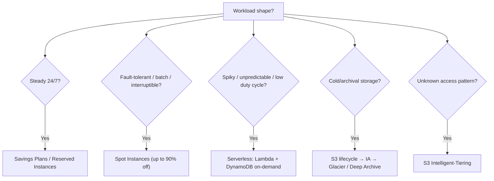

### 6.4 Secure

| Signal | Answer |
|---|---|
| "grant app on EC2 access to S3" | **IAM Role** (instance profile) — never access keys |
| "encrypt at rest, manage keys" | **KMS** (SSE-KMS) |
| "rotate DB credentials" | **Secrets Manager** |
| "protect web app from SQLi/XSS" | **AWS WAF** (on ALB/CloudFront/API GW) |
| "DDoS protection, managed" | **Shield Advanced** |
| "centralized, multi-account guardrails" | **Organizations + SCPs**, **Control Tower** |
| "detect threats from logs" | **GuardDuty** |
| "assess resource config compliance" | **AWS Config** |
| "private connectivity to AWS service, no internet" | **VPC endpoint** (gateway for S3/DynamoDB, interface for others) |

### 6.5 Decouple / Integrate

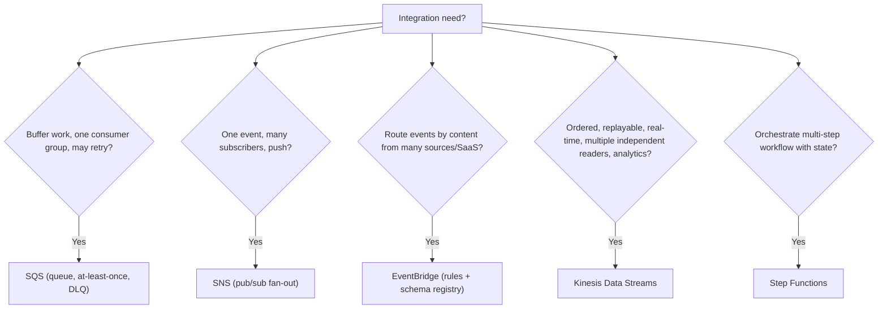

### 6.6 Performance

| Signal | Answer |
|---|---|
| "reduce read load on RDS" | **Read replicas** + ElastiCache |
| "microsecond reads on DynamoDB" | **DAX** |
| "speed up global static/dynamic content" | **CloudFront** |
| "speed up S3 long-distance uploads" | **S3 Transfer Acceleration** |
| "offload session state for stateless scaling" | **ElastiCache** / DynamoDB |
| "burst compute, parallel, short jobs" | **Lambda** (with reserved/provisioned concurrency) |

---

## 7. Elimination Technique & "Choose 2/3"

> 💡 **Intuition:** You rarely need to *know* the right answer with certainty. You need to **eliminate the impossible** until the probable remains. On a 4-option question, eliminating 2 distractors turns a 25% guess into a 50% coin flip — and you usually can eliminate 2.

### The elimination algorithm

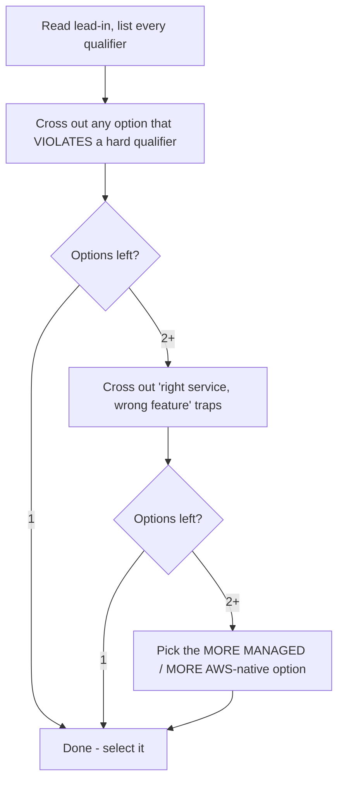

**Worked elimination example:**

> *A company needs to store user-uploaded images and serve them to a global audience with the LOWEST latency and LEAST operational overhead.*
> A. EC2 fleet behind ALB serving images from EBS
> B. S3 bucket with CloudFront distribution
> C. EFS mounted on EC2 in multiple Regions
> D. S3 bucket served directly without a CDN

- **A** — violates "least overhead" (managing EC2/EBS). Eliminate.
- **C** — EFS is regional, not global; high overhead. Eliminate.
- **D** — S3 alone has no edge caching → not lowest global latency. Eliminate.
- **B** — satisfies both qualifiers. ✅

### "Choose TWO / THREE" discipline

> 🎯 **Key Insight:** On multiple-response items, the options often come in **pairs/sets that must work together**. The correct combination is **internally consistent**. Look for two options that *complete each other*; reject any option that, while individually plausible, doesn't fit the other selected ones.

> ⚠️ **Common Pitfall:** Selecting the **right number minus one** (one correct box on a "choose TWO") — the system marks the whole question wrong; there is **no partial credit**. In Pass 3, verify your box count matches the lead-in's number word.

> 📝 **Tip:** For "choose TWO" cost/HA questions, a common pattern is **one config change + one service addition** (e.g., "Enable Multi-AZ" *and* "Add read replicas"). Don't pick two flavors of the same idea.

---

## 8. Per-Service Classic Traps

> 💡 **Intuition:** AWS reuses the same handful of misconceptions across thousands of questions. Pre-load the corrections and you'll see the trap coming.

### 8.1 Lambda — concurrency & cold starts

- **Cold start** = the latency to initialize a new execution environment (download code, start runtime, run init). Mitigate with **Provisioned Concurrency** (keeps environments warm). **Reserved Concurrency** *caps/guarantees* a function's share of the account limit — it does **not** prevent cold starts.
- Default **account concurrency limit** is 1,000 (soft). Exceeding it → throttling (`429 TooManyRequestsException`).
- Max execution duration **15 minutes**. Long job → Step Functions / Fargate / EC2.
- `/tmp` is **512 MB by default** (configurable up to 10 GB). Memory is the dial that also scales CPU.

> ⚠️ **Pitfall:** "Reserved concurrency eliminates cold starts" — **false**. *Provisioned* concurrency does; *reserved* concurrency manages quota.

### 8.2 DynamoDB — hot partitions & capacity

- Throughput is spread across **partitions by partition key**. A poorly distributed key (e.g., everyone writes `status=ACTIVE`) creates a **hot partition** → throttling even when total provisioned capacity isn't exhausted. Fix with a **high-cardinality** key or **write sharding**.
- **RCU**: 1 RCU = 1 strongly-consistent read of ≤ 4 KB/s (or 2 eventually-consistent). **WCU**: 1 WCU = 1 write of ≤ 1 KB/s.
- **On-demand** = no capacity planning (good for spiky/unknown). **Provisioned** + Auto Scaling = cheaper for predictable load.
- **DAX** for microsecond reads; **Global Tables** for multi-Region active-active; **Streams** for change-data-capture.

$$\text{WCU for a 3 KB item, 100 writes/s} = \lceil 3\text{KB}/1\text{KB}\rceil \times 100 = 3 \times 100 = 300\ \text{WCU}$$

### 8.3 S3 — consistency & encryption

- **Strong read-after-write consistency** for all operations since Dec 2020 (no more "eventual consistency" trap for new objects — but old exam dumps still claim otherwise; trust *strong consistency*).
- **Encryption:** SSE-S3 (AWS-managed keys), **SSE-KMS** (KMS keys, audit + rotation), SSE-C (customer-provided), client-side. **SSE-S3 is now applied by default** to new objects.
- **Durability** 11 nines; **availability** varies by class (Standard 99.99%).
- Block Public Access is on by default; public access usually requires *both* bucket policy and disabling BPA.

> ⚠️ **Pitfall:** "Use a bucket policy to encrypt objects." A bucket policy can *enforce* that uploads include encryption headers (deny unencrypted PUTs), but the **encryption itself** is SSE-S3/SSE-KMS/etc., not the policy.

### 8.4 RDS — Multi-AZ vs Read Replicas (THE classic)

| | **Multi-AZ** | **Read Replica** |
|---|---|---|
| Purpose | **High availability / failover** | **Read scaling** (offload reads) |
| Replication | **Synchronous** | **Asynchronous** |
| Failover | Automatic to standby | **Manual promotion** |
| Standby serves reads? | **No** (until Multi-AZ cluster variant) | **Yes** |
| Cross-Region? | (Multi-AZ is within Region) | **Yes**, RRs can be cross-Region |

> 🎯 **Key Insight:** **Multi-AZ = availability, NOT read scaling. Read replicas = read scaling, NOT automatic HA.** If a question wants *both*, the answer enables **both**.

### 8.5 SQS vs SNS vs EventBridge vs Kinesis — see [§9](#9-service-comparison-cheat-sheets).

### 8.6 SG vs NACL

| | **Security Group** | **Network ACL** |
|---|---|---|
| Level | **Instance/ENI** | **Subnet** |
| State | **Stateful** (return traffic auto-allowed) | **Stateless** (must allow return explicitly) |
| Rules | **Allow only** | **Allow and Deny** |
| Evaluation | All rules evaluated | **Numbered order**, first match wins |
| Default | Deny all inbound, allow all outbound | Default NACL allows all |

> ⚠️ **Pitfall:** "Use a Security Group to *block* a specific malicious IP." SGs **cannot deny** — only allow. To block an IP, use a **NACL deny rule** (or WAF).

### 8.7 Gateway vs Interface VPC Endpoints

| | **Gateway Endpoint** | **Interface Endpoint (PrivateLink)** |
|---|---|---|
| Services | **S3 and DynamoDB only** | Most other AWS services |
| Mechanism | Route-table entry | **ENI with private IP** in your subnet |
| Cost | **Free** | Hourly + per-GB |
| Cross-Region/on-prem | No | Yes (via ENI) |

> 🎯 **Key Insight:** If the question is "private access to **S3 or DynamoDB** at no cost", it's a **gateway endpoint**. Anything else → **interface endpoint**.

---

## 9. Service Comparison Cheat Sheets

> 📝 **Tip:** These eight tables answer the majority of "which service" questions. Drill them until you can reproduce each from memory.

### 9.1 SQS vs SNS vs EventBridge vs Kinesis

| | **SQS** | **SNS** | **EventBridge** | **Kinesis Data Streams** |
|---|---|---|---|---|
| Model | Queue (pull) | Pub/sub (push) | Event bus (push, routing) | Streaming (pull, ordered) |
| Consumers | One logical consumer group | Many subscribers (fan-out) | Many targets via rules | Many independent readers |
| Ordering | FIFO queues only | FIFO topics only | No guarantee | **Per-shard ordered** |
| Replay | No (msg deleted on ack) | No | **Archive + replay** | **Yes** (retention 1–365 days) |
| Filtering | No (consumer filters) | Message attributes | **Rich content filtering** | Consumer-side |
| Best for | Decouple, buffer, retry | Notify many endpoints | Event-driven routing, SaaS, AWS events | Real-time analytics, clickstream, IoT |
| Retention | Up to 14 days | N/A (not stored) | Archive configurable | 1–365 days |
| Throughput unit | Nearly unlimited | High | High | **Per-shard (1 MB/s in)** |

### 9.2 S3 vs EFS vs EBS vs FSx

| | **S3** | **EFS** | **EBS** | **FSx** |
|---|---|---|---|---|
| Type | Object storage | File (NFS, POSIX) | Block | File (SMB / Lustre / etc.) |
| Attach | HTTP API | Many EC2, multi-AZ | **One EC2** (one AZ)* | Many clients |
| Protocol | REST | NFSv4 | Block device | SMB (Windows), Lustre (HPC) |
| Scaling | Unlimited | Elastic auto | Provisioned size | Provisioned |
| Durability | 11 nines | High, multi-AZ | Within AZ (+ snapshots) | High |
| Best for | Static assets, data lake, backup | Shared Linux file system | Boot/DB volumes | Windows shares / HPC |

*\*EBS io2 supports Multi-Attach within an AZ for clustered apps.*

### 9.3 RDS vs Aurora vs DynamoDB

| | **RDS** | **Aurora** | **DynamoDB** |
|---|---|---|---|
| Model | Relational (6 engines) | Relational (MySQL/Postgres-compatible) | NoSQL key-value/document |
| Scaling | Vertical + read replicas | **Auto-storage to 128 TB**, up to 15 replicas, Serverless v2 | **Horizontal, virtually unlimited** |
| Availability | Multi-AZ option | **6 copies across 3 AZs** | Multi-AZ by default; Global Tables |
| Latency | ms | ms | **single-digit ms** (µs with DAX) |
| Ops overhead | Managed | More managed | **Fully managed, serverless** |
| Best for | Traditional SQL apps | High-perf SQL, cloud-native | High-scale key-value, serverless |

### 9.4 Lambda vs Fargate vs EC2

| | **Lambda** | **Fargate** | **EC2** |
|---|---|---|---|
| Unit | Function | Container task | Virtual machine |
| Server mgmt | **None** | None (containers) | **You manage** |
| Max duration | 15 min | Long-running | Unlimited |
| Scaling | Automatic, per-request | Per-task | ASG (you configure) |
| Pricing | Per-request + GB-s | Per vCPU/GB-s | Per-instance-hour (Spot/RI/SP) |
| Best for | Event-driven, spiky, short | Containerized services, no server mgmt | Full control, legacy, special HW (GPU) |

### 9.5 CloudFront vs Global Accelerator

| | **CloudFront** | **Global Accelerator** |
|---|---|---|
| Layer | **Content delivery (HTTP/S, L7)** | **Network (TCP/UDP, L4)** |
| Caches content? | **Yes** (edge cache) | **No** |
| Use case | Static/dynamic web content, media | Non-HTTP apps, gaming, IoT, fast regional failover |
| IP | Per-distribution domain | **2 static anycast IPs** |
| Failover speed | DNS-based | **Near-instant** (anycast) |

### 9.6 Cognito User Pools vs Identity Pools

| | **User Pool** | **Identity Pool (Federated Identities)** |
|---|---|---|
| Purpose | **Authentication** (who are you) | **Authorization** (what AWS can you touch) |
| Output | **JWT tokens** | **Temporary AWS credentials** (via STS) |
| Directory? | Yes (user store, sign-up/in) | No (maps identities → IAM roles) |
| Federation | Social + SAML/OIDC IdPs | Accepts User Pool / social / SAML tokens |
| Use together | Sign in via User Pool → exchange token at Identity Pool → get AWS creds to call S3/DynamoDB |  |

### 9.7 KMS vs CloudHSM

| | **KMS** | **CloudHSM** |
|---|---|---|
| Tenancy | **Multi-tenant** (AWS-managed) | **Single-tenant dedicated HSM** |
| Control | AWS manages HSM; you manage keys | **You fully control** the HSM |
| Compliance | FIPS 140-2 Level 3 (validated HSMs) | **FIPS 140-2 Level 3**, full control |
| Integration | **Native with most AWS services** | Via custom key store / PKCS#11 |
| Best for | Default at-rest encryption, simplicity | Strict regulatory, custom crypto, key custody |

### 9.8 Secrets Manager vs Parameter Store

| | **Secrets Manager** | **SSM Parameter Store** |
|---|---|---|
| Purpose | Secrets with **automatic rotation** | Config + secrets (SecureString) |
| Rotation | **Built-in** (Lambda, RDS native) | **No native rotation** (DIY) |
| Cost | **Per-secret + per-API** (paid) | **Standard tier free** |
| Size | Up to 64 KB | 4 KB (std) / 8 KB (advanced) |
| Best for | DB creds, auto-rotated secrets | App config, cheap parameters, hierarchy |

> 🎯 **Key Insight:** "Automatically **rotate** database credentials" → **Secrets Manager**. "Store config cheaply / free" → **Parameter Store**.

---

## 10. 50 Mixed Practice Questions

> 📝 **Tip:** Cover the answers. Read the lead-in first, list qualifiers, eliminate, *then* reveal. Tags: **[SAA]** Solutions Architect, **[DVA]** Developer.

---

**Q1 [SAA].** A web app on EC2 in one AZ must survive an Availability Zone failure with automatic recovery. What should you do?

Show answer

**Deploy the app across multiple AZs in an Auto Scaling group behind an Application Load Balancer.**

HA = redundancy across AZs + load balancing + ASG for automatic replacement. Distractors: a single larger instance (no HA), EBS snapshots only (backup, not HA), Multi-AZ RDS (that's the DB tier, doesn't make the EC2 app HA). **Keyword: "survive an AZ failure" + "automatic" → multi-AZ ASG + ELB.**

---

**Q2 [DVA].** A Lambda function intermittently shows high latency on the first invocation after idle periods. Latency on warm invocations is fine. What reduces the first-invocation latency?

Show answer

**Enable Provisioned Concurrency.**

The symptom is **cold start**. Provisioned Concurrency keeps initialized environments warm. *Reserved* concurrency only caps quota and does **not** fix cold starts (classic distractor). Increasing timeout doesn't help; the init is the issue. Adding memory can marginally speed init but is not the targeted fix.

---

**Q3 [SAA].** A company wants the MOST cost-effective storage for logs accessed frequently for 30 days, then rarely, and that must be retained 7 years.

Show answer

**S3 with a lifecycle policy: Standard → Standard-IA after 30 days → Glacier Deep Archive for long-term retention.**

"Most cost-effective" + tiered access pattern = **S3 lifecycle**. Storing everything in Standard for 7 years is wasteful; EBS/EFS are wrong storage classes for archival logs; Glacier from day 1 fails the "frequently accessed for 30 days" requirement (retrieval latency/cost).

---

**Q4 [DVA].** An app must decouple a front-end that accepts orders from a back-end that processes them, buffering spikes and allowing retries on failure.

Show answer

**Amazon SQS.**

"Decouple" + "buffer spikes" + "retry" = **SQS** (with a DLQ for failures). SNS is pub/sub (no buffering/pull/retry semantics the same way); Kinesis is for ordered real-time streaming/analytics; EventBridge routes events but isn't a work buffer with the same retry/visibility-timeout model.

---

**Q5 [SAA].** A company needs to send the same notification to an email list, an SQS queue, and an HTTP endpoint simultaneously.

Show answer

**Amazon SNS (fan-out).**

"Same message to multiple endpoints simultaneously" = **SNS pub/sub fan-out** (email, SQS, HTTP/S subscribers). SQS alone is one consumer group; Kinesis is streaming; EventBridge could route but SNS is the canonical fan-out answer for these subscriber types.

---

**Q6 [SAA].** Read-heavy RDS MySQL database is CPU-bound on reads. Writes are fine. Reduce read load with LEAST application disruption.

Show answer

**Add RDS Read Replicas and direct read traffic to them.**

Read scaling = **read replicas** (not Multi-AZ, which is HA only). ElastiCache also helps but "read replicas" is the direct RDS answer for offloading SQL reads with minimal app change (point reads at the replica endpoint). Scaling up the instance is costlier and not the "scaling reads" pattern.

---

**Q7 [DVA].** A DynamoDB table experiences throttling on writes even though provisioned WCU isn't fully consumed. Many writes use the same partition key value.

Show answer

**Redesign the partition key for higher cardinality (or use write sharding) to avoid a hot partition.**

Throttling with spare total capacity = **hot partition**. Capacity is per-partition by key. Increasing WCU alone won't fix a skewed key. On-demand mode helps with unknown patterns but the root cause is key design.

---

**Q8 [SAA].** Global users complain about slow load times for a static website hosted in S3 in us-east-1.

Show answer

**Serve the site through Amazon CloudFront with the S3 bucket as origin.**

"Global users" + "static content" + "latency" = **CloudFront** (edge caching). Global Accelerator is for non-HTTP/TCP-UDP and doesn't cache. Cross-Region replication of the bucket doesn't solve edge latency. Larger instances aren't relevant (S3 static hosting).

---

**Q9 [SAA].** An application needs static anycast IP addresses and instant regional failover for a TCP-based multiplayer game.

Show answer

**AWS Global Accelerator.**

"Static IP" + "non-HTTP TCP" + "instant regional failover" = **Global Accelerator** (L4 anycast). CloudFront is L7/HTTP and caches content; it's not for raw TCP gaming traffic with static IPs.

---

**Q10 [DVA].** You must store database credentials and rotate them automatically every 30 days.

Show answer

**AWS Secrets Manager.**

"Rotate automatically" = **Secrets Manager** (native rotation, RDS integration). Parameter Store SecureString stores secrets but has **no built-in rotation**. KMS encrypts keys, not credential lifecycles. Environment variables are insecure for secrets.

---

**Q11 [SAA].** A company wants private connectivity from a VPC to S3 without traversing the internet, at no additional cost.

Show answer

**Create a Gateway VPC Endpoint for S3.**

S3/DynamoDB private access + "no cost" = **gateway endpoint** (route-table based, free). Interface endpoints cost hourly+GB and aren't needed for S3. NAT Gateway still uses the internet path and costs money.

---

**Q12 [DVA].** A function must run longer than 15 minutes to process a large file.

Show answer

**Use AWS Fargate (or EC2/Step Functions) instead of Lambda.**

Lambda hard limit is **15 minutes**. Long-running compute → Fargate task or EC2; orchestrate steps with Step Functions. You cannot raise Lambda's timeout beyond 15 min.

---

**Q13 [SAA].** A company needs a shared POSIX file system mountable by hundreds of Linux EC2 instances across multiple AZs.

Show answer

**Amazon EFS.**

"Shared" + "POSIX/Linux" + "many EC2 across AZs" = **EFS**. EBS attaches to one instance (one AZ); S3 isn't a file system; FSx for Windows is SMB. FSx for Lustre is HPC, not a general shared NFS.

---

**Q14 [DVA].** An API must authenticate end users with sign-up/sign-in and social logins, returning JWTs to the SPA.

Show answer

**Amazon Cognito User Pool.**

"Sign-up/sign-in" + "social IdP" + "JWT" = **User Pool** (authentication). Identity Pools give *AWS credentials*, not user authentication directories. IAM users are for AWS principals, not app end users.

---

**Q15 [SAA].** A regulated workload requires single-tenant, customer-controlled HSMs with FIPS 140-2 Level 3 and full key custody.

Show answer

**AWS CloudHSM.**

"Single-tenant", "you control the HSM", "full custody" = **CloudHSM**. KMS is multi-tenant and AWS-managed (still FIPS 140-2 Level 3 validated HSMs, but not single-tenant/customer-controlled).

---

**Q16 [SAA].** Choose TWO actions to make an RDS database both highly available AND able to scale read traffic.

Show answer

**(1) Enable Multi-AZ deployment. (2) Add one or more Read Replicas.**

This is the classic pairing: **Multi-AZ = HA**, **Read Replicas = read scaling**. Picking only one fails the dual requirement. Distractors like "increase instance size" or "enable storage autoscaling" address neither HA nor read scaling directly.

---

**Q17 [DVA].** A developer wants to deploy a new Lambda version with traffic shifting 10% → 100% over 10 minutes, with automatic rollback on alarm.

Show answer

**Use AWS CodeDeploy with a canary/linear deployment configuration and Lambda aliases.**

Gradual traffic shift + auto-rollback = **CodeDeploy** (canary/linear) on a Lambda **alias**, with CloudWatch alarms triggering rollback. Manually updating `$LATEST` gives no controlled shift or rollback.

---

**Q18 [SAA].** Cheapest compute for a fault-tolerant batch job that can be interrupted and restarted.

Show answer

**EC2 Spot Instances** (or Spot in an ASG / Spot Fleet).

"Fault-tolerant", "interruptible", "cheapest" = **Spot** (up to ~90% off). On-Demand is costlier; Reserved/Savings Plans suit steady workloads, not interruptible batch.

---

**Q19 [DVA].** API Gateway + Lambda backend; you must cache responses to reduce backend calls for identical GET requests.

Show answer

**Enable API Gateway caching on the stage** (TTL-based response cache).

Caching identical GETs at the edge of API GW = **API Gateway stage caching**. CloudFront could front it but the native, targeted answer is API GW caching. ElastiCache would require app-level integration.

---

**Q20 [SAA].** A company must process clickstream data in real time, allow multiple independent consumers, and replay the last 24 hours.

Show answer

**Amazon Kinesis Data Streams.**

"Real-time" + "multiple independent consumers" + "replay" + "ordered" = **Kinesis Data Streams** (retention/replay, per-shard ordering, multiple consumers). SQS deletes on ack (no replay, one consumer group). SNS doesn't store/replay.

---

**Q21 [SAA].** Block a specific malicious IP address from reaching instances in a subnet.

Show answer

**Add a DENY rule in the subnet's Network ACL** (or use AWS WAF for L7).

Security Groups **cannot deny** — only allow. To **block** an IP at the subnet level, use a **NACL deny rule**. This is the SG-can't-deny trap.

---

**Q22 [DVA].** S3 uploads must be encrypted with keys you can audit and rotate, integrated with CloudTrail.

Show answer

**SSE-KMS.**

"Audit + rotate keys" + "CloudTrail" = **SSE-KMS** (KMS key, audited API calls, rotation). SSE-S3 uses AWS-managed keys with less audit granularity. SSE-C means you manage keys yourself with no AWS audit of the key.

---

**Q23 [SAA].** A three-tier app needs the database tier to fail over automatically within seconds if the primary AZ goes down, with no data loss.

Show answer

**Enable RDS Multi-AZ deployment** (synchronous standby, automatic failover).

"Automatic failover" + "no data loss" + "AZ down" = **Multi-AZ** (synchronous). Read replicas are async (potential data loss) and require manual promotion.

---

**Q24 [DVA].** A serverless app needs to orchestrate a multi-step workflow with branching, retries, and human approval steps.

Show answer

**AWS Step Functions.**

"Orchestrate multi-step workflow" + "branching/retries" + "approval" = **Step Functions** (state machine). SQS/SNS are messaging, not orchestration. Chaining Lambdas manually is fragile and lacks built-in retry/state.

---

**Q25 [SAA].** A company wants the LEAST operational overhead relational database that auto-scales storage and provides 6 copies across 3 AZs.

Show answer

**Amazon Aurora.**

"6 copies across 3 AZs" + auto-scaling storage + low overhead = **Aurora**. Plain RDS doesn't keep 6 copies; DynamoDB is NoSQL (question says relational).

---

**Q26 [DVA].** You need temporary, scoped AWS credentials for mobile app users to upload to a specific S3 prefix.

Show answer

**Use a Cognito Identity Pool to vend temporary AWS credentials (STS) mapped to an IAM role scoped to the prefix.**

"Temporary AWS credentials for app users" = **Identity Pool** → STS → scoped IAM role. Embedding long-term IAM keys in the app is a critical security anti-pattern.

---

**Q27 [SAA].** Choose TWO ways to reduce the cost of an over-provisioned, steady-state production EC2 fleet.

Show answer

**(1) Purchase Compute Savings Plans / Reserved Instances for the steady baseline. (2) Right-size instances based on CloudWatch utilization.**

Steady load → commitment discounts (SP/RI). Over-provisioned → right-size. Spot is wrong for steady production (interruptible). Buying more capacity increases cost.

---

**Q28 [DVA].** A Lambda function reading from an SQS queue is being throttled; you must guarantee it never consumes more than 100 concurrent executions.

Show answer

**Set Reserved Concurrency = 100 on the function.**

"Guarantee a cap" on concurrency = **Reserved Concurrency**. Provisioned Concurrency warms environments (doesn't cap). This is the inverse of Q2 — know which lever does which.

---

**Q29 [SAA].** Static and dynamic content for a global SaaS must be delivered with low latency and protected by a WAF.

Show answer

**CloudFront distribution with AWS WAF attached.**

Global low-latency delivery = **CloudFront**; L7 protection (SQLi/XSS) = **WAF** on the distribution. Global Accelerator doesn't cache content or attach WAF the same way.

---

**Q30 [DVA].** A team wants infrastructure defined as code, version-controlled, repeatably deployable, using JSON/YAML templates.

Show answer

**AWS CloudFormation.**

"IaC" + "JSON/YAML templates" + "repeatable" = **CloudFormation** (or CDK which synthesizes CFN). Manual console clicks and shell scripts aren't declarative IaC.

---

**Q31 [SAA].** A company must migrate a 200 TB dataset to S3 from an on-prem datacenter with a slow 50 Mbps internet link, within two weeks.

Show answer

**AWS Snowball (Snow Family) — offline physical transfer.**

200 TB over 50 Mbps would take months; offline = **Snowball**. DataSync/Direct Connect over the slow link won't meet the deadline. Compute: $200\text{TB} \approx 1.6\times10^{6}$ Mb; at 50 Mbps that's ~$3.2\times10^{4}$ ks ≈ **370+ days**.

---

**Q32 [DVA].** A DynamoDB-backed app needs microsecond read latency for a read-heavy workload.

Show answer

**Add DynamoDB Accelerator (DAX) in front of the table.**

"Microsecond reads" on DynamoDB = **DAX** (in-memory cache). ElastiCache would require custom integration; DAX is purpose-built and DynamoDB-API compatible.

---

**Q33 [SAA].** A workload needs an in-memory cache to store user session state so the web tier can scale statelessly.

Show answer

**Amazon ElastiCache (Redis) for session storage** (or DynamoDB).

"In-memory" + "session store" + "stateless scaling" = **ElastiCache**. Storing sessions on local instance disk breaks statelessness; that's the anti-pattern being tested.

---

**Q34 [DVA].** API Gateway returns `429 Too Many Requests` under load. You must protect the backend while smoothing bursts.

Show answer

**Configure throttling (rate + burst) and/or usage plans on API Gateway.**

`429` = throttling. Use API GW **throttling limits / usage plans** to control rate. For async buffering you might also front with SQS, but the direct lever for API GW request rate is throttling/usage plans.

---

**Q35 [SAA].** A company needs cross-Region disaster recovery for an Aurora database with the lowest possible RPO.

Show answer

**Amazon Aurora Global Database.**

Cross-Region, low RPO (typically < 1 s) for Aurora = **Aurora Global Database**. Cross-Region read replicas have higher lag; snapshots have high RPO.

---

**Q36 [DVA].** You must grant an EC2-hosted app permission to read from S3 without storing credentials on the instance.

Show answer

**Attach an IAM Role to the EC2 instance (instance profile).**

"No stored credentials" = **IAM role**, never access keys in user data/config files. The instance gets rotating temporary creds automatically via the metadata service.

---

**Q37 [SAA].** Choose TWO services that provide private, internet-free access from a VPC to AWS service APIs.

Show answer

**(1) Gateway VPC Endpoint (S3, DynamoDB). (2) Interface VPC Endpoint / PrivateLink (other services).**

Both are VPC endpoints. NAT Gateway and Internet Gateway use the public internet path. Knowing *which* endpoint type per service is the trap.

---

**Q38 [DVA].** An event must trigger different targets based on the content of the event, originating from many AWS services and a SaaS partner.

Show answer

**Amazon EventBridge** (rules with content-based filtering; SaaS partner event sources).

"Route by content" + "many AWS/SaaS sources" = **EventBridge**. SNS lacks rich content filtering across SaaS sources; SQS is a buffer, not a router.

---

**Q39 [SAA].** A static IP, low-latency, multi-Region active-active API needs near-instant failover at the network layer.

Show answer

**AWS Global Accelerator** routing to endpoints in multiple Regions.

Network-layer + static IP + instant cross-Region failover = **Global Accelerator**. Route 53 failover is DNS-based (TTL delay); CloudFront is content delivery.

---

**Q40 [DVA].** A CI/CD pipeline must build, test, and deploy a containerized app to ECS automatically on each commit.

Show answer

**Use CodePipeline (orchestration) with CodeBuild (build/test) and CodeDeploy/ECS deploy actions.**

Full CI/CD on AWS = **CodePipeline + CodeBuild + CodeDeploy**. Manual `docker push` isn't an automated pipeline. (Code* services are heavily tested on DVA.)

---

**Q41 [SAA].** A company wants to enforce that no S3 bucket in any account can be made public, across the whole AWS Organization.

Show answer

**Use a Service Control Policy (SCP) in AWS Organizations** (plus S3 Block Public Access).

Org-wide guardrail = **SCP**. Bucket policies are per-bucket; SCPs enforce across all accounts. Control Tower can apply this as a guardrail too.

---

**Q42 [DVA].** A Lambda function must access an RDS database inside a private subnet.

Show answer

**Configure the Lambda function with VPC settings (subnets + security group) to run inside the VPC.**

To reach private RDS, Lambda must be **VPC-enabled**. Note: a VPC-attached Lambda needs a NAT/endpoint for internet/AWS-API access. The trap is forgetting Lambda is outside your VPC by default.

---

**Q43 [SAA].** Cheapest S3 option when access patterns are unknown and unpredictable, with no retrieval-time tolerance issues.

Show answer

**S3 Intelligent-Tiering.**

"Unknown/unpredictable access" = **Intelligent-Tiering** (auto-moves objects between tiers, no retrieval fees for frequent/infrequent tiers). Manual lifecycle requires known patterns; Glacier adds retrieval latency.

---

**Q44 [DVA].** You must store non-sensitive application configuration values for free, organized hierarchically.

Show answer

**SSM Parameter Store (Standard tier).**

"Free" + "hierarchical config" = **Parameter Store**. Secrets Manager is paid and is for rotated secrets. The cost axis decides it.

---

**Q45 [SAA].** An application requires a Windows-based SMB file share for several EC2 Windows instances.

Show answer

**Amazon FSx for Windows File Server.**

"Windows SMB share" = **FSx for Windows**. EFS is Linux/NFS; S3 is object storage; FSx for Lustre is HPC.

---

**Q46 [DVA].** A producer writes 5 KB items to DynamoDB at 200 writes/second. How many WCUs are required?

Show answer

**1000 WCU.**

$$\text{WCU per item} = \lceil 5\text{KB} / 1\text{KB} \rceil = 5; \quad 5 \times 200 = 1000\ \text{WCU}.$$

WCU rounds *up* per 1 KB. (Strongly-consistent reads use RCU: 1 RCU = 4 KB/s; eventual = 8 KB/s.)

---

**Q47 [SAA].** A company needs to detect malicious activity and reconnaissance using VPC Flow Logs, DNS logs, and CloudTrail automatically.

Show answer

**Amazon GuardDuty.**

"Detect threats from logs automatically" = **GuardDuty** (ML threat detection over Flow Logs/DNS/CloudTrail). AWS Config checks configuration compliance, not threats; Inspector scans for vulnerabilities in workloads.

---

**Q48 [DVA].** A mobile app's API must be available globally with the lowest latency, and the API is HTTP-based and read-heavy.

Show answer

**Front the API with CloudFront** (caches read responses at the edge).

HTTP + global + read-heavy + caching = **CloudFront**. For purely dynamic/non-HTTP you'd consider Global Accelerator, but HTTP + cacheable reads is CloudFront's sweet spot.

---

**Q49 [SAA].** Choose TWO components needed to build a serverless REST API with a NoSQL backing store and the LEAST operational overhead.

Show answer

**(1) Amazon API Gateway + AWS Lambda for the compute/API. (2) Amazon DynamoDB as the serverless NoSQL store.**

"Serverless" + "least overhead" + "NoSQL" = **API Gateway + Lambda + DynamoDB**. EC2/RDS/ALB all add server/management overhead and aren't serverless.

---

**Q50 [SAA].** A company runs a steady, predictable production workload 24/7 and wants to commit for the deepest discount with flexibility across instance families and Regions.

Show answer

**Compute Savings Plans.**

Steady 24/7 + flexibility across family/Region = **Compute Savings Plans** (more flexible than Standard RIs). Spot is interruptible (wrong for steady prod); On-Demand has no discount.

---

> 🎯 **Key Insight from 50 questions:** Notice how often the answer is decided by **one qualifier word** (overhead, cost, durable, real-time, rotate, automatic). Train yourself to **circle the qualifier** before reading options.

---

## 11. Readiness Self-Assessment Rubric

> 💡 **Intuition:** Practice-exam scores predict real performance — *if* you take fresh exams under real conditions (timed, no notes) and **review every miss**.

| Avg. on FRESH timed practice exams | Verdict | Action |
|---|---|---|
| **< 60%** | Not ready | Knowledge gaps; revisit files 01–03, then re-drill |
| **60–69%** | Borderline | Identify weak domains; targeted study; retake |
| **70–74%** | On the line | Could pass on a good day; tighten weak areas first |
| **75–79%** | Likely pass | Book the exam within 1–2 weeks |
| **≥ 80% consistently (2–3 exams)** | Ready | **Book it.** More delay = diminishing returns |

> 🎯 **Key Insight:** **Score ≥ 80% on at least two *different* fresh practice exams**, not the same one retaken (memorization inflates that). The real exam tends to feel ~5–10% harder than Tutorials Dojo, so an 80% TD score maps comfortably above the 720 line.

> ⚠️ **Common Pitfall:** Re-taking the same practice exam until you "score 95%". That measures memory of *that exam*, not readiness. Always rotate question sets and **read the explanation for every question — including the ones you got right** (you may have been right for the wrong reason).

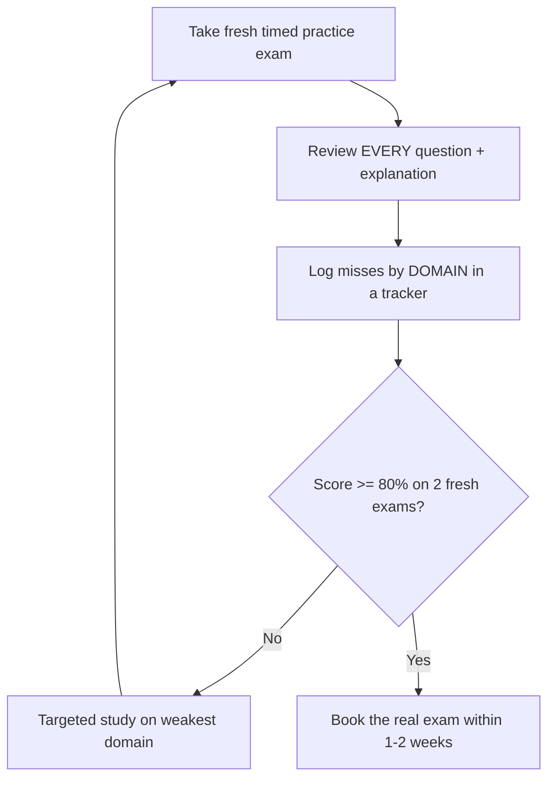

---

## 12. Countdown Checklist

| When | Do this |
|---|---|
| **Two weeks out** | Book the exam (commitment forces focus). Choose center vs online. Run the OnVUE **system test** on your real machine/network. Start daily fresh practice exams; track domain weaknesses. |
| **One week out** | Drill the 8 cheat-sheet tables until reproducible from memory. Re-read all explanations for missed questions. Confirm ID matches your registration name *exactly*. Prepare exam room (clear desk, second monitor unplugged). |
| **Day before** | Light review only (cheat sheets, keyword decoder). **No cramming new topics** — sleep matters more. Confirm time zone of the booking. Charge laptop / test webcam + mic again. Lay out two valid IDs. |
| **Exam morning** | Eat. Clear and photograph your room. Close all apps; reboot the machine. Check in **30 minutes early**. Bathroom *before* check-in (no breaks). Have IDs ready. Deep breath — you've drilled this. |

> 📝 **Tip:** For online proctoring, **log in 30 minutes early**. Late check-in can forfeit the exam and the fee. The check-in (ID photos, room scan, proctor handoff) genuinely takes 15–20 minutes.

---

## 13. Recommended Order for Both Certs

> 💡 **Intuition:** There is large overlap (~60%) between DVA-C02 and SAA-C03 — IAM, S3, VPC basics, Lambda, DynamoDB, monitoring. Taking them **close together** lets you amortize that shared study.

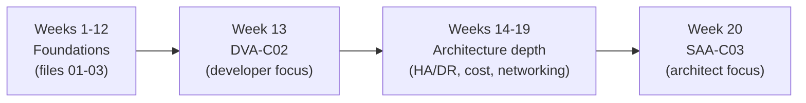

**Recommended: DVA-C02 first (~Week 13), then SAA-C03 (~Week 20).**

> 🎯 **Key Insight — why DVA first:**
> - DVA is **narrower and more concrete** (SDK, deployment, a defined set of services), making it a gentler first certification exam and a confidence builder.
> - DVA's deep dive into IAM, encryption (KMS), Lambda, DynamoDB, and API Gateway **directly feeds** the SAA security and integration domains.
> - SAA is **broader** (whole-architecture trade-offs across more services), so doing it second lets you build *on top of* a solid developer-service foundation rather than learning services and architecture simultaneously.
> - The ~7-week gap lets you layer **architecture-specific** topics (DR strategies, multi-account, advanced networking, cost optimization) that DVA doesn't emphasize.

> 📝 **Tip:** If your job is purely architecture/pre-sales and you'll never write code, you can invert the order (SAA first). For most engineers, **DVA → SAA** is the smoother ramp.

---

## 📊 Cheat Sheet

**Keyword → answer (memorize):**

| Keyword | Answer |
|---|---|
| least operational overhead / fully managed | most managed/serverless option (Lambda, Fargate, DynamoDB, Aurora Serverless) |
| most cost-effective | Spot (interruptible) / lifecycle+Glacier (cold) / Savings Plans (steady) / serverless (spiky) |
| highly available | Multi-AZ + ASG + ELB |
| durable / don't lose data | S3 (11 nines), DynamoDB |
| decouple / buffer / retry | SQS |
| fan-out / notify many | SNS |
| route events by content / SaaS | EventBridge |
| real-time / ordered / replay | Kinesis Data Streams |
| microsecond DynamoDB reads | DAX |
| in-memory cache / session | ElastiCache |
| rotate secrets automatically | Secrets Manager |
| free hierarchical config | Parameter Store |
| global low-latency HTTP | CloudFront |
| static IP / non-HTTP / instant failover | Global Accelerator |
| private S3/DynamoDB access, free | Gateway endpoint |
| private access to other AWS APIs | Interface endpoint |
| block a malicious IP | NACL deny (SG can't deny) |
| user auth / JWT / social | Cognito User Pool |
| temp AWS creds for app users | Cognito Identity Pool |
| single-tenant customer HSM | CloudHSM |
| encrypt at rest, managed keys | KMS / SSE-KMS |

**Trap reminders:**

| Trap | Truth |
|---|---|
| RDS Multi-AZ scales reads | **No** — Multi-AZ = HA; read replicas = read scaling |
| Read replica auto-fails-over | **No** — manual promotion, async |
| Reserved concurrency stops cold starts | **No** — that's Provisioned concurrency |
| SG can deny an IP | **No** — SG allows only; use NACL deny |
| Lambda can run > 15 min | **No** — use Fargate/EC2/Step Functions |
| Gateway endpoint works for any service | **No** — only S3 & DynamoDB |
| Bucket policy encrypts objects | **No** — it can *enforce* encryption; SSE encrypts |

**Capacity formulas:**

$$\text{WCU} = \lceil \text{item KB} / 1 \rceil \times \text{writes/s}; \qquad \text{RCU} = \lceil \text{item KB} / 4 \rceil \times \text{reads/s (strong; } \times \tfrac{1}{2}\text{ for eventual)}$$

**Exam mechanics:** 65 q / 130 min / pass 720 of 1000 / 15 unscored / ~2 min per q / aim ≥ 33 done by 60 min / flag-and-review in 3 passes / never blank.

---

## ❓ Knowledge Check

**1.** What is the passing score for both DVA-C02 and SAA-C03, and out of what total?

Show answer

**720 out of 1000.** Scaled (compensatory) scoring, so it does not equal 72% raw correct — roughly 70–75% of scored questions. 15 of 65 questions are unscored.

**2.** A question asks for the solution with the "LEAST operational overhead." Two options both work; one uses EC2 + cron, the other uses Lambda + EventBridge schedule. Which do you pick and why?

Show answer

**Lambda + EventBridge schedule.** "Least operational overhead" points to the *more managed/serverless* option. EC2 + cron requires patching, scaling, and managing a server.

**3.** Explain the difference between RDS Multi-AZ and RDS Read Replicas.

Show answer

**Multi-AZ** = high availability: a synchronous standby in another AZ with automatic failover; the standby does **not** serve reads. **Read Replicas** = read scaling: asynchronous copies that serve read traffic but require **manual promotion** and may lag (potential data loss on failover). For HA *and* read scaling, use **both**.

**4.** Why does "reserved concurrency" not fix Lambda cold starts, and what does?

Show answer

**Reserved concurrency** only *caps/guarantees* the number of concurrent executions from the account pool — it does not keep environments initialized. **Provisioned concurrency** pre-initializes a set number of environments, eliminating cold-start latency for those.

**5.** You see DynamoDB throttling while total provisioned capacity is not exhausted. What's the cause and fix?

Show answer

**Hot partition** — too many requests hit one partition key value. Capacity is allocated per partition (by key). Fix: choose a **high-cardinality partition key** or apply **write sharding**; on-demand mode can also absorb uneven load.

**6.** Which VPC endpoint type is free and for which two services?

Show answer

**Gateway endpoint**, free, for **S3 and DynamoDB only** (route-table based). All other services use **interface endpoints** (PrivateLink, ENI-based, charged hourly + per GB).

**7.** A scenario needs "the same message delivered to email, an SQS queue, and an HTTPS endpoint simultaneously." Which service?

Show answer

**SNS** (pub/sub fan-out to multiple subscriber types). SQS is a single consumer-group buffer; Kinesis is streaming.

**8.** On a "choose TWO" cost-optimization question, why is selecting "Spot Instances" wrong for a steady 24/7 production workload?

Show answer

**Spot can be interrupted** with two minutes' notice; it suits fault-tolerant/interruptible batch, not always-on production. For steady load, use **Savings Plans / Reserved Instances** plus right-sizing.

**9.** Why must you take *fresh* practice exams (not retake the same one) before booking?

Show answer

Retaking the same exam measures **memorization of that exam**, not knowledge. Fresh exams under timed conditions give a valid readiness signal. Target **≥ 80% on two different fresh exams**.

**10.** During online proctoring, name three things that can void your exam.

Show answer

Any of: a **second monitor** connected, **another person** entering the room, **leaving your seat** / looking away repeatedly, **paper/phone/notes** on the desk, **talking/reading aloud**, **face or ears obscured**, or **late check-in**.

**11.** What does "durable" point to versus "highly available"?

Show answer

**Durable** = data won't be lost (S3 = 11 nines, DynamoDB) — about *not losing* data. **Highly available** = reachable despite failures (Multi-AZ, ELB, ASG) — about *uptime*. They are different axes.

**12.** Which service automatically rotates RDS credentials, and which only stores them cheaply?

Show answer

**Secrets Manager** = automatic rotation (paid). **SSM Parameter Store** (SecureString) = cheap/free storage but **no native rotation**.

---

## 🏋️ Exercises

**Exercise 1 (easy).** For each keyword, write the single service it most strongly implies: (a) "fan-out", (b) "decouple", (c) "real-time ordered replay", (d) "microsecond DynamoDB reads", (e) "static IP, instant regional failover".

Show solution

(a) **SNS** — pub/sub fan-out.
(b) **SQS** — queue/buffer.
(c) **Kinesis Data Streams** — ordered, replayable, real-time.
(d) **DAX** — DynamoDB in-memory accelerator.
(e) **Global Accelerator** — anycast static IPs, L4 failover.

**Exercise 2 (easy–medium).** A company stores 50 TB of logs. Logs are queried heavily for 7 days, occasionally for 90 days, then must be retained for 5 years for compliance but almost never read. Design the most cost-effective S3 lifecycle.

Show solution

- Days 0–7: **S3 Standard** (frequent queries).
- Day 8–90: transition to **S3 Standard-IA** (infrequent access, lower storage cost).
- After 90 days: transition to **S3 Glacier Flexible Retrieval** (or **Glacier Deep Archive** for the cheapest, since "almost never read" and retrieval latency is acceptable for compliance).
- Retain until **5 years**, then **expire/delete** via lifecycle rule.

Keyword logic: tiered, predictable access pattern + "most cost-effective" → **S3 lifecycle transitions**. If access were *unpredictable*, you'd use **Intelligent-Tiering** instead.

**Exercise 3 (medium).** Calculate DynamoDB capacity. A table receives 500 reads/second of 9 KB items (strongly consistent) and 100 writes/second of 2.5 KB items. How many RCUs and WCUs?

Show solution

**RCU (strongly consistent, 4 KB units):**
$$\lceil 9\text{KB}/4\text{KB}\rceil = 3 \text{ RCU/read}; \quad 3 \times 500 = \mathbf{1500\ RCU}.$$

**WCU (1 KB units):**
$$\lceil 2.5\text{KB}/1\text{KB}\rceil = 3 \text{ WCU/write}; \quad 3 \times 100 = \mathbf{300\ WCU}.$$

(If reads were *eventually consistent*, RCU halves: each RCU covers 8 KB/s, so $\lceil 9/4 \rceil = 3$ then $\times \tfrac12$ rounded → still compute per 8 KB: $\lceil 9/8 \rceil = 2$ per read → $2 \times 500 = 1000$ "read units", i.e., 500 RCU since 1 RCU = 2 eventual reads of 4 KB. Strong consistency is the safe exam default unless stated.)

**Exercise 4 (medium).** Apply the elimination technique. *"A company needs to run an unpredictable, spiky API workload with the LEAST operational overhead and pay only for actual usage."* Options: (A) EC2 ASG behind ALB; (B) Lambda behind API Gateway; (C) ECS on EC2; (D) a single large EC2 instance. Walk through elimination.

Show solution

- **Qualifiers:** spiky/unpredictable, least operational overhead, pay-per-use.
- **D** — single instance: no scaling for spikes, you pay 24/7, you manage it. Eliminate.
- **A** — ASG+ALB: scales but you manage AMIs/patching/capacity; you pay for running instances even at low traffic. Higher overhead + not pure pay-per-use. Eliminate.
- **C** — ECS on EC2: still managing the EC2 capacity. Eliminate (ECS on **Fargate** would be closer, but it's "on EC2" here).
- **B** — Lambda + API Gateway: **automatic scaling for spikes, no servers, pay per request**. ✅

**Answer: B.** It uniquely satisfies all three qualifiers.

**Exercise 5 (medium–hard).** "Choose TWO." *"A company must make a single-AZ RDS MySQL database both survive an AZ failure with automatic failover AND reduce read latency for a reporting dashboard that runs heavy SELECTs."* Identify the two correct actions and explain why two single-purpose distractors are wrong.

Show solution

**Correct two:**
1. **Enable Multi-AZ** → automatic failover, survives AZ loss (HA).
2. **Add a Read Replica** and point the reporting dashboard at it → offloads heavy SELECTs (read scaling).

**Why these two and not others:**
- "Increase the instance class" — may help reads short-term but doesn't add AZ failover and isn't the scaling pattern AWS expects. Single-purpose at best.
- "Enable storage autoscaling" — addresses storage capacity, not HA or read load. Irrelevant to both requirements.

The question has **two distinct requirements** (HA + read scaling), and the trap is picking two flavors of one requirement. Map **one action per requirement**: Multi-AZ ↔ HA, Read Replica ↔ read scaling.

**Exercise 6 (hard).** Design a readiness plan. You score 64% on your first fresh Tutorials Dojo SAA exam, with weakest domains being "Resilient Architectures" and "Cost-Optimized Architectures." You exam in 3 weeks. Write a concrete week-by-week plan.

Show solution

- **Week 1 (knowledge repair):** Re-study DR strategies (Backup&Restore → Pilot Light → Warm Standby → Active/Active; RTO/RPO trade-offs) and cost levers (Savings Plans vs RIs vs Spot; S3 storage classes & lifecycle; right-sizing). Re-read the §6.2 and §6.3 frameworks. Take **one** fresh practice exam at end of week; review **every** question.
- **Week 2 (drill + breadth):** Take 2–3 fresh exams across all domains; log misses by domain in a tracker. Reproduce the §9 cheat-sheet tables from memory daily. Target lifting the two weak domains above 70%. Confirm OnVUE system test / book exam if not booked.
- **Week 3 (taper + confirm readiness):** Take 2 fresh exams early in the week; require **≥ 80% on both**. Spend remaining days only on missed-question explanations and cheat sheets. Day before: light review, sleep. If still < 75%, reschedule (allowed up to 24 h before, no fee).

**Decision rule:** proceed only if ≥ 80% on two fresh exams with the two weak domains no longer the lowest. Otherwise use the no-fee reschedule.

---

## 🔗 Further Resources

### Free

- **AWS Skill Builder — Official Practice Question Sets** — 20 free official questions per exam in the real style; the closest free proxy to AWS's question writing. — https://skillbuilder.aws/
- **AWS Official Sample Question PDFs** — short official sample sets for DVA-C02 and SAA-C03; linked from each exam's page. — https://aws.amazon.com/certification/ (navigate to the specific exam → "Exam guide" / "Sample questions")
- **AWS Exam Guides (DVA-C02 & SAA-C03)** — the authoritative domain/task breakdown; study to the published outline. — https://aws.amazon.com/certification/certified-developer-associate/ and https://aws.amazon.com/certification/certified-solutions-architect-associate/
- **ExamTopics** — large free question bank; **verify answers in the discussion tab**, as the marked "suggested answer" is frequently wrong. Use for volume + community reasoning, not as ground truth. — https://www.examtopics.com/
- **AWS Whitepapers** — *Well-Architected Framework*, *AWS Disaster Recovery* whitepaper — free and directly mirror exam reasoning. — https://aws.amazon.com/architecture/well-architected/

### Paid (worth it)

- **Tutorials Dojo — Jon Bonso Practice Exams (DVA-C02 / SAA-C03)** ★★★★★ — the gold standard; explanations are exam-grade and often teach more than courses. Best single paid resource for *passing*. Timed + review modes. — https://tutorialsdojo.com/
- **Stephane Maarek — Practice Exams (Udemy)** ★★★★☆ — solid second question bank for rotation; pairs well with his video courses. Slightly easier than the real exam in places. — https://www.udemy.com/ (search "Maarek AWS practice exams")
- **Tutorials Dojo — Study Guide eBooks / cheat sheets** ★★★★☆ — dense, exam-targeted reference that complements the practice exams. — https://tutorialsdojo.com/
- **Adrian Cantrill courses** ★★★★★ — deepest conceptual video courses if your *knowledge* (not just test-taking) needs shoring up before drilling questions. — https://learn.cantrill.io/

> 📝 **Tip:** The highest-ROI combination for *passing*: a solid video course for knowledge (Cantrill/Maarek) **plus Tutorials Dojo practice exams** for test-taking, reviewing every explanation. Use ExamTopics only for extra volume, always cross-checking the discussion.

---

## ➡️ What's Next

Lock in your schedule and begin the disciplined run-up to exam day → [MASTER-STUDY-PLAN.md](../MASTER-STUDY-PLAN.md)
