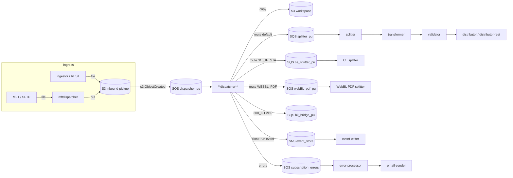
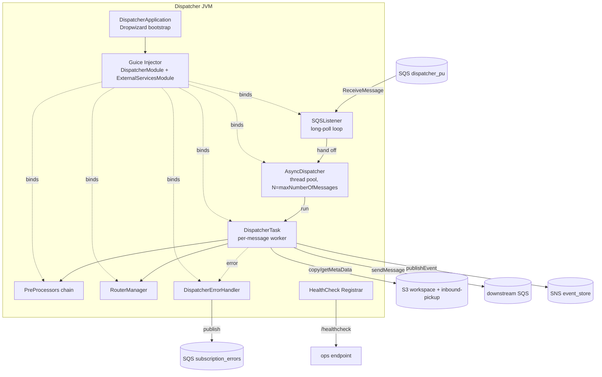
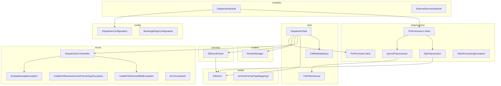
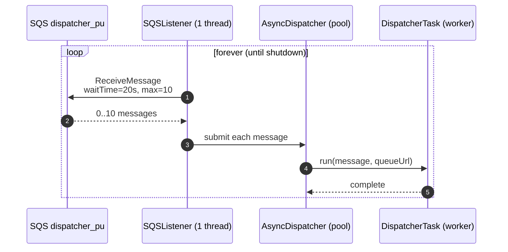
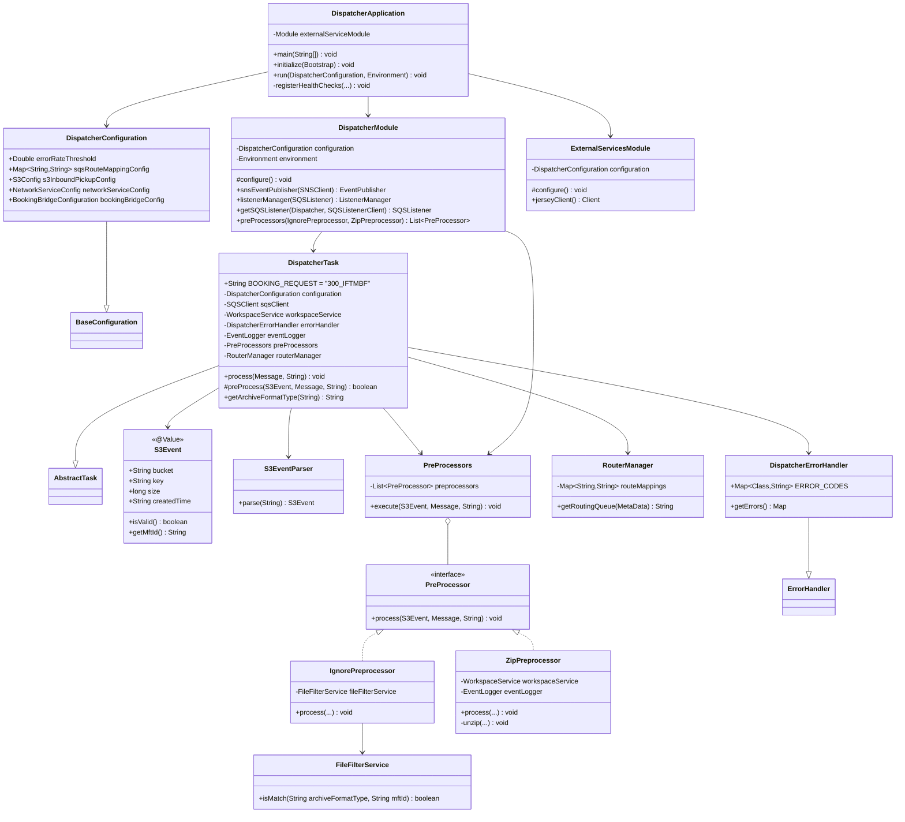
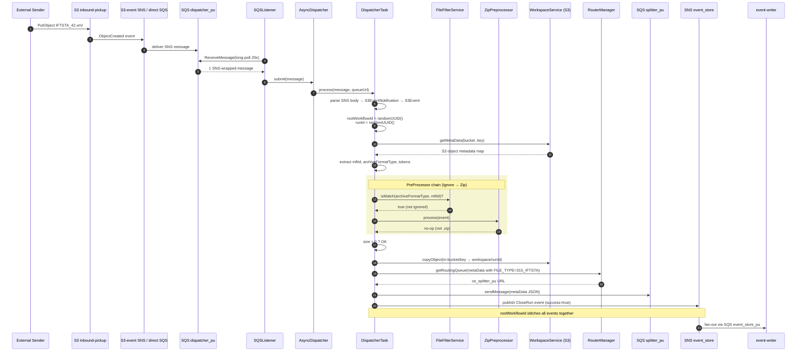

# Dispatcher Module — Architecture & Design

> **Author:** Principal Engineering Review · **Date:** 2026-05-24 · **Module Version:** `com.inttra.mercury.appian-way:dispatcher:1.0`

---

## 1. Executive Summary

The **Dispatcher** is the *entry gatekeeper* of the Mercury (Appian Way) inbound pipeline. Once a customer file lands in the **inbound S3 bucket**, S3 raises an `s3:ObjectCreated:*` event that fans out (through SNS or direct SQS notification) to the dispatcher's input queue. The dispatcher does four things, in order:

1. **Parses** the SNS-wrapped S3 event into a `S3Event` POJO.
2. **Filters & expands** the payload via a chain of `PreProcessor`s — currently an `IgnorePreprocessor` (drop irrelevant files based on `(format, mftId)` filters) and a `ZipPreprocessor` (explode `.zip` archives back into S3 so each child gets its own S3 event).
3. **Copies** valid (non-zero-byte) files from the *inbound* bucket to the **workspace** bucket under a fresh `rootWorkflowId/runId` key (canonical handoff between pipeline stages).
4. **Routes** the message: it consults `sqsRouteMappingConfig` keyed by `archiveFormatType` (e.g. `315_IFTSTA`, `WEBBL_PDF`, `default`) to pick the correct downstream queue (splitter / CE splitter / WebBL PDF splitter / **bookingBridge** for `300_IFTMBF`) and publishes a `MetaData` envelope there.

It runs as a Dropwizard 4 service with Guice DI, AWS SDK v1 for SQS/S3/SNS, and a long-polling `SQSListener` feeding an `AsyncDispatcher` thread pool. Every successful (or failed) handoff is recorded as a **CloseRun** event on the Mercury event-store SNS topic, providing end-to-end traceability via the `rootWorkflowId`.

The dispatcher is, deliberately, a *thin* component — it does no business validation, no transformation, no splitting of message content. Its job is correctness of routing and correctness of the workflow envelope. Everything semantically heavier happens downstream.

---

## 2. Position in the Mercury Pipeline



**Upstream producers:** [ingestor](../../ingestor/), [mftdispatcher](../../mftdispatcher/) (both land files in `${PROFILE}-${ENV}-inbound-pickup`); raw S3 PutObject from external systems.

**Downstream consumers:** [splitter](../../splitter/), [structuralvalidator](../../structuralvalidator/) (via splitter queues), the booking-bridge (out-of-pipeline), and [event-writer](../../event-writer/) (via SNS).

---

## 3. High-Level Architecture



**Bootstrap.** [`DispatcherApplication`](../src/main/java/com/inttra/mercury/dispatcher/DispatcherApplication.java) extends `io.dropwizard.core.Application<DispatcherConfiguration>`. In `initialize()` it installs `S3ConfigurationProvider` (so the YAML can live in S3 in higher environments) and registers the shared `ConfigProcessingServerCommand` — the custom `run` command that resolves `${...}` placeholders from properties files passed on the command line *before* Dropwizard validates the YAML.

**Wiring.** `run()` builds a Guice `Injector` from two modules:
- [`ExternalServicesModule`](../src/main/java/com/inttra/mercury/dispatcher/modules/ExternalServicesModule.java) — AWS clients (`AmazonSQS`, `AmazonS3`, `AmazonSNS`), Jersey `Client`, network-services (auth, IntegrationProfile, IntegrationProfileFormat), Parameter Store, retry policies.
- [`DispatcherModule`](../src/main/java/com/inttra/mercury/dispatcher/modules/DispatcherModule.java) — domain bindings: `Dispatcher → AsyncDispatcher`, `WorkspaceService → S3WorkspaceService`, route map, preprocessor list, `SQSListener`, `EventPublisher → SNSEventPublisher`, `ListenerManager`.

**Lifecycle.** Dropwizard's `environment.lifecycle().manage(listenerManager)` ties the SQS listener to the JVM lifecycle so `Ctrl-C` / SIGTERM cleanly drains in-flight work.

**Health.** [`DispatcherApplication.registerHealthChecks`](../src/main/java/com/inttra/mercury/dispatcher/DispatcherApplication.java#L70-L85) registers split read/write health checks (Inbound SQS, S3 read, error-rate threshold, outbound SQS error queue, S3 write to workspace, SNS publish). These flow through `HealthCheckRegistrar.registerDefaultAndOpsHealthChecks` so the ops admin port exposes them separately from the standard liveness endpoint.

---

## 4. Low-Level Design



**Package layout** (`com.inttra.mercury.dispatcher.*`):

| Package | Responsibility |
|---|---|
| `config` | Dropwizard `Configuration` POJOs — `DispatcherConfiguration`, `BookingBridgeConfiguration`. |
| `modules` | Guice modules — `DispatcherModule` (domain), `ExternalServicesModule` (AWS + network services). |
| `task` | `DispatcherTask` (per-message worker, extends shared `AbstractTask`), `FileFilterService`, `S3MetaDataKeys`. |
| `preprocessor` | Strategy chain for early processing — interface `PreProcessor`, runner `PreProcessors`, `IgnorePreprocessor`, `ZipPreprocessor`, and the `AbortProcessingException` sentinel that short-circuits the chain. |
| `routers` | `RouterManager` — pure function from `MetaData.FILE_TYPE` to destination SQS URL. |
| `services` | `S3EventParser` — wraps the AWS `S3EventNotification.parseJson` SDK helper. |
| `errors` | `DispatcherErrorHandler` (extends shared `ErrorHandler`) plus three checked-style runtime exceptions and `ErrorConstants` (metric names). |
| `model` | `S3Event` (Lombok `@Value` immutable POJO) and `ArchiveFormatTypeMappings`. |

**Threading model.**



The `AsyncDispatcher` is bound with `pickupSqsConfig.getMaxNumberOfMessages()` as its parallelism (default **10**). This caps in-flight messages per pull and matches SQS's max-batch size, so the listener never holds invisible messages beyond what the pool can drain inside SQS's visibility-timeout window.

---

## 5. Key Classes — Class Diagram



---

## 6. Data Flow Diagram

The end-to-end happy path for a single inbound file (assume `S3 PUT s3://aaa001-dev-inbound-pickup/315_IFTSTA/20260524/carriers/carrier-x/IFTSTA_42.xml`):



**Variants:**

| Variant | Trigger | Path divergence |
|---|---|---|
| **ZIP archive** | `key` ends with `.zip` | `ZipPreprocessor` explodes into individual S3 objects (each rewritten with the same `rootWorkflowId` metadata), then throws `AbortProcessingException` to short-circuit the parent — each child file fires its own S3 event and re-enters the pipeline. |
| **Ignored file** | `FileFilterService.isMatch` returns `false` | `IgnorePreprocessor` throws `AbortProcessingException`; the task returns silently. No CloseRun event is published. |
| **Booking-bridge (300_IFTMBF)** | `archiveFormatType == BOOKING_REQUEST` after preprocess returns abort | Special branch: sends `MetaData` to `bookingBridgeConfig.queueUrl` *only when* `XLOG_ID` token is present. |
| **Empty file** | `S3Event.size == 0` | Throws `EmptyMessageException` → caught, error handler publishes failure CloseRun + posts to `sqs_subscription_errors`. |
| **Bad path** | `key.split("/").length != 5` | Throws `UnableToResolveArchiveFormatTypeException` / `UnableToResolveMftIdException` → error path. |
| **SQS / S3 / SNS unavailable** | Health checks fail | `/healthcheck` endpoint goes RED; orchestrator (ECS) restarts the task; SQS message becomes visible again after timeout. |

---

## 7. Component Dependencies

```mermaid
graph TB
    subgraph Mercury_Modules
        DISP[dispatcher]
        SHA[shared]
        ST[schema-beans]
        FT[functional-testing test-scope]
    end

    subgraph External_Libraries
        DW[Dropwizard 4.0.16<br/>core]
        GUI[Guice 7.0.0]
        AWS[AWS SDK v1 1.12.720<br/>sqs, s3, sns]
        GUA[Guava 33.1.0]
        LOM[Lombok 1.18.32]
        JBX[JAXB API 2.3.1]
        DMG[Dropwizard metrics-annotation]
        PML[Palomino metrics-guice]
        SLF[SLF4J / Logback]
    end

    subgraph AWS_Services
        SQSIN[(SQS dispatcher_pu)]
        SQSOUT[(SQS splitter_*_pu)]
        SQSERR[(SQS subscription_errors)]
        S3I[(S3 inbound-pickup)]
        S3W[(S3 workspace)]
        SNSE[(SNS event_store)]
        PS[(SSM Parameter Store)]
    end

    subgraph Mercury_Network_Services
        NS[Network Services<br/>auth + IntegrationProfile]
    end

    DISP -->|mercury-shared| SHA
    DISP -->|test deps| FT
    SHA -.->|reuse beans| ST

    DISP --> DW
    DISP --> GUI
    DISP --> AWS
    DISP --> GUA
    DISP --> LOM
    DISP --> JBX
    DISP --> DMG
    DISP --> PML
    DISP --> SLF

    DISP -->|listener| SQSIN
    DISP -->|publish| SQSOUT
    DISP -->|errors| SQSERR
    DISP -->|read/copy| S3I
    DISP -->|write| S3W
    DISP -->|publish events| SNSE
    DISP -->|read secrets| PS
    DISP -->|REST calls| NS
```



**Key mercury-internal coupling.**

| Dependency | Used for | Source |
|---|---|---|
| `mercury-shared:1.0` | `Application` base, `BaseConfiguration`, `S3Config`, `SQSConfig`, `NetworkServiceConfig`, `RecoveryConfig`, `AWSClientConfiguration`, `S3ConfigurationProvider`, `ConfigProcessingServerCommand`, `SQSListener`, `SQSListenerClient`, `SQSClient`, `ListenerManager`, `AsyncDispatcher`, `TaskFactory`, `AbstractTask`, `MetaData` (+`Builder`/Projection), `EventLogger`, `EventPublisher`/`SNSEventPublisher`, `RandomGenerator`, `Event` (token names), `SNSNotification`, `WorkspaceService`/`S3WorkspaceService`, `ErrorHandler` base, `ErrorHelper`, all health-checks, `ParameterStoreModule`, `NetworkRetryerModule`, `IntegrationProfileService`, `IntegrationProfileFormatService`, `AuthClient`. | `shared` module |
| `functional-testing` (test) | E2E and contract tests | `functional-testing` module |

---

## 8. Configuration & Validation

### 8.1 [`DispatcherConfiguration`](../src/main/java/com/inttra/mercury/dispatcher/config/DispatcherConfiguration.java) — Jakarta Bean Validation

| Field | Type | Constraint | Bound from YAML |
|---|---|---|---|
| `errorRateThreshold` | `Double` | `@NotNull`, `@Digits(integer = 2, fraction = 2)` | `errorRateThreshold` |
| `sqsRouteMappingConfig` | `Map<String,String>` | `@NotNull` (entries are not individually validated) | `sqsRouteMappingConfig` |
| `s3InboundPickupConfig` | `S3Config` (from shared) | `@NotNull` (nested `@Valid` via Dropwizard default) | `s3InboundPickupConfig` |
| `networkServiceConfig` | `NetworkServiceConfig` | `@NotNull` | `networkServiceConfig` |
| `bookingBridgeConfig` | `BookingBridgeConfiguration` | `@NotNull` | `bookingBridgeConfig` |
| *(inherited)* | from [`BaseConfiguration`](../../shared/src/main/java/com/inttra/mercury/shared/config/BaseConfiguration.java) | `componentName`, `sqsPickupConfig`, `sqsErrorConfig`, `snsEventConfig`, `s3WorkspaceConfig`, Dropwizard `server`, `logging`, `metrics` |

> Dropwizard validates the configuration object graph at startup via Hibernate Validator (configured by `bootstrap.getValidatorFactory()`). Any missing required field or constraint violation fails fast **before** any thread starts — the JVM exits non-zero, which ECS treats as a failed deploy.

### 8.2 [`dispatcher.yaml`](../conf/dispatcher.yaml) — full schema

| YAML key | Type | Default | Required | Description |
|---|---|---|---|---|
| `componentName` | string | `dispatcher` | yes | Identifier put on every event payload — keep it stable, it is grepped in Datadog/CloudWatch. |
| `errorRateThreshold` | double | `5.0` | yes | 5-min moving average errors-per-second; above this the health check fails. |
| `sqsPickupConfig.queueUrl` | string | — | yes | Inbound SQS URL (must resolve from `${dispatcher.sqsDispatcherConfig.queueUrl}`). |
| `sqsPickupConfig.waitTimeSeconds` | int | `20` | no | SQS long-poll wait. Keep at 20 (cost / throughput sweet spot). |
| `sqsPickupConfig.maxNumberOfMessages` | int | `10` | no | Batch size and pool parallelism. |
| `sqsRouteMappingConfig.*` | map<string,string> | `315_IFTSTA→ce_splitter_pu, WEBBL_PDF→webBL_pdf_pu, default→splitter_pu` | yes | Routing table indexed by `archiveFormatType`. **Add a new entry for every new file family.** |
| `sqsErrorConfig.queueUrl` | string | — | yes | DLQ-like queue for subscription errors. |
| `snsEventConfig.topicArn` | string | — | yes | Event-store SNS topic (fans out to event-writer + ingestor). |
| `s3WorkspaceConfig.bucket` | string | — | yes | Where copied files land. |
| `s3InboundPickupConfig.bucket` | string | — | yes | Where uploaded files arrive. |
| `networkServiceConfig.networkBaseUrl` | string | — | yes | Mercury Network REST root. |
| `networkServiceConfig.authEndpointUrl` | string | — | yes | OAuth2 token endpoint. |
| `networkServiceConfig.clientId` / `clientSecret` | string | — | yes | Resolved from SSM Parameter Store via `ParameterStoreModule`. |
| `networkServiceConfig.servicePaths.integrationProfileServicePath` | string | — | yes | Path used by `IntegrationProfileService`. |
| `networkServiceConfig.servicePaths.integrationProfileFormatServicePath` | string | — | yes | Path used by `IntegrationProfileFormatService`. |
| `server.connector.port` | int | `8081` | no | Application HTTP admin port (Dropwizard `simple` server). |
| `logging.level` | string | `INFO` | no | Root logger level. |
| `metrics.frequency` | duration | — | yes | Reporter frequency for Datadog/CloudWatch metrics. |
| `bookingBridgeConfig.queueUrl` | string | — | yes | Special-case queue for `300_IFTMBF` (booking) messages with an `XLOG_ID` token. |

### 8.3 [`dispatcher.properties`](../conf/dispatcher.properties) (template, env-vars expand at runtime)

```properties
componentName=dispatcher
dispatcher.sqsDispatcherConfig.queueUrl=https://sqs.us-east-1.amazonaws.com/081020446316/${PROFILE}_${ENV}_sqs_dispatcher_pu
dispatcher.sqsSplitterConfig.queueUrl=https://sqs.us-east-1.amazonaws.com/081020446316/${PROFILE}_${ENV}_sqs_splitter_pu
dispatcher.sqsErrorSubscriptionConfig.queueUrl=https://sqs.us-east-1.amazonaws.com/081020446316/${PROFILE}_${ENV}_sqs_subscription_errors
dispatcher.snsEventConfig.topicArn=arn:aws:sns:us-east-1:081020446316:${PROFILE}_${ENV}_sns_event_store
dispatcher.s3WorkspaceConfig.bucket=${PROFILE}-${ENV}-workspace
dispatcher.s3InboundPickupConfig.bucket=${PROFILE}-${ENV}-inbound-pickup
server.connector.port=0
```

`${PROFILE}` is the developer's INTTRA ID or `int`/`prod` profile, `${ENV}` is `dev`/`qa`/`int`/`prod`. The YAML's `${...:-default}` syntax falls back to defaults when a property is missing.

### 8.4 Environment variables

| Variable | Required | Purpose |
|---|---|---|
| `PROFILE` | yes | First segment of resource names (`aaa001_dev_sqs_...`). |
| `ENV` | yes | Second segment of resource names. |
| `AWS_ACCESS_KEY_ID` / `AWS_SECRET_ACCESS_KEY` | yes (locally) | Resolved from IAM Role in ECS. |
| `AWS_REGION` | yes | `us-east-1`. |
| `-Dcontivo.runtime.classpath` | no (transformer-only) | Not used by dispatcher. |

---

## 9. Maven Dependencies

From [`pom.xml`](../pom.xml):

| GroupId | ArtifactId | Version | Scope | Purpose |
|---|---|---|---|---|
| `com.inttra.mercury.shared` | `mercury-shared` | `1.0` | compile | Mercury platform base (see §7). |
| `org.projectlombok` | `lombok` | `1.18.32` | provided | `@Getter`/`@Setter`/`@Value`/`@Slf4j`. |
| `io.dropwizard` | `dropwizard-core` | `4.0.16` | compile | Application framework, Jackson, Jersey, Jetty (SnakeYAML excluded — shared brings a managed version). |
| `com.amazonaws` | `aws-java-sdk-sqs` | `1.12.720` | compile | SQS client (sometimes the only direct AWS jar — others come transitively via `shared`). |
| `com.google.inject` | `guice` | `7.0.0` | compile | DI container. |
| `com.google.guava` | `guava` | `33.1.0-jre` | compile | Immutable collections, helpers. |
| `io.dropwizard.metrics` | `metrics-annotation` | `4.2.37` | compile | `@Timed`, `@Metered`, `@ExceptionMetered`. |
| `com.palominolabs.metrics` | `metrics-guice` | `3.1.3` | compile | AOP wrapper that wires metric annotations through Guice. |
| `org.assertj` | `assertj-core` | `3.19.0` | test | Fluent assertions. |
| `com.inttra.mercury.test` | `functional-testing` | `1.0` | test | Shared functional-test harness. |
| `junit` | `junit` | `4.13.2` | test | Test framework. |
| `org.mockito` | `mockito-core` | `2.27.0` | compile (sic) | Should be test-scope — see §13. |

**Build plugins**

| Plugin | Version | Purpose |
|---|---|---|
| `maven-compiler-plugin` | inherited | Java 17 target, force-javac. |
| `maven-shade-plugin` | `2.3` | Builds an uber-jar with `DispatcherApplication` as `Main-Class`; excludes signed JAR manifest entries (`META-INF/*.SF/.DSA/.RSA`); `ServicesResourceTransformer` merges `META-INF/services` (critical for AWS SDK and Jersey SPI). |

The aggregator [`pom.xml`](../../pom.xml) pins versions in `<properties>` so module POMs reference `${io.dropwizard.version}`, `${aws-java-sdk.version}`, etc.

---

## 10. How the Module Works — Detailed Walkthrough

Trace a single `IFTSTA` upload from S3 to a downstream queue.

1. **JVM start.** [`DispatcherApplication.main`](../src/main/java/com/inttra/mercury/dispatcher/DispatcherApplication.java#L40) calls `run(args)`. Args come from the Dockerfile `CMD` or IntelliJ run config: `run dispatcher.yaml dispatcher.properties network-services.properties datadog.properties`.

2. **Configuration assembly.** The custom `ConfigProcessingServerCommand` (in shared) reads the YAML *from the classpath* (it's stamped into the jar by `maven-shade-plugin`), the properties files from disk/S3, and resolves `${...}` placeholders via env-vars *then* properties. The merged YAML is parsed by Jackson and validated by Hibernate Validator. Any unresolved placeholder or `@NotNull` violation fails the bootstrap.

3. **Guice injector.** [`DispatcherApplication.run`](../src/main/java/com/inttra/mercury/dispatcher/DispatcherApplication.java#L55-L67) constructs `Guice.createInjector(externalServiceModule, new DispatcherModule(cfg, env))`. `ExternalServicesModule` binds AWS SDK clients with the per-purpose `AWSClientConfiguration` profiles (`sqs_listener`, `sqs_sender`, `s3_read_put_copy`, `sns_publish`) — these tune timeouts and connection pool sizes for each AWS service distinctly.

4. **Listener registration.** Dropwizard's `environment.lifecycle().manage(listenerManager)` registers the `ListenerManager` (which wraps `SQSListener`) as a managed object. On `start()`, the listener kicks off its long-poll loop on a single dedicated thread.

5. **Health checks.** [`registerHealthChecks`](../src/main/java/com/inttra/mercury/dispatcher/DispatcherApplication.java#L70-L85) hooks read-side (Inbound SQS, S3 read, `ErrorThresholdHealthCheck` reading the `MESSAGES_FAILED_METRIC` meter) and write-side (outbound SQS, S3 write, SNS publish) into the standard *and* ops health endpoints. ECS uses the standard endpoint for task replacement; the ops endpoint feeds the network-level load balancer.

6. **Message pickup.** The listener calls SQS `ReceiveMessage` with `WaitTimeSeconds=20` and `MaxNumberOfMessages=10`. Each returned message is submitted to `AsyncDispatcher`, which is an `ExecutorService`-backed queue gated by a semaphore of size `maxNumberOfMessages` so the listener cannot overrun the worker pool. The dispatcher hands a fresh `DispatcherTask` instance (the `TaskFactory` lambda calls `taskProvider.get()` → Guice scope-per-call).

7. **Parsing & metadata.** [`DispatcherTask.process`](../src/main/java/com/inttra/mercury/dispatcher/task/DispatcherTask.java#L72-L147) JSON-deserializes the SNS envelope (`SNSNotification`) and the inner S3 event payload (`S3EventParser` → `S3Event`), generates `rootWorkflowId` and `runId` UUIDs, extracts `mftId` and `archiveFormatType` from the canonical 5-segment key (`format/yyyymmdd/role/partner/filename`), and pulls custom S3 object metadata.

8. **Preprocessor chain.** `PreProcessors.execute` iterates through `[IgnorePreprocessor, ZipPreprocessor]`. Either may throw `AbortProcessingException` to short-circuit downstream processing:
   - `IgnorePreprocessor` consults `FileFilterService.isMatch(formatType, mftId)`; mismatches are silently dropped (no events emitted).
   - `ZipPreprocessor` recognises `.zip` keys, streams S3 → `ZipInputStream`, and for each child entry: copies bytes back into the same S3 folder (sharing the `rootWorkflowId` via S3 metadata so the children are correlated), then emits a CloseRun event tagged with the original zip filename. After enumeration, it aborts the parent processing — the child put-events fire fresh S3 notifications and re-enter the pipeline naturally.

9. **Validity check.** If preprocess returns `true`, the task asserts `s3Event.isValid()` (`size > 0`); zero-byte files throw `EmptyMessageException`.

10. **Workspace copy.** [`copyInitialFileToWorkspace`](../src/main/java/com/inttra/mercury/dispatcher/task/DispatcherTask.java#L191) does a server-side S3 copy from inbound to workspace under the key `rootWorkflowId/runId`. This is the canonical handoff: subsequent stages only ever read from workspace.

11. **Routing & publish.** [`sendMessageAndPublishCloseRunEvent`](../src/main/java/com/inttra/mercury/dispatcher/task/DispatcherTask.java#L200-L206) calls `routerManager.getRoutingQueue(metaData)` (a lookup on `FILE_TYPE`), then `sqsClient.sendMessage(targetQueueUrl, metaData.toJsonString())`. Tokens `PICK_UP_QUEUE` and `DROP_OFF_QUEUE` are added so downstream services can attribute lineage.

12. **CloseRun event.** [`publishCloseRunEvent`](../src/main/java/com/inttra/mercury/dispatcher/task/DispatcherTask.java#L178-L189) logs a `START_WORKFLOW` event tagged with `success=true` to the SNS topic via `EventLogger` → `SNSEventPublisher`. Booking-bridge variant fires a parallel event when `XLOG_ID` is present.

13. **Acknowledge.** Returning normally signals the `AbstractTask` base to delete the original SQS message — this happens transparently in the shared layer.

14. **Error path.** Any uncaught `Exception` lands in the `catch` block, which assembles a failure `MetaData` (or falls back to `errorMetaData`) and hands it to `DispatcherErrorHandler.handleException`. The shared `ErrorHandler` maps the exception class to a slash-delimited error code (`/exception/dispatcher/business/messagePipeline/emptyFile`, etc.), enriches with `runId` + tokens, publishes a failure CloseRun event, and re-routes the original SQS body to the subscription-errors queue. The original message is then deleted from the input queue (poison-pill avoidance — the failure is now durable in the error queue).

---

## 11. Error Handling & Edge Cases

### 11.1 Exception map (handled)

| Exception | Code | Cause | Outcome |
|---|---|---|---|
| `EmptyMessageException` | `/exception/dispatcher/business/messagePipeline/emptyFile` | `S3Event.size == 0` | CloseRun(failure) + send body to error queue. |
| `UnableToResolveMftIdException` | `/exception/dispatcher/business/messagePipeline/unableToResolveMftId` | S3 key not in 5-segment canonical form | CloseRun(failure) + error queue. |
| `UnableToResolveArchiveFormatTypeException` | *(implicit, no map entry)* | Same as above but raised during ZIP processing | Wrapped runtime, caught generically, error queue. |

### 11.2 Edge cases (intentional behaviour)

| Scenario | Behaviour | Concern |
|---|---|---|
| File ignored by `FileFilterService` | Silent drop, no CloseRun event. | No observable record — relies on S3 audit logs. |
| ZIP with nested folder structure | Only top-level entries unzipped (`zis.getNextEntry()`); nested files keep their entry paths. | Deep archives could explode key counts. |
| ZIP containing duplicates | Last write wins (`putObject` is idempotent on key). | Workflow lineage potentially lost. |
| `300_IFTMBF` without `XLOG_ID` | Booking-bridge branch skipped, dispatcher still aborts (preprocess returned `false`). | Subtle: combined with `IgnorePreprocessor` rules — verify ordering. |
| Workspace copy succeeds but downstream send fails | `errorHandler` runs; workspace object is orphaned (no cleanup). | Background sweeper or TTL needed (not implemented here). |
| SNS event publish fails after SQS send | Inconsistent state: downstream sees the file but event-store does not. | At-least-once contract not strictly preserved across both sinks. |

### 11.3 Pool & visibility-timeout interplay

- Listener `waitTimeSeconds=20`, `maxNumberOfMessages=10`.
- AsyncDispatcher parallelism = 10.
- SQS default visibility timeout for these queues should be ≥ (max task time × 1.5). If a task hangs (e.g., S3 503), the message reappears and risks duplicate routing. The shared `RetryHelper` + idempotent S3 `copyObject` mitigate but downstream services must tolerate re-sends.

---

## 12. Operational Notes

### 12.1 [`Dockerfile`](../Dockerfile)

```dockerfile
FROM openjdk:8
ADD dispatcher/target/dispatcher-1.0-SNAPSHOT.jar /app/dispatcher-1.0-SNAPSHOT.jar
ADD dispatcher/conf/dispatcher.properties /app/dispatcher.properties
ADD configuration/int/network-services.properties /app/network-services.properties
ADD configuration/dev/datadog.properties /app/datadog.properties
CMD java -jar /app/dispatcher-1.0-SNAPSHOT.jar run dispatcher.yaml /app/dispatcher.properties /app/network-services.properties /app/datadog.properties
EXPOSE 8080 8081
```

> **Inconsistency:** Dockerfile uses `openjdk:8` while the parent POM targets Java 17 (`<java.version>17</java.version>`). The shaded jar built on Java 17 will not run on Java 8 — this Dockerfile is stale and must be updated to `eclipse-temurin:17-jre` (or similar) before the next deploy. *See §13.*

### 12.2 IntelliJ run

```
Main class:  com.inttra.mercury.dispatcher.DispatcherApplication
Program args: run dispatcher.yaml conf/dispatcher.properties ../configuration/int/network-services.properties ../configuration/dev/datadog.properties
Working dir:  ~/AppianWay/dispatcher
Env:          PROFILE=aaa001 ENV=dev AWS_REGION=us-east-1 + IAM creds
```

### 12.3 Build scripts

- [`build.sh`](../build.sh) — main build hook, invoked by CI.
- [`build_pr.sh`](../build_pr.sh) — PR build (likely includes tests + jacoco).
- [`run.sh`](../run.sh) — local launch wrapper.
- [`suppressions.xml`](../suppressions.xml) — OWASP dependency-check suppressions.

### 12.4 Observability

| Signal | Source | Notes |
|---|---|---|
| Metrics | Dropwizard `metrics` + `metrics-guice` AOP + Datadog reporter | `MESSAGES_FAILED_METRIC` feeds `ErrorThresholdHealthCheck`. |
| Logs | SLF4J 2.0.17 + Logback 1.5.21 | Pattern from `dispatcher.yaml` includes thread, logger, 3-line stack tail. |
| Traces | (none explicit — Datadog APM via agent JVM args if configured) | |
| Health | `/healthcheck` (admin port) + ops endpoint | Split read/write registrar from `shared`. |

### 12.5 IAM (minimum required)

- `sqs:ReceiveMessage`, `sqs:DeleteMessage`, `sqs:GetQueueAttributes` on `*_sqs_dispatcher_pu`.
- `sqs:SendMessage` on `*_sqs_splitter_pu`, `*_sqs_ce_splitter_pu`, `*_sqs_webBL_pdf_pu`, `*_sqs_bk_bridge_pu`, `*_sqs_subscription_errors`.
- `s3:GetObject`, `s3:GetObjectAttributes`, `s3:HeadObject`, `s3:CopyObject` on `*-inbound-pickup/*`.
- `s3:PutObject`, `s3:PutObjectAcl` on `*-workspace/*`.
- `sns:Publish` on `*_sns_event_store`.
- `ssm:GetParameter`/`GetParameters` on `/${PROFILE}/${ENV}/*` (network-services creds).

---

## 13. Open Questions / Risks

1. **JDK mismatch in Dockerfile.** `openjdk:8` is incompatible with the Java-17 source target in the parent POM. Production builds will fail to launch under this image. Owner: platform team. *Action: bump to `eclipse-temurin:17-jre`, retest.*
2. **`mockito-core` at compile scope.** [pom.xml:88-91](../pom.xml#L88-L91) lacks `<scope>test</scope>`. Mockito ships into the shaded jar, bloating it and exposing a non-prod class loader path. *Action: add `<scope>test</scope>`.*
3. **Silent ignore path.** `IgnorePreprocessor` drops messages without emitting any event. Operations cannot reconcile "expected vs. processed" without correlating S3 audit logs. *Action: emit a `CloseRun(success=true, status=IGNORED)` for traceability.*
4. **Workspace orphans.** A workspace `copyObject` followed by a failed `sendMessage` leaves a file with no downstream owner. *Action: lifecycle rule on the workspace bucket (TTL e.g. 7d) or compensating cleanup.*
5. **Hard-coded archiveFormatType derivation.** Both `DispatcherTask` and `IgnorePreprocessor` and `ZipPreprocessor` reimplement `key.split("/")` with `length == 5` checks. Extract to a single `S3KeyPath` value object on `shared` to prevent drift. *Action: refactor.*
6. **Cross-sink atomicity.** SQS `sendMessage` + SNS `publishEvent` are not transactional. A crash between them creates split-brain. *Action: outbox table on DynamoDB, or accept and document at-least-once + dedupe downstream.*
7. **Route map ergonomics.** New `archiveFormatType` requires a YAML edit, a properties edit, *and* SQS queue creation. Consider central registry under Parameter Store or DynamoDB to remove redeploys.
8. **`server.connector.port=0` in dispatcher.properties** ([conf/dispatcher.properties:7](../conf/dispatcher.properties#L7)) overrides the `8081` YAML default to **random** — fine for local but a deliberate misconfiguration if it ever ships to ECS, where the task definition expects a known port. *Action: document and lock per env.*

---

*Generated as part of the 2026-05-24 architecture audit. See sibling design docs in `../*/docs/` for the rest of the pipeline.*
