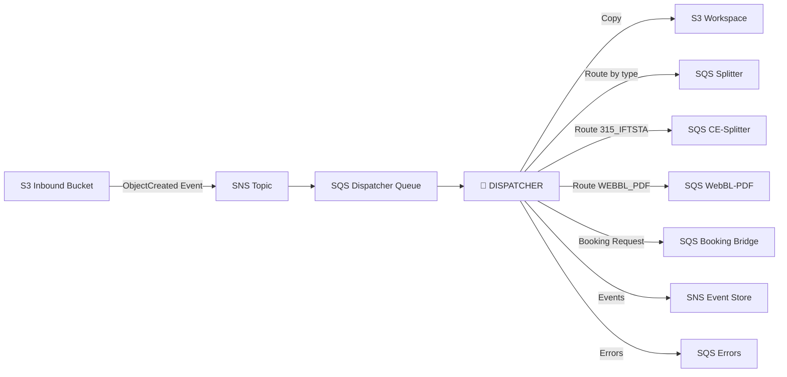
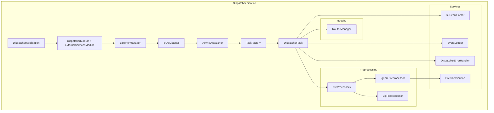
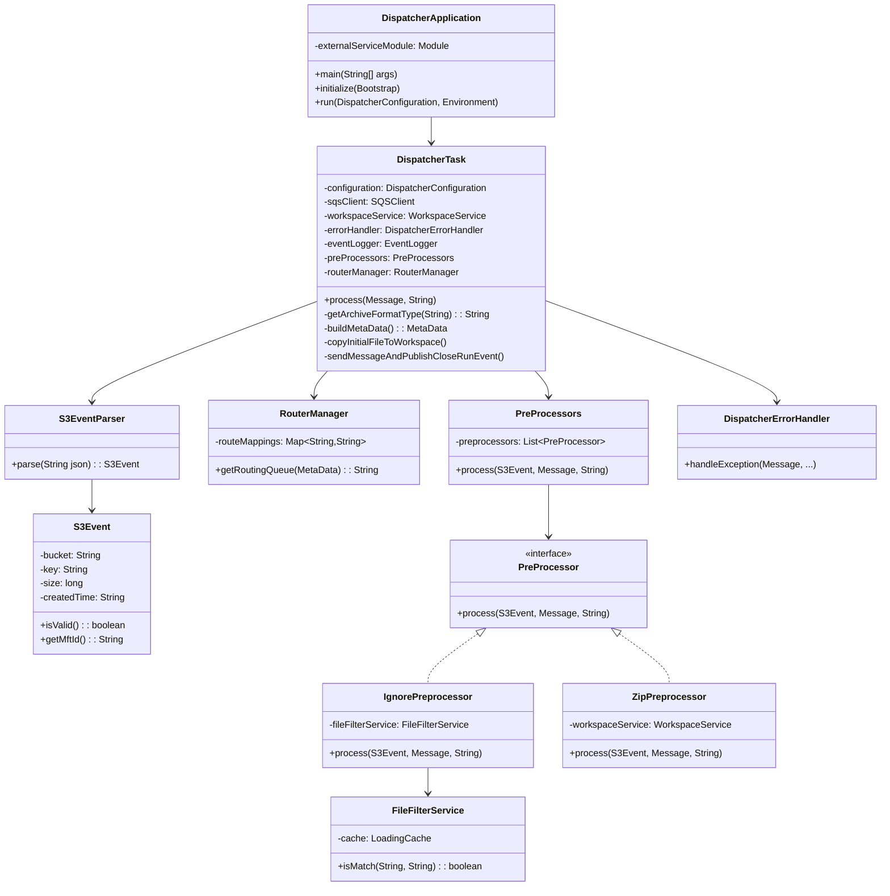
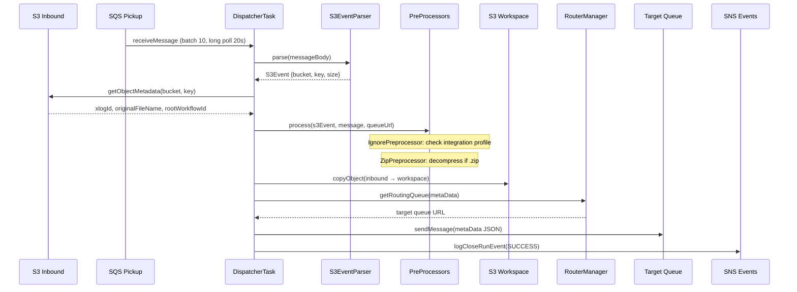
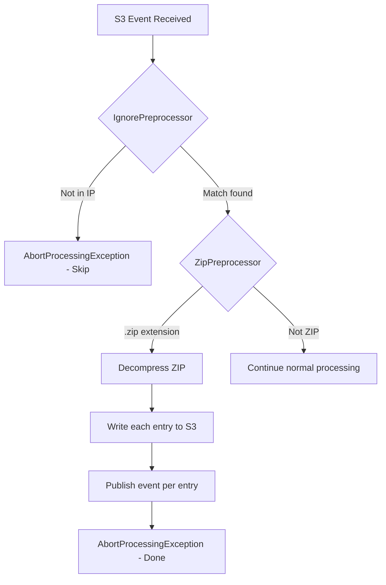

# Dispatcher Module — Design Document

> **Module:** `dispatcher`  
> **Generated:** 2026-05-24  
> **Artifact:** `com.inttra.mercury.dispatcher:dispatcher:1.0-SNAPSHOT`  
> **Java Version:** 17 | **Framework:** Dropwizard 4.x + Guice 7.x

---

## 1. Executive Summary

The **Dispatcher** is the gateway microservice of the AppianWay pipeline. It monitors an S3 inbound bucket via SQS event notifications, extracts metadata from file paths, applies preprocessors (ZIP decompression, integration profile filtering), and routes files to the appropriate downstream queue based on file type.

---

## 2. Role in the Pipeline



---

## 3. High-Level Architecture



---

## 4. Class Diagram



---

## 5. Data Flow Diagram



---

## 6. Configuration Details

### 6.1 Main Configuration (`dispatcher.yaml`)

| Property | Type | Default | Description |
|----------|------|---------|-------------|
| `componentName` | String | `dispatcher` | Service identity |
| `errorRateThreshold` | Double | `5.0` | Max errors/sec (5-min window) |
| `sqsPickupConfig.queueUrl` | String | — | SQS pickup queue URL |
| `sqsPickupConfig.waitTimeSeconds` | int | `20` | Long polling duration |
| `sqsPickupConfig.maxNumberOfMessages` | int | `10` | Batch size |
| `sqsRouteMappingConfig` | Map | — | File type → queue URL mapping |
| `s3InboundPickupConfig.bucket` | String | — | Inbound S3 bucket |
| `s3WorkspaceConfig.bucket` | String | — | Workspace S3 bucket |
| `snsEventConfig.topicArn` | String | — | SNS event topic |
| `sqsErrorConfig.queueUrl` | String | — | Error queue |
| `networkServiceConfig.*` | Object | — | Network service endpoints |
| `bookingBridgeConfig.queueUrl` | String | — | Booking bridge queue |

### 6.2 Route Mappings

| File Type | Target Queue |
|-----------|-------------|
| `315_IFTSTA` | CE-Splitter queue |
| `WEBBL_PDF` | WebBL-PDF queue |
| `default` | Splitter queue |

### 6.3 Validation Rules

- File size must be > 0 bytes (throws `EmptyMessageException`)
- MFT ID must be extractable from S3 path index [3] (throws `UnableToResolveMftIdException`)
- Archive format type must be extractable from path index [0]
- Integration profile must match file type/MFT ID combination

---

## 7. Preprocessing Pipeline



---

## 8. Error Handling

| Exception | Error Code | Recovery |
|-----------|-----------|----------|
| `EmptyMessageException` | `/exception/dispatcher/business/messagePipeline/emptyFile` | Non-recoverable |
| `UnableToResolveMftIdException` | `/exception/dispatcher/business/.../unableToResolveMftId` | Non-recoverable |
| `UnableToResolveArchiveFormatTypeException` | `/exception/dispatcher/business/.../unableToResolveArchiveFormatType` | Non-recoverable |
| Unhandled | `/exception/dispatcher/system/messagePipeline/systemException` | System error |

---

## 9. Key Maven Dependencies

| Dependency | Version | Purpose |
|-----------|---------|---------|
| `mercury-shared` | 1.0 | Base framework |
| `dropwizard-core` | 4.0.16 | REST application |
| `aws-java-sdk-sqs` | 1.12.720 | Queue messaging |
| `guice` | 7.0.0 | DI container |
| `guava` | 33.1.0-jre | Caching (FileFilterService) |
| `metrics-guice` | 3.1.3 | AOP metrics |

---

## 10. Health Checks

| Check | Category | Target |
|-------|----------|--------|
| `InboundSqsHealthCheck` | READ | Pickup queue accessible |
| `S3ReadHealthCheck` | READ | Inbound bucket readable |
| `ErrorThresholdHealthCheck` | READ | Error rate < threshold |
| `OutboundSqsHealthCheck` | WRITE | Output queues accessible |
| `S3WriteHealthCheck` | WRITE | Workspace writable |
| `SnsPublishHealthCheck` | WRITE | SNS topic publishable |

---

## 11. Deployment

```dockerfile
FROM openjdk:8
ADD dispatcher/target/dispatcher-1.0-SNAPSHOT.jar /app/
ADD dispatcher/conf/dispatcher.properties /app/
CMD java -jar /app/dispatcher-1.0-SNAPSHOT.jar run dispatcher.yaml /app/dispatcher.properties
EXPOSE 8080 8081
```

| Port | Purpose |
|------|---------|
| 8080 | Application |
| 8081 | Admin / Health checks |
