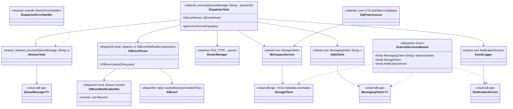
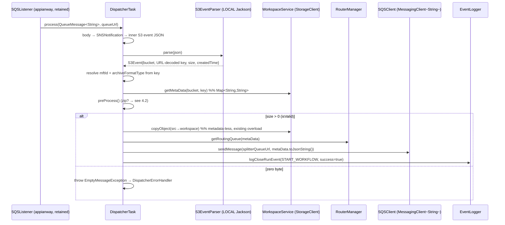
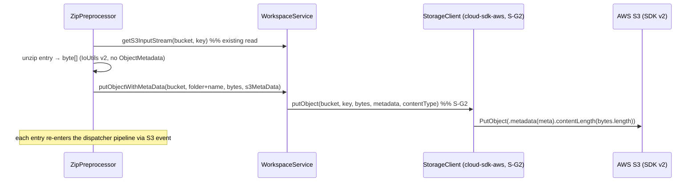
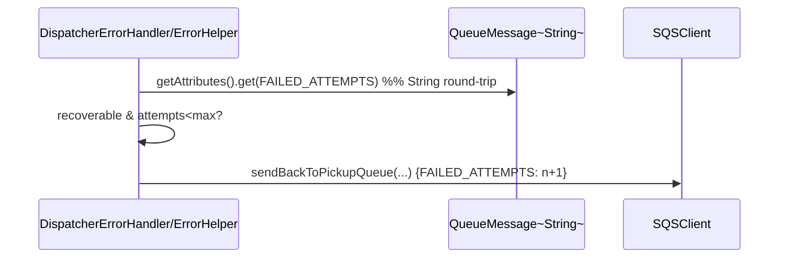

# `dispatcher` — AWS SDK v2 (cloud-sdk) Upgrade DESIGN (claude)

> Module: `com.inttra.mercury.appian-way:dispatcher:1.0` · Date: 2026-05-31 · Author: Claude (Opus 4.8)
> **Chosen option: B — `commons` + `cloud-sdk-api`/`cloud-sdk-aws` (`1.0.26-SNAPSHOT`) on Dropwizard 5.** Option A is the documented fallback (same cloud-sdk contract).
> Companion: [plan](2026-05-31-dispatcher-aws2x-upgrade-plan-claude.md). Master: [`shared` DESIGN](../../shared/docs/2026-05-31-shared-aws2x-upgrade-DESIGN-claude.md) §5 (config) / §6 (cloud-sdk specs).

---

## 1. Overview & chosen option

dispatcher migrates to cloud-sdk **as a client**. Three concrete moves on top of the standard consumer rebind:
1. **Rebind** [`ExternalServicesModule`](../src/main/java/com/inttra/mercury/dispatcher/modules/ExternalServicesModule.java) from v1 `Amazon{SQS,S3,SNS}` builders to the cloud-sdk `MessagingClientFactory`/`StorageClientFactory`/`NotificationClientFactory` (binding `MessagingClient<String>` listener+sender, `StorageClient`, `NotificationService`), mirroring `mercury-services` `BookingMessagingModule`.
2. **Replace the v1 `S3EventNotification` parser** ([`S3EventParser`](../src/main/java/com/inttra/mercury/dispatcher/services/S3EventParser.java)) with a **dispatcher-local** record + Jackson parser (§6.1). No cloud-sdk dependency.
3. **Swap the SQS element** `com.amazonaws.services.sqs.model.Message` → `QueueMessage<String>` through the retained Task/ErrorHandler chain (inherited from `shared`), and drop the v1 `ObjectMetadata`/`com.amazonaws.util.IOUtils` from [`ZipPreprocessor`](../src/main/java/com/inttra/mercury/dispatcher/preprocessor/ZipPreprocessor.java).

Domain logic — preprocessor chain, `RouterManager`, `MetaData` lineage, error codes — is **unchanged**. The only required library change is shared's additive **S-G2** (storage metadata write), consumed by the zip path.

---

## 2. Class diagram



**Removed v1 types:** `AmazonS3/SQS/SNS(ClientBuilder)`, `com.amazonaws.services.sqs.model.Message`, `com.amazonaws.services.s3.event.S3EventNotification`, `com.amazonaws.services.s3.model.ObjectMetadata`, `com.amazonaws.util.IOUtils`.

---

## 3. Component diagram

```mermaid
flowchart LR
    subgraph disp[dispatcher]
      ESM[ExternalServicesModule]
      LIS[shared SQSListener + AsyncDispatcher retained]
      T[DispatcherTask]
      P[PreProcessors / ZipPreprocessor]
      EP[S3EventParser LOCAL]
      RM[RouterManager]
      EH[DispatcherErrorHandler]
    end
    subgraph sh[shared]
      WS[S3WorkspaceService]
      SQSc[SQSClient]
      EL[EventLogger]
    end
    subgraph cs[cloud-sdk 1.0.26-SNAPSHOT]
      API[cloud-sdk-api + S-G2]
      AWS[cloud-sdk-aws impls + factories]
    end
    AWSCloud[(S3 / SQS / SNS — SDK v2)]
    INQ[(S3 ObjectCreated via SQS or SNS→SQS)] --> LIS
    LIS --> T
    T --> EP
    T --> P
    P --> WS
    T --> WS
    T --> RM
    T --> SQSc
    T --> EL
    EH --> SQSc
    EH --> EL
    WS & SQSc & EL --> API
    API <|.. AWS
    AWS --> AWSCloud
    ESM -->|factory-built binds| WS & SQSc & EL & LIS
```

---

## 4. Sequence diagrams

### 4.1 S3-event → route to splitter (primary flow)


### 4.2 Zip preprocessor write-with-metadata (uses S-G2)


### 4.3 Retry counter on failure (FAILED_ATTEMPTS, inherited)


---

## 5. Configuration changes

Reference master [§5](../../shared/docs/2026-05-31-shared-aws2x-upgrade-DESIGN-claude.md). [`conf/dispatcher.yaml`](../conf/dispatcher.yaml) keys are preserved: `sqsPickupConfig` (`waitTimeSeconds:20`, `maxNumberOfMessages:10`) → `ReceiveMessageOptions`; `sqsRouteMappingConfig`, `sqsErrorConfig`, `bookingBridgeConfig`, `snsEventConfig`, `s3WorkspaceConfig`, `s3InboundPickupConfig`, `networkServiceConfig` unchanged; `${PROFILE}`/`${ENV}`/`${awsps:...}` resolution unchanged. The appianway composed `ServerCommand` (master §5) supplies the placeholder + SSM chain. DW5: verify the `server`/`logging`/`metrics` block under `io.dropwizard.core.*`.

---

## 6. cloud-sdk gaps to implement

### 6.1 Dispatcher-LOCAL S3 event parser (replaces v1; the dispatcher-owned change)

A dispatcher-owned Jackson model + parser replacing [`S3EventParser`](../src/main/java/com/inttra/mercury/dispatcher/services/S3EventParser.java)'s `S3EventNotification.parseJson`. Lives in `com.inttra.mercury.dispatcher.services`/`.model`. It must reproduce the existing behavior exactly: first record, **URL-decoded key**, `size` as `long`, formatted event time; and it must handle **both** envelopes (raw S3→SQS and S3→SNS→SQS — the SNS unwrap already happens in [`DispatcherTask.getS3EventFromSNSMessage`](../src/main/java/com/inttra/mercury/dispatcher/task/DispatcherTask.java:173) before the parser is called, so the parser only sees the inner S3-event JSON).

```java
// dispatcher-local Jackson DTO — mirrors the S3 ObjectCreated notification JSON
@JsonIgnoreProperties(ignoreUnknown = true)
public record S3EventNotificationDto(@JsonProperty("Records") List<Record> records) {
    @JsonIgnoreProperties(ignoreUnknown = true)
    public record Record(
            @JsonProperty("eventTime") String eventTime,
            @JsonProperty("eventName") String eventName,
            @JsonProperty("s3") S3 s3) {}
    @JsonIgnoreProperties(ignoreUnknown = true)
    public record S3(@JsonProperty("bucket") Bucket bucket,
                     @JsonProperty("object") S3Object object) {}
    @JsonIgnoreProperties(ignoreUnknown = true)
    public record Bucket(@JsonProperty("name") String name) {}
    @JsonIgnoreProperties(ignoreUnknown = true)
    public record S3Object(@JsonProperty("key") String key,
                           @JsonProperty("size") long size) {}
}

public class S3EventParser {
    private static final DateTimeFormatter JODA = DateTimeFormat.forPattern(Json.DEFAULT_DATE_TIME_PATTERN);

    public S3Event parse(String json) {
        S3EventNotificationDto evt = Json.fromJsonString(json, S3EventNotificationDto.class);
        if (evt == null || evt.records() == null || evt.records().isEmpty()) {
            throw new EmptyMessageException(); // preserve "no record" failure semantics
        }
        var r = evt.records().get(0);
        String key = URLDecoder.decode(r.s3().object().key(), StandardCharsets.UTF_8); // URL-decode preserved
        // event time: parse ISO-8601 from the JSON, re-print via the existing Joda formatter for byte-for-byte parity
        String createdTime = JODA.print(org.joda.time.DateTime.parse(r.eventTime()));
        return new S3Event(r.s3().bucket().name(), key, r.s3().object().size(), createdTime);
    }
}
```
Notes: uses the existing [`Json`](../../shared/src/main/java/com/inttra/mercury/shared/support/Json.java) `ObjectMapper` and `Json.DEFAULT_DATE_TIME_PATTERN` so date formatting is unchanged; `size` feeds [`S3Event.isValid()`](../src/main/java/com/inttra/mercury/dispatcher/model/S3Event.java:14) (zero-byte guard) and the `ORIGINAL_FILE_SIZE` token. **No new Maven dependency** — Jackson is already present transitively.

`ZipPreprocessor` cleanup (no cloud-sdk change): remove the `ObjectMetadata` import/instance (content-length derives from `bytes.length` inside the S-G2 `putObject`), replace `com.amazonaws.util.IOUtils.toByteArray` with `software.amazon.awssdk.utils.IoUtils.toByteArray` (or Guava `ByteStreams.toByteArray`).

### 6.2 O-G3 — optional upstream S3 event parser (NOT depended on by appianway)

Master [§6.3](../../shared/docs/2026-05-31-shared-aws2x-upgrade-DESIGN-claude.md). *Optional* additive contribution for cross-program reuse by `mft-s3-aqua-appia`: a `record S3EventRecord(String bucket,String key,long size,String eTag,String eventName)` + `interface S3EventParser { List<S3EventRecord> parse(String body); }` in `cloud-sdk-api`, with a Jackson impl in `cloud-sdk-aws` handling raw-S3→SQS and S3→SNS→SQS envelopes and URL-decoded keys. **New types only** — strictly additive, zero impact to mercury-services. appianway works without it (it ships §6.1 locally); upstreaming would let dispatcher later delete its local parser, but that is not in scope here.

### 6.3 S-G2 dependency (shared-owned, consumed here)

Master [§6.1](../../shared/docs/2026-05-31-shared-aws2x-upgrade-DESIGN-claude.md). The additive `StorageClient.putObject(...,Map metadata,String contentType)` overload backs [`ZipPreprocessor.putObjectWithMetaData`](../src/main/java/com/inttra/mercury/dispatcher/preprocessor/ZipPreprocessor.java:102). dispatcher consumes it; it does not implement it.

---

## 7. Maven dependency changes

[`pom.xml`](../pom.xml):
- **Remove:** `com.amazonaws:aws-java-sdk-sqs:${aws-java-sdk.version}` ([:47-51](../pom.xml)).
- **Add:** `com.inttra.mercury:cloud-sdk-api:1.0.26-SNAPSHOT`, `com.inttra.mercury:cloud-sdk-aws:1.0.26-SNAPSHOT` (versions from root `dependencyManagement`), and `commons:1.0.26-SNAPSHOT` if the module names commons types directly; v2 runtime arrives transitively via `mercury-shared`.
- **No** `software.amazon.awssdk:s3-event-notifications` artifact — the local parser (§6.1) deserializes with the existing Jackson `ObjectMapper`.
- Add `dropwizard-testing` (JUnit 5) for new tests; `junit-vintage-engine` during transition. cloud-sdk-aws excludes Netty (Apache HTTP client only) — verify the shade uber-jar.

---

## 8. Test details

- **New tests in JUnit 5**; existing JUnit 4 via vintage during transition.
- **S3EventParser tests (pin behavior):** valid raw-S3→SQS event; S3→SNS→SQS (SNS-wrapped) event; **URL-encoded key** (e.g. `a%2Fb` → `a/b` and spaces); zero-size object → `isValid()==false`; missing/empty `Records` → `EmptyMessageException`; event-time formatting parity with the old Joda output. Use a **captured real event** fixture.
- **Archive-type / MFT resolution** ([`getArchiveFormatType`](../src/main/java/com/inttra/mercury/dispatcher/task/DispatcherTask.java:263), [`S3Event.getMftId`](../src/main/java/com/inttra/mercury/dispatcher/model/S3Event.java:18)) tests unchanged.
- **Zip path:** assert `putObjectWithMetaData` receives the same metadata map; assert `IoUtils` byte copy parity.
- **functional-testing fakes** re-pointed to `cloud-sdk-api` interfaces (in-memory S3/SQS/SNS) — lockstep with `shared`; preserve copy-to-workspace + route-to-splitter + lineage behavior. Tests referencing v1 `Message` build a `QueueMessage<String>` double.

---

## 9. Rollout & verification

1. Land **S-G2** additively in the cloud-sdk `1.0.26-SNAPSHOT` build (shared deliverable) — cloud-sdk CI + mercury-services build stay green.
2. Migrate `shared` + `functional-testing`; then pilot `event-writer`.
3. Migrate dispatcher: pom swap → rebind module → local `S3EventParser` → `Message`→`QueueMessage<String>` → `ZipPreprocessor` cleanup → `mvn -pl dispatcher -am verify`.
4. Dev smoke: drop a file (and a `.zip`), confirm copy-to-workspace, archive-type routing to the correct splitter queue, booking-bridge XLOG path, and START/CLOSE lineage events.

---

## 10. Risks & mitigations

| Risk | Mitigation |
|---|---|
| S3-event JSON shape mismatch after local-parser swap | Captured-event fixtures (raw + SNS-wrapped); assert bucket/key/size/URL-decode/time |
| URL-decode regression on keys with `+`/`%2F`/spaces | Explicit decode test cases; use `URLDecoder.decode(key, UTF_8)` exactly as v1 |
| `IoUtils` vs v1 `IOUtils` stream-close diff in zip loop | Unit-test the entry copy; ensure streams closed as before |
| S-G2 not yet landed when dispatcher builds | Sequence after `shared`; S-G2 is additive and version-pinned `1.0.26-SNAPSHOT` |
| Any cloud-sdk change breaking mercury-services | dispatcher introduces none; only consumes additive S-G2 (master §0 contract) |
| DW4→5 inherited churn | Inherited from `shared`; per-module verify gate; Option A fallback |
