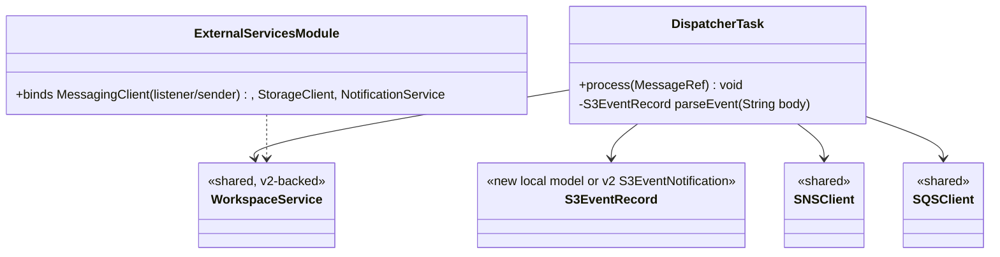
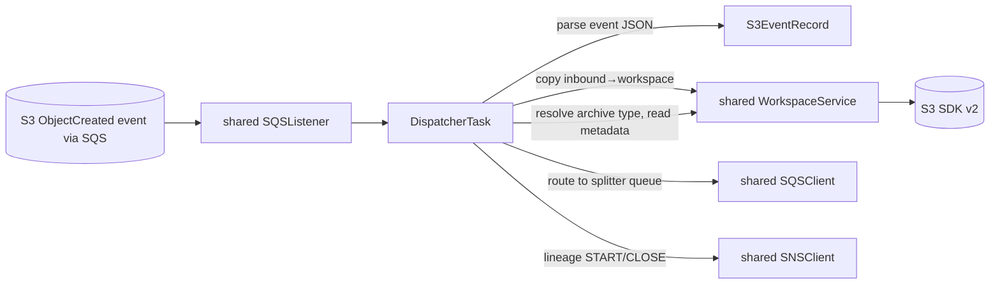
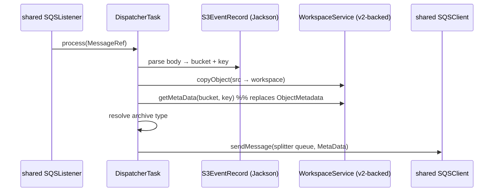

# `dispatcher` — AWS SDK v2 (cloud-sdk) Upgrade DESIGN

> **DIRECTIVE UPDATE (2026-05-31) — supersedes the Option-A recommendation in this document.** Per stakeholder direction the program now targets **Dropwizard 5** and **Option B — adopt `commons` + `cloud-sdk-api`/`cloud-sdk-aws`** as the directed default (recommend Option A only on a categorical technical blocker). All AWS service communication goes through `cloud-sdk-api`; new tests are written in **JUnit 5 (Jupiter)** (existing JUnit 4 runs via JUnit Vintage during transition); configuration follows the composed appianway `.properties`/`${PROFILE}`/`${ENV}` + commons `${awsps:...}` model in the master [shared plan §10](../../shared/docs/2026-05-31-shared-aws2x-upgrade-plan-copilot.md). cloud-sdk gaps are indexed in the master [shared plan §11](../../shared/docs/2026-05-31-shared-aws2x-upgrade-plan-copilot.md) with full technical specs in the master [shared DESIGN §1A.6](../../shared/docs/2026-05-31-shared-aws2x-upgrade-DESIGN.md).
> **Module-specific cloud-sdk gaps:** G1 (concurrent SQS listener), G2 (S3 putObject with metadata), **G3 (S3 event-notification parsing — dispatcher is the S3→SQS gate; see master DESIGN §1A.6 G3: add `S3EventRecord`/`S3EventParser` to cloud-sdk handling both S3→SQS and S3→SNS→SQS envelopes with URL-decoded keys)**, G6 (config), G7 (health checks).
> Sections below are retained as the Option-A fallback reference.

> Module: `dispatcher` · Date: 2026-05-31 · Author: GitHub Copilot (Claude Opus 4.8) · Option **A**
> Companion: [plan](2026-05-31-dispatcher-aws2x-upgrade-plan-copilot.md). Foundation: [`shared` DESIGN](../../shared/docs/2026-05-31-shared-aws2x-upgrade-DESIGN.md). Session `83b822b011714117`.

## 1. Overview
Three changes on top of the standard consumer migration: (1) replace `S3EventNotification` parsing with a v2/Jackson model, (2) read object metadata through `shared` `StorageClient.getMetaData`, (3) swap `com.amazonaws.util.IOUtils` → `software.amazon.awssdk.utils.IoUtils`. Plus the standard Guice rebind and `Message`→`MessageRef` DTO swap.

## 2. Class diagram

## 3. Component diagram

## 4. Sequence diagram

## 5. Configuration changes
`conf/dispatcher.yaml` AWS client keys (`sqs_listener`, `sqs_sender`, `s3_read_put_copy`, `sns_publish`) retained, mapped to v2 via `shared` facade. No placeholder change.

## 6. Maven dependency changes
- **Remove:** `aws-java-sdk-{sqs,sns,s3}` from `dispatcher/pom.xml`.
- **Add:** `cloud-sdk-api` (if naming interface types). Optionally `software.amazon.awssdk:s3-event-notifications` **only if** `cloud-sdk-aws` does not already provide an S3-event helper; otherwise deserialize with the existing Jackson `ObjectMapper` into a local record.
- v2 runtime transitive via `shared`.

## 7. Test details
- Migrate `functional-testing` fakes first.
- Keep/expand `S3EventRecord` parsing tests (valid event, missing key, URL-decoded keys).
- Archive-type resolution tests unchanged.
- DTO construction switches to `MessageRef`. JUnit 4 retained.

## 8. Rollout & verification
After `shared`/`functional-testing`/`event-writer`. `mvn -pl dispatcher -am verify`. Manual smoke against dev: drop a file, confirm copy-to-workspace + route-to-splitter + lineage events.

## 9. Risks & mitigations
| Risk | Mitigation |
|---|---|
| S3 event JSON shape mismatch after parser swap | Pin a captured real event in a test fixture; assert bucket/key/URL-decode |
| Metadata semantics differ (v1 `ObjectMetadata` vs v2 head) | Route through `shared.getMetaData`; assert keys/values in a test |
| `IoUtils` behavior diff on stream close | Unit-test the copy helper |
