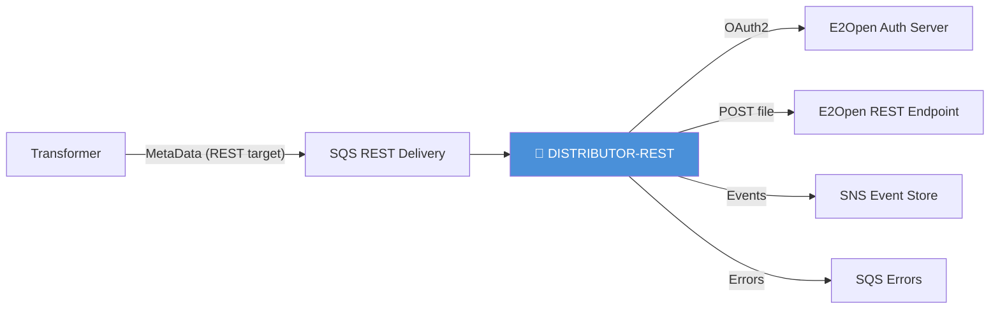
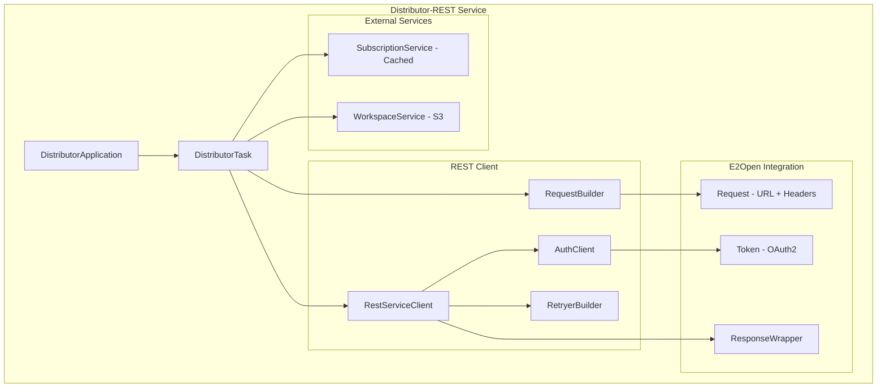
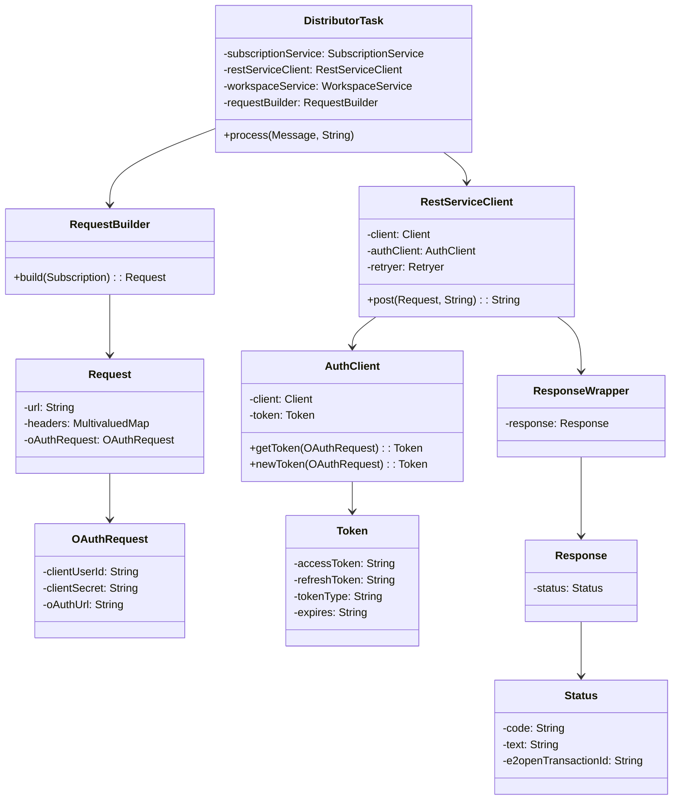
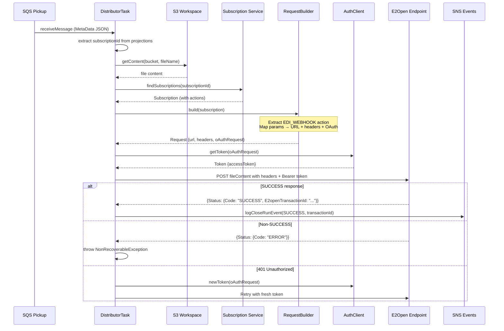
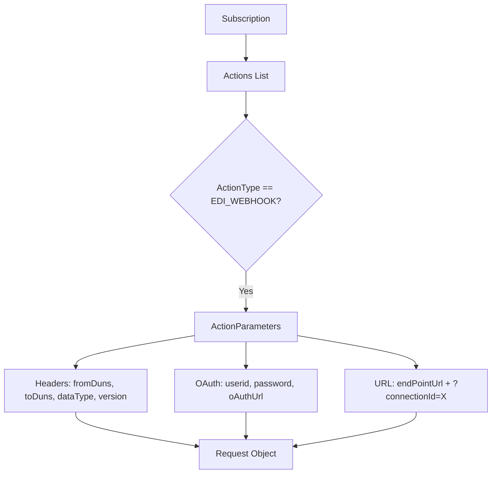
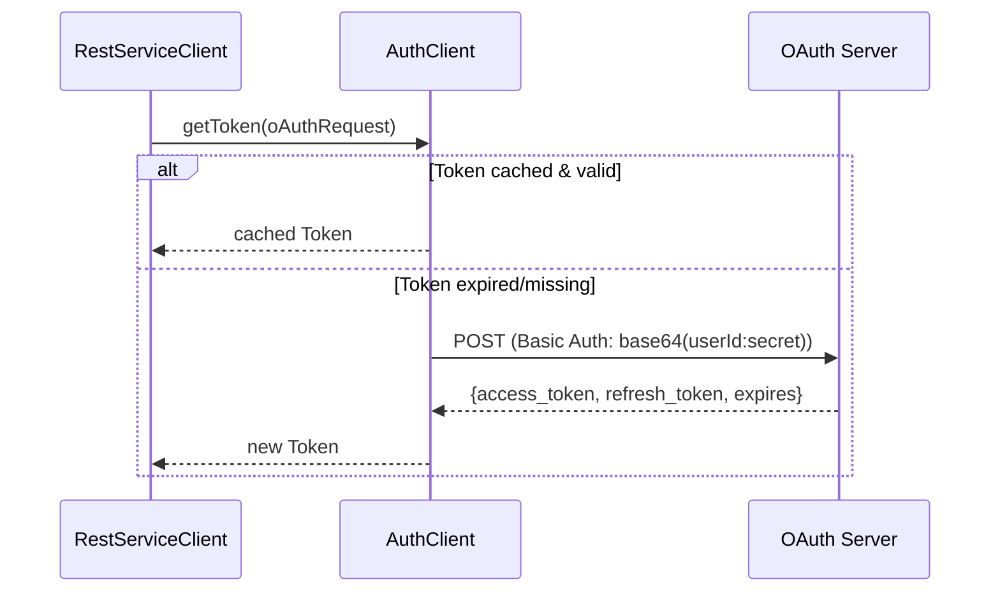

# Distributor-REST Module — Design Document

> **Module:** `distributor-rest`  
> **Generated:** 2026-05-24  
> **Artifact:** `com.inttra.mercury.distributorrest:distributor-rest:1.0-SNAPSHOT`  
> **Java Version:** 17 | **Framework:** Dropwizard 4.x + Jersey 3.1.11 + Guice 7.x

---

## 1. Executive Summary

The **Distributor-REST** module is a specialized delivery service that pushes transformed files to external E2Open REST endpoints with OAuth2 authentication. Unlike the standard Distributor (S3-based delivery), this module handles HTTP-based integrations where trading partners expose webhooks for receiving EDI data.

---

## 2. Role in the Pipeline

---

## 3. High-Level Architecture

---

## 4. Class Diagram

---

## 5. Data Flow Diagram

---

## 6. Subscription-to-Request Transformation

The `RequestBuilder` maps subscription action parameters to an HTTP request:

| Parameter | Maps To |
|-----------|---------|
| `fromDuns` | HTTP Header |
| `toDuns` | HTTP Header |
| `dataType` | HTTP Header |
| `version` | HTTP Header |
| `userid` | OAuthRequest.clientUserId |
| `password` | OAuthRequest.clientSecret |
| `oAuthUrl` | OAuthRequest.oAuthUrl |
| `connectionId` | URL query parameter |
| `endPointUrl` | Request base URL |

---

## 7. Retry & Error Recovery Strategy

| Error | Retry? | Action |
|-------|--------|--------|
| HTTP 401 | Yes | Refresh token, retry |
| HTTP 404 | No | Fail immediately |
| HTTP 400 | No | Fail immediately |
| HTTP 5xx | Yes | Exponential backoff |
| Connection error | Yes | Exponential backoff |
| Non-SUCCESS response | No | `NonRecoverableException` |

**Retry Configuration:**
- Max attempts: 3
- Wait strategy: Exponential (100ms base)
- Listener: Logs each retry attempt

---

## 8. Configuration Details

| Property | Type | Default | Description |
|----------|------|---------|-------------|
| `componentName` | String | `distributor-rest` | Service identity |
| `healthCheckConfig.errorRateThreshold` | Double | `5.0` | Error rate threshold |
| `restClientConfig.connectTimeout` | String | `60000` | HTTP connect timeout (ms) |
| `restClientConfig.readTimeout` | String | `60000` | HTTP read timeout (ms) |
| `sqsPickupConfig.queueUrl` | String | — | Delivery pickup queue |
| `sqsPickupConfig.waitTimeSeconds` | int | `20` | Long poll duration |
| `sqsPickupConfig.maxNumberOfMessages` | int | `5` | Batch/thread count |
| `sqsErrorConfig.queueUrl` | String | — | Error queue |
| `snsEventConfig.topicArn` | String | — | Event topic |
| `s3WorkspaceConfig.bucket` | String | — | Source file bucket |
| `networkServiceConfig.*` | Object | — | Network service endpoints |

---

## 9. Key Maven Dependencies

| Dependency | Version | Purpose |
|-----------|---------|---------|
| `mercury-shared` | 1.0 | Framework, workspace, events |
| `jersey-client` | 3.1.11 | HTTP client |
| `jersey-media-multipart` | 3.1.11 | Multipart support |
| `jersey-hk2` | 3.1.11 | DI bridge |
| `dropwizard-core` | 4.0.16 | Application framework |
| `guice` | 7.0.0 | Dependency injection |
| `guava-retrying` | — | Retry library |

---

## 10. OAuth2 Authentication Flow

---

## 11. Error Handling

| Exception | Handling | Outcome |
|-----------|----------|---------|
| `NonRecoverableException` | E2Open returned non-SUCCESS | ErrorHandler, message fails |
| `RecoverableException` | Network/infra failure | ErrorHandler with retry metadata |
| `IOException` | File read failure | ErrorHandler |
| `WebApplicationException(401)` | Token expired | Automatic token refresh + retry |
