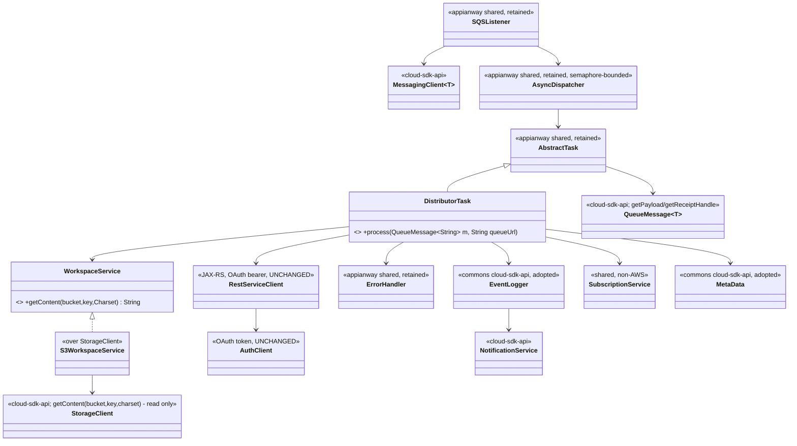
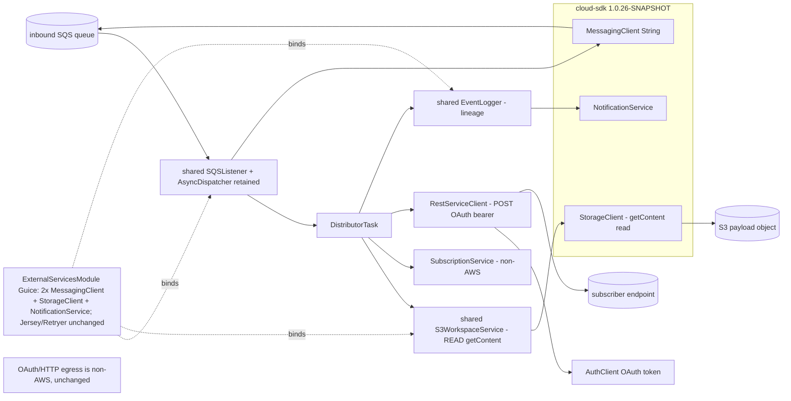

# `distributor-rest` — AWS SDK v2 (cloud-sdk) Upgrade DESIGN (claude)

> Module: `distributor-rest` · Date: 2026-05-31 · Author: Claude (Opus 4.8) · **Chosen option: B**
> Companion: [distributor-rest PLAN](2026-05-31-distributor-rest-aws2x-upgrade-plan-claude.md). Foundation (do not duplicate): [shared DESIGN](../../shared/docs/2026-05-31-shared-aws2x-upgrade-DESIGN-claude.md) §5/§6, [shared PLAN](../../shared/docs/2026-05-31-shared-aws2x-upgrade-plan-claude.md) §10/§11.

---

## 1. Overview & chosen option

**Option B** — adopt `commons` + `cloud-sdk-api`/`cloud-sdk-aws` `1.0.26-SNAPSHOT` on Dropwizard 5; keep appianway's `SQSListener`+`AsyncDispatcher`; re-type the chain to `QueueMessage<String>`; adopt commons `MetaData`/`Event`. distributor-rest consumes SQS, **reads** the payload from S3 (`getContent`, ISO-8859-1), and **POSTs** it to subscriber endpoints with an OAuth bearer token (Jersey/JAX-RS — **non-AWS, untouched**). AWS surface = SQS consume + S3 read + SNS lineage. **No module-specific cloud-sdk change; S-G2 not exercised** (read-only S3).

---

## 2. Class diagram (target)



**Removed v1 types:** `AmazonSQS`, `AmazonS3`, `AmazonSNS`, `com.amazonaws.services.sqs.model.Message`.
**Adopted commons types:** `MetaData`, `Event`, `EventLogger`.
**Consumed cloud-sdk-api:** `MessagingClient<String>`, `QueueMessage<String>`, `StorageClient` (read), `NotificationService`.
**Untouched (non-AWS):** Jersey `Client`, `RestServiceClient`, `AuthClient`/OAuth, `Retryer`, `SubscriptionService`, `e2net/*`.

---

## 3. Component diagram



---

## 4. Sequence diagram — consume → S3 read → OAuth POST → lineage

```mermaid
sequenceDiagram
    participant L as SQSListener (appianway)
    participant M as MessagingClient~String~
    participant D as AsyncDispatcher (semaphore-bounded)
    participant T as DistributorTask
    participant WS as S3WorkspaceService
    participant SC as StorageClient (read)
    participant R as RestServiceClient (OAuth, non-AWS)
    participant H as Subscriber endpoint
    participant EL as EventLogger -> NotificationService
    L->>M: receiveMessages(ReceiveMessageOptions{wait=20s})
    M-->>L: List<QueueMessage<String>>
    L->>D: submit(messages, queueUrl)
    D->>T: process(QueueMessage<String>)
    T->>T: MetaData = fromJson(payload); subscriptionId
    alt subscriptionId present
      T->>WS: getContent(bucket, fileName, ISO_8859_1)
      WS->>SC: getContent(bucket,key,charset)
      SC-->>T: fileContent
      T->>R: post(request, fileContent)  %% OAuth bearer
      R->>H: HTTP POST payload
      H-->>R: 2xx + transactionId
      R-->>T: transactionId
      T->>EL: logCloseRunEvent(CLOSE_WORKFLOW, success, {E2OPEN_TRANSACTION_ID})
    else no subscriptionId
      T->>T: log error (no delivery)
    end
    T->>L: deleteMessage(queueUrl, receiptHandle)  %% on success (shared chain)
    Note over T: NonRecoverableException/IOException -> errorHandler.handleException(message,...)
```

---

## 5. Configuration

Per **master shared DESIGN §5 / PLAN §10**. No module-specific AWS config design. **Non-AWS, unchanged:** subscriber-endpoint config, OAuth (`AuthClient`, client-id/secret via `ParameterStoreModule`), Jersey timeouts (`RestClientConfig` connect/read), `NetworkServiceConfig`/service paths, `Retryer`. `conf/distributor-rest.yaml` + `.properties` + `${PROFILE}`/`${ENV}` + `${awsps:…}` flow through the appianway config command composing public commons transforms. Preserve the **ISO-8859-1** charset on the S3 read. Zero commons change.

---

## 6. cloud-sdk gaps

Reference **master shared DESIGN §6**. **No module-specific cloud-sdk change, and S-G2 is not exercised** (distributor-rest only **reads** S3 via the existing `StorageClient.getContent(bucket,key,charset)`; it performs no write/copy). It consumes the existing public cloud-sdk-api plus `shared`. G1/G3/G6/G7 do not apply. The OAuth/HTTP egress is local and untouched.

---

## 7. Maven dependency changes

- Pin **`1.0.26-SNAPSHOT`** via root `dependencyManagement`.
- **Remove:** direct `com.amazonaws:aws-java-sdk-sqs` ([pom.xml:46-47](../pom.xml)); S3/SNS v1 (transitive via `shared`) drop out once `shared` is migrated. Drop `<aws-java-sdk.version>` reliance.
- **Add:** `cloud-sdk-api` (if naming interface types in the Guice module); `cloud-sdk-aws` transitive via `shared`.
- **Unchanged:** Jersey/JAX-RS client (`jakarta.ws.rs`), `com.github.rholder:guava-retrying`, OAuth deps.
- Add `dropwizard-testing` (JUnit 5); `junit-vintage-engine` during transition.

## 8. Tests

- **New tests JUnit 5**; existing JUnit 4 via Vintage during transition.
- Re-point mocks: v1 `AmazonSQS`/`AmazonS3`/`AmazonSNS`/`Message` → `MessagingClient<String>`/`StorageClient`/`NotificationService`/`QueueMessage<String>`.
- `DistributorTask` tests: `getContent` invoked with **ISO-8859-1**; `restServiceClient.post` invoked with the read content (mock egress); `logCloseRunEvent` with `E2OPEN_TRANSACTION_ID`; failure path → `errorHandler.handleException`.
- **HTTP/OAuth egress tests (WireMock/JAX-RS) unaffected** — assert they stay green (no egress-logic change).
- **`functional-testing` fakes** re-pointed to cloud-sdk-api (lockstep with `shared`); preserve behavior.

## 9. Rollout & verification

1. After `shared` + `functional-testing`.
2. After the low-risk `event-writer`/`error-processor`, with the hot egress group (alongside `distributor`): rebind AWS binds; re-type chain; adopt commons `MetaData`/`Event` → `mvn -pl distributor-rest -am verify`.
3. Dev-run: verify S3 read (ISO-8859-1), OAuth POST to a subscriber stub, and lineage event; confirm WireMock egress suite green.

## 10. Risks & mitigations

| Risk | Mitigation |
|---|---|
| Egress regression (live subscriber delivery) | Strict AWS-boundary-only scope; WireMock/JAX-RS suite green; sequence after low-risk modules |
| Charset drift on S3 read | Preserve `getContent(..., ISO_8859_1)`; assert in test |
| `Message`→`QueueMessage<String>` misses a site | Compiler-driven type change |
| Listener/sender split | Two configured `MessagingClient` instances (§5) |
| Functional fakes not ready | Gate behind `functional-testing` |
| DW4→5 bootstrap regression | Cost borne in `shared`; exercised earlier by `event-writer` |
| Any cloud-sdk change breaking mercury-services | Client-only consumption; no library change in this module (S-G2 not even used) |
</content>
