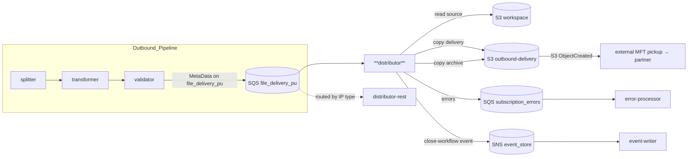
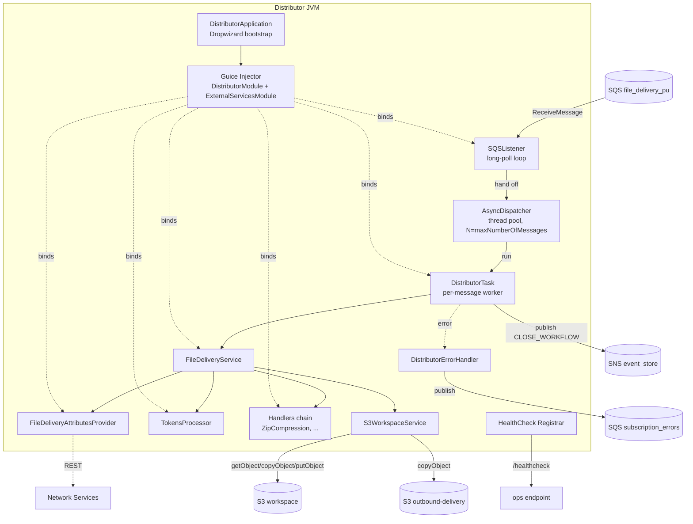
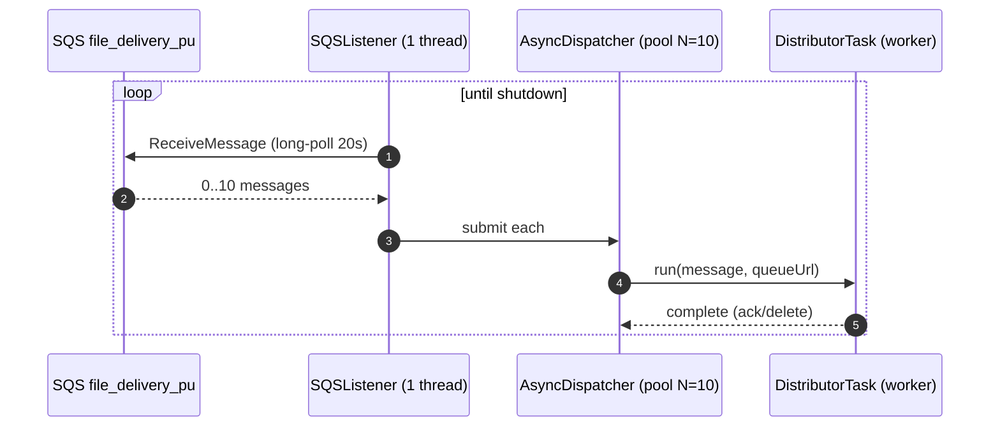
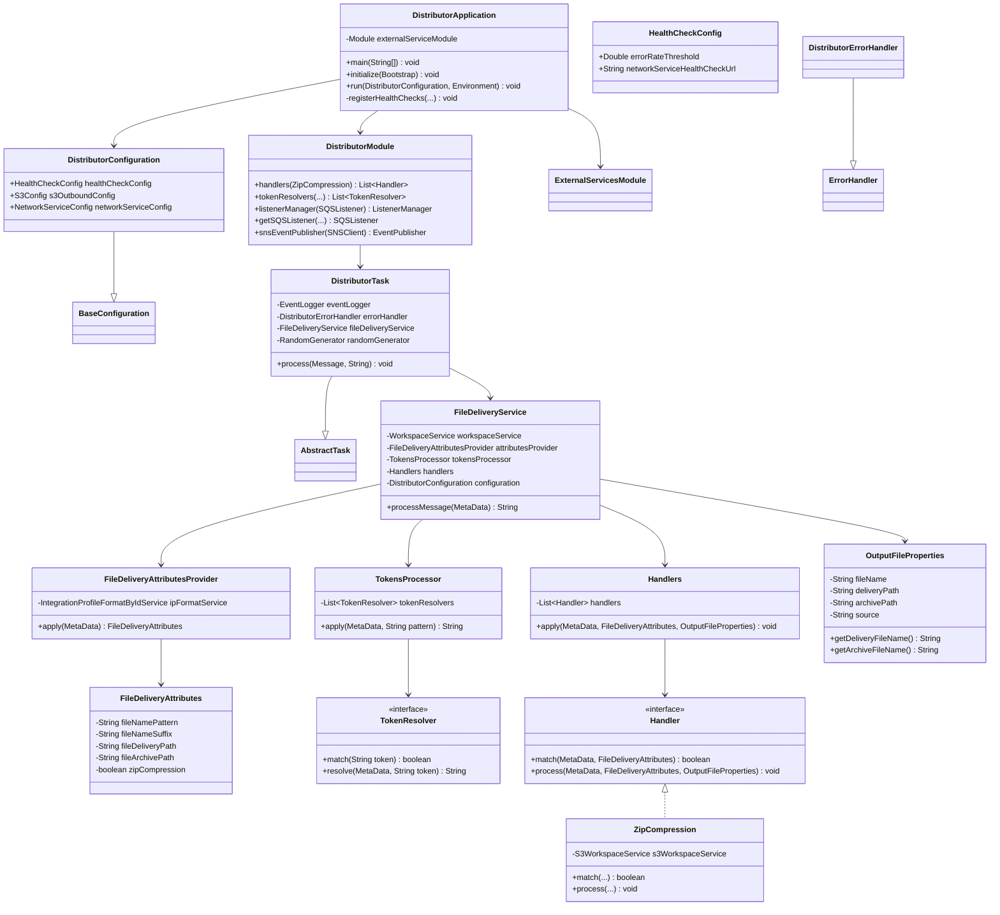
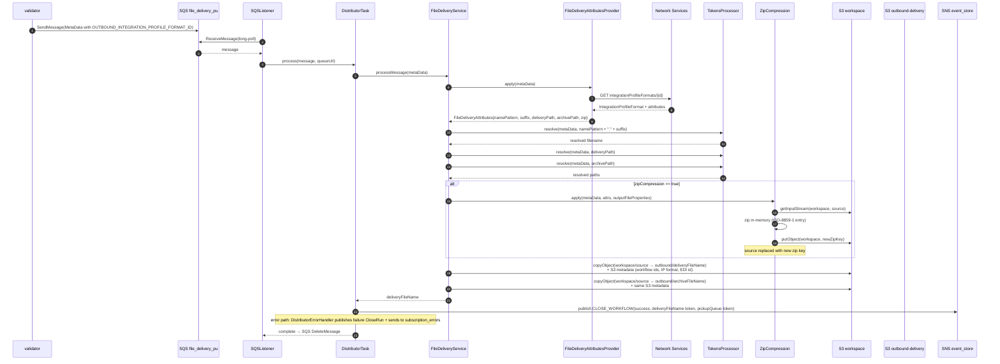

# Distributor Module — Architecture & Design

> **Author:** Principal Engineering Review · **Date:** 2026-05-24 · **Module Version:** `com.inttra.mercury.appian-way:distributor:1.0`

---

## 1. Executive Summary

The **Distributor** is the *tail-end S3 delivery component* of the Mercury (Appian Way) outbound pipeline. After the transformer has produced a canonical/EDI outbound document in the workspace bucket and the validator has approved it, the distributor's job is to copy that document into the **outbound delivery bucket** with the correctly *formatted file name*, *folder structure*, and (optionally) *zip-compressed* — at which point an external MFT or SFTP relay picks it up and delivers to the trading partner.

It is a thin file-shaping layer:

1. **Consume** a `MetaData` envelope from the pickup SQS queue (`*_sqs_file_delivery_pu`).
2. **Resolve** the destination's `IntegrationProfileFormat` (via Mercury Network Services) to obtain per-recipient delivery attributes — `fileNamePattern`, `fileNameSuffix`, `fileDeliveryPath`, `fileArchivePath`, `zipCompression`.
3. **Render** the filename by expanding token placeholders (`{datetime}`, `{format}`, `{random}`, `{integrationProfile}`, `{metadata.X}`) through a chain of `TokenResolver`s.
4. **Compress** if the format flags `zipCompression=true` (`ZipCompression` handler runs in-memory ZIP into a fresh workspace object).
5. **Copy** the rendered object twice — once to `${s3OutboundConfig.bucket}/${deliveryPath}/${fileName}` (the live drop) and once to `${...}/${archivePath}/${fileName}` (the audit copy).
6. **Publish** a `CLOSE_WORKFLOW` event on the event-store SNS topic, marking the end of the workflow that began at the dispatcher.

The distributor is the SQS-based delivery path. Its sibling [`distributor-rest`](../../distributor-rest/docs/2026-05-24-distributor-rest-claude.design.md) provides the same logical role for **HTTP/REST subscribers** instead of file-based MFT. Both consume from the same upstream queue family and emit the same `CLOSE_WORKFLOW` event — the routing decision between them happens upstream (typically at the validator / a sub-splitter that inspects the recipient's `IntegrationProfile.deliveryType`).

---

## 2. Position in the Mercury Pipeline



**Upstream producer.** [validator](../../validator/docs/2026-05-24-validator-claude.design.md) (or an upstream re-deliver job) — drops `MetaData` JSON on the pickup queue once the canonical outbound document is signed off.

**Downstream consumer.** External MFT / SFTP / partner pickup process that polls the `*-outbound-delivery` S3 bucket. The distributor itself does **not** talk to partners; it simply lays the bytes down in the right place under the right name. This separation is intentional: the partner-facing transport (SFTP / AS2 / etc.) is the responsibility of an out-of-band MFT appliance.

---

## 3. High-Level Architecture



**Bootstrap.** [`DistributorApplication`](../src/main/java/com/inttra/mercury/distributor/DistributorApplication.java) extends `io.dropwizard.core.Application<DistributorConfiguration>`. `initialize()` installs `S3ConfigurationProvider` and the shared `ConfigProcessingServerCommand`. `run()` builds Guice modules, registers a `ListenerManager` to Dropwizard's lifecycle, and registers split read/write health checks.

**Wiring.** Two Guice modules:
- [`ExternalServicesModule`](../src/main/java/com/inttra/mercury/distributor/modules/ExternalServicesModule.java) — AWS SQS/S3/SNS clients, Jersey REST client, Mercury Network Services (Integration Profile + Format APIs), Parameter Store, retry policies.
- [`DistributorModule`](../src/main/java/com/inttra/mercury/distributor/modules/DistributorModule.java) — domain bindings: `Dispatcher → AsyncDispatcher`, `WorkspaceService → S3WorkspaceService`, the `Handler` list (currently `[ZipCompression]`), the eight-element `TokenResolver` list, `SQSListener`, `EventPublisher`, `ListenerManager`.

**Per-message threading.**



---

## 4. Low-Level Design

```mermaid
flowchart TB
    subgraph config
        DC[DistributorConfiguration]
        HCC[HealthCheckConfig]
        EPC[EndpointConfig]
    end
    subgraph modules
        DM[DistributorModule]
        ESM[ExternalServicesModule]
    end
    subgraph task
        DT[DistributorTask]
    end
    subgraph services
        FDS[FileDeliveryService]
        FAP[FileDeliveryAttributesProvider]
        TP[TokensProcessor]
        HND[Handlers]
        OFP[OutputFileProperties]
    end
    subgraph handlers
        HI[Handler iface]
        ZC[ZipCompression]
    end
    subgraph token_resolvers
        TR[TokenResolver iface]
        DTR[DateTokenResolver]
        GDTR[GmtDateTimeTokenResolver]
        GDTNMR[GmtDateTimeNoMillisTokenResolver]
        RSR[RandomSequenceTokenResolver]
        FTR[FormatTokenResolver]
        IPTR[IntegrationProfileTokenResolver]
        MDTR[MetaDataTokenResolver]
    end
    subgraph model
        FDA[FileDeliveryAttributes]
    end
    subgraph errors
        DEH[DistributorErrorHandler]
        ANFE[AttributeNotFoundException]
        MPE[MissingProjectionException]
        EC[ErrorConstants]
    end

    DM --> DC
    DM --> HND
    DM --> TR
    DT --> FDS
    FDS --> FAP
    FDS --> TP
    FDS --> HND
    FDS --> OFP
    FAP --> FDA
    HND --> HI
    HI <|.. ZC
    TR <|.. DTR
    TR <|.. GDTR
    TR <|.. GDTNMR
    TR <|.. RSR
    TR <|.. FTR
    TR <|.. IPTR
    TR <|.. MDTR
    TP --> TR
    DEH --> ANFE
    DEH --> MPE
```

**Package layout** (`com.inttra.mercury.distributor.*`):

| Package | Responsibility |
|---|---|
| `config` | `DistributorConfiguration`, `HealthCheckConfig`, `EndpointConfig` |
| `modules` | `DistributorModule`, `ExternalServicesModule` |
| `task` | `DistributorTask` — thin orchestrator over `FileDeliveryService` |
| `services` | `FileDeliveryService` (top-level orchestrator), `FileDeliveryAttributesProvider` (IP lookup), `TokensProcessor` (template engine), `Handlers` (chain runner), `OutputFileProperties` (value object). |
| `handlers` | `Handler` interface + `ZipCompression` (currently the only impl). |
| `token.resolvers` | Strategy interface `TokenResolver` + 7 implementations covering datetime, random sequence, format, integration-profile, metadata-projection substitution. |
| `model` | `FileDeliveryAttributes` (immutable POJO of `fileNamePattern`, `suffix`, `deliveryPath`, `archivePath`, `zipCompression`). |
| `errors` | `DistributorErrorHandler` (extends shared `ErrorHandler`), `AttributeNotFoundException`, `MissingProjectionException`, `ErrorConstants`. |

**Two-level dependency for delivery shape.** Two REST round trips (cached by shared client) resolve the file shape:

1. `MetaData.projections.OUTBOUND_INTEGRATION_PROFILE_FORMAT_ID` → call `IntegrationProfileFormatByIdService` → returns an `IntegrationProfileFormat` containing a list of `IntegrationProfileFormatAttribute` (code/value pairs).
2. Five well-known attribute codes are extracted: `fileNamePattern`, `fileNameSuffix`, `fileDeliveryPath`, `fileArchivePath`, `zipCompression`.

If `OUTBOUND_INTEGRATION_PROFILE_FORMAT_ID` is missing on the inbound `MetaData`, `MissingProjectionException` aborts the run. If a *required* attribute (`fileNamePattern`, `fileDeliveryPath`, `fileArchivePath`) is absent on the IPFormat, `AttributeNotFoundException` aborts. `fileNameSuffix` falls back to `txt`; `zipCompression` falls back to `false`.

---

## 5. Key Classes — Class Diagram



---

## 6. Data Flow Diagram



---

## 7. Component Dependencies

```mermaid
graph TB
    subgraph Mercury_Modules
        DIS[distributor]
        SHA[shared]
        ST[schema-beans]
        FT[functional-testing test]
    end

    subgraph External_Libraries
        DW[Dropwizard 4.0.16]
        GUI[Guice 7.0.0]
        AWS[AWS SDK v1 1.12.720<br/>sqs only direct; s3+sns via shared]
        GUA[Guava 33.1.0]
        LOM[Lombok 1.18.32]
        JBX[JAXB API 2.3.1]
        DMG[Dropwizard metrics-annotation]
        PML[Palomino metrics-guice]
    end

    subgraph AWS_Services
        SQSIN[(SQS file_delivery_pu)]
        SQSERR[(SQS subscription_errors)]
        S3W[(S3 workspace)]
        S3O[(S3 outbound-delivery)]
        SNS[(SNS event_store)]
        PS[(SSM Parameter Store)]
    end

    subgraph Mercury_Network_Services
        NS[Integration Profile / Format APIs]
    end

    DIS -->|mercury-shared| SHA
    DIS --> FT
    DIS --> DW
    DIS --> GUI
    DIS --> AWS
    DIS --> GUA
    DIS --> LOM
    DIS --> JBX
    DIS --> DMG
    DIS --> PML

    DIS -->|listener| SQSIN
    DIS -->|errors| SQSERR
    DIS -->|read+copy| S3W
    DIS -->|write+copy| S3O
    DIS -->|publish events| SNS
    DIS --> PS
    DIS -->|REST| NS
```



**Key mercury-internal coupling.** The shared dependencies used by distributor (from [`pom.xml`](../pom.xml)) are the standard Mercury stack:

| Dependency | Used for |
|---|---|
| `mercury-shared:1.0` | `Application` base, `BaseConfiguration`, `S3Config`, `SQSConfig`, `SQSListener`, `SQSListenerClient`, `AsyncDispatcher`, `AbstractTask`, `MetaData` (+`Projection`), `EventLogger`, `EventPublisher`/`SNSEventPublisher`, `RandomGenerator`, `WorkspaceService`/`S3WorkspaceService`, `ErrorHandler` base, `ErrorHelper`, all health-checks, `ParameterStoreModule`, `NetworkRetryerModule`, `IntegrationProfileFormatByIdService`, `AuthClient`. |
| `aws-java-sdk-sqs:1.12.720` | SQS client (S3 + SNS pulled via shared transitive deps). |
| `dropwizard-core:4.0.16` | App framework (snakeyaml exclusion). |

---

## 8. Configuration & Validation

### 8.1 [`DistributorConfiguration`](../src/main/java/com/inttra/mercury/distributor/config/DistributorConfiguration.java) — Jakarta Bean Validation

| Field | Type | Constraint | Bound from YAML |
|---|---|---|---|
| `healthCheckConfig` | `HealthCheckConfig` | `@NotNull @Valid` | `healthCheckConfig` |
| `s3OutboundConfig` | `S3Config` | `@NotNull @Valid` | `s3OutboundConfig` |
| `networkServiceConfig` | `NetworkServiceConfig` | `@NotNull @Valid` | `networkServiceConfig` |
| *(inherited)* | from `BaseConfiguration` | `componentName`, `sqsPickupConfig`, `sqsErrorConfig`, `snsEventConfig`, `s3WorkspaceConfig`, Dropwizard `server`, `logging`, `metrics` |

`HealthCheckConfig` contains `errorRateThreshold` (`Double`, `@Digits(2,2)`) and `networkServiceHealthCheckUrl` (`String`, `@NotEmpty`).

### 8.2 [`distributor.yaml`](../conf/distributor.yaml) — full schema

| YAML key | Type | Default | Required | Description |
|---|---|---|---|---|
| `componentName` | string | `distributor` | yes | Identifier on every event payload. |
| `healthCheckConfig.errorRateThreshold` | double | `5.0` | yes | 5-min moving average errors/sec. |
| `healthCheckConfig.networkServiceHealthCheckUrl` | string | — | yes | URL probed by `HttpGetHealthCheck`. |
| `snsEventConfig.topicArn` | string | — | yes | SNS event-store topic. |
| `sqsErrorConfig.queueUrl` | string | — | yes | Error queue URL. |
| `sqsPickupConfig.queueUrl` | string | — | yes | Pickup queue URL (`*_sqs_file_delivery_pu`). |
| `sqsPickupConfig.waitTimeSeconds` | int | `20` | no | SQS long-poll wait. |
| `sqsPickupConfig.maxNumberOfMessages` | int | `10` | no | Batch + parallelism. |
| `s3WorkspaceConfig.bucket` | string | — | yes | Source bucket for read+zip. |
| `s3OutboundConfig.bucket` | string | — | yes | Delivery+archive target bucket. |
| `networkServiceConfig.networkBaseUrl` | string | — | yes | Mercury Network REST root. |
| `networkServiceConfig.authEndpointUrl` | string | — | yes | OAuth2 token endpoint. |
| `networkServiceConfig.clientId` / `clientSecret` | string | — | yes | Resolved from SSM. |
| `networkServiceConfig.usePassThrough` | bool | — | yes | When true, skips OAuth and uses pass-through token from request. |
| `networkServiceConfig.servicePaths.integrationProfileServicePath` | string | — | yes | Used by `IntegrationProfileService`. |
| `networkServiceConfig.servicePaths.integrationProfileFormatServicePath` | string | — | yes | Used by `IntegrationProfileFormatService`. |
| `networkServiceConfig.servicePaths.formatServicePath` | string | — | yes | Used by `FormatService`. |
| `server.connector.port` | int | `8081` | no | Admin HTTP port. |
| `logging.level` | string | `INFO` | no | Root logger level. |
| `metrics.frequency` | duration | — | yes | Reporter frequency. |

### 8.3 Per-recipient delivery attributes (looked up at runtime from Network Services)

These are not in the YAML — they are returned by `IntegrationProfileFormatByIdService.getIntegrationProfileFormat(id)`:

| Attribute code | Required | Default | Used as |
|---|---|---|---|
| `fileNamePattern` | yes | — | Template for output filename (token-resolved). |
| `fileNameSuffix` | no | `txt` | Appended after `.`. |
| `fileDeliveryPath` | yes | — | Folder prefix under `s3OutboundConfig.bucket`. |
| `fileArchivePath` | yes | — | Folder prefix for the archive copy. |
| `zipCompression` | no | `false` | If `"true"` (case-insensitive), file is wrapped in a `.zip` in workspace before copy. |

### 8.4 Tokens recognised by `TokensProcessor`

Each `TokenResolver` claims a token prefix and substitutes a value at render time. Inferred from the resolver classes registered in [`DistributorModule.tokenResolvers`](../src/main/java/com/inttra/mercury/distributor/modules/DistributorModule.java#L105-L124):

| Resolver | Token form | Substituted value |
|---|---|---|
| `GmtDateTimeTokenResolver` | `{gmtDateTime}` | `yyyyMMddHHmmssSSS` UTC at render time. |
| `GmtDateTimeNoMillisTokenResolver` | `{gmtDateTimeNoMillis}` | `yyyyMMddHHmmss` UTC. |
| `RandomSequenceTokenResolver` (×2, padded forms) | `{random}` / `{random1}` | Random numeric sequences via `RandomGenerator`. |
| `FormatTokenResolver` | `{format}` | Format code looked up via `FormatService`. |
| `IntegrationProfileTokenResolver` | `{integrationProfile.*}` | Fields off the resolved IP. |
| `DateTokenResolver` | `{date}` | Date-only segment. |
| `MetaDataTokenResolver` | `{metaData.<projection>}` | Direct lookup against `metaData.getProjections()`. |

---

## 9. Maven Dependencies

From [`pom.xml`](../pom.xml):

| GroupId | ArtifactId | Version | Scope | Purpose |
|---|---|---|---|---|
| `com.inttra.mercury.shared` | `mercury-shared` | `1.0` | compile | Mercury platform base. |
| `io.dropwizard` | `dropwizard-core` | `4.0.16` | compile | Application framework (`snakeyaml` excluded). |
| `io.dropwizard.metrics` | `metrics-annotation` | `4.2.37` | compile | `@Timed`, `@Metered`, `@ExceptionMetered`. |
| `com.amazonaws` | `aws-java-sdk-sqs` | `1.12.720` | compile | SQS client. |
| `com.google.inject` | `guice` | `7.0.0` | compile | DI. |
| `com.palominolabs.metrics` | `metrics-guice` | `3.1.3` | compile | Metrics AOP. |
| `com.google.guava` | `guava` | `33.1.0-jre` | compile | Immutable collections. |
| `javax.xml.bind` | `jaxb-api` | `2.3.1` | compile | JAXB API for canonical bean marshalling. |
| `org.projectlombok` | `lombok` | `1.18.32` | provided | Annotations. |
| `com.inttra.mercury.test` | `functional-testing` | `1.0` | test | Test harness. |
| `org.mockito` | `mockito-core` | `2.27.0` | test | Mocking. |
| `junit` | `junit` | `4.13.2` | test | Test framework. |
| `org.assertj` | `assertj-core` | `3.19.0` | test | Fluent assertions. |

**Build plugins**

| Plugin | Version | Purpose |
|---|---|---|
| `maven-compiler-plugin` | `3.13.0` | Java 17 source/target. |
| `maven-shade-plugin` | `2.3` | Uber-jar; `Main-Class: com.inttra.mercury.distributor.DistributorApplication`; `ServicesResourceTransformer` merges `META-INF/services`. |

---

## 10. How the Module Works — Detailed Walkthrough

Trace an outbound `MetaData` from the validator through to S3 delivery.

1. **Bootstrap.** [`DistributorApplication.main`](../src/main/java/com/inttra/mercury/distributor/DistributorApplication.java#L40) → `run(args)`. CLI args: `run distributor.yaml conf/distributor.properties ../configuration/<env>/network-services.properties ../configuration/<env>/datadog.properties`.

2. **Configuration assembly.** Shared `ConfigProcessingServerCommand` resolves `${...}` placeholders. Hibernate Validator enforces `@NotNull @Valid` constraints; nested `HealthCheckConfig`, `S3Config`, `NetworkServiceConfig` are validated transitively.

3. **Guice injector.** [`DistributorApplication.run`](../src/main/java/com/inttra/mercury/distributor/DistributorApplication.java#L54-L66) constructs `Injector` with the two modules. The `TokenResolver` list (8 resolvers, two of them `@Named` random-sequence variants) and `Handler` list (`[ZipCompression]`) are provided via `@Provides` methods so they can compose typed injection points later.

4. **Listener lifecycle.** `ListenerManager` wraps `SQSListener`; Dropwizard manages start/stop.

5. **Health checks.** [`registerHealthChecks`](../src/main/java/com/inttra/mercury/distributor/DistributorApplication.java#L68-L83) registers Inbound SQS, an HTTP GET against `networkServiceHealthCheckUrl` (Mercury Network Services liveness), `ErrorThresholdHealthCheck` for the read side; Outbound error SQS + SNS publish for the write side.

6. **Message pickup.** Long-poll `ReceiveMessage`; up to 10 messages per pull are submitted to `AsyncDispatcher`. Each gets a fresh `DistributorTask` via `taskProvider.get()`.

7. **Task entry.** [`DistributorTask.process`](../src/main/java/com/inttra/mercury/distributor/task/DistributorTask.java#L47-L73) deserialises the JSON body into `MetaData`, mints a `runId`, then delegates to `fileDeliveryService.processMessage(metaData)`.

8. **Attribute lookup.** [`FileDeliveryAttributesProvider.apply`](../src/main/java/com/inttra/mercury/distributor/services/FileDeliveryAttributesProvider.java#L36-L46) reads `MetaData.projections[OUTBOUND_INTEGRATION_PROFILE_FORMAT_ID]`. If blank → `MissingProjectionException`. Otherwise calls `ipFormatService.getIntegrationProfileFormat(id)` and `extractFileDeliveryAttributes` pulls the five attribute codes; required attributes that are absent raise `AttributeNotFoundException`.

9. **Filename generation.** [`FileDeliveryService.generateOutputFileProperties`](../src/main/java/com/inttra/mercury/distributor/services/FileDeliveryService.java#L69-L86) concatenates `fileNamePattern + "." + fileNameSuffix` and runs the result through `TokensProcessor.apply(metaData, pattern)` which iterates `tokenResolvers` to expand each placeholder. The same processor renders the `fileDeliveryPath` and `fileArchivePath`.

10. **Optional zip.** If `attributes.isZipCompression()`, [`Handlers.apply`](../src/main/java/com/inttra/mercury/distributor/services/Handlers.java) iterates handlers and finds the matching one ([`ZipCompression`](../src/main/java/com/inttra/mercury/distributor/handlers/ZipCompression.java)). `ZipCompression.process`:
    - Streams source from workspace S3 → `ZipOutputStream` (ISO-8859-1 charset on the entry) → in-memory byte array.
    - Writes the zip back into workspace at `${rootWorkflowId}/${randomUUID}.zip`.
    - Replaces `outputFileProperties.source` with the new zip key and rewrites the filename suffix to `.zip`.

11. **Dual copy.** [`FileDeliveryService.copyFile`](../src/main/java/com/inttra/mercury/distributor/services/FileDeliveryService.java#L97-L108) calls `workspaceService.copyObjectWithMetaDate(...)` twice (source `workspace/source` → `outbound/deliveryFileName` and `→ outbound/archiveFileName`). S3 user-metadata carries `rootWorkflowId`, `parentWorkflowId`, `workflowId`, `OUTBOUND_INTEGRATION_PROFILE_FORMAT_ID`, `CONTEXT_CODE`, `OUTBOUND_EDI_ID`, plus optional `INFTPFILEPICKUPTIME` and `REPROCESS` tags.

12. **Workflow close.** Back in [`DistributorTask.process`](../src/main/java/com/inttra/mercury/distributor/task/DistributorTask.java#L57-L66), the task logs a `CLOSE_WORKFLOW` event with `success=true`, carrying tokens `S3_DELIVERY_FILE_NAME_TOKEN` (the live drop key) and `PICK_UP_QUEUE`. This event terminates the workflow lineage that the dispatcher opened.

13. **Acknowledge.** `AbstractTask` deletes the SQS message on clean return.

14. **Error path.** Any throwable is caught in the `try/catch` and routed to [`DistributorErrorHandler.handleException`](../src/main/java/com/inttra/mercury/distributor/errors/DistributorErrorHandler.java). The handler maps known exceptions to error codes, publishes a failure `CLOSE_WORKFLOW` event, and posts to `subscription_errors`. The original message is then deleted.

---

## 11. Error Handling & Edge Cases

### 11.1 Exception map (handled)

| Exception | Cause | Outcome |
|---|---|---|
| `MissingProjectionException` | `MetaData.projections` does not contain `OUTBOUND_INTEGRATION_PROFILE_FORMAT_ID` | Failure CloseRun + post to subscription_errors. |
| `AttributeNotFoundException` | A required IP-format attribute is absent (`fileNamePattern`, `fileDeliveryPath`, `fileArchivePath`) | Same. |
| `RecoverableException` (from shared retry stack, e.g. SQS/S3 throttling) | Transient AWS or Network Services failure | Bubbles out of `process(...)` (declared in signature) — shared retry layer redelivers. |
| Any other `Exception` | Catch-all in `DistributorTask.process` | Logged, failure CloseRun, subscription_errors. |

### 11.2 Edge cases

| Scenario | Behaviour | Concern |
|---|---|---|
| Outbound file ≥ ~30 MB | `ZipCompression.process` buffers entire source + zipped result in memory (`ByteArrayOutputStream` + `IOUtils.toByteArray`) | OOM risk for large EDI bundles. Stream-and-multipart upload would be safer. |
| Token in pattern has no resolver | Pattern is returned unchanged | Silent — produces unsubstituted `{placeholder}` in filename. |
| Two messages with identical `IntegrationProfileFormat` and same minute window | `RandomSequenceTokenResolver` should differentiate; if filename pattern doesn't include it, collisions in delivery bucket overwrite the earlier copy | The dual-copy archive at `archivePath` mitigates but partner could miss a file. |
| Network Services slow | `HttpGetHealthCheck` will mark instance unhealthy after `errorRateThreshold` exceeded | ECS replaces; SQS visibility times out and message returns. |
| `zipCompression="True"` (capital T) | Matched via `equalsIgnoreCase("true")` — OK | — |
| S3 outbound `copyObject` partial failure (delivery succeeds, archive fails) | Throw → error path → delivery still happened | Partner sees the file; archive missing — operationally awkward. |

### 11.3 Pool & visibility-timeout

Same as dispatcher — listener cap = pool size = 10. SQS visibility timeout must exceed worst-case round trip including: Network Services REST (≤ 1s typical), zip + S3 put (size-dependent), 2× S3 copyObject.

---

## 12. Operational Notes

### 12.1 [`Dockerfile`](../Dockerfile)

The Docker image bundles the shaded jar plus `distributor.yaml`/`.properties` and the env-specific `network-services.properties` and `datadog.properties` from the `configuration/` overlay tree. Launched via `java -jar … run distributor.yaml /app/distributor.properties /app/network-services.properties /app/datadog.properties`. Admin port `8081` exposed. (Mirror the JDK-version caveat from dispatcher — verify the base image matches the Java-17 target in pom.)

### 12.2 IntelliJ run

```
Main class:  com.inttra.mercury.distributor.DistributorApplication
Program args: run distributor.yaml conf/distributor.properties ../configuration/int/network-services.properties ../configuration/dev/datadog.properties
Env:          PROFILE=aaa001 ENV=dev AWS_REGION=us-east-1 + IAM creds
```

### 12.3 Build & runtime scripts

- [`build.sh`](../build.sh) — main build hook.
- [`build_pr.sh`](../build_pr.sh) — PR build with tests + jacoco.
- [`run.sh`](../run.sh) — local launch.
- [`suppressions.xml`](../suppressions.xml) — OWASP dependency-check suppressions.

### 12.4 Observability

| Signal | Source |
|---|---|
| Metrics | Dropwizard + `metrics-guice` AOP + Datadog reporter (frequency from yaml). |
| Logs | SLF4J → Logback; pattern from `distributor.yaml`. |
| Health | `/healthcheck` and Mercury ops endpoint; `HttpGetHealthCheck` probes Network Services availability — a hard dependency. |

### 12.5 IAM (minimum required)

- `sqs:ReceiveMessage`/`DeleteMessage` on `*_sqs_file_delivery_pu`.
- `sqs:SendMessage` on `*_sqs_subscription_errors`.
- `s3:GetObject`/`HeadObject`/`CopyObject`/`PutObject` on `*-workspace/*`.
- `s3:PutObject`/`CopyObject` on `*-outbound-delivery/*`.
- `sns:Publish` on `*_sns_event_store`.
- `ssm:GetParameter` on `/<profile>/<env>/*`.

### 12.6 Per-env overlays

[`conf/`](../conf/) contains sub-directories `cvt`, `int`, `prod`, `qa`, `stress` carrying environment-specific properties. The CI image build picks the right one based on the deployment target.

---

## 13. Open Questions / Risks

1. **In-memory zip.** `ZipCompression` reads the entire payload into memory twice (source + zip). For large EDI bundles this risks OOM. *Action: stream to a temp file or use multipart upload directly to S3.*
2. **Unsubstituted tokens are silent.** `TokensProcessor` only resolves recognised tokens; unknown `{tokens}` survive into the filename. *Action: fail fast or at minimum emit a metric.*
3. **Dual-copy non-atomicity.** Delivery copy and archive copy are sequential `copyObject` calls. A failure between them leaves partial state. *Action: copy archive first (eventual reconciler) then delivery (the only customer-visible artefact), or wrap in compensating delete.*
4. **`mockito-core` scope** in [pom.xml](../pom.xml) is `test` — correct here, unlike dispatcher.
5. **Hystrix bundle commented out** in `DistributorApplication.initialize` ([line 50](../src/main/java/com/inttra/mercury/distributor/DistributorApplication.java#L50)) — circuit breaker disabled. If Network Services fails, every message accrues full timeout before the health check turns red. *Action: re-enable or replace with Resilience4j.*
6. **`networkServiceConfig.usePassThrough`** flag exists in YAML but is opaque from the code path traced. *Action: document its semantics (pass-through OAuth token from upstream metadata?) — risk of accidental token forwarding.*
7. **ZIP charset hard-coded to ISO-8859-1.** EDI is ASCII-safe so this works in practice but is surprising for any non-EDI payload. *Action: derive from content-type or document the rationale.*
8. **Filename collision risk.** `RandomSequenceTokenResolver` provides entropy but pattern *may not include it* — depends on the IPFormat configuration. Partners with stable patterns + dual deliveries within the same minute could collide. *Action: enforce that `fileNamePattern` contains a uniqueness token at IPFormat registration time.*
9. **`ErrorConstants.MESSAGES_FAILED_METRIC`** is referenced in `DistributorApplication` health-check wiring but the actual increment happens in shared `ErrorHandler`; the metric is named on `DistributorTask.class` — ensure dashboards are reading the right metric name.
10. **No structural validation of IPFormat attribute values.** A pattern containing a path traversal (`../`) would pass straight through into the S3 key. *Action: validate that patterns produce keys within the configured bucket prefix.*

---

*Generated as part of the 2026-05-24 architecture audit. See sibling design docs in `../*/docs/` for the rest of the pipeline.*
