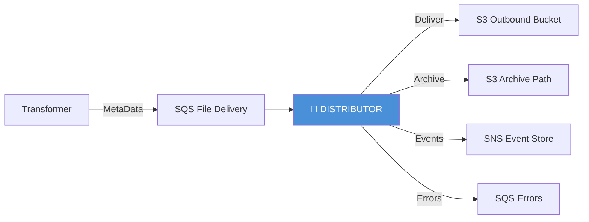
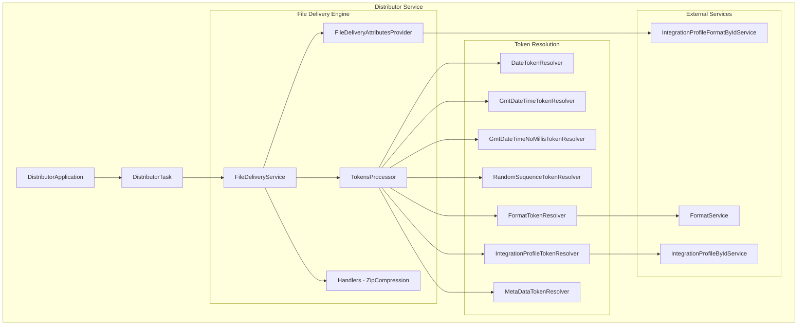
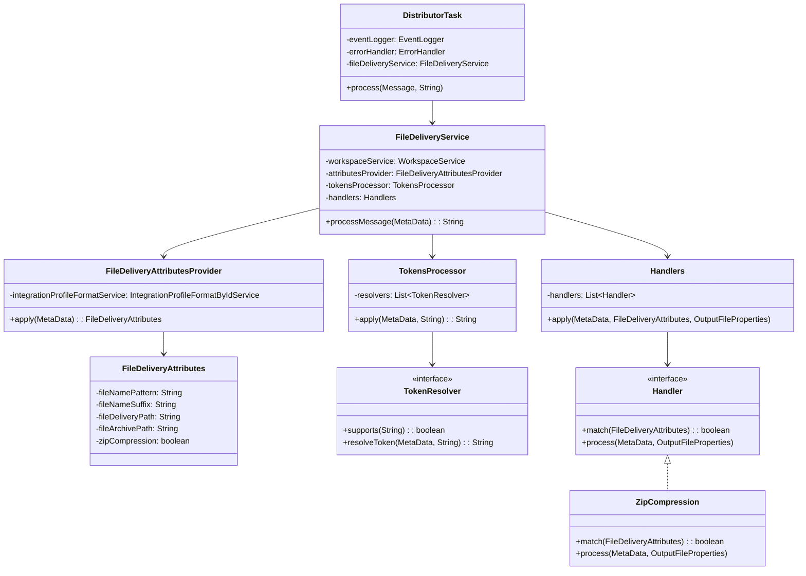
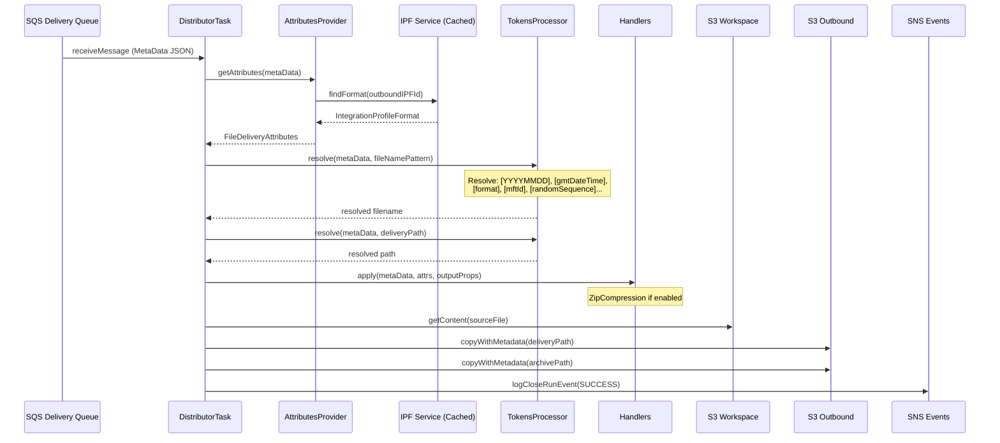

# Distributor Module — Design Document

> **Module:** `distributor`  
> **Generated:** 2026-05-24  
> **Artifact:** `com.inttra.mercury.distributor:distributor:1.0-SNAPSHOT`  
> **Java Version:** 17 | **Framework:** Dropwizard 4.x + Guice 7.x

---

## 1. Executive Summary

The **Distributor** is the file delivery engine of the AppianWay pipeline. It consumes messages from a delivery queue, resolves dynamic file names and paths using token substitution, optionally compresses files, and delivers them to S3 outbound buckets with an archive copy — completing the outbound leg of the message processing lifecycle.

---

## 2. Role in the Pipeline



---

## 3. High-Level Architecture



---

## 4. Class Diagram



---

## 5. Data Flow Diagram



---

## 6. Token Resolution System

| Token | Resolver | Output Example | Source |
|-------|----------|---------------|--------|
| `[YYYYMMDD]` | DateTokenResolver | `20260524` | Clock (UTC) |
| `[gmtDateTime]` | GmtDateTimeTokenResolver | `20260524143025123` | Clock (UTC) |
| `[gmtDateTimenoms]` | GmtDateTimeNoMillisTokenResolver | `20260524143025` | Clock (UTC) |
| `[randomSequence]` | RandomSequenceTokenResolver | `4832769541` | RandomGenerator |
| `[randomSequence1]` | RandomSequenceTokenResolver | `7291048365` | RandomGenerator |
| `[format]` | FormatTokenResolver | `EDI` | FormatService |
| `[ipName]` | IntegrationProfileTokenResolver | `APPLE_OUTBOUND` | IPByIdService |
| `[mftId]` | IntegrationProfileTokenResolver | `12345` | IPByIdService |
| `[tpCode]` | IntegrationProfileTokenResolver | `US_CARRIER` | IPByIdService |
| `[fileNameToken.X]` | MetaDataTokenResolver | *(dynamic)* | MetaData projections |

**Example Pattern Resolution:**
```
Pattern: [ipName]_[format]_[gmtDateTimenoms].[randomSequence].txt
Result:  APPLE_OUTBOUND_EDI_20260524143025.4832769541.txt
```

---

## 7. Configuration Details

| Property | Type | Default | Description |
|----------|------|---------|-------------|
| `componentName` | String | `distributor` | Service identity |
| `healthCheckConfig.errorRateThreshold` | Double | `5.0` | Error rate limit |
| `sqsPickupConfig.queueUrl` | String | — | Delivery pickup queue |
| `sqsPickupConfig.waitTimeSeconds` | int | `20` | Long poll |
| `sqsPickupConfig.maxNumberOfMessages` | int | `10` | Batch size |
| `sqsErrorConfig.queueUrl` | String | — | Error queue |
| `snsEventConfig.topicArn` | String | — | Event topic ARN |
| `s3WorkspaceConfig.bucket` | String | — | Source file bucket |
| `s3OutboundConfig.bucket` | String | — | Delivery target bucket |
| `networkServiceConfig.*` | Object | — | Network service endpoints |

---

## 8. S3 Metadata Tags on Delivery

When files are copied to the outbound bucket, the following metadata is attached:

| Tag | Source | Purpose |
|-----|--------|---------|
| `rootWorkflowId` | MetaData | Workflow tracing |
| `parentWorkflowId` | MetaData | Parent correlation |
| `workflowId` | MetaData | Immediate correlation |
| `integrationProfileFormatId` | Projections | IPF reference |
| `contextCode` | Projections | Business context |
| `ediId` | Projections | EDI identifier |
| `pickupTime` | Projections | Original pickup timestamp |
| `reprocess` | Projections | Reprocessing flag |

---

## 9. Error Handling

| Exception | Error Code | Severity |
|-----------|-----------|----------|
| `AttributeNotFoundException` | `/exception/distributor/business/.../missingAttribute` | Business |
| `MissingProjectionException` | `/exception/distributor/system/.../missingProjection` | System |
| Unhandled | `/exception/distributor/system/.../systemException` | System |

---

## 10. Key Maven Dependencies

| Dependency | Version | Purpose |
|-----------|---------|---------|
| `mercury-shared` | 1.0 | Framework, S3, SQS, Events |
| `dropwizard-core` | 4.0.16 | REST application |
| `guice` | 7.0.0 | DI container |
| `guava` | 33.1.0-jre | Utilities |
| `jaxb-api` | 2.3.1 | XML binding |

---

## 11. Design Patterns

| Pattern | Usage |
|---------|-------|
| **Strategy** | 8 TokenResolver implementations |
| **Chain of Responsibility** | Handlers pipeline (ZipCompression) |
| **Template Method** | AbstractTokenResolver base class |
| **Factory** | TaskFactory for task creation |
| **Decorator** | Cached service wrappers |
