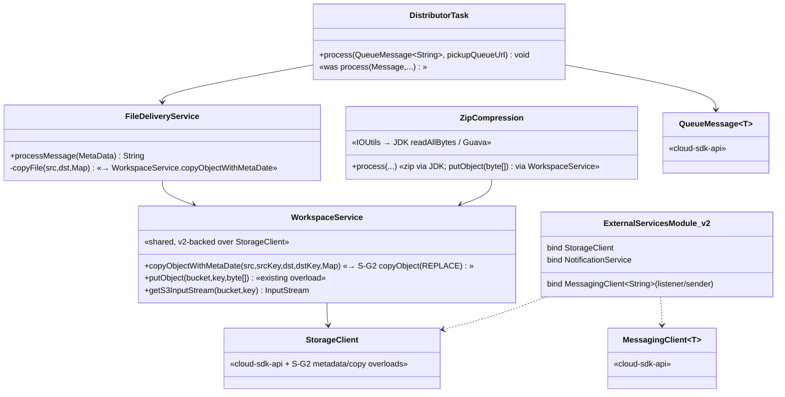
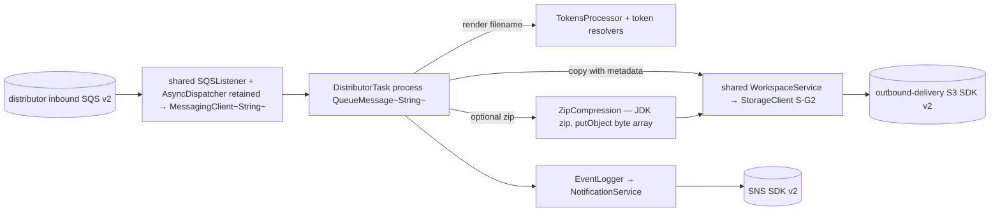
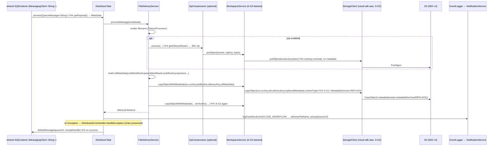

# `distributor` — AWS SDK v2 (cloud-sdk) Upgrade DESIGN (claude)

> Module: `com.inttra.mercury.appian-way:distributor:1.0` · Date: 2026-05-31 · Author: Claude (Opus 4.8)
> **Chosen option: B — adopt `commons` + `cloud-sdk-api`/`cloud-sdk-aws` (`1.0.26-SNAPSHOT`) on Dropwizard 5.** Option A (delegate-in-place) is the fallback and shares the identical AWS rebind.
> Companion: [plan](2026-05-31-distributor-aws2x-upgrade-plan-claude.md). Master: [`shared` DESIGN](../../shared/docs/2026-05-31-shared-aws2x-upgrade-DESIGN-claude.md) §5 (config) / §6 (cloud-sdk specs, incl. S-G2). Governing rule: every cloud-sdk/commons change strictly **additive / behavior-preserving** (zero impact to mercury-services).

---

## 1. Overview & chosen option

distributor is a standard SQS+S3+SNS egress consumer: it parses the `MetaData` envelope, renders a delivery filename from token resolvers, optionally zips the payload, and copies the result to the outbound-delivery bucket **with S3 user metadata** (workflow lineage + projection keys). Under Option B it rebinds [`ExternalServicesModule`](../src/main/java/com/inttra/mercury/distributor/modules/ExternalServicesModule.java) to cloud-sdk-aws factories, inherits the retained `shared` `SQSListener`+`AsyncDispatcher` chain (element type `Message`→`QueueMessage<String>`), and depends on master **S-G2** for the metadata copy. The zip util and `MetaData`/`EventLogger`/`DistributorErrorHandler` chain are preserved.

**No distributor-specific cloud-sdk change** — distributor is a pure consumer of `shared`'s S-G2-backed `WorkspaceService`.

---

## 2. Class diagram — egress classes over StorageClient (before → after)

---

## 3. Component diagram

---

## 4. Sequence diagram — render → zip → copyObjectWithMetaData → event

> Verified against [`FileDeliveryService.java:38-108`](../src/main/java/com/inttra/mercury/distributor/services/FileDeliveryService.java), [`ZipCompression.java:33-46`](../src/main/java/com/inttra/mercury/distributor/handlers/ZipCompression.java), [`DistributorTask.java:46-73`](../src/main/java/com/inttra/mercury/distributor/task/DistributorTask.java). The two `copyObjectWithMetaDate` calls (delivery + archive) are the S-G2 dependency.

---

## 5. Configuration composition

Reference master **DESIGN §5** (appianway composed config command over public commons transforms; credentials/region via v2 default providers). distributor-specific: `conf/distributor.yaml` S3 (`s3_read_put_copy`) + SQS role config map to cloud-sdk-aws options via `shared`; `getS3WorkspaceConfig()`/`getS3OutboundConfig()` bucket names unchanged; `${PROFILE}`/`${ENV}` resource naming unchanged.

---

## 6. cloud-sdk gaps to implement (distributor)

### 6.1 S3 outbound metadata — reference master **S-G2** only

distributor consumes (it does **not** add) the master S-G2 `StorageClient` overloads:

- **copy-with-replaced-metadata** — `StorageClient.copyObject(srcBucket,srcKey,dstBucket,dstKey, Map<String,String> replacedMetadata, String contentType)` with `MetadataDirective.REPLACE`. Backs `WorkspaceService.copyObjectWithMetaDate(...)`, called twice (delivery + archive) at [`FileDeliveryService.java:97-108`](../src/main/java/com/inttra/mercury/distributor/services/FileDeliveryService.java). The metadata map is built at [`FileDeliveryService.java:48-63`](../src/main/java/com/inttra/mercury/distributor/services/FileDeliveryService.java) (workflow IDs + outbound projection keys).
- **plain put** — the existing metadata-less `putObject(bucket,key,byte[])` for the zip object at [`ZipCompression.java:40`](../src/main/java/com/inttra/mercury/distributor/handlers/ZipCompression.java); no new overload needed.

Full S-G2 spec (additive, behavior-preserving; only implementor is `S3StorageClient`) is in master DESIGN **§6.1**. **No distributor-specific cloud-sdk change.**

### 6.2 Everything else — no change

SQS/listener via the retained `shared` chain; SNS publish via `NotificationService`; config via composed commons transforms; health indicators re-pointed to injected cloud-sdk clients. The `IOUtils` swap and JDK zip are appianway-local, no library change.

---

## 7. Maven dependency changes

Pin the cloud-sdk/commons line at **`1.0.26-SNAPSHOT`** (root `dependencyManagement`).

- **Remove from [`distributor/pom.xml`](../pom.xml):** `com.amazonaws:aws-java-sdk-sqs` (44–49) — the only declared v1 AWS dep. (S3/SNS clients arrive transitively via `shared`; once `shared` migrates, no v1 AWS transitive remains.)
- **Add:** `com.inttra.mercury:commons`, `:cloud-sdk-api`, `:cloud-sdk-aws` (`1.0.26-SNAPSHOT`) — `cloud-sdk-api` if distributor names interface types directly (e.g. `QueueMessage`/`StorageClient`); v2 runtime is transitive via `shared`/`cloud-sdk-aws` (Netty excluded, `apache-client` in).
- **No DynamoDB / cloudwatchmetrics** deps in distributor (none declared).
- **Tests:** add `dropwizard-testing` (JUnit 5) and, during transition, `junit-vintage-engine` to keep the existing JUnit 4 tests ([pom.xml:85-90](../pom.xml)) running.
- **Shading:** include `software.amazon.awssdk:*` + `apache-client`; verify no leftover v1 classes / `META-INF/services` clashes; confirm DW5 `io.dropwizard.core.*` packaging.

---

## 8. Test details

- **New tests in JUnit 5 (Jupiter)** via `dropwizard-testing`; existing JUnit 4 tests run via `junit-vintage-engine` during transition.
- **Re-point** `functional-testing` fakes to the cloud-sdk-api interfaces (lockstep with `shared`).
- **Keep / add:**
  - filename rendering (TokensProcessor + resolvers);
  - optional-zip on/off; zip byte content;
  - **metadata round-trip on `copyObjectWithMetaDate`** (S-G2 REPLACE) — assert the workflow/projection keys land on the destination object via the fake `StorageClient`;
  - `putObject` void/`String` return ignored at [ZipCompression:40](../src/main/java/com/inttra/mercury/distributor/handlers/ZipCompression.java);
  - large-fixture streaming guard (optional; document parity if buffering retained).
- `Message`→`QueueMessage<String>` test doubles (`getPayload()` body) in `DistributorTask` tests.

---

## 9. Rollout & verification

1. Migrate `shared` (lands S-G2 additively) + `functional-testing` first (master DESIGN §9).
2. Migrate distributor: rebind `ExternalServicesModule`; `DistributorTask` → `QueueMessage<String>`; `IOUtils` swap; drop `aws-java-sdk-sqs`.
3. `mvn -pl distributor -am verify` (after `shared`). Pairs with `distributor-rest`.
4. Smoke: deliver a doc with and without zip; confirm outbound + archive S3 objects carry the expected user metadata and filename.

---

## 10. Risks & mitigations

| Risk | Mitigation |
|---|---|
| S-G2 metadata not applied on copy (REPLACE) | Functional test asserting destination object metadata via fake `StorageClient`; rely on master S-G2 `MetadataDirective.REPLACE` |
| `void`/`String` putObject return | Call site ignores it ([ZipCompression:40](../src/main/java/com/inttra/mercury/distributor/handlers/ZipCompression.java)); compiler flags otherwise |
| In-memory buffering of large zipped payloads | Parity preserved; optional `putObject(InputStream,length)` later; large-fixture test |
| `Message`→`QueueMessage` drift | `getBody()`→`getPayload()` parity test; same envelope semantics |
| `IOUtils` behavior diff | Prefer JDK `readAllBytes()`/Guava; unit-test the compression helper |
| Any cloud-sdk change breaking mercury-services | None proposed for distributor (only consumes additive S-G2) — strongest possible guarantee |
