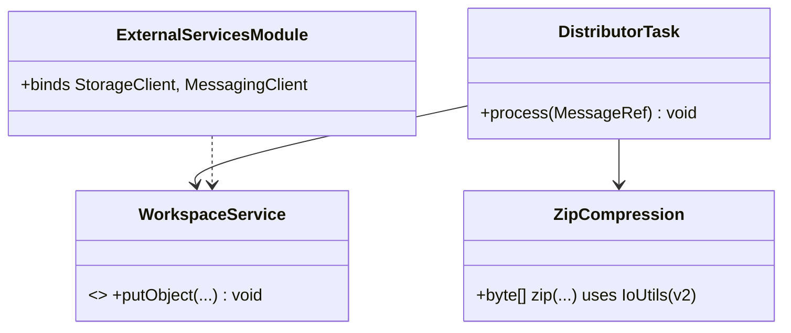
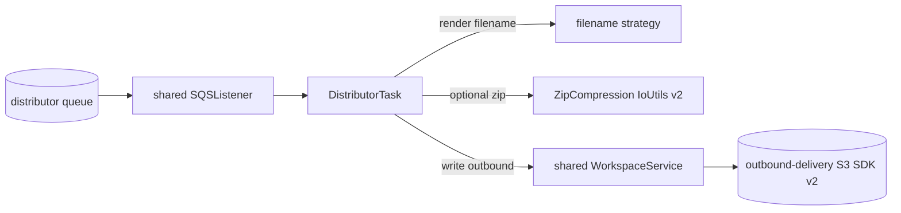
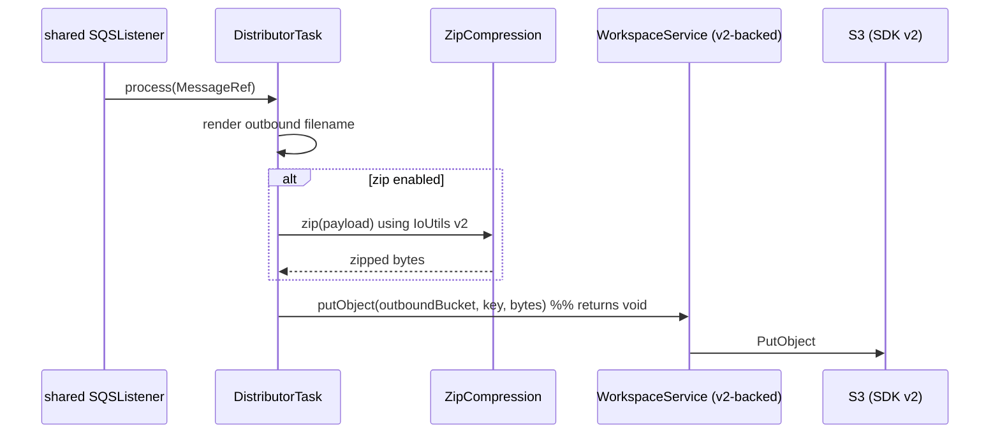

# `distributor` — AWS SDK v2 (cloud-sdk) Upgrade DESIGN

> **DIRECTIVE UPDATE (2026-05-31) — supersedes the Option-A recommendation in this document.** Per stakeholder direction the program now targets **Dropwizard 5** and **Option B — adopt `commons` + `cloud-sdk-api`/`cloud-sdk-aws`** as the directed default (recommend Option A only on a categorical technical blocker). All AWS service communication goes through `cloud-sdk-api`; new tests are written in **JUnit 5 (Jupiter)** (existing JUnit 4 runs via JUnit Vintage during transition); configuration follows the composed appianway `.properties`/`${PROFILE}`/`${ENV}` + commons `${awsps:...}` model in the master [shared plan §10](../../shared/docs/2026-05-31-shared-aws2x-upgrade-plan-copilot.md). cloud-sdk gaps are indexed in the master [shared plan §11](../../shared/docs/2026-05-31-shared-aws2x-upgrade-plan-copilot.md) with full technical specs in the master [shared DESIGN §1A.6](../../shared/docs/2026-05-31-shared-aws2x-upgrade-DESIGN.md).
> **Module-specific cloud-sdk gaps:** G1 (concurrent SQS listener), G2 (S3 putObject with metadata/content-type for rendered outbound files), G6 (config), G7 (health checks). The filename rendering and optional zip (`IOUtils`) file-shaping stay appianway-local (no cloud-sdk gap).
> Sections below are retained as the Option-A fallback reference.

> Module: `distributor` · Date: 2026-05-31 · Author: GitHub Copilot (Claude Opus 4.8) · Option **A**
> Companion: [plan](2026-05-31-distributor-aws2x-upgrade-plan-copilot.md). Foundation: [`shared` DESIGN](../../shared/docs/2026-05-31-shared-aws2x-upgrade-DESIGN.md). Session `83b822b011714117`.

## 1. Overview
Standard consumer migration plus an `IOUtils` swap in the zip path. Rebind `AmazonS3` → `cloud-sdk-aws` `StorageClient`; swap `Message`→`MessageRef`; replace `com.amazonaws.util.IOUtils` with `software.amazon.awssdk.utils.IoUtils`. Outbound writes use `shared` `WorkspaceService` (now returning `void`).

## 2. Class diagram

## 3. Component diagram

## 4. Sequence diagram

## 5. Configuration changes
`conf/distributor.yaml` S3 client config (`s3_read_put_copy`) + SQS keys retained; mapped to v2 via `shared` facade. No placeholder change.

## 6. Maven dependency changes
- **Remove:** `aws-java-sdk-s3` (and `-sqs` if declared) from `distributor/pom.xml`.
- **Add:** `cloud-sdk-api` only if naming interface types.
- v2 runtime transitive via `shared`.

## 7. Test details
- `functional-testing` fakes migrated first.
- Keep tests: filename rendering, optional-zip on/off, zip byte content. Add a large-file streaming test to guard against in-memory buffering.
- DTO construction → `MessageRef`. JUnit 4 retained.

## 8. Rollout & verification
After `shared`/`functional-testing`. `mvn -pl distributor -am verify`. Smoke: deliver a doc with and without zip; confirm outbound S3 object + filename.

## 9. Risks & mitigations
| Risk | Mitigation |
|---|---|
| In-memory buffering of large payloads under v2 put | Preserve streaming put with content-length; large-fixture test |
| `void` putObject return | Confirmed callers ignore result |
| IoUtils diff | Unit-test compression |
