# Appian Way (Mercury) — Cross-Module Architecture Overview

> **Author:** Principal Engineering Review · **Date:** 2026-05-24 · **Scope:** 16 modules — `dispatcher`, `distributor`, `distributor-rest`, `email-sender`, `error-processor`, `event-writer`, `functional-testing`, `ingestor`, `mftdispatcher`, `schema-beans`, `shared`, `splitter`, `structuralvalidator`, `transformer`, `validator`, `watermill`.

This is the index document. Each module has its own design document in `<module>/docs/2026-05-24-<module>-claude.design.md`. This document explains how the parts fit together.

---

## 1. Platform Vision

**Appian Way** (internal codename **Mercury**) is an event-driven file-processing data plane that ingests EDI / XML / proprietary messages from carriers and partners, validates and transforms them into a canonical model, and delivers transformed outbound documents to subscribers via either MFT/SFTP (file drop) or REST. Every step records lineage events on a central event-store SNS topic. The platform is built as a constellation of Dropwizard 4 + Guice + AWS SDK v1 micro-services, each owned by its own SQS queue.

**Key design pillars:**

1. **Event-driven, queue-decoupled.** Each module is a long-poll SQS consumer with an `AsyncDispatcher` thread pool. There are no direct service-to-service calls in the hot path.
2. **One canonical envelope.** [`MetaData`](../shared/) (built by `MetaData.Builder` in `shared`) flows from dispatcher to distributor; payload bodies live in S3 by reference.
3. **Workflow lineage.** Every message carries `rootWorkflowId`, `workflowId`, `parentWorkflowId` UUIDs. Every component emits a `START_*` and `CLOSE_*` event. The `event-writer` and `ingestor` consume the SNS fan-out for audit/indexing.
4. **Two ingress and two egress.** Ingress = [`ingestor`](../ingestor/) (REST/S3) + [`mftdispatcher`](../mftdispatcher/) (filesystem polling, MFT). Egress = [`distributor`](../distributor/) (S3 file drop) + [`distributor-rest`](../distributor-rest/) (HTTP push). The hot pipeline is agnostic to which is used.
5. **`shared` is the foundation.** Every service jar depends on [`mercury-shared:1.0`](../shared/) for Application base, AWS clients, retry, health checks, listener, task base, error model, and Network Services REST clients.

---

## 2. End-to-End Pipeline

```mermaid
flowchart LR
    subgraph IN[Ingress]
        EXT1[REST upload] --> ING[ingestor]
        EXT2[SFTP / MFT] --> MFT[mftdispatcher]
        EXT3[S3 direct PutObject] -.-> S3IN[(S3 inbound-pickup)]
        ING --> S3IN
        MFT --> S3IN
    end

    S3IN -->|s3:ObjectCreated| QDISP[(SQS dispatcher_pu)]
    QDISP --> DISP[dispatcher]
    DISP --> QSV[(SQS structuralvalidator_pu)]
    DISP --> QSPL[(SQS splitter_pu / ce_splitter_pu / webBL_pdf_pu)]

    QSV --> SV[structuralvalidator]
    SV --> QSPL
    QSPL --> SPL[splitter]
    SPL --> QTRA[(SQS transformer_pu)]
    QTRA --> TRA[transformer]
    TRA --> QVAL[(SQS validator_pu)]
    QVAL --> VAL[validator]
    VAL --> QFD[(SQS file_delivery_pu)]
    QFD --> DIS[distributor]
    QFD -.routed.-> DRE[distributor-rest]

    DIS --> S3OUT[(S3 outbound-delivery)]
    S3OUT --> PARTNER1[External MFT pickup]
    DRE --> PARTNER2[Subscriber HTTP endpoint]

    subgraph OBS[Observability / cross-cutting]
        SNS[(SNS event_store)]
        QEV[(SQS event_store_pu)]
        QING[(SQS ingestor_pu)]
        EW[event-writer]
        IDX[ingestor as indexer]
        QERR[(SQS subscription_errors)]
        EP[error-processor]
        QEMAIL[(SQS email_pu)]
        EMS[email-sender]
        SES[(AWS SES)]
    end

    DISP -.start/close.-> SNS
    SV -.events.-> SNS
    SPL -.events.-> SNS
    TRA -.events.-> SNS
    VAL -.events.-> SNS
    DIS -.events.-> SNS
    DRE -.events.-> SNS
    MFT -.events.-> SNS
    SNS --> QEV --> EW
    SNS --> QING --> IDX

    DISP -.error.-> QERR
    SV -.error.-> QERR
    SPL -.error.-> QERR
    TRA -.error.-> QERR
    VAL -.error.-> QERR
    DIS -.error.-> QERR
    DRE -.error.-> QERR
    MFT -.error.-> QERR
    QERR --> EP
    EP --> QEMAIL
    QEMAIL --> EMS
    EMS --> SES

    subgraph BUS[Side bus — Watermill]
        WM[watermill aggregator]
        WM_ITV[itv-gps-consumer]
        WM_CS[cargoscreen-consumer]
        WM_BI[booking-inbound-consumer]
        WM_VI[visibility-inbound-consumer]
        WM --> WM_ITV
        WM --> WM_CS
        WM --> WM_BI
        WM --> WM_VI
        EXT4[External gRPC streams] -.-> WM
    end
```



---

## 3. Module Catalogue

### 3.1 Hot pipeline (inbound → outbound)

| # | Module | Role | Trigger | Detail doc |
|---|---|---|---|---|
| 1 | [ingestor](../ingestor/) | Event indexer (despite the misleading name, *not* a first-stage receiver — it indexes events from `sqs_ingestor_pu` into Elasticsearch for the txtrack UI). | SNS fan-out → `sqs_ingestor_pu` | [ingestor design](../ingestor/docs/2026-05-24-ingestor-claude.design.md) |
| 2 | [mftdispatcher](../mftdispatcher/) | MFT ingress — Apache Camel `file://` polling consumer that mirrors files into the inbound-pickup S3 bucket. | Filesystem mount at `fsConfig.root` | [mftdispatcher design](../mftdispatcher/docs/2026-05-24-mftdispatcher-claude.design.md) |
| 3 | [dispatcher](../dispatcher/) | S3 → SQS-triggered routing gate. Copies inbound files to workspace; resolves archive-format type; routes to the right splitter queue (or booking-bridge); preprocesses zips. | `s3:ObjectCreated` → `sqs_dispatcher_pu` | [dispatcher design](../dispatcher/docs/2026-05-24-dispatcher-claude.design.md) |
| 4 | [structuralvalidator](../structuralvalidator/) | *Library* (not standalone service) embedded in the transformer; performs XSD / schema-level checks and produces `StructuralValidationResult` beans. | Called by transformer | [structuralvalidator design](../structuralvalidator/docs/2026-05-24-structuralvalidator-claude.design.md) |
| 5 | [splitter](../splitter/) | Strategy-pattern parser dispatch. Splits envelope containers (EDI INTERCHANGE, multi-doc XML) into per-document child messages, persists each child to S3, fans them out to transformer. | `sqs_splitter_pu` / `sqs_ce_splitter_pu` / `sqs_webBL_pdf_pu` | [splitter design](../splitter/docs/2026-05-24-splitter-claude.design.md) |
| 6 | [transformer](../transformer/) | Mapping engine — selects a Contivo runtime + XSLT/Java map based on the IntegrationProfileFormat and converts to canonical. | `sqs_transformer_pu` | [transformer design](../transformer/docs/2026-05-24-transformer-claude.design.md) |
| 7 | [validator](../validator/) | Business / semantic validation: hand-rolled `Resolver` chain driving a `validationErrorsConfig` matrix. Pass = route to distributor; fail = route to error-processor. | `sqs_ce_validate_pu` | [validator design](../validator/docs/2026-05-24-validator-claude.design.md) |
| 8 | [distributor](../distributor/) | File-shape egress — resolves the per-recipient delivery attributes (filename pattern, path, suffix, zip flag), renders the name via token resolvers, optionally zips, and copies the file to the outbound-delivery S3 bucket. | `sqs_file_delivery_pu` | [distributor design](../distributor/docs/2026-05-24-distributor-claude.design.md) |
| 9 | [distributor-rest](../distributor-rest/) | REST/HTTP egress — pulls workspace payload and POSTs to subscriber endpoints with OAuth bearer auth (e2net response contract). | `sqs_file_delivery_pu` (routed) | [distributor-rest design](../distributor-rest/docs/2026-05-24-distributor-rest-claude.design.md) |

### 3.2 Cross-cutting / observability

| # | Module | Role | Trigger |
|---|---|---|---|
| 10 | [event-writer](../event-writer/) | Audit sink — long-polls `sqs_event_store_pu` (SNS fan-out) and persists each event as JSON in the workspace S3 bucket under `eventstore/{date}/{rootWorkflowId}/...`. | SNS → `sqs_event_store_pu` |
| 11 | [error-processor](../error-processor/) | Fan-in for `sqs_subscription_errors` — archives the error to S3 and fans out to per-recipient `sqs_email_outbound`. | `sqs_subscription_errors` |
| 12 | [email-sender](../email-sender/) | Thymeleaf-templated SES emails, rate-limited per recipient. SES-only (no SMTP, no attachments). | `sqs_email_pu` |

### 3.3 Libraries (no main, jar dependency only)

| # | Module | Role |
|---|---|---|
| 13 | [shared](../shared/) | The platform foundation: Dropwizard base, AWS wrappers, SQS listener, task base, MetaData envelope, EventLogger, ErrorHandler base, Network Services REST clients, retry, health checks, parameter store. **Every service depends on this.** |
| 14 | [schema-beans](../schema-beans/) | JAXB-generated beans for the single `StructuralValidationResult.xsd`. Consumed primarily by structuralvalidator and transitively by transformer. |
| 15 | [functional-testing](../functional-testing/) | Shared functional-test SDK (library jar). JUnit-4 lifecycle, in-memory AWS fakes for S3/SQS/DynamoDB/SES, AssertJ DSL. Pulled in `<scope>test</scope>` by all services. |

### 3.4 Side-bus (out-of-pipeline)

| # | Module | Role |
|---|---|---|
| 16 | [watermill](../watermill/) | Aggregator hosting four gRPC stream consumers (`itv-gps-consumer`, `cargoscreen-consumer`, `booking-inbound-consumer`, `visibility-inbound-consumer`) plus a `consumer-commons` shared library. DynamoDB `watermill_offset` table provides at-least-once durability. **Not part of the main file pipeline** — separate event bus for domain feeds. |

---

## 4. Tech Stack Summary

| Layer | Choice | Pinned version |
|---|---|---|
| Language | Java | 17 (most services) / 8 (mftdispatcher and some legacy) |
| Build | Maven | aggregator pom; each module shades to an uber-jar |
| Service framework | Dropwizard | 4.0.16 (most) / 1.1.1 (mftdispatcher) |
| DI | Google Guice | 7.0.0 / 4.1.0 (mftdispatcher) |
| Cloud SDK | AWS Java SDK v1 | 1.12.720 |
| Queue/topic | AWS SQS + SNS | — |
| Object store | AWS S3 | — |
| Secrets | AWS SSM Parameter Store | — |
| Metrics | Dropwizard Metrics + `metrics-guice` AOP + Datadog reporter | 4.2.37 |
| Logging | SLF4J 2 + Logback 1.5.21 | — |
| Serialization | Jackson 2 (JSON) + JAXB (XML) | — |
| Validation | Hibernate Validator (Jakarta Bean Validation 3) | bundled with Dropwizard |
| Templating | Thymeleaf (email-sender) | — |
| Test | JUnit 4 + Mockito + AssertJ + custom `functional-testing` harness | 4.13.2 / 2.27.0 / 3.19.0 |
| RPC bus (side) | gRPC + Protobuf | 1.77.0 (watermill) |
| File polling | Apache Camel `file://` | 2.19.2 (mftdispatcher only) |

---

## 5. Cross-Cutting Concerns

### 5.1 Configuration

Every service follows the same recipe:
- `conf/<service>.yaml` ships inside the shaded jar as a Dropwizard template containing `${placeholder}` references.
- One or more `.properties` files supplied on the CLI (`conf/<service>.properties`, `network-services.properties`, `datadog.properties`) override placeholders.
- `${PROFILE}` and `${ENV}` environment variables expand resource names (`${PROFILE}_${ENV}_sqs_<role>_pu`).
- Custom `ConfigProcessingServerCommand` from `shared` does the substitution before Dropwizard validates the YAML.
- Hibernate Validator enforces `@NotNull`, `@Valid`, `@Digits`, `@Pattern` annotations at startup — fail-fast.

### 5.2 Messaging contracts

- **`MetaData`** JSON envelope is the pipeline currency. It carries `rootWorkflowId`/`workflowId`/`parentWorkflowId`, `component`, `bucket`+`fileName`, and a flat `projections` map of well-known keys (`MFT_ID`, `FILE_TYPE`, `OUTBOUND_INTEGRATION_PROFILE_FORMAT_ID`, `OUTBOUND_EDI_ID`, `CONTEXT_CODE`, `EXIT_STATUS`, …).
- **SNS event envelope** (`SNSNotification` wrapping an `Event`) carries lifecycle markers — `START_WORKFLOW`, `CLOSE_WORKFLOW`, `START_RUN`, `CLOSE_RUN` — with `success` flag and arbitrary tokens.

### 5.3 Threading & backpressure

- One `SQSListener` thread per service does long-poll `ReceiveMessage` (20s wait, 10 max).
- `AsyncDispatcher` is an `ExecutorService` gated by a semaphore = `maxNumberOfMessages` so the listener never holds invisible messages beyond pool capacity.
- SQS visibility-timeout is the cross-cutting safety net for stuck workers.

### 5.4 Health checks

`HealthCheckRegistrar.registerDefaultAndOpsHealthChecks` (in `shared`) registers split read/write checks at both the standard Dropwizard endpoint and a Mercury ops endpoint. Categories:
- **Read** — Inbound SQS, S3 read, `ErrorThresholdHealthCheck` against the per-service `messages-failed` meter, optional `HttpGetHealthCheck` against Network Services.
- **Write** — Outbound SQS error, S3 write, SNS publish.

### 5.5 Observability

Datadog metrics via `metrics-guice` AOP (`@Metered`, `@Timed`, `@ExceptionMetered`). Logs ship via Logback console appender to ECS logs → Datadog. No distributed tracing in the code paths reviewed (Datadog APM agent attached via JVM args, not code).

### 5.6 Resilience

- AWS SDK v1 default retry (3 retries, exponential backoff).
- Mercury `NetworkRetryerModule` (Resilience4j-style) wraps Network Services calls.
- Hystrix bundle imports exist in some modules but are commented out — circuit breaking is effectively disabled. Tracking in module-level risk lists.

### 5.7 Error semantics

Every service implements an `ErrorHandler` subclass that:
1. Maps known exception classes to slash-delimited error codes.
2. Publishes a failure `CLOSE_RUN`/`CLOSE_WORKFLOW` event.
3. Posts the original `MetaData` to `sqs_subscription_errors` (consumed by `error-processor`).
4. Deletes the original SQS message (no poison-pill loops).

`RecoverableException` (in shared) is a special carrier for transient failures — the surrounding retry layer redrives.

---

## 6. AWS Resource Naming Convention

All AWS resources follow `${PROFILE}_${ENV}_<type>_<role>` for SQS/SNS and `${PROFILE}-${ENV}-<role>` for S3 (since bucket names cannot contain `_`).

| Resource | Role |
|---|---|
| `*_sqs_dispatcher_pu` | dispatcher pickup |
| `*_sqs_ident_sec_pu` | identity/security (cerberus) — fed by mftdispatcher |
| `*_sqs_splitter_pu` | splitter pickup |
| `*_sqs_ce_splitter_pu` | CE-specific splitter pickup (315 IFTSTA) |
| `*_sqs_ce_fulfiller_pu` | fulfiller |
| `*_sqs_ce_validate_pu` | validator pickup |
| `*_sqs_file_delivery_pu` | distributor/distributor-rest pickup |
| `*_sqs_subscription_errors` | error fan-in |
| `*_sqs_event_store_pu` | event-writer pickup |
| `*_sqs_ingestor_pu` | ingestor indexer pickup |
| `*_sqs_email_pu` | email-sender pickup |
| `*_sqs_bk_inbound_pu` | booking-bridge inbound |
| `*_sqs_si_inbound_pu` | shipping-instruction inbound |
| `*_sqs_ce_inbound_pu` | CE inbound |
| `*_sns_event_store` | central event topic (fan-out to event-writer + ingestor) |
| `*-inbound-pickup` (S3) | inbound landing bucket |
| `*-workspace` (S3) | scratch + canonical store while workflow runs |
| `*-outbound-delivery` (S3) | distributor target |

---

## 7. Module Dependency Graph

```mermaid
graph TB
    subgraph LIB[Library jars]
        SHARED[shared]
        SCHEMA[schema-beans]
        FT[functional-testing]
        SV[structuralvalidator]
        WMCC[watermill/consumer-commons]
    end

    subgraph SVC[Service jars]
        DISP[dispatcher]
        MFTD[mftdispatcher]
        ING[ingestor]
        SPL[splitter]
        TRA[transformer]
        VAL[validator]
        DIS[distributor]
        DRE[distributor-rest]
        EW[event-writer]
        EP[error-processor]
        EMS[email-sender]
    end

    subgraph WM[Watermill sub-modules]
        WM_ITV[itv-gps-consumer]
        WM_CS[cargoscreen-consumer]
        WM_BI[booking-inbound-consumer]
        WM_VI[visibility-inbound-consumer]
    end

    DISP --> SHARED
    MFTD --> SHARED
    ING --> SHARED
    SPL --> SHARED
    TRA --> SHARED
    TRA --> SV
    SV --> SCHEMA
    VAL --> SHARED
    DIS --> SHARED
    DRE --> SHARED
    EW --> SHARED
    EP --> SHARED
    EMS --> SHARED

    DISP -.test.-> FT
    MFTD -.test.-> FT
    ING -.test.-> FT
    SPL -.test.-> FT
    TRA -.test.-> FT
    VAL -.test.-> FT
    DIS -.test.-> FT
    DRE -.test.-> FT
    EW -.test.-> FT
    EP -.test.-> FT
    EMS -.test.-> FT

    WM_ITV --> WMCC
    WM_BI --> WMCC
    WM_VI --> WMCC
    WM_CS -.duplicates code from.-> WMCC
```



Every service jar depends on `shared`. `structuralvalidator` is the only first-party consumer of `schema-beans`. `functional-testing` is a test-scope dependency of every service. The four watermill consumers share `consumer-commons` (except `cargoscreen-consumer`, which duplicates 12 commons classes — flagged as tech debt in the watermill design doc).

---

## 8. Risk Heatmap (Cross-Cutting)

Aggregated from the per-module risk sections; sorted by recurring themes.

| Theme | Affected modules | Severity | Notes |
|---|---|---|---|
| JDK mismatch between Dockerfile (`openjdk:8`) and pom (`java 17`) | dispatcher, distributor, splitter, mftdispatcher (legacy) | High | Many service Dockerfiles still target Java 8 while the parent pom moved to 17. Builds will fail to run on Java 8. |
| Plaintext Datadog API key committed in YAML | mftdispatcher, validator | High | Should move to env var / SSM. |
| `mockito-core` at compile scope (not `test`) | dispatcher, splitter | Medium | Bloats shaded jar, leaks test classes into prod classpath. |
| Hystrix bundle imported but commented out | dispatcher, distributor, others | Medium | Circuit breaker effectively disabled. |
| Silent token / projection drops | distributor (unresolved `{tokens}` survive), dispatcher (`IgnorePreprocessor`), error-processor (recipient set-once bug) | Medium | Observability gap — need explicit metrics. |
| Partial-success / non-atomic dual writes | dispatcher (workspace orphan), distributor (delivery vs archive), mftdispatcher (S3 then disk) | Medium | Document and add compensating cleanup. |
| In-memory zip / unzip with no size limit | dispatcher (`ZipPreprocessor`), distributor (`ZipCompression`), splitter | Medium | OOM risk on multi-GB payloads. |
| AWS SDK v1 + Camel 2.19 version drift | mftdispatcher | Medium | Nearest-wins resolution risks silent runtime breakage. |
| Hardcoded values that should be config | mftdispatcher (`text/plain`), splitter (`IFTSTA`), structuralvalidator (envelope name) | Low–Medium | Refactor to config-driven. |
| Stale comments / docs | README claims `txtrack` writes to DynamoDB but actual implementation is S3 (event-writer); ingestor name implies "first-stage" but it is actually an event indexer | Low | Update README and module javadocs. |

---

## 9. How to Read the Per-Module Docs

Each per-module document follows the same 13-section template (Sections 1–13 plus appendices where the module warranted it):

1. Executive Summary
2. Position in the Mercury Pipeline (Mermaid)
3. High-Level Architecture (Mermaid)
4. Low-Level Design (Mermaid)
5. Key Classes — Class Diagram (Mermaid)
6. Data Flow Diagram — sequence diagram (Mermaid)
7. Component Dependencies (Mermaid)
8. Configuration & Validation (tables)
9. Maven Dependencies (table)
10. How the Module Works — Detailed Walkthrough (numbered steps with file:line citations)
11. Error Handling & Edge Cases
12. Operational Notes (Dockerfile, IntelliJ run, IAM, observability)
13. Open Questions / Risks

Every file path inside a module doc is a relative markdown link clickable from the docs folder.

---

## 10. Quick-Start: Running Locally

From [`README.md`](../README.md), the standard local run for any service:

```
PROFILE=aaa001 ENV=dev AWS_REGION=us-east-1
AWS_ACCESS_KEY_ID=...  AWS_SECRET_ACCESS_KEY=...
java -jar <service>-1.0.jar run <service>.yaml conf/<service>.properties \
     ../configuration/int/network-services.properties \
     ../configuration/dev/datadog.properties
```

A `docker-compose.yaml` at the repo root brings up the stack against your AWS dev account using `aws.env`.

---

## 11. Index of Design Documents

| # | Module | Document |
|---|---|---|
| 1 | dispatcher | [dispatcher/docs/2026-05-24-dispatcher-claude.design.md](../dispatcher/docs/2026-05-24-dispatcher-claude.design.md) |
| 2 | distributor | [distributor/docs/2026-05-24-distributor-claude.design.md](../distributor/docs/2026-05-24-distributor-claude.design.md) |
| 3 | distributor-rest | [distributor-rest/docs/2026-05-24-distributor-rest-claude.design.md](../distributor-rest/docs/2026-05-24-distributor-rest-claude.design.md) |
| 4 | email-sender | [email-sender/docs/2026-05-24-email-sender-claude.design.md](../email-sender/docs/2026-05-24-email-sender-claude.design.md) |
| 5 | error-processor | [error-processor/docs/2026-05-24-error-processor-claude.design.md](../error-processor/docs/2026-05-24-error-processor-claude.design.md) |
| 6 | event-writer | [event-writer/docs/2026-05-24-event-writer-claude.design.md](../event-writer/docs/2026-05-24-event-writer-claude.design.md) |
| 7 | functional-testing | [functional-testing/docs/2026-05-24-functional-testing-claude.design.md](../functional-testing/docs/2026-05-24-functional-testing-claude.design.md) |
| 8 | ingestor | [ingestor/docs/2026-05-24-ingestor-claude.design.md](../ingestor/docs/2026-05-24-ingestor-claude.design.md) |
| 9 | mftdispatcher | [mftdispatcher/docs/2026-05-24-mftdispatcher-claude.design.md](../mftdispatcher/docs/2026-05-24-mftdispatcher-claude.design.md) |
| 10 | schema-beans | [schema-beans/docs/2026-05-24-schema-beans-claude.design.md](../schema-beans/docs/2026-05-24-schema-beans-claude.design.md) |
| 11 | shared | [shared/docs/2026-05-24-shared-claude.design.md](../shared/docs/2026-05-24-shared-claude.design.md) |
| 12 | splitter | [splitter/docs/2026-05-24-splitter-claude.design.md](../splitter/docs/2026-05-24-splitter-claude.design.md) |
| 13 | structuralvalidator | [structuralvalidator/docs/2026-05-24-structuralvalidator-claude.design.md](../structuralvalidator/docs/2026-05-24-structuralvalidator-claude.design.md) |
| 14 | transformer | [transformer/docs/2026-05-24-transformer-claude.design.md](../transformer/docs/2026-05-24-transformer-claude.design.md) |
| 15 | validator | [validator/docs/2026-05-24-validator-claude.design.md](../validator/docs/2026-05-24-validator-claude.design.md) |
| 16 | watermill | [watermill/docs/2026-05-24-watermill-claude.design.md](../watermill/docs/2026-05-24-watermill-claude.design.md) |

---

*Generated as part of the 2026-05-24 architecture audit. This overview is intended as the entry point; deep technical detail lives in the individual module documents.*
