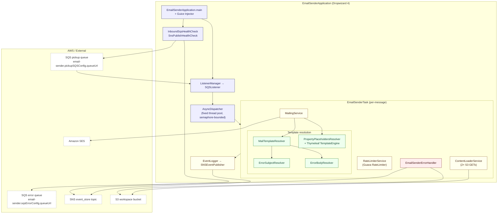
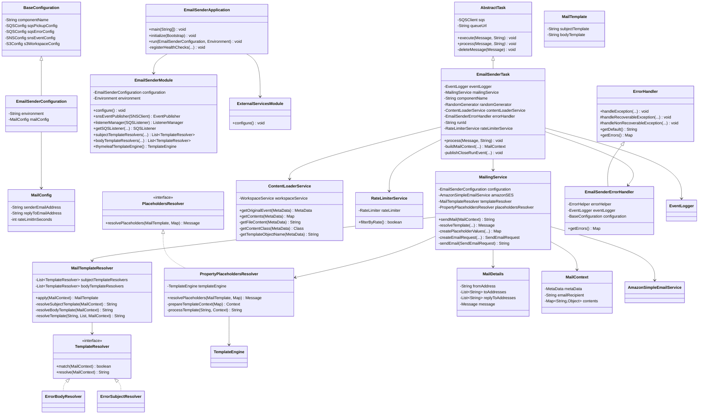

# Email-Sender Module — Architecture & Design

> **Author:** Principal Engineering Review · **Date:** 2026-05-24 · **Module Version:** 1.0 (Maven artifact `com.inttra.mercury.appian-way:email-sender:1.0`, see [../pom.xml](../pom.xml#L12-L16))

---

## 1. Executive Summary

The **email-sender** is a Dropwizard 4 service in the Mercury / Appian Way pipeline whose sole purpose is to convert error / notification events that have been deposited on an SQS queue into outbound emails delivered through **Amazon SES**. It is one of the *terminal* components of the inbound EDI/Container-Events error-handling pipeline: by the time a message lands on `inttra*_sqs_email_outbound`, an upstream component (typically the structural validator, the canonical-beans validator, the splitter, or the dispatcher) has already decided that a human-readable error notification must be emailed to an EDI/MFT trading partner.

Three properties drive the design:

1. **Pull, render, send** — The service pulls from SQS, hydrates a `MailContext` by reading the original event payload and the `Annotations` (errors) document from the S3 workspace bucket, renders body and subject through a **Thymeleaf** `StringTemplateResolver` operating on text-mode templates, and ships the resulting `Message` to **Amazon SES** with no AWS SDK-level retries (see [`ExternalServicesModule.java:30-33`](../src/main/java/com/inttra/mercury/email/modules/ExternalServicesModule.java)).
2. **No attachments** — Despite being framed as an email service, the current implementation supports *only* plain-text bodies. There is no MIME multipart construction, no S3-streamed attachment, no `SendRawEmailRequest`. The SES request is always built with `Destination`, `Source`, `Message(Subject, Body(Text))` — see [`MailingService.java:86-94`](../src/main/java/com/inttra/mercury/email/services/MailingService.java).
3. **Global rate limit** — A single Guava `RateLimiter` (one permit per `rateLimitInSeconds`, default 120 seconds → 1 email every two minutes) is consulted before every SES call. If `tryAcquire()` returns `false`, the email is **silently dropped** and a close-run event is published with `messageDropped=true` (see [`EmailSenderTask.java:67-71`](../src/main/java/com/inttra/mercury/email/task/EmailSenderTask.java) and [`RateLimiterService.java:14-20`](../src/main/java/com/inttra/mercury/email/services/RateLimiterService.java)).

The service is wired through **Google Guice 7** (with Palomino Labs `metrics-guice` AOP for `@Metered` annotations) and shares its operational substrate — `AbstractTask`, `AsyncDispatcher`, `SQSListener`, `ErrorHandler`, `EventLogger`, `S3WorkspaceService` — with every other Mercury microservice via the `com.inttra.mercury.shared:mercury-shared` artifact. There is *no* SMTP path: only AWS SES is supported. There is no DLQ logic specific to this service; recovery follows the standard shared `ErrorHandler` recoverable / non-recoverable / DLQ ladder defined in [`shared/.../ErrorHandler.java:44-102`](../../shared/src/main/java/com/inttra/mercury/shared/task/ErrorHandler.java).

The module is small (~250 LoC of production Java across nine packages) and stable; the chief operational risks are (a) the silent rate-limit drop, (b) `default_error_subject.txt` and `error_email_body.txt` being defined but **not used** (the only active resolvers fall through to the `non_application_error_*` variants — see [`ErrorBodyResolver.java:18-23`](../src/main/java/com/inttra/mercury/email/services/resolvers/body/ErrorBodyResolver.java)), and (c) SES being configured with `maxErrorRetry=0`, meaning every transient SES failure surfaces as a `RecoverableException` that the shared `ErrorHandler` retries through the SQS visibility-timeout mechanism.

---

## 2. Position in the Mercury Pipeline

Mercury (a.k.a. Appian Way) is a series of stateless Dropwizard microservices threaded together by SQS queues, an `event_store` SNS topic that fans out to the event-writer, and a shared S3 *workspace* bucket where intermediate payloads live keyed by `rootWorkflowId/fileName`. The email-sender is one of the **outbound notification leaves** of this graph.

```mermaid
flowchart LR
    classDef inbound fill:#e6f3ff,stroke:#1f6feb,color:#0b3b8c
    classDef proc fill:#fff7e0,stroke:#b48a00,color:#5a4400
    classDef notify fill:#ffe6e6,stroke:#a30000,color:#660000
    classDef store fill:#e6ffe6,stroke:#1a7f1a,color:#0b4d0b

    MFT[MFT / EDI<br/>Trading Partners]:::inbound
    Ingestor[ingestor]:::proc
    Dispatcher[dispatcher]:::proc
    Splitter[splitter]:::proc
    StructVal[structuralvalidator]:::proc
    CanonVal[validator / canonical-beans]:::proc
    Transformer[transformer]:::proc
    Distributor[distributor /<br/>distributor-rest]:::proc
    ErrorProc[error-processor]:::proc

    EmailQueue[(inttra*_sqs_email_outbound)]:::store
    Workspace[(S3 workspace bucket<br/>rootWorkflowId/fileName)]:::store
    EventTopic[(SNS event_store)]:::store
    ErrorQueue[(inttra*_sqs_subscription_errors)]:::store

    EmailSender[[email-sender<br/>Dropwizard service]]:::notify
    SES[(Amazon SES)]:::notify
    EventWriter[event-writer]:::proc
    Subscriber[Email Recipient<br/>support@trading-partner]:::inbound

    MFT --> Ingestor --> Dispatcher --> Splitter --> StructVal --> CanonVal --> Transformer --> Distributor
    StructVal -. errors .-> ErrorProc
    CanonVal  -. errors .-> ErrorProc
    Transformer -. errors .-> ErrorProc
    ErrorProc --> EmailQueue
    Distributor -. emails .-> EmailQueue
    Workspace <-. annotations / events .-> ErrorProc
    Workspace <-. annotations / events .-> EmailSender
    EmailQueue --> EmailSender
    EmailSender --> SES --> Subscriber
    EmailSender --> EventTopic --> EventWriter
    EmailSender -. non-recoverable .-> ErrorQueue
```



### 2.1 Upstream producers

The queue defined by `email-sender.pickupSQSConfig.queueUrl` (`inttra*_sqs_email_outbound` in non-`int` environments, `inttra_int_sqs_email_outbound` in INT — see [`conf/int/email-sender.properties:3`](../conf/int/email-sender.properties) and [`conf/prod/email-sender.properties:3`](../conf/prod/email-sender.properties)) is fed by **the error-processor** and by upstream validators whenever an inbound message produces errors that must reach a human at a trading partner. The payload that lands on this queue is a `MetaData` JSON document whose `projections` map contains a `RECIPIENT_EMAIL_ID` key — see [`MetaData.java:88`](../../shared/src/main/java/com/inttra/mercury/shared/task/MetaData.java) and the inbound sample at [`src/test/resources/inbound_mail_message.json:14`](../src/test/resources/inbound_mail_message.json).

Two layers of S3 lookups follow:

1. **First lookup — the original event.** `metaData.bucket` + `metaData.fileName` point to the JSON that was the upstream "open-run" event for this message. The email-sender deserializes it again into a `MetaData` (`ContentLoaderService.getOriginalEvent` — see [`ContentLoaderService.java:24-26`](../src/main/java/com/inttra/mercury/email/services/ContentLoaderService.java)) to recover the *original* workflow context (true `workflowId`, `rootWorkflowId`, `projections.mftId`, `projections.ediId`, etc.).
2. **Second lookup — the error annotations.** The `MetaData` obtained from the first lookup is itself re-keyed (its own `bucket`/`fileName`) to fetch an `Annotations` document — typed as `com.inttra.mercury.shared.workspace.Annotations` (see [`shared/.../Annotations.java`](../../shared/src/main/java/com/inttra/mercury/shared/workspace/Annotations.java)). This is what populates `${content.Annotations}` in the Thymeleaf body template.

### 2.2 Downstream consumers

* **Amazon SES** is the only mail transport. Address-list expansion, suppression-list management, and bounce/complaint handling all live in SES. The module does not interact with SES bounce notifications.
* **SNS `event_store` topic** receives a close-run event for every processed SQS message (success, drop, or failure). The `event-writer` service persists these to the event store. The publication is built via `SNSEventPublisher` provided in [`EmailSenderModule.java:70-74`](../src/main/java/com/inttra/mercury/email/modules/EmailSenderModule.java).
* **`inttra*_sqs_subscription_errors`** is the *error queue* used by the shared `ErrorHandler.handleNonRecoverableException` flow. Non-recoverable failures cause the failure `MetaData` to be re-published there for the error-processor to potentially re-route into a different notification stream — see [`shared/.../ErrorHandler.java:90-102`](../../shared/src/main/java/com/inttra/mercury/shared/task/ErrorHandler.java).

### 2.3 Where this fits vs. siblings

Compared to the other Mercury services:

| Service | Output | Synchronous? |
|---|---|---|
| ingestor | S3 + SQS | No |
| dispatcher | SQS (fan-out) | No |
| transformer | S3 + SQS | No |
| distributor | HTTP / SFTP / S3 | Yes (HTTP) |
| **email-sender** | **SES** | **Yes (SES API)** |

The email-sender is the *only* Mercury service whose external dependency is SES. That makes it conceptually similar to the `distributor` family (synchronous external delivery, recoverable on SDK failure, no DLQ on transient errors) but with a single, fixed protocol.

---

## 3. High-Level Architecture



### 3.1 Architectural style

* **Worker / dispatcher pattern.** A single SQS long-poll loop on the pickup queue feeds an `AsyncDispatcher` (fixed-size `ExecutorService` whose width is bound by `maxNumberOfMessages`, defaulting to 1 — see [`email-sender.yaml:7`](../conf/email-sender.yaml) and [`EmailSenderModule.java:60`](../src/main/java/com/inttra/mercury/email/modules/EmailSenderModule.java)). Each polled message becomes a new `EmailSenderTask` instance via a Guice `Provider<EmailSenderTask>` wrapped in a `TaskFactory` lambda (`message -> taskProvider.get()`), guaranteeing per-message state isolation.
* **Strategy pattern for template selection.** `MailTemplateResolver` walks two ordered lists of `TemplateResolver` strategies — one for subject, one for body — and asks each whether it `match(mailContext)`. The first match wins. Adding a new mail type means dropping in a new `TemplateResolver` and updating the `@Named` collection providers in [`EmailSenderModule.java:95-105`](../src/main/java/com/inttra/mercury/email/modules/EmailSenderModule.java).
* **Template engine.** Thymeleaf 3.0.7 with a `StringTemplateResolver` in `TemplateMode.TEXT`. The actual template strings are loaded from classpath resources via `Files.resourceAsString` ([`Files.java:17`](../../shared/src/main/java/com/inttra/mercury/shared/support/Files.java)) at *resolve time* on each request — there is no template caching layer in this service (Thymeleaf itself caches by template-content key, but reads from a string source).
* **Dropwizard substrate.** Dropwizard 4.0.16 on Java 17. The YAML configuration is layered over property files via the shared `ConfigProcessingServerCommand` and (optionally) an S3-hosted configuration source provider (`S3ConfigurationProvider`, see [`EmailSenderApplication.java:38-40`](../src/main/java/com/inttra/mercury/email/EmailSenderApplication.java)).

### 3.2 Concurrency model

Concurrency is single-knob: `pickupSQSConfig.maxNumberOfMessages`. That value drives both the SQS `ReceiveMessage.MaxNumberOfMessages` request *and* the size of the `Executors.newFixedThreadPool` inside `AsyncDispatcher` (and its `Semaphore` permits). For email-sender, leaving this at the default of 1 is intentional: it keeps the single-process Guava `RateLimiter` effectively serialized and avoids spurious SES throttling.

### 3.3 What this service is *not*

* It is not an MTA. There is no Postfix / sendmail / SMTP client.
* It is not a template editor. Templates ship inside the jar at `src/main/resources/templates/{subject,body}/*.txt`.
* It is not a renderer for HTML. The Thymeleaf engine is configured as `TemplateMode.TEXT` ([`EmailSenderModule.java:113`](../src/main/java/com/inttra/mercury/email/modules/EmailSenderModule.java)), and the SES `Body` is built only with `Content(body)` as the *text* part (see [`PropertyPlaceholdersResolver.java:28-30`](../src/main/java/com/inttra/mercury/email/services/resolvers/PropertyPlaceholdersResolver.java)). No HTML body is ever attached.
* It is not an attachment service. There is zero attachment handling — every outbound mail is body-only.

---

## 4. Low-Level Design

### 4.1 Bootstrapping

`EmailSenderApplication extends Application<EmailSenderConfiguration>` ([`EmailSenderApplication.java`](../src/main/java/com/inttra/mercury/email/EmailSenderApplication.java)). The `main` constructs the application with the production `ExternalServicesModule` (AWS clients) and delegates to `Application.run(args)`.

`initialize(Bootstrap)`:

* Optionally installs `S3ConfigurationProvider` if `requiresS3Configuration()` is true (i.e., the YAML lives in S3 — driven by a shared environment variable convention). See [`EmailSenderApplication.java:37-43`](../src/main/java/com/inttra/mercury/email/EmailSenderApplication.java).
* Adds the shared `ConfigProcessingServerCommand`, which is the Dropwizard `Command` that actually parses the four CLI argument files: the YAML and three `.properties` overlays. The Hystrix bundle line is currently commented out (line 42).

`run(EmailSenderConfiguration, Environment)`:

* Builds a Guice `Injector` from `ExternalServicesModule` + `EmailSenderModule(configuration, environment)`.
* Pulls a `ListenerManager` from the injector and hands it to `environment.lifecycle().manage(...)` so that Dropwizard `Managed` lifecycle (`start`/`stop`) drives the SQS listener thread.
* Registers two `HealthCheck`s — `InboundSqsHealthCheck` on the pickup queue and `SnsPublishHealthCheck` on the event topic — through `HealthCheckRegistrar.registerDefaultAndOpsHealthChecks` (see [`EmailSenderApplication.java:57-66`](../src/main/java/com/inttra/mercury/email/EmailSenderApplication.java)). The latter is what `/admin/healthcheck` and `/admin/healthcheck?type=ops` expose for ALB / ECS health probes (port 8081 in the YAML — see [`conf/email-sender.yaml:27`](../conf/email-sender.yaml)).

### 4.2 Guice wiring

`EmailSenderModule` ([`EmailSenderModule.java`](../src/main/java/com/inttra/mercury/email/modules/EmailSenderModule.java)) is the centre of gravity for application-level bindings:

```java
bind(EmailSenderConfiguration.class).toInstance(configuration);
bind(BaseConfiguration.class).toInstance(configuration);
bind(Dispatcher.class).toInstance(new AsyncDispatcher(taskFactory, pickupSqsConfig.getMaxNumberOfMessages()));
bind(WorkspaceService.class).to(S3WorkspaceService.class);
bind(ErrorMessage.class).toInstance(new ResourceBundleErrorMessage("ErrorMessages", Locale.US));
install(new MetricsInstrumentationModule(environment.metrics()));
```

`@Provides` methods supply:

* `EventPublisher` — a singleton `SNSEventPublisher` bound to `snsEventConfig.topicArn`.
* `ListenerManager(SQSListener)` — singleton.
* `SQSListener` — singleton, constructed with the `Dispatcher`, the `SQSListenerClient`, and the pickup-queue parameters (waitTime, maxMessages, queueUrl).
* `List<TemplateResolver>` × 2 — keyed by `@Named("subjectTemplateResolvers")` and `@Named("bodyTemplateResolvers")`. Each list contains exactly one resolver today.
* `TemplateEngine` (Thymeleaf) — singleton, configured with a single `StringTemplateResolver` of order `1` and mode `TEXT`.

`ExternalServicesModule` ([`ExternalServicesModule.java`](../src/main/java/com/inttra/mercury/email/modules/ExternalServicesModule.java)) is the seam where production AWS clients live. Notably:

* Two named `AmazonSQS` clients — `"amazonSQSForListener"` and `"amazonSQSForSender"` — backed by different `ClientConfiguration` presets from the shared `AWSClientConfiguration` (`sqs_listener` and `sqs_sender`). This separation lets the listener side use long-poll-tuned timeouts that differ from the sender side that posts to the error queue.
* `AmazonS3` — standard, with `s3_read_put_copy` configuration.
* `AmazonSNS` — standard, with `sns_publish` configuration.
* `AmazonSimpleEmailService` — **`new ClientConfiguration().withMaxErrorRetry(0)`** ([`ExternalServicesModule.java:30-33`](../src/main/java/com/inttra/mercury/email/modules/ExternalServicesModule.java)). Crucial: every SDK-layer SES error becomes an immediate `SdkClientException` to the caller. There is no AWS SDK back-off in flight.
* `Clock` — `Clock.systemUTC()`.

This is the seam that the functional tests rebind to a localstack/mock harness (see [`src/test/java/functional/EmailSenderFunctionalTestBase.java`](../src/test/java/functional/EmailSenderFunctionalTestBase.java)).

### 4.3 The hot path — `EmailSenderTask.process`

The `process(Message, String pickupQueueUrl)` method ([`EmailSenderTask.java:55-78`](../src/main/java/com/inttra/mercury/email/task/EmailSenderTask.java)) is the entire business logic envelope:

```java
LocalDateTime startDateTime = LocalDateTime.now();
final MetaData metaData = Json.fromJsonString(message.getBody(), MetaData.class);
runId = randomGenerator.randomUUID();
try {
    final MetaData eventMetaData = contentLoaderService.getOriginalEvent(metaData);
    final Map<String, Object> contents = contentLoaderService.getContents(eventMetaData);
    final MailContext mailContext = buildMailContext(eventMetaData, metaData, contents);
    String messageId = null;
    if (rateLimiterService.filterByRate()) {
        messageId = mailingService.sendMail(mailContext);
    } else {
        log.debug("Dropping email; Exceeded rate limits");
    }
    publishCloseRunEvent(message, metaData, startDateTime, true, messageId);
} catch (Exception ex) {
    errorHandler.handleException(message, null, metaData, runId, startDateTime,
            ImmutableMap.of(Event.Token.PICK_UP_QUEUE, pickupQueueUrl), ex);
}
```

Note that the `MailContext` is constructed from a *blend* of the two metadatas: the original-event `MetaData` is the canonical workflow metadata (set on the `Builder` constructor at [`EmailSenderTask.java:82`](../src/main/java/com/inttra/mercury/email/task/EmailSenderTask.java) — `new MailContext.Builder(originalMetaData)`), but the **recipient email address** is taken from the *pickup* message's `projections.recipientEmailId`. This is intentional: it lets the upstream router-of-emails decide *who* to email per-event while still keeping the email body keyed to the original event's workflow lineage.

The catch block delegates to `EmailSenderErrorHandler.handleException`, which is the shared `ErrorHandler.handleException` machinery wired with the module-specific error-code map at [`EmailSenderErrorHandler.java:13-17`](../src/main/java/com/inttra/mercury/email/errors/EmailSenderErrorHandler.java).

### 4.4 Template rendering

`PropertyPlaceholdersResolver.resolvePlaceholders(template, placeholderValues)` ([`PropertyPlaceholdersResolver.java:23-31`](../src/main/java/com/inttra/mercury/email/services/resolvers/PropertyPlaceholdersResolver.java)) does the actual Thymeleaf invocation:

```java
final Context templateContext = prepareTemplateContext(placeholderValues);
final String body    = processTemplate(template.getBodyTemplate(),    templateContext);
final String subject = processTemplate(template.getSubjectTemplate(), templateContext);
final Body mailBody  = new Body(new Content(body));
final Content mailSubject = new Content(subject);
return new Message(mailSubject, mailBody);
```

The `Context` `setVariables(Map<String,Object>)` is fed by `MailingService.createPlaceholderValues` ([`MailingService.java:76-84`](../src/main/java/com/inttra/mercury/email/services/MailingService.java)), which builds an `ImmutableMap` from:

* `Placeholder.METADATA` → the workflow `MetaData` (so templates can write `${metaData.workflowId}`).
* All entries of `mailContext.getContents()` (today: one entry whose key is the hard-coded `"content"` from `ContentLoaderService.getTemplateObjectName` at [`ContentLoaderService.java:45-47`](../src/main/java/com/inttra/mercury/email/services/ContentLoaderService.java), pointing to a deserialized `Annotations`).
* `Placeholder.GMT_DATE_TIME` → `"EEEE, MMM dd, yyyy 'at' HH:mm 'GMT'"` formatted GMT timestamp.
* `Placeholder.ENVIRONMENT` → `configuration.getEnvironment()`.

The non-application error body template ([`templates/body/non_application_error_body.txt`](../src/main/resources/templates/body/non_application_error_body.txt)) walks `${content.Annotations}` to print one `Error Code: … Error Description: …` block per error.

### 4.5 The rate limiter

`RateLimiterService` ([`RateLimiterService.java`](../src/main/java/com/inttra/mercury/email/services/RateLimiterService.java)) wraps Guava's `RateLimiter`. The permits-per-second is `1 / rateLimitInSeconds`. With the default `120`, that's `0.00833…` permits per second, i.e., one email every two minutes. `filterByRate()` calls `tryAcquire()`, which is *non-blocking* — if no permit is available, it returns false and the task drops the email. This is a per-process limiter; horizontal scaling will multiply throughput by replica count.

### 4.6 Errors and close-run events

For every processed message — success, drop, or thrown exception — a *close-run* event is published:

* **Success path** (`EmailSenderTask.publishCloseRunEvent` at [`EmailSenderTask.java:88-103`](../src/main/java/com/inttra/mercury/email/task/EmailSenderTask.java)): if a message was sent, the token map is `{"messageId" → sesMessageId}`; if dropped, `{"messageDropped" → "true"}`. `isSuccess` is `true` in both cases — the dropped flag is *not* an error.
* **Failure path** (`EmailSenderErrorHandler.handleException`): delegates to the shared `ErrorHandler` which classifies recoverable vs. non-recoverable via `ErrorHelper.isRecoverable(exception)`. Recoverable → message is re-sent to the pickup queue if within retry budget, else to `<pickupQueue>_dlq`. Non-recoverable → `Annotations` are written to S3, the failure `MetaData` is sent to `sqsErrorConfig.queueUrl`, and the close-run event reports the failure. The error-code map ([`EmailSenderErrorHandler.java:13-17`](../src/main/java/com/inttra/mercury/email/errors/EmailSenderErrorHandler.java)) maps:
  * `EmailNotSendException` → `/exception/email-sender/system/messagePipeline/emailNotSend`
  * `TemplateNotFoundException` → `/exception/email-sender/system/messagePipeline/templateNotFound`
  * `TemplateResolveException` → `/exception/email-sender/system/messagePipeline/templateResolve`
* Anything not in the map falls through to `ErrorHandler.getDefault()` → `/exception/email-sender/system/messagePipeline/systemException`.

### 4.7 SES send semantics

`MailingService.sendEmail` ([`MailingService.java:96-105`](../src/main/java/com/inttra/mercury/email/services/MailingService.java)) wraps the `amazonSES.sendEmail(request)` call. The only catch is `SdkClientException`, which is wrapped in `RecoverableException` (from the shared `externalwrapper` package) and rethrown. Because the SES client is configured with `withMaxErrorRetry(0)`, every transient AWS SDK retry is converted into a `RecoverableException` and *bounced back to the SQS pickup queue* via the shared error handler's recoverable path. The shared `ErrorHelper` is what enforces a maximum-attempts ceiling; once exceeded, the message is moved to the DLQ.

Note: SES service-level errors that arrive as `AmazonServiceException` subtypes (e.g., `MessageRejectedException` for unverified addresses, throttling exceptions, etc.) are not caught here as `RecoverableException`; they will propagate as regular `RuntimeException`, hit the outer `catch (Exception ex)` in `EmailSenderTask.process`, and be classified by the shared `ErrorHelper` based on whether they extend the registered "recoverable" types. This subtlety is worth flagging in section 11.

---

## 5. Key Classes — Class Diagram



### 5.1 Notable class responsibilities

* **`EmailSenderTask`** ([`task/EmailSenderTask.java`](../src/main/java/com/inttra/mercury/email/task/EmailSenderTask.java)) — Per-message orchestrator. Extends the shared `AbstractTask`, which provides `execute(Message, String)` to invoke `process(...)`, handle `deleteMessage` on success, and apply the `@Metered("messages-processed")` AOP counter (via `metrics-guice`).
* **`MailingService`** ([`services/MailingService.java`](../src/main/java/com/inttra/mercury/email/services/MailingService.java)) — Coordinates template resolution → placeholder substitution → SES request build → SES send. Owns the GMT timestamp formatter (`EEEE, MMM dd, yyyy 'at' HH:mm 'GMT'`, `Locale.US`).
* **`ContentLoaderService`** ([`services/ContentLoaderService.java`](../src/main/java/com/inttra/mercury/email/services/ContentLoaderService.java)) — Two S3 GETs, two JSON deserializations. The `getContentClass` and `getTemplateObjectName` methods are explicitly flagged `//TODO : Configurable with more use cases` — today they always return `Annotations.class` and `"content"`. This means the email-sender is, *de facto*, a single-purpose error-notification sender, not a general-purpose templated emailer.
* **`RateLimiterService`** ([`services/RateLimiterService.java`](../src/main/java/com/inttra/mercury/email/services/RateLimiterService.java)) — Singleton Guava `RateLimiter` permit-pump. Non-blocking by design.
* **`MailTemplateResolver`** ([`services/resolvers/MailTemplateResolver.java`](../src/main/java/com/inttra/mercury/email/services/resolvers/MailTemplateResolver.java)) — Implements `Function<MailContext, MailTemplate>`. Strategy chain.
* **`ErrorBodyResolver` / `ErrorSubjectResolver`** — The only two registered resolvers. `match(...)` returns true whenever any value in `mailContext.getContents()` is an `Annotations` instance — which today is *always* true, because `ContentLoaderService` hard-codes the class.
* **`PropertyPlaceholdersResolver`** ([`services/resolvers/PropertyPlaceholdersResolver.java`](../src/main/java/com/inttra/mercury/email/services/resolvers/PropertyPlaceholdersResolver.java)) — Thymeleaf wrapper. Returns a fully-built SES `Message`.
* **`EmailSenderErrorHandler`** ([`errors/EmailSenderErrorHandler.java`](../src/main/java/com/inttra/mercury/email/errors/EmailSenderErrorHandler.java)) — Thin override of the shared `ErrorHandler` that supplies an exception-class-to-error-code map. The mapping defines which exceptions are *known* — others fall back to the system default.

### 5.2 Exceptions and their meaning

| Exception | Cause | Handler classification |
|---|---|---|
| `EmailNotSendException` | Reserved for non-recoverable SES failure; *not currently thrown* from the code path — see [`EmailNotSendException.java`](../src/main/java/com/inttra/mercury/email/errors/EmailNotSendException.java) | Treated as non-recoverable via shared `ErrorHelper` |
| `TemplateNotFoundException` | No `TemplateResolver` in the appropriate list returns `true` for `match(mailContext)` — see [`MailTemplateResolver.java:58`](../src/main/java/com/inttra/mercury/email/services/resolvers/MailTemplateResolver.java) | Non-recoverable |
| `TemplateResolveException` | Any exception during Thymeleaf rendering or placeholder map construction — see [`MailingService.java:64-74`](../src/main/java/com/inttra/mercury/email/services/MailingService.java) | Non-recoverable |
| `RecoverableException` (shared) | `SdkClientException` from `amazonSES.sendEmail(...)` — see [`MailingService.java:102-104`](../src/main/java/com/inttra/mercury/email/services/MailingService.java) | Recoverable → SQS visibility timeout / DLQ on max attempts |

---

## 6. Data Flow Diagram

```mermaid
sequenceDiagram
    autonumber
    participant SQS as SQS pickup queue
    participant SL as SQSListener<br/>(long-poll)
    participant AD as AsyncDispatcher
    participant T as EmailSenderTask
    participant CL as ContentLoaderService
    participant S3 as S3 workspace
    participant RL as RateLimiterService
    participant MT as MailTemplateResolver
    participant PR as PropertyPlaceholdersResolver
    participant ME as Thymeleaf TemplateEngine
    participant MS as MailingService
    participant SES as Amazon SES
    participant SNS as SNS event_store
    participant EH as EmailSenderErrorHandler

    SQS->>SL: ReceiveMessage (long poll, waitTimeSeconds)
    SL->>AD: submit(List~Message~, queueUrl)
    loop per message
        AD->>AD: semaphore.acquire()
        AD->>T: TaskFactory.getTask() → process(msg, url)
        Note over T: runId = randomUUID()
        T->>T: Json.fromJsonString(msg.body, MetaData.class)
        T->>CL: getOriginalEvent(metaData)
        CL->>S3: getObject(metaData.bucket, metaData.fileName)
        S3-->>CL: original-event JSON
        CL-->>T: eventMetaData : MetaData
        T->>CL: getContents(eventMetaData)
        CL->>S3: getObject(eventMetaData.bucket, eventMetaData.fileName)
        S3-->>CL: annotations JSON
        CL-->>T: {"content" → Annotations}
        T->>T: buildMailContext(eventMetaData,<br/>pickupMetaData.projections.recipientEmailId, contents)
        T->>RL: filterByRate()

        alt rate-limit permit available
            RL-->>T: true
            T->>MS: sendMail(mailContext)
            MS->>MT: apply(mailContext)
            MT->>MT: subject = ErrorSubjectResolver.resolve()<br/>(reads templates/subject/non_application_error_subject.txt)
            MT->>MT: body = ErrorBodyResolver.resolve()<br/>(reads templates/body/non_application_error_body.txt)
            MT-->>MS: MailTemplate(subjectTemplate, bodyTemplate)
            MS->>MS: createPlaceholderValues(metaData, contents, gmtDateTime, environment)
            MS->>PR: resolvePlaceholders(template, placeholders)
            PR->>ME: process(bodyTemplate, ctx)
            ME-->>PR: rendered body
            PR->>ME: process(subjectTemplate, ctx)
            ME-->>PR: rendered subject
            PR-->>MS: SES Message(Subject, Body(Text))
            MS->>MS: createEmailRequest(MailDetails)
            MS->>SES: sendEmail(SendEmailRequest)
            SES-->>MS: SendEmailResult{ messageId }
            MS-->>T: messageId
            T->>SNS: logCloseRunEvent(success=true,<br/>tokens={messageId})
        else permit denied
            RL-->>T: false
            Note over T: log: "Dropping email; Exceeded rate limits"
            T->>SNS: logCloseRunEvent(success=true,<br/>tokens={messageDropped=true})
        end

        alt no exception
            T->>SQS: deleteMessage(receiptHandle)<br/>(via AbstractTask.execute)
        else any exception
            T->>EH: handleException(msg, null, metaData,<br/>runId, startTime, tokens={pickupQueue}, ex)
            EH->>EH: ErrorHelper.isRecoverable(ex)?
            alt recoverable AND attempts < max
                EH->>SQS: sendBackToPickupQueue(msg, pickupQueue)
                EH->>SNS: logCloseRunEvent(success=true,<br/>recoverable retry)
            else recoverable AND attempts maxed
                EH->>SQS: sendToDLQ(msg, pickupQueue + "_dlq")
                EH->>SNS: logCloseRunEvent(success=false)
            else non-recoverable
                EH->>S3: writeErrorsToS3(failureMetaData)
                EH->>SQS: sendToQueue(failureMetaData, sqsErrorConfig.queueUrl)
                EH->>SNS: logCloseRunEvent(success=true, with errorCode)
            end
        end
        AD->>AD: semaphore.release()
    end
```

### 6.1 Walkthrough notes

1. **Long-polling.** `SQSListener` issues `ReceiveMessage` requests with `WaitTimeSeconds` equal to `sqsPickupConfig.waitTimeSeconds` (YAML default 20s — see [`email-sender.yaml:6`](../conf/email-sender.yaml)). When messages arrive — up to `maxNumberOfMessages` per call — they are batched into `AsyncDispatcher.submit(...)`.
2. **Per-task acquire.** `AsyncDispatcher` acquires one semaphore permit per submitted message, then submits the actual run to its fixed thread pool via `CompletableFuture.runAsync(...)`. With `maxNumberOfMessages = 1`, only one in-flight task exists at any time.
3. **Idempotent processing — but not idempotent dispatch.** SQS message deduplication is *not* configured (the queue is standard SQS, not FIFO). If the same message is re-delivered, the task will run twice and — if both runs pass the rate limiter — two emails will be sent. The only protection here is the rate limiter itself; on the SES side there is no message-id-based dedupe (the SES `messageId` is generated server-side per request).
4. **Two-step S3 read.** The original-event JSON is re-deserialized as a `MetaData`. Its own `bucket`/`fileName` then locate the actual error annotations. This indirection is what lets the error-processor decouple "*this is the event*" from "*these are the errors associated with the event*".
5. **No body-buffering or attachment.** The body text never leaves a `String` — it is set as `Body.Text.Content` on the SES request and the heap-allocated string is released after the send. There is no MIME multipart, no attachment metadata, and no S3 streaming into the email payload.
6. **Close-run event is always published on success and on non-recoverable error.** On recoverable retry, the shared `ErrorHandler.handleRecoverableException` *also* publishes a close-run event with `status=true` — meaning the workflow proceeds even though a retry occurred. This is consistent with other Mercury components.

---

## 7. Component Dependencies

```mermaid
graph LR
    classDef in fill:#e8f4ff,stroke:#2680c2,color:#0b3b65
    classDef shared fill:#fff7e6,stroke:#b48a00,color:#5a4400
    classDef aws fill:#fff,stroke:#666,color:#333,stroke-dasharray:3 2
    classDef ext fill:#f6e9ff,stroke:#7e22ce,color:#3b0764

    ES[email-sender]:::in
    MS[mercury-shared]:::shared
    DW[Dropwizard 4.0.16<br/>+ jackson + jersey + validation]:::ext
    DWM[dropwizard-metrics<br/>+ metrics-annotation]:::ext
    GUICE[Guice 7.0.0]:::ext
    GUAVA[Guava 33.1.0-jre]:::ext
    THYM[Thymeleaf 3.0.7.RELEASE]:::ext
    LOMBOK[Lombok]:::ext
    METRICS_GUICE[metrics-guice<br/>palominolabs]:::ext
    AWS_SQS[aws-java-sdk-sqs 1.12.720]:::aws
    AWS_SES[aws-java-sdk-ses 1.12.720]:::aws
    AWS_S3[aws-java-sdk-s3<br/>(transitive)]:::aws
    AWS_SNS[aws-java-sdk-sns<br/>(transitive)]:::aws

    SES_CLOUD[(Amazon SES)]:::ext
    SQS_CLOUD[(Amazon SQS)]:::ext
    S3_CLOUD[(Amazon S3)]:::ext
    SNS_CLOUD[(Amazon SNS)]:::ext

    ES --> MS
    ES --> DW
    ES --> DWM
    ES --> GUICE
    ES --> GUAVA
    ES --> THYM
    ES --> LOMBOK
    ES --> METRICS_GUICE
    ES --> AWS_SQS
    ES --> AWS_SES
    MS --> AWS_S3
    MS --> AWS_SNS
    MS --> AWS_SQS

    AWS_SQS --> SQS_CLOUD
    AWS_SES --> SES_CLOUD
    AWS_S3 --> S3_CLOUD
    AWS_SNS --> SNS_CLOUD
```

### 7.1 Inbound dependencies (what depends on this module)

The email-sender is a **leaf** — nothing in the Mercury Java codebase pulls it in as a Maven dependency. Its sole consumers are operational:

* The **error-processor** and various validators push messages onto its pickup queue.
* The **event-writer** consumes the close-run events it produces (via the SNS event_store topic).

### 7.2 Outbound runtime dependencies

* **`com.inttra.mercury.shared:mercury-shared:1.0`** — `BaseConfiguration`, `SQSConfig`, `S3Config`, `SNSConfig`, `SQSListener`, `SQSListenerClient`, `AsyncDispatcher`, `AbstractTask`, `TaskFactory`, `MetaData`, `MailContext`, `Annotations`, `SNSClient`, `SNSEventPublisher`, `EventLogger`, `RandomGenerator`, `S3WorkspaceService`, `WorkspaceService`, `ListenerManager`, `Json`, `Files`, `AWSClientConfiguration`, `ErrorHandler`, `ErrorHelper`, `RecoverableException`, `ResourceBundleErrorMessage`, `S3ConfigurationProvider`, `HealthCheckRegistrar`, `InboundSqsHealthCheck`, `SnsPublishHealthCheck`, `ConfigProcessingServerCommand`. This is the shared substrate.
* **Dropwizard core 4.0.16** — `Application`, `Bootstrap`, `Environment`, lifecycle, validation, Jackson, Jersey, Jetty.
* **Guice 7 + `metrics-guice`** — DI and AOP for the `@Metered` annotation on `AbstractTask.execute` and `ErrorHandler.handleException`.
* **Guava 33.1.0-jre** — `ImmutableMap`, `ImmutableList`, and `RateLimiter`.
* **Thymeleaf 3.0.7.RELEASE** — `TemplateEngine`, `Context`, `StringTemplateResolver`, `TemplateMode.TEXT`.
* **AWS SDK 1.12.720** — `aws-java-sdk-sqs` (`AmazonSQS`, `AmazonSQSClientBuilder`, `Message`) and `aws-java-sdk-ses` (`AmazonSimpleEmailService`, `SendEmailRequest`, `Destination`, `Message`, `Body`, `Content`, `SendEmailResult`, `SdkClientException`). S3 and SNS SDK come transitively through `mercury-shared`.
* **Lombok** (compile-time) — `@Getter`, `@Setter`, `@Data`, `@Builder`, `@Singular`, `@Slf4j`.

### 7.3 Test dependencies

* `com.inttra.mercury.test:functional-testing:1.0` — the in-house DSL (`assertThatResource`, `TestDSL.content`, `IntegrationTestRule`) used by `EmailSenderFuncTest` and `EmailSenderFunctionalTestBase`.
* `org.mockito:mockito-core`, `junit:junit`, `org.assertj:assertj-core` — unit / mocking infrastructure.

### 7.4 Build-time

* `maven-compiler-plugin` 3.13.0 — targets Java 17 (`${java.version}` resolves from the parent pom — see [`pom.xml:13`](../../pom.xml)).
* `maven-shade-plugin` 2.3 — builds a single uber-jar with `mainClass=com.inttra.mercury.email.EmailSenderApplication` ([`pom.xml:171`](../pom.xml)). `ServicesResourceTransformer` merges META-INF/services entries.

---

## 8. Configuration & Validation

The configuration model is a small wrapper over the shared `BaseConfiguration`. The Dropwizard validation framework (Hibernate Validator / Jakarta Bean Validation) is applied to every annotated field; the application will refuse to start on a missing required field.

### 8.1 Configuration files

* **`conf/email-sender.yaml`** ([file](../conf/email-sender.yaml)) — the Dropwizard YAML, with `${…}`-style placeholders that are interpolated from the `.properties` overlays at boot via the shared `ConfigProcessingServerCommand`.
* **`conf/email-sender.properties`** ([file](../conf/email-sender.properties)) — the dev/default property overlay shipped inside the Docker image (see [`Dockerfile:5`](../Dockerfile)).
* **`conf/{int,qa,cvt,stress,prod}/email-sender.properties`** — environment-specific overlays. `build.sh` copies the right one in based on the `ENV` build argument (see [`build.sh:18-27`](../build.sh) and [`run.sh:10`](../run.sh)).
* **`conf/{env}/email-sender-latest-{env}-Task.json`** — ECS task definitions per environment (e.g., [`conf/cvt/email-sender-latest-cvt-Task.json`](../conf/cvt/email-sender-latest-cvt-Task.json) — 384 MB memory, `JVM_Xmx=384m`, ports 8080/8081, `awslogs` driver). These are not consumed by the JVM at runtime but document the deployment shape.
* **External overlays** — `network-services.properties` and `datadog.properties` come from the top-level `configuration/{env}/` tree and are *also* loaded by `ConfigProcessingServerCommand` (see [`Dockerfile:6-9`](../Dockerfile)). They provide DD metrics endpoints, internal proxy hosts, etc.

### 8.2 Property reference

| Key | Type | Default | Required | Description | Validation |
|---|---|---|---|---|---|
| `componentName` | String | `email-sender` | Yes (inherited) | Logical component name surfaced in logs, metrics, and close-run events. | `@NotEmpty` on `BaseConfiguration.componentName` ([`shared/.../BaseConfiguration.java:18`](../../shared/src/main/java/com/inttra/mercury/shared/config/BaseConfiguration.java)) |
| `email-sender.environment` | String | (none — must be set) | Yes | Environment tag (`int`, `qa`, `cvt`, `stress`, `prod`). Injected into the Thymeleaf context as `${environment}` ([`MailingService.java:82`](../src/main/java/com/inttra/mercury/email/services/MailingService.java)) and rendered in the email body. | `@NotEmpty` on `EmailSenderConfiguration.environment` ([`EmailSenderConfiguration.java:16`](../src/main/java/com/inttra/mercury/email/config/EmailSenderConfiguration.java)) |
| `email-sender.pickupSQSConfig.queueUrl` | URL | (none) | Yes | SQS queue URL the listener long-polls. | `@NotNull` on `SQSConfig.queueUrl` ([`shared/.../SQSConfig.java:12`](../../shared/src/main/java/com/inttra/mercury/shared/config/SQSConfig.java)) |
| `email-sender.pickupSQSConfig.waitTimeSeconds` | int | 20 | No | SQS `ReceiveMessage` long-poll wait. | None (primitive) |
| `email-sender.pickupSQSConfig.maxNumberOfMessages` | int | 1 | No | Combined SQS batch size *and* `AsyncDispatcher` thread-pool / semaphore size. | None (primitive) |
| `email-sender.snsEventConfig.topicArn` | ARN | (none) | Yes | SNS topic the close-run events are published to. | `@NotNull` on `SNSConfig.topicArn` (shared) |
| `email-sender.s3WorkspaceConfig.bucket` | String | (none) | Yes | Bucket from which the original event JSON and the `Annotations` JSON are read. | `@NotNull` on `S3Config.bucket` (shared) |
| `email-sender.sqsErrorConfig.queueUrl` | URL | (none) | Yes | Queue where the shared `ErrorHandler.handleNonRecoverableException` deposits failure metadata. | `@NotNull` on `SQSConfig.queueUrl` |
| `email-sender.mailConfig.senderEmailAddress` | RFC-2822 address | (none) | Yes | Goes into SES `Source`. Typical value: `'"INTTRA" <no-reply@appianway.inttra.com>'`. Must be a *verified* SES identity in the deployed AWS account. | `@NotNull` on `MailConfig.senderEmailAddress` ([`MailConfig.java:13-15`](../src/main/java/com/inttra/mercury/email/config/MailConfig.java)) |
| `email-sender.mailConfig.replyToEmailAddress` | RFC-2822 address | (none) | Yes | Set on SES `ReplyToAddresses`. | `@NotNull` on `MailConfig.replyToEmailAddress` ([`MailConfig.java:18`](../src/main/java/com/inttra/mercury/email/config/MailConfig.java)) |
| `email-sender.mailConfig.rateLimitInSeconds` | int | 120 | No | Seconds between successive permitted SES sends. The Guava `RateLimiter` is constructed with `1/rateLimitInSeconds` permits-per-second. | `@NotNull` (note: on a primitive `int` — effectively a no-op) ([`MailConfig.java:22-23`](../src/main/java/com/inttra/mercury/email/config/MailConfig.java)) |
| `server.connector.port` | int | 8081 | No | Dropwizard server port (HTTP + admin). | None |
| `email-sender.logging.level` | String | INFO | No | Root log level. Module logger `com.inttra.mercury` is fixed at INFO ([`email-sender.yaml:32`](../conf/email-sender.yaml)). | None |
| `metrics.frequency` | duration string | 1 second | No | Dropwizard metrics reporter frequency. | None |

### 8.3 Validation chain at boot

1. `EmailSenderApplication.main(args)` → `Application.run(args)`.
2. Dropwizard's `Configuration.parse` produces an `EmailSenderConfiguration` and runs Hibernate Validator against the `@NotNull`, `@NotEmpty`, and `@Valid` annotations on `BaseConfiguration` and its nested types.
3. Failures throw `ConfigurationParsingException` and the process exits with non-zero.
4. After successful parse, Guice modules construct the rest of the graph. Any Guice provision exception (e.g., `RateLimiterService` would fail if `rateLimitInSeconds` is zero — `1/0` → `Double.POSITIVE_INFINITY`, which the Guava `RateLimiter` actually accepts, so this would *not* fail) propagates up and aborts startup.

### 8.4 Validation gaps

* `rateLimitInSeconds` is declared `@NotNull` on a primitive `int`, which is a no-op. A zero value would cause `RateLimiterService` to build a `RateLimiter` with infinite QPS (Guava handles `Double.POSITIVE_INFINITY`), and a negative value would yield a negative permit rate, which `RateLimiter.create` will reject with `IllegalArgumentException` at startup. Worth either tightening the constraint to `@Min(1)` or documenting.
* `senderEmailAddress` is only validated as non-null; SES-side identity verification is implicit.
* There is no validation that the configured SQS queue, SNS topic, or S3 bucket actually exist in the account at startup. Health checks (`InboundSqsHealthCheck`, `SnsPublishHealthCheck`) cover this at runtime.

---

## 9. Maven Dependencies

From [`pom.xml`](../pom.xml):

| Group | Artifact | Version | Scope | Purpose |
|---|---|---|---|---|
| `com.inttra.mercury.shared` | `mercury-shared` | `1.0` | compile | Mercury shared substrate (config, listener, dispatcher, event publisher, error handler, workspace, health checks). |
| `io.dropwizard` | `dropwizard-core` | `4.0.16` | compile | Application bootstrap, server (Jetty), validation (jakarta), JSON (Jackson), JAX-RS (Jersey). `snakeyaml` excluded. |
| `io.dropwizard.metrics` | `metrics-annotation` | `${dropwizard.metrics.annotation}` (from parent pom) | compile | `@Metered`, `@Timed`, etc. — applied to `AbstractTask.execute`. |
| `com.amazonaws` | `aws-java-sdk-sqs` | `1.12.720` | compile | SQS client for inbound listener and outbound error queue. |
| `com.amazonaws` | `aws-java-sdk-ses` | `1.12.720` | compile | SES client. |
| `com.google.inject` | `guice` | `7.0.0` | compile | DI container. |
| `com.palominolabs.metrics` | `metrics-guice` | `${metrics-juice.version}` (parent) | compile | Guice AOP integration that makes `@Metered`/`@Timed` actually instrument. |
| `com.google.guava` | `guava` | `33.1.0-jre` | compile | `RateLimiter`, `ImmutableMap`, `ImmutableList`. |
| `org.thymeleaf` | `thymeleaf` | `3.0.7.RELEASE` | compile | Template engine for subject & body. |
| `com.inttra.mercury.test` | `functional-testing` | `1.0` | test | In-house testing DSL (`IntegrationTestRule`, `assertThatResource`, `TestDSL.content`). |
| `org.mockito` | `mockito-core` | `${mockito.version}` (parent) | test | Unit-test mocks. |
| `junit` | `junit` | `${junit.version}` (parent) | test | Test runner (JUnit 4). |
| `org.assertj` | `assertj-core` | `${assertj-core.version}` (parent) | test | Fluent assertions. |
| `org.projectlombok` | `lombok` | `${lombok-version}` (parent) | provided | Compile-time code generation. |

### 9.1 Build plugins

| Plugin | Version | Role |
|---|---|---|
| `maven-compiler-plugin` | 3.13.0 | Compiles to Java 17. `forceJavacCompilerUse=true`. |
| `maven-shade-plugin` | 2.3 | Builds the uber-jar. `mainClass=com.inttra.mercury.email.EmailSenderApplication`. Excludes signed-jar metadata (`.SF`, `.DSA`, `.RSA`). Applies `ServicesResourceTransformer`. |

### 9.2 Resource handling

* `src/main/resources/` ships verbatim (templates and `ErrorMessages.properties`).
* `conf/` ships *except* `**/*.properties` (excluded — properties are mounted at deployment time, not baked into the jar). The YAML is on the classpath at `email-sender.yaml`. See [`pom.xml:120-130`](../pom.xml).

### 9.3 Transitive surface area

`mercury-shared` pulls in (among others):

* `aws-java-sdk-s3`, `aws-java-sdk-sns`, `aws-java-sdk-sqs` (already declared here too).
* `dropwizard-metrics-core`, `dropwizard-metrics-jvm`.
* `slf4j-api`, `logback-classic`.
* Jackson modules (`jackson-databind`, `jackson-datatype-jdk8`, `jackson-datatype-jsr310`).
* The internal `externalwrapper` package providing `RecoverableException`.

The `dependency-reduced-pom` produced by the shade plugin is what gets resolved by downstream consumers — though, as noted, nothing in the codebase consumes `email-sender` as a library.

---

## 10. How the Module Works — Detailed Walkthrough

This section traces a *single* incoming SQS message end-to-end with line citations.

### 10.1 JVM start

```
java -Xmx${JVM_Xmx} -XX:+UseG1GC -jar -DCONFIG_REGION=US_EAST_1 \
     ${RELEASE_NAME}.jar run email-sender.yaml \
                            ./email-sender.properties \
                            ./network-services.properties \
                            ./datadog.properties
```
([`run.sh:14`](../run.sh))

The `run` subcommand is the shared `ConfigProcessingServerCommand` (registered in [`EmailSenderApplication.java:41`](../src/main/java/com/inttra/mercury/email/EmailSenderApplication.java)). It parses the YAML, then *overlays* the three properties files in order — so a later file's keys win over an earlier file's. After overlay, Dropwizard binds the resolved configuration into `EmailSenderConfiguration` and validates.

### 10.2 Guice bootstrap

[`EmailSenderApplication.run`](../src/main/java/com/inttra/mercury/email/EmailSenderApplication.java#L46-L55) constructs the injector:

```java
final Injector injector = Guice.createInjector(
        externalServiceModule,                                  // ExternalServicesModule
        new EmailSenderModule(configuration, environment));
```

Bindings created at this point:

* All AWS clients (`AmazonSQS` named twice, `AmazonS3`, `AmazonSNS`, `AmazonSimpleEmailService`).
* `EmailSenderConfiguration` and `BaseConfiguration` to the same parsed instance.
* `Dispatcher` → singleton `AsyncDispatcher(taskFactory, maxNumberOfMessages)` where `taskFactory` is `message -> taskProvider.get()` — i.e., one fresh `EmailSenderTask` per message.
* `WorkspaceService` → `S3WorkspaceService`.
* `ErrorMessage` → singleton `ResourceBundleErrorMessage("ErrorMessages", Locale.US)`.
* `Clock` → `Clock.systemUTC()`.
* `TemplateEngine` (Thymeleaf, configured once with the `StringTemplateResolver`, mode TEXT, order 1).
* `EventPublisher` → singleton `SNSEventPublisher(snsEventConfig.topicArn, snsClient)`.
* `SQSListener` (long-poll listener, singleton).
* `ListenerManager` (Dropwizard-managed lifecycle wrapper around the listener).

The `MetricsInstrumentationModule` install wires Guice AOP so that any method on a Guice-managed singleton annotated with `@Metered`, `@Timed`, `@ExceptionMetered`, or `@Counted` is intercepted and bound to the Dropwizard `MetricRegistry` from the Dropwizard `Environment` (see [`EmailSenderModule.java:67`](../src/main/java/com/inttra/mercury/email/modules/EmailSenderModule.java)).

### 10.3 Listener start

`ListenerManager` is registered with Dropwizard's lifecycle:

```java
environment.lifecycle().manage(listenerManager);
```
([`EmailSenderApplication.java:52`](../src/main/java/com/inttra/mercury/email/EmailSenderApplication.java))

`Managed.start()` on `ListenerManager` spawns the long-poll thread inside `SQSListener`, which keeps issuing `AmazonSQS.receiveMessage` calls against `pickupSQSConfig.queueUrl` with `WaitTimeSeconds=20`, `MaxNumberOfMessages=1`, and dispatching results into `AsyncDispatcher.submit(...)`.

### 10.4 Inbound message arrival

A message arrives. Its body is the JSON serialization of a `MetaData` (see the sample at [`src/test/resources/inbound_mail_message.json`](../src/test/resources/inbound_mail_message.json)):

```json
{
  "messageId": "...",
  "workflowId": "WORKFLOW_ID",
  "rootWorkflowId": "ROOT_WORKFLOW_ID",
  "parentWorkflowId": "PARENT_WORKFLOW_ID",
  "bucket": "ksm001-dev-workspace",
  "fileName": "<uuid>/<uuid>",
  "component": "dispatcher",
  "exitStatus": "success",
  "timestamp": "...",
  "projections": {
    "mftId": "MFTID",
    "pickupFileName": "IBSmall441_1.txt",
    "recipientEmailId": "support@example.com"
  }
}
```

`AsyncDispatcher.submit(List<Message>, queueUrl)` ([`AsyncDispatcher.java:71-79`](../../shared/src/main/java/com/inttra/mercury/shared/threaddispatcher/AsyncDispatcher.java)) iterates, calls `execute(TaskMessage)` for each, which acquires the semaphore and runs `work(...)` on the executor:

```java
Task task = taskFactory.getTask(message);   // → injector.getInstance(EmailSenderTask.class)
task.execute(message, queueName);            // AbstractTask.execute
```

`AbstractTask.execute(Message, String)` ([`AbstractTask.java:24-36`](../../shared/src/main/java/com/inttra/mercury/shared/task/AbstractTask.java)) is `@Metered("messages-processed")`-instrumented. It calls `process(...)` then `deleteMessage(...)`, catching exceptions only to log them — the *actual* error handling has already happened inside `process` if it caught its own.

### 10.5 `EmailSenderTask.process`

Line-by-line ([`EmailSenderTask.java:55-78`](../src/main/java/com/inttra/mercury/email/task/EmailSenderTask.java)):

1. Capture `startDateTime` for the close-run event timing.
2. Deserialize the message body into a `MetaData` (`Json.fromJsonString` uses the shared Jackson `ObjectMapper`).
3. Log the workflow id at DEBUG.
4. Generate a `runId` UUID via the shared `RandomGenerator`.
5. Try block:
   * `contentLoaderService.getOriginalEvent(metaData)` — first S3 GET → `MetaData`.
   * `contentLoaderService.getContents(eventMetaData)` — second S3 GET → `{"content" → Annotations}`.
   * `buildMailContext(eventMetaData, metaData, contents)` — composes `MailContext` with:
     * `metaData = eventMetaData` (the original event's workflow context).
     * `emailRecipient = metaData.projections[RECIPIENT_EMAIL_ID]` (from the *pickup* message — that's the deliberate cross-blend).
     * `contents = {"content" → Annotations}`.
   * `rateLimiterService.filterByRate()`:
     * `true` → `mailingService.sendMail(mailContext)` → SES `messageId`.
     * `false` → set `messageId = null`, log drop.
   * `publishCloseRunEvent(message, metaData, startDateTime, true, messageId)`:
     * if `messageId != null`: tokens = `{messageId: <ses-id>}`.
     * else: tokens = `{messageDropped: "true"}`.
     * Both report `isSuccess=true` to the event store.
6. Catch `Exception ex`:
   * `errorHandler.handleException(message, null, metaData, runId, startDateTime, {PICK_UP_QUEUE: pickupQueueUrl}, ex)`.

### 10.6 Inside `MailingService.sendMail`

[`MailingService.java:49-62`](../src/main/java/com/inttra/mercury/email/services/MailingService.java):

```java
final MailTemplate template = templateResolver.apply(mailContext);
Message message = resolveTemplate(template, mailContext);

final MailDetails mailDetails = MailDetails.builder()
        .fromAddress(mailConfig.getSenderEmailAddress())
        .toAddress(mailContext.getEmailRecipient())
        .replyToAddress(mailConfig.getReplyToEmailAddress())
        .message(message)
        .build();
final SendEmailRequest request = createEmailRequest(mailDetails);
return sendEmail(request);
```

* `templateResolver.apply(...)` walks the two `TemplateResolver` lists. Both resolvers' `match(...)` checks whether `mailContext.getContents()` contains any `Annotations` instance — which is always true today.
* `resolveTemplate(...)` builds the placeholder map (workflow `MetaData` at `metaData`, the contents map flattened, the GMT-formatted timestamp at `gmtDateTime`, the environment string at `environment`) and calls `PropertyPlaceholdersResolver.resolvePlaceholders(...)`.
* `MailDetails.builder()` uses Lombok `@Singular` on `toAddresses` and `replyToAddresses` so the `toAddress(...)` / `replyToAddress(...)` methods append singletons to a list. The final `mailDetails` always has exactly one recipient and one reply-to.
* `createEmailRequest(...)` builds the SES `SendEmailRequest` ([`MailingService.java:86-94`](../src/main/java/com/inttra/mercury/email/services/MailingService.java)) — `Source`, `Destination.ToAddresses`, `Message`, `ReplyToAddresses`. No `ConfigurationSetName`, no `Tags`, no `ReturnPathArn`.
* `sendEmail(...)` calls `amazonSES.sendEmail(request)`. Returns the SES `messageId` (a per-request server-assigned ID, *not* the SQS message id).

### 10.7 Rendering — the templates in detail

**Subject template** (`templates/subject/non_application_error_subject.txt`):

```
Internal Error Notification -  DateTime: [(${gmtDateTime})]; Component: [(${metaData.component})]; Message Context: [(${(metaData.projections && metaData.projections.contextCode !=null) ? metaData.projections.contextCode : 'Unknown'})]
```

* `[(...)]` is Thymeleaf's *unescaped text-mode inline expression*.
* The Elvis-like ternary is Thymeleaf OGNL/SpringEL — note the use of `&&` to short-circuit null-check the `projections` map (Thymeleaf will tolerate this as long as the map is non-null on access).

**Body template** (`templates/body/non_application_error_body.txt`) — same flavour. Walks `${content.Annotations}` with a `th:each`, printing `Error Code` and `Error Description` per entry.

The legacy template `error_email_body.txt` ([`templates/body/error_email_body.txt`](../src/main/resources/templates/body/error_email_body.txt)) is *intentionally not used* — see the comment in [`ErrorBodyResolver.java:21-23`](../src/main/java/com/inttra/mercury/email/services/resolvers/body/ErrorBodyResolver.java):

```java
// For now email template should be replaced with simplified non-application error template
// return Files.resourceAsString("templates/body/error_email_body.txt");
return Files.resourceAsString("templates/body/non_application_error_body.txt");
```

The same applies to `default_error_subject.txt` and `unknown_format_error_subject.txt` — they are present in the resources tree but referenced by no Java code. They are *dead resources* that could be removed.

### 10.8 Successful close-run event

`EventLogger.logCloseRunEvent(metaData, null, runId, body, componentName, startDateTime, isSuccess, tokens)` publishes a structured `Event` to the `snsEventConfig.topicArn`. The tokens map carries `messageId` on success or `messageDropped=true` on drop. The event-writer downstream is responsible for putting these into the event store.

### 10.9 Failure paths

#### 10.9.1 Recoverable: SES SDK transient error

Inside `MailingService.sendEmail`:

```java
catch (SdkClientException ex) {
    throw new RecoverableException(ex);
}
```

The `RecoverableException` reaches `EmailSenderTask.process`'s catch, which calls `errorHandler.handleException(...)`. The shared `ErrorHandler` consults `ErrorHelper.isRecoverable(ex)` — which returns true for `RecoverableException` — and delegates to `handleRecoverableException`:

* If `errorHelper.isRecoverableAttemptsNotMaxed(message)`, the message is re-published to the pickup queue (`sendBackToPickupQueue`), the close-run event is `status=true`, `tokens` include the re-queue hint.
* Otherwise, the message is sent to `<pickupQueue>_dlq` and the close-run is `status=false`.

#### 10.9.2 Non-recoverable: template not found / template resolve / unknown

These reach the catch via `TemplateNotFoundException`, `TemplateResolveException`, or any other unchecked exception. `handleNonRecoverableException` is invoked:

* `ErrorHelper.createAnnotations(ex, this.getErrors(), this.getDefault())` builds an `Annotations` document containing the *Mercury error code* for the exception. The map at [`EmailSenderErrorHandler.java:13-17`](../src/main/java/com/inttra/mercury/email/errors/EmailSenderErrorHandler.java) is consulted; unknown exceptions fall back to `/exception/email-sender/system/messagePipeline/systemException`.
* The annotations are written to S3 under a new key derived from the workflow.
* A new `MetaData` (failure metadata) is published to the `sqsErrorConfig.queueUrl` queue.
* The close-run event is published with `status=true` (because the failure was *handled*), tokens including the error-queue hint.

#### 10.9.3 The empty default-error subject case

If a `TemplateNotFoundException` is thrown specifically for the subject (because no `SUBJECT_TEMPLATE_RESOLVERS` matched), the body resolver is never consulted — `MailTemplateResolver.apply` calls subject first ([`MailTemplateResolver.java:33-39`](../src/main/java/com/inttra/mercury/email/services/resolvers/MailTemplateResolver.java)). This means a future resolver chain mismatch on the subject side will short-circuit the body side, producing a deterministic "templateNotFound" non-recoverable error.

#### 10.9.4 Message deletion

Crucially, `AbstractTask.execute` deletes the SQS message **only if `process` completes without throwing**. Because `EmailSenderTask.process` always catches its own exceptions and delegates to the error handler, the catch clause does *not* re-throw — meaning `deleteMessage` *will* be called even for handled non-recoverable errors. This is correct: the failure has been re-published downstream, so retaining the original message in the pickup queue would cause a double-process.

For recoverable errors, the shared error handler is responsible for *also* re-publishing to the pickup queue. The combination of "the original is deleted" + "a fresh copy was published" + "SQS visibility timeout has not expired yet" guarantees at-least-once but not exactly-once semantics on retry.

### 10.10 Shutdown

`ListenerManager.stop()` (Dropwizard `Managed`) gracefully stops the long-poll loop. In-flight `EmailSenderTask` runs complete naturally because the `AsyncDispatcher` uses an `ExecutorService` that will be shut down by the listener cleanup. There is no explicit drain hook, but SES sends are synchronous, so worst case a SIGTERM during a send blocks until SES responds (or the AWS SDK's HTTP socket timeout fires).

### 10.11 Templates are loaded per-render

Note that `ErrorBodyResolver.resolve` calls `Files.resourceAsString("templates/body/non_application_error_body.txt")` on **every invocation** — there is no caching at the resolver layer. Thymeleaf *does* cache parsed templates internally keyed by the template string content (the `StringTemplateResolver`'s default behaviour), so the second-and-later renders are O(template-string-length) rather than O(parse), but the classpath read happens on every invocation. At the scale enforced by the rate limiter (≤ 1 email / 120s = ≤ 30/hour per replica), this is irrelevant.

---

## 11. Error Handling & Edge Cases

### 11.1 Known exception → error-code mapping

[`EmailSenderErrorHandler.java:13-17`](../src/main/java/com/inttra/mercury/email/errors/EmailSenderErrorHandler.java):

```java
.put(EmailNotSendException.class,    "/exception/email-sender/system/messagePipeline/emailNotSend")
.put(TemplateNotFoundException.class, "/exception/email-sender/system/messagePipeline/templateNotFound")
.put(TemplateResolveException.class, "/exception/email-sender/system/messagePipeline/templateResolve")
```

[`ErrorMessages.properties`](../src/main/resources/ErrorMessages.properties):

```
/exception/email-sender/system/messagePipeline/emailNotSend=Error sending email
/exception/email-sender/system/messagePipeline/templateNotFound=Email template not found
/exception/email-sender/system/messagePipeline/templateResolve=Error resolving the email template
```

These messages end up as the `value` of `Annotation` entries in the `Annotations` JSON that the error handler writes to S3.

### 11.2 Recoverable vs. non-recoverable

* **`RecoverableException`** (from `com.inttra.mercury.shared.externalwrapper.exception`) is the only "this is a transient external failure, retry me" signal. It is thrown explicitly in `MailingService.sendEmail` for `SdkClientException`s — i.e., low-level SDK transport failures.
* Everything else — template failures, JSON parse errors, S3 read failures (which surface as `IOException` from `ContentLoaderService.getFileContent`, wrapped into the `Exception` thrown by `ContentLoaderService.getOriginalEvent` / `getContents`) — is non-recoverable.

### 11.3 The silent drop

The single most surprising behaviour is the rate-limit drop ([`EmailSenderTask.java:67-71`](../src/main/java/com/inttra/mercury/email/task/EmailSenderTask.java)):

```java
if (rateLimiterService.filterByRate()) {
    messageId = mailingService.sendMail(mailContext);
} else {
    log.debug("Dropping email; Exceeded rate limits");
}
```

* The message is **deleted from SQS** (the task completes successfully).
* A close-run event is published with `messageDropped=true`, `isSuccess=true`.
* The log line is at **DEBUG**, so in production (`logging.level=INFO`) the drop is invisible in application logs. Only the event store records the drop.

If an upstream trading-partner emits a flood of error notifications all destined for the same recipient, every message after the first will be silently dropped for the next two minutes. The single `RateLimiter` is *global*, not per-recipient.

### 11.4 Empty / missing recipient

`MailContext.emailRecipient` is set from `metaData.projections.get(RECIPIENT_EMAIL_ID)` ([`EmailSenderTask.java:82-86`](../src/main/java/com/inttra/mercury/email/task/EmailSenderTask.java)). If that projection is absent, `Map.get` returns `null`, and `MailDetails.builder().toAddress(null)` adds a `null` to the singular list. SES will reject the request with an `AmazonServiceException` (likely `400 Bad Request` / `InvalidParameterValue`). That exception is *not* caught as `SdkClientException` (it's an `AmazonServiceException`, which extends `AmazonClientException`, and the catch is on `SdkClientException`). The exception will propagate up to `EmailSenderTask.process`'s catch, be classified by `ErrorHelper.isRecoverable` as non-recoverable (unless registered otherwise), and the message will be routed to the error queue.

### 11.5 S3 GET failures

`ContentLoaderService.getFileContent(metaData)` ([`ContentLoaderService.java:35-37`](../src/main/java/com/inttra/mercury/email/services/ContentLoaderService.java)) throws `IOException`. In `getOriginalEvent` and `getContents`, this surfaces as the `Exception` declared on the method. Inside `EmailSenderTask.process` it is caught and handled as non-recoverable — meaning a transient S3 503 will cause the message to be moved to the error queue rather than retried. This is **inconsistent** with how SES transients are handled. If S3 unavailability becomes a concern in production, the fix is to wrap S3 transients into `RecoverableException` inside `ContentLoaderService` (or to extend `ErrorHelper.isRecoverable` to recognize `AmazonS3Exception` with retriable HTTP codes).

### 11.6 Thymeleaf template errors

A malformed template, a null on a non-null expression, or a missing variable referenced without an Elvis fallback will throw a `TemplateProcessingException` from Thymeleaf. That bubbles into `resolveTemplate`'s catch ([`MailingService.java:64-74`](../src/main/java/com/inttra/mercury/email/services/MailingService.java)), wrapped into `TemplateResolveException`, and routed to the non-recoverable handler with error code `/exception/email-sender/system/messagePipeline/templateResolve`.

### 11.7 No `TemplateResolver` match

Both `ErrorBodyResolver` and `ErrorSubjectResolver` `match(...)` requires `mailContext.getContents().values()` to contain at least one `Annotations` instance. If a future producer pushes a `MetaData` whose S3 payload deserializes to something else, both resolvers fail, and `MailTemplateResolver.resolveTemplate` throws `TemplateNotFoundException` for the *subject* slot first ([`MailTemplateResolver.java:42-58`](../src/main/java/com/inttra/mercury/email/services/resolvers/MailTemplateResolver.java)). The exception is non-recoverable.

### 11.8 Concurrent message processing and rate limiter race

The Guava `RateLimiter` is thread-safe, so concurrent `tryAcquire` calls are deterministic. With `maxNumberOfMessages=1` the contention is moot. If a future deployment cranks that up, the rate limiter remains correct, but the *order* of permit grants is not preserved relative to incoming SQS message order — messages can be dropped non-deterministically within a batch.

### 11.9 Replica scale-out

Because the `RateLimiter` is per-process, scaling the email-sender to N replicas multiplies the effective sending rate by N. There is no distributed rate-limiter; if SES throttling becomes a concern, this becomes a deployment-level configuration concern (single replica) or requires a redesign (e.g., using SES's own configuration-set sending pause).

### 11.10 Health-check side effects

`InboundSqsHealthCheck` issues lightweight `GetQueueAttributes`-style calls; `SnsPublishHealthCheck` exercises the SNS topic (the exact mechanism is in the shared module). Failure of either makes the Dropwizard admin health endpoint unhealthy, which the ECS task health-check polls (see [`conf/cvt/email-sender-latest-cvt-Task.json`](../conf/cvt/email-sender-latest-cvt-Task.json) for the deployment shape).

---

## 12. Operational Notes

### 12.1 Runtime characteristics

* **JVM**: Java 17, `-XX:+UseG1GC`, `-Xmx384m` (per ECS task definition). The shaded uber-jar is ~30 MB.
* **Container memory reservation**: 384 MB ([task JSON](../conf/cvt/email-sender-latest-cvt-Task.json#L24)).
* **Ports**: 8080 (Dropwizard main HTTP — currently unused for inbound traffic; the service has no JAX-RS resources), 8081 (admin: health, metrics, threads).
* **Logs**: stdout, picked up by the `awslogs` driver to CloudWatch log group `inttra*-lg-app-way` with stream prefix `AppianWay-email-sender-latest-{env}`.
* **DataDog**: `datadog.properties` is included in the runtime arguments; metrics are emitted through the standard Mercury/DataDog bridge.

### 12.2 Metrics emitted

Via `metrics-guice` AOP and Dropwizard core:

| Metric | Source | Type | Meaning |
|---|---|---|---|
| `messages-processed` | `AbstractTask.execute @Metered` | Meter | Total messages processed (success + handled error). |
| `messages-failed` | `ErrorHandler.handleException @Metered` | Meter | Failures routed through the error handler. |
| (Dropwizard defaults) | core | Gauges/Counters | JVM heap, thread counts, GC pauses. |

### 12.3 Deployment

The build pipeline is:

1. `build.sh` ([file](../build.sh)) runs `mvn package sonar:sonar` on the email-sender module (and its dependencies), producing the uber-jar.
2. The jar plus the per-env `email-sender.properties_${env}_conf`, `network-services.properties_${env}_conf`, `datadog.properties_${env}_conf`, and the rewritten `run.sh` are bundled into the Docker image based on `${ECR_REPO}:e2openjre11`.
3. At container start, `run.sh` ([file](../run.sh)) selects the right `_${env}_conf` files based on the `ENV` env var and runs the jar.

### 12.4 Environment-specific behaviour

* **INT** ([`conf/int/email-sender.properties`](../conf/int/email-sender.properties)) — sender = `"INTTRA" <no-reply@appianway-alpha.inttra.com>`, environment = `int`.
* **PROD** ([`conf/prod/email-sender.properties`](../conf/prod/email-sender.properties)) — sender = `"INTTRA" <no-reply@appianway.inttra.com>`, environment = `prod`, account `642960533737`.
* CVT, QA, STRESS — analogous.

The sender domain must be a verified SES identity in each AWS account. The configured `replyToEmailAddress` should also be verified if SES policy requires it.

### 12.5 Tunables that matter in prod

* `rateLimitInSeconds` — directly determines outbound volume. If you raise replicas, lower this proportionally only if you can guarantee no per-recipient flooding.
* `maxNumberOfMessages` — keep at 1 unless you have hardened the rate-limiter for concurrency and have verified SES capacity.
* `waitTimeSeconds` — 20s long-polling is appropriate. Lowering it increases SQS API calls and cost.

### 12.6 Observability gaps

* The rate-limit drop is logged at DEBUG, not INFO. Drops are invisible in default-INFO logs. The only signal is the `messageDropped=true` token in the close-run event, which requires querying the event store.
* SES `messageId` is logged at DEBUG. Email delivery audits will require event-store queries.
* There is no metric specifically counting drops; both successful sends and drops increment `messages-processed` equally.

---

## 13. Open Questions / Risks

### 13.1 Risks

1. **Silent rate-limit drops.** As discussed in 11.3 / 12.6, drops are invisible in production logs. Recommendation: log at WARN, add a dedicated `emails-dropped` `Counter`, and emit a DataDog alert when the drop rate exceeds a threshold.
2. **SES retries disabled at SDK layer.** `withMaxErrorRetry(0)` ([`ExternalServicesModule.java:30`](../src/main/java/com/inttra/mercury/email/modules/ExternalServicesModule.java)) defers all retry logic to the SQS visibility-timeout retry path. This means every transient SES failure causes a full message re-receive cycle (typically tens of seconds latency) — which is unnecessarily slow given SES has very fast transient errors. Worth measuring and possibly setting `withMaxErrorRetry(3)`.
3. **S3 transients are non-recoverable.** A 500/503 from S3 during `getOriginalEvent` or `getContents` routes the message straight to the error queue rather than retrying. See 11.5.
4. **`AmazonServiceException` from SES is not classified as recoverable.** SES throttling (`Throttling`) and `MessageRejected` exceptions bypass the `RecoverableException` wrapping in `MailingService.sendEmail` (the catch is only on `SdkClientException`). Throttling will be treated as non-recoverable. See 11.4.
5. **Hard-coded content type.** `ContentLoaderService.getContentClass` always returns `Annotations.class`. Any future "send a non-error email" use case requires code changes. The `// TODO` comments at [`ContentLoaderService.java:39, 44`](../src/main/java/com/inttra/mercury/email/services/ContentLoaderService.java) document this.
6. **Dead templates.** `default_error_subject.txt`, `unknown_format_error_subject.txt`, `error_email_body.txt` are present but never referenced. Risk of operational confusion when staff modify the wrong file.
7. **Single global rate limiter.** Per-recipient rate limiting is *not* implemented. A flood from a single noisy partner blocks notifications for *every* partner for the duration of the back-pressure window.
8. **No attachment support.** If the operational need ever arises to attach the rejected EDI file, structural-validation report, or canonical JSON to the email for the trading partner, this service must be re-architected to use `SendRawEmailRequest` and MIME multipart construction.
9. **Validation gap on `rateLimitInSeconds`.** Zero or negative values are not rejected at config parse time; only a runtime IllegalArgumentException from Guava (for negative) would fail startup. See 8.4.
10. **`runId` is a non-static field of `EmailSenderTask`.** Although the task is constructed fresh per-message (so this is safe today), the field is mutable and could leak between messages if the task were ever pooled. The `runId` should be a local variable inside `process`.
11. **Java 8 Dockerfile vs Java 17 build.** The `Dockerfile` ([file](../Dockerfile)) declares `FROM openjdk:8`, but the parent pom builds for Java 17 (`<java.version>17</java.version>`). The production deploy uses `${ECR_REPO}:e2openjre11` (via `build.sh`), so the in-repo Dockerfile is *not* the production deployment image — but it is misleading for local development. Should either be updated to a Java 17 base image or clearly marked as legacy.

### 13.2 Open questions

* **Why is `EmailNotSendException` defined but never thrown?** ([`EmailNotSendException.java`](../src/main/java/com/inttra/mercury/email/errors/EmailNotSendException.java)) It is mapped in the error-code table but no code path constructs it. Was it intended to wrap `AmazonServiceException` from SES? If so, the wrapping is missing in `MailingService.sendEmail`.
* **What is the rationale for re-deserializing the *original event* `MetaData` from S3 instead of carrying its fields forward in the pickup-queue message?** The two-step S3 lookup is operationally expensive; an alternative would be to put the full original event MetaData into the SQS message body (within the 256 KB SQS limit). The current shape may be a relic of an earlier design where the pickup-queue payload was deliberately minimal.
* **Why does the YAML configure `server.type: simple`?** The service does not expose any application-level HTTP endpoints (no JAX-RS resources, just Dropwizard admin). Could be downgraded to `server.applicationConnectors: []` and run admin-only, saving a port.
* **What is the upgrade plan from Thymeleaf 3.0.7.RELEASE to a current Thymeleaf 3.x release?** The version is pinned in the module pom directly (not inherited), which suggests an explicit decision to stay on 3.0.7.

### 13.3 Suggested next steps

* Add a `messages-dropped` counter and surface it in DataDog.
* Promote the drop log to WARN with the workflow id.
* Tighten `MailConfig.rateLimitInSeconds` validation (`@Min(1)`).
* Wrap `AmazonS3Exception` and `AmazonServiceException` (where retriable) into `RecoverableException` for consistent retry semantics.
* Remove the unused templates or wire them into a resolver chain that maps them to a meaningful `MailContext` shape.
* Update the in-repo Dockerfile to Java 17 to match the production image base.
* Consider per-recipient rate limiting if multi-tenant fairness becomes a requirement.

---

*End of document.*
