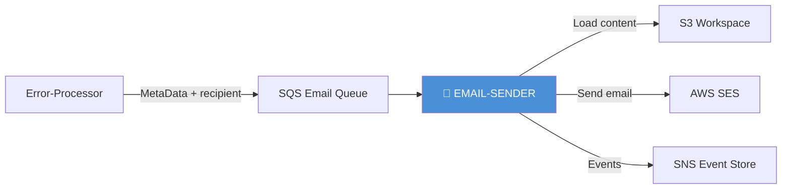
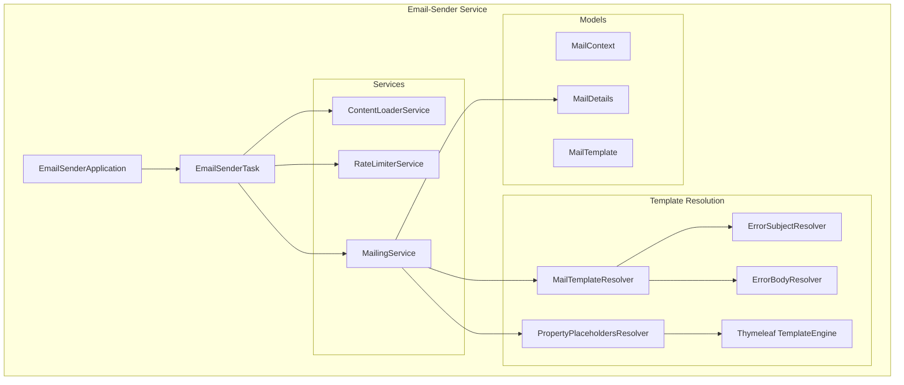
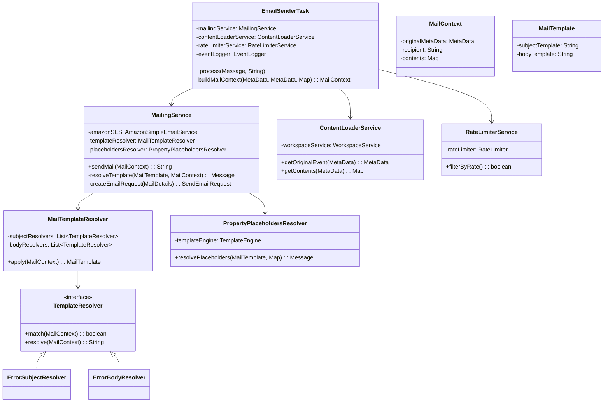
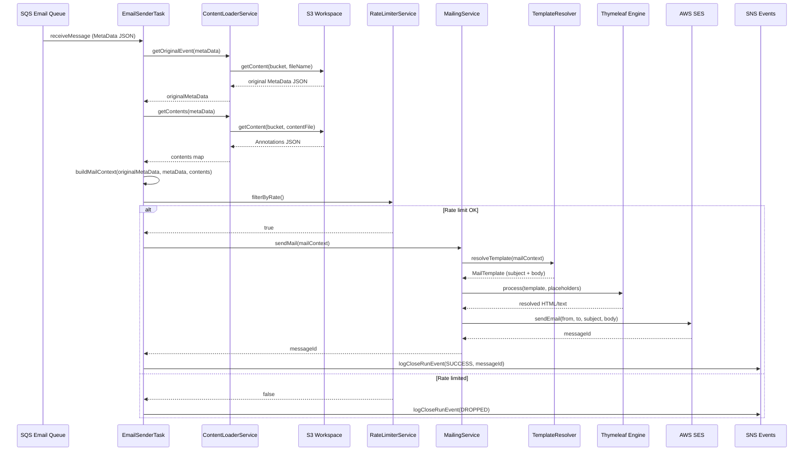
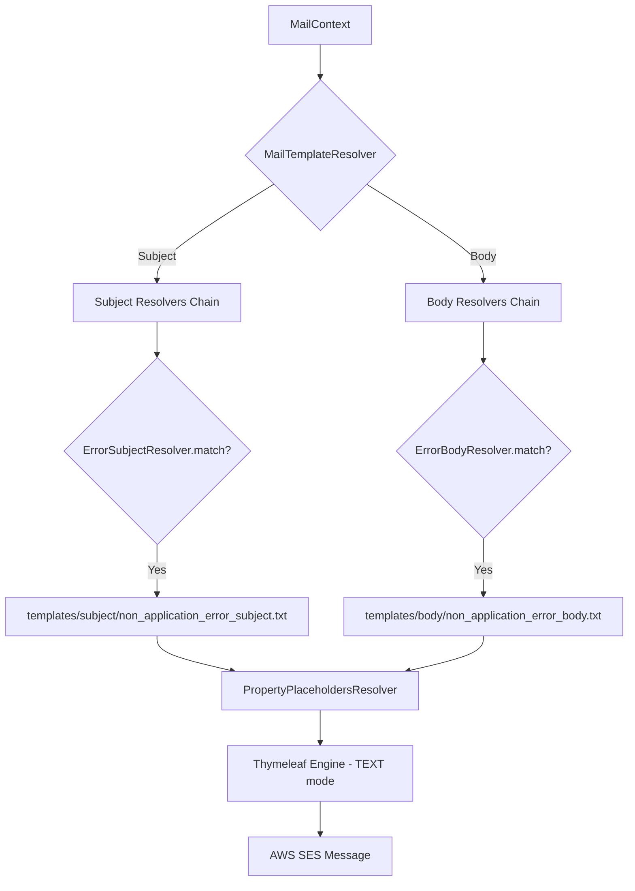

# Email-Sender Module — Design Document

> **Module:** `email-sender`  
> **Generated:** 2026-05-24  
> **Artifact:** `com.inttra.mercury.email:email-sender:1.0-SNAPSHOT`  
> **Java Version:** 17 | **Framework:** Dropwizard 4.x + Guice 7.x + Thymeleaf 3.x

---

## 1. Executive Summary

The **Email-Sender** module is the notification delivery engine of AppianWay. It consumes email requests from an SQS queue, resolves Thymeleaf-based templates with contextual data, and sends formatted emails via AWS SES. It includes rate limiting to prevent overwhelming SES quotas and supports multiple template resolvers for extensibility.

---

## 2. Role in the Pipeline

---

## 3. High-Level Architecture

---

## 4. Class Diagram

---

## 5. Data Flow Diagram

---

## 6. Template Resolution Chain

### Template Placeholders

| Placeholder | Source | Example |
|------------|--------|---------|
| `[(${metaData.component})]` | Original MetaData | `transformer` |
| `[(${metaData.projections.contextCode})]` | Projections | `requestBooking` |
| `[(${gmtDateTime})]` | System clock | `Saturday, May 24, 2026 at 14:30 GMT` |
| `[(${environment})]` | Configuration | `production` |
| `[(${content.Annotations})]` | Error annotations | Error code list |

---

## 7. Configuration Details

| Property | Type | Default | Description |
|----------|------|---------|-------------|
| `componentName` | String | `email-sender` | Service identity |
| `environment` | String | — | Deployment environment name |
| `mailConfig.senderEmailAddress` | String | — | From address (e.g., `"INTTRA" <no-reply@...>`) |
| `mailConfig.replyToEmailAddress` | String | — | Reply-to address |
| `mailConfig.rateLimitInSeconds` | int | `120` | Rate limit interval |
| `sqsPickupConfig.queueUrl` | String | — | Email queue URL |
| `sqsPickupConfig.waitTimeSeconds` | int | `20` | Long poll |
| `sqsPickupConfig.maxNumberOfMessages` | int | `1` | Batch size |
| `snsEventConfig.topicArn` | String | — | Event topic |
| `s3WorkspaceConfig.bucket` | String | — | Content bucket |
| `sqsErrorConfig.queueUrl` | String | — | Error queue |

---

## 8. Rate Limiting

The `RateLimiterService` uses Guava's `RateLimiter`:

- **Formula:** `permits/sec = 1 / rateLimitInSeconds`
- **Default:** 1 email per 120 seconds = 0.5 emails/minute
- **Behavior:** Non-blocking `tryAcquire()` — drops if exceeded
- **Scope:** Singleton per instance (not distributed)

---

## 9. Error Handling

| Exception | Error Code | Recovery |
|-----------|-----------|----------|
| `TemplateNotFoundException` | Template resolution failure | Non-recoverable |
| `TemplateResolveException` | Thymeleaf processing error | Non-recoverable |
| `EmailNotSendException` | SES delivery failure | Recoverable |
| `SdkClientException` | AWS connectivity issue | Recoverable |

---

## 10. Key Maven Dependencies

| Dependency | Version | Purpose |
|-----------|---------|---------|
| `mercury-shared` | 1.0 | Framework, events, workspace |
| `thymeleaf` | 3.0.7 | Template engine |
| `aws-java-sdk-ses` | 1.12.720 | Email delivery |
| `dropwizard-core` | 4.0.16 | Application framework |
| `guice` | 7.0.0 | DI container |
| `guava` | 33.1.0-jre | RateLimiter |
