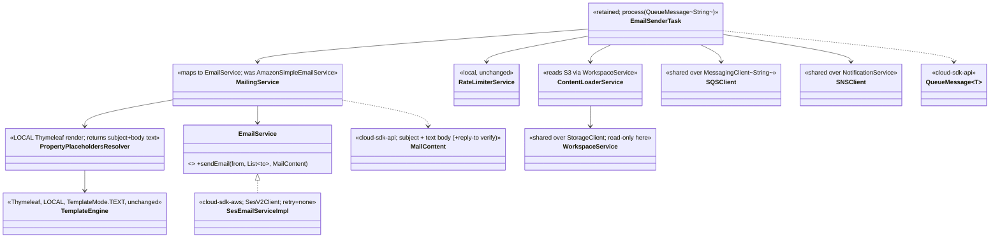

# `email-sender` — AWS SDK v2 (cloud-sdk) Upgrade DESIGN (claude)

> Module: `com.inttra.mercury.appian-way:email-sender:1.0` · Date: 2026-05-31 · Author: Claude (Opus 4.8)
> **Chosen option: B — adopt `commons` + `cloud-sdk-api`/`cloud-sdk-aws` (`1.0.26-SNAPSHOT`) on Dropwizard 5**, consuming cloud-sdk as a normal client with **no module-specific cloud-sdk change** and **Thymeleaf kept entirely local**. Option A (DW4 rebind) is the fallback, same cloud-sdk contract.
> Companion plan: [`...-plan-claude.md`](2026-05-31-email-sender-aws2x-upgrade-plan-claude.md). Master: [shared DESIGN](../../shared/docs/2026-05-31-shared-aws2x-upgrade-DESIGN-claude.md) §5 (config), §6 (cloud-sdk specs).

---

## 1. Overview & chosen option

email-sender consumes the email queue, loads the original event + contents from S3 (read), renders **subject and body locally with Thymeleaf (`TemplateMode.TEXT`)**, applies a **local rate limiter**, and sends via SES. The migration:
- replaces the **v1 SES** send path (`AmazonSimpleEmailService` + `SendEmailRequest`/`Destination`/`Message`/`SendEmailResult`) with **cloud-sdk-api `EmailService`** backed by **cloud-sdk-aws `SesEmailServiceImpl` (SES v2)**;
- **keeps Thymeleaf rendering local and unchanged** — the finished text flows into the cloud-sdk `MailContent` model (G5 de-scoped, plan §0/§11);
- rebinds SQS/S3-read/SNS to shared cloud-sdk wrappers; `Message` → `QueueMessage<String>` through the retained `SQSListener`/`AsyncDispatcher`/`EmailSenderTask` chain;
- preserves `maxErrorRetry(0)` via v2 retry=none and the local rate limiter.

**No cloud-sdk library change is required.**

---

## 2. Class diagram (target consumer wiring)



**Removed v1 types:** `com.amazonaws.services.simpleemail.AmazonSimpleEmailService` + `simpleemail.model.{SendEmailRequest, SendEmailResult, Destination, Message, Body, Content}`, `com.amazonaws.services.{sqs,s3,sns}.*`, `com.amazonaws.services.sqs.model.Message`, `com.amazonaws.ClientConfiguration`.
**Kept LOCAL (unchanged):** `org.thymeleaf.TemplateEngine`/`StringTemplateResolver` (`TemplateMode.TEXT`), `RateLimiterService`.
**Consumed cloud-sdk-api:** `EmailService`, `MailContent`, `MessagingClient<String>`/`QueueMessage<String>` (via shared `SQSClient`), `NotificationService` (via shared `SNSClient`), `StorageClient` read (via shared `WorkspaceService`).

---

## 3. Component diagram

```mermaid
flowchart LR
    SQS[(email queue)] --> LIS[shared SQSListener -> MessagingClient]
    LIS --> D[AsyncDispatcher email-sender]
    D --> T[EmailSenderTask QueueMessage~String~]
    T --> CL[ContentLoaderService]
    CL --> WS[shared WorkspaceService -> StorageClient read]
    WS --> S3[(S3 SDK v2)]
    T --> RL[RateLimiterService LOCAL]
    T --> MS[MailingService]
    MS --> TH[Thymeleaf TemplateEngine LOCAL TEXT]
    MS --> ES[cloud-sdk-api EmailService]
    ES --> SES[(AWS SES v2 SesV2Client, retry=none)]
    T --> SNS[shared SNSClient -> NotificationService]
    subgraph cs[cloud-sdk 1.0.26-SNAPSHOT]
      API[cloud-sdk-api EmailService/MailContent]
      AWS[cloud-sdk-aws SesEmailServiceImpl, EmailClientFactory]
    end
    ES --> API
    API <|.. AWS
    note[Thymeleaf NOT in cloud-sdk - stays in email-sender only]
```

---

## 4. Sequence diagram — consume → local Thymeleaf render → EmailService SES v2 send (with rate limiter)

```mermaid
sequenceDiagram
    participant L as shared SQSListener -> MessagingClient
    participant T as EmailSenderTask
    participant CL as ContentLoaderService -> StorageClient (read)
    participant RL as RateLimiterService (local)
    participant MS as MailingService
    participant TH as Thymeleaf TemplateEngine (local, TEXT)
    participant ES as EmailService (cloud-sdk-api, SES v2)
    participant SES as AWS SES v2 (SesV2Client, retry=none)
    L->>T: process(QueueMessage<String>)  %% getPayload() -> MetaData
    T->>CL: getOriginalEvent / getContents(metaData)
    CL->>CL: StorageClient.getContent(bucket, fileName)
    CL-->>T: contents
    T->>RL: filterByRate()
    alt within rate
      T->>MS: sendMail(mailContext)
      MS->>TH: process(subjectTemplate) / process(bodyTemplate)
      TH-->>MS: rendered subject + body TEXT
      MS->>MS: build MailContent(subject, textBody [, replyTo])
      MS->>ES: sendEmail(from, [to], MailContent)
      ES->>SES: SesV2Client.sendEmail (Destination/Content/Body) - no SDK retry
      SES-->>ES: messageId
      ES-->>MS: messageId
      MS-->>T: messageId
      T->>T: publishCloseRunEvent(success, messageId)
    else rate exceeded
      T->>T: drop email; publishCloseRunEvent(messageDropped)
    end
    Note over T: failure -> EmailSenderErrorHandler (appianway, unchanged)
```

---

## 5. Configuration

Defers to master DESIGN [§5](../../shared/docs/2026-05-31-shared-aws2x-upgrade-DESIGN-claude.md). email-sender-specific:
- **SES retry = none (preserve `maxErrorRetry(0)`):** the v1 `new ClientConfiguration().withMaxErrorRetry(0)` ([`ExternalServicesModule.java:30`](../src/main/java/com/inttra/mercury/email/modules/ExternalServicesModule.java)) maps to the cloud-sdk-aws SES client built via `EmailClientFactory` with `ClientOverrideConfiguration` retry policy = **none** (`RetryPolicy.none()` / equivalent retry strategy). Verify the factory exposes this (plan §9/§11).
- `MailConfig` sender/reply-to addresses unchanged; SES region/source map to the v2 SES client config.
- Rate-limit config and Thymeleaf engine config (`TemplateMode.TEXT`, `StringTemplateResolver`) **unchanged**.
- `${PROFILE}`/`${ENV}` resource-name expansion unchanged.

---

## 6. cloud-sdk gaps — email-sender: NONE (SES v1→v2 model mapping detailed here)

**No cloud-sdk-api / cloud-sdk-aws / commons change is required.** Thymeleaf stays local; the only work is mapping the v1 SES model to the existing cloud-sdk `EmailService`/`MailContent` API.

### 6.1 v1 SES → cloud-sdk EmailService field mapping

| v1 (today) | cloud-sdk-api `EmailService` (SES v2) |
|---|---|
| `SendEmailRequest.withSource(fromAddress)` ([`MailingService.java:90`](../src/main/java/com/inttra/mercury/email/services/MailingService.java)) | `from` argument of `sendEmail(from, ...)` |
| `Destination().withToAddresses(toAddresses)` ([`MailingService.java:87`](../src/main/java/com/inttra/mercury/email/services/MailingService.java)) | `List<String> to` argument |
| `Message(new Content(subject), new Body(new Content(body)))` ([`PropertyPlaceholdersResolver.java:28-30`](../src/main/java/com/inttra/mercury/email/services/resolvers/PropertyPlaceholdersResolver.java)) | `MailContent` (subject + **text** body — matches `TemplateMode.TEXT`) |
| `withReplyToAddresses(replyToAddresses)` ([`MailingService.java:93`](../src/main/java/com/inttra/mercury/email/services/MailingService.java)) | reply-to on `MailContent`/request — **verify present**; if not, a small additive field is the only contingency (plan §11) |
| `SendEmailResult.getMessageId()` ([`MailingService.java:99`](../src/main/java/com/inttra/mercury/email/services/MailingService.java)) | message id from the cloud-sdk send result |
| `catch (SdkClientException) -> RecoverableException` ([`MailingService.java:102-104`](../src/main/java/com/inttra/mercury/email/services/MailingService.java)) | `catch (software.amazon.awssdk.core.exception.SdkException) -> RecoverableException` (semantics preserved) |

Refactor `PropertyPlaceholdersResolver` to **return the rendered subject/body strings** (or a small local value object) instead of a v1 `simpleemail.model.Message`; refactor `MailDetails` to drop the v1 `Message` field ([`MailDetails.java:3,22`](../src/main/java/com/inttra/mercury/email/model/MailDetails.java)) in favor of the rendered text. `MailingService` builds `MailContent` and calls `EmailService.sendEmail`.

### 6.2 Why no Thymeleaf in cloud-sdk (G5 de-scoped)
Adding a `ThymeleafTemplateService` to cloud-sdk-aws (Copilot G5) would force Thymeleaf onto **every mercury-services consumer transitively** — a violation of the zero-impact constraint. cloud-sdk's `TemplateService` (Handlebars-only) is **not used** by email-sender; it sends pre-rendered text. Thymeleaf therefore stays a **local email-sender dependency** only.

### 6.3 S-G2
Not applicable — email-sender reads S3 only (`getContent`, [`ContentLoaderService.java:36`](../src/main/java/com/inttra/mercury/email/services/ContentLoaderService.java)); no metadata write/copy.

---

## 7. Maven dependency changes

`email-sender/pom.xml` (illustrative — applied during implementation, not now):
- **Remove:** `com.amazonaws:aws-java-sdk-ses` ([`pom.xml:51-54`](../pom.xml)) and `com.amazonaws:aws-java-sdk-sqs` ([`pom.xml:44-49`](../pom.xml)). (No `aws-java-sdk-s3`/`-sns` declared here — those v1 drops happen in `shared`.)
- **Keep:** `org.thymeleaf:thymeleaf:3.0.7.RELEASE` ([`pom.xml:71-75`](../pom.xml)) — **local** rendering, retained exactly.
- **Add:** `com.inttra.mercury:commons`, `cloud-sdk-api`, `cloud-sdk-aws` at `1.0.26-SNAPSHOT` (versions from root `dependencyManagement`). `cloud-sdk-aws` brings AWS SDK v2 (`sesv2`, `sqs`, `s3`, `sns`, `apache-client`) transitively, **Netty excluded**.
- Add `dropwizard-testing` (JUnit 5) and, during transition, `junit-vintage-engine`.
- **Shading:** include `software.amazon.awssdk:*` + `apache-client`; verify no leftover v1 classes (incl. `aws-java-sdk-ses`) and no `META-INF/services` clashes in the uber-jar.

---

## 8. Tests

- **New tests in JUnit 5 (Jupiter)**; existing JUnit 4 (`MailingServiceTest`, `EmailSenderTaskTest`, `PropertyPlaceholdersResolverTest`, `EmailSenderFuncTest`) run via `junit-vintage-engine` during transition.
- **Re-point** `MailingServiceTest`/`EmailSenderTaskTest` from v1 SES model to the `EmailService` interface + `MailContent`; SQS side to a `QueueMessage<String>` double.
- **Field-mapping tests:** from / to / subject / **text** body / reply-to / message-id round-trip into the cloud-sdk send; assert `SdkException` → `RecoverableException`.
- **Preserve Thymeleaf tests:** `PropertyPlaceholdersResolverTest` keeps asserting local `TemplateMode.TEXT` rendering — only its return type changes (rendered strings, not a v1 `Message`).
- **Rate-limiter test** retained unchanged.
- **`functional-testing` SES fake rework (hard prerequisite):** the existing `AmazonSESAdaptor` (implements v1 `AmazonSimpleEmailService`) must be re-pointed to back the **cloud-sdk-api `EmailService`** fake; SQS/S3/SNS fakes re-pointed to cloud-sdk-api in lockstep with `shared` (see functional-testing DESIGN).

---

## 9. Rollout & verification

1. Land `shared` + `functional-testing` (incl. the SES `EmailService` fake) first.
2. Migrate email-sender: rebind `ExternalServicesModule` (SES→`EmailService`, SQS/S3/SNS→shared cloud-sdk wrappers, **retry=none**); refactor `MailingService`/`MailDetails`/`PropertyPlaceholdersResolver` to the `MailContent` model; swap `Message`→`QueueMessage<String>`; keep Thymeleaf + rate limiter local.
3. `mvn -pl email-sender -am verify`.
4. Dev smoke: send a templated email; verify delivery, subject/body content, and that SDK-level retries are disabled.

---

## 10. Risks & mitigations

| Risk | Mitigation |
|---|---|
| v1→v2 SES field mapping errors (from/to/subject/body/reply-to/message-id) | Field-by-field mapping tests vs a captured v1 request |
| `maxErrorRetry(0)` not preserved | Configure v2 `ClientOverrideConfiguration` retry=none via `EmailClientFactory`; assert in a test |
| `MailContent` missing reply-to | Verify first (plan §9); contingency is a small **additive** field only (no signature change) |
| Accidentally pulling Thymeleaf into cloud-sdk (Copilot G5) | **Explicitly forbidden** — Thymeleaf stays local; send pre-rendered text via `EmailService` |
| SES fake not ready | Gate behind `functional-testing` SES `EmailService` fake |
| `Message` type confusion (SES vs SQS) | SQS → `QueueMessage<String>`; SES → `MailContent`; clash removed |
| Rate-limiter regression | Keep the local limiter unchanged; retain its test |
