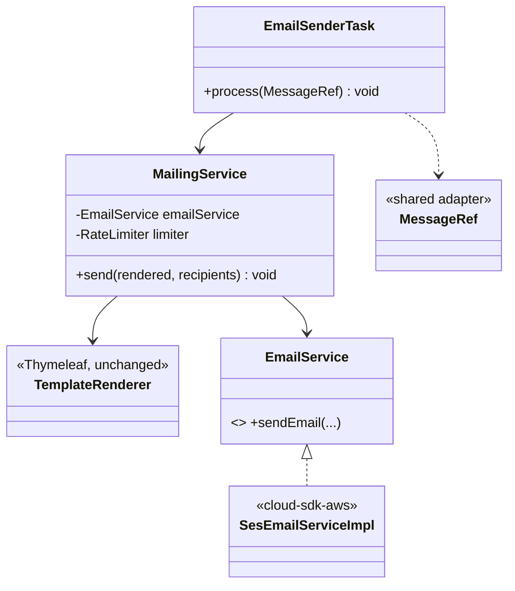
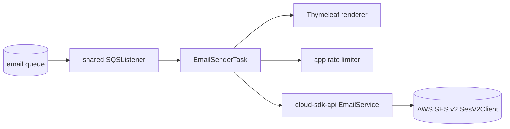
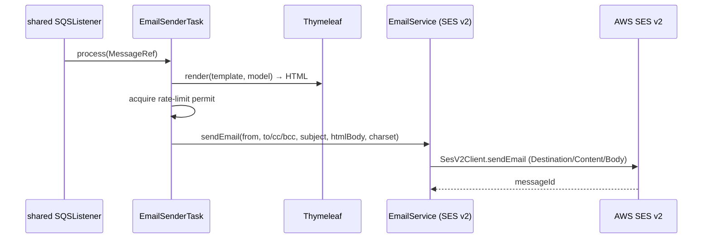

# `email-sender` — AWS SDK v2 (cloud-sdk) Upgrade DESIGN

> **DIRECTIVE UPDATE (2026-05-31) — supersedes the Option-A recommendation in this document.** Per stakeholder direction the program now targets **Dropwizard 5** and **Option B — adopt `commons` + `cloud-sdk-api`/`cloud-sdk-aws`** as the directed default (recommend Option A only on a categorical technical blocker). All AWS service communication goes through `cloud-sdk-api`; new tests are written in **JUnit 5 (Jupiter)** (existing JUnit 4 runs via JUnit Vintage during transition); configuration follows the composed appianway `.properties`/`${PROFILE}`/`${ENV}` + commons `${awsps:...}` model in the master [shared plan §10](../../shared/docs/2026-05-31-shared-aws2x-upgrade-plan-copilot.md). cloud-sdk gaps are indexed in the master [shared plan §11](../../shared/docs/2026-05-31-shared-aws2x-upgrade-plan-copilot.md) with full technical specs in the master [shared DESIGN §1A.6](../../shared/docs/2026-05-31-shared-aws2x-upgrade-DESIGN.md).
> **Module-specific cloud-sdk gaps:** **G5 (Thymeleaf template engine)** — email-sender renders Thymeleaf templates; cloud-sdk's `EmailService`/`HandlebarsTemplateServiceImpl` use Handlebars. Add a `ThymeleafTemplateService implements cloud-sdk-api TemplateService` (classpath/file `ITemplateResolver`) to cloud-sdk-aws, selectable via `EmailClientFactory`/config alongside Handlebars (master DESIGN §1A.6 G5), or migrate the templates to Handlebars. Plus G1 (concurrent SQS listener) and G6 (config). Email send maps to `EmailService.sendEmail`/`sendTemplatedEmail` over `SesEmailServiceImpl` (SES v2); rate-limiting stays appianway-local.
> Sections below are retained as the Option-A fallback reference.

> Module: `email-sender` · Date: 2026-05-31 · Author: GitHub Copilot (Claude Opus 4.8) · Option **A**
> Companion: [plan](2026-05-31-email-sender-aws2x-upgrade-plan-copilot.md). Foundation: [`shared` DESIGN](../../shared/docs/2026-05-31-shared-aws2x-upgrade-DESIGN.md). Session `83b822b011714117`.

## 1. Overview
Replace the SES **classic (v1)** send path with `cloud-sdk-api` `EmailService` backed by `cloud-sdk-aws` `SesEmailServiceImpl(SesV2Client)`. Keep local Thymeleaf rendering and the app-level rate limiter. Swap the SQS listener DTO `Message`→`MessageRef`. Map v1 `SendEmailRequest` fields to the SES v2 content model.

## 2. Class diagram

## 3. Component diagram

## 4. Sequence diagram

## 5. Configuration changes
- `conf/email-sender.yaml`: SES region/source/config-set keys retained; mapped to SES v2 via `EmailClientFactory`. If a configuration set or source ARN is configured today, ensure it is passed into the v2 request.
- Rate-limit config unchanged. `${PROFILE}`/`${ENV}` unchanged. No placeholder-syntax change (Option A).

## 6. Maven dependency changes
- **Remove:** `com.amazonaws:aws-java-sdk-ses` (+ `-sqs` if declared) from `email-sender/pom.xml`.
- **Add:** `cloud-sdk-api`. SES v2 runtime (`software.amazon.awssdk:sesv2`) arrives transitively via `cloud-sdk-aws`.

## 7. Test details
- Re-point `MailingServiceTest`, `EmailSenderTaskTest`, `EmailSenderFuncTest`, `PropertyPlaceholdersResolverTest` from v1 SES model to the `EmailService` interface / SES v2 content model.
- **Field-mapping tests:** From, To/Cc/Bcc, Subject, HTML + Text body, charset, optional configuration set → assert correct SES v2 request.
- Functional tests depend on the migrated `functional-testing` SES fake (`AmazonSESAdaptor` → `EmailService` fake).
- Rate-limiter test retained. JUnit 4 retained (no Jupiter).

## 8. Rollout & verification
Later wave, after `shared` + `functional-testing` (SES fake). `mvn -pl email-sender -am verify`. Smoke: send a templated email in dev; verify delivery + headers.

## 9. Risks & mitigations
| Risk | Mitigation |
|---|---|
| v1→v2 SES field mapping errors | Field-by-field tests vs captured v1 request |
| Config set / source ARN dropped | Inventory + assert in v2 request |
| SES fake not ready | Gate behind functional-testing |
| `Message` type confusion | SQS→MessageRef, SES→v2 content |
