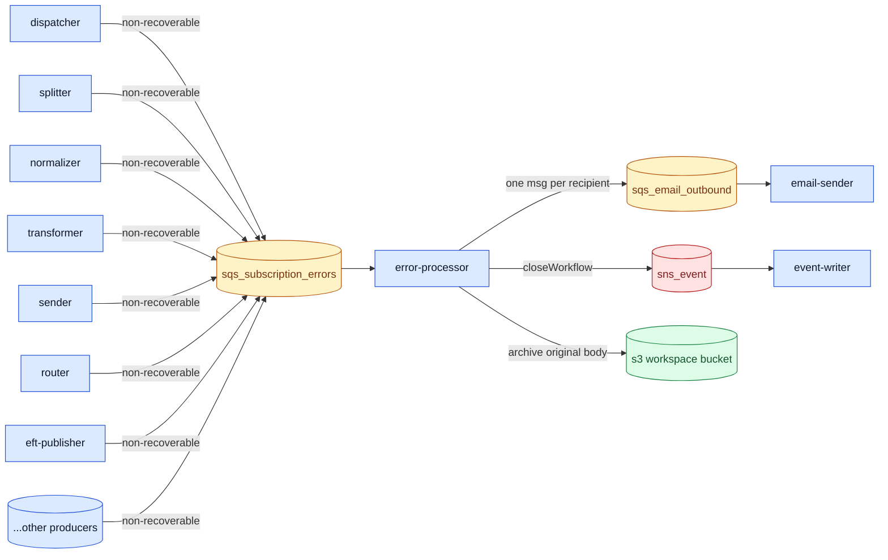
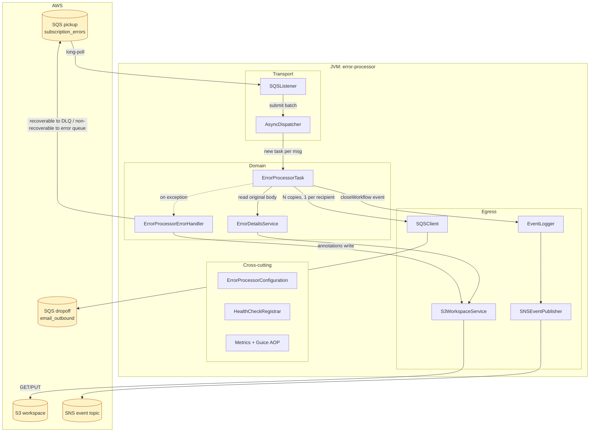
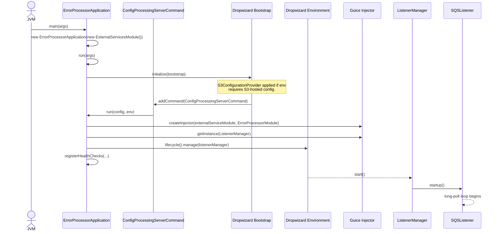
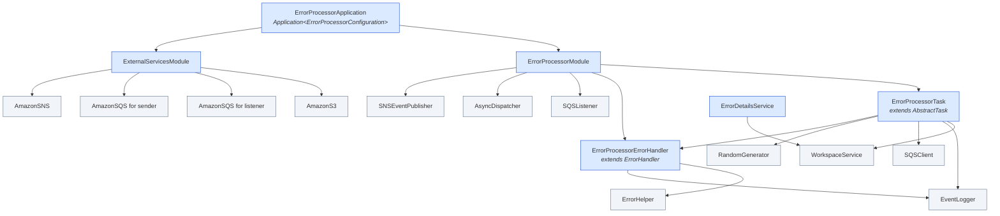
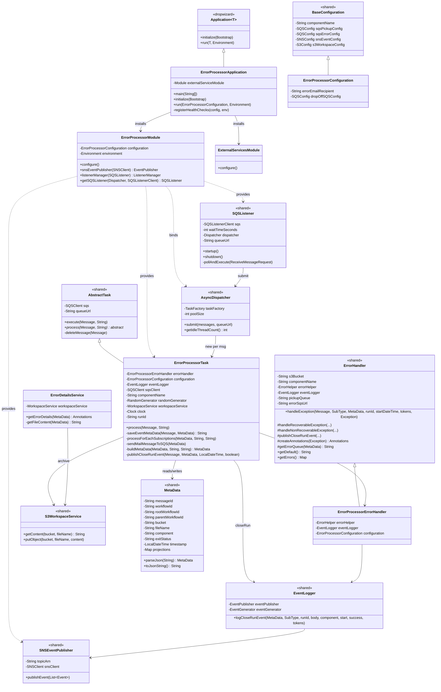
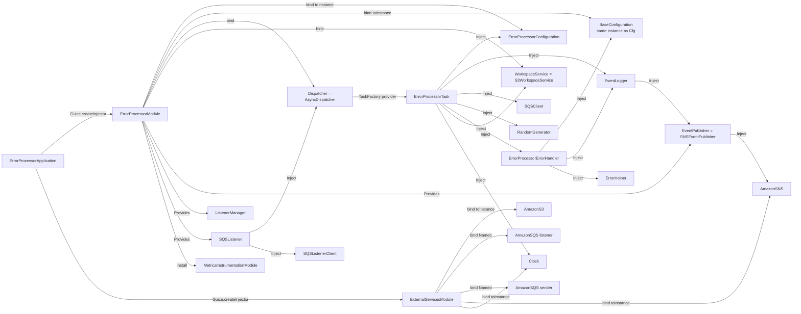
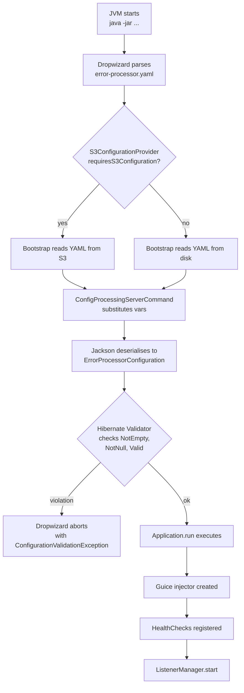
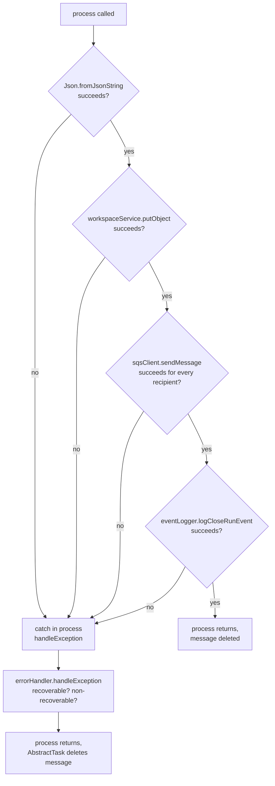

# Error-Processor Module — Architecture & Design

> **Author:** Principal Engineering Review · **Date:** 2026-05-24 · **Module Version:** 1.0 (Maven artifact `com.inttra.mercury.appian-way:error-processor:1.0`, per [pom.xml:11-13](../pom.xml))

---

## Table of Contents

1.  [Executive Summary](#1-executive-summary)
2.  [Position in the Mercury Pipeline](#2-position-in-the-mercury-pipeline)
3.  [High-Level Architecture](#3-high-level-architecture)
4.  [Low-Level Design](#4-low-level-design)
5.  [Key Classes — Class Diagram](#5-key-classes--class-diagram)
6.  [Data Flow Diagram](#6-data-flow-diagram)
7.  [Component Dependencies](#7-component-dependencies)
8.  [Configuration & Validation](#8-configuration--validation)
9.  [Maven Dependencies](#9-maven-dependencies)
10. [How the Module Works — Detailed Walkthrough](#10-how-the-module-works--detailed-walkthrough)
11. [Error Handling & Edge Cases](#11-error-handling--edge-cases)
12. [Operational Notes](#12-operational-notes)
13. [Open Questions / Risks](#13-open-questions--risks)

---

## 1. Executive Summary

The **error-processor** is the cross-cutting "exception highway" of the Mercury (Appian Way) platform. Every upstream module in the pipeline — *dispatcher*, *splitter*, *normalizer*, *transformer*, *sender*, *router*, *email-sender*, *eft-publisher*, *event-writer*, and so on — funnels its non-recoverable, partner-visible failures into a single, well-known SQS queue: `*_*_sqs_subscription_errors`. The error-processor's job is to read those messages, persist a durable copy of the failure envelope in S3 for forensic retention, fan them out to one or more human-readable notification channels (today: email recipients, surfaced through the downstream `email-sender` service), and publish a `closeWorkflow` event to the platform-wide SNS event topic so that operational dashboards, audit pipelines, and the event store see a uniform "this workflow ended in error" record.

The module is intentionally **small, single-purpose, stateless, and idempotent at the SQS level**. The Java source tree is seven files; the runtime concerns are delegated to the shared `mercury-shared` library so that all 10+ Mercury modules share an identical listener loop, dispatcher, metrics annotations, health-check registrar, error-handler hierarchy, and SNS event publisher. The error-processor itself contributes:

- One Dropwizard `Application` (`ErrorProcessorApplication`).
- One typed configuration POJO (`ErrorProcessorConfiguration`) extending the shared `BaseConfiguration`.
- Two Guice modules (`ErrorProcessorModule` for in-process wiring, `ExternalServicesModule` for AWS clients).
- One `Task` implementation (`ErrorProcessorTask`) and one `ErrorHandler` subclass (`ErrorProcessorErrorHandler`) — both extend shared base classes.
- One thin S3 accessor (`ErrorDetailsService`) that pulls `Annotations` blobs from the workspace bucket.

Operational footprint per task at the time of writing: 384 MB JVM heap, 0 vCPU reservation (best-effort burst), two TCP ports — 8080 (admin/healthcheck) and 8081 (HTTP application connector). Per [conf/int/error-processor-latest-dev-Task.json:14-36](../conf/int/error-processor-latest-dev-Task.json) the container runs on Amazon ECS with `awslogs` log driver routing to CloudWatch log group `inttra-int-lg-app-way`.

The defining architectural property of the error-processor is **separation of failure semantics from notification semantics**: it never sends email itself, never knows about SMTP, never knows the recipient mailbox's contents. Its sole notification responsibility is to translate a "platform error envelope" into one (or N) "email job envelopes" and push them onto the email pickup queue. This keeps the module mailer-agnostic, channel-extensible (a future Slack/Teams/Webhook fan-out simply adds another drop-off queue), and decoupled from the message-rendering concerns of the `email-sender` service.

### Headline numbers and design choices

| Property                       | Value / Choice                                                                                                                                            |
| ------------------------------ | --------------------------------------------------------------------------------------------------------------------------------------------------------- |
| Runtime                        | JDK 8 base image (`FROM openjdk:8`), per [Dockerfile:1](../Dockerfile)                                                                                    |
| Framework                      | Dropwizard 4 (Jakarta EE)                                                                                                                                 |
| DI container                   | Google Guice (with `com.palominolabs.metrics:metrics-guice` AOP for `@Metered` / `@Timed`)                                                                |
| Concurrency model              | Shared `AsyncDispatcher` (one task instance per inbound SQS message; pool size = `maxNumberOfMessages`)                                                   |
| Inbound transport              | AWS SQS long polling (`waitTimeSeconds=20`, `maxNumberOfMessages=10` by default)                                                                          |
| Outbound transports            | (a) AWS SQS sends to the `email-sender` drop-off queue; (b) AWS SNS publishes to the platform event topic; (c) AWS S3 PUT archives the original message body |
| AWS SDK retry policy           | `withMaxErrorRetry(0)` for SNS and S3 (no in-SDK retries — message redelivery is the retry mechanism), per [ExternalServicesModule.java:20](../src/main/java/com/inttra/mercury/error/processor/modules/ExternalServicesModule.java) |
| Idempotency                    | Best-effort: re-archiving to S3 uses a fresh UUID per attempt; the SQS dropoff message is re-emitted on retry (downstream `email-sender` must de-duplicate or accept duplicate emails) |
| Persistence                    | S3-only. The error-processor itself owns no relational store.                                                                                             |
| Health check                   | `/healthcheck` & ops endpoints registered via shared `HealthCheckRegistrar`: inbound SQS readability, S3 read, outbound SQS publish, SNS publish          |
| Configuration source           | Compound: `error-processor.yaml` (templated, env-var interpolation) + per-env `.properties` overlay; optional S3-hosted configuration via `S3ConfigurationProvider` |
| Build artefact                 | Shaded uber-jar `error-processor-1.0-SNAPSHOT.jar`, main class `com.inttra.mercury.error.processor.ErrorProcessorApplication`, per [pom.xml:172](../pom.xml) |

### What the error-processor is, in one sentence

> *"Read failure envelopes from a single SQS queue, archive them, multicast email notifications to a configured recipient list via the downstream email-sender, and emit a uniform `closeWorkflow` event to the platform event topic."*

### What the error-processor is **not**

- Not an error **classifier** in the sense of taxonomising error codes. It treats the incoming envelope as opaque metadata and trusts upstream modules to have populated `Annotations`. (There is no rule engine, no error-code-to-template mapping inside this module.)
- Not an SMTP gateway. Email composition and dispatch belong to `email-sender`, which consumes from `*_*_sqs_email_outbound`.
- Not a dead-letter queue handler. DLQ semantics for the platform live inside `ErrorHelper.sendToDLQ(...)` in the shared module and are invoked only when the error-processor itself fails (recoverable exception exhausted retries).
- Not a synchronous API. There is **no** REST surface beyond Dropwizard's admin/healthcheck.
- Not a re-driver. Once an error is processed, it is not re-enqueued for re-processing; if the consumer requests reprocessing of a failed message that responsibility lives at the dispatcher / re-driver tier.

The remainder of this document expands each of these themes into architecture-grade detail.

---

## 2. Position in the Mercury Pipeline

Mercury (the internal codename used in the source tree; `com.inttra.mercury` and `com.inttra.mercury.appian-way`) is a chain of independently-deployed ECS services connected by SQS queues and a fan-out SNS event topic. Each module pulls from its own pickup queue, performs its transform, and pushes the resulting metadata envelope (`com.inttra.mercury.shared.task.MetaData`) onto the next module's pickup queue. Every module also publishes lifecycle events (`startWorkflow`, `closeWorkflow`) to SNS so that the event-writer can persist them.

Failures inside any module surface in one of three ways (see [ErrorHandler.java:44-102](../../shared/src/main/java/com/inttra/mercury/shared/task/ErrorHandler.java)):

1. **Recoverable exception + retry budget available** — message is re-enqueued onto its own pickup queue and the module emits a `closeWorkflow` with `status=true` (the message will be picked up again).
2. **Recoverable exception + retry budget exhausted** — message is moved to the per-module DLQ (`<pickupQueueUrl>_dlq`).
3. **Non-recoverable exception** — an annotated failure envelope is pushed to the shared `sqsErrorConfig.queueUrl` (the **error queue**) and the module emits a `closeWorkflow` with `status=true` (the error is itself a "successful" outcome of the close-run).

The third case is the input contract for the error-processor.

The error queue is a **fan-in collector**: every Mercury module has its `sqsErrorConfig.queueUrl` pointing to the same physical SQS queue per environment, and the error-processor is the sole consumer. In the live environments the queue is named `<profile>_<env>_sqs_subscription_errors` (e.g. `inttra_int_sqs_subscription_errors` per [conf/int/error-processor.properties:3](../conf/int/error-processor.properties)).



### Why a single fan-in queue?

- **Uniform back-pressure**: one queue, one consumer fleet, one CloudWatch dashboard.
- **Single source of operational truth**: an SRE can drain the error queue to investigate a platform-wide regression without chasing seven different per-module DLQs.
- **Decoupled email semantics**: each producing module would otherwise need to know the recipient list and the email-sender's queue URL. Centralising those concerns in the error-processor keeps the configuration of the other modules clean.
- **Composable notification expansion**: if the platform later adds Slack notifications, only the error-processor changes — every upstream module already speaks the right contract.

### Where the producing modules write to the error queue

Look inside `com.inttra.mercury.shared.task.ErrorHandler#handleNonRecoverableException` (see [ErrorHandler.java:90-102](../../shared/src/main/java/com/inttra/mercury/shared/task/ErrorHandler.java)). The error envelope is the same `MetaData` JSON shape that flows along the happy path; the `fileName` field points to a freshly-written S3 object that contains an `Annotations` document describing the failure (error codes, types, and human-readable values, per [Annotations.java:11-24](../../shared/src/main/java/com/inttra/mercury/shared/workspace/Annotations.java)). The error-processor never has to deserialise the annotations — it only re-routes the metadata.

This is the **stable contract** that the error-processor depends on. Any upstream change that breaks the shape of `MetaData` or stops writing the annotation blob to S3 will silently impair the error-processor's downstream notification quality.

---

## 3. High-Level Architecture

The error-processor is a single-process Dropwizard application running inside an ECS task. Its inner architecture follows the same three-layer pattern used by every Mercury module:

1. **Transport layer** — the SQS listener loop (shared `SQSListener`), a `Dispatcher` (shared `AsyncDispatcher`), and the AWS SDK clients.
2. **Domain layer** — the module-specific `ErrorProcessorTask` and `ErrorProcessorErrorHandler`, plus the small `ErrorDetailsService` for workspace reads.
3. **Egress layer** — the `WorkspaceService` (S3 PUT/GET), the `SQSClient` (drop-off queue PUT), and the `EventPublisher` (SNS PUBLISH).

The layered topology and the role of the shared library is shown below:



### Threading model

- One **listener thread** runs the long-poll loop ([SQSListener.java:88-110](../../shared/src/main/java/com/inttra/mercury/shared/listener/SQSListener.java)). It calls `dispatcher.getIdleThreadCount()` to size each receive, so it will never poll more messages than the dispatcher pool can absorb. This is the platform's primary back-pressure mechanism.
- The **dispatcher pool** is sized to `pickupSqsConfig.maxNumberOfMessages` (default 10, per [error-processor.yaml:8](../conf/error-processor.yaml)). Each thread runs one `ErrorProcessorTask` invocation start-to-finish, performs `deleteMessage()` on success (see [AbstractTask.java:23-36](../../shared/src/main/java/com/inttra/mercury/shared/task/AbstractTask.java)), and returns to idle.
- There is **no shared mutable state** between concurrent tasks. The single mutable field in `ErrorProcessorTask` (`runId`) is per-instance, and `taskFactory` produces a fresh instance per message ([ErrorProcessorModule.java:40-43](../src/main/java/com/inttra/mercury/error/processor/modules/ErrorProcessorModule.java)).

### Process lifecycle

The Dropwizard `lifecycle().manage(listenerManager)` line ([ErrorProcessorApplication.java:54](../src/main/java/com/inttra/mercury/error/processor/ErrorProcessorApplication.java)) hooks the listener into Dropwizard's `Managed` lifecycle. On `start()` the listener spins up its polling thread; on `stop()` the listener sets `interrupted=true` and the loop exits cleanly. Graceful shutdown is bounded by Dropwizard's default `shutdownGracePeriod`. There is no custom drain logic — in-flight messages still inside the dispatcher pool will either complete and delete, or be re-delivered after their SQS visibility timeout expires.

### Deployment topology

Per [conf/int/error-processor-latest-dev-Task.json](../conf/int/error-processor-latest-dev-Task.json) the service is deployed as an ECS task on the Mercury cluster. The task receives `ENV` and `JVM_Xmx` environment variables; `run.sh` resolves the per-environment configuration files by file-name suffix, strips the suffix, then invokes the shaded jar. CloudWatch ingests stdout via the `awslogs` log driver, and Datadog metrics are configured via `datadog.properties`.

---

## 4. Low-Level Design

This section walks through the principal collaborations between concrete classes. The intent is to make the contract of every line of code in the seven source files explicit.

### 4.1 Bootstrapping



Notes on the bootstrap:

- `ErrorProcessorApplication` is constructed with the external-services Guice module *injected by `main()`*. This indirection exists so that functional tests can supply a `LocalStack`-backed module without touching the production wiring; see [ErrorProcessorFunctionalTestBase.java:22-31](../src/test/java/functional/ErrorProcessorFunctionalTestBase.java).
- `S3ConfigurationProvider.requiresS3Configuration()` returns true when the environment exposes a bucket-based config indirection (used in production to avoid baking secrets into the container image). When false, the YAML on the container filesystem is read directly.
- `ConfigProcessingServerCommand` is the shared command that layers `.properties` files over the `.yaml` via Jackson placeholder substitution.

### 4.2 Wiring inside `ErrorProcessorModule`

Reading [ErrorProcessorModule.java:37-49](../src/main/java/com/inttra/mercury/error/processor/modules/ErrorProcessorModule.java) line-by-line:

| Line   | Binding                                                | Why                                                                                                                                                |
| ------ | ------------------------------------------------------ | -------------------------------------------------------------------------------------------------------------------------------------------------- |
| 38     | `ErrorProcessorConfiguration` to instance              | Allows `@Inject ErrorProcessorConfiguration` anywhere in the graph                                                                                 |
| 40     | `Provider<ErrorProcessorTask>` resolved lazily         | Each message gets its own task instance — required because `runId` is mutable per-execution                                                        |
| 41     | `pickupSqsConfig` extracted                            | Used to size the dispatcher pool                                                                                                                   |
| 42     | `TaskFactory taskFactory = message -> taskProvider.get()` | Functional `TaskFactory` returns a *new* task per message via Guice's `Provider`                                                                   |
| 43     | `Dispatcher` to `AsyncDispatcher` instance             | One pool, sized by `maxNumberOfMessages`                                                                                                            |
| 44     | `BaseConfiguration` to same instance as `ErrorProcessorConfiguration` | The shared `ErrorHandler` injects `BaseConfiguration`; the polymorphism lets this module satisfy that constraint with its richer type             |
| 45     | `WorkspaceService` to `S3WorkspaceService`             | Standard S3-backed implementation used across the platform                                                                                          |
| 48     | `install(new MetricsInstrumentationModule(...))`       | AOP-style instrumentation of `@Metered`, `@Timed`, `@ExceptionMetered` annotations (notably `AbstractTask#execute(...)` which is `@Metered`)        |
| 53-55  | `EventPublisher` provider                              | Singleton SNS publisher pre-bound to the configured topic ARN                                                                                       |
| 59-61  | `ListenerManager` provider                             | One-listener manager (no multiplexing — error-processor has a single inbound queue)                                                                  |
| 64-74  | `SQSListener` provider                                 | Wired with the dispatcher pool, the AWS SDK SQS client (listener variant), and the pickup queue parameters                                          |

### 4.3 Wiring inside `ExternalServicesModule`

The AWS SDK client beans live in their own module so that functional tests can replace them wholesale (see [ExternalServicesModule.java:18-30](../src/main/java/com/inttra/mercury/error/processor/modules/ExternalServicesModule.java)):

- `AmazonS3` — `withMaxErrorRetry(0)`. The platform deliberately disables the SDK retry layer; an S3 transient failure becomes an exception inside the task, which then triggers the `ErrorProcessorErrorHandler` and the SQS visibility-timeout-based redelivery model. This is the philosophical underpinning of all retry behaviour in Mercury: **let the queue be the retry buffer**.
- `AmazonSQS @Named("amazonSQSForListener")` — uses the shared `AWSClientConfiguration.sqs_listener` (long-poll-friendly read timeouts).
- `AmazonSQS @Named("amazonSQSForSender")` — uses `AWSClientConfiguration.sqs_sender` (short timeouts, retries handled at SQS layer for puts).
- `AmazonSNS` — same `noRetriesConfig`.
- `Clock` — `Clock.systemUTC()`, so that timestamps in events use UTC consistently.

### 4.4 `ErrorProcessorTask#process(...)`

This is the single most important method in the module. The full body lives in [ErrorProcessorTask.java:55-72](../src/main/java/com/inttra/mercury/error/processor/task/ErrorProcessorTask.java) and can be summarised as:

1. Capture `startDateTime` for event timing.
2. Deserialise the message body to `MetaData` ([line 59](../src/main/java/com/inttra/mercury/error/processor/task/ErrorProcessorTask.java)).
3. Generate a fresh `runId` UUID for the closeWorkflow event ([line 61](../src/main/java/com/inttra/mercury/error/processor/task/ErrorProcessorTask.java)).
4. **Archive** the inbound JSON body to S3 under `<rootWorkflowId>/<freshUuid>` ([line 63 then `saveEventMetaData`, lines 74-78](../src/main/java/com/inttra/mercury/error/processor/task/ErrorProcessorTask.java)).
5. **Fan out**: split `errorEmailRecipient` on comma and, for each recipient, build a new `MetaData` envelope and push it to the email-sender drop-off queue ([lines 64-66, 80-89](../src/main/java/com/inttra/mercury/error/processor/task/ErrorProcessorTask.java)).
6. **Publish** a `closeWorkflow` event to SNS ([line 66 then `publishCloseRunEvent`, lines 109-121](../src/main/java/com/inttra/mercury/error/processor/task/ErrorProcessorTask.java)).
7. On any exception, route to the `ErrorProcessorErrorHandler` ([line 69](../src/main/java/com/inttra/mercury/error/processor/task/ErrorProcessorTask.java)).

The deletion of the SQS message itself happens *outside* this method, in `AbstractTask.execute(...)` ([AbstractTask.java:24-36](../../shared/src/main/java/com/inttra/mercury/shared/task/AbstractTask.java)): `deleteMessage` runs only if `process()` returned without exception. Therefore any failure inside `process()` will:

- be caught by `AbstractTask.execute`'s `catch (Exception ex)` clause,
- be logged at WARN level (`"Message is not processed; Message will reappear"`),
- be propagated as message re-appearance after SQS visibility timeout expires.

But — and this is subtle — `process()` itself has its own `try { ... } catch (Exception ex)` ([lines 62-71](../src/main/java/com/inttra/mercury/error/processor/task/ErrorProcessorTask.java)) which calls `errorHandler.handleException(...)` and then *swallows* the exception. As written, this means the outer `AbstractTask.execute` `catch` is **only** reached for exceptions thrown after the `try { saveEventMetaData... }` block exits — i.e. essentially never. The practical effect is that `process()` always returns normally, the message is always deleted, and the error handler's recoverable/non-recoverable routing becomes the only retry pathway. See [Section 11](#11-error-handling--edge-cases) for the implications.

### 4.5 Fan-out semantics

The recipient list is **a single comma-separated string** in `errorEmailRecipient`:

```yaml
errorEmailRecipient: ${error-processor.errorEmailRecipient}
```

[error-processor.yaml:3](../conf/error-processor.yaml). In all packaged environments the value is `appianway@inttra.com` (single recipient), with `joseph.vattakkara@inttra.com` as the default in the template properties file. The fan-out logic ([line 64](../src/main/java/com/inttra/mercury/error/processor/task/ErrorProcessorTask.java)) handles N recipients by emitting N SQS messages onto the drop-off queue. Each emitted message inherits the `MetaData` of the input plus a `recipientEmailId` projection. There is no per-recipient envelope variation beyond that projection; the downstream `email-sender` is responsible for resolving the recipient email address from `MetaData.projections[RECIPIENT_EMAIL_ID]` and composing the message body from the workspace S3 object identified by `(bucket, fileName)`.

A second subtlety: the `projections` map carries the **original sender's** projection map plus a new key only **if absent**:

```java
if (metaData.getProjections() != null &&
        !metaData.getProjections().containsKey(MetaData.Projection.RECIPIENT_EMAIL_ID)) {
    metaData.getProjections().put(MetaData.Projection.RECIPIENT_EMAIL_ID, emailId);
}
```

[ErrorProcessorTask.java:96-99](../src/main/java/com/inttra/mercury/error/processor/task/ErrorProcessorTask.java). When iterating multiple recipients (e.g. `"a@x,b@x"`), only the **first** iteration sets the projection; subsequent iterations are no-ops because the key now exists in the *same* map (mutation persists across loop iterations). This is a known peculiarity (covered in Section 13). The functional test asserts behaviour only for a single recipient.

### 4.6 Class composition snapshot



Blue indicates error-processor's own code. Grey indicates code inherited from `mercury-shared`. Note how heavily the module leans on the shared substrate — the error-processor's own contribution is the task body and the typed configuration, almost nothing else.

---

## 5. Key Classes — Class Diagram



### Class responsibilities (one paragraph each)

**`ErrorProcessorApplication`** ([file](../src/main/java/com/inttra/mercury/error/processor/ErrorProcessorApplication.java)). The Dropwizard entry point. Constructs the Guice injector, registers the four operational health checks (inbound SQS, outbound SQS, S3 read, SNS publish — see [ErrorProcessorApplication.java:60-67](../src/main/java/com/inttra/mercury/error/processor/ErrorProcessorApplication.java)), and hands the listener to Dropwizard's lifecycle. The `externalServiceModule` parameter is the test seam.

**`ErrorProcessorConfiguration`** ([file](../src/main/java/com/inttra/mercury/error/processor/config/ErrorProcessorConfiguration.java)). Adds two module-specific fields on top of `BaseConfiguration`: `errorEmailRecipient` (must be non-empty per `@NotEmpty`, but **not** validated as a parseable email — see Risks) and `dropOffSQSConfig` (the email-sender's pickup queue, must be a valid `SQSConfig`). Lombok generates getters/setters.

**`ErrorProcessorModule`** ([file](../src/main/java/com/inttra/mercury/error/processor/modules/ErrorProcessorModule.java)). The DI heart of the module. Binds the configuration instance, the dispatcher pool, the workspace service implementation, the metrics AOP module, and provides the listener manager, the SNS event publisher, and the SQS listener itself. Crucially, it binds `BaseConfiguration` to the same instance as `ErrorProcessorConfiguration` so that the shared `ErrorHandler` constructor can resolve its dependencies (this polymorphic re-binding is a pattern across all Mercury modules).

**`ExternalServicesModule`** ([file](../src/main/java/com/inttra/mercury/error/processor/modules/ExternalServicesModule.java)). Provides the AWS SDK singletons. Notably uses two named `AmazonSQS` instances with different client configurations (one tuned for long-poll receives, one for synchronous sends).

**`ErrorProcessorTask`** ([file](../src/main/java/com/inttra/mercury/error/processor/task/ErrorProcessorTask.java)). The per-message work unit. Extends `AbstractTask` so it inherits the `@Metered` decoration and the delete-on-success contract. Holds eight collaborators (configuration, event logger, SQS client, random generator, error handler, workspace service, clock, plus the inherited SQS client from `AbstractTask`).

**`ErrorProcessorErrorHandler`** ([file](../src/main/java/com/inttra/mercury/error/processor/task/ErrorProcessorErrorHandler.java)). A nearly empty subclass of the shared `ErrorHandler`. It exists for two reasons: (a) to be Guice-injectable as a concrete type so the task can declare a dependency on it without conflicting with other modules' error handlers; (b) to be a future extension point for module-specific error annotation mapping (no overrides today — the inherited `getDefault()` and `getErrors()` are used as-is).

**`ErrorDetailsService`** ([file](../src/main/java/com/inttra/mercury/error/processor/services/ErrorDetailsService.java)). A thin wrapper around `WorkspaceService` that resolves a `MetaData` envelope to an `Annotations` object by fetching the JSON blob from S3. **Note:** this class is not currently invoked from `ErrorProcessorTask`; it appears to be dead code from a previous design iteration where the error-processor was expected to inspect the annotations directly. See Section 13.

---

## 6. Data Flow Diagram

This sequence shows the **happy path** for a single error message, end-to-end, with all class-level method calls.

```mermaid
sequenceDiagram
    autonumber

    participant UpstreamModule as Upstream Mercury<br/>module (e.g. dispatcher)
    participant ErrQ as SQS pickup<br/>(subscription_errors)
    participant Listener as SQSListener
    participant Disp as AsyncDispatcher
    participant Task as ErrorProcessorTask
    participant WS as S3WorkspaceService
    participant S3 as S3 bucket
    participant SQSC as SQSClient
    participant EmailQ as SQS dropoff<br/>(email_outbound)
    participant EL as EventLogger
    participant Pub as SNSEventPublisher
    participant Topic as SNS event topic

    UpstreamModule->>ErrQ: SendMessage(MetaData JSON)
    Note over ErrQ: Message carries:<br/>workflowId, rootWorkflowId,<br/>bucket, fileName (annotations<br/>blob already in S3),<br/>exitStatus=failure,<br/>component=<upstream>

    Listener->>ErrQ: ReceiveMessage(WaitTime=20s,<br/>MaxMessages=N)
    ErrQ-->>Listener: List of Message
    Listener->>Disp: submit(messages, queueUrl)

    Disp->>Task: new instance (via Provider)
    Disp->>Task: execute(msg, queueUrl)

    Note over Task: AbstractTask.execute<br/>captures start time<br/>and metric.
    Task->>Task: process(msg, queueUrl)

    Note over Task: -- 1. archive original --
    Task->>Task: metaData = parseJson(body)
    Task->>Task: runId = randomUUID()
    Task->>Task: eventFileName =<br/>rootWorkflowId + "/" + UUID
    Task->>WS: putObject(bucket,<br/>eventFileName, body)
    WS->>S3: PUT
    S3-->>WS: 200 OK

    Note over Task: -- 2. fan out per recipient --
    loop for each emailId in errorEmailRecipient.split(",")
        Task->>Task: build new MetaData<br/>(new workflowId,<br/>parent=current.workflowId,<br/>root=current.root,<br/>component="error-processor",<br/>exitStatus="success",<br/>projections + RECIPIENT_EMAIL_ID)
        Task->>SQSC: sendMessage(dropOffQueueUrl, json)
        SQSC->>EmailQ: SendMessage
        EmailQ-->>SQSC: 200 OK
    end

    Note over Task: -- 3. publish closeWorkflow --
    Task->>EL: logCloseRunEvent(metaData,<br/>CLOSE_WORKFLOW, runId,<br/>body, "error-processor",<br/>start, true, tokens{<br/>dropOffQueue, pickUpQueue})
    EL->>Pub: publishEvent([event])
    Pub->>Topic: Publish
    Topic-->>Pub: messageId

    Task-->>Disp: process() returns
    Disp->>SQSC: deleteMessage(receiptHandle)
    SQSC->>ErrQ: DeleteMessage

    Note over Disp: AbstractTask.execute completes;<br/>thread returns to pool.
```

### What the email-sender receives (drop-off payload)

The `MetaData` JSON pushed to `*_*_sqs_email_outbound` has the following shape (from [test/resources-functional/happy/dropoff.json](../src/test/resources-functional/happy/dropoff.json)):

```json
{
  "messageId": "ae5e98cc-b0e7-41c7-9627-75b75738efbd",
  "workflowId": "RANDOM_VALUE_3",
  "rootWorkflowId": "ROOT_WORKFLOW_ID",
  "parentWorkflowId": "WORKFLOW_ID",
  "bucket": "s3-workspace",
  "fileName": "ROOT_WORKFLOW_ID/RANDOM_VALUE_2",
  "component": "error-processor",
  "exitStatus": "success",
  "timestamp": "2007-12-03 23:15:30.00",
  "projections": {
    "recipientEmailId": "support1@example.com",
    "pickupFileName": "IBSmall441_1.txt",
    "mftId": "MFTID"
  }
}
```

Two semantic notes:

- The new `workflowId` is a fresh UUID; the **previous** `workflowId` (from the input envelope) becomes `parentWorkflowId`. The `rootWorkflowId` is preserved so that the entire failure trace from the originating message through the error fan-out is correlatable.
- The drop-off message's `fileName` points at the **archived envelope**, **not** at the annotations blob. The email-sender pairs this with `projections.recipientEmailId` to render the email body. If the email-sender needs the annotations, it can chase `bucket + fileName` to the archived envelope and then chase the original envelope's `fileName` (which still points at the annotation blob in S3) — a two-hop indirection that is fragile and a candidate for future flattening.

### What the SNS event topic receives (closeWorkflow event)

The exact structure is in [test/resources-functional/happy/notifications.json](../src/test/resources-functional/happy/notifications.json):

```json
{
  "runId": "RANDOM_VALUE_1",
  "runTag": "error-processorRun",
  "category": "system",
  "component": "error-processor",
  "workflowId": "WORKFLOW_ID",
  "parentWorkflowId": "PARENT_WORKFLOW_ID",
  "rootWorkflowId": "ROOT_WORKFLOW_ID",
  "startTimestamp": "2007-12-03 23:15:30.00",
  "endTimestamp":   "2007-12-03 23:15:30.00",
  "type": "closeRun",
  "status": "success",
  "messages": { "pickUpMessage": "...original body..." },
  "eventContent": { "...the parsed MetaData..." : true },
  "tokens": {
    "dropOffQueue": "dropoff_queue",
    "pickUpQueue":  "pickup_queue",
    "deliveryFileName": null
  }
}
```

The event is published with `status=true` on the happy path — meaning the error-processor's own run succeeded. The downstream event-writer treats this as a normal close-of-run record; the **underlying failure** that triggered the original error message is conveyed by the originating module's earlier `closeWorkflow` event (with `status=false`, published before pushing to the error queue), not by this event.

### Edge sequence: exception inside `process()`

```mermaid
sequenceDiagram
    autonumber
    participant Task as ErrorProcessorTask
    participant EH as ErrorProcessorErrorHandler
    participant Help as ErrorHelper
    participant WS as S3WorkspaceService
    participant ErrQ as SQS pickup<br/>(subscription_errors)
    participant DLQ as SQS DLQ
    participant EL as EventLogger
    participant Pub as SNSEventPublisher

    Task->>Task: try { saveEventMetaData(); fanOut(); closeRun(); }
    Note over Task: Any exception inside try
    Task->>EH: handleException(msg, CLOSE_WORKFLOW, metaData, runId, start, {}, ex)
    EH->>Help: isRecoverable(ex)
    alt recoverable AND retries remaining
      EH->>Help: sendBackToPickupQueue(msg, pickupQueueUrl)
      Help->>ErrQ: enqueue retry
      EH->>Help: writeErrorsToS3(metaData, annotations, bucket)
      Help->>WS: putObject(...)
      EH->>EL: logCloseRunEvent(failureMetaData, ..., true, tokens)
      EL->>Pub: publishEvent
    else recoverable AND retries exhausted
      EH->>Help: sendToDLQ(msg, pickupUrl + "_dlq")
      Help->>DLQ: enqueue
      EH->>Help: writeErrorsToS3(metaData, annotations, bucket)
      Help->>WS: putObject(...)
      EH->>EL: logCloseRunEvent(failureMetaData, ..., false, tokens)
      EL->>Pub: publishEvent
    else non-recoverable
      EH->>Help: writeErrorsToS3(metaData, annotations, componentName, bucket)
      EH->>Help: sendToQueue(failureMetaData, errorSqsUrl)
      Help->>ErrQ: re-enqueue to error queue
      EH->>EL: logCloseRunEvent(failureMetaData, ..., true, tokens)
      EL->>Pub: publishEvent
    end

    Note over Task: process() returns normally;<br/>AbstractTask deletes message.
```

The non-recoverable branch is particularly noteworthy for the error-processor: `errorSqsUrl` is the **same** queue as the pickup queue (per [error-processor.yaml:16-17](../conf/error-processor.yaml), `sqsErrorConfig.queueUrl == sqsPickupConfig.queueUrl`). This means a non-recoverable failure inside the error-processor's task **re-enqueues the augmented failure envelope onto its own pickup queue**, where it will be picked up again on the next poll. This is an infinite-loop hazard documented in Section 11.

---

## 7. Component Dependencies

### 7.1 Module to AWS service matrix

| AWS service | Operation              | Resource (per env)                          | Purpose                                              | Code reference |
| ----------- | ---------------------- | ------------------------------------------- | ---------------------------------------------------- | -------------- |
| SQS         | ReceiveMessage         | `<profile>_<env>_sqs_subscription_errors`   | Inbound error envelopes                              | [SQSListener.java:96-98](../../shared/src/main/java/com/inttra/mercury/shared/listener/SQSListener.java) |
| SQS         | DeleteMessage          | same                                        | Acknowledge processed                                | [AbstractTask.java:39-41](../../shared/src/main/java/com/inttra/mercury/shared/task/AbstractTask.java) |
| SQS         | SendMessage            | `<profile>_<env>_sqs_email_outbound`        | Email job to email-sender                            | [ErrorProcessorTask.java:88](../src/main/java/com/inttra/mercury/error/processor/task/ErrorProcessorTask.java) |
| SQS         | SendMessage            | `<pickup>_dlq` (retry exhaustion)           | DLQ landing for own retries (only when EP itself fails) | shared `ErrorHelper.sendToDLQ` |
| S3          | PutObject              | `<profile>-<env>-workspace`                 | Archive of original envelope JSON                    | [ErrorProcessorTask.java:76](../src/main/java/com/inttra/mercury/error/processor/task/ErrorProcessorTask.java) |
| S3          | GetObject              | `<profile>-<env>-workspace`                 | (Latent: `ErrorDetailsService`, currently unused)    | [ErrorDetailsService.java:27](../src/main/java/com/inttra/mercury/error/processor/services/ErrorDetailsService.java) |
| SNS         | Publish                | `<profile>_<env>_sns_event` (or `*_sns_event_store` in YAML template) | closeWorkflow events for event-writer | [SNSEventPublisher](../../shared/src/main/java/com/inttra/mercury/shared/event/SNSEventPublisher.java) |
| CloudWatch  | PutMetricData (Datadog) | `metrics.frequency` controlled              | Dropwizard metrics into Datadog                      | [error-processor.yaml:36-37](../conf/error-processor.yaml) |
| CloudWatch Logs | Log driver `awslogs`  | `inttra-int-lg-app-way` (per-env)           | stdout capture                                       | [conf/int/error-processor-latest-dev-Task.json:39-46](../conf/int/error-processor-latest-dev-Task.json) |
| ECS         | Task role              | `INTTRA-ECS-INT-ErrorProcessor-Task`        | IAM identity                                         | [conf/int/error-processor-latest-dev-Task.json:3](../conf/int/error-processor-latest-dev-Task.json) |

### 7.2 Module to upstream Mercury producers

There is no compile-time dependency on producing modules. The contract is the SQS message body shape (`MetaData` JSON). Any module that publishes to `<profile>_<env>_sqs_subscription_errors` is a de-facto upstream:

| Producer        | When it publishes to the error queue                                                           |
| --------------- | ---------------------------------------------------------------------------------------------- |
| dispatcher      | Non-recoverable parse / routing failure                                                        |
| splitter        | Cannot split file into per-document units                                                      |
| normalizer      | Normalisation of an EDI/XML document fails irrecoverably                                       |
| transformer     | Mapping/transformation rules cannot be applied                                                 |
| sender          | Outbound delivery to partner fails non-recoverably (network, credentials, partner reject)       |
| router          | No subscription matches; or subscription resolution is impossible                              |
| eft-publisher   | Event-feed publication fails                                                                   |
| (any new module) | Inherits the behaviour by extending `ErrorHandler` and pointing `sqsErrorConfig` correctly      |

### 7.3 Module to downstream Mercury consumers

| Consumer       | What it consumes                                                                                                  |
| -------------- | ----------------------------------------------------------------------------------------------------------------- |
| email-sender   | The `MetaData` drop-off message; composes & sends SMTP                                                            |
| event-writer   | The `closeWorkflow` SNS event; persists to the event store (for audit, replay, UI surfacing)                      |

### 7.4 Internal class-level dependency graph (Guice graph)



### 7.5 Cross-cutting concerns

- **Metrics**: every `AbstractTask.execute` invocation is `@Metered(name="messages-processed")`; every `ErrorHandler.handleException` is `@Metered(name="messages-failed")`. The `MetricsInstrumentationModule` registered in `ErrorProcessorModule.configure` ([line 48](../src/main/java/com/inttra/mercury/error/processor/modules/ErrorProcessorModule.java)) is what enables those annotations to take effect.
- **Logging**: `org.slf4j` API + Logback backend. The YAML configures a single console appender with ISO8601 timestamps and a 3-line stack-trace cap (`%rEx{3}`).
- **Validation**: Hibernate Validator via `jakarta.validation`. The `BaseConfiguration` and `ErrorProcessorConfiguration` fields carry `@NotEmpty` / `@NotNull` / `@Valid`. Dropwizard validates on startup; a missing field aborts boot.

---

## 8. Configuration & Validation

The error-processor reads its configuration from a layered set of files (the same scheme used by all Mercury modules):

1. `error-processor.yaml` — Dropwizard YAML with `${...}` placeholders. Lives at [conf/error-processor.yaml](../conf/error-processor.yaml). The default value syntax `${var:-default}` follows Bash-style fallback.
2. `error-processor.properties` (per env) — the override file passed as the second arg on the command line (see [Dockerfile:9](../Dockerfile)). Concrete values land here.
3. `network-services.properties` — global platform-wide constants (account IDs, common ARNs) — not module-specific.
4. `datadog.properties` — metrics-reporter configuration.
5. Environment variables — `ENV`, `PROFILE`, `JVM_Xmx` injected by ECS task definition.

The `ConfigProcessingServerCommand` (shared) is the Dropwizard `Command` that resolves placeholders before Dropwizard's Jackson-based configuration parser kicks in.

### 8.1 Configuration reference table

| Key                                                  | Type             | Default                                  | Required | Description                                                                                          | Validation                                                                 |
| ---------------------------------------------------- | ---------------- | ---------------------------------------- | -------- | ---------------------------------------------------------------------------------------------------- | -------------------------------------------------------------------------- |
| `componentName`                                      | String           | `error-processor`                        | Yes      | Logical module name; used in event payloads and S3 archive `component` field                         | `@NotEmpty` on `BaseConfiguration.componentName`                            |
| `errorEmailRecipient`                                | String (CSV)     | (env-specific; `appianway@inttra.com`)   | Yes      | One-or-more email addresses, comma-separated; one drop-off message per address                       | `@NotEmpty`. **No format/email validation.**                                |
| `sqsPickupConfig.queueUrl`                           | String (URL)     | (none)                                   | Yes      | SQS URL for `*_sqs_subscription_errors`                                                              | `@NotNull @Valid SQSConfig`                                                 |
| `sqsPickupConfig.waitTimeSeconds`                    | int              | `20`                                     | No       | Long-poll wait                                                                                       | `SQSConfig` validation                                                      |
| `sqsPickupConfig.maxNumberOfMessages`                | int              | `10`                                     | No       | Max messages per receive; also sets `AsyncDispatcher` pool size                                      | Bounded 1 to 10 by SQS                                                      |
| `sqsErrorConfig.queueUrl`                            | String (URL)     | = `sqsPickupConfig.queueUrl`             | Yes      | Used by inherited `ErrorHandler.getErrorQueue` for non-recoverable own-errors                        | `@NotNull @Valid SQSConfig`                                                 |
| `dropOffSQSConfig.queueUrl`                          | String (URL)     | (none)                                   | Yes      | Email-sender pickup queue                                                                            | `@NotNull @Valid SQSConfig` on `ErrorProcessorConfiguration.dropOffSQSConfig` |
| `s3WorkspaceConfig.bucket`                           | String           | (none)                                   | Yes      | Workspace bucket for envelope archive and annotation blobs                                            | `@NotNull @Valid S3Config`                                                  |
| `snsEventConfig.topicArn`                            | String (ARN)     | (none)                                   | Yes      | Event topic for `closeWorkflow` event publication                                                    | `@NotNull @Valid SNSConfig`                                                 |
| `server.connector.port`                              | int              | `8081` (YAML default), `8088` (properties template) | No   | Dropwizard HTTP connector port                                                                       | Dropwizard built-in                                                         |
| `logging.level`                                      | enum             | `INFO`                                   | No       | Root logger level                                                                                    | Dropwizard built-in                                                         |
| `logging.loggers.com.inttra.mercury`                 | enum             | `INFO`                                   | No       | Per-package level                                                                                    | Dropwizard built-in                                                         |
| `metrics.frequency`                                  | duration         | (required when reporters configured)     | Yes      | Metrics publish frequency                                                                            | Dropwizard built-in                                                         |
| `ENV`                                                | String (env var) | (none)                                   | Yes      | Profile selector (`int`, `qa`, `cvt`, `prod`, `stress`); used by `run.sh` to pick `_conf` overlay     | None — failure surfaces as missing properties at startup                    |
| `PROFILE`                                            | String (env var) | (none)                                   | Yes      | Account-prefix tenant identifier (`inttra`, `inttra2`)                                               | None                                                                       |
| `JVM_Xmx`                                            | String           | `384m` (per int task def)                | Yes      | JVM heap; passed straight to `-Xmx`                                                                  | None                                                                       |
| `RELEASE_NAME`                                       | build-time var   | (none)                                   | Yes      | Substituted into `run.sh` to name the executable jar                                                 | None                                                                       |

### 8.2 Per-environment values

| Key                          | int                                                                       | qa                                                                        | cvt                                                                        | prod                                                                       |
| ---------------------------- | ------------------------------------------------------------------------- | ------------------------------------------------------------------------- | -------------------------------------------------------------------------- | -------------------------------------------------------------------------- |
| Account                      | `081020446316`                                                            | `081020446316`                                                            | `642960533737`                                                             | `642960533737`                                                             |
| Profile-env                  | `inttra_int`                                                              | `inttra_qa`                                                               | `inttra2_cv`                                                               | `inttra2_pr`                                                               |
| Pickup queue                 | `inttra_int_sqs_subscription_errors`                                      | (per [conf/qa](../conf/qa/error-processor.properties))                    | `inttra2_cv_sqs_subscription_errors`                                       | `inttra2_pr_sqs_subscription_errors`                                       |
| Drop-off queue               | `inttra_int_sqs_email_outbound`                                           | (per qa props)                                                            | `inttra2_cv_sqs_email_outbound`                                            | `inttra2_pr_sqs_email_outbound`                                            |
| SNS topic                    | `inttra_int_sns_event`                                                    | (per qa props)                                                            | `inttra2_cv_sns_event`                                                     | `inttra2_pr_sns_event`                                                     |
| Workspace bucket             | `inttra-int-workspace`                                                    | (per qa props)                                                            | `inttra2-cv-workspace`                                                     | `inttra2-pr-workspace`                                                     |
| Recipient                    | `appianway@inttra.com`                                                    | `appianway@inttra.com`                                                    | `appianway@inttra.com`                                                     | `appianway@inttra.com`                                                     |
| Heap                         | 384 MB                                                                    | 384 MB                                                                    | 384 MB                                                                     | 384 MB                                                                     |

### 8.3 Validation flow at startup



### 8.4 Health-checks

[ErrorProcessorApplication.java:59-69](../src/main/java/com/inttra/mercury/error/processor/ErrorProcessorApplication.java) registers four:

| Check                       | Endpoint            | Resource probed                                |
| --------------------------- | ------------------- | ---------------------------------------------- |
| `InboundSqsHealthCheck`     | `/healthcheck/...`  | Can read attributes of `sqsPickupConfig.queueUrl` |
| `S3ReadHealthCheck`         | `/healthcheck/...`  | Can `headBucket` on `s3WorkspaceConfig.bucket` |
| `OutboundSqsHealthCheck`    | ops endpoint        | Can read attributes of `dropOffSQSConfig.queueUrl` |
| `SnsPublishHealthCheck`     | ops endpoint        | Can `getTopicAttributes` on `snsEventConfig.topicArn` |

`HealthCheckRegistrar.registerDefaultAndOpsHealthChecks` (shared) wires these into both the default Dropwizard `/healthcheck` and an "ops" path for the platform's deeper liveness probes.

---

## 9. Maven Dependencies

[pom.xml:20-111](../pom.xml) lists the following dependencies. The complete classpath is shaded into the uber-jar by the `maven-shade-plugin` ([pom.xml:143-178](../pom.xml)) so that the ECS container only needs a JRE.

### 9.1 Compile-time dependencies

| Group                                | Artifact              | Scope    | Role                                                                                  |
| ------------------------------------ | --------------------- | -------- | ------------------------------------------------------------------------------------- |
| `com.inttra.mercury.shared`          | `mercury-shared`      | compile  | Listener / dispatcher / task base classes / SQS/SNS clients / `MetaData` / event model |
| `io.dropwizard`                      | `dropwizard-core`     | compile  | Application framework, lifecycle, configuration, validation                            |
| `io.dropwizard.metrics`              | `metrics-annotation`  | compile  | `@Metered`, `@Timed` annotation surface                                               |
| `com.amazonaws`                      | `aws-java-sdk-sqs`    | compile  | SQS client (v1 SDK)                                                                   |
| `com.google.inject`                  | `guice`               | compile  | DI container                                                                          |
| `com.palominolabs.metrics`           | `metrics-guice`       | compile  | AOP weaving of metrics annotations through Guice interceptors                          |
| `com.google.guava`                   | `guava`               | compile  | `ImmutableList`, `ImmutableMap`, base utilities                                       |
| `org.projectlombok`                  | `lombok`              | provided | `@Slf4j`, `@Getter`, `@Setter`, `@Data` code-gen                                      |
| `org.slf4j`                          | `slf4j-api`           | compile  | Logging facade                                                                        |
| `ch.qos.logback`                     | `logback-classic`     | compile  | Logging backend (configured by Dropwizard YAML)                                       |

### 9.2 Test dependencies

| Group                            | Artifact            | Scope | Role                                                                                  |
| -------------------------------- | ------------------- | ----- | ------------------------------------------------------------------------------------- |
| `com.inttra.mercury.test`        | `functional-testing` | test  | LocalStack-backed `IntegrationTestRule`, DSL for SQS/SNS/S3 assertions                |
| `org.mockito`                    | `mockito-core`       | test  | Mocking framework for unit tests                                                      |
| `junit`                          | `junit`              | test  | JUnit 4 (note: classic, not Jupiter)                                                  |
| `org.assertj`                    | `assertj-core`       | test  | Fluent assertions                                                                     |

### 9.3 Transitive notes

- `dropwizard-core` excludes `org.yaml:snakeyaml` ([pom.xml:31-36](../pom.xml)) — the shared module pulls a newer SnakeYAML to avoid CVE-2022-1471.
- The AWS SDK is v1.x (transitive from `aws-java-sdk-sqs`). Migration to AWS SDK v2 is a future cross-platform initiative and is **not** in scope for this module.
- `HystrixBundle` is imported but the registration is commented out ([ErrorProcessorApplication.java:44](../src/main/java/com/inttra/mercury/error/processor/ErrorProcessorApplication.java)). Hystrix is in maintenance mode upstream; the platform has elected not to enable it.

### 9.4 Shaded jar packaging

The Maven Shade plugin executes during the `package` phase and produces `error-processor-1.0-SNAPSHOT.jar` with:

- All compile-scope transitives shaded in
- `META-INF/*.SF`, `*.DSA`, `*.RSA` filtered out (signature files of upstream artifacts would otherwise break signature verification)
- `ServicesResourceTransformer` enabled so that overlapping `META-INF/services/*` files (Jackson modules, etc.) are merged rather than overwritten
- Manifest `Main-Class: com.inttra.mercury.error.processor.ErrorProcessorApplication`

The `dependency-check-report.html` (OWASP) is produced as a side-effect of the SonarQube build path in [build.sh](../build.sh).

---

## 10. How the Module Works — Detailed Walkthrough

This section walks through the lifecycle of a single error message from the moment an upstream module decides "I cannot recover from this" to the moment the email-sender enqueues the SMTP send. It is intended to be read by an engineer onboarding to the platform.

### 10.1 The upstream contract

Inside any Mercury module's `process(...)`, a non-recoverable exception bubbles up to `AbstractTask.execute(...)`, which currently catches it loosely. In production paths the modules typically wrap their work in their own try/catch that calls `ErrorHandler.handleException(...)`. Internally `handleException` decides "non-recoverable" then `handleNonRecoverableException(...)` ([ErrorHandler.java:90-102](../../shared/src/main/java/com/inttra/mercury/shared/task/ErrorHandler.java)):

1. **Create annotations** from the exception via `errorHelper.createAnnotations(e, this.getErrors(), this.getDefault())`. Each module overrides `getErrors()` to provide a map of `ExceptionClass to /exception/...` codes; the result is an `Annotations` document.
2. **Write annotations to S3** via `errorHelper.writeErrorsToS3(metaData, annotations, componentName, bucket)`. This produces a new `MetaData` envelope whose `fileName` points at the freshly-written annotations blob.
3. **Send to error queue** via `errorHelper.sendToQueue(failureMetaData, getErrorQueue(metaData))`. `getErrorQueue` returns `errorSqsUrl` — the shared `sqsErrorConfig.queueUrl`.
4. **Publish closeWorkflow** to SNS with `status=true` — i.e. the close-run completed (the failure itself is the *content*).

At this point the error envelope sits in `<profile>_<env>_sqs_subscription_errors` with these guaranteed properties:

- `exitStatus = "failure"`
- `fileName` points at an `Annotations` JSON in `s3WorkspaceConfig.bucket`
- `component` is the originating module's name
- `workflowId`, `parentWorkflowId`, `rootWorkflowId` form a trace back to the original message
- `projections` carries any business-correlation keys (mftId, ediId, submitterId, etc.)

### 10.2 Receive

`SQSListener.startup()` ([SQSListener.java:88-110](../../shared/src/main/java/com/inttra/mercury/shared/listener/SQSListener.java)) runs the loop:

```
while (!isStop()) {
  int idle = dispatcher.getIdleThreadCount();
  if (idle > 0) {
    ReceiveMessageRequest req = createRequestParams(idle);
    List<Message> msgs = sqs.receiveMessage(req).getMessages();
    if (!msgs.isEmpty()) dispatcher.submit(msgs, queueUrl);
  }
}
```

The size of each receive is dynamic — bounded by the number of idle dispatcher threads. This is what keeps the listener from outpacing the worker pool. If all 10 threads are busy, the listener will *block* on `dispatcher.getIdleThreadCount()` until one frees up, then poll for at most that many.

Long-polling means each `receiveMessage` call holds the SQS connection open for up to 20 s waiting for at least one message — the default in the YAML. This minimises empty receives and therefore SQS API call cost.

### 10.3 Dispatch

`AsyncDispatcher.submit(messages, queueUrl)` (shared) takes each `Message`, asks the `TaskFactory` for a fresh `Task` instance, and submits a `Runnable` to its internal `ExecutorService`. Each `Runnable` calls `task.execute(message, queueUrl)` (i.e. `AbstractTask.execute`).

### 10.4 Execute

`AbstractTask.execute` ([AbstractTask.java:23-36](../../shared/src/main/java/com/inttra/mercury/shared/task/AbstractTask.java)):

```java
@Metered(name = "messages-processed")
public void execute(Message message, String queueUrl) {
    long startTime = System.currentTimeMillis();
    try {
        this.queueUrl = queueUrl;
        process(message, queueUrl);
        deleteMessage(message);
        log.debug("Processed message ... in {}ms", System.currentTimeMillis() - startTime);
    } catch (Exception ex) {
        log.warn("Message is not processed; Message will reappear ", ex);
    }
}
```

Three things to notice:

- `deleteMessage(message)` is what acknowledges the message to SQS. If `process` throws, **delete is skipped**, so the message will be redelivered after its visibility timeout.
- The metric `messages-processed` ticks on every invocation regardless of outcome — it counts attempts, not successes.
- The catch is silent (log only). The Mercury platform relies on the inner `try/catch` inside `process()` to handle outcomes; the outer catch is a defensive last resort.

### 10.5 Process — step 1: parse and timestamp

[ErrorProcessorTask.java:56-61](../src/main/java/com/inttra/mercury/error/processor/task/ErrorProcessorTask.java):

```java
LocalDateTime startDateTime = LocalDateTime.now(clock);
final MetaData metaData = Json.fromJsonString(message.getBody(), MetaData.class);
log.debug("Processing workflowId :" + metaData.getWorkflowId());
runId = randomGenerator.randomUUID();
```

`runId` is the **run identifier** that will appear in the SNS event. It is fresh for this execution. If the message is re-delivered, a *new* run id will be issued — important for distinguishing duplicate vs original executions in the event store.

### 10.6 Process — step 2: archive

[ErrorProcessorTask.java:74-78](../src/main/java/com/inttra/mercury/error/processor/task/ErrorProcessorTask.java):

```java
private String saveEventMetaData(final Message message, final MetaData metaData) {
    String eventFileName = metaData.getRootWorkflowId() + "/" + randomGenerator.randomUUID();
    workspaceService.putObject(metaData.getBucket(), eventFileName, message.getBody());
    return eventFileName;
}
```

The archive key uses `rootWorkflowId` as the prefix so that all artefacts of a given originating workflow land under a common S3 "directory". The body archived is the **raw inbound SQS body**, not a parsed and re-serialised form — preserving exact bytes for forensics.

### 10.7 Process — step 3: fan-out

[ErrorProcessorTask.java:64-66](../src/main/java/com/inttra/mercury/error/processor/task/ErrorProcessorTask.java):

```java
Stream.of(configuration.getErrorEmailRecipient().split(","))
        .forEach(emailId -> processForEachSubscriptions(metaData, emailId, eventFileName));
```

`processForEachSubscriptions` ([lines 80-83](../src/main/java/com/inttra/mercury/error/processor/task/ErrorProcessorTask.java)) calls `buildMetaData` then `sendMailMessageToSQS`. The new envelope is constructed by `buildMetaData` ([lines 91-107](../src/main/java/com/inttra/mercury/error/processor/task/ErrorProcessorTask.java)):

- `workflowId` to fresh UUID
- `parentWorkflowId` to input's `workflowId`
- `rootWorkflowId` to input's `rootWorkflowId`
- `bucket` to input's `bucket`
- `fileName` to **the archive key** from step 2 (so the downstream consumer can fetch the original envelope verbatim)
- `component` to `error-processor`
- `timestamp` to `LocalDateTime.now(clock)`
- `exitStatus` to `success`
- `projections` to input's projections with `recipientEmailId` injected if absent

`sendMailMessageToSQS` ([lines 86-89](../src/main/java/com/inttra/mercury/error/processor/task/ErrorProcessorTask.java)) JSON-serialises and pushes to `dropOffSQSConfig.queueUrl`.

### 10.8 Process — step 4: publish closeWorkflow

[ErrorProcessorTask.java:109-121](../src/main/java/com/inttra/mercury/error/processor/task/ErrorProcessorTask.java):

```java
eventLogger.logCloseRunEvent(
        metaData, Event.SubType.CLOSE_WORKFLOW,
        runId,
        message.getBody(),
        configuration.getComponentName(),
        startDateTime,
        isSuccess,
        ImmutableMap.of(Event.Token.DROP_OFF_QUEUE, configuration.getDropOffSQSConfig().getQueueUrl(),
                Event.Token.PICK_UP_QUEUE, configuration.getSqsPickupConfig().getQueueUrl())
);
```

This emits a single SNS event. The tokens map carries observability metadata: which queues participated in this run.

### 10.9 Delete

Control returns to `AbstractTask.execute`. `deleteMessage(message)` calls `sqs.deleteMessage(queueUrl, receiptHandle)` which removes the message from `*_sqs_subscription_errors` permanently. From SQS's point of view, the message is acknowledged.

### 10.10 The functional test as canonical specification

The expected end-to-end behaviour is locked in by [`ErrorProcessorFuncTest.testHappyFlow`](../src/test/java/functional/ErrorProcessorFuncTest.java):

1. **Given** an `error_details.json` (annotations blob) at `s3://s3-workspace/WORKFLOW_ID/error_details.json` and a message on `pickup_queue` whose body is `pickup.json`.
2. **When** the listener processes the message.
3. **Then**:
   - `s3-workspace/ROOT_WORKFLOW_ID/RANDOM_VALUE_2` contains the original `pickup.json` (the archive).
   - The inbound message is **deleted** from `pickup_queue`.
   - `dropoff_queue` contains exactly one new envelope matching `dropoff.json` (single recipient case).
   - The SNS topic has the exact set of events specified by `notifications.json`.

This is the de-facto contract. Any change to the module that breaks this test breaks the contract.

### 10.11 Container lifecycle (ECS perspective)

```mermaid
flowchart LR
    A[ECS service<br/>desired count = N] --> B[Pull image]
    B --> C[Container starts]
    C --> D[/app/run.sh executes]
    D --> E[For _ENV_conf files,<br/>rename to drop suffix]
    E --> F[java -Xmx -jar<br/>RELEASE_NAME.jar run<br/>app.yaml ./app.properties<br/>./network-services.properties<br/>./datadog.properties]
    F --> G[Dropwizard initialises]
    G --> H[Listener loop starts]
    H --> I{healthy?}
    I -- yes --> J[ALB / target group sees<br/>healthy via /healthcheck]
    I -- no --> K[ECS replaces task<br/>after failure threshold]
    J --> H

    classDef boxes fill:#dbeafe,stroke:#1d4ed8;
    class A,B,C,D,E,F,G,H,J boxes
```

---

## 11. Error Handling & Edge Cases

The error-processor is the **last line of defence** for the platform's notification path. When *it* fails, no human gets notified. So the question "what happens when the error-processor itself fails?" is the most important architectural question about this module.

### 11.1 Exception ladder inside `process()`



Because `process()` has its own outer try/catch ([lines 62-71](../src/main/java/com/inttra/mercury/error/processor/task/ErrorProcessorTask.java)) that **always** returns normally (the catch invokes the error handler and then implicitly falls through), **every** invocation results in `AbstractTask.execute` deleting the original message. There is no scenario in which the original SQS message reappears for redelivery from this task implementation — the redelivery path only fires if a thread is *killed* mid-process (JVM crash, OOM, container restart) before delete is issued.

### 11.2 What the error handler does when invoked

`ErrorProcessorErrorHandler` inherits all behaviour from `ErrorHandler` ([ErrorHandler.java:44-102](../../shared/src/main/java/com/inttra/mercury/shared/task/ErrorHandler.java)). The classification is via `errorHelper.isRecoverable(exception)`:

- **Recoverable** = the exception class is one of the known transient categories (`RecoverableException` and subclasses — typically retryable AWS SDK errors, transient I/O).
- **Non-recoverable** = anything else, including the most common cases here: malformed JSON, S3 access denied, SQS permission denied, NullPointerExceptions from upstream contract violations.

#### Recoverable path

1. **If retry budget not exhausted** (`isRecoverableAttemptsNotMaxed(message)` — typically based on the SQS `ApproximateReceiveCount` attribute): re-enqueue to the **same** pickup queue, status=true, closeWorkflow with `pickUpQueue` token. The next iteration of the listener loop will pick it up.
2. **If retry budget exhausted**: send to `<pickupQueueUrl>_dlq`, status=false. The platform DLQ holds these for human inspection.

#### Non-recoverable path

```java
// ErrorHandler.handleNonRecoverableException
Annotations annotations = createAnnotations(e);
MetaData failureMetaData = errorHelper.writeErrorsToS3(metaData, annotations, componentName, s3Bucket);
Map<String, String> closeRunTokens = errorHelper.sendToQueue(failureMetaData, getErrorQueue(metaData));
```

`getErrorQueue(metaData)` returns `errorSqsUrl`. In the error-processor's configuration, **`sqsErrorConfig.queueUrl == sqsPickupConfig.queueUrl`** — both point at `*_sqs_subscription_errors`.

**This means a non-recoverable failure in the error-processor re-enqueues onto its own pickup queue.** The augmented envelope now has `component=error-processor`, `exitStatus=failure`, and a new annotations blob describing the meta-failure. Next poll cycle, the listener picks it up, parses it, and tries again. If the failure mode is deterministic (e.g. SNS publish keeps failing because of an IAM denial), this becomes an **infinite reprocessing loop** consuming SQS and S3 capacity until the underlying issue is fixed.

The mitigation in production is the SQS-level **redrive policy** (DLQ after N receives), which is configured on the queue itself (not in this module's code). The module relies on the queue's `maxReceiveCount` being set sanely (typically 5 to 10) so that the queue itself eventually shunts the poison message to a platform DLQ.

### 11.3 Edge cases by category

#### Malformed input

- **Body is not valid JSON**: `Json.fromJsonString` throws `JsonProcessingException`. Considered non-recoverable; envelope is rewritten with an annotation describing the parse failure and re-pushed to the error queue. Infinite-loop risk if the same body keeps being delivered (the SQS DLQ redrive eventually drains it).
- **Body is valid JSON but missing required fields** (`bucket`, `rootWorkflowId`, etc.): later operations throw NPE. Same outcome as above.
- **`rootWorkflowId == null`**: `saveEventMetaData` builds key `"null/<uuid>"` — S3 PUT succeeds with an oddly-named object, downstream consumers may struggle.

#### Recipient list edge cases

- **Empty `errorEmailRecipient`**: `@NotEmpty` validation at startup prevents this from being deployed; would fail before listener starts.
- **CSV with whitespace** (`"a@x, b@x"`): the second token has a leading space. The error-processor does **not** trim. The downstream email-sender will receive a recipient ` b@x`, which most SMTP gateways will reject.
- **CSV with duplicate addresses** (`"a@x,a@x"`): two drop-off messages are emitted, both with `recipientEmailId=a@x` (because the projection is set on iteration 1 and not updated on iteration 2 — see Section 4.5). The first email-sender consumer sees the duplicated message and sends two emails. No deduplication.
- **Invalid email format**: not validated by the error-processor; the email-sender or SMTP will fail.
- **Single recipient containing literal comma**: `Stream.of(...).split(",")` would split it. Email RFCs do not permit unquoted commas in mailbox addresses, but display names like `"Doe, John" <jdoe@x>` are at risk if this CSV were ever populated with display names.

#### AWS-side failures

| Failure                                         | Currently classified as   | Effect                                                                                                       |
| ----------------------------------------------- | ------------------------- | ------------------------------------------------------------------------------------------------------------ |
| S3 PUT 503 (throttle)                           | Non-recoverable (no retries; `noRetriesConfig`) | Loops via error queue until SQS DLQ kicks in                                                                  |
| S3 PUT 403 (access denied)                      | Non-recoverable           | Loops until IAM fix; DLQ eventually drains                                                                    |
| SQS SendMessage to drop-off fails (throttle)    | Non-recoverable           | Loops via error queue. Partial fan-out is *not* compensated: if recipients = `[a@x, b@x]` and second send fails, the first send is already done and not undone, so a@x gets emailed twice on reprocessing |
| SNS Publish fails after dropoff already succeeded | Non-recoverable          | Re-runs the whole task; dropoff gets a duplicate message; SNS gets the closeWorkflow on the second try        |
| SQS DeleteMessage fails (rare)                  | Caught by outer `AbstractTask` only; warns and the message is re-delivered after visibility expiry | Duplicate processing |

This is the central **lack of compensating-transaction semantics** in the design: the dropoff fan-out is partial-failure-unsafe. The mitigating factor is that AWS SQS in-region is highly reliable; transient mid-fan-out failures are rare. The mitigating factor for SNS is the same.

#### Concurrency

- The dispatcher uses N=10 threads; each holds a fresh `ErrorProcessorTask`. No cross-task shared mutable state.
- The `runId` field is a mutable instance variable on `ErrorProcessorTask` and is set inside `process()`. Because each task is single-use (one message per instance), this is safe. If anyone were to reuse a task instance across messages, `runId` would leak between executions. **The `taskFactory` lambda in [ErrorProcessorModule.java:42](../src/main/java/com/inttra/mercury/error/processor/modules/ErrorProcessorModule.java) is what prevents this:** it calls `taskProvider.get()` per message.

#### Time

`Clock.systemUTC()` is used everywhere. The `timestamp` field on the dropoff envelope is fresh-now; the `startTimestamp` / `endTimestamp` on the close-run event are derived from `startDateTime` captured at the top of `process()`. There is no concept of message-creation-time being preserved through the error-processor; the original timestamp from the upstream module is in the **archived** body but not propagated.

#### Memory / payload size

- SQS body limit: 256 KiB. The error-processor copies the body to S3 in full, then to the dropoff queue in full (after building a slightly smaller MetaData JSON). At 384 MB heap, with batch size 10 and worst-case payload of 256 KiB, the working set is at most ~2.5 MiB of message bodies — well within budget.
- An out-of-memory in the task would propagate to the catch in `AbstractTask.execute` (logged at WARN); the message would be redelivered. OOMs are usually fatal to the JVM though, so the practical outcome is ECS restart.

### 11.4 Bug-class observations

These are not edge cases but design weaknesses that operations engineers should know about:

1. **Recipient-list iteration sets the projection only once.** [ErrorProcessorTask.java:96-99](../src/main/java/com/inttra/mercury/error/processor/task/ErrorProcessorTask.java) mutates the **same** `metaData.projections` map across all loop iterations, with a `containsKey` guard. On iteration 2+, the key already exists, so the new recipient is **not** written. All N drop-off messages end up with the **first** recipient's email id in the projection — but the SQS message routing has already happened to N distinct recipients, so the email-sender will see a mismatch between the recipient-list (implicit) and the projection (always recipient #1). The unit test `shouldProcessEmailSenderErrors` does not catch this because it tests with a `recipientEmailId` that's pre-populated by the inbound message; the projection is never overwritten and the test asserts only that *a* message is sent.

2. **`ErrorDetailsService` is dead code.** No production code path invokes it. Its presence suggests an earlier design (or a planned future feature) where the error-processor would deserialise the annotations and embed them in the closeWorkflow event. Today the annotations are visible only via the S3 file referenced in `MetaData.fileName`.

3. **`sqsErrorConfig.queueUrl == sqsPickupConfig.queueUrl`** ([error-processor.yaml:16-17](../conf/error-processor.yaml)) creates the self-loop discussed above. Other modules typically have `sqsErrorConfig.queueUrl = subscription_errors` (a *different* queue from their own pickup), so the loop only exists for the error-processor itself.

4. **The outer `try/catch` in `process()` returns silently.** If `errorHandler.handleException` itself throws (which it can, e.g. on an S3 write of the annotations blob), the exception propagates back to `AbstractTask.execute`, is logged, and the message is **not** deleted — leading to re-delivery. This is a second loop class.

---

## 12. Operational Notes

### 12.1 Deployment

- **Build**: `build.sh` runs `mvn package sonar:sonar`, produces shaded jar, sets up a docker build directory with all environment-specific config files (`*_int_conf`, `*_qa_conf`, etc.), and lays down a Dockerfile that ADDs the entire `app` folder. The image base is `${ECR_REPO}:${DEPLOY_IMG}` (default `e2openjre11`).
- **Run**: At container startup, `run.sh` renames the `*_${ENV}_conf` files to drop the suffix, leaving the active set of `.properties` files in place. This is how a single image carries all environment configs and switches based on the `ENV` env var. It also `rm -f *_conf`s the leftover other-environments to avoid accidental leakage of cross-env values into logs.
- **Health checks**: ECS health-check endpoint is the Dropwizard admin port (8081 per YAML, exposed as 8081 per [Dockerfile:11](../Dockerfile)). The task definition exposes both 8080 and 8081 with `hostPort=0` (dynamic ports for ALB target-group registration).
- **Scaling**: ECS service desired-count is the lever. There is no auto-scaling configuration in this repository's view of things; presumably it lives in the infrastructure-as-code layer.

### 12.2 Observability

- **Metrics** (Dropwizard):
  - `messages-processed` — counter on `AbstractTask.execute`.
  - `messages-failed` — counter on `ErrorHandler.handleException`.
  - Standard Dropwizard JVM/GC/threads metrics via `/metrics` admin endpoint.
  - These are pushed to Datadog via the `datadog.properties` reporter at `metrics.frequency` (1 s default).
- **Logs** (Logback to stdout to CloudWatch and typically also to Datadog Logs):
  - `INFO` baseline.
  - Notable lines: `"Processing workflowId :"` ([ErrorProcessorTask.java:60](../src/main/java/com/inttra/mercury/error/processor/task/ErrorProcessorTask.java)), `"Unable to process incoming message"` ([line 68](../src/main/java/com/inttra/mercury/error/processor/task/ErrorProcessorTask.java)), and from the shared error handler `"Recoverable Exception ...."` and `"Non Recoverable Exception ...."`.
- **Tracing**: there is no distributed-trace instrumentation in the module itself. Correlation is via `workflowId`/`rootWorkflowId`, surfaced in log lines and in every SNS event.
- **Alerts**:
  - **`messages-failed` rate** should alert when non-zero — the error-processor itself failing means notifications are missing.
  - **Pickup queue depth** (`ApproximateNumberOfMessagesVisible` on the subscription_errors queue) should alert when the consumer cannot keep up — usually indicates an upstream regression flooding errors.
  - **DLQ depth** on `subscription_errors_dlq` (the platform DLQ for messages that exceed SQS `maxReceiveCount`).
  - **Drop-off queue depth** on `email_outbound`. Backlog there means email-sender is slow/down.
  - **SNS publish failures** — typically only visible as `messages-failed` here.

### 12.3 Troubleshooting playbook

| Symptom                                                            | Likely cause                                                          | First diagnostic step                                                                   |
| ------------------------------------------------------------------ | --------------------------------------------------------------------- | --------------------------------------------------------------------------------------- |
| No emails arriving for known-failed pipeline runs                  | Email-sender stuck OR drop-off queue not reaching email-sender        | Check `dropOffSQSConfig.queueUrl` backlog and email-sender health                       |
| Pickup queue depth growing                                         | Error-processor stuck (S3 / SNS down, IAM rot) or downstream burst    | Check container `/healthcheck`; check `messages-failed` rate                            |
| Same workflow erroring repeatedly                                  | Self-loop via non-recoverable path; check SQS `maxReceiveCount`       | Inspect message in `subscription_errors_dlq` to see annotation chain                    |
| `errorEmailRecipient` change does not take effect                  | Cached config in deployed task; needs redeploy                        | Confirm ECS task definition revision and restart the service                            |
| Email duplication                                                  | Recipient CSV has duplicates OR fan-out partial-success-retry race    | Inspect `dropoff_queue` archived bodies; check archived S3 envelope                     |
| Empty `recipientEmailId` projection                                | Inbound metadata had `projections==null`                              | Inspect S3 archive at `rootWorkflowId/...`                                              |

### 12.4 Capacity planning

- Default dispatcher pool 10 threads * per-task cost <= ~50 ms wall clock (one S3 PUT + one SQS SendMessage + one SNS Publish) gives theoretical max ~200 msg/sec per container at 100 % utilisation. In practice, network latency dominates and the real number is 30 to 80 msg/sec per container.
- Scaling horizontally is safe: there is no per-process state. Each new task simply joins the pool of `*_sqs_subscription_errors` consumers and SQS distributes messages.

### 12.5 Security posture

- IAM role `INTTRA-ECS-INT-ErrorProcessor-Task` (per int task def) must permit:
  - `sqs:ReceiveMessage`, `sqs:DeleteMessage`, `sqs:GetQueueAttributes` on `subscription_errors`.
  - `sqs:SendMessage` on `email_outbound`.
  - `s3:GetObject`, `s3:PutObject` on the workspace bucket prefix `*`.
  - `sns:Publish`, `sns:GetTopicAttributes` on the event topic.
  - `logs:PutLogEvents`, `logs:CreateLogStream` on the configured log group.
- Network: typically ECS in a private subnet, egress via VPC endpoints for AWS APIs. No inbound traffic except healthcheck from the ALB.
- Secrets: none in the code. The recipient list is the most sensitive datum (PII-adjacent — it identifies notification recipients), present in plain text in the per-env `.properties` and configurable per environment.

---

## 13. Open Questions / Risks

This section captures items that warrant explicit follow-up. Items marked **R** are operational risks; items marked **Q** are open architecture questions; items marked **D** are dead code or design debt that should be cleaned up.

### High priority

| ID  | Category | Item                                                                                                                                                                                                       |
| --- | -------- | ---------------------------------------------------------------------------------------------------------------------------------------------------------------------------------------------------------- |
| R1  | **R**    | **Self-loop on non-recoverable error-processor failures.** `sqsErrorConfig.queueUrl == sqsPickupConfig.queueUrl`. If the error-processor's own task fails non-recoverably (e.g. SNS Publish IAM denial), the message is augmented and re-enqueued to *its own* pickup queue. Only SQS-level `maxReceiveCount` redrive policy prevents an infinite loop. Verify that the redrive policy is configured for `*_sqs_subscription_errors` in every environment. |
| R2  | **R**    | **No idempotency on the drop-off fan-out.** A partial-failure inside the recipient loop (e.g. SNS Publish dies after some `sendMessage` calls succeeded) causes the entire task to be re-run on the next visibility-timeout cycle, leading to duplicate emails. There is no `sentTo` set persisted to S3, no compensating transaction, no de-dup token in the drop-off message. |
| R3  | **R**    | **Recipient projection set-once bug.** [ErrorProcessorTask.java:96-99](../src/main/java/com/inttra/mercury/error/processor/task/ErrorProcessorTask.java) mutates a *shared* `projections` map across the recipient loop, with a `containsKey` guard. The second and subsequent recipients' drop-off messages will carry the **first** recipient's email in the projection. The CSV-routing still results in distinct drop-off-queue messages, but the projection contents are wrong from iteration 2 onward. Suggested fix: clone the projections map per iteration. |
| R4  | **R**    | **`errorEmailRecipient` is not format-validated.** `@NotEmpty` confirms non-empty but accepts arbitrary garbage. A typo at deploy time will silently route emails into the void. Suggested fix: add a `@Pattern` or custom validator for CSV-of-email. |

### Medium priority

| ID  | Category | Item                                                                                                                                                                                                       |
| --- | -------- | ---------------------------------------------------------------------------------------------------------------------------------------------------------------------------------------------------------- |
| D1  | **D**    | **`ErrorDetailsService` is dead code.** Not referenced by `ErrorProcessorTask` or `ErrorProcessorErrorHandler`. Either wire it in (e.g. enrich the close-run event with annotation contents) or delete it. |
| D2  | **D**    | **`ErrorProcessorErrorHandler` is a no-op subclass.** It carries fields it never reads after the constructor (`errorHelper`, `eventLogger`, `configuration`) and overrides nothing from `ErrorHandler`. Consider deleting and binding the shared `ErrorHandler` directly. |
| Q1  | **Q**    | **Should the error-processor classify errors and route to different notification channels?** Section 1 says it does not. Long-term, the value of having a fan-in collector grows if the collector can route (e.g. severity = critical to page; severity = info to Slack). This is currently an architectural placeholder. |
| Q2  | **Q**    | **Should the email body see the original annotations?** Today the drop-off message points at the **archived envelope**, not the annotations blob. The email-sender must follow a two-hop indirection (archive envelope to original `fileName` to annotations blob) to render the failure details. Flattening this would simplify the email-sender. |
| Q3  | **Q**    | **Is the recipient list intended to be per-tenant?** Currently a single global CSV — every error in every workflow goes to the same recipient list. Per-subscriber routing (use `MetaData.projections.submitterId` to look up a routing table) would let partners opt-in to their own error notifications. |
| Q4  | **Q**    | **What is the retention policy on the archived envelopes?** S3 objects under `rootWorkflowId/...` are written on every error but no S3 lifecycle policy is visible in this repository. Confirm the workspace bucket has a TTL/Glacier policy. |
| R5  | **R**    | **JVM heap fixed at 384 MB.** Adequate today but no headroom for batched processing or large message payloads. Consider raising to 512 MB or making it env-tunable. |
| R6  | **R**    | **AWS SDK v1.** End-of-support announced. A platform-wide migration is required; the error-processor will not be the first to migrate but should be in scope. |
| R7  | **R**    | **JDK 8 base image.** [Dockerfile:1](../Dockerfile) uses `openjdk:8`. The build script ([build.sh:39](../build.sh)) suggests `e2openjre11` is the actual deploy base, but the Dockerfile in the repo says 8. Verify the deployed-versus-committed image alignment. |

### Low priority

| ID  | Category | Item                                                                                                                                                                                                       |
| --- | -------- | ---------------------------------------------------------------------------------------------------------------------------------------------------------------------------------------------------------- |
| D3  | **D**    | `HystrixBundle` import is dead ([ErrorProcessorApplication.java:22, 44](../src/main/java/com/inttra/mercury/error/processor/ErrorProcessorApplication.java)). Remove.                                                                                |
| D4  | **D**    | The `ErrorProcessorConfiguration` template properties file ships with a default `errorEmailRecipient=joseph.vattakkara@inttra.com` ([conf/error-processor.properties:11](../conf/error-processor.properties)). This individual address should not be the template default; replace with a role mailbox like `appianway@inttra.com`. |
| Q5  | **Q**    | **Should `ErrorProcessorTask` be `@Singleton`?** It is currently per-message. The mutable `runId` field is the only reason. Removing that field (making it a local variable) would enable singleton instances and reduce allocation pressure. |
| Q6  | **Q**    | **Why is `error_details.json` (the annotations blob) read-but-never-used by this module?** Confirms D1 — the read service exists but is uncalled. Was this intended to embed annotations in the closeWorkflow event? |
| R8  | **R**    | **The functional test's error-path TODO is unfilled.** [`ErrorProcessorFuncTest`](../src/test/java/functional/ErrorProcessorFuncTest.java) line 35: `//TODO: implement error flow when error behaviour would be defined`. The most important code path in the module — what happens when the error-processor itself fails — is not under integration test. |

### Recommended next actions

1. **Wire `maxReceiveCount` and a dedicated DLQ for `*_sqs_subscription_errors`** if not already in place. Document the redrive policy in the deployment infrastructure code.
2. **Fix R3** (the projection set-once bug) by cloning the projections map per recipient iteration; add a unit test that asserts `recipientEmailId` differs across the N dropoff messages.
3. **Decide on D1** (`ErrorDetailsService`): either invoke it inside `process()` to enrich the closeWorkflow event with annotation contents, or delete it.
4. **Add a custom validator** for `errorEmailRecipient` (R4) to fail fast on garbled config at startup.
5. **Add an integration test** covering R8 — at minimum, the SNS-publish-fails scenario, to demonstrate that the self-loop and DLQ behaviour is as expected.
6. **Document the SNS event topic schema** centrally (the `Event` class in mercury-shared) so that all modules share one source of truth for what `closeWorkflow` looks like.

---

## Appendix A — File inventory

| File                                                                                                            | Lines (approx.) | Role                                                  |
| --------------------------------------------------------------------------------------------------------------- | ---------------:| ----------------------------------------------------- |
| [pom.xml](../pom.xml)                                                                                          | 181             | Maven build                                           |
| [Dockerfile](../Dockerfile)                                                                                    | 11              | Image definition (openjdk:8 base)                     |
| [build.sh](../build.sh)                                                                                        | 44              | CI build & docker-context staging                     |
| [run.sh](../run.sh)                                                                                            | 15              | Container entrypoint (env-aware config selection)     |
| [conf/error-processor.yaml](../conf/error-processor.yaml)                                                       | 37              | Dropwizard YAML template                              |
| [conf/error-processor.properties](../conf/error-processor.properties)                                            | 14              | Local-dev properties template                         |
| [conf/int/error-processor.properties](../conf/int/error-processor.properties)                                    | 10              | INT env config                                        |
| [conf/qa/error-processor.properties](../conf/qa/error-processor.properties)                                      | 10              | QA env config                                         |
| [conf/cvt/error-processor.properties](../conf/cvt/error-processor.properties)                                    | 10              | CVT env config                                        |
| [conf/prod/error-processor.properties](../conf/prod/error-processor.properties)                                  | 10              | PROD env config                                       |
| [conf/stress/error-processor.properties](../conf/stress/error-processor.properties)                              | 10              | Stress env config                                     |
| [conf/int/error-processor-latest-dev-Task.json](../conf/int/error-processor-latest-dev-Task.json)                | 51              | ECS task definition (INT)                             |
| [src/main/java/.../ErrorProcessorApplication.java](../src/main/java/com/inttra/mercury/error/processor/ErrorProcessorApplication.java) | 71  | Dropwizard entry point                               |
| [src/main/java/.../config/ErrorProcessorConfiguration.java](../src/main/java/com/inttra/mercury/error/processor/config/ErrorProcessorConfiguration.java) | 25 | Typed configuration                          |
| [src/main/java/.../modules/ErrorProcessorModule.java](../src/main/java/com/inttra/mercury/error/processor/modules/ErrorProcessorModule.java) | 75 | In-process DI bindings                            |
| [src/main/java/.../modules/ExternalServicesModule.java](../src/main/java/com/inttra/mercury/error/processor/modules/ExternalServicesModule.java) | 31 | AWS SDK client bindings                          |
| [src/main/java/.../services/ErrorDetailsService.java](../src/main/java/com/inttra/mercury/error/processor/services/ErrorDetailsService.java) | 29 | S3 annotation reader (currently unused)            |
| [src/main/java/.../task/ErrorProcessorErrorHandler.java](../src/main/java/com/inttra/mercury/error/processor/task/ErrorProcessorErrorHandler.java) | 26 | Per-module error handler                         |
| [src/main/java/.../task/ErrorProcessorTask.java](../src/main/java/com/inttra/mercury/error/processor/task/ErrorProcessorTask.java) | 124 | The processing task itself                          |
| [src/test/java/.../task/ErrorProcessorTaskTest.java](../src/test/java/com/inttra/mercury/error/processor/task/ErrorProcessorTaskTest.java) | 115 | Unit test                                        |
| [src/test/java/functional/ErrorProcessorFuncTest.java](../src/test/java/functional/ErrorProcessorFuncTest.java) | 36              | Functional test (LocalStack)                         |
| [src/test/java/functional/ErrorProcessorFunctionalTestBase.java](../src/test/java/functional/ErrorProcessorFunctionalTestBase.java) | 31 | Functional test harness                            |
| [src/test/resources/inbound_message.json](../src/test/resources/inbound_message.json)                            | 15              | Test fixture (single recipient input)                 |
| [src/test/resources/inbound_message_with_multipleEmailRecipient.json](../src/test/resources/inbound_message_with_multipleEmailRecipient.json) | 16 | Test fixture (pre-populated recipient)         |
| [src/test/resources/dropoff.json](../src/test/resources/dropoff.json)                                           | 16              | Expected drop-off shape                              |
| [src/test/resources-functional/happy/pickup.json](../src/test/resources-functional/happy/pickup.json)            | 15              | Functional input                                     |
| [src/test/resources-functional/happy/dropoff.json](../src/test/resources-functional/happy/dropoff.json)          | 16              | Functional expected dropoff                          |
| [src/test/resources-functional/happy/error_details.json](../src/test/resources-functional/happy/error_details.json) | 14          | The Annotations blob (referenced via S3)              |
| [src/test/resources-functional/happy/notifications.json](../src/test/resources-functional/happy/notifications.json) | 39          | Expected SNS event payload                           |
| [src/test/resources-functional/conf/test-error-processor.properties](../src/test/resources-functional/conf/test-error-processor.properties) | 11   | Functional test config                              |
| [suppressions.xml](../suppressions.xml)                                                                         | (small)         | OWASP dependency-check suppressions                  |

---

## Appendix B — Glossary

| Term                  | Meaning in this codebase                                                                                                                |
| --------------------- | --------------------------------------------------------------------------------------------------------------------------------------- |
| **Workflow**          | A single message's journey through the Mercury pipeline. Identified by `workflowId`.                                                    |
| **Run**               | A single module's processing attempt within a workflow. Identified by `runId`. Begins with a `startWorkflow` and ends with `closeWorkflow`. |
| **`MetaData`**        | The platform's universal message envelope. Carries workflow IDs, the S3 pointer to the actual payload, projections (business keys), and exit status. |
| **`Annotations`**     | A JSON document of `(type, code, value)` triples describing a non-recoverable failure. Stored in S3, referenced from `MetaData.fileName`. |
| **Pickup queue**      | The SQS queue a module consumes from.                                                                                                  |
| **Drop-off queue**    | The SQS queue a module produces to (i.e. the *next* module's pickup queue).                                                            |
| **Error queue**       | The platform-wide fan-in queue for non-recoverable failures: `*_sqs_subscription_errors`.                                              |
| **DLQ**               | Dead-letter queue, named `<pickupQueueUrl>_dlq`. Holds messages whose retry budget is exhausted.                                       |
| **Projection**        | A business-correlation key/value in `MetaData.projections`. Examples: `mftId`, `ediId`, `submitterId`, `recipientEmailId`.              |
| **Workspace**         | The shared S3 bucket where all payloads live (`<profile>-<env>-workspace`). All `MetaData.fileName` refer to objects in this bucket.    |
| **Run-ID / Workflow-ID / Root-Workflow-ID** | Distinct UUIDs at distinct scopes. `rootWorkflowId` is invariant across the entire trace; `parentWorkflowId` is the previous module's `workflowId`; the current module's `workflowId` is fresh. |
| **Component**         | The module name (`error-processor`, `dispatcher`, etc.). Appears in `MetaData.component` and `Event.component`.                         |
| **CloseWorkflow event** | The terminal SNS event emitted by every module when it finishes processing a message, success or otherwise. The event-writer persists these. |

---

*End of document.*
