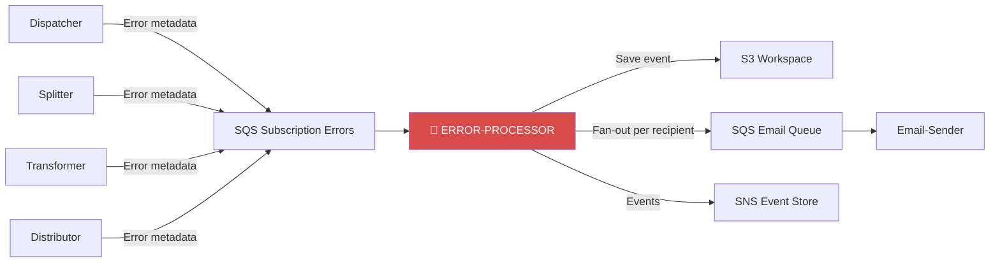
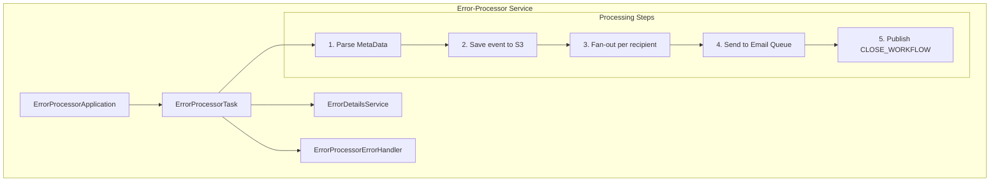
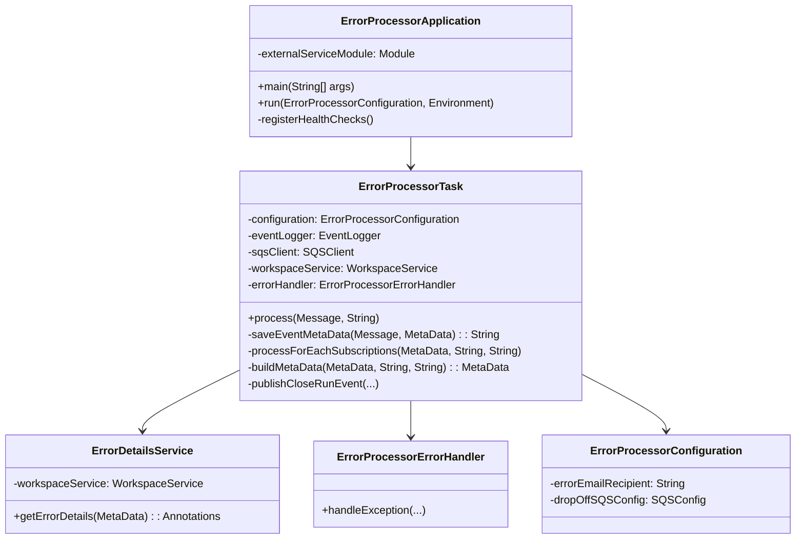
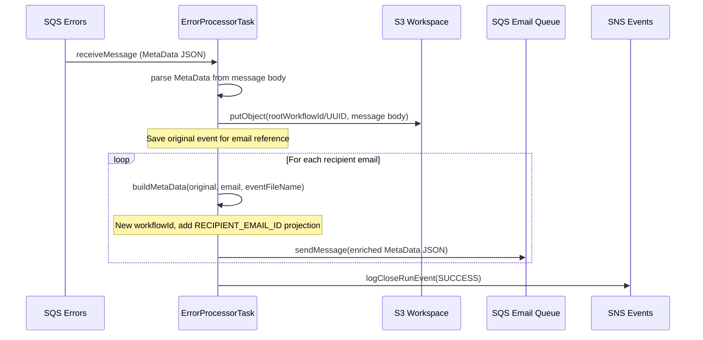

# Error-Processor Module — Design Document

> **Module:** `error-processor`  
> **Generated:** 2026-05-24  
> **Artifact:** `com.inttra.mercury.error.processor:error-processor:1.0-SNAPSHOT`  
> **Java Version:** 17 | **Framework:** Dropwizard 4.x + Guice 7.x

---

## 1. Executive Summary

The **Error-Processor** is a failure notification router in the AppianWay pipeline. When upstream components encounter errors, they publish error metadata to a shared error queue. The Error-Processor consumes these, persists error details to S3, fans out notifications to each configured email recipient, and forwards them to the Email-Sender for delivery.

---

## 2. Role in the Pipeline



---

## 3. High-Level Architecture



---

## 4. Class Diagram



---

## 5. Data Flow Diagram



---

## 6. Fan-Out Logic

The error processor multiplies each error message by the number of configured recipients:

```
Input: 1 error message + "alice@co.com,bob@co.com,carol@co.com"
Output: 3 messages to email queue, each with unique workflowId
```

**Per-recipient MetaData enrichment:**

| Field | Value |
|-------|-------|
| `workflowId` | New UUID (child of error workflow) |
| `parentWorkflowId` | Preserved from original |
| `rootWorkflowId` | Preserved from original |
| `projections.RECIPIENT_EMAIL_ID` | Individual email address |
| `projections.EXIT_STATUS_SUCCESS` | Set |
| `bucket` | Workspace bucket |
| `fileName` | Saved event file reference |

---

## 7. Configuration Details

| Property | Type | Default | Description |
|----------|------|---------|-------------|
| `componentName` | String | `error-processor` | Service identity |
| `errorEmailRecipient` | String | — | Comma-separated email addresses |
| `sqsPickupConfig.queueUrl` | String | — | Error subscription queue |
| `sqsPickupConfig.waitTimeSeconds` | int | `20` | Long poll |
| `sqsPickupConfig.maxNumberOfMessages` | int | `10` | Batch size |
| `dropOffSQSConfig.queueUrl` | String | — | Email queue (output) |
| `s3WorkspaceConfig.bucket` | String | — | Workspace bucket |
| `snsEventConfig.topicArn` | String | — | Event topic |
| `sqsErrorConfig.queueUrl` | String | — | Self-referential error queue |

---

## 8. Error Handling

The Error-Processor handles its own errors gracefully:
- If processing fails, the `ErrorProcessorErrorHandler` logs error events
- The `sqsErrorConfig` points to its own pickup queue (circuit-breaker pattern)
- Message visibility timeout provides natural retry for transient failures

---

## 9. Key Maven Dependencies

| Dependency | Version | Purpose |
|-----------|---------|---------|
| `mercury-shared` | 1.0 | Framework, S3, SQS, events |
| `dropwizard-core` | 4.0.16 | Application framework |
| `guice` | 7.0.0 | DI container |
| `guava` | 33.1.0-jre | Utilities |
| `lombok` | 1.18.32 | Code generation |
| `slf4j-api` | 2.0.17 | Logging |

---

## 10. Health Checks

| Check | Category | Target |
|-------|----------|--------|
| `InboundSqsHealthCheck` | READ | Pickup queue accessible |
| `S3ReadHealthCheck` | READ | Workspace readable |
| `OutboundSqsHealthCheck` | WRITE | Drop-off email queue |
| `SnsPublishHealthCheck` | WRITE | Event topic |
