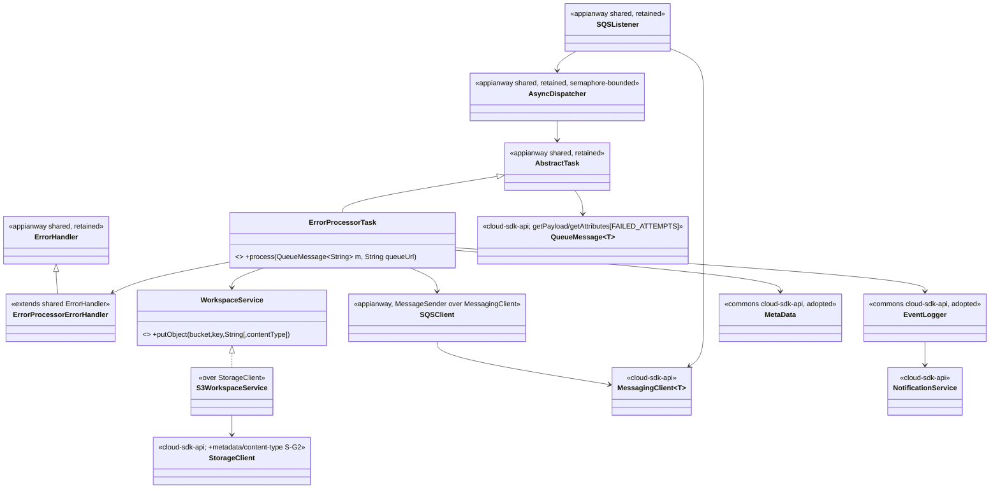
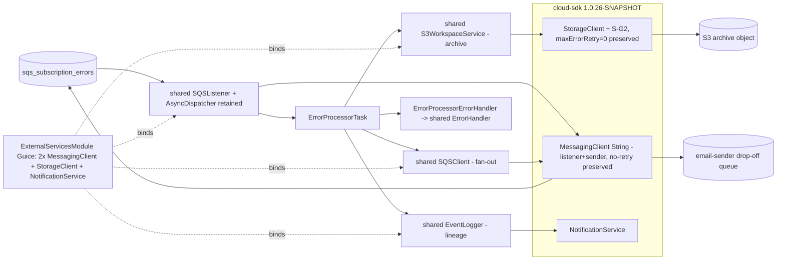

# `error-processor` — AWS SDK v2 (cloud-sdk) Upgrade DESIGN (claude)

> Module: `error-processor` · Date: 2026-05-31 · Author: Claude (Opus 4.8) · **Chosen option: B**
> Companion: [error-processor PLAN](2026-05-31-error-processor-aws2x-upgrade-plan-claude.md). Foundation (do not duplicate): [shared DESIGN](../../shared/docs/2026-05-31-shared-aws2x-upgrade-DESIGN-claude.md) §5/§6, [shared PLAN](../../shared/docs/2026-05-31-shared-aws2x-upgrade-plan-claude.md) §10/§11.

---

## 1. Overview & chosen option

**Option B** — adopt `commons` + `cloud-sdk-api`/`cloud-sdk-aws` `1.0.26-SNAPSHOT` on Dropwizard 5; keep appianway's `SQSListener`+`AsyncDispatcher`; re-type the chain to `QueueMessage<String>`; adopt commons `MetaData`/`Event`. error-processor is the **error sink**: fan-in from `sqs_subscription_errors` → archive payload to S3 → fan out one email request per recipient to the email-sender drop-off queue. Archive write uses shared's additive **S-G2** (optional content-type/metadata). No module-specific cloud-sdk change. Preserve the S3/SNS **no-retries** config and the error-sink delete semantics.

---

## 2. Class diagram (target)



**Removed v1 types:** `AmazonSQS`, `AmazonS3`, `AmazonSNS`, `com.amazonaws.services.sqs.model.Message`, `com.amazonaws.ClientConfiguration`.
**Adopted commons types:** `MetaData`, `Event`, `EventLogger`.
**Consumed cloud-sdk-api:** `MessagingClient<String>`, `QueueMessage<String>`, `StorageClient` (+S-G2), `NotificationService`.

---

## 3. Component diagram



---

## 4. Sequence diagram — fan-in → archive → fan-out

```mermaid
sequenceDiagram
    participant L as SQSListener (appianway)
    participant M as MessagingClient~String~
    participant D as AsyncDispatcher (semaphore-bounded)
    participant T as ErrorProcessorTask
    participant WS as S3WorkspaceService
    participant SC as StorageClient (S-G2)
    participant EH as ErrorProcessorErrorHandler
    L->>M: receiveMessages(ReceiveMessageOptions{wait=20s, attrs=[FAILED_ATTEMPTS]})
    M-->>L: List<QueueMessage<String>>
    L->>D: submit(messages, sqs_subscription_errors url)
    D->>T: process(QueueMessage<String>)
    T->>T: MetaData = fromJson(payload)
    T->>WS: putObject(bucket, rootWorkflowId/uuid, payload[, contentType])
    WS->>SC: putObject(...)  %% S-G2 (no-retry client)
    loop each recipient email
      T->>M: sendMessage(dropOffQueueUrl, json(targetMetaData))  %% email fan-out
    end
    T->>L: deleteMessage(queueUrl, receiptHandle)  %% on success (shared chain)
    Note over T,EH: on Exception -> errorHandler.handleException(message,...)
    EH->>EH: getAttributes()[FAILED_ATTEMPTS]+1; re-send w/ delay OR DLQ (shared semantics, unchanged)
    Note over T: archive-write failure -> RecoverableException -> NO delete -> re-delivery (preserved)
```

---

## 5. Configuration

Per **master shared DESIGN §5 / PLAN §10**. Module-specific note: preserve the **`withMaxErrorRetry(0)`** S3/SNS client behavior ([ExternalServicesModule.java:20,26](../src/main/java/com/inttra/mercury/error/processor/modules/ExternalServicesModule.java)) by mapping to a zero-retry cloud-sdk-aws `ClientOverrideConfiguration`/retry policy. `conf/error-processor.yaml` + `.properties` + `${PROFILE}`/`${ENV}` + `${awsps:…}` flow through the appianway config command composing public commons transforms. `getErrorEmailRecipient`, drop-off/pickup queue URLs are plain config. Zero commons change.

---

## 6. cloud-sdk gaps

Reference **master shared DESIGN §6**. Only **S-G2** is relevant (archive `putObject` with optional metadata/content-type; strictly-additive `default` overload; `S3StorageClient` sole implementor). **No module-specific cloud-sdk change.** G1/G3/G6/G7 do not apply. Email fan-out and lineage use the existing public `MessagingClient.sendMessage` / `NotificationService`.

---

## 7. Maven dependency changes

- Pin **`1.0.26-SNAPSHOT`** via root `dependencyManagement`.
- **Remove:** direct `com.amazonaws:aws-java-sdk-sqs` ([pom.xml:45-46](../pom.xml)); S3/SNS v1 (transitive via `shared`) drop out once `shared` is migrated. Drop `<aws-java-sdk.version>` reliance.
- **Add:** `cloud-sdk-api` (if naming interface types in the Guice module); `cloud-sdk-aws` transitive via `shared`.
- Add `dropwizard-testing` (JUnit 5); `junit-vintage-engine` during transition.

## 8. Tests

- **New tests JUnit 5**; existing JUnit 4 via Vintage during transition.
- Re-point mocks: v1 `AmazonSQS`/`AmazonS3`/`AmazonSNS`/`Message` → `MessagingClient<String>`/`StorageClient`/`NotificationService`/`QueueMessage<String>`.
- `ErrorProcessorTask` tests: archive `putObject` invoked with correct path (`rootWorkflowId/uuid`) and (with S-G2) content-type; fan-out `sendMessage` invoked once per recipient with the built target `MetaData`; lineage `logCloseRunEvent`.
- **Error-sink failure path (preserve semantics):** when the archive `putObject` throws, assert `RecoverableException`/no-delete → re-delivery, and that `FAILED_ATTEMPTS` increments as a `String` attribute (master §3). No loop introduced.
- Preserve **no-retries** behavior in the client config (assert zero-retry mapping).
- **`functional-testing` fakes** re-pointed to cloud-sdk-api (lockstep with `shared`); preserve behavior.

## 9. Rollout & verification

1. After `shared` + `functional-testing`.
2. After **`event-writer`** (first consumer). Then error-processor: rebind module (preserve no-retries); re-type chain; adopt commons `MetaData`/`Event`; S-G2 archive write → `mvn -pl error-processor -am verify`.
3. Dev-run the failure path (archive-write failure → re-delivery; email fan-out reaches the drop-off queue).

## 10. Risks & mitigations

| Risk | Mitigation |
|---|---|
| Archive-write-failure loop | Preserve `RecoverableException`/delete semantics in `shared` `ErrorHandler`; explicit failure-path test |
| Lost no-retries behavior | Map `maxErrorRetry(0)` to zero-retry cloud-sdk-aws config; assert in test |
| `Message`→`QueueMessage<String>` misses a site | Compiler-driven type change |
| `FAILED_ATTEMPTS` attribute semantics | Round-trip test; `Map<String,String>` confirmed (master §3) |
| Listener/sender split | Two configured `MessagingClient` instances (§5) |
| S-G2 content-type change | Additive; archived bytes unchanged |
| Functional fakes not ready | Gate behind `functional-testing` |
| Any cloud-sdk change breaking mercury-services | S-G2 strictly additive; cloud-sdk CI + mercury-services build green before/after |
</content>
