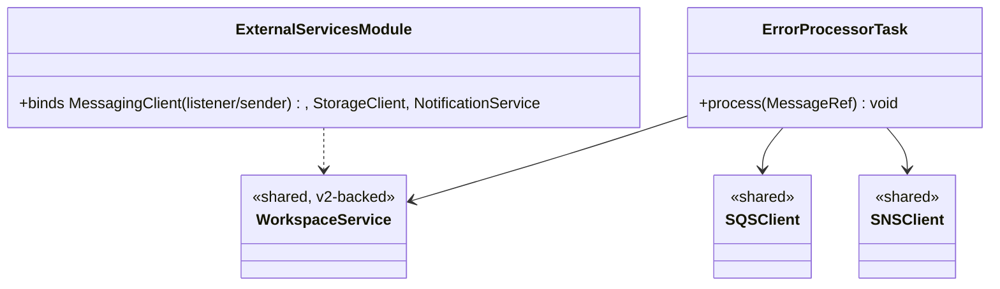
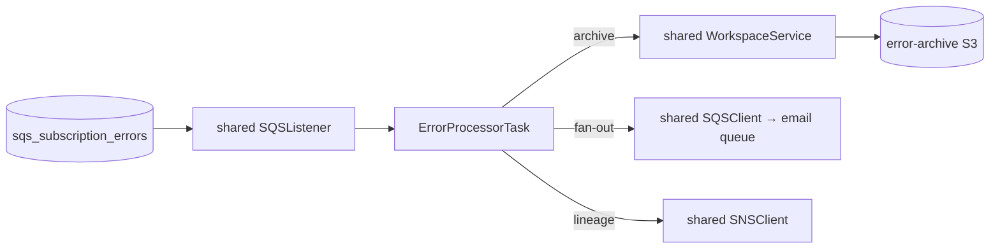
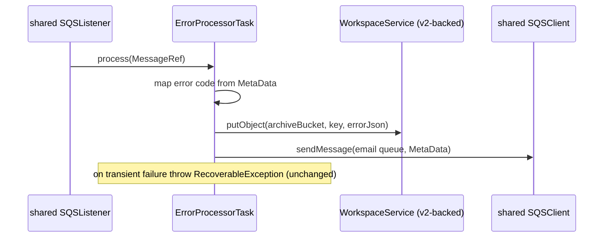

# `error-processor` — AWS SDK v2 (cloud-sdk) Upgrade DESIGN

> **DIRECTIVE UPDATE (2026-05-31) — supersedes the Option-A recommendation in this document.** Per stakeholder direction the program now targets **Dropwizard 5** and **Option B — adopt `commons` + `cloud-sdk-api`/`cloud-sdk-aws`** as the directed default (recommend Option A only on a categorical technical blocker). All AWS service communication goes through `cloud-sdk-api`; new tests are written in **JUnit 5 (Jupiter)** (existing JUnit 4 runs via JUnit Vintage during transition); configuration follows the composed appianway `.properties`/`${PROFILE}`/`${ENV}` + commons `${awsps:...}` model in the master [shared plan §10](../../shared/docs/2026-05-31-shared-aws2x-upgrade-plan-copilot.md). cloud-sdk gaps are indexed in the master [shared plan §11](../../shared/docs/2026-05-31-shared-aws2x-upgrade-plan-copilot.md) with full technical specs in the master [shared DESIGN §1A.6](../../shared/docs/2026-05-31-shared-aws2x-upgrade-DESIGN.md).
> **Module-specific cloud-sdk gaps:** G1 (concurrent SQS listener for `sqs_subscription_errors` fan-in), G2 (S3 archive putObject with metadata), G6 (config), G7 (health checks). Email fan-out is via the email-sender queue (no direct SES here).
> Sections below are retained as the Option-A fallback reference.

> Module: `error-processor` · Date: 2026-05-31 · Author: GitHub Copilot (Claude Opus 4.8) · Option **A**
> Companion: [plan](2026-05-31-error-processor-aws2x-upgrade-plan-copilot.md). Foundation: [`shared` DESIGN](../../shared/docs/2026-05-31-shared-aws2x-upgrade-DESIGN.md). Session `83b822b011714117`.

## 1. Overview
Standard consumer migration: rebind `AmazonSQS`/`AmazonSNS`/`AmazonS3` Guice bindings to `cloud-sdk-aws`-backed `shared` wrappers; swap `Message`→`MessageRef`. No behavior change to archival/fan-out logic.

## 2. Class diagram

## 3. Component diagram

## 4. Sequence diagram

## 5. Configuration changes
`conf/error-processor.yaml` AWS keys retained, mapped to v2 via `shared` facade. No placeholder change.

## 6. Maven dependency changes
- **Remove:** `aws-java-sdk-{sqs,sns,s3}` from `error-processor/pom.xml`.
- **Add:** `cloud-sdk-api` only if naming interface types.
- v2 runtime transitive via `shared`.

## 7. Test details
- `functional-testing` fakes migrated first.
- Keep tests: archive-to-S3, fan-out routing, error-code mapping, transient-failure (`RecoverableException`) path.
- DTO → `MessageRef`. JUnit 4 retained.

## 8. Rollout & verification
First wave with `event-writer`. `mvn -pl error-processor -am verify`. Smoke: post a failing MetaData to the error queue; confirm S3 archive + email fan-out.

## 9. Risks & mitigations
| Risk | Mitigation |
|---|---|
| Archive-write failure loop | Preserve `RecoverableException`/delete; test failure path |
| DTO swap miss | Compiler-driven |
