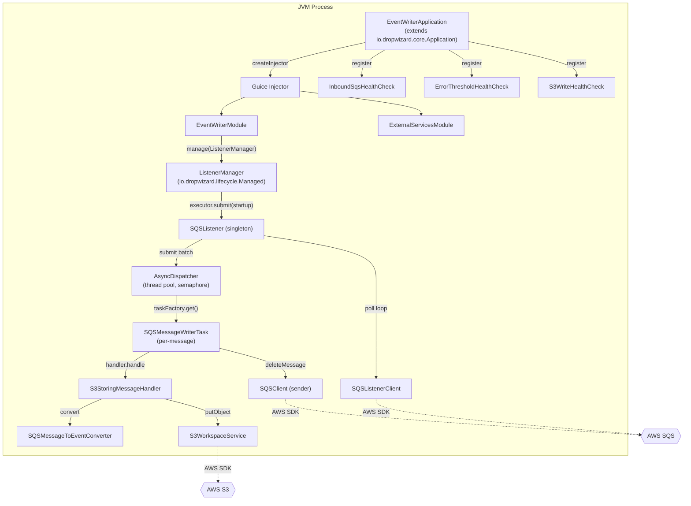
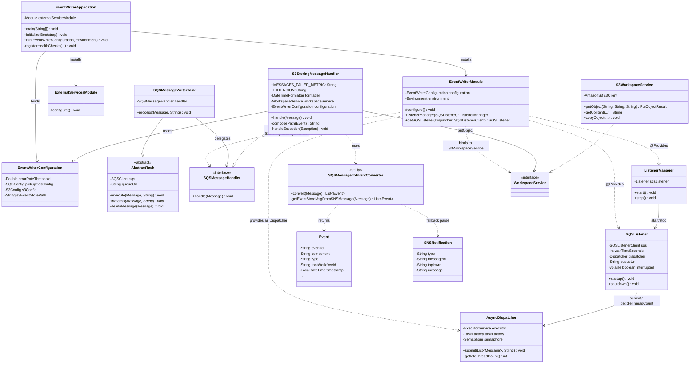

# Event-Writer Module — Architecture & Design

> **Author:** Principal Engineering Review · **Date:** 2026-05-24 · **Module Version:** 1.0 (parent `com.inttra.mercury:appian-way:1.0`)

---

## 1. Executive Summary

The **event-writer** is the cross-cutting audit / event-store sink of the Mercury (Appian Way) pipeline. It is a small, single-purpose Dropwizard 4 service that consumes pipeline lifecycle events from a fan-out SQS queue (`*_sqs_event_store_pu`, fed by the platform-wide SNS topic `*_sns_event_store`) and persists each event as a JSON object in S3 under a deterministic, partitioned key.

Despite the README's terse claim that it "Writes SQS received messages to DynamoDB table" ([README.md:3](../README.md)), the **actual** persistence target is **Amazon S3** — see [`S3StoringMessageHandler.java:45-47`](../src/main/java/com/inttra/mercury/eventstore/services/S3StoringMessageHandler.java) and [`event-writer.yaml:9-12`](../conf/event-writer.yaml). The README is stale and should be corrected; DynamoDB is not a dependency or runtime target of this module.

Key characteristics:

- **Pure consumer:** no inbound HTTP API beyond Dropwizard admin/ops endpoints. The application port is set to `0` in production ([`conf/prod/event-writer.properties:5`](../conf/prod/event-writer.properties)) — only the admin connector (`8081`) is meaningful.
- **Stateless:** no database, no caches, no embedded state. The S3 key is deterministically computed from the event payload itself.
- **At-least-once semantics:** message is deleted from SQS *after* successful `PutObject`. Failures throw a `RecoverableException` that propagates out of `process`, causing the message to reappear after the visibility timeout. See [`AbstractTask.java:24-36`](../../shared/src/main/java/com/inttra/mercury/shared/task/AbstractTask.java).
- **Bounded concurrency:** `AsyncDispatcher` uses a `Semaphore` sized to `maxNumberOfMessages` ([`AsyncDispatcher.java:33-36`](../../shared/src/main/java/com/inttra/mercury/shared/threaddispatcher/AsyncDispatcher.java)) so the in-flight count cannot exceed the SQS batch ceiling. The `SQSListener` only requests as many messages as there are idle threads — back-pressure is built-in.
- **Schema-tolerant ingestion:** the converter accepts both raw `List<Event>` JSON arrays *and* SNS-wrapped envelopes via a try/fallback path ([`SQSMessageToEventConverter.java:16-30`](../src/main/java/com/inttra/mercury/eventstore/services/SQSMessageToEventConverter.java)).
- **Operational simplicity:** a single Guice module, three services, one task, ~150 production LOC. No Kafka, no DLQ wiring in code (DLQ is platform/SQS-level), no retries beyond the natural SQS redelivery.

Risks (expanded in §13) center on: (a) silent error suppression on the persistence path, (b) lack of poison-pill quarantine, (c) the `metrics.frequency` placeholder in `event-writer.yaml` that has no default, and (d) JDK8 base image in the active `Dockerfile` vs. `e2openjre11` in `build.sh`.

---

## 2. Position in the Mercury Pipeline

Mercury is an XML message-processing pipeline composed of independently-deployed components (`dispatcher`, `splitter`, `structuralvalidator`, `validator`, `transformer`, `router`, `distributor`, `fulfiller`, `email-sender`, `mftdispatcher`, `gen2-parser`, `ingestor`, `error-processor`, etc.) that hand work off via SQS-per-component queues. Each component, when it begins or finishes a unit of work, emits an `Event` (see [`shared/.../event/Event.java`](../../shared/src/main/java/com/inttra/mercury/shared/event/Event.java)) via `SNSEventPublisher` to a *single* platform-wide SNS topic (`*_sns_event_store`). The event-writer is the **only** subscriber to that topic (per environment configuration), and is therefore the canonical observer of every workflow's lifecycle.

```mermaid
flowchart LR
    subgraph "Mercury Pipeline (producers)"
        DISP[dispatcher]
        SPLT[splitter]
        SV[structuralvalidator]
        VAL[validator]
        TRN[transformer]
        RTR[router]
        DST[distributor]
        FUL[fulfiller]
        MFT[mftdispatcher]
        EML[email-sender]
        ING[ingestor]
        ERP[error-processor]
        G2P[gen2-parser]
    end

    SNS{{"SNS topic\n*_sns_event_store"}}
    SQS[("SQS queue\n*_sqs_event_store_pu\n(this module's input)")]
    EW[[event-writer]]
    S3[("S3 bucket\n*-workspace\nprefix: eventstore/")]

    DISP & SPLT & SV & VAL & TRN & RTR & DST & FUL & MFT & EML & ING & ERP & G2P -- "publish Event\n(SNSEventPublisher)" --> SNS
    SNS -- "fan-out\n(SQS subscription,\nraw=false → SNSNotification envelope)" --> SQS
    SQS -- "long-poll receive\n(SQSListener)" --> EW
    EW -- "putObject(JSON)" --> S3

    classDef ext fill:#fff3e0,stroke:#e65100,color:#000;
    classDef this fill:#c8e6c9,stroke:#1b5e20,color:#000,stroke-width:2px;
    class SNS,SQS,S3 ext;
    class EW this;
```



### Why an event store?

The event store serves four downstream concerns, none of which live in this module:

1. **Audit & compliance.** Every transition emitted by every component is durably archived with its `workflowId`, `runId`, `timestamp`, and `tokens`.
2. **Reconciliation / replay.** Operations can reconstruct what happened to any given workflow by listing the partition `eventstore/YYYY-MM-DD/{rootWorkflowId}/`.
3. **Analytics.** Downstream Athena/Glue jobs (out of scope here) can query the partitioned JSON layout directly without a DB.
4. **Forensics.** When a workflow fails in production, the `eventstore/.../<component>-<type>-<eventId>.json` path is the first stop for engineers.

### Why not write directly from each producer?

Producers publish to SNS (asynchronous, fire-and-forget). SNS handles fan-out and retention guarantees; SQS gives the writer its own visibility-timeout-based retry loop independent of producer throughput. This decouples producer hot-paths from S3 latency and from event-writer outages — if event-writer is down, events queue in `*_sqs_event_store_pu` until visibility-timeout-bounded retention expires, while producers continue unaffected.

---

## 3. High-Level Architecture

The event-writer is a Dropwizard-managed long-lived process. It consists of five collaborating elements:

| Element | Role | Source |
|---|---|---|
| `EventWriterApplication` | Dropwizard `Application<EventWriterConfiguration>` entry point. Bootstraps Guice and registers health checks. | [`EventWriterApplication.java`](../src/main/java/com/inttra/mercury/eventstore/EventWriterApplication.java) |
| `EventWriterModule` | Guice wiring of dispatcher, listener, handler, workspace. | [`EventWriterModule.java`](../src/main/java/com/inttra/mercury/eventstore/modules/EventWriterModule.java) |
| `ExternalServicesModule` | Provides the concrete `AmazonSQS` (named `amazonSQSForListener` / `amazonSQSForSender`) and `AmazonS3` clients with shared `AWSClientConfiguration` tuning. | [`ExternalServicesModule.java`](../src/main/java/com/inttra/mercury/eventstore/modules/ExternalServicesModule.java) |
| `SQSListener` (shared) | Long-poll loop, gated by `dispatcher.getIdleThreadCount()`. | [`shared/.../listener/SQSListener.java`](../../shared/src/main/java/com/inttra/mercury/shared/listener/SQSListener.java) |
| `AsyncDispatcher` (shared) | Bounded thread-pool (size = `maxNumberOfMessages`), semaphore-gated. | [`shared/.../threaddispatcher/AsyncDispatcher.java`](../../shared/src/main/java/com/inttra/mercury/shared/threaddispatcher/AsyncDispatcher.java) |
| `SQSMessageWriterTask` | Thin wrapper extending `AbstractTask`, delegates to the handler. | [`SQSMessageWriterTask.java`](../src/main/java/com/inttra/mercury/eventstore/task/SQSMessageWriterTask.java) |
| `SQSMessageToEventConverter` | Static utility that deserialises an SQS body into `List<Event>`, falling back through `SNSNotification` if needed. | [`SQSMessageToEventConverter.java`](../src/main/java/com/inttra/mercury/eventstore/services/SQSMessageToEventConverter.java) |
| `S3StoringMessageHandler` | The single `SQSMessageHandler` implementation; computes the S3 key and calls `workspaceService.putObject`. | [`S3StoringMessageHandler.java`](../src/main/java/com/inttra/mercury/eventstore/services/S3StoringMessageHandler.java) |
| `S3WorkspaceService` (shared) | Wraps `AmazonS3.putObject` and re-throws `SdkClientException` as `RecoverableException`. | [`shared/.../workspace/S3WorkspaceService.java`](../../shared/src/main/java/com/inttra/mercury/shared/workspace/S3WorkspaceService.java) |



### Threading model

- **One** listener thread (driven by `ListenerManager`'s single-thread executor — [`ListenerManager.java:18-21`](../../shared/src/main/java/com/inttra/mercury/shared/listener/support/ListenerManager.java)).
- **N** worker threads inside `AsyncDispatcher` where `N = pickupSqsConfig.maxNumberOfMessages` (default 10).
- The listener never blocks on processing — it `submit`s to the dispatcher and immediately resumes polling, but only requests `getIdleThreadCount()` messages so that the dispatcher's semaphore is never violated. This couples polling rate to processing throughput naturally.

### Failure model (high-level)

- **Recoverable** S3 SDK errors become `RecoverableException` in `S3WorkspaceService.putObject` ([`S3WorkspaceService.java:85-91`](../../shared/src/main/java/com/inttra/mercury/shared/workspace/S3WorkspaceService.java)). Importantly, however, `S3StoringMessageHandler.handle` **swallows them in a generic catch-all** ([`S3StoringMessageHandler.java:42-52`](../src/main/java/com/inttra/mercury/eventstore/services/S3StoringMessageHandler.java)). That swallow is a deliberate design choice — see §11.
- **Unrecoverable** parse errors fall through the `convert` try/fallback ([`SQSMessageToEventConverter.java:17-23`](../src/main/java/com/inttra/mercury/eventstore/services/SQSMessageToEventConverter.java)) and any further exception is caught by the same catch-all in the handler.
- Because the handler swallows exceptions, `AbstractTask.execute` sees a successful `process()`, deletes the SQS message, and the **only** signal of failure is the `messages-failed` meter and a logged error.

---

## 4. Low-Level Design

### 4.1 Bootstrap sequence

`main` in [`EventWriterApplication.java:37-39`](../src/main/java/com/inttra/mercury/eventstore/EventWriterApplication.java) instantiates the application with the production `ExternalServicesModule` and calls `run(args)`. This routes through Dropwizard:

1. `initialize(Bootstrap)` ([`EventWriterApplication.java:42-47`](../src/main/java/com/inttra/mercury/eventstore/EventWriterApplication.java)):
   - If `S3ConfigurationProvider.requiresS3Configuration()` returns true (typically driven by an `s3://` URL in the YAML path arg), the bootstrap uses an `S3ConfigurationProvider` to fetch the YAML from S3 — supporting AWS-hosted configuration without baking the YAML into the image.
   - Adds the custom `ConfigProcessingServerCommand` which is the shared variant of Dropwizard's `ServerCommand` that performs `${var:-default}` property substitution against the supplied `.properties` files (see `network-services.properties`, `datadog.properties`, `event-writer.properties` arguments in [`Dockerfile:9`](../Dockerfile)).
2. `run(EventWriterConfiguration, Environment)` ([`EventWriterApplication.java:50-59`](../src/main/java/com/inttra/mercury/eventstore/EventWriterApplication.java)):
   - Builds the Guice `Injector` with `externalServiceModule` plus `EventWriterModule(configuration, environment)`.
   - Pulls the `ListenerManager` singleton from the injector and registers it with `environment.lifecycle()` so Dropwizard owns its `start`/`stop`.
   - Registers health checks (see §4.6).

### 4.2 Guice wiring (`EventWriterModule`)

[`EventWriterModule.configure()`](../src/main/java/com/inttra/mercury/eventstore/modules/EventWriterModule.java) does the load-bearing wiring:

- `bind(EventWriterConfiguration.class).toInstance(configuration)` — makes the YAML config injectable.
- A `Provider<SQSMessageWriterTask>` is obtained via `getProvider(SQSMessageWriterTask.class)` (deferred — Guice can't construct it eagerly because `Dispatcher` needs the `TaskFactory` to build it). The `TaskFactory` is implemented as a one-liner lambda `message -> taskProvider.get()` ([`EventWriterModule.java:39`](../src/main/java/com/inttra/mercury/eventstore/modules/EventWriterModule.java)) — every SQS message gets a fresh task instance, but the task itself just holds an `SQSClient` and a singleton handler, so allocation cost is minimal.
- `bind(Dispatcher.class).toInstance(new AsyncDispatcher(taskFactory, pickupSqsConfig.getMaxNumberOfMessages()))` — sizes the worker pool exactly to the SQS batch ceiling.
- `bind(SQSMessageHandler.class).to(S3StoringMessageHandler.class)` — the only handler implementation; the interface exists for testability/future variants (e.g., a DynamoDB handler the README still hints at).
- `bind(WorkspaceService.class).to(S3WorkspaceService.class)` — pluggable but only one impl is registered.
- `install(new MetricsInstrumentationModule(environment.metrics()))` — enables AOP for `@Metered`/`@Timed`/`@Counted` Codahale annotations on Guice-managed beans. This is what makes the `@Metered(name = MESSAGES_FAILED_METRIC)` on the private `handleException` actually wire up.

Two `@Provides @Singleton` methods:

- `listenerManager(SQSListener)` — wraps the listener for Dropwizard lifecycle management.
- `getSQSListener(Dispatcher, SQSListenerClient)` — constructs the listener using the queue URL, wait-time, and batch size from `pickupSqsConfig`.

### 4.3 Guice wiring (`ExternalServicesModule`)

[`ExternalServicesModule.configure()`](../src/main/java/com/inttra/mercury/eventstore/modules/ExternalServicesModule.java) provides three AWS SDK clients:

- `AmazonSQS` annotated `@Named("amazonSQSForListener")` — uses `AWSClientConfiguration.sqs_listener` tuning (typically a higher connection pool and longer socket timeout to accommodate long polling).
- `AmazonSQS` annotated `@Named("amazonSQSForSender")` — uses `AWSClientConfiguration.sqs_sender` (shorter timeouts, retried sends; used by `SQSClient` for `deleteMessage`).
- `AmazonS3` (unqualified) — uses `AWSClientConfiguration.s3_read_put_copy` (general-purpose S3 settings: PUT throughput tuning, retry policy).

These are platform-shared configs from `com.inttra.mercury.shared.config.AWSClientConfiguration`. Credentials and region are picked up from the default AWS credential chain plus the `CONFIG_REGION` env variable set in [`run.sh:14`](../run.sh) (`-DCONFIG_REGION=US_EAST_1`).

### 4.4 The polling loop (`SQSListener`)

The loop in [`SQSListener.startup()`](../../shared/src/main/java/com/inttra/mercury/shared/listener/SQSListener.java) is the only continuously-running thread:

```
while not stopped:
    while not stopped:
        idle = dispatcher.getIdleThreadCount()
        if idle > 0:
            req = ReceiveMessageRequest(queueUrl)
                    .withWaitTimeSeconds(waitTimeSeconds)        // long poll
                    .withMaxNumberOfMessages(idle)               // back-pressure
                    .withMessageAttributeNames(FAILED_ATTEMPTS)  // for poison-pill counting
            messages = sqs.receiveMessage(req)
            if messages not empty:
                dispatcher.submit(messages, queueUrl)
```

Key behaviours:

- **Adaptive batch.** If all workers are busy, `idle == 0` and the inner loop hot-spins until a worker frees a permit. This is suboptimal — see §11/§13 — but in practice S3 PUT latency is in tens of milliseconds and 10 workers are rarely saturated.
- **No `Thread.sleep`** when idle == 0. The CPU cost of the busy-wait is bounded but non-zero; under steady-state the long-poll dominates.
- **Exception handling.** `AbortedException` / `InterruptedException` halt the loop. Any other `Throwable` is logged and the outer loop retries — meaning the listener is resilient to transient AWS errors but logs heavily on persistent failure.

### 4.5 The handler — keying strategy

[`S3StoringMessageHandler.composePath`](../src/main/java/com/inttra/mercury/eventstore/services/S3StoringMessageHandler.java) (lines 54-61) is the most important design decision in the module:

```
{s3EventStorePath}/{yyyy-MM-dd}/{rootWorkflowId}/{component}-{type}-{eventId}.json
```

For example: `eventstore/2017-07-19/event-root-workflow-id/dispatcher-startRun-EVENT_ID.json`
(asserted in [`S3StoringMessageHandlerTest.java:54-57`](../src/test/java/com/inttra/mercury/eventstore/services/S3StoringMessageHandlerTest.java) and in the functional test [`EventWriterFuncTest.java:32-34`](../src/test/java/functional/EventWriterFuncTest.java)).

Partitioning rationale (de facto, since there is no documentation in code):

| Segment | Purpose |
|---|---|
| `eventstore` | Logical root inside the shared `*-workspace` bucket. Separates audit data from the workspace files used by other components. |
| `yyyy-MM-dd` | **Date partition** keyed on `event.timestamp` (the event's own clock, not wall-clock). Enables (a) lifecycle / glacier rules at day-granularity, (b) cheap S3 listing for time-bounded queries, (c) Athena hive-style partitioning if a layer is added later. The choice of `event.timestamp` (producer-supplied) means events are filed by *business* time, not arrival time — relevant for late-arriving messages. |
| `rootWorkflowId` | **Workflow partition.** All events for a single message's end-to-end traversal of the pipeline collapse into one prefix, regardless of component. This is exactly what forensics workflows need: list `eventstore/2026-05-24/<rootWorkflowId>/` and you have the full audit trail. |
| `{component}-{type}-{eventId}.json` | **Object name.** `component+type` makes the object self-identifying without download; `eventId` (a UUID) guarantees uniqueness within the partition. Idempotency: re-delivery of the same SNS event will overwrite an identical S3 object (deterministic, byte-equal payload), which is safe. |

Note that the same partition can hold events with mixed `timestamp` days if events for one workflow span midnight — but each event lands in *its own* day partition, so a single workflow's trail can be split across consecutive `yyyy-MM-dd` directories. Listing must walk both.

### 4.6 Health checks

[`EventWriterApplication.registerHealthChecks`](../src/main/java/com/inttra/mercury/eventstore/EventWriterApplication.java) (lines 61-72) registers three checks via `HealthCheckRegistrar.registerDefaultAndOpsHealthChecks`:

- **Read checks** (i.e. inbound-side):
  - `InboundSqsHealthCheck(pickupSqsConfig.queueUrl)` — verifies the SQS queue is reachable and `GetQueueAttributes` succeeds.
  - `ErrorThresholdHealthCheck(metrics.meter(name(SQSMessageWriterTask.class, MESSAGES_FAILED_METRIC)), errorRateThreshold)` — degrades health when the `messages-failed` meter's one-minute rate exceeds `errorRateThreshold` (default `5.0` failures/sec, [`event-writer.yaml:1`](../conf/event-writer.yaml)).
- **Write checks**:
  - `S3WriteHealthCheck(s3Config.bucket)` — periodically attempts a small `putObject` to the workspace bucket to confirm permissions and connectivity.

`HealthCheckRegistrar.registerDefaultAndOpsHealthChecks` wires these into Dropwizard's `/healthcheck` endpoint and also into an "ops" servlet so the platform's load-balancer health probes can distinguish read-failures from write-failures.

---

## 5. Key Classes — Class Diagram



Notes:

- `SQSMessageHandler` is currently single-implementation but is the obvious extension seam — a `DynamoDbStoringMessageHandler` could be added without touching the rest of the wiring.
- `AbstractTask` is the shared *template* across all Mercury components — the `execute → process → deleteMessage` lifecycle is identical everywhere. This module's task is the minimal possible subclass: pass-through to a handler.
- `Event` is the canonical pipeline DTO, defined in `mercury-shared`. The same class is used by every producer to publish.

---

## 6. Data Flow Diagram

End-to-end sequence from a producer (e.g. `dispatcher`) emitting a `startRun` event to the writer persisting it in S3:

```mermaid
sequenceDiagram
    autonumber
    participant Producer as Producer Component\n(e.g. dispatcher)
    participant SNS as SNS\n*_sns_event_store
    participant SQS as SQS\n*_sqs_event_store_pu
    participant LM as ListenerManager
    participant LSN as SQSListener (thread #1)
    participant DSP as AsyncDispatcher
    participant W as Worker thread (1..N)
    participant TASK as SQSMessageWriterTask
    participant HDLR as S3StoringMessageHandler
    participant CONV as SQSMessageToEventConverter
    participant WS as S3WorkspaceService
    participant S3 as S3 bucket\n*-workspace
    participant SQSDEL as SQSClient (sender)

    Producer->>SNS: Publish(Message = "[ {Event JSON} ]")
    SNS->>SQS: deliver as SNSNotification envelope\n(JSON: Type, MessageId, TopicArn, Message=...)
    Note over SQS: message stored, visibility timeout starts on receive

    LM->>LSN: start (Dropwizard lifecycle)
    activate LSN
    loop poll loop
        LSN->>DSP: getIdleThreadCount()
        DSP-->>LSN: idle = k (>0)
        LSN->>SQS: ReceiveMessageRequest\nwaitTime=20s, max=k
        SQS-->>LSN: batch of Messages (0..k)
        alt batch non-empty
            LSN->>DSP: submit(messages, queueUrl)
            loop for each message
                DSP->>DSP: semaphore.acquire()
                DSP->>W: CompletableFuture.runAsync
                W->>TASK: taskFactory.getTask(msg)
                W->>TASK: execute(msg, queueUrl)
                activate TASK
                TASK->>HDLR: handler.handle(msg)
                activate HDLR
                HDLR->>CONV: convert(msg)
                alt body parses as List<Event>
                    CONV-->>HDLR: List<Event>
                else parse fails, try SNS envelope
                    CONV->>CONV: fromJsonString(body, SNSNotification.class)
                    CONV->>CONV: fromJsonArrayString(snsNotification.message, List<Event>)
                    CONV-->>HDLR: List<Event>
                end
                loop for each event
                    HDLR->>HDLR: composePath(event)
                    HDLR->>WS: putObject(bucket, key, Json.toJsonString(event))
                    WS->>S3: AmazonS3.putObject
                    S3-->>WS: PutObjectResult
                    WS-->>HDLR: PutObjectResult
                end
                HDLR-->>TASK: (void; exceptions swallowed)
                deactivate HDLR
                TASK->>SQSDEL: deleteMessage(queueUrl, receiptHandle)
                SQSDEL->>SQS: DeleteMessage
                deactivate TASK
                DSP->>DSP: semaphore.release()
            end
        end
    end
    deactivate LSN
```

Key invariants the diagram encodes:

- **No message is ack'd before persistence.** The `deleteMessage` call in `AbstractTask.execute` runs *after* `process(...)` returns; if `process` throws, the message is not deleted and will reappear after the visibility timeout. (However, see §11 — `S3StoringMessageHandler.handle` swallows almost all exceptions, so `process` rarely throws in practice.)
- **Per-event PUT, not per-message PUT.** A single SQS message may carry multiple events (`List<Event>`) and each event gets its own S3 key. If PUT #2 fails inside a multi-event message, PUT #1 has already happened and there is no rollback — the at-least-once guarantee applies *per event* only if the failure surfaces; if swallowed, the message is still acknowledged.
- **Long-poll wait dominates idle CPU.** With `waitTimeSeconds=20`, the listener thread spends most of its time inside `receiveMessage` waiting for SQS to push, not spinning.

### 6.1 Two body shapes — the SNS envelope vs. raw

The converter handles two on-the-wire shapes ([`SQSMessageToEventConverter.java:16-30`](../src/main/java/com/inttra/mercury/eventstore/services/SQSMessageToEventConverter.java)):

1. **Raw**: `body = "[{ ...event... }, { ...event... }]"`. Happens if a sender publishes directly to SQS (no SNS), or if the SNS subscription is configured with `RawMessageDelivery=true`.
2. **SNS-wrapped**: `body = "{\"Type\":\"Notification\",\"MessageId\":...,\"Message\":\"[{...}]\"}"`. The default for SNS-to-SQS subscriptions; see [`src/test/resources-functional/happy/event.json`](../src/test/resources-functional/happy/event.json) for a real example.

The converter tries the raw form first (cheaper, common path for direct senders / tests) and falls back through `SNSNotification` on any exception. This is robust but conflates "wrong format" with "I should try the SNS shape" — a malformed raw payload triggers a wasted parse pass. For the message volume in question, this is irrelevant.

---

## 7. Component Dependencies

```mermaid
graph TD
    subgraph "Runtime AWS"
        SQS[SQS *_sqs_event_store_pu]
        SNS[SNS *_sns_event_store]
        S3[S3 *-workspace bucket]
        PARAM[(SSM Param Store /\nNetwork Services config\nvia network-services.properties)]
        ECS[ECS Fargate task]
    end

    subgraph "Producers (publish to SNS topic)"
        DIS[dispatcher]
        ROU[router]
        TRA[transformer]
        OTH[...all other components]
    end

    subgraph "event-writer JVM"
        EW[event-writer]
        DW[dropwizard-core 4.x]
        GI[google-guice]
        SLF[slf4j + logback-classic]
        MGI[metrics-guice]
        GUAV[guava]
        LOM[lombok]
        SHA[mercury-shared\n(SQSListener, S3WorkspaceService,\nhealth checks, Event, Json,\nAWSClientConfiguration,\nConfigProcessingServerCommand,\nS3ConfigurationProvider)]
        DOG[(datadog metrics\nvia datadog.properties)]
    end

    DIS & ROU & TRA & OTH --> SNS
    SNS --> SQS
    EW --> SQS
    EW --> S3
    EW --> DW
    EW --> GI
    EW --> SHA
    SHA --> SQS
    SHA --> S3
    SHA --> PARAM
    EW --> MGI
    EW --> SLF
    EW --> LOM
    EW --> GUAV
    EW --> DOG
    ECS -- runs --> EW

    classDef aws fill:#ffe0b2,stroke:#e65100;
    classDef ours fill:#c8e6c9,stroke:#1b5e20;
    classDef pubs fill:#bbdefb,stroke:#0d47a1;
    class SQS,SNS,S3,PARAM,ECS aws;
    class EW ours;
    class DIS,ROU,TRA,OTH pubs;
```

External-system dependencies:

| Dependency | Direction | Coupling | Notes |
|---|---|---|---|
| **SQS** (`*_sqs_event_store_pu`) | Inbound (pull) | Hard — without it the listener cannot start; `InboundSqsHealthCheck` will fail. | Queue ARN/URL templated per env. |
| **S3** (`*-workspace` bucket) | Outbound (push) | Hard — `S3WriteHealthCheck` fails otherwise. | Shared workspace bucket; events written under `eventstore/` prefix. |
| **SSM Parameter Store / network-services.properties** | Bootstrap | Soft — only used by shared config to resolve cross-service URLs. | Loaded via the `ConfigProcessingServerCommand`. |
| **Datadog** (StatsD) | Observability | Soft — emitter; configured by `datadog.properties`. | Failure to emit metrics does not impact processing. |
| **CloudWatch Logs** (via `awslogs` log driver) | Observability | Soft — see [`conf/prod/event-writer-latest-prod-Task.json:39-46`](../conf/prod/event-writer-latest-prod-Task.json). | Driven by ECS task definition. |
| **SNS topic** (`*_sns_event_store`) | Indirect | Not a direct dep — event-writer only reads its SQS queue. | The SNS-to-SQS subscription is provisioned outside this module (CloudFormation). |
| **IAM role** `INTTRA2-ECS-PR-EventWriter-Task` | Bootstrap | Hard | Grants `sqs:ReceiveMessage`, `sqs:DeleteMessage`, `s3:PutObject` on the workspace bucket. |

Internal Maven dependencies (from [`pom.xml`](../pom.xml)):

- `com.inttra.mercury.shared:mercury-shared` — the platform glue.
- `com.google.inject:guice` — DI.
- `org.projectlombok:lombok` — `@Slf4j`, `@Getter`, `@Setter`, `@Data`.
- `io.dropwizard:dropwizard-core` — application framework. **Snakeyaml excluded** (`pom.xml:46-49`) — the shared platform prefers a managed snakeyaml version to avoid CVE drift.
- `io.dropwizard.metrics:metrics-annotation` — `@Metered`.
- `com.palominolabs.metrics:metrics-guice` — AOP support so `@Metered` annotations work on Guice-managed objects.
- `com.google.guava:guava` — `Joiner`, `ImmutableList`.
- Testing: `junit`, `mockito-core`, `assertj-core`, `com.inttra.mercury.test:functional-testing`.

---

## 8. Configuration & Validation

The module is configured by:

1. The Dropwizard YAML descriptor [`conf/event-writer.yaml`](../conf/event-writer.yaml) — schema only, with `${var:-default}` placeholders.
2. A `.properties` file selected per environment (`conf/{env}/event-writer.properties`) — supplies values for the placeholders.
3. Two platform-shared property files: `network-services.properties` and `datadog.properties`.

The substitution is performed by the shared `ConfigProcessingServerCommand`, registered in [`EventWriterApplication.initialize`](../src/main/java/com/inttra/mercury/eventstore/EventWriterApplication.java) line 46.

`EventWriterConfiguration` is the typed config bean ([`EventWriterConfiguration.java`](../src/main/java/com/inttra/mercury/eventstore/config/EventWriterConfiguration.java)). Validation is enforced via Jakarta Bean Validation annotations (`@NotNull`, `@Digits`, `@Valid`) at Dropwizard startup; missing or malformed values fail the boot.

| Key | Type | Default | Required | Description | Validation |
|---|---|---|---|---|---|
| `errorRateThreshold` | `Double` | `5.0` (from YAML default) | Yes (`@NotNull`) | Failures-per-second one-minute mean above which `ErrorThresholdHealthCheck` reports DOWN. | `@Digits(integer=2, fraction=2)` — max value `99.99`. |
| `pickupSqsConfig.queueUrl` | `String` | none (env-driven) | Yes (`@NotNull`) | The SQS queue to long-poll for events. Templated as `https://sqs.us-east-1.amazonaws.com/{account}/{profile}_{env}_sqs_event[_store]`. | Non-null; URL format implicit. |
| `pickupSqsConfig.waitTimeSeconds` | `int` | `20` (from YAML default) | No | SQS long-poll wait. AWS allows 0..20; 20 is the maximum and is correct here. | None at bean level (int default 0; YAML default 20). |
| `pickupSqsConfig.maxNumberOfMessages` | `int` | `10` (from YAML default) | No | SQS batch size *and* the worker-thread pool size (one-to-one). Max allowed by AWS is 10. | None at bean level; relied upon to be within `1..10`. |
| `s3Config.bucket` | `String` | none (env-driven) | Yes (`@NotNull`, `@Valid` on enclosing field) | Workspace S3 bucket. | Non-null. |
| `s3EventStorePath` | `String` | `eventstore` (per env `.properties`) | Yes (`@NotNull`) | Root S3 key prefix; segregates audit data from other workspace files. | Non-null. |
| `server.connector.port` | `int` | `8081` (YAML default) | No | Dropwizard simple-server HTTP port. Overridden to `0` in [`conf/event-writer.properties:5`](../conf/event-writer.properties) — i.e., disabled; only the admin connector matters in practice. | None. |
| `logging.level` | `String` | `INFO` | No | Root log level. | None. |
| `metrics.frequency` | `String` | **none** | Yes (no default in YAML) | Reporting frequency for the metrics subsystem (Dropwizard format e.g. `1s`). | None — but missing value will cause Dropwizard config parse to fail. **See §13: Risks.** |

### 8.1 Environment-specific properties

| Env | Queue URL | Bucket | s3EventStorePath |
|---|---|---|---|
| `int` ([`conf/int/event-writer.properties`](../conf/int/event-writer.properties)) | `inttra_int_sqs_event` (account `081020446316`) | `inttra-int-workspace` | `eventstore` |
| `qa` ([`conf/qa/event-writer.properties`](../conf/qa/event-writer.properties)) | `inttra2_qa_sqs_event` (account `642960533737`) | `inttra2-qa-workspace` | `eventstore` |
| `cvt` ([`conf/cvt/event-writer.properties`](../conf/cvt/event-writer.properties)) | `inttra2_cv_sqs_event` | `inttra2-cv-workspace` | `eventstore` |
| `stress` ([`conf/stress/event-writer.properties`](../conf/stress/event-writer.properties)) | `inttra2_st_sqs_event` | `inttra2-st-workspace` | `eventstore` |
| `prod` ([`conf/prod/event-writer.properties`](../conf/prod/event-writer.properties)) | `inttra2_pr_sqs_event` (account `642960533737`) | `inttra2-pr-workspace` | `eventstore` |

Two observations worth noting:

- The **per-env queue name in the deployed properties** is `*_sqs_event` (no `_store_pu` suffix), whereas the **YAML default placeholder** in [`event-writer.properties:2`](../conf/event-writer.properties) is `${PROFILE}_${ENV}_sqs_event_store_pu`. The actual deployed queues follow the simpler `*_sqs_event` convention; the placeholder template appears to predate a rename. This is operationally important: the queue actually being consumed is `*_sqs_event`, not `*_sqs_event_store_pu`.
- All environments share `eventstore` as the path; the functional test uses `eventstore/archive` ([`test-event-writer.properties:4`](../src/test/resources-functional/conf/test-event-writer.properties)) — a test-only override demonstrating that the prefix is configurable.

### 8.2 ECS task config

[`conf/prod/event-writer-latest-prod-Task.json`](../conf/prod/event-writer-latest-prod-Task.json) shows the runtime envelope:

- Image: `081020446316.dkr.ecr.us-east-1.amazonaws.com/centos:AppianWay-event-writer-prod`.
- IAM role: `arn:aws:iam::642960533737:role/INTTRA2-ECS-PR-EventWriter-Task`.
- Env: `ENV=prod`, `JVM_Xmx=384m`.
- Memory reservation: 384 MiB — small, reflects the stateless nature.
- Log driver: `awslogs` → group `inttra2-pr-lg-app-way`, stream prefix `AppianWay-event-writer-latest-prod`.

The container entrypoint is [`run.sh`](../run.sh) which strips per-env suffixes off the property files copied in by [`build.sh`](../build.sh), then `exec`s:

```
java -Xmx${JVM_Xmx} -XX:+UseG1GC -jar -DCONFIG_REGION=US_EAST_1 ${RELEASE_NAME}.jar \
     run event-writer.yaml ./event-writer.properties \
     ./network-services.properties ./datadog.properties
```

---

## 9. Maven Dependencies

| GroupId | ArtifactId | Version property | Scope | Why |
|---|---|---|---|---|
| `com.inttra.mercury.shared` | `mercury-shared` | `${mercury.shared.version}` | compile | Platform glue: `SQSListener`, `AsyncDispatcher`, `S3WorkspaceService`, `Event`, health-check indicators, AWS client config, JSON helpers, `ConfigProcessingServerCommand`, `S3ConfigurationProvider`. |
| `com.google.inject` | `guice` | `${google-guice.version}` | compile | DI container. |
| `org.projectlombok` | `lombok` | `${lombok-version}` | provided | `@Slf4j`, `@Getter`, `@Setter`, `@Data` at compile-time only. |
| `io.dropwizard` | `dropwizard-core` | `${io.dropwizard.version}` | compile | Application framework (lifecycle, config, admin endpoints, healthchecks). `snakeyaml` excluded so the platform's pinned version is used. |
| `io.dropwizard.metrics` | `metrics-annotation` | `${dropwizard.metrics.annotation}` | compile | `@Metered`, `@Timed`, `@Counted` annotations. |
| `com.google.guava` | `guava` | `${google-guava.version}` | compile | `Joiner`, `ImmutableList`. |
| `com.palominolabs.metrics` | `metrics-guice` | `${metrics-juice.version}` | compile | AOP intercept of Codahale metric annotations on Guice-managed beans. Installed in `EventWriterModule.configure()`. |
| `org.slf4j` | `slf4j-api` | `${slf4j-api.version}` | compile | Logging facade. |
| `ch.qos.logback` | `logback-classic` | `${logback-classic.version}` | compile | SLF4J binding. Has a CVE suppression for `CVE-2025-11226` in [`suppressions.xml`](../suppressions.xml). |
| `junit` | `junit` | `${junit.version}` | test | JUnit 4 — used by both unit and functional tests. |
| `org.mockito` | `mockito-core` | `${mockito.version}` | test | Mocking. |
| `org.assertj` | `assertj-core` | `${assertj-core.version}` | test | Fluent assertions. |
| `com.inttra.mercury.test` | `functional-testing` | `1.0` | test | Provides `FunctionalTestBase`, `IntegrationTestRule`, in-memory SQS/S3 fakes, `ResourceAssertions`, `TestDSL`. |

Version properties are inherited from the parent `appian-way` POM and are not pinned in this module.

### Build

`maven-shade-plugin` ([`pom.xml:133-168`](../pom.xml)) produces an executable uber-JAR with main class `com.inttra.mercury.eventstore.EventWriterApplication`. The `ServicesResourceTransformer` is essential because Dropwizard, Jersey, and the AWS SDKs all rely on `META-INF/services/` SPI entries that must be merged across dependencies. The shade plugin also strips signing files (`META-INF/*.SF`, `*.DSA`, `*.RSA`) to avoid `SecurityException: Invalid signature file digest` at runtime.

---

## 10. How the Module Works — Detailed Walkthrough

### 10.1 Startup

```
ENV=prod run.sh
└── java -jar event-writer-${RELEASE}.jar run event-writer.yaml \
        ./event-writer.properties ./network-services.properties ./datadog.properties
        │
        └── ConfigProcessingServerCommand (shared)
            ├── Loads YAML + 3 properties files
            ├── Resolves ${var:-default} placeholders
            └── Hands a resolved EventWriterConfiguration to EventWriterApplication.run
                │
                ├── Guice.createInjector(externalServiceModule, EventWriterModule)
                │   ├── ExternalServicesModule: binds AmazonSQS (x2), AmazonS3
                │   └── EventWriterModule:
                │       ├── binds EventWriterConfiguration
                │       ├── builds AsyncDispatcher(taskFactory, max=10)
                │       ├── binds SQSMessageHandler -> S3StoringMessageHandler
                │       ├── binds WorkspaceService -> S3WorkspaceService
                │       ├── installs MetricsInstrumentationModule (Guice AOP)
                │       ├── @Provides SQSListener (uses SQSListenerClient, dispatcher, queueUrl)
                │       └── @Provides ListenerManager wrapping SQSListener
                │
                ├── environment.lifecycle().manage(listenerManager)
                │   └── Dropwizard will call listenerManager.start() after run() returns
                │
                └── HealthCheckRegistrar.registerDefaultAndOpsHealthChecks
                    ├── readHealthChecks = [InboundSqsHealthCheck, ErrorThresholdHealthCheck]
                    └── writeHealthChecks = [S3WriteHealthCheck]
```

At this point Dropwizard finishes its lifecycle wiring, starts the Jetty admin connector (port 8081), and invokes `ListenerManager.start()`. The listener thread is born.

### 10.2 Steady state — receive

The listener thread spins in `SQSListener.startup()`. On each iteration:

1. `idle = dispatcher.getIdleThreadCount()` — i.e. `semaphore.availablePermits()`.
2. If `idle > 0`, build a `ReceiveMessageRequest` with `MaxNumberOfMessages = idle` and `WaitTimeSeconds = 20`. This is the long-poll: AWS holds the connection open for up to 20s waiting for messages.
3. `SQSListenerClient.receiveMessage` adds the `FAILED_ATTEMPTS` message-attribute name to the request ([`SQSListenerClient.java:25-28`](../../shared/src/main/java/com/inttra/mercury/shared/messaging/SQSListenerClient.java)) so that any poison-pill counter attached by upstream is visible — though this module does not use it.
4. The returned `List<Message>` is passed to `AsyncDispatcher.submit`.

### 10.3 Steady state — dispatch and process

For each `Message` in the batch:

1. `dispatcher.execute(taskMessage)`:
   - `semaphore.acquire()` — blocks if the pool is fully busy. (In practice this rarely happens because the listener already requested only `idle` messages.)
   - `CompletableFuture.runAsync(() -> work(...), executor)` — submits to the fixed-size pool.
2. `AsyncDispatcher.work`:
   - `taskFactory.getTask(message)` — calls the lambda `message -> taskProvider.get()` → fresh `SQSMessageWriterTask`.
   - `task.execute(message, queueName)`.
3. `AbstractTask.execute` ([`shared/.../task/AbstractTask.java:23-36`](../../shared/src/main/java/com/inttra/mercury/shared/task/AbstractTask.java)):
   - Sets `this.queueUrl = queueUrl`.
   - Calls `process(message, queueUrl)` (the writer's hook).
   - If `process` returns normally, calls `deleteMessage(message)` which invokes `sqs.deleteMessage(queueUrl, receiptHandle)` via the `amazonSQSForSender` client.
   - If `process` throws, the message is *not* deleted and will reappear after the SQS visibility timeout.
   - `@Metered(name = "messages-processed")` records each successful execution.
4. `SQSMessageWriterTask.process` is a one-liner: `handler.handle(message)`. The handler is the only place where business logic lives.
5. `S3StoringMessageHandler.handle`:
   - DEBUG-logs the message ID and receipt handle.
   - Calls `SQSMessageToEventConverter.convert(message)`:
     - Tries `Json.fromJsonArrayString(body, List<Event>)` first.
     - On any exception, falls back: parses `body` as `SNSNotification`, then `fromJsonArrayString(snsNotification.message, List<Event>)`.
     - This double-parse is intentional and supports both raw-delivery and SNS-wrapped subscriptions.
   - For each `Event` in the list:
     - `composePath(event)` produces `eventstore/{yyyy-MM-dd}/{rootWorkflowId}/{component}-{type}-{eventId}.json`.
     - `workspaceService.putObject(bucket, key, Json.toJsonString(event))`.
     - The handler **re-serialises** the `Event` to JSON for the PUT body — it doesn't store the raw SQS body. This means: tokens with leading/trailing spaces are preserved (Jackson default), the SNS envelope is stripped, fields with `null/empty` values are dropped (`@JsonInclude(JsonInclude.Include.NON_EMPTY)` on `Event`), and the persisted form is always the canonical event JSON.
   - On any exception, `handleException(e)` is called, which logs the error and increments the `messages-failed` meter via `@Metered`.
6. Back in `AbstractTask.execute`, since `handle` returned normally (exceptions were swallowed), `deleteMessage` runs and the SQS message is removed. The semaphore is released in the `finally` block of `AsyncDispatcher.work`.

### 10.4 Steady state — shutdown

On SIGTERM (ECS-driven), Dropwizard invokes `ListenerManager.stop()` which calls `sqsListener.shutdown()` — flipping the `interrupted` flag. The listener completes its current iteration and exits the loop. The worker pool's `ExecutorService` is, notably, **not** explicitly shut down by `ListenerManager`; it relies on the JVM exit to terminate worker threads. In-flight tasks may be cut short and their messages will reappear in SQS after the visibility timeout — a corollary of the at-least-once design.

### 10.5 Metrics catalogue

| Metric | Source | Type | Use |
|---|---|---|---|
| `com.inttra.mercury.eventstore.task.SQSMessageWriterTask.messages-processed` | `@Metered` on `AbstractTask.execute` | Meter | Throughput / aliveness. |
| `com.inttra.mercury.eventstore.task.SQSMessageWriterTask.messages-failed` | `@Metered` on `S3StoringMessageHandler.handleException`; the metric *name* is rooted under the task class via `EventWriterApplication.registerHealthChecks` ([line 65](../src/main/java/com/inttra/mercury/eventstore/EventWriterApplication.java)) | Meter | Drives `ErrorThresholdHealthCheck`. |

Both meters are reported through Dropwizard's configured reporter (Datadog) at the `metrics.frequency` cadence.

---

## 11. Error Handling & Edge Cases

The error model is more nuanced than the code's brevity suggests. The key insight: `S3StoringMessageHandler.handle` has a *blanket* `catch (Exception e)` that swallows everything. That means the upstream `AbstractTask.execute` always sees a successful `process` and always deletes the message. The implications:

| Failure | Where it surfaces | Outcome |
|---|---|---|
| SQS receive transient failure (e.g. throttled) | `SQSListener.startup` outer try/catch | Logged at ERROR, outer loop retries. No message is lost (none was received). |
| SQS `ReceiveMessage` returns empty | Normal path | No-op. |
| Malformed JSON in SQS body (neither raw nor SNS-wrapped parse succeeds) | `SQSMessageToEventConverter.convert` throws on second attempt → bubble into `handle` catch | Logged at ERROR via `handleException`; `messages-failed` meter incremented; **SQS message is then deleted** (because `handle` doesn't rethrow). **Message is lost.** |
| Empty event list (parses to `[]`) | `events.stream().forEach` is a no-op | Message deleted; nothing stored. No error logged. |
| Event missing `rootWorkflowId` or `timestamp` | `composePath` uses null in the key | Likely `NullPointerException` on `formatter.format(null)`; caught by handler; **message lost** (per above). |
| S3 transient failure | `S3WorkspaceService.putObject` throws `RecoverableException` ([`S3WorkspaceService.java:88-90`](../../shared/src/main/java/com/inttra/mercury/shared/workspace/S3WorkspaceService.java)) | **Also caught by handler's catch-all** → logged, meter incremented, **message deleted**. This is arguably a defect — see §13. |
| S3 permission denied / bucket missing | Same as transient | Same — silent loss with `messages-failed` increment. |
| OOM / unchecked Error | Not caught (catch-all is `Exception`, not `Throwable`) | Propagates up; worker dies; `AbstractTask` does not delete; message reappears. |
| Worker thread death | `AsyncDispatcher.work` finally-block releases semaphore | Semaphore is released regardless; pool count restored. ExecutorService will spawn a replacement on next submission. |
| Partial failure across multi-event message | Loop in handler proceeds event-by-event; first failure aborts the remaining | Events 0..k-1 are persisted, events k..n are *not*, message is still deleted. **Silent data loss for the tail.** |
| Visibility timeout exhausted before delete | SQS redelivers | Message is re-processed; idempotent on S3 (same key → overwrite). Safe. |
| Same event sent twice from upstream | Identical `eventId` → identical S3 key | S3 `PutObject` overwrites; byte-identical content; no harm. |
| `network-services.properties` absent | Config load fails | Dropwizard refuses to start. Pod crash-loops. |
| `metrics.frequency` not provided | Dropwizard config validation fails (no default in YAML) | Dropwizard refuses to start. **See §13.** |
| Listener thread killed mid-loop | `ListenerManager` does not restart it | Permanent stall — no messages processed; eventually `InboundSqsHealthCheck` will not show this (it checks the *queue*, not the listener). Detected by `messages-processed` rate dropping to zero (Datadog alert outside this module). |
| Errors above the `errorRateThreshold` (default 5/sec one-minute mean) | `ErrorThresholdHealthCheck` reports DOWN | The "ops" health endpoint goes red. ECS does not necessarily restart the container; that's a deployment-policy concern. |

### Idempotency

The system is **effectively idempotent at the per-event grain** because:

- The S3 key is derived solely from event fields and the configured prefix — given identical input, identical key.
- The persisted body is `Json.toJsonString(event)` — Jackson's serialisation of an immutable `Event` is deterministic (modulo map ordering for `tokens`/`messages`/`eventContent`, which are `HashMap` — see below).

Caveat: `Event.tokens`, `Event.eventContent`, `Event.messages` are typed as `Map<String, ?>`, generally `HashMap`. Jackson iteration order is insertion-order if `LinkedHashMap`, but undefined for `HashMap`. Re-processing the same SQS message can produce a *byte-different* serialisation with the same logical content. For audit purposes this is acceptable but means S3 `ETag` / content-hash equality is not guaranteed across re-deliveries.

### Poison-pill handling

There is **no quarantine path**. A truly bad message (e.g. unparseable JSON) is logged, counted, and deleted. The platform-level mitigation is the SQS dead-letter-queue (configured outside this module via CloudFormation), but because the handler swallows exceptions and the task always succeeds, the SQS `maxReceiveCount` mechanism cannot trigger — bad messages never re-deliver enough times to reach the DLQ. This is intentional (the goal is to never block the queue), but it shifts the responsibility for diagnosing bad payloads onto log analysis and the `messages-failed` meter.

---

## 12. Operational Notes

### 12.1 Resource sizing

- **Memory:** Production allocates 384 MiB to the JVM (`-Xmx384m`) inside a 384 MiB ECS memory reservation ([`event-writer-latest-prod-Task.json:24`](../conf/prod/event-writer-latest-prod-Task.json)). Tight — the G1 GC overhead and Dropwizard's working set leave little headroom. If pipeline event volume grows, this is the first knob to turn.
- **CPU:** `"cpu": 0` — no CPU reservation. Burst-capacity-only on ECS Fargate. For the volumes this service handles (a few hundred events/sec at worst) this is adequate.
- **Threads:** 1 listener + 10 workers + Dropwizard Jetty + AWS SDK background = ~30 OS threads steady state.
- **Network:** sustained long-polling means one open HTTPS connection to SQS plus on-demand connections to S3 (pooled by the SDK).

### 12.2 Deployment

- Built by Jenkins via [`build.sh`](../build.sh): produces a shaded JAR, copies env-specific properties, writes a slim Dockerfile that derives from `${ECR_REPO}:e2openjre11` (JDK 11) — note this *overrides* the in-tree [`Dockerfile`](../Dockerfile) which still says `FROM openjdk:8`. The in-tree Dockerfile is only used for local/dev runs.
- Deployed as ECS task `AppianWay-event-writer-latest-{env}-Task`, family per environment, image tag `AppianWay-event-writer-{env}` in ECR.
- Run script ([`run.sh`](../run.sh)) renames the per-env property files (e.g. `event-writer.properties_prod_conf` → `event-writer.properties`), removes the unused ones, and execs the JAR.

### 12.3 Logs

- Logback console appender with the platform-standard format: `%-5p [%date{ISO8601,GMT}] %-17([%thread]) %-40logger{40}:  %message%n%rEx{3}`. Output is captured by the `awslogs` driver and shipped to CloudWatch.
- DEBUG-level logging in the hot path (`S3StoringMessageHandler.handle`, `AbstractTask.execute`, `AsyncDispatcher.work`) is *off* by default (`com.inttra.mercury: INFO` in YAML) — useful for incident diagnosis but kept quiet in production.

### 12.4 Monitoring

- `messages-processed` and `messages-failed` meters are emitted to Datadog via the StatsD reporter at `metrics.frequency` cadence.
- Alerting (outside this module) should fire on:
  - `messages-processed` 1-minute mean = 0 while SQS `ApproximateNumberOfMessagesVisible > 0` (consumer stalled).
  - `messages-failed.m1_rate > errorRateThreshold` (handler swallowing errors).
  - ECS task restart count > 0 in 1h (boot failures).
  - S3 `4xxError` or `5xxError` rate on the workspace bucket.

### 12.5 Capacity & SLO

The module has no hard SLO embedded; the implicit ones are:

- **Latency.** End-to-end (SNS publish → S3 PUT visible) is dominated by SQS delivery + ~30ms S3 PUT, typically <500ms.
- **Durability.** SQS retention (default 4 days, configurable per environment) is the safety net. Once persisted to S3, durability is `11 9s`.
- **Throughput ceiling.** ~10 concurrent PUTs × ~30 PUTs/sec/thread ≈ 300 events/sec sustained per task. Scale-out is via additional ECS task replicas — each replica independently long-polls the same queue, and SQS will fan out batches across them.

### 12.6 Re-bootstrap from S3 config

`S3ConfigurationProvider.requiresS3Configuration()` ([`EventWriterApplication.initialize`](../src/main/java/com/inttra/mercury/eventstore/EventWriterApplication.java) line 43) checks a sentinel (typically an `s3://...` prefix on the YAML arg) and, if present, fetches the YAML from S3 at bootstrap. This is the platform-wide pattern for parameterising config without redeploying.

---

## 13. Open Questions / Risks

### High

1. **`metrics.frequency` has no default in YAML** ([`event-writer.yaml:30`](../conf/event-writer.yaml)). If the substituted properties file does not provide `metrics.frequency=...`, Dropwizard config validation will fail at startup. The platform-shared `datadog.properties` is presumed to set it, but a misconfigured pod will simply crash-loop. **Recommendation:** add `${metrics.frequency:-1s}` default in the YAML.

2. **Silent data loss on persistence failure.** `S3StoringMessageHandler.handle` ([line 49-51](../src/main/java/com/inttra/mercury/eventstore/services/S3StoringMessageHandler.java)) catches all `Exception` (including `RecoverableException` from `S3WorkspaceService`) and never rethrows. Result: `AbstractTask.execute` always deletes the SQS message even if the PUT failed. The `messages-failed` meter is the only signal — there is no quarantine and no in-band retry. **Recommendation:** rethrow `RecoverableException` (or wrap in unchecked) so that the SQS visibility timeout retries naturally; only swallow truly unrecoverable parse errors. The `FAILED_ATTEMPTS` attribute is already plumbed in `SQSListenerClient` — use it to escalate to DLQ.

3. **Partial-batch loss within a single SQS message.** When a body contains `List<Event>` with N>1 entries and PUT #k fails, PUTs 0..k-1 are committed but k..N-1 are not, and the entire SQS message is deleted (because of #2). **Recommendation:** either (a) accumulate failures and rethrow after the loop, or (b) wrap each PUT in its own try and continue (current intent? — but then mark the message as partially-failed).

### Medium

4. **Stale README.** [`README.md:3`](../README.md) claims DynamoDB; persistence is S3 only. Misleading for new joiners.

5. **Queue-name template drift.** [`event-writer.properties:2`](../conf/event-writer.properties) templates `${PROFILE}_${ENV}_sqs_event_store_pu` but every deployed env override uses `*_sqs_event` (no `_store_pu`). The unused template is dead-but-misleading code.

6. **JDK version mismatch.** [`Dockerfile`](../Dockerfile) line 1 says `openjdk:8`; the shipped image is built from `e2openjre11` per [`build.sh:42`](../build.sh). Only the latter runs in any non-local environment, but the in-tree Dockerfile suggests JDK 8 is supported — it is not. **Recommendation:** delete or fix.

7. **Listener thread is not auto-restarted.** If the listener thread dies due to an uncaught `Throwable` outside its inner try/catch (e.g. an `OutOfMemoryError` thrown by SDK code that doesn't reach the `Throwable` catch), `ListenerManager` will not detect it — there is no health probe of "is the listener thread alive?". Detectable only by external monitoring of `messages-processed`.

8. **No structured access to the `FAILED_ATTEMPTS` attribute.** It is requested in the `ReceiveMessageRequest` ([`SQSListenerClient.java:26`](../../shared/src/main/java/com/inttra/mercury/shared/messaging/SQSListenerClient.java)) but never read by the writer. If upstream poisoning is intended to be detected by this mechanism, it isn't.

### Low

9. **`composePath` does not URL-/path-escape user-supplied fields.** If `rootWorkflowId`, `component`, `type`, or `eventId` contained a `/`, the S3 key would be inadvertently nested. In practice these are UUIDs and enum-like tokens, so this is theoretical — but worth a regex guard.

10. **`HashMap` for token/event-content fields** in `Event` ([`Event.java:40-42`](../../shared/src/main/java/com/inttra/mercury/shared/event/Event.java)) leads to non-deterministic JSON ordering across redeliveries. Not a correctness issue; mildly inconvenient for content-hash-based comparison.

11. **No retention policy in this module.** S3 lifecycle rules on `*-workspace/eventstore/*` are provisioned outside the repo. If a bucket is created without lifecycle, audit data accumulates indefinitely.

12. **`s3EventStorePath` is required but unvalidated.** A trailing or leading slash would produce a malformed key like `/eventstore/2026-05-24/...` or `eventstore//2026-05-24/...`. Not catastrophic; could be tightened with a `@Pattern`.

13. **Single-implementation interfaces.** `SQSMessageHandler` and `WorkspaceService` exist as interfaces but have only one production implementation each. This is fine (preserves a substitution point for tests and future work) but the README's DynamoDB reference suggests an unfulfilled extension once intended.

### Open questions

- **Is the SNS topic subscribed by anything else?** If so, this module is one of N consumers and ordering across consumers is not guaranteed. Confirm in CloudFormation.
- **Is the DLQ on `*_sqs_event` ever observed to have traffic?** Given the swallow-and-delete behaviour, traffic to DLQ would only come from SDK-level failures (e.g. SQS itself returning errors on delete). Worth verifying empirically.
- **Are downstream Athena/Glue jobs querying the `eventstore/` partitions?** If so, the date format (`yyyy-MM-dd`) and partition layout must be treated as a stable contract — any change becomes a breaking change.
- **Should `Json.toJsonString(event)` be replaced with the raw original body** to preserve byte-exactness across the producer/writer boundary? Trade-off: smaller, normalised audit objects vs. perfect fidelity.

---

## Appendix A — File index

| Path | Role |
|---|---|
| [`pom.xml`](../pom.xml) | Maven build; shade plugin produces executable JAR. |
| [`Dockerfile`](../Dockerfile) | Local/dev container image (JDK 8). |
| [`build.sh`](../build.sh) | CI build script — produces JDK 11 image for deployment. |
| [`run.sh`](../run.sh) | Container entrypoint — selects env config and `exec`s the JVM. |
| [`suppressions.xml`](../suppressions.xml) | OWASP dependency-check CVE suppression (logback `CVE-2025-11226`). |
| [`README.md`](../README.md) | One-line, stale (mentions DynamoDB). |
| [`conf/event-writer.yaml`](../conf/event-writer.yaml) | Dropwizard config schema with placeholders. |
| [`conf/event-writer.properties`](../conf/event-writer.properties) | Default property template (uses `${PROFILE}_${ENV}_*`). |
| [`conf/{int,qa,cvt,stress,prod}/event-writer.properties`](../conf) | Per-env property files. |
| [`conf/{env}/event-writer-latest-{env}-Task.json`](../conf) | ECS task definitions. |
| [`src/main/java/com/inttra/mercury/eventstore/EventWriterApplication.java`](../src/main/java/com/inttra/mercury/eventstore/EventWriterApplication.java) | Dropwizard entry point. |
| [`src/main/java/.../config/EventWriterConfiguration.java`](../src/main/java/com/inttra/mercury/eventstore/config/EventWriterConfiguration.java) | Config bean (Jakarta Bean Validation). |
| [`src/main/java/.../modules/EventWriterModule.java`](../src/main/java/com/inttra/mercury/eventstore/modules/EventWriterModule.java) | Guice wiring. |
| [`src/main/java/.../modules/ExternalServicesModule.java`](../src/main/java/com/inttra/mercury/eventstore/modules/ExternalServicesModule.java) | AWS SDK client wiring. |
| [`src/main/java/.../services/SQSMessageHandler.java`](../src/main/java/com/inttra/mercury/eventstore/services/SQSMessageHandler.java) | Handler interface. |
| [`src/main/java/.../services/S3StoringMessageHandler.java`](../src/main/java/com/inttra/mercury/eventstore/services/S3StoringMessageHandler.java) | The S3-storing handler. |
| [`src/main/java/.../services/SQSMessageToEventConverter.java`](../src/main/java/com/inttra/mercury/eventstore/services/SQSMessageToEventConverter.java) | Body→`List<Event>` converter (raw or SNS-wrapped). |
| [`src/main/java/.../task/SQSMessageWriterTask.java`](../src/main/java/com/inttra/mercury/eventstore/task/SQSMessageWriterTask.java) | Per-message task; extends `AbstractTask`. |
| [`src/main/resources/samples/*.json`](../src/main/resources/samples) | Sample `Event` payloads (startRun, endRun, startWorkflow, application). |
| [`src/test/java/.../services/S3StoringMessageHandlerTest.java`](../src/test/java/com/inttra/mercury/eventstore/services/S3StoringMessageHandlerTest.java) | Unit test for path composition. |
| [`src/test/java/.../task/SQSMessageWriterTaskTest.java`](../src/test/java/com/inttra/mercury/eventstore/task/SQSMessageWriterTaskTest.java) | Unit test — task delegates to handler. |
| [`src/test/java/functional/EventWriterFuncTest.java`](../src/test/java/functional/EventWriterFuncTest.java) | End-to-end functional test with in-memory SQS/S3. |
| [`src/test/java/functional/EventWriterFunctionalTestBase.java`](../src/test/java/functional/EventWriterFunctionalTestBase.java) | Functional test scaffolding. |
| [`src/test/resources-functional/happy/event.json`](../src/test/resources-functional/happy/event.json) | Realistic SNS-wrapped sample for the functional test. |

## Appendix B — Glossary

| Term | Meaning |
|---|---|
| **Event** | A pipeline-lifecycle record emitted by a Mercury component (`Event.java`); always has `eventId`, `workflowId`, `rootWorkflowId`, `timestamp`, `component`, `type`. |
| **Workflow / RootWorkflow** | A workflow is one unit of pipeline work (an inbound message); `rootWorkflowId` is the top of the parent chain when sub-workflows fan out. |
| **Run** | A *processing run* within a component for a workflow; demarcated by `startRun`/`closeRun` events. |
| **PU / pickup queue** | Per-component SQS queue suffix `_pu` — the inbound queue of a component. `_sqs_event_store_pu` is the historical name; the deployed name is now `_sqs_event`. |
| **Workspace bucket** | The shared S3 bucket per environment (e.g. `inttra2-pr-workspace`) that holds intermediate payloads, audit events, and inter-component artefacts. |
| **Receipt handle** | SQS-issued token used to delete a received message. |
| **Long poll** | SQS receive with `WaitTimeSeconds > 0` — the server holds the connection until messages arrive or the timeout expires. |

---

*End of document.*
