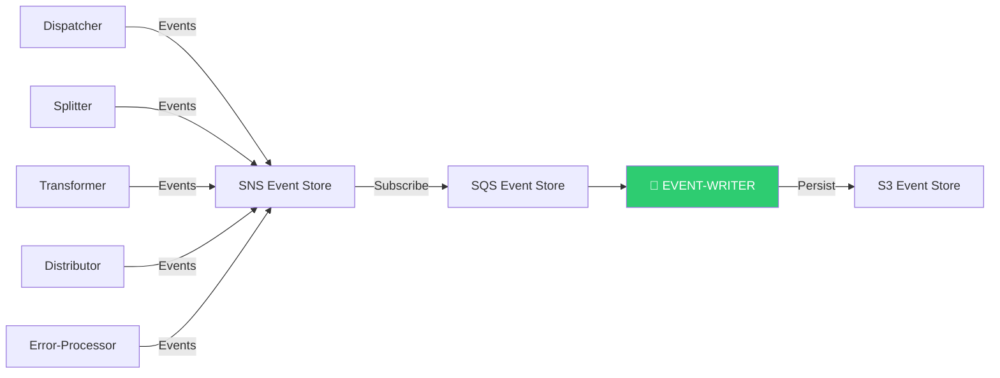
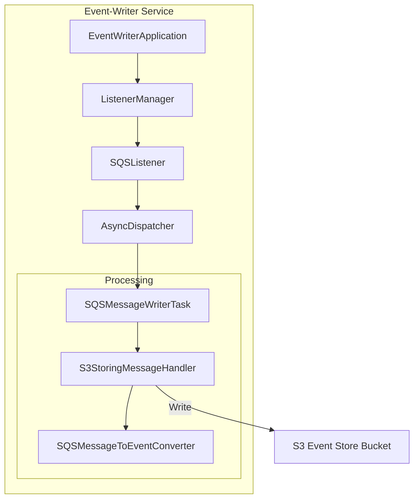
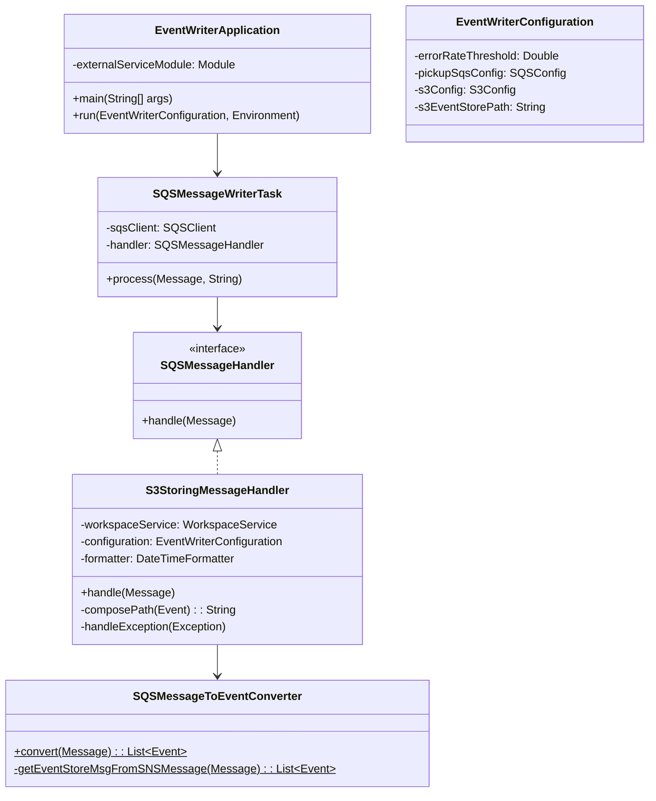
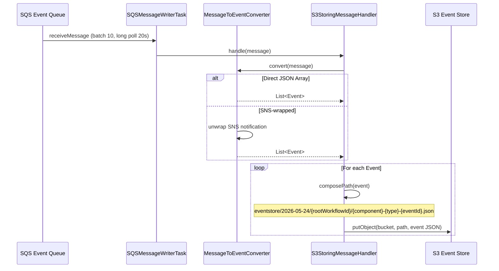
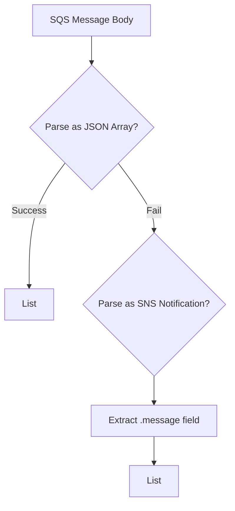

# Event-Writer Module — Design Document

> **Module:** `event-writer`  
> **Generated:** 2026-05-24  
> **Artifact:** `com.inttra.mercury.eventstore:event-writer:1.0-SNAPSHOT`  
> **Java Version:** 17 | **Framework:** Dropwizard 4.x + Guice 7.x

---

## 1. Executive Summary

The **Event-Writer** is the audit trail and observability backbone of AppianWay. It subscribes to the shared SNS event topic (via SQS), converts workflow events to structured JSON, and persists them to S3 with a date-partitioned, workflow-correlated path structure — forming the platform's event store.

---

## 2. Role in the Pipeline



---

## 3. High-Level Architecture



---

## 4. Class Diagram



---

## 5. Data Flow Diagram



---

## 6. S3 Path Structure

The event-writer creates a well-organized S3 hierarchy:

```
{s3EventStorePath}/
└── {yyyy-MM-dd}/
    └── {rootWorkflowId}/
        ├── dispatcher-startRun-{eventId}.json
        ├── dispatcher-closeRun-{eventId}.json
        ├── splitter-startRun-{eventId}.json
        ├── splitter-closeRun-{eventId}.json
        ├── transformer-startRun-{eventId}.json
        └── transformer-closeRun-{eventId}.json
```

**Path composition:** `{eventStoreDir}/{date}/{rootWorkflowId}/{component}-{type}-{eventId}.json`

---

## 7. Event JSON Structure

```json
{
  "eventId": "uuid",
  "category": "system|application",
  "component": "dispatcher|splitter|transformer|distributor",
  "timestamp": "2026-05-24T13:24:21.33",
  "workflowId": "uuid",
  "parentWorkflowId": "uuid",
  "rootWorkflowId": "uuid",
  "runId": "uuid",
  "startTimestamp": "timestamp",
  "type": "startRun|closeRun|metrics",
  "subType": "START_WORKFLOW|CLOSE_WORKFLOW",
  "tokens": { "key": "value" },
  "eventContent": { ... }
}
```

---

## 8. Message Conversion (Dual Format Support)

The converter handles two message formats:



This supports both direct event publishing and SNS-forwarded events.

---

## 9. Configuration Details

| Property | Type | Default | Description |
|----------|------|---------|-------------|
| `errorRateThreshold` | Double | `5.0` | Error rate for health check |
| `pickupSqsConfig.queueUrl` | String | — | Event subscription queue |
| `pickupSqsConfig.waitTimeSeconds` | int | `20` | Long poll duration |
| `pickupSqsConfig.maxNumberOfMessages` | int | `10` | Batch size |
| `s3Config.bucket` | String | — | S3 event store bucket |
| `s3EventStorePath` | String | — | Base path (e.g., `eventstore`) |

---

## 10. Error Handling & Metrics

| Metric | Annotation | Purpose |
|--------|-----------|---------|
| `messages-failed` | `@Metered` | Counts failed message processing |

- **Error strategy:** Log exception at ERROR level, increment metric counter
- **No DLQ routing:** Errors are absorbed and metered (events are non-critical)
- **Health check:** `ErrorThresholdHealthCheck` triggers if failure rate exceeds threshold

---

## 11. Key Maven Dependencies

| Dependency | Version | Purpose |
|-----------|---------|---------|
| `mercury-shared` | 1.0 | Framework, S3, SQS |
| `dropwizard-core` | 4.0.16 | Application framework |
| `guice` | 7.0.0 | DI container |
| `guava` | 33.1.0-jre | Utilities |
| `metrics-guice` | 3.1.3 | AOP metrics |
| `lombok` | 1.18.32 | Code generation |

---

## 12. Health Checks

| Check | Category | Target |
|-------|----------|--------|
| `InboundSqsHealthCheck` | READ | Event queue accessible |
| `ErrorThresholdHealthCheck` | READ | Failure rate < 5.0 |
| `S3WriteHealthCheck` | WRITE | Event store bucket writable |
