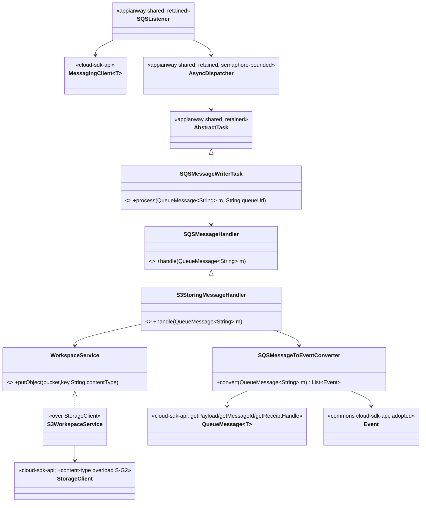
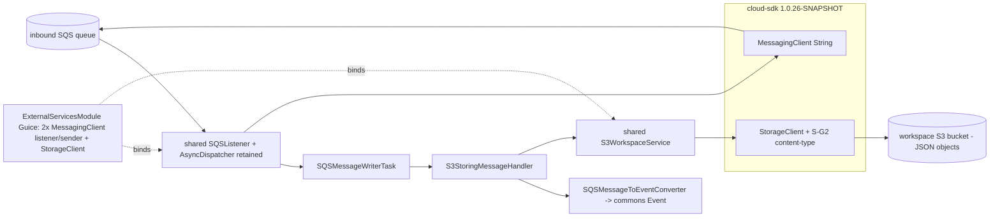
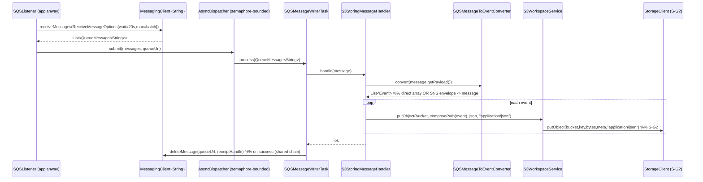

# `event-writer` — AWS SDK v2 (cloud-sdk) Upgrade DESIGN (claude)

> Module: `event-writer` · Date: 2026-05-31 · Author: Claude (Opus 4.8) · **Chosen option: B**
> Companion: [event-writer PLAN](2026-05-31-event-writer-aws2x-upgrade-plan-claude.md). Foundation (do not duplicate): [shared DESIGN](../../shared/docs/2026-05-31-shared-aws2x-upgrade-DESIGN-claude.md) §5 (config) and §6 (cloud-sdk specs), [shared PLAN](../../shared/docs/2026-05-31-shared-aws2x-upgrade-plan-claude.md) §10/§11.

---

## 1. Overview & chosen option

**Option B** — adopt `commons` + `cloud-sdk-api`/`cloud-sdk-aws` `1.0.26-SNAPSHOT` on Dropwizard 5; keep appianway's `SQSListener`+`AsyncDispatcher`; re-type the task chain from v1 `Message` to `QueueMessage<String>`; adopt commons `Event`. event-writer is a one-way audit sink (SQS consume → parse envelope → S3 JSON write). The JSON write adopts shared's strictly-additive **S-G2** to declare `application/json`. No module-specific cloud-sdk change. **Recommended FIRST consumer rollout.**

---

## 2. Class diagram (target)

**Removed v1 types:** `AmazonSQS`, `AmazonS3`, `com.amazonaws.services.sqs.model.Message`.
**Adopted commons types:** `Event` (and the SNS-envelope type), `MetaData` (`com.inttra.mercury.cloudsdk.notification.workflow.*`).
**Consumed cloud-sdk-api:** `MessagingClient<String>`, `QueueMessage<String>`, `StorageClient` (+S-G2 overload).

---

## 3. Component diagram

---

## 4. Sequence diagram — consume → persist JSON

---

## 5. Configuration

Per **master shared DESIGN §5 / PLAN §10**. No module-specific config design. `conf/event-writer.yaml` + `.properties` + `${PROFILE}`/`${ENV}` resolve through the appianway `ConfigProcessingServerCommand` (composing public commons transforms; `${awsps:…}` via `ParameterStoreConfigTransform`). `AWSClientConfiguration.{sqs_listener,sqs_sender,s3_read_put_copy}` → cloud-sdk-aws client config → v2 `ClientOverrideConfiguration`/`Region.of(...)`. Two configured `MessagingClient` instances cover the listener (long-poll) vs sender split. Zero commons change.

---

## 6. cloud-sdk gaps

Reference **master shared DESIGN §6**. Only **S-G2** is relevant (`StorageClient.putObject(bucket,key,bytes,metadata,contentType)` — strictly additive `default` overload; `S3StorageClient` is the sole real implementor). event-writer is the primary motivator (it writes `.json` audit objects and should declare `application/json` instead of the v1 `String` overload's `text/plain`). **No module-specific cloud-sdk change.** G1/G3/G6/G7 do not apply.

---

## 7. Maven dependency changes

- Pin **`1.0.26-SNAPSHOT`** via root `dependencyManagement` (master shared DESIGN §7).
- **Remove:** any `com.amazonaws:aws-java-sdk-*` (event-writer declares none directly; v1 currently arrives via `shared` and the in-module v1 client builders). Drop `<aws-java-sdk.version>` reliance once `shared` is migrated.
- **Add (if the Guice module names interface types directly):** `cloud-sdk-api`; `cloud-sdk-aws` arrives transitively via the migrated `shared` (it brings v2 `sqs`/`s3` with Netty excluded, `apache-client`).
- Add `dropwizard-testing` (JUnit 5) and, during transition, `junit-vintage-engine`.

## 8. Tests

- **New tests JUnit 5 (Jupiter)**; existing JUnit 4 via Vintage during transition.
- Re-point mocks from v1 `AmazonSQS`/`AmazonS3`/`Message` to `MessagingClient<String>`/`StorageClient`/`QueueMessage<String>` test doubles.
- `SQSMessageToEventConverter` tests: both branches (direct `List<Event>` array and SNS-envelope → `message`) over `QueueMessage<String>.getPayload()`; assert commons `Event` parses field-identically.
- `S3StoringMessageHandler` tests: `composePath` unchanged; assert `putObject` called with `application/json` content-type (S-G2) — **behavior preserved** (bytes identical; content-type added).
- **`functional-testing` fakes** re-pointed to cloud-sdk-api interfaces (lockstep with `shared`); preserve behavior.

## 9. Rollout & verification

1. After `shared` + `functional-testing` are migrated (master §9).
2. **event-writer FIRST:** rebind `ExternalServicesModule`; re-type task chain; adopt commons `Event`; S-G2 content-type → `mvn -pl event-writer -am verify`.
3. Validate end-to-end in a dev run (credential/region parity; JSON written with correct path + content-type); this de-risks the remaining consumers.
4. Proceed to the next module (e.g. error-processor) only after this is green.

## 10. Risks & mitigations

| Risk | Mitigation |
|---|---|
| Listener/sender `MessagingClient` split not 1:1 | Bind two configured instances in `ExternalServicesModule` (§5) |
| `Message`→`QueueMessage<String>` misses a site | Compiler-driven type change across the 4 chain classes |
| SNS-envelope parse drift (commons `Event`) | Round-trip tests both converter branches; types field-identical (master §2.8) |
| S-G2 content-type behavior change | Additive only; bytes unchanged, content-type added; assert in tests |
| Functional fakes not ready | Gate behind `functional-testing` migration |
| DW4→5 bootstrap regression | Cost borne in `shared`; event-writer first exercises it at lowest risk |
| Any cloud-sdk change breaking mercury-services | S-G2 strictly additive (`default` method); cloud-sdk CI + mercury-services build green before/after |
</content>
