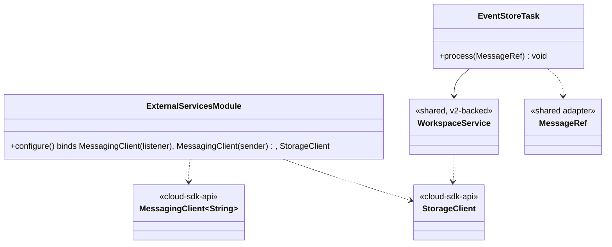
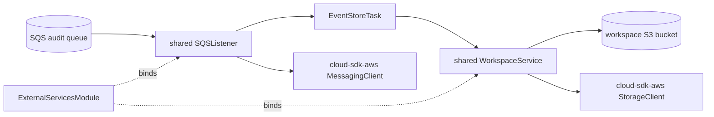
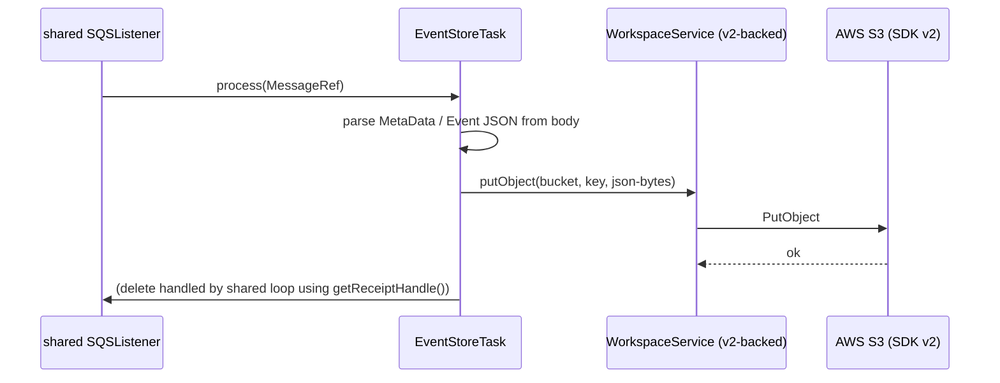

# `event-writer` — AWS SDK v2 (cloud-sdk) Upgrade DESIGN

> **DIRECTIVE UPDATE (2026-05-31) — supersedes the Option-A recommendation in this document.** Per stakeholder direction the program now targets **Dropwizard 5** and **Option B — adopt `commons` + `cloud-sdk-api`/`cloud-sdk-aws`** as the directed default (recommend Option A only on a categorical technical blocker). All AWS service communication goes through `cloud-sdk-api`; new tests are written in **JUnit 5 (Jupiter)** (existing JUnit 4 runs via JUnit Vintage during transition); configuration follows the composed appianway `.properties`/`${PROFILE}`/`${ENV}` + commons `${awsps:...}` model in the master [shared plan §10](../../shared/docs/2026-05-31-shared-aws2x-upgrade-plan-copilot.md). cloud-sdk gaps are indexed in the master [shared plan §11](../../shared/docs/2026-05-31-shared-aws2x-upgrade-plan-copilot.md) with full technical specs in the master [shared DESIGN §1A.6](../../shared/docs/2026-05-31-shared-aws2x-upgrade-DESIGN.md).
> **Module-specific cloud-sdk gaps:** G1 (concurrent SQS listener), G2 (S3 putObject with metadata/content-type), G6 (config), G7 (health checks).
> Sections below are retained as the Option-A fallback reference.

> Module: `event-writer` · Date: 2026-05-31 · Author: GitHub Copilot (Claude Opus 4.8) · Option **A**
> Companion: [plan](2026-05-31-event-writer-aws2x-upgrade-plan-copilot.md). Foundation: [`shared` DESIGN](../../shared/docs/2026-05-31-shared-aws2x-upgrade-DESIGN.md). Session `83b822b011714117`.

## 1. Overview
Migrate `event-writer` by (1) rebinding `modules/ExternalServicesModule` to construct `cloud-sdk-aws`-backed clients instead of v1 `Amazon*ClientBuilder` instances, and (2) switching the task's listener DTO from `com.amazonaws.services.sqs.model.Message` to the `shared` `MessageRef`. No behavior change to the audit-write logic.

## 2. Class diagram

## 3. Component diagram

## 4. Sequence diagram

## 5. Configuration changes
- `conf/event-writer.yaml`: AWS client config keys (`s3_read_put_copy`, `sqs_listener`, `sqs_sender`) retained; mapped to v2 via the `shared` `AwsClientAdapters` facade. No placeholder-syntax change (Option A).
- `${PROFILE}`/`${ENV}` queue/bucket name expansion unchanged.

## 6. Maven dependency changes
- **Remove:** `com.amazonaws:aws-java-sdk-sqs`, `aws-java-sdk-s3` (and `-sns` if declared) from `event-writer/pom.xml`.
- **Add (only if Guice names interface types directly):** `com.inttra.mercury:cloud-sdk-api`.
- v2 runtime arrives transitively through `shared` → `cloud-sdk-aws`. Uber-jar shade config inherits the `shared` design's v2 includes.

## 7. Test details
- Migrate `functional-testing` fakes first; `event-writer` functional tests then run unchanged against the v2-backed fakes.
- Unit tests constructing a v1 `Message` switch to `MessageRef` builders. **JUnit 4 retained**; no Jupiter.
- Add a focused test asserting the audit JSON write still targets the correct `${PROFILE}-${ENV}-<role>` bucket/key.

## 8. Rollout & verification
1. Ensure `shared` + `functional-testing` migrated. 2. Rebind Guice module. 3. Swap DTO type. 4. `mvn -pl event-writer -am verify`. Use as the **pilot service**.

## 9. Risks & mitigations
| Risk | Mitigation |
|---|---|
| Listener vs sender `MessagingClient` mis-wired | Bind two distinct configured instances; assert in a wiring test |
| Bucket/key naming drift | Test asserts exact `${PROFILE}-${ENV}-<role>` target |
| Functional fakes not ready | Sequence behind `functional-testing` |
