# Functional-Testing Module — Architecture & Design

> **Author:** Principal Engineering Review · **Date:** 2026-05-24 · **Module Version:** `com.inttra.mercury.test:functional-testing:1.0` (Java 17, Dropwizard 4.0.16)

---

## 1. Executive Summary

The `functional-testing` module is the **shared in-process functional test harness** for the Mercury (Appian Way) data-processing pipeline. It is not itself a runnable application — it is a library JAR (`<packaging>jar</packaging>`, see [`pom.xml:7`](../pom.xml)) that every downstream pipeline service (`dispatcher`, `splitter`, `transformer`, `validator`, `router`, `distributor`, `cerberus`, `email-sender`, `error-processor`, `event-writer`, `fulfiller`, `ingestor`, `mftdispatcher`) consumes at test scope to drive end-to-end black-box scenarios against a real Dropwizard application bootstrapped in the same JVM as the JUnit runner.

The harness provides three concentric capabilities:

1. **Application lifecycle control.** A JUnit `@Rule` (`IntegrationTestRule`) and a Dropwizard `DropwizardTestSupport` subclass (`IntegrationTestSupport`) start the service-under-test (SUT) with the same `ConfigProcessingServerCommand` that production uses, so the YAML, properties files, environment variable substitution and Jetty bootstrap path are exercised under test. The Jetty connector is bound to an ephemeral port (`server.connector.port=0`) and torn down between tests.
2. **In-memory AWS doubles.** Hand-rolled "Fake" implementations of `AmazonS3`, `AmazonSQS`, `AmazonSNS`, `AmazonDynamoDB` and `AmazonSimpleEmailService` ([`com.inttra.mercury.test.aws`](../src/main/java/com/inttra/mercury/test/aws)) replace the real AWS SDK clients via Guice binding overrides supplied by `FunctionalTestBase.getCommonBindings()`. These fakes implement enough of the SDK contract for the SUT to call them transparently and expose **inspection APIs** (`getMessages`, `getDeletionHistory`, `listAllFiles`, `getContent`) that tests use as oracles.
3. **AssertJ fluent assertion DSL.** A family of `AbstractAssert<…>` subclasses ([`com.inttra.mercury.test.assertions`](../src/main/java/com/inttra/mercury/test/assertions)) exposed through a single static factory `ResourceAssertions.assertThatResource(…)` provides domain-specific verbs such as `hasQueueWithMetaData`, `containsXml`, `containsJson`, `hasEventTypes`, `hasCloseRun`, `hasDeleted`.

Despite the directory name suggesting "functional testing" lives inside this module, **no scenarios are defined here**. There is no `src/test/java/`, no `src/test/resources/`, no `conf/` directory, no Cucumber feature files, no Karate or REST-assured scripts. Each consuming service owns its own `src/test/java/functional/` package plus its own `src/test/resources-functional/` directory of golden fixtures and YAML configuration. This module is the *kit* — the consumers are the *tests*.

The framework is **opinionated**:

- JUnit 4 (not 5).
- AssertJ for fluent assertions.
- Awaitility for asynchronous polling with a 30-second default and a 35-second per-test global timeout.
- Mockito spies on the Fake implementations so individual tests can `doThrow(...)`/`doAnswer(...)` to simulate AWS faults.
- Guice for dependency wiring inside the SUT and a fixed clock (`2007-12-03T23:15:30.00Z`) and a deterministic `RandomGenerator` (returning `RANDOM_VALUE_1`, `RANDOM_VALUE_2`, …) so generated UUIDs and event ids are predictable in golden-file comparisons.

This document captures the architecture, the contract each Fake implements, the lifecycle of a typical functional test invocation, and the operational and risk picture going forward.

---

## 2. Role in the Mercury Pipeline

### 2.1 Where the module sits

Mercury is a chained EDI/XML/JSON message-processing pipeline composed of independent Dropwizard services that communicate through S3 (large payloads) and SQS (control envelopes / `MetaData`), with SNS used as an event bus and DynamoDB for de-duplication / event sourcing. A simplified view of the production pipeline:

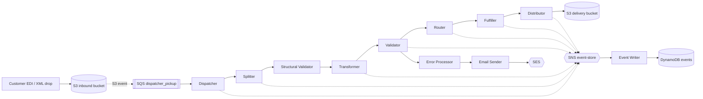

Every arrow above traverses S3 or SQS. That is precisely why this module's central abstractions are `FakeS3` and `FakeSQS`: replacing those two infrastructure dependencies is sufficient to run the entire chain of pipeline stages — one stage at a time — without touching LocalStack, Docker, or any external network resource.

### 2.2 What "functional" means here

In Mercury parlance:

- **Unit tests** live next to each class under `src/test/java/.../*Test.java` and use plain Mockito.
- **Functional tests** live under `src/test/java/functional/` in each service and use this module. They **boot the actual Dropwizard application**, including the real Guice module graph (with AWS clients swapped out for fakes via `getCommonBindings()`), the real YAML config, the real listeners, the real Jetty admin/connector, and the real `ConfigProcessingServerCommand` startup sequence. They drive the application by **seeding** a `Fake` (a JSON message into `FakeSQS`, a file into `FakeS3`) and **assert** on the outputs that the application writes back into those same fakes.
- **Load / stress tests** live under `src/test/java/stress/` (e.g. `transformer/src/test/java/stress/TransformerStressTest.java`) and reuse the *read-only* variants `ReadOnlyS3Workspace` and `ReadOnlySQS`, which are also exported from this module to avoid heap-pressure from the in-memory mutable fakes.

So the module's role is a **shared functional-test SDK** that gives every Mercury service the same scaffolding for the same style of test: seed inputs → wait → assert outputs.

### 2.3 End-to-end exercise pattern

The harness is built to be used **per service**, not for cross-service orchestration. A given `*FuncTest` in (say) `dispatcher/src/test/java/functional/` starts only the dispatcher application. The "next" stage in the pipeline never runs — the test simply asserts that the dispatcher *would have handed off* the right `MetaData` to the splitter by inspecting `FakeSQS` (queue `dispatcher_dropoff`) and `FakeS3` (bucket `s3-workspace`). This is a deliberate seam: each service is tested as a black box for its contract with neighbouring stages, and the contract is encoded in golden JSON files (see e.g. `dispatcher/src/test/resources-functional/happy/dropoff.json`).

The aggregate effect across all consuming services is end-to-end coverage of the pipeline: stage *n*'s output golden file is structurally identical to stage *n+1*'s input fixture (with the producer-side and consumer-side tests both committed to git).

---

## 3. High-Level Architecture

### 3.1 Module composition

The module is intentionally small. There are exactly **24 Java files** under `src/main/java`, no test sources, no resources. The file inventory:

| Package | Files | Role |
|---|---|---|
| `com.inttra.mercury.test` | `FunctionalTestBase`, `IntegrationTestRule`, `IntegrationTestSupport` | JUnit lifecycle and Guice override |
| `com.inttra.mercury.test.aws` | `Fake*` interfaces (4) + `Amazon*Adaptor` classes (4) | AWS SDK contract surface |
| `com.inttra.mercury.test.aws.impl` | `Fake*Impl` (4) + `ReadOnly*` (2) | In-memory + read-only AWS doubles |
| `com.inttra.mercury.test.assertions` | `ResourceAssertions`, `S3Assert`, `SqsAssert`, `SnsAssert`, `DynamoDBAssert` | AssertJ DSL |
| `com.inttra.mercury.test.util` | `TestDSL`, `MetaDataUtil` | Resource loading + comparison helpers |

The dependency graph is shallow and one-way:

```mermaid
flowchart TD
    subgraph harness[Functional-Testing module]
      FTB[FunctionalTestBase]
      ITR[IntegrationTestRule]
      ITS[IntegrationTestSupport]
      FakeS3I[FakeS3 / FakeS3Impl]
      FakeSQSI[FakeSQS / FakeSQSImpl]
      FakeDDB[FakeDynamoDB / FakeDynamoDBImpl]
      FakeSES[FakeSES / FakeSESImpl]
      ROS3[ReadOnlyS3Workspace]
      ROSQS[ReadOnlySQS]
      Adapt[Amazon*Adaptor super-classes]
      Assert[ResourceAssertions + *Assert]
      DSL[TestDSL]
      MDU[MetaDataUtil]
    end
    subgraph shared[mercury-shared library]
      direction LR
      Json[Json support]
      Files[Files.resourceAsString]
      Event[Event / EventGenerator]
      MetaData[MetaData]
      Cmd[ConfigProcessingServerCommand]
      Rand[RandomGenerator]
      Cfg[RecoveryConfig]
    end
    subgraph aws[AWS SDK v1]
      direction LR
      S3SDK[AmazonS3]
      SQSSDK[AmazonSQS]
      SNSSDK[AmazonSNS]
      DDBSDK[AmazonDynamoDB]
      SESSDK[AmazonSimpleEmailService]
    end
    subgraph junit[JUnit 4 + AssertJ + Awaitility + Mockito]
      direction LR
      JU[JUnit]
      AJ[AssertJ]
      Aw[Awaitility]
      Mk[Mockito]
    end
    subgraph dw[Dropwizard 4]
      DwTesting[dropwizard-testing]
    end
    FTB --> FakeS3I
    FTB --> FakeSQSI
    FTB --> Rand
    FTB --> Cfg
    ITR --> ITS
    ITS --> Cmd
    ITS --> DwTesting
    Adapt --> S3SDK
    Adapt --> SQSSDK
    Adapt --> DDBSDK
    Adapt --> SESSDK
    FakeS3I --> Adapt
    FakeSQSI --> Adapt
    FakeDDB --> Adapt
    FakeSES --> Adapt
    ROS3 --> Adapt
    ROSQS --> Adapt
    Assert --> FakeS3I
    Assert --> FakeSQSI
    Assert --> FakeDDB
    Assert --> AJ
    DSL --> Files
    DSL --> Json
    DSL --> Event
    MDU --> MetaData
```

### 3.2 Layered view

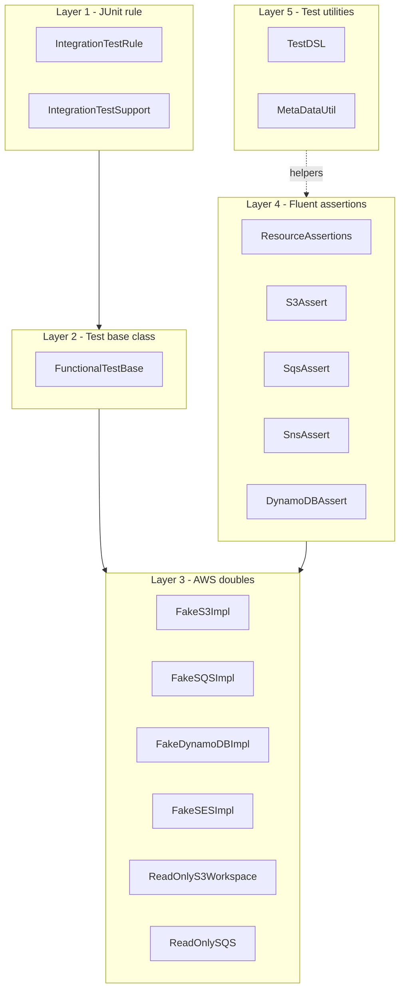

### 3.3 Position relative to other test-support modules

`load-testing` (a sibling top-level module) reuses `ReadOnlyS3Workspace` and `ReadOnlySQS` for stress scenarios; the mutable `Fake*Impl` classes back ConcurrentHashMaps and would blow the heap under sustained load. The split between *mutable in-memory* (functional) and *immutable read-only* (load) doubles is a deliberate design choice surfaced inside this module's `aws.impl` package — see the Javadoc on [`ReadOnlyS3Workspace`](../src/main/java/com/inttra/mercury/test/aws/impl/ReadOnlyS3Workspace.java#L10-L13) and [`ReadOnlySQS`](../src/main/java/com/inttra/mercury/test/aws/impl/ReadOnlySQS.java#L15-L18).

---

## 4. Low-Level Design

This section walks through each class in detail with file:line citations.

### 4.1 `FunctionalTestBase`

[`FunctionalTestBase.java`](../src/main/java/com/inttra/mercury/test/FunctionalTestBase.java) is the abstract parent class every per-service functional test base extends. Its responsibilities:

- **Fix the clock to `2007-12-03T23:15:30.00Z`** ([line 36](../src/main/java/com/inttra/mercury/test/FunctionalTestBase.java#L36)). Production code that reads `Clock` therefore produces deterministic timestamps, allowing golden-file comparisons. The clock is rebuilt in `resetSpies()` per test ([line 54](../src/main/java/com/inttra/mercury/test/FunctionalTestBase.java#L54)).
- **Mock `RandomGenerator`** ([lines 37, 77-84](../src/main/java/com/inttra/mercury/test/FunctionalTestBase.java#L77-L84)) so `randomUUID()` returns the deterministic sequence `RANDOM_VALUE_1`, `RANDOM_VALUE_2`, … and `randomEventId()` returns `eventId_1`, `eventId_2`, … . Tests assert on these literals (see `dispatcher/src/test/java/functional/DispatcherFuncTest.java:46` — `"RANDOM_VALUE_1/RANDOM_VALUE_3"`).
- **Capture SNS publish requests** with an `ArgumentCaptor<PublishRequest>` ([line 38](../src/main/java/com/inttra/mercury/test/FunctionalTestBase.java#L38)) bound to a Mockito mock of `AmazonSNS` ([lines 86-90](../src/main/java/com/inttra/mercury/test/FunctionalTestBase.java#L86-L90)). Tests inspect `sns.getAllValues()` via `SnsAssert`.
- **Enforce a 35-second global timeout** with a JUnit `Timeout` rule ([line 41](../src/main/java/com/inttra/mercury/test/FunctionalTestBase.java#L41)). This protects CI from a deadlocked SUT and is the upper bound on `await().until(...)` polling.
- **Build a Guice `AbstractModule`** named `getCommonBindings()` that wires the Fake clients into the SUT's injector. Critically:
  - `FakeSQSImpl` is bound to **both** `@Named("amazonSQSForListener")` and `@Named("amazonSQSForSender")` ([lines 67-68](../src/main/java/com/inttra/mercury/test/FunctionalTestBase.java#L67-L68)) so producer-side and consumer-side wiring inside the SUT see the same queue.
  - Both `FakeS3Impl` and `FakeSQSImpl` are wrapped in `Mockito.spy(...)` ([lines 61-62](../src/main/java/com/inttra/mercury/test/FunctionalTestBase.java#L61-L62)) so tests can later `doThrow(...)` or `doAnswer(...)` to inject infrastructure faults — see `DispatcherFuncTest.testReprocessingMessageAfterFailure` ([dispatcher/src/test/java/functional/DispatcherFuncTest.java:96-130](../../dispatcher/src/test/java/functional/DispatcherFuncTest.java#L96-L130)).
  - The `Clock` and `RandomGenerator` are bound as singletons ([lines 70-71](../src/main/java/com/inttra/mercury/test/FunctionalTestBase.java#L70-L71)).
  - A `RecoveryConfig(true, 5, 10)` is bound ([line 72](../src/main/java/com/inttra/mercury/test/FunctionalTestBase.java#L72)) — i.e. recovery enabled, 5 retries, 10s backoff — providing a consistent retry posture across services.
- **Reset spies between tests** in `@Before resetSpies()` ([lines 47-55](../src/main/java/com/inttra/mercury/test/FunctionalTestBase.java#L47-L55)) so Mockito's verification state doesn't bleed across tests. Importantly the `s3` and `sqs` *instances* are not re-created — only the spy state is reset, so the in-memory ConcurrentHashMaps survive between tests. **This is a sharp edge** (see Open Questions).

A consumer extends this class and additionally implements `Supplier<Application<C>>` so the same instance can both contribute Guice modules and produce the Dropwizard application — see `DispatcherFunctionalTestBase` ([dispatcher/src/test/java/functional/DispatcherFunctionalTestBase.java:23-48](../../dispatcher/src/test/java/functional/DispatcherFunctionalTestBase.java#L23-L48)).

### 4.2 `IntegrationTestRule`

[`IntegrationTestRule.java`](../src/main/java/com/inttra/mercury/test/IntegrationTestRule.java) is a `org.junit.rules.ExternalResource` wrapper around `IntegrationTestSupport`. It bakes in two contract assumptions about the project layout:

1. **`MERCURY_SERVICES` constant** ([line 21](../src/main/java/com/inttra/mercury/test/IntegrationTestRule.java#L21)) — points at `../configuration/dev/network-services.properties`. Every Mercury service ships its YAML expecting variables to be resolved from this file in addition to the service-specific properties.
2. **`DATADOG` constant** ([line 22](../src/main/java/com/inttra/mercury/test/IntegrationTestRule.java#L22)) — points at `../configuration/dev/datadog.properties` for the metrics reporter substitutions.

It defaults Awaitility's polling timeout to `DEFAULT_TIMEOUT = 30s` ([line 25](../src/main/java/com/inttra/mercury/test/IntegrationTestRule.java#L25)) — five seconds shy of the JUnit `@Rule Timeout` so a hung await fails as an `await()` failure rather than as a brutal JUnit thread-interrupt.

The constructor concatenates `[serviceProperties, network-services, datadog]` and supplies them as the `properties` list to `IntegrationTestSupport`. `ConfigOverride[]` from the test is pushed into system properties via `ConfigOverride::addToSystemProperties` ([line 32](../src/main/java/com/inttra/mercury/test/IntegrationTestRule.java#L32)).

### 4.3 `IntegrationTestSupport`

[`IntegrationTestSupport.java`](../src/main/java/com/inttra/mercury/test/IntegrationTestSupport.java) extends Dropwizard's stock `DropwizardTestSupport<C>` but rewrites its `before()` method ([lines 40-67](../src/main/java/com/inttra/mercury/test/IntegrationTestSupport.java#L40-L67)) to drive startup through the production `ConfigProcessingServerCommand` rather than Dropwizard's built-in `ServerCommand`. That matters because Mercury's YAML templates use `${env-var}`-style placeholders that are resolved by `ConfigProcessingServerCommand`'s `VariableLookupProvider` ([shared/.../ConfigProcessingServerCommand.java:75-86](../../shared/src/main/java/com/inttra/mercury/shared/command/ConfigProcessingServerCommand.java#L75-L86)). Using the stock command would leave those placeholders unresolved and the test would fail to start.

The implementation:

1. Creates the application via the supplied `Supplier<Application<C>>` ([line 46](../src/main/java/com/inttra/mercury/test/IntegrationTestSupport.java#L46)).
2. Builds a custom `Bootstrap<C>` whose `run(...)` hooks the Jetty server reference into the outer `DropwizardTestSupport.jettyServer` field via `addServerLifecycleListener` ([line 51](../src/main/java/com/inttra/mercury/test/IntegrationTestSupport.java#L51)) — this is what makes `after()` ([lines 69-80](../src/main/java/com/inttra/mercury/test/IntegrationTestSupport.java#L69-L80)) capable of stopping the embedded Jetty.
3. Initializes the application and runs the `ConfigProcessingServerCommand` with a synthetic argparse `Namespace` carrying `{file: yaml, properties: [yaml-service, network-services, datadog]}` ([lines 28-31](../src/main/java/com/inttra/mercury/test/IntegrationTestSupport.java#L28-L31)).
4. On `after()` stops the Jetty server and nulls the field so re-entry is safe.

A subtle correctness property: `before()` is **idempotent** — if `jettyServer != null` it returns immediately ([lines 41-43](../src/main/java/com/inttra/mercury/test/IntegrationTestSupport.java#L41-L43)) so the rule is safe under nested `@Rule` chains.

### 4.4 AWS adaptors (`Amazon*Adaptor`)

The four `Amazon*Adaptor` classes ([`AmazonS3Adaptor`](../src/main/java/com/inttra/mercury/test/aws/AmazonS3Adaptor.java), [`AmazonSQSAdaptor`](../src/main/java/com/inttra/mercury/test/aws/AmazonSQSAdaptor.java), [`AmazonDynamoDBAdaptor`](../src/main/java/com/inttra/mercury/test/aws/AmazonDynamoDBAdaptor.java), [`AmazonSESAdaptor`](../src/main/java/com/inttra/mercury/test/aws/AmazonSESAdaptor.java)) are no-op skeleton implementations of the AWS SDK v1 service interfaces. Their sole reason for existing is that those SDK interfaces have **hundreds** of methods (e.g. `AmazonS3` has 200+ between bucket lifecycle, intelligent-tiering, ACLs, multipart uploads, etc.) and the Mercury code only calls a small handful of them. By extending the adaptor, each `Fake*Impl` only has to override the methods Mercury actually uses, keeping the `Fake*Impl` classes small and focused.

The header Javadoc on `AmazonDynamoDBAdaptor` says it plainly:

> `Adding this class to hide inherited redundant methods` ([AmazonDynamoDBAdaptor.java:134-136](../src/main/java/com/inttra/mercury/test/aws/AmazonDynamoDBAdaptor.java#L134-L136))

Every method returns `null` (or `void`) which is acceptable because the SUT should never call those code paths.

### 4.5 `FakeS3` / `FakeS3Impl`

[`FakeS3`](../src/main/java/com/inttra/mercury/test/aws/FakeS3.java) is a 5-method interface — the inspection surface plus a `putObject` overload. [`FakeS3Impl`](../src/main/java/com/inttra/mercury/test/aws/impl/FakeS3Impl.java) implements both `AmazonS3` (via the adaptor) and `FakeS3`. Storage model:

```java
private final Map<String, Map<String, String>> store = new ConcurrentHashMap<>();
```
([FakeS3Impl.java:34](../src/main/java/com/inttra/mercury/test/aws/impl/FakeS3Impl.java#L34))

Outer key = bucket name, inner key = object key, value = stringified content. Three `putObject` overloads exist:

- `putObject(String bucket, String key, String content)` — direct content put ([lines 53-61](../src/main/java/com/inttra/mercury/test/aws/impl/FakeS3Impl.java#L53-L61)).
- `putObject(String, String, InputStream, ObjectMetadata)` — reads with `ISO-8859-1` so it is safe for binary EDI ([lines 64-79](../src/main/java/com/inttra/mercury/test/aws/impl/FakeS3Impl.java#L64-L79)).
- `putObject(PutObjectRequest)` — extracts the input stream, line-joins it via `IOUtils.readLines` ([lines 83-95](../src/main/java/com/inttra/mercury/test/aws/impl/FakeS3Impl.java#L83-L95)).

Caveat: the third overload uses `IOUtils.readLines(...).stream().collect(joining())` *without* a separator, **collapsing newlines**. This is a known footgun (see Open Questions).

`getContent` ([lines 105-118](../src/main/java/com/inttra/mercury/test/aws/impl/FakeS3Impl.java#L105-L118)) throws a `RuntimeException` listing every (bucket, key) pair currently in the store when a lookup misses — invaluable for debugging fixture-name mismatches.

`copyObject` ([lines 37-50](../src/main/java/com/inttra/mercury/test/aws/impl/FakeS3Impl.java#L37-L50)) is implemented as a get-then-put cycle, so cross-bucket moves are simulated correctly.

`getObjectMetadata` ([lines 136-140](../src/main/java/com/inttra/mercury/test/aws/impl/FakeS3Impl.java#L136-L140)) hard-codes a `xlogid=123456789` user metadata attribute — this matters because several pipeline stages propagate xlogid for cross-stage tracing.

### 4.6 `FakeSQS` / `FakeSQSImpl`

[`FakeSQS`](../src/main/java/com/inttra/mercury/test/aws/FakeSQS.java) exposes message-level inspection. [`FakeSQSImpl`](../src/main/java/com/inttra/mercury/test/aws/impl/FakeSQSImpl.java) holds three `ConcurrentHashMap`s:

```java
private final Map<String, BlockingQueue<Message>>  name2q          = new ConcurrentHashMap<>();
private final Map<String, List<Message>>           sentHistory     = new ConcurrentHashMap<>();
private final Map<String, List<String>>            deletionHistory = new ConcurrentHashMap<>();
```
([FakeSQSImpl.java:39-41](../src/main/java/com/inttra/mercury/test/aws/impl/FakeSQSImpl.java#L39-L41))

- `name2q` holds **currently-undelivered** messages. `pollMessage` ([lines 43-56](../src/main/java/com/inttra/mercury/test/aws/impl/FakeSQSImpl.java#L43-L56)) honours the poll-interval semantics of real SQS by waiting up to `POLL_INTERVAL_MILLIS = 1000ms` on the `BlockingQueue` — when the queue does not exist yet it `Uninterruptibles.sleepUninterruptibly`s for the same interval, mimicking a long-poll on a non-existent queue (which in real SQS would 404 but here is benign).
- `sentHistory` holds every message ever **sent** to a queue, including ones that have already been received/deleted. `getHistory(queueUrl)` exposes this.
- `deletionHistory` holds every receipt handle ever **deleted** from a queue. `getDeletionHistory(queueUrl)` exposes this, and `getDeletedMessageCount(queueUrl)` is the count.

The SQS URL prefix `http://fakeamazon.com/` ([line 38](../src/main/java/com/inttra/mercury/test/aws/impl/FakeSQSImpl.java#L38)) is stripped from queue URLs by `normalizeUrl` ([lines 192-194](../src/main/java/com/inttra/mercury/test/aws/impl/FakeSQSImpl.java#L192-L194)) so test code can refer to queues by their short name (e.g. `"dispatcher_pickup"`) even when the SUT's listener returns the full URL from `createQueue`.

`putMessage(String queueUrl, String body)` ([lines 123-126](../src/main/java/com/inttra/mercury/test/aws/impl/FakeSQSImpl.java#L123-L126)) is the **test-side** entry point (no production code calls it). It generates a UUID receipt handle and returns it — the test then waits for that receipt to appear in `deletionHistory` as proof the SUT consumed and ACK'd the message:

```java
String receiptHandleId = sqs.putMessage(INPUT_QUEUE, content("happy/s3Event.json"));
await().until(() -> sqs.getDeletedMessageCount(INPUT_QUEUE) == 1);
assertThatResource(sqs).hasDeleted(INPUT_QUEUE, receiptHandleId);
```
([dispatcher/src/test/java/functional/DispatcherFuncTest.java:37-42](../../dispatcher/src/test/java/functional/DispatcherFuncTest.java#L37-L42))

The `<T> getMessages(String queueUrl, Class<T> klass)` overload ([lines 154-164](../src/main/java/com/inttra/mercury/test/aws/impl/FakeSQSImpl.java#L154-L164)) deserialises every undelivered message body into `klass` via the shared `Json` helper. This is what `SqsAssert.hasQueueWithMetaData` calls.

### 4.7 `FakeDynamoDB` / `FakeDynamoDBImpl`

[`FakeDynamoDB`](../src/main/java/com/inttra/mercury/test/aws/FakeDynamoDB.java) is a 4-method interface. The impl ([FakeDynamoDBImpl.java](../src/main/java/com/inttra/mercury/test/aws/impl/FakeDynamoDBImpl.java)) is the simplest of the fakes: a `Map<String, List<String>>` ([line 16](../src/main/java/com/inttra/mercury/test/aws/impl/FakeDynamoDBImpl.java#L16)) keyed by table name with a list of `eventId`s. The single `putItem(PutItemRequest)` override ([lines 47-50](../src/main/java/com/inttra/mercury/test/aws/impl/FakeDynamoDBImpl.java#L47-L50)) extracts the string attribute `"eventId"` and appends it — this hard-codes a single-column schema and is consequently usable only for tests of the event-writer / de-duplication path. Lookups against a non-existent table throw `RuntimeException("Table does not exists: " + name)` ([line 43](../src/main/java/com/inttra/mercury/test/aws/impl/FakeDynamoDBImpl.java#L43)) — `DynamoDBAssert.doesNotHaveTable` relies on that exact message.

### 4.8 `FakeSES` / `FakeSESImpl`

[`FakeSES`](../src/main/java/com/inttra/mercury/test/aws/FakeSES.java) exposes `getEmailsSent(recipient)`. [`FakeSESImpl`](../src/main/java/com/inttra/mercury/test/aws/impl/FakeSESImpl.java) overrides `sendEmail(SendEmailRequest)` ([lines 18-24](../src/main/java/com/inttra/mercury/test/aws/impl/FakeSESImpl.java#L18-L24)) to bucket requests by **the first to-address only** — multi-recipient assertions need the test to inspect each recipient individually. A random UUID is returned as the SES `MessageId`.

### 4.9 Read-only doubles

`ReadOnlyS3Workspace` ([ReadOnlyS3Workspace.java](../src/main/java/com/inttra/mercury/test/aws/impl/ReadOnlyS3Workspace.java)) and `ReadOnlySQS` ([ReadOnlySQS.java](../src/main/java/com/inttra/mercury/test/aws/impl/ReadOnlySQS.java)) are immutable, allocation-free variants intended for sustained-load tests in the `load-testing` module. Key differences from the mutable fakes:

| Concern | `Fake*Impl` | `ReadOnly*` |
|---|---|---|
| Storage | `ConcurrentHashMap` mutated per operation | Pre-built `Map` set at construction |
| `putObject` / `sendMessage` | Persists | No-op / null |
| `deleteMessage` | Records in deletion history | No-op |
| `receiveMessage` | Polls a `BlockingQueue` | Slices a pre-supplied `Message[]` |
| Heap footprint | Grows with traffic | Constant |

`ReadOnlySQS.receiveMessage(String)` deliberately `throw new RuntimeException(...)` ([ReadOnlySQS.java:46-48](../src/main/java/com/inttra/mercury/test/aws/impl/ReadOnlySQS.java#L46-L48)) to force callers to use the request-based overload that specifies `maxNumberOfMessages` — otherwise the slice operation can't bound throughput.

### 4.10 Assertion DSL

`ResourceAssertions` ([ResourceAssertions.java](../src/main/java/com/inttra/mercury/test/assertions/ResourceAssertions.java)) is a single class with four overloaded `assertThatResource(...)` static factories. Each returns one of the four `AbstractAssert` subclasses:

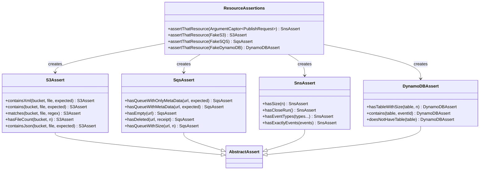

Notable implementation details:

- `S3Assert.containsXml` uses AssertJ's `isXmlEqualTo` for whitespace/attribute-order-insensitive XML comparison ([S3Assert.java:17](../src/main/java/com/inttra/mercury/test/assertions/S3Assert.java#L17)).
- `S3Assert.containsJson` deserialises both actual and expected through `TestDSL.prettify` (Jackson via `Json.fromJsonString(... , Map.class)`) so JSON formatting differences are normalised away ([S3Assert.java:38-45](../src/main/java/com/inttra/mercury/test/assertions/S3Assert.java#L38-L45)).
- `SqsAssert.hasQueueWithMetaData` walks every undelivered message in the queue, parses it as `MetaData`, and compares with `MetaDataUtil.areEqual` which ignores `messageId` and `timestamp` ([MetaDataUtil.java:14](../src/main/java/com/inttra/mercury/test/util/MetaDataUtil.java#L14)). If none match it falls back to a pretty-printed AssertJ comparison so the failure diff is readable.
- `SnsAssert.hasExactlyEvents` strips out `eventId`, `tokens.deliveryFileName` and `eventContent.messageId` before comparing because those carry randomness even with the `RandomGenerator` mock ([SnsAssert.java:76-89](../src/main/java/com/inttra/mercury/test/assertions/SnsAssert.java#L76-L89)). On mismatch it re-runs the comparison on `Json.toJsonStringPretty` output so the diff prints as multi-line JSON.

### 4.11 Test utilities

[`TestDSL.content(path)`](../src/main/java/com/inttra/mercury/test/util/TestDSL.java#L16-L18) is the canonical fixture loader — it delegates to `mercury-shared`'s `Files.resourceAsString` which reads from the classpath. The convention in every consuming service is to keep golden fixtures under `src/test/resources-functional/<scenario>/<file>` and load them by the relative path: `content("happy/s3Event.json")`.

[`TestDSL.snsEvents(path)`](../src/main/java/com/inttra/mercury/test/util/TestDSL.java#L25-L32) deserialises a JSON array fixture into `List<Event>` for use with `SnsAssert.hasExactlyEvents`.

[`TestDSL.prettify(jsonString)`](../src/main/java/com/inttra/mercury/test/util/TestDSL.java#L20-L23) round-trips a JSON string through a `Map` to canonicalise formatting.

[`MetaDataUtil.areEqual`](../src/main/java/com/inttra/mercury/test/util/MetaDataUtil.java#L10-L19) is a thin wrapper around AssertJ's `isEqualToIgnoringGivenFields` for the `MetaData` shared bean — it captures the convention that `messageId` and `timestamp` are non-deterministic and must be ignored in functional comparisons.

---

## 5. Key Classes — Class Diagram

```mermaid
classDiagram
    direction TB
    class FunctionalTestBase {
        <<abstract>>
        #FakeS3 s3
        #FakeSQS sqs
        #Clock clock
        #RandomGenerator randomGenerator
        #ArgumentCaptor~PublishRequest~ sns
        +getCommonBindings() AbstractModule
        +resetSpies() void
        #initRandomGeneratorMock() RandomGenerator
        -createSnsMock() AmazonSNS
    }
    class IntegrationTestRule {
        +DEFAULT_TIMEOUT Duration
        -MERCURY_SERVICES String
        -DATADOG String
        -testSupport IntegrationTestSupport~C~
        +IntegrationTestRule(supplier, yaml, properties, overrides...)
        #before() void
        #after() void
        +getSupport() IntegrationTestSupport~C~
    }
    class IntegrationTestSupport {
        -applicationSupplier Supplier
        -cmdParams Map~String,Object~
        +newApplication() Application~C~
        +before() void
        +after() void
    }
    class FakeS3 {
        <<interface>>
        +getContent(bucket, file) String
        +putObject(bucket, file, content) PutObjectResult
        +size(bucket) int
        +listAllFiles(bucket) List~String~
        +getObjectMetadata(req) ObjectMetadata
    }
    class FakeSQS {
        <<interface>>
        +putMessage(url, body) String
        +isEmpty(url) boolean
        +isNotEmpty(url) boolean
        +size(url) int
        +getMessages(url) List~Message~
        +getMessages(url, class) List
        +getDeletionHistory(url) List~String~
        +getHistory(url) List~Message~
        +getDeletedMessageCount(url) int
    }
    class FakeDynamoDB {
        <<interface>>
        +putItem(table, eventId) PutItemResult
        +getAllItems(table) List~String~
        +size(table) int
        +createTable(table) void
    }
    class FakeSES {
        <<interface>>
        +getEmailsSent(recipient) List~SendEmailRequest~
    }
    class FakeS3Impl {
        -Map~String, Map~String,String~~ store
    }
    class FakeSQSImpl {
        -Map~String, BlockingQueue~ name2q
        -Map~String, List~ sentHistory
        -Map~String, List~ deletionHistory
        -POLL_INTERVAL_MILLIS int
        -SQS_HOST String
    }
    class FakeDynamoDBImpl {
        -Map~String, List~String~~ store
    }
    class FakeSESImpl {
        -Map~String, List~SendEmailRequest~~ store
    }
    class ReadOnlyS3Workspace {
        -fileToContent Map~String,String~
    }
    class ReadOnlySQS {
        +NO_MESSAGES Message[]
        -queueToResult Map~String, Message[]~
    }
    class AmazonS3Adaptor {
        <<adapter>>
    }
    class AmazonSQSAdaptor {
        <<adapter>>
    }
    class AmazonDynamoDBAdaptor {
        <<adapter>>
    }
    class AmazonSESAdaptor {
        <<adapter>>
    }
    class ResourceAssertions {
        +assertThatResource(*) *Assert
    }
    class S3Assert {
        +containsXml(...) S3Assert
        +contains(...) S3Assert
        +matches(...) S3Assert
        +hasFileCount(...) S3Assert
        +containsJson(...) S3Assert
    }
    class SqsAssert {
        +hasQueueWithOnlyMetaData(...) SqsAssert
        +hasQueueWithMetaData(...) SqsAssert
        +hasEmpty(...) SqsAssert
        +hasDeleted(...) SqsAssert
        +hasQueueWithSize(...) SqsAssert
    }
    class SnsAssert {
        +hasSize(...) SnsAssert
        +hasCloseRun() SnsAssert
        +hasEventTypes(...) SnsAssert
        +hasExactlyEvents(...) SnsAssert
        -ignoreNonMockedValues(...) Event
    }
    class DynamoDBAssert {
        +hasTableWithSize(...) DynamoDBAssert
        +contains(...) DynamoDBAssert
        +doesNotHaveTable(...) DynamoDBAssert
    }
    class TestDSL {
        +content(path) String
        +prettify(json) String
        +snsEvents(path) List~Event~
    }
    class MetaDataUtil {
        +areEqual(actual, expected) boolean
    }

    IntegrationTestRule "1" *-- "1" IntegrationTestSupport
    IntegrationTestSupport --|> DropwizardTestSupport
    AmazonS3Adaptor ..|> AmazonS3
    AmazonSQSAdaptor ..|> AmazonSQS
    AmazonDynamoDBAdaptor ..|> AmazonDynamoDB
    AmazonSESAdaptor ..|> AmazonSimpleEmailService
    FakeS3Impl --|> AmazonS3Adaptor
    FakeS3Impl ..|> FakeS3
    FakeSQSImpl --|> AmazonSQSAdaptor
    FakeSQSImpl ..|> FakeSQS
    FakeDynamoDBImpl --|> AmazonDynamoDBAdaptor
    FakeDynamoDBImpl ..|> FakeDynamoDB
    FakeSESImpl --|> AmazonSESAdaptor
    FakeSESImpl ..|> FakeSES
    ReadOnlyS3Workspace --|> AmazonS3Adaptor
    ReadOnlyS3Workspace ..|> FakeS3
    ReadOnlySQS --|> AmazonSQSAdaptor
    FunctionalTestBase ..> FakeS3Impl : spy(new ...)
    FunctionalTestBase ..> FakeSQSImpl : spy(new ...)
    FunctionalTestBase ..> ResourceAssertions : uses
    ResourceAssertions ..> S3Assert : creates
    ResourceAssertions ..> SqsAssert : creates
    ResourceAssertions ..> SnsAssert : creates
    ResourceAssertions ..> DynamoDBAssert : creates
    S3Assert ..> TestDSL : prettify
    SqsAssert ..> MetaDataUtil : areEqual
    SqsAssert ..> TestDSL : prettify
    SnsAssert ..> Event
```

---

## 6. Data Flow Diagram

### 6.1 Lifecycle of a single functional test

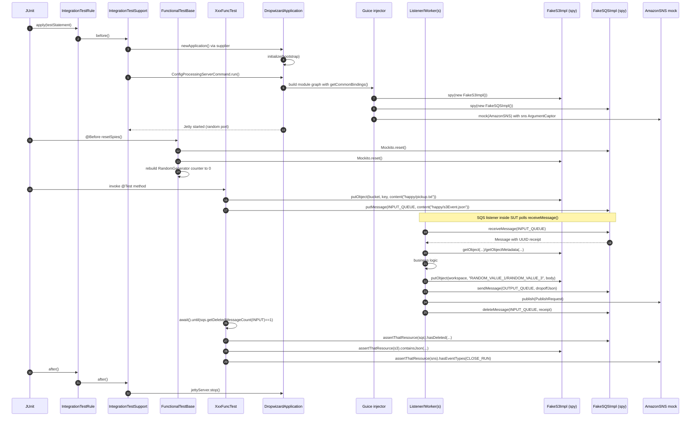

### 6.2 Storage model — FakeS3

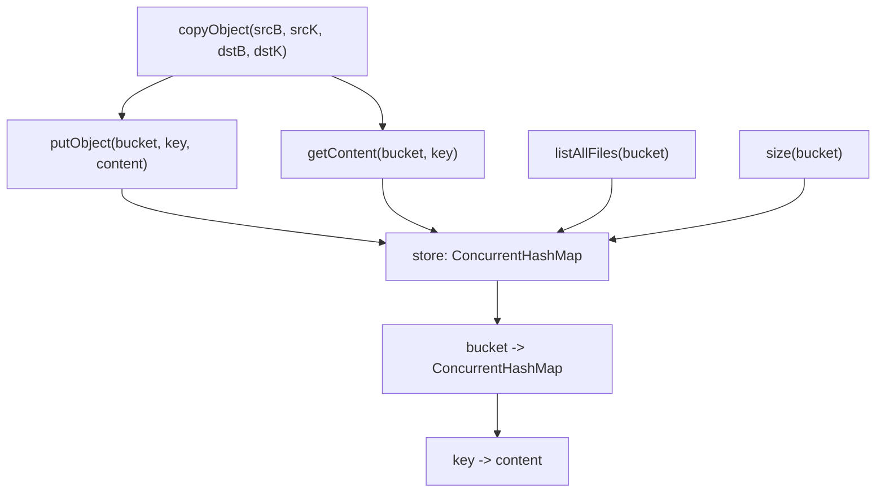

### 6.3 Storage model — FakeSQS

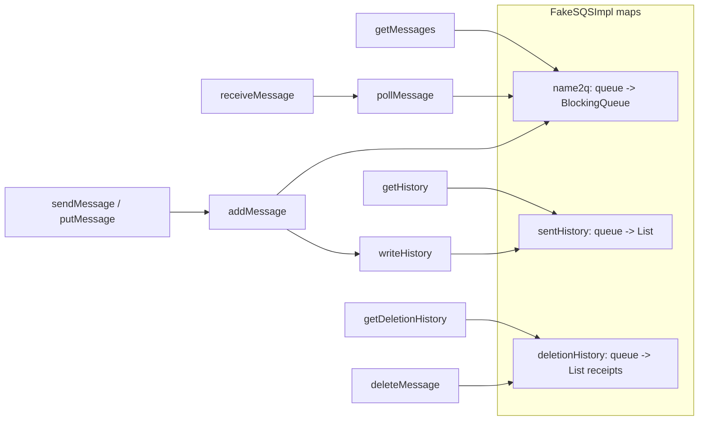

### 6.4 Configuration / startup flow

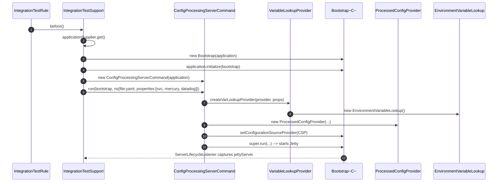

---

## 7. Component Dependencies

### 7.1 Upstream — what this module depends on

| Group | Purpose | Notes |
|---|---|---|
| `com.inttra.mercury.shared:mercury-shared:1.0` | `Json` helper, `Files.resourceAsString`, `Event`, `EventGenerator`, `MetaData`, `RandomGenerator`, `RecoveryConfig`, `ConfigProcessingServerCommand` | Largest single upstream dependency. Any change to these classes ripples across every functional test in every service. |
| `io.dropwizard:dropwizard-testing:4.0.16` | `DropwizardTestSupport`, `ConfigOverride` | The test JVM cycles a real Dropwizard app per test class. |
| `org.mockito:mockito-core:2.8.9` | Spies on `FakeS3Impl` / `FakeSQSImpl`, `ArgumentCaptor` for SNS | Very old version — see Open Questions. |
| `junit:junit:4.13.2` | JUnit 4 `@Rule`, `@Before`, `@Test`, `Timeout` | JUnit 5 migration would be invasive. |
| `org.awaitility:awaitility:3.0.0` | `await().until(...)` polling | Very old version. |
| `org.assertj:assertj-core:3.19.0` | `AbstractAssert`, `isXmlEqualTo`, `isEqualToIgnoringGivenFields` | Note `isEqualToIgnoringGivenFields` was deprecated in newer AssertJ. |
| `commons-io:commons-io:2.5` | `IOUtils.toString` / `readLines` in `FakeS3Impl` | Very old; CVEs against this version exist. |
| `ch.qos.logback:logback-classic:1.5.21` | Slf4j backend | Aligned with shared. |
| `org.slf4j:slf4j-api:2.0.17` | Logging facade | (declared as property; only used transitively) |
| `org.projectlombok:lombok:1.18.32` (`provided`) | `@Slf4j`, `@SneakyThrows` | Provided scope. |
| (transitive) `com.amazonaws:aws-java-sdk-*` | The `Amazon*Adaptor` classes implement these AWS SDK v1 interfaces directly | Bound transitively via `mercury-shared`. |
| (transitive) `com.google.inject:guice` | `AbstractModule`, `Names.named` in `getCommonBindings` | Bound transitively via `mercury-shared`. |
| (transitive) `com.google.guava:guava` | `Uninterruptibles`, `ImmutableMap`, `ByteStreams`, `Throwables.propagate` | Bound transitively. |
| (transitive) `com.fasterxml.jackson.core:jackson-databind` | `TypeReference`, deserialisation of `MetaData` / `Event` | Bound transitively. |

### 7.2 Downstream — who depends on this module

Confirmed by grep of `FunctionalTestBase|IntegrationTestRule|FakeS3|FakeSQS` across the repo (37 hits, dedup by service):

- `cerberus` ([`cerberus/src/test/java/functional/CerberusFunctionalTestBase.java`](../../cerberus/src/test/java/functional/CerberusFunctionalTestBase.java))
- `dispatcher` ([`dispatcher/src/test/java/functional/DispatcherFunctionalTestBase.java`](../../dispatcher/src/test/java/functional/DispatcherFunctionalTestBase.java))
- `distributor` ([`distributor/src/test/java/functional/DistributorFunctionalTestBase.java`](../../distributor/src/test/java/functional/DistributorFunctionalTestBase.java))
- `email-sender` ([`email-sender/src/test/java/functional/EmailSenderFunctionalTestBase.java`](../../email-sender/src/test/java/functional/EmailSenderFunctionalTestBase.java))
- `error-processor` ([`error-processor/src/test/java/functional/ErrorProcessorFunctionalTestBase.java`](../../error-processor/src/test/java/functional/ErrorProcessorFunctionalTestBase.java))
- `event-writer` ([`event-writer/src/test/java/functional/EventWriterFunctionalTestBase.java`](../../event-writer/src/test/java/functional/EventWriterFunctionalTestBase.java))
- `fulfiller` ([`fulfiller/src/test/java/functional/FulfillerFunctionalTestBase.java`](../../fulfiller/src/test/java/functional/FulfillerFunctionalTestBase.java))
- `ingestor` ([`ingestor/src/test/java/functional/IngestorFunctionalTestBase.java`](../../ingestor/src/test/java/functional/IngestorFunctionalTestBase.java))
- `mftdispatcher` ([`mftdispatcher/src/test/java/functional/DispatcherFunctionalTestBase.java`](../../mftdispatcher/src/test/java/functional/DispatcherFunctionalTestBase.java))
- `router` ([`router/src/test/java/functional/RouterFunctionalTestBase.java`](../../router/src/test/java/functional/RouterFunctionalTestBase.java))
- `splitter` ([`splitter/src/test/java/functional/SplitterFunctionalTestBase.java`](../../splitter/src/test/java/functional/SplitterFunctionalTestBase.java))
- `transformer` ([`transformer/src/test/java/functional/TransformerFunctionalTestBase.java`](../../transformer/src/test/java/functional/TransformerFunctionalTestBase.java), plus an outbound variant)
- `validator` ([`validator/src/test/java/functional/ValidatorFunctionalTestBase.java`](../../validator/src/test/java/functional/ValidatorFunctionalTestBase.java))
- `transformer` (load) — `transformer/src/test/java/stress/TransformerStressTest.java` uses `ReadOnlyS3Workspace`/`ReadOnlySQS`.

The reach is **every Mercury pipeline service except `gen2-parser`, `canonical-beans`, `schema-beans`, `watermill*` and `watermill-publisher`** (which either have no functional tests yet or use a different harness in `watermill/.../VisibilityInboundConsumerApplicationTest.java`).

### 7.3 Dependency directionality

```mermaid
flowchart LR
    subgraph upstream[Upstream]
      Shared[mercury-shared]
      DW[dropwizard-testing]
      JUnit[junit 4]
      Mockito
      Awaitility
      AssertJ
      AwsSdk[AWS SDK v1]
    end
    subgraph self[functional-testing module]
      FT[functional-testing-1.0.jar]
    end
    subgraph downstream[Downstream consumers - 13 services]
      Disp[dispatcher]
      Spl[splitter]
      Trans[transformer]
      Val[validator]
      Rout[router]
      Ful[fulfiller]
      Dist[distributor]
      Cer[cerberus]
      ES[email-sender]
      EP[error-processor]
      EW[event-writer]
      Ing[ingestor]
      MFT[mftdispatcher]
    end
    upstream --> self
    self --> downstream
```

---

## 8. Configuration & Validation

The module itself has **no runtime configuration of its own**. It does not read environment variables, system properties, or files. All knobs are either compile-time constants in source or contracts the consuming service supplies through the `IntegrationTestRule` constructor and its `ConfigOverride[]` varargs.

### 8.1 Constants and knobs

| Key | Type | Default | Required | Description | Validation |
|---|---|---|---|---|---|
| `FunctionalTestBase.FIXED_TIME_DATE` | constant | `2007-12-03T23:15:30.00Z` | n/a | Fixed UTC instant for `Clock` injection; deterministic timestamps in golden files | None — hard-coded. Changing breaks every golden file ([FunctionalTestBase.java:36](../src/main/java/com/inttra/mercury/test/FunctionalTestBase.java#L36)) |
| `FunctionalTestBase.globalTimeout` | JUnit `@Rule` | 35 s | n/a | Hard ceiling per `@Test` method | Enforced by JUnit `Timeout`; failure prints stacktrace ([FunctionalTestBase.java:41](../src/main/java/com/inttra/mercury/test/FunctionalTestBase.java#L41)) |
| `FunctionalTestBase.recoveryConfig` | constant | `new RecoveryConfig(true, 5, 10)` | n/a | Recovery enabled, 5 retries, 10s backoff (per shared `RecoveryConfig`) | None ([FunctionalTestBase.java:45](../src/main/java/com/inttra/mercury/test/FunctionalTestBase.java#L45)) |
| `IntegrationTestRule.DEFAULT_TIMEOUT` | constant | `Duration(30, SECONDS)` | n/a | Awaitility default poll wait | Set on `Awaitility.setDefaultTimeout()` in constructor ([IntegrationTestRule.java:25,30](../src/main/java/com/inttra/mercury/test/IntegrationTestRule.java#L25-L30)) |
| `IntegrationTestRule.MERCURY_SERVICES` | constant | `../configuration/dev/network-services.properties` | yes (file must exist) | Path appended to every test's properties list; provides networkservices.* substitutions | Validated by `ConfigProcessingServerCommand` at startup; missing file throws ([IntegrationTestRule.java:21](../src/main/java/com/inttra/mercury/test/IntegrationTestRule.java#L21)) |
| `IntegrationTestRule.DATADOG` | constant | `../configuration/dev/datadog.properties` | yes (file must exist) | Path appended for datadog metrics substitutions | As above ([IntegrationTestRule.java:22](../src/main/java/com/inttra/mercury/test/IntegrationTestRule.java#L22)) |
| `IntegrationTestRule` ctor `yaml` | parameter | n/a | yes | Dropwizard YAML resource path inside SUT jar/classpath | Read by Dropwizard `ResourceConfigurationSourceProvider`; missing throws |
| `IntegrationTestRule` ctor `properties` | parameter | n/a | yes | Per-service properties path (relative to SUT working dir) | Read by `EnvironmentVariableLookup`/`ProcessedConfigProvider`; missing throws |
| `IntegrationTestRule` ctor `overrides` | varargs | empty | no | `ConfigOverride[]` pushed into system properties via `addToSystemProperties` | None |
| `FakeSQSImpl.POLL_INTERVAL_MILLIS` | constant | `1000` | n/a | Long-poll equivalent; affects throughput of `receiveMessage` | Hard-coded ([FakeSQSImpl.java:37](../src/main/java/com/inttra/mercury/test/aws/impl/FakeSQSImpl.java#L37)) |
| `FakeSQSImpl.SQS_HOST` | constant | `http://fakeamazon.com/` | n/a | URL prefix for `createQueue` return value; stripped by `normalizeUrl` | Hard-coded ([FakeSQSImpl.java:38](../src/main/java/com/inttra/mercury/test/aws/impl/FakeSQSImpl.java#L38)) |
| `FakeS3Impl.getObjectMetadata.xlogid` | constant | `123456789` | n/a | Hard-coded user metadata returned on every `getObjectMetadata` call | Hard-coded ([FakeS3Impl.java:138](../src/main/java/com/inttra/mercury/test/aws/impl/FakeS3Impl.java#L138)) |

### 8.2 Validation surface

No `@NotNull`, `@Valid` or Hibernate-Validator annotations are present in this module — it does not own a configuration class. Validation happens at the consumer's level when the SUT's own configuration is parsed by `ConfigProcessingServerCommand`. If any of the consumer-supplied paths (`yaml`, `properties`, `MERCURY_SERVICES`, `DATADOG`) cannot be resolved, the SUT fails fast inside `before()` and the test errors out with the propagated exception ([IntegrationTestSupport.java:64-66](../src/main/java/com/inttra/mercury/test/IntegrationTestSupport.java#L64-L66) — `propagate(e)` from Guava).

### 8.3 Per-consumer test properties (illustrative)

The dispatcher's `test-dispatcher.properties` ([`dispatcher/src/test/resources-functional/conf/test-dispatcher.properties`](../../dispatcher/src/test/resources-functional/conf/test-dispatcher.properties)) shows the shape of these files:

```properties
componentName=dispatcher
dispatcher.sqsDispatcherConfig.queueUrl=dispatcher_pickup
dispatcher.sqsSplitterConfig.queueUrl=dispatcher_dropoff
dispatcher.sqsCESplitterConfig.queueUrl=dispatcher_cedropoff
dispatcher.sqsWebBLPDF.queueUrl=dispatcher_webl_pdf_dropoff
dispatcher.sqsErrorSubscriptionConfig.queueUrl=error_queue
dispatcher.snsEventConfig.topicArn=sns_event_store
dispatcher.s3WorkspaceConfig.bucket=s3-workspace
dispatcher.s3InboundPickupConfig.bucket=s3-inbound-pickup
server.connector.port=0
dispatcher.sqsBKBridge.queueUrl=booking_bridge_inbound
```

Key contracts:

- **`server.connector.port=0`** — Jetty picks a free port. Two functional test classes can run sequentially (or in parallel) without port clashes.
- **Queue URLs are short names** (no `http://fakeamazon.com/` prefix) — `FakeSQSImpl.normalizeUrl` strips the prefix at runtime if the listener constructs the long form, so either spelling works.
- **Bucket names are arbitrary strings** — `FakeS3Impl.store` is a flat map, no DNS-style validation.

---

## 9. Maven Dependencies

Direct dependencies declared in [`pom.xml:26-73`](../pom.xml):

```xml
<dependency>
  <groupId>com.inttra.mercury.shared</groupId>
  <artifactId>mercury-shared</artifactId>
  <version>${mercury.shared.version}</version>
</dependency>
<dependency>
  <groupId>io.dropwizard</groupId>
  <artifactId>dropwizard-testing</artifactId>
  <version>${io.dropwizard.version}</version>
</dependency>
<dependency>
  <groupId>org.mockito</groupId>
  <artifactId>mockito-core</artifactId>
  <version>${mockito.version}</version>
</dependency>
<dependency>
  <groupId>junit</groupId>
  <artifactId>junit</artifactId>
  <version>${junit.version}</version>
</dependency>
<dependency>
  <groupId>org.awaitility</groupId>
  <artifactId>awaitility</artifactId>
  <version>${awaitility.version}</version>
</dependency>
<dependency>
  <groupId>org.projectlombok</groupId>
  <artifactId>lombok</artifactId>
  <version>${lombok-version}</version>
  <scope>provided</scope>
</dependency>
<dependency>
  <groupId>ch.qos.logback</groupId>
  <artifactId>logback-classic</artifactId>
  <version>${logback-classic.version}</version>
</dependency>
<dependency>
  <groupId>commons-io</groupId>
  <artifactId>commons-io</artifactId>
  <version>${commons-io.version}</version>
</dependency>
<dependency>
  <groupId>org.assertj</groupId>
  <artifactId>assertj-core</artifactId>
  <version>${assertj-core.version}</version>
</dependency>
```

Version table (from [`pom.xml:10-24`](../pom.xml#L10-L24)):

| Property | Value | Notes |
|---|---|---|
| `java.version` | 17 | Compiled with maven-compiler-plugin 3.13.0 |
| `mercury.shared.version` | 1.0 | Internal artifact |
| `io.dropwizard.version` | 4.0.16 | Jakarta-EE-aligned line |
| `mockito.version` | 2.8.9 | **Very old** — Mockito 5.x is current |
| `junit.version` | 4.13.2 | JUnit 4 — last 4.x release |
| `lombok-version` | 1.18.32 | Compatible with Java 17 |
| `gson.version` | 2.8.1 | **Declared but unused** in this pom |
| `awaitility.version` | 3.0.0 | **Very old** — 4.x has dropped `Duration` for `java.time.Duration` |
| `commons-io.version` | 2.5 | **Old** — CVE-2024-47554 affects 2.4-2.13.x. 2.5 is vulnerable. |
| `assertj-core.version` | 3.19.0 | Pre-`isEqualToIgnoringGivenFields` removal |
| `logback-classic.version` | 1.5.21 | Modern |
| `slf4j-api.version` | 2.0.17 | Property declared; binding comes transitively |

### 9.1 Effective dependency tree (key transitive arrivals)

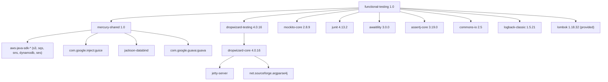

---

## 10. How the Module Works — Detailed Walkthrough

This section traces a single test from JVM startup to assertion in detail, using `DispatcherFuncTest.testHappyFlow` as the worked example.

### 10.1 Static layout the test depends on

- `dispatcher/src/test/resources-functional/happy/pickup-edi.txt` — golden input EDI message
- `dispatcher/src/test/resources-functional/happy/s3Event.json` — synthetic S3 event envelope that triggers the dispatcher
- `dispatcher/src/test/resources-functional/happy/dropoff.json` — golden output `MetaData` envelope on the downstream queue
- `dispatcher/src/test/resources-functional/conf/test-dispatcher.properties` — dispatcher-specific config
- `configuration/dev/network-services.properties`, `configuration/dev/datadog.properties` — shared lookup files

### 10.2 Step-by-step

**(1) Class load & static `@Rule` field instantiation.** JUnit instantiates `DispatcherFuncTest`. The superclass `DispatcherFunctionalTestBase` declares two relevant fields:

- `@Rule public IntegrationTestRule<DispatcherConfiguration> rule = new IntegrationTestRule<>(this, "dispatcher.yaml", "src/test/resources-functional/conf/test-dispatcher.properties");`
- (Inherited from `FunctionalTestBase`) `@Rule public Timeout globalTimeout = Timeout.seconds(35);`

The `IntegrationTestRule` constructor immediately calls `Awaitility.setDefaultTimeout(30s)` and concatenates the properties list to `[test-dispatcher.properties, ../configuration/dev/network-services.properties, ../configuration/dev/datadog.properties]`.

**(2) `IntegrationTestRule.before()` → `IntegrationTestSupport.before()`.** This is where the Dropwizard application is actually instantiated:

```java
application = newApplication();   // calls applicationSupplier.get() == DispatcherFunctionalTestBase.get()
```

`DispatcherFunctionalTestBase.get()` calls `initMocks()` (sets up `IntegrationProfileService` and `IntegrationProfileFormatService` mocks), then builds an anonymous `AbstractModule` which `install(getCommonBindings())` followed by the dispatcher-specific service bindings, then returns `new DispatcherApplication(externalServiceModule)` ([dispatcher/src/test/java/functional/DispatcherFunctionalTestBase.java:36-48](../../dispatcher/src/test/java/functional/DispatcherFunctionalTestBase.java#L36-L48)).

**(3) Guice graph construction.** When `getCommonBindings()` is invoked, this is the moment **`s3` and `sqs` instance fields of `FunctionalTestBase` are populated**:

```java
FakeSQSImpl fakeSQS = spy(new FakeSQSImpl());
FakeS3Impl  fakeS3  = spy(new FakeS3Impl());
s3 = fakeS3;
sqs = fakeSQS;
```
([FunctionalTestBase.java:61-64](../src/main/java/com/inttra/mercury/test/FunctionalTestBase.java#L61-L64))

Note that these are **Mockito spies** wrapping real instances. The `Mockito.spy()` wrap is essential — it lets tests later override individual method behaviours with `doThrow(...).when(sqs).sendMessage(...)` while the un-stubbed methods continue to call the real `FakeSQSImpl` storage code.

The `AmazonSQS` binding is published twice — once for `@Named("amazonSQSForListener")` and once for `@Named("amazonSQSForSender")` — both pointing at the same `fakeSQS` instance. Mercury services typically wire one client for the SQS listener pool (`amazonSQSForListener`) and one for outgoing sends (`amazonSQSForSender`); sharing the instance is harmless because `BlockingQueue` is thread-safe.

**(4) `ConfigProcessingServerCommand.run`.** The command receives a `Namespace` containing `file=dispatcher.yaml`, `properties=[test-dispatcher.properties, ../configuration/dev/network-services.properties, ../configuration/dev/datadog.properties]`. It:

1. Concatenates the three properties files' contents.
2. Builds a `VariableLookupProvider(rawProperties, EnvironmentVariableLookup)` — this allows `${queue.name}` style substitutions in the YAML to be resolved from both env vars and the merged properties.
3. Replaces the bootstrap's `ConfigurationSourceProvider` with a `ProcessedConfigProvider(ResourceConfigurationSourceProvider, lookup)` so the YAML is post-processed on load.
4. Calls `super.run(bootstrap, namespace)` which is Dropwizard's stock `ServerCommand.run` — this parses the YAML, validates it, builds the `Environment`, runs `Application.run(config, env)`, and starts Jetty.

**(5) Jetty server lifecycle hook.** Inside the custom `Bootstrap<C>` overridden `run` method, the inline `ServerLifecycleListener` captures the started `Server` into `IntegrationTestSupport.jettyServer`. This single field is the linchpin that allows `after()` to call `jettyServer.stop()` without leaking threads between tests.

**(6) Application starts polling SQS.** The dispatcher's listener thread starts polling `FakeSQS.receiveMessage("dispatcher_pickup")` — the `FakeSQSImpl.pollMessage` blocks on a `BlockingQueue<Message>` for up to 1 second per call, returning `null` if the queue is empty. The listener loops indefinitely.

**(7) `@Before resetSpies()`.** Right before the `@Test` method body runs, `FunctionalTestBase.resetSpies()` resets the Mockito verification state on both fakes and re-mocks the `RandomGenerator`'s counters back to zero. Importantly, **the underlying ConcurrentHashMaps are not cleared** — they survive between tests on the same instance. (This is only a problem if a single test class enables stateful interdependence across tests; in practice each test seeds the buckets/queues it needs.)

**(8) Test body — seed.** `s3.putObject(S3_INBOUND_PICKUP, S3_INBOUND_FILE, content("happy/pickup-edi.txt"))` calls `TestDSL.content` → `Files.resourceAsString` → loads `dispatcher/src/test/resources/happy/pickup-edi.txt`, then writes it to `FakeS3Impl.store["s3-inbound-pickup"]["323_IFTSAI/20180302/customers/CU2000/pickup-edi.txt"]`. `sqs.putMessage(INPUT_QUEUE, content("happy/s3Event.json"))` enqueues the S3 event onto `FakeSQSImpl.name2q["dispatcher_pickup"]` and returns a UUID receipt handle.

**(9) Polling listener picks up the message.** Within at most 1 second, the dispatcher's listener thread `receiveMessage("dispatcher_pickup")` returns the seeded message. The listener parses it, looks at the S3 key, calls `getObjectMetadata` (which returns `xlogid=123456789` from the hard-coded fake), calls `getObject` to fetch the EDI payload, runs the dispatcher business logic, writes the body to `s3-workspace/RANDOM_VALUE_1/RANDOM_VALUE_3` (because `RandomGenerator.randomUUID()` is mocked to a deterministic counter), sends the dropoff `MetaData` to `dispatcher_dropoff`, publishes a `CLOSE_RUN` event via `AmazonSNS.publish` (captured by the `ArgumentCaptor`), and finally calls `deleteMessage("dispatcher_pickup", <receipt>)` which appends to `FakeSQSImpl.deletionHistory`.

**(10) Test body — await.** `await().until(() -> sqs.getDeletedMessageCount(INPUT_QUEUE) == 1)` polls Awaitility for up to 30 seconds. Once the listener has ACK'd the message, this returns.

**(11) Test body — assert.**

```java
assertThatResource(sqs).hasEmpty(ERROR_QUEUE);
assertThatResource(sqs).hasDeleted(INPUT_QUEUE, receiptHandleId);
assertDropOffMetaDataMatches(content("happy/dropoff.json"));
// listAllFiles asserts on the deterministic random-generated S3 key
assertThat(fileNames).contains("RANDOM_VALUE_1/RANDOM_VALUE_3").hasSize(1);
assertThatResource(sns).hasEventTypes(EventGenerator.CLOSE_RUN);
```

Each call routes through `ResourceAssertions.assertThatResource(...)` overload selection by the captured argument's type. `SnsAssert.hasEventTypes` parses every captured `PublishRequest.getMessage()` as a JSON array of `Event`, flattens them, and compares the type list to the expected list using AssertJ's `containsExactlyInAnyOrder`.

**(12) Teardown.** JUnit invokes `IntegrationTestRule.after()` → `IntegrationTestSupport.after()` → `jettyServer.stop()`. The next test's `@Before` will re-spawn the application from scratch (because the rule's `before()` is invoked again).

### 10.3 Fault-injection idiom

A common pattern in the consumer tests is to use Mockito's `doThrow` chain on the spy to simulate AWS faults. From [`DispatcherFuncTest.testReprocessingMessageAfterFailure`](../../dispatcher/src/test/java/functional/DispatcherFuncTest.java#L100-L130):

```java
AmazonServiceException internalAwsError = new AmazonServiceException("Unable to process HTTP request");
internalAwsError.setStatusCode(500);
doThrow(internalAwsError, internalAwsError, internalAwsError)
    .doCallRealMethod()
    .when((FakeSQSImpl) sqs).sendMessage(any(SendMessageRequest.class));
```

The downcast to `FakeSQSImpl` is required because Mockito's `doThrow().when(...)` needs the concrete class (not the `FakeSQS` interface). The `RecoveryConfig(true, 5, 10)` baked into `FunctionalTestBase` aligns with this — the SUT will retry up to 5 times after a 10-second backoff before giving up; the test sets up three failures followed by `doCallRealMethod` so the fourth call succeeds, asserting the recovery path works.

### 10.4 Read-only doubles in load tests

In `transformer/src/test/java/stress/TransformerStressTest.java`, the `ReadOnlyS3Workspace` and `ReadOnlySQS` are used instead. The stress test pre-builds a `Map<String, Message[]>` of input messages and a `Map<String, String>` of source file content, then runs the transformer continuously against these immutable sources. Because neither double allocates per operation, the JVM heap is constant — the stress test can run for hours measuring GC pressure of the SUT alone, not the harness.

---

## 11. Test Categories & Coverage

The module itself contains **no test scenarios** — it only contains the framework. Coverage in the sense of "what scenarios use the framework" is owned by the 13 consuming services. The categories observed are:

### 11.1 Smoke / happy-path

Every consuming service has at least one `testHappyFlow` style test that seeds a single canonical input and verifies the full producer → consumer hand-off. Example: `DispatcherFuncTest.testHappyFlow` at [dispatcher/.../DispatcherFuncTest.java:31-50](../../dispatcher/src/test/java/functional/DispatcherFuncTest.java#L31-L50).

### 11.2 Error / negative

Each service has at least one `testErrorFlow` that seeds malformed input and verifies the error_queue receives the rejected `MetaData` with the right annotation, plus an error file in the S3 workspace. Example: [dispatcher/.../DispatcherFuncTest.java:68-93](../../dispatcher/src/test/java/functional/DispatcherFuncTest.java#L68-L93).

### 11.3 Recovery / retry

Tests like `testReprocessingMessageAfterFailure` use Mockito's `doThrow` on the spy to simulate intermittent AWS faults and assert the SUT's retry logic eventually succeeds. The `RecoveryConfig` injected in the base class controls the retry budget.

### 11.4 Booking-bridge / variant flows

For the dispatcher and friends, alternate input shapes (e.g. EDIFACT booking requests, web-BL PDF requests) trigger different routing paths and produce different SNS event sequences. Example: [dispatcher/.../DispatcherFuncTest.java:52-66](../../dispatcher/src/test/java/functional/DispatcherFuncTest.java#L52-L66).

### 11.5 Integration with mocked REST services

Services that consume `mercury-shared`'s `IntegrationProfileService`/`IntegrationProfileFormatService`/`FormatService` HTTP clients mock those services in their respective `*FunctionalTestBase.get()` factories — see [DistributorFunctionalTestBase.java:35-94](../../distributor/src/test/java/functional/DistributorFunctionalTestBase.java#L35-L94). The functional-testing module doesn't provide REST mocks itself; consumers wire their own Mockito mocks into Guice.

### 11.6 Cross-service contract via golden files

The implicit "contract" coverage emerges from the fact that producer-side `dropoff.json` fixtures in service *n*'s tests are structurally identical to consumer-side `pickup.json` fixtures in service *n+1*'s tests. Because both sides are committed to git and exercised by `mvn test`, a change to the `MetaData` envelope or to any service's hand-off shape causes both sides' tests to fail until both are updated in lock-step.

### 11.7 What is NOT covered by this framework

- **Cross-service orchestration in a single JVM.** No test starts more than one Dropwizard application at once.
- **Real AWS / LocalStack.** No `testcontainers`, no `LocalStackContainer`, no `aws-cli` calls. The Fakes are the entirety of the AWS surface.
- **HTTP behaviour from outside the JVM.** Tests do not hit the Jetty connector via HTTP. The Jetty server is started (because Dropwizard's `Application.run` starts it) but no test asserts on its REST endpoints.
- **Schema migration / DynamoDB GSI behaviour.** `FakeDynamoDBImpl` is a flat `Map<String, List<String>>` keyed only on `eventId` — there's no support for arbitrary attributes, indexes, queries by predicate, or conditional writes.
- **SQS visibility timeouts / DLQ semantics.** `FakeSQSImpl.deleteMessage` simply records the receipt; there is no actual "in-flight" state, no visibility timeout, no DLQ handoff.
- **SNS-to-SQS fan-out.** `AmazonSNS` is a pure Mockito mock; published messages go into the `ArgumentCaptor` but are not re-injected into any `FakeSQS` subscription.

### 11.8 BDD / Cucumber

Despite the module's name suggesting "functional testing", there is **no Cucumber, no Karate, no Gherkin, no REST-assured**. The framework is straight JUnit 4 + AssertJ + Awaitility. The "DSL" is the `assertThatResource(...)` static factory and the `TestDSL` helpers, not feature files.

---

## 12. Operational Notes

### 12.1 Running locally

The functional tests for any given service are invoked through Maven Surefire:

```bash
# From the service's directory, e.g. dispatcher/
mvn -pl dispatcher test
# To run only functional tests (depends on Surefire <include> patterns; in Mercury they live in src/test/java/functional/)
mvn -pl dispatcher test -Dtest='functional.*'
```

Because each consuming service depends on `functional-testing:1.0`, the harness JAR must be installed first:

```bash
mvn -pl shared,functional-testing install
mvn -pl dispatcher test
```

The Mercury reactor `pom.xml` at the repo root handles transitive build ordering when running `mvn install` from the top level.

### 12.2 Running in CI

The CI pipeline runs `mvn test` per module. Because every functional test is single-JVM and uses only in-memory fakes, there are **no external dependencies** (no Docker, no LocalStack, no Postgres). This is the framework's single biggest operational virtue: tests run on any laptop or build agent with Java 17 in under a minute per service.

CI parallelism considerations:

- Surefire by default uses `forkCount=1, reuseForks=true` — one JVM per Maven module. Tests within a module run serially in that JVM.
- `server.connector.port=0` ensures multiple modules can run in parallel across forks without port clashes.
- The 30-second Awaitility default + 35-second JUnit Timeout means a hung test fails within 35s — CI-friendly.

### 12.3 Parameterization

Per-test parameterization is achieved through:

1. **Different YAML files.** The `IntegrationTestRule` constructor takes the YAML name — different test classes can boot different YAML configs.
2. **Different properties files.** Same as above, the properties argument.
3. **`ConfigOverride[]` varargs.** For ad-hoc per-test overrides without committing a new properties file, `new ConfigOverride("dispatcher.foo", "bar")` is pushed into system properties; Dropwizard's config loader picks it up.
4. **Mockito stubbing in `get()`.** Each `*FunctionalTestBase.get()` is free to construct different mocks per test class (typically via JUnit's per-class instantiation guarantees).

There is **no support for `@Parameterized` JUnit runners** in this harness — adding one would require careful coordination with the `@Rule` lifecycle.

### 12.4 Debugging tips

- `FakeS3Impl.getContent` throws a `RuntimeException` listing every (bucket, key) pair on miss — extremely useful when a test fails with `Cannot find bucket: …`. ([FakeS3Impl.java:112-117](../src/main/java/com/inttra/mercury/test/aws/impl/FakeS3Impl.java#L112-L117))
- `FakeSQSImpl.addMessage` and `FakeS3Impl.putObject` log the content of every message/file at INFO via Slf4j ([FakeSQSImpl.java:60](../src/main/java/com/inttra/mercury/test/aws/impl/FakeSQSImpl.java#L60), [FakeS3Impl.java:54](../src/main/java/com/inttra/mercury/test/aws/impl/FakeS3Impl.java#L54)). This is invaluable when reading test logs.
- `SnsAssert.hasExactlyEvents`'s `prettifyOutput` falls back to a side-by-side JSON diff when the in-order comparison fails — the diff in the test report shows full JSON of both lists.
- The fixed clock at `2007-12-03T23:15:30.00Z` means production-side timestamp formatting bugs reproduce identically every run. If you see a timestamp that *isn't* this value in a failure, the SUT is reading `System.currentTimeMillis()` or `Instant.now()` directly instead of the injected `Clock` — that is a latent bug.

### 12.5 Known limitations

- The `FakeS3Impl.putObject(PutObjectRequest)` overload collapses newlines because of `IOUtils.readLines(...).stream().collect(joining())` with no separator ([FakeS3Impl.java:86](../src/main/java/com/inttra/mercury/test/aws/impl/FakeS3Impl.java#L86)). Tests that compare multi-line content put via this overload may produce spurious failures. The `(String, String, String)` overload does not have this problem.
- `FakeSESImpl.sendEmail` only indexes by the **first** to-address. A multi-recipient send is only inspectable for one recipient.
- `FakeDynamoDBImpl` only supports a single-column schema with `eventId` as the value. Any other DynamoDB usage will not work.
- `FunctionalTestBase.resetSpies` does not clear the underlying ConcurrentHashMaps. If two tests in the same class use the same queue/bucket without first checking emptiness, leftover state from test *n* may affect test *n+1*. Best practice: every test uniquely names its inputs or asserts emptiness at the start.

---

## 13. Open Questions / Risks

### 13.1 Dependency staleness

| Dep | Current | Risk |
|---|---|---|
| `mockito-core 2.8.9` | Released 2017 | Predates Mockito's support for Java 11+ inline mock maker; spies on final classes may behave erratically. Mockito 5.x is the current line for Java 17. |
| `awaitility 3.0.0` | Released 2017 | The library has changed package layout (`org.awaitility.Duration` is removed in 4.x in favour of `java.time.Duration`). Migrating will require source changes in `IntegrationTestRule` ([line 25-30](../src/main/java/com/inttra/mercury/test/IntegrationTestRule.java#L25-L30)). |
| `commons-io 2.5` | Released 2016 | Affected by CVE-2024-47554 (uncontrolled resource consumption). Upgrade to 2.14+ is straightforward — only `IOUtils.toString` / `IOUtils.readLines` are used. |
| `assertj-core 3.19.0` | Released 2021 | `isEqualToIgnoringGivenFields(...)` used in `MetaDataUtil` and `DispatcherFuncTest` was deprecated in AssertJ 3.13 and removed in 4.x. A migration to `usingRecursiveComparison().ignoringFields(...)` is required before any 4.x upgrade. |
| `junit 4.13.2` | Last 4.x release | JUnit 5 migration requires rewriting `@Rule` / `ExternalResource` to `@RegisterExtension`. The blast radius is **every** consuming service. |
| `gson 2.8.1` | Declared but unused | The property is defined in [`pom.xml:17`](../pom.xml#L17) but no `<dependency>` references it. Should be removed. |

### 13.2 Correctness footguns

- **Spy reset does not clear storage.** As noted in §12.5, the underlying maps in `FakeS3Impl` and `FakeSQSImpl` persist between tests in the same class. Adding `s3.clear()`/`sqs.clear()` hooks in `@Before` would be a quick win.
- **`FakeS3Impl.putObject(PutObjectRequest)` newline-collapse bug.** Real S3 preserves bytes verbatim; the harness silently drops `\n`. The fix is `.collect(Collectors.joining("\n"))` or better, switch to `IOUtils.toString(InputStream, Charset)`.
- **`FakeSQSImpl.deleteMessage(String, String)` is missing.** Only the request-based overload is implemented. If any SUT calls the string overload it will hit the no-op `AmazonSQSAdaptor.deleteMessage(String, String)` and the receipt will not be recorded — the test will time out waiting for `getDeletedMessageCount` to advance, with no obvious indication why. A search of Mercury production code confirms only the request-based overload is used today, but this is fragile.
- **`AmazonSNS` is a pure Mockito mock, not a Fake.** This is inconsistent with the S3/SQS/Dynamo/SES surfaces. There is no SNS→SQS fan-out simulation, so any service that exercises that pathway (e.g. `event-writer`'s consumption of the SNS event bus) needs ad-hoc bridging in its own functional test base.
- **`createSnsMock` returns `null` for every `publish` call** ([FunctionalTestBase.java:88](../src/main/java/com/inttra/mercury/test/FunctionalTestBase.java#L88)). Production code that reads the `PublishResult.messageId` from the return value will NPE in tests but not in prod.

### 13.3 Test-style risks

- **No assertion on Jetty REST endpoints.** Every consuming service's `Application` exposes admin endpoints, healthchecks, possibly REST resources. None are exercised here. A 404 on `/healthcheck` would not be caught by any of the 13 services' functional tests.
- **No coverage of LocalStack-only behaviours** such as S3 list pagination, SQS long-polling timeouts, or DynamoDB GSI query planning. If the production code starts relying on any of these, the harness will diverge silently from real AWS.
- **Fixed-clock + fixed-random => brittle golden files.** Tests assert on `RANDOM_VALUE_1/RANDOM_VALUE_3` style paths. Any internal refactor that changes the *order* in which production code calls `randomGenerator.randomUUID()` will shift those literals and require updating every golden file — even though the behaviour is correct. This is a maintenance tax.
- **No parallelism.** Two tests in the same class cannot run in parallel because they share the same `s3`/`sqs` instance fields. JUnit's `@ParallelComputer` is incompatible.

### 13.4 Architectural questions

- Should the harness ship a **`@RunWith(MercuryFunctionalRunner.class)`** that bundles the rule, the `@Before reset`, and the `@Rule Timeout` together so consumers don't have to wire three things by hand? Today each `*FunctionalTestBase` reproduces the same boilerplate (Application supplier + @Rule + initMocks).
- Should the harness provide a **`FakeSNS`** that publishes into a per-topic in-memory list and (optionally) bridges into named `FakeSQS` queues, matching real SNS→SQS fan-out? This would close the biggest gap relative to real AWS.
- Should `FakeDynamoDBImpl` be widened to a real key-value attribute store (à la `Map<String, Map<String, AttributeValue>>`) so it can support more than just the de-duplication path?
- Should the read-only doubles be promoted to a sibling package `com.inttra.mercury.test.loadaws` to make the split explicit?
- Why is `gson` declared as a property if not used? Vestigial — should be removed.
- The `IntegrationTestRule.MERCURY_SERVICES` / `DATADOG` constants hard-code `../configuration/dev/...`. This implies the consumer must run Maven from the service's own directory and have the `configuration` repo cloned at a fixed relative path. If a consumer ever needs to test against int / qa / prod configuration files, there is currently no clean override.

### 13.5 Migration path forward

If/when the module is overhauled, the recommended sequence is:

1. **Upgrade commons-io to 2.14+ and Mockito to 5.x.** Lowest blast radius, biggest CVE win.
2. **Fix `FakeS3Impl.putObject(PutObjectRequest)` newline-collapse bug.** Minor, but eliminates a class of confusing failures.
3. **Add `FakeS3.clear()` / `FakeSQS.clear()` and call them from `@Before resetSpies`.** Or rebuild fresh instances per test (matches the Jetty lifecycle).
4. **Implement `FakeSNS`.** Pure in-memory, supports the SNS→SQS bridge for the events bus.
5. **Migrate AssertJ to 3.27+** before any further dependency uplift; rewrite `isEqualToIgnoringGivenFields` callers.
6. **Migrate to JUnit 5** — coordinate across all 13 consumers in a single feature branch.
7. **Optional: expose a `@MercuryFunctionalTest` annotation / runner** for consumers, to remove the rule-boilerplate.

---

## Appendix A — Inventory

### A.1 Files (24 total under `src/main/java`)

```
src/main/java/com/inttra/mercury/test/
├── FunctionalTestBase.java
├── IntegrationTestRule.java
├── IntegrationTestSupport.java
├── assertions/
│   ├── DynamoDBAssert.java
│   ├── ResourceAssertions.java
│   ├── S3Assert.java
│   ├── SnsAssert.java
│   └── SqsAssert.java
├── aws/
│   ├── AmazonDynamoDBAdaptor.java
│   ├── AmazonS3Adaptor.java
│   ├── AmazonSESAdaptor.java
│   ├── AmazonSQSAdaptor.java
│   ├── FakeDynamoDB.java
│   ├── FakeS3.java
│   ├── FakeSES.java
│   ├── FakeSQS.java
│   └── impl/
│       ├── FakeDynamoDBImpl.java
│       ├── FakeS3Impl.java
│       ├── FakeSESImpl.java
│       ├── FakeSQSImpl.java
│       ├── ReadOnlyS3Workspace.java
│       └── ReadOnlySQS.java
└── util/
    ├── MetaDataUtil.java
    └── TestDSL.java
```

There are no `src/test/`, no `src/main/resources/`, no `conf/` directories in this module.

### A.2 Known consumer test bases

| Service | Functional test base |
|---|---|
| cerberus | [`cerberus/src/test/java/functional/CerberusFunctionalTestBase.java`](../../cerberus/src/test/java/functional/CerberusFunctionalTestBase.java) |
| dispatcher | [`dispatcher/src/test/java/functional/DispatcherFunctionalTestBase.java`](../../dispatcher/src/test/java/functional/DispatcherFunctionalTestBase.java) |
| distributor | [`distributor/src/test/java/functional/DistributorFunctionalTestBase.java`](../../distributor/src/test/java/functional/DistributorFunctionalTestBase.java) |
| email-sender | [`email-sender/src/test/java/functional/EmailSenderFunctionalTestBase.java`](../../email-sender/src/test/java/functional/EmailSenderFunctionalTestBase.java) |
| error-processor | [`error-processor/src/test/java/functional/ErrorProcessorFunctionalTestBase.java`](../../error-processor/src/test/java/functional/ErrorProcessorFunctionalTestBase.java) |
| event-writer | [`event-writer/src/test/java/functional/EventWriterFunctionalTestBase.java`](../../event-writer/src/test/java/functional/EventWriterFunctionalTestBase.java) |
| fulfiller | [`fulfiller/src/test/java/functional/FulfillerFunctionalTestBase.java`](../../fulfiller/src/test/java/functional/FulfillerFunctionalTestBase.java) |
| ingestor | [`ingestor/src/test/java/functional/IngestorFunctionalTestBase.java`](../../ingestor/src/test/java/functional/IngestorFunctionalTestBase.java) |
| mftdispatcher | [`mftdispatcher/src/test/java/functional/DispatcherFunctionalTestBase.java`](../../mftdispatcher/src/test/java/functional/DispatcherFunctionalTestBase.java) |
| router | [`router/src/test/java/functional/RouterFunctionalTestBase.java`](../../router/src/test/java/functional/RouterFunctionalTestBase.java) |
| splitter | [`splitter/src/test/java/functional/SplitterFunctionalTestBase.java`](../../splitter/src/test/java/functional/SplitterFunctionalTestBase.java) |
| transformer (inbound + outbound) | [`transformer/src/test/java/functional/TransformerFunctionalTestBase.java`](../../transformer/src/test/java/functional/TransformerFunctionalTestBase.java), [`transformer/src/test/java/functional/outbound/OutboundTransformationTestBase.java`](../../transformer/src/test/java/functional/outbound/OutboundTransformationTestBase.java) |
| validator | [`validator/src/test/java/functional/ValidatorFunctionalTestBase.java`](../../validator/src/test/java/functional/ValidatorFunctionalTestBase.java) |
| transformer (stress) | [`transformer/src/test/java/stress/TransformerStressTest.java`](../../transformer/src/test/java/stress/TransformerStressTest.java) — uses `ReadOnlyS3Workspace`/`ReadOnlySQS` |

### A.3 Glossary

- **SUT** — System Under Test. Within this module's context, the Dropwizard application instance booted by `IntegrationTestSupport`.
- **Fake** — In the test-doubles taxonomy (Meszaros), a Fake is a working implementation with the same contract as the real component but unsuitable for production (e.g. in-memory storage). The `Fake*Impl` classes here are textbook fakes.
- **Spy** — A Mockito spy wraps a real instance and forwards all calls to it by default; selected methods can be overridden via `doAnswer`/`doThrow`/`doReturn`.
- **Adaptor** — In this module, an empty/no-op implementation of a wide AWS SDK interface, intended to be subclassed. Not to be confused with the Adapter design pattern (which translates between two interfaces).
- **Golden file** — A committed fixture file (typically JSON or XML) whose content is the canonical expected output of a stage. Tests compare actual output against golden files using `isEqualTo` (with non-deterministic fields ignored).
- **MetaData** — Mercury's shared envelope class (`com.inttra.mercury.shared.task.MetaData`) that carries a message between pipeline stages on SQS. Most assertions in this harness ultimately compare two `MetaData` instances.

### A.4 Citations index

The following file:line citations underpin this document:

- `pom.xml` — module GAV at [line 4-8](../pom.xml#L4-L8), Java 17 at [line 11](../pom.xml#L11), dependency block at [lines 26-73](../pom.xml#L26-L73).
- `FunctionalTestBase.java` — fixed clock [L36](../src/main/java/com/inttra/mercury/test/FunctionalTestBase.java#L36), timeout [L41](../src/main/java/com/inttra/mercury/test/FunctionalTestBase.java#L41), recovery config [L45](../src/main/java/com/inttra/mercury/test/FunctionalTestBase.java#L45), reset hook [L47-L55](../src/main/java/com/inttra/mercury/test/FunctionalTestBase.java#L47-L55), Guice bindings [L57-L75](../src/main/java/com/inttra/mercury/test/FunctionalTestBase.java#L57-L75), random generator mock [L77-L84](../src/main/java/com/inttra/mercury/test/FunctionalTestBase.java#L77-L84), SNS mock [L86-L90](../src/main/java/com/inttra/mercury/test/FunctionalTestBase.java#L86-L90).
- `IntegrationTestRule.java` — config path constants [L21-L22](../src/main/java/com/inttra/mercury/test/IntegrationTestRule.java#L21-L22), default timeout [L25](../src/main/java/com/inttra/mercury/test/IntegrationTestRule.java#L25), constructor [L27-L34](../src/main/java/com/inttra/mercury/test/IntegrationTestRule.java#L27-L34).
- `IntegrationTestSupport.java` — cmdParams shape [L28-L31](../src/main/java/com/inttra/mercury/test/IntegrationTestSupport.java#L28-L31), before() override [L40-L67](../src/main/java/com/inttra/mercury/test/IntegrationTestSupport.java#L40-L67), after() [L69-L80](../src/main/java/com/inttra/mercury/test/IntegrationTestSupport.java#L69-L80).
- `FakeS3Impl.java` — storage [L34](../src/main/java/com/inttra/mercury/test/aws/impl/FakeS3Impl.java#L34), copyObject [L37-L50](../src/main/java/com/inttra/mercury/test/aws/impl/FakeS3Impl.java#L37-L50), putObject overloads [L52-L95](../src/main/java/com/inttra/mercury/test/aws/impl/FakeS3Impl.java#L52-L95), getContent [L104-L118](../src/main/java/com/inttra/mercury/test/aws/impl/FakeS3Impl.java#L104-L118), hard-coded xlogid [L138](../src/main/java/com/inttra/mercury/test/aws/impl/FakeS3Impl.java#L138).
- `FakeSQSImpl.java` — constants [L37-L38](../src/main/java/com/inttra/mercury/test/aws/impl/FakeSQSImpl.java#L37-L38), maps [L39-L41](../src/main/java/com/inttra/mercury/test/aws/impl/FakeSQSImpl.java#L39-L41), pollMessage [L43-L56](../src/main/java/com/inttra/mercury/test/aws/impl/FakeSQSImpl.java#L43-L56), addMessage [L58-L72](../src/main/java/com/inttra/mercury/test/aws/impl/FakeSQSImpl.java#L58-L72), deleteMessage [L110-L121](../src/main/java/com/inttra/mercury/test/aws/impl/FakeSQSImpl.java#L110-L121), putMessage [L123-L126](../src/main/java/com/inttra/mercury/test/aws/impl/FakeSQSImpl.java#L123-L126), typed getMessages [L154-L164](../src/main/java/com/inttra/mercury/test/aws/impl/FakeSQSImpl.java#L154-L164), normalizeUrl [L192-L194](../src/main/java/com/inttra/mercury/test/aws/impl/FakeSQSImpl.java#L192-L194).
- `FakeDynamoDBImpl.java` — single-column storage [L16](../src/main/java/com/inttra/mercury/test/aws/impl/FakeDynamoDBImpl.java#L16), putItem [L18-L23](../src/main/java/com/inttra/mercury/test/aws/impl/FakeDynamoDBImpl.java#L18-L23), table-missing exception [L40-L44](../src/main/java/com/inttra/mercury/test/aws/impl/FakeDynamoDBImpl.java#L40-L44).
- `FakeSESImpl.java` — first-recipient bucketing [L18-L24](../src/main/java/com/inttra/mercury/test/aws/impl/FakeSESImpl.java#L18-L24).
- `ReadOnlyS3Workspace.java` — flat map keyed by "bucket/file" [L14-L27](../src/main/java/com/inttra/mercury/test/aws/impl/ReadOnlyS3Workspace.java#L14-L27).
- `ReadOnlySQS.java` — slice-based receiveMessage [L37-L43](../src/main/java/com/inttra/mercury/test/aws/impl/ReadOnlySQS.java#L37-L43), forbidden overload [L45-L48](../src/main/java/com/inttra/mercury/test/aws/impl/ReadOnlySQS.java#L45-L48).
- `ResourceAssertions.java` — 4 overloads of `assertThatResource` [L11-L25](../src/main/java/com/inttra/mercury/test/assertions/ResourceAssertions.java#L11-L25).
- `S3Assert.java` — containsXml [L15-L19](../src/main/java/com/inttra/mercury/test/assertions/S3Assert.java#L15-L19), containsJson with prettify [L38-L45](../src/main/java/com/inttra/mercury/test/assertions/S3Assert.java#L38-L45).
- `SqsAssert.java` — hasQueueWithMetaData [L24-L44](../src/main/java/com/inttra/mercury/test/assertions/SqsAssert.java#L24-L44), hasDeleted [L51-L65](../src/main/java/com/inttra/mercury/test/assertions/SqsAssert.java#L51-L65).
- `SnsAssert.java` — hasEventTypes [L33-L44](../src/main/java/com/inttra/mercury/test/assertions/SnsAssert.java#L33-L44), hasExactlyEvents [L46-L65](../src/main/java/com/inttra/mercury/test/assertions/SnsAssert.java#L46-L65), ignoreNonMockedValues [L76-L89](../src/main/java/com/inttra/mercury/test/assertions/SnsAssert.java#L76-L89).
- `DynamoDBAssert.java` — hasTableWithSize [L18-L21](../src/main/java/com/inttra/mercury/test/assertions/DynamoDBAssert.java#L18-L21), doesNotHaveTable [L29-L34](../src/main/java/com/inttra/mercury/test/assertions/DynamoDBAssert.java#L29-L34).
- `TestDSL.java` — content() [L16-L18](../src/main/java/com/inttra/mercury/test/util/TestDSL.java#L16-L18), prettify [L20-L23](../src/main/java/com/inttra/mercury/test/util/TestDSL.java#L20-L23), snsEvents [L25-L32](../src/main/java/com/inttra/mercury/test/util/TestDSL.java#L25-L32).
- `MetaDataUtil.java` — ignored fields [L13-L14](../src/main/java/com/inttra/mercury/test/util/MetaDataUtil.java#L13-L14).
- Shared dependency `ConfigProcessingServerCommand.java` — variable resolution [L67-L86](../../shared/src/main/java/com/inttra/mercury/shared/command/ConfigProcessingServerCommand.java#L67-L86).
- Consumer example `DispatcherFunctionalTestBase.java` — Guice override pattern [L36-L48](../../dispatcher/src/test/java/functional/DispatcherFunctionalTestBase.java#L36-L48).
- Consumer example `DispatcherFuncTest.java` — happy flow [L31-L50](../../dispatcher/src/test/java/functional/DispatcherFuncTest.java#L31-L50), error flow [L68-L93](../../dispatcher/src/test/java/functional/DispatcherFuncTest.java#L68-L93), fault-injection [L96-L130](../../dispatcher/src/test/java/functional/DispatcherFuncTest.java#L96-L130).
- `configuration/dev/network-services.properties` — shared service substitutions referenced by every test.
- `dispatcher/src/test/resources-functional/conf/test-dispatcher.properties` — shape of a service-specific test properties file.

---

*End of document.*
